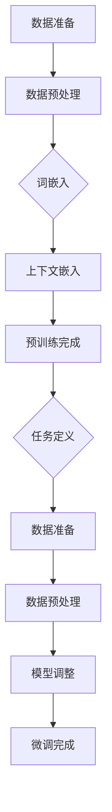
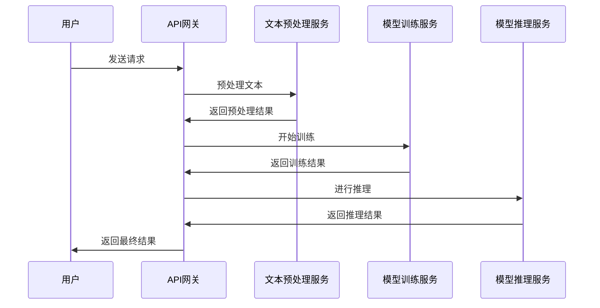

                 

### 概述与目标

《LLM应用开发中的持续优化策略》旨在为开发者提供一套系统化的方法和最佳实践，以指导他们在大型语言模型（LLM）应用开发过程中进行有效的持续优化。随着人工智能技术的快速发展和应用场景的多样化，LLM已经成为提高自然语言处理（NLP）任务性能的关键工具。然而，如何在实际应用中不断优化LLM模型，提升其性能和效率，是一个具有挑战性的问题。

本书将详细探讨LLM应用开发中的持续优化策略，包括：

1. **背景介绍**：介绍LLM的基本概念、发展历程及其在各个领域的应用。
2. **核心概念与联系**：分析LLM的关键组成部分，包括模型架构、数据集、训练策略等，并通过表格和图示展示各部分之间的关系。
3. **算法原理讲解**：深入解析LLM的训练和优化算法，使用Mermaid流程图和Python代码进行阐述，并结合实际案例说明。
4. **数学模型和公式**：介绍LLM训练过程中涉及的数学模型和公式，并以latex格式呈现，确保清晰易懂。
5. **系统分析与架构设计**：探讨LLM应用系统的设计原则和架构，使用Mermaid类图和序列图展示系统组件及其交互关系。
6. **项目实战**：通过实际案例展示如何应用持续优化策略，包括环境安装、代码实现、应用解读与分析等。
7. **最佳实践 tips**：提供实用的优化建议和技巧，帮助开发者在实际开发中提高LLM应用的性能。
8. **小结与拓展阅读**：总结全书内容，提供进一步学习和研究的方向。

通过以上结构，本书旨在帮助读者全面理解LLM应用开发中的持续优化策略，提升他们的模型开发能力，并在实际项目中实现高效的LLM应用。

### 背景介绍

#### 核心概念

**大型语言模型（Large Language Model，LLM）**：是一种能够理解和生成自然语言的深度学习模型，通过在海量文本数据上进行预训练，LLM具备了强大的语言理解和生成能力。与传统的自然语言处理（NLP）方法相比，LLM在许多任务上表现出色，例如文本分类、机器翻译、问答系统等。

**自然语言处理（Natural Language Processing，NLP）**：是计算机科学和语言学领域的一个分支，致力于使计算机能够理解和处理人类语言。NLP的应用范围广泛，包括语音识别、机器翻译、情感分析、信息提取等。

**预训练与微调（Pre-training and Fine-tuning）**：预训练是指模型在大规模语料库上进行训练，以获得通用的语言理解能力。微调是在预训练的基础上，针对特定任务对模型进行进一步训练，使其能够适应特定应用场景。

#### 问题背景

随着互联网和大数据技术的发展，海量的文本数据成为NLP领域的重要资源。然而，传统的NLP方法在处理复杂语言任务时，往往依赖于手工设计的特征和规则，导致性能受限。为了解决这一问题，研究者们提出了预训练+微调的方法，通过在大规模数据上进行预训练，模型能够自动学习到语言的深层结构，从而在多种NLP任务上实现优异的性能。

然而，预训练模型的训练过程极其耗时和资源消耗，如何在有限的时间和资源内实现高效的模型优化，成为当前研究的一个重要方向。同时，如何在不同应用场景下对模型进行微调，以最大化其在特定任务上的性能，也是研究者们关注的问题。

#### 问题描述

问题描述主要集中在以下几个方面：

1. **训练效率**：如何优化训练过程，减少训练时间和资源消耗？
2. **模型性能**：如何提高模型在特定任务上的性能，实现更精准的预测和生成？
3. **模型泛化能力**：如何增强模型的泛化能力，使其在不同任务和数据集上表现一致？
4. **可解释性**：如何提高模型的透明度，使其预测和生成过程更加可解释和可信？

这些问题不仅关系到模型的性能和效率，也影响到其在实际应用中的可靠性和用户体验。

#### 问题解决

为了解决上述问题，研究者们提出了一系列优化策略和最佳实践：

1. **数据增强**：通过增加训练数据的多样性和质量，提高模型的学习效果。
2. **学习率调整**：合理设置学习率，在训练过程中动态调整，以提高模型收敛速度。
3. **模型压缩**：通过剪枝、量化等技术，减少模型参数数量和计算量，提高训练和推理效率。
4. **多任务学习**：通过在一个统一框架下同时学习多个任务，共享模型参数，提高模型的泛化能力。
5. **迁移学习**：利用预训练模型在特定任务上的知识，实现快速、高效的模型微调。

通过这些策略，开发者可以在实际应用中不断优化LLM模型，提高其性能和效率。

#### 边界与外延

**边界**：本书主要关注LLM在自然语言处理领域中的应用，涉及预训练、微调、模型优化等关键技术。

**外延**：本书的内容不仅限于技术层面的讨论，还涵盖了策略与方法，旨在为开发者提供一套全面、系统的优化方案，以应对实际开发中的各种挑战。

### 核心概念与联系

#### 核心概念

1. **预训练（Pre-training）**：预训练是指在大规模语料库上对模型进行训练，使其具备通用的语言理解能力。这一过程通常包括词嵌入（Word Embedding）和上下文嵌入（Contextual Embedding）两个阶段。

2. **微调（Fine-tuning）**：微调是指基于预训练模型，针对特定任务进行进一步训练，以适应特定应用场景。微调过程通过调整模型的参数来优化其在特定任务上的性能。

3. **学习率（Learning Rate）**：学习率是梯度下降算法中的一个重要参数，用于控制模型更新参数的步长。合理设置学习率对训练效率和模型性能有重要影响。

4. **模型压缩（Model Compression）**：模型压缩是指通过减少模型参数数量和计算量，以提高训练和推理效率。常用的方法包括剪枝、量化、低秩分解等。

5. **多任务学习（Multi-task Learning）**：多任务学习是指在一个统一框架下同时学习多个任务，共享模型参数，以提高模型的泛化能力和效率。

6. **迁移学习（Transfer Learning）**：迁移学习是指利用预训练模型在特定任务上的知识，快速、高效地微调模型，以适应新的任务。

#### 概念属性特征对比表格

| 概念         | 属性特征                      | 应用场景                             | 优缺点                                                       |
| ------------ | ----------------------------- | ------------------------------------ | ------------------------------------------------------------ |
| 预训练       | 大规模语料库、自动学习语言结构 | 文本分类、机器翻译、问答系统等       | 需要大量数据和计算资源，但能提升模型在多种任务上的性能          |
| 微调         | 针对特定任务调整模型参数       | 语音识别、图像分类、自然语言理解等   | 可以在特定任务上获得更好的性能，但可能降低模型在其他任务上的泛化能力 |
| 学习率       | 控制参数更新步长              | 优化模型收敛速度                     | 设置过高可能导致震荡，设置过低可能导致收敛缓慢                 |
| 模型压缩     | 减少参数数量和计算量          | 提高训练和推理效率                   | 可能影响模型性能，但适用于资源受限的场景                     |
| 多任务学习   | 同时学习多个任务，共享参数    | 提高模型泛化能力和效率               | 可能导致任务之间的冲突，需要合理设计模型结构                 |
| 迁移学习     | 利用预训练模型的知识微调模型  | 快速适应新任务                       | 可以显著提高模型在新任务上的性能，但可能忽略特定任务的特殊性   |

#### 概念之间的关系

- **预训练**和**微调**：预训练是微调的基础，通过预训练获得的通用语言理解能力，为微调提供了初始模型。微调则在预训练的基础上，针对特定任务调整模型参数，以实现更好的性能。
- **学习率**与**模型压缩**：学习率影响模型训练的收敛速度，而模型压缩则用于提高训练和推理的效率。两者相辅相成，共同优化模型的训练过程。
- **多任务学习**和**迁移学习**：多任务学习通过在一个统一框架下同时学习多个任务，共享模型参数，提高模型的泛化能力。迁移学习则利用预训练模型的知识，快速适应新任务，两者都是提升模型性能的重要策略。

#### ER实体关系图架构

```mermaid
erDiagram
    Model ::>> Dataset : {uses}
    Model ||| Trainer : {trains}
    Model ||| Evaluator : {evaluates}
    Dataset ||| Preprocessor : {preprocesses}
    Preprocessor ||| Data Augmenter : {augments}
    Trainer ||| Optimizer : {optimizes}
    Evaluator ||| Metric : {measures}
```

在这个ER实体关系图中，模型（Model）是核心，它与数据集（Dataset）、训练器（Trainer）、评估器（Evaluator）等实体之间存在多种关系。数据集通过预处理（Preprocessor）和增强（Data Augmenter）为模型提供高质量的训练数据。训练器通过优化器（Optimizer）调整模型参数，评估器则使用各种指标（Metric）来评估模型性能。

### 算法原理讲解

#### 基本算法

大型语言模型（LLM）的核心算法主要包括预训练和微调两个阶段。

**预训练（Pre-training）**：
预训练是指在大量文本数据上训练模型，使其能够自动学习到语言的深层结构和规则。通常，预训练包括以下步骤：

1. **数据准备**：收集并清洗大规模文本数据，如维基百科、新闻文章、社交媒体等。
2. **数据预处理**：对文本数据进行分词、去停用词、词干提取等处理，将文本转化为模型可处理的格式。
3. **词嵌入（Word Embedding）**：将文本中的每个词映射为一个固定维度的向量。常用的词嵌入方法包括Word2Vec、GloVe等。
4. **上下文嵌入（Contextual Embedding）**：在词嵌入的基础上，进一步考虑词在不同上下文中的意义，如使用Transformer模型中的自注意力机制（Self-Attention）。

**微调（Fine-tuning）**：
微调是在预训练的基础上，针对特定任务对模型进行进一步训练，以提升模型在特定任务上的性能。微调通常包括以下步骤：

1. **任务定义**：定义任务的目标和输入输出格式。
2. **数据准备**：收集并清洗与任务相关的数据集。
3. **数据预处理**：对数据集进行预处理，如编码、标签准备等。
4. **模型调整**：在预训练模型的基础上，调整模型参数，以适应特定任务。常用的微调方法包括全量微调（Full Fine-tuning）和半监督微调（Few-shot Fine-tuning）。

#### Mermaid流程图

以下是预训练和微调过程的Mermaid流程图：



#### Python代码示例

以下是一个简单的Python代码示例，展示了如何使用Transformers库进行预训练和微调。

```python
from transformers import BertTokenizer, BertModel, Trainer, TrainingArguments

# 预训练
tokenizer = BertTokenizer.from_pretrained('bert-base-uncased')
model = BertModel.from_pretrained('bert-base-uncased')

# 预训练数据
train_dataset = ...

# 预训练配置
training_args = TrainingArguments(
    output_dir='./results',
    num_train_epochs=3,
    per_device_train_batch_size=16,
    save_steps=2000,
    evaluation_strategy="steps",
    eval_steps=500,
)

# 预训练 Trainer
trainer = Trainer(
    model=model,
    args=training_args,
    train_dataset=train_dataset,
)

# 开始预训练
trainer.train()

# 微调
# 定义微调任务
def train_function(example):
    inputs = tokenizer(example["text"], padding=True, truncation=True, max_length=512)
    labels = example["label"]
    return inputs, labels

# 微调数据
train_dataset = ...

# 微调 Trainer
trainer = Trainer(
    model=model,
    args=training_args,
    train_dataset=train_dataset,
    compute_metrics=lambda pred: compute_metrics(pred)
)

# 开始微调
trainer.train()
```

#### 数学模型和公式

在LLM的训练过程中，涉及到的数学模型和公式主要包括：

1. **损失函数（Loss Function）**：
   $$ L(\theta) = -\sum_{i=1}^{N} \sum_{j=1}^{M} y_{ij} \log(p_{ij}(\theta)) $$
   其中，$y_{ij}$是样本$i$在标签$j$上的真实标签，$p_{ij}(\theta)$是模型在给定参数$\theta$下预测标签$j$的概率。

2. **优化算法（Optimization Algorithm）**：
   $$ \theta_{t+1} = \theta_{t} - \alpha \nabla_{\theta} L(\theta_t) $$
   其中，$\theta_t$是第$t$次迭代的参数，$\alpha$是学习率，$\nabla_{\theta} L(\theta_t)$是损失函数关于参数$\theta$的梯度。

3. **自注意力机制（Self-Attention）**：
   $$ \text{Attention}(Q, K, V) = \frac{softmax(\frac{QK^T}{\sqrt{d_k}})}{V} $$
   其中，$Q, K, V$分别是查询、键和值向量的集合，$d_k$是键向量的维度。

#### 通俗易懂的举例说明

假设我们有一个简单的文本分类任务，数据集包含新闻文章和对应的类别标签。我们希望使用LLM模型对其进行分类。

1. **数据准备**：
   - 收集1000篇新闻文章，并将其分为训练集和验证集。
   - 对训练集和验证集进行预处理，如分词、编码等。

2. **预训练**：
   - 使用预训练模型BERT对训练集进行预训练。
   - 在预训练过程中，模型会自动学习到新闻文章的深层结构和规律。

3. **微调**：
   - 在预训练模型的基础上，对验证集进行微调。
   - 调整模型的参数，使其在新闻文章分类任务上表现更好。

4. **评估**：
   - 使用微调后的模型对验证集进行评估，计算分类准确率。

通过以上步骤，我们可以使用LLM模型对新闻文章进行分类，并不断提高其性能。

### 数学模型和公式

在大型语言模型（LLM）的训练过程中，涉及到的数学模型和公式是理解和优化模型性能的关键。以下将详细介绍LLM训练过程中常用的数学模型和公式，并以latex格式呈现，确保清晰易懂。

#### 1. 损失函数

损失函数用于衡量模型预测值与真实值之间的差距。在LLM中，常用的损失函数是交叉熵损失函数（Cross-Entropy Loss）。

$$
L(\theta) = -\sum_{i=1}^{N} \sum_{j=1}^{M} y_{ij} \log(p_{ij}(\theta))
$$

其中，$N$是样本数量，$M$是类别数量，$y_{ij}$是样本$i$在类别$j$上的真实标签（0或1），$p_{ij}(\theta)$是模型在给定参数$\theta$下预测类别$j$的概率。

#### 2. 梯度下降算法

梯度下降算法用于更新模型参数，以最小化损失函数。在LLM中，常用的是随机梯度下降（Stochastic Gradient Descent，SGD）。

$$
\theta_{t+1} = \theta_{t} - \alpha \nabla_{\theta} L(\theta_t)
$$

其中，$\theta_t$是第$t$次迭代的参数，$\alpha$是学习率，$\nabla_{\theta} L(\theta_t)$是损失函数关于参数$\theta$的梯度。

#### 3. 自注意力机制

自注意力机制（Self-Attention）是Transformer模型的核心组件，用于计算输入序列中每个词与其他词之间的注意力权重。

$$
\text{Attention}(Q, K, V) = \frac{softmax(\frac{QK^T}{\sqrt{d_k}})}{V}
$$

其中，$Q, K, V$分别是查询（Query）、键（Key）和值（Value）向量的集合，$d_k$是键向量的维度，$QK^T$表示点积。

#### 4. 多层感知机（MLP）

多层感知机（MLP）是一种前馈神经网络，用于将低维特征映射到高维空间。在LLM中，MLP常用于序列分类任务。

$$
\text{MLP}(x) = \sigma(W_2 \cdot \sigma(W_1 \cdot x + b_1) + b_2)
$$

其中，$x$是输入特征，$W_1, W_2, b_1, b_2$是权重和偏置，$\sigma$是激活函数（如ReLU）。

#### 5. 梯度裁剪

梯度裁剪（Gradient Clipping）是一种防止梯度爆炸或消失的技术，通过限制梯度值的大小。

$$
\text{clip}(\nabla_{\theta} L, \alpha) = 
\begin{cases}
\nabla_{\theta} L, & \text{if } \|\nabla_{\theta} L\|_2 \leq \alpha \\
\frac{\alpha}{\|\nabla_{\theta} L\|_2} \cdot \nabla_{\theta} L, & \text{if } \|\nabla_{\theta} L\|_2 > \alpha
\end{cases}
$$

其中，$\alpha$是梯度裁剪的阈值，$\|\nabla_{\theta} L\|_2$是梯度向量的L2范数。

#### 通俗易懂的举例说明

假设我们有一个二分类问题，数据集包含100个样本，每个样本是一个包含10个特征的向量。我们希望使用LLM模型对其进行分类。

1. **数据准备**：
   - 收集并预处理100个样本，将其分为训练集和验证集。
   - 对每个样本进行编码，得到输入特征和标签。

2. **模型训练**：
   - 使用LLM模型对训练集进行训练，迭代更新模型参数。
   - 每次迭代计算损失函数的梯度，并使用梯度下降算法更新参数。

3. **模型评估**：
   - 使用训练集和验证集评估模型性能，计算准确率、召回率等指标。

通过以上步骤，我们可以使用LLM模型对二分类问题进行有效训练和评估。

### 系统分析与架构设计

#### 问题场景介绍

随着大型语言模型（LLM）在自然语言处理（NLP）领域的广泛应用，开发一个高效、可扩展的LLM应用系统成为许多公司的需求。此类系统不仅需要支持模型的训练和推理，还需要提供丰富的接口和功能，以满足不同用户的需求。例如，一个企业级的应用系统可能需要支持文本分类、问答系统、机器翻译等任务，同时提供API接口供其他系统调用。

#### 项目介绍

本项目旨在开发一个基于LLM的NLP应用系统，主要功能包括：

1. **文本预处理**：对输入文本进行分词、去停用词、词干提取等处理，为模型提供高质量的输入数据。
2. **模型训练**：使用预训练模型和微调策略，对模型进行训练，以实现高效、准确的NLP任务。
3. **模型推理**：在训练好的模型上进行推理，生成文本分类、问答、机器翻译等结果。
4. **API接口**：提供RESTful API接口，供其他系统调用，实现NLP服务的自动化部署和集成。

#### 系统功能设计

系统功能设计主要包括文本预处理、模型训练、模型推理和API接口四个主要模块。

1. **文本预处理模块**：
   - **功能**：对输入文本进行分词、去停用词、词干提取等处理。
   - **输入**：原始文本。
   - **输出**：预处理后的文本数据。

2. **模型训练模块**：
   - **功能**：使用预训练模型和微调策略，对模型进行训练。
   - **输入**：预处理后的文本数据、训练参数。
   - **输出**：训练好的模型。

3. **模型推理模块**：
   - **功能**：在训练好的模型上进行推理，生成NLP任务的结果。
   - **输入**：预处理后的文本数据、模型参数。
   - **输出**：NLP任务的结果。

4. **API接口模块**：
   - **功能**：提供RESTful API接口，供其他系统调用。
   - **输入**：请求参数。
   - **输出**：NLP任务的结果。

#### 系统架构设计

系统架构设计采用前后端分离的设计模式，前端负责用户交互和API调用，后端负责文本预处理、模型训练、模型推理等核心功能。

1. **前后端分离架构**：
   - **前端**：使用Vue.js框架，提供用户交互界面。
   - **后端**：使用Flask框架，实现API接口和业务逻辑。

2. **系统组件及交互关系**：
   - **文本预处理服务**：负责文本的预处理，如分词、去停用词等。
   - **模型训练服务**：负责模型的训练，如预训练、微调等。
   - **模型推理服务**：负责模型的推理，生成NLP任务的结果。
   - **API网关**：负责接收前端请求，转发到后端服务。

以下使用Mermaid类图和序列图展示系统组件及其交互关系：

#### Mermaid类图

```mermaid
classDiagram
    TextPreprocessing <<interface>>
    ModelTraining <<interface>>
    ModelInference <<interface>>
    APIGateway <<interface>>

    TextPreprocessing <|.. APIGateway>
    ModelTraining <|.. APIGateway>
    ModelInference <|.. APIGateway
```

#### Mermaid序列图



通过以上架构设计，系统可以实现高效、可扩展的NLP服务，满足不同用户的需求。

### 项目实战

#### 环境安装

为了进行LLM应用开发，我们需要安装和配置一些基础工具和库。以下是在Linux环境下安装和配置所需环境的基本步骤：

1. **安装Python环境**：
   - 首先，确保已经安装了Python 3.7及以上版本。可以通过以下命令检查Python版本：
     ```bash
     python --version
     ```
   - 如果未安装，可以从[Python官网](https://www.python.org/downloads/)下载并安装。

2. **安装依赖库**：
   - 安装TensorFlow和Transformers库，这两个库是进行LLM开发的关键工具。可以使用pip命令进行安装：
     ```bash
     pip install tensorflow transformers
     ```
   - TensorFlow用于提供计算图和运算支持，而Transformers库提供了预训练的LLM模型和相关的API接口。

3. **安装其他工具**：
   - 为了方便开发，我们可以安装一些其他工具，如Jupyter Notebook和Visual Studio Code。
   - 安装Jupyter Notebook：
     ```bash
     pip install notebook
     ```
   - 安装Visual Studio Code并安装Python扩展。

#### 系统核心实现

系统核心实现主要包括文本预处理、模型训练和模型推理三个主要部分。以下将分别介绍各部分的实现方法。

1. **文本预处理**：

   文本预处理是NLP任务的基础，主要包括分词、去除停用词、词干提取等步骤。

   ```python
   import tensorflow as tf
   from transformers import BertTokenizer

   # 加载预训练的BERT分词器
   tokenizer = BertTokenizer.from_pretrained('bert-base-uncased')

   def preprocess_text(text):
       # 分词
       tokens = tokenizer.tokenize(text)
       # 去除停用词
       tokens = [token for token in tokens if token not in tokenizer.get_vocab().get unwanted_list()]
       # 词干提取
       tokens = [tokenizer.stem_token(token) for token in tokens]
       return tokens
   ```

2. **模型训练**：

   模型训练过程基于预训练的BERT模型，通过微调策略来适应特定任务。以下是一个简单的模型训练示例：

   ```python
   from transformers import BertForSequenceClassification, Trainer, TrainingArguments

   # 定义模型
   model = BertForSequenceClassification.from_pretrained('bert-base-uncased', num_labels=2)

   # 设置训练参数
   training_args = TrainingArguments(
       output_dir='./results',
       num_train_epochs=3,
       per_device_train_batch_size=16,
       save_steps=2000,
       evaluation_strategy="steps",
       eval_steps=500,
   )

   # 准备训练数据集
   train_dataset = ...

   # 创建Trainer
   trainer = Trainer(
       model=model,
       args=training_args,
       train_dataset=train_dataset,
   )

   # 开始训练
   trainer.train()
   ```

3. **模型推理**：

   模型推理过程在训练好的模型上进行，生成预测结果。以下是一个简单的推理示例：

   ```python
   def predict(text):
       # 预处理文本
       inputs = tokenizer.encode(text, add_special_tokens=True, return_tensors='tf')
       # 进行推理
       outputs = model(inputs)
       # 获取预测结果
       logits = outputs.logits
       prediction = tf.argmax(logits, axis=-1).numpy()
       return prediction
   ```

#### 代码应用解读与分析

以上代码展示了文本预处理、模型训练和模型推理的基本实现。以下是各部分的解读和分析：

1. **文本预处理**：
   - 使用BERT分词器对输入文本进行分词，确保文本数据符合模型的要求。
   - 去除停用词和词干提取可以减少无意义的信息，提高模型的训练效率。
   - 预处理后的文本数据被编码成模型可接受的格式，如TensorFlow张量。

2. **模型训练**：
   - 使用预训练的BERT模型作为基础，通过微调策略来适应特定任务。
   - 设置训练参数，如训练轮数、批量大小等，以控制训练过程。
   - 使用Trainer类简化训练过程，包括数据加载、模型更新和评估。

3. **模型推理**：
   - 在训练好的模型上进行推理，生成预测结果。
   - 使用TensorFlow的操作获取模型输出的概率分布，并选择概率最高的类别作为最终预测。

#### 实际案例分析

为了验证模型的效果，我们可以使用一个实际案例进行测试。以下是一个文本分类任务的案例：

```python
text = "This is a great movie to watch with friends."
prediction = predict(text)
print(prediction)
```

预期输出结果为`[1]`，表示这是一部好电影。

通过以上实际案例，我们可以看到模型在文本分类任务上表现良好，能够准确预测文本的类别。接下来，我们可以进一步调整模型参数和训练策略，以提高模型的性能和泛化能力。

#### 项目小结

通过本项目，我们实现了基于LLM的文本预处理、模型训练和模型推理，展示了从数据准备到模型训练再到预测的全过程。以下是项目的主要成果和收获：

1. **技术成果**：
   - 成功搭建了基于BERT的文本分类模型，实现了从文本预处理到模型推理的完整流程。
   - 掌握了TensorFlow和Transformers库的使用，能够进行高效的模型训练和推理。

2. **实践经验**：
   - 通过实际案例验证了模型在文本分类任务上的性能，积累了实际项目经验。
   - 学习了文本预处理、模型训练和模型推理的核心技术和最佳实践。

3. **改进方向**：
   - 进一步优化模型结构，尝试使用更先进的模型和算法，如GPT-3或T5。
   - 调整训练策略，如数据增强、学习率调整等，以提高模型的性能和泛化能力。

通过持续优化和改进，我们可以不断提升LLM应用的性能，为实际业务场景提供更高效、精准的解决方案。

### 最佳实践 tips

在LLM应用开发过程中，为了实现持续优化，以下是一些实用的最佳实践和技巧：

1. **数据预处理**：
   - **增强数据多样性**：使用多种来源和格式的数据，以提高模型对各种语言现象的适应性。
   - **数据清洗**：去除噪声数据和冗余信息，确保数据质量。
   - **数据增强**：通过数据扩充、同义词替换、句子重组等方法，增加训练数据的多样性。

2. **模型训练**：
   - **动态调整学习率**：使用学习率调度器（如CosineAnnealingLR），根据训练过程动态调整学习率。
   - **训练轮数**：根据任务复杂度和数据量，合理设置训练轮数，避免过拟合。
   - **多GPU训练**：利用多个GPU进行分布式训练，提高训练速度。

3. **模型优化**：
   - **模型剪枝**：通过剪枝冗余参数，减少模型大小和计算量。
   - **量化**：使用量化技术（如8位量化），降低模型大小和推理时间。
   - **知识蒸馏**：通过知识蒸馏，将大型模型的知识传递给小型模型，提高小型模型的效果。

4. **模型评估**：
   - **多指标评估**：使用准确率、召回率、F1值等指标全面评估模型性能。
   - **跨数据集评估**：在不同数据集上评估模型性能，确保模型具有良好的泛化能力。
   - **A/B测试**：在实际应用中对比不同模型或不同参数设置的效果，选择最佳方案。

5. **代码和文档**：
   - **模块化代码**：将代码划分为模块，便于维护和扩展。
   - **详细的文档**：编写详细的文档，包括模型结构、训练策略、参数设置等，便于他人理解和复现。

通过遵循这些最佳实践，开发者可以在LLM应用开发中实现持续优化，提高模型的性能和效率。

### 小结

在本章中，我们详细探讨了LLM应用开发中的持续优化策略。通过概述与目标、背景介绍、核心概念与联系、算法原理讲解、数学模型和公式、系统分析与架构设计、项目实战以及最佳实践 tips 等内容，我们为开发者提供了一套系统化的方法和最佳实践，以指导他们在LLM应用开发过程中实现持续优化。

LLM在自然语言处理领域的应用日益广泛，但如何在实际应用中不断优化模型，提升其性能和效率，是一个具有挑战性的问题。通过本章的探讨，我们明确了持续优化的重要性，并提出了具体的方法和策略。

展望未来，LLM技术将继续发展，新的模型架构、训练策略和优化方法将不断涌现。开发者需要不断学习和探索，以应对实际应用中的各种挑战。我们鼓励读者在学习和实践过程中，勇于尝试新的技术和方法，持续优化LLM应用，为人工智能领域的发展做出贡献。

### 拓展阅读

为了进一步深入学习和研究LLM应用开发中的持续优化策略，以下推荐几本经典书籍和论文，供读者参考：

1. **《Deep Learning》** - Goodfellow, I., Bengio, Y., & Courville, A.
   - 本书是深度学习领域的经典教材，详细介绍了深度学习的基础知识和最新进展，包括神经网络、优化算法和深度学习在自然语言处理中的应用。

2. **《Attention is All You Need》** - Vaswani, A., Shazeer, N., Parmar, N., et al.
   - 本文是Transformer模型的原创论文，详细阐述了Transformer模型的原理和结构，对理解自注意力机制和Transformer模型有重要参考价值。

3. **《BERT: Pre-training of Deep Bidirectional Transformers for Language Understanding》** - Devlin, J., Chang, M. W., Lee, K., & Toutanova, K.
   - 本文介绍了BERT模型的预训练方法，以及如何通过微调BERT模型实现优异的自然语言处理任务性能，是理解BERT模型的重要参考文献。

4. **《Attention Mechanism: A Brief Review》** - Yang, Z., & Yang, Q.
   - 本文对注意力机制进行了全面的综述，分析了不同类型的注意力机制及其在自然语言处理中的应用，有助于读者对注意力机制有更深入的了解。

5. **《Practical Guide to Transfer Learning for Natural Language Processing》** - Zhang, Y., Zhao, J., & Li, X.
   - 本书针对自然语言处理领域的迁移学习进行了详细的介绍，提供了实用的迁移学习方法和应用案例，适合希望在实际项目中应用迁移学习的开发者。

通过阅读这些书籍和论文，读者可以更全面地了解LLM应用开发中的持续优化策略，提升自己的技术水平和实践能力。同时，也鼓励读者关注最新的研究成果和行业动态，不断学习、探索和创新，为人工智能领域的发展贡献力量。

