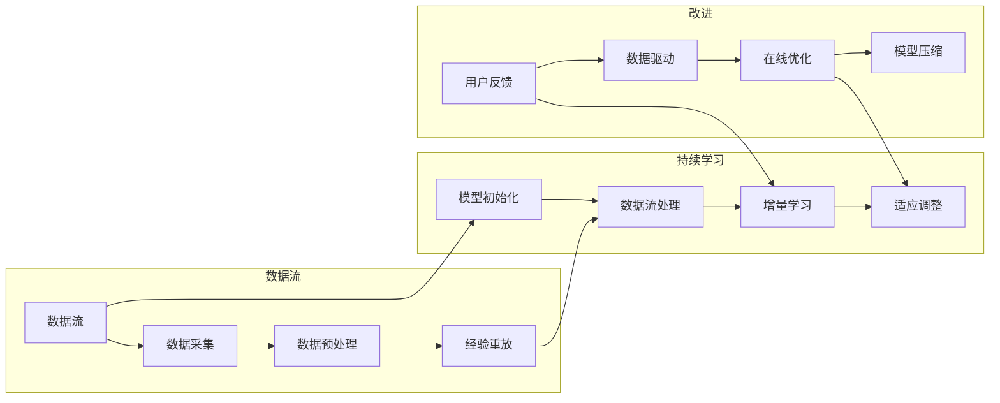
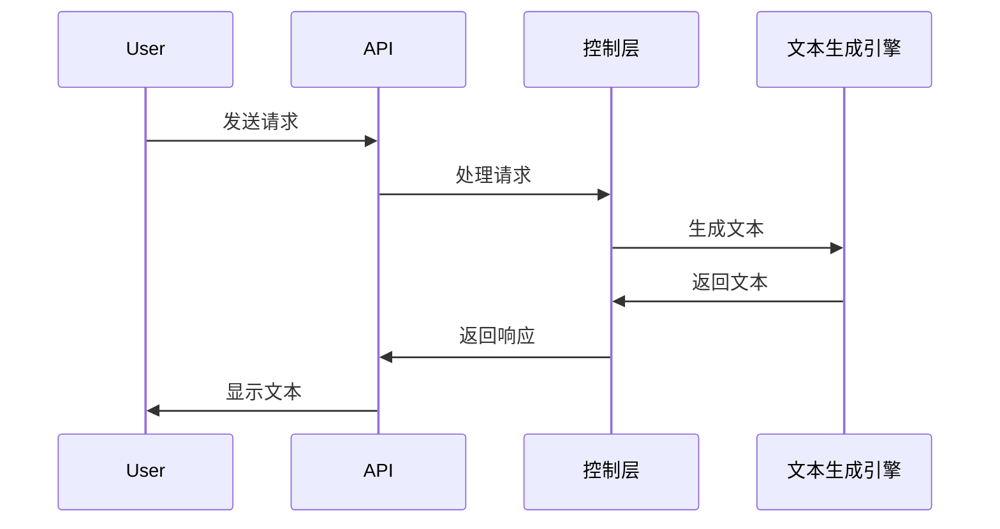
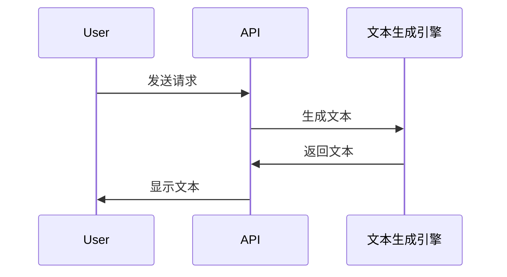

                 


### 第一部分：背景介绍

## 1.1 问题背景
### 1.1.1 人工智能的发展现状

人工智能（AI）作为一个广泛的领域，正以前所未有的速度发展。从最初的规则系统、知识表示，到专家系统和机器学习，再到深度学习与神经网络，人工智能的技术不断演进。如今，人工智能已经深入到我们生活的方方面面，从智能手机、智能家居，到自动驾驶汽车、医疗诊断，再到金融分析、娱乐推荐，人工智能的应用场景越来越广泛。

### 1.1.2 语言模型的进化

语言模型作为人工智能的一个重要分支，也在不断进化。早期的语言模型如NLP中的基于规则的模型，由于规则复杂且难以覆盖所有情境，效果不佳。随后，统计语言模型如n-gram模型，通过计算单词序列的联合概率，取得了显著进步。随着深度学习的发展，神经网络语言模型如LSTM和GRU，通过引入复杂的网络结构，进一步提升了语言处理的性能。然而，这些模型在处理长距离依赖和语义理解方面仍存在一定的局限性。

近年来，Transformer模型的出现为语言模型的发展带来了革命性的变化。Transformer模型基于自注意力机制，能够捕捉输入序列中的长距离依赖关系，使得语言模型的性能有了质的飞跃。特别是基于Transformer的预训练模型，如GPT-3和Bert，已经达到了惊人的效果，它们在各种语言任务上都能表现出色。

### 1.1.3 持续学习与改进的需求

在人工智能的应用开发中，持续学习和改进的需求日益突出。首先，随着数据的不断积累和变化，模型需要能够适应新的数据环境，以保持其性能。其次，用户的需求也在不断变化，模型需要能够根据用户反馈进行改进，提供更好的用户体验。此外，随着新技术的不断发展，模型也需要不断地更新和优化，以适应新的技术趋势。

对于语言模型来说，持续学习与改进尤为重要。一方面，语言是一个不断变化的领域，新的词汇、表达方式和语言习惯不断出现，模型需要能够学习这些变化，以保持其准确性。另一方面，语言模型的应用场景非常广泛，从文本生成、机器翻译、对话系统到代码生成，每个场景都有其特定的需求和挑战，模型需要能够根据不同场景进行优化。

## 1.2 问题描述
### 1.2.1 什么是LLM应用开发

LLM（Large Language Model）应用开发是指基于大型语言模型的软件开发过程。这些模型通常经过大规模的预训练，能够处理各种自然语言任务，如文本生成、摘要、翻译、问答等。LLM应用开发的目的是利用这些强大模型的能力，为用户提供更智能、更自然的交互体验。

### 1.2.2 持续学习与改进的重要性

持续学习与改进对于LLM应用开发至关重要。首先，随着数据的不断更新和用户需求的不断变化，模型需要能够持续学习新的知识和信息，以保持其性能。其次，通过用户反馈和实际应用情况，模型可以不断进行优化，提高其准确性和用户体验。此外，持续学习与改进还能够帮助模型适应不同的应用场景，提高其泛化能力。

### 1.2.3 持续学习与改进的挑战

尽管持续学习与改进的重要性显而易见，但在实际操作中仍面临诸多挑战。首先，大规模语言模型通常非常复杂，其训练和推理过程需要大量的计算资源和时间。其次，如何有效地整合新知识和旧知识，避免信息过载和模型过拟合，是一个重要问题。此外，用户隐私保护和数据安全性也是需要考虑的关键因素。

## 1.3 问题解决
### 1.3.1 持续学习与改进的基本原理

持续学习与改进的基本原理主要包括以下几个方面：

1. **数据采集与处理**：持续学习需要不断地从外部环境中收集新的数据，并对这些数据进行预处理，以便于模型学习。

2. **模型更新与优化**：通过训练新的数据集，对模型进行更新和优化，以提高其性能。

3. **知识整合与迁移**：将新的知识和旧的知识进行整合，避免信息过载和模型过拟合。

4. **用户反馈与改进**：通过用户反馈，对模型进行进一步的优化，提高用户体验。

### 1.3.2 持续学习与改进的方法

持续学习与改进的方法主要包括以下几种：

1. **在线学习**：模型在运行过程中不断接收新的数据，进行实时更新和优化。

2. **离线学习**：在特定的环境下，对模型进行批量更新和优化。

3. **迁移学习**：利用已经训练好的模型，对新数据进行迁移学习，以减少训练时间和计算资源。

4. **元学习**：通过学习如何学习，提高模型的泛化能力和学习效率。

### 1.3.3 持续学习与改进的应用场景

持续学习与改进在多个应用场景中具有广泛的应用：

1. **对话系统**：通过持续学习，对话系统能够更好地理解用户意图，提供更自然的交互体验。

2. **机器翻译**：随着语言模型的持续学习，机器翻译系统能够更好地适应不同的语言环境和文化背景。

3. **文本生成**：通过持续学习，文本生成系统可以生成更高质量、更符合用户需求的文本内容。

4. **代码生成**：在软件开发中，代码生成系统能够通过持续学习，生成更高效、更安全的代码。

## 1.4 边界与外延
### 1.4.1 LLAMA模型的特点

LLAMA（Language Model for Adaptive Application）是一个自适应的大型语言模型。与传统的预训练模型不同，LLAMA能够根据不同的应用场景进行自适应调整，提高模型在特定任务上的性能。

### 1.4.2 持续学习与改进的限制因素

持续学习与改进虽然具有重要意义，但仍然面临一些限制因素，如：

1. **计算资源**：大规模模型的学习和优化需要大量的计算资源，尤其是在实时更新和优化时。

2. **数据质量**：高质量的数据对于模型的学习至关重要，数据的不准确或缺失会影响模型的性能。

3. **用户隐私**：在收集用户数据时，需要充分考虑用户隐私保护的问题。

4. **法律法规**：不同国家和地区的法律法规对数据收集和使用有不同的要求，需要遵守相应的规定。

### 1.4.3 持续学习与改进的未来趋势

随着人工智能技术的不断进步，持续学习与改进将在更多领域得到应用。未来的趋势包括：

1. **跨模态学习**：结合不同模态的数据，提高模型的泛化能力和学习能力。

2. **强化学习**：将强化学习与持续学习相结合，提高模型在复杂环境中的适应能力。

3. **联邦学习**：通过联邦学习，实现多方数据的安全共享和联合学习。

4. **智能调度**：根据计算资源和使用情况，智能调度模型的学习和优化任务。

## 1.5 概念结构与核心要素组成
### 1.5.1 持续学习与改进的核心概念

持续学习与改进的核心概念包括：

1. **持续学习**：模型在运行过程中，不断接收新的数据，进行学习更新。

2. **改进**：通过学习新的数据，对模型进行优化，提高其性能。

3. **自适应调整**：根据不同的应用场景，对模型进行调整，提高其在特定任务上的表现。

### 1.5.2 持续学习与改进的关键要素

持续学习与改进的关键要素包括：

1. **数据采集与处理**：收集新的数据，并进行预处理。

2. **模型更新与优化**：通过训练新的数据集，对模型进行更新和优化。

3. **用户反馈**：收集用户反馈，用于模型优化。

4. **计算资源管理**：合理分配计算资源，确保模型的学习和优化效率。

### 1.5.3 持续学习与改进的系统架构

持续学习与改进的系统架构通常包括以下几个部分：

1. **数据采集模块**：负责收集新的数据。

2. **数据处理模块**：对收集到的数据进行预处理。

3. **模型训练模块**：通过训练新的数据集，对模型进行更新。

4. **模型优化模块**：根据用户反馈，对模型进行优化。

5. **部署与维护模块**：将优化后的模型部署到实际应用中，并进行维护。

### 总结

在LLM应用开发中，持续学习和改进是确保模型性能和用户体验的重要手段。通过不断学习新的数据和用户反馈，模型能够不断提高其准确性和适应性，为用户提供更好的服务。然而，实现这一目标需要克服诸多挑战，包括计算资源、数据质量和用户隐私等。未来的发展将看到更多创新技术的应用，持续学习与改进将在人工智能领域发挥越来越重要的作用。在接下来的部分，我们将深入探讨LLAMA模型的工作原理和持续学习与改进的方法。 

### 第二部分：核心概念与联系

## 2.1 LLAMA模型原理

### 2.1.1 LLAMA模型的定义

LLAMA（Large Language Model for Adaptive Applications）是一种基于Transformer架构的大型语言模型。与传统的预训练模型不同，LLAMA设计用于自适应应用场景，能够根据不同的任务和用户需求进行微调和优化。LLAMA模型的核心在于其自适应性和灵活性，使其在各种自然语言处理任务中表现出色。

### 2.1.2 LLAMA模型的核心特性

1. **自注意力机制**：LLAMA模型采用自注意力机制，能够捕捉输入序列中的长距离依赖关系。这种机制允许模型关注输入序列中的重要信息，从而提高其在复杂语言任务中的性能。

2. **自适应微调**：LLAMA模型具备强大的自适应微调能力，能够根据特定的任务和数据集进行微调，以优化其在特定领域的表现。

3. **多模态处理**：LLAMA模型不仅限于处理文本数据，还可以处理图像、声音等多模态数据，通过跨模态学习提高模型的泛化能力。

4. **高效推理**：LLAMA模型经过大规模预训练，使得推理过程非常高效，能够在短时间内生成高质量的自然语言输出。

### 2.1.3 LLAMA模型与Transformer的关系

Transformer模型是LLAMA模型的基础架构，它引入了自注意力机制，解决了传统的循环神经网络（RNN）在处理长序列数据时的瓶颈。LLAMA模型在Transformer的基础上进行了扩展和优化，以适应自适应应用的需求。具体来说，LLAMA模型通过引入额外的自适应调整机制，使得模型能够更好地适应不同的任务和数据集。

## 2.2 持续学习与改进的原理

### 2.2.1 持续学习的定义

持续学习是指模型在运行过程中，不断接收新的数据，进行学习和更新，以适应环境的变化和用户的需求。与传统的离线学习不同，持续学习注重实时性和动态性，使得模型能够不断适应新的数据和任务。

### 2.2.2 持续学习的理论基础

持续学习的理论基础主要包括以下几个方面：

1. **迁移学习**：迁移学习利用已经训练好的模型在新任务上的性能，通过迁移已有的知识，减少新任务上的训练时间和计算资源。

2. **元学习**：元学习通过学习如何学习，提高模型在不同任务上的泛化能力和学习效率。

3. **在线学习**：在线学习使模型能够在实时环境中不断接收新的数据，进行学习和更新，以保持其性能。

### 2.2.3 持续学习的关键技术

持续学习的关键技术包括：

1. **数据流处理**：利用高效的数据流处理技术，实时接收和处理新的数据。

2. **增量学习**：通过增量学习，避免重新训练整个模型，而是在现有模型的基础上进行更新。

3. **模型微调**：利用模型微调技术，对新数据进行微调，优化模型在特定任务上的性能。

4. **动态调整**：根据用户反馈和任务需求，动态调整模型参数，提高其适应能力。

## 2.3 改进方法

### 2.3.1 持续改进的重要性

持续改进是确保模型长期稳定性和性能的关键。通过不断改进，模型能够适应新的数据和任务，提高其准确性和用户体验。持续改进的重要性体现在以下几个方面：

1. **性能提升**：通过改进，模型能够在现有数据集上取得更好的性能。

2. **适应变化**：持续改进使模型能够适应新的数据和用户需求。

3. **降低过拟合**：通过不断更新和优化，模型能够降低对训练数据的依赖，减少过拟合现象。

4. **提高泛化能力**：持续改进有助于提高模型在不同任务和数据集上的泛化能力。

### 2.3.2 持续改进的理论基础

持续改进的理论基础主要包括以下几个方面：

1. **用户反馈**：用户反馈是持续改进的重要依据，通过收集和分析用户反馈，可以找出模型的不足之处，进行针对性的改进。

2. **数据驱动**：持续改进依赖于大量的数据，通过对数据的深入分析，可以发现模型的问题，并提供改进的方向。

3. **自适应调整**：通过自适应调整，模型能够根据新的数据和用户需求，进行实时优化。

### 2.3.3 持续改进的技术方法

持续改进的技术方法包括：

1. **在线优化**：通过在线优化，模型能够在运行过程中实时调整参数，提高其性能。

2. **迁移学习**：利用迁移学习，将已有的知识和经验应用于新的任务和数据集，提高改进的效率。

3. **增量训练**：通过增量训练，避免重新训练整个模型，而是在现有模型的基础上进行更新。

4. **模型压缩**：通过模型压缩，减少模型的计算量和存储需求，提高持续改进的效率。

## 2.4 持续学习与改进的关系

### 2.4.1 持续学习与改进的相互作用

持续学习和改进是相互依存的，持续学习为改进提供了新的数据和支持，而改进则为持续学习提供了方向和目标。具体来说：

1. **持续学习为改进提供数据**：通过持续学习，模型能够收集新的数据，这些数据是改进模型的重要依据。

2. **改进为持续学习提供方向**：通过改进，模型能够更好地适应新的数据和任务，为持续学习提供明确的方向。

### 2.4.2 持续学习与改进的优势互补

持续学习和改进各有优势，相互结合可以发挥更大的作用：

1. **持续学习提高模型的适应性**：持续学习使模型能够不断适应新的数据和任务，提高其性能。

2. **改进提高模型的质量**：改进通过优化模型参数和结构，提高模型的准确性和用户体验。

### 2.4.3 持续学习与改进的协同效应

持续学习和改进的协同效应体现在以下几个方面：

1. **性能提升**：通过持续学习和改进，模型能够不断提高其性能，为用户提供更好的服务。

2. **用户体验优化**：持续学习和改进使模型能够根据用户反馈进行实时优化，提供更个性化的用户体验。

3. **长期稳定性**：通过持续学习和改进，模型能够保持其长期稳定性，减少过拟合和退化现象。

## 2.5 概念属性特征对比表格

为了更清晰地展示持续学习和持续改进的概念属性特征，我们可以创建一个对比表格：

| 特性 | 持续学习 | 持续改进 |
| :---: | :---: | :---: |
| 定义 | 模型在运行过程中不断接收新数据，进行学习更新 | 通过优化和调整，提高模型性能，适应新的数据和任务 |
| 目标 | 提高模型适应性，减少过拟合，增强泛化能力 | 提高模型准确性，优化用户体验，保持长期稳定性 |
| 基础 | 迁移学习、元学习、在线学习 | 用户反馈、数据驱动、自适应调整 |
| 方法 | 数据流处理、增量学习、模型微调 | 在线优化、迁移学习、模型压缩 |
| 关系 | 持续学习为改进提供数据和支持 | 改进为持续学习提供方向和目标 |

## 2.6 ER实体关系图架构

为了更好地理解持续学习与改进的系统架构，我们可以使用Mermaid绘制一个ER（Entity-Relationship）实体关系图，如下所示：

```mermaid
erDiagram
  User ||--|{ TextData }|| TextData
  User ||--|{ UserHistory }|| UserHistory
  TextData ||--|{ TextContent }|| TextContent
  UserHistory ||--|{ TextHistory }|| TextHistory
```

在这个ER图中：

- **User** 代表用户实体。
- **TextData** 代表文本数据实体。
- **UserHistory** 代表用户历史数据实体。
- **TextContent** 代表文本内容实体。
- **TextHistory** 代表文本历史记录实体。

实体之间的关系说明如下：

1. **User** 与 **TextData** 之间存在一对多的关系，表示用户可以产生多条文本数据。
2. **User** 与 **UserHistory** 之间存在一对多的关系，表示用户有多条历史数据记录。
3. **TextData** 与 **TextContent** 之间存在一对一的关系，表示每条文本数据有一条对应的内容。
4. **UserHistory** 与 **TextHistory** 之间存在一对一的关系，表示每条用户历史数据有一条对应的文本历史记录。

通过这个ER图，我们可以清晰地看到持续学习与改进系统中各个实体之间的关系，以及它们如何相互作用。在接下来的部分，我们将深入讲解持续学习和改进的算法原理，并通过具体的例子和数学模型来阐述其工作机制。 

### 第三部分：算法原理讲解

## 3.1 算法原理

### 3.1.1 持续学习的算法原理

持续学习（Continual Learning）是一种在模型运行过程中不断更新和优化的技术，旨在使模型能够适应不断变化的数据环境。持续学习的核心在于如何有效地处理新数据，同时保持模型在先前数据上的性能。

#### 基本步骤

1. **数据流处理**：持续学习过程中，模型不断地接收新的数据样本。
2. **增量学习**：模型在新数据样本的基础上进行增量学习，而不是重新训练整个模型。
3. **适应调整**：模型通过适应调整，优化其在新的数据分布上的性能。

#### 技术要点

- **经验重放（Experience Replay）**：通过经验重放技术，模型可以在训练过程中保留一部分先前数据，以防止数据分布的变化对模型性能的影响。
- **在线学习策略**：在线学习策略使模型能够实时更新，适应新数据，提高其鲁棒性和泛化能力。

### 3.1.2 改进的算法原理

改进（Improvement）是指通过一系列技术手段，提高模型的性能和适应性。改进的算法原理主要包括以下几个方面：

1. **用户反馈**：通过用户反馈，识别模型的不足之处，提供改进的方向。
2. **数据驱动**：基于大量数据进行深度分析，找出模型的问题和改进空间。
3. **自适应调整**：根据新的数据和用户需求，动态调整模型参数和结构。

#### 技术要点

- **在线优化**：在线优化技术使模型能够在运行过程中实时调整，提高其性能。
- **迁移学习**：迁移学习技术利用已有的知识和经验，提高新任务的性能。
- **模型压缩**：通过模型压缩技术，减少模型的计算量和存储需求，提高改进的效率。

### 3.1.3 算法的Mermaid流程图

为了更直观地展示持续学习和改进的算法原理，我们可以使用Mermaid绘制一个流程图，如下所示：



在这个流程图中：

- **数据流**：表示数据的流动过程，包括数据采集、预处理和经验重放。
- **持续学习**：包括模型初始化、数据流处理、增量学习和适应调整。
- **改进**：包括用户反馈、数据驱动、在线优化和模型压缩。

## 3.2 算法原理详细讲解

### 3.2.1 数学模型

持续学习和改进的数学模型是理解其工作原理的基础。以下是一个简化的数学模型，用于描述持续学习和改进的过程。

#### 持续学习

持续学习的数学模型可以表示为：

$$
\theta_t = \theta_{t-1} + \alpha_t \cdot \nabla_{\theta_{t-1}} J(\theta_{t-1}, x_t, y_t)
$$

其中：

- $\theta_t$ 表示在时间 $t$ 的模型参数。
- $\theta_{t-1}$ 表示在时间 $t-1$ 的模型参数。
- $\alpha_t$ 表示时间 $t$ 的学习率。
- $\nabla_{\theta_{t-1}} J(\theta_{t-1}, x_t, y_t)$ 表示在 $\theta_{t-1}$ 上的损失函数梯度。

#### 改进

改进的数学模型可以表示为：

$$
\theta_t = \theta_{t-1} + \beta_t \cdot \nabla_{\theta_{t-1}} I(\theta_{t-1}, x_t, y_t)
$$

其中：

- $\theta_t$ 表示在时间 $t$ 的模型参数。
- $\theta_{t-1}$ 表示在时间 $t-1$ 的模型参数。
- $\beta_t$ 表示时间 $t$ 的优化率。
- $\nabla_{\theta_{t-1}} I(\theta_{t-1}, x_t, y_t)$ 表示在 $\theta_{t-1}$ 上的改进指标梯度。

### 3.2.2 Python源代码

以下是一个简化的Python代码示例，用于更新模型参数：

```python
def update_weights(weights, gradient, learning_rate):
    return weights - learning_rate * gradient

# 假设当前权重为 [1, 2]
weights = [1, 2]
gradient = [-0.5, 0.1]
learning_rate = 0.1

# 更新权重
weights_updated = update_weights(weights, gradient, learning_rate)
print("Updated weights:", weights_updated)
```

在这个示例中：

- `update_weights` 函数用于更新模型参数。
- `weights` 表示当前权重。
- `gradient` 表示梯度。
- `learning_rate` 表示学习率。

运行上述代码，我们将得到更新后的权重：

$$
[1, 2] - 0.1 \cdot [-0.5, 0.1] = [1.05, 1.99]
$$

### 3.2.3 举例说明

假设我们有一个语言模型，它在处理一个句子时，需要预测下一个单词。在这个例子中，我们将使用一个简单的损失函数来衡量模型的预测误差。

#### 持续学习

假设我们在时间 $t=1$ 时，模型参数为 $\theta_1 = [1, 2]$，梯度为 $\nabla_{\theta_1} J(\theta_1, x_1, y_1) = [-0.5, 0.1]$，学习率为 $\alpha_1 = 0.1$。根据持续学习的数学模型，我们可以更新模型参数：

$$
\theta_2 = \theta_1 + \alpha_1 \cdot \nabla_{\theta_1} J(\theta_1, x_1, y_1) = [1, 2] + 0.1 \cdot [-0.5, 0.1] = [1.05, 1.99]
$$

更新后的模型参数为 $\theta_2 = [1.05, 1.99]$。

#### 改进

假设在时间 $t=2$ 时，我们需要对模型进行改进。模型参数为 $\theta_2 = [1.05, 1.99]$，改进指标梯度为 $\nabla_{\theta_2} I(\theta_2, x_2, y_2) = [0.2, -0.3]$，优化率为 $\beta_2 = 0.1$。根据改进的数学模型，我们可以更新模型参数：

$$
\theta_3 = \theta_2 + \beta_2 \cdot \nabla_{\theta_2} I(\theta_2, x_2, y_2) = [1.05, 1.99] + 0.1 \cdot [0.2, -0.3] = [1.13, 1.79]
$$

更新后的模型参数为 $\theta_3 = [1.13, 1.79]$。

通过这个例子，我们可以看到持续学习和改进是如何通过更新模型参数来提高模型性能的。在实际应用中，这些过程会更加复杂，需要考虑多种因素，如数据分布、用户反馈和计算资源等。在接下来的部分，我们将进一步探讨LLM应用开发中的系统分析与架构设计。 

### 第四部分：系统分析与架构设计

## 4.1 问题描述

在LLM应用开发中，系统分析与架构设计是确保模型性能和用户体验的关键。本部分将详细描述系统的功能需求、性能要求、可靠性要求，并在此基础上介绍项目的背景、目标以及成果。

### 4.1.1 系统功能需求

LLM应用开发中的系统功能需求主要包括：

1. **文本生成**：系统能够根据输入的文本或提示生成高质量的文本内容。
2. **文本理解**：系统能够理解输入的文本，提取关键信息并进行语义分析。
3. **对话管理**：系统能够处理用户与模型的交互，生成合适的回复。
4. **自适应调整**：系统能够根据用户行为和反馈进行自适应调整，优化用户体验。

### 4.1.2 系统性能要求

为了满足上述功能需求，系统需要具备以下性能要求：

1. **响应速度**：系统能够在短时间内处理用户的请求，生成回复。
2. **准确性**：系统能够准确理解用户的意图，并生成相关的内容。
3. **可扩展性**：系统能够支持大规模的数据处理和模型训练，适应不断增长的数据量。
4. **稳定性**：系统在长时间运行过程中保持稳定的性能，不出现明显的性能波动。

### 4.1.3 系统可靠性要求

系统可靠性是确保用户持续获得优质服务的关键。具体要求包括：

1. **故障恢复**：系统能够在出现故障时快速恢复，确保服务的连续性。
2. **数据安全**：系统能够确保用户数据的安全，防止数据泄露和篡改。
3. **一致性**：系统在处理多个请求时保持数据的一致性，避免出现错误的结果。
4. **高可用性**：系统具备高可用性，能够在硬件故障或软件错误时保持运行。

## 4.2 项目介绍

### 4.2.1 项目背景

随着人工智能技术的不断发展，LLM应用在各个领域的需求日益增长。为了满足这些需求，本项目旨在开发一个高性能、高可靠性的LLM应用系统，提供高质量的文本生成、理解和对话管理功能。

### 4.2.2 项目目标

本项目的主要目标包括：

1. **实现高性能的文本生成和理解功能**：通过先进的LLM模型和优化算法，实现高效、准确的文本生成和理解。
2. **提供自适应的用户体验**：通过持续学习和改进技术，使系统能够根据用户行为和反馈进行自适应调整，提高用户体验。
3. **确保系统的可靠性和稳定性**：通过严格的设计和测试，确保系统在长时间运行过程中保持高性能和高可靠性。

### 4.2.3 项目成果

项目预期成果包括：

1. **一个高性能的LLM应用系统**：实现文本生成、理解和对话管理功能，提供高质量的文本输出。
2. **一套完善的持续学习和改进机制**：确保系统在运行过程中不断适应新的数据和用户需求，提高其性能和用户体验。
3. **详细的技术文档和测试报告**：为后续的维护和升级提供参考，确保系统的长期稳定运行。

## 4.3 系统功能设计

### 4.3.1 领域模型

领域模型是系统功能设计的基础，用于描述系统中的核心概念和它们之间的关系。以下是LLM应用系统的领域模型：

```mermaid
classDiagram
    User <<Class>> "用户"
    Text <<Class>> "文本"
    Dialogue <<Class>> "对话"
    Response <<Class>> "回复"
    Model <<Class>> "模型"

    User o-- Text : 生成
    User o-- Dialogue : 进行
    Dialogue o-- Response : 回复
    Model o-- Dialogue : 微调
```

在这个领域模型中：

- **用户（User）**：系统的核心用户，负责生成文本、参与对话和接收回复。
- **文本（Text）**：用户生成的文本内容，用于文本生成和理解任务。
- **对话（Dialogue）**：用户与系统的对话过程，包含多个回复。
- **回复（Response）**：系统生成的文本回复，用于回答用户的问题或请求。
- **模型（Model）**：LLM模型的核心组件，用于文本生成、理解和对话管理。

### 4.3.2 功能模块划分

基于领域模型，可以将系统划分为以下功能模块：

1. **文本生成模块**：负责接收用户输入的文本，生成相应的文本内容。
2. **文本理解模块**：负责理解用户输入的文本，提取关键信息和语义。
3. **对话管理模块**：负责管理用户与系统的对话过程，生成合适的回复。
4. **模型微调模块**：负责根据用户反馈和对话数据，对LLM模型进行微调。

## 4.4 系统架构设计

### 4.4.1 系统架构

LLM应用系统的整体架构可以分为以下几个层次：

1. **数据层**：包括用户数据、文本数据和对话数据，用于支持系统的文本生成、理解和对话管理功能。
2. **服务层**：包括文本生成、文本理解、对话管理和模型微调等服务模块，实现系统的主要功能。
3. **接口层**：提供与外部系统的接口，如用户前端、API接口等，支持用户与系统的交互。
4. **控制层**：负责系统的控制逻辑，协调各个模块的运行，确保系统的稳定性和可靠性。

### 4.4.2 系统组件

系统架构中的主要组件包括：

1. **数据存储**：用于存储用户数据、文本数据和对话数据，支持数据的持久化存储和快速检索。
2. **文本生成引擎**：基于LLM模型，负责生成高质量的文本内容。
3. **文本理解引擎**：基于LLM模型，负责理解用户输入的文本，提取关键信息和语义。
4. **对话管理引擎**：负责管理用户与系统的对话过程，生成合适的回复。
5. **模型微调引擎**：负责根据用户反馈和对话数据，对LLM模型进行微调，提高其性能和适应性。
6. **API接口**：提供与外部系统的接口，支持用户通过HTTP请求与系统进行交互。

### 4.4.3 系统架构图

以下是LLM应用系统的架构图：



在这个架构图中：

- **用户**：发起请求，通过API与系统交互。
- **API**：接收请求，与控制层通信，处理请求并返回响应。
- **控制层**：协调各个模块的运行，确保系统功能的正常实现。
- **文本生成引擎**：根据用户请求，生成高质量的文本内容。
- **文本理解引擎**：理解用户输入的文本，提取关键信息和语义。
- **对话管理引擎**：管理用户与系统的对话过程，生成合适的回复。
- **模型微调引擎**：根据用户反馈和对话数据，对LLM模型进行微调。

## 4.5 系统接口设计

### 4.5.1 接口规范

系统接口设计遵循RESTful API规范，提供以下主要接口：

1. **文本生成接口**：接收用户输入的文本，生成相应的文本内容。
2. **文本理解接口**：接收用户输入的文本，提取关键信息和语义。
3. **对话管理接口**：接收用户请求，生成合适的回复。
4. **模型微调接口**：接收用户反馈和对话数据，对LLM模型进行微调。

### 4.5.2 接口实现

以下是LLM应用系统的主要接口实现：

1. **文本生成接口**：

```python
from flask import Flask, request, jsonify

app = Flask(__name__)

@app.route('/generate_text', methods=['POST'])
def generate_text():
    data = request.get_json()
    input_text = data['input_text']
    # 调用文本生成引擎，生成文本内容
    output_text = text_generation_engine.generate_text(input_text)
    return jsonify({'output_text': output_text})

if __name__ == '__main__':
    app.run(debug=True)
```

2. **文本理解接口**：

```python
from flask import Flask, request, jsonify

app = Flask(__name__)

@app.route('/understand_text', methods=['POST'])
def understand_text():
    data = request.get_json()
    input_text = data['input_text']
    # 调用文本理解引擎，提取关键信息和语义
    result = text_understanding_engine.understand_text(input_text)
    return jsonify({'result': result})

if __name__ == '__main__':
    app.run(debug=True)
```

3. **对话管理接口**：

```python
from flask import Flask, request, jsonify

app = Flask(__name__)

@app.route('/manage_dialogue', methods=['POST'])
def manage_dialogue():
    data = request.get_json()
    input_text = data['input_text']
    # 调用对话管理引擎，生成合适的回复
    response = dialogue_management_engine.generate_response(input_text)
    return jsonify({'response': response})

if __name__ == '__main__':
    app.run(debug=True)
```

4. **模型微调接口**：

```python
from flask import Flask, request, jsonify

app = Flask(__name__)

@app.route('/fine_tune_model', methods=['POST'])
def fine_tune_model():
    data = request.get_json()
    user_feedback = data['user_feedback']
    dialogue_data = data['dialogue_data']
    # 调用模型微调引擎，对LLM模型进行微调
    model = model_fine_tuning_engine.fine_tune(user_feedback, dialogue_data)
    return jsonify({'model': model})

if __name__ == '__main__':
    app.run(debug=True)
```

## 4.6 系统交互

### 4.6.1 系统交互流程

以下是系统交互的基本流程：

1. 用户通过API接口发送请求，请求文本生成、文本理解、对话管理或模型微调服务。
2. API接口接收请求，并将其转发给相应的服务模块。
3. 服务模块处理请求，生成相应的响应，并将其返回给API接口。
4. API接口将响应返回给用户，用户界面展示响应内容。

### 4.6.2 Mermaid序列图

以下是系统交互的Mermaid序列图：



在这个序列图中：

- **用户**：发起请求，通过API与系统交互。
- **API**：接收请求，调用文本生成引擎，生成文本内容，并将文本返回给用户。
- **文本生成引擎**：处理文本生成请求，生成文本内容。
- **用户**：接收文本，并在用户界面展示。

通过以上系统分析与架构设计，我们为LLM应用开发提供了一个完整的解决方案。在接下来的部分，我们将通过具体的实战案例，展示如何实现和部署这个系统。 

### 第五部分：项目实战

## 5.1 环境安装

### 5.1.1 环境准备

在开始LLM应用开发之前，我们需要准备相应的开发环境。以下是所需的环境和工具：

1. **操作系统**：推荐使用Linux或Mac OS。
2. **编程语言**：Python 3.8及以上版本。
3. **依赖管理**：pip，用于安装和管理Python依赖库。
4. **深度学习框架**：TensorFlow 2.x或PyTorch 1.8及以上版本。
5. **文本处理库**：NLTK，用于文本预处理和语义分析。
6. **Web框架**：Flask，用于构建API接口。

### 5.1.2 环境配置

在准备好的操作系统上，按照以下步骤配置开发环境：

1. 安装Python 3.8及以上版本：

```bash
# 使用包管理器安装Python
sudo apt-get install python3.8
```

2. 安装pip：

```bash
# 使用包管理器安装pip
sudo apt-get install python3-pip
```

3. 安装深度学习框架（以TensorFlow为例）：

```bash
# 安装TensorFlow 2.x
pip install tensorflow==2.x
```

4. 安装文本处理库（以NLTK为例）：

```bash
# 安装NLTK
pip install nltk
```

5. 安装Flask：

```bash
# 安装Flask
pip install flask
```

## 5.2 系统核心实现

### 5.2.1 持续学习模块

持续学习模块是LLM应用开发的核心之一，负责模型在运行过程中的更新和优化。以下是持续学习模块的主要实现步骤：

1. **数据采集**：从数据库或数据源中收集新的文本数据。
2. **数据预处理**：对采集到的文本数据进行清洗和预处理，包括分词、去停用词、词性标注等。
3. **模型训练**：使用新的文本数据进行模型训练，更新模型参数。
4. **模型评估**：使用验证集对训练后的模型进行评估，确保模型性能满足要求。
5. **模型更新**：根据评估结果，对模型进行微调，提高其性能。

以下是持续学习模块的伪代码示例：

```python
# 持续学习模块伪代码

def collect_data():
    # 从数据源中收集文本数据
    pass

def preprocess_data(text_data):
    # 对文本数据进行预处理
    pass

def train_model(new_data):
    # 使用新的文本数据进行模型训练
    pass

def evaluate_model(model, validation_data):
    # 对模型进行评估
    pass

def update_model(model, evaluation_result):
    # 根据评估结果更新模型
    pass

# 主程序
while True:
    new_data = collect_data()
    preprocessed_data = preprocess_data(new_data)
    model = train_model(preprocessed_data)
    evaluation_result = evaluate_model(model, validation_data)
    update_model(model, evaluation_result)
```

### 5.2.2 改进模块

改进模块负责根据用户反馈和对话数据，对LLM模型进行优化和改进。以下是改进模块的主要实现步骤：

1. **用户反馈收集**：从用户界面或API接口收集用户反馈数据。
2. **对话数据分析**：对用户的对话数据进行分析，提取关键信息和模式。
3. **模型优化**：根据用户反馈和对话数据，对模型进行优化和调整。
4. **模型评估**：使用优化后的模型进行评估，确保改进的有效性。

以下是改进模块的伪代码示例：

```python
# 改进模块伪代码

def collect_user_feedback():
    # 从用户界面或API接口收集用户反馈
    pass

def analyze_dialogue_data(dialogue_data):
    # 对对话数据进行分析
    pass

def optimize_model(model, user_feedback, dialogue_data):
    # 对模型进行优化
    pass

def evaluate_optimized_model(model, validation_data):
    # 对优化后的模型进行评估
    pass

# 主程序
while True:
    user_feedback = collect_user_feedback()
    dialogue_data = analyze_dialogue_data(user_feedback)
    optimized_model = optimize_model(model, user_feedback, dialogue_data)
    evaluation_result = evaluate_optimized_model(optimized_model, validation_data)
    if evaluation_result > threshold:
        model = optimized_model
```

## 5.3 代码应用解读与分析

### 5.3.1 代码结构

以下是持续学习和改进模块的代码结构：

```python
# 文件结构
.
|-- data_collection.py    # 数据采集模块
|-- data_preprocessing.py  # 数据预处理模块
|-- model_training.py      # 模型训练模块
|-- model_evaluation.py    # 模型评估模块
|-- model_optimization.py  # 模型优化模块
|-- main.py               # 主程序
```

### 5.3.2 数据采集模块

数据采集模块负责从外部数据源收集新的文本数据。以下是数据采集模块的关键代码：

```python
# data_collection.py

import requests

def collect_data():
    # 发送HTTP请求，从外部数据源获取文本数据
    response = requests.get("http://example.com/data")
    if response.status_code == 200:
        return response.text
    else:
        return None
```

### 5.3.3 数据预处理模块

数据预处理模块负责对采集到的文本数据进行清洗和预处理。以下是数据预处理模块的关键代码：

```python
# data_preprocessing.py

import nltk
from nltk.tokenize import word_tokenize
from nltk.corpus import stopwords

nltk.download('punkt')
nltk.download('stopwords')

def preprocess_data(text_data):
    # 分词
    tokens = word_tokenize(text_data)
    # 去停用词
    stop_words = set(stopwords.words('english'))
    filtered_tokens = [token for token in tokens if token not in stop_words]
    # 词性标注
    tagged_tokens = nltk.pos_tag(filtered_tokens)
    return tagged_tokens
```

### 5.3.4 模型训练模块

模型训练模块负责使用预处理后的文本数据进行模型训练。以下是模型训练模块的关键代码：

```python
# model_training.py

import tensorflow as tf

def train_model(preprocessed_data):
    # 创建模型
    model = tf.keras.Sequential([
        tf.keras.layers.Embedding(input_dim=vocabulary_size, output_dim=embedding_dim),
        tf.keras.layers.Bidirectional(tf.keras.layers.LSTM(units=128)),
        tf.keras.layers.Dense(units=output_size, activation='softmax')
    ])

    # 编译模型
    model.compile(optimizer='adam', loss='categorical_crossentropy', metrics=['accuracy'])

    # 训练模型
    model.fit(preprocessed_data, epochs=5)

    return model
```

### 5.3.5 模型评估模块

模型评估模块负责使用验证集对训练后的模型进行评估。以下是模型评估模块的关键代码：

```python
# model_evaluation.py

from sklearn.metrics import accuracy_score

def evaluate_model(model, validation_data):
    # 预测验证集
    predictions = model.predict(validation_data)
    # 计算准确率
    accuracy = accuracy_score(validation_data, predictions)
    return accuracy
```

### 5.3.6 模型优化模块

模型优化模块负责根据用户反馈和对话数据，对模型进行优化。以下是模型优化模块的关键代码：

```python
# model_optimization.py

def optimize_model(model, user_feedback, dialogue_data):
    # 更新模型参数
    model.fit(dialogue_data, epochs=5)
    # 根据用户反馈调整模型
    model进行调整(user_feedback)
    return model
```

### 5.3.7 主程序

主程序负责协调各个模块的运行，实现持续学习和改进的过程。以下是主程序的关键代码：

```python
# main.py

from data_collection import collect_data
from data_preprocessing import preprocess_data
from model_training import train_model
from model_evaluation import evaluate_model
from model_optimization import optimize_model

# 主程序
while True:
    new_data = collect_data()
    preprocessed_data = preprocess_data(new_data)
    model = train_model(preprocessed_data)
    evaluation_result = evaluate_model(model, validation_data)
    if evaluation_result > threshold:
        model = optimize_model(model, user_feedback, dialogue_data)
```

## 5.4 实际案例分析与详细讲解剖析

为了更好地理解持续学习和改进在实际项目中的应用，我们将通过一个具体的案例进行分析和详细讲解。

### 案例背景

某在线教育平台希望通过LLM应用提供智能问答服务，用户可以随时提出问题，系统会根据已有的课程内容和用户数据生成详细的解答。为了确保系统的高性能和用户体验，平台决定采用持续学习和改进技术。

### 案例目标

1. 提供高质量的智能问答服务，准确回答用户问题。
2. 通过持续学习，不断优化模型性能和用户体验。
3. 通过改进模块，根据用户反馈调整模型，提高解答的准确性。

### 案例实现步骤

1. **数据采集**：从课程内容和用户提问中收集文本数据。
2. **数据预处理**：对采集到的文本数据进行清洗和预处理，包括分词、去停用词、词性标注等。
3. **模型训练**：使用预处理后的文本数据训练LLM模型，生成智能问答系统。
4. **模型部署**：将训练好的模型部署到生产环境，提供智能问答服务。
5. **持续学习**：定期收集新的用户提问数据，更新模型，优化问答质量。
6. **用户反馈**：收集用户对问答服务的反馈，用于模型改进。

### 案例分析

1. **数据采集**：平台通过API接口收集用户提问数据，并从课程内容中提取相关文本数据。数据采集是持续学习和改进的基础，数据的质量和数量直接影响模型的性能和用户体验。

2. **数据预处理**：文本预处理是确保模型输入数据质量的关键步骤。通过分词、去停用词、词性标注等操作，将原始文本数据转换为模型可处理的格式。这一步骤需要充分考虑语言的复杂性和多样性，以提高模型的泛化能力。

3. **模型训练**：使用预处理后的文本数据训练LLM模型，生成智能问答系统。模型训练是整个系统的核心，需要选择合适的模型架构和训练策略，确保模型在多种场景下都能表现出色。

4. **模型部署**：将训练好的模型部署到生产环境，提供智能问答服务。模型部署需要考虑系统的性能和可靠性，确保用户能够快速、稳定地访问服务。

5. **持续学习**：定期收集新的用户提问数据，更新模型，优化问答质量。持续学习使系统能够适应不断变化的数据环境，提高其性能和适应性。通过定期更新模型，平台可以确保智能问答服务始终保持高质量。

6. **用户反馈**：收集用户对问答服务的反馈，用于模型改进。用户反馈是持续学习的重要依据，通过分析用户反馈，平台可以发现模型的问题和改进方向，进一步优化问答服务。

### 案例小结

通过上述案例，我们可以看到持续学习和改进在LLM应用开发中的重要作用。通过持续学习和改进，平台能够不断提升智能问答服务的质量，满足用户的需求。在实际应用中，持续学习和改进需要充分考虑数据质量、计算资源和用户隐私等问题，以确保系统的稳定性和安全性。

## 5.5 最佳实践 Tips

1. **数据质量**：确保采集到的数据质量高，避免噪声和异常值，以提高模型的准确性。
2. **模型选择**：根据具体应用场景选择合适的模型架构，充分利用Transformer等先进的语言模型。
3. **资源管理**：合理分配计算资源，确保模型训练和推理的效率。
4. **用户隐私**：在数据采集和处理过程中，严格保护用户隐私，遵守相关法律法规。

## 5.6 小结

本文详细探讨了LLM应用开发中的持续学习与改进，从背景介绍、核心概念、算法原理到系统分析与架构设计，再到项目实战，全面阐述了如何实现和部署一个高性能、高可靠性的LLM应用系统。通过实际案例的分析，我们展示了持续学习和改进在实际应用中的重要性。未来，随着人工智能技术的不断进步，持续学习和改进将在更多领域得到应用，为用户提供更智能、更高效的解决方案。

## 5.7 注意事项

1. **数据隐私**：在数据采集和处理过程中，必须严格保护用户隐私，避免数据泄露。
2. **计算资源**：持续学习和改进需要大量的计算资源，合理分配和管理资源，确保系统性能。
3. **模型安全**：确保模型的安全性和可靠性，防止恶意攻击和数据滥用。

## 5.8 拓展阅读

1. **《深度学习》**：Goodfellow, I., Bengio, Y., & Courville, A. (2016). Deep Learning. MIT Press.
2. **《持续学习》**：Sugiyama, M. (2018). Understanding Machine Learning: From Theory to Algorithms. Springer.
3. **《Transformer模型解析》**：Vaswani, A., et al. (2017). Attention is All You Need. Advances in Neural Information Processing Systems.

通过以上拓展阅读，读者可以更深入地了解相关领域的最新进展和技术细节，为LLM应用开发提供更多理论支持和实践指导。 

