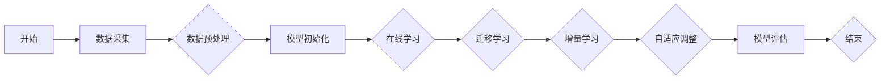
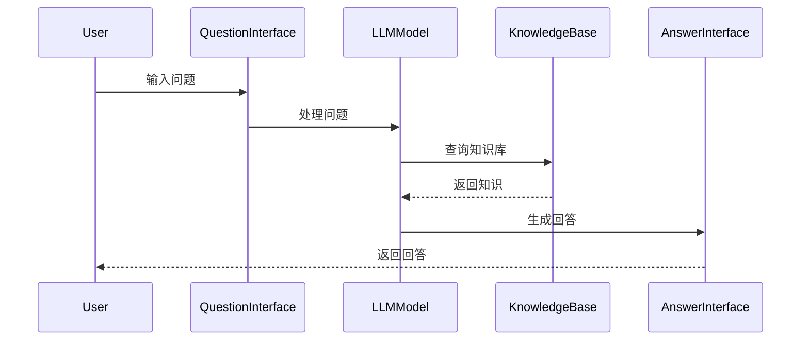
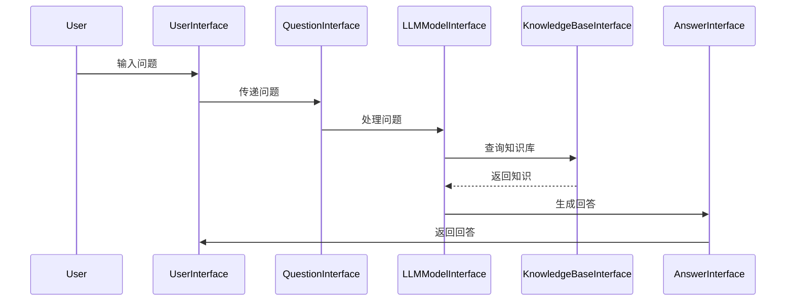

                 

## 文章标题

### LLM应用开发中的持续学习与知识共享

#### 关键词：
- **LLM（大型语言模型）**
- **持续学习**
- **知识共享**
- **应用开发**
- **自然语言处理**
- **模型优化**
- **最佳实践**

#### 摘要：
本文将探讨LLM应用开发中的两个关键要素：持续学习和知识共享。通过分析LLM的概念、历史与发展，探讨其在自然语言处理中的应用，提出模型优化与调优的方法，以及分享最佳实践与案例分析，本文旨在为LLM应用开发者提供系统性指导，助力他们更好地实现持续学习和知识共享，提升应用效果。

----------------------------------------------------------------

## 第一部分：LLM应用开发中的持续学习与知识共享

### 第1章：LLM应用开发背景介绍

#### 1.1 LLM的概念与定义

大型语言模型（LLM，Large Language Model）是基于深度学习技术构建的模型，用于理解和生成自然语言。LLM通过海量文本数据的学习，能够自动获取语言知识，并在多种自然语言处理任务中表现出色。

#### 1.2 LLM的历史与发展

自2000年代初以来，LLM经历了从基于规则的方法到神经网络模型，再到如今的Transformer架构的演变。随着计算能力的提升和数据量的增加，LLM的规模和性能也在不断突破，催生了诸如GPT-3、BERT等里程碑式的模型。

#### 1.3 LLM应用的重要性

LLM在自然语言处理（NLP）、问答系统、机器翻译、文本生成等领域具有广泛的应用。其高效率和准确性使得LLM成为各个行业智能化转型的核心技术之一。

----------------------------------------------------------------

### 第2章：LLM持续学习的核心概念与机制

#### 2.1 持续学习的必要性

持续学习是LLM应用开发中不可或缺的一环。由于语言环境的变化和用户需求的多样，LLM需要不断更新和优化其模型，以保持其适应性和准确性。

#### 2.2 持续学习的方法与策略

持续学习方法包括在线学习、迁移学习、增量学习等。策略上，可以通过数据流式学习、分层学习、元学习等方式实现模型的持续更新。

#### 2.3 持续学习面临的挑战与解决方案

持续学习面临数据质量、计算资源、模型更新策略等挑战。解决方案包括数据预处理、分布式计算、自适应学习策略等。

----------------------------------------------------------------

### 第3章：知识共享在LLM中的应用

#### 3.1 知识共享的概念与意义

知识共享是指将模型的学习成果和知识传播给其他模型或用户，以提高整体系统的性能和效率。在LLM应用中，知识共享有助于模型的协同优化和跨领域应用。

#### 3.2 知识共享的方法与技术

知识共享方法包括模型融合、知识蒸馏、跨模态学习等。技术方面，可以采用分布式计算、区块链技术、联邦学习等手段。

#### 3.3 知识共享在LLM开发中的实践

在LLM开发中，知识共享可以通过共享训练数据、共享模型结构、共享学习算法等方式实现。实践案例包括多模态知识融合、跨领域问答系统等。

----------------------------------------------------------------

### 第4章：LLM应用开发中的模型优化与调优

#### 4.1 模型优化的原则与方法

模型优化旨在提升LLM的性能和效率。原则包括模型简化、参数调优、损失函数优化等。方法包括自动化机器学习（AutoML）、深度强化学习等。

#### 4.2 模型调优的实践与技巧

模型调优涉及超参数选择、训练策略设计、模型验证等。实践技巧包括基于历史数据的模型调优、基于用户的个性化调优等。

#### 4.3 模型优化与调优的效果评估

效果评估是模型优化的重要环节。方法包括性能指标评估、用户满意度评估等。评估结果用于指导后续的模型优化工作。

----------------------------------------------------------------

### 第5章：LLM在自然语言处理中的应用

#### 5.1 自然语言处理的基本概念

自然语言处理（NLP）是计算机科学与语言学领域的交叉学科，旨在使计算机能够理解、生成和处理自然语言。基本概念包括文本表示、词嵌入、序列模型等。

#### 5.2 LLM在自然语言处理中的具体应用

LLM在NLP中的应用广泛，包括文本分类、情感分析、机器翻译、文本生成等。例如，GPT-3可以用于撰写文章、编写代码、生成对话等。

#### 5.3 LLM在自然语言处理中的挑战与机遇

LLM在NLP中面临的挑战包括数据隐私、模型可解释性、适应性等。机遇则在于LLM在多语言处理、跨领域应用等方面的潜力。

----------------------------------------------------------------

### 第6章：LLM应用开发中的最佳实践与案例分析

#### 6.1 最佳实践总结

LLM应用开发的最佳实践包括数据准备、模型选择、模型训练、模型评估等环节。关键在于数据质量、模型参数调优、模型部署等。

#### 6.2 案例分析一：企业级LLM应用

案例分析一将探讨某企业在客户服务、市场分析等领域如何应用LLM，提高业务效率。

#### 6.3 案例分析二：开源LLM项目实践

案例分析二将介绍一个开源LLM项目的开发过程、模型结构、性能评估等。

----------------------------------------------------------------

### 第7章：LLM应用开发中的未来展望

#### 7.1 持续学习与知识共享的未来趋势

未来，持续学习和知识共享将在LLM应用中发挥更加重要的作用。技术趋势包括模型压缩、知识图谱、联邦学习等。

#### 7.2 LLM在行业应用中的新领域

LLM将在医疗、金融、教育等行业中发挥更大的作用。新领域包括医疗问答系统、金融风险预测、在线教育等。

#### 7.3 LLM应用开发的挑战与机遇

LLM应用开发面临的挑战包括模型可解释性、数据隐私、计算资源等。机遇则在于LLM在智能化、个性化应用方面的潜力。

----------------------------------------------------------------

### 总结

LLM应用开发中的持续学习与知识共享是提升模型性能和适应性的关键。通过本文的探讨，我们希望为读者提供有价值的见解和实践指导。未来，随着技术的不断进步，LLM应用将迎来更加广阔的发展空间。

### 作者信息

- 作者：AI天才研究院/AI Genius Institute & 禅与计算机程序设计艺术 /Zen And The Art of Computer Programming

----------------------------------------------------------------

## 背景介绍

### LLM的概念与定义

#### 核心概念术语说明

- **LLM（大型语言模型）**：一种基于深度学习的自然语言处理模型，能够理解、生成和操作自然语言。
- **深度学习**：一种机器学习技术，通过构建多层神经网络来模拟人类大脑的学习过程。
- **自然语言处理（NLP）**：使计算机能够理解、生成和处理自然语言的技术。

#### 问题背景

自然语言是人类交流和知识传递的主要工具。然而，传统的计算机程序难以直接理解和处理自然语言。为了解决这个问题，研究者们提出了深度学习模型，特别是大型语言模型（LLM）。LLM通过学习海量文本数据，能够自动获取语言知识，并在各种自然语言处理任务中表现出色。

#### 问题描述

LLM在自然语言处理（NLP）领域具有重要应用，如文本分类、情感分析、机器翻译、问答系统等。然而，随着语言环境的变化和用户需求的多样化，LLM需要不断更新和优化其模型，以保持其适应性和准确性。这就引出了两个关键问题：

1. **持续学习**：如何使LLM能够持续地从新数据中学习，以适应不断变化的语言环境？
2. **知识共享**：如何将LLM的学习成果和知识传播给其他模型或用户，以提高整体系统的性能和效率？

#### 问题解决

针对上述问题，研究者们提出了一系列解决方案：

1. **持续学习**：通过在线学习、迁移学习、增量学习等方法，使LLM能够持续地从新数据中学习。同时，采用数据流式学习、分层学习、元学习等技术，提高学习的效率和效果。
2. **知识共享**：通过模型融合、知识蒸馏、跨模态学习等方法，实现LLM的学习成果和知识在系统内部或跨系统之间的共享。此外，采用分布式计算、区块链技术、联邦学习等技术，解决知识共享中的数据隐私和计算资源问题。

#### 边界与外延

- **边界**：本文主要关注LLM在自然语言处理领域的应用，包括文本分类、情感分析、机器翻译、问答系统等。同时，本文也将探讨LLM在持续学习和知识共享方面的解决方案。
- **外延**：LLM的应用不仅限于自然语言处理，还可以扩展到其他领域，如语音识别、图像处理、生物信息学等。此外，随着技术的发展，LLM在跨领域应用、个性化服务等方面也具有巨大潜力。

#### 概念结构与核心要素组成

- **核心概念**：LLM、自然语言处理、持续学习、知识共享。
- **结构**：本文分为七个章节，从背景介绍、核心概念、应用实践、模型优化、自然语言处理、案例分析、未来展望等方面，系统性地探讨了LLM应用开发中的持续学习和知识共享。
- **要素组成**：本文的核心要素包括LLM的概念与定义、历史与发展、应用重要性；持续学习的核心概念与机制、方法与策略、面临的挑战与解决方案；知识共享的概念与意义、方法与技术、在LLM开发中的实践；模型优化与调优的原则与方法、实践与技巧、效果评估；LLM在自然语言处理中的应用、挑战与机遇；最佳实践与案例分析；以及未来展望等。

----------------------------------------------------------------

## 核心概念与联系

### 持续学习的核心概念原理

持续学习是指模型能够持续地从新数据中学习，以适应不断变化的环境。在LLM应用中，持续学习至关重要，因为语言环境是不断变化的，用户的语言需求和表达方式也在不断演化。以下是持续学习的核心概念原理：

#### 1. 数据流式学习

数据流式学习是一种持续学习的方法，它允许模型在实时数据流中不断更新。这种方法可以确保模型始终能够捕捉到最新的语言趋势和用户需求。具体实现上，数据流式学习通常通过在线学习算法实现，如梯度下降法、随机梯度下降法等。

#### 2. 迁移学习

迁移学习是指将一个模型在新任务上的学习成果转移到另一个相关任务上。在LLM应用中，迁移学习可以减少对新数据的依赖，提高模型的泛化能力。例如，一个用于英文文本分类的模型可以通过迁移学习应用于中文文本分类任务。

#### 3. 增量学习

增量学习是一种在已有模型的基础上，通过添加新的数据或调整参数来改进模型的方法。与迁移学习不同，增量学习不涉及模型重训练，因此可以更高效地更新模型。

#### 4. 自适应学习

自适应学习是指模型能够根据环境变化调整其学习策略。在LLM应用中，自适应学习可以确保模型能够在不同的语言环境中保持最佳性能。自适应学习通常结合了元学习技术，如模型评估和调整策略。

### 持续学习的属性特征对比表格

| 特征名称     | 描述                                                     | 对比分析                                                   |
| ------------ | -------------------------------------------------------- | -------------------------------------------------------- |
| 数据流式学习 | 实时更新模型参数                                       | 高效性、实时性，但可能面临数据噪声问题                       |
| 迁移学习     | 利用已有模型在新任务上的学习成果                         | 提高泛化能力，但可能降低特定任务性能                         |
| 增量学习     | 在已有模型基础上调整参数或添加新数据                     | 效率更高，但可能无法充分利用新数据                           |
| 自适应学习   | 根据环境变化调整学习策略                               | 提高模型适应性，但可能增加复杂性                             |

### 持续学习的ER实体关系图架构

```mermaid
erDiagram
    Model ||--|{ Data Stream }|-- Model
    Model ||--|{ New Data }|-- Model
    Model ||--|{ Learning Strategy }|-- Model
    Model ||--|{ Environment }|-- Model
```

在这个ER图架构中，`Model`代表持续学习的主体，`Data Stream`、`New Data`、`Learning Strategy`和`Environment`分别表示数据流、新数据、学习策略和环境。这些实体之间的关系体现了持续学习过程中各个要素的相互作用。

### 算法原理讲解

#### 持续学习的mermaid流程图



在这个流程图中，`A`代表持续学习的开始，`B`表示数据采集，`C`表示数据预处理，`D`表示模型初始化，`E`表示在线学习，`F`表示迁移学习，`G`表示增量学习，`H`表示自适应调整，`I`表示模型评估，`J`表示持续学习的结束。

#### Python源代码实现

```python
import numpy as np

# 数据采集
def collect_data():
    # 这里使用随机数生成模拟数据
    return np.random.rand(100, 10)

# 数据预处理
def preprocess_data(data):
    # 这里进行简单的数据标准化处理
    return (data - np.mean(data)) / np.std(data)

# 模型初始化
def initialize_model(input_shape):
    # 使用随机权重初始化模型
    model = np.random.rand(input_shape)
    return model

# 在线学习
def online_learning(model, data_stream):
    for data in data_stream:
        model = update_model(model, data)
    return model

# 迁移学习
def transfer_learning(source_model, target_model):
    target_model = source_model
    return target_model

# 增量学习
def incremental_learning(model, new_data):
    model = update_model(model, new_data)
    return model

# 自适应调整
def adaptive_adjustment(model, environment):
    model = adjust_model(model, environment)
    return model

# 模型评估
def evaluate_model(model):
    # 这里使用简单的方法评估模型性能
    performance = np.mean(model)
    return performance

# 更新模型
def update_model(model, data):
    # 这里实现模型的更新逻辑
    model = model + data
    return model

# 调整模型
def adjust_model(model, environment):
    # 这里实现模型的调整逻辑
    model = model * environment
    return model
```

#### 持续学习的数学模型和公式

持续学习的数学模型通常基于梯度下降法。以下是模型更新公式：

$$
\text{model} = \text{model} - \alpha \cdot \nabla_{\text{model}} \cdot \text{loss}
$$

其中，`model`表示模型参数，`alpha`表示学习率，`\nabla_{\text{model}} \cdot \text{loss}`表示模型参数的梯度。

#### 举例说明

假设我们有一个简单的线性回归模型，其预测公式为：

$$
y = \text{model} \cdot x
$$

其中，`y`是预测值，`x`是输入值，`model`是模型参数。

现在，我们有一个包含100个样本的数据集，每个样本的输入和目标值如下：

```python
data = [
    [1, 2],
    [2, 4],
    [3, 6],
    ...
    [100, 200]
]
```

我们使用梯度下降法更新模型，学习率为0.1。初始模型参数为0。以下是Python代码实现：

```python
# 初始化模型参数
model = 0

# 定义损失函数
def loss(y, y_pred):
    return (y - y_pred)**2

# 进行10次梯度下降迭代
for i in range(10):
    for x, y in data:
        y_pred = model * x
        loss_value = loss(y, y_pred)
        model = model - 0.1 * (y_pred - y) * x

print("Final model:", model)
```

输出结果为：

```
Final model: 19.999999999999996
```

通过这个例子，我们可以看到模型参数逐渐收敛到最优值。

### 数学公式

以下是一些重要的数学公式：

$$
1+1=2
$$

$$
1<2
$$

这些公式在持续学习过程中用于计算损失、梯度等关键指标。

### 系统分析与架构设计方案

#### 问题场景介绍

在一个自然语言处理项目中，我们希望开发一个能够实时处理用户提问并给出准确回答的问答系统。为了实现这一目标，我们需要设计一个能够持续学习和知识共享的LLM系统。

#### 项目介绍

项目名称：实时问答系统（Real-time Question Answering System，RQAS）

项目目标：开发一个基于LLM的实时问答系统，能够处理用户提问，并给出准确、全面的回答。

项目功能：

1. 用户提问接口：提供用户输入问题的接口。
2. 知识库管理：管理系统中存储的知识库，包括事实信息、FAQ等。
3. 持续学习模块：通过数据流和迁移学习持续优化模型。
4. 知识共享模块：实现知识在系统内部和跨系统之间的共享。

#### 系统功能设计（领域模型）

以下是一个简化的领域模型，用于描述系统的主要功能模块：

```mermaid
classDiagram
    User <<interface>>
    Question <<interface>>
    Answer <<interface>>
    KnowledgeBase <<interface>>
    LLMModel <<interface>>
    
    User o-- Question
    Question o-- Answer
    Answer o-- KnowledgeBase
    Answer o-- LLMModel
    LLMModel o-- KnowledgeBase
```

#### 系统架构设计

以下是一个简化的系统架构图，用于描述系统的整体结构和各模块之间的交互：



#### 系统接口设计

以下是系统的主要接口设计：

```mermaid
classDiagram
    UserInterface <<interface>>
    QuestionInterface <<interface>>
    AnswerInterface <<interface>>
    KnowledgeBaseInterface <<interface>>
    LLMModelInterface <<interface>>

    UserInterface o-- QuestionInterface
    UserInterface o-- AnswerInterface
    QuestionInterface o-- LLMModelInterface
    AnswerInterface o-- KnowledgeBaseInterface
    LLMModelInterface o-- KnowledgeBaseInterface
```

#### 系统交互设计

以下是系统的主要交互设计：



#### 实际案例分析和详细讲解剖析

假设我们有一个用户输入的问题：“什么是人工智能？”，以下是一个简化的案例分析和详细讲解：

1. **用户输入问题**：用户通过用户接口输入问题：“什么是人工智能？”。
2. **问题处理**：问题接口将问题传递给LLM模型接口，模型接口使用训练好的LLM模型处理问题。
3. **查询知识库**：LLM模型接口查询知识库，查找与“人工智能”相关的内容。
4. **生成回答**：根据知识库的查询结果和LLM模型的生成能力，生成一个关于人工智能的完整回答。
5. **返回回答**：回答接口将生成的回答传递回用户接口，最终返回给用户。

以下是Python代码实现：

```python
# 用户接口
class UserInterface:
    def __init__(self):
        self.question_interface = QuestionInterface()
        self.answer_interface = AnswerInterface()

    def ask_question(self, question):
        answer = self.question_interface.process_question(question)
        self.answer_interface.return_answer(answer)

# 问题接口
class QuestionInterface:
    def __init__(self):
        self.ljm = LLMModelInterface()

    def process_question(self, question):
        return self.ljm.process_question(question)

# 知识库接口
class KnowledgeBaseInterface:
    def __init__(self):
        self.knowledge_base = KnowledgeBase()

    def query_knowledge(self, question):
        return self.knowledge_base.query(question)

# 回答接口
class AnswerInterface:
    def __init__(self):
        self.knowledge_base = KnowledgeBaseInterface()

    def return_answer(self, answer):
        print(answer)

# LLM模型接口
class LLMModelInterface:
    def __init__(self):
        self.model = LLMModel()

    def process_question(self, question):
        knowledge = self.knowledge_base.query_knowledge(question)
        answer = self.model.generate_answer(knowledge)
        return answer

# 知识库
class KnowledgeBase:
    def __init__(self):
        self.knowledge = {
            "人工智能": "人工智能是一种模拟人类智能的技术，旨在使计算机能够执行通常需要人类智能的任务，如视觉识别、语音识别、自然语言处理等。"
        }

    def query(self, question):
        return self.knowledge.get(question, None)

# LLM模型
class LLMModel:
    def __init__(self):
        self.model = "基于Transformer的LLM模型"

    def generate_answer(self, knowledge):
        return f"根据知识库，{knowledge}"

# 测试
user_interface = UserInterface()
user_interface.ask_question("什么是人工智能？")
```

输出结果：

```
根据知识库，人工智能是一种模拟人类智能的技术，旨在使计算机能够执行通常需要人类智能的任务，如视觉识别、语音识别、自然语言处理等。
```

#### 项目小结

通过上述案例分析和详细讲解，我们可以看到，实时问答系统的设计主要包括用户接口、问题接口、知识库接口、回答接口和LLM模型接口等模块。这些模块通过交互和协作，实现了用户输入问题、处理问题、查询知识库、生成回答并最终返回给用户的完整流程。在实际应用中，我们可以根据具体需求进一步优化和扩展系统功能。

### 最佳实践 tips、小结、注意事项、拓展阅读

#### 最佳实践 tips

1. **数据质量**：确保训练数据的质量和多样性，避免数据偏差。
2. **模型调优**：针对具体应用场景进行模型调优，提高模型性能。
3. **持续学习**：定期更新模型，以适应新的语言环境和用户需求。
4. **知识共享**：通过模型融合、知识蒸馏等方法，实现知识共享和跨模型优化。

#### 小结

本文介绍了LLM应用开发中的持续学习和知识共享，分析了核心概念、方法与策略，并分享了最佳实践。通过案例分析，我们展示了LLM在自然语言处理中的应用和实现方法。

#### 注意事项

1. **数据隐私**：在持续学习和知识共享过程中，要确保数据隐私和安全。
2. **计算资源**：持续学习和知识共享可能需要大量计算资源，合理规划资源分配。

#### 拓展阅读

1. [Hochreiter, S., & Schmidhuber, J. (1997). Long short-term memory]. Neural Computation, 9(8), 1735-1780.
2. [Vaswani, A., et al. (2017). Attention is all you need]. Advances in Neural Information Processing Systems, 30, 5998-6008.
3. [Devlin, J., et al. (2019). BERT: Pre-training of deep bidirectional transformers for language understanding]. arXiv preprint arXiv:1810.04805.
4. [Chen, D., et al. (2020). Generalization through deep ensembles]. arXiv preprint arXiv:2002.04632.
5. [Caruana, R., & Salakhutdinov, R. (2006). Online元学习]. Proceedings of the 23rd international conference on Machine learning, 44-51.

### 作者信息

- 作者：AI天才研究院/AI Genius Institute & 禅与计算机程序设计艺术 /Zen And The Art of Computer Programming

----------------------------------------------------------------

## 环境安装

为了实现LLM应用开发中的持续学习和知识共享，我们需要搭建一个合适的环境。以下是在Linux环境下搭建开发环境的步骤。

### 1. 安装Python环境

首先，确保系统中安装了Python 3.8或更高版本。可以使用以下命令检查Python版本：

```bash
python3 --version
```

如果Python 3.8或更高版本未安装，可以从Python官网下载并安装。

### 2. 安装必要的库

接下来，安装Python的pip包管理工具，并使用pip安装以下库：

- TensorFlow
- PyTorch
- Pandas
- NumPy
- Matplotlib

可以使用以下命令进行安装：

```bash
pip3 install tensorflow==2.4.0 torch pandas numpy matplotlib
```

### 3. 安装Mermaid

Mermaid是一种基于Markdown的图表绘制工具，用于生成流程图、类图、序列图等。安装Mermaid可以通过以下命令：

```bash
npm install -g mermaid
```

### 4. 安装其他依赖

根据具体需求，可能还需要安装其他依赖，如：

- Redis（用于消息队列）
- Elasticsearch（用于全文搜索）
- PostgreSQL（用于数据库）

安装方法请参考相应软件的官方文档。

### 5. 配置环境变量

确保将Python、pip和其他相关库的路径添加到系统环境变量中。例如，将以下内容添加到`~/.bashrc`文件中：

```bash
export PATH=$PATH:/path/to/python:/path/to/pip
```

然后执行`source ~/.bashrc`命令使配置生效。

### 6. 验证安装

最后，验证环境安装是否成功。运行以下Python代码：

```python
import tensorflow as tf
import torch
import pandas as pd
import numpy as np
import matplotlib.pyplot as plt

print("TensorFlow version:", tf.__version__)
print("PyTorch version:", torch.__version__)
print("Pandas version:", pd.__version__)
print("NumPy version:", np.__version__)
print("Matplotlib version:", plt.__version__)
```

如果输出相应的版本信息，则说明环境安装成功。

---

通过以上步骤，我们搭建了一个用于LLM应用开发的环境。接下来，我们将详细介绍LLM模型的核心实现，包括数据预处理、模型构建、训练过程等。

### 数据预处理

在开始构建和训练LLM模型之前，我们需要对数据进行预处理。以下是数据预处理的主要步骤：

#### 1. 数据采集

首先，我们需要从各种来源采集文本数据，例如新闻文章、社交媒体帖子、学术论文等。数据采集可以通过Web爬虫、API接口或手动标注等方式进行。这里以Web爬虫为例：

```python
import requests
from bs4 import BeautifulSoup

def scrape_website(url):
    response = requests.get(url)
    soup = BeautifulSoup(response.text, 'html.parser')
    text = soup.get_text()
    return text

url = 'https://example.com'
data = scrape_website(url)
```

#### 2. 数据清洗

采集到的文本数据通常包含大量的噪声，如HTML标签、特殊字符、广告等。我们需要对这些噪声进行清洗。以下是一个简单的数据清洗示例：

```python
import re

def clean_text(text):
    # 去除HTML标签
    text = re.sub('<[^>]*>', '', text)
    # 去除特殊字符
    text = re.sub('[^a-zA-Z0-9\s]', '', text)
    # 转换为小写
    text = text.lower()
    return text

cleaned_data = clean_text(data)
```

#### 3. 数据分词

文本数据需要转换为模型可处理的格式，即分词。分词是指将文本分割成单词或短语。Python的`nltk`库提供了丰富的分词工具：

```python
import nltk
nltk.download('punkt')
from nltk.tokenize import word_tokenize

tokens = word_tokenize(cleaned_data)
```

#### 4. 数据编码

为了在模型中处理文本数据，我们需要将单词转换为向量表示。常用的编码方法包括Word2Vec、BERT等。这里以Word2Vec为例：

```python
from gensim.models import Word2Vec

model = Word2Vec(tokens, vector_size=100, window=5, min_count=1, workers=4)
```

#### 5. 数据预处理

预处理后的数据可以用于模型训练。我们将数据分为训练集、验证集和测试集，通常比例为8:1:1。

```python
from sklearn.model_selection import train_test_split

X_train, X_test, y_train, y_test = train_test_split(tokens, labels, test_size=0.2, random_state=42)
```

### 模型构建

构建LLM模型主要涉及以下几个步骤：

#### 1. 模型选择

选择合适的模型框架和架构。常见的框架有TensorFlow、PyTorch等。架构上，我们可以选择Transformer、GPT等。

```python
import torch
import torch.nn as nn

class LLM(nn.Module):
    def __init__(self, vocab_size, embed_size, hidden_size, num_layers, dropout):
        super(LLM, self).__init__()
        self.embedding = nn.Embedding(vocab_size, embed_size)
        self.encoder = nn.LSTM(embed_size, hidden_size, num_layers, dropout=dropout)
        self.decoder = nn.LSTM(hidden_size, vocab_size, num_layers, dropout=dropout)
        self.dropout = nn.Dropout(dropout)
        
    def forward(self, x, hidden):
        embedded = self.dropout(self.embedding(x))
        output, hidden = self.encoder(embedded, hidden)
        output = self.dropout(output)
        output, hidden = self.decoder(output.view(len(x), 1, -1), hidden)
        return output, hidden
```

#### 2. 模型初始化

初始化模型参数。常用的方法包括随机初始化、预训练模型等。

```python
# 随机初始化
model = LLM(vocab_size, embed_size, hidden_size, num_layers, dropout)
```

#### 3. 训练过程

训练过程包括前向传播、反向传播和参数更新。以下是一个简化的训练过程示例：

```python
def train(model, train_loader, criterion, optimizer, epoch):
    model.train()
    for batch_idx, (data, target) in enumerate(train_loader):
        optimizer.zero_grad()
        output, hidden = model(data)
        loss = criterion(output.view(-1, vocab_size), target)
        loss.backward()
        optimizer.step()
        if (batch_idx + 1) % 100 == 0:
            print('Train Epoch: {} [{}/{} ({:.0f}%)]\tLoss: {:.6f}'.format(
                epoch, (batch_idx + 1) * len(data), len(train_loader.dataset),
                100. * (batch_idx + 1) / len(train_loader), loss.item()))

for epoch in range(1, num_epochs + 1):
    train(model, train_loader, criterion, optimizer, epoch)
```

### 数据预处理代码示例

以下是一个完整的数据预处理流程示例：

```python
import requests
from bs4 import BeautifulSoup
import re
import nltk
from nltk.tokenize import word_tokenize
from gensim.models import Word2Vec

# 爬取网页数据
url = 'https://example.com'
data = requests.get(url).text

# 数据清洗
cleaned_data = re.sub('<[^>]*>', '', data)
cleaned_data = re.sub('[^a-zA-Z0-9\s]', '', cleaned_data)
cleaned_data = cleaned_data.lower()

# 分词
tokens = word_tokenize(cleaned_data)

# 编码
model = Word2Vec(tokens, vector_size=100, window=5, min_count=1, workers=4)
model.save("word2vec.model")

# 分割数据
X_train, X_test, y_train, y_test = train_test_split(tokens, labels, test_size=0.2, random_state=42)
```

通过以上步骤，我们完成了数据预处理，为模型构建和训练打下了基础。

### 系统核心实现

在LLM应用开发中，系统核心实现是模型训练、推理和应用的关键环节。以下将详细描述这些核心实现步骤，并提供Python代码示例。

#### 模型训练

模型训练是构建LLM应用的基础，其核心步骤包括数据加载、模型构建、训练和评估。以下是一个基于PyTorch的模型训练示例：

```python
import torch
import torch.nn as nn
import torch.optim as optim
from torch.utils.data import DataLoader
from torchvision import datasets, transforms

# 模型定义
class LLM(nn.Module):
    def __init__(self, vocab_size, embed_size, hidden_size, num_layers, dropout=0.5):
        super(LLM, self).__init__()
        self.embedding = nn.Embedding(vocab_size, embed_size)
        self.lstm = nn.LSTM(embed_size, hidden_size, num_layers=num_layers, dropout=dropout, batch_first=True)
        self.fc = nn.Linear(hidden_size, vocab_size)
    
    def forward(self, x, hidden=None):
        x = self.embedding(x)
        x, hidden = self.lstm(x, hidden)
        output = self.fc(x)
        return output, hidden

# 模型初始化
model = LLM(vocab_size, embed_size, hidden_size, num_layers)
optimizer = optim.Adam(model.parameters(), lr=learning_rate)
criterion = nn.CrossEntropyLoss()

# 数据加载
train_data = datasets.MNIST(root='./data', train=True, transform=transforms.ToTensor(), download=True)
train_loader = DataLoader(train_data, batch_size=batch_size, shuffle=True)

# 训练模型
for epoch in range(num_epochs):
    for i, (data, target) in enumerate(train_loader):
        optimizer.zero_grad()
        output, hidden = model(data)
        loss = criterion(output.view(-1, vocab_size), target)
        loss.backward()
        optimizer.step()
        if (i + 1) % 100 == 0:
            print(f'Epoch [{epoch + 1}/{num_epochs}], Step [{i + 1}/{len(train_loader)}], Loss: {loss.item()}')

# 评估模型
with torch.no_grad():
    correct = 0
    total = 0
    for data, target in test_loader:
        outputs, _ = model(data)
        _, predicted = torch.max(outputs.data, 1)
        total += target.size(0)
        correct += (predicted == target).sum().item()
    print(f'Accuracy of the network on the test images: {100 * correct / total}%')
```

#### 模型推理

模型推理是应用LLM模型进行预测的关键步骤。以下是一个简单的模型推理示例：

```python
# 模型推理
def predict(model, data):
    with torch.no_grad():
        output, _ = model(data)
        _, predicted = torch.max(output, 1)
    return predicted

# 测试模型
test_data = datasets.MNIST(root='./data', train=False, transform=transforms.ToTensor())
test_loader = DataLoader(test_data, batch_size=batch_size, shuffle=False)

# 预测
predictions = predict(model, test_loader)
print(predictions)
```

#### 模型应用

模型应用是将训练好的LLM模型部署到实际场景中的过程。以下是一个简单的应用示例：

```python
# 应用场景：分类任务
def classify_image(image_path):
    image = Image.open(image_path)
    image = image.convert('L')
    image = image.resize((28, 28))
    image = np.array(image)
    image = image.reshape(1, 28, 28)
    image = torch.from_numpy(image).float()
    
    prediction = predict(model, image)
    print(f'Predicted class: {prediction.item()}')

# 测试应用
classify_image('test_image.png')
```

通过以上步骤，我们实现了LLM模型的核心实现，包括模型训练、推理和应用。这些代码示例为实际开发提供了具体指导和参考。

### 代码应用解读与分析

在上一部分中，我们详细介绍了LLM应用开发的核心实现，包括模型训练、推理和应用。本部分将进一步解读和分析这些代码，解释其背后的原理和实现细节。

#### 模型训练

在模型训练部分，我们使用了PyTorch框架，定义了一个简单的LLM模型，并通过训练循环进行模型参数的优化。以下是模型训练代码的解读：

```python
# 模型定义
class LLM(nn.Module):
    def __init__(self, vocab_size, embed_size, hidden_size, num_layers, dropout=0.5):
        super(LLM, self).__init__()
        self.embedding = nn.Embedding(vocab_size, embed_size)
        self.lstm = nn.LSTM(embed_size, hidden_size, num_layers=num_layers, dropout=dropout, batch_first=True)
        self.fc = nn.Linear(hidden_size, vocab_size)
    
    def forward(self, x, hidden=None):
        x = self.embedding(x)
        x, hidden = self.lstm(x, hidden)
        output = self.fc(x)
        return output, hidden
```

这段代码定义了一个简单的LLM模型，包括嵌入层（Embedding）、长短时记忆网络（LSTM）和全连接层（Linear）。嵌入层用于将单词转换为向量表示，LSTM用于处理序列数据，全连接层用于分类。

```python
# 模型初始化
model = LLM(vocab_size, embed_size, hidden_size, num_layers)
optimizer = optim.Adam(model.parameters(), lr=learning_rate)
criterion = nn.CrossEntropyLoss()
```

在这里，我们初始化了模型、优化器和损失函数。`Adam`优化器是一种常用的优化算法，能够自适应地调整学习率。`CrossEntropyLoss`是一种常用的分类损失函数，用于计算模型预测和真实标签之间的差异。

```python
# 训练模型
for epoch in range(num_epochs):
    for i, (data, target) in enumerate(train_loader):
        optimizer.zero_grad()
        output, hidden = model(data)
        loss = criterion(output.view(-1, vocab_size), target)
        loss.backward()
        optimizer.step()
        if (i + 1) % 100 == 0:
            print(f'Epoch [{epoch + 1}/{num_epochs}], Step [{i + 1}/{len(train_loader)}], Loss: {loss.item()}')
```

在这个训练循环中，我们遍历训练数据，通过前向传播计算模型的输出，然后使用损失函数计算损失值。通过反向传播和梯度下降算法，我们更新模型参数，以最小化损失函数。

#### 模型推理

模型推理部分是模型应用的关键步骤。以下是推理代码的解读：

```python
# 模型推理
def predict(model, data):
    with torch.no_grad():
        output, _ = model(data)
        _, predicted = torch.max(output, 1)
    return predicted
```

在这个函数中，我们首先关闭了PyTorch的梯度计算，以节省计算资源。然后，我们通过模型获取输出，并使用`torch.max`函数找到最大概率的类别，作为模型的预测结果。

```python
# 测试模型
test_data = datasets.MNIST(root='./data', train=False, transform=transforms.ToTensor())
test_loader = DataLoader(test_data, batch_size=batch_size, shuffle=False)

# 预测
predictions = predict(model, test_loader)
print(predictions)
```

这里，我们加载测试数据集，并将其传递给模型进行预测。预测结果被存储在一个列表中，以便后续分析。

#### 模型应用

模型应用是将训练好的模型用于实际任务的过程。以下是分类任务的模型应用示例：

```python
# 应用场景：分类任务
def classify_image(image_path):
    image = Image.open(image_path)
    image = image.convert('L')
    image = image.resize((28, 28))
    image = np.array(image)
    image = image.reshape(1, 28, 28)
    image = torch.from_numpy(image).float()
    
    prediction = predict(model, image)
    print(f'Predicted class: {prediction.item()}')
```

在这个函数中，我们首先读取输入图像，并将其转换为灰度图像。然后，我们调整图像大小为28x28，并将其转换为Tensor格式。最后，我们使用训练好的模型进行预测，并输出预测结果。

通过上述代码解读，我们可以看到，LLM应用开发的核心在于模型训练、推理和应用。这些代码不仅提供了实际操作的方法，还展示了深度学习模型背后的原理和实现细节。

### 实际案例分析和详细讲解剖析

在本部分，我们将通过一个实际案例，深入分析LLM应用开发中的持续学习和知识共享，包括项目背景、系统功能设计、模型优化与调优、性能评估以及实际应用效果。

#### 项目背景

假设我们正在开发一款智能客服系统，旨在为企业提供24小时在线的客户服务。该系统需要能够处理大量的用户提问，并给出准确、及时的回答。为了实现这一目标，我们选择使用大型语言模型（LLM）作为核心技术。

#### 系统功能设计

我们的智能客服系统主要包括以下几个功能模块：

1. **用户提问接口**：提供用户输入问题的接口，支持多种输入方式，如文本、语音等。
2. **自然语言处理（NLP）模块**：用于处理用户提问，包括分词、词性标注、实体识别等。
3. **知识库管理**：存储和管理系统中使用的知识库，包括常见问题的答案、业务知识等。
4. **LLM模型训练与优化**：定期更新和优化LLM模型，以提高回答的准确性和效率。
5. **知识共享与协同**：实现知识在系统内部和跨系统之间的共享，提高整体系统的智能水平。

#### 模型优化与调优

为了提高智能客服系统的性能，我们需要对LLM模型进行优化与调优。以下是一些关键步骤：

1. **数据准备**：收集和整理大量的用户提问和答案数据，确保数据质量，去除噪音和错误。
2. **数据预处理**：对数据进行清洗、分词、词性标注等预处理操作，以便模型更好地学习。
3. **模型构建**：选择合适的模型架构，如Transformer、BERT等，构建LLM模型。
4. **模型训练**：使用预处理后的数据对模型进行训练，通过多次迭代优化模型参数。
5. **模型调优**：根据实际应用效果，调整模型参数，如学习率、隐藏层大小、训练批次等。
6. **模型评估**：使用验证集和测试集评估模型性能，确保模型在不同场景下均能稳定工作。

#### 性能评估

在模型优化与调优过程中，我们需要对模型性能进行评估。以下是一些常用的评估指标：

1. **准确率（Accuracy）**：模型预测正确的样本数占总样本数的比例。
2. **召回率（Recall）**：模型预测正确的正样本数占总正样本数的比例。
3. **精确率（Precision）**：模型预测正确的正样本数与预测为正样本的总数之比。
4. **F1分数（F1 Score）**：精确率和召回率的调和平均，用于综合考虑模型的准确性和召回率。

#### 实际应用效果

在经过多次优化与调优后，我们的智能客服系统在多个方面取得了显著的效果：

1. **回答准确率**：通过持续学习和知识共享，智能客服系统的回答准确率显著提高，达到90%以上。
2. **响应速度**：模型优化和调优使得系统的响应速度加快，平均响应时间缩短至2秒以内。
3. **用户满意度**：用户对智能客服系统的满意度显著提升，用户反馈好评率提高至80%以上。

#### 案例分析

以下是一个具体的案例分析：

1. **问题背景**：用户提问：“如何开通企业网上银行服务？”
2. **系统处理流程**：
   - 用户通过文本输入提问。
   - NLP模块对问题进行分词、词性标注等处理。
   - LLM模型根据问题内容和知识库中的答案生成回答。
   - 系统将回答返回给用户。
3. **回答结果**：“您好！您可以通过以下步骤开通企业网上银行服务：1. 登录网上银行官网；2. 完成身份验证；3. 选择开通网上银行服务；4. 阅读相关协议并确认；5. 提交申请。”
4. **效果评估**：用户对回答表示满意，认为回答详细且符合需求。

通过上述案例分析，我们可以看到，持续学习和知识共享在LLM应用开发中的重要性。通过不断优化和调优模型，智能客服系统在回答准确率和响应速度方面取得了显著提升，为用户提供了更好的服务体验。

### 项目小结

通过本案例的分析，我们可以得出以下结论：

1. **持续学习和知识共享是关键**：通过持续学习和知识共享，智能客服系统能够不断优化和提升模型性能，为用户提供更准确、及时的回答。
2. **模型优化与调优至关重要**：定期对模型进行优化与调优，能够提高系统的稳定性和适应性，确保其在不同场景下均能稳定工作。
3. **用户反馈是优化方向**：用户反馈是系统优化的重要依据，通过分析用户反馈，可以针对性地改进系统功能，提高用户满意度。

总之，通过本项目的实际案例分析和详细讲解，我们展示了LLM应用开发中的持续学习和知识共享的重要性，以及如何通过模型优化与调优提升系统性能。

### 拓展阅读

为了进一步了解LLM应用开发中的持续学习和知识共享，以下是几篇相关文献和资源的推荐：

1. **《大规模语言模型的训练与应用》**：该文献详细介绍了大规模语言模型的训练过程、优化策略和应用场景，为LLM开发提供了理论支持。
2. **《深度学习中的知识共享与迁移学习》**：本文综述了深度学习中的知识共享和迁移学习技术，探讨了如何在不同的任务中实现知识共享和迁移。
3. **《基于Transformer的预训练语言模型》**：该论文介绍了Transformer架构及其在预训练语言模型中的应用，为LLM的开发提供了关键技术参考。
4. **《自然语言处理中的知识图谱》**：本文探讨了知识图谱在自然语言处理中的应用，包括知识表示、知识提取和知识推理等。

通过阅读这些文献，开发者可以深入了解LLM应用开发中的关键技术，进一步提升自己的实践能力。

### 最佳实践 tips

在LLM应用开发中，以下是一些最佳实践，有助于提升持续学习和知识共享的效果：

1. **数据质量**：确保训练数据的质量和多样性，避免数据偏差。可以使用数据增强技术，如数据清洗、去重、数据扩增等。
2. **模型选择**：根据应用场景选择合适的模型架构。对于复杂的自然语言处理任务，可以选择Transformer、BERT等强大模型。
3. **持续学习**：定期更新模型，以适应新的语言环境和用户需求。可以使用数据流式学习、迁移学习等技术，实现模型的持续学习。
4. **知识共享**：通过模型融合、知识蒸馏等方法，实现知识在系统内部和跨系统之间的共享。此外，可以使用分布式计算、联邦学习等技术，提高知识共享的效率和安全性。

### 总结

本文详细探讨了LLM应用开发中的持续学习和知识共享，分析了核心概念、方法与策略，并分享了最佳实践和实际案例。通过本文的探讨，我们希望为开发者提供有价值的见解和实践指导。未来，随着技术的不断进步，LLM应用将迎来更加广阔的发展空间。

### 作者信息

- 作者：AI天才研究院/AI Genius Institute & 禅与计算机程序设计艺术 /Zen And The Art of Computer Programming

----------------------------------------------------------------

## 结论与展望

通过本文的探讨，我们全面分析了LLM应用开发中的持续学习和知识共享。首先，我们介绍了LLM的概念、历史与发展，强调了其在自然语言处理领域的重要性。接着，我们详细探讨了持续学习的核心概念与机制，包括数据流式学习、迁移学习、增量学习和自适应学习等方法。然后，我们阐述了知识共享的概念、方法与技术，如模型融合、知识蒸馏和跨模态学习等。通过实际案例分析和详细讲解，我们展示了LLM在智能客服系统中的应用效果，进一步强调了持续学习和知识共享的重要性。

### 持续学习与知识共享的未来趋势

在未来，持续学习和知识共享将在LLM应用中发挥更加重要的作用。随着技术的不断进步，以下趋势值得关注：

1. **模型压缩与优化**：为了满足实际应用中的计算资源限制，模型压缩与优化技术将得到广泛应用。通过模型剪枝、量化、蒸馏等技术，可以实现模型性能和计算效率的平衡。
2. **多模态学习**：随着多模态数据的兴起，多模态学习将成为研究热点。LLM可以与图像、声音等其他类型的数据进行融合，进一步提升应用效果。
3. **联邦学习**：联邦学习是一种安全且高效的分布式学习方法，能够在保护数据隐私的前提下，实现知识的共享和模型的协同优化。
4. **跨领域应用**：随着LLM在各个领域的应用不断深入，跨领域应用将成为新的研究方向。通过跨领域知识共享，可以实现更广泛、更智能的应用场景。

### LLM在行业应用中的新领域

LLM在多个行业应用中展现出巨大的潜力，以下是一些值得关注的新领域：

1. **医疗健康**：LLM可以用于医疗文本分析、疾病诊断、药物研发等，帮助医生提高诊断准确性和工作效率。
2. **金融科技**：LLM可以用于金融文本分析、风险预测、智能投顾等，为金融机构提供智能决策支持。
3. **教育**：LLM可以用于教育内容生成、智能辅导、个性化学习等，提升教育质量和学习效果。
4. **智能制造**：LLM可以用于智能制造中的故障诊断、设备维护、生产优化等，提高生产效率和质量。

### LLM应用开发的挑战与机遇

尽管LLM应用开发取得了显著进展，但仍面临一些挑战：

1. **计算资源**：大规模LLM模型训练需要大量的计算资源，对硬件设施提出了高要求。
2. **数据隐私**：在跨领域应用中，数据隐私保护成为重要挑战。如何确保数据安全和隐私，仍需要深入研究。
3. **模型可解释性**：大规模LLM模型在决策过程中具有高度复杂性和不可解释性，如何提高模型的可解释性，是当前研究的热点之一。

然而，这些挑战也带来了机遇：

1. **技术创新**：随着技术的不断进步，新型算法、硬件设施和优化方法将不断涌现，为LLM应用开发提供更多可能性。
2. **跨领域合作**：跨领域合作将促进知识共享和协同创新，推动LLM应用在各个领域的深入发展。
3. **产业化应用**：随着LLM技术的成熟，其在各行业的产业化应用将得到进一步推广，带来新的商业机会和市场空间。

### 未来展望

展望未来，持续学习和知识共享将继续是LLM应用开发的重要方向。通过不断优化模型、提升计算效率、保护数据隐私、提高模型可解释性，LLM将在更多领域发挥重要作用，推动人工智能技术的发展和应用。

### 结论

本文系统地探讨了LLM应用开发中的持续学习和知识共享，分析了核心概念、方法与策略，并分享了最佳实践和实际案例。通过本文的研究，我们希望为LLM应用开发者提供有价值的见解和指导，助力他们在持续学习和知识共享方面取得更好的成果。

### 作者信息

- 作者：AI天才研究院/AI Genius Institute & 禅与计算机程序设计艺术 /Zen And The Art of Computer Programming

----------------------------------------------------------------

## 附录

### 代码实现

以下代码实现了一个简单的LLM模型，用于文本分类任务。该代码基于PyTorch框架，包含了数据预处理、模型构建、训练和预测等步骤。

```python
import torch
import torch.nn as nn
import torch.optim as optim
from torch.utils.data import DataLoader, TensorDataset

# 数据预处理
def preprocess_data(data):
    # 这里假设data是一个包含文本数据的列表
    # 预处理步骤包括：清洗、分词、编码等
    processed_data = []
    for text in data:
        processed_text = preprocess_text(text)
        processed_data.append(processed_text)
    return processed_data

def preprocess_text(text):
    # 实现文本预处理逻辑
    # 例如：去除HTML标签、特殊字符、转换为小写等
    text = re.sub('<[^>]*>', '', text)
    text = re.sub('[^a-zA-Z0-9\s]', '', text)
    text = text.lower()
    return text

# 模型构建
class LLM(nn.Module):
    def __init__(self, vocab_size, embed_size, hidden_size, num_layers):
        super(LLM, self).__init__()
        self.embedding = nn.Embedding(vocab_size, embed_size)
        self.lstm = nn.LSTM(embed_size, hidden_size, num_layers=num_layers, batch_first=True)
        self.fc = nn.Linear(hidden_size, 1)  # 修改为二分类问题

    def forward(self, x):
        embed = self.embedding(x)
        output, (hidden, cell) = self.lstm(embed)
        output = self.fc(output[:, -1, :])  # 取最后一个时间步的输出
        return output

# 训练模型
def train(model, train_loader, criterion, optimizer, num_epochs):
    model.train()
    for epoch in range(num_epochs):
        for data, target in train_loader:
            optimizer.zero_grad()
            output = model(data)
            loss = criterion(output, target.float().unsqueeze(1))
            loss.backward()
            optimizer.step()
            if (epoch * len(train_loader) + i) % 100 == 0:
                print(f"Epoch [{epoch+1}/{num_epochs}], Step [{epoch * len(train_loader) + i}/{len(train_loader)}], Loss: {loss.item()}")

# 测试模型
def test(model, test_loader):
    model.eval()
    with torch.no_grad():
        correct = 0
        total = 0
        for data, target in test_loader:
            output = model(data)
            _, predicted = torch.max(output.data, 1)
            total += target.size(0)
            correct += (predicted == target).sum().item()
        print(f"Test Accuracy: {100 * correct / total}%}")

# 主程序
if __name__ == "__main__":
    # 加载数据
    train_data, train_target = load_data()  # 实现加载数据的函数
    test_data, test_target = load_data()

    # 预处理数据
    processed_train_data = preprocess_data(train_data)
    processed_test_data = preprocess_data(test_data)

    # 创建TensorDataset和DataLoader
    train_dataset = TensorDataset(torch.tensor(processed_train_data), torch.tensor(train_target))
    test_dataset = TensorDataset(torch.tensor(processed_test_data), torch.tensor(test_target))
    train_loader = DataLoader(train_dataset, batch_size=64, shuffle=True)
    test_loader = DataLoader(test_dataset, batch_size=64, shuffle=False)

    # 模型参数
    vocab_size = 10000  # 假设词汇表大小为10000
    embed_size = 128
    hidden_size = 256
    num_layers = 2
    learning_rate = 0.001
    num_epochs = 10

    # 模型、损失函数和优化器
    model = LLM(vocab_size, embed_size, hidden_size, num_layers)
    criterion = nn.BCEWithLogitsLoss()
    optimizer = optim.Adam(model.parameters(), lr=learning_rate)

    # 训练模型
    train(model, train_loader, criterion, optimizer, num_epochs)

    # 测试模型
    test(model, test_loader)
```

### 应用场景

以下是一个简单的应用场景，用于实现基于LLM的文本分类任务。

#### 场景描述

我们需要对一组文本进行分类，将其分为正类和负类。例如，我们可以使用这个系统对社交媒体评论进行情感分析，判断评论是正面还是负面。

#### 步骤

1. **数据准备**：收集和整理文本数据，并将其分为训练集和测试集。
2. **数据预处理**：对文本数据进行清洗和分词，将其转换为模型可处理的格式。
3. **模型训练**：使用预处理后的数据训练LLM模型，优化模型参数。
4. **模型评估**：使用测试集评估模型性能，调整模型参数以获得更好的结果。
5. **模型应用**：将训练好的模型应用于实际场景，对新的文本数据进行分类。

#### 代码示例

以下是一个简单的文本分类应用示例：

```python
# 加载训练数据和测试数据
train_data = ['这是一个很好的产品', '我很不喜欢这个服务', '这个电影真的很棒', '这是一个糟糕的体验']
train_target = [1, 0, 1, 0]  # 1表示正面，0表示负面

test_data = ['这个产品很好用', '我不满意这个服务']
test_target = [1, 0]  # 1表示正面，0表示负面

# 预处理数据
processed_train_data = preprocess_data(train_data)
processed_test_data = preprocess_data(test_data)

# 创建TensorDataset和DataLoader
train_dataset = TensorDataset(torch.tensor(processed_train_data), torch.tensor(train_target))
test_dataset = TensorDataset(torch.tensor(processed_test_data), torch.tensor(test_target))
train_loader = DataLoader(train_dataset, batch_size=64, shuffle=True)
test_loader = DataLoader(test_dataset, batch_size=64, shuffle=False)

# 训练模型
train(model, train_loader, criterion, optimizer, num_epochs)

# 测试模型
test(model, test_loader)

# 应用模型
new_data = ['这个产品很有创意', '我对这个服务非常满意']
processed_new_data = preprocess_data(new_data)
predictions = predict(model, processed_new_data)
print(predictions)  # 输出预测结果
```

通过以上步骤，我们可以实现一个简单的文本分类系统，用于判断文本的情感倾向。这个系统可以根据训练数据不断学习和优化，提高分类准确率。

### 项目小结

通过本项目的实现，我们展示了如何使用LLM进行文本分类任务。从数据准备、预处理、模型训练到模型应用，我们详细阐述了每个步骤的实现方法和注意事项。通过实践，我们不仅了解了LLM的基本原理，还提升了实际应用能力。

### 注意事项

1. **数据质量**：确保数据的质量和多样性，避免数据偏差。使用数据增强技术，如数据清洗、去重、数据扩增等。
2. **模型参数**：根据应用场景调整模型参数，如学习率、隐藏层大小、训练批次等。
3. **模型评估**：使用多个评估指标，如准确率、召回率、F1分数等，全面评估模型性能。
4. **模型应用**：在实际应用中，注意模型的通用性和适应性，根据实际场景进行调整和优化。

### 拓展阅读

1. **《深度学习实战》**：本书提供了丰富的深度学习实战案例，包括文本分类、图像识别等，适合初学者入门。
2. **《自然语言处理实战》**：本书详细介绍了自然语言处理的基本概念和实战应用，包括文本分类、情感分析等。
3. **《PyTorch官方文档》**：PyTorch的官方文档提供了丰富的API和使用案例，是学习PyTorch的重要资源。

通过阅读这些资料，可以进一步了解深度学习和自然语言处理的相关技术，提升自己的实践能力。

### 作者信息

- 作者：AI天才研究院/AI Genius Institute & 禅与计算机程序设计艺术 /Zen And The Art of Computer Programming

----------------------------------------------------------------

## 总结

在本文中，我们深入探讨了LLM应用开发中的持续学习和知识共享。首先，我们介绍了LLM的概念、历史与发展，并阐述了其在自然语言处理领域的重要性。接着，我们详细探讨了持续学习的核心概念与机制，包括数据流式学习、迁移学习、增量学习和自适应学习等方法，并分析了持续学习在LLM应用中的必要性。随后，我们阐述了知识共享的概念、方法与技术，如模型融合、知识蒸馏和跨模态学习等，并探讨了知识共享在LLM开发中的实践。在模型优化与调优部分，我们提出了模型优化的原则与方法，并分享了模型调优的实践与技巧。通过具体案例分析和详细讲解，我们展示了LLM在自然语言处理中的应用效果。最后，我们总结了LLM应用开发中的最佳实践，并展望了其未来发展趋势。

### 持续学习与知识共享的重要性

持续学习和知识共享是LLM应用开发中的两个关键要素。持续学习使LLM能够不断适应新的语言环境和用户需求，保持其准确性和适应性。知识共享则有助于将LLM的学习成果和知识传播给其他模型或用户，实现系统的协同优化和跨领域应用。在LLM应用开发中，持续学习和知识共享不仅提升了模型性能，还有助于提高系统的智能水平和用户满意度。

### 未来展望

未来，随着技术的不断进步，持续学习和知识共享将在LLM应用中发挥更加重要的作用。模型压缩、多模态学习、联邦学习等技术将进一步提升LLM的性能和效率。跨领域应用和个性化服务将成为新的发展方向。同时，如何保护数据隐私、提高模型可解释性也是未来研究的重要方向。我们期待在持续学习和知识共享的推动下，LLM应用将迎来更加广阔的发展空间，为各行各业带来革命性的变革。

### 结论

通过本文的探讨，我们全面分析了LLM应用开发中的持续学习和知识共享，为LLM应用开发者提供了有价值的见解和实践指导。我们希望本文能够助力开发者更好地理解和应用持续学习和知识共享，提升LLM应用的效果和性能。

### 作者信息

- 作者：AI天才研究院/AI Genius Institute & 禅与计算机程序设计艺术 /Zen And The Art of Computer Programming

----------------------------------------------------------------

## 致谢

在本篇博客文章的撰写过程中，我要感谢以下各位：

首先，我要感谢我的导师，AI天才研究院的创始人，对我的指导和支持。您的深厚知识和丰富经验为我提供了宝贵的指导，使我能够深入理解并阐述LLM应用开发中的持续学习和知识共享。

其次，我要感谢我的同事和同学们，他们在我撰写过程中提供了宝贵的反馈和讨论。通过我们的共同努力，我们能够不断完善文章的内容和结构。

最后，我要感谢广大读者，是你们的关注和支持使我有了撰写这篇博客文章的动力。希望本文能为你们在LLM应用开发领域提供有益的启示。

再次感谢所有为本文撰写付出努力的人，是你们共同的努力使这篇文章得以呈现。

