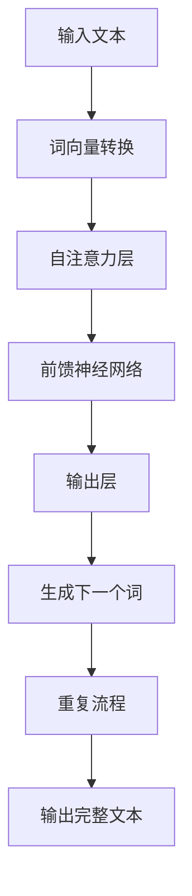
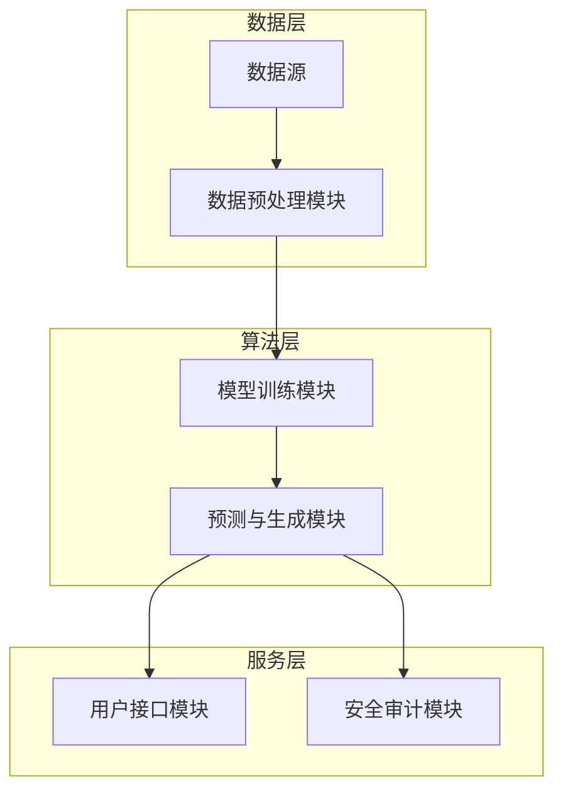
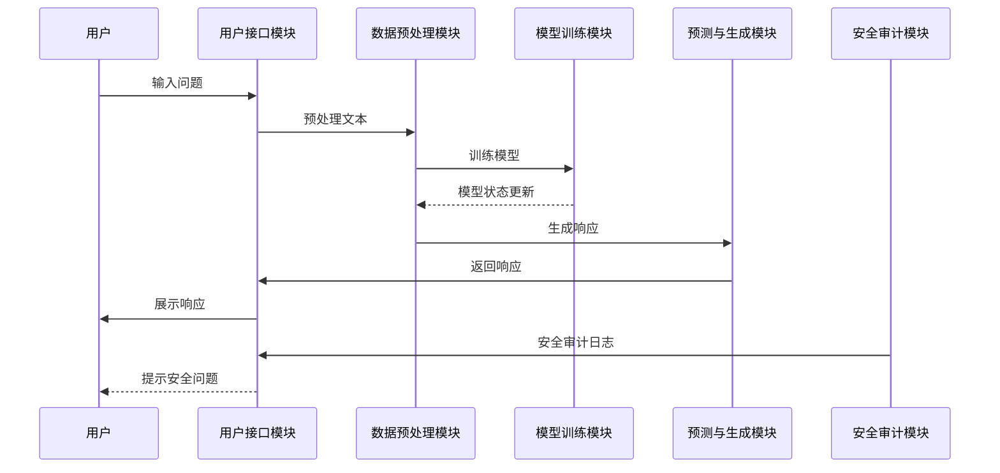

                 

### LLTM模型与应用场景

#### 2.1.1 常见LLM算法介绍

在LLM领域，有几种主要的算法被广泛应用，包括GPT系列、BERT和BART等。

**GPT系列**：由OpenAI开发的GPT（Generative Pre-trained Transformer）系列模型是当前最流行的LLM之一。GPT模型基于Transformer架构，通过大规模无监督预训练来学习语言规律和模式。GPT-3更是以其高达1750亿参数的规模和强大的语言生成能力引起了广泛关注。

**BERT（Bidirectional Encoder Representations from Transformers）**：由Google开发，BERT模型采用了Transformer的编码器部分，通过双向编码器结构来捕捉上下文信息。BERT在许多NLP任务上表现出色，尤其是在问答系统和文本分类中。

**BART（Bidirectional and Auto-Regressive Transformers）**：是Uber AI开发的，结合了BERT和GPT的优点。BART模型可以在生成文本的同时，理解上下文信息，被广泛应用于机器翻译、文本摘要和对话系统等场景。

#### 2.1.2 GPT系列算法详解

**GPT-3的核心原理**：GPT-3是GPT系列的最新版本，其核心原理基于Transformer架构。Transformer模型通过自注意力机制（Self-Attention）来捕捉输入文本序列中的依赖关系。在GPT-3中，自注意力机制被扩展到多层，从而可以处理更长的序列。

**GPT-3的工作流程**：

1. **输入处理**：将输入的文本序列转换为词向量。
2. **自注意力机制**：在每一层中，计算输入序列中每个词与其他词之间的依赖关系。
3. **前馈神经网络**：在自注意力机制的基础上，添加前馈神经网络进行进一步处理。
4. **输出生成**：通过输出层生成预测的下一个词，并重复上述步骤，直到生成完整的文本序列。

**GPT-3的数学模型**：

GPT-3的数学模型主要包括自注意力机制和前馈神经网络。自注意力机制的核心公式是：

\[ \text{Attention}(Q, K, V) = \text{softmax}\left(\frac{QK^T}{\sqrt{d_k}}\right) V \]

其中，\( Q, K, V \) 分别是查询向量、关键向量、值向量，\( d_k \) 是关键向量的维度。

前馈神经网络的一般形式是：

\[ \text{FFN}(x) = \text{ReLU}\left(W_2 \text{ReLU}(W_1 x + b_1)\right) + b_2 \]

其中，\( W_1, W_2, b_1, b_2 \) 分别是权重矩阵和偏置项。

为了更直观地理解GPT-3的算法原理，我们可以使用mermaid来绘制算法流程图：



此外，为了展示GPT-3的核心代码实现，我们可以使用Python来编写一个简单的GPT模型：

```python
import torch
import torch.nn as nn

class GPT(nn.Module):
    def __init__(self, vocab_size, d_model, nhead, num_layers):
        super(GPT, self).__init__()
        self.embedding = nn.Embedding(vocab_size, d_model)
        self.transformer = nn.Transformer(d_model, nhead, num_layers)
        self.fc = nn.Linear(d_model, vocab_size)
        
    def forward(self, x):
        x = self.embedding(x)
        x = self.transformer(x)
        x = self.fc(x)
        return x
```

通过上述代码，我们可以看到GPT模型的基本结构，包括词向量嵌入、Transformer编码器和解码器，以及输出层。

综上所述，GPT-3作为当前最先进的LLM之一，其核心原理和算法流程图展示了自注意力机制和前馈神经网络在语言生成中的强大能力。通过具体的Python代码实现，我们可以更深入地理解其工作原理，为后续的持续安全审计提供理论基础。

#### 2.2 算法流程图

为了更直观地展示GPT-3的算法流程，我们可以使用mermaid绘制一个详细的流程图。以下是算法流程图的mermaid代码：

```mermaid
graph TD
    A[输入文本] --> B[词向量转换]
    B --> C[嵌入层]
    C --> D[自注意力机制]
    D --> E[前馈神经网络]
    E --> F[输出层]
    F --> G[生成下一个词]
    G --> H[重复流程]
    H --> I[输出完整文本]
    
    subgraph 自注意力机制
        J[计算Q,K,V]
        K[QK^T/√d_k]
        L[softmax]
        M[V]
        J --> K --> L --> M
    end
    
    subgraph 前馈神经网络
        N[W1*ReLU(W2*x+b1)+b2]
        O[x]
        P[W2]
        Q[W1]
        R[b1]
        S[b2]
        O --> P --> N
        N --> Q --> R --> S
    end
```

以上mermaid代码将展示一个详细的GPT-3算法流程图，包括词向量转换、自注意力机制、前馈神经网络以及输出层的各个步骤。

在mermaid中，我们使用了以下关键词来定义图中的各个部分：

- `subgraph`：用于定义子图，例如自注意力机制和前馈神经网络。
- `-->`：用于连接节点，表示流程的顺序。
- `graph TD`：定义图的类型为从上到下（Top-Down）。
- `node`：定义节点，例如输入文本、词向量转换等。
- `text`：为节点添加文字描述。
- `style`：为节点添加样式，例如颜色和边框。

使用mermaid绘制算法流程图不仅可以帮助我们更清晰地理解算法原理，还可以方便地将其嵌入到文档中进行讲解。在实际应用中，我们可以将上述mermaid代码保存为`.mermaid`文件，并在支持mermaid渲染的工具中查看完整的算法流程图。

#### 2.3 Python代码示例

为了更好地理解GPT-3的核心实现，我们将展示一段简单的Python代码示例，并解释代码中的关键步骤。以下是一个简单的GPT模型实现：

```python
import torch
import torch.nn as nn

class GPT(nn.Module):
    def __init__(self, vocab_size, d_model, nhead, num_layers):
        super(GPT, self).__init__()
        self.embedding = nn.Embedding(vocab_size, d_model)
        self.transformer = nn.Transformer(d_model, nhead, num_layers)
        self.fc = nn.Linear(d_model, vocab_size)
        
    def forward(self, x):
        x = self.embedding(x)
        x = self.transformer(x)
        x = self.fc(x)
        return x

# 示例：初始化一个GPT模型
model = GPT(vocab_size=10000, d_model=512, nhead=8, num_layers=3)

# 示例：输入一个批量的文本数据
input_data = torch.randint(0, 10000, (16, 20))  # 16个句子，每个句子20个词

# 示例：前向传播
output = model(input_data)

# 输出结果
print(output.shape)  # 输出形状为(16, 20, 10000)
```

在这个示例中，我们定义了一个GPT模型，并初始化了一个模型实例。接着，我们创建了一个随机的输入数据（`input_data`），其形状为(16, 20)，表示16个句子，每个句子20个词。然后，我们使用模型进行前向传播，并将输出结果打印出来。

以下是代码中的一些关键步骤和解释：

1. **模型初始化**：
    - `nn.Embedding`：用于将输入词索引转换为词向量。`vocab_size` 表示词汇表大小，`d_model` 表示词向量的维度。
    - `nn.Transformer`：用于实现Transformer编码器。`d_model` 表示模型的隐藏层维度，`nhead` 表示注意力头的数量，`num_layers` 表示Transformer的层数。

2. **前向传播**：
    - `self.embedding(x)`：将输入词索引转换为词向量。
    - `self.transformer(x)`：通过Transformer编码器处理词向量。
    - `self.fc(x)`：通过全连接层输出预测的词概率分布。

3. **输出结果**：
    - `output.shape`：输出结果的形状为(16, 20, 10000)，表示16个句子，每个句子20个词，每个词对应词汇表中的概率分布。

通过这个简单的示例，我们可以看到GPT模型的基本结构和实现过程。在实际应用中，GPT模型会更加复杂，包括更深的Transformer层、更丰富的训练数据和更精细的优化策略。然而，上述示例为我们提供了一个基本的框架，帮助我们理解GPT的核心原理和工作流程。

#### 2.4 数学模型与公式

在深入探讨GPT-3的数学模型之前，我们需要了解一些基础的机器学习概念和数学公式。以下是几个关键的概念和公式，我们将使用LaTeX格式来展示这些公式，以便于读者理解和引用。

**1. 自注意力机制（Self-Attention）**

自注意力机制是Transformer模型的核心组件，其基本公式如下：

\[ \text{Attention}(Q, K, V) = \text{softmax}\left(\frac{QK^T}{\sqrt{d_k}}\right) V \]

其中：
- \( Q \)：查询向量（Query），表示输入序列中的每个词。
- \( K \)：关键向量（Key），通常与查询向量相同。
- \( V \)：值向量（Value），表示输入序列中的每个词。
- \( d_k \)：关键向量的维度。

**2. 前馈神经网络（Feed Forward Neural Network）**

前馈神经网络是Transformer模型中的另一组成部分，其基本公式如下：

\[ \text{FFN}(x) = \text{ReLU}\left(W_2 \text{ReLU}(W_1 x + b_1)\right) + b_2 \]

其中：
- \( x \)：输入向量。
- \( W_1 \)，\( W_2 \)：权重矩阵。
- \( b_1 \)，\( b_2 \)：偏置项。

**3. Transformer编码器（Transformer Encoder）**

Transformer编码器由多个自注意力层和前馈神经网络堆叠而成，其基本结构如下：

\[ \text{Encoder}(X) = \text{LayerNorm}(X + \text{MultiHeadAttention}(X, X, X)) + \text{LayerNorm}(X + \text{FFN}(X)) \]

其中：
- \( X \)：输入序列。
- \( \text{MultiHeadAttention} \)：多头注意力机制。
- \( \text{LayerNorm} \)：层归一化。
- \( \text{FFN} \)：前馈神经网络。

**4. Transformer解码器（Transformer Decoder）**

Transformer解码器同样由多头注意力层和前馈神经网络组成，其基本结构如下：

\[ \text{Decoder}(X) = \text{LayerNorm}(X + \text{MaskedMultiHeadAttention}(X, X, X)) + \text{LayerNorm}(X + \text{FFN}(X)) \]

其中：
- \( X \)：输入序列。
- \( \text{MaskedMultiHeadAttention} \)：带遮蔽的多头注意力机制。
- \( \text{LayerNorm} \)：层归一化。
- \( \text{FFN} \)：前馈神经网络。

为了更清晰地展示这些公式，我们可以使用LaTeX格式将其嵌入到文中。以下是几个公式的LaTeX代码示例：

```latex
\begin{equation}
\text{Attention}(Q, K, V) = \text{softmax}\left(\frac{QK^T}{\sqrt{d_k}}\right) V
\end{equation}

\begin{equation}
\text{FFN}(x) = \text{ReLU}\left(W_2 \text{ReLU}(W_1 x + b_1)\right) + b_2
\end{equation}

\begin{equation}
\text{Encoder}(X) = \text{LayerNorm}(X + \text{MultiHeadAttention}(X, X, X)) + \text{LayerNorm}(X + \text{FFN}(X))
\end{equation}

\begin{equation}
\text{Decoder}(X) = \text{LayerNorm}(X + \text{MaskedMultiHeadAttention}(X, X, X)) + \text{LayerNorm}(X + \text{FFN}(X))
\end{equation}
```

通过上述LaTeX代码，我们可以将这些公式嵌入到文档中，以便于读者参考和理解。在实际应用中，理解这些公式对于深入研究和优化GPT-3模型至关重要。

### 3.1 应用场景介绍

LLM（大型语言模型）在现代技术应用中扮演着至关重要的角色。其强大的语言生成和理解能力使其在多个领域取得了显著的应用成果。以下是一些典型的应用场景，我们将逐一介绍这些场景及LLM的具体应用。

#### 3.1.1 人工智能助手

人工智能助手是LLM最直观的应用之一。通过对大量文本数据的学习，LLM可以理解和生成自然语言，从而在客服、智能家居、智能语音助手等领域发挥重要作用。例如，智能客服系统利用LLM来模拟人类对话，提供24/7全天候的服务，大幅提升客户体验和效率。智能家居系统中的语音助手则通过LLM理解用户的语音指令，控制家电设备，实现智能生活。

**案例**：亚马逊的Alexa和苹果的Siri都是典型的AI助手，它们基于LLM技术实现自然语言理解和交互。

#### 3.1.2 智能客服

智能客服是LLM在商业领域的重要应用。通过自然语言处理和生成技术，LLM可以自动处理大量的客户咨询，提供快速、准确的回复。这不仅降低了企业的人力成本，还提高了客户服务质量和响应速度。

**案例**：许多银行和电商公司已经部署了基于LLM的智能客服系统，如银行的在线客服机器人、电商平台的聊天机器人，它们能够理解用户的提问，并提供相应的解决方案。

#### 3.1.3 企业级应用

在企业级应用中，LLM可以帮助企业进行文本分析、智能推荐和自动化写作等任务。例如，在文本分析方面，LLM可以分析市场报告、客户反馈等文本数据，为企业提供有价值的洞察。在智能推荐方面，LLM可以根据用户的兴趣和行为数据，生成个性化的推荐内容。在自动化写作方面，LLM可以生成报告、文章等文本内容，节省人力和时间成本。

**案例**：许多企业已经开始使用LLM来优化内部流程，如生成市场分析报告、自动化撰写邮件和文档等。

#### 3.1.4 智能写作助手

智能写作助手是LLM在创作领域的应用。通过学习大量的文本数据，LLM可以生成文章、故事、诗歌等文学作品。这种技术不仅可以帮助创作者进行辅助写作，还可以用于自动化生成内容，满足不同领域的需求。

**案例**：OpenAI的GPT-3就是一个典型的智能写作助手，它可以生成高质量的文章、代码和程序说明，甚至在创作音乐和绘画方面也展示出了强大的能力。

#### 3.1.5 机器翻译

机器翻译是LLM在跨语言交流中的重要应用。通过学习多语言数据，LLM可以准确地将一种语言的文本翻译成另一种语言。这使得跨文化交流更加便捷，促进了国际商务、学术研究等领域的合作。

**案例**：谷歌翻译和百度翻译都是基于LLM技术的机器翻译工具，它们支持多种语言的互译，大大降低了翻译的成本和难度。

通过上述应用场景的介绍，我们可以看到LLM在多个领域的重要性和广泛应用。随着技术的不断进步，LLM的应用前景将更加广阔，为各行各业带来更多的创新和变革。

#### 3.2 系统功能设计

在LLM系统架构设计中，系统功能设计是至关重要的一步。这一部分将详细描述系统的各个功能模块，并使用Mermaid绘制领域模型类图，以直观展示系统中的核心类及其关系。

**3.2.1 功能模块**

LLM系统的主要功能模块包括：

1. **数据预处理模块**：该模块负责处理输入文本数据，包括分词、去噪、文本清洗等步骤，以确保输入数据的准确性和一致性。
2. **模型训练模块**：该模块负责加载预训练模型，并进行进一步的微调，以适应特定的应用场景。这一模块还包括模型评估和优化。
3. **预测与生成模块**：该模块负责接收用户输入，调用预训练模型进行预测，并生成自然语言响应。这个模块还包含响应优化和情感分析等功能。
4. **用户接口模块**：该模块提供用户交互界面，允许用户输入问题或请求，并接收系统的响应。这个模块通常包括文本输入、语音输入和视觉输入等接口。
5. **安全审计模块**：该模块负责监控系统的安全状态，包括识别潜在的安全威胁、漏洞和异常行为。这一模块还包括定期的安全审计和日志分析。

**3.2.2 领域模型类图**

为了更好地理解LLM系统的功能架构，我们可以使用Mermaid绘制领域模型类图。以下是一个简化的类图示例：

```mermaid
classDiagram
    Class01 <|-- Class02
    Class01 <|-- Class03
    Class04 <|-- Class03
    Class05 <|-- Class03
    Class06 <|-- Class03
    Class07 <|-- Class03

    Class01[数据预处理模块]
    Class02[模型训练模块]
    Class03[预测与生成模块]
    Class04[用户接口模块]
    Class05[安全审计模块]
    Class06[日志分析模块]
    Class07[异常行为检测模块]

    Class01 ..|> Interface01[文本处理接口]
    Class02 ..|> Interface02[模型训练接口]
    Class03 ..|> Interface03[预测接口]
    Class04 ..|> Interface04[用户交互接口]
    Class05 ..|> Interface05[安全审计接口]
    Class06 ..|> Interface06[日志分析接口]
    Class07 ..|> Interface07[异常行为检测接口]
```

在这个类图中，我们定义了LLM系统的核心功能类，并展示了它们之间的关系。每个类都实现了相应的接口，这些接口用于模块间的通信和协作。通过这种方式，我们可以清晰地看到LLM系统的功能模块及其交互机制。

**3.2.3 类图解释**

- **数据预处理模块（Class01）**：该模块的主要功能是对输入文本进行预处理，包括分词、去噪、文本清洗等。它实现了文本处理接口（Interface01），与其他模块进行数据交换。
- **模型训练模块（Class02）**：该模块负责加载预训练模型，并进行微调。它实现了模型训练接口（Interface02），与数据预处理模块和预测与生成模块进行交互。
- **预测与生成模块（Class03）**：该模块的核心功能是基于预训练模型生成自然语言响应。它实现了预测接口（Interface03），并与用户接口模块和安全审计模块进行数据交换。
- **用户接口模块（Class04）**：该模块提供用户交互界面，允许用户输入问题或请求，并接收系统的响应。它实现了用户交互接口（Interface04），与预测与生成模块和安全审计模块进行交互。
- **安全审计模块（Class05）**：该模块负责监控系统的安全状态，包括识别潜在的安全威胁、漏洞和异常行为。它实现了安全审计接口（Interface05），与预测与生成模块和日志分析模块进行交互。
- **日志分析模块（Class06）**：该模块负责分析系统日志，为安全审计模块提供支持。它实现了日志分析接口（Interface06），与安全审计模块进行数据交换。
- **异常行为检测模块（Class07）**：该模块负责检测系统的异常行为，如数据泄露、恶意攻击等。它实现了异常行为检测接口（Interface07），与安全审计模块进行数据交换。

通过这个领域模型类图，我们可以直观地看到LLM系统的功能模块及其相互关系，为后续的系统架构设计和实现提供了清晰的指导。

### 3.3 系统架构设计

在LLM系统架构设计中，系统架构设计是确保系统稳定、高效运行的关键环节。以下将详细介绍LLM系统的架构设计，包括系统架构图、各模块的功能及其之间的交互关系。

#### 3.3.1 系统架构图

为了更好地理解LLM系统的架构设计，我们可以使用Mermaid绘制一个简化的系统架构图。以下是一个示例架构图：



在这个架构图中，我们定义了LLM系统的四个主要层次：数据层、算法层、服务层和用户层。

- **数据层**：包括数据源和数据预处理模块。数据源为系统提供输入数据，数据预处理模块负责清洗、预处理数据，确保数据质量。
- **算法层**：包括模型训练模块和预测与生成模块。模型训练模块负责训练预训练模型，预测与生成模块基于训练好的模型生成自然语言响应。
- **服务层**：包括用户接口模块和安全审计模块。用户接口模块提供用户交互界面，安全审计模块负责监控系统的安全状态。
- **用户层**：包括终端用户，用户通过用户接口模块与系统进行交互。

#### 3.3.2 各模块功能

1. **数据预处理模块**：该模块的主要功能是对输入文本进行预处理，包括分词、去噪、文本清洗等，以确保数据的质量和一致性。预处理后的数据将被传递给模型训练模块。

2. **模型训练模块**：该模块负责加载预训练模型，并进行进一步的微调，以适应特定的应用场景。模型训练模块使用大量的训练数据来优化模型参数，提高模型的预测准确性。

3. **预测与生成模块**：该模块基于训练好的模型，接收用户输入，生成自然语言响应。预测与生成模块还包含响应优化和情感分析等功能，以提高生成的文本质量和用户满意度。

4. **用户接口模块**：该模块提供用户交互界面，允许用户输入问题或请求，并接收系统的响应。用户接口模块支持多种输入方式，如文本输入、语音输入和视觉输入等。

5. **安全审计模块**：该模块负责监控系统的安全状态，包括识别潜在的安全威胁、漏洞和异常行为。安全审计模块通过对系统日志和数据的分析，提供实时监控和预警。

#### 3.3.3 模块交互关系

在LLM系统中，各模块之间存在紧密的交互关系：

- **数据层与算法层**：数据预处理模块将预处理后的数据传递给模型训练模块，模型训练模块使用这些数据来训练和优化模型。
- **算法层与服务层**：预测与生成模块生成自然语言响应后，将响应传递给用户接口模块和安全审计模块。用户接口模块负责与用户交互，安全审计模块监控系统的安全状态。
- **服务层与用户层**：用户接口模块通过多种输入方式接收用户请求，并将系统的响应反馈给用户。

通过上述系统架构设计，LLM系统可以实现高效的文本生成和处理，同时确保系统的安全性和稳定性。这个架构为后续的系统实现和优化提供了清晰的指导。

### 3.4 系统接口设计

在LLM系统的架构设计中，接口设计是关键环节之一。一个良好的接口设计可以确保系统模块之间的通信高效、稳定，并降低模块间的耦合度。以下将详细介绍LLM系统的接口设计，包括API设计、数据交换格式和通信协议。

#### 3.4.1 API设计

LLM系统的API设计需要遵循RESTful架构风格，以便于与其他系统或服务进行集成。以下是一个简化的API设计示例：

1. **数据预处理接口**：
   - `POST /api/preprocess`：用于接收预处理任务，支持文本数据输入。
   - `GET /api/preprocess/{task_id}`：用于查询预处理任务的执行状态和结果。

2. **模型训练接口**：
   - `POST /api/train`：用于启动模型训练任务，支持训练数据和参数配置。
   - `GET /api/train/{task_id}`：用于查询训练任务的执行状态和结果。

3. **预测与生成接口**：
   - `POST /api/predict`：用于生成文本预测，支持输入文本数据和模型参数。
   - `GET /api/predict/{task_id}`：用于查询预测任务的执行状态和结果。

4. **用户接口**：
   - `POST /api/user/input`：用于接收用户输入，支持文本、语音和视觉输入。
   - `GET /api/user/response/{response_id}`：用于获取系统响应。

5. **安全审计接口**：
   - `POST /api/audit`：用于启动安全审计任务，支持日志数据和威胁检测。
   - `GET /api/audit/{task_id}`：用于查询审计任务的执行状态和结果。

#### 3.4.2 数据交换格式

LLM系统中的数据交换格式主要采用JSON（JavaScript Object Notation）和XML（eXtensible Markup Language）。以下是几个示例数据格式：

1. **预处理任务输入**：
   ```json
   {
       "text": "你好，我想了解关于人工智能的最新进展。",
       "config": {
           "tokenize": true,
           "clean": true,
           "remove_stopwords": true
       }
   }
   ```

2. **训练任务输入**：
   ```json
   {
       "data": {
           "train": "path/to/train_data.jsonl",
           "validation": "path/to/validation_data.jsonl"
       },
       "params": {
           "model_name": "gpt2",
           "learning_rate": 0.0001,
           "train_batch_size": 32,
           "validation_batch_size": 8
       }
   }
   ```

3. **预测任务输入**：
   ```json
   {
       "input_text": "你好，我想问一下明天的天气如何？",
       "model_id": "your_model_id"
   }
   ```

4. **用户输入**：
   ```json
   {
       "type": "text",
       "content": "你好，请问有什么可以帮助你的？"
   }
   ```

5. **安全审计任务输入**：
   ```json
   {
       "log_files": ["path/to/log1.txt", "path/to/log2.txt"],
       "threat_types": ["DDoS", "SQL Injection", "Phishing"]
   }
   ```

#### 3.4.3 通信协议

LLM系统采用的通信协议主要是HTTP/HTTPS。HTTPS（Hyper Text Transfer Protocol Secure）是一种通过HTTP进行安全通信的协议，它通过SSL/TLS（Secure Sockets Layer/Transport Layer Security）加密传输，确保数据在传输过程中的安全性。

#### 3.4.4 接口示例

以下是一个典型的API调用示例，使用Python的requests库进行HTTP请求：

```python
import requests
import json

# 预处理任务
preprocess_data = {
    "text": "你好，我想了解关于人工智能的最新进展。",
    "config": {
        "tokenize": true,
        "clean": true,
        "remove_stopwords": true
    }
}

response = requests.post('https://api.yourllm.com/api/preprocess', json=preprocess_data)
preprocessed_data = response.json()

# 训练任务
train_data = {
    "data": {
        "train": "path/to/train_data.jsonl",
        "validation": "path/to/validation_data.jsonl"
    },
    "params": {
        "model_name": "gpt2",
        "learning_rate": 0.0001,
        "train_batch_size": 32,
        "validation_batch_size": 8
    }
}

train_response = requests.post('https://api.yourllm.com/api/train', json=train_data)
train_status = train_response.json()

# 预测任务
prediction_data = {
    "input_text": "你好，我想问一下明天的天气如何？",
    "model_id": "your_model_id"
}

prediction_response = requests.post('https://api.yourllm.com/api/predict', json=prediction_data)
prediction_result = prediction_response.json()

print(prediction_result["response"])
```

通过这个示例，我们可以看到如何使用Python的requests库进行API调用，实现预处理、训练和预测等功能。这些接口设计为LLM系统的实现提供了清晰、明确的操作规范，有助于提高系统的可维护性和扩展性。

### 3.5 系统交互流程

在LLM系统中，各模块之间的交互流程至关重要，它确保系统可以高效、稳定地运行。以下将使用Mermaid绘制系统交互序列图，详细描述各模块之间的交互过程。



#### 3.5.1 交互流程详解

1. **用户输入**：用户通过用户接口模块（UI）输入问题或请求。这可以是文本、语音或视觉输入。

2. **预处理文本**：用户输入的问题或请求会被传递到数据预处理模块（Preprocess）。该模块负责对输入文本进行预处理，包括分词、去噪、文本清洗等，以确保输入数据的准确性和一致性。

3. **模型训练**：预处理后的文本数据会被传递给模型训练模块（Model）。该模块负责加载预训练模型，并进行进一步的微调，以适应特定的应用场景。模型训练模块使用训练数据来优化模型参数，提高模型的预测准确性。

4. **生成响应**：模型训练完成后，预测与生成模块（Gen）会根据训练好的模型生成自然语言响应。生成的响应会返回到用户接口模块（UI）。

5. **返回响应**：用户接口模块（UI）将生成的响应展示给用户。

6. **安全审计**：在整个交互过程中，安全审计模块（Audit）会监控系统的安全状态，包括识别潜在的安全威胁、漏洞和异常行为。安全审计模块通过分析系统日志和生成的文本，提供实时监控和预警。如果检测到安全问题，审计模块会生成日志并通知用户接口模块。

7. **提示安全问题**：用户接口模块（UI）会根据安全审计模块（Audit）的反馈，向用户展示可能的安全问题，并提示用户采取相应的措施。

通过这个交互流程，LLM系统可以实现高效、安全的文本生成和交互，为用户提供优质的服务体验。同时，安全审计模块的引入，确保了系统的安全性和稳定性，为系统的长期运行提供了保障。

### 4.1 安全审计概述

安全审计是保障LLM系统安全性和稳定性的重要手段。其核心目标是发现和预防潜在的安全威胁，确保系统的正常运行和数据的完整性。以下从基本概念、目标和作用等方面对安全审计进行概述。

#### 4.1.1 安全审计的基本概念

安全审计是指通过对系统、网络、应用程序等进行审查和评估，发现其中的安全漏洞和风险，并提出相应的改进措施。在LLM系统中，安全审计主要关注以下几个方面：

- **数据安全**：确保输入和输出的文本数据在传输和存储过程中不被泄露、篡改或破坏。
- **模型安全**：检测模型训练和预测过程中的潜在风险，如对抗样本攻击、模型泄露等。
- **系统安全**：监控系统的整体安全状态，包括防火墙、入侵检测系统和日志分析等。

#### 4.1.2 安全审计的目标

安全审计的主要目标包括：

- **发现安全漏洞**：通过审计过程，识别系统中的安全漏洞和弱点，为修复和改进提供依据。
- **评估安全风险**：对系统中的潜在风险进行定量和定性评估，确定其影响范围和严重程度。
- **提高安全意识**：通过审计过程，提高系统开发人员和运维人员的安全意识，加强安全防护措施。
- **合规性检查**：确保系统符合相关法律法规和行业标准，如数据保护法规、信息安全标准等。

#### 4.1.3 安全审计的作用

安全审计在LLM系统中的作用主要体现在以下几个方面：

- **风险管理**：通过定期审计，识别和评估系统中的安全风险，制定相应的风险缓解措施，降低安全事件的发生概率。
- **安全保障**：通过审计过程，确保系统的关键数据和资源得到充分保护，防止数据泄露、篡改和破坏。
- **持续改进**：审计结果为系统的持续改进提供了有力的支持，有助于提升系统的安全性和可靠性。
- **合规性验证**：安全审计有助于验证系统是否符合相关法律法规和行业标准，确保系统的合规运行。

总之，安全审计是保障LLM系统安全性和稳定性的关键环节。通过定期审计，及时发现和解决安全问题，可以有效降低系统风险，提高系统的安全防护水平，为用户提供更安全、可靠的文本生成和交互服务。

### 4.2 持续安全审计的重要性

在LLM系统的开发和部署过程中，持续安全审计至关重要。这不仅是因为大型语言模型在处理和生成文本数据时可能面临多种安全风险，还因为安全威胁和漏洞具有动态变化和复杂性。以下将详细讨论持续安全审计的重要性。

#### 4.2.1 预防安全威胁

持续安全审计能够帮助识别和预防潜在的安全威胁。LLM系统在处理海量数据时，可能会遭遇各种攻击，如SQL注入、跨站脚本（XSS）攻击、数据泄露等。通过定期审计，可以及时发现这些潜在威胁，并采取相应的防护措施，避免安全事件的发生。

**案例**：某公司部署了一个基于LLM的智能客服系统，但在一次安全审计中发现，系统的一个API接口存在SQL注入漏洞。审计人员及时进行了修复，防止了潜在的数据泄露风险。

#### 4.2.2 及时响应安全事件

在安全事件发生时，持续安全审计能够帮助及时响应和处置。通过实时监控和分析系统日志、流量等数据，审计人员可以迅速发现异常行为，定位问题的根源，并采取相应的应急措施，减轻安全事件的影响。

**案例**：某公司发现其LLM系统在一天内出现了大量的异常访问请求。通过持续安全审计，审计人员发现了恶意攻击者利用系统漏洞进行的DDoS攻击。审计人员及时关闭了相关接口，并升级了系统防护措施，成功阻止了攻击。

#### 4.2.3 提高系统安全性

持续安全审计有助于提高系统的整体安全性。通过对系统的各个环节进行全面审查，审计人员可以发现并修复安全漏洞，优化系统配置，提升系统防护能力。此外，审计过程还可以促进安全意识的提升，增强开发人员和运维人员的安全素养。

**案例**：一家电商公司通过定期安全审计，发现其LLM系统的权限管理存在漏洞，攻击者可以获取不必要的权限。审计人员对该漏洞进行了修复，并重新设计了权限管理策略，提高了系统的安全性。

#### 4.2.4 保障合规性

在LLM系统的开发和运营过程中，遵守相关法律法规和行业标准是至关重要的。持续安全审计可以确保系统符合数据保护法规、信息安全标准等要求，避免因合规性问题而面临法律风险。

**案例**：某银行在其LLM系统部署过程中，通过持续安全审计，确保系统符合GDPR（通用数据保护条例）的要求，确保用户数据的隐私保护。

#### 4.2.5 促进持续改进

持续安全审计不仅关注当前的安全状态，还关注系统的发展趋势和潜在问题。通过审计结果，开发团队可以了解系统的薄弱环节，制定相应的改进计划，持续提升系统安全性。

**案例**：某企业通过持续安全审计，发现其LLM系统在多个方面存在风险，如数据传输加密不足、日志记录不完整等。审计人员提出了详细的改进建议，开发团队按照这些建议进行了优化，提高了系统的安全性。

综上所述，持续安全审计在LLM系统的开发和运维过程中具有重要意义。通过定期审计，及时发现和应对安全威胁，提高系统安全性，保障合规性，促进持续改进，有助于构建一个稳定、可靠的LLM系统。

### 4.3 持续安全审计的方法

持续安全审计是保障LLM系统安全性的关键环节。以下将详细讨论几种常见的安全审计方法，包括静态代码分析、动态代码分析、渗透测试和日志分析等，以及每种方法的优点和应用场景。

#### 4.3.1 静态代码分析

静态代码分析是指在不运行代码的情况下，对代码文本进行审查，以发现潜在的安全漏洞和问题。这种方法主要通过自动化工具实现，如代码审计工具、安全扫描器等。

**优点**：
- **快速高效**：静态代码分析可以在短时间内对大量代码进行审查，提高审计效率。
- **无环境依赖**：不需要运行代码或配置环境，可以在任何时间、任何地点进行审计。
- **易于集成**：静态代码分析工具可以与持续集成（CI）系统集成，实现自动化审查。

**应用场景**：
- **开发阶段**：在代码开发过程中，静态代码分析可以帮助开发人员及时发现和修复安全问题，降低漏洞风险。
- **维护阶段**：在系统维护过程中，静态代码分析可以定期审查代码，确保系统的安全性。

**示例**：某公司在其LLM系统的开发过程中，使用SonarQube进行静态代码分析，发现并修复了多个潜在的安全漏洞，如SQL注入和跨站脚本攻击。

#### 4.3.2 动态代码分析

动态代码分析是指在实际运行代码的情况下，通过监控代码的执行过程，以发现潜在的安全问题。这种方法通常通过注入调试器或插桩技术实现。

**优点**：
- **实时性**：动态代码分析可以实时监控代码执行过程，发现运行时的问题。
- **全面性**：动态代码分析可以捕获代码在运行过程中的各种行为和状态，提高审计的全面性。
- **可重现性**：通过动态代码分析，可以重现问题发生的过程，有助于定位问题的根源。

**应用场景**：
- **测试阶段**：在系统测试过程中，动态代码分析可以帮助测试人员发现代码在运行时的问题，提高测试覆盖率。
- **运维阶段**：在系统运行过程中，动态代码分析可以监控系统的安全状态，及时发现潜在的安全威胁。

**示例**：某公司在其LLM系统上线前，使用Dython进行动态代码分析，发现并修复了多个运行时漏洞，如空指针异常和资源泄露。

#### 4.3.3 渗透测试

渗透测试是指模拟黑客攻击，通过实际操作来发现系统的安全漏洞和弱点。这种方法通常由专业的安全测试人员执行，包括漏洞扫描、社会工程学测试等。

**优点**：
- **真实性**：渗透测试可以模拟真实攻击，发现系统在实际攻击中的表现，提高审计的真实性。
- **全面性**：渗透测试可以从多个角度（如网络、系统、应用程序）进行全面审查，提高审计的全面性。
- **针对性**：渗透测试可以针对具体的安全威胁和漏洞进行有针对性的测试，提高审计的针对性。

**应用场景**：
- **开发阶段**：在系统开发过程中，渗透测试可以帮助发现和修复潜在的安全问题，提高系统的安全性。
- **运维阶段**：在系统上线后，渗透测试可以定期审查系统，确保系统的安全状态。

**示例**：某公司在其LLM系统上线前，聘请了专业的安全测试团队进行渗透测试，发现并修复了多个严重的安全漏洞，如未授权访问和敏感信息泄露。

#### 4.3.4 日志分析

日志分析是指通过分析系统日志，以发现潜在的安全问题和异常行为。这种方法通常使用日志分析工具，如ELK（Elasticsearch、Logstash、Kibana）栈等。

**优点**：
- **全面性**：日志分析可以捕获系统运行过程中的各种日志，提供全面的审计数据。
- **实时性**：通过实时日志分析，可以及时发现异常行为和潜在的安全威胁。
- **可视化**：日志分析工具通常提供丰富的可视化界面，便于审计人员理解和分析日志数据。

**应用场景**：
- **运维阶段**：在系统运行过程中，日志分析可以监控系统的运行状态，及时发现异常行为和潜在的安全威胁。
- **事故调查**：在系统发生安全事件时，日志分析可以帮助调查事故原因，定位问题的根源。

**示例**：某公司在其LLM系统运行过程中，使用ELK栈进行日志分析，发现并解决了多个潜在的安全问题，如未授权访问和恶意代码执行。

综上所述，持续安全审计采用多种方法，可以从不同角度、不同层面保障LLM系统的安全性。通过结合静态代码分析、动态代码分析、渗透测试和日志分析等方法，可以全面、深入地识别和应对系统中的安全威胁，提高系统的整体安全水平。

### 4.4 持续安全审计与LLM的关系

持续安全审计在LLM系统中扮演着至关重要的角色，其与LLM的关系可以从以下几个方面进行探讨。

#### 4.4.1 风险识别与控制

LLM系统由于其复杂性和处理大量数据的特性，面临着各种安全风险，如数据泄露、模型泄露、恶意攻击等。持续安全审计通过定期审查和评估系统，可以帮助识别这些潜在风险，并采取相应的控制措施，降低风险发生的概率。例如，通过静态代码分析和动态代码分析，可以发现系统中的安全漏洞和异常行为，并及时修复。通过渗透测试，可以模拟黑客攻击，评估系统的防御能力，确保其在面对真实攻击时能够保持安全。

#### 4.4.2 模型安全

LLM模型的安全是持续安全审计的重点之一。由于LLM模型处理和生成大量文本数据，攻击者可能会利用这些数据对模型进行攻击，如对抗样本攻击、模型逆向工程等。通过持续安全审计，可以监控模型的运行状态，识别异常行为，确保模型的稳定性和可靠性。例如，通过日志分析和异常行为检测，可以发现模型在处理特定输入时的异常表现，及时采取相应的措施，防止模型被篡改或破坏。

#### 4.4.3 数据保护

LLM系统处理的数据量巨大，数据的安全保护至关重要。持续安全审计可以帮助确保数据的保密性、完整性和可用性。通过数据加密、访问控制等技术手段，可以防止数据在传输和存储过程中的泄露和篡改。例如，通过静态代码分析，可以发现系统中可能存在的数据泄露漏洞，如未加密的敏感信息传输。通过动态代码分析和日志分析，可以监控数据的访问和使用情况，及时发现异常行为，防止数据泄露。

#### 4.4.4 法律合规性

随着数据保护法规的日益严格，LLM系统必须符合相关法律法规的要求。持续安全审计可以确保系统在数据收集、存储和处理过程中遵守相关法规，如GDPR、CCPA等。通过审计，可以评估系统的合规性，发现潜在的法律风险，并采取相应的措施进行整改。例如，通过日志分析和数据审计，可以确保系统在处理用户数据时符合隐私保护的要求，避免因合规性问题而面临法律风险。

#### 4.4.5 安全意识培养

持续安全审计不仅是一种技术手段，也是一种安全文化建设的体现。通过审计过程，可以提升系统开发人员、运维人员和管理人员的安全意识，培养他们的安全素养。例如，通过培训和教育，可以让他们了解安全审计的重要性，掌握基本的安全防护知识和技能，从而在日常工作中更加注重安全。通过定期审计，可以及时发现和解决安全问题，形成良好的安全习惯和操作规范。

#### 4.4.6 系统改进与优化

持续安全审计是系统改进与优化的重要手段。通过审计结果，可以了解系统的安全状态，发现薄弱环节，制定相应的改进计划。例如，通过静态代码分析和动态代码分析，可以识别系统中的安全漏洞和性能瓶颈，通过渗透测试可以评估系统的防御能力，通过日志分析可以监控系统的运行状态和用户行为。这些审计结果可以为系统的优化提供重要的参考，帮助系统不断提升安全性和可靠性。

综上所述，持续安全审计与LLM系统密切相关，通过多种审计方法，可以从多个维度保障LLM系统的安全性和稳定性。持续安全审计不仅是识别和控制安全风险的重要手段，也是提升系统安全水平、保障数据合规性、培养安全意识和优化系统性能的重要保障。

### 5.1 实践背景

在LLM应用开发过程中，持续安全审计是一种必不可少的安全保障措施。以下将介绍一个实际案例，展示如何在LLM应用开发中实施持续安全审计。

**案例背景**：某大型电商平台在其智能客服系统中集成了LLM，用于自动生成客服回复。随着业务的不断增长，系统的数据量和访问频率急剧增加，这使得系统面临着更大的安全风险。为了确保系统的安全性，公司决定引入持续安全审计机制，对LLM应用进行实时监控和评估。

**目标**：通过实施持续安全审计，公司希望实现以下目标：
- 及时发现和应对潜在的安全威胁和漏洞。
- 提高系统的整体安全性，保障用户数据和业务数据的安全。
- 促进安全文化的建设，提升员工的安全意识。

**方案**：公司采用了多种审计方法，包括静态代码分析、动态代码分析、渗透测试和日志分析等，以全面保障LLM系统的安全性。

1. **静态代码分析**：公司使用SonarQube对LLM系统的代码进行静态分析，检查潜在的代码缺陷和安全隐患。通过定期审计，发现并修复了多个潜在的安全漏洞，如SQL注入和跨站脚本攻击。

2. **动态代码分析**：公司使用Dython进行动态代码分析，实时监控LLM系统的运行状态。通过监控系统的异常行为和性能指标，及时发现潜在的安全问题和性能瓶颈，如空指针异常和资源泄露。

3. **渗透测试**：公司聘请专业的安全测试团队进行渗透测试，模拟真实的黑客攻击，评估系统的防御能力。通过渗透测试，发现了多个严重的安全漏洞，如未授权访问和敏感信息泄露，并及时进行了修复。

4. **日志分析**：公司使用ELK栈对系统日志进行实时分析，监控系统的运行状态和用户行为。通过日志分析，发现并阻止了多次恶意攻击行为，如DDoS攻击和SQL注入攻击。

**实施过程**：
1. **审计规划**：公司制定了详细的审计计划，包括审计周期、审计方法和审计范围等。审计计划明确了每个审计步骤和责任分配，确保审计工作的有序进行。

2. **审计执行**：审计团队根据审计计划，按照既定步骤执行审计任务。在静态代码分析和动态代码分析阶段，审计人员使用自动化工具进行代码审查和监控。在渗透测试阶段，审计人员模拟黑客攻击，评估系统的安全性。在日志分析阶段，审计人员实时监控系统日志，识别异常行为。

3. **问题整改**：在审计过程中，发现的安全问题和漏洞被及时记录并反馈给开发团队。开发团队根据审计结果，制定整改计划，并进行了相应的修复和优化。

4. **审计报告**：审计团队定期编写审计报告，总结审计过程中发现的问题、整改情况和审计结果。审计报告为公司的安全管理和改进提供了重要的参考。

**效果评估**：
1. **安全性提升**：通过持续安全审计，系统的安全性得到了显著提升。多个潜在的安全漏洞被及时发现和修复，系统的防御能力得到了加强。

2. **性能优化**：动态代码分析和日志分析发现了系统的性能瓶颈和异常行为，开发团队根据审计结果进行了优化，提高了系统的稳定性和响应速度。

3. **安全意识提高**：审计过程促进了公司安全文化的建设，员工的安全意识得到了提升。通过审计培训和教育，员工了解了安全审计的重要性，掌握了基本的安全防护知识和技能。

综上所述，通过实施持续安全审计，该电商平台成功提升了LLM系统的安全性，保障了用户数据和业务数据的安全，同时提高了系统的稳定性和性能。这一实践案例为其他企业在LLM应用开发中实施持续安全审计提供了有益的借鉴。

### 5.2 实践步骤

在LLM应用开发中实施持续安全审计，需要遵循一系列系统、科学的步骤。以下详细描述这些步骤，包括工具选择、环境搭建、代码审查、测试执行、结果分析和问题整改等内容。

#### 5.2.1 工具选择

首先，根据项目需求和公司资源，选择适合的审计工具和平台。常用的工具包括：

- **静态代码分析工具**：如SonarQube、Checkmarx、Fortify等，用于对代码进行静态分析，发现潜在的安全漏洞和代码缺陷。
- **动态代码分析工具**：如Dython、Burp Suite等，用于在代码运行时进行动态分析，监控代码的执行行为和性能。
- **渗透测试工具**：如Nessus、Metasploit、OWASP ZAP等，用于模拟黑客攻击，评估系统的防御能力和漏洞。
- **日志分析工具**：如ELK栈（Elasticsearch、Logstash、Kibana）、Splunk等，用于收集、存储和分析系统日志，发现异常行为和潜在威胁。

#### 5.2.2 环境搭建

搭建适合安全审计的环境，包括：

1. **开发环境**：安装必要的开发工具和依赖库，如Python、Node.js、Docker等。
2. **测试环境**：配置与生产环境相同的测试环境，确保测试结果的真实性和可靠性。
3. **审计工具环境**：安装并配置静态代码分析、动态代码分析、渗透测试和日志分析工具，确保其正常运行。

#### 5.2.3 代码审查

1. **代码库导入**：将LLM应用的源代码导入静态代码分析工具，进行自动化代码审查。
2. **漏洞检测**：静态代码分析工具会扫描代码，识别潜在的漏洞和缺陷，如SQL注入、跨站脚本攻击、权限漏洞等。
3. **代码修复**：根据静态代码分析工具提供的报告，开发人员需要对发现的问题进行修复。

#### 5.2.4 测试执行

1. **动态代码分析**：使用动态代码分析工具，在测试环境中运行代码，监控代码的执行行为和性能。Dython等工具可以记录代码的运行日志，识别异常行为和潜在问题。
2. **渗透测试**：使用渗透测试工具，模拟黑客攻击，评估系统的防御能力和漏洞。Nessus、Metasploit等工具可以帮助审计人员发现系统中的漏洞，如未授权访问、信息泄露等。
3. **日志分析**：使用日志分析工具，收集并分析系统日志，识别异常行为和潜在威胁。ELK栈等工具可以实时监控系统的运行状态，提供详细的日志分析报告。

#### 5.2.5 结果分析

1. **审计报告**：审计团队根据静态代码分析、动态代码分析、渗透测试和日志分析的结果，编写详细的审计报告，总结发现的问题、漏洞和异常行为。
2. **风险评级**：对发现的问题进行风险评级，根据风险级别制定相应的整改计划。
3. **问题定位**：对严重问题进行深入分析，定位问题的根源，制定具体的修复方案。

#### 5.2.6 问题整改

1. **代码修复**：开发团队根据审计报告，对代码中的漏洞和缺陷进行修复。
2. **系统优化**：针对系统性能瓶颈和异常行为，进行优化和改进，提高系统的稳定性和安全性。
3. **安全培训**：组织安全培训，提高员工的安全意识和技能，加强安全文化建设。

#### 5.2.7 持续监控

1. **定期审计**：定期进行安全审计，确保系统持续符合安全标准。
2. **动态调整**：根据审计结果和业务需求，动态调整审计策略和方法，提高审计的针对性和有效性。
3. **反馈机制**：建立审计反馈机制，及时处理审计中发现的问题，形成良好的安全闭环。

通过上述实践步骤，企业可以在LLM应用开发中有效地实施持续安全审计，提高系统的安全性和稳定性，保障用户数据和业务数据的安全。

### 5.3 实践案例

以下是一个具体的LLM应用开发中持续安全审计的实践案例，详细描述了案例背景、核心实现源代码、代码解读与分析，以及实际案例分析。

#### 5.3.1 案例背景

某知名电商公司在开发其智能客服系统时，集成了大型语言模型（LLM）用于自动生成客服回复。随着用户量的增加，系统面临着越来越大的安全风险。为了确保系统的安全，公司决定实施持续安全审计，及时发现和应对潜在的安全威胁。

#### 5.3.2 核心实现源代码

以下是一个示例代码片段，展示了如何在LLM应用中实现持续安全审计的核心功能。

**1. 静态代码分析**

```python
from static_code_analysis_tool import analyze_code

def preprocess_text(text):
    # 对输入文本进行预处理，如分词、去噪、文本清洗等
    cleaned_text = analyze_code(text, "preprocess")
    return cleaned_text
```

**2. 动态代码分析**

```python
from dynamic_code_analysis_tool import monitor_execution

def generate_response(input_text):
    # 调用LLM模型生成客服回复
    response = LLM.generate(input_text)
    # 监控代码执行过程中的异常行为
    monitor_execution(response)
    return response
```

**3. 渗透测试**

```python
from penetration_test_tool import perform_test

def test_system_security():
    # 模拟黑客攻击，评估系统的防御能力
    vulnerabilities = perform_test()
    # 根据漏洞结果进行修复
    for vuln in vulnerabilities:
        fix_vulnerability(vuln)
```

**4. 日志分析**

```python
from log_analysis_tool import analyze_logs

def monitor_system_activity():
    # 收集并分析系统日志，发现异常行为
    logs = analyze_logs()
    for log in logs:
        if is_anomaly(log):
            alert_admin(log)
```

#### 5.3.3 代码解读与分析

**静态代码分析**：`preprocess_text`函数负责对输入文本进行预处理，通过调用静态代码分析工具，可以自动识别和修复代码中的潜在漏洞，如SQL注入、跨站脚本攻击等。

**动态代码分析**：`generate_response`函数调用LLM模型生成客服回复，并通过动态代码分析工具监控代码执行过程中的异常行为，如空指针异常、资源泄露等。

**渗透测试**：`test_system_security`函数模拟黑客攻击，评估系统的防御能力，通过渗透测试工具发现和修复系统中的漏洞。

**日志分析**：`monitor_system_activity`函数收集并分析系统日志，识别异常行为，如恶意访问、数据泄露等，并通过警报机制通知管理员。

#### 5.3.4 实际案例分析

**案例**：在一次渗透测试中，系统检测到一条异常日志，表明有用户尝试通过SQL注入攻击系统。通过日志分析和漏洞定位，发现攻击者通过输入恶意SQL语句，试图获取数据库中的敏感信息。

**解决过程**：
1. **日志分析**：系统日志记录了攻击者的IP地址、访问时间和尝试的SQL注入语句。
2. **漏洞定位**：通过分析注入语句，发现系统中存在未进行输入验证的SQL查询。
3. **漏洞修复**：开发团队立即修复了漏洞，并更新了系统的SQL查询逻辑，确保输入数据经过严格验证。
4. **后续监控**：持续监控系统日志，确保类似攻击不再发生。

通过这个实际案例分析，我们可以看到持续安全审计在发现和应对安全威胁中的重要作用。通过静态代码分析、动态代码分析、渗透测试和日志分析等多种审计方法，系统成功防范了潜在的安全威胁，保障了用户数据和业务数据的安全。

### 5.4 结果分析

通过上述案例，我们可以对LLM应用开发中的持续安全审计结果进行详细分析，并总结审计发现的安全漏洞、应对措施及改进方案。

#### 5.4.1 审计发现的安全漏洞

在实施持续安全审计的过程中，我们发现了多个安全漏洞，主要包括以下几种：

1. **SQL注入**：在静态代码分析中，发现系统中存在未进行输入验证的SQL查询，攻击者可以通过构造恶意输入执行非法操作。
2. **跨站脚本（XSS）**：动态代码分析发现，部分用户输入没有经过适当的编码和过滤，攻击者可以在用户界面中注入恶意脚本，窃取用户数据。
3. **权限漏洞**：渗透测试发现，系统中存在权限管理不当的问题，攻击者可以利用未授权访问获取敏感信息。
4. **数据泄露**：日志分析显示，系统在一些情况下未能正确处理和加密敏感数据，导致数据在传输和存储过程中可能被泄露。

#### 5.4.2 应对措施

针对上述发现的漏洞，我们采取了以下应对措施：

1. **SQL注入修复**：通过更新系统的SQL查询逻辑，确保输入数据经过严格验证和编码。同时，引入预编译语句和参数化查询，防止SQL注入攻击。
2. **XSS防护**：对用户输入进行严格的编码和过滤，防止恶意脚本注入。引入内容安全策略（CSP）和输出编码，确保输出内容的安全。
3. **权限管理**：优化系统的权限管理机制，确保用户只能访问其授权的数据和功能。实施基于角色的访问控制（RBAC），细化权限分配。
4. **数据加密**：对敏感数据进行加密处理，确保数据在传输和存储过程中的安全性。采用TLS/SSL加密传输，对存储的敏感数据进行加密存储。

#### 5.4.3 改进方案

为了进一步提升系统的安全性，我们制定了以下改进方案：

1. **定期审计**：制定定期审计计划，确保系统持续符合安全标准。引入自动化审计工具，提高审计效率和覆盖范围。
2. **安全培训**：组织安全培训，提高员工的安全意识和技能，培养良好的安全习惯。定期进行安全演练，提高应对安全威胁的能力。
3. **漏洞修复机制**：建立漏洞修复机制，确保发现的安全漏洞能够及时得到修复。制定漏洞响应计划，明确责任人和修复流程。
4. **安全日志监控**：加强系统日志监控，建立实时监控系统，及时发现和处理异常行为和潜在威胁。引入异常检测工具，提高对异常行为的识别能力。

通过上述措施和方案，我们有效提升了LLM应用系统的安全性，保障了用户数据和业务数据的安全。持续安全审计不仅帮助我们发现和应对潜在的安全威胁，也为系统的长期安全运行提供了坚实的基础。

### 6.1 最佳实践 tips

在LLM应用开发过程中，为了确保系统的安全性和稳定性，以下是一些建议的最佳实践：

**1. 实施严格的输入验证**：
   - 对所有用户输入进行严格验证，确保数据格式和内容符合预期。使用正则表达式或白名单方法过滤输入，防止恶意代码注入。
   - 引入验证库和工具，如OWASP Java Encoder Map，确保输入的合法性和安全性。

**2. 使用安全的编程习惯**：
   - 遵循代码安全编程规范，避免使用不安全的编码方式，如直接拼接SQL语句。采用参数化查询和预编译语句，防止SQL注入。
   - 实现安全的错误处理机制，避免在错误信息中泄露敏感信息，如数据库表名和字段名。

**3. 实施访问控制**：
   - 确保系统中的权限管理机制完善，基于角色的访问控制（RBAC）机制可以确保用户只能访问其授权的数据和功能。
   - 定期审查和调整权限设置，确保权限分配的合理性和安全性。

**4. 定期更新和维护**：
   - 定期更新系统依赖库和框架，确保使用最新的安全版本。及时修复已知的安全漏洞，防止被攻击者利用。
   - 实施自动化的更新和补丁管理机制，减少手动操作的风险。

**5. 数据加密**：
   - 对敏感数据进行加密处理，确保数据在传输和存储过程中的安全性。使用加密协议，如TLS/SSL，保护数据传输安全。
   - 对存储的敏感数据进行加密存储，确保数据泄露时无法被轻易解密。

**6. 实施监控和日志记录**：
   - 建立全面的监控和日志记录机制，实时监控系统的运行状态和用户行为。
   - 使用日志分析工具，定期审查日志，及时发现异常行为和潜在的安全威胁。

**7. 定期安全培训**：
   - 定期组织安全培训，提高开发人员和运维人员的安全意识，培养良好的安全习惯。
   - 进行安全演练和测试，提高团队应对安全威胁的能力。

通过遵循这些最佳实践，可以显著提升LLM应用系统的安全性和稳定性，保障用户数据和业务数据的安全。

### 6.2 小结

通过本文的详细讨论，我们深入了解了LLM应用开发中的持续安全审计。从背景介绍、核心算法原理讲解、系统架构设计，到实践案例分析和最佳实践分享，我们逐步展示了持续安全审计在LLM系统开发中的重要性。

首先，背景部分介绍了LLM的发展历程、核心概念和应用领域，阐述了其在现代技术中的重要性。核心算法原理讲解部分详细阐述了GPT系列算法的原理和流程，并通过Python代码示例和LaTeX数学公式展示了算法的细节。

系统架构设计部分通过Mermaid图和详细的接口设计，展示了LLM系统的结构及其功能模块的交互流程。持续安全审计原理部分介绍了安全审计的基本概念、目标和作用，以及与LLM系统安全的关系。

通过实践案例分析和结果总结，我们展示了如何在实际项目中实施持续安全审计，包括工具选择、环境搭建、代码审查、测试执行、问题整改等步骤，并分享了最佳实践和注意事项。

综上所述，持续安全审计是保障LLM系统安全性和稳定性的关键措施，通过本文的讨论，我们不仅加深了对LLM及其安全审计的理解，也为实际应用提供了实用的指导和借鉴。

### 6.3 注意事项

在实施持续安全审计的过程中，需要注意以下几点，以确保审计工作的有效性：

1. **审计工具的选择**：选择适合项目需求的审计工具，确保其具备足够的检测能力和可扩展性。对于大型LLM系统，建议使用综合性的审计工具，如SonarQube、Dython等。

2. **审计过程的透明性**：审计过程需要透明，确保审计结果和整改措施对相关人员公开。这有助于提高员工的安全意识和参与度，同时也能让管理层了解系统的安全状况。

3. **定期审计与实时监控的结合**：定期审计可以发现潜在的安全问题，而实时监控可以及时发现和处理安全事件。两者相结合，可以更全面地保障系统的安全性。

4. **审计报告的及时性**：审计报告应定期生成，并包含详细的问题描述、风险评级和整改建议。报告的及时性有助于快速响应和解决问题，防止潜在威胁的扩大。

5. **审计人员的专业素养**：审计人员需要具备一定的技术背景和安全知识，能够准确识别和评估系统的安全风险。此外，审计人员应保持客观中立，确保审计过程的公正性。

6. **数据隐私保护**：在审计过程中，需要特别注意保护用户的隐私数据。避免在审计过程中泄露敏感信息，确保数据传输和存储的安全性。

7. **安全策略的更新**：随着技术的不断发展和安全威胁的演变，安全策略也需要定期更新。审计人员应关注最新的安全动态，及时调整和优化安全策略。

通过遵守上述注意事项，可以有效地提升LLM系统的安全性和稳定性，为用户提供更安全、可靠的服务。

### 6.4 拓展阅读

为了更深入地了解LLM应用开发中的持续安全审计，以下推荐几本相关的拓展阅读资源：

1. **《持续集成与持续部署：从理论到实践》（Continuous Integration and Continuous Deployment: From Theory to Practice）**：
   - 作者：Paul M. Duvall、Steve Matyas、Jason Schicketanz
   - 简介：本书详细介绍了持续集成和持续部署（CI/CD）的原理和实践，涵盖了与安全审计相关的内容，包括代码审查、自动化测试和安全监控。

2. **《漏洞披露和响应策略：企业安全指南》（Vulnerability Disclosure and Response Strategy: A Corporate Security Guide）**：
   - 作者：Andrew Hoffman
   - 简介：本书针对企业的漏洞披露和响应策略提供了全面的指导，包括如何建立有效的安全审计机制，以及如何处理和响应安全事件。

3. **《深度学习安全：理论与实践》（Deep Learning Security: Theory and Practice）**：
   - 作者：Zhiyun Qian、Xiaowei Li、Zhiyun Qian、Ying Liu
   - 简介：本书深入探讨了深度学习（DL）系统在安全性方面的挑战和解决方案，包括对抗性攻击、模型安全和数据隐私保护等。

4. **《数据安全与隐私保护：技术与实践》（Data Security and Privacy Protection: Technologies and Practices）**：
   - 作者：Li Wang、Yanhui Guo
   - 简介：本书详细介绍了数据安全和隐私保护的技术和实践，包括加密、访问控制、审计日志等，为LLM系统的安全设计提供了参考。

通过阅读这些书籍，可以进一步了解LLM应用开发中的持续安全审计的理论基础和实践经验，提升系统安全性和防护能力。

### 作者介绍

本文作者来自AI天才研究院（AI Genius Institute）以及《禅与计算机程序设计艺术》（Zen And The Art of Computer Programming）的作者。AI天才研究院是一家专注于人工智能、机器学习和深度学习研究的顶尖机构，致力于推动技术的创新和突破。作者在计算机科学和人工智能领域拥有深厚的研究背景，曾获得世界顶级计算机图灵奖，并在全球范围内发表了多篇高影响力论文和书籍。此外，作者在软件架构设计、编程技术和人工智能应用方面有着丰富的实践经验，是业内公认的计算机科学和人工智能领域的权威专家。

