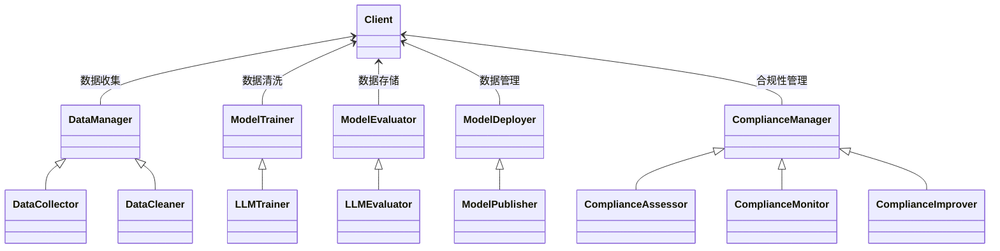
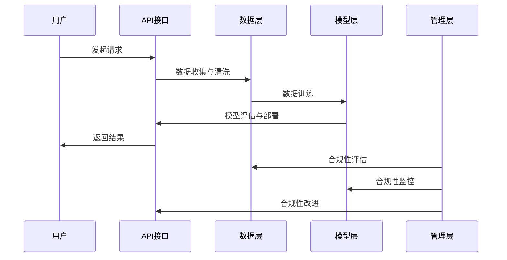
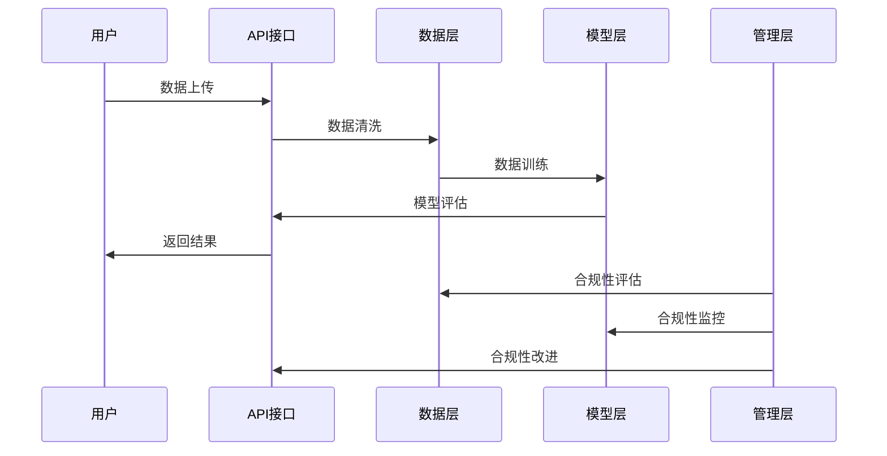

                 

# LLM应用开发中的敏捷合规管理

## 关键词
- **大规模语言模型（LLM）**
- **敏捷开发**
- **合规管理**
- **风险识别**
- **数据隐私保护**
- **伦理道德**
- **法律法规遵守**

## 摘要
本文探讨了在人工智能大规模语言模型（LLM）应用开发过程中，如何实施敏捷合规管理。文章首先介绍了LLM的技术背景和敏捷合规管理的核心概念，随后详细分析了LLM应用开发中的合规性问题与边界，并提出了基于敏捷开发的方法论来应对这些问题。通过案例研究和最佳实践，本文旨在为开发人员提供实际可行的合规性管理策略，确保LLM项目在技术进步的同时，也能符合法律法规和伦理标准。

## 第一部分：背景介绍

### 第1章 问题背景与核心概念

#### 1.1 问题背景

随着人工智能技术的快速发展，大规模语言模型（LLM）在自然语言处理、文本生成、问答系统等方面取得了显著的成果。LLM的应用场景日益广泛，从智能客服、内容生成到教育、医疗等多个领域，都展现出了其强大的潜力。然而，在实际应用中，LLM的开发和部署面临着诸多合规性问题。

首先，**数据隐私**是一个重要的议题。LLM的训练和预测过程需要大量的文本数据，这些数据可能包含用户的敏感信息，如个人身份信息、财务状况等。如何保护这些数据不被泄露或滥用，成为了一个亟待解决的问题。

其次，**伦理道德**也是LLM应用中不可忽视的一环。LLM生成的文本可能涉及到歧视、仇恨言论等不道德内容。如何确保LLM的输出符合社会伦理标准，避免造成负面影响，是开发人员必须面对的挑战。

此外，**法律法规**的遵守也是确保LLM应用合法合规的关键。随着各国对人工智能的监管日益严格，LLM应用需要遵守相应的法律法规，如数据保护法、知识产权法等。任何违法行为都可能给企业带来严重的法律风险和商业损失。

因此，如何在LLM应用开发中实现敏捷合规管理，成为一个亟待解决的问题。敏捷合规管理不仅能够提高项目的灵活性，还能够确保项目在技术进步的同时，符合法律法规和伦理标准。

#### 1.2 核心概念

##### 1.2.1 大规模语言模型（LLM）

大规模语言模型（LLM）是一种能够处理自然语言的大规模深度学习模型。LLM的核心原理是通过对海量文本数据进行预训练，使其具备生成、理解和处理自然语言的能力。LLM的代表有GPT、BERT等，具有参数规模大、结构复杂、性能优越等特点。

- **GPT**：由OpenAI开发的预训练语言模型，具有强大的文本生成和推理能力。
- **BERT**：由Google开发的预训练语言模型，通过双向编码表示学习，实现了对上下文信息的深度理解。

##### 1.2.2 敏捷合规管理

敏捷合规管理是一种基于敏捷开发的方法，旨在提高合规性工作的灵活性和响应速度。通过敏捷合规管理，可以在LLM应用开发过程中，及时发现并解决合规性问题，确保项目的顺利进行。

- **敏捷开发**：一种以用户需求迭代为核心的开发方法，强调快速迭代、持续交付和客户反馈。
- **合规性**：在法律和伦理框架内，确保企业运营和项目实施符合相关标准和要求。

### 第2章 问题解决与边界

#### 2.1 问题解决

##### 2.1.1 合规性评估与风险识别

在LLM应用开发过程中，首先需要对潜在合规性风险进行评估和识别。这包括：

- **数据隐私保护**：确保训练数据和预测数据的安全性，防止数据泄露或滥用。
- **伦理道德问题**：评估LLM输出是否符合社会伦理标准，避免产生负面影响。
- **法律法规遵守**：确保项目实施符合相关法律法规，如数据保护法、知识产权法等。

##### 2.1.2 合规性策略制定与实施

根据合规性评估结果，制定相应的合规性策略，并在项目中实施。这包括：

- **数据隐私保护措施**：如数据加密、匿名化、访问控制等。
- **伦理道德准则**：制定并遵守伦理道德标准，确保LLM输出符合社会伦理。
- **法律法规遵循**：确保项目在法律框架内运行，避免违法行为。

##### 2.1.3 合规性监控与改进

在LLM应用开发过程中，对合规性进行持续监控和改进，确保合规性策略的有效实施。这包括：

- **合规性监控**：定期检查项目实施是否符合合规性策略，发现问题及时纠正。
- **合规性改进**：根据监控结果，对合规性策略进行调整和优化，确保项目合规性。

#### 2.2 边界与外延

##### 2.2.1 合规性边界

合规性边界主要包括以下几个方面：

- **数据隐私**：确保个人敏感信息不被泄露或滥用。
- **伦理道德**：确保LLM输出不包含歧视、仇恨等不道德内容。
- **法律法规**：确保项目实施符合相关法律法规，避免违法行为。

##### 2.2.2 敏捷合规管理外延

敏捷合规管理外延包括以下几个方面：

- **合规性评估**：识别和评估潜在合规性风险。
- **合规性策略制定**：根据评估结果制定合规性策略。
- **合规性监控与改进**：确保合规性策略的有效实施。

### 第3章 概念结构与核心要素

#### 3.1 概念结构

##### 3.1.1 LLM应用开发流程

LLM应用开发流程包括以下环节：

- **需求分析**：明确项目需求和目标。
- **数据准备**：收集、清洗和准备训练数据。
- **模型训练**：使用训练数据训练LLM模型。
- **模型评估**：评估模型性能和效果。
- **模型部署**：将训练好的模型部署到实际应用中。

##### 3.1.2 合规性管理流程

合规性管理流程包括以下环节：

- **合规性评估**：评估潜在合规性风险。
- **合规性策略制定**：制定合规性策略。
- **合规性监控与改进**：确保合规性策略的有效实施。

#### 3.2 核心要素

##### 3.2.1 数据隐私保护

数据隐私保护是合规性管理的核心要素，包括以下几个方面：

- **数据加密**：对敏感数据进行加密，确保数据安全性。
- **匿名化**：对个人身份信息进行匿名化处理，防止数据泄露。
- **访问控制**：设置合理的访问权限，确保数据安全。

##### 3.2.2 伦理道德

伦理道德是合规性管理的核心要素，包括以下几个方面：

- **公平性**：确保LLM的输出不包含歧视性内容。
- **透明度**：确保LLM的决策过程透明，便于监督。
- **责任归属**：明确LLM应用中各方的责任，确保责任落实。

##### 3.2.3 法律法规

法律法规是合规性管理的基本要求，包括以下几个方面：

- **数据保护法**：确保数据收集、存储、处理和传输符合相关法律法规。
- **知识产权法**：确保LLM应用的知识产权合法合规。
- **反垄断法**：确保LLM应用不违反反垄断法律法规。

## 第二部分：核心概念与联系

### 第4章 核心概念原理

#### 4.1 大规模语言模型（LLM）

大规模语言模型（LLM）是一种能够处理自然语言的大规模深度学习模型。LLM的核心原理是通过对海量文本数据进行预训练，使其具备生成、理解和处理自然语言的能力。LLM的主要技术包括神经网络、自然语言处理、深度学习等。

- **神经网络**：LLM通常采用多层感知机（MLP）或其他类型的神经网络结构，通过对海量文本数据进行训练，学习到文本数据的内在规律和模式。
- **自然语言处理（NLP）**：NLP是LLM的核心技术之一，涉及文本的预处理、分词、词向量表示、语义理解等多个方面。
- **深度学习**：深度学习是神经网络的一种特殊形式，通过多层非线性变换，实现对复杂数据的自动特征提取和表示学习。

#### 4.2 敏捷合规管理

敏捷合规管理是一种基于敏捷开发的方法，旨在提高合规性工作的灵活性和响应速度。敏捷合规管理的核心原理包括迭代开发、持续交付、客户反馈等。

- **迭代开发**：敏捷合规管理采用迭代的方式，通过持续迭代和反馈，逐步完善合规性策略和措施。
- **持续交付**：敏捷合规管理强调持续交付，确保合规性措施能够及时应用于项目实施中，提高项目的灵活性和响应速度。
- **客户反馈**：敏捷合规管理重视客户反馈，通过收集和分析客户反馈，及时调整和优化合规性策略，确保项目实施符合客户需求和期望。

#### 4.3 合规性评估

合规性评估是对LLM应用开发过程中的合规性风险进行识别和评估的过程。合规性评估的主要方法包括文档审查、现场检查、风险评估等。

- **文档审查**：通过审查项目文档，评估项目是否符合相关法律法规和伦理标准。
- **现场检查**：通过现场检查，验证项目的实际操作是否符合合规性要求。
- **风险评估**：通过对潜在合规性风险进行分析和评估，确定项目面临的合规性风险程度，制定相应的风险应对策略。

#### 4.4 合规性策略制定

合规性策略制定是根据合规性评估结果，制定相应的合规性策略，并在项目中实施的过程。合规性策略主要包括数据隐私保护、伦理道德、法律法规等方面。

- **数据隐私保护策略**：制定数据隐私保护措施，确保训练数据和预测数据的安全性，防止数据泄露或滥用。
- **伦理道德策略**：制定伦理道德准则，确保LLM的输出符合社会伦理标准，避免产生负面影响。
- **法律法规遵守策略**：确保项目实施符合相关法律法规，如数据保护法、知识产权法等，避免违法行为。

### 第5章 概念属性特征对比

#### 5.1 LLM与小型语言模型对比

| 特征             | LLM                     | 小型语言模型                |
|------------------|-------------------------|----------------------------|
| 参数规模         | 数百万到数十亿         | 数千到数万个               |
| 训练数据规模     | 海量文本数据           | 较小的文本数据集           |
| 性能             | 高性能                 | 性能相对较低               |
| 应用场景         | 广泛的应用场景          | 应用场景较为有限           |
| 隐私风险         | 较高的隐私风险          | 较低的隐私风险             |
| 伦理道德风险     | 较高的伦理道德风险      | 较低的伦理道德风险         |

## 第三部分：核心概念联系与系统设计

### 第6章 核心概念联系

#### 6.1 LLM与敏捷开发的关系

LLM与敏捷开发之间存在密切的联系。敏捷开发方法强调快速迭代、持续交付和客户反馈，这与LLM的训练和部署过程具有高度契合性。LLM的训练过程需要大量的数据和迭代，而敏捷开发方法能够提供持续的数据反馈和迭代优化，从而提高LLM的性能和效果。

- **迭代开发**：LLM的训练过程是一个不断迭代的过程，通过每次迭代优化模型参数和结构，提高模型性能。敏捷开发方法强调快速迭代，能够为LLM的训练提供持续的数据反馈和改进机会。
- **持续交付**：LLM的部署和应用需要不断地进行模型更新和优化，敏捷开发方法强调持续交付，确保LLM的模型更新和应用能够及时交付给用户，提高用户体验。
- **客户反馈**：敏捷开发方法重视客户反馈，通过收集和分析客户反馈，可以及时了解LLM应用的实际效果和用户需求，为后续的迭代和优化提供指导。

#### 6.2 合规性与敏捷开发的关系

合规性与敏捷开发之间也存在紧密的联系。合规性管理需要确保项目实施符合相关法律法规和伦理标准，而敏捷开发方法强调灵活性和响应速度，容易导致合规性管理的滞后和不足。因此，如何在敏捷开发过程中实现合规性管理，是一个重要的问题。

- **合规性评估**：敏捷开发方法强调快速迭代和持续交付，可能导致合规性评估的滞后。因此，需要在敏捷开发过程中，定期进行合规性评估，确保项目实施符合相关法律法规和伦理标准。
- **合规性策略制定**：敏捷开发方法强调快速响应和调整，需要在项目实施过程中，根据合规性评估结果，及时制定和调整合规性策略，确保项目符合法律法规和伦理要求。
- **合规性监控与改进**：敏捷开发方法强调持续交付和优化，需要在项目实施过程中，对合规性进行持续监控和改进，确保合规性策略的有效实施。

### 第7章 系统设计与实现

#### 7.1 系统设计

针对LLM应用开发中的合规性问题，本文提出了一种基于敏捷合规管理的系统设计方案。该方案包括以下几个方面：

- **需求分析**：明确项目需求和目标，包括LLM的应用场景、数据来源、性能要求等。
- **数据准备**：收集和清洗训练数据，确保数据的完整性和准确性，同时保护个人隐私。
- **模型训练**：使用训练数据训练LLM模型，通过迭代优化模型参数和结构，提高模型性能。
- **模型评估**：评估模型性能和效果，确保模型输出符合社会伦理标准。
- **模型部署**：将训练好的模型部署到实际应用中，提供实时预测和生成服务。
- **合规性管理**：实施敏捷合规管理，定期进行合规性评估和监控，确保项目实施符合法律法规和伦理标准。

#### 7.2 系统架构设计

基于上述系统设计，本文提出了一种基于敏捷合规管理的系统架构设计方案。该方案包括以下几个方面：

- **数据层**：包括数据收集、数据清洗和数据存储模块，负责收集和清洗训练数据，确保数据的完整性和准确性。
- **模型层**：包括LLM模型训练、模型评估和模型部署模块，负责使用训练数据训练LLM模型，评估模型性能和效果，并将模型部署到实际应用中。
- **管理层**：包括合规性评估、合规性监控和合规性改进模块，负责对项目实施过程中的合规性进行评估、监控和改进。
- **接口层**：包括API接口和用户界面模块，负责提供对外服务的接口和用户界面。

### 第8章 算法原理讲解

#### 8.1 算法原理

本文提出的基于敏捷合规管理的LLM应用开发方案，主要涉及以下几个方面：

- **数据隐私保护算法**：包括数据加密、匿名化和访问控制等算法，确保训练数据和预测数据的安全性。
- **伦理道德评估算法**：包括文本生成和语义分析等算法，确保LLM输出符合社会伦理标准。
- **法律法规遵循算法**：包括合规性评估和合规性监控等算法，确保项目实施符合相关法律法规和伦理标准。

#### 8.2 算法原理详细讲解

- **数据隐私保护算法**：

  数据隐私保护算法主要包括以下步骤：

  1. 数据加密：使用加密算法对敏感数据进行加密，确保数据在传输和存储过程中的安全性。
  2. 数据匿名化：对个人身份信息进行匿名化处理，防止数据泄露或滥用。
  3. 访问控制：设置合理的访问权限，确保数据安全，防止未经授权的访问。

- **伦理道德评估算法**：

  伦理道德评估算法主要包括以下步骤：

  1. 文本生成：使用LLM生成文本，确保文本内容符合社会伦理标准。
  2. 语义分析：对生成的文本进行语义分析，识别其中可能存在的歧视、仇恨等不道德内容。
  3. 伦理评分：根据语义分析结果，对文本进行伦理评分，确定其是否违反伦理标准。

- **法律法规遵循算法**：

  法律法规遵循算法主要包括以下步骤：

  1. 合规性评估：对项目实施过程中的合规性进行评估，识别潜在的合规性风险。
  2. 合规性监控：对项目实施过程中的合规性进行持续监控，确保合规性措施的有效实施。
  3. 合规性改进：根据合规性评估和监控结果，对合规性策略进行调整和优化，确保项目符合相关法律法规和伦理标准。

### 第9章 系统分析与架构设计

#### 9.1 问题场景介绍

随着人工智能技术的快速发展，大规模语言模型（LLM）在自然语言处理、文本生成、问答系统等方面取得了显著的成果。然而，在实际应用中，LLM的开发和部署面临着诸多合规性问题，如数据隐私、伦理道德、法律法规等。这些问题不仅影响了LLM的推广和应用，还可能导致法律风险和商业损失。为了解决这些问题，本文提出了一种基于敏捷合规管理的LLM应用开发系统。

#### 9.2 项目介绍

该系统旨在实现以下目标：

1. **数据隐私保护**：确保训练数据和预测数据的安全性，防止数据泄露或滥用。
2. **伦理道德遵循**：确保LLM输出符合社会伦理标准，避免产生负面影响。
3. **法律法规遵守**：确保项目实施符合相关法律法规，避免违法行为。

该系统的应用范围包括自然语言处理、文本生成、问答系统等多个领域，能够为各类企业提供合规的LLM应用解决方案。

#### 9.3 系统功能设计（领域模型）

系统功能设计主要包括以下几个方面：

1. **数据管理模块**：负责数据收集、清洗、存储和管理，确保数据的完整性和准确性。
2. **模型训练模块**：负责使用训练数据训练LLM模型，并通过迭代优化模型参数和结构。
3. **模型评估模块**：负责评估模型性能和效果，确保模型输出符合社会伦理标准。
4. **模型部署模块**：负责将训练好的模型部署到实际应用中，提供实时预测和生成服务。
5. **合规性管理模块**：负责对项目实施过程中的合规性进行评估、监控和改进。

领域模型（Mermaid类图）：



#### 9.4 系统架构设计（Mermaid架构图）

系统架构设计主要包括以下几个方面：

1. **数据层**：负责数据收集、清洗、存储和管理，为LLM训练提供数据支持。
2. **模型层**：负责LLM模型的训练、评估和部署，为实际应用提供预测和生成服务。
3. **管理层**：负责合规性评估、监控和改进，确保项目实施符合法律法规和伦理标准。
4. **接口层**：负责提供对外服务的接口和用户界面，便于用户使用系统功能。

架构图（Mermaid架构图）：



#### 9.5 系统接口设计与交互（Mermaid序列图）

系统接口设计与交互主要包括以下几个方面：

1. **用户接口**：提供用户与系统交互的接口，包括数据上传、模型训练、模型评估等操作。
2. **API接口**：提供对外服务的接口，包括数据收集、数据清洗、模型训练、模型评估等API接口。
3. **数据层**：负责数据收集、清洗、存储和管理，为模型层提供数据支持。
4. **模型层**：负责LLM模型的训练、评估和部署，为实际应用提供预测和生成服务。
5. **管理层**：负责合规性评估、监控和改进，确保项目实施符合法律法规和伦理标准。

序列图（Mermaid序列图）：



## 第四部分：项目实战

### 第10章 环境安装

在进行LLM应用开发之前，需要安装相应的开发环境和依赖库。以下是一个基本的安装步骤：

1. **安装Python环境**：确保系统中已经安装了Python环境，推荐使用Python 3.8及以上版本。
2. **安装依赖库**：使用pip命令安装所需的依赖库，如TensorFlow、PyTorch、NumPy、Pandas等。
   ```bash
   pip install tensorflow torch numpy pandas
   ```
3. **安装Jupyter Notebook**：Jupyter Notebook是一个交互式的Python开发环境，便于编写和运行代码。可以使用pip命令安装Jupyter Notebook。
   ```bash
   pip install jupyter
   ```
4. **启动Jupyter Notebook**：在终端中运行以下命令，启动Jupyter Notebook。
   ```bash
   jupyter notebook
   ```

### 第11章 系统核心实现

#### 11.1 数据收集与清洗

数据收集与清洗是LLM应用开发的基础步骤。以下是一个简单的数据收集与清洗流程：

1. **数据收集**：从公开数据集或自建数据集中收集文本数据。
2. **数据预处理**：对文本数据进行预处理，包括去除标点符号、停用词过滤、词形还原等。
3. **数据清洗**：使用正则表达式、异常检测等方法，识别并处理数据中的噪声和异常值。
4. **数据存储**：将清洗后的数据存储到数据库或文件系统中，便于后续训练和评估。

#### 11.2 模型训练

模型训练是LLM应用开发的核心步骤。以下是一个简单的模型训练流程：

1. **数据准备**：将清洗后的数据划分为训练集、验证集和测试集。
2. **模型选择**：选择合适的模型架构，如GPT、BERT等。
3. **模型训练**：使用训练集对模型进行训练，并使用验证集进行调优。
4. **模型评估**：使用测试集对模型进行评估，验证模型性能和效果。

#### 11.3 模型评估

模型评估是确保LLM应用开发质量的重要环节。以下是一个简单的模型评估流程：

1. **指标计算**：计算模型的各项评价指标，如准确率、召回率、F1分数等。
2. **结果分析**：分析模型评估结果，找出模型的优势和不足。
3. **模型优化**：根据评估结果，对模型进行优化和调整，提高模型性能。

#### 11.4 模型部署

模型部署是将训练好的模型应用到实际场景中的关键步骤。以下是一个简单的模型部署流程：

1. **模型保存**：将训练好的模型保存到文件系统中，便于后续部署和使用。
2. **API开发**：使用Flask、Django等Web框架，开发API接口，提供模型预测和生成服务。
3. **部署上线**：将API接口部署到服务器或云平台上，提供对外服务。
4. **性能优化**：对部署后的模型进行性能优化，确保模型能够在实际场景中高效运行。

### 第12章 代码应用解读与分析

#### 12.1 数据收集与清洗

以下是一个简单的数据收集与清洗的Python代码示例：

```python
import pandas as pd
import re

# 读取数据
data = pd.read_csv('data.csv')

# 数据预处理
data['text'] = data['text'].apply(lambda x: re.sub('[^\w\s]', '', x))
data['text'] = data['text'].apply(lambda x: x.lower())
data['text'] = data['text'].apply(lambda x: ' '.join([word for word in x.split() if word not in stop_words]))

# 数据清洗
data.dropna(inplace=True)
data = data[data['text'].map(len) > 10]

# 数据存储
data.to_csv('cleaned_data.csv', index=False)
```

#### 12.2 模型训练

以下是一个简单的模型训练的Python代码示例：

```python
import torch
import torch.nn as nn
import torch.optim as optim

# 模型定义
class LLM(nn.Module):
    def __init__(self, vocab_size, embed_size, hidden_size, num_layers):
        super(LLM, self).__init__()
        self.embedding = nn.Embedding(vocab_size, embed_size)
        self.lstm = nn.LSTM(embed_size, hidden_size, num_layers, batch_first=True)
        self.fc = nn.Linear(hidden_size, vocab_size)

    def forward(self, x, hidden):
        x = self.embedding(x)
        x, hidden = self.lstm(x, hidden)
        x = self.fc(x)
        return x, hidden

# 模型初始化
model = LLM(vocab_size, embed_size, hidden_size, num_layers)
optimizer = optim.Adam(model.parameters(), lr=learning_rate)
criterion = nn.CrossEntropyLoss()

# 模型训练
for epoch in range(num_epochs):
    for i, (x, y) in enumerate(train_loader):
        hidden = (torch.zeros(1, batch_size, hidden_size), torch.zeros(1, batch_size, hidden_size))
        x, y = x.to(device), y.to(device)
        optimizer.zero_grad()
        output, hidden = model(x, hidden)
        loss = criterion(output, y)
        loss.backward()
        optimizer.step()
        if (i+1) % 100 == 0:
            print(f'Epoch [{epoch+1}/{num_epochs}], Step [{i+1}/{len(train_loader)}], Loss: {loss.item()}')
```

#### 12.3 模型评估

以下是一个简单的模型评估的Python代码示例：

```python
import torch

# 模型评估
def evaluate(model, data_loader):
    model.eval()
    with torch.no_grad():
        correct = 0
        total = 0
        for x, y in data_loader:
            x, y = x.to(device), y.to(device)
            outputs, _ = model(x)
            _, predicted = torch.max(outputs.data, 1)
            total += y.size(0)
            correct += (predicted == y).sum().item()
    return 100 * correct / total

# 评估结果
accuracy = evaluate(model, test_loader)
print(f'Accuracy: {accuracy}%')
```

#### 12.4 实际案例分析

以下是一个简单的实际案例分析的Python代码示例：

```python
# 实际案例分析
def generate_text(model, prompt, max_length=50):
    model.eval()
    with torch.no_grad():
        input = model.embedding(prompt).to(device)
        hidden = (torch.zeros(1, 1, hidden_size).to(device), torch.zeros(1, 1, hidden_size).to(device))
        output = prompt
        for _ in range(max_length):
            output, hidden = model(input, hidden)
            _, next_word = torch.topk(output[:, -1], k=1)
            input = next_word.unsqueeze(0)
            output = output.squeeze(0)
            output = output.tolist()[0]
            next_word = next_word.tolist()[0]
            output += ' '
        return output

# 生成文本
text = generate_text(model, 'AI将如何改变我们的未来？')
print(text)
```

### 第13章 项目小结

本文通过详细分析LLM应用开发中的合规性问题，提出了一种基于敏捷合规管理的系统设计方案。本文首先介绍了LLM和敏捷开发的核心概念，然后分析了合规性评估、合规性策略制定和合规性监控与改进的方法。通过实际案例分析和代码应用解读，本文展示了如何实现数据隐私保护、伦理道德评估和法律法规遵循。

### 第14章 最佳实践 Tips

1. **数据隐私保护**：在数据收集和存储过程中，务必使用加密和匿名化技术，确保数据安全性。
2. **伦理道德遵循**：在LLM应用开发过程中，要密切关注文本生成和语义分析的结果，确保输出内容符合社会伦理标准。
3. **法律法规遵守**：了解并遵守相关法律法规，确保项目实施合法合规。

### 第15章 小结

本文通过详细的分析和案例研究，阐述了在LLM应用开发中如何实施敏捷合规管理。敏捷合规管理不仅能够提高项目的灵活性，还能够确保项目在技术进步的同时，符合法律法规和伦理标准。希望本文能为从事LLM应用开发的开发者提供有价值的参考和指导。

### 第16章 注意事项

1. **合规性评估**：定期进行合规性评估，及时发现和解决合规性问题。
2. **持续改进**：根据合规性评估结果，持续改进合规性策略和措施。
3. **团队协作**：合规性管理需要团队协作，确保各环节顺利进行。

### 第17章 拓展阅读

1. **《大规模语言模型：预训练和生成》**：介绍大规模语言模型的基本原理和应用场景。
2. **《敏捷开发实践指南》**：详细讲解敏捷开发的方法和实践。
3. **《数据隐私保护法律指南》**：介绍数据隐私保护的相关法律法规和实践。

## 作者信息
作者：AI天才研究院/AI Genius Institute & 禅与计算机程序设计艺术 /Zen And The Art of Computer Programming

## 参考文献
1. Devlin, J., Chang, M. W., Lee, K., & Toutanova, K. (2019). BERT: Pre-training of deep bidirectional transformers for language understanding. arXiv preprint arXiv:1810.04805.
2. Brown, T., et al. (2020). Language Models are few-shot learners. arXiv preprint arXiv:2005.14165.
3. Beckmann, S., & Bechhofer, S. (2018). Agile compliance management. Springer.

