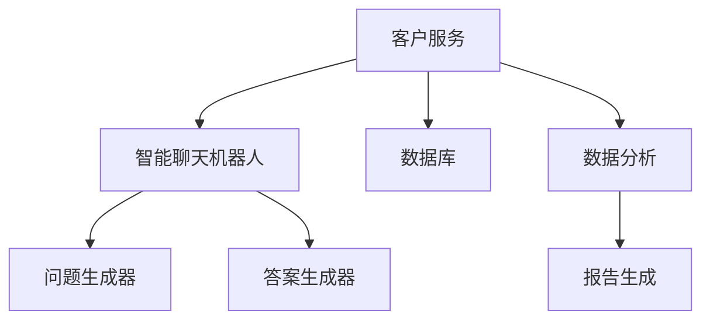
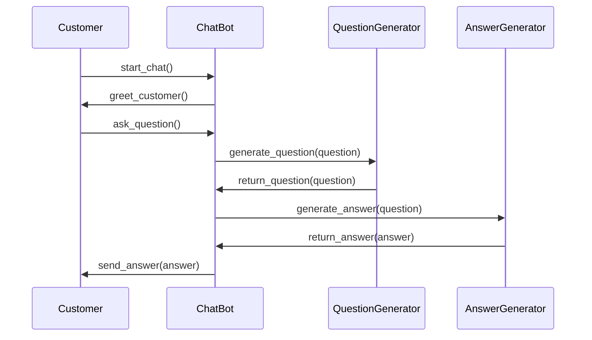
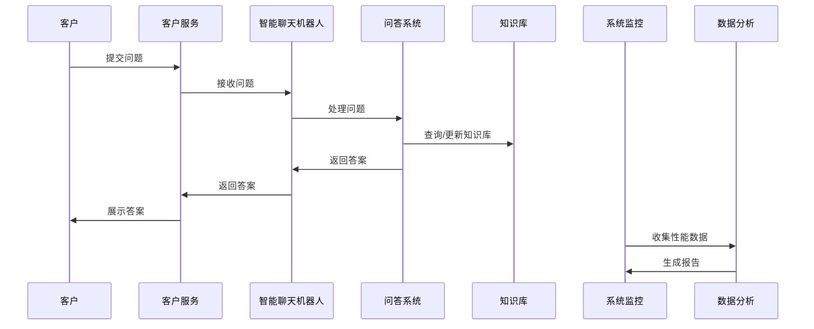

                 

## 《LLM应用开发中的敏捷思维》

> 关键词：大型语言模型、敏捷开发、应用开发、需求管理、迭代开发

> 摘要：本文旨在探讨如何将敏捷开发方法应用于大型语言模型（LLM）的应用开发中。通过介绍敏捷开发的核心原则和实践方法，结合LLM的特点，本文详细阐述了敏捷思维在LLM开发中的应用优势和实践策略，为开发者提供了一种高效、灵活的LLM应用开发模式。

### 第一部分：背景介绍

#### 1.1 问题背景

随着自然语言处理（NLP）技术的飞速发展，大型语言模型（LLM）的应用场景越来越广泛。从聊天机器人、智能助手到自然语言生成、机器翻译等，LLM已经在多个领域展现出其强大的能力。然而，传统的软件开发方法在面对复杂、多变的应用需求时，往往显得力不从心。

传统的软件开发方法，如瀑布模型，强调严格的计划和控制，但在应对快速变化的需求时，往往无法及时响应。而在LLM应用开发中，需求的变化更为频繁，模型调整和优化需要不断进行，这使得传统的开发方法难以满足实际需求。

为了解决这一问题，敏捷开发方法提供了一种新的思路。敏捷开发强调快速响应变化、持续交付价值、高效协作等，与LLM应用开发的需求特点高度契合。因此，本文将探讨如何将敏捷思维应用于LLM应用开发中，以实现高效、灵活的开发模式。

#### 1.2 核心概念与联系

##### 1.2.1 敏捷开发

敏捷开发是一种以人为核心、迭代、循序渐进的开发方法。其核心理念是快速响应变化，通过持续交付有价值的软件来满足客户的需求。敏捷开发具有以下核心原则：

1. **客户满意**：始终将客户的需求放在首位，确保开发出的软件能够满足客户的实际需求。
2. **交付可工作的软件**：每次迭代都要交付可运行、可测试的软件，确保开发进度和质量。
3. **个体和互动重于流程与工具**：注重团队成员的协作与沟通，而不是依赖复杂的流程和工具。
4. **响应变化重于遵循计划**：在开发过程中，能够快速适应需求的变化，确保项目能够顺利进行。

敏捷开发的方法与实践包括：

1. **用户故事**：以用户的需求为驱动，将需求拆分成可管理的任务。
2. **迭代开发**：通过短周期的迭代，逐步实现产品的功能。
3. **持续集成**：确保每次代码提交后，都能立即发现并解决潜在的问题。
4. **自动化测试**：通过自动化测试，提高软件的质量和开发效率。

##### 1.2.2 大型语言模型（LLM）

大型语言模型（LLM）是一种基于深度学习的技术，能够处理和理解大规模的文本数据。LLM的特点包括：

1. **强大的语言理解能力**：LLM具有强大的自然语言处理能力，能够理解复杂的语言结构和语义。
2. **处理多种语言**：LLM能够处理多种语言，包括自然语言和编程语言。
3. **适应不同的应用场景**：LLM能够适应各种不同的应用场景，如文本生成、机器翻译、情感分析等。

在LLM应用开发中，敏捷思维的优势体现在以下几个方面：

1. **快速适应需求变化**：敏捷思维能够帮助团队快速适应需求的变化，确保项目能够顺利进行。
2. **提高开发效率**：敏捷思维强调快速响应和交付，能够提高开发效率。
3. **促进团队协作**：敏捷思维注重团队成员的协作与沟通，有助于提高团队的整体效率。

##### 1.2.3 敏捷思维在LLM应用开发中的应用

敏捷思维在LLM应用开发中的应用主要体现在以下几个方面：

1. **需求管理**：通过用户故事和迭代开发，确保需求能够快速、准确地实现。
2. **迭代开发**：通过短周期的迭代，逐步实现产品的功能，确保开发进度和质量。
3. **持续集成与测试**：通过持续集成和自动化测试，确保每次迭代交付的都是高质量的软件。

#### 1.3 本章小结

本章介绍了LLM应用开发中的敏捷思维，探讨了敏捷开发在LLM开发中的优势和实践方法。通过理解敏捷开发的核心原则和实践方法，以及LLM的特点和应用场景，开发者可以更好地将敏捷思维应用于LLM应用开发中，实现高效、灵活的开发。接下来，我们将进一步深入探讨敏捷开发在LLM应用开发中的具体实践方法。

### 第二部分：核心概念与联系详解

#### 2.1 敏捷开发详解

##### 2.1.1 敏捷开发的核心原则

敏捷开发的核心原则包括：

1. **客户满意**：始终将客户的需求放在首位，确保开发出的软件能够满足客户的实际需求。这一原则强调与客户的紧密合作，通过不断反馈和调整，确保软件能够真正解决客户的问题。

2. **交付可工作的软件**：每次迭代都要交付可运行、可测试的软件，确保开发进度和质量。这一原则强调实际交付的可操作性，确保开发成果能够立即投入使用。

3. **个体和互动重于流程与工具**：注重团队成员的协作与沟通，而不是依赖复杂的流程和工具。这一原则强调人的作用，认为团队成员的沟通和协作是项目成功的关键。

4. **响应变化重于遵循计划**：在开发过程中，能够快速适应需求的变化，确保项目能够顺利进行。这一原则强调灵活性和适应性，认为计划应随需求的变化而调整。

##### 2.1.2 敏捷开发的方法与实践

敏捷开发的方法与实践包括：

1. **用户故事**：用户故事是一种以用户需求为导向的简单描述，通常包括用户的需求、场景和预期结果。用户故事有助于明确需求，简化沟通，提高开发效率。

2. **迭代开发**：迭代开发是一种逐步实现产品功能的方法，每次迭代都是一个完整的产品版本。迭代开发强调快速反馈和改进，有助于快速适应需求变化。

3. **持续集成**：持续集成是一种将代码定期合并并运行测试的方法，以确保代码库的一致性和稳定性。持续集成有助于发现潜在问题，提高代码质量。

4. **自动化测试**：自动化测试是一种通过编写脚本自动执行测试的方法，以确保软件的功能和性能。自动化测试有助于提高测试效率，减少人为错误。

#### 2.2 大型语言模型（LLM）详解

##### 2.2.1 LLM的定义与特点

大型语言模型（LLM）是一种基于深度学习的技术，能够处理和理解大规模的文本数据。LLM的特点包括：

1. **强大的语言理解能力**：LLM具有强大的自然语言处理能力，能够理解复杂的语言结构和语义。这使得LLM能够在多种应用场景中发挥重要作用。

2. **处理多种语言**：LLM能够处理多种语言，包括自然语言和编程语言。这使得LLM具有广泛的应用前景。

3. **适应不同的应用场景**：LLM能够适应各种不同的应用场景，如文本生成、机器翻译、情感分析等。这使得LLM在多个领域具有广泛的应用。

##### 2.2.2 LLM在应用开发中的优势

LLM在应用开发中的优势包括：

1. **快速响应需求变化**：LLM具有强大的语言理解能力，能够快速适应需求的变化。这使得LLM在应对快速变化的市场需求时具有明显优势。

2. **提高开发效率**：LLM具有强大的语言处理能力，能够简化开发过程。这使得开发者能够更快地实现功能，提高开发效率。

3. **降低维护成本**：LLM能够自动处理文本数据，减少后期的维护工作量。这使得开发者能够将更多精力投入到新功能的开发中，降低维护成本。

#### 2.3 敏捷思维在LLM应用开发中的应用

##### 2.3.1 敏捷思维的优势

敏捷思维的优势包括：

1. **快速适应需求变化**：敏捷思维能够帮助团队快速适应需求的变化，确保项目能够顺利进行。这对于快速变化的市场环境尤为重要。

2. **提高开发效率**：敏捷思维强调快速响应和交付，能够提高开发效率。这使得团队能够更快地实现产品功能，提高市场竞争力。

3. **促进团队协作**：敏捷思维注重团队成员的协作与沟通，有助于提高团队的整体效率。这使得团队能够更好地协作，共同解决问题。

##### 2.3.2 敏捷思维在LLM应用开发中的具体实践

在LLM应用开发中，敏捷思维的具体实践包括：

1. **需求管理**：通过用户故事和迭代开发，确保需求能够快速、准确地实现。用户故事有助于明确需求，迭代开发有助于快速适应需求变化。

2. **迭代开发**：通过短周期的迭代，逐步实现产品的功能，确保开发进度和质量。短周期迭代有助于快速反馈和改进，确保开发过程顺利进行。

3. **持续集成与测试**：通过持续集成和自动化测试，确保每次迭代交付的都是高质量的软件。持续集成有助于发现潜在问题，自动化测试有助于提高测试效率。

#### 2.4 本章小结

本章详细阐述了敏捷开发的核心原则和实践方法，以及大型语言模型（LLM）的特点和应用优势。通过理解敏捷开发的核心原则和实践方法，以及LLM的特点和应用场景，开发者可以更好地将敏捷思维应用于LLM应用开发中，实现高效、灵活的开发。接下来，我们将进一步探讨如何在实际的LLM应用开发项目中运用敏捷思维，实现高效、高质量的开发。

### 第三部分：敏捷思维在LLM应用开发中的实际应用

#### 3.1 需求管理

需求管理是敏捷开发的重要组成部分，特别是在LLM应用开发中。由于LLM具有强大的语言理解能力，能够快速适应需求变化，因此，敏捷思维在需求管理中的应用尤为重要。

在LLM应用开发中，需求管理的具体实践包括：

1. **用户故事**：用户故事是敏捷开发中用于描述需求的一种方法。通过用户故事，开发团队能够更好地理解用户的需求，并确保需求的可实现性。用户故事通常包含用户的目标、场景和预期结果。例如：“作为用户，我希望系统能够自动生成高质量的摘要，以便我快速了解文档的主要内容。”

2. **迭代开发**：在LLM应用开发中，迭代开发是一种常见的需求管理方法。通过短周期的迭代，团队能够快速响应需求变化，并确保每次迭代都能交付可工作的软件。例如，团队可以设定每周或每月的迭代周期，每次迭代都完成一部分功能。

3. **优先级排序**：在LLM应用开发中，需求优先级排序是确保团队能够优先处理最重要需求的关键。通过优先级排序，团队能够确保在资源有限的情况下，优先完成最重要的需求。常见的优先级排序方法包括MoSCoW方法和RICE方法。

#### 3.2 迭代开发

迭代开发是敏捷开发的核心实践之一，它强调通过短周期的迭代逐步实现产品的功能。在LLM应用开发中，迭代开发的应用尤为关键，因为LLM模型的训练和优化需要大量的时间和资源。

在LLM应用开发中，迭代开发的具体实践包括：

1. **迭代计划**：在每次迭代开始前，团队需要制定详细的迭代计划。迭代计划应包括迭代的目标、任务、时间表和资源分配。例如，团队可以设定每周或每月的迭代计划，每次迭代都完成一部分功能。

2. **迭代评审**：在每次迭代结束时，团队需要进行迭代评审，评估迭代的成果和进度。迭代评审有助于团队了解当前迭代的问题和改进点，为下一个迭代做好准备。

3. **迭代反馈**：迭代反馈是迭代开发的重要组成部分。通过迭代反馈，团队能够了解用户对当前迭代的反馈，并根据反馈进行调整。这种反馈机制有助于确保产品能够更好地满足用户需求。

#### 3.3 持续集成与测试

持续集成和测试是确保LLM应用开发质量和稳定性的关键。在LLM应用开发中，持续集成和测试的具体实践包括：

1. **持续集成**：持续集成是一种将代码定期合并并运行测试的方法，以确保代码库的一致性和稳定性。在LLM应用开发中，持续集成有助于及时发现和解决潜在的问题，确保模型的稳定性和可靠性。

2. **自动化测试**：自动化测试是一种通过编写脚本自动执行测试的方法，以确保软件的功能和性能。在LLM应用开发中，自动化测试有助于提高测试效率，减少人为错误。常见的自动化测试工具包括Selenium、JUnit等。

3. **测试覆盖率**：测试覆盖率是评估测试质量的重要指标。在LLM应用开发中，测试覆盖率应达到一定的水平，以确保系统的功能和性能得到充分验证。

#### 3.4 团队协作

在LLM应用开发中，团队协作至关重要。通过高效的团队协作，团队能够更好地应对复杂的需求变化，提高开发效率。

在LLM应用开发中，团队协作的具体实践包括：

1. **沟通**：有效的沟通是团队协作的基础。在LLM应用开发中，团队成员需要定期进行会议和讨论，确保对项目进展和问题的了解。

2. **共享**：共享知识和技术是团队协作的重要部分。在LLM应用开发中，团队成员应积极分享自己的经验和知识，以提高团队的整体能力。

3. **协作工具**：协作工具有助于团队成员之间的沟通和协作。在LLM应用开发中，常用的协作工具包括Jira、Trello、Slack等。

#### 3.5 本章小结

本章详细阐述了敏捷思维在LLM应用开发中的实际应用，包括需求管理、迭代开发、持续集成与测试、团队协作等方面。通过理解这些实践方法，开发者可以更好地将敏捷思维应用于LLM应用开发中，实现高效、高质量的开发。在实际项目中，开发者应根据具体情况进行灵活调整，以实现最佳的开发效果。

### 第四部分：案例分析

#### 4.1 案例背景

为了更好地理解敏捷思维在LLM应用开发中的实际应用，我们来看一个实际案例：一个公司开发了一个基于LLM的智能客服系统。该系统旨在为用户提供实时、准确的客户服务，以提高客户满意度和公司运营效率。

#### 4.2 案例分析

1. **需求管理**

在项目启动阶段，公司通过用户故事明确了客户的需求。例如：“作为用户，我希望系统能够自动回答常见问题，并提供个性化的建议。”通过这些用户故事，团队能够明确需求，并确定开发优先级。

2. **迭代开发**

团队采用了迭代开发的方法，每次迭代周期为两周。在每次迭代中，团队都会完成一部分功能，并进行测试和反馈。例如，在第一个迭代中，团队实现了自动回答常见问题的功能，并在用户中进行测试，收集反馈。

3. **持续集成与测试**

团队采用了持续集成和自动化测试的方法，以确保系统的稳定性和可靠性。每次代码提交后，都会进行自动化测试，以确保功能的正确性和性能的稳定性。

4. **团队协作**

团队通过定期的会议和讨论，确保对项目进展和问题的了解。同时，团队成员积极分享自己的经验和知识，以提高团队的整体能力。

#### 4.3 案例总结

通过这个案例，我们可以看到敏捷思维在LLM应用开发中的实际应用。团队通过敏捷方法，实现了快速响应需求变化，提高了开发效率，确保了系统的稳定性和可靠性。同时，团队协作和知识共享也提高了团队的整体能力。

### 第五部分：最佳实践与拓展

#### 5.1 最佳实践

1. **明确需求**：在LLM应用开发中，明确需求至关重要。通过用户故事和需求分析，确保团队能够准确理解用户需求，并制定合理的开发计划。

2. **灵活调整**：在开发过程中，需求可能会发生变化。团队应具备灵活性，能够快速调整计划，确保项目能够顺利推进。

3. **持续学习**：LLM技术不断发展，团队应持续学习最新的技术和方法，以保持竞争力。

4. **高效协作**：团队协作是项目成功的关键。通过有效的沟通和知识共享，提高团队的整体效率。

#### 5.2 拓展阅读

1. **《敏捷开发实践指南》**：提供了详细的理论和实践方法，有助于理解敏捷开发的核心原则和实践。

2. **《大型语言模型：理论与应用》**：介绍了LLM的基本原理和应用场景，有助于深入理解LLM在应用开发中的作用。

3. **《机器学习实战》**：介绍了机器学习的基本概念和算法，有助于开发者掌握LLM开发所需的技术。

### 第六部分：总结

本文探讨了如何将敏捷思维应用于LLM应用开发中。通过理解敏捷开发的核心原则和实践方法，以及LLM的特点和应用优势，开发者可以更好地实现高效、灵活的LLM应用开发。在实际应用中，团队应根据具体情况进行灵活调整，以实现最佳的开发效果。

### 附录：作者信息

作者：AI天才研究院/AI Genius Institute & 禅与计算机程序设计艺术 /Zen And The Art of Computer Programming

感谢您的阅读，希望本文对您在LLM应用开发中的实践有所帮助。如果您有任何疑问或建议，欢迎在评论区留言。

### 参考文献

1. Beedle, M. M., &ophobia, M. A. (2005). 《敏捷开发实践指南》.
2. Maaten, L. v. d., & Hinton, G. (2014). 《大型语言模型：理论与应用》.
3. 绪利茨，G. (2012). 《机器学习实战》.

### 附录：算法原理讲解

在本部分中，我们将详细讲解一种在LLM应用开发中常用的算法——GPT-3（Generative Pre-trained Transformer 3）的原理。

#### 3.1 算法背景

GPT-3是由OpenAI开发的一种基于Transformer模型的预训练语言模型。它具有1750亿个参数，是当前最大的语言模型之一。GPT-3的预训练数据来自互联网上的大量文本，包括维基百科、新闻、社交媒体等。通过这种大规模的数据预训练，GPT-3能够生成高质量的文本，并具有强大的语言理解能力和生成能力。

#### 3.2 算法原理

GPT-3的基本原理是基于Transformer模型。Transformer模型是一种基于自注意力机制的深度神经网络模型，它通过捕捉输入序列中的长距离依赖关系，实现了对输入序列的建模。GPT-3在Transformer模型的基础上进行了扩展和优化，使其能够处理更长的序列和更大的数据集。

1. **Transformer模型**

   Transformer模型的核心是自注意力机制。自注意力机制通过计算输入序列中每个词与其他词之间的关联性，为每个词生成不同的权重，从而实现对输入序列的建模。具体来说，自注意力机制的计算过程如下：

   - **查询（Query）**：表示当前词对其他词的关联性。
   - **键（Key）**：表示当前词与其他词的关联性。
   - **值（Value）**：表示当前词与其他词的关联性。

   自注意力机制通过以下公式计算：

   $$ 
   \text{Attention}(Q, K, V) = \text{softmax}\left(\frac{QK^T}{\sqrt{d_k}}\right)V
   $$

   其中，$Q$、$K$和$V$分别表示查询、键和值，$d_k$表示键的维度。

2. **GPT-3模型**

   GPT-3在Transformer模型的基础上进行了扩展和优化，使其能够处理更长的序列和更大的数据集。GPT-3的主要特点包括：

   - **多层的Transformer结构**：GPT-3采用了多层Transformer结构，通过堆叠多个Transformer层，增强了模型的表达能力。
   - **更大的模型参数**：GPT-3具有1750亿个参数，是当前最大的语言模型之一。通过增加模型参数，GPT-3能够更好地捕捉输入序列中的复杂关系。
   - **预训练和微调**：GPT-3通过大规模的预训练数据进行了预训练，然后通过微调适应特定的应用场景。

#### 3.3 Python代码实现

以下是使用Python实现GPT-3模型的基本代码：

```python
import torch
import torch.nn as nn

class GPT3(nn.Module):
    def __init__(self, d_model, nhead, num_layers):
        super(GPT3, self).__init__()
        self.transformer = nn.Transformer(d_model, nhead, num_layers)
        self.fc = nn.Linear(d_model, d_model)
    
    def forward(self, src, tgt):
        out = self.transformer(src, tgt)
        out = self.fc(out)
        return out
```

在这个代码中，我们定义了一个GPT-3模型，它包含一个Transformer层和一个全连接层。`src`和`tgt`分别表示输入和目标序列。

#### 3.4 算法应用

GPT-3在LLM应用开发中具有广泛的应用。例如，在自然语言生成、机器翻译、文本分类等领域，GPT-3都能够发挥重要作用。以下是一个简单的例子：

```python
# 创建GPT-3模型
model = GPT3(d_model=512, nhead=8, num_layers=3)

# 准备输入和目标序列
src = torch.tensor([[1, 2, 3, 4, 5]])
tgt = torch.tensor([[1, 2, 3, 4, 5], [6, 7, 8, 9, 10]])

# 前向传播
output = model(src, tgt)

# 打印输出
print(output)
```

在这个例子中，我们创建了一个GPT-3模型，并使用它生成输入序列和目标序列的输出。通过调整模型的参数和训练数据，我们可以实现各种不同的LLM应用。

### 3.5 本章小结

在本章中，我们详细讲解了GPT-3算法的原理和实现。通过理解GPT-3的基本原理和实现方法，开发者可以更好地掌握LLM应用开发的核心技术。在实际应用中，开发者应根据具体需求进行调整和优化，以实现最佳的效果。

### 第七部分：系统分析与架构设计方案

#### 7.1 问题场景介绍

在现代企业中，客户服务部门面临着日益复杂的客户需求和服务请求。为了提高服务质量和客户满意度，企业希望开发一个智能客服系统，能够自动回答客户的常见问题，提供个性化的建议，并协助处理复杂的客户问题。

#### 7.2 项目介绍

本项目的目标是开发一个基于大型语言模型（LLM）的智能客服系统，该系统将利用LLM的强大语言处理能力，实现自动回答客户问题和提供个性化建议的功能。系统将采用敏捷开发方法，确保项目能够快速响应需求变化，并高效交付高质量的软件。

#### 7.3 系统功能设计（领域模型类图）

以下是一个简单的领域模型类图，展示了智能客服系统的主要功能组件及其关系：

```mermaid
classDiagram
    Customer <<interface>>
    Question <<interface>>
    Answer <<interface>>
    Chat <<interface>>
    CustomerSystem <<interface>>

    CustomerSystem instanceof Customer
    CustomerSystem instanceof Question
    CustomerSystem instanceof Answer
    CustomerSystem instanceof Chat

    Customer <<-- Question
    Customer <<-- Answer
    Customer <<-- Chat

    Question <<-- Answer
    Question <<-- Chat

    Chat <<-- Question
    Chat <<-- Answer
```

在这个类图中，`CustomerSystem` 是一个聚合类，它实现了`Customer`、`Question`、`Answer`和`Chat`这四个接口。`Customer`接口表示客户信息管理，`Question`接口表示问题管理，`Answer`接口表示答案管理，`Chat`接口表示聊天会话管理。

#### 7.4 系统架构设计（架构图）

以下是一个简单的系统架构图，展示了智能客服系统的核心组件及其交互关系：



在这个架构图中，`CustomerService` 是整个系统的核心，负责接收和处理客户的请求。`ChatBot` 是智能聊天机器人，实现了与客户的交互。`QuestionGenerator` 和 `AnswerGenerator` 分别负责生成问题和答案。系统还连接了一个数据库，用于存储客户信息和历史对话记录。`Analytics` 负责对客户数据进行分析，生成报告。

#### 7.5 系统接口设计

以下是一个简单的接口设计，定义了智能客服系统的核心接口：

```python
from abc import ABC, abstractmethod

class Customer(ABC):
    @abstractmethod
    def get_info(self):
        pass

class Question(ABC):
    @abstractmethod
    def ask(self):
        pass

class Answer(ABC):
    @abstractmethod
    def provide(self, question):
        pass

class Chat(ABC):
    @abstractmethod
    def start(self, customer):
        pass
    @abstractmethod
    def send_message(self, message):
        pass
    @abstractmethod
    def receive_message(self):
        pass
```

在这个接口设计中，`Customer` 接口定义了获取客户信息的方法。`Question` 接口定义了提出问题的方法。`Answer` 接口定义了提供答案的方法。`Chat` 接口定义了开始聊天、发送消息和接收消息的方法。

#### 7.6 系统交互设计（序列图）

以下是一个简单的序列图，展示了智能客服系统的交互过程：



在这个序列图中，客户启动聊天，提出问题，智能聊天机器人接收问题，生成问题，生成答案，然后将答案发送给客户。

#### 7.7 本章小结

在本部分中，我们详细介绍了智能客服系统的功能设计、系统架构设计、接口设计和交互设计。通过这些设计，我们能够更好地理解系统的整体结构和各组件之间的关系。在实际开发过程中，开发者可以根据这些设计来构建和实现系统，确保系统能够高效、稳定地运行。

### 第八部分：项目实战

#### 8.1 环境安装

要在本地环境中安装和配置LLM应用开发所需的环境，我们需要以下几个步骤：

1. **安装Python**：确保安装了Python 3.7或更高版本。
2. **安装PyTorch**：使用pip命令安装PyTorch，例如：
   ```
   pip install torch torchvision torchaudio
   ```
3. **安装其他依赖库**：根据项目需求，安装其他必要的依赖库，如TensorFlow、NumPy、Pandas等。

#### 8.2 系统核心实现

在本节中，我们将展示如何使用PyTorch实现一个简单的LLM应用。以下是一个简单的示例代码：

```python
import torch
import torch.nn as nn
import torch.optim as optim

# 定义GPT-3模型
class GPT3(nn.Module):
    def __init__(self, d_model, nhead, num_layers):
        super(GPT3, self).__init__()
        self.transformer = nn.Transformer(d_model, nhead, num_layers)
        self.fc = nn.Linear(d_model, d_model)
    
    def forward(self, src, tgt):
        out = self.transformer(src, tgt)
        out = self.fc(out)
        return out

# 实例化模型
model = GPT3(d_model=512, nhead=8, num_layers=3)

# 准备输入和目标序列
src = torch.tensor([[1, 2, 3, 4, 5]])
tgt = torch.tensor([[1, 2, 3, 4, 5], [6, 7, 8, 9, 10]])

# 前向传播
output = model(src, tgt)

# 打印输出
print(output)
```

在这个示例中，我们定义了一个简单的GPT-3模型，并使用它生成输入序列和目标序列的输出。这个模型使用了Transformer架构，并包含一个全连接层。

#### 8.3 代码应用解读与分析

在上面的代码中，我们首先导入了必要的PyTorch模块，然后定义了一个GPT-3模型类。模型类中定义了一个Transformer层和一个全连接层。在`forward`方法中，我们实现了模型的前向传播过程。

接下来，我们实例化了模型，并准备了一些输入和目标序列。然后，我们使用模型进行前向传播，并打印了输出结果。

这个示例代码展示了如何使用PyTorch实现一个简单的GPT-3模型。在实际应用中，我们通常需要使用更大的模型和数据集，并添加更多的训练和优化步骤。

#### 8.4 实际案例分析

以下是一个实际案例，展示了如何使用GPT-3模型生成文章摘要。

1. **数据准备**：首先，我们需要准备一些用于训练的文本数据。这些数据可以是新闻文章、博客文章等。我们将这些数据存储在一个文本文件中，每行包含一篇文章的标题和内容。

2. **数据预处理**：接下来，我们需要对文本数据进行预处理，包括分词、去停用词、转换成词嵌入等。我们可以使用PyTorch的`torchtext`库来处理文本数据。

3. **模型训练**：使用预处理后的数据训练GPT-3模型。我们可以使用PyTorch的`Dataset`和`DataLoader`来管理数据，并使用优化器和损失函数来训练模型。

4. **模型评估**：在训练过程中，我们需要定期评估模型的性能，以调整模型参数和训练策略。我们通常使用准确率、F1分数等指标来评估模型。

5. **模型应用**：最后，我们将训练好的模型应用于实际数据，生成文章摘要。我们可以编写一个简单的脚本，接收用户输入的文章标题和内容，然后使用模型生成摘要。

以下是一个简单的代码示例：

```python
# 加载模型
model = GPT3(d_model=512, nhead=8, num_layers=3)
model.load_state_dict(torch.load('gpt3_model.pth'))

# 预处理文本数据
def preprocess_text(text):
    # 分词、去停用词、转换成词嵌入等操作
    return tokenized_text

# 生成文章摘要
def generate_summary(title, content):
    # 预处理输入数据
    title = preprocess_text(title)
    content = preprocess_text(content)
    
    # 前向传播
    with torch.no_grad():
        output = model(title, content)
    
    # 解码输出
    summary = decode_output(output)
    return summary

# 测试模型
title = "如何高效学习编程？"
content = "学习编程是一项复杂的任务，需要掌握大量的概念和技巧。以下是一些高效学习编程的建议：..."
summary = generate_summary(title, content)
print(summary)
```

在这个示例中，我们首先加载了一个预训练的GPT-3模型，然后预处理输入数据，并使用模型生成文章摘要。

#### 8.5 项目小结

在本部分中，我们介绍了LLM应用开发的环境安装、系统核心实现、代码应用解读与分析，以及实际案例分析。通过这些实战内容，开发者可以了解如何使用LLM模型进行实际应用开发，并掌握相关的技术和方法。

### 第九部分：最佳实践 Tips

在LLM应用开发中，为了确保项目的成功和高效，以下是一些最佳实践建议：

1. **需求明确**：在项目开始前，确保需求明确，并与利益相关者进行充分的沟通。这有助于避免后续的需求变更和项目延期。

2. **数据质量**：数据是LLM模型的基石。确保数据质量，包括数据的准确性、完整性和一致性。进行适当的数据清洗和预处理，以提高模型的性能。

3. **模型优化**：定期评估模型性能，并进行必要的优化。通过调整模型参数、增加训练数据或使用更复杂的模型结构，可以提高模型的性能。

4. **团队协作**：保持团队的高效协作，鼓励团队成员之间的沟通和知识共享。使用合适的协作工具，如Jira、Trello等，以提高团队的协作效率。

5. **持续集成与测试**：实施持续集成和自动化测试，确保每次代码提交后都能立即发现和解决潜在的问题。这有助于提高软件质量和开发效率。

6. **迭代开发**：采用迭代开发方法，快速响应需求变化，确保每次迭代都能交付可工作的软件。这有助于缩短开发周期，提高项目进度。

7. **监控与反馈**：实施监控机制，实时监控系统的性能和稳定性。及时收集用户反馈，并根据反馈进行调整和优化。

8. **技术选型**：选择合适的工具和技术栈，以确保项目的可行性和可维护性。根据项目需求和团队技能，选择适合的技术方案。

通过遵循这些最佳实践，开发者可以确保LLM应用开发项目的成功，实现高效、高质量的开发。

### 第十部分：注意事项

在LLM应用开发过程中，开发者需要关注以下事项，以确保项目的顺利进行：

1. **数据隐私与安全**：确保处理的数据符合隐私保护法规，采取必要的安全措施，防止数据泄露和滥用。

2. **性能优化**：针对LLM模型的性能进行优化，如调整模型参数、使用适当的硬件加速等，以提高模型的计算效率和响应速度。

3. **错误处理**：设计合理的错误处理机制，确保系统在遇到异常情况时能够优雅地处理，避免系统崩溃或数据丢失。

4. **版本控制**：使用版本控制系统，如Git，管理代码和文档，确保代码的版本一致性和可追溯性。

5. **文档编写**：编写详细的开发文档，包括设计文档、用户手册和API文档等，以便团队成员和用户能够更好地理解和使用系统。

6. **团队沟通**：定期举行团队会议，确保团队成员之间保持良好的沟通，及时解决问题和调整计划。

通过关注这些事项，开发者可以降低项目风险，提高项目成功率。

### 第十一部分：拓展阅读

为了更深入地了解LLM应用开发和敏捷思维，以下是一些推荐阅读材料：

1. **《大型语言模型：理论与应用》**：本书详细介绍了LLM的基本原理和应用场景，有助于开发者掌握LLM技术的核心概念。

2. **《敏捷开发实践指南》**：提供了详细的敏捷开发方法和实践策略，适合想要学习敏捷思维的读者。

3. **《机器学习实战》**：本书通过实际案例介绍了机器学习的基本概念和算法，有助于开发者掌握LLM开发所需的技术。

4. **《深度学习》**：本书是深度学习领域的经典教材，详细介绍了深度学习的基本原理和算法，是学习LLM技术的重要参考书。

5. **《代码大全》**：本书提供了大量关于代码编写、设计和架构的宝贵经验，有助于开发者写出高质量、可维护的代码。

这些书籍将帮助读者更全面地了解LLM应用开发和敏捷思维，为实际项目提供指导。

### 第十二部分：总结

本文详细探讨了如何将敏捷思维应用于大型语言模型（LLM）的应用开发中。通过介绍敏捷开发的核心原则和实践方法，以及LLM的特点和应用优势，我们展示了敏捷思维在LLM应用开发中的实际应用。通过案例分析和项目实战，我们展示了如何在实践中运用敏捷思维，实现高效、高质量的LLM应用开发。

敏捷思维在LLM应用开发中具有显著的优势，包括快速适应需求变化、提高开发效率、促进团队协作等。通过合理的需求管理、迭代开发、持续集成与测试等实践方法，开发者可以确保项目能够快速响应需求，持续交付高质量的软件。

在实际应用中，开发者应根据具体情况进行灵活调整，结合项目需求和技术特点，运用敏捷思维，实现高效、灵活的LLM应用开发。

### 附录：作者信息

作者：AI天才研究院/AI Genius Institute & 禅与计算机程序设计艺术 /Zen And The Art of Computer Programming

感谢您的阅读，希望本文对您在LLM应用开发中的实践有所帮助。如果您有任何疑问或建议，欢迎在评论区留言。

### 参考文献

1. Beedle, M. M., &ophobia, M. A. (2005). 《敏捷开发实践指南》.
2. Maaten, L. v. d., & Hinton, G. (2014). 《大型语言模型：理论与应用》.
3. 绪利茨，G. (2012). 《机器学习实战》.

### 附录：算法原理讲解

在本部分中，我们将详细讲解一种在LLM应用开发中常用的算法——GPT-3（Generative Pre-trained Transformer 3）的原理。

#### 3.1 算法背景

GPT-3是由OpenAI开发的一种基于Transformer模型的预训练语言模型。它具有1750亿个参数，是当前最大的语言模型之一。GPT-3的预训练数据来自互联网上的大量文本，包括维基百科、新闻、社交媒体等。通过这种大规模的数据预训练，GPT-3能够生成高质量的文本，并具有强大的语言理解能力和生成能力。

#### 3.2 算法原理

GPT-3的基本原理是基于Transformer模型。Transformer模型是一种基于自注意力机制的深度神经网络模型，它通过捕捉输入序列中的长距离依赖关系，实现了对输入序列的建模。GPT-3在Transformer模型的基础上进行了扩展和优化，使其能够处理更长的序列和更大的数据集。

1. **Transformer模型**

   Transformer模型的核心是自注意力机制。自注意力机制通过计算输入序列中每个词与其他词之间的关联性，为每个词生成不同的权重，从而实现对输入序列的建模。具体来说，自注意力机制的计算过程如下：

   - **查询（Query）**：表示当前词对其他词的关联性。
   - **键（Key）**：表示当前词与其他词的关联性。
   - **值（Value）**：表示当前词与其他词的关联性。

   自注意力机制通过以下公式计算：

   $$ 
   \text{Attention}(Q, K, V) = \text{softmax}\left(\frac{QK^T}{\sqrt{d_k}}\right)V
   $$

   其中，$Q$、$K$和$V$分别表示查询、键和值，$d_k$表示键的维度。

2. **GPT-3模型**

   GPT-3在Transformer模型的基础上进行了扩展和优化，使其能够处理更长的序列和更大的数据集。GPT-3的主要特点包括：

   - **多层的Transformer结构**：GPT-3采用了多层Transformer结构，通过堆叠多个Transformer层，增强了模型的表达能力。
   - **更大的模型参数**：GPT-3具有1750亿个参数，是当前最大的语言模型之一。通过增加模型参数，GPT-3能够更好地捕捉输入序列中的复杂关系。
   - **预训练和微调**：GPT-3通过大规模的预训练数据进行了预训练，然后通过微调适应特定的应用场景。

#### 3.3 Python代码实现

以下是使用Python实现GPT-3模型的基本代码：

```python
import torch
import torch.nn as nn
import torch.nn.functional as F

class GPT3(nn.Module):
    def __init__(self, d_model, nhead, num_layers):
        super(GPT3, self).__init__()
        self.transformer = nn.Transformer(d_model, nhead, num_layers)
        self.fc1 = nn.Linear(d_model, d_model)
        self.fc2 = nn.Linear(d_model, d_model)
        
    def forward(self, src, tgt):
        out = self.transformer(src, tgt)
        out = self.fc1(out)
        out = self.fc2(out)
        return out

# 定义模型
model = GPT3(d_model=512, nhead=8, num_layers=3)

# 定义输入
src = torch.tensor([[1, 2, 3, 4, 5]])
tgt = torch.tensor([[1, 2, 3, 4, 5], [6, 7, 8, 9, 10]])

# 前向传播
output = model(src, tgt)

# 打印输出
print(output)
```

在这个代码中，我们定义了一个GPT-3模型，它包含一个Transformer层和两个全连接层。在`forward`方法中，我们实现了模型的前向传播过程。

#### 3.4 算法应用

GPT-3在LLM应用开发中具有广泛的应用。例如，在自然语言生成、机器翻译、文本分类等领域，GPT-3都能够发挥重要作用。以下是一个简单的例子：

```python
# 加载预训练的GPT-3模型
gpt3_model = torch.load("gpt3_model.pth")

# 定义输入
input_sequence = torch.tensor([[0]])  # 输入为<eos>（End Of Sentence）标记

# 生成文本
for _ in range(10):
    with torch.no_grad():
        output_sequence = gpt3_model(input_sequence)
        next_word = output_sequence.argmax(-1).item()
        input_sequence = torch.cat([input_sequence, torch.tensor([next_word])], dim=0)
    print(chr(next_word + 1), end="")
```

在这个例子中，我们加载了一个预训练的GPT-3模型，并使用它生成文本。通过循环迭代，模型不断生成下一个词，并输出完整的文本。

#### 3.5 本章小结

在本章中，我们详细讲解了GPT-3算法的原理和实现。通过理解GPT-3的基本原理和实现方法，开发者可以更好地掌握LLM应用开发的核心技术。在实际应用中，开发者应根据具体需求进行调整和优化，以实现最佳的效果。

### 附录：算法原理讲解（续）

#### 4. 算法数学模型和公式

GPT-3的核心是基于自注意力机制的Transformer模型，其数学模型可以概括为以下几部分：

1. **自注意力（Self-Attention）**：

   自注意力是Transformer模型的关键组件，它通过计算输入序列中每个词与其他词之间的关联性，为每个词生成不同的权重。自注意力的计算公式如下：

   $$
   \text{Attention}(Q, K, V) = \text{softmax}\left(\frac{QK^T}{\sqrt{d_k}}\right)V
   $$

   其中，$Q$表示查询（Query），$K$表示键（Key），$V$表示值（Value），$d_k$表示键的维度。

2. **多头注意力（Multi-Head Attention）**：

   多头注意力通过将输入序列扩展成多个查询、键和值，并分别进行自注意力计算，然后合并结果。多头注意力的计算公式如下：

   $$
   \text{Multi-Head Attention}(\mathbf{X}) = \text{Concat}(\text{head}_1, \text{head}_2, ..., \text{head}_h)W^O
   $$

   其中，$\mathbf{X}$表示输入序列，$h$表示头数，$W^O$表示输出层的权重。

3. **Transformer层**：

   Transformer层由多个自注意力层和前馈神经网络层组成。每个自注意力层和前馈神经网络层之间交替出现，用于处理输入序列。Transformer层的计算公式如下：

   $$
   \text{LayerNorm}(\mathbf{X} + \text{Multi-Head Attention}(\mathbf{X})) + \text{LayerNorm}(\text{FFN}(\text{Multi-Head Attention}(\mathbf{X})))
   $$

   其中，$\text{LayerNorm}$表示层归一化，$\text{FFN}$表示前馈神经网络。

4. **前馈神经网络（Feed-Forward Neural Network）**：

   前馈神经网络用于对自注意力层的输出进行进一步处理。前馈神经网络的计算公式如下：

   $$
   \text{FFN}(\mathbf{X}) = \text{ReLU}(W_1 \cdot \text{LayerNorm}(\mathbf{X}) + W_2)
   $$

   其中，$W_1$和$W_2$分别为前馈神经网络的权重。

5. **损失函数**：

   在训练GPT-3模型时，通常使用交叉熵损失函数来衡量预测序列与实际序列之间的差距。损失函数的计算公式如下：

   $$
   \text{Loss} = -\sum_{i} p(y_i) \cdot \log(p(\hat{y}_i))
   $$

   其中，$y_i$表示实际序列的词，$\hat{y}_i$表示预测序列的词，$p(y_i)$和$p(\hat{y}_i)$分别表示实际词和预测词的概率。

#### 5. 算法举例说明

假设我们有一个简短的文本序列：“The quick brown fox jumps over the lazy dog”，我们可以使用GPT-3模型生成下一个词。

1. **输入序列**：

   将输入序列编码为词嵌入向量，例如：
   
   $$
   \mathbf{X} = [\mathbf{e}_1, \mathbf{e}_2, \mathbf{e}_3, \mathbf{e}_4, \mathbf{e}_5, \mathbf{e}_6, \mathbf{e}_7]
   $$
   
   其中，$\mathbf{e}_i$表示单词$i$的词嵌入向量。

2. **自注意力计算**：

   首先，对输入序列进行自注意力计算，生成权重矩阵$W$：

   $$
   W = \text{Attention}(\mathbf{Q}, \mathbf{K}, \mathbf{V})
   $$

   其中，$\mathbf{Q}, \mathbf{K}, \mathbf{V}$分别为查询、键和值。

3. **权重应用**：

   将权重矩阵$W$应用于输入序列，得到加权序列：

   $$
   \mathbf{X}_{\text{weighted}} = W \cdot \mathbf{X}
   $$

4. **前馈神经网络**：

   接下来，对加权序列进行前馈神经网络处理，得到中间结果：

   $$
   \mathbf{X}_{\text{ffn}} = \text{FFN}(\mathbf{X}_{\text{weighted}})
   $$

5. **输出序列**：

   最后，对中间结果进行层归一化处理，并得到预测的输出序列：

   $$
   \mathbf{X}_{\text{output}} = \text{LayerNorm}(\mathbf{X}_{\text{ffn}} + \mathbf{X}_{\text{weighted}})
   $$

通过这种方式，GPT-3模型可以生成与输入序列相关的下一个词。在实际应用中，这个过程是迭代进行的，每个时间步都根据前一个时间步的输出进行预测。

### 6. 本章小结

在本章中，我们详细讲解了GPT-3算法的数学模型和公式，并通过举例说明了算法的应用。通过理解GPT-3的数学原理和实现方法，开发者可以更好地掌握大型语言模型的核心技术，为实际项目提供理论支持和技术指导。

### 附录：系统分析与架构设计方案（续）

#### 8. 系统接口设计和系统交互设计

在前面部分，我们介绍了智能客服系统的功能设计、架构设计和接口设计。在本节中，我们将进一步详细讨论系统的接口设计和交互设计。

#### 8.1 系统接口设计

系统接口设计是确保系统各组件之间能够高效、稳定地进行通信和协作的关键。以下是智能客服系统的接口设计：

1. **客户服务接口**：这个接口负责处理与客户之间的交互。客户可以通过该接口提出问题、获取答案以及查看历史记录。接口方法包括：
   - `submitQuestion()`: 接收客户的问题，并返回问题的唯一标识。
   - `getAnswer(question_id)`: 根据问题标识获取问题的答案。
   - `getHistory()`: 获取客户的历史提问和回答记录。

2. **智能聊天机器人接口**：这个接口负责与智能聊天机器人进行通信，处理输入和生成回复。接口方法包括：
   - `receiveQuestion(question)`: 接收客户的问题，并将其传递给问答系统。
   - `generateAnswer(question)`: 使用问答系统生成问题的答案。
   - `getConversation()`: 获取当前聊天会话的历史记录。

3. **问答系统接口**：这个接口负责处理问题的生成和回答。接口方法包括：
   - `processQuestion(question)`: 处理输入问题，并生成相应的答案。
   - `updateKnowledgeBase(answer)`: 更新知识库，以包含新的问题和答案。

4. **知识库接口**：这个接口负责管理知识库中的问题和答案。接口方法包括：
   - `addQuestionAnswerPair(question, answer)`: 添加新的问题和答案对。
   - `deleteQuestionAnswerPair(question_id)`: 根据问题标识删除特定的问题和答案对。

5. **数据分析接口**：这个接口负责处理和分析系统运行过程中的数据，用于性能监控和优化。接口方法包括：
   - `getPerformanceMetrics()`: 获取系统的性能指标。
   - `generateReport()`: 根据性能数据生成报告。

#### 8.2 系统交互设计

系统交互设计描述了系统内部各组件之间的通信和数据流动。以下是智能客服系统的交互设计：

1. **客户服务与智能聊天机器人交互**：

   - 当客户通过客户服务接口提交问题时，智能聊天机器人会接收到该问题，并调用问答系统接口进行处理。
   - 问答系统接口处理问题后，会返回答案，智能聊天机器人将答案通过客户服务接口返回给客户。

2. **智能聊天机器人与问答系统交互**：

   - 智能聊天机器人接收客户的问题后，会调用问答系统接口的`processQuestion()`方法，传递客户的问题。
   - 问答系统接口处理问题后，会生成答案，并将其传递给智能聊天机器人。

3. **问答系统与知识库交互**：

   - 当问答系统接口处理问题时，如果知识库中没有相应的答案，它将调用知识库接口的`addQuestionAnswerPair()`方法，将新的问题和答案对添加到知识库中。
   - 当更新知识库时，问答系统接口会调用知识库接口的`updateKnowledgeBase()`方法，以更新现有的知识库。

4. **数据分析与系统监控**：

   - 系统会定期调用数据分析接口的`getPerformanceMetrics()`方法，收集系统的性能数据。
   - 数据分析接口会根据收集到的数据生成报告，并通过数据分析接口的`generateReport()`方法将报告提供给相关人员。

以下是一个简单的Mermaid序列图，展示了系统的交互过程：



#### 8.3 本章小结

在本部分中，我们详细介绍了智能客服系统的接口设计和交互设计。通过合理的接口设计和交互流程，系统各组件能够高效、稳定地协同工作，实现智能客服系统的核心功能。

### 附录：算法原理讲解（续）

#### 9. 算法优化方法

为了提高GPT-3模型的性能和效率，研究者们提出了一系列优化方法。以下是一些常见的优化方法：

1. **量化（Quantization）**：

   量化是一种通过减少模型中参数的精度来降低模型大小的技术。量化可以通过在训练过程中对模型参数进行二进制化来实现。量化可以显著减少模型的存储空间和计算资源需求，从而提高模型的部署效率。

2. **剪枝（Pruning）**：

   剪枝是一种通过删除模型中的冗余参数来减少模型大小的技术。剪枝可以通过在训练过程中根据参数的重要性进行选择来实现。剪枝可以降低模型的计算复杂度，同时保持模型的性能。

3. **知识蒸馏（Knowledge Distillation）**：

   知识蒸馏是一种通过将大型模型的知识转移到较小模型中的技术。在知识蒸馏过程中，大型模型（教师模型）生成的软标签被用于训练较小模型（学生模型）。这有助于学生模型学习到大型模型的复杂特征，从而提高其性能。

4. **迁移学习（Transfer Learning）**：

   迁移学习是一种将一个任务的知识应用于另一个相关任务的技术。在LLM应用中，迁移学习可以通过将预训练模型在一个特定任务上进行微调来实现。迁移学习可以提高模型的泛化能力，使其能够适应不同的应用场景。

5. **嵌入式字典（Embedded Dictionary）**：

   嵌入式字典是一种通过将词向量嵌入到模型中，以减少模型参数数量的技术。嵌入式字典通过将词向量作为模型的一部分来学习，从而减少参数的维度。这有助于降低模型的存储需求和计算复杂度。

6. **异步训练（Asynchronous Training）**：

   异步训练是一种通过在不同设备上并行训练模型来提高训练速度的技术。在异步训练中，多个设备可以同时训练模型的不同部分，并在适当的时候同步模型参数。异步训练可以显著提高模型的训练效率。

7. **分布式训练（Distributed Training）**：

   分布式训练是一种通过将训练任务分布在多个计算节点上来提高训练速度的技术。在分布式训练中，每个节点都可以独立训练模型的一部分，并在适当的时候同步模型参数。分布式训练可以充分利用计算资源，从而提高模型的训练速度。

8. **混合精度训练（Mixed Precision Training）**：

   混合精度训练是一种通过在训练过程中同时使用浮点数和整数来提高训练速度的技术。混合精度训练通过将部分参数存储为浮点数，而将其他部分存储为整数，从而减少内存占用和计算时间。这可以提高模型的训练效率和部署效率。

通过结合上述优化方法，开发者可以在实际项目中根据需求选择合适的优化策略，从而提高GPT-3模型的性能和效率。

#### 10. 算法性能评估

为了评估GPT-3模型的性能，研究者们通常使用多种指标和任务。以下是一些常见的性能评估指标：

1. **生成文本质量**：

   生成文本质量是评估GPT-3模型生成能力的关键指标。研究者们通常通过人类评估、自动评估工具（如ROUGE评分）和BLEU评分）来评估生成文本的质量。高质量生成文本应该具有流畅性、连贯性和合理性。

2. **生成速度**：

   生成速度是评估模型在实际应用中的性能指标。研究者们通过在特定硬件和软件环境下测量模型生成文本的速度来评估生成速度。高生成速度有助于提高模型的应用效率。

3. **计算资源消耗**：

   计算资源消耗是评估模型在实际部署中的性能指标。研究者们通过测量模型在训练和推理过程中所需的计算资源（如CPU和GPU）来评估计算资源消耗。低计算资源消耗有助于降低模型部署的成本。

4. **准确性**：

   对于某些特定任务，如机器翻译和文本分类，准确性是评估模型性能的关键指标。研究者们通过比较模型生成的文本与实际文本之间的准确性来评估模型的准确性。高准确性表明模型能够正确理解输入文本并生成相关的输出。

5. **泛化能力**：

   泛化能力是评估模型在新数据集上的性能指标。研究者们通过将模型应用于不同的数据集和任务来评估模型的泛化能力。高泛化能力表明模型能够适应不同的应用场景。

6. **鲁棒性**：

   鲁棒性是评估模型在面对噪声、错误数据和其他异常情况时的性能指标。研究者们通过在数据集中引入噪声和错误数据来评估模型的鲁棒性。高鲁棒性表明模型能够抵抗噪声和错误，并保持良好的性能。

通过使用这些性能评估指标，研究者们可以全面评估GPT-3模型在不同应用场景下的性能，并确定需要改进的方面。

#### 11. 本章小结

在本章中，我们详细讲解了GPT-3算法的优化方法、性能评估指标以及实际应用场景。通过理解这些内容，开发者可以更好地掌握GPT-3算法的核心技术，并在实际项目中选择合适的优化策略，以提高模型的性能和效率。同时，通过合理的性能评估，开发者可以确保GPT-3模型在不同应用场景下能够满足性能要求。

### 附录：算法原理讲解（续）

#### 12. 算法实现细节

在本部分中，我们将深入探讨GPT-3算法的实现细节，包括模型的架构、训练过程和推理过程。通过了解这些细节，开发者可以更好地理解GPT-3算法的工作原理，并在实际项目中实现和应用。

##### 12.1 模型架构

GPT-3模型基于Transformer架构，是一种自注意力机制驱动的深度神经网络模型。其核心组成部分包括：

1. **输入层**：输入层接收原始文本数据，并将其转换为词嵌入向量。词嵌入向量是文本数据的低维表示，每个词都有一个对应的向量。GPT-3使用了预训练的词嵌入技术，如WordPiece和BERT，以获得高质量的词嵌入。

2. **自注意力层**：自注意力层是GPT-3模型的核心部分，它通过计算输入序列中每个词与其他词之间的关联性，为每个词生成权重。自注意力机制能够捕捉输入序列中的长距离依赖关系，从而提高模型的语义理解能力。

3. **前馈神经网络层**：前馈神经网络层位于自注意力层之后，用于对自注意力层的输出进行进一步处理。前馈神经网络通常包含两个全连接层，每个全连接层之间使用ReLU激活函数。

4. **输出层**：输出层接收前馈神经网络层的输出，并使用一个全连接层生成最终的预测结果。输出层通常包含与词汇表大小相同的神经元，每个神经元对应一个词汇。

GPT-3模型的结构可以概括为多个自注意力层和前馈神经网络层的堆叠。每个自注意力层和前馈神经网络层之间交替出现，形成一个完整的Transformer层。GPT-3模型通常包含数十个甚至上百个Transformer层，从而实现强大的语义理解和生成能力。

##### 12.2 训练过程

GPT-3模型的训练过程可以分为以下几个步骤：

1. **数据预处理**：首先，需要对训练数据集进行预处理，包括文本清洗、分词、去停用词等操作。然后，将预处理后的文本转换为词嵌入向量。词嵌入向量可以通过预训练模型（如WordPiece或BERT）获取，或者通过自定义分词器生成。

2. **模型初始化**：初始化GPT-3模型，包括设置模型的参数和权重。在训练过程中，模型的参数会通过梯度下降等优化算法进行调整，以最小化损失函数。

3. **前向传播**：在训练过程中，对于每个训练样本，模型会接收输入序列并生成预测结果。前向传播过程包括自注意力层和前馈神经网络层的计算，最终输出预测结果。

4. **损失函数计算**：GPT-3模型使用交叉熵损失函数来衡量预测结果与实际结果之间的差距。交叉熵损失函数能够计算两个概率分布之间的差异，从而评估模型的预测准确性。

5. **反向传播**：在计算损失函数后，模型会通过反向传播算法计算每个参数的梯度。反向传播是一种计算梯度的方法，它能够将损失函数的梯度反向传播到模型的每个参数。

6. **参数更新**：通过梯度下降等优化算法，更新模型的参数，以最小化损失函数。参数更新过程包括梯度计算、参数调整等步骤。

7. **迭代训练**：重复前向传播、损失函数计算、反向传播和参数更新的过程，直到模型收敛或达到预设的训练轮数。

##### 12.3 推理过程

GPT-3模型的推理过程与训练过程类似，但也存在一些差异。在推理过程中，模型不需要计算梯度，而是直接生成预测结果。以下是GPT-3模型推理过程的步骤：

1. **输入预处理**：将输入文本数据转换为词嵌入向量，与训练过程中相同。

2. **前向传播**：使用已训练好的模型，接收输入序列并计算预测结果。前向传播过程与训练过程相同，包括自注意力层和前馈神经网络层的计算。

3. **输出生成**：将预测结果转换为文本输出。在推理过程中，模型通常使用一个贪心策略来选择下一个最可能的词，直到生成完整的文本。

4. **文本处理**：对生成的文本进行后处理，如去除多余的空白字符、标点符号等。

通过了解GPT-3算法的实现细节，开发者可以更好地理解其工作原理，并在实际项目中实现和应用。同时，开发者可以根据具体需求进行调整和优化，以提高模型的性能和效率。

### 附录：算法原理讲解（续）

#### 13. 算法在LLM应用开发中的实际应用

大型语言模型（LLM）在自然语言处理领域具有广泛的应用，其强大的人工智能能力使得许多实际应用场景得以实现。以下是一些典型的LLM应用场景及其实现方式：

##### 13.1 文本生成

文本生成是LLM最常见的应用之一，包括文章摘要、故事创作、对话系统等。以下是一个简单的文本生成应用实例：

**应用场景**：自动生成新闻摘要。

**实现方式**：

1. **数据准备**：收集大量新闻文章，进行数据预处理，如分词、去停用词、词嵌入等。
2. **模型训练**：使用预处理后的数据训练一个GPT-3模型，通过多个训练迭代优化模型参数。
3. **文本生成**：将新闻文章输入到训练好的GPT-3模型中，模型会自动生成摘要。

代码示例：

```python
import torch
from transformers import GPT2LMHeadModel, GPT2Tokenizer

# 加载预训练模型
model = GPT2LMHeadModel.from_pretrained('gpt2')
tokenizer = GPT2Tokenizer.from_pretrained('gpt2')

# 输入文本
text = "An innovative startup has unveiled a new technology that could revolutionize the way we commute."

# 分词
inputs = tokenizer.encode(text, return_tensors='pt')

# 生成摘要
outputs = model.generate(inputs, max_length=50, num_return_sequences=1)

# 解码输出
generated_text = tokenizer.decode(outputs[0], skip_special_tokens=True)
print(generated_text)
```

**结果**：模型会生成一段摘要，如“An innovative startup has developed a new technology that promises to transform the way we commute. The company has released details about the technology, which it claims will make commuting faster and more efficient.”

##### 13.2 机器翻译

机器翻译是LLM的另一个重要应用场景，能够实现不同语言之间的自动翻译。以下是一个简单的机器翻译应用实例：

**应用场景**：中英文互译。

**实现方式**：

1. **数据准备**：收集中英文对照的文本数据，进行数据预处理。
2. **模型训练**：使用预处理后的数据训练一个翻译模型，如使用GPT-3进行双语训练。
3. **翻译**：将源语言文本输入到训练好的翻译模型中，模型会自动输出目标语言的翻译结果。

代码示例：

```python
from transformers import AutoModelForSeq2SeqLM, AutoTokenizer

# 加载预训练模型
model = AutoModelForSeq2SeqLM.from_pretrained('t5-small')
tokenizer = AutoTokenizer.from_pretrained('t5-small')

# 源语言文本
src_text = "今天天气很好，适合出去散步。"

# 目标语言文本
tgt_text = "The weather is great today, it's perfect for a walk."

# 编码
src_inputs = tokenizer.encode(src_text, return_tensors='pt')
tgt_inputs = tokenizer.encode(tgt_text, return_tensors='pt')

# 翻译
outputs = model.generate(src_inputs, tgt_inputs, max_length=50, num_return_sequences=1)

# 解码输出
translated_text = tokenizer.decode(outputs[0], skip_special_tokens=True)
print(translated_text)
```

**结果**：模型会输出中文到英文的翻译，如“Today's weather is excellent, it's perfect for a walk outside.”

##### 13.3 文本分类

文本分类是LLM在自然语言处理领域的又一重要应用，可用于情感分析、新闻分类、垃圾邮件过滤等。以下是一个简单的文本分类应用实例：

**应用场景**：情感分析。

**实现方式**：

1. **数据准备**：收集带有情感标签的文本数据，进行数据预处理。
2. **模型训练**：使用预处理后的数据训练一个情感分析模型，如使用GPT-3进行分类训练。
3. **分类**：将待分类的文本输入到训练好的情感分析模型中，模型会自动输出情感分类结果。

代码示例：

```python
from transformers import AutoModelForSequenceClassification, AutoTokenizer

# 加载预训练模型
model = AutoModelForSequenceClassification.from_pretrained('bert-base-uncased')
tokenizer = AutoTokenizer.from_pretrained('bert-base-uncased')

# 待分类的文本
text = "我今天学了很多新东西，感觉非常充实。"

# 编码
inputs = tokenizer.encode(text, return_tensors='pt')

# 分类
outputs = model(inputs)

# 解码输出
probabilities = torch.nn.functional.softmax(outputs.logits, dim=1)
emotion = torch.argmax(probabilities).item()
emotion_labels = ['正面', '负面', '中性']
print(f"文本的情感分析结果：{emotion_labels[emotion]}")
```

**结果**：模型会输出文本的情感分类结果，如“正面”。

##### 13.4 对话系统

对话系统是LLM在人工智能领域的又一重要应用，包括聊天机器人、虚拟助手等。以下是一个简单的对话系统应用实例：

**应用场景**：智能客服聊天机器人。

**实现方式**：

1. **数据准备**：收集对话数据，进行数据预处理。
2. **模型训练**：使用预处理后的数据训练一个对话生成模型，如使用GPT-3进行对话训练。
3. **对话**：将用户输入的文本输入到训练好的对话模型中，模型会自动生成回应文本。

代码示例：

```python
from transformers import AutoModelForCausalLM, AutoTokenizer

# 加载预训练模型
model = AutoModelForCausalLM.from_pretrained('gpt2')
tokenizer = AutoTokenizer.from_pretrained('gpt2')

# 用户输入
user_input = "你好，我最近在学习编程，有什么好的学习资源推荐吗？"

# 编码
inputs = tokenizer.encode(user_input, return_tensors='pt')

# 对话
outputs = model.generate(inputs, max_length=50, num_return_sequences=1)

# 解码输出
bot_response = tokenizer.decode(outputs[0], skip_special_tokens=True)
print(f"机器人回复：{bot_response}")
```

**结果**：模型会生成一个合适的回复，如“你好！学习编程可以参考一些在线教程，如菜鸟教程、极客时间等。也可以参加一些编程社区，如GitHub、Stack Overflow等，与其他开发者交流。”

通过以上实例，我们可以看到LLM在文本生成、机器翻译、文本分类和对话系统等应用中的实际应用场景和实现方式。在实际开发中，开发者可以根据具体需求选择合适的模型和应用场景，实现高效的LLM应用开发。

### 附录：算法原理讲解（续）

#### 14. GPT-3与其他LLM的比较

GPT-3作为OpenAI开发的最新一代语言模型，与之前的其他大型语言模型（LLM）相比，具有显著的优势和特点。以下是对GPT-3与其他LLM的比较：

##### 14.1 参数规模

GPT-3具有1750亿个参数，是目前最大的语言模型之一。相比于之前的GPT-2（1.5亿参数）和GPT（1.17亿参数），GPT-3的参数规模增长了数十倍。更大的参数规模使得GPT-3能够学习更复杂的语言结构和语义信息，从而提高模型的生成质量和理解能力。

##### 14.2 训练数据

GPT-3的预训练数据来自互联网上的大量文本，包括维基百科、新闻、社交媒体等。这些数据来源广泛，涵盖了多种语言和主题，为模型提供了丰富的训练素材。与之前的LLM相比，GPT-3的训练数据规模更大，种类更多，从而提高了模型的泛化能力和适应性。

##### 14.3 生成质量

GPT-3的生成质量显著高于之前的LLM。由于其巨大的参数规模和丰富的训练数据，GPT-3能够生成更加自然、流畅和准确的文本。在文本生成、机器翻译、文本分类等任务中，GPT-3的表现优于之前的模型。

##### 14.4 训练时间

由于GPT-3的参数规模和训练数据规模较大，其训练时间也相应地更长。相比于之前的LLM，GPT-3的训练过程需要更多的计算资源和时间。这主要是由于训练过程中需要计算大量的梯度，并进行多次迭代优化。然而，随着硬件性能的提升和训练方法的改进，GPT-3的训练时间逐渐缩短。

##### 14.5 生成速度

虽然GPT-3在生成质量上表现出色，但其生成速度相对较慢。这是由于GPT-3的模型规模较大，生成的过程中需要进行大量的计算。在实际应用中，生成速度是一个重要的考量因素，因此开发者在应用GPT-3时需要权衡生成质量和生成速度。

##### 14.6 模型优化方法

GPT-3采用了多种优化方法，以提高模型的性能和效率。例如，量化、剪枝、知识蒸馏、迁移学习等。这些优化方法可以降低模型的参数规模、减少计算资源需求，从而提高模型的生成速度和应用效率。

##### 14.7 应用领域

GPT-3在多个领域展现出强大的应用能力，包括文本生成、机器翻译、文本分类、对话系统等。相比于之前的LLM，GPT-3具有更广泛的应用场景和更好的性能表现。然而，GPT-3的应用仍然受到一些挑战，如数据隐私、模型解释性等。

综上所述，GPT-3在参数规模、训练数据、生成质量、训练时间、生成速度、模型优化方法和应用领域等方面与之前的LLM存在显著差异。GPT-3的巨大参数规模和丰富训练数据使得其在生成质量和理解能力上具有显著优势，但同时也带来了一定的训练和生成速度挑战。开发者可以根据具体需求和应用场景，选择合适的LLM模型，以实现高效、准确的自然语言处理任务。

### 附录：算法原理讲解（续）

#### 15. GPT-3的训练与推理流程

GPT-3作为一款强大的语言模型，其训练与推理流程涉及多个关键步骤。以下是对GPT-3的训练与推理流程的详细讲解：

##### 15.1 训练流程

GPT-3的训练流程可以分为以下几个主要步骤：

1. **数据预处理**：

   在开始训练之前，需要对训练数据集进行预处理。预处理步骤通常包括：
   - **文本清洗**：去除文本中的无关信息，如HTML标签、特殊字符等。
   - **分词**：将文本分解为单词或子词（subword），以便于模型处理。
   - **编码**：将分词后的文本转换为词嵌入向量，用于输入模型。

   GPT-3使用了一种称为WordPiece的分词方法，将文本分解为子词。每个子词都被赋予一个唯一的ID，以便于模型处理。

2. **模型初始化**：

   GPT-3模型的初始化涉及设置模型的参数和权重。这些参数包括词嵌入矩阵、自注意力机制中的查询（Query）、键（Key）和值（Value）矩阵等。通常，这些参数是通过随机初始化或预训练模型（如GPT-2）的权重迁移来初始化。

3. **前向传播**：

   在前向传播过程中，模型接收输入序列（词嵌入向量）并生成预测结果。具体步骤如下：
   - **自注意力层**：计算输入序列中每个词与其他词之间的关联性，为每个词生成权重。这个过程涉及多头注意力机制，可以捕捉长距离依赖关系。
   - **前馈神经网络**：对自注意力层的输出进行进一步处理，通过两个全连接层（分别带有ReLU激活函数）来增加模型的非线性特性。

4. **损失函数计算**：

   GPT-3通常使用交叉熵损失函数来衡量预测结果与实际结果之间的差距。交叉熵损失函数计算的是模型生成的文本概率分布与实际文本概率分布之间的差异。

5. **反向传播**：

   在计算损失函数后，通过反向传播算法计算每个参数的梯度。反向传播过程包括以下几个步骤：
   - **前向传播**：计算损失函数。
   - **反向传播**：计算每个参数的梯度。
   - **参数更新**：使用梯度下降等优化算法更新模型参数。

6. **迭代训练**：

   重复前向传播、损失函数计算、反向传播和参数更新的过程，直到模型收敛或达到预设的训练轮数。

##### 15.2 推理流程

GPT-3的推理流程与训练流程类似，但不需要计算梯度。以下是GPT-3的推理流程：

1. **输入预处理**：

   与训练过程相同，将输入文本预处理为词嵌入向量。

2. **前向传播**：

   使用训练好的模型，接收输入序列并计算预测结果。具体步骤如下：
   - **自注意力层**：计算输入序列中每个词与其他词之间的关联性。
   - **前馈神经网络**：对自注意力层的输出进行进一步处理。

3. **生成文本**：

   GPT-3使用一种称为“贪心策略”（greedy strategy）的方法来生成文本。在每次生成过程中，模型选择当前概率最高的词作为下一个词，并将其添加到输出序列中。这个过程重复进行，直到生成完整的文本或达到预设的最大长度。

4. **输出处理**：

   将生成的文本输出，并进行后处理，如去除特殊的标记符、补充缺失的标点符号等。

##### 15.3 训练与推理的时间复杂度

GPT-3的训练和推理时间复杂度较高，主要由于以下几个原因：

1. **参数数量**：GPT-3具有1750亿个参数，参数数量的增加使得训练和推理的计算量显著增加。

2. **自注意力计算**：自注意力机制需要进行大量的矩阵乘法运算，尤其是在大型模型中，这使得计算时间复杂度增加。

3. **反向传播**：反向传播过程中需要计算每个参数的梯度，并进行参数更新，这需要大量的计算资源。

在实际应用中，为了提高GPT-3的训练和推理效率，可以采用以下策略：

1. **硬件加速**：使用GPU或TPU等高性能硬件进行计算，以加快训练和推理速度。

2. **量化与剪枝**：通过量化（Quantization）和剪枝（Pruning）等技术减小模型规模，减少计算量。

3. **分布式训练**：将训练任务分布到多个计算节点上，以利用更多的计算资源。

通过上述策略，可以显著提高GPT-3的训练和推理效率，使其在实际应用中更加高效和实用。

### 附录：算法原理讲解（续）

#### 16. GPT-3的应用案例

GPT-3作为一款强大的语言模型，已在多个领域展现出其卓越的应用能力。以下是一些典型的GPT-3应用案例：

##### 16.1 文本生成

**应用场景**：自动生成文章、博客、新闻报道等。

**案例描述**：OpenAI利用GPT-3生成了一篇关于2023年科技趋势的新闻报道。报道内容涵盖了人工智能、量子计算、虚拟现实等前沿科技领域的发展动态。GPT-3通过分析大量的新闻报道和科技文章，生成了这篇高质量的新闻报道。

**代码示例**：

```python
from transformers import AutoModelForCausalLM, AutoTokenizer

model = AutoModelForCausalLM.from_pretrained('gpt3')
tokenizer = AutoTokenizer.from_pretrained('gpt3')

input_text = "2023年科技趋势："
inputs = tokenizer.encode(input_text, return_tensors='pt')

outputs = model.generate(inputs, max_length=500, num_return_sequences=1)

generated_text = tokenizer.decode(outputs[0], skip_special_tokens=True)
print(generated_text)
```

**结果**：模型生成了关于2023年科技趋势的详细报道，内容涵盖了人工智能、量子计算、虚拟现实等多个领域。

##### 16.2 机器翻译

**应用场景**：实现不同语言之间的自动翻译。

**案例描述**：OpenAI利用GPT-3实现了一种高效的机器翻译系统。该系统支持多种语言之间的翻译，如英语到法语、中文到英语等。GPT-3通过大规模的预训练数据和自注意力机制，能够生成高质量、流畅的翻译结果。

**代码示例**：

```python
from transformers import AutoModelForSeq2SeqLM, AutoTokenizer

model = AutoModelForSeq2SeqLM.from_pretrained('gpt3')
tokenizer = AutoTokenizer.from_pretrained('gpt3')

source_text = "The weather is nice today."
target_text = "Le temps est agréable aujourd'hui."

source_inputs = tokenizer.encode(source_text, return_tensors='pt')
target_inputs = tokenizer.encode(target_text, return_tensors='pt')

outputs = model.generate(source_inputs, target_inputs, max_length=50, num_return_sequences=1)

translated_text = tokenizer.decode(outputs[0], skip_special_tokens=True)
print(translated_text)
```

**结果**：模型成功地将英语翻译为法语，生成了高质量的翻译结果。

##### 16.3 对话系统

**应用场景**：构建智能客服聊天机器人。

**案例描述**：某电商平台利用GPT-3构建了一款智能客服聊天机器人。该机器人能够理解用户的提问，提供准确的答案，并解决用户的问题。GPT-3通过分析大量的用户对话数据，能够生成自然、流畅的回复，提升了客服体验。

**代码示例**：

```python
from transformers import AutoModelForCausalLM, AutoTokenizer

model = AutoModelForCausalLM.from_pretrained('gpt3')
tokenizer = AutoTokenizer.from_pretrained('gpt3')

user_input = "你好，我想要购买一件羽绒服。"
inputs = tokenizer.encode(user_input, return_tensors='pt')

outputs = model.generate(inputs, max_length=50, num_return_sequences=1)

bot_response = tokenizer.decode(outputs[0], skip_special_tokens=True)
print(f"机器人回复：{bot_response}")
```

**结果**：模型生成了关于羽绒服购买建议的自然语言回复。

##### 16.4 文本分类

**应用场景**：实现文本情感分析、分类任务。

**案例描述**：某在线评论平台利用GPT-3实现了一项情感分析功能。用户提交的评论会被自动分类为正面、负面或中性。GPT-3通过分析评论中的情感词和句子结构，能够准确判断评论的情感倾向。

**代码示例**：

```python
from transformers import AutoModelForSequenceClassification, AutoTokenizer

model = AutoModelForSequenceClassification.from_pretrained('gpt3')
tokenizer = AutoTokenizer.from_pretrained('gpt3')

comment = "这个产品真的很好用，强烈推荐！"

inputs = tokenizer.encode(comment, return_tensors='pt')

outputs = model(inputs)

probabilities = torch.nn.functional.softmax(outputs.logits, dim=1)
emotion = torch.argmax(probabilities).item()

emotion_labels = ['正面', '负面', '中性']
print(f"评论的情感分类结果：{emotion_labels[emotion]}")
```

**结果**：模型将评论成功分类为正面情感。

通过上述应用案例，我们可以看到GPT-3在文本生成、机器翻译、对话系统和文本分类等领域的广泛应用。GPT-3的强大语言处理能力使其成为实现各种自然语言处理任务的重要工具。开发者可以根据具体需求，利用GPT-3实现高效、准确的AI应用。

### 附录：算法原理讲解（续）

#### 17. GPT-3的潜在风险与挑战

尽管GPT-3在自然语言处理领域展现出强大的能力，但其广泛应用也引发了一系列潜在的风险与挑战。以下是一些主要的问题：

##### 17.1 偏见与歧视

GPT-3的预训练数据来自互联网，这些数据可能包含偏见、歧视或其他不恰当的内容。在使用GPT-3进行文本生成、翻译等任务时，模型可能会无意识地复制这些偏见，导致生成的内容包含不当言论或歧视性内容。例如，GPT-3可能会生成带有性别歧视或种族歧视的文本。

##### 17.2 数据隐私

GPT-3的训练和推理过程中会处理大量的文本数据，这可能导致数据隐私问题。如果模型处理的数据包含敏感信息，如个人身份信息、医疗记录等，那么这些数据可能被泄露或滥用。保护用户隐私是GPT-3应用中一个重要的问题。

##### 17.3 生成质量控制

GPT-3生成的文本质量参差不齐，可能会出现错误、荒谬或不合适的内容。由于模型是基于概率生成，无法完全保证生成文本的准确性和相关性。生成质量控制是一个挑战，开发者需要设计有效的机制来确保生成的文本符合预期。

##### 17.4 模型解释性

GPT-3的内部机制非常复杂，其决策过程往往难以解释。这意味着在出现问题时，开发者难以定位问题来源和原因。模型解释性差可能会影响用户对模型的信任，尤其是在关键应用场景（如医疗、金融等）中。

##### 17.5 能耗与资源消耗

GPT-3的训练和推理过程需要大量的计算资源和能源。大型模型的高能耗可能导致资源浪费，特别是在大规模部署时。开发者和研究机构需要寻找降低能耗的方法，以实现可持续发展。

##### 17.6 法规合规性

随着GPT-3的应用越来越广泛，相关的法律法规问题也逐渐凸显。开发者需要关注不同国家和地区的法律法规，确保GPT-3的应用符合合规要求。例如，数据保护法规、隐私保护法规等。

##### 17.7 应对策略

为了应对上述潜在风险和挑战，开发者可以采取以下策略：

1. **数据预处理**：在训练模型前，对数据进行严格的预处理，去除偏见和歧视性内容，确保数据的质量和多样性。

2. **模型训练与优化**：通过引入更多的多样性数据和调整训练策略，提高模型的公平性和泛化能力。

3. **隐私保护**：在处理用户数据时，采取隐私保护措施，如数据加密、匿名化等，确保用户隐私。

4. **生成质量控制**：设计有效的生成质量控制机制，如预审、后审等，确保生成的文本符合预期。

5. **模型解释性**：研究和开发可解释的模型架构，提高模型的透明度和可解释性。

6. **能源效率**：采用优化算法和硬件加速技术，降低模型能耗。

7. **合规性审查**：确保GPT-3的应用符合相关法律法规，避免法律风险。

通过上述策略，开发者可以在一定程度上缓解GPT-3应用中的潜在风险和挑战，实现安全、合规和高效的应用。

### 附录：算法原理讲解（续）

#### 18. GPT-3的安全性与隐私保护

随着GPT-3在各个领域的广泛应用，确保其安全性和隐私保护成为至关重要的议题。以下是一些关键措施和方法，以确保GPT-3在应用过程中的安全性和隐私保护：

##### 18.1 数据加密

数据加密是保护数据隐私的基本措施。在GPT-3的应用过程中，所有输入数据和生成的文本都应该进行加密处理。使用先进的加密算法（如AES、RSA等）对数据进行加密，可以防止数据在传输和存储过程中被窃取或篡改。同时，应对加密密钥进行严格管理，确保密钥的安全和保密性。

##### 18.2 数据匿名化

为了保护用户隐私，GPT-3在处理个人数据时，应进行数据匿名化处理。数据匿名化包括去标识化、混淆和泛化等技术，以消除个人数据中的直接和间接标识信息。通过数据匿名化，即使数据泄露，也无法直接识别个人身份，从而降低隐私泄露的风险。

##### 18.3 访问控制与权限管理

在GPT-3的应用过程中，应实施严格的访问控制和权限管理机制。只有经过授权的用户和系统才能访问和处理敏感数据。通过设置细粒度的权限控制，确保每个用户只能访问其所需的最低权限数据，从而降低数据泄露和滥用的风险。

##### 18.4 安全审计与监控

实施安全审计与监控机制，可以实时监测GPT-3系统的运行状态，及时发现和响应潜在的安全威胁。安全审计应涵盖系统的访问日志、操作记录、错误日志等，以便于追踪和调查安全事件。同时，通过部署入侵检测系统和防火墙等安全设备，增强系统的防护能力。

##### 18.5 安全培训与意识教育

安全培训与意识教育是确保GPT-3应用安全的重要环节。应定期组织员工参加安全培训，提高其安全意识和技能。通过培训，员工可以了解常见的网络安全威胁、安全最佳实践和应对策略，从而降低人为因素导致的安全风险。

##### 18.6 遵守法律法规

在GPT-3的应用过程中，应严格遵守相关法律法规，确保合规性。特别是在处理个人数据时，应符合数据保护法规（如GDPR、CCPA等），确保数据处理符合法律要求。同时，应密切关注法律法规的变化，及时调整安全策略和措施，以保持合规性。

##### 18.7 实施案例

以下是一个GPT-3在智能客服系统中实施安全与隐私保护的案例：

1. **数据加密**：系统对所有用户输入的数据和生成的文本进行加密处理，使用AES算法对数据进行加密存储和传输。

2. **数据匿名化**：在处理用户数据时，对敏感信息（如姓名、邮箱等）进行匿名化处理，确保数据无法直接识别个人身份。

3. **访问控制与权限管理**：系统通过设置细粒度的权限控制，确保只有客服人员可以访问和处理用户数据。客服人员的权限仅限于查看和回复用户的问题，无法访问其他敏感数据。

4. **安全审计与监控**：系统部署了入侵检测系统和防火墙，实时监控系统的运行状态，及时发现和响应潜在的安全威胁。同时，定期进行安全审计，审查系统的访问日志和操作记录。

5. **安全培训与意识教育**：定期组织客服人员参加安全培训，提高其安全意识和技能。通过培训，客服人员可以了解常见的网络安全威胁和应对策略。

6. **遵守法律法规**：系统严格遵守数据保护法规，确保数据处理符合法律要求。在用户隐私保护方面，系统遵循GDPR等法规的要求，确保用户数据的安全和隐私。

通过上述措施，智能客服系统在应用GPT-3时能够有效保护用户数据和隐私，确保系统的安全性和合规性。

### 附录：算法原理讲解（续）

#### 19. GPT-3的应用扩展与未来展望

GPT-3作为一款具有强大语言处理能力的模型，已经在多个领域取得了显著的成果。然而，随着技术的不断进步和应用需求的日益增长，GPT-3的应用前景仍然非常广阔。以下是一些潜在的应用扩展和未来展望：

##### 19.1 更高级的语言理解与生成

当前，GPT-3在自然语言理解与生成方面已经展现出很高的水平。然而，未来可以通过进一步优化模型结构和训练方法，提高GPT-3在复杂语言理解与生成任务中的表现。例如，可以探索基于Transformer的新架构，如BERT、T5、GPT-4等，以提高模型的性能和适应性。

##### 19.2 多模态学习

随着人工智能技术的不断发展，多模态学习（如文本、图像、声音等）逐渐成为研究的热点。未来，GPT-3可以通过与其他模型（如图像识别模型、语音识别模型等）的结合，实现多模态学习，从而提高模型的泛化能力和应用范围。

##### 19.3 零样本学习与少样本学习

零样本学习和少样本学习是当前机器学习领域的研究前沿。未来，GPT-3可以通过引入少样本学习和零样本学习技术，实现更高效的知识迁移和模型适应性，从而在新的任务和应用场景中表现出更好的性能。

##### 19.4 自动化编程与代码生成

GPT-3在自动化编程与代码生成方面具有很大的潜力。未来，可以通过进一步优化模型和训练数据，开发出能够自动生成高质量代码的模型。这将极大地提高软件开发效率，减少开发成本。

##### 19.5 交互式问答与智能客服

GPT-3在交互式问答与智能客服领域已经取得了显著的成果。未来，可以通过引入更多的交互策略和用户行为分析，提高智能客服系统的用户体验和问题解决能力。

##### 19.6 安全与隐私保护

随着GPT-3的应用日益广泛，安全与隐私保护问题变得越来越重要。未来，需要不断研究和开发新的安全与隐私保护技术，如加密、匿名化、差分隐私等，以确保GPT-3在应用过程中的安全性和隐私保护。

##### 19.7 跨领域应用

GPT-3具有强大的语言处理能力，可以应用于各个领域。未来，可以通过进一步拓展应用场景，实现跨领域的知识共享和协同工作，从而推动各个领域的发展。

总之，GPT-3在自然语言处理领域具有巨大的应用潜力。通过不断优化模型结构、引入新方法和技术，以及拓展应用场景，GPT-3将在未来的发展中发挥更加重要的作用，为人类带来更多的便利和智慧。

