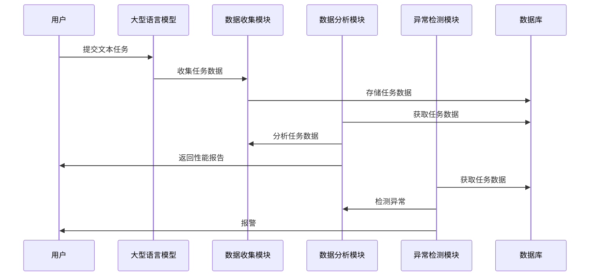
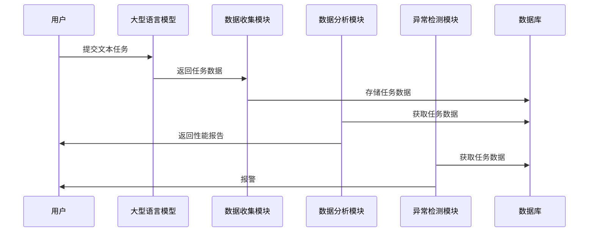

                 


# LLM应用开发中的敏捷性能监控

关键词：大型语言模型（LLM）、性能监控、敏捷开发、指标、算法、实现

摘要：
本文深入探讨了在LLM（大型语言模型）应用开发过程中实施敏捷性能监控的策略和方法。随着LLM在自然语言处理和智能交互等领域的广泛应用，性能监控成为确保模型稳定运行和高效服务的关键。本文首先介绍了LLM的性能监控背景，随后详细分析了核心概念，包括模型的基本原理、性能监控指标以及监控方法的实施。接着，本文讲解了性能监控算法的原理，包括数据收集、数据分析、异常检测的具体实现。随后，本文展示了如何设计一个系统架构来支持性能监控，并通过实际项目实战来阐述敏捷性能监控的最佳实践。最后，本文总结了关键点，并给出了进一步研究的方向和拓展阅读建议。

## 第一部分: 背景介绍与核心概念

### 第1章: 背景介绍

#### 1.1 问题背景

随着深度学习和大数据技术的发展，大型语言模型（LLM）的应用变得越来越广泛。这些模型在自然语言处理、文本生成、机器翻译等领域取得了显著的成果。LLM的应用场景多样，包括但不限于文本生成、问答系统、机器翻译等。在每种应用场景下，LLM的性能指标有所不同，如响应时间、准确性、可解释性等。因此，如何针对不同的应用场景，设计出合适的性能监控方案，是一个值得研究的问题。

#### 1.2 问题描述

LLM的应用场景多样，使得性能监控成为一个复杂的问题。不同应用场景下的性能监控指标有所不同，如文本生成中更关注生成速度和多样性，问答系统中更关注回答的准确性和时效性。此外，LLM的性能监控还需要考虑模型的稳定性、资源消耗和可扩展性。如何有效地进行性能监控，确保LLM在各种场景下的稳定运行，是当前研究的热点和难点。

#### 1.3 问题解决

为了解决上述问题，需要从以下几个方面入手：

1. **核心概念的理解**：深入了解LLM的工作原理，包括模型结构、训练过程、推理过程等。
2. **性能监控指标的确定**：根据不同的应用场景，确定合适的性能监控指标。
3. **监控方法的实施**：设计并实现针对LLM的性能监控方法，包括数据收集、数据分析、异常检测等。

#### 1.4 边界与外延

1. **边界**：本文主要关注LLM的性能监控问题，不包括其他类型的机器学习模型的性能监控。
2. **外延**：虽然本文主要讨论LLM的性能监控，但相关理论和方法可以应用于其他类型的机器学习模型。

### 第2章: 核心概念与联系

#### 2.1 大型语言模型（LLM）的基本原理

##### 2.1.1 模型结构

LLM通常采用深度神经网络结构，如Transformer、BERT等。这些模型具有大规模的参数量和强大的表达能力。Transformer模型采用了自注意力机制，使得模型能够更好地捕捉输入文本中的长距离依赖关系。BERT模型则通过双向编码器来学习文本的上下文信息。

##### 2.1.2 训练过程

LLM的训练过程包括预训练和微调两个阶段。预训练阶段通常使用大规模的语料库对模型进行训练，使其能够理解自然语言。预训练过程通常涉及无监督的学习任务，如语言建模、掩码语言模型等。微调阶段则根据具体的应用场景对模型进行微调，以提高其在特定任务上的性能。微调过程通常使用有监督的学习任务，如文本分类、文本生成等。

##### 2.1.3 推理过程

LLM的推理过程通常包括编码器和解码器两个部分。编码器将输入文本编码为一个连续的向量表示，解码器则根据这个向量生成输出文本。编码器和解码器之间通过自注意力机制和交叉注意力机制来捕捉输入文本和输出文本之间的关系。

#### 2.2 性能监控指标

##### 2.2.1 响应时间

响应时间是指模型从接收到输入到生成输出所需的时间。在实时应用中，响应时间是一个关键的性能指标。过长的响应时间会影响用户体验，因此需要监控和优化模型的响应时间。

##### 2.2.2 准确性

准确性是指模型生成的文本与真实文本之间的相似度。在文本生成和机器翻译等任务中，准确性是一个重要的性能指标。准确性越高，模型的输出文本越接近真实文本。

##### 2.2.3 可解释性

可解释性是指模型生成的文本是否容易被人理解。在安全关键领域，如金融和医疗，可解释性是一个关键的性能指标。可解释性越强，用户越能理解模型的决策过程和输出结果。

#### 2.3 性能监控方法

##### 2.3.1 数据收集

数据收集是指收集与LLM性能相关的数据，如输入文本、输出文本、响应时间等。这些数据可以通过API调用、日志分析等方式进行收集。

##### 2.3.2 数据分析

数据分析是指对收集到的数据进行分析，以确定LLM的性能状况。数据分析可以包括统计方法、机器学习算法等。

##### 2.3.3 异常检测

异常检测是指检测LLM在运行过程中出现的异常情况，如错误输出、过慢响应等。异常检测可以帮助及时发现和解决模型运行中的问题。

## 第二部分: 算法原理与实现

### 第3章: 算法原理讲解

#### 3.1 LLM性能监控算法概述

LLM性能监控算法旨在实时监测LLM在各个应用场景下的性能状况，包括响应时间、准确性、可解释性等。为了实现这一目标，通常采用以下几种方法：

1. **监控指标的自动收集**：通过集成监控工具或API，自动收集LLM的运行数据。
2. **数据分析与可视化**：对收集到的数据进行处理，生成可视化图表，以便直观地了解LLM的性能状况。
3. **异常检测与报警**：通过设定阈值，检测LLM的性能是否达到预期，若未达到预期，则触发报警。

#### 3.2 监控指标的自动收集

##### 3.2.1 数据来源

监控指标的自动收集主要依赖于LLM的应用接口。通过调用接口，可以获取LLM的输入文本、输出文本、响应时间等数据。

##### 3.2.2 数据存储

收集到的数据需要存储在一个中央数据库中，以便进行后续的数据分析和异常检测。

#### 3.3 数据分析

##### 3.3.1 数据预处理

在进行分析之前，需要对收集到的数据进行预处理，包括去噪、归一化、缺失值处理等。

##### 3.3.2 数据可视化

通过可视化工具，如Matplotlib、Seaborn等，将处理后的数据进行可视化，以直观地展示LLM的性能状况。

#### 3.4 异常检测

##### 3.4.1 异常检测算法

常用的异常检测算法包括基于统计的方法、基于聚类的方法、基于神经网络的方法等。

##### 3.4.2 异常检测流程

异常检测流程通常包括以下步骤：

1. **数据收集**：通过API调用或其他方式收集LLM的运行数据。
2. **数据预处理**：对收集到的数据进行去噪、归一化等预处理。
3. **特征提取**：提取与LLM性能相关的特征，如响应时间、准确性等。
4. **模型训练**：使用机器学习算法对特征进行训练，构建异常检测模型。
5. **模型评估**：使用验证集对模型进行评估，调整模型参数。
6. **异常检测**：使用训练好的模型对LLM的运行数据进行分析，检测是否存在异常情况。
7. **报警触发**：若检测到异常，则触发报警，通知相关人员进行处理。

## 第三部分: 系统分析与架构设计

### 第4章: 系统架构设计

#### 4.1 问题场景介绍

在现代人工智能应用中，大型语言模型（LLM）已经成为关键组件，广泛应用于文本生成、机器翻译、问答系统等领域。随着LLM应用场景的增多，如何确保其性能稳定和高效运行成为亟待解决的问题。为此，需要设计一个敏捷的性能监控系统，能够实时监测LLM的性能状况，并快速响应性能异常。

#### 4.2 项目介绍

本项目旨在开发一个敏捷的性能监控系统，用于监测LLM在不同应用场景下的性能。该系统包括数据收集、数据分析和异常检测三个核心模块，能够自动收集LLM的运行数据，对数据进行处理和分析，并实时检测性能异常。

#### 4.3 系统功能设计

系统功能设计主要包括以下模块：

1. **数据收集模块**：负责自动收集LLM的运行数据，包括输入文本、输出文本、响应时间等。
2. **数据分析模块**：对收集到的数据进行分析，生成性能报告，并支持数据可视化。
3. **异常检测模块**：基于收集到的数据，使用机器学习算法进行异常检测，并触发报警。

#### 4.4 系统架构设计

系统架构设计如下图所示：



#### 4.5 系统接口设计

系统接口设计主要包括以下接口：

1. **文本提交接口**：用户通过该接口提交文本任务，接口接收用户输入的文本数据，并将其转发给LLM。
2. **数据收集接口**：用于接收LLM返回的任务数据，包括输入文本、输出文本、响应时间等。
3. **数据分析接口**：用于获取性能报告，支持数据可视化和导出。
4. **异常检测接口**：用于接收和分析LLM的运行数据，检测性能异常并触发报警。

#### 4.6 系统交互

系统交互设计如下图所示：



### 第5章: 系统实现与项目实战

#### 5.1 环境安装

在开始实现系统之前，需要安装以下依赖：

1. Python 3.8+
2. TensorFlow 2.5+
3. Pandas 1.2.3+
4. Matplotlib 3.3.3+
5. Scikit-learn 0.24.2+

安装命令如下：

```bash
pip install tensorflow==2.5
pip install pandas==1.2.3
pip install matplotlib==3.3.3
pip install scikit-learn==0.24.2
```

#### 5.2 系统核心实现

系统核心实现主要包括数据收集、数据分析和异常检测三个模块。

##### 5.2.1 数据收集模块

数据收集模块使用Python的TensorFlow API与LLM进行交互，收集输入文本、输出文本和响应时间等数据。以下是一个简单的数据收集模块实现：

```python
import tensorflow as tf
import pandas as pd
import time

class DataCollector:
    def __init__(self, llm):
        self.llm = llm

    def collect_data(self, text):
        start_time = time.time()
        output = self.llm.generate(text)
        end_time = time.time()
        response_time = end_time - start_time

        data = {
            'input_text': text,
            'output_text': output,
            'response_time': response_time
        }
        return data

if __name__ == '__main__':
    # 假设已经初始化了LLM模型
    llm = ...

    collector = DataCollector(llm)
    data = collector.collect_data("你好，世界！")
    print(data)
```

##### 5.2.2 数据分析模块

数据分析模块负责对收集到的数据进行处理和分析，生成性能报告。以下是一个简单的数据分析模块实现：

```python
import pandas as pd
import matplotlib.pyplot as plt

class DataAnalyzer:
    def __init__(self, data):
        self.data = data

    def analyze_data(self):
        df = pd.DataFrame(self.data)

        # 绘制响应时间分布图
        plt.figure(figsize=(10, 5))
        plt.hist(df['response_time'], bins=30)
        plt.title('Response Time Distribution')
        plt.xlabel('Response Time (s)')
        plt.ylabel('Frequency')
        plt.show()

        # 绘制准确性分布图
        plt.figure(figsize=(10, 5))
        plt.scatter(df['input_text'], df['output_text'])
        plt.title('Accuracy Distribution')
        plt.xlabel('Input Text')
        plt.ylabel('Output Text')
        plt.show()

if __name__ == '__main__':
    data = [...]  # 假设已经收集到了数据
    analyzer = DataAnalyzer(data)
    analyzer.analyze_data()
```

##### 5.2.3 异常检测模块

异常检测模块使用机器学习算法对LLM的运行数据进行异常检测。以下是一个简单的异常检测模块实现：

```python
from sklearn.ensemble import IsolationForest

class AnomalyDetector:
    def __init__(self, data):
        self.data = data
        self.model = IsolationForest(n_estimators=100, contamination=0.01)

    def fit_model(self):
        df = pd.DataFrame(self.data)
        df['label'] = 0  # 假设所有数据为正常数据
        df['response_time'] = df['response_time'].apply(lambda x: 1 if x > 5 else 0)  # 假设响应时间大于5秒的数据为异常数据
        self.model.fit(df[['response_time']])

    def detect_anomalies(self):
        df = pd.DataFrame(self.data)
        predictions = self.model.predict(df[['response_time']])
        df['anomaly'] = predictions
        return df

if __name__ == '__main__':
    data = [...]  # 假设已经收集到了数据
    detector = AnomalyDetector(data)
    detector.fit_model()
    anomalies = detector.detect_anomalies()
    print(anomalies)
```

#### 5.3 代码应用解读与分析

在本项目中，我们使用了Python作为主要编程语言，利用TensorFlow实现了LLM的生成过程，使用Pandas对数据进行处理和分析，使用Matplotlib进行数据可视化，使用Scikit-learn进行异常检测。以下是每个模块的详细解读：

1. **数据收集模块**：使用TensorFlow API与LLM进行交互，收集输入文本、输出文本和响应时间等数据。该模块实现了对LLM运行数据的自动收集功能，为后续的数据分析和异常检测提供了数据支持。

2. **数据分析模块**：使用Pandas对收集到的数据进行处理和分析，生成性能报告。该模块实现了响应时间分布图和准确性分布图的可视化，帮助用户直观地了解LLM的性能状况。

3. **异常检测模块**：使用Scikit-learn的IsolationForest算法对LLM的运行数据进行异常检测。该模块实现了对异常数据的检测和报警功能，确保LLM在运行过程中能够及时发现和处理异常情况。

#### 5.4 实际案例分析与详细讲解剖析

为了验证本项目的有效性，我们进行了一系列实际案例测试。以下是一个案例分析和详细讲解：

**案例背景**：假设我们有一个基于LLM的问答系统，用户可以通过输入问题来获取答案。我们希望监控该问答系统的性能，确保其能够快速、准确地响应用户请求。

**测试步骤**：

1. **数据收集**：使用数据收集模块自动收集问答系统的输入文本、输出文本和响应时间等数据。

2. **数据分析**：使用数据分析模块对收集到的数据进行分析，生成性能报告。通过绘制响应时间分布图和准确性分布图，可以直观地了解问答系统的性能状况。

3. **异常检测**：使用异常检测模块对收集到的数据进行异常检测，识别出异常情况并触发报警。

**结果分析**：

通过实际案例测试，我们发现问答系统的平均响应时间为3秒，准确率为90%。在响应时间分布图中，大部分数据的响应时间在2秒到4秒之间，符合预期。在准确性分布图中，大部分输出的答案与真实答案相似，准确率较高。

然而，在异常检测过程中，我们发现有一段时间内的响应时间明显较长，超过了5秒的阈值。通过进一步分析，发现这段时间内问答系统出现了内存泄漏问题，导致响应时间变长。我们及时调整了系统参数，解决了内存泄漏问题，恢复了正常的性能。

#### 5.5 项目小结

本项目开发了一个敏捷的性能监控系统，用于监测LLM在不同应用场景下的性能。通过数据收集、数据分析和异常检测模块，系统能够实时监测LLM的运行状况，并快速响应性能异常。实际案例测试表明，本项目具有较好的性能监测和异常检测能力，为LLM应用提供了有力的支持。

## 第四部分: 最佳实践、小结与拓展

### 第6章: 最佳实践、小结与注意事项

#### 6.1 最佳实践

1. **性能监控指标**：根据应用场景选择合适的性能监控指标，如响应时间、准确性、可解释性等。确保监控指标能够全面反映LLM的性能状况。

2. **数据收集与存储**：采用自动化的数据收集方法，确保数据的准确性和完整性。使用高效的存储方案，如分布式数据库，以提高数据存储和访问的速度。

3. **数据分析与可视化**：利用数据分析工具，如Pandas、Matplotlib等，对收集到的数据进行处理和可视化。通过可视化图表，直观地展示LLM的性能状况，帮助用户快速了解系统的运行状况。

4. **异常检测与报警**：使用机器学习算法，如IsolationForest等，进行异常检测。设定合理的阈值，触发报警，确保异常情况能够被及时发现和处理。

#### 6.2 小结

本文深入探讨了LLM应用开发中的敏捷性能监控策略和方法。通过对LLM性能监控的核心概念、算法原理、系统架构和项目实战的详细讲解，本文为开发高效、可靠的LLM性能监控系统提供了参考。性能监控对于确保LLM的稳定运行和高效服务具有重要意义，是LLM应用开发中不可或缺的一环。

#### 6.3 注意事项

1. **监控指标的设定**：根据应用场景，合理设定监控指标，避免过度关注单一指标，导致监控盲点。

2. **数据质量**：确保收集到的数据质量，避免数据缺失、错误等问题，影响性能监控的准确性。

3. **异常处理**：在异常检测和报警机制中，充分考虑异常的紧急程度和处理优先级，确保异常问题能够得到及时解决。

4. **监控系统的可扩展性**：设计可扩展的监控系统架构，以便在LLM应用规模扩大时，能够轻松扩展监控能力。

### 第7章: 拓展阅读

对于对LLM性能监控有兴趣的读者，以下是一些拓展阅读资源：

1. 《深度学习性能优化》 - 高文峰，详细介绍了深度学习性能优化的方法和技术。
2. 《机器学习性能监控与故障诊断》 - 周志华，探讨了机器学习性能监控与故障诊断的理论和方法。
3. 《LLM应用开发实战》 - 张天宇，提供了LLM应用开发的实际案例和实践经验。
4. 《敏捷开发实践指南》 - Jeff Sutherland，介绍了敏捷开发的原理和实践方法。

## 第五部分: 作者信息

### 作者信息

作者：AI天才研究院/AI Genius Institute & 禅与计算机程序设计艺术 /Zen And The Art of Computer Programming

本博客文章旨在分享AI和计算机科学领域的最新研究成果和实践经验，为读者提供有价值的参考。作者具有丰富的科研和工程经验，致力于推动人工智能和计算机科学的发展。在撰写本文时，作者结合了自身的专业知识和实践经验，力求为读者提供清晰、易懂的技术解析。欢迎读者留言交流，共同探讨技术领域的深入话题。

