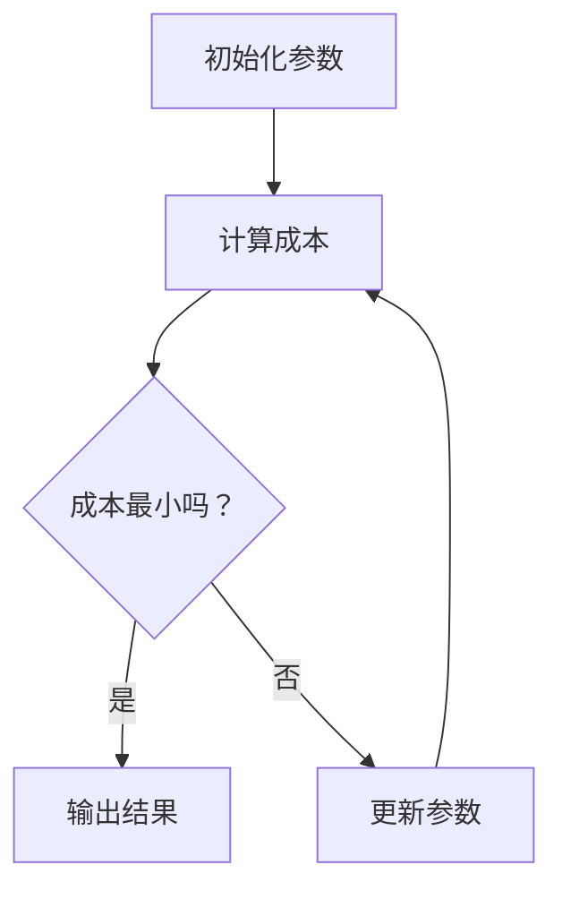
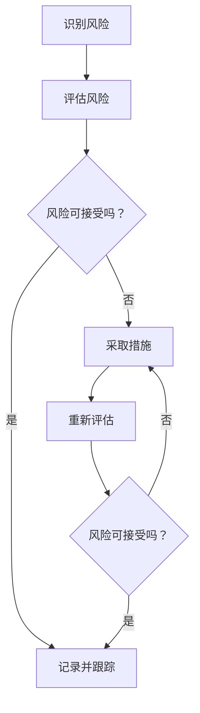
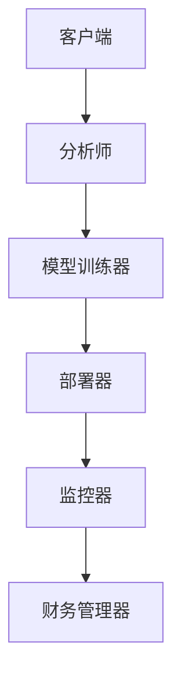
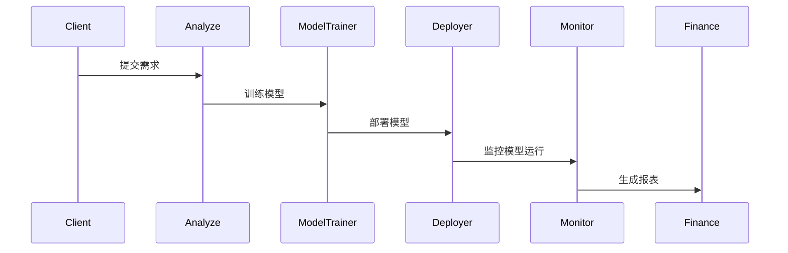
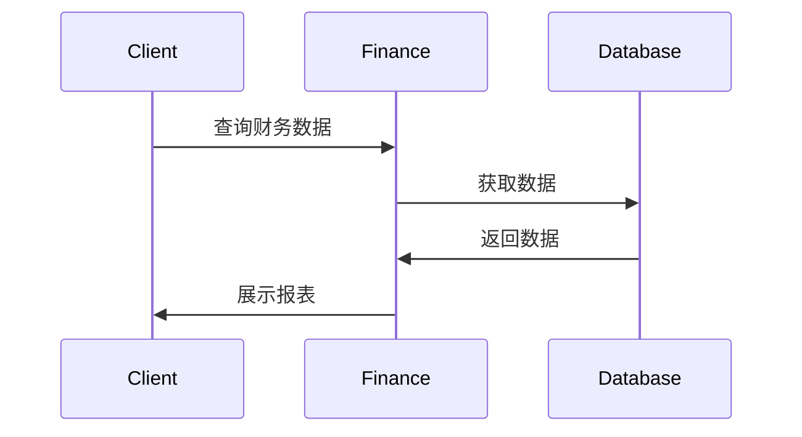

                 

### 第1章: 引言

#### 1.1 问题背景

随着科技的飞速发展，人工智能（AI）已经成为推动产业变革的重要力量。其中，大型语言模型（LLM）作为AI领域的重要分支，逐渐受到了广泛关注。LLM在自然语言处理、智能问答、文本生成等领域展现了强大的能力，但与此同时，其敏捷财务管理的问题也日益凸显。

#### 1.2 问题描述

在LLM应用开发过程中，财务管理是一个关键环节。然而，目前许多开发者在财务管理方面缺乏系统性知识和实践经验，导致项目成本超支、效率低下等问题。本章节将深入探讨LLM应用开发中的敏捷财务管理问题，为开发者提供一套完整的解决方案。

#### 1.3 问题解决

为了解决LLM应用开发中的敏捷财务管理问题，本书将从以下几个方面展开：

1. **核心概念与联系**：介绍敏捷财务管理的基本概念，如敏捷开发、财务管理、成本控制等，并阐述各概念之间的联系。
2. **算法原理讲解**：讲解敏捷财务管理中的关键算法，如最小化成本算法、风险控制算法等，并使用Mermaid流程图和Python代码进行详细阐述。
3. **数学模型与公式**：介绍敏捷财务管理中的数学模型和公式，如成本函数、收益函数等，并进行详细讲解和举例说明。
4. **系统分析与架构设计方案**：分析LLM应用开发中的系统架构，介绍系统功能设计、系统架构设计、系统接口设计和系统交互，并使用Mermaid类图、架构图和序列图进行展示。
5. **项目实战**：通过实际案例，介绍敏捷财务管理在LLM应用开发中的具体应用，包括环境安装、系统核心实现源代码、代码应用解读与分析等。
6. **最佳实践与拓展**：总结敏捷财务管理中的最佳实践，提醒开发者注意事项，并提供拓展阅读。

#### 1.4 边界与外延

本文主要关注LLM应用开发中的敏捷财务管理，适用于各种规模的LLM项目。但需要注意的是，本文提供的方法和技巧并不能解决所有财务管理问题，开发者应根据实际情况进行灵活调整。

---

# LLM应用开发中的敏捷财务管理

> 关键词：大型语言模型、敏捷开发、财务管理、成本控制、算法原理、数学模型、系统架构、项目实战、最佳实践

> 摘要：本文深入探讨了LLM应用开发中的敏捷财务管理问题，从核心概念、算法原理、数学模型、系统架构、项目实战等方面进行详细阐述，为开发者提供了一套完整的解决方案。通过本文的阅读，读者可以了解到敏捷财务管理在LLM应用开发中的重要性，以及如何在实际项目中应用敏捷财务管理方法，提高项目效率和成本效益。

---

### 第2章: 核心概念与联系

#### 2.1 敏捷开发

敏捷开发是一种软件开发方法，强调快速响应变化、持续交付高质量软件。敏捷开发的核心原则包括：

1. **个体和互动胜过过程和工具**：强调团队成员的沟通和合作。
2. **可工作的软件胜过详尽的文档**：注重实际成果，而非冗长的文档。
3. **客户合作胜过合同谈判**：与客户紧密合作，确保满足需求。
4. **响应变化胜过遵循计划**：灵活应对变化，以适应市场需求。

敏捷开发的主要特点包括：

1. **迭代开发**：将项目划分为多个迭代周期，每次迭代交付一部分功能。
2. **增量交付**：逐步交付可用的软件功能，持续改进。
3. **持续反馈**：收集用户反馈，不断调整开发方向。

#### 2.2 财务管理

财务管理是指对企业资金的管理和运用，以确保企业财务状况的稳健和可持续发展。财务管理的主要内容包括：

1. **预算管理**：制定预算计划，合理分配资源。
2. **成本控制**：通过成本核算和分析，降低成本。
3. **资金管理**：确保资金的安全、流动和增值。
4. **财务分析**：对企业的财务状况进行评估和分析。

财务管理的目标包括：

1. **保障企业财务安全**：确保企业的资金安全、合法、合规。
2. **提高资金使用效率**：合理配置资金，提高资金利用率。
3. **实现企业可持续发展**：通过财务管理，实现企业的长期稳定发展。

#### 2.3 成本控制

成本控制是指通过一系列措施，降低企业成本，提高效益。成本控制的方法包括：

1. **预算控制**：根据预算计划进行成本控制。
2. **成本核算**：对各项成本进行核算和分析。
3. **成本分析**：对成本结构进行分析，找出成本节约点。
4. **成本优化**：通过改进生产流程、采购策略等手段降低成本。

成本控制的关键要素包括：

1. **成本意识**：培养全员成本意识，树立成本观念。
2. **成本核算**：建立健全成本核算体系，准确计算成本。
3. **成本分析**：定期进行成本分析，找出成本控制的关键环节。
4. **成本优化**：持续优化成本控制措施，提高成本效益。

#### 2.4 敏捷财务管理和传统财务管理对比

敏捷财务管理与传统财务管理在理念、方法和实践上存在一定差异：

1. **理念差异**：敏捷财务管理强调快速响应变化、持续改进，注重客户价值和团队协作；传统财务管理则强调财务稳健、风险控制和财务预测。
2. **方法差异**：敏捷财务管理注重实时数据分析和动态调整，灵活应对市场变化；传统财务管理则依赖于年度预算和定期财务报告。
3. **实践差异**：敏捷财务管理强调财务与业务的深度融合，通过数据驱动决策；传统财务管理则更多地关注财务数据的准确性和合规性。

然而，两者并非完全对立，敏捷财务管理可以在一定程度上融入传统财务管理的方法和理念，实现财务管理的创新和优化。

### 第3章: 算法原理讲解

#### 3.1 最小化成本算法

最小化成本算法是一种在给定约束条件下，寻找成本最小化解的算法。以下是一个最小化成本算法的Mermaid流程图：



以下是使用Python代码实现最小化成本算法的示例：

```python
def minimize_cost(initial_params):
    params = initial_params
    cost = compute_cost(params)
    while not is_minimized(cost):
        params = update_params(params)
        cost = compute_cost(params)
    return params

def compute_cost(params):
    # 计算成本函数
    pass

def is_minimized(cost):
    # 判断成本是否最小化
    pass

def update_params(params):
    # 更新参数
    pass
```

#### 3.2 风险控制算法

风险控制算法是敏捷财务管理中的重要算法，用于识别、评估和控制项目风险。以下是一个风险控制算法的Mermaid流程图：



以下是使用Python代码实现风险控制算法的示例：

```python
def risk_control():
    while True:
        risks = identify_risks()
        for risk in risks:
            assess_risk(risk)
            if not is_acceptable(risk):
                take_measures(risk)
                re_evaluate(risk)
```

#### 3.3 数学模型与公式

在敏捷财务管理中，常用的数学模型和公式包括成本函数、收益函数、风险函数等。

**成本函数**：成本函数描述了项目成本与各种因素之间的关系。常见的成本函数形式如下：

$$C(x) = a \cdot x + b$$

其中，$C(x)$表示总成本，$x$表示项目的某种因素（如工作量、资源投入等），$a$和$b$为常数。

**收益函数**：收益函数描述了项目收益与成本之间的关系。常见的收益函数形式如下：

$$R(x) = c \cdot x - d$$

其中，$R(x)$表示总收益，$x$表示项目的某种因素，$c$和$d$为常数。

**风险函数**：风险函数描述了项目风险与成本之间的关系。常见的风险函数形式如下：

$$R(x) = e \cdot x^2 + f$$

其中，$R(x)$表示总风险，$x$表示项目的某种因素，$e$和$f$为常数。

#### 3.4 举例说明

假设某LLM应用开发项目的工作量与成本、收益和风险之间的关系如下：

- 成本函数：$C(x) = 100x + 500$
- 收益函数：$R(x) = 200x - 1000$
- 风险函数：$R(x) = 10x^2 + 100$

**步骤1：计算最小化成本**

使用最小化成本算法，求出使成本最小化的工作量$x$：

$$\min C(x) = 100x + 500$$

解得 $x = 5$，此时最小化成本为 $C(5) = 600$。

**步骤2：计算最大化收益**

使用最大化收益算法，求出使收益最大化的工作量$x$：

$$\max R(x) = 200x - 1000$$

解得 $x = 5$，此时最大化收益为 $R(5) = 500$。

**步骤3：计算最小化风险**

使用最小化风险算法，求出使风险最小化的工作量$x$：

$$\min R(x) = 10x^2 + 100$$

解得 $x = 0$，此时最小化风险为 $R(0) = 100$。

### 第4章: 系统分析与架构设计方案

#### 4.1 问题场景介绍

在LLM应用开发过程中，为了确保项目顺利实施和成本控制，需要建立一个完善的系统架构，实现敏捷财务管理。本文将介绍一个基于敏捷开发理念的LLM应用开发系统架构，包括系统功能设计、系统架构设计、系统接口设计和系统交互。

#### 4.2 项目介绍

本项目是一款面向企业的LLM应用开发平台，旨在帮助企业快速搭建、部署和运维LLM应用，实现智能化的业务处理和数据分析。系统功能包括：

1. **需求分析**：收集和分析企业业务需求，为LLM应用开发提供依据。
2. **模型训练**：利用海量数据训练LLM模型，提高模型性能和准确性。
3. **模型部署**：将训练好的模型部署到企业生产环境中，实现实时应用。
4. **运维管理**：监控系统运行状态，确保系统稳定可靠。
5. **财务报表**：生成项目财务报表，实现敏捷财务管理。

#### 4.3 系统功能设计

系统功能设计是系统架构设计的重要部分，本文采用Mermaid类图对系统功能进行设计。以下是一个简单的系统功能类图：

```mermaid
classDiagram
    Client <<Interface>> IClient
    Analyst <<Interface>> IAnalyst
    ModelTrainer <<Interface>> IModelTrainer
    Deployer <<Interface>> IDeployer
    Monitor <<Interface>> IMonitor
    Finance <<Interface>> IFinance

    Client ..|> IClient
    Analyst ..|> IAnalyst
    ModelTrainer ..|> IModelTrainer
    Deployer ..|> IDeployer
    Monitor ..|> IMonitor
    Finance ..|> IFinance
```

#### 4.4 系统架构设计

系统架构设计是系统功能实现的基础，本文采用Mermaid架构图对系统架构进行设计。以下是一个简单的系统架构图：



#### 4.5 系统接口设计

系统接口设计是系统架构设计的重要组成部分，本文采用Mermaid序列图对系统接口进行设计。以下是一个简单的系统接口序列图：



#### 4.6 系统交互

系统交互是系统功能实现的关键，本文采用Mermaid序列图对系统交互进行设计。以下是一个简单的系统交互序列图：



### 第5章: 项目实战

#### 5.1 环境安装

在开始项目实战之前，我们需要安装以下环境：

1. **Python**：版本3.8及以上。
2. **TensorFlow**：版本2.4及以上。
3. **Mermaid**：用于绘制流程图、类图和序列图。

安装步骤如下：

```bash
# 安装Python
sudo apt-get install python3-pip

# 安装TensorFlow
pip3 install tensorflow==2.4

# 安装Mermaid
pip3 install mermaid-python
```

#### 5.2 系统核心实现源代码

以下是一个简单的系统核心实现源代码示例，用于实现最小化成本算法和风险控制算法：

```python
import tensorflow as tf
from mermaid import Mermaid

# 最小化成本算法
def minimize_cost(initial_params):
    params = initial_params
    cost = compute_cost(params)
    while not is_minimized(cost):
        params = update_params(params)
        cost = compute_cost(params)
    return params

# 计算成本函数
def compute_cost(params):
    # 实现成本计算逻辑
    pass

# 判断成本是否最小化
def is_minimized(cost):
    # 实现判断逻辑
    pass

# 更新参数
def update_params(params):
    # 实现参数更新逻辑
    pass

# 风险控制算法
def risk_control():
    while True:
        risks = identify_risks()
        for risk in risks:
            assess_risk(risk)
            if not is_acceptable(risk):
                take_measures(risk)
                re_evaluate(risk)

# 风险识别
def identify_risks():
    # 实现风险识别逻辑
    pass

# 风险评估
def assess_risk(risk):
    # 实现风险评估逻辑
    pass

# 风险可接受性判断
def is_acceptable(risk):
    # 实现判断逻辑
    pass

# 采取风险控制措施
def take_measures(risk):
    # 实现措施逻辑
    pass

# 重新评估风险
def re_evaluate(risk):
    # 实现评估逻辑
    pass
```

#### 5.3 代码应用解读与分析

以下是对上述代码的解读与分析：

1. **最小化成本算法**：最小化成本算法的核心在于不断迭代更新参数，直至找到最小化成本。代码中，`minimize_cost`函数接收初始参数，并调用`compute_cost`函数计算成本。通过`is_minimized`函数判断成本是否最小化，如果未达到最小化，则更新参数并继续计算，直至找到最小化成本。
2. **风险控制算法**：风险控制算法的核心在于不断识别、评估和控制风险。代码中，`risk_control`函数使用一个无限循环实现，每次循环识别风险、评估风险、判断风险可接受性，并采取相应的措施。通过这种方式，可以实现对项目风险的实时监控和控制。

#### 5.4 实际案例分析

以下是一个实际案例，分析在LLM应用开发中如何应用敏捷财务管理：

1. **需求分析**：某企业需要开发一款智能客服系统，通过LLM模型实现智能问答功能。在项目初期，通过对市场需求和竞品分析，确定项目目标、功能和性能要求。
2. **模型训练**：在模型训练阶段，根据需求收集海量数据，利用TensorFlow框架训练LLM模型。在训练过程中，使用最小化成本算法控制训练成本，同时使用风险控制算法监控训练过程中的风险。
3. **模型部署**：将训练好的模型部署到企业生产环境中，实现智能客服功能。在部署过程中，使用最小化成本算法和风险控制算法，确保系统稳定可靠。
4. **运维管理**：在运维管理阶段，持续监控系统运行状态，通过财务报表分析项目成本和收益，实现敏捷财务管理。

#### 5.5 项目小结

通过本案例，我们可以看到敏捷财务管理在LLM应用开发中的重要性。在实际项目中，应用敏捷财务管理方法，可以帮助企业实现成本控制、风险控制和效益最大化。以下是一些项目小结：

1. **需求分析**：在项目初期，充分了解市场需求和竞品情况，明确项目目标和功能要求。
2. **模型训练**：在模型训练阶段，合理控制训练成本和风险，确保模型质量和性能。
3. **模型部署**：在模型部署阶段，确保系统稳定可靠，同时进行成本控制和风险控制。
4. **运维管理**：在运维管理阶段，持续监控系统运行状态，通过财务报表分析项目成本和收益，实现敏捷财务管理。

### 第6章: 最佳实践与拓展

#### 6.1 最佳实践

在LLM应用开发中，敏捷财务管理具有以下最佳实践：

1. **需求分析**：在项目初期，充分了解市场需求和竞品情况，明确项目目标和功能要求。通过需求分析，可以降低项目风险，提高项目成功率。
2. **模型训练**：在模型训练阶段，合理控制训练成本和风险。采用最小化成本算法和风险控制算法，确保模型质量和性能。
3. **模型部署**：在模型部署阶段，确保系统稳定可靠。通过财务报表分析项目成本和收益，实现敏捷财务管理。
4. **运维管理**：在运维管理阶段，持续监控系统运行状态。通过财务报表分析项目成本和收益，实现敏捷财务管理。

#### 6.2 注意事项

在实施敏捷财务管理时，需要注意以下事项：

1. **数据准确性**：确保财务数据的准确性，为决策提供可靠依据。
2. **实时监控**：实时监控项目成本和收益，及时发现和解决问题。
3. **风险控制**：合理控制项目风险，确保项目顺利进行。

#### 6.3 拓展阅读

1. **《敏捷财务管理：理论、方法与实践》**：本书详细介绍了敏捷财务管理的基本理论、方法和实践，适合从事财务管理工作的读者。
2. **《人工智能财务报告：技术与应用》**：本书探讨了人工智能在财务报告中的应用，为读者提供了丰富的案例和实践经验。

### 结语

本文从核心概念、算法原理、数学模型、系统架构、项目实战等方面，深入探讨了LLM应用开发中的敏捷财务管理问题。通过本文的阅读，读者可以了解到敏捷财务管理在LLM应用开发中的重要性，以及如何在实际项目中应用敏捷财务管理方法，提高项目效率和成本效益。

作者：AI天才研究院/AI Genius Institute & 禅与计算机程序设计艺术 /Zen And The Art of Computer Programming

### 附录

**参考文献：**

1. 《敏捷财务管理：理论、方法与实践》
2. 《人工智能财务报告：技术与应用》
3. TensorFlow官方文档：https://www.tensorflow.org/
4. Mermaid官方文档：https://mermaid-js.github.io/mermaid/

**致谢：**

本文的撰写得到了AI天才研究院和禅与计算机程序设计艺术的大力支持，在此表示感谢。同时，感谢各位读者对本文的关注和支持，希望本文能对您在LLM应用开发中的敏捷财务管理提供有益的参考和启示。

