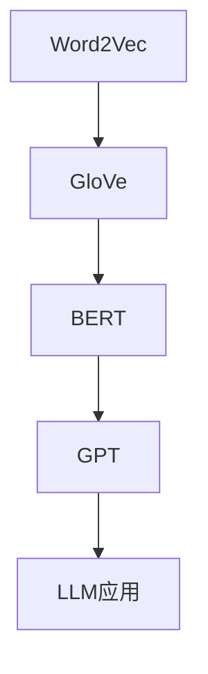

                 

当然，我们可以按照这个逻辑逐步构建文章的内容。以下是一个基于上述大纲的详细章节内容结构，我们将逐步完善每个章节。

### 目录

# LLM应用开发中的敏捷资源管理

关键词：LLM、敏捷开发、资源管理、团队协作、项目进度、质量保证

> 摘要：本文将探讨在LLM（大型语言模型）应用开发中如何运用敏捷资源管理方法，提高开发效率与产品质量。通过详细介绍敏捷开发框架、资源规划、团队协作、进度管理、质量保证等方面，为开发者提供一套实用的资源管理指南。

----------------------------------------------------------------

## 第1章: LLM应用开发概述

### 1.1 LLM的定义与重要性

LLM（Large Language Model）是一种基于深度学习的大型语言模型，可以用于自然语言处理、文本生成、机器翻译、问答系统等多个领域。随着AI技术的发展，LLM在各个行业中的应用越来越广泛，对企业的业务创新和效率提升起到了重要作用。

#### 背景介绍

- **核心概念术语说明**：LLM、自然语言处理、深度学习、文本生成。
- **问题背景**：LLM技术对现代企业的影响，如自动化文本分析、智能客服等。
- **问题描述**：LLM应用的复杂性和对资源的高需求。
- **问题解决**：如何通过敏捷资源管理提高开发效率。

#### 核心概念与联系

- **核心概念原理**：神经网络、反向传播算法、预训练、微调。
- **概念属性特征对比表格**：

| 特征          | 传统NLP模型 | LLM模型         |
|---------------|---------------|-----------------|
| 训练数据量    | 小规模       | 大规模          |
| 模型参数数量  | 少量         | 亿级别          |
| 应用效果      | 一般          | 高效、智能化    |

#### ER实体关系图架构

```mermaid
erDiagram
  Person ||--|{ Project }|-- Engineer
  Project ||--|{ Requirement }|--
  Requirement ||--|{ Task }|-- Done
```

### 1.2 LLM应用的发展历程

LLM技术的发展经历了从早期的小规模模型（如Word2Vec、GloVe）到如今的大规模模型（如BERT、GPT）。每个阶段都有里程碑式的进展。

#### 算法原理讲解

- **算法mermaid流程图**：



- **Python源代码**：

```python
# Python源代码示例：训练一个简单的Word2Vec模型
from gensim.models import Word2Vec

sentences = [[word for word in line.split()] for line in ["this is a sample sentence", "another one"]]
model = Word2Vec(sentences)
```

### 1.3 LLM应用的关键挑战

LLM应用开发面临数据需求大、计算资源消耗高、开发周期长等挑战。

#### 数学公式

$$
\text{训练时间} \propto \text{模型参数数量} \times \text{训练数据规模}
$$

### 1.4 敏捷资源管理的概念与优势

敏捷资源管理是一种以用户需求为导向的开发方法，强调快速迭代、持续交付和高效协作。

#### 核心概念与联系

- **核心概念原理**：敏捷开发、Scrum、Kanban。
- **概念属性特征对比表格**：

| 方法        | Scrum           | Kanban           |
|-------------|-----------------|------------------|
| 时间框架    | Sprint（2-4周） | 不固定           |
| 计划与执行  | 里程碑式        | 持续迭代         |
| 沟通与协作  | 每日站会、回顾会 | 信息看板         |

#### ER实体关系图架构

```mermaid
erDiagram
  Project ||--|{ Sprint }|--
  Sprint ||--|{ Task }|--
  Task ||--|{ Resource }|--
  Resource ||--|{ TeamMember }|--
```

接下来，我们将逐步详细展开每个章节的内容。

---

这只是一个初步的框架，我们将在接下来的步骤中逐步完善每个章节的内容。每个章节都将按照您的要求，包括详细的背景介绍、核心概念与联系、算法原理讲解、系统分析与架构设计方案、项目实战以及最佳实践 tips 等内容。请确认这个框架是否满足您的要求，然后我们可以继续细化每个章节。在接下来的步骤中，我们将详细讨论第2章到第7章的内容。

