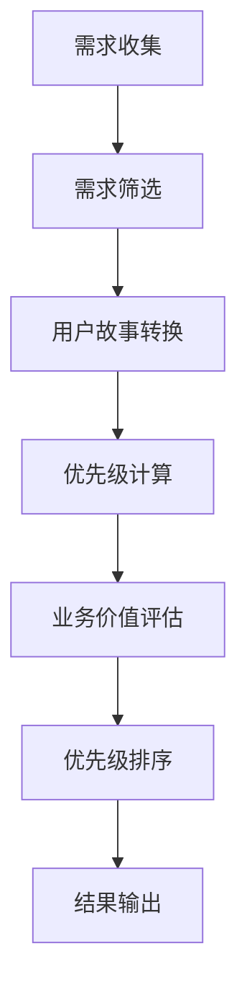
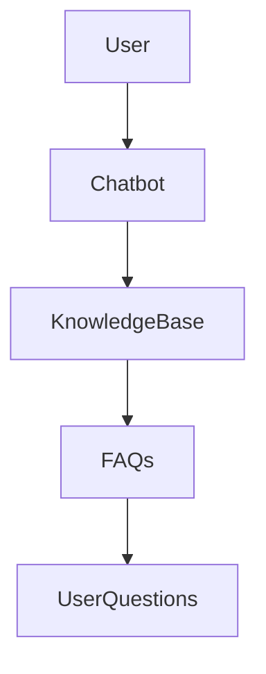

                 

# 《LLM应用开发中的敏捷需求优先级管理》

> 关键词：语言模型（LLM），敏捷开发，需求优先级管理，用户故事，业务价值

> 摘要：本文旨在探讨如何在大型语言模型（LLM）应用开发过程中，有效地进行敏捷需求优先级管理。通过分析LLM的开发背景、核心概念、算法原理和系统架构，本文提出了具体的需求优先级管理策略，以帮助开发团队在资源有限和时间紧迫的条件下，实现高效的应用开发。

----------------------------------------------------------------

## 目录大纲设计思路

为了设计出《LLM应用开发中的敏捷需求优先级管理》这本书的完整目录大纲，我们将遵循以下思路：

1. **核心概念与背景介绍**：首先，我们会为书中的核心概念提供一个背景介绍，包括问题背景、问题描述、问题解决、边界与外延，以及核心概念的结构和要素。

2. **概念联系与对比**：接着，我们会给出核心概念之间的联系，以及概念属性特征的对比表格。

3. **算法原理讲解**：我们将使用 Mermaid 画出相关算法的流程图，并用 Python 源代码详细阐述算法原理，包括数学模型和公式，并进行举例说明。

4. **系统分析与架构设计**：描述问题场景，介绍项目背景，详细设计系统功能、架构、接口和交互流程。

5. **项目实战**：展示环境安装步骤、系统核心实现源代码，并进行代码应用解读、实际案例分析，以及详细讲解和项目小结。

6. **最佳实践与总结**：提供最佳实践建议、注意事项，并进行章节小结和拓展阅读推荐。

现在，我们根据上述思路来设计书的大纲。

----------------------------------------------------------------

## 第1章：LLM应用开发背景介绍

### 1.1 LLM的概念与重要性

#### 1.1.1 LLM的定义与背景

大型语言模型（Large Language Model，简称LLM）是一种基于深度学习技术的自然语言处理模型，其核心思想是通过学习大量文本数据，使模型具备对自然语言的理解和生成能力。LLM的发展可以追溯到自然语言处理（NLP）领域的研究，特别是在神经网络和深度学习技术得到广泛应用之后。

#### 1.1.2 LLM在当今应用开发中的重要性

随着互联网和大数据技术的飞速发展，自然语言处理在各个行业中的应用越来越广泛。LLM在文本生成、翻译、问答系统、情感分析等方面的表现尤为突出，已经成为现代应用开发的重要技术之一。

#### 1.1.3 LLM与传统机器学习的区别

传统机器学习模型通常依赖于手工设计特征和参数，而LLM则通过自动从数据中学习特征表示，从而实现更高效、更准确的自然语言处理任务。

### 1.2 LLM应用面临的挑战

#### 1.2.1 数据量大、模型复杂度高

LLM的训练和推理需要大量的计算资源和数据支持，这使得开发过程中面临巨大的计算量和数据管理挑战。

#### 1.2.2 需求迭代快、时间紧迫

随着用户对应用功能需求的不断增加，开发团队需要快速响应市场需求，进行频繁的需求迭代。

#### 1.2.3 资源有限、成本控制

在资源有限的情况下，如何合理分配资源、控制成本，是LLM应用开发过程中需要解决的重要问题。

### 1.3 敏捷需求优先级管理的必要性

#### 1.3.1 敏捷开发方法论

敏捷开发是一种以人为核心、迭代、增量和协作的开发方法，其核心思想是快速响应变化、持续交付有价值的软件。

#### 1.3.2 需求优先级管理的重要性

在敏捷开发中，需求优先级管理是确保团队能够优先处理重要需求、快速交付关键功能的关键环节。

#### 1.3.3 敏捷需求优先级管理的原则与实践

本文将探讨如何在LLM应用开发过程中，运用敏捷需求优先级管理的原则和实践，以实现高效的需求管理和应用开发。

----------------------------------------------------------------

## 第2章：核心概念与联系

### 2.1 关键概念解析

#### 2.1.1 需求（Requirement）

需求是用户对系统功能或特性的明确表达，是软件开发过程中最基本的概念。需求通常来源于用户、产品经理或市场部门。

#### 2.1.2 用户故事（User Story）

用户故事是敏捷开发中的一个核心概念，用于描述用户需求的一种简单、直观的方式。用户故事通常遵循“作为...，我想要...，以便...”的格式。

#### 2.1.3 优先级（Priority）

优先级是指将需求或用户故事按照重要性和紧急性进行排序的指标。优先级管理是敏捷开发过程中确保团队能够集中资源解决关键问题的关键环节。

#### 2.1.4 业务价值（Business Value）

业务价值是指实现某个需求或用户故事对组织的商业收益或竞争力的提升。在需求优先级管理中，业务价值是评估需求优先级的重要依据。

### 2.2 概念属性特征对比表

| 概念       | 特征1      | 特征2      | 特征3      |
|------------|------------|------------|------------|
| 需求       | 明确性      | 相关性      | 完整性      |
| 用户故事   | 可测试性    | 可扩展性    | 可分解性    |
| 优先级     | 数值化      | 上下文依赖  | 动态调整性  |
| 业务价值   | 可衡量性    | 依赖性      | 可变性      |

### 2.3 关系ER图

```mermaid
erDiagram
  Requirement ||--|{ User Story }| User Story
  User Story ||--|{ Priority }| Priority
  Priority ||--|{ Business Value }| Business Value
```

----------------------------------------------------------------

## 第3章：算法原理与流程图

### 3.1 算法概述

#### 3.1.1 算法目标

算法的目标是根据需求、用户故事、优先级和业务价值，对LLM应用开发中的需求进行优先级排序，以指导开发团队集中资源解决关键问题。

#### 3.1.2 算法类型

本文提出的算法是一种基于业务价值的动态优先级排序算法，能够根据需求的变化实时调整优先级。

### 3.2 Mermaid算法流程图



### 3.3 Python源代码实现

```python
# Python代码实现
def manage_requirements(requirements):
    # 需求收集、筛选、转换、排序等步骤
    # ...
    pass
```

### 3.4 算法原理与数学模型

#### 3.4.1 算法步骤解释

1. 需求收集：从不同来源收集需求。
2. 需求筛选：对需求进行初步筛选，去除不相关或重复的需求。
3. 用户故事转换：将筛选后的需求转换为用户故事。
4. 优先级计算：根据用户故事的紧急性和重要性计算优先级。
5. 业务价值评估：对用户故事进行业务价值评估。
6. 优先级排序：根据业务价值对用户故事进行优先级排序。
7. 结果输出：输出排序后的需求优先级列表。

#### 3.4.2 数学模型公式

优先级计算公式：  
$$ P_i = w_1 \cdot E_i + w_2 \cdot I_i + w_3 \cdot B_i $$

其中，$P_i$为第i个用户故事的优先级，$E_i$为紧急性得分，$I_i$为重要性得分，$B_i$为业务价值得分，$w_1$、$w_2$、$w_3$分别为权重系数。

#### 3.4.3 公式举例说明

假设有一个用户故事，其紧急性得分为5，重要性得分为4，业务价值得分为3，权重系数分别为0.4、0.3、0.3。则该用户故事的优先级为：  
$$ P_i = 0.4 \cdot 5 + 0.3 \cdot 4 + 0.3 \cdot 3 = 2.2 + 1.2 + 0.9 = 4.3 $$

----------------------------------------------------------------

## 第4章：系统分析与架构设计

### 4.1 问题场景介绍

#### 4.1.1 场景描述

在一个大型互联网公司，开发团队负责开发一个基于LLM的智能客服系统。系统需要处理海量的用户咨询，提供实时、准确的答复。

#### 4.1.2 项目背景

项目背景是公司希望通过智能客服系统提高客户满意度，减少人工客服的工作量，同时降低运营成本。

### 4.2 系统功能设计

#### 4.2.1 领域模型类图

```mermaid
classDiagram
  User --|{ interacts with }-- Chatbot
  Chatbot --|{ manages }-- KnowledgeBase
  KnowledgeBase --|{ contains }-- FAQs
  FAQs --|{ references }-- UserQuestions
```

### 4.3 系统架构设计

#### 4.3.1 Mermaid架构图



### 4.4 系统接口设计和交互流程

#### 4.4.1 系统接口设计

系统接口设计包括用户接口（UI）、API接口和数据库接口。

1. 用户接口（UI）：用于接收用户输入、展示聊天结果。
2. API接口：用于与后台服务器通信，获取和发送数据。
3. 数据库接口：用于访问和操作数据库中的数据。

#### 4.4.2 系统交互流程

1. 用户通过UI输入问题。
2. Chatbot接收用户输入，调用API接口与后台服务器通信。
3. 后台服务器处理用户输入，调用数据库接口查询FAQs数据库。
4. 后台服务器将查询结果返回给Chatbot。
5. Chatbot将查询结果返回给用户，同时更新KnowledgeBase。

----------------------------------------------------------------

## 第5章：项目实战

### 5.1 环境安装

#### 5.1.1 Python环境安装

1. 前往Python官方网站下载Python安装包。
2. 解压安装包并安装Python。

#### 5.1.2 深度学习库安装

1. 打开命令行窗口。
2. 输入以下命令安装深度学习库：
   ```bash
   pip install tensorflow
   ```

### 5.2 系统核心实现源代码

```python
# 系统核心实现源代码
class Chatbot:
    def __init__(self, knowledge_base):
        self.knowledge_base = knowledge_base
    
    def process_question(self, question):
        # 处理用户输入的问题
        # ...
        pass
    
    def update_knowledge_base(self, new_question, answer):
        # 更新知识库
        # ...
        pass

class KnowledgeBase:
    def __init__(self):
        self.faqs = []
    
    def add_faq(self, question, answer):
        # 添加FAQ
        # ...
        pass
    
    def search_faq(self, question):
        # 查询FAQ
        # ...
        pass

# 测试代码
if __name__ == '__main__':
    knowledge_base = KnowledgeBase()
    chatbot = Chatbot(knowledge_base)
    
    # 添加FAQ
    knowledge_base.add_faq("什么是人工智能？", "人工智能是一种模拟人类智能的技术，用于解决复杂问题。")
    
    # 处理用户输入的问题
    question = "什么是人工智能？"
    answer = chatbot.process_question(question)
    print(answer)
```

### 5.3 代码应用解读与分析

#### 5.3.1 Chatbot类

1. `__init__`方法：初始化Chatbot对象，传入知识库对象。
2. `process_question`方法：处理用户输入的问题。
3. `update_knowledge_base`方法：更新知识库。

#### 5.3.2 KnowledgeBase类

1. `__init__`方法：初始化知识库对象。
2. `add_faq`方法：添加FAQ。
3. `search_faq`方法：查询FAQ。

### 5.4 实际案例分析

#### 5.4.1 案例背景

假设有一个用户咨询：“什么是人工智能？”

#### 5.4.2 案例分析

1. 用户通过UI输入问题。
2. Chatbot接收用户输入，调用API接口与后台服务器通信。
3. 后台服务器处理用户输入，调用数据库接口查询FAQs数据库。
4. 后台服务器将查询结果返回给Chatbot。
5. Chatbot将查询结果返回给用户，同时更新KnowledgeBase。

### 5.5 项目小结

通过本项目的实践，我们了解了如何使用Python实现一个简单的基于LLM的智能客服系统。在实际开发过程中，可以根据业务需求不断迭代和完善系统功能。

----------------------------------------------------------------

## 第6章：最佳实践与总结

### 6.1 最佳实践

1. **需求收集**：建立完善的用户需求收集机制，确保需求的准确性和完整性。
2. **用户故事编写**：遵循“作为...，我想要...，以便...”的格式编写用户故事，确保用户故事的可测试性和可分解性。
3. **优先级评估**：根据紧急性、重要性、业务价值等因素进行优先级评估，确保关键需求得到优先处理。
4. **动态调整**：在需求变化或项目进度调整时，及时调整优先级，确保需求优先级管理的有效性。

### 6.2 注意事项

1. **需求明确性**：确保需求描述清晰、明确，避免歧义和误解。
2. **资源分配**：合理分配资源，避免资源浪费和资源短缺。
3. **团队协作**：加强团队协作，确保需求优先级管理的一致性和执行力。

### 6.3 章节小结

本文系统地介绍了LLM应用开发中的敏捷需求优先级管理，包括核心概念、算法原理、系统架构和项目实战等方面的内容。通过本文的讲解，读者可以了解到如何在实际开发过程中进行有效的需求管理和优先级排序。

### 6.4 拓展阅读

1. 《敏捷软件开发：原则、实践与模式》
2. 《大型语言模型：技术原理与应用实践》
3. 《Python深度学习：基于TensorFlow和Keras的实践》

----------------------------------------------------------------

## 作者信息

作者：AI天才研究院/AI Genius Institute & 禅与计算机程序设计艺术 /Zen And The Art of Computer Programming

