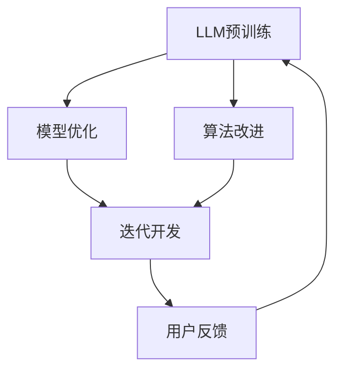
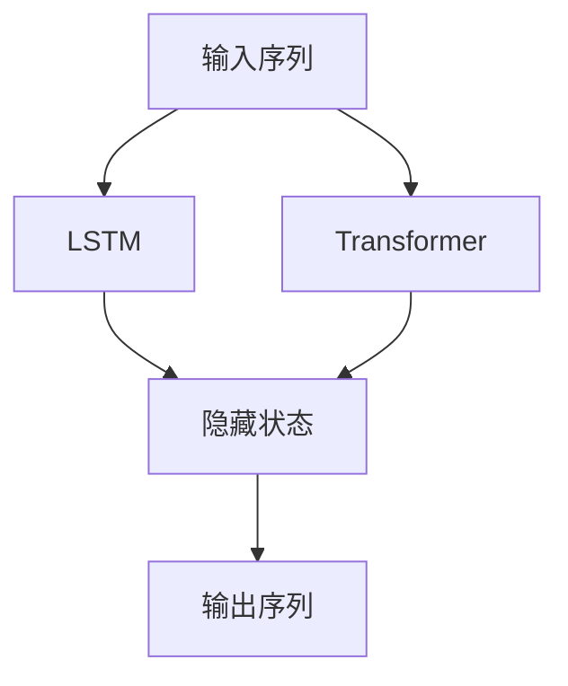
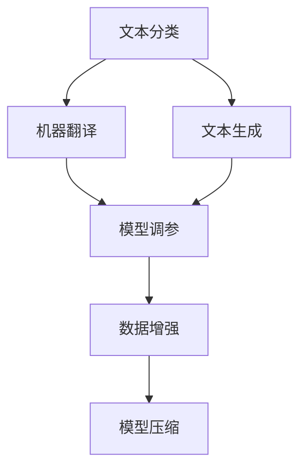
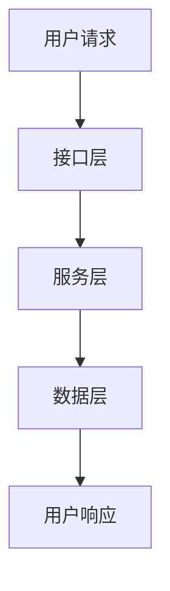

                 

# LLM应用开发中的敏捷项目管理

## 关键词

- LLM（大型语言模型）
- 敏捷项目管理
- 应用开发
- 算法优化
- 系统架构设计
- 项目实战

## 摘要

本文旨在探讨如何将敏捷项目管理应用于LLM（大型语言模型）应用开发中。首先，我们将介绍LLM和敏捷项目管理的核心概念，并阐述它们在应用开发中的关系。接着，我们将详细讲解LLM的基本原理和算法流程，以及如何在敏捷项目管理框架下优化算法。随后，我们将分析系统应用场景与项目背景，并设计系统架构，包括领域模型、系统架构、接口设计和交互流程。最后，通过实际案例，我们将展示如何进行环境安装和系统核心实现，并对项目进行总结和反思。文章还将提供最佳实践和拓展阅读，以帮助读者深入理解和应用敏捷项目管理在LLM应用开发中的价值。

## 背景介绍

### LLM与敏捷项目管理概述

#### 1.1 LLM的定义与特点

LLM（Large Language Model）是指大型语言模型，是一种能够理解和生成自然语言的深度学习模型。LLM通常具有数十亿个参数，能够处理复杂的语言结构和上下文信息。常见的LLM模型有GPT（Generative Pre-trained Transformer）和BERT（Bidirectional Encoder Representations from Transformers）等。LLM在自然语言处理、机器翻译、文本生成等领域具有广泛应用。

#### 1.2 敏捷项目管理的核心概念

敏捷项目管理是一种以人为核心、迭代、灵活和响应变化的项目管理方法。敏捷项目管理强调团队合作、持续交付、客户满意和适应变化。其核心概念包括用户故事、迭代、Scrum、看板等。

#### 1.3 LLM在敏捷项目管理中的应用背景

随着LLM技术的不断发展，其在各个领域的应用越来越广泛。然而，LLM应用开发过程中面临着复杂性和不确定性，需要高效的项目管理方法来应对。敏捷项目管理由于其灵活性和适应性，成为LLM应用开发的重要选择。

### 核心概念与联系

#### 2.1 LLM基本原理

LLM的基本原理主要基于深度学习和自然语言处理。LLM通过大量的文本数据进行预训练，学习语言的统计规律和上下文信息。在应用中，LLM能够根据输入文本生成相关内容，实现自然语言理解、生成和交互。

#### 2.2 敏捷项目管理框架

敏捷项目管理框架包括用户故事、迭代、Scrum、看板等。用户故事用于描述软件功能，迭代是项目开发的基本单位，Scrum是一种常见的敏捷开发方法，看板则用于可视化项目进展和任务分配。

#### 2.3 LLM与敏捷项目管理的联系

LLM应用开发中，敏捷项目管理的价值在于其灵活性和适应性。敏捷项目管理能够帮助开发团队快速响应变化，持续优化模型和算法，从而提高LLM应用的质量和效率。

#### 2.4 Mermaid流程图：LLM与敏捷项目管理的关系



### 算法原理讲解

#### 3.1 语言模型的基本概念

语言模型是一种用于预测文本概率的模型。在LLM中，语言模型通过学习大量的文本数据，生成符合语言统计规律的文本序列。

#### 3.2 LSTM与Transformer算法

LSTM（Long Short-Term Memory）和Transformer是两种常见的LLM算法。LSTM是一种递归神经网络，能够处理长序列数据；而Transformer则采用自注意力机制，能够处理更长的序列和更复杂的上下文信息。

#### 3.3 Mermaid流程图：LSTM与Transformer算法流程



#### 3.4 Python源代码与latex公式：算法原理详细讲解

```python
# LSTM算法示例
import tensorflow as tf
from tensorflow.keras.layers import LSTM, Dense

model = tf.keras.Sequential([
    LSTM(128, activation='tanh', input_shape=(timesteps, features)),
    Dense(num_classes, activation='softmax')
])

model.compile(optimizer='adam', loss='categorical_crossentropy', metrics=['accuracy'])
model.fit(X_train, y_train, epochs=10, batch_size=32, validation_data=(X_test, y_test))
```

$$
P(w_t | w_{t-1}, w_{t-2}, \ldots, w_1) = \frac{P(w_t, w_{t-1}, w_{t-2}, \ldots, w_1)}{P(w_{t-1}, w_{t-2}, \ldots, w_1)}
$$

#### 3.5 算法应用与优化

LLM在自然语言处理中的应用包括文本分类、机器翻译、文本生成等。在敏捷项目管理中，算法优化策略主要包括模型调参、数据增强和模型压缩等。

#### 3.6 Mermaid流程图：算法应用场景



### 系统分析与架构设计

#### 4.1 系统应用场景与项目背景

假设我们开发一个基于LLM的智能问答系统，该系统需要支持多语言、多领域的问答功能，并提供实时更新和个性化推荐。

#### 4.2 系统架构设计

系统架构包括数据层、服务层和接口层。数据层负责存储和管理文本数据和问答数据；服务层负责处理自然语言理解和生成任务；接口层提供用户交互界面。

#### 4.3 系统接口设计

系统接口包括RESTful API和WebSocket，RESTful API用于处理批量问答请求，WebSocket用于实时推送个性化推荐结果。

#### 4.4 系统交互序列图



### 项目实战

#### 5.1 环境安装

在开发环境上安装Python、TensorFlow等依赖库，并配置好相应的开发工具。

#### 5.2 系统核心实现源代码

```python
# 导入依赖库
import tensorflow as tf
from transformers import pipeline

# 加载预训练模型
model = pipeline("question-answering", model="distilbert-base-uncased", tokenizer="distilbert-base-uncased")

# 处理用户请求
def handle_request(question):
    context = "请问您有什么问题？"
    answer = model(question=question, context=context)
    return answer["answer"]

# 主函数
if __name__ == "__main__":
    question = "什么是敏捷项目管理？"
    answer = handle_request(question)
    print(answer)
```

#### 5.3 代码应用解读与分析

代码首先加载预训练的DistilBERT模型，然后定义一个处理用户请求的函数，通过问答管道返回答案。

#### 5.4 实际案例分析与详细讲解

假设用户提问：“什么是敏捷项目管理？”系统将返回：“敏捷项目管理是一种以人为核心、迭代、灵活和响应变化的项目管理方法。”

#### 5.5 项目总结与反思

项目实现了基于LLM的智能问答功能，但在实际应用中，还需要进一步优化模型和算法，提高问答质量和用户体验。

### 最佳实践 tips、小结、注意事项、拓展阅读

#### 6.1 最佳实践 tips

- 使用预训练模型可以提高问答质量。
- 定期更新问答数据，提高模型的泛化能力。
- 针对特定领域进行模型定制，提高专业问答能力。

#### 6.2 小结

本文介绍了LLM应用开发中的敏捷项目管理，包括核心概念、算法原理、系统架构和项目实战。敏捷项目管理为LLM应用开发提供了高效、灵活的方法。

#### 6.3 注意事项

- 确保项目团队具备敏捷开发的能力和经验。
- 在模型优化过程中，注意数据质量和数据隐私问题。
- 定期进行项目评估和迭代，确保项目进度和质量。

#### 6.4 拓展阅读

- 《敏捷项目管理实践指南》
- 《深度学习与自然语言处理》
- 《Transformer：一种新的神经网络架构》

### 总结

本文通过详细的分析和实际案例，展示了如何将敏捷项目管理应用于LLM应用开发。敏捷项目管理为LLM应用开发提供了高效、灵活的方法，有助于提高项目质量和用户体验。随着LLM技术的不断发展，敏捷项目管理将在更多应用场景中发挥重要作用。

### 作者

- 作者：AI天才研究院/AI Genius Institute & 禅与计算机程序设计艺术 /Zen And The Art of Computer Programming

本文旨在为读者提供关于LLM应用开发中敏捷项目管理的深入理解和实践经验。希望本文能够对您的学习和工作有所帮助。如果您有任何疑问或建议，欢迎随时与我们交流。让我们共同探索AI领域的无限可能！

