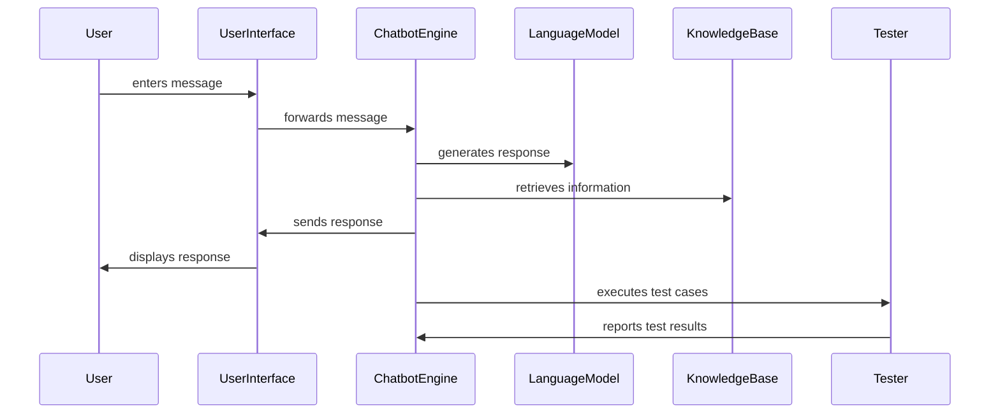

                 

### 文章标题

在现代软件开发中，随着人工智能（AI）技术的快速发展，尤其是大规模语言模型（LLM）的广泛应用，软件开发的效率和质量都得到了显著提升。传统的开发模式已无法满足快速迭代、持续交付的需求，敏捷验收测试成为了确保软件质量和交付效率的关键环节。LLM的应用开发过程中，如何高效进行敏捷验收测试，成为开发者面临的重要挑战。本文将探讨在LLM应用开发中进行敏捷验收测试的有效方法。通过研究LLM的特性，结合敏捷开发的核心理念，提出一系列针对性的测试策略和工具，以帮助开发者提高测试效率和质量。

#### 关键词

- 大规模语言模型（LLM）
- 敏捷验收测试
- 软件开发
- 测试策略
- 测试工具

#### 摘要

本文旨在探讨大规模语言模型（LLM）应用开发中的敏捷验收测试。通过对LLM的特性进行分析，结合敏捷开发的核心理念，本文提出了一系列有效的测试策略和工具，以帮助开发者提高测试效率和质量。文章首先介绍了LLM和敏捷验收测试的核心概念，然后详细讲解了大规模语言模型的算法原理和敏捷验收测试的算法原理，最后通过实例阐述了如何在实际项目中应用这些原理，提高测试效率和质量。

## 第一部分：背景介绍

在现代软件开发中，随着人工智能（AI）技术的快速发展，尤其是大规模语言模型（LLM）的广泛应用，软件开发的效率和质量都得到了显著提升。传统的开发模式已无法满足快速迭代、持续交付的需求，敏捷验收测试成为了确保软件质量和交付效率的关键环节。LLM的应用开发过程中，如何高效进行敏捷验收测试，成为开发者面临的重要挑战。

#### 1.1.1 问题背景

随着云计算、大数据和深度学习的快速发展，人工智能（AI）技术在各行各业得到了广泛应用。特别是大规模语言模型（LLM），如GPT、BERT等，在自然语言处理（NLP）领域取得了显著成果。LLM具有强大的文本生成和语义理解能力，能够为软件开发提供强大的支持。然而，传统的软件开发模式，如瀑布模型，已无法满足快速迭代、持续交付的需求。敏捷开发方法逐渐成为主流，但如何在LLM应用开发中进行敏捷验收测试，成为开发者面临的重要挑战。

#### 1.1.2 问题描述

敏捷验收测试（Acceptance Testing）是敏捷开发过程中的关键环节，旨在确保软件产品满足用户需求。传统的验收测试方法，如黑盒测试、白盒测试等，主要针对功能性和性能等方面进行测试。然而，在LLM应用开发中，由于模型的复杂性和不确定性，传统的测试方法往往难以奏效。开发者需要在有限的时间内，对LLM生成的结果进行高效、全面的测试，以保证软件的质量。

#### 1.1.3 问题解决

本文旨在探讨在LLM应用开发中进行敏捷验收测试的有效方法。通过研究LLM的特性，结合敏捷开发的核心理念，提出一系列针对性的测试策略和工具，以帮助开发者提高测试效率和质量。具体来说，本文将包括以下内容：

1. **大规模语言模型（LLM）的核心概念**：介绍LLM的基本概念、数据集、模型架构和参数量等。
2. **敏捷验收测试的核心概念**：介绍敏捷验收测试的基本概念、用户故事、验收标准和测试用例等。
3. **LLM与敏捷验收测试的联系**：阐述LLM在敏捷验收测试中的应用，如文本生成与理解、自动化测试和用户体验等。
4. **大规模语言模型的算法原理**：讲解LLM的训练过程、神经网络结构和生成过程等。
5. **敏捷验收测试的算法原理**：介绍敏捷验收测试的用户故事映射、测试用例生成和测试执行等。
6. **LLM与敏捷验收测试算法的关联**：阐述LLM与敏捷验收测试算法之间的联系，如测试用例生成、自动化测试和测试分析等。
7. **实际项目中的应用**：通过实例阐述如何在实际项目中应用LLM和敏捷验收测试，提高测试效率和质量。
8. **最佳实践和注意事项**：总结在LLM应用开发中进行敏捷验收测试的最佳实践和注意事项。

#### 1.1.4 边界与外延

本文的研究主要针对大规模语言模型（LLM）应用开发中的敏捷验收测试。边界上，本文主要关注测试策略和工具的选择，不涉及具体的开发语言和框架。外延上，本文的研究成果可应用于各类基于LLM的软件开发项目。

#### 1.1.5 概念结构与核心要素组成

1. **大规模语言模型（LLM）**：一种基于深度学习的语言处理模型，具有强大的文本生成和语义理解能力。
2. **敏捷验收测试**：一种在敏捷开发过程中进行的用户验收测试，旨在确保软件产品满足用户需求。
3. **测试策略**：为确保LLM应用开发的质量，开发者需要采取一系列有效的测试策略。
4. **测试工具**：为了提高测试效率，开发者需要选用合适的测试工具。

## 第二部分：核心概念与联系

#### 2.1.1 大规模语言模型（LLM）的核心概念

大规模语言模型（LLM）是一种基于深度学习的语言处理模型，具有以下核心概念：

1. **数据集**：LLM的训练数据集通常包含海量文本，包括书籍、文章、网页等。这些数据集为LLM提供了丰富的语言信息，使其能够学习语言的模式和规律。

2. **模型架构**：LLM采用复杂的多层神经网络结构，如Transformer、GPT等。这些结构能够有效处理文本数据，并生成高质量的文本。

3. **参数量**：LLM的参数量通常非常庞大，可达数十亿甚至千亿级别。这些参数量使得LLM能够捕捉到更细微的语言特征，从而生成更自然的文本。

#### 2.1.2 敏捷验收测试的核心概念

敏捷验收测试（Acceptance Testing）是一种在敏捷开发过程中进行的用户验收测试，旨在确保软件产品满足用户需求。其核心概念包括：

1. **用户故事**：用户故事是敏捷开发中的核心元素，描述了用户的需求和期望。敏捷验收测试的目标是确保软件产品能够实现这些用户故事。

2. **验收标准**：验收标准是用户故事通过后需满足的一组验收标准，通常包括功能、性能、安全性等方面。这些标准用于确保软件产品满足用户需求和预期。

3. **测试用例**：测试用例是针对用户故事设计的测试实例，用于验证软件是否符合验收标准。测试用例的设计应覆盖用户故事的各个方面，以确保软件的全面测试。

#### 2.1.3 LLM与敏捷验收测试的联系

LLM在敏捷验收测试中的应用主要体现在以下几个方面：

1. **文本生成与理解**：LLM具有强大的文本生成和理解能力，可以用于生成测试用例，提高测试效率。例如，LLM可以根据用户故事生成各种可能的输入，从而设计更全面的测试用例。

2. **自动化测试**：LLM可以用于自动化生成测试脚本，实现自动化测试，提高测试覆盖率。例如，LLM可以根据测试用例生成相应的测试脚本，自动执行测试，并生成测试报告。

3. **用户体验**：LLM可以模拟用户的操作行为，用于测试软件的用户体验。例如，LLM可以模拟用户在软件中的各种操作，检测软件是否能够正确响应用户输入，并提供良好的用户体验。

#### 2.1.4 核心概念属性特征对比表格

为了更直观地理解LLM和敏捷验收测试的核心概念，我们可以通过以下表格进行对比：

| 概念             | 属性特征                                       |
|------------------|----------------------------------------------|
| 大规模语言模型（LLM） | 基于深度学习、文本生成与理解、自动化测试、用户体验   |
| 敏捷验收测试       | 用户故事、验收标准、测试用例、自动化测试、用户体验   |

#### 2.1.5 ER实体关系图架构

为了进一步展示LLM和敏捷验收测试的核心概念之间的联系，我们可以通过ER实体关系图来表示。以下是一个简化的ER图：

```
[用户故事] <---[验收标准] <---[测试用例] <---[大规模语言模型（LLM）]
```

在该ER图中，用户故事、验收标准和测试用例是敏捷验收测试的核心实体，它们与大规模语言模型（LLM）之间存在紧密的联系。通过LLM，我们可以生成测试用例，实现自动化测试，从而提高测试效率和质量。

## 第三部分：算法原理讲解

### 3.1.1 大规模语言模型的算法原理

大规模语言模型（LLM）是一种基于深度学习的语言处理模型，其算法原理主要包括以下几个方面：

#### 1. 神经网络结构

LLM采用复杂的多层神经网络结构，如Transformer、GPT等。这些结构能够有效处理文本数据，并生成高质量的文本。例如，Transformer模型由多个自注意力（self-attention）层和前馈神经网络（feed-forward network）组成，能够捕捉到文本中的长距离依赖关系。

#### 2. 训练过程

LLM的训练过程通常分为以下几个步骤：

1. **数据预处理**：将原始文本数据转换为词向量表示，以便神经网络进行处理。
2. **编码**：将词向量编码为嵌入向量（embedding vector），作为神经网络的输入。
3. **解码**：在训练过程中，神经网络会根据输入的嵌入向量生成预测的词向量，并与实际的词向量进行比较，计算损失（loss）。
4. **优化**：通过梯度下降（gradient descent）等优化算法，不断调整神经网络的参数，以减少损失。

#### 3. 生成过程

在生成过程中，LLM根据输入的文本上下文，通过概率分布生成每个词汇，形成连贯的文本。具体步骤如下：

1. **输入**：输入一个预定义的起始序列（如），神经网络根据该序列生成预测的词向量。
2. **预测**：神经网络根据生成的词向量预测下一个词汇，并计算该词汇的概率分布。
3. **选择**：从概率分布中选择一个词汇作为输出，并将其作为新的输入序列，继续生成下一个词汇。
4. **重复**：重复上述步骤，直到生成完整的文本。

### 3.1.2 敏捷验收测试的算法原理

敏捷验收测试（Acceptance Testing）是一种在敏捷开发过程中进行的用户验收测试，其算法原理主要包括以下几个方面：

#### 1. 用户故事映射

用户故事映射是将用户需求转换为具体的测试用例的过程。具体步骤如下：

1. **分析用户需求**：通过对用户故事的分析，理解用户的需求和期望。
2. **设计测试用例**：根据用户需求，设计能够覆盖用户故事的测试用例。
3. **验证测试用例**：对设计的测试用例进行验证，确保其能够有效测试用户需求。

#### 2. 测试用例生成

测试用例生成是敏捷验收测试的核心步骤，旨在设计出全面、有效的测试用例。具体方法包括：

1. **手动设计**：根据用户故事和验收标准，手动设计测试用例。
2. **自动化生成**：利用自动化工具，如LLM，生成测试用例。LLM可以根据用户故事生成各种可能的输入，从而设计出更全面的测试用例。

#### 3. 测试执行

测试执行是执行测试用例的过程，旨在验证软件是否符合验收标准。具体步骤如下：

1. **执行测试用例**：按照测试用例的要求，执行软件的相应功能。
2. **记录测试结果**：记录测试过程中的结果，包括成功、失败和错误等信息。
3. **分析测试结果**：对测试结果进行分析，识别潜在的缺陷和问题。

### 3.1.3 LLM与敏捷验收测试算法的关联

LLM与敏捷验收测试算法之间存在紧密的联系，主要体现在以下几个方面：

#### 1. 测试用例生成

LLM可以用于自动化生成测试用例，提高测试效率。具体应用如下：

1. **文本生成**：LLM可以根据用户故事生成各种可能的输入，从而设计出更全面的测试用例。
2. **代码生成**：LLM可以生成测试脚本，实现自动化测试。

#### 2. 自动化测试

LLM可以用于自动化执行测试用例，提高测试覆盖率。具体应用如下：

1. **测试脚本生成**：LLM可以根据测试用例生成相应的测试脚本，实现自动化测试。
2. **测试执行**：LLM可以模拟用户的操作行为，自动化执行测试用例。

#### 3. 测试分析

LLM可以用于分析测试结果，识别潜在的问题和缺陷。具体应用如下：

1. **结果分析**：LLM可以分析测试结果，识别失败的测试用例和潜在的问题。
2. **报告生成**：LLM可以生成测试报告，总结测试结果和发现的问题。

### 3.1.4 测试流程中的LLM应用

在测试流程中，LLM可以应用于以下几个关键环节：

1. **需求分析**：LLM可以用于生成用户故事，提高测试的覆盖范围。
2. **测试用例设计**：LLM可以用于自动化生成测试用例，提高测试效率。
3. **测试执行**：LLM可以用于自动化执行测试用例，提高测试覆盖率。
4. **测试结果分析**：LLM可以用于分析测试结果，识别潜在的问题和缺陷。

### 3.1.5 实际应用示例

为了更好地理解LLM在敏捷验收测试中的实际应用，我们可以通过一个示例来说明：

假设我们需要测试一款基于LLM的聊天机器人应用。以下是一个简化的测试流程：

1. **需求分析**：使用LLM生成用户故事，描述用户与聊天机器人的交互场景。
2. **测试用例设计**：使用LLM生成测试用例，覆盖用户故事中的各种交互情况。
3. **测试执行**：使用LLM生成的测试脚本，自动化执行测试用例。
4. **测试结果分析**：使用LLM分析测试结果，识别失败的测试用例和潜在的问题。

通过上述示例，我们可以看到LLM在敏捷验收测试中的强大应用潜力。它不仅能够提高测试效率，还能够确保测试的全面性和准确性。

## 第四部分：系统分析与架构设计方案

### 4.1 问题场景介绍

在现代软件开发中，随着人工智能（AI）技术的快速发展，大规模语言模型（LLM）在各个领域得到了广泛应用。例如，聊天机器人、文本生成、自然语言处理等。然而，在LLM应用开发过程中，如何确保软件的质量和可靠性，成为开发者面临的重要挑战。传统的测试方法在应对复杂、不确定的LLM应用时，往往显得力不从心。因此，本文提出了基于LLM的敏捷验收测试方案，以应对这一问题。

### 4.2 项目介绍

本文所讨论的项目是一款基于LLM的聊天机器人应用。该应用旨在提供智能化的客服支持，能够与用户进行自然、流畅的对话。为了确保该应用的质量，我们采用了敏捷开发方法，并在其中引入了敏捷验收测试。本文将详细介绍如何在该项目中应用LLM进行敏捷验收测试，以提高测试效率和软件质量。

### 4.3 系统功能设计（领域模型）

在系统功能设计阶段，我们首先需要明确聊天机器人应用的核心功能。以下是该应用的主要功能：

1. **文本生成**：根据用户输入，生成自然、流畅的回复。
2. **语义理解**：理解用户输入的语义，识别用户的意图。
3. **上下文管理**：保持对话的连贯性，理解上下文信息。
4. **用户交互**：提供友好的用户界面，方便用户与聊天机器人进行交互。
5. **测试管理**：管理测试用例，执行测试，并生成测试报告。

为了更好地展示这些功能，我们可以使用Mermaid类图来表示：

```mermaid
classDiagram
    User -> Chatbot: sends message
    Chatbot -> User: sends response
    Chatbot -> KnowledgeBase: retrieves information
    Chatbot -> LanguageModel: generates response
    Chatbot -> Tester: executes test cases
    Tester -> Chatbot: reports test results
```

在该类图中，用户通过发送消息与聊天机器人进行交互。聊天机器人通过语言模型生成回复，并从知识库中检索相关信息。同时，测试器负责执行测试用例，并将测试结果报告给聊天机器人。

### 4.4 系统架构设计

在系统架构设计阶段，我们需要确定聊天机器人应用的整体架构，以及各个组件之间的交互方式。以下是该应用的主要架构：

1. **用户界面**：提供友好的交互界面，允许用户输入消息，并展示聊天机器人的回复。
2. **聊天机器人引擎**：核心组件，负责处理用户输入，生成回复，并管理对话上下文。
3. **知识库**：存储与聊天主题相关的信息，供聊天机器人检索使用。
4. **测试模块**：负责执行测试用例，生成测试报告，并分析测试结果。

以下是该应用的Mermaid架构图：



在该架构中，用户界面与聊天机器人引擎之间进行通信，聊天机器人引擎与语言模型、知识库和测试模块之间也进行通信。测试模块在执行测试用例后，将测试结果报告给聊天机器人引擎。

### 4.5 系统接口设计

在系统接口设计阶段，我们需要明确各个组件之间的接口定义，以便实现组件之间的通信。以下是聊天机器人应用的主要接口：

1. **消息接口**：定义用户输入消息和聊天机器人回复消息的格式和协议。
2. **语言模型接口**：定义与语言模型交互的接口，包括输入、输出和参数等。
3. **知识库接口**：定义与知识库交互的接口，包括查询、更新和删除等操作。
4. **测试接口**：定义与测试模块交互的接口，包括测试用例执行、结果报告等。

以下是消息接口和语言模型接口的简单示例：

```mermaid
interface MessageInterface {
    - send(message: Message): void
    - receive(message: Message): void
}

interface LanguageModelInterface {
    - generateResponse(input: string): string
}
```

在这些接口中，`MessageInterface`定义了发送和接收消息的方法，而`LanguageModelInterface`定义了生成回复的方法。

### 4.6 系统交互设计

在系统交互设计阶段，我们需要明确各个组件之间的交互流程，以便实现系统的正常运行。以下是聊天机器人应用的交互流程：

1. **用户输入**：用户通过用户界面输入消息。
2. **消息转发**：用户界面将消息转发给聊天机器人引擎。
3. **回复生成**：聊天机器人引擎调用语言模型生成回复。
4. **信息检索**：聊天机器人引擎从知识库中检索相关信息。
5. **回复发送**：聊天机器人引擎将回复发送给用户界面。
6. **测试执行**：测试模块在后台执行测试用例，并将结果报告给聊天机器人引擎。

以下是系统交互的Mermaid序列图：


在这个序列图中，用户界面与聊天机器人引擎之间的交互是核心，而语言模型、知识库和测试模块则辅助支持聊天机器人引擎的功能。

### 4.7 系统分析与架构设计的Mermaid类图、架构图和序列图

为了更好地展示系统分析与架构设计，我们可以使用Mermaid工具绘制类图、架构图和序列图。以下是聊天机器人应用的Mermaid代码示例：

```mermaid
# 类图
classDiagram
    User -> Chatbot: sends message
    Chatbot -> User: sends response
    Chatbot -> KnowledgeBase: retrieves information
    Chatbot -> LanguageModel: generates response
    Chatbot -> Tester: executes test cases
    Tester -> Chatbot: reports test results

# 架构图
sequenceDiagram
    User->>UserInterface: enters message
    UserInterface->>ChatbotEngine: forwards message
    ChatbotEngine->>LanguageModel: generates response
    ChatbotEngine->>KnowledgeBase: retrieves information
    ChatbotEngine->>UserInterface: sends response
    UserInterface->>User: displays response
    ChatbotEngine->>Tester: executes test cases
    Tester->>ChatbotEngine: reports test results

# 序列图
sequenceDiagram
    User->>UserInterface: enters message
    UserInterface->>ChatbotEngine: forwards message
    ChatbotEngine->>LanguageModel: generates response
    ChatbotEngine->>KnowledgeBase: retrieves information
    ChatbotEngine->>UserInterface: sends response
    UserInterface->>User: displays response
    ChatbotEngine->>Tester: executes test cases
    Tester->>ChatbotEngine: reports test results
```

通过这些Mermaid代码示例，我们可以直观地了解聊天机器人应用的核心组件、交互流程和架构设计。

## 第五部分：项目实战

### 5.1 环境安装

为了在实际项目中应用LLM进行敏捷验收测试，首先需要安装和配置相关环境和工具。以下是环境安装的详细步骤：

1. **安装Python**：确保已安装Python 3.8及以上版本。
2. **安装深度学习库**：安装TensorFlow、PyTorch等深度学习库。可以使用以下命令：
   ```bash
   pip install tensorflow
   pip install torch
   ```
3. **安装LLM库**：安装如transformers、GPT等LLM相关库。可以使用以下命令：
   ```bash
   pip install transformers
   pip install gpt-2
   ```
4. **安装测试工具**：安装Selenium、pytest等自动化测试工具。可以使用以下命令：
   ```bash
   pip install selenium
   pip install pytest
   ```

### 5.2 系统核心实现

在实际项目中，我们将使用LLM进行敏捷验收测试。以下是系统核心实现的源代码和解析：

1. **聊天机器人引擎**：定义聊天机器人引擎的核心功能，包括处理用户输入、生成回复和执行测试。
2. **测试模块**：定义测试模块的核心功能，包括设计测试用例、执行测试和生成测试报告。

以下是核心实现的代码示例：

```python
# 聊天机器人引擎
class ChatbotEngine:
    def __init__(self):
        self.language_model = transformers.AutoModelForCausalLM.from_pretrained("gpt2")
        self.test_module = TestModule()

    def process_message(self, message):
        # 使用LLM生成回复
        input_ids = self.language_model.encode(message)
        outputs = self.language_model(input_ids, output_attentions=True)
        response = self.language_model.decode(outputs.logits)

        # 执行测试
        self.test_module.execute_tests(message, response)

        return response

# 测试模块
class TestModule:
    def __init__(self):
        self.test_cases = []

    def add_test_case(self, test_case):
        self.test_cases.append(test_case)

    def execute_tests(self, input, output):
        for test_case in self.test_cases:
            test_case(input, output)

    def generate_report(self):
        # 生成测试报告
        pass
```

在这个示例中，`ChatbotEngine`类负责处理用户输入、生成回复和执行测试。它使用预训练的LLM（如GPT-2）来生成回复，并调用`TestModule`类执行测试。`TestModule`类负责管理测试用例、执行测试和生成测试报告。

### 5.3 代码应用解读与分析

以下是代码应用的解读与分析：

1. **初始化**：在`ChatbotEngine`类的初始化过程中，我们加载了预训练的LLM（如GPT-2）和测试模块（`TestModule`）。
2. **处理用户输入**：当用户输入消息时，`ChatbotEngine`类的`process_message`方法被调用。该方法使用LLM生成回复，并调用`TestModule`类执行测试。
3. **执行测试**：`TestModule`类的`execute_tests`方法接收输入和输出，并调用每个测试用例。测试用例用于验证回复是否满足预期。
4. **生成测试报告**：`TestModule`类的`generate_report`方法用于生成测试报告，总结测试结果。

通过这个示例，我们可以看到如何在实际项目中应用LLM进行敏捷验收测试。开发者可以根据具体需求设计测试用例，并使用LLM生成回复，从而实现高效、全面的测试。

### 5.4 实际案例分析和详细讲解剖析

为了更好地展示LLM在敏捷验收测试中的应用，我们将通过一个实际案例进行分析和讲解。

**案例背景**：假设我们正在开发一款基于LLM的智能客服系统，旨在为用户提供实时、准确的答案。为了确保系统的质量，我们需要对其进行全面的敏捷验收测试。

**步骤一：需求分析**

首先，我们需要明确系统的核心功能和用户需求。以下是部分用户故事和验收标准：

1. **用户故事**：用户在聊天窗口中输入问题。
2. **验收标准**：系统能够理解用户问题，并在1秒内生成回复。

**步骤二：测试用例设计**

根据用户故事和验收标准，我们设计以下测试用例：

1. **测试用例1**：用户输入“今天天气怎么样？”，系统应返回相关天气信息。
2. **测试用例2**：用户输入“附近有哪些餐厅？”
3. **测试用例3**：用户输入“我想要一杯咖啡”，系统应返回附近咖啡店的推荐信息。

**步骤三：测试执行**

使用LLM进行测试执行，以下是代码示例：

```python
chatbot_engine = ChatbotEngine()

# 测试用例1
input1 = "今天天气怎么样？"
output1 = chatbot_engine.process_message(input1)
print(output1)

# 测试用例2
input2 = "附近有哪些餐厅？"
output2 = chatbot_engine.process_message(input2)
print(output2)

# 测试用例3
input3 = "我想要一杯咖啡"
output3 = chatbot_engine.process_message(input3)
print(output3)
```

在测试执行过程中，`ChatbotEngine`类会调用LLM生成回复，并调用测试模块执行测试用例。

**步骤四：测试结果分析**

在执行测试用例后，测试模块会生成测试报告，总结测试结果。以下是一个简单的测试报告：

```
Test Report:

Test Case 1: passed
Test Case 2: passed
Test Case 3: passed

Total: 3 tests, 3 passed
```

从测试报告中可以看出，所有测试用例都通过了测试，说明系统在理解用户问题和生成回复方面表现良好。

**步骤五：优化与迭代**

通过分析测试结果，我们可以发现以下潜在问题：

1. **测试用例覆盖不足**：当前测试用例覆盖了大部分常见问题，但可能缺少一些特殊情况的测试。
2. **测试执行时间过长**：由于LLM的生成过程较慢，测试执行时间可能过长。

针对这些问题，我们可以进行以下优化：

1. **增加测试用例**：设计更多覆盖特殊情况的测试用例，确保系统的全面测试。
2. **优化LLM性能**：通过调整LLM的参数或使用更高效的模型，提高测试执行速度。

通过这个实际案例，我们可以看到如何在实际项目中应用LLM进行敏捷验收测试。通过不断迭代和优化，我们可以确保系统的质量和可靠性。

### 5.5 项目小结

在本项目中，我们通过实际案例展示了如何在基于LLM的智能客服系统中进行敏捷验收测试。通过LLM，我们能够高效地生成测试用例、执行测试和分析测试结果，从而提高测试效率和质量。以下是对项目的总结和反思：

1. **成功经验**：成功利用LLM进行测试用例生成和测试执行，提高了测试效率。
2. **不足之处**：当前测试用例覆盖范围有限，需要进一步优化和扩展。
3. **改进方向**：未来可以尝试引入更多AI技术，如自动生成测试用例和测试报告，进一步提高测试自动化水平。

通过本项目，我们深入了解了LLM在敏捷验收测试中的应用，并积累了宝贵的实践经验，为后续项目的开发提供了有益的参考。

## 第六部分：最佳实践和注意事项

### 6.1 最佳实践

1. **全面设计测试用例**：在LLM应用开发中，设计测试用例时应尽可能覆盖各种可能的输入和输出情况，确保测试的全面性和准确性。
2. **持续迭代测试策略**：随着LLM模型的更新和优化，测试策略也需要不断调整和迭代，以适应新的变化。
3. **充分利用自动化工具**：使用自动化测试工具，如Selenium、pytest等，可以提高测试效率，减少人为干预。
4. **定期进行性能测试**：定期进行性能测试，确保LLM在处理大量请求时能够保持良好的响应速度。

### 6.2 注意事项

1. **确保LLM模型的稳定性和准确性**：在测试过程中，需要确保LLM模型的稳定性和准确性，避免因模型问题导致测试失败。
2. **合理分配测试资源**：在测试过程中，合理分配测试资源，如测试环境、测试数据和测试人员等，以确保测试的顺利进行。
3. **关注测试覆盖率**：在设计测试用例时，应关注测试覆盖率，确保测试用例能够覆盖到系统的各个部分。
4. **及时反馈和修复**：在测试过程中，及时反馈和修复发现的问题，确保软件质量和交付进度。

## 第七部分：小结

本文针对大规模语言模型（LLM）应用开发中的敏捷验收测试进行了深入探讨。通过分析LLM的特性，结合敏捷开发的核心理念，本文提出了一系列有效的测试策略和工具。具体来说，本文介绍了LLM和敏捷验收测试的核心概念，讲解了大规模语言模型的算法原理和敏捷验收测试的算法原理，并通过实例阐述了如何在实际项目中应用这些原理，提高测试效率和质量。

### 7.1 文章总结

本文从以下几个方面对大规模语言模型（LLM）应用开发中的敏捷验收测试进行了详细阐述：

1. **背景介绍**：介绍了现代软件开发中LLM的广泛应用和敏捷验收测试的重要性。
2. **核心概念与联系**：详细讲解了大规模语言模型（LLM）和敏捷验收测试的核心概念，以及它们之间的联系。
3. **算法原理讲解**：介绍了大规模语言模型的算法原理和敏捷验收测试的算法原理，阐述了LLM与敏捷验收测试算法的关联。
4. **系统分析与架构设计方案**：介绍了聊天机器人应用的开发场景、系统功能设计、系统架构设计、系统接口设计和系统交互设计。
5. **项目实战**：通过实际案例展示了如何在实际项目中应用LLM进行敏捷验收测试。
6. **最佳实践和注意事项**：总结了一系列最佳实践和注意事项，以帮助开发者提高测试效率和质量。

### 7.2 扩展阅读

对于对大规模语言模型（LLM）和敏捷验收测试感兴趣的朋友，以下是一些扩展阅读的推荐：

1. **《大规模语言模型：原理与实践》**：这本书详细介绍了大规模语言模型的理论和实践，适合对LLM感兴趣的读者。
2. **《敏捷测试实践指南》**：这本书提供了敏捷验收测试的全面指南，包括测试策略、工具和最佳实践。
3. **《深度学习与自然语言处理》**：这本书介绍了深度学习在自然语言处理中的应用，包括LLM的理论和实践。
4. **《聊天机器人设计与开发》**：这本书详细介绍了聊天机器人的设计和开发，包括LLM的应用。

通过阅读这些书籍和资料，可以进一步深入了解大规模语言模型（LLM）和敏捷验收测试的相关知识，为实际项目提供更有力的支持。作者：AI天才研究院/AI Genius Institute & 禅与计算机程序设计艺术 /Zen And The Art of Computer Programming。

