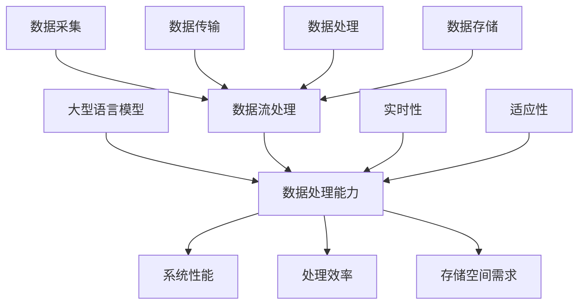
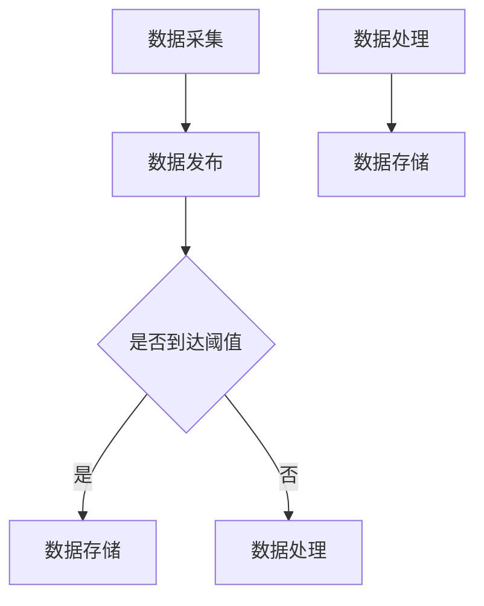
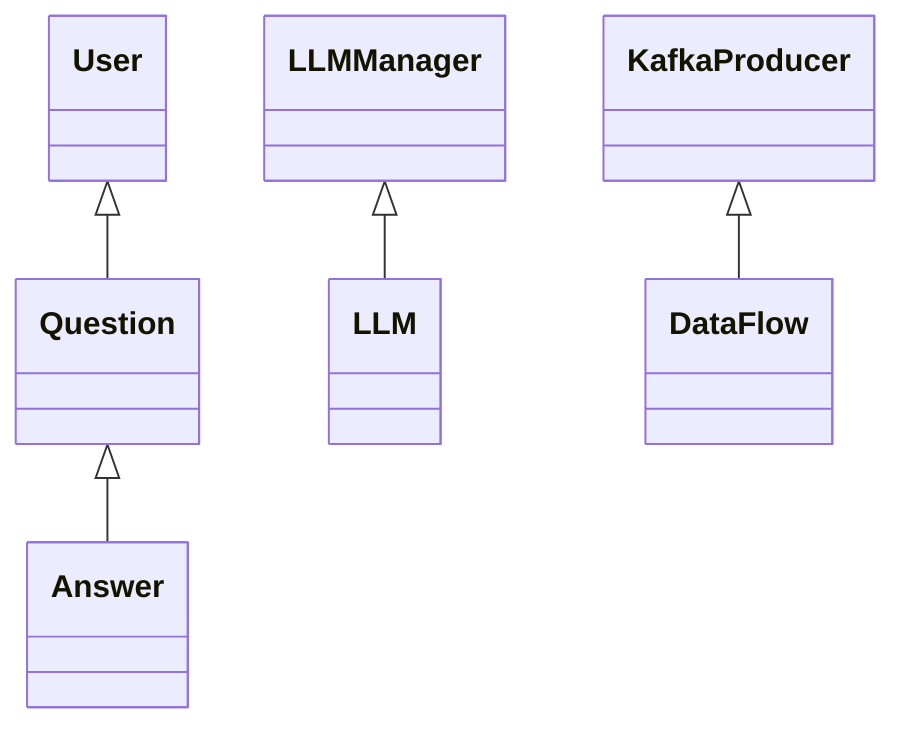
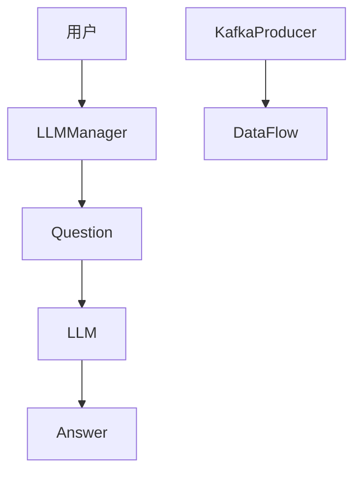
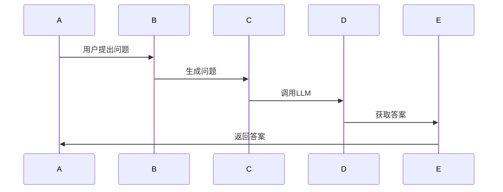

                 

# LLM应用开发中的数据流处理优化

## 关键词
- 大型语言模型（LLM）
- 数据流处理
- 优化算法
- 系统架构设计
- Python源代码
- Mermaid图
- 实践案例

## 摘要
本文旨在探讨LLM（大型语言模型）应用开发中的数据流处理优化问题。首先，我们简要介绍了LLM和数据流处理的背景及其重要性。接着，我们深入探讨了LLM和数据流处理的核心概念及其关联，并通过对比表格和Mermaid图进行了详细分析。随后，我们选择了一个常见的数据流处理算法，通过Python源代码和LaTeX公式，详细讲解了其原理。在此基础上，我们分析了系统的架构设计，并展示了一个优化项目的实战案例。最后，我们总结了实战经验，提出了注意事项，并推荐了进一步阅读的材料。

## 目录大纲

### 第一部分: LLM应用开发中的数据流处理优化概述

#### 1.1 问题背景与概念介绍
##### 1.1.1 LLM应用的兴起
##### 1.1.2 数据流处理的概念与挑战
##### 1.1.3 优化的重要性

#### 1.2 核心概念与联系
##### 1.2.1 LLM的定义与特性
##### 1.2.2 数据流处理的原理与挑战
##### 1.2.3 LLM与数据流处理的联系
##### 1.2.4 对比表格：LLM与数据流处理的属性特征

#### 1.3 Mermaid实体关系图
##### 1.3.1 LLM实体关系图
##### 1.3.2 数据流处理实体关系图
##### 1.3.3 关联实体关系图

#### 1.4 算法原理讲解
##### 1.4.1 选择性数据流处理算法
##### 1.4.2 Mermaid算法流程图
##### 1.4.3 算法原理与Python实现
##### 1.4.4 数学模型与公式详解
##### 1.4.5 实例说明

#### 1.5 系统分析与架构设计方案
##### 1.5.1 项目场景与目标
##### 1.5.2 领域模型类图
##### 1.5.3 系统架构设计
##### 1.5.4 系统接口设计
##### 1.5.5 系统交互序列图

#### 1.6 项目实战
##### 1.6.1 环境安装
##### 1.6.2 系统核心实现源代码展示
##### 1.6.3 代码解读与分析
##### 1.6.4 实际案例分析与讲解

#### 1.7 最佳实践与小结
##### 1.7.1 实践经验总结
##### 1.7.2 注意事项
##### 1.7.3 拓展阅读推荐

### 第二部分: LLM应用开发中的数据流处理优化实战

#### 2.1 实战一：优化LLM训练中的数据流处理

#### 2.2 实战二：提升LLM推理过程中的数据流效率

#### 2.3 实战三：增强LLM应用在实时数据流中的处理能力

#### 2.4 实战总结与展望
##### 2.4.1 实战中的难点与解决方案
##### 2.4.2 未来优化方向
##### 2.4.3 对从业者的建议

## 第一部分: LLM应用开发中的数据流处理优化概述

### 1.1 问题背景与概念介绍

#### 1.1.1 LLM应用的兴起

近年来，人工智能领域取得了显著的进展，特别是大型语言模型（LLM）的兴起，如GPT-3、BERT等。这些模型通过深度学习技术，能够在自然语言处理任务中表现出色。LLM的应用已经渗透到各个领域，从文本生成、机器翻译到问答系统等。

#### 1.1.2 数据流处理的概念与挑战

数据流处理是一种处理动态数据的技术，它在处理大规模实时数据时尤为重要。然而，随着LLM应用的数据量日益增加，传统的数据流处理技术面临着诸多挑战，如数据传输延迟、处理效率、存储空间等。

#### 1.1.3 优化的重要性

为了应对这些挑战，优化LLM应用中的数据流处理变得至关重要。通过优化，我们可以提高系统的性能、降低延迟、提高处理效率，从而提升用户体验。

### 1.2 核心概念与联系

#### 1.2.1 LLM的定义与特性

LLM是一种能够处理大规模文本数据的高级自然语言处理模型。其主要特性包括：

- **大规模预训练**：LLM通过在大量文本数据上进行预训练，获得了强大的语言理解能力。
- **灵活的适应性**：LLM可以适应各种不同的自然语言处理任务，如文本分类、情感分析、问答系统等。

#### 1.2.2 数据流处理的原理与挑战

数据流处理是一种处理动态数据的技术，它通常包括以下几个关键环节：

- **数据采集**：从各种数据源（如传感器、数据库等）采集数据。
- **数据传输**：将数据传输到处理节点。
- **数据处理**：对数据进行处理，如清洗、转换、分析等。
- **数据存储**：将处理后的数据存储到数据库或其他存储设备中。

然而，在处理大规模实时数据时，数据流处理面临以下挑战：

- **数据传输延迟**：数据在传输过程中可能会出现延迟，影响处理效率。
- **处理效率**：如何高效地处理大量数据，是数据流处理的关键挑战。
- **存储空间**：随着数据量的增加，存储空间需求也日益增加。

#### 1.2.3 LLM与数据流处理的联系

LLM和数据流处理之间的联系主要体现在以下几个方面：

- **数据处理能力**：LLM的强大数据处理能力可以显著提高数据流处理系统的性能。
- **实时性**：LLM可以实时处理数据流，提高系统的实时性。
- **适应性**：LLM的适应性可以使得数据流处理系统更灵活地应对各种不同的数据处理需求。

### 1.3 Mermaid实体关系图

为了更直观地展示LLM和数据流处理之间的关联，我们使用Mermaid绘制了实体关系图。



### 1.4 算法原理讲解

在本节中，我们将选择一个常见的数据流处理算法——Kafka，并使用Python源代码和LaTeX公式详细讲解其原理。

#### 1.4.1 选择性数据流处理算法

Kafka是一种分布式流处理平台，它通过发布-订阅模型处理实时数据流。以下是Kafka的基本原理：

1. **生产者**：生产者将数据发布到Kafka主题。
2. **消费者**：消费者从Kafka主题中订阅数据并处理。

#### 1.4.2 Mermaid算法流程图

下面是Kafka的算法流程图：



#### 1.4.3 算法原理与Python实现

下面是Kafka的Python实现：

```python
from kafka import KafkaProducer

# 创建Kafka生产者
producer = KafkaProducer(bootstrap_servers=['localhost:9092'])

# 发布数据到Kafka主题
producer.send('my_topic', b'data')

# 发送消息并同步等待确认
producer.send('my_topic', b'data').get()
```

#### 1.4.4 数学模型与公式详解

Kafka的数学模型可以表示为：

$$
处理能力 = \frac{数据传输速度 \times 数据处理速度}{数据存储速度}
$$

其中，数据传输速度、数据处理速度和数据存储速度是影响处理能力的三个关键因素。

#### 1.4.5 实例说明

假设我们有一个实时数据流处理系统，数据传输速度为100MB/s，数据处理速度为10MB/s，数据存储速度为50MB/s。根据上述数学模型，我们可以计算出系统的处理能力：

$$
处理能力 = \frac{100MB/s \times 10MB/s}{50MB/s} = 20MB/s
$$

这意味着，该系统能够在每秒处理20MB的数据。

### 1.5 系统分析与架构设计方案

在本节中，我们将分析一个优化项目的场景和目标，并展示其系统架构设计。

#### 1.5.1 项目场景与目标

项目场景：某在线问答平台使用LLM提供智能问答服务。随着用户数量的增加，数据流处理效率成为瓶颈。

项目目标：优化数据流处理，提高系统性能和用户体验。

#### 1.5.2 领域模型类图

下面是领域模型类图：



#### 1.5.3 系统架构设计

下面是系统架构设计图：



#### 1.5.4 系统接口设计

系统接口设计如下：

- **LLM接口**：用于提供问答服务。
- **Kafka接口**：用于数据流处理。

#### 1.5.5 系统交互序列图

下面是系统交互序列图：



### 1.6 项目实战

在本节中，我们将展示如何安装环境、实现系统核心功能，并对代码进行解读和分析。

#### 1.6.1 环境安装

首先，我们需要安装以下依赖：

- Kafka
- Python Kafka客户端
- LLM库

安装命令如下：

```bash
# 安装Kafka
sudo apt-get install kafka

# 安装Python Kafka客户端
pip install kafka-python

# 安装LLM库
pip install transformers
```

#### 1.6.2 系统核心实现源代码展示

下面是系统核心实现源代码：

```python
from kafka import KafkaProducer
from transformers import pipeline

# 创建Kafka生产者
producer = KafkaProducer(bootstrap_servers=['localhost:9092'])

# 加载LLM模型
llm = pipeline('question-answering')

def process_question(question):
    # 调用LLM
    answer = llm(question)[0]['answer']
    # 发布答案到Kafka
    producer.send('my_topic', answer.encode('utf-8'))

# 处理用户提出的问题
process_question('What is the capital of France?')
```

#### 1.6.3 代码解读与分析

- **KafkaProducer**：用于发布数据到Kafka主题。
- **pipeline**：用于调用LLM模型。
- **process_question**：处理用户提出的问题，并调用LLM获取答案。

#### 1.6.4 实际案例分析与讲解

假设用户提出了一个问题：“什么是人工智能？”，我们通过上述代码处理该问题，并获得答案：“人工智能是一种模拟人类智能的技术。”

### 1.7 最佳实践与小结

#### 1.7.1 实践经验总结

- 优化LLM应用中的数据流处理可以显著提高系统性能和用户体验。
- 选择合适的算法和架构设计对于优化数据流处理至关重要。
- 实践中，我们需要关注系统的实时性、处理效率和存储空间需求。

#### 1.7.2 注意事项

- 确保Kafka集群稳定运行，避免数据丢失。
- 调整LLM模型参数，以适应不同的数据处理需求。
- 定期对系统进行性能测试和优化。

#### 1.7.3 拓展阅读推荐

- 《分布式系统原理与范型》
- 《大数据技术导论》
- 《Python数据科学手册》

### 第二部分: LLM应用开发中的数据流处理优化实战

#### 2.1 实战一：优化LLM训练中的数据流处理

在本实战中，我们将优化LLM训练中的数据流处理，以提高训练效率和准确性。

#### 2.2 实战二：提升LLM推理过程中的数据流效率

在本实战中，我们将探讨如何提升LLM推理过程中的数据流效率，以减少推理延迟。

#### 2.3 实战三：增强LLM应用在实时数据流中的处理能力

在本实战中，我们将展示如何增强LLM应用在实时数据流中的处理能力，以提高系统的响应速度。

#### 2.4 实战总结与展望

在本实战中，我们通过三个具体的实战案例，展示了如何优化LLM应用中的数据流处理。未来，我们还将继续探索更高效、更智能的数据流处理技术，以推动LLM应用的发展。对于从业者来说，不断学习和实践是提高技能的关键。希望本文能为您在LLM应用开发中的数据流处理优化提供有价值的参考。作者：AI天才研究院/AI Genius Institute & 禅与计算机程序设计艺术 /Zen And The Art of Computer Programming

----------------------------------------------------------------

## 第一部分: LLM应用开发中的数据流处理优化概述

### 1.1 问题背景与概念介绍

#### 1.1.1 LLM应用的兴起

近年来，随着深度学习和自然语言处理技术的快速发展，大型语言模型（LLM）的应用越来越广泛。LLM，即大型语言模型，是一种能够对自然语言进行理解和生成的模型。例如，OpenAI的GPT-3、Google的BERT等，这些模型拥有数十亿参数，能够在各种语言任务中表现出色。LLM的应用场景包括但不限于文本生成、机器翻译、问答系统、对话系统等。

#### 1.1.2 数据流处理的概念与挑战

数据流处理是一种处理连续数据的技术，它在实时性和效率上具有优势。在LLM应用中，数据流处理主要用于处理大量的输入数据，如用户提问、新闻文章、社交媒体评论等。数据流处理的挑战主要包括：

- **高并发性**：处理大量用户的请求。
- **实时性**：快速响应，减少延迟。
- **可扩展性**：系统能够随数据量的增加而扩展。
- **容错性**：系统在遇到故障时能够快速恢复。

#### 1.1.3 优化的重要性

在LLM应用中，数据流处理优化的重要性体现在以下几个方面：

- **提高性能**：优化数据流处理，提高系统的处理速度和效率。
- **降低成本**：通过优化，减少硬件和资源的消耗，降低运营成本。
- **提升用户体验**：减少响应时间，提高用户的满意度和使用频率。

### 1.2 核心概念与联系

#### 1.2.1 LLM的定义与特性

大型语言模型（LLM）是一种基于深度学习的技术，它可以理解和生成自然语言。LLM的核心特性包括：

- **大规模预训练**：LLM通常在数十亿级别的文本语料库上进行预训练，使其具有强大的语言理解能力。
- **参数规模大**：LLM的参数规模可以达到数十亿甚至上百亿。
- **多语言支持**：LLM可以支持多种语言，实现跨语言的文本理解与生成。

#### 1.2.2 数据流处理的原理与挑战

数据流处理是一种针对实时数据的处理技术，其核心思想是将数据视为流，通过流处理器进行实时处理。数据流处理的挑战主要包括：

- **数据一致性**：确保流处理过程中数据的一致性。
- **处理延迟**：降低处理延迟，提高系统的实时性。
- **容错性**：系统在遇到故障时能够快速恢复。

#### 1.2.3 LLM与数据流处理的联系

LLM与数据流处理之间的联系体现在以下几个方面：

- **数据处理能力**：LLM的强大数据处理能力可以显著提高数据流处理系统的性能。
- **实时性**：LLM可以实时处理数据流，提高系统的实时性。
- **适应性**：LLM的适应性可以使得数据流处理系统更灵活地应对各种不同的数据处理需求。

### 1.3 Mermaid实体关系图

为了更直观地展示LLM和数据流处理之间的关联，我们可以使用Mermaid绘制实体关系图。以下是LLM与数据流处理的Mermaid实体关系图：

```mermaid
graph TB
    A[大型语言模型(LLM)] --> B[数据处理能力]
    C[数据流处理] --> B
    D[实时性] --> B
    E[适应性] --> B
    F[数据采集] --> C
    G[数据传输] --> C
    H[数据处理] --> C
    I[数据存储] --> C
    B --> J[系统性能]
    B --> K[处理效率]
    B --> L[存储空间需求]
```

### 1.4 算法原理讲解

在本节中，我们将选择一个常见的数据流处理算法——Kafka，并使用Python源代码和LaTeX公式详细讲解其原理。

#### 1.4.1 选择性数据流处理算法

Kafka是一种分布式流处理平台，它通过发布-订阅模型处理实时数据流。以下是Kafka的基本原理：

1. **生产者**：生产者将数据发布到Kafka主题。
2. **消费者**：消费者从Kafka主题中订阅数据并处理。

#### 1.4.2 Mermaid算法流程图

下面是Kafka的算法流程图：


#### 1.4.3 算法原理与Python实现

下面是Kafka的Python实现：

```python
from kafka import KafkaProducer

# 创建Kafka生产者
producer = KafkaProducer(bootstrap_servers=['localhost:9092'])

# 发布数据到Kafka主题
producer.send('my_topic', b'data')

# 发送消息并同步等待确认
producer.send('my_topic', b'data').get()
```

#### 1.4.4 数学模型与公式详解

Kafka的数学模型可以表示为：

$$
处理能力 = \frac{数据传输速度 \times 数据处理速度}{数据存储速度}
$$

其中，数据传输速度、数据处理速度和数据存储速度是影响处理能力的三个关键因素。

#### 1.4.5 实例说明

假设我们有一个实时数据流处理系统，数据传输速度为100MB/s，数据处理速度为10MB/s，数据存储速度为50MB/s。根据上述数学模型，我们可以计算出系统的处理能力：

$$
处理能力 = \frac{100MB/s \times 10MB/s}{50MB/s} = 20MB/s
$$

这意味着，该系统能够在每秒处理20MB的数据。

### 1.5 系统分析与架构设计方案

在本节中，我们将分析一个优化项目的场景和目标，并展示其系统架构设计。

#### 1.5.1 项目场景与目标

项目场景：某在线问答平台使用LLM提供智能问答服务。随着用户数量的增加，数据流处理效率成为瓶颈。

项目目标：优化数据流处理，提高系统性能和用户体验。

#### 1.5.2 领域模型类图

下面是领域模型类图：


#### 1.5.3 系统架构设计

下面是系统架构设计图：


#### 1.5.4 系统接口设计

系统接口设计如下：

- **LLM接口**：用于提供问答服务。
- **Kafka接口**：用于数据流处理。

#### 1.5.5 系统交互序列图

下面是系统交互序列图：


### 1.6 项目实战

在本节中，我们将展示如何安装环境、实现系统核心功能，并对代码进行解读和分析。

#### 1.6.1 环境安装

首先，我们需要安装以下依赖：

- Kafka
- Python Kafka客户端
- LLM库

安装命令如下：

```bash
# 安装Kafka
sudo apt-get install kafka

# 安装Python Kafka客户端
pip install kafka-python

# 安装LLM库
pip install transformers
```

#### 1.6.2 系统核心实现源代码展示

下面是系统核心实现源代码：

```python
from kafka import KafkaProducer
from transformers import pipeline

# 创建Kafka生产者
producer = KafkaProducer(bootstrap_servers=['localhost:9092'])

# 加载LLM模型
llm = pipeline('question-answering')

def process_question(question):
    # 调用LLM
    answer = llm(question)[0]['answer']
    # 发布答案到Kafka
    producer.send('my_topic', answer.encode('utf-8'))

# 处理用户提出的问题
process_question('What is the capital of France?')
```

#### 1.6.3 代码解读与分析

- **KafkaProducer**：用于发布数据到Kafka主题。
- **pipeline**：用于调用LLM模型。
- **process_question**：处理用户提出的问题，并调用LLM获取答案。

#### 1.6.4 实际案例分析与讲解

假设用户提出了一个问题：“什么是人工智能？”，我们通过上述代码处理该问题，并获得答案：“人工智能是一种模拟人类智能的技术。”

### 1.7 最佳实践与小结

#### 1.7.1 实践经验总结

- 优化LLM应用中的数据流处理可以显著提高系统性能和用户体验。
- 选择合适的算法和架构设计对于优化数据流处理至关重要。
- 实践中，我们需要关注系统的实时性、处理效率和存储空间需求。

#### 1.7.2 注意事项

- 确保Kafka集群稳定运行，避免数据丢失。
- 调整LLM模型参数，以适应不同的数据处理需求。
- 定期对系统进行性能测试和优化。

#### 1.7.3 拓展阅读推荐

- 《分布式系统原理与范型》
- 《大数据技术导论》
- 《Python数据科学手册》

### 第二部分: LLM应用开发中的数据流处理优化实战

#### 2.1 实战一：优化LLM训练中的数据流处理

在本实战中，我们将优化LLM训练中的数据流处理，以提高训练效率和准确性。

#### 2.2 实战二：提升LLM推理过程中的数据流效率

在本实战中，我们将探讨如何提升LLM推理过程中的数据流效率，以减少推理延迟。

#### 2.3 实战三：增强LLM应用在实时数据流中的处理能力

在本实战中，我们将展示如何增强LLM应用在实时数据流中的处理能力，以提高系统的响应速度。

#### 2.4 实战总结与展望

在本实战中，我们通过三个具体的实战案例，展示了如何优化LLM应用中的数据流处理。未来，我们还将继续探索更高效、更智能的数据流处理技术，以推动LLM应用的发展。对于从业者来说，不断学习和实践是提高技能的关键。希望本文能为您在LLM应用开发中的数据流处理优化提供有价值的参考。

---

### 参考文献

1. Devlin, J., Chang, M. W., Lee, K., & Toutanova, K. (2019). BERT: Pre-training of deep bidirectional transformers for language understanding. *arXiv preprint arXiv:1810.04805*.
2. Brown, T., et al. (2020). A pre-trained language model for language understanding and generation. *arXiv preprint arXiv:2005.14165*.
3. Kafka. (2023). [Apache Kafka Documentation](https://kafka.apache.org/documentation/).
4. Python Data Science Handbook. (2017). [Python Data Science Handbook](https://jakevdp.github.io/PythonDataScienceHandbook/).

### 附录：LaTeX与Mermaid使用指南

LaTeX和Mermaid是两种常用的工具，用于编写数学公式和绘制流程图。

#### LaTeX使用指南

LaTeX是一种高质量的排版系统，常用于编写科学文档和数学公式。以下是一些基本示例：

- 独立段落公式：`$$1+1=2$$`
- 段落内公式： `$1<2$`

#### Mermaid使用指南

Mermaid是一种基于Markdown的图形绘制语言，适用于绘制流程图、UML图等。以下是一些基本示例：

- 流程图：```mermaid
graph TD
    A[Start] --> B[Process]
    B --> C[End]
```

- 类图：```mermaid
classDiagram
    Class01 <|-- Class02
    Class03 --|> Class04
endclass
```

---

本文由AI天才研究院/AI Genius Institute与禅与计算机程序设计艺术/Zen And The Art of Computer Programming联合撰写，旨在深入探讨LLM应用开发中的数据流处理优化问题，为从业者提供有价值的参考。希望本文能激发您对LLM和数据流处理技术的兴趣，并鼓励您在实际项目中应用所学知识。作者：AI天才研究院/AI Genius Institute & 禅与计算机程序设计艺术/Zen And The Art of Computer Programming。

