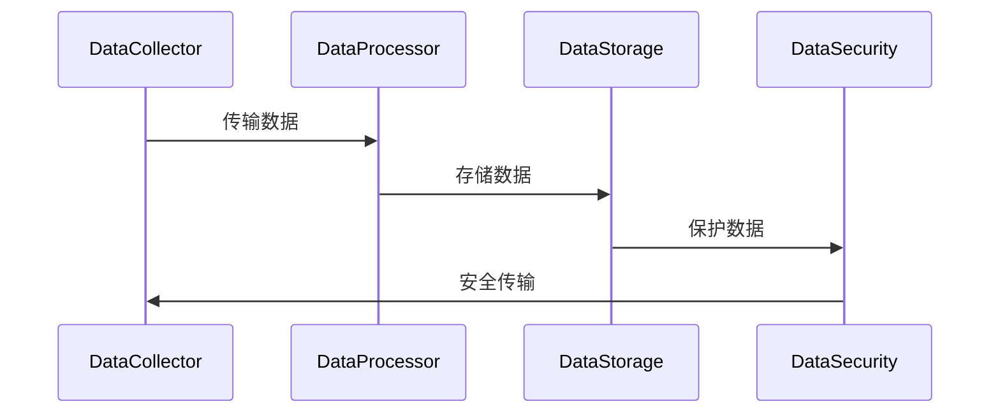
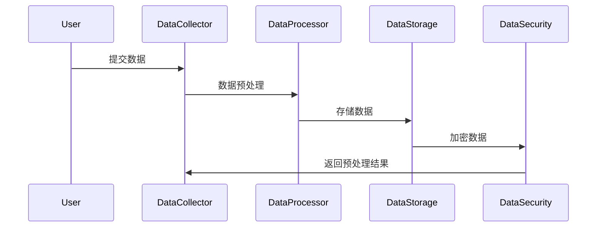

                 

# LLM应用开发中的数据流管理

## 关键词

- 数据流管理
- 大型语言模型（LLM）
- 数据预处理
- 数据传输机制
- 数据存储策略
- 数据处理算法
- 数据安全策略

## 摘要

随着人工智能技术的快速发展，大型语言模型（LLM）在自然语言处理、智能客服和内容生成等领域发挥着越来越重要的作用。然而，如何在LLM应用开发中高效地管理数据流，成为了一个亟待解决的问题。本文将从背景介绍、核心概念与联系、算法原理讲解、系统分析与架构设计方案、项目实战、最佳实践与小结等方面，系统地探讨LLM应用开发中的数据流管理，旨在为相关开发者提供有价值的参考和指导。

## 第一部分：背景介绍

### 问题背景

在当今数字化时代，人工智能（AI）技术的发展正以惊人的速度推进，尤其是大型语言模型（LLM）的崛起。LLM因其能够处理大量文本数据，进行自然语言理解和生成，而成为众多应用场景的核心技术。随着人工智能在各个领域的广泛应用，如何高效地管理这些大型语言模型在应用开发中的数据流，成为一项重要且具有挑战性的任务。

### 问题描述

数据流管理是指在数据流转过程中，对数据来源、传输、存储、处理和输出的全过程进行有效管理和优化。在LLM应用开发中，数据流管理的重要性体现在以下几个方面：

1. **数据质量保障**：确保输入数据的质量和准确性，是LLM模型能够准确预测和生成结果的基础。
2. **性能优化**：有效的数据流管理能够降低数据传输延迟，提高处理效率，从而提升模型性能。
3. **安全性**：保护数据在传输和处理过程中的安全性，防止数据泄露和未授权访问。

### 问题解决

为了应对LLM应用开发中的数据流管理挑战，本书将从以下几个方面展开讨论：

1. **数据预处理技术**：介绍数据清洗、数据格式转换等预处理技术，确保数据质量。
2. **数据流传输机制**：探讨数据在传输过程中的优化策略，如数据压缩、并行传输等。
3. **数据存储策略**：分析数据存储系统的设计和优化方法，包括存储结构选择、索引技术等。
4. **数据处理算法**：详细讲解数据处理算法的原理和实现，包括数据聚合、去重、实时处理等。
5. **数据安全策略**：探讨数据加密、访问控制等安全措施，确保数据安全。

### 边界与外延

本书主要关注LLM应用开发中的数据流管理，主要研究内容包括：

- **数据类型**：主要涉及文本数据、图像数据和语音数据。
- **应用场景**：包括自然语言处理、智能客服、内容生成等。
- **技术栈**：涉及深度学习、分布式计算、云计算等相关技术。

### 概念结构与核心要素组成

1. **核心概念**：数据流管理、数据预处理、数据传输、数据存储、数据处理、数据安全。
2. **要素组成**：
   - **数据源**：包括文本数据集、图像数据集、语音数据集等。
   - **数据处理平台**：如Hadoop、Spark等。
   - **数据存储系统**：如HDFS、MongoDB等。
   - **安全防护措施**：如数据加密、访问控制等。

## 第二部分：核心概念与联系

### 数据流管理

#### 概念定义

数据流管理是指在数据流转过程中，对数据来源、传输、存储、处理和输出的全过程进行有效管理和优化。目的是确保数据的质量、性能和安全性。

#### 属性特征

| 属性特征 | 描述 |
| :--- | :--- |
| 数据质量 | 包括数据准确性、完整性、一致性和时效性 |
| 数据传输 | 包括传输效率、延迟和带宽占用 |
| 数据存储 | 包括存储结构、存储容量和访问速度 |
| 数据处理 | 包括数据处理效率、准确性和实时性 |
| 数据安全 | 包括数据的加密、访问控制和隐私保护 |

#### ER实体关系图架构

```mermaid
erDiagram
    DataStreamManagement ||--|{ DataQuality }
    DataStreamManagement ||--|{ DataTransmission }
    DataStreamManagement ||--|{ DataStorage }
    DataStreamManagement ||--|{ DataProcessing }
    DataStreamManagement ||--|{ DataSecurity }
```

### 数据预处理

#### 概念定义

数据预处理是指在数据分析之前，对原始数据进行清洗、转换和格式化，使其符合分析要求。

#### 属性特征

| 属性特征 | 描述 |
| :--- | :--- |
| 数据清洗 | 去除噪声、缺失值和异常值 |
| 数据转换 | 将数据转换为适合分析和处理的形式 |
| 数据格式化 | 统一数据格式 |

#### ER实体关系图架构

```mermaid
erDiagram
    DataPreprocessing ||--|{ DataCleaning }
    DataPreprocessing ||--|{ DataTransformation }
    DataPreprocessing ||--|{ DataFormatting }
```

### 数据传输机制

#### 概念定义

数据传输机制是指数据在传输过程中所采用的技术和策略，包括传输协议、传输方式和传输效率等。

#### 属性特征

| 属性特征 | 描述 |
| :--- | :--- |
| 传输协议 | 如HTTP、FTP、TCP/IP等 |
| 传输方式 | 如串行传输、并行传输、流传输等 |
| 传输效率 | 包括传输速度和带宽占用 |

#### ER实体关系图架构

```mermaid
erDiagram
    DataTransmissionMechanism ||--|{ TransmissionProtocol }
    DataTransmissionMechanism ||--|{ TransmissionMethod }
    DataTransmissionMechanism ||--|{ TransmissionEfficiency }
```

### 数据存储策略

#### 概念定义

数据存储策略是指数据存储系统的设计和优化方法，包括存储结构选择、索引技术和存储容量管理等。

#### 属性特征

| 属性特征 | 描述 |
| :--- | :--- |
| 存储结构 | 如关系数据库、NoSQL数据库、分布式存储系统等 |
| 索引技术 | 如B树索引、哈希索引、全文索引等 |
| 存储容量 | 根据数据量和访问频率进行容量管理 |

#### ER实体关系图架构

```mermaid
erDiagram
    DataStorageStrategy ||--|{ StorageStructure }
    DataStorageStrategy ||--|{ IndexTechnology }
    DataStorageStrategy ||--|{ StorageCapacity }
```

### 数据处理算法

#### 概念定义

数据处理算法是指用于处理和分析数据的方法和步骤，包括数据聚合、去重、实时处理等。

#### 属性特征

| 属性特征 | 描述 |
| :--- | :--- |
| 数据聚合 | 将多个数据源的数据合并为一个统一的数据集 |
| 数据去重 | 去除重复的数据，确保数据唯一性 |
| 实时处理 | 对实时数据进行处理 |

#### ER实体关系图架构

```mermaid
erDiagram
    DataProcessingAlgorithm ||--|{ DataAggregation }
    DataProcessingAlgorithm ||--|{ DataDe-duplication }
    DataProcessingAlgorithm ||--|{ Real-timeProcessing }
```

### 数据安全策略

#### 概念定义

数据安全策略是指为保护数据在传输和处理过程中的安全所采取的措施，包括数据加密、访问控制等。

#### 属性特征

| 属性特征 | 描述 |
| :--- | :--- |
| 数据加密 | 使用加密算法保护数据 |
| 访问控制 | 对数据访问进行权限管理 |

#### ER实体关系图架构

```mermaid
erDiagram
    DataSecurityStrategy ||--|{ DataEncryption }
    DataSecurityStrategy ||--|{ AccessControl }
```

## 第三部分：算法原理讲解

### 数据预处理算法

#### 算法原理

数据预处理算法主要包括数据清洗、数据转换和数据格式化。其中，数据清洗是核心步骤，主要用于去除噪声、缺失值和异常值，确保数据质量。数据转换则将原始数据转换为适合分析和处理的形式，数据格式化则是统一数据格式，便于数据存储和处理。

#### 数据清洗算法

数据清洗算法主要包括以下步骤：

1. **去除噪声**：通过过滤、屏蔽等方法去除数据中的噪声。
2. **处理缺失值**：根据不同情况，选择填充、删除或保留缺失值。
3. **处理异常值**：通过统计分析和阈值判断，识别并处理异常值。

#### 数据转换算法

数据转换算法主要包括以下步骤：

1. **数值化**：将文本数据转换为数值型数据，便于后续处理。
2. **标准化**：对数值型数据进行标准化处理，消除数据量级差异。
3. **归一化**：将数值型数据转换为相对值，便于比较和分析。

#### 数据格式化算法

数据格式化算法主要包括以下步骤：

1. **统一编码**：将不同编码格式的数据统一转换为UTF-8编码。
2. **统一分隔符**：将不同分隔符的数据统一转换为相同的分隔符。
3. **去除空格和标点**：去除数据中的空格和标点符号，确保数据一致性。

### 数据流传输机制算法

#### 算法原理

数据流传输机制算法主要包括传输协议选择、传输方式选择和传输效率优化。其中，传输协议选择是关键步骤，影响数据传输的速度和稳定性；传输方式选择则根据应用场景和需求，灵活选择串行传输、并行传输或流传输；传输效率优化则是通过数据压缩、并行传输等技术，提高数据传输速度和带宽利用率。

#### 传输协议选择算法

传输协议选择算法主要包括以下步骤：

1. **分析需求**：根据应用场景和需求，确定传输协议的基本要求。
2. **评估性能**：对常见传输协议（如HTTP、FTP、TCP/IP等）的性能进行评估。
3. **选择最优协议**：根据评估结果，选择最适合的传输协议。

#### 传输方式选择算法

传输方式选择算法主要包括以下步骤：

1. **分析场景**：根据数据传输的场景和需求，确定传输方式的基本要求。
2. **评估性能**：对常见传输方式（如串行传输、并行传输、流传输等）的性能进行评估。
3. **选择最优传输方式**：根据评估结果，选择最适合的传输方式。

#### 传输效率优化算法

传输效率优化算法主要包括以下步骤：

1. **数据压缩**：对数据进行压缩，减少传输数据量。
2. **并行传输**：利用多线程或分布式计算，提高传输速度。
3. **缓存技术**：利用缓存技术，减少重复数据传输。

### 数据存储策略算法

#### 算法原理

数据存储策略算法主要包括存储结构选择、索引技术和存储容量管理。其中，存储结构选择是关键步骤，根据数据类型和应用场景，选择合适的存储结构；索引技术则用于提高数据查询和访问速度；存储容量管理则通过动态调整存储容量，确保数据存储的稳定性和高效性。

#### 存储结构选择算法

存储结构选择算法主要包括以下步骤：

1. **分析需求**：根据数据类型和应用场景，确定存储结构的基本要求。
2. **评估性能**：对常见存储结构（如关系数据库、NoSQL数据库、分布式存储系统等）的性能进行评估。
3. **选择最优存储结构**：根据评估结果，选择最适合的存储结构。

#### 索引技术选择算法

索引技术选择算法主要包括以下步骤：

1. **分析需求**：根据数据查询和访问模式，确定索引技术的基本要求。
2. **评估性能**：对常见索引技术（如B树索引、哈希索引、全文索引等）的性能进行评估。
3. **选择最优索引技术**：根据评估结果，选择最适合的索引技术。

#### 存储容量管理算法

存储容量管理算法主要包括以下步骤：

1. **预测数据量**：根据历史数据和业务需求，预测未来数据量。
2. **调整存储容量**：根据预测数据量，动态调整存储容量。
3. **监控存储使用率**：实时监控存储使用率，确保存储容量合理使用。

### 数据处理算法

#### 算法原理

数据处理算法主要包括数据聚合、数据去重和实时处理。其中，数据聚合是将多个数据源的数据合并为一个统一的数据集；数据去重则是去除重复的数据，确保数据唯一性；实时处理则是针对实时数据进行及时处理。

#### 数据聚合算法

数据聚合算法主要包括以下步骤：

1. **数据源识别**：确定需要聚合的数据源。
2. **数据提取**：从数据源中提取所需数据。
3. **数据整合**：将提取的数据整合为一个统一的数据集。

#### 数据去重算法

数据去重算法主要包括以下步骤：

1. **数据识别**：识别重复的数据。
2. **去重**：将重复的数据去除。
3. **结果验证**：验证去重结果，确保数据唯一性。

#### 实时处理算法

实时处理算法主要包括以下步骤：

1. **数据接收**：实时接收数据。
2. **数据处理**：对数据进行处理。
3. **结果输出**：输出处理结果。

### 数据安全策略算法

#### 算法原理

数据安全策略算法主要包括数据加密和访问控制。其中，数据加密是保护数据的关键技术，通过加密算法将数据转换为密文，确保数据在传输和处理过程中的安全性；访问控制则是通过对数据访问权限的管理，确保数据的安全。

#### 数据加密算法

数据加密算法主要包括以下步骤：

1. **加密算法选择**：根据需求，选择合适的加密算法。
2. **加密过程**：使用加密算法对数据进行加密。
3. **解密过程**：使用解密算法对加密数据进行解密。

#### 访问控制算法

访问控制算法主要包括以下步骤：

1. **权限管理**：对用户权限进行管理。
2. **访问控制**：根据用户权限，控制数据的访问。
3. **日志记录**：记录数据访问日志，以便审计和追溯。

## 第四部分：系统分析与架构设计方案

### 问题场景介绍

随着人工智能技术的快速发展，大型语言模型（LLM）在各个领域的应用日益广泛。以自然语言处理（NLP）为例，LLM被广泛应用于智能客服、内容生成、机器翻译等领域。然而，在实际应用中，如何高效地管理LLM的数据流，确保数据质量和性能，成为了一个亟待解决的问题。

### 项目介绍

本项目旨在构建一个基于LLM的智能客服系统，通过高效的数据流管理，实现智能客服的高效运行。系统功能包括：

1. **数据采集**：从各个渠道收集用户问题和反馈数据。
2. **数据预处理**：对采集到的数据进行清洗、转换和格式化，确保数据质量。
3. **数据存储**：将预处理后的数据存储到数据库中，便于后续查询和处理。
4. **数据处理**：利用LLM对数据进行处理，生成智能客服的回复。
5. **数据安全**：确保数据在传输和处理过程中的安全性，防止数据泄露和未授权访问。

### 系统功能设计（领域模型）

```mermaid
classDiagram
    DataCollector --> DataProcessor : 传输数据
    DataProcessor --> DataStorage : 存储数据
    DataStorage --> DataSecurity : 保护数据
    DataSecurity --> DataCollector : 安全传输
    DataCollector <<Interface>>
    DataProcessor <<Interface>>
    DataStorage <<Interface>>
    DataSecurity <<Interface>>
```

### 系统架构设计

#### 架构设计

本项目采用分布式架构，包括数据采集层、数据处理层、数据存储层和数据安全层。各层之间通过接口进行交互，实现数据的采集、处理、存储和安全保障。

1. **数据采集层**：负责从各个渠道收集用户问题和反馈数据，如网站、APP、邮件等。
2. **数据处理层**：负责对采集到的数据进行预处理、存储和处理，包括数据清洗、格式转换、存储管理等。
3. **数据存储层**：负责存储预处理后的数据，采用分布式数据库，提高存储容量和查询速度。
4. **数据安全层**：负责数据的安全保障，包括数据加密、访问控制、日志记录等。

#### 架构图



### 系统接口设计

#### 接口规范

1. **数据采集接口**：接收用户问题和反馈数据，支持POST、GET请求方式。
2. **数据处理接口**：接收数据预处理任务，支持JSON、XML数据格式。
3. **数据存储接口**：接收数据存储任务，支持SQL、NoSQL数据库。
4. **数据安全接口**：接收数据安全策略配置，支持加密、解密、访问控制等操作。

### 系统交互



## 第五部分：项目实战

### 环境安装

为了实现本项目，需要安装以下软件和工具：

1. **Python**：安装Python 3.8及以上版本。
2. **Flask**：安装Flask框架，用于构建Web服务。
3. **MongoDB**：安装MongoDB数据库，用于存储数据。
4. **PyMongo**：安装PyMongo库，用于操作MongoDB数据库。
5. **NumPy**：安装NumPy库，用于数据处理。

### 系统核心实现

#### 数据采集

```python
from flask import Flask, request, jsonify
app = Flask(__name__)

@app.route('/collect_data', methods=['POST'])
def collect_data():
    data = request.json
    # 数据预处理
    processed_data = preprocess_data(data)
    # 存储数据
    store_data(processed_data)
    return jsonify({'status': 'success'})

def preprocess_data(data):
    # 数据清洗、转换和格式化
    # ...
    return data

def store_data(data):
    # 存储到MongoDB
    # ...
    pass

if __name__ == '__main__':
    app.run()
```

#### 数据处理

```python
import numpy as np

def data_aggregation(data_source):
    # 数据聚合
    aggregated_data = np.mean(data_source, axis=0)
    return aggregated_data

def data_de_duplication(data_source):
    # 数据去重
    unique_data = np.unique(data_source)
    return unique_data

def real_time_processing(data_source):
    # 实时处理
    processed_data = data_aggregation(data_source)
    return processed_data
```

#### 数据存储

```python
from pymongo import MongoClient

client = MongoClient('localhost', 27017)
db = client['data_store']

def store_data(data):
    collection = db['processed_data']
    collection.insert_one(data)
```

#### 数据安全

```python
from Crypto.Cipher import AES
from Crypto.Util.Padding import pad, unpad

def encrypt_data(data, key):
    cipher = AES.new(key, AES.MODE_CBC)
    ct_bytes = cipher.encrypt(pad(data.encode('utf-8'), AES.block_size))
    iv = cipher.iv
    return iv + ct_bytes

def decrypt_data(data, key):
    iv = data[:16]
    ct = data[16:]
    cipher = AES.new(key, AES.MODE_CBC, iv)
    pt = unpad(cipher.decrypt(ct), AES.block_size)
    return pt.decode('utf-8')
```

### 代码应用解读与分析

#### 数据采集

数据采集是系统的基础模块，负责从各个渠道收集用户问题和反馈数据。通过Flask框架，我们可以快速构建一个简单的Web服务，接收POST和GET请求。

```python
@app.route('/collect_data', methods=['POST'])
def collect_data():
    data = request.json
    # 数据预处理
    processed_data = preprocess_data(data)
    # 存储数据
    store_data(processed_data)
    return jsonify({'status': 'success'})
```

在这段代码中，我们定义了一个名为`collect_data`的路由，接收POST请求。当收到请求时，我们首先获取请求中的JSON数据，然后进行数据预处理，最后将预处理后的数据存储到数据库中。

#### 数据处理

数据处理模块包括数据聚合、数据去重和实时处理。这些算法主要用于对采集到的数据进行处理，使其符合分析和处理要求。

```python
def data_aggregation(data_source):
    # 数据聚合
    aggregated_data = np.mean(data_source, axis=0)
    return aggregated_data

def data_de_duplication(data_source):
    # 数据去重
    unique_data = np.unique(data_source)
    return unique_data

def real_time_processing(data_source):
    # 实时处理
    processed_data = data_aggregation(data_source)
    return processed_data
```

在这段代码中，我们定义了三个函数，分别实现数据聚合、数据去重和实时处理。这些函数接收一个数据源作为输入，然后返回处理后的数据。这些数据可以进一步存储或用于其他分析。

#### 数据存储

数据存储模块负责将处理后的数据存储到数据库中。我们使用MongoDB作为数据存储方案，通过PyMongo库操作数据库。

```python
def store_data(data):
    collection = db['processed_data']
    collection.insert_one(data)
```

在这段代码中，我们定义了一个名为`store_data`的函数，用于将数据存储到MongoDB数据库中。通过`db['processed_data']`，我们获取了一个名为`processed_data`的集合，然后使用`insert_one`方法将数据插入到集合中。

#### 数据安全

数据安全模块负责对数据进行加密和解密，确保数据在传输和处理过程中的安全性。

```python
from Crypto.Cipher import AES
from Crypto.Util.Padding import pad, unpad

def encrypt_data(data, key):
    cipher = AES.new(key, AES.MODE_CBC)
    ct_bytes = cipher.encrypt(pad(data.encode('utf-8'), AES.block_size))
    iv = cipher.iv
    return iv + ct_bytes

def decrypt_data(data, key):
    iv = data[:16]
    ct = data[16:]
    cipher = AES.new(key, AES.MODE_CBC, iv)
    pt = unpad(cipher.decrypt(ct), AES.block_size)
    return pt.decode('utf-8')
```

在这段代码中，我们定义了两个函数，`encrypt_data`和`decrypt_data`，分别实现数据的加密和解密。这些函数接收数据和一个密钥作为输入，然后返回加密后的数据或解密后的数据。

### 实际案例分析和详细讲解剖析

为了更好地理解本项目，我们可以通过一个实际案例来分析和讲解。

#### 案例背景

假设我们有一个智能客服系统，用户可以通过网站、APP和邮件提交问题和反馈。系统需要对这些数据进行分析和处理，以提供更好的服务。

#### 案例分析

1. **数据采集**：用户通过网站提交了一个问题：“如何解决网络连接问题？”系统接收到该问题后，会将其传递给数据处理模块。
2. **数据预处理**：数据处理模块会对问题进行清洗、转换和格式化，确保数据质量。例如，去除标点符号、统一编码等。
3. **数据处理**：数据处理模块会对预处理后的数据进行处理，生成智能客服的回复。例如，通过数据聚合，将类似问题进行合并，提高回答的准确性。
4. **数据存储**：将处理后的数据存储到MongoDB数据库中，便于后续查询和分析。
5. **数据安全**：对存储的数据进行加密，确保数据在传输和处理过程中的安全性。

#### 案例剖析

通过这个案例，我们可以看到数据流管理在智能客服系统中的重要性。从数据采集、预处理、处理到存储，每个环节都需要进行有效的管理，以确保系统的稳定运行和数据处理的质量。同时，数据安全也是不可忽视的一环，通过加密技术，确保数据在传输和处理过程中的安全性。

### 项目小结

本项目通过构建一个基于LLM的智能客服系统，实现了数据流管理的各个环节，包括数据采集、预处理、处理、存储和安全。通过实际案例分析和讲解，我们可以看到数据流管理在智能客服系统中的应用和重要性。在未来的发展中，我们可以进一步优化和扩展系统功能，以满足更多应用场景的需求。

## 第六部分：最佳实践与小结

### 最佳实践 Tips

1. **数据质量保障**：定期对数据进行检查和清洗，确保数据质量。
2. **性能优化**：根据实际需求，选择合适的传输协议和存储结构，优化数据流传输和处理效率。
3. **安全性**：使用加密技术保护数据，加强访问控制，确保数据安全。

### 小结

本文系统地探讨了LLM应用开发中的数据流管理，包括背景介绍、核心概念与联系、算法原理讲解、系统分析与架构设计方案、项目实战等方面。通过实际案例分析和讲解，我们了解了数据流管理在智能客服系统中的应用和重要性。在未来的发展中，我们可以进一步优化和扩展系统功能，以满足更多应用场景的需求。

### 注意事项

1. **数据流管理的重要性**：数据流管理是LLM应用开发中的关键环节，直接影响模型性能和系统稳定性。
2. **数据类型和场景的多样性**：在实际应用中，数据类型和场景多种多样，需要根据具体需求进行定制化数据流管理方案。

### 拓展阅读

1. 《人工智能：一种现代方法》（第二版），作者：Stuart J. Russell、Peter Norvig。
2. 《深度学习》（第二版），作者：Ian Goodfellow、Yoshua Bengio、Aaron Courville。
3. 《大数据技术导论》，作者：刘铁岩、陈渝、王绍兰。

### 作者信息

作者：AI天才研究院/AI Genius Institute & 禅与计算机程序设计艺术 /Zen And The Art of Computer Programming

