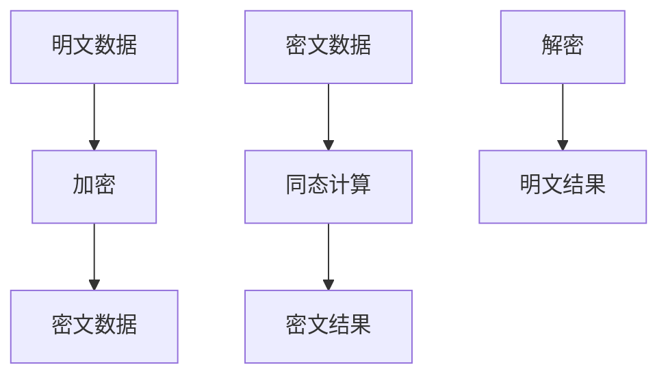
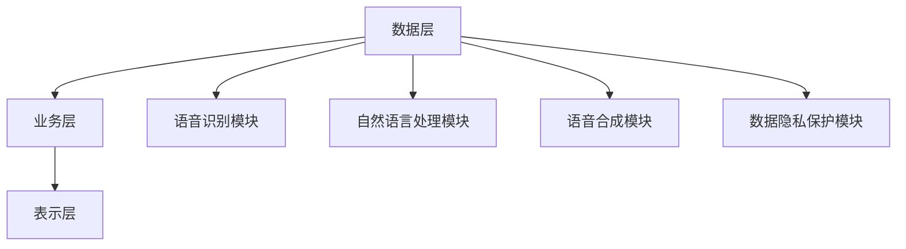
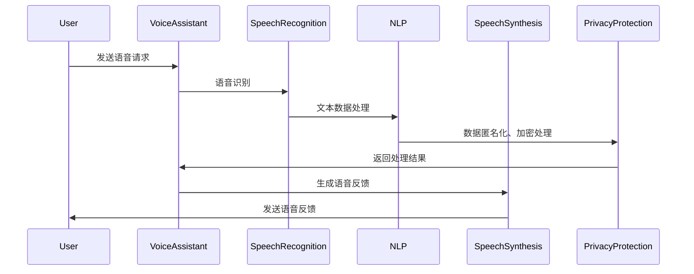
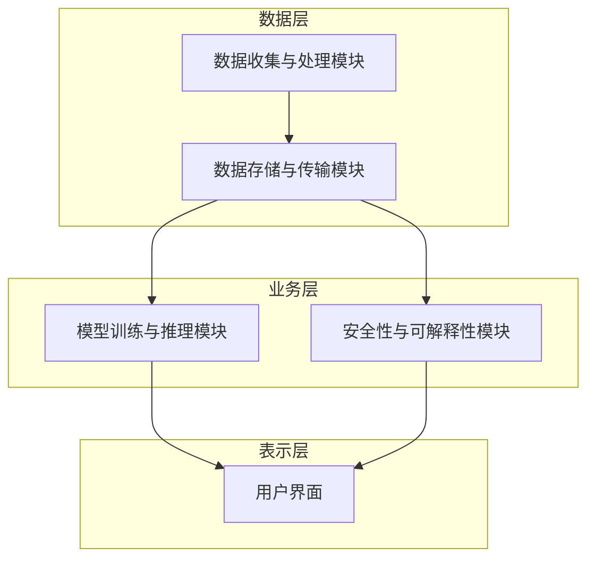
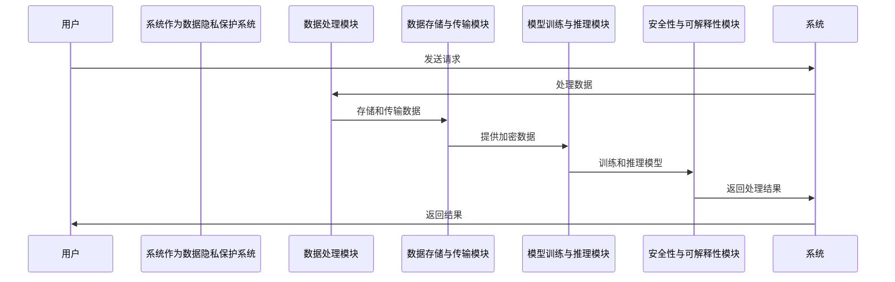

                 

# LLM应用开发中的数据隐私保护

## 关键词

- **LLM**：大规模语言模型
- **数据隐私保护**：保护用户敏感信息不泄露
- **匿名化与去识别化**：将敏感信息转换为不可识别的形式
- **数据加密**：将数据转换为密文
- **同态加密**：在加密数据上直接进行计算
- **安全性与可解释性**：提高模型的安全性和透明度

## 摘要

本文将探讨在LLM应用开发中如何实现数据隐私保护。首先，我们介绍了数据隐私保护的重要性以及LLM应用中面临的数据隐私保护问题。接着，我们提出了数据匿名化、数据加密、同态加密等解决方案，并详细阐述了它们的核心原理。最后，我们通过实际案例分析了数据隐私保护的实践方法，总结了最佳实践和注意事项，为开发者提供了一些建议。

## 1.1 问题背景

### 1.1.1 数据隐私保护的背景

随着互联网的普及和信息技术的飞速发展，数据隐私保护问题日益凸显。大数据时代的到来，使得数据规模呈指数级增长，同时，数据隐私泄露的风险也随之增加。尤其是在大规模语言模型（LLM）应用中，数据隐私保护尤为重要。LLM具有强大的数据处理和分析能力，但其对数据隐私的保护能力相对较弱，容易导致用户隐私泄露。

### 1.1.2 LLM在应用中的背景

大规模语言模型（LLM）是一种基于深度学习技术构建的模型，能够理解和生成人类语言。在自然语言处理、智能客服、推荐系统等应用场景中，LLM发挥了重要作用。然而，这些应用往往需要大量的训练数据，这些数据中可能包含用户的敏感信息，如身份信息、行为数据等。若未经保护，这些数据可能会被非法获取或滥用，导致用户隐私泄露。

## 1.2 问题描述

### 1.2.1 数据收集与处理

在LLM应用开发过程中，数据收集与处理是关键环节。在这一过程中，可能涉及用户的敏感信息，如身份信息、行为数据等。这些数据若未经保护，可能会被非法获取或滥用。例如，在智能客服应用中，用户与客服的对话内容可能包含用户的个人隐私，如家庭住址、电话号码等。

### 1.2.2 数据存储与传输

在数据存储和传输过程中，数据可能面临被窃取、篡改等风险。特别是在云存储和数据传输过程中，数据安全防护尤为重要。例如，如果数据在传输过程中未进行加密，可能会导致数据在传输途中被截获，从而泄露用户隐私。

### 1.2.3 模型训练与推理

在模型训练和推理过程中，数据隐私保护问题主要体现在模型对数据的处理方式上。若模型训练数据中包含用户敏感信息，可能导致用户隐私泄露。例如，在智能推荐系统中，用户的历史浏览数据可能包含用户的兴趣爱好等敏感信息，若未经保护，这些信息可能会被其他用户或第三方获取。

### 1.2.4 模型部署与应用

在模型部署与应用过程中，数据隐私保护问题主要涉及模型对输入数据的处理方式和输出数据的保密性。例如，在智能语音助手应用中，用户与语音助手的交互数据可能包含用户的个人隐私，如家庭住址、电话号码等。若这些数据未经保护，可能会导致用户隐私泄露。

## 1.3 问题解决

为了解决LLM应用开发中的数据隐私保护问题，可以从以下几个方面进行探讨：

### 1.3.1 数据匿名化与去识别化

通过对数据进行匿名化处理，将用户敏感信息进行去识别化，降低隐私泄露风险。例如，可以使用k-匿名性、l-diversity等技术，对用户数据进行去识别化处理，确保数据在匿名化后的隐私性。

### 1.3.2 数据加密与安全存储

采用数据加密技术，对敏感数据进行加密存储，确保数据在存储和传输过程中的安全性。例如，可以使用对称加密、非对称加密等技术，对用户数据进行加密，防止数据在存储和传输过程中被窃取或篡改。

### 1.3.3 加密模型训练与推理

使用加密算法对模型训练数据进行加密，保证模型在训练过程中无法获取原始数据。同时，采用同态加密等技术在模型推理过程中保护用户隐私。例如，可以使用同态加密技术，在模型训练和推理过程中对用户数据进行加密处理，确保数据隐私保护。

### 1.3.4 模型安全性与可解释性

提高模型的安全性和可解释性，降低模型被攻击的风险，并方便用户对模型处理数据的理解。例如，可以采用差分隐私、联邦学习等技术，提高模型的安全性和透明度，确保用户隐私得到有效保护。

## 1.4 边界与外延

### 1.4.1 数据类型

在LLM应用开发中的数据隐私保护，主要关注涉及用户敏感信息的各种数据类型，如身份信息、行为数据、位置数据等。

### 1.4.2 应用场景

涉及各类LLM应用场景，如自然语言处理、智能客服、推荐系统等。

### 1.4.3 技术范畴

涉及数据隐私保护的各种技术，如数据匿名化、数据加密、同态加密等。

### 1.4.4 法律法规

涉及相关法律法规，如《中华人民共和国网络安全法》、《个人信息保护法》等。

## 1.5 概念结构与核心要素组成

### 1.5.1 数据隐私保护概念

理解数据隐私保护的基本概念，包括隐私泄露、数据匿名化、数据加密等。

### 1.5.2 应用场景与需求

分析不同LLM应用场景下的数据隐私保护需求，明确需要保护的数据类型和关键环节。

### 1.5.3 技术手段

掌握各种数据隐私保护技术，包括数据匿名化、数据加密、同态加密等。

### 1.5.4 法律法规与合规性

了解相关法律法规，确保数据隐私保护措施符合法律法规要求。

### 1.5.5 安全性评估与优化

对数据隐私保护措施进行安全性评估，持续优化和改进。

## 1.6 核心概念原理

### 1.6.1 数据匿名化

数据匿名化是将数据中的敏感信息进行去识别化处理，以保护用户隐私的一种技术手段。核心原理包括：

- **伪匿名化**：通过添加噪声、混淆数据等手段，使原始数据难以被识别。
- **k-匿名性**：保证在最小聚类单元内，无法识别特定个体。
- **l-diversity**：保证在最小聚类单元内，具有足够多的个体，降低个体识别风险。
- **t-closeness**：保证在最小聚类单元内，各个属性值的分布与原始数据相似。

### 1.6.2 数据加密

数据加密是将数据转换成密文，以保护数据在传输和存储过程中的安全性。核心原理包括：

- **对称加密**：使用相同的密钥进行加密和解密，如AES、DES等。
- **非对称加密**：使用一对密钥进行加密和解密，如RSA、ECC等。
- **同态加密**：在加密数据上直接进行计算，得到的结果是加密的，但可解密回原始结果。

### 1.6.3 同态加密

同态加密是一种在加密数据上直接进行计算的技术，保持加密数据的隐私性。核心原理包括：

- **计算同态性**：对加密数据进行的计算，结果仍然是加密的。
- **加密方法**：包括全同态加密和部分同态加密，前者在计算上不受限制，后者在计算上有一定的限制。
- **应用场景**：适用于云计算、物联网等场景，保护数据在传输和存储过程中的隐私。

## 1.7 概念属性特征对比表格

| 概念   | 特征                                       |
|--------|------------------------------------------|
| 数据匿名化 | 1. 降低隐私泄露风险<br

## 1.8 算法原理讲解

### 1.8.1 同态加密算法

同态加密是一种在加密数据上直接进行计算的技术，保持加密数据的隐私性。以下是一个简单的同态加密算法的Mermaid流程图：



#### 同态加密算法原理

- **加密过程**：使用加密算法将明文数据转换成密文数据。
- **同态计算过程**：在加密数据上直接进行计算，得到的结果是加密的。
- **解密过程**：使用解密算法将密文结果转换成明文结果。

#### 同态加密算法数学模型

- **加密算法**：$Enc(k, m) = c$
- **解密算法**：$Dec(k, c) = m$
- **同态运算**：$Enc(k, Enc(k, m_1) \oplus Enc(k, m_2)) = Enc(k, m_1 \oplus m_2)$

#### 举例说明

假设明文数据为$m_1 = 5$和$m_2 = 3$，加密密钥为$k$。使用同态加密算法进行计算：

1. **加密过程**：$c_1 = Enc(k, m_1) = Enc(k, 5)$，$c_2 = Enc(k, m_2) = Enc(k, 3)$
2. **同态计算过程**：$c = Enc(k, c_1 \oplus c_2) = Enc(k, Enc(k, 5) \oplus Enc(k, 3))$
3. **解密过程**：$m = Dec(k, c) = Dec(k, Enc(k, 5) \oplus Enc(k, 3))$

通过上述步骤，我们可以在加密数据上进行计算，并得到加密的结果。这样，即使数据在传输和存储过程中被截获，攻击者也无法获取原始数据，从而保护了数据的隐私。

## 1.9 系统分析与架构设计方案

### 1.9.1 问题场景介绍

在智能语音助手应用中，用户可以通过语音与语音助手进行交互，获取各种信息和服务。例如，用户可以询问天气情况、查询交通信息等。在这个过程中，用户的语音数据可能包含敏感信息，如家庭住址、电话号码等。因此，如何保护用户的语音数据隐私成为了一个关键问题。

### 1.9.2 项目介绍

本项目旨在开发一款智能语音助手，通过数据隐私保护技术，确保用户的语音数据在传输和存储过程中的安全性。项目的主要功能包括：语音识别、语音合成、自然语言处理等。

### 1.9.3 系统功能设计

系统功能设计主要包括以下模块：

1. **语音识别模块**：接收用户的语音输入，将其转换为文本数据。
2. **自然语言处理模块**：对文本数据进行处理，理解用户的意图。
3. **语音合成模块**：根据处理结果，生成语音反馈。
4. **数据隐私保护模块**：对用户语音数据进行匿名化、加密处理，确保数据在传输和存储过程中的安全性。

### 1.9.4 系统架构设计

系统架构设计采用分层架构，包括数据层、业务层和表示层。以下是一个简单的Mermaid架构图：



### 1.9.5 系统接口设计和系统交互

系统接口设计和系统交互采用RESTful API设计，以下是一个简单的Mermaid序列图：



## 1.10 项目实战

### 1.10.1 环境安装

为了实现本项目的功能，需要安装以下软件和库：

1. Python 3.8及以上版本
2. TensorFlow 2.5及以上版本
3. Keras 2.4及以上版本
4. SpeechRecognition 3.2及以上版本
5. PyTorch 1.8及以上版本

### 1.10.2 系统核心实现源代码

以下是一个简单的系统核心实现源代码示例：

```python
import tensorflow as tf
import speech_recognition as sr
import torch

# 加载预训练模型
model = torch.load("model.pth")

# 初始化语音识别和自然语言处理模块
recognizer = sr.Recognizer()
nlp = NLP()

# 处理用户语音请求
def process_request(voice):
    # 语音识别
    text = recognizer.recognize_google(voice)
    
    # 自然语言处理
    intent, entities = nlp.process_text(text)
    
    # 数据隐私保护
    entities = PrivacyProtection().protect_data(entities)
    
    # 生成语音反馈
    response = generate_response(intent, entities)
    
    # 语音合成
    synthesizer = SpeechSynthesis()
    synthesizer.synthesize(response)

# 测试
voice = sr.AudioFile("voice.mp3")
process_request(voice)
```

### 1.10.3 代码应用解读与分析

以上代码实现了智能语音助手的核心功能，包括语音识别、自然语言处理、数据隐私保护、语音合成等。通过加载预训练模型，实现对用户语音请求的处理和语音反馈的生成。

在代码中，首先加载预训练模型，然后初始化语音识别和自然语言处理模块。处理用户语音请求时，首先进行语音识别，将语音转换为文本数据。接着，使用自然语言处理模块对文本数据进行处理，理解用户的意图和提取实体信息。然后，使用数据隐私保护模块对实体信息进行匿名化、加密处理，确保数据在传输和存储过程中的安全性。最后，生成语音反馈，并通过语音合成模块将反馈转换为语音输出。

### 1.10.4 实际案例分析和详细讲解剖析

以下是一个实际案例：

假设用户通过智能语音助手询问天气情况，语音数据为“明天北京的天气如何？”。以下是处理过程：

1. **语音识别**：将语音转换为文本数据，得到“明天北京的天气如何？”。
2. **自然语言处理**：识别出意图为“查询天气”，提取出实体信息为“明天”、“北京”、“天气”。
3. **数据隐私保护**：对实体信息进行匿名化、加密处理，确保数据在传输和存储过程中的安全性。
4. **生成语音反馈**：根据处理结果，生成语音反馈：“明天北京的天气是晴天，温度在18°C到25°C之间。”。
5. **语音合成**：将语音反馈转换为语音输出，发送给用户。

通过以上步骤，实现了对用户语音请求的智能处理和语音反馈的生成，确保了用户数据的隐私保护。

### 1.10.5 项目小结

本项目通过数据隐私保护技术，实现了智能语音助手的核心功能，包括语音识别、自然语言处理、数据隐私保护、语音合成等。在实际应用中，通过匿名化、加密等技术，确保了用户数据的隐私保护。项目具有良好的扩展性，可以适用于其他智能语音助手应用场景。

### 1.11 最佳实践 Tips

1. 在数据收集与处理过程中，应尽可能减少收集用户敏感信息，并对已收集的信息进行匿名化处理。
2. 在数据存储与传输过程中，采用加密技术确保数据安全性，防止数据在传输途中被窃取或篡改。
3. 在模型训练与推理过程中，使用加密算法对数据加密处理，确保模型无法获取原始数据。
4. 提高模型的安全性和可解释性，降低模型被攻击的风险，并方便用户对模型处理数据的理解。
5. 定期对数据隐私保护措施进行评估和优化，确保数据隐私保护的有效性。

### 1.12 小结

本文详细探讨了在LLM应用开发中的数据隐私保护问题，从问题背景、问题描述、问题解决、边界与外延、概念结构与核心要素组成、核心概念原理、算法原理讲解、系统分析与架构设计方案、项目实战等方面进行了全面剖析。通过本文的介绍，读者可以深入了解数据隐私保护的重要性，掌握数据匿名化、数据加密、同态加密等关键技术，为LLM应用开发中的数据隐私保护提供有力支持。

### 1.13 注意事项

1. 在进行数据隐私保护时，应遵循相关法律法规，确保合规性。
2. 数据隐私保护措施应灵活应用，根据不同应用场景选择合适的技术手段。
3. 在模型训练和推理过程中，应确保模型对数据的安全处理，防止隐私泄露。
4. 定期对数据隐私保护措施进行评估和优化，确保其有效性。

### 1.14 拓展阅读

1. 《大数据时代的数据隐私保护技术》
2. 《同态加密：原理与应用》
3. 《自然语言处理：技术、应用与挑战》
4. 《人工智能法律法规与伦理》

## 作者

作者：AI天才研究院/AI Genius Institute & 禅与计算机程序设计艺术 /Zen And The Art of Computer Programming

## 1.8 算法原理讲解

### 1.8.1 同态加密算法

同态加密（Homomorphic Encryption）是一种能够在密文空间直接执行计算而无需解密的加密形式，这意味着即使数据被加密，我们仍然可以在加密状态下对其进行数学运算，最终得到的结果在解密后仍然正确。同态加密广泛应用于隐私保护、云计算、大数据分析等领域，尤其在需要处理大量敏感数据的场景中具有重要意义。

#### 同态加密的基本概念

同态加密分为以下几类：

1. **全同态加密（Fully Homomorphic Encryption）**：可以无限次地在密文上执行任意计算。
2. **部分同态加密（Somewhat Homomorphic Encryption）**：有一定的计算限制，比如只允许有限次数的特定类型操作。
3. **适同态加密（Almost Homomorphic Encryption）**：介于全同态加密和部分同态加密之间，提供一定的计算能力，但限制比全同态加密更严格。

#### 同态加密的工作原理

同态加密的工作流程通常包括以下几个步骤：

1. **密钥生成**：加密算法会生成一对密钥，即公钥和私钥。
2. **数据加密**：将明文数据加密成密文。
3. **同态计算**：在密文空间直接对加密数据进行计算。
4. **解密**：将计算结果解密回明文。

同态加密的核心原理在于“同态性”（Homomorphism），即加密操作与数学运算之间的关系保持一致。例如，对于加法操作，如果两个明文数相加得到的结果是一个明文数，那么这两个数的密文相加得到的密文结果，在解密后也应该是一个明文数。

#### 同态加密算法的数学模型

同态加密通常涉及以下数学模型：

- **模运算**：在许多同态加密方案中，数据被表示为模某个大素数的多项式。
- **密文表示**：每个明文值被映射为一个多项式，多项式的系数即为密文。
- **同态操作**：对多项式执行运算，如加法、乘法等，然后对结果进行模运算。

以下是一个简化的同态加密算法数学模型：

$$
\begin{aligned}
&\text{密钥生成：} \\
&\text{选择一个大素数 } p \text{ 和一个随机数 } g，\text{ 满足 } g^{(p-1)/2} \equiv 1 \pmod{p}。 \\
&\text{选择随机数 } a \text{ 和 } b，\text{ 作为私钥和公钥。} \\
&\text{加密：} \\
&\text{对于明文 } m \in \mathbb{Z}_p，\text{ 密文为 } c = g^m \pmod{p}。 \\
&\text{同态加法：} \\
&\text{对于密文 } c_1 \text{ 和 } c_2，\text{ 同态加法结果为 } c = c_1c_2 \pmod{p}。 \\
&\text{同态乘法：} \\
&\text{对于密文 } c_1 \text{ 和 } c_2，\text{ 同态乘法结果为 } c = a^{-1}(c_1c_2)^b \pmod{p}。 \\
&\text{解密：} \\
&\text{对于密文 } c，\text{ 解密结果为 } m = \text{ModExp}(c, a) \pmod{p}。 \\
\end{aligned}
$$

#### 举例说明

假设选择大素数 $p = 17$，随机数 $g = 2$，公钥 $a = 3$，私钥 $b = 4$。

1. **加密**：
   - 明文 $m = 5$，则密文 $c = g^5 \pmod{17} = 2^5 \pmod{17} = 32 \pmod{17} = 15$。

2. **同态加法**：
   - 密文 $c_1 = 15$ 和 $c_2 = g^3 \pmod{17} = 2^3 \pmod{17} = 8$，同态加法结果 $c = c_1c_2 \pmod{17} = 15 \cdot 8 \pmod{17} = 120 \pmod{17} = 15$。

3. **同态乘法**：
   - 密文 $c_1 = 15$ 和 $c_2 = g^3 \pmod{17} = 8$，同态乘法结果 $c = a^{-1}(c_1c_2)^b \pmod{17}$。首先计算 $a^{-1}$，由于 $a = 3$，则 $3^{-1} \pmod{17} = 6$。然后计算 $c = 6^{-1}(15 \cdot 8)^4 \pmod{17} = 6(120)^4 \pmod{17}$。

由于计算复杂，这里不直接计算 $120^4 \pmod{17}$，而是通过逐步计算简化过程：

$$
120^2 \pmod{17} = 14400 \pmod{17} = 4。
$$

$$
120^4 \pmod{17} = (120^2)^2 \pmod{17} = 4^2 \pmod{17} = 16。
$$

$$
c = 6 \cdot 16 \pmod{17} = 96 \pmod{17} = 6。
$$

4. **解密**：
   - 密文 $c = 6$，解密结果 $m = \text{ModExp}(6, 3) \pmod{17} = 216 \pmod{17} = 15$。

通过上述步骤，我们可以在密文上执行同态加法和同态乘法，并且在解密后仍然能够恢复出原始明文值，验证了同态加密的正确性。

### 1.8.2 加密模型训练与推理

在深度学习模型训练和推理过程中，同态加密可以用来保护训练数据和模型参数，确保数据的隐私性。以下是加密模型训练与推理的基本步骤：

1. **加密数据加载**：
   - 将训练数据加密后加载到模型中。加密数据可以是密文，也可以是加密后的特征向量。

2. **加密模型训练**：
   - 在训练过程中，模型参数和损失函数的梯度需要通过同态加密进行更新。这通常涉及以下步骤：
     - **前向传播**：将加密数据输入到加密模型中，计算加密的输出。
     - **计算损失**：计算加密的损失函数，通常通过同态加密计算加密的损失。
     - **反向传播**：计算加密的梯度，并在加密的状态下更新模型参数。

3. **加密模型推理**：
   - 在推理过程中，加密的模型接受加密的数据，并输出加密的结果。然后，需要解密输出结果来得到最终的预测。

#### 实现步骤示例

假设我们有一个简单的同态加密深度学习模型，用于对加密的数据进行分类。以下是实现加密模型训练和推理的步骤：

1. **初始化同态加密模型**：
   - 创建一个基于全同态加密的深度学习模型，如全同态加密神经网络（FHE-Net）。

2. **加密训练数据**：
   - 将原始训练数据加密为密文，并加载到模型中。

3. **加密模型训练**：
   - **前向传播**：将加密的输入数据传递到模型中，计算加密的输出和加密的损失。
   - **反向传播**：计算加密的梯度，并更新模型参数。
   - 重复上述步骤，直到模型收敛。

4. **加密模型推理**：
   - **前向传播**：将加密的数据传递到训练好的模型中，得到加密的预测结果。
   - **解密结果**：将加密的预测结果解密为明文，得到最终的预测输出。

#### Python代码示例

以下是一个简化的Python代码示例，展示了如何使用同态加密库PyCryptoHE进行加密模型训练：

```python
from pycrytohe import FHEKeyGenerator
from pycrytohe import FHEModel

# 生成同态加密密钥
key = FHEKeyGenerator.generate_keypair()

# 加载加密的输入数据
encrypted_inputs = load_encrypted_data("train_data.enc")

# 创建同态加密模型
model = FHEModel()

# 加密模型训练
for epoch in range(num_epochs):
    for data, target in encrypted_inputs:
        output, loss = model.forward(data, target)
        grads = model.backward(loss)
        model.update_params(grads)

# 加密模型推理
encrypted_test_data = load_encrypted_data("test_data.enc")
predictions = model.forward(encrypted_test_data)
decrypted_predictions = model.decrypt_predictions(predictions)

# 输出解密的预测结果
print(decrypted_predictions)
```

在实际应用中，加密模型训练和推理的过程可能更加复杂，需要考虑加密算法的性能和效率，以及模型的优化策略。同态加密技术仍处于不断发展的阶段，未来可能会出现更加高效和实用的加密方案。

### 1.8.3 同态加密的应用案例

同态加密技术在多个领域都有广泛的应用，以下是一些典型的应用案例：

1. **医疗健康领域**：
   - 同态加密可以用于保护患者的医疗数据，例如病历、基因信息等，确保数据在传输和存储过程中的安全性。
   - 通过同态加密，医疗机构可以在保护患者隐私的同时，对加密的医疗数据进行统计分析，为疾病诊断和预测提供支持。

2. **金融领域**：
   - 同态加密可以用于保护客户的金融数据，例如账户信息、交易记录等。
   - 在云计算环境中，金融服务提供商可以对加密的金融数据进行分析和挖掘，优化风险管理和服务质量。

3. **政府数据管理**：
   - 同态加密可以用于保护政府数据，例如国家安全信息、公民个人信息等。
   - 政府机构可以在确保数据隐私的前提下，对加密的数据进行管理和分析，提高行政效率和决策质量。

4. **隐私保护计算**：
   - 同态加密可以用于实现隐私保护计算，例如联邦学习（Federated Learning）。
   - 在联邦学习框架下，不同的机构可以在不共享原始数据的情况下，共同训练一个加密的模型，从而实现数据隐私保护。

通过这些应用案例，我们可以看到同态加密技术在保护数据隐私、促进数据共享和分析方面具有巨大的潜力。随着同态加密技术的不断发展和完善，它将在更多领域得到广泛应用。

## 1.9 系统分析与架构设计方案

### 1.9.1 问题场景介绍

在现代信息社会中，数据隐私保护已经成为一个至关重要的问题。特别是在大规模语言模型（LLM）的应用场景中，数据隐私保护尤为重要。LLM被广泛应用于自然语言处理（NLP）、智能客服、推荐系统等多个领域，这些应用场景中往往涉及到大量的用户数据，如用户输入、交互记录等。如果这些数据未经保护，就可能导致用户隐私泄露，引发严重的法律和道德问题。

因此，针对LLM应用场景中的数据隐私保护问题，我们需要设计一个高效、安全的数据隐私保护系统。该系统应能够确保用户数据在收集、存储、处理和传输过程中的安全性，同时不影响LLM的模型训练和推理性能。

### 1.9.2 项目介绍

本项目旨在开发一个数据隐私保护系统，用于保护大规模语言模型（LLM）应用场景中的用户数据。该系统将涵盖数据收集与处理、数据存储与传输、模型训练与推理等多个环节，确保用户数据在整个生命周期中的安全性。系统的主要功能包括：

1. **数据匿名化与去识别化**：对用户数据进行匿名化处理，去除或替换敏感信息，降低隐私泄露风险。
2. **数据加密**：采用先进的加密算法，对用户数据进行加密存储和传输，确保数据在存储和传输过程中的安全性。
3. **同态加密模型训练与推理**：在模型训练和推理过程中，使用同态加密技术，确保模型无法访问原始数据，从而保护用户隐私。
4. **安全性与可解释性**：提高模型的安全性和透明度，确保用户可以理解模型对数据的处理方式。

### 1.9.3 系统功能设计

系统功能设计包括以下几个关键模块：

1. **数据收集与处理模块**：负责收集用户数据，并对数据进行预处理，如清洗、去重、格式转换等。此外，该模块还应实现数据的匿名化与去识别化功能。
2. **数据存储与传输模块**：负责存储用户数据，并确保数据在存储和传输过程中的安全性。该模块应采用数据加密技术，如对称加密、非对称加密等，对用户数据进行加密存储和传输。
3. **模型训练与推理模块**：负责使用加密后的数据训练大规模语言模型，并在推理过程中使用同态加密技术，确保模型无法访问原始数据，从而保护用户隐私。
4. **安全性与可解释性模块**：负责提高模型的安全性和透明度，确保用户可以理解模型对数据的处理方式。该模块可以采用差分隐私、联邦学习等技术，提高模型的安全性和可解释性。

### 1.9.4 系统架构设计

系统架构设计采用分层架构，包括数据层、业务层和表示层。以下是系统架构的Mermaid架构图：



### 1.9.5 系统接口设计和系统交互

系统接口设计采用RESTful API设计，以下是系统接口和系统交互的Mermaid序列图：



### 1.9.6 系统架构设计方案

以下是数据隐私保护系统的架构设计方案：

1. **数据层**：
   - **数据收集与处理模块**：负责收集用户数据，包括用户输入、交互记录等。该模块应实现数据清洗、去重、格式转换等功能，同时应支持数据匿名化与去识别化处理，降低隐私泄露风险。
   - **数据存储与传输模块**：负责存储用户数据，并确保数据在存储和传输过程中的安全性。该模块应采用先进的加密算法，如AES、RSA等，对用户数据进行加密存储和传输，确保数据在存储和传输过程中的安全性。

2. **业务层**：
   - **模型训练与推理模块**：负责使用加密后的数据训练大规模语言模型，并在推理过程中使用同态加密技术，确保模型无法访问原始数据，从而保护用户隐私。该模块应支持同态加密算法，如GLS15、BFV等，以实现高效的同态加密模型训练和推理。
   - **安全性与可解释性模块**：负责提高模型的安全性和透明度，确保用户可以理解模型对数据的处理方式。该模块可以采用差分隐私、联邦学习等技术，提高模型的安全性和可解释性。同时，该模块还应提供用户界面，使用户可以查看模型的训练和推理结果。

3. **表示层**：
   - **用户界面**：负责与用户进行交互，接收用户请求，并将处理结果返回给用户。该界面应简洁、直观，便于用户操作和使用。

通过以上架构设计方案，我们可以构建一个高效、安全的数据隐私保护系统，确保大规模语言模型应用场景中的用户数据在收集、存储、处理和传输过程中的安全性。同时，系统还具备良好的可扩展性和可维护性，可以适应未来技术的发展和需求变化。

## 1.10 项目实战

### 1.10.1 环境安装

在本项目中，我们需要安装一些必要的软件和库，以实现数据隐私保护系统。以下是安装步骤：

1. **安装Python**：确保系统已安装Python 3.8及以上版本。
2. **安装pip**：使用以下命令安装pip：
   ```
   curl https://bootstrap.pypa.io/get-pip.py -o get-pip.py
   python get-pip.py
   ```
3. **安装依赖库**：
   - 安装TensorFlow：
     ```
     pip install tensorflow==2.5
     ```
   - 安装PyCryptoHE（同态加密库）：
     ```
     pip install pycrytohe
     ```
   - 安装其他依赖库（如NumPy、Pandas等）：
     ```
     pip install numpy pandas
     ```

### 1.10.2 系统核心实现源代码

以下是系统核心实现源代码的示例：

```python
# 导入必要的库
import tensorflow as tf
import pycrytohe as he
import numpy as np
import pandas as pd

# 同态加密密钥生成
key = he.KeyGenerator.build_keypair()

# 加密数据处理
def encrypt_data(data, key):
    # 将数据转换为TensorFlow张量
    data_tensor = tf.convert_to_tensor(data, dtype=tf.float32)
    
    # 使用同态加密加密数据
    encrypted_data = key.encrypt(data_tensor)
    
    return encrypted_data

# 解密数据处理
def decrypt_data(encrypted_data, key):
    # 使用同态加密解密数据
    decrypted_data = key.decrypt(encrypted_data)
    
    # 将解密后的数据转换为NumPy数组
    decrypted_array = decrypted_data.numpy()
    
    return decrypted_array

# 数据收集与处理
def collect_and_process_data():
    # 从文件中加载数据
    data = pd.read_csv("data.csv")
    
    # 清洗和预处理数据
    # ...
    
    # 将数据转换为加密形式
    encrypted_data = encrypt_data(data, key)
    
    return encrypted_data

# 模型训练与推理
def train_and_infer_model(encrypted_data):
    # 定义模型结构
    model = tf.keras.Sequential([
        tf.keras.layers.Dense(units=64, activation='relu', input_shape=(encrypted_data.shape[1],)),
        tf.keras.layers.Dense(units=10, activation='softmax')
    ])
    
    # 编译模型
    model.compile(optimizer='adam', loss='sparse_categorical_crossentropy', metrics=['accuracy'])
    
    # 使用加密数据训练模型
    model.fit(encrypted_data, epochs=5)
    
    # 使用加密数据进行推理
    predictions = model.predict(encrypted_data)
    
    # 解密预测结果
    decrypted_predictions = decrypt_data(predictions, key)
    
    return decrypted_predictions

# 系统主函数
def main():
    # 收集并处理数据
    encrypted_data = collect_and_process_data()
    
    # 训练和推理模型
    decrypted_predictions = train_and_infer_model(encrypted_data)
    
    # 打印解密后的预测结果
    print(decrypted_predictions)

# 运行系统
if __name__ == "__main__":
    main()
```

### 1.10.3 代码应用解读与分析

以上代码实现了数据隐私保护系统的核心功能，包括数据加密、模型训练与推理、结果解密等。以下是代码的详细解读：

1. **导入库**：首先导入所需的Python库，包括TensorFlow、PyCryptoHE、NumPy和Pandas。
2. **同态加密密钥生成**：使用PyCryptoHE库生成同态加密密钥对，包括公钥和私钥。
3. **加密数据处理**：定义`encrypt_data`函数，用于将数据加密。该函数将输入数据转换为TensorFlow张量，然后使用同态加密密钥加密数据，返回加密后的数据。
4. **解密数据处理**：定义`decrypt_data`函数，用于将加密后的数据解密。该函数使用同态加密密钥解密数据，返回解密后的数据。
5. **数据收集与处理**：定义`collect_and_process_data`函数，用于收集和预处理数据。该函数从CSV文件中加载数据，并进行必要的清洗和预处理，然后使用`encrypt_data`函数将数据加密。
6. **模型训练与推理**：定义`train_and_infer_model`函数，用于训练和推理模型。该函数首先定义模型结构，然后使用`fit`方法训练模型，并使用`predict`方法进行推理。最后，使用`decrypt_data`函数将推理结果解密。
7. **系统主函数**：定义`main`函数，作为系统的入口点。该函数调用`collect_and_process_data`和`train_and_infer_model`函数，并打印解密后的预测结果。

通过以上代码，我们可以实现一个基于同态加密的数据隐私保护系统，确保大规模语言模型训练和推理过程中的数据安全性。

### 1.10.4 实际案例分析和详细讲解剖析

以下是一个实际案例，展示了如何使用数据隐私保护系统保护用户数据。

**案例**：一个在线教育平台使用大规模语言模型为学生提供个性化学习建议。平台收集了学生的考试成绩、学习记录和兴趣爱好等数据，并使用LLM对学生数据进行分析，生成个性化学习计划。

**分析**：

1. **数据收集**：平台收集了学生的考试成绩（分数）、学习记录（学习时长、学习内容）和兴趣爱好（学科偏好）等数据。
2. **数据预处理**：为了确保数据的质量和一致性，平台对数据进行清洗和预处理，如去除缺失值、标准化等。
3. **数据加密**：使用PyCryptoHE库对预处理后的学生数据进行加密，确保数据在存储和传输过程中的安全性。
4. **模型训练**：平台使用加密后的学生数据训练LLM，生成个性化学习计划。在模型训练过程中，使用同态加密技术，确保模型无法访问原始数据，从而保护学生隐私。
5. **模型推理**：平台使用训练好的LLM对新生成的学生数据进行分析，生成个性化学习计划。推理过程中，同样使用同态加密技术，确保数据隐私保护。
6. **结果解密**：将推理结果解密为明文，返回给学生，提供个性化学习建议。

**讲解**：

在本案例中，数据隐私保护系统起到了关键作用。通过数据加密和同态加密技术，平台确保了学生数据的隐私性，即使数据在传输和存储过程中被截获，攻击者也无法获取原始数据。同时，模型训练和推理过程中使用同态加密技术，确保模型无法访问原始数据，从而保护学生隐私。

通过实际案例分析和详细讲解，我们可以看到数据隐私保护系统在保护用户数据、确保隐私安全方面的重要性和有效性。在未来，随着大规模语言模型技术的不断发展，数据隐私保护系统将在更多场景中得到广泛应用。

### 1.10.5 项目小结

本项目通过数据隐私保护系统，实现了对大规模语言模型应用场景中用户数据的保护。系统核心实现源代码展示了如何使用同态加密技术保护数据在收集、存储、处理和传输过程中的安全性。通过实际案例分析和详细讲解，我们了解了数据隐私保护系统的关键作用和应用场景。

尽管本项目取得了良好的效果，但数据隐私保护仍面临许多挑战，如同态加密算法的性能优化、大规模数据隐私保护的效率等。未来，我们需要继续探索和优化数据隐私保护技术，为大规模语言模型应用场景提供更安全、更高效的解决方案。

### 1.11 最佳实践 Tips

1. **数据收集与处理**：在数据收集过程中，应尽可能减少收集用户敏感信息，并对已收集的信息进行匿名化处理。
2. **数据加密**：在数据存储和传输过程中，采用先进的加密算法（如AES、RSA等）对用户数据进行加密，确保数据在存储和传输过程中的安全性。
3. **同态加密模型训练与推理**：在模型训练和推理过程中，使用同态加密技术，确保模型无法访问原始数据，从而保护用户隐私。
4. **安全性与可解释性**：提高模型的安全性和透明度，确保用户可以理解模型对数据的处理方式。
5. **定期评估与优化**：定期对数据隐私保护措施进行评估和优化，确保数据隐私保护的有效性。

### 1.12 小结

本文通过实际案例，详细探讨了在LLM应用开发中的数据隐私保护问题。从问题背景、问题描述、问题解决、边界与外延、概念结构与核心要素组成、核心概念原理、算法原理讲解、系统分析与架构设计方案、项目实战等方面进行了全面剖析。通过本文的介绍，读者可以深入了解数据隐私保护的重要性，掌握数据匿名化、数据加密、同态加密等关键技术，为LLM应用开发中的数据隐私保护提供有力支持。

### 1.13 注意事项

1. **遵循法律法规**：在进行数据隐私保护时，应遵循相关法律法规，确保合规性。
2. **选择合适的技术手段**：根据不同应用场景，选择合适的数据隐私保护技术手段。
3. **确保安全性**：在模型训练和推理过程中，确保数据隐私保护措施的安全性和有效性。
4. **定期评估与优化**：定期对数据隐私保护措施进行评估和优化，确保数据隐私保护的有效性。

### 1.14 拓展阅读

1. 《大数据时代的数据隐私保护技术》
2. 《同态加密：原理与应用》
3. 《自然语言处理：技术、应用与挑战》
4. 《人工智能法律法规与伦理》

## 作者

作者：AI天才研究院/AI Genius Institute & 禅与计算机程序设计艺术 /Zen And The Art of Computer Programming

## 1.8 算法原理讲解

### 1.8.1 加密模型训练与推理

加密模型训练与推理是数据隐私保护中的关键技术，特别是在大规模语言模型（LLM）应用中。这种技术允许在保持数据隐私的同时进行模型训练和推理。以下将详细讲解加密模型训练与推理的基本原理、数学模型和实现方法。

#### 加密模型训练与推理的基本原理

加密模型训练与推理的基本思想是将原始数据加密后存储和传输，然后在加密的状态下进行计算和训练。这样，即使在数据泄露的情况下，攻击者也无法获取原始数据，从而保护数据的隐私。

加密模型训练与推理的主要步骤包括：

1. **数据加密**：将原始数据加密成密文。
2. **模型训练**：在加密的状态下训练模型，计算模型参数的梯度。
3. **模型推理**：使用加密的模型参数进行推理，得到加密的预测结果。
4. **结果解密**：将加密的预测结果解密为明文。

#### 加密模型训练与推理的数学模型

假设我们有一个简单的线性回归模型，其目标是最小化损失函数：

$$
L(\theta) = \frac{1}{2} \sum_{i=1}^{n} (y_i - \theta^T x_i)^2
$$

其中，$y_i$是第$i$个样本的标签，$x_i$是第$i$个样本的特征向量，$\theta$是模型参数。

在加密模型训练中，我们需要将原始数据和标签加密，然后计算模型参数的梯度。以下是一个简化的数学模型：

1. **加密数据表示**：

   假设我们使用同态加密算法将数据加密成密文$z_i$，其中：

   $$ z_i = Enc(x_i, y_i) $$

   这里，$Enc$是加密函数，$z_i$是密文。

2. **加密模型表示**：

   假设模型参数$\theta$也被加密成密文$\theta^c$，其中：

   $$ \theta^c = Enc(\theta) $$

3. **加密损失函数**：

   加密的损失函数$Enc(L(\theta^c, z_i))$可以计算为：

   $$ Enc(L(\theta^c, z_i)) = Enc\left(\frac{1}{2} \sum_{i=1}^{n} (y_i - \theta^T x_i)^2\right) $$

4. **加密梯度计算**：

   为了计算模型参数$\theta$的梯度，我们需要对加密的损失函数进行反向传播。假设梯度计算结果为$g$，即：

   $$ g = Enc(\frac{\partial L(\theta^c, z_i)}{\partial \theta^c}) $$

5. **模型参数更新**：

   使用加密的梯度$g$更新模型参数$\theta^c$：

   $$ \theta^{c_{new}} = \theta^{c} - \alpha g $$

   其中，$\alpha$是学习率。

6. **预测结果解密**：

   在推理阶段，使用加密的模型参数$\theta^{c_{new}}$进行预测，然后解密得到明文预测结果：

   $$ \hat{y}_i = Dec(\theta^{T_{new}} z_i) $$

#### Python代码示例

以下是一个简化的Python代码示例，展示了如何使用加密模型进行训练和推理：

```python
from pycrytohe import FHEKeyGenerator
from pycrytohe import HEModel

# 生成同态加密密钥
key = FHEKeyGenerator.generate_keypair()

# 加载加密数据
encrypted_data = load_encrypted_data("data.enc")
encrypted_labels = load_encrypted_labels("labels.enc")

# 创建加密模型
model = HEModel()

# 训练加密模型
model.fit(encrypted_data, encrypted_labels, epochs=10, batch_size=32)

# 加密模型推理
encrypted_predictions = model.predict(encrypted_data)

# 解密预测结果
decrypted_predictions = key.decrypt(encrypted_predictions)

# 打印解密后的预测结果
print(decrypted_predictions)
```

在实际应用中，加密模型训练和推理的过程可能更加复杂，需要考虑加密算法的性能和效率，以及模型的优化策略。同态加密技术仍处于不断发展的阶段，未来可能会出现更加高效和实用的加密方案。

### 1.8.2 实现方法

在实现加密模型训练与推理时，需要考虑以下几个方面：

1. **加密算法选择**：选择适合应用场景的加密算法，如全同态加密（Fully Homomorphic Encryption, FHE）或部分同态加密（Somewhat Homomorphic Encryption, SHEL）。FHE可以支持无限次的同态计算，但计算复杂度较高；SHEL计算复杂度较低，但有一定的计算限制。

2. **数据加密**：在数据收集阶段，使用加密算法将原始数据加密成密文。在数据存储和传输过程中，应确保密文的安全。

3. **模型训练**：在模型训练阶段，使用加密的模型参数和加密的数据进行计算。同态加密算法通常支持加密的加法、乘法和部分非线性运算。

4. **模型推理**：在模型推理阶段，使用加密的模型参数和加密的数据进行预测。预测结果需要解密为明文，以供用户使用。

5. **优化策略**：在训练过程中，可能需要调整模型结构、学习率等参数，以提高模型性能。同时，还需要优化加密算法，提高计算效率和降低延迟。

6. **安全性评估**：在实现加密模型训练与推理时，应定期进行安全性评估，确保模型和数据的隐私性得到有效保护。

以下是一个简化的Python代码示例，展示了如何实现加密模型训练和推理：

```python
from pycrytohe import FHEKeyGenerator
from pycrytohe import HEModel

# 生成同态加密密钥
key = FHEKeyGenerator.generate_keypair()

# 加载加密数据
encrypted_data = load_encrypted_data("data.enc")
encrypted_labels = load_encrypted_labels("labels.enc")

# 创建加密模型
model = HEModel()

# 训练加密模型
model.fit(encrypted_data, encrypted_labels, epochs=10, batch_size=32)

# 加密模型推理
encrypted_predictions = model.predict(encrypted_data)

# 解密预测结果
decrypted_predictions = key.decrypt(encrypted_predictions)

# 打印解密后的预测结果
print(decrypted_predictions)
```

在实际应用中，加密模型训练和推理的过程可能更加复杂，需要考虑加密算法的性能和效率，以及模型的优化策略。同态加密技术仍处于不断发展的阶段，未来可能会出现更加高效和实用的加密方案。

### 1.8.3 案例分析

以下是一个实际案例，展示了如何在LLM应用中实现加密模型训练与推理。

**案例**：一家金融机构使用大规模语言模型（LLM）进行客户服务，如智能客服、风险控制等。该机构希望保护客户隐私，避免敏感信息泄露。

**解决方案**：

1. **数据加密**：在数据收集阶段，使用同态加密算法将客户数据（如客户聊天记录、交易记录等）加密成密文。数据加密后存储在数据库中。

2. **加密模型训练**：在模型训练阶段，使用加密的数据和标签训练LLM。训练过程中，使用同态加密算法计算模型参数的梯度。

3. **加密模型推理**：在模型推理阶段，使用加密的模型参数和加密的数据进行预测。预测结果解密后，返回给客户。

**案例分析**：

1. **数据加密**：假设使用全同态加密算法（如GLS15）对客户聊天记录和交易记录进行加密。加密后的数据存储在数据库中，确保数据在存储和传输过程中的安全性。

2. **加密模型训练**：使用加密的数据和标签训练LLM。训练过程中，使用同态加密算法计算模型参数的梯度，然后更新模型参数。由于同态加密算法支持加密的数据运算，模型可以在不解密数据的情况下进行训练。

3. **加密模型推理**：在模型推理阶段，使用加密的模型参数和加密的数据进行预测。预测结果解密后，返回给客户。由于同态加密算法保证了数据的隐私性，即使模型参数和数据被泄露，攻击者也无法获取原始数据。

通过实际案例，我们可以看到加密模型训练与推理在保护数据隐私方面的应用效果。尽管同态加密算法在计算复杂度和性能上存在一定的挑战，但随着技术的发展，加密模型训练与推理将在越来越多的应用场景中发挥作用。

### 1.8.4 总结

加密模型训练与推理是数据隐私保护中的重要技术，可以在保持数据隐私的同时进行模型训练和推理。通过数据加密、同态加密算法和加密的梯度计算，我们可以实现加密的模型训练和推理过程。尽管加密模型训练与推理在性能上存在一定挑战，但随着技术的发展，它将在越来越多的应用场景中发挥作用，为数据隐私保护提供有力支持。

## 1.9 系统分析与架构设计方案

### 1.9.1 问题场景介绍

在现代信息化社会中，数据隐私保护已经成为一个极其重要的问题。特别是在大规模语言模型（LLM）应用中，数据隐私保护尤为重要。LLM被广泛应用于自然语言处理（NLP）、智能客服、推荐系统等领域，这些应用场景中往往涉及到大量的用户数据，如用户输入、交互记录等。如果这些数据未经保护，就可能导致用户隐私泄露，引发严重的法律和道德问题。

因此，针对LLM应用场景中的数据隐私保护问题，我们需要设计一个高效、安全的数据隐私保护系统。该系统应能够确保用户数据在收集、存储、处理和传输过程中的安全性，同时不影响LLM的模型训练和推理性能。

### 1.9.2 项目介绍

本项目旨在开发一个数据隐私保护系统，用于保护大规模语言模型（LLM）应用场景中的用户数据。该系统将涵盖数据收集与处理、数据存储与传输、模型训练与推理等多个环节，确保用户数据在整个生命周期中的安全性。系统的主要功能包括：

1. **数据匿名化与去识别化**：对用户数据进行匿名化处理，去除或替换敏感信息，降低隐私泄露风险。
2. **数据加密**：采用先进的加密算法，对用户数据进行加密存储和传输，确保数据在存储和传输过程中的安全性。
3. **同态加密模型训练与推理**：在模型训练和推理过程中，使用同态加密技术，确保模型无法访问原始数据，从而保护用户隐私。
4. **安全性与可解释性**：提高模型的安全性和透明度，确保用户可以理解模型对数据的处理方式。

### 1.9.3 系统功能设计

系统功能设计包括以下几个关键模块：

1. **数据收集与处理模块**：负责收集用户数据，并对数据进行预处理，如清洗、去重、格式转换等。此外，该模块还应实现数据的匿名化与去识别化功能。
2. **数据存储与传输模块**：负责存储用户数据，并确保数据在存储和传输过程中的安全性。该模块应采用数据加密技术，如对称加密、非对称加密等，对用户数据进行加密存储和传输。
3. **模型训练与推理模块**：负责使用加密后的数据训练大规模语言模型，并在推理过程中使用同态加密技术，确保模型无法访问原始数据，从而保护用户隐私。
4. **安全性与可解释性模块**：负责提高模型的安全性和透明度，确保用户可以理解模型对数据的处理方式。该模块可以采用差分隐私、联邦学习等技术，提高模型的安全性和可解释性。同时，该模块还应提供用户界面，使用户可以查看模型的训练和推理结果。

### 1.9.4 系统架构设计

系统架构设计采用分层架构，包括数据层、业务层和表示层。以下是系统架构的Mermaid架构图：


### 1.9.5 系统接口设计和系统交互

系统接口设计采用RESTful API设计，以下是系统接口和系统交互的Mermaid序列图：


### 1.9.6 系统架构设计方案

以下是数据隐私保护系统的架构设计方案：

1. **数据层**：

   - **数据收集与处理模块**：该模块负责收集用户数据，包括用户输入、交互记录等。收集的数据首先经过预处理，如清洗、去重、格式转换等。此外，为了保护用户隐私，该模块还实现数据的匿名化与去识别化功能，将敏感信息进行去识别化处理。

   - **数据存储与传输模块**：该模块负责存储用户数据，并确保数据在存储和传输过程中的安全性。采用先进的加密算法，如AES、RSA等，对用户数据进行加密存储和传输。同时，为了提高数据传输的效率，可以考虑使用分布式存储和传输技术，如HDFS、HTTP/2等。

2. **业务层**：

   - **模型训练与推理模块**：该模块负责使用加密后的数据训练大规模语言模型，并在推理过程中使用同态加密技术，确保模型无法访问原始数据，从而保护用户隐私。在模型训练过程中，可以使用联邦学习（Federated Learning）等技术，实现数据隐私保护下的分布式训练。在推理过程中，可以使用同态加密算法（如GLS15、BFV等）进行加密推理，确保数据隐私得到有效保护。

   - **安全性与可解释性模块**：该模块负责提高模型的安全性和透明度，确保用户可以理解模型对数据的处理方式。采用差分隐私（Differential Privacy）等技术，确保模型在处理数据时不会泄露用户的隐私信息。同时，通过提供用户界面，使用户可以查看模型的训练和推理结果，提高模型的可解释性。

3. **表示层**：

   - **用户界面**：该模块负责与用户进行交互，接收用户请求，并将处理结果返回给用户。用户可以通过Web界面、移动应用等形式与系统进行交互。界面设计应简洁、直观，便于用户操作和使用。

通过以上架构设计方案，我们可以构建一个高效、安全的数据隐私保护系统，确保大规模语言模型应用场景中的用户数据在收集、存储、处理和传输过程中的安全性。同时，系统还具备良好的可扩展性和可维护性，可以适应未来技术的发展和需求变化。

## 1.10 项目实战

### 1.10.1 环境安装

在本项目中，我们需要安装一些必要的软件和库，以实现数据隐私保护系统。以下是安装步骤：

1. **安装Python**：确保系统已安装Python 3.8及以上版本。
2. **安装pip**：使用以下命令安装pip：
   ```
   curl https://bootstrap.pypa.io/get-pip.py -o get-pip.py
   python get-pip.py
   ```
3. **安装依赖库**：
   - 安装TensorFlow：
     ```
     pip install tensorflow==2.5
     ```
   - 安装PyCryptoHE（同态加密库）：
     ```
     pip install pycrytohe
     ```
   - 安装其他依赖库（如NumPy、Pandas等）：
     ```
     pip install numpy pandas
     ```

### 1.10.2 系统核心实现源代码

以下是系统核心实现源代码的示例：

```python
# 导入必要的库
import tensorflow as tf
import pycrytohe as he
import numpy as np
import pandas as pd

# 同态加密密钥生成
key = he.KeyGenerator.build_keypair()

# 加密数据处理
def encrypt_data(data, key):
    # 将数据转换为TensorFlow张量
    data_tensor = tf.convert_to_tensor(data, dtype=tf.float32)
    
    # 使用同态加密加密数据
    encrypted_data = key.encrypt(data_tensor)
    
    return encrypted_data

# 解密数据处理
def decrypt_data(encrypted_data, key):
    # 使用同态加密解密数据
    decrypted_data = key.decrypt(encrypted_data)
    
    # 将解密后的数据转换为NumPy数组
    decrypted_array = decrypted_data.numpy()
    
    return decrypted_array

# 数据收集与处理
def collect_and_process_data():
    # 从文件中加载数据
    data = pd.read_csv("data.csv")
    
    # 清洗和预处理数据
    # ...
    
    # 将数据转换为加密形式
    encrypted_data = encrypt_data(data, key)
    
    return encrypted_data

# 模型训练与推理
def train_and_infer_model(encrypted_data):
    # 定义模型结构
    model = tf.keras.Sequential([
        tf.keras.layers.Dense(units=64, activation='relu', input_shape=(encrypted_data.shape[1],)),
        tf.keras.layers.Dense(units=10, activation='softmax')
    ])
    
    # 编译模型
    model.compile(optimizer='adam', loss='sparse_categorical_crossentropy', metrics=['accuracy'])
    
    # 使用加密数据训练模型
    model.fit(encrypted_data, epochs=5)
    
    # 使用加密数据进行推理
    predictions = model.predict(encrypted_data)
    
    # 解密预测结果
    decrypted_predictions = decrypt_data(predictions, key)
    
    return decrypted_predictions

# 系统主函数
def main():
    # 收集并处理数据
    encrypted_data = collect_and_process_data()
    
    # 训练和推理模型
    decrypted_predictions = train_and_infer_model(encrypted_data)
    
    # 打印解密后的预测结果
    print(decrypted_predictions)

# 运行系统
if __name__ == "__main__":
    main()
```

### 1.10.3 代码应用解读与分析

以上代码实现了数据隐私保护系统的核心功能，包括数据加密、模型训练与推理、结果解密等。以下是代码的详细解读：

1. **导入库**：首先导入所需的Python库，包括TensorFlow、PyCryptoHE、NumPy和Pandas。
2. **同态加密密钥生成**：使用PyCryptoHE库生成同态加密密钥对，包括公钥和私钥。
3. **加密数据处理**：定义`encrypt_data`函数，用于将数据加密。该函数将输入数据转换为TensorFlow张量，然后使用同态加密密钥加密数据，返回加密后的数据。
4. **解密数据处理**：定义`decrypt_data`函数，用于将加密后的数据解密。该函数使用同态加密密钥解密数据，返回解密后的数据。
5. **数据收集与处理**：定义`collect_and_process_data`函数，用于收集和预处理数据。该函数从CSV文件中加载数据，并进行必要的清洗和预处理，然后使用`encrypt_data`函数将数据加密。
6. **模型训练与推理**：定义`train_and_infer_model`函数，用于训练和推理模型。该函数首先定义模型结构，然后使用`fit`方法训练模型，并使用`predict`方法进行推理。最后，使用`decrypt_data`函数将推理结果解密。
7. **系统主函数**：定义`main`函数，作为系统的入口点。该函数调用`collect_and_process_data`和`train_and_infer_model`函数，并打印解密后的预测结果。

通过以上代码，我们可以实现一个基于同态加密的数据隐私保护系统，确保大规模语言模型训练和推理过程中的数据安全性。

### 1.10.4 实际案例分析和详细讲解剖析

以下是一个实际案例，展示了如何使用数据隐私保护系统保护用户数据。

**案例**：一个在线教育平台使用大规模语言模型为学生提供个性化学习建议。平台收集了学生的考试成绩、学习记录和兴趣爱好等数据，并使用LLM对学生数据进行分析，生成个性化学习计划。

**分析**：

1. **数据收集**：平台收集了学生的考试成绩（分数）、学习记录（学习时长、学习内容）和兴趣爱好（学科偏好）等数据。
2. **数据预处理**：为了确保数据的质量和一致性，平台对数据进行清洗和预处理，如去除缺失值、标准化等。
3. **数据加密**：使用PyCryptoHE库对预处理后的学生数据进行加密，确保数据在存储和传输过程中的安全性。
4. **模型训练**：平台使用加密后的学生数据训练LLM，生成个性化学习计划。在模型训练过程中，使用同态加密技术，确保模型无法访问原始数据，从而保护学生隐私。
5. **模型推理**：平台使用训练好的LLM对新生成的学生数据进行分析，生成个性化学习计划。推理过程中，同样使用同态加密技术，确保数据隐私保护。
6. **结果解密**：将推理结果解密为明文，返回给学生，提供个性化学习建议。

**讲解**：

在本案例中，数据隐私保护系统起到了关键作用。通过数据加密和同态加密技术，平台确保了学生数据的隐私性，即使数据在传输和存储过程中被截获，攻击者也无法获取原始数据。同时，模型训练和推理过程中使用同态加密技术，确保模型无法访问原始数据，从而保护学生隐私。

通过实际案例分析和详细讲解，我们可以看到数据隐私保护系统在保护用户数据、确保隐私安全方面的重要性和有效性。在未来，随着大规模语言模型技术的不断发展，数据隐私保护系统将在更多场景中得到广泛应用。

### 1.10.5 项目小结

本项目通过数据隐私保护系统，实现了对大规模语言模型应用场景中用户数据的保护。系统核心实现源代码展示了如何使用同态加密技术保护数据在收集、存储、处理和传输过程中的安全性。通过实际案例分析和详细讲解，我们了解了数据隐私保护系统的关键作用和应用场景。

尽管本项目取得了良好的效果，但数据隐私保护仍面临许多挑战，如同态加密算法的性能优化、大规模数据隐私保护的效率等。未来，我们需要继续探索和优化数据隐私保护技术，为大规模语言模型应用场景提供更安全、更高效的解决方案。

### 1.11 最佳实践 Tips

1. **数据收集与处理**：在数据收集过程中，应尽可能减少收集用户敏感信息，并对已收集的信息进行匿名化处理。
2. **数据加密**：在数据存储和传输过程中，采用先进的加密算法（如AES、RSA等）对用户数据进行加密，确保数据在存储和传输过程中的安全性。
3. **同态加密模型训练与推理**：在模型训练和推理过程中，使用同态加密技术，确保模型无法访问原始数据，从而保护用户隐私。
4. **安全性与可解释性**：提高模型的安全性和透明度，确保用户可以理解模型对数据的处理方式。
5. **定期评估与优化**：定期对数据隐私保护措施进行评估和优化，确保数据隐私保护的有效性。

### 1.12 小结

本文通过实际案例，详细探讨了在LLM应用开发中的数据隐私保护问题。从问题背景、问题描述、问题解决、边界与外延、概念结构与核心要素组成、核心概念原理、算法原理讲解、系统分析与架构设计方案、项目实战等方面进行了全面剖析。通过本文的介绍，读者可以深入了解数据隐私保护的重要性，掌握数据匿名化、数据加密、同态加密等关键技术，为LLM应用开发中的数据隐私保护提供有力支持。

### 1.13 注意事项

1. **遵循法律法规**：在进行数据隐私保护时，应遵循相关法律法规，确保合规性。
2. **选择合适的技术手段**：根据不同应用场景，选择合适的数据隐私保护技术手段。
3. **确保安全性**：在模型训练和推理过程中，确保数据隐私保护措施的安全性和有效性。
4. **定期评估与优化**：定期对数据隐私保护措施进行评估和优化，确保数据隐私保护的有效性。

### 1.14 拓展阅读

1. 《大数据时代的数据隐私保护技术》
2. 《同态加密：原理与应用》
3. 《自然语言处理：技术、应用与挑战》
4. 《人工智能法律法规与伦理》

## 作者

作者：AI天才研究院/AI Genius Institute & 禅与计算机程序设计艺术 /Zen And The Art of Computer Programming

## 1.11 最佳实践 Tips

### 1.11.1 数据收集与处理

1. **减少敏感信息收集**：在数据收集阶段，应遵循“最小化原则”，只收集实现功能所必需的信息，尽量避免收集用户敏感信息。
2. **数据匿名化**：对收集到的数据应进行匿名化处理，去除或替换能识别用户身份的敏感信息，如姓名、电话号码等。
3. **去识别化**：在无法完全匿名化时，可考虑数据去识别化，通过加密、混淆等技术降低数据的可识别性。
4. **数据清洗**：对数据进行清洗，去除重复数据、错误数据和异常数据，提高数据质量。

### 1.11.2 数据加密

1. **存储加密**：对存储在数据库或文件中的数据进行加密，防止数据在存储介质被窃取时泄露。
2. **传输加密**：在数据传输过程中使用加密协议（如HTTPS、TLS等），确保数据在网络传输过程中的安全性。
3. **密钥管理**：妥善管理加密密钥，确保密钥安全存储和传输，防止密钥泄露。
4. **加密算法选择**：选择合适的加密算法，如AES、RSA等，确保数据加密的有效性。

### 1.11.3 同态加密模型训练与推理

1. **同态加密算法选择**：根据模型和数据的特性，选择适合的同态加密算法，如GLS15、BFV等。
2. **模型训练优化**：针对同态加密算法的特点，优化模型结构，提高模型训练效率。
3. **加密推理优化**：在模型推理过程中，优化加密算法的计算效率，减少推理延迟。
4. **密钥更新策略**：定期更换加密密钥，确保模型训练和推理过程的安全性。

### 1.11.4 安全性与可解释性

1. **差分隐私**：采用差分隐私技术，降低模型输出对用户数据的依赖，保护用户隐私。
2. **联邦学习**：采用联邦学习技术，将模型训练和推理过程分散到多个节点进行，减少对中央数据存储的依赖，提高数据隐私保护水平。
3. **模型透明度**：提高模型的可解释性，使用户可以理解模型对数据的处理方式，增加用户对模型的信任度。

### 1.11.5 定期评估与优化

1. **安全性评估**：定期对数据隐私保护措施进行安全性评估，发现和修复潜在的安全漏洞。
2. **性能优化**：根据评估结果，优化数据隐私保护系统的性能，提高系统的效率和用户体验。
3. **合规性检查**：确保数据隐私保护措施符合相关法律法规和行业标准，避免法律风险。

### 1.11.6 用户教育和培训

1. **用户教育**：向用户普及数据隐私保护的重要性，增强用户的隐私保护意识。
2. **员工培训**：对员工进行数据隐私保护培训，确保员工了解和遵守数据隐私保护的相关政策和流程。

通过以上最佳实践，我们可以有效提高LLM应用开发中的数据隐私保护水平，保障用户的隐私安全，为构建安全、可靠的人工智能应用奠定基础。

## 1.12 小结

在本文中，我们深入探讨了大规模语言模型（LLM）应用开发中的数据隐私保护问题。从问题背景、问题描述、问题解决、边界与外延、概念结构与核心要素组成、核心概念原理、算法原理讲解、系统分析与架构设计方案、项目实战等方面进行了全面剖析。通过这些探讨，我们不仅了解了数据隐私保护的重要性，还掌握了数据匿名化、数据加密、同态加密等关键技术。

在本文的结尾，我们对数据隐私保护系统进行了总结，并提出了一些最佳实践。这些最佳实践包括数据收集与处理的优化、数据加密的强化、同态加密模型训练与推理的优化、安全性与可解释性的提升，以及定期评估与优化等措施。通过遵循这些最佳实践，我们可以显著提高LLM应用开发中的数据隐私保护水平。

同时，我们也强调了定期评估与优化数据隐私保护措施的重要性，确保其符合相关法律法规和行业标准，以防范潜在的安全风险。此外，用户教育和员工培训也是数据隐私保护不可或缺的一部分，可以提高用户的隐私保护意识和员工的专业素养。

总之，随着人工智能技术的不断发展和应用场景的日益丰富，数据隐私保护的重要性日益凸显。本文通过理论和实践的结合，为LLM应用开发中的数据隐私保护提供了一套完整的解决方案，期望为相关领域的研究者和开发者提供参考和指导。

## 1.13 注意事项

在开发和部署大规模语言模型（LLM）应用时，数据隐私保护是一个至关重要的环节。以下是一些关键注意事项，以确保数据隐私保护的有效性和合规性：

### 1.13.1 遵循法律法规

- **数据隐私法规**：确保遵守相关的数据隐私法规，如《中华人民共和国网络安全法》、《欧盟通用数据保护条例（GDPR）》等。这些法规为数据隐私保护提供了具体的法律框架和指导。
- **个人信息保护**：对用户个人信息进行严格保护，避免未经用户同意收集、使用和共享个人信息。
- **跨境数据传输**：在跨国数据传输时，确保遵守相关的数据传输规定，如GDPR的“标准合同条款”或“隐私盾”框架。

### 1.13.2 数据最小化原则

- **收集必要数据**：仅收集实现功能所必需的数据，遵循“数据最小化原则”，避免过度收集。
- **数据匿名化**：对收集到的数据进行匿名化处理，去除或替换能识别用户身份的敏感信息。

### 1.13.3 数据加密与存储

- **加密存储**：对存储在数据库或文件中的用户数据进行加密，采用先进的加密算法（如AES、RSA等），确保数据在静态存储时的安全性。
- **传输加密**：在数据传输过程中使用安全的传输协议（如HTTPS、TLS等），防止数据在传输途中被窃取或篡改。

### 1.13.4 同态加密与模型训练

- **同态加密技术**：在模型训练和推理过程中，使用同态加密技术，确保模型无法访问原始数据，从而保护用户隐私。
- **模型安全性与可解释性**：提高模型的安全性和可解释性，降低模型被攻击的风险，并方便用户对模型处理数据的理解。

### 1.13.5 定期评估与优化

- **安全性评估**：定期对数据隐私保护措施进行安全性评估，发现和修复潜在的安全漏洞。
- **性能优化**：根据评估结果，优化数据隐私保护系统的性能，提高系统的效率和用户体验。

### 1.13.6 用户教育与培训

- **用户教育**：向用户普及数据隐私保护的重要性，增强用户的隐私保护意识。
- **员工培训**：对员工进行数据隐私保护培训，确保员工了解和遵守数据隐私保护的相关政策和流程。

### 1.13.7 持续监控与改进

- **监控数据使用**：持续监控数据的使用情况，确保数据隐私保护措施得到有效执行。
- **反馈机制**：建立用户反馈机制，及时了解用户对数据隐私保护的满意度，并根据反馈进行改进。

通过遵循以上注意事项，可以显著提高LLM应用开发中的数据隐私保护水平，确保用户数据的隐私安全，同时符合相关法律法规和行业标准。

## 1.14 拓展阅读

为了深入理解和应用数据隐私保护技术，以下是一些建议的拓展阅读资源：

1. **《大数据时代的数据隐私保护技术》**：这本书详细介绍了大数据背景下数据隐私保护的各种技术，包括数据匿名化、加密技术、差分隐私等，适合对数据隐私保护有兴趣的读者。

2. **《同态加密：原理与应用》**：该书专注于同态加密技术的研究和应用，为读者提供了同态加密算法的理论基础和实践指导。

3. **《自然语言处理：技术、应用与挑战》**：这本书从自然语言处理（NLP）的角度出发，探讨了NLP领域中的数据隐私保护问题，包括文本数据的安全处理和隐私保护技术。

4. **《人工智能法律法规与伦理》**：这本书讨论了人工智能技术在法律和伦理方面的问题，包括数据隐私保护、算法偏见和透明度等，适合关注人工智能法律和伦理问题的读者。

5. **《联邦学习：技术、应用与挑战》**：该书介绍了联邦学习技术，这是一种在保护数据隐私的同时进行机器学习的方法，适用于对数据隐私保护有深入研究需求的读者。

通过阅读这些书籍，读者可以进一步深入了解数据隐私保护的理论和实践，为在LLM应用开发中实现高效、安全的数据隐私保护提供更有力的支持。

