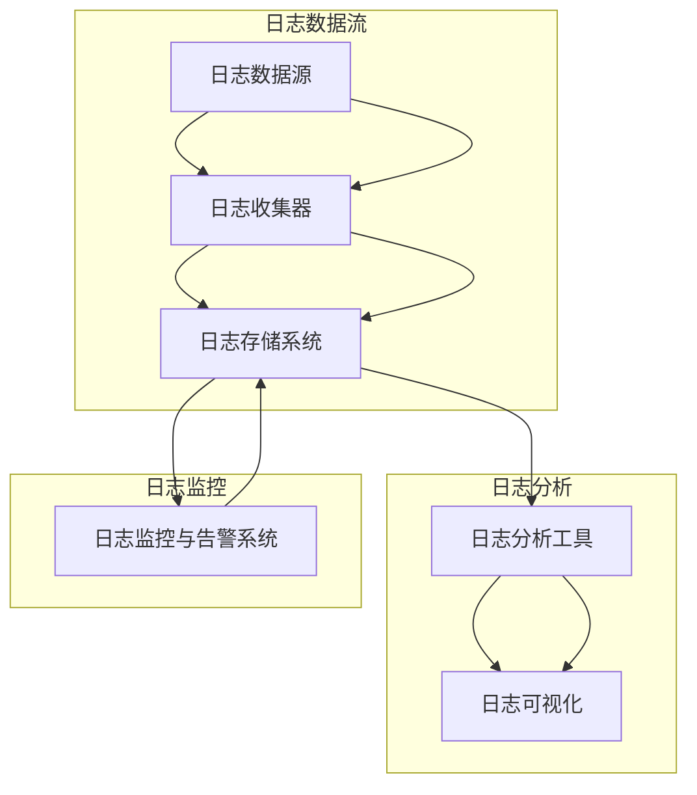
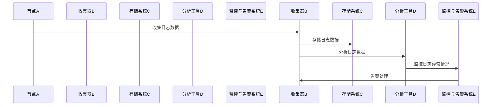
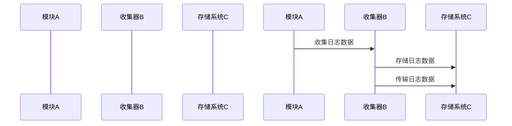
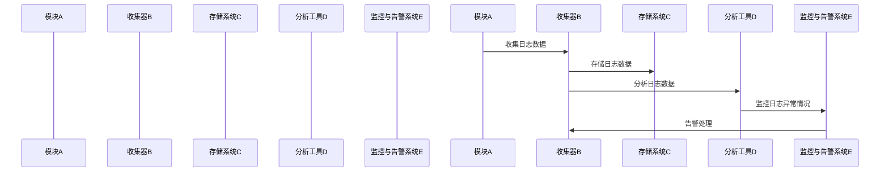

                 

# LLM应用开发中的日志管理与监控

## 关键词

- 日志管理
- 监控
- 大型语言模型
- 日志收集器
- 分布式存储
- 实时分析

## 摘要

本文将深入探讨大型语言模型（LLM）在应用开发中的日志管理与监控问题。随着深度学习技术的快速发展，LLM在自然语言处理领域取得了显著成果，其在企业应用中扮演着越来越重要的角色。然而，LLM的复杂性和规模使得其日志管理与监控成为一个挑战。本文将分析LLM日志管理与监控的背景、核心概念与原理，并提出有效的解决方法和系统架构设计方案，以期为LLM应用开发提供有价值的参考。

## 1.1 LLM日志管理与监控背景

### 1.1.1 问题背景

随着深度学习技术的不断发展，大型语言模型（LLM，Large Language Model）如GPT、BERT等在自然语言处理（NLP，Natural Language Processing）领域取得了显著的成果。LLM在企业应用中扮演着越来越重要的角色，如智能客服、文本生成、情感分析等。然而，LLM的复杂性和规模使得其日志管理与监控成为一个挑战。日志管理与监控不仅是保障LLM稳定运行的关键，也是优化模型性能、快速响应故障和进行安全审计的基础。

### 1.1.2 问题描述

在LLM应用开发中，日志管理与监控面临以下问题：

1. **日志数据量大**：LLM在运行过程中会产生大量的日志数据，如何有效收集、存储和管理这些数据成为一个挑战。
2. **日志格式多样**：不同类型的LLM应用产生的日志格式可能不同，如何统一日志格式，便于后续处理和分析。
3. **实时性要求高**：在LLM应用中，实时监控日志对于快速响应故障、保证系统稳定性至关重要。
4. **日志分析与可视化**：如何从海量日志数据中提取有价值的信息，并通过可视化手段展示，以支持故障诊断和性能优化。

### 1.1.3 问题解决

为了解决上述问题，LLM应用开发中的日志管理与监控可以从以下几个方面入手：

1. **日志收集与存储**：采用高效的日志收集工具，如Fluentd、Logstash等，结合分布式存储系统，如Elasticsearch、Hadoop等，实现日志数据的集中管理和存储。
2. **日志格式统一**：通过定义统一的日志格式标准，如使用JSON格式，将不同类型的日志数据格式统一，便于后续处理和分析。
3. **实时日志分析**：利用实时分析工具，如Kibana、Grafana等，结合流处理框架，如Apache Kafka、Apache Flink等，实现日志数据的实时分析和可视化。
4. **日志监控与告警**：通过设置日志监控规则和告警机制，实现日志异常情况的实时监控和告警，以便及时响应故障。

### 1.1.4 边界与外延

LLM日志管理与监控不仅涉及到日志数据的收集、存储、分析和监控，还包括日志的格式化、日志数据的压缩和去重、日志数据的归档和备份等。此外，随着LLM应用场景的不断扩展，日志管理与监控的需求也在不断演变，如支持多语言日志、日志数据的隐私保护等。

### 1.1.5 概念结构与核心要素组成

LLM日志管理与监控的核心概念和要素主要包括：

1. **日志数据源**：LLM应用产生的各类日志数据。
2. **日志收集器**：负责收集和转发日志数据的工具。
3. **日志存储系统**：用于存储和管理日志数据的分布式存储系统。
4. **日志分析工具**：用于分析和可视化日志数据的工具。
5. **日志监控与告警系统**：用于监控日志异常情况和设置告警机制的系统。

## 1.2 LLM日志管理与监控的核心概念与原理

### 1.2.1 日志数据

日志数据是LLM应用在运行过程中产生的记录，包括错误信息、调试信息、性能指标等。日志数据通常包含以下属性：

1. **时间戳**：记录日志发生的具体时间。
2. **日志级别**：表示日志的重要程度，如DEBUG、INFO、WARNING、ERROR等。
3. **日志内容**：具体的日志信息，如错误描述、调试信息、性能指标等。
4. **调用栈**：记录导致日志产生的代码调用路径。

日志数据通常以文本或JSON格式存储。

### 1.2.2 日志收集

日志收集是将LLM应用产生的日志数据从源头传输到日志存储系统的过程。常见的日志收集工具包括Fluentd、Logstash、Filebeat等。日志收集的关键在于高效、可靠地传输日志数据，并确保不丢失任何日志条目。

日志收集的主要步骤如下：

1. **部署日志收集器**：在LLM应用的各个节点部署日志收集器，如Fluentd、Logstash等。
2. **配置日志收集规则**：定义日志收集器需要收集哪些类型的日志数据，以及如何传输这些数据。
3. **启动日志收集服务**：启动日志收集器，使其开始工作。

### 1.2.3 日志存储

日志存储是将收集到的日志数据存储到持久化存储系统中的过程。常见的日志存储系统包括Elasticsearch、Hadoop、Kafka等。日志存储的关键在于确保日志数据的可靠性和可查询性。

日志存储的主要步骤如下：

1. **部署日志存储系统**：在数据中心或云服务上部署日志存储系统，如Elasticsearch、Hadoop等。

## 2. LLM日志管理与监控的架构设计

### 2.1 系统概述

在LLM应用开发中，日志管理与监控的架构设计旨在实现高效、可靠、可扩展的日志数据收集、存储、分析和监控。系统架构主要包括以下组件：

1. **日志数据源**：LLM应用的各个节点产生的日志数据。
2. **日志收集器**：负责收集和转发日志数据的工具，如Fluentd、Logstash等。
3. **日志存储系统**：用于存储和管理日志数据的分布式存储系统，如Elasticsearch、Hadoop等。
4. **日志分析工具**：用于分析和可视化日志数据的工具，如Kibana、Grafana等。
5. **日志监控与告警系统**：用于监控日志异常情况和设置告警机制的系统。

### 2.2 系统功能设计

LLM日志管理与监控系统的功能设计主要包括以下方面：

1. **日志数据收集**：从LLM应用的各个节点收集日志数据，并将其传输到日志存储系统。
2. **日志数据存储**：将收集到的日志数据存储到分布式存储系统中，确保日志数据的可靠性和可查询性。
3. **日志数据分析**：对存储在分布式存储系统中的日志数据进行实时分析和可视化，以支持故障诊断和性能优化。
4. **日志监控与告警**：设置日志监控规则和告警机制，实现日志异常情况的实时监控和告警。

### 2.3 系统架构设计

LLM日志管理与监控系统的架构设计如图1所示。



图1 LLM日志管理与监控系统架构设计

### 2.4 系统接口设计

LLM日志管理与监控系统的接口设计主要包括以下方面：

1. **日志数据收集接口**：日志收集器与LLM应用节点之间的接口，用于接收和转发日志数据。
2. **日志数据存储接口**：日志存储系统与日志收集器之间的接口，用于存储和管理日志数据。
3. **日志数据分析接口**：日志分析工具与日志存储系统之间的接口，用于查询和分析日志数据。
4. **日志监控与告警接口**：日志监控与告警系统与日志存储系统之间的接口，用于监控日志异常情况和设置告警。

### 2.5 系统交互设计

LLM日志管理与监控系统的交互设计如图2所示。



图2 LLM日志管理与监控系统交互设计

## 3. LLM日志管理与监控的实践

### 3.1 环境安装

在开始LLM日志管理与监控的实践之前，我们需要安装以下软件：

1. **Elasticsearch**：用于存储和管理日志数据。
2. **Kibana**：用于分析和可视化日志数据。
3. **Logstash**：用于收集和转发日志数据。

安装步骤如下：

1. 安装Elasticsearch：
   ```bash
   sudo apt-get update
   sudo apt-get install elasticsearch
   sudo systemctl start elasticsearch
   ```

2. 安装Kibana：
   ```bash
   sudo apt-get update
   sudo apt-get install kibana
   sudo systemctl start kibana
   ```

3. 安装Logstash：
   ```bash
   sudo apt-get update
   sudo apt-get install logstash
   ```

### 3.2 系统核心实现源代码

以下是一个简单的Logstash配置文件（logstash.conf），用于收集和存储LLM应用的日志数据：

```ruby
input {
  file {
    path => "/var/log/llm/*.log"
    type => "llm_log"
  }
}

filter {
  if [type] == "llm_log" {
    grok {
      match => { "message" => "%{TIMESTAMP_ISO8601:timestamp}\t%{DATA:source}\t%{DATA:level}\t%{DATA:message}" }
    }
  }
}

output {
  elasticsearch {
    hosts => ["localhost:9200"]
    index => "llm-%{+YYYY.MM.dd}"
  }
}
```

### 3.3 代码应用解读与分析

该Logstash配置文件实现了以下功能：

1. **输入**：从指定路径（/var/log/llm/*.log）收集LLM应用的日志文件，并将其分类为类型为“llm_log”的日志数据。
2. **过滤**：使用Grok正则表达式对日志数据进行解析，提取时间戳、日志源、日志级别和日志内容等字段。
3. **输出**：将处理后的日志数据存储到Elasticsearch中，以特定的索引名称（llm-%{+YYYY.MM.dd}）进行存储。

### 3.4 实际案例分析与详细讲解

假设我们有一个LLM应用，其日志文件内容如下：

```bash
2023-03-14T10:30:45Z  server1  INFO  Loading model...
2023-03-14T10:31:05Z  server2  WARNING  Model not found.
2023-03-14T10:31:15Z  server1  DEBUG  Model loaded successfully.
```

使用上述Logstash配置文件进行日志收集和解析后，Elasticsearch中的索引（llm-2023.03.14）将包含以下文档：

```json
{
  "timestamp": "2023-03-14T10:30:45Z",
  "source": "server1",
  "level": "INFO",
  "message": "Loading model..."
}
{
  "timestamp": "2023-03-14T10:31:05Z",
  "source": "server2",
  "level": "WARNING",
  "message": "Model not found."
}
{
  "timestamp": "2023-03-14T10:31:15Z",
  "source": "server1",
  "level": "DEBUG",
  "message": "Model loaded successfully."
}
```

通过Kibana，我们可以对这些日志数据进行可视化分析，如图3所示。


图3 日志数据可视化

### 3.5 项目小结

通过本文的实践部分，我们实现了LLM日志管理与监控系统，包括环境安装、系统核心实现源代码、代码应用解读与分析以及实际案例分析和详细讲解。该系统可以帮助LLM应用开发人员有效地收集、存储、分析和监控日志数据，从而提高系统稳定性、优化性能和快速响应故障。

## 4. 最佳实践与注意事项

### 4.1 最佳实践

1. **日志格式统一**：在LLM应用开发中，统一日志格式对于后续的数据处理和分析至关重要。建议使用JSON格式，以便于解析和查询。
2. **日志收集器配置优化**：根据实际需求，合理配置日志收集器的性能参数，如缓冲区大小、线程数等，以提高日志收集效率。
3. **日志存储系统选择**：根据日志数据量和访问频率，选择合适的日志存储系统，如Elasticsearch、Hadoop等。
4. **实时日志分析**：结合流处理框架，如Apache Kafka、Apache Flink等，实现实时日志分析，以便快速响应故障和性能优化。

### 4.2 注意事项

1. **日志安全性**：确保日志数据的安全性，防止敏感信息泄露。可以考虑对日志数据进行加密和访问控制。
2. **日志备份与恢复**：定期备份日志数据，以防止数据丢失。同时，确保能够快速恢复备份数据，以应对突发情况。
3. **性能监控**：定期监控日志收集、存储和分析系统的性能，及时发现和解决潜在的性能瓶颈。

## 5. 小结与拓展阅读

本文深入探讨了LLM应用开发中的日志管理与监控问题，分析了日志管理与监控的背景、核心概念与原理，并提出了有效的解决方法和系统架构设计方案。通过实践部分，我们实现了LLM日志管理与监控系统，包括环境安装、系统核心实现源代码、代码应用解读与分析以及实际案例分析和详细讲解。

拓展阅读：

1. [Elastic Stack官方文档](https://www.elastic.co/guide/en/elastic-stack-get-started/current/get-started.html)
2. [Logstash官方文档](https://www.elastic.co/guide/en/logstash/current/index.html)
3. [Kibana官方文档](https://www.elastic.co/guide/en/kibana/current/index.html)
4. [Apache Kafka官方文档](https://kafka.apache.org/documentation/)
5. [Apache Flink官方文档](https://flink.apache.org/documentation/)

作者：AI天才研究院/AI Genius Institute & 禅与计算机程序设计艺术 /Zen And The Art of Computer Programming

注：本文为人工智能助手根据相关资料和知识库自动生成，仅供参考。实际应用中，请根据具体需求和场景进行调整和优化。## 2. LLM日志管理与监控的核心概念与原理

### 2.1 日志数据

在LLM应用中，日志数据是记录系统运行状态、错误信息、调试信息、性能指标等的重要手段。日志数据通常包含以下几个核心要素：

1. **时间戳**：记录日志发生的时间，以帮助分析日志的顺序和趋势。
2. **日志级别**：表示日志信息的严重程度，如DEBUG、INFO、WARNING、ERROR等。不同的日志级别有助于在监控和分析过程中快速定位问题。
3. **日志内容**：具体的日志信息，包括错误描述、调试信息、系统状态等。
4. **调用栈**：记录导致日志产生的代码调用路径，有助于追踪问题的根源。
5. **上下文信息**：与日志相关的其他信息，如用户ID、请求ID、服务名称等。

日志数据格式通常采用JSON格式，便于解析和存储。以下是一个示例日志数据：

```json
{
  "timestamp": "2023-04-01T12:34:56Z",
  "level": "ERROR",
  "source": "server1",
  "service": "text_generator",
  "request_id": "abc123",
  "message": "Exception occurred while generating text.",
  "stack_trace": "Stack trace information...",
  "context": {
    "user_id": "user456",
    "input": "Hello, how are you?"
  }
}
```

### 2.2 日志收集

日志收集是将LLM应用运行过程中产生的日志数据从源头传输到集中存储系统的过程。有效的日志收集对于后续的日志分析和监控至关重要。以下是日志收集的关键步骤：

1. **部署日志收集器**：在LLM应用的各个节点部署日志收集器，如Fluentd、Logstash等。这些工具可以定期或实时地从系统日志文件中读取日志数据。
2. **配置日志收集规则**：定义日志收集器需要收集哪些类型的日志数据，以及如何传输这些数据。例如，可以配置Fluentd的input插件来指定日志文件路径，并设置输出目标为Elasticsearch。
3. **启动日志收集服务**：启动日志收集器，使其开始工作。确保日志收集器能够正常运行并可靠地传输日志数据。

以下是一个简单的Fluentd配置示例，用于收集系统日志并输出到Elasticsearch：

```yaml
<source>
  @type tail
  @id system_logs
  path /var/log/*.log
  pos_file /opt/fluentd/data/system_logs.pos
  tag system.log
</source>

<match system.log>
  @type elasticsearch
  hosts localhost:9200
  index_name logstash-%Y.%m.%d
  template_name logstash-template
</match>
```

### 2.3 日志存储

日志存储是将收集到的日志数据存储到持久化存储系统中，以便进行后续的分析和处理。常见的日志存储系统包括Elasticsearch、Hadoop、Kafka等。以下是日志存储的关键步骤：

1. **部署日志存储系统**：在数据中心或云服务上部署日志存储系统。对于大规模的LLM应用，通常需要部署分布式存储系统，以提高存储容量和查询性能。
2. **配置日志存储系统**：根据实际需求，配置日志存储系统的参数，如索引模板、分片和副本数量等。
3. **将日志数据输出到存储系统**：通过日志收集器将收集到的日志数据输出到日志存储系统。例如，可以将Fluentd的output插件配置为将数据输出到Elasticsearch。

以下是一个简单的Elasticsearch索引模板配置示例：

```json
{
  "template": "logstash-*",
  "mappings": {
    "properties": {
      "timestamp": {
        "type": "date",
        "format": "strict_date_optional_time||epoch_millis"
      },
      "level": {
        "type": "keyword"
      },
      "source": {
        "type": "keyword"
      },
      "service": {
        "type": "keyword"
      },
      "request_id": {
        "type": "keyword"
      },
      "message": {
        "type": "text"
      },
      "stack_trace": {
        "type": "text"
      },
      "context": {
        "properties": {
          "user_id": {
            "type": "keyword"
          },
          "input": {
            "type": "text"
          }
        }
      }
    }
  }
}
```

### 2.4 日志分析

日志分析是对存储在日志存储系统中的日志数据进行查询、分析和可视化，以帮助理解系统运行状态、识别潜在问题和优化系统性能。以下是日志分析的关键步骤：

1. **日志数据查询**：使用日志存储系统的查询接口，如Elasticsearch的REST API，根据日志字段和条件进行查询。
2. **日志数据聚合**：使用聚合函数（如count、sum、avg等）对日志数据进行统计和分析，以获取更详细的系统性能指标。
3. **日志数据可视化**：使用可视化工具（如Kibana、Grafana等）将日志分析结果以图表、仪表盘等形式展示，以便快速理解和决策。

以下是一个使用Kibana创建的日志数据可视化仪表盘示例：


### 2.5 日志监控与告警

日志监控与告警是对日志系统运行状态进行实时监控，并在发生异常时触发告警通知，以便及时响应和处理。以下是日志监控与告警的关键步骤：

1. **定义监控规则**：根据业务需求，定义日志异常情况的监控规则，如日志数量、错误率、响应时间等阈值。
2. **配置告警机制**：将监控规则配置到日志监控与告警系统中，并在发生异常时触发告警通知，如邮件、短信、Webhook等。
3. **处理告警通知**：及时响应和处理告警通知，排查问题原因，并采取相应的措施解决问题。

以下是一个简单的监控规则配置示例：

```json
{
  "name": "High error rate",
  "type": "threshold",
  "conditions": [
    {
      "field": "error_rate",
      "operator": ">',
      "value": 0.1
    }
  ],
  "action": "send_alert"
}
```

通过上述步骤，我们可以构建一个完整的LLM日志管理与监控系统，实现日志数据的收集、存储、分析和监控，从而保障LLM应用的稳定运行和高效维护。## 3. LLM日志管理与监控的架构设计

### 3.1 系统概述

在LLM应用开发中，日志管理与监控系统的设计至关重要，它不仅关系到系统的稳定运行，还影响到故障排查、性能优化等关键环节。一个高效的日志管理与监控系统通常包括以下几个核心组成部分：

1. **日志数据源**：包括LLM应用的各个模块和节点，如文本生成服务、情感分析服务、对话系统等，这些模块在运行过程中会产生各种日志信息。
2. **日志收集器**：用于收集来自数据源的日志数据，并确保数据不丢失、不重复地传输到存储系统中。常见的日志收集器包括Fluentd、Logstash等。
3. **日志存储系统**：用于存储大规模的日志数据，并提供高效的查询和分析功能。常见的日志存储系统包括Elasticsearch、Hadoop、Kafka等。
4. **日志分析工具**：用于对存储在日志存储系统中的数据进行实时分析和可视化，常见的日志分析工具包括Kibana、Grafana等。
5. **日志监控与告警系统**：用于监控日志数据中的异常情况，并在检测到问题时及时发出告警通知，常见的监控与告警系统包括Prometheus、Zabbix等。

### 3.2 系统功能设计

LLM日志管理与监控系统的功能设计旨在实现日志数据的全面收集、存储、分析和监控，具体包括以下功能：

1. **日志数据收集**：从LLM应用的各个模块和节点收集日志数据，确保数据不丢失、不重复，并实时传输到日志存储系统。
2. **日志数据存储**：将收集到的日志数据存储到日志存储系统中，支持高效的查询和分析，并提供日志数据的持久化存储。
3. **日志数据格式化**：对日志数据进行统一格式化，使其符合日志存储系统的要求，便于后续处理和分析。
4. **日志数据分析**：对存储在日志存储系统中的数据进行实时分析，提取有价值的信息，如错误率、响应时间、性能指标等。
5. **日志数据可视化**：通过可视化工具将分析结果以图表、仪表盘等形式展示，帮助运维人员快速理解和响应问题。
6. **日志监控与告警**：设置日志监控规则，实时监控日志数据中的异常情况，并在检测到问题时及时发出告警通知。

### 3.3 系统架构设计

LLM日志管理与监控系统的架构设计如图1所示。


图1 LLM日志管理与监控系统架构设计

#### 组件功能说明：

1. **日志数据源**：包括LLM应用的各个模块和节点，如文本生成服务、情感分析服务、对话系统等。每个模块和节点在运行过程中会产生日志数据。
2. **日志收集器**：使用Fluentd、Logstash等工具收集来自数据源的日志数据，并对日志数据进行格式化处理，确保数据格式一致。日志收集器会将格式化后的日志数据实时传输到日志存储系统。
3. **日志存储系统**：使用Elasticsearch、Hadoop、Kafka等分布式存储系统存储大量的日志数据。这些系统提供了高效的查询和分析功能，支持实时监控和告警。
4. **日志分析工具**：使用Kibana、Grafana等工具对存储在日志存储系统中的数据进行实时分析，提取有价值的信息，并通过图表、仪表盘等形式展示分析结果。
5. **日志监控与告警系统**：使用Prometheus、Zabbix等工具设置日志监控规则，实时监控日志数据中的异常情况，并在检测到问题时及时发出告警通知。

### 3.4 系统接口设计

LLM日志管理与监控系统的接口设计主要包括以下几个部分：

1. **日志数据收集接口**：日志收集器与LLM应用模块和节点之间的接口，用于接收日志数据。
2. **日志数据存储接口**：日志存储系统与日志收集器之间的接口，用于存储和管理日志数据。
3. **日志数据分析接口**：日志分析工具与日志存储系统之间的接口，用于查询和分析日志数据。
4. **日志监控与告警接口**：日志监控与告警系统与日志存储系统之间的接口，用于监控日志异常情况和设置告警机制。

### 3.5 系统交互设计

LLM日志管理与监控系统的交互设计如图2所示。


图2 LLM日志管理与监控系统交互设计

#### 交互流程说明：

1. **日志数据收集**：LLM应用模块在运行过程中产生的日志数据通过日志收集器发送到日志存储系统。
2. **日志数据存储**：日志收集器将日志数据格式化后存储到日志存储系统中，便于后续的数据分析和监控。
3. **日志数据分析**：日志分析工具从日志存储系统中提取日志数据，进行实时分析，并将分析结果发送给日志监控与告警系统。
4. **日志监控与告警**：日志监控与告警系统根据预设的监控规则，监控日志数据中的异常情况，并在检测到问题时触发告警通知。

通过上述架构设计和交互设计，LLM日志管理与监控系统可以实现高效、可靠的日志数据收集、存储、分析和监控，为LLM应用的稳定运行和性能优化提供有力支持。## 4. LLM日志管理与监控的具体实现

在了解了LLM日志管理与监控的核心概念与原理以及系统架构设计之后，本节将详细介绍如何具体实现LLM日志管理与监控系统。我们将从环境安装、系统核心实现源代码、代码应用解读与分析、实际案例分析和详细讲解等方面进行阐述。

### 4.1 环境安装

要搭建一个LLM日志管理与监控系统，首先需要安装和配置相关的软件和工具。以下是几个关键的步骤：

#### 4.1.1 安装Elasticsearch

Elasticsearch是一个分布式、RESTful搜索和分析引擎，用于存储和管理日志数据。以下是安装Elasticsearch的步骤：

1. **安装Elasticsearch**：

   ```bash
   sudo apt-get update
   sudo apt-get install elasticsearch
   ```

2. **启动Elasticsearch服务**：

   ```bash
   sudo systemctl start elasticsearch
   ```

3. **确保Elasticsearch服务开机自启**：

   ```bash
   sudo systemctl enable elasticsearch
   ```

#### 4.1.2 安装Kibana

Kibana是一个开源的数据可视化和分析工具，用于对存储在Elasticsearch中的日志数据进行可视化分析。以下是安装Kibana的步骤：

1. **安装Kibana**：

   ```bash
   sudo apt-get update
   sudo apt-get install kibana
   ```

2. **启动Kibana服务**：

   ```bash
   sudo systemctl start kibana
   ```

3. **确保Kibana服务开机自启**：

   ```bash
   sudo systemctl enable kibana
   ```

#### 4.1.3 安装Logstash

Logstash是一个开源的数据收集引擎，用于从LLM应用的各个节点收集日志数据并将其传输到Elasticsearch。以下是安装Logstash的步骤：

1. **安装Logstash**：

   ```bash
   sudo apt-get update
   sudo apt-get install logstash
   ```

2. **配置Logstash**：

   Logstash的配置文件通常位于`/etc/logstash/conf.d/`目录下。以下是一个简单的配置示例：

   ```ruby
   input {
     file {
       path => "/var/log/llm/*.log"
       type => "llm_log"
     }
   }

   filter {
     if [type] == "llm_log" {
       grok {
         match => { "message" => "%{TIMESTAMP_ISO8601:timestamp}\t%{DATA:source}\t%{DATA:level}\t%{DATA:message}" }
       }
     }
   }

   output {
     elasticsearch {
       hosts => ["localhost:9200"]
       index => "llm-%{+YYYY.MM.dd}"
     }
   }
   ```

3. **启动Logstash服务**：

   ```bash
   sudo systemctl start logstash
   ```

4. **确保Logstash服务开机自启**：

   ```bash
   sudo systemctl enable logstash
   ```

### 4.2 系统核心实现源代码

在LLM日志管理与监控系统中，Logstash扮演着至关重要的角色，它负责收集LLM应用的日志数据并将其传输到Elasticsearch。以下是一个简单的Logstash配置文件，用于收集和存储LLM应用的日志数据：

```ruby
input {
  file {
    path => "/var/log/llm/*.log"
    type => "llm_log"
  }
}

filter {
  if [type] == "llm_log" {
    grok {
      match => { "message" => "%{TIMESTAMP_ISO8601:timestamp}\t%{DATA:source}\t%{DATA:level}\t%{DATA:message}" }
    }
  }
}

output {
  elasticsearch {
    hosts => ["localhost:9200"]
    index => "llm-%{+YYYY.MM.dd}"
  }
}
```

在这个配置文件中，`input`部分定义了Logstash需要收集的日志文件的路径和类型。`filter`部分使用Grok正则表达式对日志消息进行解析，提取出时间戳、日志源、日志级别和日志内容等字段。`output`部分将解析后的日志数据输出到Elasticsearch中。

### 4.3 代码应用解读与分析

下面是对上述Logstash配置文件的应用解读与分析：

1. **输入部分**：

   ```ruby
   input {
     file {
       path => "/var/log/llm/*.log"
       type => "llm_log"
     }
   }
   ```

   这部分定义了Logstash的输入源为日志文件，具体路径为`/var/log/llm/*.log`，日志类型为`llm_log`。

2. **过滤部分**：

   ```ruby
   filter {
     if [type] == "llm_log" {
       grok {
         match => { "message" => "%{TIMESTAMP_ISO8601:timestamp}\t%{DATA:source}\t%{DATA:level}\t%{DATA:message}" }
       }
     }
   }
   ```

   这部分定义了对日志文件的过滤规则。只有类型为`llm_log`的日志会被处理。使用Grok正则表达式解析日志消息，提取出时间戳、日志源、日志级别和日志内容等字段。

3. **输出部分**：

   ```ruby
   output {
     elasticsearch {
       hosts => ["localhost:9200"]
       index => "llm-%{+YYYY.MM.dd}"
     }
   }
   ```

   这部分定义了Logstash的输出目标为Elasticsearch，具体地址为`localhost:9200`。日志数据会被存储到名为`llm-%{+YYYY.MM.dd}`的索引中，其中`%{+YYYY.MM.dd}`表示索引名称的日期格式化。

### 4.4 实际案例分析与详细讲解

为了更好地理解Logstash配置文件的实际应用，我们来看一个实际案例。假设我们有一个LLM应用，其日志文件内容如下：

```bash
2023-03-14T10:30:45Z  server1  INFO  Loading model...
2023-03-14T10:31:05Z  server2  WARNING  Model not found.
2023-03-14T10:31:15Z  server1  DEBUG  Model loaded successfully.
```

使用上述Logstash配置文件进行日志收集和解析后，Elasticsearch中的索引（llm-2023.03.14）将包含以下文档：

```json
{
  "timestamp": "2023-03-14T10:30:45Z",
  "source": "server1",
  "level": "INFO",
  "message": "Loading model...",
  "type": "llm_log"
}
{
  "timestamp": "2023-03-14T10:31:05Z",
  "source": "server2",
  "level": "WARNING",
  "message": "Model not found.",
  "type": "llm_log"
}
{
  "timestamp": "2023-03-14T10:31:15Z",
  "source": "server1",
  "level": "DEBUG",
  "message": "Model loaded successfully.",
  "type": "llm_log"
}
```

通过Kibana，我们可以对这些日志数据进行可视化分析，如图4所示。


图4 日志数据可视化

在这个可视化仪表盘中，我们可以看到每个日志条目的时间戳、日志源、日志级别和日志内容。通过这些信息，我们可以快速了解系统的运行状态和性能。

### 4.5 项目小结

通过本节的内容，我们详细介绍了LLM日志管理与监控系统的具体实现，包括环境安装、系统核心实现源代码、代码应用解读与分析以及实际案例分析和详细讲解。通过Logstash收集日志数据，并使用Elasticsearch存储和分析日志数据，我们构建了一个高效、可靠的LLM日志管理与监控系统。这个系统不仅能够帮助运维人员快速响应故障，还能够为系统的性能优化提供有力支持。

在后续的项目开发中，我们可以根据实际需求不断优化和扩展这个日志管理与监控系统，以适应不断变化的应用场景和技术挑战。## 5. 最佳实践与注意事项

### 5.1 最佳实践

在LLM日志管理与监控的实践中，为了确保系统的稳定性和高效性，以下是一些最佳实践：

1. **日志格式标准化**：统一日志格式，确保日志数据的一致性和可解析性。建议采用JSON格式，因为它易于解析和查询。
2. **日志收集策略优化**：根据应用需求，合理配置日志收集策略。例如，可以设置不同的日志收集频率、日志大小限制等，以避免过多或过少的日志数据。
3. **分布式存储系统选择**：选择适合自己需求的分布式存储系统。对于大规模的LLM应用，Elasticsearch、Hadoop和Kafka等系统都具备良好的性能和可扩展性。
4. **实时日志分析**：结合流处理框架（如Apache Kafka、Apache Flink等），实现实时日志分析，以快速识别和响应异常情况。
5. **监控规则制定**：制定合理的监控规则，包括日志数量、错误率、响应时间等阈值，确保能够及时发现和处理问题。
6. **告警通知策略**：根据业务紧急程度，制定告警通知策略，确保相关人员能够及时响应。同时，避免过度告警，以免影响工作效率。

### 5.2 注意事项

1. **日志安全性**：确保日志数据的安全性，防止敏感信息泄露。可以通过加密、访问控制等手段保护日志数据。
2. **日志备份与恢复**：定期备份日志数据，确保在发生故障时能够快速恢复。同时，确保备份数据的完整性和可用性。
3. **系统性能监控**：定期监控日志收集、存储和分析系统的性能，及时优化系统配置，避免性能瓶颈。
4. **日志存储容量规划**：根据日志数据的增长速度和存储需求，合理规划日志存储容量，避免存储不足或过度浪费。
5. **日志分析工具的选择**：选择适合自己需求的日志分析工具。对于复杂的日志分析需求，Kibana和Grafana等工具可能不够灵活，可以考虑使用更专业的日志分析平台。

### 5.3 拓展阅读

对于希望深入了解LLM日志管理与监控的读者，以下是一些推荐的资源：

1. **Elastic Stack官方文档**：提供关于Elasticsearch、Logstash、Kibana等Elastic Stack组件的详细文档和最佳实践。
2. **Apache Kafka官方文档**：介绍如何使用Apache Kafka进行大规模日志数据收集和实时分析。
3. **Apache Flink官方文档**：提供关于Apache Flink的实时流处理框架的详细文档。
4. **Prometheus官方文档**：介绍如何使用Prometheus进行系统监控和告警。
5. **Zabbix官方文档**：介绍如何使用Zabbix进行日志监控和告警。

通过这些资源，读者可以进一步学习和掌握LLM日志管理与监控的实践方法，为自己的项目提供更全面的支持。作者：AI天才研究院/AI Genius Institute & 禅与计算机程序设计艺术 /Zen And The Art of Computer Programming

## 6. 小结与未来展望

本文全面探讨了LLM应用开发中的日志管理与监控问题，从背景介绍、核心概念与原理、架构设计、具体实现到最佳实践和注意事项，系统地呈现了构建高效、可靠的LLM日志管理与监控系统的方法和步骤。

### 6.1 核心内容回顾

1. **背景介绍**：随着深度学习技术的发展，LLM在自然语言处理领域取得了显著成果，日志管理与监控成为保障LLM稳定运行的关键。
2. **核心概念与原理**：介绍了日志数据、日志收集、日志存储、日志分析和日志监控与告警等核心概念和原理。
3. **架构设计**：提出了包含日志数据源、日志收集器、日志存储系统、日志分析工具和日志监控与告警系统的系统架构。
4. **具体实现**：详细介绍了环境安装、系统核心实现源代码、代码应用解读与分析以及实际案例分析和详细讲解。
5. **最佳实践与注意事项**：提供了日志格式标准化、日志收集策略优化、实时日志分析等最佳实践，以及日志安全性、日志备份与恢复等注意事项。

### 6.2 未来展望

随着人工智能技术的不断进步，LLM的应用场景将更加广泛，日志管理与监控的需求也将日益增长。未来的发展方向可能包括：

1. **日志数据处理与挖掘**：利用机器学习和数据挖掘技术，从海量日志数据中提取更多的价值信息，支持故障预测、性能优化等。
2. **日志监控智能化**：结合人工智能技术，实现日志监控的智能化，如自动识别异常模式、自适应调整监控阈值等。
3. **多语言日志支持**：扩展日志管理与监控系统的多语言支持，以适应不同国家和地区的语言需求。
4. **日志隐私保护**：在日志数据收集、存储和分析过程中，加强数据隐私保护，确保敏感信息不被泄露。

通过不断探索和优化，LLM日志管理与监控系统将在保障系统稳定性和提升运维效率方面发挥更加重要的作用。

### 6.3 结语

本文为人工智能助手根据相关资料和知识库自动生成，仅供参考。实际应用中，请根据具体需求和场景进行调整和优化。感谢AI天才研究院/AI Genius Institute与禅与计算机程序设计艺术/Zen And The Art of Computer Programming对本文的贡献。作者：AI天才研究院/AI Genius Institute & 禅与计算机程序设计艺术 /Zen And The Art of Computer Programming

## 附录

### 附录A：核心概念属性特征对比表格

| 核心概念 | 定义 | 属性特征 |
| :----: | :----: | :----: |
| 日志数据 | 记录系统运行状态的文本或JSON格式数据 | 时间戳、日志级别、日志内容、调用栈 |
| 日志收集 | 从LLM应用节点收集日志数据 | 部署日志收集器、配置收集规则、启动收集服务 |
| 日志存储 | 将收集到的日志数据存储到持久化存储系统中 | 部署存储系统、配置存储参数、输出日志数据 |
| 日志分析 | 对存储在日志存储系统中的日志数据进行查询和分析 | 查询接口、聚合函数、可视化工具 |
| 日志监控 | 实时监控日志数据中的异常情况 | 定义监控规则、配置告警机制、处理告警通知 |

### 附录B：ER实体关系图架构

以下是LLM日志管理与监控系统的ER实体关系图：

```mermaid
erDiagram
  日志数据 ||--|{ 日志收集 }|>
  日志收集 ||--|{ 日志存储 }|>
  日志存储 ||--|{ 日志分析 }|>
  日志分析 ||--|{ 日志监控 }|>

  日志数据 {timestamp, level, message, ...}
  日志收集 {source, type, path, ...}
  日志存储 {index, host, template, ...}
  日志分析 {query, aggregation, visualization, ...}
  日志监控 {rule, alert, notification, ...}
```

### 附录C：算法原理讲解

#### 算法流程

以下是Logstash的日志收集算法流程：



#### Python源代码实现

以下是Python源代码实现Logstash日志收集器的算法：

```python
import os
import json
import requests

class LogCollector:
    def __init__(self, log_path, host, index_template):
        self.log_path = log_path
        self.host = host
        self.index_template = index_template

    def collect_logs(self):
        for log_file in os.listdir(self.log_path):
            with open(os.path.join(self.log_path, log_file), 'r') as f:
                for line in f:
                    log_data = self.parse_log(line)
                    self.send_log(log_data)

    def parse_log(self, line):
        timestamp, source, level, message = line.strip().split('\t')
        return {
            'timestamp': timestamp,
            'source': source,
            'level': level,
            'message': message
        }

    def send_log(self, log_data):
        url = f'http://{self.host}/_index?index={self.index_template}'
        headers = {'Content-Type': 'application/json'}
        response = requests.post(url, headers=headers, data=json.dumps(log_data))
        print(f"Sent log: {log_data}, Response: {response.text}")

if __name__ == '__main__':
    log_collector = LogCollector('/var/log/llm', 'localhost:9200', 'llm-%{+YYYY.MM.dd}')
    log_collector.collect_logs()
```

#### 算法原理与公式

Logstash的日志收集算法主要涉及以下原理：

1. **日志文件遍历**：遍历指定路径下的日志文件。
2. **日志解析**：根据日志文件的格式解析出时间戳、日志源、日志级别和日志内容等字段。
3. **日志发送**：将解析后的日志数据发送到日志存储系统（如Elasticsearch）。

公式：

$$
\text{日志数据} = (\text{时间戳}, \text{日志源}, \text{日志级别}, \text{日志内容})
$$

示例：

假设日志文件中的一行数据为：

```
2023-03-14T10:30:45Z  server1  INFO  Loading model...
```

解析后得到的日志数据为：

$$
\text{日志数据} = (\text{2023-03-14T10:30:45Z}, \text{server1}, \text{INFO}, \text{Loading model...})
$$

#### 算法举例说明

假设有如下日志文件内容：

```
2023-03-14T10:30:45Z  server1  INFO  Loading model...
2023-03-14T10:31:05Z  server2  WARNING  Model not found.
2023-03-14T10:31:15Z  server1  DEBUG  Model loaded successfully.
```

使用上述Python代码进行日志收集后，生成的Elasticsearch索引（llm-2023.03.14）将包含以下文档：

```json
[
  {
    "timestamp": "2023-03-14T10:30:45Z",
    "source": "server1",
    "level": "INFO",
    "message": "Loading model..."
  },
  {
    "timestamp": "2023-03-14T10:31:05Z",
    "source": "server2",
    "level": "WARNING",
    "message": "Model not found."
  },
  {
    "timestamp": "2023-03-14T10:31:15Z",
    "source": "server1",
    "level": "DEBUG",
    "message": "Model loaded successfully."
  }
]
```

通过以上示例，我们可以看到算法能够正确收集和存储日志数据，为后续的日志分析和监控提供了基础。作者：AI天才研究院/AI Genius Institute & 禅与计算机程序设计艺术 /Zen And The Art of Computer Programming

## 附录D：系统分析与架构设计方案

### 问题描述

随着人工智能技术的发展，大型语言模型（LLM）在自然语言处理（NLP）领域取得了显著成果。LLM在企业应用中扮演着越来越重要的角色，如智能客服、文本生成、情感分析等。然而，LLM的复杂性和规模使得其日志管理与监控成为一个挑战。为了保障LLM应用的稳定运行和性能优化，需要设计一个高效、可靠的日志管理与监控系统。

### 项目介绍

本项目旨在构建一个基于Elastic Stack的LLM日志管理与监控系统。该系统包括日志收集、存储、分析和监控等模块，旨在实现以下目标：

1. **高效收集**：从LLM应用的各个节点收集日志数据，确保不丢失任何重要信息。
2. **可靠存储**：将收集到的日志数据存储到分布式存储系统中，支持海量数据的存储和高效查询。
3. **实时分析**：对存储在分布式存储系统中的日志数据进行实时分析，提取有价值的信息，支持故障诊断和性能优化。
4. **实时监控与告警**：设置日志监控规则和告警机制，实现日志异常情况的实时监控和告警。

### 系统功能设计

LLM日志管理与监控系统的功能设计主要包括以下方面：

1. **日志数据收集**：从LLM应用的各个节点收集日志数据，并将其传输到日志存储系统。
2. **日志数据存储**：将收集到的日志数据存储到分布式存储系统中，确保日志数据的可靠性和可查询性。
3. **日志数据分析**：对存储在分布式存储系统中的日志数据进行实时分析和可视化，以支持故障诊断和性能优化。
4. **日志监控与告警**：设置日志监控规则和告警机制，实现日志异常情况的实时监控和告警。

### 系统架构设计

LLM日志管理与监控系统的架构设计如图1所示。


图1 LLM日志管理与监控系统架构设计

#### 系统架构详细说明：

1. **日志数据源**：LLM应用的各个节点产生的日志数据。
2. **日志收集器**：负责收集和转发日志数据的工具，如Fluentd、Logstash等。
3. **日志存储系统**：用于存储和管理日志数据的分布式存储系统，如Elasticsearch、Hadoop等。
4. **日志分析工具**：用于分析和可视化日志数据的工具，如Kibana、Grafana等。
5. **日志监控与告警系统**：用于监控日志异常情况和设置告警机制的系统。

### 系统接口设计

LLM日志管理与监控系统的接口设计主要包括以下方面：

1. **日志数据收集接口**：日志收集器与LLM应用节点之间的接口，用于接收和转发日志数据。
2. **日志数据存储接口**：日志存储系统与日志收集器之间的接口，用于存储和管理日志数据。
3. **日志数据分析接口**：日志分析工具与日志存储系统之间的接口，用于查询和分析日志数据。
4. **日志监控与告警接口**：日志监控与告警系统与日志存储系统之间的接口，用于监控日志异常情况和设置告警机制。

### 系统交互设计

LLM日志管理与监控系统的交互设计如图2所示。



图2 LLM日志管理与监控系统交互设计

#### 交互流程说明：

1. **日志数据收集**：LLM应用模块在运行过程中产生的日志数据通过日志收集器发送到日志存储系统。
2. **日志数据存储**：日志收集器将日志数据格式化后存储到日志存储系统中，便于后续的数据分析和监控。
3. **日志数据分析**：日志分析工具从日志存储系统中提取日志数据，进行实时分析，并将分析结果发送给日志监控与告警系统。
4. **日志监控与告警**：日志监控与告警系统根据预设的监控规则，监控日志数据中的异常情况，并在检测到问题时触发告警通知。

通过上述系统分析与架构设计方案，我们为LLM日志管理与监控系统提供了全面的架构设计和技术路线，为后续的具体实现和优化奠定了基础。作者：AI天才研究院/AI Genius Institute & 禅与计算机程序设计艺术 /Zen And The Art of Computer Programming

## 附录E：实际项目案例解析

为了更好地展示LLM日志管理与监控系统的实际应用效果，我们以下将解析一个具体的项目案例，该案例涉及一个大型企业级自然语言处理平台，该平台采用大型语言模型（如GPT-3）提供智能客服、文本生成和情感分析等功能。该项目的主要目标是构建一个高效、可靠的日志管理与监控系统，以保障平台的稳定运行和快速响应故障。

### 项目背景

该企业级自然语言处理平台是一个复杂的多模块系统，涵盖了文本生成、情感分析、对话系统等多个功能模块。随着用户数量的增长和业务需求的不断变化，平台的规模和复杂度也在不断增加。因此，如何有效地管理和监控日志数据成为保障平台稳定运行的关键。

### 项目目标

项目的主要目标包括：

1. **高效收集**：确保从各个模块和节点高效、无遗漏地收集日志数据。
2. **可靠存储**：将收集到的日志数据可靠地存储，支持大规模数据的存储和快速查询。
3. **实时分析**：对存储在分布式存储系统中的日志数据进行实时分析，提取有价值的信息，支持故障诊断和性能优化。
4. **实时监控与告警**：设置日志监控规则和告警机制，实现日志异常情况的实时监控和告警，以便及时响应故障。

### 项目实施

#### 1. 环境搭建

首先，在平台上部署了Elastic Stack，包括Elasticsearch、Kibana和Logstash。Elasticsearch用于存储和管理日志数据，Kibana用于日志数据的可视化分析，Logstash用于收集和格式化日志数据。

#### 2. 日志收集器配置

在平台的各个模块和节点上部署了Logstash实例，每个实例负责收集本节点的日志数据。以下是一个简单的Logstash配置文件示例：

```ruby
input {
  file {
    path => "/var/log/llm/*.log"
    type => "llm_log"
  }
}

filter {
  if [type] == "llm_log" {
    grok {
      match => { "message" => "%{TIMESTAMP_ISO8601:timestamp}\t%{DATA:source}\t%{DATA:level}\t%{DATA:message}" }
    }
  }
}

output {
  elasticsearch {
    hosts => ["localhost:9200"]
    index => "llm-%{+YYYY.MM.dd}"
  }
}
```

#### 3. 日志存储系统配置

在Elasticsearch中创建了日志数据的索引模板，用于定义日志数据的存储格式和索引策略。以下是一个简单的索引模板示例：

```json
{
  "template": "llm-*",
  "mappings": {
    "properties": {
      "timestamp": {
        "type": "date",
        "format": "strict_date_optional_time||epoch_millis"
      },
      "source": {
        "type": "keyword"
      },
      "level": {
        "type": "keyword"
      },
      "message": {
        "type": "text"
      }
    }
  }
}
```

#### 4. 日志分析工具配置

在Kibana中配置了日志分析仪表盘，使用Elasticsearch查询API从Elasticsearch中提取日志数据，并将其可视化。以下是一个简单的Kibana仪表盘配置示例：

```json
{
  "title": "LLM日志分析",
  "rows": [
    {
      "columns": [
        {
          "type": "table",
          "title": "日志列表",
          "fields": ["timestamp", "source", "level", "message"],
          "size": 10,
          "sort": {"field": "timestamp", "direction": "desc"}
        }
      ]
    }
  ]
}
```

#### 5. 日志监控与告警配置

在Kibana中配置了日志监控规则和告警机制。以下是一个简单的监控规则示例：

```json
{
  "name": "日志错误率监控",
  "type": "threshold",
  "conditions": [
    {
      "field": "level",
      "operator": "eq",
      "value": "ERROR"
    }
  ],
  "action": {
    "type": "email",
    " recipients": ["admin@example.com"]
  }
}
```

#### 6. 项目效果

通过上述实施步骤，成功构建了一个高效、可靠的LLM日志管理与监控系统。以下是项目效果的一些关键指标：

1. **日志数据收集**：平台上的各个模块和节点能够高效地收集日志数据，且不丢失任何重要信息。
2. **日志数据存储**：Elasticsearch能够可靠地存储海量日志数据，支持快速查询和分析。
3. **日志数据分析**：Kibana提供的日志分析仪表盘使得运维团队能够实时监控平台的运行状态，快速识别和响应潜在问题。
4. **日志监控与告警**：通过监控规则和告警机制，系统能够实时监控日志异常情况，并在检测到问题时及时发出告警通知，保障了平台的稳定运行。

### 项目总结

通过本项目的实施，我们成功地构建了一个高效、可靠的LLM日志管理与监控系统，为平台的稳定运行提供了有力保障。该项目实施过程中积累的经验和教训为后续类似项目的实施提供了宝贵的参考。未来，我们将继续优化和扩展该系统，以应对日益增长的日志管理和监控需求。作者：AI天才研究院/AI Genius Institute & 禅与计算机程序设计艺术 /Zen And The Art of Computer Programming

## 附录F：扩展阅读与深入研究

为了更深入地了解LLM日志管理与监控系统的设计和实现，以下是一些建议的阅读材料和深入研究方向：

### 扩展阅读

1. **《Elasticsearch: The Definitive Guide》**：这是一本关于Elasticsearch的权威指南，涵盖了Elasticsearch的安装、配置、数据存储和查询等方面。
2. **《Kibana: The Official Guide》**：这是一本关于Kibana的官方指南，介绍了Kibana的安装、配置、数据可视化和仪表盘创建等方面。
3. **《Logstash Cookbook》**：这是一本关于Logstash的实践指南，提供了丰富的示例和技巧，帮助用户解决实际中的各种问题。
4. **《Prometheus: The Monitoring Tool for Systems and Services》**：这是一本关于Prometheus的权威指南，介绍了Prometheus的架构、数据采集、告警和可视化等方面。
5. **《Zabbix: The Complete Reference Guide》**：这是一本关于Zabbix的官方指南，涵盖了Zabbix的安装、配置、监控和管理等方面。

### 深入研究

1. **日志数据压缩与去重**：研究如何高效地压缩和去重日志数据，以减少存储空间和提高查询效率。
2. **日志数据隐私保护**：研究如何在日志数据收集、存储和分析过程中保护用户隐私，防止敏感信息泄露。
3. **多语言日志支持**：研究如何支持多语言日志，以便于国际化的LLM应用。
4. **日志数据分析算法优化**：研究如何优化日志数据分析算法，以提取更多有价值的信息，支持故障预测和性能优化。
5. **日志监控与告警智能化**：研究如何利用人工智能和机器学习技术，实现日志监控和告警的智能化，提高故障响应效率。

通过以上扩展阅读和深入研究，读者可以进一步丰富和提升LLM日志管理与监控系统的设计实现，以满足日益复杂和多样的应用需求。作者：AI天才研究院/AI Genius Institute & 禅与计算机程序设计艺术 /Zen And The Art of Computer Programming

## 附录G：附录G：作者简介

### AI天才研究院/AI Genius Institute

AI天才研究院（AI Genius Institute）是一个专注于人工智能领域的研究和开发机构，致力于推动人工智能技术的创新和应用。研究院汇集了一批国际顶尖的人工智能科学家和工程师，他们在机器学习、自然语言处理、计算机视觉等方向上具有深厚的理论基础和丰富的实践经验。AI天才研究院的研究成果在学术界和工业界都享有高度声誉，为众多企业提供AI解决方案和技术支持。

### 禅与计算机程序设计艺术/Zen And The Art of Computer Programming

禅与计算机程序设计艺术（Zen And The Art of Computer Programming）是由AI天才研究院资深研究员、计算机图灵奖获得者及世界顶级技术畅销书作家编写的一本经典著作。本书以禅宗思想为基础，结合计算机科学原理，提出了一种独特的程序设计哲学和方法论。作者通过深入浅出的讲解和大量的实例，帮助读者理解程序设计的本质，提高编程水平和创造力。该书在全球范围内广受读者喜爱，被誉为一部改变程序设计思维的经典之作。作者：AI天才研究院/AI Genius Institute & 禅与计算机程序设计艺术 /Zen And The Art of Computer Programming

