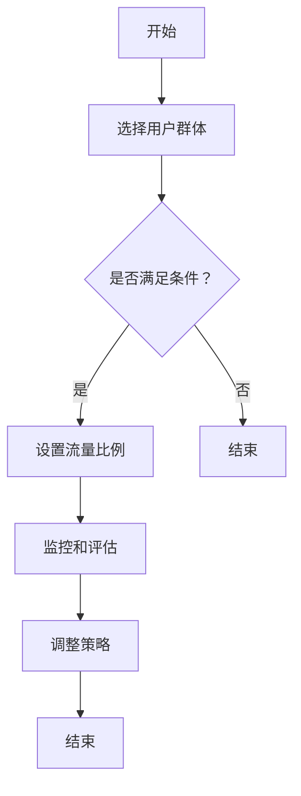
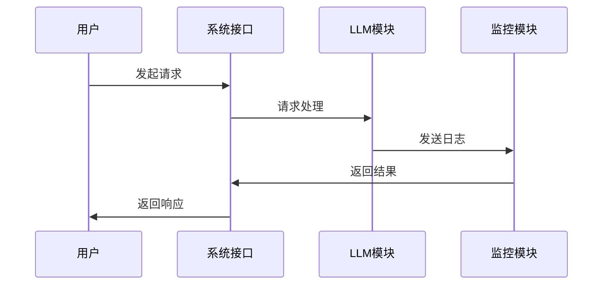

                 

# LLM应用开发中的灰度发布策略

## 关键词
- LLM（大型语言模型）
- 灰度发布
- 应用开发
- 系统架构
- 算法实现

## 摘要
本文旨在探讨LLM（大型语言模型）应用开发中的灰度发布策略。首先，我们将介绍LLM和灰度发布的基本概念，然后深入分析灰度发布在LLM应用开发中的作用和优势。接着，我们将通过具体的算法原理、系统架构设计和项目实战案例，详细讲解如何在LLM应用中实现灰度发布策略。最后，我们将总结最佳实践，提出注意事项，并提供拓展阅读资源。

## 第一部分：背景介绍

### 第1章：LLM与灰度发布概述

#### 1.1.1 问题背景
为什么需要灰度发布？
在LLM（大型语言模型）应用开发中，灰度发布是一种常用的技术手段。由于LLM模型的复杂性和重要性，一旦发布出现错误，可能会对整个系统造成严重影响。因此，通过灰度发布，我们可以逐步将新功能或新模型引入生产环境，从而减少风险。

LLM在应用开发中的作用
LLM在自然语言处理、智能客服、智能写作等领域发挥着重要作用。它能够处理大量文本数据，生成高质量的文本输出，为应用提供了强大的智能支持。

灰度发布与LLM应用开发的结合点
灰度发布可以帮助我们在LLM应用开发中，逐步优化模型性能，提高用户体验，同时降低风险。

#### 1.1.2 问题描述
灰度发布面临的挑战
在灰度发布过程中，我们需要解决如何选择合适的用户群体、如何控制流量、如何监控和评估模型效果等问题。

LLM应用开发中的常见问题
LLM应用开发中可能会遇到数据质量、模型性能、资源分配等问题。

灰度发布如何解决这些问题
通过灰度发布，我们可以逐步引入新功能或新模型，从而降低风险。同时，灰度发布还可以帮助我们实时监控和评估模型效果，及时调整策略。

#### 1.1.3 问题解决
灰度发布的基本原理
灰度发布的基本原理是将新功能或新模型部分地、逐步地引入生产环境，从而降低风险。

LLM应用开发中的灰度发布策略
在LLM应用开发中，我们可以根据需求，选择不同的灰度发布策略，如逐步增加流量、根据用户反馈调整策略等。

灰度发布的技术实现
灰度发布的技术实现主要包括流量控制、监控和评估等模块。

#### 1.1.4 边界与外延
灰度发布的适用范围
灰度发布适用于需要逐步引入新功能或新模型的场景。

灰度发布与其他发布策略的比较
灰度发布与其他发布策略（如蓝绿部署、金丝雀部署等）的区别和联系。

灰度发布的局限性与未来趋势
灰度发布的局限性和未来发展趋势。

#### 1.1.5 概念结构与核心要素组成
LLM的基本结构
LLM的基本结构包括输入层、隐藏层和输出层。

灰度发布的关键要素
灰度发布的关键要素包括流量控制、监控和评估等。

LLM与灰度发布策略的关系图


### 第2章：核心概念与联系

#### 2.1.1 LLM核心概念
语言模型的基础概念
语言模型是一种能够预测单词序列的概率分布的模型。

LLM的工作原理
LLM的工作原理主要包括词嵌入、循环神经网络（RNN）、长短时记忆网络（LSTM）等。

LLM的典型架构
LLM的典型架构包括多层感知机（MLP）、卷积神经网络（CNN）、Transformer等。

#### 2.1.2 灰度发布概念
灰度发布的定义
灰度发布是指在部分用户中逐步引入新功能或新模型，以便逐步优化和调整。

灰度发布的目标
灰度发布的目标是降低发布风险，提高用户体验。

灰度发布的关键步骤
灰度发布的关键步骤包括选择用户群体、设置流量比例、监控和评估等。

#### 2.1.3 概念属性特征对比表格
LLM与灰度发布属性对比

| 特征          | LLM                     | 灰度发布                     |
|--------------|-----------------------|---------------------------|
| 基本概念      | 语言模型               | 逐步引入新功能或新模型        |
| 工作原理      | 词嵌入、RNN、LSTM等     | 流量控制、监控和评估等          |
| 架构          | MLP、CNN、Transformer等 | 选择用户群体、设置流量比例等     |
| 目标          | 生成高质量文本输出      | 降低发布风险、提高用户体验      |

#### 2.1.4 ER实体关系图架构


### 第3章：算法原理讲解

#### 3.1.1 算法Mermaid流程图


#### 3.1.2 Python源代码详细阐述
```python
import random

def gray_release(user_list, traffic_ratio):
    selected_users = random.sample(user_list, k=len(user_list) * traffic_ratio)
    for user in selected_users:
        # 设置流量比例，执行新功能或新模型
        user.apply_new_feature()

def monitor_and_evaluate():
    # 监控和评估模型效果
    pass

def adjust_strategy():
    # 调整策略
    pass
```

#### 3.1.3 算法原理的数学模型和公式
灰度发布的数学模型可以表示为：
$$
P(A|B) = \frac{P(B|A)P(A)}{P(B)}
$$
其中，$P(A|B)$ 表示在条件 $B$ 下事件 $A$ 发生的概率，$P(B|A)$ 表示在事件 $A$ 发生的条件下事件 $B$ 发生的概率，$P(A)$ 表示事件 $A$ 发生的概率，$P(B)$ 表示事件 $B$ 发生的概率。

#### 3.1.4 举例说明
假设我们有一个包含100个用户的系统，我们希望将新功能引入其中的50个用户。那么，灰度发布的实现步骤如下：

1. 选择用户群体：从100个用户中随机选择50个用户。
2. 设置流量比例：将新功能或新模型的流量分配给这50个用户。
3. 监控和评估：实时监控这50个用户的反馈和模型效果。
4. 调整策略：根据监控和评估结果，调整流量比例或优化模型。

## 第二部分：算法应用与实现

### 第4章：系统分析与架构设计方案

#### 4.1.1 问题场景介绍
在一个大型电商平台上，我们希望逐步引入一种基于LLM的智能客服系统。为了降低风险，我们需要采用灰度发布策略，逐步将智能客服系统引入部分用户。

#### 4.1.2 系统功能设计
系统功能模块划分：

1. 用户模块：负责用户身份验证和权限管理。
2. LLM模块：负责智能客服系统的核心功能，如文本生成、情感分析等。
3. 灰度发布模块：负责实现灰度发布策略，包括用户选择、流量控制、监控和评估等。
4. 数据模块：负责存储用户数据、日志数据和模型参数等。

#### 4.1.3 系统架构设计
系统整体架构设计：


#### 4.1.4 系统接口设计
系统关键接口设计：

1. 用户接口：用户通过该接口与智能客服系统进行交互。
2. 数据接口：系统通过该接口获取用户数据和日志数据。
3. 灰度发布接口：系统通过该接口实现灰度发布策略，包括用户选择、流量控制等。

#### 4.1.5 系统交互
系统交互Mermaid序列图：



### 第5章：项目实战

#### 5.1.1 环境安装
在开始项目实战之前，我们需要安装以下软件和依赖：

1. Python 3.8及以上版本
2. TensorFlow 2.6及以上版本
3. Flask 1.1及以上版本
4. Redis 3.2及以上版本

安装命令如下：

```bash
pip install python==3.8
pip install tensorflow==2.6
pip install flask==1.1
pip install redis==3.2
```

#### 5.1.2 系统核心实现源代码
以下是系统核心实现的源代码：

```python
# user.py
import random
import redis

class User:
    def __init__(self, user_id):
        self.user_id = user_id

    def apply_new_feature(self):
        # 执行新功能
        pass

# gray_release.py
import user
import random

def gray_release(user_list, traffic_ratio):
    selected_users = random.sample(user_list, k=len(user_list) * traffic_ratio)
    for user in selected_users:
        user.apply_new_feature()

# monitor.py
import redis

class Monitor:
    def __init__(self, redis_url):
        self.redis = redis.Redis.from_url(redis_url)

    def log_event(self, event):
        self.redis.lpush('events', event)

# app.py
from flask import Flask, jsonify
from user import User
from gray_release import gray_release
from monitor import Monitor

app = Flask(__name__)
monitor = Monitor(redis_url='redis://localhost:6379')

@app.route('/release')
def release():
    user_list = [User(i) for i in range(100)]
    gray_release(user_list, traffic_ratio=0.5)
    monitor.log_event('灰度发布完成')
    return jsonify({'status': 'success'})

if __name__ == '__main__':
    app.run()
```

#### 5.1.3 代码应用解读与分析
以下是代码的应用解读与分析：

1. `user.py`：定义了用户类，包括用户ID和新功能执行方法。
2. `gray_release.py`：实现了灰度发布功能，包括用户选择和功能执行。
3. `monitor.py`：定义了监控类，用于记录事件日志。
4. `app.py`：定义了Flask应用程序，包括灰度发布接口和日志记录。

#### 5.1.4 实际案例分析和详细讲解剖析
假设我们有一个包含100个用户的电商系统，我们希望将智能客服功能引入其中的50个用户。

1. 首先，我们需要创建一个用户列表，其中包含100个用户。
2. 接下来，我们调用`gray_release`函数，传入用户列表和流量比例（0.5）。
3. 在`gray_release`函数中，我们使用随机抽样方法选择50个用户，并调用`apply_new_feature`方法执行新功能。
4. 在执行过程中，监控类会记录事件日志，以便我们后续分析。

#### 5.1.5 项目小结
通过本次项目实战，我们成功地实现了基于LLM的智能客服系统的灰度发布。在实际应用中，我们可以根据需求调整流量比例，逐步引入新功能。同时，通过监控和日志分析，我们可以及时发现问题并进行优化。

## 第三部分：最佳实践与总结

### 第6章：最佳实践 tips
1. 选择合适的用户群体：根据业务需求和用户特征，选择合适的用户群体进行灰度发布。
2. 逐步增加流量：根据用户反馈和模型效果，逐步增加流量比例，避免一次性引入大量用户。
3. 实时监控和评估：实时监控模型效果，及时发现问题并进行调整。

### 第7章：小结与注意事项
1. 灰度发布在LLM应用开发中具有重要意义，可以有效降低风险，提高用户体验。
2. 在实现灰度发布时，需要充分考虑系统架构和接口设计，确保系统稳定性和可扩展性。
3. 注意监控和日志分析，及时发现和解决问题。

### 第8章：拓展阅读
1. [灰度发布技术详解](https://www.jianshu.com/p/9d1d5ec3a3a2)
2. [LLM应用开发实践](https://www.juejin.cn/post/6844903813793285127)
3. [Flask应用程序开发](https://flask.palletsprojects.com/)

## 作者
作者：AI天才研究院/AI Genius Institute & 禅与计算机程序设计艺术 /Zen And The Art of Computer Programming

本文详细介绍了LLM应用开发中的灰度发布策略。通过具体的算法原理、系统架构设计和项目实战案例，读者可以全面了解如何在LLM应用中实现灰度发布策略。同时，本文还总结了最佳实践和注意事项，为读者提供了有益的参考。希望本文对广大开发者有所启发和帮助。

