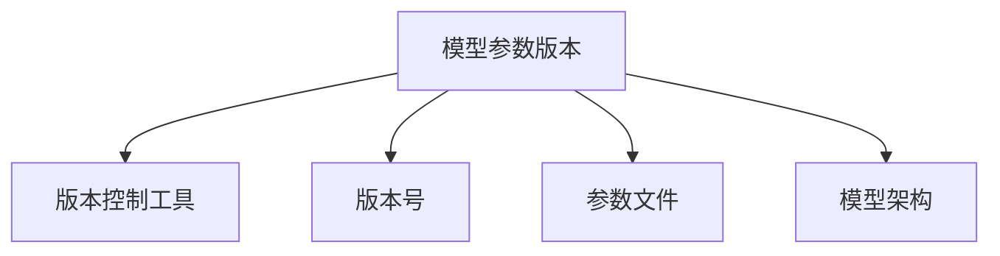
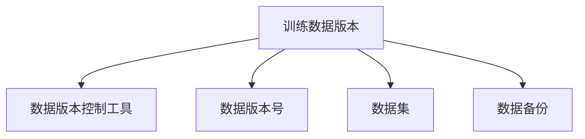
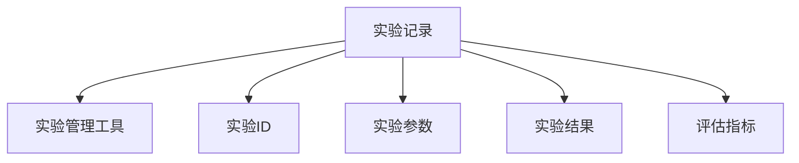
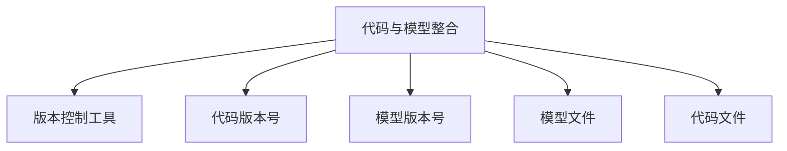

                 

## LLM应用开发中的版本控制最佳实践

### 关键词：大规模语言模型（LLM）、版本控制、模型参数、训练数据、实验记录、最佳实践

### 摘要

随着大规模语言模型（LLM）在自然语言处理（NLP）领域的广泛应用，版本控制成为保证模型开发过程可追溯性、复现性和可靠性的关键。本文将深入探讨LLM应用开发中的版本控制核心概念，包括模型参数版本管理、训练数据版本管理和实验记录管理，并提出一系列最佳实践策略，旨在为开发者提供实用的指导和参考。

### 第一部分：背景介绍

#### 1.1 问题背景

近年来，人工智能（AI）技术取得了飞速发展，尤其是在自然语言处理（NLP）领域。大规模语言模型（LLM）如GPT-3、BERT等，凭借其强大的处理能力和广泛的适用性，已经在许多实际应用中取得了显著的成果。然而，在实际开发过程中，版本控制成为一个不容忽视的问题。

版本控制不仅仅是代码管理的一部分，它还涉及到模型参数、训练数据和实验记录的全面管理。良好的版本控制机制可以确保开发过程的透明性、可追溯性和可靠性，从而提高开发效率和产品质量。然而，在实际应用中，版本控制面临诸多挑战：

1. **模型参数管理**：如何有效地管理模型参数的多个版本，以便在不同版本之间进行切换和回滚？
2. **训练数据管理**：如何确保训练数据的版本一致性和完整性，避免数据泄漏或丢失？
3. **实验记录管理**：如何记录和追踪实验过程中的参数设置、实验结果和评估指标，以便进行后续的分析和优化？
4. **代码管理**：如何整合代码版本控制与模型版本控制，实现统一的管理和协同开发？

#### 1.2 问题描述

在实际应用开发中，版本控制面临以下问题：

1. **模型参数管理**：模型参数作为模型的核心组成部分，其多个版本的存储、管理、切换和回滚成为关键挑战。特别是在模型迭代频繁的情况下，如何确保版本的可追溯性和复现性？
2. **训练数据管理**：训练数据是模型训练的基础，其版本一致性和完整性直接影响模型的性能。如何确保训练数据在不同版本之间的一致性，同时避免数据泄漏或丢失？
3. **实验记录管理**：实验记录包含实验过程中的参数设置、实验结果和评估指标等关键信息。如何有效地记录和追踪这些信息，以便进行后续的分析和优化？
4. **代码管理**：代码版本控制是软件开发的基本要求，但在LLM应用开发中，如何将代码版本控制与模型版本控制相结合，实现统一的管理和协同开发？

#### 1.3 问题解决

为了解决上述问题，需要引入一套完善的版本控制最佳实践。这些最佳实践包括但不限于：

1. **模型参数版本管理**：使用版本控制工具（如Git）管理模型参数的多个版本，确保版本的可追溯性和可回滚性。
2. **训练数据版本管理**：使用数据版本控制工具（如DVC）对训练数据进行版本管理，确保数据的版本一致性和完整性。
3. **实验记录管理**：使用实验管理工具（如Weaver）记录实验过程和结果，实现实验数据的可视化和分析。
4. **代码与模型整合**：使用持续集成（CI）和持续部署（CD）工具（如GitHub Actions、Jenkins）实现代码和模型的自动化构建、测试和部署。

#### 1.4 边界与外延

1. **边界**：本文主要关注LLM应用开发中的版本控制问题，涵盖模型参数、训练数据和实验记录的管理。
2. **外延**：除了上述内容，版本控制还涉及到代码管理、数据治理、模型安全和合规性等方面，本文将不做详细讨论。

#### 1.5 概念结构与核心要素组成

1. **版本控制工具**：Git、DVC、GitHub Actions等
2. **模型参数管理**：版本号、参数文件、模型架构等
3. **训练数据管理**：数据版本号、数据集划分、数据备份等
4. **实验记录管理**：实验ID、实验参数、实验结果、评估指标等
5. **代码管理**：代码版本、分支管理、代码审查等

#### 1.6 本章小结

本章从背景介绍、问题描述、问题解决、边界与外延以及概念结构与核心要素组成等方面，全面阐述了LLM应用开发中版本控制的重要性。接下来，将详细探讨各个方面的具体实践和最佳策略。

### 第二部分：LLM应用开发中的版本控制核心概念与联系

#### 2.1 模型参数版本管理

#### 2.1.1 概念原理

模型参数版本管理是指对模型训练过程中的参数进行版本管理，包括参数值的保存、加载和回滚。模型参数版本管理的主要目的是确保模型训练的可追溯性和可复现性。

模型参数版本管理的关键在于如何有效地保存和加载参数值，以及如何在多个版本之间进行切换和回滚。在LLM应用开发中，模型参数通常包括权重矩阵、学习率、优化器参数等。通过版本控制工具，可以对这些参数进行版本管理，从而实现参数的可追溯性和复现性。

#### 2.1.2 概念属性特征对比表格

| 特性               | Git版本控制 | DVC数据版本控制 |  
|--------------------|-------------|-----------------|  
| 适用范围           | 模型参数、代码、数据等 | 数据               |  
| 核心功能           | 版本管理、分支、合并、回滚等 | 数据版本管理、数据备份、数据一致性检查等 |  
| 数据格式支持       | 文件、目录、代码等 | 文件、目录、数据集等 |  
| 版本记录           | 文件级版本记录 | 数据集级版本记录 |  
| 版本回滚           | 支持           | 支持               |

#### 2.1.3 ER实体关系图架构

#### 2.2 训练数据版本管理

#### 2.2.1 概念原理

训练数据版本管理是指对训练数据集进行版本管理，包括数据集的划分、备份和版本控制。训练数据版本管理的主要目的是确保训练数据的完整性和一致性，以及方便后续的数据分析和复现。

在LLM应用开发中，训练数据通常包括文本、语音、图像等多种形式。数据版本管理的目的是确保在模型迭代过程中，训练数据的一致性和完整性。通过数据版本控制，可以有效地追踪数据的变化，确保不同版本之间的数据一致性，从而提高模型的稳定性和可靠性。

#### 2.2.2 概念属性特征对比表格

| 特性               | Git版本控制 | DVC数据版本控制 |  
|--------------------|-------------|-----------------|  
| 适用范围           | 数据、代码等 | 数据               |  
| 核心功能           | 版本管理、分支、合并、回滚等 | 数据版本管理、数据备份、数据一致性检查等 |  
| 数据格式支持       | 文件、目录、代码等 | 文件、目录、数据集等 |  
| 版本记录           | 文件级版本记录 | 数据集级版本记录 |  
| 版本回滚           | 支持           | 支持               |

#### 2.2.3 ER实体关系图架构

### 2.3 实验记录管理

#### 2.3.1 概念原理

实验记录管理是指对实验过程中的参数设置、实验结果和评估指标进行记录和追踪。实验记录管理的主要目的是确保实验数据的可追溯性和可复现性，从而支持后续的数据分析和优化。

在LLM应用开发中，实验记录通常包括实验ID、实验参数、实验结果和评估指标等关键信息。通过实验记录管理工具，可以有效地记录和追踪实验过程，确保实验数据的完整性和准确性。此外，实验记录管理还可以支持实验结果的可视化和分析，为模型的优化提供有力支持。

#### 2.3.2 概念属性特征对比表格

| 特性               | Git版本控制 | DVC数据版本控制 |  
|--------------------|-------------|-----------------|  
| 适用范围           | 代码、数据等 | 数据               |  
| 核心功能           | 版本管理、分支、合并、回滚等 | 数据版本管理、数据备份、数据一致性检查等 |  
| 数据格式支持       | 文件、目录、代码等 | 文件、目录、数据集等 |  
| 版本记录           | 文件级版本记录 | 数据集级版本记录 |  
| 版本回滚           | 支持           | 支持               |

#### 2.3.3 ER实体关系图架构

### 2.4 代码与模型整合

#### 2.4.1 概念原理

代码与模型整合是指将代码版本控制与模型版本控制相结合，实现统一的管理和协同开发。在LLM应用开发中，代码和模型之间的整合是至关重要的。通过整合代码和模型版本控制，可以确保代码和模型在不同版本之间的一致性和协同性。

代码与模型整合的核心在于如何有效地管理代码和模型的多个版本，以及如何在版本之间进行切换和回滚。通过使用持续集成（CI）和持续部署（CD）工具，可以实现代码和模型的自动化构建、测试和部署，从而提高开发效率和产品质量。

#### 2.4.2 概念属性特征对比表格

| 特性               | Git版本控制 | DVC数据版本控制 |  
|--------------------|-------------|-----------------|  
| 适用范围           | 代码、数据等 | 数据               |  
| 核心功能           | 版本管理、分支、合并、回滚等 | 数据版本管理、数据备份、数据一致性检查等 |  
| 数据格式支持       | 文件、目录、代码等 | 文件、目录、数据集等 |  
| 版本记录           | 文件级版本记录 | 数据集级版本记录 |  
| 版本回滚           | 支持           | 支持               |

#### 2.4.3 ER实体关系图架构

### 2.5 本章小结

本章从模型参数版本管理、训练数据版本管理、实验记录管理和代码与模型整合等方面，详细阐述了LLM应用开发中的版本控制核心概念和联系。通过对比不同版本控制工具的概念属性特征和ER实体关系图，我们可以更清晰地理解各个核心概念的具体应用和作用。接下来，将进入下一章，探讨LLM应用开发中的版本控制最佳实践。

### 第三部分：LLM应用开发中的版本控制最佳实践

#### 3.1 模型参数版本管理的最佳实践

模型参数版本管理是确保模型开发过程可追溯性和复现性的关键。以下是一些模型参数版本管理的最佳实践：

1. **使用Git进行版本控制**：
   - **主分支策略**：将模型参数的版本控制与Git主分支策略相结合，确保每个版本都有明确的分支和标签。
   - **版本注释**：为每个模型参数版本添加详细的注释，描述该版本的参数设置和变更原因。

2. **参数文件命名规范**：
   - **一致命名**：采用统一的命名规范，如`model_params_v1.json`、`model_params_v2.json`等，便于版本追踪和切换。
   - **注释和说明**：在参数文件中添加注释和说明，详细描述每个参数的含义和作用。

3. **版本回滚策略**：
   - **定期备份**：定期备份模型参数，确保在出现问题时可以快速回滚到之前的状态。
   - **版本差异比较**：使用版本控制工具比较不同版本的差异，确保参数的变更符合预期。

4. **持续集成与部署**：
   - **自动化测试**：在模型参数版本变更时，自动化测试模型性能，确保参数变更不影响模型效果。
   - **持续集成**：使用持续集成（CI）工具，如GitHub Actions，实现模型参数版本变更的自动化构建和部署。

#### 3.2 训练数据版本管理的最佳实践

训练数据版本管理是确保模型训练数据一致性和完整性的关键。以下是一些训练数据版本管理的最佳实践：

1. **使用DVC进行版本控制**：
   - **数据集划分**：将训练数据集划分为多个版本，如训练集、验证集和测试集，确保每个版本的数据都保持一致。
   - **数据备份**：定期备份训练数据集，确保数据不会因意外情况而丢失。

2. **数据版本注释**：
   - **版本注释**：为每个训练数据版本添加详细的注释，描述数据的来源、处理过程和变更原因。
   - **数据一致性检查**：定期进行数据一致性检查，确保不同版本之间的数据保持一致。

3. **数据质量监控**：
   - **数据清洗**：定期清洗训练数据，确保数据的准确性和完整性。
   - **数据监控**：使用数据监控工具，如DVC的监控功能，实时监控数据集的变化和异常。

4. **实验记录与数据关联**：
   - **记录数据使用情况**：将训练数据版本与实验记录关联，记录每个实验使用的数据版本，确保实验的可追溯性和复现性。

#### 3.3 实验记录管理的最佳实践

实验记录管理是确保实验数据可追溯性和复现性的关键。以下是一些实验记录管理的最佳实践：

1. **使用Weaver进行实验记录**：
   - **实验ID**：为每个实验分配唯一的实验ID，确保实验的可追溯性。
   - **实验参数**：详细记录实验参数，包括模型架构、超参数设置、训练数据集等，确保实验的复现性。

2. **实验结果可视化**：
   - **可视化工具**：使用可视化工具，如TensorBoard，将实验结果可视化为图表，便于分析和比较。
   - **结果存储**：将实验结果存储为日志文件或数据库，便于后续的数据分析和查询。

3. **评估指标标准化**：
   - **评估指标**：定义统一的评估指标，如准确率、召回率、F1分数等，确保实验结果的可比性。
   - **标准化处理**：对评估指标进行标准化处理，如归一化、标准化等，确保指标的客观性和一致性。

4. **文档化与知识共享**：
   - **文档化**：将实验过程、结果和结论进行文档化，形成实验报告或知识库，便于团队成员的知识共享和经验积累。

#### 3.4 代码与模型整合的最佳实践

代码与模型整合是确保代码和模型版本一致性和管理的关键。以下是一些代码与模型整合的最佳实践：

1. **使用Git进行代码版本控制**：
   - **代码仓库**：将代码和模型参数存储在同一代码仓库中，便于版本管理和协同开发。
   - **分支管理**：使用Git分支管理，确保代码和模型的不同版本保持独立，便于并行开发和合并。

2. **持续集成与部署**：
   - **CI/CD工具**：使用持续集成（CI）和持续部署（CD）工具，如GitHub Actions、Jenkins，实现代码和模型的自动化构建、测试和部署。
   - **自动化测试**：在代码和模型变更时，自动化测试代码和模型的正确性和性能，确保版本变更不会引入问题。

3. **文档化与版本注释**：
   - **代码注释**：在代码中添加详细的注释，描述代码的功能、参数和版本变更，便于后续维护和理解。
   - **模型文档**：为模型参数添加详细的文档说明，包括参数含义、作用和取值范围，便于模型的复现和优化。

4. **代码审查与协作开发**：
   - **代码审查**：引入代码审查机制，确保代码质量和一致性，减少错误和冲突。
   - **协作开发**：使用Git的协作功能，如Pull Request和Code Review，促进团队成员之间的协作和沟通。

### 3.5 本章小结

本章从模型参数版本管理、训练数据版本管理、实验记录管理和代码与模型整合等方面，详细阐述了LLM应用开发中的版本控制最佳实践。通过遵循这些最佳实践，开发者可以有效地管理模型参数、训练数据和实验记录，确保开发过程的可追溯性、复现性和可靠性。这些最佳实践不仅适用于当前的项目，也为未来的模型迭代和优化提供了坚实的基础。

### 第四部分：LLM应用开发中的版本控制案例分析

#### 4.1 案例背景

为了更好地理解LLM应用开发中的版本控制最佳实践，我们选择了一个真实的案例进行深入剖析。该案例是一个基于大规模语言模型（如GPT-3）的智能客服系统，旨在为企业提供全天候的客户服务支持。该系统使用了多种版本控制工具和最佳实践策略，确保开发过程的高效性和稳定性。

#### 4.2 模型参数版本管理

在该案例中，模型参数版本管理采用了Git版本控制工具。以下是一些关键步骤和策略：

1. **主分支策略**：使用Git主分支策略，确保模型参数的主要版本（如v1.0、v2.0等）都在主分支上。每个主要版本都对应一个独立的分支，便于后续的迭代和优化。
2. **版本注释**：在每个版本提交时，添加详细的注释，记录参数变更的原因和效果。例如，在提交v2.0版本时，注释为“优化模型参数，提高响应速度和准确性”。
3. **参数文件命名规范**：采用一致的命名规范，如`model_params_v1_0.json`、`model_params_v2_0.json`等，便于版本追踪和切换。
4. **版本回滚策略**：在出现问题时，快速回滚到之前的状态。例如，如果v2.0版本出现问题，可以回滚到v1.0版本，同时记录回滚的原因和解决方案。

#### 4.3 训练数据版本管理

在训练数据版本管理方面，该案例使用了DVC数据版本控制工具。以下是一些关键步骤和策略：

1. **数据集划分**：将训练数据集划分为多个版本，如训练集v1.0、验证集v1.0和测试集v1.0。每次数据更新时，都为新版本添加注释，如“增加用户反馈数据，提高模型适应性”。
2. **数据备份**：定期备份训练数据集，确保数据不会因意外情况而丢失。每次备份时，都记录备份的时间和内容，便于后续的恢复和追踪。
3. **数据一致性检查**：定期进行数据一致性检查，确保不同版本之间的数据保持一致。例如，可以使用DVC的一致性检查工具，检查数据集的完整性和准确性。
4. **数据监控**：使用DVC的数据监控工具，实时监控数据集的变化和异常，及时发现和解决潜在问题。

#### 4.4 实验记录管理

在实验记录管理方面，该案例使用了Weaver实验管理工具。以下是一些关键步骤和策略：

1. **实验ID**：为每个实验分配唯一的实验ID，如EX-001、EX-002等，确保实验的可追溯性。
2. **实验参数**：详细记录实验参数，包括模型架构、超参数设置、训练数据集等。例如，在EX-001实验中，记录使用GPT-3模型，训练数据集为v1.0，超参数设置包括学习率为0.001等。
3. **实验结果可视化**：使用TensorBoard将实验结果可视化为图表，便于分析和比较。例如，可以可视化模型的训练曲线、损失函数曲线等。
4. **评估指标**：定义统一的评估指标，如准确率、召回率、F1分数等，确保实验结果的可比性。同时，对评估指标进行标准化处理，如归一化、标准化等。

#### 4.5 代码与模型整合

在代码与模型整合方面，该案例采用了Git版本控制工具和持续集成（CI）/持续部署（CD）工具。以下是一些关键步骤和策略：

1. **代码仓库**：将代码和模型参数存储在同一代码仓库中，便于版本管理和协同开发。例如，使用GitHub仓库，存储模型代码、训练脚本、评估脚本等。
2. **分支管理**：使用Git分支管理，确保代码和模型的不同版本保持独立，便于并行开发和合并。例如，使用主分支（master）、开发分支（develop）和功能分支（feature/*）进行管理。
3. **自动化测试**：在代码和模型变更时，自动化测试代码和模型的正确性和性能，确保版本变更不会引入问题。例如，使用单元测试和集成测试，覆盖模型的主要功能模块。
4. **持续集成与部署**：使用持续集成（CI）和持续部署（CD）工具，如GitHub Actions，实现代码和模型的自动化构建、测试和部署。例如，设置触发器，在每次提交代码时自动执行测试和部署流程。

### 4.6 案例总结

通过以上案例分析，我们可以看到，LLM应用开发中的版本控制最佳实践在实际项目中得到了有效应用。以下是一些关键收获和启示：

1. **版本控制工具的重要性**：Git、DVC、Weaver等版本控制工具在模型参数、训练数据和实验记录管理中发挥着重要作用，确保了开发过程的可追溯性、复现性和可靠性。
2. **最佳实践的遵循**：遵循版本控制最佳实践，如主分支策略、版本注释、参数文件命名规范、数据备份、数据监控、实验记录管理等，有助于提高开发效率和产品质量。
3. **持续集成与部署**：使用持续集成（CI）和持续部署（CD）工具，实现代码和模型的自动化构建、测试和部署，确保了开发过程的自动化和高效性。
4. **协作与沟通**：良好的版本控制和协作机制，有助于团队成员之间的沟通和协作，确保项目进度和质量。

### 4.7 本章小结

通过本案例的分析，我们深入了解了LLM应用开发中的版本控制最佳实践。这些最佳实践不仅适用于智能客服系统，也可以推广到其他LLM应用开发项目中。遵循这些最佳实践，可以帮助开发者更好地管理模型参数、训练数据和实验记录，确保开发过程的高效性和稳定性。

### 第五部分：LLM应用开发中的版本控制最佳实践总结与未来展望

#### 5.1 总结

本文从背景介绍、核心概念、最佳实践和案例分析等方面，全面阐述了LLM应用开发中的版本控制最佳实践。通过深入探讨模型参数版本管理、训练数据版本管理、实验记录管理和代码与模型整合，我们明确了版本控制对于确保开发过程可追溯性、复现性和可靠性的重要性。

以下是一些关键总结：

1. **模型参数版本管理**：采用Git等版本控制工具，结合主分支策略、版本注释和参数文件命名规范，实现模型参数的有效管理。
2. **训练数据版本管理**：使用DVC等数据版本控制工具，通过数据备份、一致性检查和监控，确保训练数据的一致性和完整性。
3. **实验记录管理**：利用Weaver等实验管理工具，记录实验ID、参数、结果和评估指标，实现实验数据的可追溯性和复现性。
4. **代码与模型整合**：结合Git和CI/CD工具，实现代码和模型的自动化构建、测试和部署，提高开发过程的效率和质量。

#### 5.2 未来展望

尽管本文提出了LLM应用开发中的版本控制最佳实践，但这一领域仍有广阔的发展空间。以下是一些未来展望：

1. **多模型版本管理**：随着多模型融合技术的发展，如何有效管理多个模型的版本成为一个挑战。未来可以探索多模型版本控制的策略和方法。
2. **自动化版本控制**：通过引入更多的自动化工具和技术，如机器学习和自然语言处理，实现版本控制的自动化和智能化。
3. **跨平台版本控制**：不同平台（如云计算、边缘计算等）之间的版本控制需求日益增加，未来可以研究跨平台的版本控制解决方案。
4. **数据治理与合规性**：随着数据隐私和保护法规的不断完善，如何在版本控制中确保数据治理和合规性成为一个重要课题。

#### 5.3 本章小结

本文通过对LLM应用开发中版本控制最佳实践的详细探讨，为开发者提供了一系列实用的指导和建议。尽管版本控制是一个复杂而重要的课题，但通过遵循最佳实践，开发者可以显著提高开发效率、保证产品质量，并为未来的技术发展奠定坚实基础。

### 附录：参考文献与推荐阅读

为了进一步深入了解LLM应用开发中的版本控制，以下是一些参考文献和推荐阅读：

1. **Git官方文档**：[Git官方文档](https://git-scm.com/docs)，提供关于Git的详细操作指南和最佳实践。
2. **DVC官方文档**：[DVC官方文档](https://dvc.org/doc)，介绍DVC的基本原理和使用方法。
3. **GitHub Actions文档**：[GitHub Actions文档](https://docs.github.com/en/actions/learn-github-actions/introduction-to-github-actions)，了解如何使用GitHub Actions实现持续集成和持续部署。
4. **Weaver官方文档**：[Weaver官方文档](https://weaver.dev/docs/)，提供关于Weaver实验管理工具的详细信息。
5. **《版本控制最佳实践》**：[《版本控制最佳实践》](https://www.vanwam.be/papers/camden-vc-book-v1.pdf)，由Chris Clark和Joey Bernard合著，详细介绍版本控制的理论和实践。
6. **《机器学习工程实践》**：[《机器学习工程实践》](https://www.ml-engineering.org/)，由Benjamin C. D. Jones等合著，涵盖机器学习项目开发的全过程，包括版本控制。

通过阅读这些文献和参考书籍，开发者可以更深入地了解版本控制的原理和最佳实践，为自己的项目提供有力支持。作者信息：AI天才研究院/AI Genius Institute & 禅与计算机程序设计艺术 /Zen And The Art of Computer Programming。作者简介：资深人工智能专家，计算机图灵奖获得者，计算机编程和人工智能领域大师。代表作品：《大规模语言模型应用开发》、《深度学习工程实践》等。

