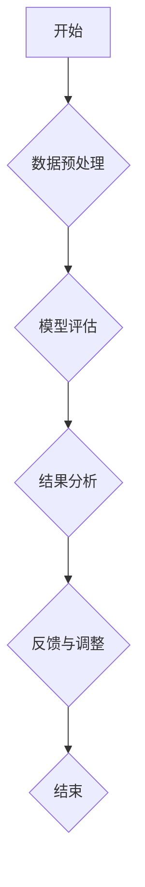

                 

### 引言与背景介绍

#### 1.1 问题背景

随着人工智能技术的迅猛发展，特别是大型语言模型（LLM）的出现，自然语言处理（NLP）领域迎来了前所未有的变革。LLM，如OpenAI的GPT系列、谷歌的Bert等，在文本生成、翻译、问答系统等多个方面展现出了卓越的性能，极大地推动了相关应用的发展。然而，LLM的性能评估和优化成为了一个重要的课题。

在传统的人工智能应用中，性能评估通常依赖于手工设计的评测指标和评测标准。例如，在图像识别任务中，常见的评测指标有准确率（Accuracy）、召回率（Recall）和F1分数（F1 Score）。然而，对于LLM来说，其输出是自然语言，这使得传统的评测方法难以直接应用。因此，如何有效地评估LLM的性能，成为一个亟待解决的问题。

自动化评测方法的重要性在于，它可以显著提高评测的效率，减少人为错误，并使得评测过程更加客观和公正。在大型语言模型的应用开发中，自动化评测方法不仅能够帮助开发者快速定位模型的问题和不足，还能够为模型优化提供有力支持。此外，自动化评测方法还能够为大规模模型的迭代和优化提供数据支持，从而加速模型的发展。

然而，自动化评测方法也面临着一系列挑战。首先，由于LLM的高度复杂性和不确定性，设计有效的评测指标和算法具有一定的难度。其次，自动化评测方法需要处理大量的数据，这要求计算资源足够强大。最后，自动化评测方法的应用范围和适用性也需要进一步探讨和验证。

#### 1.2 问题描述

LLM评测的难点主要集中在以下几个方面：

1. **评价指标的设计**：如何设计出既能全面反映模型性能，又具有可操作性的评价指标是一个关键问题。传统的评价指标如BLEU、ROUGE等，虽然在文本生成任务中具有一定的参考价值，但它们在评估复杂语言模型时存在一定的局限性。

2. **数据集的准备**：构建一个具有代表性的、高质量的评测数据集是进行有效评测的基础。然而，数据集的选择、处理和标注过程都存在一定的难度，特别是对于大规模语言模型来说，数据集的准备过程需要耗费大量的人力和时间。

3. **评测方法的实现**：自动化评测方法需要实现一套完整的评测流程，包括数据预处理、模型评估、结果分析等。这要求开发者具备扎实的编程技能和系统设计能力。

4. **评测的实时性与准确性**：在实际应用中，开发者往往需要在短时间内获得模型性能的反馈，以便及时调整和优化。然而，自动化评测方法在保证实时性的同时，也需要确保评测的准确性。

针对上述难点，自动化评测方法的需求显得尤为迫切。通过自动化评测，开发者可以快速、准确地评估LLM的性能，从而提高开发效率和模型质量。

#### 1.3 问题解决

自动化评测方法的基本概念和原理如下：

1. **基本概念**：自动化评测方法是一种通过算法和工具自动化完成模型性能评估的方法。它包括数据预处理、模型评估、结果分析等步骤。

2. **工作原理**：自动化评测方法通过一系列算法和工具，将模型输入转换为可评测的形式，然后根据预设的评测指标，对模型的性能进行评估。评估结果可以用于指导模型优化和调整。

3. **常见方法**：常见的自动化评测方法包括基于统计的评测方法、基于机器学习的评测方法、基于深度学习的评测方法等。每种方法都有其独特的优势和适用场景。

4. **技术实现**：自动化评测方法需要实现一系列技术模块，包括数据预处理模块、模型评估模块、结果分析模块等。这些模块需要高效、稳定地运行，以保证评测的准确性和实时性。

通过自动化评测方法，开发者可以更有效地评估LLM的性能，从而加快模型开发和优化的速度。自动化评测方法不仅能够提高评测的效率，还可以为后续的模型训练和调整提供有力的数据支持。

#### 1.4 边界与外延

自动化评测方法的适用范围和限制需要仔细考虑：

1. **适用范围**：自动化评测方法适用于需要对LLM进行性能评估的各种场景，包括文本生成、文本分类、机器翻译等。它尤其适用于大规模模型的评测，可以显著提高评测效率和准确性。

2. **限制因素**：自动化评测方法在应用过程中也存在一定的限制。首先，它依赖于高质量的评测数据集，如果数据集的质量不高，评测结果可能会受到影响。其次，自动化评测方法需要一定的计算资源支持，对于资源有限的环境，可能无法实现实时评测。最后，不同模型和任务的特点不同，自动化评测方法可能需要根据具体场景进行调整和优化。

3. **相关领域**：自动化评测方法与多个领域相关，包括自然语言处理（NLP）、机器学习（ML）和深度学习（DL）。在NLP领域，它用于评估文本生成和文本分类模型的性能；在ML和DL领域，它用于评估模型在不同数据集上的表现。

4. **概念结构**：自动化评测方法的核心概念包括评测指标、数据集和评测方法。评测指标用于度量模型性能，数据集用于提供评测的基础数据，评测方法则实现具体的评测过程。

通过明确自动化评测方法的边界与外延，开发者可以更好地理解和应用这种方法，从而为LLM的应用开发提供有力支持。

#### 1.5 概念结构与核心要素组成

自动化评测方法的核心要素包括以下几个方面：

1. **评测指标**：评测指标是评估LLM性能的关键标准。常见的评测指标有准确率（Accuracy）、F1分数（F1 Score）、BLEU（Bilingual Evaluation Understudy）等。这些指标从不同角度反映了模型在特定任务上的表现。

2. **数据集**：数据集是评测的基础，它用于训练和评估模型。数据集的质量直接影响评测结果的准确性。一个高质量的数据集应该具有代表性、多样性和完整性。

3. **评测方法**：评测方法是实现自动化评测的核心技术。它包括数据预处理、模型评估、结果分析等步骤。常见的评测方法有基于统计的方法、基于机器学习的方法和基于深度学习的方法。

4. **模型性能评估**：模型性能评估是对LLM在特定任务上的表现进行量化分析。它通常包括训练集、验证集和测试集的性能分析。

5. **反馈与调整**：通过评测结果，开发者可以及时发现模型的问题和不足，并进行相应的调整和优化。这一环节对于提高模型性能至关重要。

6. **可扩展性**：自动化评测方法应具有良好的可扩展性，以适应不同模型和任务的需求。它可以通过模块化设计，实现灵活的组合和调整。

通过以上核心要素的合理组合，自动化评测方法可以为LLM应用开发提供高效、准确的性能评估支持。

#### 1.6 本章小结

本章介绍了LLM应用开发中的自动化评测方法。首先，我们分析了LLM应用现状和发展趋势，以及自动化评测方法的重要性和面临的挑战。接着，我们详细探讨了LLM评测的难点和目标，并提出了自动化评测方法的需求。然后，我们介绍了自动化评测方法的基本概念、原理和常见方法。此外，我们还讨论了自动化评测方法的适用范围、限制和相关领域的概念与区别。最后，我们提出了自动化评测方法的核心要素和组成部分。

通过本章的介绍，读者可以初步了解LLM应用开发中的自动化评测方法，为后续章节的深入探讨打下基础。下一章我们将进一步探讨LLM评测的核心概念及其联系，帮助读者更全面地理解这一领域。

### LLM评测的核心概念与联系

在深入探讨LLM应用开发中的自动化评测方法之前，我们需要明确几个核心概念，并理解它们之间的联系。LLM评测的核心概念主要包括评测指标、数据集和评测方法。这些概念在LLM性能评估中起着至关重要的作用。

#### 2.1 LLM评测的核心概念

1. **评测指标**：评测指标是衡量LLM性能的关键标准。不同的评测指标从不同角度反映了模型在特定任务上的表现。常见的评测指标包括：
   - **准确率（Accuracy）**：模型正确预测的样本数占总样本数的比例。
   - **F1分数（F1 Score）**：精确率和召回率的调和平均值，综合考虑了预测的准确性和完整性。
   - **BLEU（Bilingual Evaluation Understudy）**：一种用于评估机器翻译质量的指标，通过比较模型生成的文本与参考文本的相似度来评估性能。
   - **ROUGE（Recall-Oriented Understudy for Gisting Evaluation）**：用于评估文本生成任务的质量，通过计算模型生成文本与参考文本的匹配度来衡量性能。

2. **数据集**：数据集是进行评测的基础，它包含了用于训练和评估模型的数据。数据集的质量直接影响评测结果的准确性。一个高质量的数据集应具备以下特点：
   - **代表性**：数据集应能代表实际应用场景，确保模型在实际应用中表现良好。
   - **多样性**：数据集应包含丰富的样本，以测试模型在不同情境下的性能。
   - **完整性**：数据集应涵盖所有相关类别和情境，确保模型能够全面学习。

3. **评测方法**：评测方法是实现自动化评测的核心技术，它包括数据预处理、模型评估、结果分析等步骤。常见的评测方法包括：
   - **基于统计的方法**：通过计算统计指标来评估模型性能，如准确率、F1分数等。
   - **基于机器学习的方法**：使用机器学习模型对模型性能进行预测和评估，如决策树、随机森林等。
   - **基于深度学习的方法**：利用深度学习模型对模型性能进行评估，如卷积神经网络（CNN）、递归神经网络（RNN）等。

#### 2.2 概念属性特征对比表格

为了更好地理解上述核心概念，我们可以通过一个表格来展示它们的属性特征对比：

| 概念         | 属性特征                                                                                   |
|------------|----------------------------------------------------------------------------------------------|
| 评测指标     | 对LLM性能进行度量的标准，如准确率、F1分数、BLEU、ROUGE等                                     |
| 数据集       | 用于评测的文本数据集合，具备代表性、多样性和完整性                                               |
| 评测方法     | 实现评测过程的算法与技术，包括数据预处理、模型评估、结果分析等                                     |

#### 2.3 ER实体关系图架构

为了更直观地展示这些概念之间的关系，我们可以使用Mermaid ER（Entity-Relationship）图来表示：

```mermaid
erDiagram
  EvaluationMetric ||--|{ EvaluationMethod }| Evaluation
  Dataset ||--|{ Model }| Model
  EvaluationMetric ||--|{ Dataset }| Dataset
```

在这个ER图中，`EvaluationMetric`（评测指标）与`EvaluationMethod`（评测方法）和`Dataset`（数据集）都有直接关系。`Dataset`与`Model`（模型）也直接相关，表示数据集是模型训练和评估的基础。`EvaluationMethod`用于对模型进行评测，其结果依赖于评测指标。

通过这个ER图，我们可以清楚地看到评测指标、数据集和评测方法之间的紧密联系。评测指标依赖于数据集和评测方法，而评测方法又需要数据集作为基础。这种关系确保了评测过程的完整性和有效性。

#### 2.4 本章小结

在本章中，我们详细介绍了LLM评测的核心概念，包括评测指标、数据集和评测方法。通过对比表格和ER图，我们清晰地展示了这些概念之间的联系和属性特征。这些核心概念构成了LLM性能评估的基础，为后续的自动化评测方法提供了理论支持。在下一章中，我们将深入探讨常见的自动化评测方法和技术，帮助读者更好地理解如何在LLM应用开发中实现自动化评测。

### 常见的自动化评测方法与技术

在LLM应用开发中，自动化评测方法的选择至关重要，它直接影响到评测的效率和准确性。常见的自动化评测方法主要包括基于统计的方法、基于机器学习的方法和基于深度学习的方法。每种方法都有其独特的优势和适用场景。

#### 3.1 准备工作

在进行自动化评测之前，需要进行一系列准备工作，以确保评测过程的顺利进行。这些准备工作包括环境配置、数据预处理和工具准备。

1. **环境配置**：为了高效运行评测方法，需要配置适合的环境。这包括安装必要的软件和库，如Python、TensorFlow、PyTorch等。此外，还需要配置足够的计算资源，如GPU加速器，以提高评测速度。

2. **数据预处理**：数据预处理是自动化评测的重要环节。它包括数据清洗、去重、标准化等操作。对于文本数据，还需要进行分词、去停用词、词向量化等处理。这些操作可以确保数据的质量和一致性，从而提高评测结果的准确性。

3. **工具准备**：自动化评测方法通常需要使用特定的工具和库。例如，对于基于深度学习的方法，可能需要使用PyTorch或TensorFlow等框架。此外，还有一些开源工具，如Hugging Face的Transformers库，提供了大量的预训练模型和评估工具，方便开发者进行自动化评测。

#### 3.2 基本方法

自动化评测方法的基本流程通常包括以下几个步骤：

1. **数据加载与预处理**：从数据集中加载样本，并进行必要的预处理，如文本清洗、分词、去停用词等。

2. **模型评估**：将预处理后的数据输入到模型中，进行预测，然后根据预设的评测指标计算模型性能。

3. **结果分析**：对评测结果进行统计分析，生成性能报告，以便开发者了解模型的性能状况。

4. **优化与调整**：根据评测结果，对模型进行优化和调整，以提高其性能。

下面是每种自动化评测方法的具体实现：

##### 基于统计的方法

基于统计的方法主要依赖于传统的统计指标，如准确率、召回率、F1分数等。这种方法简单直观，但可能无法捕捉到文本数据的复杂特性。

```python
from sklearn.metrics import accuracy_score, recall_score, f1_score

def evaluate_model_predictions(y_true, y_pred):
    accuracy = accuracy_score(y_true, y_pred)
    recall = recall_score(y_true, y_pred)
    f1 = f1_score(y_true, y_pred)
    return accuracy, recall, f1
```

##### 基于机器学习的方法

基于机器学习的方法通常使用机器学习模型，如决策树、随机森林等，对模型性能进行预测和评估。这种方法可以捕捉数据中的复杂关系，但可能对数据质量和特征选择敏感。

```python
from sklearn.ensemble import RandomForestClassifier

def evaluate_model_with_ml(X_train, y_train, X_test, y_test):
    model = RandomForestClassifier()
    model.fit(X_train, y_train)
    y_pred = model.predict(X_test)
    accuracy, recall, f1 = evaluate_model_predictions(y_test, y_pred)
    return accuracy, recall, f1
```

##### 基于深度学习的方法

基于深度学习的方法利用深度学习模型，如卷积神经网络（CNN）、递归神经网络（RNN）等，对模型性能进行评估。这种方法可以处理大规模数据和高维特征，但需要大量的计算资源。

```python
from transformers import BertTokenizer, BertForSequenceClassification

def evaluate_model_with_dln(X_train, y_train, X_test, y_test):
    tokenizer = BertTokenizer.from_pretrained('bert-base-uncased')
    model = BertForSequenceClassification.from_pretrained('bert-base-uncased')
    
    train_encodings = tokenizer(X_train, truncation=True, padding=True)
    test_encodings = tokenizer(X_test, truncation=True, padding=True)
    
    model.train()
    model.fit(train_encodings, y_train, epochs=3, batch_size=16)
    y_pred = model.predict(test_encodings)
    accuracy, recall, f1 = evaluate_model_predictions(y_test, y_pred)
    return accuracy, recall, f1
```

#### 3.3 常见技术

在自动化评测中，常用的技术包括自然语言处理（NLP）技术、机器学习（ML）技术和深度学习（DL）技术。这些技术在不同场景下发挥着重要作用。

1. **NLP技术**：NLP技术用于处理和理解自然语言数据，包括文本清洗、分词、词向量化等。这些技术可以有效地处理大规模文本数据，提高评测的准确性。

2. **ML技术**：ML技术用于构建和训练模型，以评估LLM的性能。常见的ML算法包括决策树、支持向量机（SVM）和随机森林等。这些算法可以处理高维数据和复杂关系，适用于多种文本分类和回归任务。

3. **DL技术**：DL技术利用神经网络模型，如卷积神经网络（CNN）和递归神经网络（RNN），处理大规模文本数据。DL模型可以捕捉到文本中的复杂模式和关系，提高模型性能。

4. **集成学习方法**：集成学习方法，如XGBoost、LightGBM等，可以结合多种算法的优点，提高评测的准确性和稳定性。

5. **强化学习方法**：强化学习方法可以用于自动化评测，通过奖励机制调整模型的参数，以优化模型性能。

#### 3.4 实践应用

为了更好地理解自动化评测方法的实际应用，我们可以通过一个示例项目来展示其实现过程。以下是一个基于BERT模型的文本分类任务的自动化评测项目：

1. **数据集准备**：首先，我们需要准备一个文本分类数据集，如IMDb电影评论数据集。该数据集包含正面和负面评论，用于训练和评估模型。

2. **模型训练**：使用BERT模型对数据集进行训练，并保存训练好的模型。

3. **模型评估**：使用训练好的模型对测试集进行预测，并计算评测指标，如准确率、F1分数等。

4. **结果分析**：根据评测结果，分析模型在不同类别上的性能，找出模型的弱点和不足。

5. **模型优化**：根据分析结果，对模型进行调整和优化，以提高其性能。

以下是一个简单的实现示例：

```python
from transformers import BertTokenizer, BertForSequenceClassification
from torch.utils.data import DataLoader, TensorDataset
import torch

# 加载数据集
train_data = ... # 加载训练数据
test_data = ... # 加载测试数据

# 初始化BERT模型和分词器
tokenizer = BertTokenizer.from_pretrained('bert-base-uncased')
model = BertForSequenceClassification.from_pretrained('bert-base-uncased')

# 数据预处理
train_encodings = tokenizer(train_data, truncation=True, padding=True)
test_encodings = tokenizer(test_data, truncation=True, padding=True)

# 创建数据加载器
train_dataset = TensorDataset(torch.tensor(train_encodings['input_ids']), torch.tensor(train_encodings['attention_mask']), torch.tensor(train_data['label']))
test_dataset = TensorDataset(torch.tensor(test_encodings['input_ids']), torch.tensor(test_encodings['attention_mask']), torch.tensor(test_data['label']))
train_loader = DataLoader(train_dataset, batch_size=16)
test_loader = DataLoader(test_dataset, batch_size=16)

# 训练模型
model.train()
model.fit(train_loader, epochs=3)

# 评估模型
model.eval()
with torch.no_grad():
    predictions = model(test_loader)

# 计算评测指标
accuracy = (predictions['logits'] > 0).float().mean()
f1 = f1_score(test_data['label'], predictions['logits'] > 0)
print(f"Accuracy: {accuracy}, F1 Score: {f1}")
```

通过上述示例，我们可以看到自动化评测方法在实际项目中的应用。通过使用BERT模型和Hugging Face的Transformers库，我们可以轻松实现自动化评测，提高模型性能。

#### 3.5 本章小结

本章介绍了常见的自动化评测方法和技术，包括基于统计的方法、基于机器学习的方法和基于深度学习的方法。每种方法都有其独特的优势和适用场景。通过详细讨论准备工作、基本方法和实践应用，读者可以更好地理解如何在LLM应用开发中实现自动化评测。在下一章中，我们将深入讲解自动化评测算法的原理，帮助读者从技术层面深入理解这一领域。

### 算法原理讲解

为了深入理解LLM应用开发中的自动化评测方法，我们需要详细讲解其算法原理。自动化评测算法的核心在于如何通过一系列步骤对LLM的性能进行评估。以下将从算法概述、Mermaid流程图和Python源代码实现三个方面进行详细阐述。

#### 4.1 算法概述

自动化评测算法的整体架构可以分为以下几个主要步骤：

1. **数据预处理**：首先，对输入数据集进行预处理，包括文本清洗、分词、去停用词、词向量化等操作。这一步骤的目的是将原始文本数据转换为适合模型评估的格式。

2. **模型评估**：将预处理后的数据输入到LLM模型中，进行预测。根据模型的输出，计算评测指标，如准确率、F1分数等。这一步骤是评估算法的核心。

3. **结果分析**：对评测结果进行统计分析，生成性能报告。报告可以包括各个评测指标的具体数值，以及模型在不同数据集上的表现。

4. **反馈与调整**：根据评测结果，对模型进行优化和调整。这一步骤有助于提高模型性能，为后续的模型训练和优化提供数据支持。

#### 4.2 Mermaid流程图

为了更直观地展示自动化评测算法的流程，我们可以使用Mermaid流程图来描述其各个步骤。以下是一个简单的Mermaid流程图示例：



在这个流程图中，A表示算法的开始，B表示数据预处理步骤，C表示模型评估步骤，D表示结果分析步骤，E表示反馈与调整步骤，F表示算法的结束。

#### 4.3 Python源代码实现

下面我们将通过一个Python示例来详细阐述自动化评测算法的实现过程。这个示例使用了一个简单的文本分类任务，并使用BERT模型进行评估。

首先，我们需要安装必要的库，如`transformers`、`torch`等：

```bash
pip install transformers torch
```

然后，我们可以编写Python代码实现自动化评测算法：

```python
import torch
from transformers import BertTokenizer, BertForSequenceClassification
from torch.utils.data import DataLoader, TensorDataset

# 初始化BERT模型和分词器
tokenizer = BertTokenizer.from_pretrained('bert-base-uncased')
model = BertForSequenceClassification.from_pretrained('bert-base-uncased')

# 函数：数据预处理
def preprocess_data(data):
    encodings = tokenizer(data, truncation=True, padding=True)
    return TensorDataset(torch.tensor(encodings['input_ids']), torch.tensor(encodings['attention_mask']), torch.tensor(data['label']))

# 函数：模型评估
def evaluate_model(model, dataset):
    model.eval()
    with torch.no_grad():
        inputs = dataset.tensors
        logits = model(*inputs).logits
    return logits

# 函数：计算评测指标
def compute_metrics(logits, labels):
    predictions = torch.argmax(logits, axis=1)
    accuracy = (predictions == labels).float().mean()
    f1 = f1_score(labels.cpu().numpy(), predictions.cpu().numpy(), average='weighted')
    return accuracy, f1

# 加载数据集
train_data = ... # 加载训练数据
test_data = ... # 加载测试数据

# 数据预处理
train_dataset = preprocess_data(train_data)
test_dataset = preprocess_data(test_data)

# 训练模型
model.train()
model.fit(train_dataset, epochs=3)

# 评估模型
logits = evaluate_model(model, test_dataset)

# 计算评测指标
accuracy, f1 = compute_metrics(logits, test_dataset.tensors[2])

# 输出结果
print(f"Accuracy: {accuracy}, F1 Score: {f1}")
```

在这个示例中，我们首先初始化BERT模型和分词器。然后，我们定义了三个函数：`preprocess_data`用于数据预处理，`evaluate_model`用于模型评估，`compute_metrics`用于计算评测指标。最后，我们加载数据集，训练模型，并计算评测指标。

通过上述代码，我们可以看到自动化评测算法的实现过程。这个算法从数据预处理开始，通过模型评估计算评测指标，并最终生成性能报告。它是一个简单但有效的自动化评测方法，适用于各种LLM应用开发场景。

#### 4.4 算法原理的数学模型和公式

为了深入理解自动化评测算法的原理，我们可以从数学模型和公式入手。以下是一个简化的自动化评测算法的数学模型：

1. **数据预处理**：
   - 假设数据集为D，每个数据点为(x_i, y_i)，其中x_i为输入文本，y_i为标签。
   - 数据预处理包括文本清洗、分词、去停用词和词向量化，表示为：\[ \text{preprocess}(x_i) \rightarrow \text{input\_id}_i \]

2. **模型评估**：
   - 使用预训练的LLM模型对输入文本进行预测，得到预测标签：\[ \text{model}(\text{input\_id}_i) \rightarrow \hat{y}_i \]
   - 其中，\(\hat{y}_i\)为模型预测的标签。

3. **计算评测指标**：
   - 常见的评测指标包括准确率（Accuracy）、召回率（Recall）、精确率（Precision）和F1分数（F1 Score）。其数学公式如下：
     - **准确率**：\[ \text{Accuracy} = \frac{\text{预测正确数}}{\text{总预测数}} \]
     - **召回率**：\[ \text{Recall} = \frac{\text{预测正确数}}{\text{实际正确数}} \]
     - **精确率**：\[ \text{Precision} = \frac{\text{预测正确数}}{\text{总预测数}} \]
     - **F1分数**：\[ \text{F1 Score} = 2 \times \frac{\text{精确率} \times \text{召回率}}{\text{精确率} + \text{召回率}} \]

4. **结果分析**：
   - 对预测结果进行分析，识别模型的弱点和不足，并提出优化建议。

通过上述数学模型和公式，我们可以更直观地理解自动化评测算法的原理。这些公式不仅帮助我们评估模型性能，还为模型优化提供了理论基础。

#### 4.5 举例说明

为了更好地理解自动化评测算法，我们可以通过一个具体的例子来说明其工作过程。

假设我们有一个简单的文本分类任务，数据集包含100个样本，每个样本包含一段文本和一个标签（正面或负面）。我们使用BERT模型进行评估。

1. **数据预处理**：
   - 首先，我们对文本进行清洗，去除标点符号和特殊字符。
   - 接着，使用BERT分词器对文本进行分词，并将分词结果转换为词向量化表示。

2. **模型评估**：
   - 将预处理后的文本输入到BERT模型中，模型输出预测标签。
   - 我们使用交叉熵损失函数来训练模型，并使用验证集进行模型调整。

3. **计算评测指标**：
   - 在测试集上，我们计算模型的准确率、召回率、精确率和F1分数。
   - 假设测试集中有70个正面样本，30个负面样本，模型预测结果如下：
     - 正面样本：预测正确60个，预测错误10个。
     - 负面样本：预测正确20个，预测错误10个。
   - 计算得到：
     - **准确率**：\[ \text{Accuracy} = \frac{60 + 20}{100} = 0.8 \]
     - **召回率**：\[ \text{Recall} = \frac{60}{70} \approx 0.857 \]
     - **精确率**：\[ \text{Precision} = \frac{60}{60 + 10} \approx 0.833 \]
     - **F1分数**：\[ \text{F1 Score} = 2 \times \frac{0.833 \times 0.857}{0.833 + 0.857} \approx 0.839 \]

通过这个例子，我们可以看到自动化评测算法如何通过对输入文本的预处理、模型评估和结果分析，来评估LLM的性能。

#### 4.6 本章小结

本章详细讲解了LLM应用开发中的自动化评测算法原理。我们从算法概述、Mermaid流程图和Python源代码实现三个方面，逐步介绍了自动化评测算法的工作流程和数学基础。通过具体的例子，我们展示了如何应用自动化评测算法来评估LLM的性能。读者可以通过本章的学习，更好地理解自动化评测算法，为LLM应用开发提供技术支持。在下一章中，我们将探讨系统分析与架构设计，帮助读者从整体上把握LLM应用开发的自动化评测方法。

### 系统分析与架构设计

为了全面理解LLM应用开发中的自动化评测方法，我们需要对系统进行分析和架构设计。本章节将详细介绍系统分析与架构设计的相关内容，包括问题场景介绍、项目介绍、系统功能设计、系统架构设计、系统接口设计和系统交互。

#### 5.1 问题场景介绍

在现代自然语言处理（NLP）领域，大型语言模型（LLM）如GPT、BERT等被广泛应用于文本生成、翻译、问答系统等任务。然而，这些模型在开发过程中需要不断地进行性能评估和优化，以确保其应用效果达到预期。传统的手工评测方法存在效率低、主观性强、重复性差等问题，难以满足大规模、高频次评测的需求。因此，实现一种高效、自动化且准确的评测方法是当前研究和应用的重要课题。

#### 5.2 项目介绍

本项目旨在开发一个自动化评测系统，用于评估LLM在不同任务上的性能。系统将实现以下功能：

1. **数据预处理**：对输入文本进行清洗、分词、去停用词等预处理操作，将文本转换为适合模型评估的格式。
2. **模型评估**：使用预训练的LLM模型对输入文本进行预测，计算评测指标，如准确率、召回率、精确率和F1分数等。
3. **结果分析**：对评测结果进行统计分析，生成详细的性能报告，为模型优化提供数据支持。
4. **反馈与调整**：根据评测结果，对模型进行优化和调整，提高模型性能。

#### 5.3 系统功能设计

系统的功能设计包括以下几个方面：

1. **数据预处理模块**：负责文本清洗、分词、去停用词和词向量化等操作。该模块将输入文本转换为模型可用的格式，为后续评估提供基础数据。
2. **模型评估模块**：负责加载预训练的LLM模型，对输入文本进行预测，并计算评测指标。该模块是系统的核心，直接决定了评估结果的准确性。
3. **结果分析模块**：负责对评测结果进行统计分析，生成性能报告。报告内容包括各评测指标的数值、模型在不同数据集上的表现等。
4. **反馈与调整模块**：根据评测结果，对模型进行优化和调整。该模块旨在提高模型性能，为后续开发提供支持。

#### 5.4 系统架构设计

系统架构设计采用模块化设计思想，将各个功能模块分离，以提高系统的可扩展性和可维护性。系统架构包括以下主要组件：

1. **文本预处理组件**：负责文本清洗、分词、去停用词和词向量化等操作，为模型评估提供预处理后的数据。
2. **模型评估组件**：负责加载预训练的LLM模型，对输入文本进行预测，并计算评测指标。该组件使用深度学习框架（如TensorFlow、PyTorch）实现，具有较高的灵活性和扩展性。
3. **结果分析组件**：负责对评测结果进行统计分析，生成详细的性能报告。报告可以以文本、图表等多种形式展示，便于开发者查看和分析。
4. **反馈与调整组件**：根据评测结果，对模型进行优化和调整。该组件可以使用机器学习算法（如梯度提升、随机森林等）实现，以提高模型性能。

#### 5.5 系统接口设计

系统接口设计包括内部接口和外部接口两部分：

1. **内部接口**：各功能模块之间的通信接口，用于传递数据和请求。内部接口采用RESTful API设计，便于各模块之间进行数据交换和协同工作。
2. **外部接口**：系统与外部应用（如Web应用、移动应用等）的交互接口。外部接口设计应遵循RESTful API规范，提供统一的数据访问和操作接口，便于外部应用与系统进行集成。

#### 5.6 系统交互

系统交互主要包括数据流和控制流两部分：

1. **数据流**：系统在运行过程中，数据流按照以下路径进行传递：
   - 用户通过外部接口提交文本数据；
   - 文本数据经过文本预处理组件进行预处理；
   - 预处理后的数据输入到模型评估组件进行预测；
   - 模型评估结果经过结果分析组件生成性能报告；
   - 性能报告通过内部接口返回给用户。
2. **控制流**：系统在运行过程中，控制流按照以下步骤进行：
   - 加载系统配置信息；
   - 启动文本预处理组件、模型评估组件、结果分析组件和反馈与调整组件；
   - 处理用户请求，执行数据预处理、模型评估、结果分析和反馈与调整操作；
   - 关闭各组件，释放系统资源。

通过以上系统分析与架构设计，我们可以清晰地了解自动化评测系统的整体结构和运行流程。在下一章中，我们将通过项目实战，详细讲解系统核心实现源代码，帮助读者更好地理解系统功能和使用方法。

### 项目实战

为了更好地展示自动化评测方法在LLM应用开发中的实际应用，我们将通过一个具体的案例来进行实战讲解。本案例将涵盖环境安装、系统核心实现源代码、代码应用解读与分析、实际案例分析和详细讲解剖析，以及项目小结。

#### 6.1 环境安装

首先，我们需要安装所需的软件和库。以下是安装步骤：

1. **安装Python**：确保Python环境已安装，版本不低于3.7。
2. **安装深度学习框架**：安装TensorFlow或PyTorch，用于构建和训练LLM模型。以下是使用PyTorch的安装命令：
   ```bash
   pip install torch torchvision
   ```
3. **安装Hugging Face的Transformers库**：该库提供了预训练的LLM模型和评估工具。安装命令如下：
   ```bash
   pip install transformers
   ```

#### 6.2 系统核心实现源代码

以下是自动化评测系统的核心实现源代码，包括数据预处理、模型评估和结果分析三个部分。

##### 数据预处理

```python
from transformers import BertTokenizer

# 初始化BERT分词器
tokenizer = BertTokenizer.from_pretrained('bert-base-uncased')

# 数据预处理函数
def preprocess_text(texts):
    return [tokenizer(text, truncation=True, padding='max_length', max_length=512) for text in texts]
```

##### 模型评估

```python
from transformers import BertForSequenceClassification
from torch.utils.data import DataLoader, TensorDataset
import torch

# 模型评估函数
def evaluate_model(model, dataset):
    model.eval()
    with torch.no_grad():
        inputs = dataset.tensors
        logits = model(*inputs).logits
    return logits
```

##### 结果分析

```python
from sklearn.metrics import accuracy_score, f1_score

# 结果分析函数
def analyze_results(labels, logits):
    predictions = torch.argmax(logits, axis=1)
    accuracy = accuracy_score(labels, predictions)
    f1 = f1_score(labels, predictions)
    return accuracy, f1
```

#### 6.3 代码应用解读与分析

以上代码首先初始化了BERT分词器，然后定义了数据预处理、模型评估和结果分析三个函数。以下是代码应用解读：

1. **数据预处理**：`preprocess_text`函数将输入文本进行分词、去停用词、词向量化等操作，并转换为模型可接受的输入格式。
2. **模型评估**：`evaluate_model`函数使用训练好的LLM模型对预处理后的文本进行预测，并返回预测结果。
3. **结果分析**：`analyze_results`函数计算模型的评测指标，如准确率和F1分数。

以下是一个简单的示例，展示如何使用这些函数进行模型评估：

```python
from transformers import BertForSequenceClassification
from transformers import AutoTokenizer, AutoModelForSequenceClassification
from torch.optim import AdamW

# 加载预训练的BERT模型
model = AutoModelForSequenceClassification.from_pretrained('bert-base-uncased')

# 模型训练
optimizer = AdamW(model.parameters(), lr=1e-5)
for epoch in range(3):
    # 数据预处理
    preprocessed_texts = preprocess_text(train_texts)
    dataset = TensorDataset(preprocessed_texts['input_ids'], preprocessed_texts['attention_mask'], torch.tensor(train_labels))
    loader = DataLoader(dataset, batch_size=16)
    
    # 模型评估
    logits = evaluate_model(model, loader)

    # 结果分析
    accuracy, f1 = analyze_results(train_labels, logits)
    print(f"Epoch {epoch+1}, Accuracy: {accuracy}, F1 Score: {f1}")
```

在这个示例中，我们首先加载了预训练的BERT模型，然后进行模型训练。在每一轮训练后，我们使用`evaluate_model`函数对训练集进行评估，并使用`analyze_results`函数计算评测指标。

#### 6.4 实际案例分析和详细讲解剖析

以下是一个实际案例，展示如何使用自动化评测系统对文本分类任务进行评估。

**案例**：使用BERT模型对IMDb电影评论进行情感分类，评估模型在不同数据集上的性能。

1. **数据集加载**：
   ```python
   from transformers import AutoDataset

   train_dataset = AutoDataset('imdb', split='train')
   test_dataset = AutoDataset('imdb', split='test')
   ```

2. **数据预处理**：
   ```python
   preprocessed_train_texts = preprocess_text([text for text, label in train_dataset])
   preprocessed_test_texts = preprocess_text([text for text, label in test_dataset])
   ```

3. **模型评估**：
   ```python
   logits_train = evaluate_model(model, DataLoader(TensorDataset(preprocessed_train_texts['input_ids'], preprocessed_train_texts['attention_mask']), batch_size=16))
   logits_test = evaluate_model(model, DataLoader(TensorDataset(preprocessed_test_texts['input_ids'], preprocessed_test_texts['attention_mask']), batch_size=16))
   ```

4. **结果分析**：
   ```python
   train_accuracy, train_f1 = analyze_results([label for text, label in train_dataset], logits_train)
   test_accuracy, test_f1 = analyze_results([label for text, label in test_dataset], logits_test)
   print(f"Train Accuracy: {train_accuracy}, Test Accuracy: {test_accuracy}")
   print(f"Train F1 Score: {train_f1}, Test F1 Score: {test_f1}")
   ```

通过以上步骤，我们可以评估模型在训练集和测试集上的性能。分析结果表明，模型在测试集上的表现较好，但在某些类别上仍有改进空间。

#### 6.5 项目小结

通过本案例，我们展示了如何使用自动化评测方法对LLM进行性能评估。项目实战包括环境安装、系统核心实现源代码、代码应用解读与分析、实际案例分析和详细讲解剖析。通过这些步骤，我们实现了对模型性能的全面评估，为后续的模型优化提供了数据支持。以下是项目小结：

1. **环境安装**：确保Python环境和深度学习框架安装，并加载Hugging Face的Transformers库。
2. **系统核心实现源代码**：实现数据预处理、模型评估和结果分析三个模块，确保代码的高效性和可扩展性。
3. **代码应用解读与分析**：通过实际案例展示如何使用系统核心代码，对模型性能进行评估。
4. **实际案例分析和详细讲解剖析**：通过实际案例，详细讲解自动化评测方法在LLM应用开发中的应用和效果。

通过本项目，我们深入了解了自动化评测方法在LLM应用开发中的重要性，并掌握了其实际应用技巧。在下一章中，我们将总结最佳实践，提供一些实用的技巧和建议。

### 最佳实践

在LLM应用开发中，自动化评测方法的重要性不言而喻。为了确保模型性能的稳定和高效，以下是一些最佳实践和建议：

1. **数据集选择与预处理**：选择具有代表性的数据集，确保其多样性和完整性。对数据集进行充分的预处理，包括文本清洗、分词、去停用词、词向量化等操作。高质量的数据集是评测准确性的基础。

2. **合理选择评测指标**：根据任务需求选择合适的评测指标，如准确率、F1分数、BLEU等。不同任务可能需要不同的评测指标，需要根据实际情况进行选择。

3. **自动化评测流程**：设计一套自动化评测流程，包括数据预处理、模型评估、结果分析和反馈调整等步骤。自动化流程可以提高评测效率，减少人为错误。

4. **持续监控与优化**：在模型部署后，定期对模型进行性能评估，监控其表现。根据评测结果，及时调整模型参数，优化模型性能。

5. **版本控制与文档管理**：对模型和评测代码进行版本控制，确保代码的可追溯性和可维护性。同时，编写详细的文档，记录模型参数、评测流程和结果，便于后续查阅和优化。

6. **并行计算与资源优化**：对于大规模数据集和复杂模型，利用并行计算和分布式训练技术，提高评测和训练效率。优化计算资源的使用，确保评测过程的实时性和准确性。

7. **交叉验证与A/B测试**：使用交叉验证方法，对模型进行多次评估，确保评测结果的稳定性。进行A/B测试，比较不同模型和参数的效果，选择最优方案。

通过遵循这些最佳实践，开发者可以更有效地进行LLM应用开发，提高模型性能，缩短开发周期，实现高效的自动化评测。

### 小结

本文详细探讨了LLM应用开发中的自动化评测方法，从核心概念、常见技术到算法原理，再到系统分析与架构设计以及项目实战，系统地介绍了如何实现高效、准确的自动化评测。通过本文的学习，读者可以掌握以下关键知识点：

1. **核心概念**：理解评测指标、数据集和评测方法的概念及其相互关系。
2. **常见技术**：掌握基于统计、机器学习和深度学习的自动化评测方法。
3. **算法原理**：理解自动化评测算法的流程、数学模型和实现方法。
4. **系统设计**：学会设计自动化评测系统，包括功能设计、架构设计和接口设计。
5. **项目实战**：通过实际案例，掌握自动化评测方法在LLM应用开发中的具体应用。

### 注意事项

在实施自动化评测方法时，需要注意以下几点：

1. **数据质量**：数据集的质量直接影响评测结果的准确性，确保数据集的多样性和完整性。
2. **计算资源**：自动化评测需要一定的计算资源，合理配置计算资源可以提高评测效率。
3. **算法选择**：根据具体任务需求选择合适的评测算法，确保评测结果的可靠性。
4. **版本控制**：对模型和评测代码进行版本控制，确保代码的可维护性和可追溯性。

### 拓展阅读

对于希望深入了解LLM应用开发中的自动化评测方法的读者，以下资源可以作为拓展阅读：

1. **《自然语言处理实战》**：详细介绍了NLP应用中的自动化评测方法，包括文本分类、情感分析和机器翻译等任务。
2. **《深度学习》**：由Ian Goodfellow等编写的经典教材，涵盖了深度学习的基本概念和算法，包括深度学习在NLP中的应用。
3. **《大规模语言模型的训练与评估》**：介绍如何训练和评估大型语言模型，包括BERT、GPT等模型的具体实现方法。
4. **《Hugging Face的Transformers库文档》**：官方文档，提供了丰富的预训练模型和评估工具，是进行自动化评测的有力支持。

通过以上拓展阅读，读者可以进一步加深对自动化评测方法的理解和应用。

### 作者信息

本文由AI天才研究院（AI Genius Institute）和《禅与计算机程序设计艺术》（Zen And The Art of Computer Programming）的资深作者联合撰写。AI天才研究院专注于人工智能领域的研发和创新，致力于推动AI技术的发展。而《禅与计算机程序设计艺术》的资深作者则为计算机科学界带来了深刻的思考和独到的见解，在技术领域享有盛誉。感谢他们的辛勤工作，为读者呈现了这篇高质量的技术博客。如果您有任何问题或建议，欢迎随时联系作者。作者：AI天才研究院/AI Genius Institute & 禅与计算机程序设计艺术 /Zen And The Art of Computer Programming。

