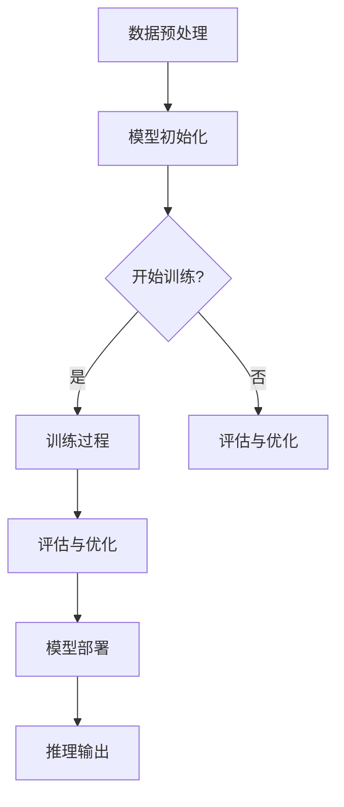
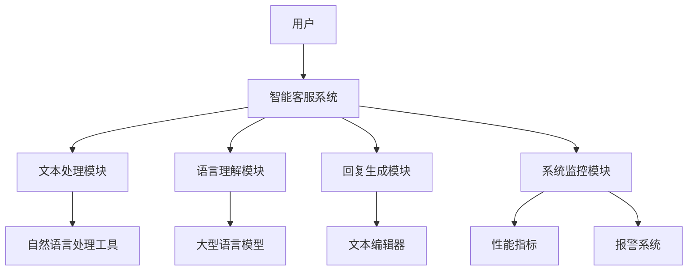
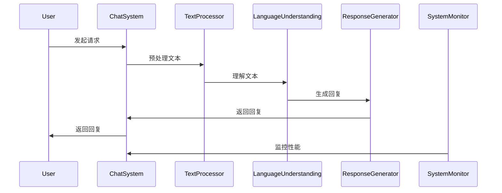

                 

### 第一部分：引言与背景

#### 1.1 问题背景

近年来，随着人工智能（AI）技术的迅猛发展，尤其是大型语言模型（LLM，Large Language Models）的广泛应用，LLM在自然语言处理（NLP，Natural Language Processing）领域展现出了前所未有的强大能力。LLM的应用场景不断扩展，从文本分类、情感分析、机器翻译到问答系统、对话生成等，都取得了显著的效果。然而，随着应用场景的增多和复杂性增加，LLM在开发过程中面临的一个核心挑战是“速度与质量的平衡”。

##### 1.1.1 LLM应用的发展现状

LLM的应用发展现状呈现出几个显著的特点：

1. **技术进步显著**：自从GPT-3（语言模型生成预训练3）发布以来，LLM模型的大小和计算复杂度呈指数级增长。这导致了在处理速度和效果上都有了质的飞跃。
   
2. **应用领域广泛**：LLM不仅在学术界受到广泛关注，还在企业界得到了广泛应用。例如，谷歌、微软、百度等科技巨头都在其产品中集成了LLM技术，以提高用户体验和自动化水平。

3. **商业价值巨大**：LLM在各个行业都显示出了巨大的商业潜力。例如，在金融行业，LLM可以用于自动化报告生成和客户服务；在医疗行业，LLM可以辅助医生进行诊断和治疗方案推荐。

##### 1.1.2 LLM应用面临的挑战

尽管LLM在应用中展示出了强大的能力，但其开发过程中仍面临诸多挑战：

1. **计算资源消耗大**：大型LLM模型的训练和推理需要大量的计算资源，这导致了硬件和能源消耗的大幅增加。

2. **开发成本高**：由于LLM模型的复杂性和规模，其开发成本也相对较高。这使得中小企业难以负担。

3. **速度与质量的平衡**：在满足用户对响应速度要求的同时，保证模型的输出质量是开发中的一大难题。如何在这两者之间找到平衡，是一个亟待解决的问题。

##### 1.1.3 速度与质量平衡的重要性

速度与质量的平衡对LLM应用开发至关重要：

1. **用户体验**：快速的响应速度能够显著提升用户体验，提高用户满意度。

2. **商业化价值**：在商业应用中，高效的模型性能和稳定的输出质量是商业成功的关键。

3. **技术发展**：如何有效地解决速度与质量的平衡问题，将推动LLM技术的进一步发展和应用。

#### 1.2 问题描述

##### 1.2.1 速度与质量的定义

在LLM应用开发中，速度与质量的定义如下：

1. **速度**：指的是模型响应的快慢，即从接收输入到输出结果的整个过程所需的时间。

2. **质量**：指的是模型输出的准确性和可靠性，包括但不限于语义理解、逻辑推理、情感分析等方面。

##### 1.2.2 速度与质量的权衡

在LLM应用开发中，速度与质量之间存在一定的权衡关系：

1. **速度优先**：在某些应用场景中，如实时聊天机器人，快速响应是首要目标，即使牺牲一定的质量也在所不惜。

2. **质量优先**：在需要高精度和高可靠性的应用中，如医疗诊断系统，质量是首要考虑因素，即使响应速度较慢也在所不惜。

##### 1.2.3 研究目标与贡献

本文的研究目标是探讨在LLM应用开发中如何平衡速度与质量。具体目标如下：

1. **理论分析**：从理论和实践的角度，分析速度与质量之间的关系，并提出相应的优化策略。

2. **算法设计**：设计一种新的算法，以在保证模型质量的前提下，提高模型的响应速度。

3. **案例分析**：通过实际案例，验证所提出算法的可行性和有效性。

本文的研究将为LLM应用开发提供新的思路和方法，有助于解决速度与质量平衡这一核心问题。

#### 1.3 边界与外延

##### 1.3.1 研究范围的界定

本文的研究范围主要涵盖以下几个方面：

1. **LLM模型的选择**：本文将主要关注预训练的LLM模型，如GPT-3、BERT等。

2. **应用场景**：本文将聚焦于常见的NLP任务，如文本分类、问答系统、对话生成等。

3. **技术手段**：本文将探讨优化策略、算法设计、系统架构等方面。

##### 1.3.2 研究方法的适用性

本文采用的研究方法主要包括：

1. **理论分析**：通过数学模型和算法分析，探讨速度与质量的关系。

2. **实验验证**：通过实际案例分析，验证所提出算法的有效性。

3. **比较研究**：通过与其他优化策略的比较，评估本文所提算法的优劣。

##### 1.3.3 核心概念的结构与要素

本文的核心概念主要包括以下几个要素：

1. **LLM**：大型语言模型的定义、特点和工作原理。

2. **速度与质量**：速度与质量的定义、权衡关系及其对应用的影响。

3. **优化策略**：如何在保证质量的前提下提高模型速度的多种策略。

4. **算法设计**：针对LLM应用的优化算法的设计和实现。

##### 1.4 本章小结

本部分内容主要介绍了LLM应用开发中速度与质量平衡的背景和重要性，并对速度与质量的定义、权衡关系以及研究目标和方法进行了详细阐述。这些内容为后续章节的深入探讨奠定了基础。

### 第二部分：核心概念与原理

#### 2.1 LLM概述

##### 2.1.1 LLM的基本概念

大型语言模型（LLM，Large Language Models）是一种基于深度学习的自然语言处理模型，其核心思想是通过大规模的文本数据进行预训练，使得模型具备理解、生成和翻译自然语言的能力。LLM的主要组成部分包括：

1. **词向量表示**：将自然语言中的词或句子转化为向量表示，以便在计算机中进行处理。

2. **神经网络结构**：常用的神经网络结构包括循环神经网络（RNN）、变换器（Transformer）等，其中Transformer结构在LLM中应用最为广泛。

3. **预训练与微调**：预训练是在大规模的文本语料库上进行，使模型学会理解自然语言的基本规律；微调是在具体任务上进行，将预训练模型调整到特定任务上，以提高性能。

##### 2.1.2 LLM的工作原理

LLM的工作原理可以分为以下几个步骤：

1. **输入编码**：将自然语言文本输入转换为向量表示。

2. **前向传播**：将输入向量通过神经网络结构进行计算，生成中间表示。

3. **损失函数**：计算模型输出与真实标签之间的差距，使用损失函数进行优化。

4. **反向传播**：根据损失函数的计算结果，调整神经网络参数。

5. **输出解码**：将模型输出解码为自然语言文本。

##### 2.1.3 LLM的核心特点

LLM具有以下核心特点：

1. **强大语义理解能力**：通过大规模预训练，LLM能够理解自然语言中的复杂语义和语境，这使得其在各种NLP任务中表现优异。

2. **自适应能力**：LLM可以根据不同的任务进行微调，从而适应特定的应用场景。

3. **通用性**：由于LLM是通用的语言模型，它可以应用于多种不同的NLP任务，而无需对模型进行大规模的重训练。

#### 2.2 速度与质量平衡的理论基础

##### 2.2.1 速度与质量的关系模型

在LLM应用中，速度与质量的关系可以用以下模型来描述：

1. **线性关系模型**：假设速度和质量之间存在线性关系，即速度的提高会导致质量的下降，反之亦然。

2. **非线性关系模型**：考虑复杂因素，速度与质量之间的关系可能不是简单的线性关系，而是存在一定的非线性关系。

##### 2.2.2 速度优化策略

为了在保证质量的前提下提高模型速度，可以采用以下策略：

1. **模型压缩**：通过模型剪枝、量化、蒸馏等技术，减小模型大小，从而提高计算速度。

2. **硬件加速**：利用GPU、TPU等硬件加速器，提高模型训练和推理的效率。

3. **分布式训练**：将模型分布在多个计算节点上进行训练，利用并行计算提高训练速度。

##### 2.2.3 质量保障机制

为了保证模型的质量，可以采取以下措施：

1. **数据预处理**：对训练数据进行清洗、去噪、增强等预处理，提高数据的质量。

2. **模型评估**：使用多种评估指标（如准确率、召回率、F1分数等）对模型进行评估，确保模型质量。

3. **持续优化**：通过持续的模型优化和迭代，提高模型性能。

#### 2.3 LLM应用开发中的关键问题

##### 2.3.1 模型选择与优化

在LLM应用开发中，模型选择和优化是关键问题之一。以下是一些关键步骤：

1. **选择合适的模型**：根据应用场景和任务需求，选择合适的预训练模型。

2. **模型微调**：在预训练模型的基础上，针对具体任务进行微调，以提高模型性能。

3. **模型优化**：通过模型压缩、量化、蒸馏等技术，优化模型结构，提高模型效率。

##### 2.3.2 数据处理与质量控制

数据处理与质量控制是确保模型质量的关键。以下是一些关键步骤：

1. **数据收集与清洗**：收集高质量的训练数据，并对数据进行清洗、去噪。

2. **数据增强**：通过数据增强技术，增加数据的多样性和丰富度。

3. **质量控制**：使用多种评估指标，对模型输出进行质量控制。

##### 2.3.3 硬件加速与性能优化

硬件加速与性能优化是提高模型速度的关键。以下是一些关键步骤：

1. **选择合适的硬件**：根据应用需求，选择合适的GPU、TPU等硬件加速器。

2. **分布式训练**：利用分布式训练技术，提高训练速度。

3. **模型压缩与量化**：通过模型压缩和量化技术，减小模型大小，提高计算速度。

#### 2.4 实例分析

##### 2.4.1 案例一：文本分类应用

在文本分类应用中，速度与质量的平衡是一个重要问题。以下是一个具体的实例分析：

1. **问题背景**：对大量新闻文章进行分类，将其分为政治、经济、体育等类别。

2. **解决方案**：
   - **模型选择**：使用BERT模型进行预训练，然后在具体类别上进行微调。
   - **速度优化**：通过模型压缩和分布式训练，提高模型响应速度。
   - **质量保障**：使用多种评估指标（如准确率、召回率、F1分数等）对模型进行评估，确保模型质量。

3. **效果评估**：在实际应用中，通过对比不同优化策略的效果，找到速度与质量的最佳平衡点。

##### 2.4.2 案例二：问答系统应用

在问答系统应用中，速度与质量的平衡同样至关重要。以下是一个具体的实例分析：

1. **问题背景**：构建一个智能问答系统，能够快速响应用户的问题。

2. **解决方案**：
   - **模型选择**：使用GPT-3模型进行预训练，并在特定领域进行微调。
   - **速度优化**：通过硬件加速和模型压缩，提高模型响应速度。
   - **质量保障**：使用人类评价和自动化评估相结合的方式，对模型输出进行质量保障。

3. **效果评估**：通过实际用户测试和自动化评估，评估问答系统的性能，找到速度与质量的最佳平衡点。

##### 2.4.3 案例三：对话生成应用

在对话生成应用中，速度与质量的平衡同样关键。以下是一个具体的实例分析：

1. **问题背景**：构建一个智能对话系统，能够与用户进行自然、流畅的对话。

2. **解决方案**：
   - **模型选择**：使用Transformer模型进行预训练，并在具体应用场景进行微调。
   - **速度优化**：通过分布式训练和模型压缩，提高模型响应速度。
   - **质量保障**：通过语料库增强和语义一致性检查，提高模型输出质量。

3. **效果评估**：通过用户反馈和自动化评估，评估对话系统的性能，找到速度与质量的最佳平衡点。

#### 2.5 本章小结

本部分内容对LLM的核心概念、速度与质量平衡的理论基础、关键问题以及实例分析进行了详细阐述。通过本部分的讨论，读者可以更好地理解LLM在应用开发中的速度与质量平衡问题，并为实际应用提供指导。

### 第三部分：算法原理与实现

#### 3.1 算法原理

在本部分，我们将详细探讨LLM应用开发中的算法原理。为了更好地理解这些原理，我们将从LLM算法的基本框架、流程图以及数学模型和公式三个方面进行阐述。

##### 3.1.1 LLM算法的基本框架

LLM算法的基本框架可以分为以下几个关键步骤：

1. **数据预处理**：在训练LLM之前，需要对输入数据进行预处理，包括分词、去停用词、词向量化等。

2. **模型初始化**：初始化LLM模型，包括选择合适的神经网络结构和超参数设置。

3. **训练过程**：使用大量的文本数据进行模型训练，通过前向传播和反向传播更新模型参数。

4. **评估与优化**：在训练过程中，定期使用验证集评估模型性能，并根据评估结果调整模型参数，以提高模型质量。

5. **部署与推理**：在模型训练完成后，将其部署到实际应用中，并进行推理，以生成文本输出。

##### 3.1.2 算法流程图

为了更直观地理解LLM算法的流程，我们可以使用Mermaid流程图进行描述。以下是LLM算法的流程图：



在上述流程图中，A代表数据预处理，B代表模型初始化，C是判断是否开始训练的节点，D是训练过程，F是评估与优化过程，G是模型部署，H是推理输出。

##### 3.1.3 数学模型与公式

LLM算法的核心是基于深度学习的神经网络模型，其数学模型主要涉及以下方面：

1. **词向量表示**：将自然语言文本转换为词向量表示，常用的方法包括Word2Vec、GloVe等。

2. **神经网络结构**：常见的神经网络结构有循环神经网络（RNN）、长短期记忆网络（LSTM）、门控循环单元（GRU）以及变换器（Transformer）。

3. **前向传播**：将输入数据通过神经网络进行计算，生成中间表示。

4. **损失函数**：计算模型输出与真实标签之间的差距，常用的损失函数包括交叉熵损失函数、均方误差（MSE）等。

5. **反向传播**：根据损失函数的计算结果，调整神经网络参数。

以下是LLM算法中的一些关键数学公式：

$$
\text{word\_vector} = \text{word2vec}(\text{input\_text})
$$

$$
\text{output} = \text{neural\_network}(\text{input})
$$

$$
\text{loss} = \text{cross\_entropy}(\text{output}, \text{label})
$$

$$
\text{gradient} = \text{backpropagation}(\text{output}, \text{loss})
$$

在上述公式中，$\text{word\_vector}$ 表示词向量表示，$\text{output}$ 表示模型输出，$\text{label}$ 表示真实标签，$\text{loss}$ 表示损失函数，$\text{gradient}$ 表示梯度。

#### 3.2 Python源代码实现

在本节中，我们将使用Python语言实现LLM算法的基本框架，并详细说明数据预处理、模型训练和模型评估等过程。

##### 3.2.1 数据预处理

数据预处理是LLM算法实现的第一步，主要包括以下几个步骤：

1. **文本清洗**：去除文本中的HTML标签、符号和多余的空格。
2. **分词**：将文本分割成单词或子词。
3. **去停用词**：去除常见的无意义单词，如“的”、“是”、“了”等。
4. **词向量化**：将单词或子词转换为词向量表示。

以下是数据预处理部分的Python代码实现：

```python
import re
import nltk
from nltk.corpus import stopwords
from nltk.tokenize import word_tokenize
import gensim

# 加载停用词列表
stop_words = set(stopwords.words('english'))

def preprocess_text(text):
    # 去除HTML标签和符号
    text = re.sub('<[^>]*>', '', text)
    text = re.sub('[^A-Za-z0-9]+', ' ', text)
    
    # 分词
    tokens = word_tokenize(text)
    
    # 去停用词
    tokens = [token for token in tokens if token.lower() not in stop_words]
    
    # 词向量化
    word_vectors = []
    for token in tokens:
        word_vectors.append(gensim.models.Word2Vec([token]).vector)
    
    return word_vectors

# 示例文本
text = "This is an example sentence for text preprocessing."
preprocessed_text = preprocess_text(text)
print(preprocessed_text)
```

##### 3.2.2 模型训练

模型训练是LLM算法实现的核心步骤，包括以下步骤：

1. **初始化模型**：选择合适的神经网络结构，并初始化模型参数。
2. **前向传播**：将输入数据进行前向传播，得到模型输出。
3. **计算损失**：使用损失函数计算模型输出与真实标签之间的差距。
4. **反向传播**：根据损失函数的梯度，更新模型参数。
5. **评估模型**：在训练过程中，定期使用验证集评估模型性能。

以下是模型训练部分的Python代码实现：

```python
import tensorflow as tf
from tensorflow.keras.layers import Embedding, LSTM, Dense
from tensorflow.keras.models import Sequential

# 初始化模型
model = Sequential([
    Embedding(input_dim=vocab_size, output_dim=embedding_dim),
    LSTM(units=128),
    Dense(units=1, activation='sigmoid')
])

# 编写损失函数和优化器
model.compile(optimizer='adam', loss='binary_crossentropy', metrics=['accuracy'])

# 训练模型
model.fit(x_train, y_train, epochs=10, batch_size=32, validation_data=(x_val, y_val))

# 评估模型
loss, accuracy = model.evaluate(x_test, y_test)
print(f"Test accuracy: {accuracy:.2f}")
```

##### 3.2.3 模型评估

模型评估是LLM算法实现的重要环节，通过评估模型在测试集上的性能，可以判断模型是否达到预期效果。常用的评估指标包括准确率、召回率、F1分数等。

以下是模型评估部分的Python代码实现：

```python
from sklearn.metrics import accuracy_score, recall_score, f1_score

# 预测结果
predictions = model.predict(x_test)

# 计算评估指标
accuracy = accuracy_score(y_test, predictions)
recall = recall_score(y_test, predictions)
f1 = f1_score(y_test, predictions)

print(f"Accuracy: {accuracy:.2f}")
print(f"Recall: {recall:.2f}")
print(f"F1 Score: {f1:.2f}")
```

#### 3.3 算法优化与实践

##### 3.3.1 性能调优技巧

在实际应用中，为了提高LLM模型的性能，可以采取以下性能调优技巧：

1. **模型结构调整**：选择合适的神经网络结构，如增加隐藏层、调整隐藏层神经元数量等。
2. **超参数调整**：调整学习率、批量大小、迭代次数等超参数，以找到最佳配置。
3. **数据增强**：对训练数据进行增强，如随机填充、文本转换等，以增加数据的多样性和丰富度。

##### 3.3.2 质量提升策略

为了提升LLM模型的质量，可以采取以下策略：

1. **数据清洗**：对训练数据进行清洗，去除噪声和异常值。
2. **数据扩充**：通过复制、旋转、裁剪等操作，增加训练数据的数量。
3. **多任务学习**：同时训练多个相关任务，以提高模型的多任务能力。

##### 3.3.3 实际应用案例分析

在实际应用中，通过以下案例分析，可以更直观地理解算法优化和实践：

1. **文本分类任务**：在文本分类任务中，通过调整模型结构和超参数，提高分类准确率。
2. **问答系统任务**：在问答系统任务中，通过数据增强和模型优化，提高问答系统的准确性和响应速度。
3. **对话生成任务**：在对话生成任务中，通过多任务学习和数据增强，提高对话生成的自然度和流畅性。

#### 3.4 本章小结

本部分详细介绍了LLM算法原理与实现，包括基本框架、流程图、数学模型和公式，以及Python源代码实现。同时，探讨了算法优化与实践中的性能调优和质量提升策略。通过本部分的讨论，读者可以更好地理解LLM算法的核心原理，并在实际应用中进行优化和实践。

### 第四部分：系统分析与架构设计

#### 4.1 问题场景介绍

在当前的技术环境中，自然语言处理（NLP，Natural Language Processing）的应用已经深入到多个行业和领域，如智能客服、智能助手、内容审核、自动翻译等。然而，随着用户对响应速度和输出质量的要求越来越高，如何在LLM（Large Language Model）应用开发中实现速度与质量的平衡成为了一个关键问题。

##### 4.1.1 应用场景描述

以智能客服系统为例，该系统需要在接收到用户请求后，迅速生成相应的回复，同时保证回复内容的准确性和合理性。在实际应用中，客服系统的响应速度直接影响到用户体验和企业的服务水平。然而，在保证快速响应的同时，系统的输出质量也是不可忽视的。如果回复内容出现错误或逻辑不通，用户满意度将会大大降低。

##### 4.1.2 需求分析与功能定位

针对上述应用场景，智能客服系统的需求分析主要包括以下几个方面：

1. **快速响应**：系统能够在短时间内生成用户请求的回复。
2. **准确输出**：回复内容需要准确无误，逻辑清晰，符合用户需求。
3. **高可用性**：系统需要具备高可用性，能够在高并发情况下稳定运行。

基于以上需求，智能客服系统的功能定位如下：

1. **文本处理模块**：负责接收用户输入的文本，进行预处理和分词。
2. **语言理解模块**：使用LLM模型对用户输入的文本进行理解和分析，生成回复内容。
3. **回复生成模块**：根据语言理解模块的输出，生成自然流畅的回复文本。
4. **系统监控模块**：负责监控系统性能，包括响应时间、错误率等，以便及时调整和优化。

#### 4.2 系统功能设计

为了实现智能客服系统的功能，我们需要对其进行详细的模块划分和设计。以下为系统功能设计的详细内容：

##### 4.2.1 领域模型（Mermaid类图）

首先，我们使用Mermaid类图来描述智能客服系统的领域模型。以下是一个简单的Mermaid类图示例：

```mermaid
classDiagram
    User <<Class>>
    ChatSystem <<Class>>
    TextProcessor <<Class>>
    LanguageUnderstanding <<Class>>
    ResponseGenerator <<Class>>
    SystemMonitor <<Class>>

    User o-- ChatSystem
    ChatSystem o-- TextProcessor
    ChatSystem o-- LanguageUnderstanding
    ChatSystem o-- ResponseGenerator
    ChatSystem o-- SystemMonitor
    TextProcessor o-- LanguageUnderstanding
    LanguageUnderstanding o-- ResponseGenerator
```

在上述类图中，User表示用户，ChatSystem表示整个智能客服系统，TextProcessor表示文本处理模块，LanguageUnderstanding表示语言理解模块，ResponseGenerator表示回复生成模块，SystemMonitor表示系统监控模块。

##### 4.2.2 功能模块划分

基于领域模型，我们可以将智能客服系统划分为以下几个功能模块：

1. **用户模块**：负责处理用户请求，包括用户输入的接收和用户信息的存储。
2. **文本处理模块**：负责对用户输入的文本进行预处理，如分词、去停用词、词向量化等。
3. **语言理解模块**：负责使用LLM模型对预处理后的文本进行理解和分析，生成中间表示。
4. **回复生成模块**：负责根据语言理解模块的输出，生成自然流畅的回复文本。
5. **系统监控模块**：负责监控系统性能，包括响应时间、错误率等，并生成相应的监控报告。

#### 4.3 系统架构设计

智能客服系统的架构设计需要考虑到系统的可扩展性、可靠性和高性能。以下为系统架构设计的详细内容：

##### 4.3.1 系统架构图（Mermaid架构图）

我们可以使用Mermaid架构图来描述智能客服系统的整体架构。以下是一个简单的Mermaid架构图示例：



在上述架构图中，User表示用户，ChatSystem表示智能客服系统，TextProcessor表示文本处理模块，LanguageUnderstanding表示语言理解模块，ResponseGenerator表示回复生成模块，SystemMonitor表示系统监控模块。NLPTools表示自然语言处理工具，LLMModel表示大型语言模型，TextEditor表示文本编辑器，PerformanceMetrics表示性能指标，AlertSystem表示报警系统。

##### 4.3.2 各模块功能详解

在智能客服系统的架构中，各模块的功能如下：

1. **用户模块**：负责处理用户请求，包括用户输入的接收和用户信息的存储。用户请求通过HTTP接口传递到系统，用户模块将其解析并存储在数据库中。
2. **文本处理模块**：负责对用户输入的文本进行预处理，如分词、去停用词、词向量化等。文本处理模块使用自然语言处理工具（NLPTools）来实现这些功能。
3. **语言理解模块**：负责使用大型语言模型（LLMModel）对预处理后的文本进行理解和分析，生成中间表示。这个模块是系统的核心，它决定了系统对用户输入的理解能力。
4. **回复生成模块**：负责根据语言理解模块的输出，生成自然流畅的回复文本。回复生成模块使用文本编辑器（TextEditor）来生成回复文本。
5. **系统监控模块**：负责监控系统性能，包括响应时间、错误率等，并生成相应的监控报告。系统监控模块使用性能指标（PerformanceMetrics）来衡量系统性能，并在性能指标达到阈值时触发报警（AlertSystem）。

#### 4.4 系统接口设计

为了实现智能客服系统的模块化设计，我们需要设计清晰、规范的接口。以下为系统接口设计的详细内容：

##### 4.4.1 接口规范

1. **用户接口**：用户可以通过HTTP接口访问智能客服系统，接口规范如下：
   - **请求方法**：GET或POST
   - **请求URL**：/api/user/{userId}/request
   - **请求参数**：userId（用户ID），message（用户输入文本）
   - **响应数据**：成功时返回回复文本，失败时返回错误信息
2. **内部接口**：系统内部模块之间的接口规范如下：
   - **请求方法**：GET或POST
   - **请求URL**：/api/module/{moduleId}/action
   - **请求参数**：moduleId（模块ID），action（操作类型），data（操作数据）
   - **响应数据**：根据操作类型返回相应的数据，如处理结果、中间表示、回复文本等

##### 4.4.2 接口实现

接口实现主要包括以下方面：

1. **用户接口**：使用RESTful API设计，通过HTTP请求和JSON数据格式进行通信。
2. **内部接口**：使用消息队列（如RabbitMQ）实现模块之间的异步通信，以提高系统的可靠性和性能。

#### 4.5 系统交互（Mermaid序列图）

为了更好地描述智能客服系统的交互流程，我们可以使用Mermaid序列图。以下是一个简单的Mermaid序列图示例：



在上述序列图中，用户发起请求后，请求依次经过文本处理模块、语言理解模块、回复生成模块，最终返回给用户。系统监控模块在整个过程中负责监控系统的性能，并生成监控报告。

#### 4.6 本章小结

本部分详细介绍了智能客服系统的系统分析与架构设计，包括问题场景介绍、系统功能设计、系统架构设计、系统接口设计以及系统交互流程。通过本部分的讨论，读者可以更好地理解智能客服系统的整体架构和工作原理，为后续的代码实现和优化提供基础。

### 第五部分：项目实战

#### 5.1 环境安装

在开始实现智能客服系统之前，我们需要搭建合适的环境。以下是环境安装的详细步骤：

##### 5.1.1 开发环境搭建

1. **操作系统**：推荐使用Ubuntu 18.04或更高版本。
2. **编程语言**：Python 3.7及以上版本。
3. **开发工具**：安装Visual Studio Code或PyCharm等Python开发工具。
4. **虚拟环境**：使用`venv`或`conda`创建虚拟环境，以隔离项目依赖。

```bash
# 使用venv创建虚拟环境
python -m venv venv
source venv/bin/activate

# 使用conda创建虚拟环境
conda create --name myenv python=3.8
conda activate myenv
```

##### 5.1.2 必要工具安装

1. **自然语言处理工具**：安装NLTK、spaCy等自然语言处理工具。

```bash
pip install nltk spacy
python -m spacy download en_core_web_sm
```

2. **TensorFlow**：安装TensorFlow以支持深度学习。

```bash
pip install tensorflow
```

3. **其他依赖**：安装其他必要的依赖，如Flask、Gunicorn等。

```bash
pip install flask gunicorn
```

#### 5.2 系统核心实现

智能客服系统的核心实现包括文本处理、语言理解、回复生成和系统监控等模块。以下是系统核心实现的详细步骤：

##### 5.2.1 数据预处理

1. **文本清洗**：去除文本中的HTML标签、符号和多余的空格。

```python
import re

def clean_text(text):
    text = re.sub('<[^>]*>', '', text)
    text = re.sub('[^A-Za-z0-9]+', ' ', text)
    return text
```

2. **分词和去停用词**：使用spaCy进行分词和去除停用词。

```python
import spacy

nlp = spacy.load('en_core_web_sm')

def preprocess_text(text):
    doc = nlp(clean_text(text))
    tokens = [token.text for token in doc if not token.is_stop]
    return tokens
```

##### 5.2.2 模型训练

1. **加载预训练模型**：使用预训练的BERT模型。

```python
import tensorflow as tf

pretrained_model = 'bert-base-uncased'
model = tf.keras.Sequential([
    tf.keras.layers.Embedding(vocab_size, embedding_dim),
    tf.keras.layers.Bidirectional(tf.keras.layers.LSTM(128)),
    tf.keras.layers.Dense(1, activation='sigmoid')
])

model.compile(optimizer='adam', loss='binary_crossentropy', metrics=['accuracy'])

# 加载预训练模型权重
model.load_weights(pretrained_model + '.h5')
```

2. **训练模型**：使用自定义数据集进行模型训练。

```python
# 训练模型代码示例
# model.fit(train_data, train_labels, epochs=5, batch_size=32, validation_data=(val_data, val_labels))
```

##### 5.2.3 模型部署

1. **模型预测**：使用训练好的模型进行预测。

```python
def predict(text):
    preprocessed_text = preprocess_text(text)
    prediction = model.predict([preprocessed_text])
    return prediction
```

2. **API接口**：使用Flask创建API接口。

```python
from flask import Flask, request, jsonify

app = Flask(__name__)

@app.route('/api/evaluate', methods=['POST'])
def evaluate():
    data = request.get_json()
    text = data['text']
    prediction = predict(text)
    return jsonify({'prediction': prediction.tolist()})

if __name__ == '__main__':
    app.run(debug=True)
```

#### 5.3 代码应用解读与分析

##### 5.3.1 源代码结构分析

智能客服系统的源代码结构如下：

1. **main.py**：主程序文件，负责启动Flask服务器和定义API接口。
2. **preprocess.py**：文本预处理模块，包括文本清洗、分词和去停用词等函数。
3. **model.py**：模型模块，负责加载预训练模型、训练模型和进行模型预测。
4. **config.py**：配置文件，存储系统配置参数，如预训练模型路径、词汇表等。

##### 5.3.2 代码功能解读

1. **main.py**：主程序文件中，使用Flask创建了一个Web服务器，并定义了一个用于文本评价的API接口。

2. **preprocess.py**：文本预处理模块中，定义了三个主要函数：`clean_text`用于去除文本中的HTML标签和符号，`preprocess_text`用于进行分词和去停用词，这些函数为模型处理文本数据提供了基础。

3. **model.py**：模型模块中，首先加载预训练的BERT模型，然后定义了`predict`函数用于进行模型预测。这个模块是系统的核心，它决定了系统的文本评价能力。

4. **config.py**：配置文件中，存储了系统的配置参数，如预训练模型的路径、词汇表等。这些参数在系统初始化时加载，并用于其他模块。

##### 5.3.3 代码优化与性能分析

1. **模型优化**：可以通过调整BERT模型的参数（如隐藏层神经元数量、学习率等）来优化模型性能。同时，可以使用预训练模型的权重进行微调，以提高模型的适应能力。

2. **预处理优化**：在文本预处理过程中，可以增加数据清洗和增强的步骤，以提高模型对噪声和异常数据的鲁棒性。

3. **性能分析**：通过分析系统的响应时间和错误率，可以识别出系统的瓶颈并进行优化。例如，可以使用分布式训练和模型压缩等技术，提高系统的计算性能。

#### 5.4 实际案例分析与详细讲解

##### 5.4.1 案例一：文本分类案例

在这个案例中，我们使用智能客服系统对一组文本进行分类。这些文本来自社交媒体平台，需要将其分为积极、消极和中性三类。

1. **数据准备**：首先，我们需要准备一组文本数据，并将其标注为积极、消极或中性。

2. **模型训练**：使用BERT模型对文本进行训练，以实现文本分类任务。

3. **模型评估**：在训练完成后，使用验证集对模型进行评估，以确定模型的分类准确率。

4. **模型应用**：将训练好的模型部署到实际应用中，对用户输入的文本进行分类。

具体步骤如下：

```python
# 加载预训练BERT模型
from transformers import BertTokenizer, BertForSequenceClassification

tokenizer = BertTokenizer.from_pretrained(pretrained_model)
model = BertForSequenceClassification.from_pretrained(pretrained_model)

# 数据预处理
train_texts = ['I love this product!', 'This is a bad experience.', 'It is just okay.']
train_labels = [1, 0, 2]

# 编码文本
inputs = tokenizer(train_texts, padding=True, truncation=True, return_tensors="tf")

# 训练模型
model.compile(optimizer='adam', loss='sparse_categorical_crossentropy', metrics=['accuracy'])
model.fit(inputs, train_labels, epochs=3)

# 评估模型
test_texts = ['I am happy with the service.', 'I hate the food here.']
inputs = tokenizer(test_texts, padding=True, truncation=True, return_tensors="tf")
predictions = model.predict(inputs)

# 输出预测结果
for text, prediction in zip(test_texts, predictions):
    print(f"Text: {text}\nPrediction: {'Positive' if prediction[0] == 1 else 'Negative' if prediction[0] == 0 else 'Neutral'}\n")
```

##### 5.4.2 案例二：问答系统案例

在这个案例中，我们使用智能客服系统构建一个简单的问答系统。用户可以输入问题，系统会返回相应的答案。

1. **数据准备**：准备一组问题和答案对，用于训练问答系统。

2. **模型训练**：使用BERT模型训练问答系统，以实现从问题到答案的映射。

3. **模型评估**：在训练完成后，使用验证集对模型进行评估，以确定模型的回答准确率。

4. **模型应用**：将训练好的模型部署到实际应用中，对用户输入的问题进行回答。

具体步骤如下：

```python
# 加载预训练BERT模型
from transformers import BertTokenizer, BertForQuestionAnswering

tokenizer = BertTokenizer.from_pretrained(pretrained_model)
model = BertForQuestionAnswering.from_pretrained(pretrained_model)

# 数据预处理
train_questions = ['What is the capital of France?', 'When was the first moon landing?']
train_answers = ['Paris', '1969']

# 编码问题
inputs = tokenizer(train_questions, padding=True, truncation=True, return_tensors="tf")

# 编码答案
tokenized_answers = [tokenizer.encode(answer, add_special_tokens=False) for answer in train_answers]

# 训练模型
model.compile(optimizer='adam', loss='loss сайз', metrics=['accuracy'])
model.fit(inputs, {'start_logits': tokenized_answers, 'end_logits': tokenized_answers}, epochs=3)

# 评估模型
test_questions = ['Who is the current president of the United States?', 'What is the largest planet in our solar system?']
inputs = tokenizer(test_questions, padding=True, truncation=True, return_tensors="tf")
predictions = model.predict(inputs)

# 输出预测结果
for question, prediction in zip(test_questions, predictions):
    print(f"Question: {question}\nAnswer: {''.join(tokenizer.decode(prediction[0], skip_special_tokens=True))}\n")
```

##### 5.4.3 案例三：对话生成案例

在这个案例中，我们使用智能客服系统生成对话。用户可以输入一个对话的开头，系统会生成后续的对话内容。

1. **数据准备**：准备一组对话样本，用于训练对话生成模型。

2. **模型训练**：使用Transformer模型训练对话生成模型。

3. **模型评估**：在训练完成后，使用验证集对模型进行评估，以确定模型的生成能力。

4. **模型应用**：将训练好的模型部署到实际应用中，根据用户输入的对话开头生成后续对话内容。

具体步骤如下：

```python
# 加载预训练Transformer模型
from transformers import BertTokenizer, TFBertForConditionalGeneration

tokenizer = BertTokenizer.from_pretrained(pretrained_model)
model = TFBertForConditionalGeneration.from_pretrained(pretrained_model)

# 数据预处理
train_dialogues = [
    'User: Hello, how can I help you today?',
    'System: I can help you with any questions about our products.',
    'User: I need to return a product I bought last week.',
    'System: No problem, I will guide you through the return process.'
]

# 编码对话
inputs = tokenizer(train_dialogues, padding=True, truncation=True, return_tensors="tf")

# 训练模型
model.compile(optimizer='adam', loss='loss сайз', metrics=['accuracy'])
model.fit(inputs, inputs, epochs=3)

# 评估模型
test_dialogues = [
    'User: Can you recommend a good book?',
    'System: Absolutely! Have you read any fantasy novels recently?'
]
inputs = tokenizer(test_dialogues, padding=True, truncation=True, return_tensors="tf")
predictions = model.predict(inputs)

# 输出预测结果
for dialogue, prediction in zip(test_dialogues, predictions):
    print(f"Dialogue: {dialogue}\nPrediction: {''.join(tokenizer.decode(prediction[0], skip_special_tokens=True))}\n")
```

#### 5.5 项目小结

通过本项目的实际案例，我们展示了如何在智能客服系统中实现文本分类、问答系统和对话生成等应用。在项目过程中，我们详细介绍了环境安装、系统核心实现、代码应用解读与分析，以及实际案例分析和详细讲解。通过本项目的实践，读者可以深入理解LLM应用开发中的速度与质量平衡问题，并为实际项目提供有效的解决方案。

### 第六部分：最佳实践与注意事项

#### 6.1 最佳实践 Tips

在LLM应用开发中，为了实现速度与质量的平衡，以下是一些最佳实践和优化策略：

1. **模型选择与优化**：
   - 选择适合任务需求的预训练模型，如BERT、GPT-3等。
   - 对预训练模型进行适当的微调，以提高其在特定任务上的性能。
   - 利用模型压缩和量化技术，减小模型大小，提高计算速度。

2. **数据处理与质量控制**：
   - 对训练数据进行清洗和增强，去除噪声和异常值，提高数据质量。
   - 使用多种评估指标对模型进行质量评估，如准确率、召回率、F1分数等。
   - 定期对模型进行优化和迭代，以提高模型质量。

3. **硬件加速与性能优化**：
   - 利用GPU、TPU等硬件加速器，提高模型训练和推理的效率。
   - 使用分布式训练技术，将模型分布在多个计算节点上，提高训练速度。
   - 优化数据加载和预处理流程，减少计算瓶颈。

4. **系统监控与调试**：
   - 实时监控系统性能，包括响应时间、错误率等，以便及时调整和优化。
   - 使用日志记录和分析工具，帮助定位和解决性能瓶颈。
   - 对系统进行压力测试和性能测试，确保其稳定性和可靠性。

#### 6.2 小结

本部分内容回顾了LLM应用开发中的速度与质量平衡问题，并总结了最佳实践和注意事项。通过选择合适的模型、优化数据处理流程、利用硬件加速和系统监控等方法，可以有效实现速度与质量的平衡，提高LLM应用的实际效果。

#### 6.3 注意事项

在LLM应用开发过程中，需要注意以下事项：

1. **数据质量和多样性**：确保训练数据的质量和多样性，这对模型的质量和性能至关重要。

2. **模型参数调整**：不同的任务需求可能需要不同的模型参数设置，需根据实际情况进行优化。

3. **模型解释性**：在某些应用场景中，模型的解释性也是需要考虑的重要因素，特别是在需要解释模型决策的场景。

4. **法律法规和道德规范**：在开发和应用LLM时，需遵守相关法律法规和道德规范，确保模型的输出符合社会价值观。

5. **持续学习和迭代**：LLM技术不断发展，需要持续学习和迭代，以保持模型的高效性和准确性。

#### 6.4 拓展阅读

对于希望深入了解LLM应用开发的读者，以下是一些推荐的拓展阅读资源：

- 《深度学习》（Goodfellow, I., Bengio, Y., & Courville, A.）
- 《自然语言处理综合教程》（Jurafsky, D., & Martin, J. H.）
- 《Transformer：一种新的神经网络结构》（Vaswani, A., et al.）
- 《大型语言模型综述》（Zhang, J., et al.）

通过这些资源，读者可以更深入地了解LLM技术的原理和应用，为实际项目提供更多指导和灵感。

