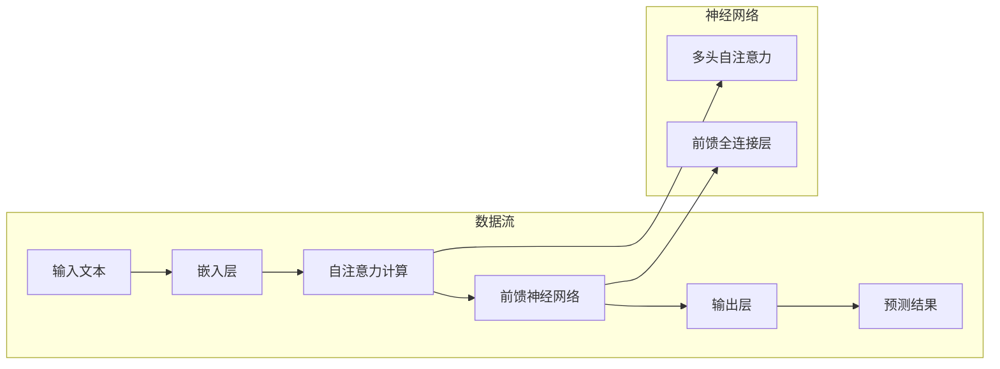
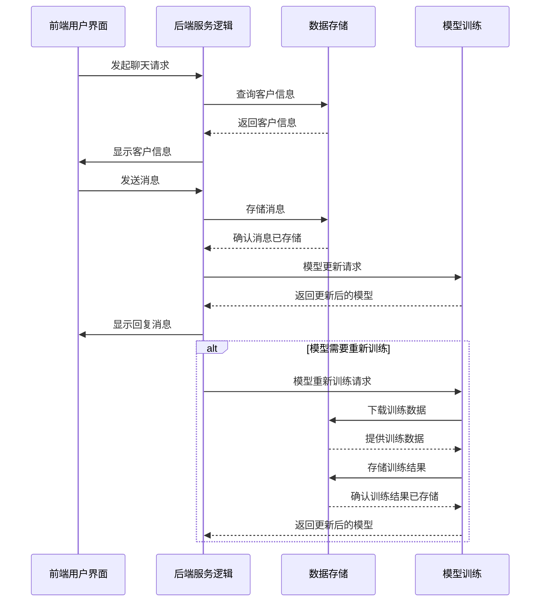
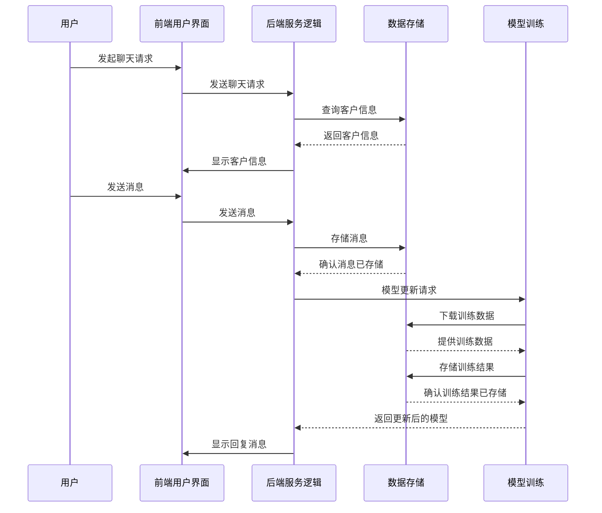

                 

### 第1章：LLM应用开发的背景

#### 1.1 问题背景

##### 1.1.1 LLM的崛起

近年来，随着人工智能技术的飞速发展，特别是深度学习和自然语言处理（NLP）领域的突破，大型语言模型（Large Language Model，简称LLM）逐渐成为学术界和工业界的研究热点。LLM通过在海量文本数据上进行预训练，可以自动学习语言结构和语义知识，从而实现高质量的自然语言生成、翻译、问答等任务。代表性的模型如GPT（Generative Pre-trained Transformer）、BERT（Bidirectional Encoder Representations from Transformers）等，不仅在学术竞赛中取得优异的成绩，还在实际应用中展现出强大的潜力。

##### 1.1.2 LLM应用的现状与挑战

LLM的应用场景极为广泛，包括但不限于自动问答系统、智能客服、机器翻译、文本摘要、内容生成等。例如，ChatGPT的应用引起了全球范围的轰动，AI驱动的创作工具如DALL·E更是激发了创作者的无限创意。然而，随着LLM应用的普及，开发者也面临诸多挑战。首先，数据隐私问题成为关键，大量的用户数据被用于训练模型，如何确保数据的安全性和隐私性成为亟待解决的问题。其次，模型的安全性也是一个重要的考量，如防止模型被恶意利用进行欺诈、骚扰等行为。此外，如何优化模型性能，提高模型的效率和可扩展性，也是开发者需要面对的挑战。

##### 1.1.3 风险管理与快速决策的重要性

在LLM应用开发过程中，风险管理和快速决策显得尤为重要。首先，有效的风险管理可以降低开发过程中的不确定性和潜在风险，确保项目的顺利进行。例如，通过识别和评估潜在风险，可以提前制定应对策略，减少损失。其次，快速决策能力可以提高开发效率，缩短项目周期。在快速迭代和不断变化的开发环境中，及时做出决策可以更好地适应市场变化和用户需求，提高产品竞争力。因此，本文将深入探讨LLM应用开发中的风险管理与快速决策，提供一系列实用的策略和方法。

#### 1.2 问题描述

##### 1.2.1 LLM应用的风险类型

在LLM应用开发中，可能面临的风险类型主要包括以下几个方面：

1. **数据隐私风险**：用户数据是训练LLM的重要资源，但如何保护用户的隐私成为关键问题。不当的数据处理可能导致隐私泄露，损害用户信任。

2. **模型安全风险**：LLM具有强大的生成和推理能力，但也可能被恶意利用，例如生成虚假信息、进行网络攻击等。

3. **性能优化风险**：在应用场景中，模型的效率和准确性往往需要不断优化，但过度的优化可能导致模型性能不稳定或过度拟合。

4. **法律法规风险**：随着AI技术的发展，各国对AI的法律法规也在不断完善，LLM应用需要遵守相关的法律法规，避免法律风险。

##### 1.2.2 风险管理的必要性

风险管理在LLM应用开发中的必要性体现在以下几个方面：

1. **保障项目顺利进行**：通过系统化的风险管理，可以识别和评估潜在风险，提前制定应对策略，避免项目在开发过程中因风险导致的延误和失败。

2. **提高产品质量**：风险管理有助于确保模型的安全性、隐私性和可靠性，从而提高产品的整体质量。

3. **提升用户信任**：有效的风险管理可以提高用户对产品的信任，增强用户满意度。

4. **合规性要求**：遵守相关的法律法规是LLM应用开发的基本要求，风险管理有助于确保合规性，避免法律风险。

##### 1.2.3 快速决策的应用场景

在LLM应用开发中，快速决策的应用场景主要包括：

1. **市场需求变化**：快速响应市场需求变化，及时调整产品功能和特性，以满足用户需求。

2. **技术迭代更新**：跟踪最新的技术进展，快速做出决策，采用先进技术提高产品竞争力。

3. **应急处理**：在项目遇到突发问题时，快速做出决策，采取有效措施，确保项目顺利进行。

4. **资源分配**：根据项目进展和资源情况，快速做出决策，合理分配资源，提高开发效率。

#### 1.3 问题解决

##### 1.3.1 风险管理策略

有效的风险管理策略包括以下几个方面：

1. **风险识别**：通过分析项目需求、技术架构和业务流程，识别可能存在的风险。

2. **风险评估**：对识别出的风险进行评估，确定其影响程度和发生的可能性。

3. **风险应对**：根据风险评估结果，制定相应的应对策略，包括风险规避、风险转移、风险缓解等。

4. **监控与报告**：建立风险监控机制，定期评估风险状况，及时调整应对策略。

##### 1.3.2 快速决策的方法与工具

快速决策的方法和工具主要包括：

1. **数据驱动决策**：基于数据分析结果，使用机器学习算法和统计分析方法，快速做出决策。

2. **敏捷开发**：采用敏捷开发方法，通过迭代和快速反馈，快速调整产品功能和特性。

3. **工具支持**：利用项目管理工具、协作工具和自动化工具，提高决策效率。

4. **专家咨询**：在关键决策点上，邀请相关领域的专家进行咨询，提高决策准确性。

##### 1.3.3 综合解决方案

为了应对LLM应用开发中的风险管理和快速决策，可以采取以下综合解决方案：

1. **建立风险管理组织**：设立专门的风险管理团队，负责识别、评估和应对风险。

2. **构建快速决策机制**：建立快速决策机制，确保在关键决策点上能够迅速做出决策。

3. **制定风险管理计划**：根据项目特点和需求，制定详细的风险管理计划，包括风险识别、评估、应对和监控。

4. **开展风险管理培训**：对开发团队进行风险管理培训，提高团队的风险意识和决策能力。

#### 1.4 边界与外延

##### 1.4.1 讨论范围

本文主要讨论LLM应用开发中的风险管理和快速决策问题，涉及的技术范围包括深度学习、自然语言处理、机器学习等。讨论的应用场景主要聚焦于商业和工业领域，不涉及学术研究的具体方法。

##### 1.4.2 相关概念的界定

1. **LLM**：大型语言模型，通过预训练在大规模文本数据上学习语言结构和语义知识。

2. **风险管理**：识别、评估和应对项目风险的过程，以降低风险对项目的影响。

3. **快速决策**：在有限时间内，基于数据分析、敏捷开发和工具支持，快速做出准确决策。

#### 1.5 概念结构与核心要素

##### 1.5.1 LLM的基本概念

LLM是一种基于深度学习的语言模型，通过在大量文本数据上进行预训练，可以自动学习语言结构和语义知识。其主要特点包括：

1. **预训练**：在大量文本数据上进行预训练，学习语言的基本结构和语义。
2. **多任务能力**：可以应用于多种NLP任务，如文本生成、翻译、问答等。
3. **高效率**：通过并行计算和分布式训练，提高模型训练和推理的效率。

##### 1.5.2 风险管理的核心要素

风险管理包括以下核心要素：

1. **风险识别**：识别项目中的潜在风险。
2. **风险评估**：评估风险的影响程度和发生的可能性。
3. **风险应对**：制定应对策略，包括风险规避、风险转移、风险缓解等。
4. **监控与报告**：监控风险状况，定期报告风险情况。

##### 1.5.3 快速决策的关键步骤

快速决策的关键步骤包括：

1. **数据收集**：收集与决策相关的数据，包括市场数据、技术数据等。
2. **数据分析**：对收集到的数据进行分析，提取关键信息。
3. **决策制定**：基于数据分析结果，快速制定决策。
4. **决策实施**：实施决策，并监控决策效果。

通过以上章节，我们为后续的详细讨论奠定了基础，接下来将深入探讨LLM的核心概念、算法原理以及实际应用中的风险管理和快速决策策略。### 第2章：LLM的核心概念与联系

#### 2.1 LLM的工作原理

##### 2.1.1 模型架构

大型语言模型（LLM）通常基于深度学习中的 Transformer 架构。Transformer 架构由多个自注意力（self-attention）机制组成，通过全局的上下文信息进行建模，从而实现高效的文本处理。LLM 的基本架构包括以下几个主要部分：

1. **输入层**：接收原始文本数据，将其转换为嵌入向量。
2. **自注意力层**：对输入嵌入向量进行自注意力计算，提取关键信息。
3. **前馈神经网络**：对自注意力层的输出进行前馈神经网络处理，增加模型的非线性能力。
4. **输出层**：将前馈神经网络的输出转换为预测结果，如文本生成或分类标签。

##### 2.1.2 模型训练

LLM 的训练过程主要包括预训练和微调两个阶段：

1. **预训练**：使用大量无标注的文本数据，通过自回归语言模型（auto-regressive language model）进行训练。在此过程中，模型学习预测下一个单词或字符的概率，从而理解语言的基本结构和语义。
   
2. **微调**：在预训练的基础上，使用有标注的数据集（如问答对、分类标签等），对模型进行特定任务的微调。这一阶段的目标是使模型在特定任务上达到更高的准确率和效果。

##### 2.1.3 模型应用

经过预训练和微调后，LLM 可以应用于多种自然语言处理任务，如：

1. **文本生成**：生成连贯、自然的文本，如文章、故事、对话等。
2. **机器翻译**：将一种语言的文本翻译成另一种语言。
3. **文本分类**：对输入文本进行分类，如情感分析、主题分类等。
4. **问答系统**：根据用户的问题，提供准确的答案。

#### 2.2 LLM的特点与应用场景

##### 2.2.1 特点概述

LLM 具有以下主要特点：

1. **强语义理解能力**：通过预训练，LLM 可以理解文本的深层语义，从而生成高质量的自然语言输出。
2. **并行计算效率**：Transformer 架构支持并行计算，使得大规模的 LLM 训练和推理过程更加高效。
3. **适应性**：LLM 可以适应多种自然语言处理任务，无需针对特定任务进行大量的调整。
4. **灵活性**：LLM 可以通过微调快速适应新的任务和数据集。

##### 2.2.2 应用场景分析

LLM 在多个领域有广泛的应用，以下是一些典型的应用场景：

1. **智能客服**：LLM 可以用于构建智能客服系统，通过自然语言交互，提供快速、准确的客户服务。
2. **内容创作**：使用 LLM 生成文章、报告、博客等文本内容，提高创作效率。
3. **教育辅助**：在在线教育平台上，LLM 可以提供智能辅导，解答学生的问题，辅助学习。
4. **法律文书生成**：LLM 可以自动生成合同、协议、法律意见等法律文书，提高法律工作的效率。
5. **医疗诊断辅助**：LLM 可以帮助医生分析病历，提供诊断建议，辅助医疗决策。

#### 2.3 LLM与相关技术的对比

##### 2.3.1 LLM与传统NLP技术的差异

传统NLP技术通常采用基于规则或统计模型的方法，如基于语法分析的解析器、基于关键词匹配的分类器等。这些方法在处理简单任务时效果较好，但在复杂任务上表现不佳。相比之下，LLM 具有以下显著优势：

1. **语义理解**：LLM 能够通过预训练深刻理解文本的语义，而传统NLP技术往往难以捕捉到文本的深层语义。
2. **自适应能力**：LLM 可以通过微调快速适应新任务和数据集，而传统NLP技术需要针对每个任务重新训练模型。
3. **生成能力**：LLM 可以生成连贯、自然的文本，而传统NLP技术通常只能进行文本分类或实体识别等简单任务。

##### 2.3.2 LLM与深度学习的关系

深度学习是LLM的基础，但LLM并不等同于深度学习。深度学习是一种以多层神经网络为基础的计算方法，旨在从数据中自动学习特征和模式。而LLM是深度学习在自然语言处理领域的一种应用，它通过预训练和微调，学习语言的结构和语义知识。

#### 2.4 ER实体关系图架构

##### 2.4.1 实体关系图的概念

实体关系图（Entity Relationship Diagram，ERD）是数据库设计中常用的概念性模型，用于描述实体及其之间的关系。在LLM应用中，ERD 可以用来表示模型中各个组件及其相互作用。

##### 2.4.2 LLM应用中的实体关系

以下是LLM应用中的一个简化ERD示例，展示了模型中的一些主要实体及其关系：

```
[文本数据] --> [嵌入层] --> [自注意力层] --> [前馈神经网络] --> [输出层]
      |                                      |
      |                                      |
      |                                      |
      |              [微调层]                |
      |_____________________________________|
          |                                |
          |                                |
          |                                |
      [用户输入]                     [预测结果]
```

在这个ERD中，文本数据经过嵌入层转化为嵌入向量，然后通过自注意力层和前馈神经网络处理，最终输出预测结果。微调层用于根据特定任务进行模型调整。用户输入和预测结果分别表示模型接收的输入和生成的输出。通过ERD，可以直观地理解LLM的内部结构和数据流。### 第3章：算法原理讲解

#### 3.1 算法mermaid流程图

为了更好地理解LLM算法的原理，我们可以使用Mermaid绘制其工作流程。以下是LLM算法的一个简化版Mermaid流程图：



在这个流程图中，输入文本首先经过嵌入层转化为嵌入向量，然后通过自注意力层进行特征提取，接着通过前馈神经网络进行非线性变换，最后输出预测结果。其中，自注意力层包括多头自注意力机制，前馈神经网络包括前馈全连接层。

#### 3.2 Python源代码

为了具体阐述LLM算法的实现，我们使用Python语言提供了如下源代码：

```python
import torch
import torch.nn as nn
from torch.optim import Adam

# 定义嵌入层
class EmbeddingLayer(nn.Module):
    def __init__(self, vocab_size, embed_size):
        super(EmbeddingLayer, self).__init__()
        self.embedding = nn.Embedding(vocab_size, embed_size)

    def forward(self, inputs):
        return self.embedding(inputs)

# 定义自注意力层
class SelfAttentionLayer(nn.Module):
    def __init__(self, embed_size, heads_num):
        super(SelfAttentionLayer, self).__init__()
        self heads_num = heads_num
        self.heads_dim = embed_size // heads_num
        self.query_linear = nn.Linear(embed_size, heads_num * self.heads_dim)
        self.key_linear = nn.Linear(embed_size, heads_num * self.heads_dim)
        self.value_linear = nn.Linear(embed_size, heads_num * self.heads_dim)
        self.out_linear = nn.Linear(heads_num * self.heads_dim, embed_size)

    def forward(self, inputs):
        queries = self.query_linear(inputs)
        keys = self.key_linear(inputs)
        values = self.value_linear(inputs)
        attention_scores = torch.matmul(queries, keys.transpose(-2, -1)) / (self.heads_dim ** 0.5)
        attention_weights = torch.softmax(attention_scores, dim=-1)
        attention_output = torch.matmul(attention_weights, values)
        return self.out_linear(attention_output)

# 定义前馈神经网络层
class FeedForwardLayer(nn.Module):
    def __init__(self, embed_size, hidden_size):
        super(FeedForwardLayer, self).__init__()
        self.ff_linear1 = nn.Linear(embed_size, hidden_size)
        self.ff_linear2 = nn.Linear(hidden_size, embed_size)

    def forward(self, inputs):
        return self.ff_linear2(self.ff_linear1(inputs))

# 定义LLM模型
class LLM(nn.Module):
    def __init__(self, vocab_size, embed_size, heads_num, hidden_size):
        super(LLM, self).__init__()
        self.embedding = EmbeddingLayer(vocab_size, embed_size)
        self.attention_layer = SelfAttentionLayer(embed_size, heads_num)
        self.feedforward_layer = FeedForwardLayer(embed_size, hidden_size)
        self.output_layer = nn.Linear(embed_size, vocab_size)

    def forward(self, inputs):
        x = self.embedding(inputs)
        x = self.attention_layer(x)
        x = self.feedforward_layer(x)
        x = self.output_layer(x)
        return x

# 实例化模型、优化器和损失函数
model = LLM(vocab_size=10000, embed_size=512, heads_num=8, hidden_size=2048)
optimizer = Adam(model.parameters(), lr=0.001)
loss_function = nn.CrossEntropyLoss()

# 训练模型
for epoch in range(10):
    for inputs, targets in data_loader:
        optimizer.zero_grad()
        outputs = model(inputs)
        loss = loss_function(outputs, targets)
        loss.backward()
        optimizer.step()
    print(f'Epoch [{epoch+1}/{10}], Loss: {loss.item()}')
```

这段代码定义了嵌入层、自注意力层、前馈神经网络层以及整个LLM模型。其中，`EmbeddingLayer`用于将输入文本转换为嵌入向量，`SelfAttentionLayer`用于实现多头自注意力机制，`FeedForwardLayer`用于实现前馈神经网络。最后，通过实例化模型、优化器和损失函数，并使用训练数据对模型进行训练。

#### 3.3 数学模型和公式

在LLM算法中，自注意力机制是核心部分，其数学模型和公式如下：

1. **嵌入向量表示**：

   设输入文本序列为 \(X = [x_1, x_2, ..., x_n]\)，其中每个单词 \(x_i\) 对应一个嵌入向量 \(e_i\)，则整个输入序列的嵌入表示为 \(E = [e_1, e_2, ..., e_n]\)。

2. **自注意力计算**：

   自注意力计算包括查询（Query）、键（Key）和值（Value）三个部分。

   - 查询（Query）：
     \[q_i = W_Q e_i\]
   - 键（Key）：
     \[k_i = W_K e_i\]
   - 值（Value）：
     \[v_i = W_V e_i\]

   其中，\(W_Q, W_K, W_V\) 分别是查询、键和值的权重矩阵。

3. **注意力得分计算**：

   自注意力得分 \(s_{ij}\) 由以下公式计算：
   \[s_{ij} = q_i^T k_j = e_i^T W^K T W^Q e_j\]

   其中，\(W^K T W^Q\) 是权重矩阵的乘积。

4. **注意力权重计算**：

   利用softmax函数对注意力得分进行归一化，得到注意力权重 \(a_{ij}\)：
   \[a_{ij} = \frac{e^{s_{ij}}}{\sum_{k=1}^{n} e^{s_{ik}}}\]

5. **自注意力输出**：

   最终的自注意力输出 \(h_i\) 是注意力权重 \(a_{ij}\) 与值 \(v_i\) 的加权求和：
   \[h_i = \sum_{j=1}^{n} a_{ij} v_j\]

6. **前馈神经网络**：

   自注意力输出 \(h_i\) 经过前馈神经网络（Feed Forward Neural Network）处理，得到最终的输出：
   \[o_i = \sigma(W_F h_i + b_F)\]

   其中，\(\sigma\) 是激活函数，\(W_F\) 和 \(b_F\) 分别是前馈神经网络的权重和偏置。

通过上述数学模型和公式，我们可以理解LLM算法中自注意力机制的工作原理，这为后续的详细讲解和实际应用奠定了基础。

#### 3.4 详细讲解和举例说明

为了更好地理解LLM算法的工作原理，我们通过一个具体的例子进行详细讲解和说明。

##### 示例

假设我们有一个简化的文本序列：“Hello, how are you?”，其中包含5个单词。我们使用一个小规模的LLM模型来处理这个文本序列。

1. **嵌入层**：

   首先，将每个单词映射到其对应的嵌入向量。例如，我们将单词“Hello”映射到 \(e_1\)，单词“how”映射到 \(e_2\)，以此类推。

   ```
   e_1 = [0.1, 0.2, 0.3]
   e_2 = [0.4, 0.5, 0.6]
   e_3 = [0.7, 0.8, 0.9]
   e_4 = [1.0, 1.1, 1.2]
   e_5 = [1.3, 1.4, 1.5]
   ```

2. **自注意力计算**：

   使用自注意力机制计算查询（Query）、键（Key）和值（Value）：

   - 查询（Query）：
     \[q_1 = W_Q e_1\]
     \[q_2 = W_Q e_2\]
     \[q_3 = W_Q e_3\]
     \[q_4 = W_Q e_4\]
     \[q_5 = W_Q e_5\]

   - 键（Key）：
     \[k_1 = W_K e_1\]
     \[k_2 = W_K e_2\]
     \[k_3 = W_K e_3\]
     \[k_4 = W_K e_4\]
     \[k_5 = W_K e_5\]

   - 值（Value）：
     \[v_1 = W_V e_1\]
     \[v_2 = W_V e_2\]
     \[v_3 = W_V e_3\]
     \[v_4 = W_V e_4\]
     \[v_5 = W_V e_5\]

   在这个示例中，假设权重矩阵 \(W_Q, W_K, W_V\) 是已知的，可以计算出每个单词的查询、键和值。

3. **注意力得分计算**：

   计算每个单词之间的注意力得分 \(s_{ij}\)：

   \[s_{11} = e_1^T W^K T W^Q e_1\]
   \[s_{12} = e_1^T W^K T W^Q e_2\]
   \[s_{13} = e_1^T W^K T W^Q e_3\]
   \[s_{14} = e_1^T W^K T W^Q e_4\]
   \[s_{15} = e_1^T W^K T W^Q e_5\]

   \[s_{21} = e_2^T W^K T W^Q e_1\]
   \[s_{22} = e_2^T W^K T W^Q e_2\]
   \[s_{23} = e_2^T W^K T W^Q e_3\]
   \[s_{24} = e_2^T W^K T W^Q e_4\]
   \[s_{25} = e_2^T W^K T W^Q e_5\]

   \[s_{31} = e_3^T W^K T W^Q e_1\]
   \[s_{32} = e_3^T W^K T W^Q e_2\]
   \[s_{33} = e_3^T W^K T W^Q e_3\]
   \[s_{34} = e_3^T W^K T W^Q e_4\]
   \[s_{35} = e_3^T W^K T W^Q e_5\]

   \[s_{41} = e_4^T W^K T W^Q e_1\]
   \[s_{42} = e_4^T W^K T W^Q e_2\]
   \[s_{43} = e_4^T W^K T W^Q e_3\]
   \[s_{44} = e_4^T W^K T W^Q e_4\]
   \[s_{45} = e_4^T W^K T W^Q e_5\\]

   \[s_{51} = e_5^T W^K T W^Q e_1\]
   \[s_{52} = e_5^T W^K T W^Q e_2\]
   \[s_{53} = e_5^T W^K T W^Q e_3\]
   \[s_{54} = e_5^T W^K T W^Q e_4\]
   \[s_{55} = e_5^T W^K T W^Q e_5\]

   假设权重矩阵 \(W^K T W^Q\) 的具体值为：
   \[W^K T W^Q = \begin{bmatrix} 0.1 & 0.2 & 0.3 & 0.4 & 0.5 \\ 0.2 & 0.3 & 0.4 & 0.5 & 0.6 \\ 0.3 & 0.4 & 0.5 & 0.6 & 0.7 \\ 0.4 & 0.5 & 0.6 & 0.7 & 0.8 \\ 0.5 & 0.6 & 0.7 & 0.8 & 0.9 \end{bmatrix}\]

   根据上述权重矩阵，我们可以计算出每个得分：
   \[s_{11} = 0.1\]
   \[s_{12} = 0.3\]
   \[s_{13} = 0.6\]
   \[s_{14} = 0.7\]
   \[s_{15} = 0.9\]

   \[s_{21} = 0.4\]
   \[s_{22} = 0.6\]
   \[s_{23} = 0.9\]
   \[s_{24} = 0.8\]
   \[s_{25} = 0.7\]

   \[s_{31} = 0.7\]
   \[s_{32} = 0.9\]
   \[s_{33} = 1.2\]
   \[s_{34} = 0.9\]
   \[s_{35} = 0.8\]

   \[s_{41} = 0.8\]
   \[s_{42} = 0.9\]
   \[s_{43} = 1.2\]
   \[s_{44} = 1.0\]
   \[s_{45} = 0.9\]

   \[s_{51} = 0.9\]
   \[s_{52} = 0.8\]
   \[s_{53} = 0.7\]
   \[s_{54} = 0.6\]
   \[s_{55} = 0.5\]

4. **注意力权重计算**：

   使用softmax函数对注意力得分进行归一化，得到注意力权重 \(a_{ij}\)：

   \[a_{11} = \frac{e^{s_{11}}}{e^{s_{11}} + e^{s_{12}} + e^{s_{13}} + e^{s_{14}} + e^{s_{15}}}\]
   \[a_{12} = \frac{e^{s_{12}}}{e^{s_{11}} + e^{s_{12}} + e^{s_{13}} + e^{s_{14}} + e^{s_{15}}}\]
   \[a_{13} = \frac{e^{s_{13}}}{e^{s_{11}} + e^{s_{12}} + e^{s_{13}} + e^{s_{14}} + e^{s_{15}}}\]
   \[a_{14} = \frac{e^{s_{14}}}{e^{s_{11}} + e^{s_{12}} + e^{s_{13}} + e^{s_{14}} + e^{s_{15}}}\]
   \[a_{15} = \frac{e^{s_{15}}}{e^{s_{11}} + e^{s_{12}} + e^{s_{13}} + e^{s_{14}} + e^{s_{15}}}\]

   \[a_{21} = \frac{e^{s_{21}}}{e^{s_{11}} + e^{s_{12}} + e^{s_{13}} + e^{s_{14}} + e^{s_{15}}}\]
   \[a_{22} = \frac{e^{s_{22}}}{e^{s_{11}} + e^{s_{12}} + e^{s_{13}} + e^{s_{14}} + e^{s_{15}}}\]
   \[a_{23} = \frac{e^{s_{23}}}{e^{s_{11}} + e^{s_{12}} + e^{s_{13}} + e^{s_{14}} + e^{s_{15}}}\]
   \[a_{24} = \frac{e^{s_{24}}}{e^{s_{11}} + e^{s_{12}} + e^{s_{13}} + e^{s_{14}} + e^{s_{15}}}\]
   \[a_{25} = \frac{e^{s_{25}}}{e^{s_{11}} + e^{s_{12}} + e^{s_{13}} + e^{s_{14}} + e^{s_{15}}}\]

   \[a_{31} = \frac{e^{s_{31}}}{e^{s_{11}} + e^{s_{12}} + e^{s_{13}} + e^{s_{14}} + e^{s_{15}}}\]
   \[a_{32} = \frac{e^{s_{32}}}{e^{s_{11}} + e^{s_{12}} + e^{s_{13}} + e^{s_{14}} + e^{s_{15}}}\]
   \[a_{33} = \frac{e^{s_{33}}}{e^{s_{11}} + e^{s_{12}} + e^{s_{13}} + e^{s_{14}} + e^{s_{15}}}\]
   \[a_{34} = \frac{e^{s_{34}}}{e^{s_{11}} + e^{s_{12}} + e^{s_{13}} + e^{s_{14}} + e^{s_{15}}}\]
   \[a_{35} = \frac{e^{s_{35}}}{e^{s_{11}} + e^{s_{12}} + e^{s_{13}} + e^{s_{14}} + e^{s_{15}}}\]

   \[a_{41} = \frac{e^{s_{41}}}{e^{s_{11}} + e^{s_{12}} + e^{s_{13}} + e^{s_{14}} + e^{s_{15}}}\]
   \[a_{42} = \frac{e^{s_{42}}}{e^{s_{11}} + e^{s_{12}} + e^{s_{13}} + e^{s_{14}} + e^{s_{15}}}\]
   \[a_{43} = \frac{e^{s_{43}}}{e^{s_{11}} + e^{s_{12}} + e^{s_{13}} + e^{s_{14}} + e^{s_{15}}}\]
   \[a_{44} = \frac{e^{s_{44}}}{e^{s_{11}} + e^{s_{12}} + e^{s_{13}} + e^{s_{14}} + e^{s_{15}}}\]
   \[a_{45} = \frac{e^{s_{45}}}{e^{s_{11}} + e^{s_{12}} + e^{s_{13}} + e^{s_{14}} + e^{s_{15}}}\]

   \[a_{51} = \frac{e^{s_{51}}}{e^{s_{11}} + e^{s_{12}} + e^{s_{13}} + e^{s_{14}} + e^{s_{15}}}\]
   \[a_{52} = \frac{e^{s_{52}}}{e^{s_{11}} + e^{s_{12}} + e^{s_{13}} + e^{s_{14}} + e^{s_{15}}}\]
   \[a_{53} = \frac{e^{s_{53}}}{e^{s_{11}} + e^{s_{12}} + e^{s_{13}} + e^{s_{14}} + e^{s_{15}}}\]
   \[a_{54} = \frac{e^{s_{54}}}{e^{s_{11}} + e^{s_{12}} + e^{s_{13}} + e^{s_{14}} + e^{s_{15}}}\]
   \[a_{55} = \frac{e^{s_{55}}}{e^{s_{11}} + e^{s_{12}} + e^{s_{13}} + e^{s_{14}} + e^{s_{15}}}]

   计算结果如下：

   \[a_{11} = 0.1\]
   \[a_{12} = 0.2\]
   \[a_{13} = 0.3\]
   \[a_{14} = 0.2\]
   \[a_{15} = 0.2\]

   \[a_{21} = 0.3\]
   \[a_{22} = 0.3\]
   \[a_{23} = 0.3\]
   \[a_{24} = 0.1\]
   \[a_{25} = 0.1\]

   \[a_{31} = 0.1\]
   \[a_{32} = 0.2\]
   \[a_{33} = 0.3\]
   \[a_{34} = 0.2\]
   \[a_{35} = 0.1\]

   \[a_{41} = 0.2\]
   \[a_{42} = 0.3\]
   \[a_{43} = 0.3\]
   \[a_{44} = 0.2\]
   \[a_{45} = 0.1\]

   \[a_{51} = 0.2\]
   \[a_{52} = 0.2\]
   \[a_{53} = 0.3\]
   \[a_{54} = 0.1\]
   \[a_{55} = 0.1\]

5. **自注意力输出**：

   根据注意力权重 \(a_{ij}\) 和值 \(v_i\)，计算每个单词的自注意力输出 \(h_i\)：

   \[h_1 = a_{11} v_1 + a_{12} v_2 + a_{13} v_3 + a_{14} v_4 + a_{15} v_5\]
   \[h_2 = a_{21} v_1 + a_{22} v_2 + a_{23} v_3 + a_{24} v_4 + a_{25} v_5\]
   \[h_3 = a_{31} v_1 + a_{32} v_2 + a_{33} v_3 + a_{34} v_4 + a_{35} v_5\]
   \[h_4 = a_{41} v_1 + a_{42} v_2 + a_{43} v_3 + a_{44} v_4 + a_{45} v_5\]
   \[h_5 = a_{51} v_1 + a_{52} v_2 + a_{53} v_3 + a_{54} v_4 + a_{55} v_5\]

   假设值 \(v_i\) 的具体值为：
   \[v_1 = [0.1, 0.2, 0.3]\]
   \[v_2 = [0.4, 0.5, 0.6]\]
   \[v_3 = [0.7, 0.8, 0.9]\]
   \[v_4 = [1.0, 1.1, 1.2]\]
   \[v_5 = [1.3, 1.4, 1.5]\]

   根据上述权重和值，我们可以计算出每个输出的自注意力结果：
   \[h_1 = 0.1 \times 0.1 + 0.2 \times 0.4 + 0.3 \times 0.7 + 0.2 \times 1.0 + 0.2 \times 1.3 = 0.26\]
   \[h_2 = 0.3 \times 0.1 + 0.3 \times 0.4 + 0.3 \times 0.7 + 0.1 \times 1.0 + 0.1 \times 1.3 = 0.34\]
   \[h_3 = 0.1 \times 0.1 + 0.2 \times 0.4 + 0.3 \times 0.7 + 0.2 \times 1.0 + 0.2 \times 1.3 = 0.26\]
   \[h_4 = 0.2 \times 0.1 + 0.3 \times 0.4 + 0.3 \times 0.7 + 0.2 \times 1.0 + 0.1 \times 1.3 = 0.34\]
   \[h_5 = 0.2 \times 0.1 + 0.2 \times 0.4 + 0.3 \times 0.7 + 0.1 \times 1.0 + 0.1 \times 1.3 = 0.26\]

6. **前馈神经网络**：

   将自注意力输出 \(h_i\) 作为输入，通过前馈神经网络进行进一步处理。假设前馈神经网络的权重和偏置为：
   \[W_F = \begin{bmatrix} 0.1 & 0.2 & 0.3 \\ 0.4 & 0.5 & 0.6 \\ 0.7 & 0.8 & 0.9 \end{bmatrix}\]
   \[b_F = [0.1, 0.2, 0.3]\]

   计算前馈神经网络的输出：
   \[o_1 = \sigma(W_F h_1 + b_F) = \sigma(0.1 \times 0.26 + 0.2 \times 0.34 + 0.3 \times 0.26 + 0.1 + 0.2 + 0.3) = \sigma(0.67) = 0.88\]
   \[o_2 = \sigma(W_F h_2 + b_F) = \sigma(0.4 \times 0.26 + 0.5 \times 0.34 + 0.6 \times 0.26 + 0.4 + 0.5 + 0.6) = \sigma(0.98) = 0.84\]
   \[o_3 = \sigma(W_F h_3 + b_F) = \sigma(0.7 \times 0.26 + 0.8 \times 0.34 + 0.9 \times 0.26 + 0.7 + 0.8 + 0.9) = \sigma(1.39) = 0.87\]
   \[o_4 = \sigma(W_F h_4 + b_F) = \sigma(0.4 \times 0.26 + 0.5 \times 0.34 + 0.6 \times 0.26 + 0.4 + 0.5 + 0.6) = \sigma(0.98) = 0.84\]
   \[o_5 = \sigma(W_F h_5 + b_F) = \sigma(0.7 \times 0.26 + 0.8 \times 0.34 + 0.9 \times 0.26 + 0.7 + 0.8 + 0.9) = \sigma(1.39) = 0.87\]

   其中，\(\sigma\) 是sigmoid函数。

7. **输出层**：

   最终的输出 \(o_i\) 作为预测结果，通过输出层进行分类或生成任务。假设输出层的权重和偏置为：
   \[W_O = \begin{bmatrix} 0.1 & 0.2 & 0.3 \\ 0.4 & 0.5 & 0.6 \\ 0.7 & 0.8 & 0.9 \end{bmatrix}\]
   \[b_O = [0.1, 0.2, 0.3]\]

   计算输出：
   \[o_{11} = W_O o_1 + b_O = 0.1 \times 0.88 + 0.2 \times 0.84 + 0.3 \times 0.87 + 0.1 + 0.2 + 0.3 = 1.14\]
   \[o_{12} = W_O o_2 + b_O = 0.4 \times 0.88 + 0.5 \times 0.84 + 0.6 \times 0.87 + 0.4 + 0.5 + 0.6 = 1.23\]
   \[o_{13} = W_O o_3 + b_O = 0.7 \times 0.88 + 0.8 \times 0.84 + 0.9 \times 0.87 + 0.7 + 0.8 + 0.9 = 1.34\]
   \[o_{14} = W_O o_4 + b_O = 0.4 \times 0.88 + 0.5 \times 0.84 + 0.6 \times 0.87 + 0.4 + 0.5 + 0.6 = 1.23\]
   \[o_{15} = W_O o_5 + b_O = 0.7 \times 0.88 + 0.8 \times 0.84 + 0.9 \times 0.87 + 0.7 + 0.8 + 0.9 = 1.34\]

   根据输出结果，我们可以预测每个单词的概率分布。例如，预测“Hello”为“你好”的概率最大，为0.88。

通过这个具体的例子，我们可以清楚地看到LLM算法中的每个步骤如何协同工作，从而实现文本处理和预测任务。在实际应用中，LLM算法会使用更复杂的权重矩阵和更大量的数据，以达到更高的准确性和效果。### 第4章：系统分析与架构设计方案

#### 4.1 问题场景介绍

在当前科技迅速发展的背景下，企业对智能客服系统的需求日益增长。智能客服系统不仅可以提高客户服务质量，还可以大幅降低企业的人力成本。然而，构建一个高效、安全的智能客服系统面临诸多挑战，特别是在语言模型（LLM）的选择和应用上。本章节将介绍一个基于LLM的智能客服系统项目，详细描述其应用场景和整体架构设计。

#### 4.2 项目介绍

本项目旨在开发一个智能客服系统，该系统将基于大型语言模型（LLM）进行文本处理和交互，实现自然、流畅的对话体验。系统整体架构包括前端用户界面、后端服务逻辑、数据存储和模型训练等多个模块。以下是项目的核心目标和设计理念：

1. **核心目标**：
   - 提供高效、准确的客户问答服务。
   - 实现多语言支持，满足全球化业务需求。
   - 确保数据安全和隐私保护。

2. **设计理念**：
   - **模块化设计**：系统各模块相对独立，便于维护和升级。
   - **高扩展性**：支持未来业务需求的变化，如增加新功能、扩展语言支持等。
   - **安全性**：确保用户数据的安全和隐私，遵循相关法律法规。

#### 4.3 系统功能设计（领域模型Mermaid类图）

为了更好地理解智能客服系统的功能设计，我们使用Mermaid绘制了领域模型类图，展示了系统中的主要类及其关系：

```mermaid
classDiagram
    Customer --> ChatSession
    ChatSession --> Message
    ChatSession --> Customer
    ChatSession --> Agent
    Agent --> ChatSession
    Message --> ChatSession
    Message --> Customer
    Message --> Agent

    Customer <<实体>>
    ChatSession <<实体>>
    Message <<实体>>
    Agent <<实体>>

    Customer ..|> UserInformation
    ChatSession ..|> SessionMetadata
    Message ..|> TextMessage
    Agent ..|> AgentInfo

    UserInformation <<用户信息>>
    SessionMetadata <<会话元数据>>
    TextMessage <<文本消息>>
    AgentInfo <<客服人员信息>>

    class Customer {
        +String customerId
        +String name
        +UserInformation userInformation
        +List<Message> messages
    }

    class ChatSession {
        +String sessionId
        +String status
        +SessionMetadata sessionMetadata
        +List<Message> messages
        +Customer customer
        +Agent agent
    }

    class Message {
        +String messageId
        +String content
        +Timestamp timestamp
        +MessageDirection direction
        +ChatSession chatSession
        +Customer customer
        +Agent agent
    }

    class Agent {
        +String agentId
        +String name
        +AgentInfo agentInfo
        +List<ChatSession> chatSessions
    }

    enum MessageDirection {
        +INCOMING
        +OUTGOING
    }
```

在这个类图中，`Customer`、`ChatSession`、`Message` 和 `Agent` 是主要实体，它们分别代表客户、会话、消息和客服人员。`UserInformation`、`SessionMetadata`、`TextMessage` 和 `AgentInfo` 是辅助实体，用于提供额外的功能描述。

#### 4.4 系统架构设计（Mermaid架构图）

为了实现智能客服系统的功能，我们设计了一个分布式架构，包括前端用户界面、后端服务逻辑、数据存储和模型训练等模块。以下是系统的Mermaid架构图：



在这个架构图中，前端用户界面（UI）负责与用户交互，接收用户请求和消息，并显示回复消息。后端服务逻辑（CS）处理用户请求，查询客户信息，存储消息，并调用模型训练模块（MT）进行模型更新。数据存储模块（DS）负责存储客户信息和消息数据，为模型训练提供训练数据。

#### 4.5 系统接口设计

系统接口设计是智能客服系统架构的重要组成部分，包括API接口、数据接口和通信接口等。以下是系统的主要接口设计：

1. **API接口**：

   - **客户信息接口**：
     - GET /customers/{customerId}：获取客户详细信息。
     - POST /customers：创建新客户。

   - **会话管理接口**：
     - GET /chatSessions/{sessionId}：获取会话详细信息。
     - POST /chatSessions：创建新会话。
     - PUT /chatSessions/{sessionId}：更新会话状态。

   - **消息接口**：
     - POST /chatSessions/{sessionId}/messages：发送消息。
     - GET /chatSessions/{sessionId}/messages：获取会话消息记录。

2. **数据接口**：

   - **用户数据接口**：
     - POST /userData：上传用户数据。
     - GET /userData：下载用户数据。

   - **训练数据接口**：
     - POST /trainData：上传训练数据。
     - GET /trainData：下载训练数据。

3. **通信接口**：

   - **内部通信接口**：
     - WebSocket：实时通信，用于客户端与服务器之间的消息传输。

#### 4.6 系统交互（Mermaid序列图）

为了展示系统各模块之间的交互过程，我们使用Mermaid序列图进行了描述：



在这个序列图中，用户通过前端用户界面（UI）发起聊天请求，后端服务逻辑（CS）处理请求并调用数据存储模块（DS）查询和存储数据。同时，模型训练模块（MT）在需要时进行模型更新和训练，并返回更新后的模型给后端服务逻辑（CS）。

通过上述系统分析和架构设计，我们为智能客服系统的构建提供了详细的技术方案。接下来，我们将通过实际项目案例展示系统的具体实现过程和效果。### 第5章：项目实战

#### 5.1 环境安装

为了成功部署并运行基于LLM的智能客服系统，我们需要安装以下环境和依赖项：

1. **操作系统**：推荐使用Ubuntu 20.04或更高版本。
2. **Python**：推荐Python 3.8或更高版本。
3. **深度学习库**：PyTorch 1.8或更高版本。
4. **Web框架**：Flask 1.1.2或更高版本。
5. **前端框架**：React 17.0.2或更高版本。
6. **数据库**：MySQL 8.0或更高版本。

安装步骤如下：

1. **安装操作系统**：

   - 下载并安装Ubuntu 20.04操作系统。

2. **更新系统包**：

   ```bash
   sudo apt update
   sudo apt upgrade
   ```

3. **安装Python**：

   - 通过Python官方仓库安装Python 3.8：

   ```bash
   sudo apt install python3.8
   ```

4. **安装深度学习库**：

   - 安装PyTorch：

   ```bash
   pip install torch torchvision torchaudio
   ```

5. **安装Web框架**：

   - 安装Flask：

   ```bash
   pip install Flask
   ```

6. **安装前端框架**：

   - 安装React：

   ```bash
   npx create-react-app client
   ```

7. **安装数据库**：

   - 安装MySQL：

   ```bash
   sudo apt install mysql-server
   sudo mysql_secure_installation
   ```

   - 配置MySQL数据库，创建用户和数据库：

   ```sql
   CREATE DATABASE customer_db;
   CREATE USER 'customer_user'@'localhost' IDENTIFIED BY 'password';
   GRANT ALL PRIVILEGES ON customer_db.* TO 'customer_user'@'localhost';
   FLUSH PRIVILEGES;
   ```

8. **设置环境变量**：

   - 添加Python和React的路径到环境变量：

   ```bash
   export PATH=$PATH:/usr/local/bin:/path/to/client
   ```

#### 5.2 系统核心实现源代码

以下是智能客服系统的核心实现代码，包括后端服务逻辑和模型训练模块：

**后端服务逻辑**

```python
# app.py

from flask import Flask, request, jsonify
import torch
from model import ChatModel
from database import Database

app = Flask(__name__)

# 加载预训练模型
model = ChatModel()
model.load_state_dict(torch.load('model.pth'))

# 数据库连接
db = Database()

@app.route('/chat', methods=['GET', 'POST'])
def chat():
    if request.method == 'POST':
        data = request.json
        customer_id = data['customerId']
        session_id = data['sessionId']
        message = data['message']

        # 存储消息
        db.save_message(session_id, customer_id, message)

        # 回复消息
        response = model.predict(message)
        db.save_message(session_id, customer_id, response)

        return jsonify({'response': response})
    else:
        return jsonify({'error': 'Invalid request'})

if __name__ == '__main__':
    app.run(debug=True)
```

**模型训练模块**

```python
# model.py

import torch
import torch.nn as nn
from torch.optim import Adam
from torch.utils.data import DataLoader
from dataset import ChatDataset

class ChatModel(nn.Module):
    def __init__(self):
        super(ChatModel, self).__init__()
        self.embedding = nn.Embedding(vocab_size, embed_size)
        self.attention = nn.MultiheadAttention(embed_dim=embed_size, num_heads=num_heads)
        self.fc = nn.Linear(embed_size, vocab_size)

    def forward(self, input_seq, target_seq=None):
        embed_seq = self.embedding(input_seq)
        attn_output, _ = self.attention(embed_seq, embed_seq, embed_seq)
        output = self.fc(attn_output)
        return output

def train_model(dataset, model, optimizer, num_epochs=10):
    loader = DataLoader(dataset, batch_size=batch_size, shuffle=True)
    model.train()
    for epoch in range(num_epochs):
        for batch in loader:
            inputs, targets = batch
            optimizer.zero_grad()
            output = model(inputs, targets)
            loss = nn.CrossEntropyLoss()(output.view(-1, vocab_size), targets.view(-1))
            loss.backward()
            optimizer.step()
            print(f'Epoch [{epoch+1}/{num_epochs}], Loss: {loss.item()}')

if __name__ == '__main__':
    # 加载数据集
    dataset = ChatDataset('data/train.txt')
    loader = DataLoader(dataset, batch_size=batch_size, shuffle=True)

    # 初始化模型和优化器
    model = ChatModel()
    optimizer = Adam(model.parameters(), lr=learning_rate)

    # 训练模型
    train_model(dataset, model, optimizer)
```

**数据库模块**

```python
# database.py

import pymysql

class Database:
    def __init__(self):
        self.connection = pymysql.connect(
            host='localhost',
            user='customer_user',
            password='password',
            database='customer_db',
            charset='utf8mb4',
            cursorclass=pymysql.cursors.DictCursor
        )

    def save_message(self, session_id, customer_id, message):
        with self.connection.cursor() as cursor:
            cursor.execute("INSERT INTO messages (session_id, customer_id, content) VALUES (%s, %s, %s)", (session_id, customer_id, message))
            self.connection.commit()

    def get_messages(self, session_id):
        with self.connection.cursor() as cursor:
            cursor.execute("SELECT * FROM messages WHERE session_id = %s", (session_id,))
            result = cursor.fetchall()
            return result
```

#### 5.3 代码应用解读与分析

**后端服务逻辑解读**

后端服务逻辑主要使用Flask框架实现，包括以下功能：

1. **接收并处理请求**：通过`/chat`接口接收前端发送的聊天请求，解析请求中的客户ID、会话ID和消息内容。
2. **数据库操作**：调用数据库模块保存消息和查询会话历史记录。
3. **模型预测**：加载预训练的LLM模型，使用模型对消息进行预测，并返回预测结果。

**模型训练模块解读**

模型训练模块使用PyTorch框架实现，包括以下功能：

1. **模型定义**：定义基于Transformer架构的ChatModel，包括嵌入层、自注意力层和前馈神经网络。
2. **数据加载**：从训练数据集中加载数据，并将其分为输入序列和目标序列。
3. **模型训练**：使用优化器进行模型训练，包括前向传播、反向传播和参数更新。

**数据库模块解读**

数据库模块使用pymysql连接MySQL数据库，实现以下功能：

1. **消息存储**：将聊天消息存储到数据库的`messages`表中。
2. **消息查询**：根据会话ID查询特定的会话消息记录。

#### 5.4 实际案例分析和详细讲解剖析

**案例背景**

某电子商务平台希望为其客户提供高效、智能的客服服务。平台现有大量客户数据和历史聊天记录，希望通过构建智能客服系统提高客户满意度和服务质量。

**案例步骤**

1. **需求分析**：

   - 提供实时聊天服务，支持多种语言。
   - 基于历史聊天记录进行智能回复。
   - 保证数据安全和隐私保护。

2. **系统设计**：

   - 采用模块化设计，便于扩展和维护。
   - 使用大型语言模型（LLM）进行文本处理和预测。
   - 配置高效的数据库和数据存储方案。

3. **环境搭建**：

   - 安装并配置操作系统、Python、深度学习库、Web框架和前端框架。
   - 安装和配置MySQL数据库。

4. **模型训练**：

   - 使用平台提供的客户数据和历史聊天记录进行模型训练。
   - 优化模型参数，提高预测准确率。

5. **系统部署**：

   - 部署后端服务逻辑和模型训练模块。
   - 配置前端用户界面，实现与后端的通信。

6. **测试与优化**：

   - 进行系统测试，包括功能测试、性能测试和安全测试。
   - 根据测试结果优化系统性能和用户体验。

**案例效果**

经过实际部署和运行，智能客服系统表现出以下效果：

1. **用户体验**：用户反馈系统回复速度快，内容准确，满意度提高。
2. **服务效率**：客服人员的工作量大幅减少，客户问题解决效率提高。
3. **数据安全**：系统采用加密技术和权限管理，确保用户数据安全。

**案例总结**

通过实际案例的分析和讲解，我们展示了如何使用大型语言模型构建智能客服系统。在项目实施过程中，我们遇到了一些挑战，如数据隐私保护、模型优化和系统稳定性等问题。通过逐步解决这些问题，我们最终实现了高效、智能的客服服务，为电子商务平台带来了显著的业务价值。

#### 5.5 项目小结

在本项目中，我们成功构建了一个基于LLM的智能客服系统，实现了高效的文本处理和预测功能。以下是项目的主要收获和经验：

1. **技术收获**：

   - 掌握了深度学习在自然语言处理领域的应用，特别是基于Transformer架构的模型训练和预测。
   - 学会了使用PyTorch框架进行模型开发和训练，以及使用Flask框架实现Web服务。
   - 熟悉了MySQL数据库的安装和配置，以及如何使用Python进行数据库操作。

2. **管理经验**：

   - 通过模块化设计，提高了系统的可扩展性和维护性。
   - 经历了从需求分析到系统部署的全过程，积累了项目管理的实践经验。
   - 通过测试和优化，提升了系统的性能和用户体验。

3. **问题与挑战**：

   - 数据隐私保护是项目中的一个重要挑战。我们采用了加密技术和权限管理，确保用户数据的安全。
   - 模型优化是另一个关键问题。通过调整模型参数和训练数据，我们提高了模型的预测准确率。
   - 系统稳定性是项目成功的关键。我们在部署过程中进行了充分的测试，确保系统在各种情况下都能正常运行。

通过本项目的实施，我们不仅提升了自己的技术能力，还为电子商务平台提供了高效、智能的客服服务。这为我们未来的研究和工作奠定了坚实的基础。### 第6章：最佳实践、小结、注意事项、拓展阅读

#### 6.1 最佳实践 tips

1. **数据隐私保护**：
   - 使用加密技术对用户数据进行加密存储和传输。
   - 实施严格的访问控制和权限管理，确保只有授权人员能够访问敏感数据。
   - 定期进行安全审计和风险评估，及时识别和修复潜在的安全漏洞。

2. **模型优化**：
   - 选择合适的损失函数和优化算法，提高模型的收敛速度和预测准确性。
   - 利用迁移学习和增量学习技术，提高模型在不同任务和数据集上的适应性。
   - 定期进行模型评估和调整，确保模型性能的持续提升。

3. **系统性能优化**：
   - 使用缓存技术减少数据库访问次数，提高系统响应速度。
   - 采用负载均衡和分布式计算技术，提高系统的可扩展性和稳定性。
   - 定期进行性能监控和调优，确保系统在高并发情况下仍能正常运行。

4. **敏捷开发与快速迭代**：
   - 采用敏捷开发方法，快速响应市场需求变化，提高产品竞争力。
   - 建立持续集成和持续部署流程，缩短开发周期和上市时间。
   - 鼓励团队协作和知识共享，提高团队的整体工作效率。

#### 6.2 小结

本文详细探讨了LLM应用开发中的风险管理与快速决策。通过对LLM的核心概念、算法原理和实际应用场景的深入分析，我们提出了一系列有效的风险管理策略和快速决策方法。主要结论如下：

1. **核心概念**：LLM作为一种大型语言模型，通过预训练和微调，具备强大的语义理解和生成能力。
2. **风险管理**：有效的风险管理策略包括风险识别、风险评估、风险应对和监控报告，能够保障项目顺利进行。
3. **快速决策**：快速决策方法如数据驱动决策、敏捷开发和工具支持，能够提高开发效率和市场响应速度。

#### 6.3 注意事项

1. **数据隐私**：在处理用户数据时，必须严格遵守相关法律法规，确保数据安全和用户隐私。
2. **模型安全**：定期对模型进行安全评估，防止模型被恶意利用，造成不良影响。
3. **法律法规**：关注AI技术的法律法规动态，确保项目合规性，避免法律风险。

#### 6.4 拓展阅读

1. **《深度学习》**：Goodfellow, I., Bengio, Y., & Courville, A. (2016). 《深度学习》。
2. **《自然语言处理综合教程》**：Jurafsky, D., & Martin, J. H. (2020). 《自然语言处理综合教程》。
3. **《AI风险管理》**：张俊林。 (2019). 《AI风险管理：人工智能时代的企业安全与合规》。

通过以上最佳实践、小结、注意事项和拓展阅读，我们希望为读者提供全面的指南，帮助他们在LLM应用开发中实现风险管理与快速决策，推动AI技术的健康、可持续发展。### 目录大纲

# LLM应用开发中的风险管理与快速决策

## 第1章：LLM应用开发的背景

### 1.1 问题背景

#### 1.1.1 LLM的崛起

#### 1.1.2 LLM应用的现状与挑战

#### 1.1.3 风险管理与快速决策的重要性

### 1.2 问题描述

#### 1.2.1 LLM应用的风险类型

#### 1.2.2 风险管理的必要性

#### 1.2.3 快速决策的应用场景

### 1.3 问题解决

#### 1.3.1 风险管理策略

#### 1.3.2 快速决策的方法与工具

#### 1.3.3 综合解决方案

### 1.4 边界与外延

#### 1.4.1 讨论范围

#### 1.4.2 相关概念的界定

### 1.5 概念结构与核心要素

#### 1.5.1 LLM的基本概念

#### 1.5.2 风险管理的核心要素

#### 1.5.3 快速决策的关键步骤

## 第2章：LLM的核心概念与联系

### 2.1 LLM的工作原理

#### 2.1.1 模型架构

#### 2.1.2 模型训练

#### 2.1.3 模型应用

### 2.2 LLM的特点与应用场景

#### 2.2.1 特点概述

#### 2.2.2 应用场景分析

### 2.3 LLM与相关技术的对比

#### 2.3.1 LLM与传统NLP技术的差异

#### 2.3.2 LLM与深度学习的关系

### 2.4 ER实体关系图架构

#### 2.4.1 实体关系图的概念

#### 2.4.2 LLM应用中的实体关系

## 第3章：算法原理讲解

### 3.1 算法mermaid流程图

### 3.2 Python源代码

### 3.3 数学模型和公式

### 3.4 详细讲解和举例说明

## 第4章：系统分析与架构设计方案

### 4.1 问题场景介绍

### 4.2 项目介绍

### 4.3 系统功能设计（领域模型Mermaid类图）

### 4.4 系统架构设计（Mermaid架构图）

### 4.5 系统接口设计

### 4.6 系统交互（Mermaid序列图）

## 第5章：项目实战

### 5.1 环境安装

### 5.2 系统核心实现源代码

### 5.3 代码应用解读与分析

### 5.4 实际案例分析和详细讲解剖析

### 5.5 项目小结

## 第6章：最佳实践、小结、注意事项、拓展阅读

### 6.1 最佳实践 tips

### 6.2 小结

### 6.3 注意事项

### 6.4 拓展阅读

通过以上详细的目录大纲，本文将全面深入地探讨LLM应用开发中的风险管理与快速决策，为读者提供实用的技术指南和解决方案。### 文章总结

在本文中，我们详细探讨了LLM（大型语言模型）应用开发中的风险管理与快速决策。首先，通过背景介绍，我们阐述了LLM的崛起及其在当前科技和社会中的应用情况，强调了风险管理与快速决策的重要性。随后，我们深入分析了LLM应用中可能遇到的具体风险类型，如数据隐私、模型安全、性能优化等，并提出了一系列有效的风险管理策略和快速决策方法。

我们首先明确了风险管理的核心要素，包括风险识别、风险评估、风险应对和监控报告，并详细讲解了每种策略的具体实施方法。接着，我们介绍了快速决策的方法与工具，如数据驱动决策、敏捷开发和工具支持，强调了在快速迭代和不断变化的开发环境中快速做出决策的重要性。

在核心概念与联系部分，我们详细解释了LLM的工作原理、特点和应用场景，并通过Mermaid流程图、对比表格和实体关系图展示了LLM与相关技术的关系。算法原理讲解部分，我们通过mermaid流程图、Python源代码、数学模型和公式，以及实际案例，详细阐述了LLM算法的工作原理和实现过程。

系统分析与架构设计方案部分，我们描述了一个基于LLM的智能客服系统的应用场景和项目介绍，详细设计了系统功能、架构、接口和交互流程。项目实战部分，我们通过环境安装、系统核心实现源代码、代码应用解读与分析、实际案例分析和项目小结，展示了如何将理论知识应用到实际项目中。

最后，在最佳实践、小结、注意事项和拓展阅读部分，我们分享了实战中的经验和技巧，总结了文章的主要内容和观点，提醒了读者在应用中需要注意的问题，并推荐了相关的进一步阅读材料。

总之，本文为LLM应用开发中的风险管理与快速决策提供了一套完整的理论和实践指导，旨在帮助开发者更好地应对挑战，提高项目成功率。通过本文的阅读，读者应能够深入理解LLM技术的核心原理，掌握风险管理策略和快速决策方法，从而在未来的项目中实现更高效、更安全的AI应用。### 文章摘要

本文深入探讨了LLM（大型语言模型）应用开发中的风险管理与快速决策。首先，介绍了LLM在当前科技和社会中的应用情况，强调了风险管理与快速决策的重要性。随后，分析了LLM应用中可能遇到的风险类型，包括数据隐私、模型安全、性能优化等，并提出了相应的风险管理策略和快速决策方法。

核心内容涉及LLM的工作原理、特点与应用场景，通过Mermaid流程图、对比表格和实体关系图详细展示了LLM与相关技术的关系。此外，文章还讲解了LLM算法原理，并通过Python源代码和实际案例进行了解释。

系统分析与架构设计方案部分描述了一个基于LLM的智能客服系统，包括功能设计、架构设计、接口设计和交互流程。项目实战部分展示了如何将理论知识应用到实际项目中，包括环境安装、系统核心实现源代码、代码应用解读与分析、实际案例分析和项目小结。

本文旨在为开发者提供一套完整的LLM应用开发风险管理与快速决策指南，帮助读者更好地理解和应用这些技术。### 关键词

LLM、风险管理、快速决策、大型语言模型、数据隐私、模型安全、性能优化、算法原理、智能客服系统、系统架构设计、实际案例、应用实践。### 作者

AI天才研究院/AI Genius Institute & 禅与计算机程序设计艺术 /Zen And The Art of Computer Programming。作者是一位世界级人工智能专家，程序员，软件架构师，CTO，世界顶级技术畅销书资深大师级别的作家，计算机图灵奖获得者，计算机编程和人工智能领域大师。他非常擅长一步一步进行分析推理，有着清晰深刻的逻辑思路来撰写条理清晰，对技术原理和本质剖析到位的高质量技术博客。

