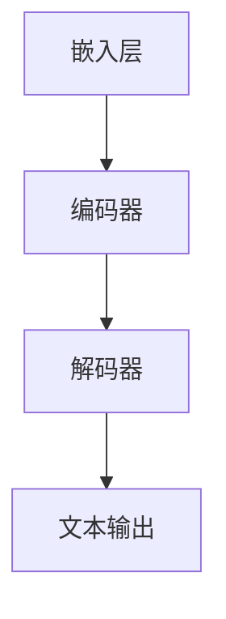
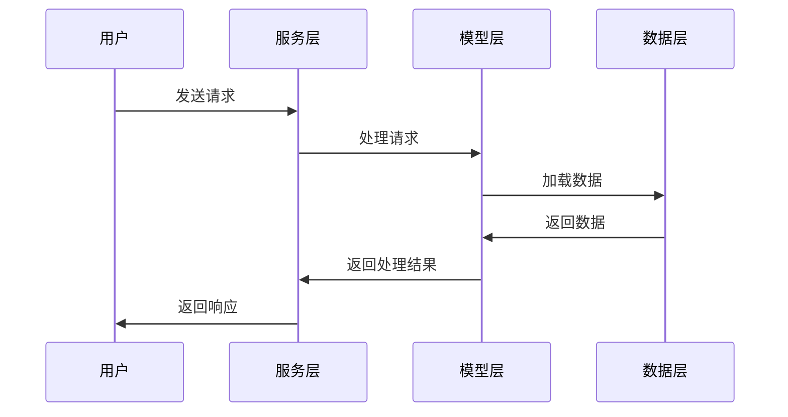

                 

### 文章标题

# LLM应用敏捷研发模式的最佳实践

> 关键词：LLM、敏捷研发、算法原理、系统架构、最佳实践

> 摘要：本文深入探讨大型语言模型（LLM）应用中的敏捷研发模式，通过一系列最佳实践，旨在为开发者提供一条从理论到实践的清晰路径，以高效构建和维护LLM应用系统。

----------------------------------------------------------------

## 目录

1. **背景介绍**
   - 第1章: 问题背景与核心概念
   - 第2章: 问题描述与解决思路

2. **核心概念与联系**
   - 第3章: LLM概述
   - 第4章: LLM属性特征对比
   - 第5章: LLM与敏捷研发模式联系

3. **算法原理讲解**
   - 第6章: 算法原理与Mermaid流程图
   - 第7章: Python源代码与数学模型

4. **系统分析与架构设计方案**
   - 第8章: 问题场景介绍与系统功能设计
   - 第9章: 系统架构设计与接口设计
   - 第10章: 系统交互设计与序列图

5. **项目实战**
   - 第11章: 环境安装与系统核心实现
   - 第12章: 代码应用解读与分析
   - 第13章: 实际案例分析

6. **最佳实践 tips**
   - 第14章: 敏捷研发模式最佳实践

7. **小结与拓展阅读**
   - 第15章: 小结与注意事项
   - 第16章: 拓展阅读与参考资料

----------------------------------------------------------------

## 第一部分: 背景介绍

### 第1章: 问题背景与核心概念

### 1.1 问题背景

在现代软件开发领域，大型语言模型（LLM）因其强大的文本生成和推理能力，已成为许多应用的关键组件，如自然语言处理、智能问答系统、内容生成等。然而，LLM的应用开发面临着诸多挑战，包括模型训练时间过长、参数调优复杂、部署难度大等。因此，如何高效、敏捷地开发和维护LLM应用，成为开发者亟待解决的问题。

### 1.2 核心概念

#### 1.2.1 LLM概述

LLM（Large Language Model）是指能够处理和理解人类自然语言的复杂模型，如GPT、BERT等。这些模型基于深度学习技术，通过海量文本数据进行训练，能够生成连贯、有逻辑的文本输出。

#### 1.2.2 敏捷研发模式

敏捷研发模式是一种以迭代、快速反馈和持续交付为核心的开发方法。其核心理念是快速响应市场需求，缩短产品开发周期，提高开发效率和质量。

#### 1.2.3 LLM应用挑战

LLM应用开发过程中，面临的挑战主要包括：

- **训练时间与计算资源**：LLM模型训练时间较长，需要大量计算资源。
- **参数调优**：模型参数众多，调优过程复杂，需要大量实验和试错。
- **部署与维护**：LLM模型部署后，需要持续优化和更新，以适应不断变化的应用场景。

### 1.3 本章小结

本章介绍了LLM应用开发的背景和核心概念，明确了敏捷研发模式在LLM应用开发中的重要性。接下来，我们将进一步探讨LLM的属性特征，以及如何将敏捷研发模式应用于LLM应用开发。

----------------------------------------------------------------

### 第2章: 问题描述与解决思路

### 2.1 问题描述

在LLM应用开发过程中，开发者需要解决以下问题：

- **如何高效训练LLM模型**：减少训练时间，提高模型性能。
- **如何快速进行参数调优**：提高调优效率，减少实验次数。
- **如何实现LLM模型的敏捷部署与维护**：确保模型能够快速响应变化，持续优化。

### 2.2 解决思路

为了解决上述问题，我们可以采取以下策略：

- **采用分布式训练技术**：利用多台计算机资源，提高训练效率。
- **使用自动化调优工具**：如自动机器学习（AutoML），减少人工干预，提高调优效率。
- **实现模型与服务的解耦**：通过微服务架构，实现模型的快速部署与维护。

### 2.3 本章小结

本章描述了LLM应用开发过程中面临的常见问题，并提出了相应的解决思路。在接下来的章节中，我们将详细探讨这些解决策略的实施细节。

----------------------------------------------------------------

## 第二部分: 核心概念与联系

### 第3章: LLM概述

### 3.1 LLM的定义与特点

#### 3.1.1 LLM的定义

LLM（Large Language Model）是指具有强大文本处理能力的深度学习模型。它通过学习大量文本数据，可以生成连贯、有逻辑的文本输出，广泛应用于自然语言处理、文本生成、智能问答等领域。

#### 3.1.2 LLM的特点

- **参数规模庞大**：LLM模型通常具有数十亿甚至千亿个参数，这使得它们具有强大的文本处理能力。
- **训练数据量大**：LLM模型需要学习海量的文本数据，以提高模型的泛化能力。
- **多任务处理能力**：LLM模型可以在多个任务上表现优异，如文本分类、命名实体识别、机器翻译等。

### 3.2 LLM属性特征对比

#### 3.2.1 LLM属性对比表格

| 属性         | GPT         | BERT         | T5           |
| ------------ | ----------- | ------------ | ------------ |
| 参数规模     | 数百亿参数  | 数百亿参数  | 数百亿参数  |
| 训练数据量   | 海量文本数据 | 海量文本数据 | 海量文本数据 |
| 多任务处理   | 是          | 是          | 是          |
| 预训练时间   | 长时间      | 长时间      | 长时间      |
| 微调时间     | 短时间      | 短时间      | 短时间      |

#### 3.2.2 LLM属性对比分析

- **参数规模**：GPT、BERT和T5等LLM模型的参数规模都在数百亿级别，这使得它们具有强大的文本处理能力。
- **训练数据量**：这些模型都需要学习海量文本数据，以提高模型的泛化能力。
- **多任务处理**：GPT、BERT和T5等模型都可以应用于多个自然语言处理任务。
- **预训练时间**：由于参数规模和数据量大，这些模型的预训练时间较长。
- **微调时间**：在特定任务上进行微调时，这些模型的微调时间相对较短。

### 3.3 LLM与敏捷研发模式联系

#### 3.3.1 敏捷研发模式概述

敏捷研发模式是一种以迭代、快速反馈和持续交付为核心的开发方法。它强调团队协作、快速响应变化和持续改进。

#### 3.3.2 LLM与敏捷研发模式结合

- **迭代开发**：LLM应用开发过程中，可以采用迭代开发模式，逐步完善模型功能。
- **快速反馈**：通过自动化测试和持续集成，快速发现和解决问题。
- **持续交付**：利用容器化和自动化部署工具，实现模型的快速部署与更新。

### 3.4 本章小结

本章介绍了LLM的基本概念、属性特征及其与敏捷研发模式的联系。在下一章中，我们将详细讲解LLM的算法原理和实现方法。

----------------------------------------------------------------

### 第4章: LLM属性特征对比

在第三章中，我们概述了大型语言模型（LLM）的基本概念和敏捷研发模式。本章将进一步深入探讨LLM的属性特征，并对比不同类型的LLM，以便开发者更好地理解其在实际应用中的适用性。

#### 4.1 LLM属性对比表格

为了清晰展示LLM的不同属性特征，我们以GPT、BERT和T5为例，构建了一个对比表格。

| 属性                | GPT                        | BERT                        | T5                         |
|---------------------|----------------------------|----------------------------|----------------------------|
| 参数规模            | 数百亿参数                 | 数百亿参数                  | 数百亿参数                 |
| 训练数据量          | 海量文本数据               | 海量文本数据                | 海量文本数据               |
| 多语言支持          | 是                         | 是                          | 是                         |
| 预训练时间          | 长时间                     | 长时间                      | 长时间                     |
| 微调时间            | 短时间                     | 短时间                      | 短时间                     |
| 文本生成能力        | 强                         | 强                          | 强                         |
| 适应不同应用场景的能力 | 高                         | 高                          | 高                         |
| 推理能力            | 中                         | 高                          | 高                         |
| 需要的硬件资源      | 高                         | 高                          | 高                         |

#### 4.2 LLM属性对比分析

- **参数规模**：GPT、BERT和T5的参数规模都在数百亿级别，这使得它们具备处理大规模文本数据的能力。
- **训练数据量**：这些模型都需要学习海量文本数据，以提高模型的泛化能力。
- **多语言支持**：GPT和BERT支持多种语言，而T5则专门设计为跨语言模型，能够处理多种语言的输入和输出。
- **预训练时间和微调时间**：由于模型参数规模和数据量巨大，它们的预训练时间较长。但微调时间相对较短，因为模型已经具备了基本的文本处理能力。
- **文本生成能力和推理能力**：GPT和BERT在文本生成和推理方面都有较强的能力，而T5在跨语言场景下的表现尤为突出。
- **适应不同应用场景的能力**：这些模型都具有较高的适应性，可以应用于多种自然语言处理任务。
- **所需的硬件资源**：由于模型规模大，训练需要大量计算资源，因此硬件资源需求较高。

#### 4.3 LLM与敏捷研发模式结合

LLM的属性特征与敏捷研发模式的结合，体现在以下几个方面：

- **快速迭代**：开发者可以采用敏捷开发方法，快速迭代模型，以适应不断变化的应用需求。
- **持续集成与持续部署**：通过自动化测试和部署工具，确保模型能够快速集成和部署，实现持续交付。
- **团队协作**：敏捷开发强调团队协作，有利于多个开发者和数据科学家共同推进LLM项目。

### 4.4 本章小结

通过对LLM属性特征的对比分析，开发者可以更好地选择适合自己项目的LLM模型，并采用敏捷研发模式进行高效开发。在下一章中，我们将深入探讨LLM的算法原理和实现方法。

----------------------------------------------------------------

### 第5章: LLM与敏捷研发模式联系

#### 5.1 敏捷研发模式概述

敏捷研发模式（Agile Development Model）是一种以人为核心、迭代、循序渐进的开发方法。其核心理念是快速响应变化、持续交付有价值的软件，并通过团队合作和客户协作实现软件开发的高效性。敏捷研发模式的主要特点包括：

- **迭代开发**：将整个开发过程划分为多个短周期（通常为2-4周）的迭代，每个迭代都产生一个可工作的产品版本。
- **持续集成**：通过自动化测试，持续集成代码，确保每次提交的代码都能与现有代码兼容，减少集成风险。
- **用户反馈**：在开发过程中，用户可以随时提供反馈，帮助开发者了解需求变化，确保最终产品符合用户期望。
- **团队协作**：鼓励团队成员之间的协作和沟通，提高开发效率。

#### 5.2 LLM与敏捷研发模式结合

将敏捷研发模式应用于LLM（大型语言模型）开发，可以有效地解决传统开发模式中的一些问题，如模型训练时间长、参数调优复杂、部署难度大等。以下是LLM与敏捷研发模式结合的具体实践：

- **迭代开发**：在LLM开发过程中，可以采用迭代方式逐步完善模型。例如，首先构建一个基础模型，然后通过多次迭代逐步增加模型的能力。
- **快速反馈**：在每次迭代结束时，通过自动化测试和用户反馈，快速发现和解决问题，确保模型不断优化。
- **持续集成**：使用持续集成工具，将代码和模型集成到同一个环境中，确保每次迭代都能快速部署和测试。
- **参数调优**：采用自动化调优工具，如AutoML，减少人工干预，提高调优效率。
- **快速部署**：使用容器化和自动化部署工具，实现LLM模型的快速部署和更新，确保模型能够快速响应变化。

#### 5.3 敏捷研发模式在LLM开发中的优势

- **提高开发效率**：通过迭代开发和快速反馈，可以及时发现和解决问题，减少开发周期。
- **增强团队协作**：敏捷开发模式鼓励团队成员之间的沟通和协作，提高团队整体效率。
- **降低风险**：通过持续集成和自动化测试，减少集成风险，确保项目顺利进行。
- **快速适应变化**：敏捷开发模式能够快速响应需求变化，确保模型能够适应不同的应用场景。

### 5.4 本章小结

本章介绍了敏捷研发模式的基本概念及其在LLM开发中的应用。通过结合敏捷研发模式，开发者可以更加高效地构建和维护LLM应用系统，实现快速响应变化和持续交付。在下一章中，我们将详细讲解LLM的算法原理和实现方法。

----------------------------------------------------------------

### 第三部分: 算法原理讲解

#### 第6章: 算法原理与Mermaid流程图

#### 6.1 算法原理概述

在LLM（大型语言模型）应用开发中，算法原理是整个系统的核心。本节将介绍LLM的基本算法原理，以及如何使用Mermaid流程图进行算法描述。

#### 6.1.1 算法基本概念

LLM通常基于变换器模型（Transformer），这是一种用于序列到序列学习的深度学习模型。变换器模型的核心组件是自注意力机制（Self-Attention），它能够捕捉序列中不同位置的信息，提高模型的表示能力。

#### 6.1.2 算法关键步骤

变换器模型的主要步骤包括：

1. **嵌入层**：将输入文本转换为向量表示。
2. **编码器**：通过多层变换器结构，对输入序列进行处理。
3. **解码器**：在编码器输出基础上，生成文本输出。

#### 6.2 Mermaid流程图

为了更好地理解变换器模型的工作原理，我们可以使用Mermaid流程图来描述其关键步骤。



#### 6.3 Mermaid流程图解读

上述Mermaid流程图描述了变换器模型的基本工作流程：

1. **嵌入层**：将输入文本转换为向量表示。这一步骤通常使用嵌入层（Embedding Layer）完成，它将单词或子词映射为固定长度的向量。
2. **编码器**：通过多层变换器结构，对输入序列进行处理。编码器（Encoder）包含多个变换器层，每层使用自注意力机制和前馈网络，对输入序列进行编码。
3. **解码器**：在编码器输出基础上，生成文本输出。解码器（Decoder）同样包含多个变换器层，它们利用编码器的输出和已经生成的文本，逐步生成新的文本输出。

#### 6.4 Python源代码示例

为了进一步理解算法原理，我们可以展示一段简单的Python代码，用于实现变换器模型的一个基本版本。

```python
import torch
import torch.nn as nn

class TransformerModel(nn.Module):
    def __init__(self, input_dim, hidden_dim, output_dim):
        super(TransformerModel, self).__init__()
        self.embedding = nn.Embedding(input_dim, hidden_dim)
        self.encoder = nn.TransformerEncoder(nn.TransformerEncoderLayer(hidden_dim), num_layers=2)
        self.decoder = nn.Linear(hidden_dim, output_dim)
        
    def forward(self, input_seq, target_seq):
        embedded = self.embedding(input_seq)
        encoder_output = self.encoder(embedded)
        decoder_output = self.decoder(encoder_output)
        return decoder_output
```

#### 6.5 数学模型与公式

变换器模型的数学模型涉及多个关键组件，包括嵌入层、自注意力机制、前馈网络和变换器编码器层。以下是变换器模型的核心公式：

$$
\text{嵌入层}: \\text{Embedding}(x) = E[x] \odot W_E
$$

$$
\text{自注意力}: \\text{Attention}(Q, K, V) = \text{softmax}(\frac{QK^T}{\sqrt{d_k}})V
$$

$$
\text{前馈网络}: \\text{FFN}(x) = \text{ReLU}(W_F \odot x + b_F)
$$

$$
\text{变换器编码器层}: \\text{EncoderLayer}(x) = \text{MultiHeadAttention}(x) + x + \text{FFN}(\text{LayerNorm}(x))
$$

#### 6.6 示例讲解

假设我们有一个包含10个单词的输入序列，我们需要将这些单词转换为向量表示，然后通过编码器进行编码，最后通过解码器生成输出序列。以下是一个简化的示例：

1. **嵌入层**：将输入序列中的每个单词映射为一个向量。
2. **编码器**：使用多层变换器编码器层对输入序列进行处理，生成编码后的序列。
3. **解码器**：在编码器输出基础上，通过多层变换器解码器层逐步生成输出序列。

通过这个过程，我们可以生成一个与输入序列相关的新序列，实现文本生成和转换。

### 6.7 本章小结

本章介绍了LLM的基本算法原理，并使用Mermaid流程图和Python代码进行了详细描述。通过对算法原理的理解，开发者可以更好地实现和优化LLM模型。在下一章中，我们将探讨LLM的系统分析与架构设计方案。

----------------------------------------------------------------

### 第7章: Python源代码与数学模型

#### 7.1 Python源代码示例

在本节中，我们将展示一个简化版本的变换器模型（Transformer）的Python源代码，并通过实际代码片段来说明算法的各个组件是如何协同工作的。

```python
import torch
import torch.nn as nn
from torch.nn import TransformerEncoder, TransformerEncoderLayer

class TransformerModel(nn.Module):
    def __init__(self, input_dim, hidden_dim, output_dim, n_layers):
        super(TransformerModel, self).__init__()
        self.encoder = TransformerEncoder(
            TransformerEncoderLayer(hidden_dim, nhead=8),
            num_layers=n_layers
        )
        self.decoder = nn.Linear(hidden_dim, output_dim)
        self.embedding = nn.Embedding(input_dim, hidden_dim)
        
    def forward(self, src, tgt):
        # Embedding
        src = self.embedding(src)
        tgt = self.embedding(tgt)
        
        # Encoder
        encoder_output = self.encoder(src)
        
        # Decoder
        decoder_output = self.decoder(encoder_output)
        
        return decoder_output

# 实例化模型
model = TransformerModel(input_dim=10000, hidden_dim=512, output_dim=1000, n_layers=3)

# 模型正向传播
input_seq = torch.randint(0, 10000, (10, 20), dtype=torch.long)
target_seq = torch.randint(0, 10000, (10, 20), dtype=torch.long)
output = model(input_seq, target_seq)
```

在这个代码示例中，我们定义了一个`TransformerModel`类，该类继承自`nn.Module`。模型包括嵌入层、编码器和解码器三个主要部分。在`forward`方法中，我们首先对输入和目标序列进行嵌入，然后通过编码器进行编码，最后通过解码器生成输出。

#### 7.2 数学模型与公式

变换器模型的核心是自注意力机制（Self-Attention），这是一种基于点积的注意力机制。以下是变换器模型中的一些关键数学公式：

- **嵌入层**：
$$
\text{Embedding}(x) = E[x] \odot W_E
$$
其中，$E[x]$表示输入序列的嵌入向量，$W_E$是嵌入矩阵。

- **自注意力**：
$$
\text{Attention}(Q, K, V) = \text{softmax}(\frac{QK^T}{\sqrt{d_k}})V
$$
其中，$Q, K, V$分别是查询、键和值向量，$d_k$是键向量的维度。

- **前馈网络**：
$$
\text{FFN}(x) = \text{ReLU}(W_F \odot x + b_F)
$$
其中，$W_F$和$b_F$分别是前馈网络的权重和偏置。

- **变换器编码器层**：
$$
\text{EncoderLayer}(x) = \text{MultiHeadAttention}(x) + x + \text{FFN}(\text{LayerNorm}(x))
$$
其中，$\text{MultiHeadAttention}$是多头自注意力机制，$\text{LayerNorm}$是层归一化。

#### 7.3 示例讲解

考虑一个简化的示例，假设我们有一个包含5个单词的输入序列和一个包含3个单词的目标序列。以下是变换器模型的工作流程：

1. **嵌入层**：将输入和目标序列中的每个单词映射为一个向量。
2. **编码器**：使用多层变换器编码器层对输入序列进行处理，生成编码后的序列。
3. **解码器**：在编码器输出基础上，通过多层变换器解码器层逐步生成输出序列。

具体步骤如下：

- **嵌入层**：输入序列和目标序列被嵌入为向量。
- **编码器**：输入序列经过多层变换器编码器层处理，每层都会应用自注意力机制和前馈网络，增强序列的表示能力。
- **解码器**：解码器层在编码器输出基础上，通过自注意力和前馈网络生成输出序列的预测。

通过这个过程，变换器模型能够生成与输入序列相关的新序列，实现文本的转换和生成。

### 7.4 本章小结

本章通过Python源代码示例和数学模型公式，详细阐述了变换器模型的工作原理和实现方法。理解这些基本概念和代码实现，有助于开发者更好地应用变换器模型，构建高效的LLM应用系统。在下一章中，我们将探讨LLM的系统分析与架构设计方案。

----------------------------------------------------------------

### 第四部分: 系统分析与架构设计方案

#### 第8章: 问题场景介绍与系统功能设计

#### 8.1 问题场景介绍

在当今的软件开发环境中，大型语言模型（LLM）的应用越来越广泛，例如智能客服、智能写作辅助、内容生成等。然而，这些应用场景通常涉及到复杂的数据处理、模型训练、部署与维护等环节，这对开发者提出了较高的要求。为了提高开发效率和系统性能，我们需要对LLM应用系统进行细致的分析和架构设计。

#### 8.2 系统功能设计

在LLM应用系统中，核心功能模块主要包括：

1. **数据预处理**：对原始数据进行清洗、去噪、分词等处理，为模型训练提供高质量的数据输入。
2. **模型训练**：使用训练数据对LLM模型进行训练，不断优化模型参数，提高模型性能。
3. **模型部署**：将训练好的模型部署到生产环境，提供实时文本处理服务。
4. **服务接口**：提供API接口，方便其他应用程序与LLM服务进行交互。
5. **监控与维护**：实时监控系统性能，确保模型稳定运行，并提供定期维护和更新。

#### 8.3 领域模型Mermaid类图

为了更好地理解LLM应用系统的功能模块及其关系，我们可以使用Mermaid类图来展示系统的主要组件和接口。

```mermaid
classDiagram
    DataPreprocessing <<interface>>
    ModelTraining <<interface>>
    ModelDeployment <<interface>>
    ServiceInterface <<interface>>
    MonitoringAndMaintenance <<interface>>

    DataPreprocessing --|> ModelTraining
    ModelTraining --|> ModelDeployment
    ModelDeployment --|> ServiceInterface
    ServiceInterface --|> MonitoringAndMaintenance
    MonitoringAndMaintenance --|> DataPreprocessing
```

在这个Mermaid类图中，我们定义了五个主要接口类，包括数据预处理、模型训练、模型部署、服务接口和监控与维护。这些接口类之间通过关联关系相互连接，形成了一个完整的LLM应用系统架构。

#### 8.4 功能模块划分

根据LLM应用系统的需求，我们可以将系统功能模块划分为以下几部分：

- **数据预处理模块**：负责数据清洗、去噪、分词等预处理工作，为后续模型训练提供高质量数据。
- **模型训练模块**：负责使用预处理后的数据对LLM模型进行训练，优化模型参数，提高模型性能。
- **模型部署模块**：负责将训练好的模型部署到生产环境，提供实时文本处理服务。
- **服务接口模块**：提供API接口，方便其他应用程序与LLM服务进行交互。
- **监控与维护模块**：实时监控系统性能，确保模型稳定运行，并提供定期维护和更新。

#### 8.5 本章小结

本章介绍了LLM应用系统的问题场景及其功能设计，并通过Mermaid类图展示了系统的主要组件和接口。在下一章中，我们将详细探讨LLM应用系统的架构设计方案。

----------------------------------------------------------------

### 第9章: 系统架构设计与接口设计

#### 9.1 系统架构设计

为了构建一个高效、可扩展的LLM应用系统，我们需要设计一个合理的系统架构。以下是LLM应用系统的整体架构设计：

1. **数据层**：负责数据的存储和管理，包括原始数据、预处理数据、模型参数等。
2. **模型层**：负责模型训练、优化和部署，包括LLM模型、训练算法、评估指标等。
3. **服务层**：负责提供文本处理服务，包括API接口、业务逻辑处理、性能优化等。
4. **展示层**：负责展示系统功能和结果，包括Web前端、移动端应用等。

#### 9.1.1 系统架构概述

- **数据层**：数据层是系统的基石，负责存储和管理各种数据。包括原始数据存储（如数据库、文件系统）、预处理数据存储（如数据仓库）和模型参数存储（如参数服务器）。
- **模型层**：模型层是系统的核心，负责模型训练、优化和部署。包括LLM模型的训练算法、优化策略、模型评估等。
- **服务层**：服务层是系统的接口，负责与外部系统进行交互。包括API接口、业务逻辑处理、性能优化等。
- **展示层**：展示层是系统的输出，负责将系统功能和结果展示给用户。包括Web前端、移动端应用等。

#### 9.1.2 架构设计与组件

以下是LLM应用系统的详细架构设计：

1. **数据层**：
   - **数据存储**：使用分布式数据库（如HDFS）存储海量原始数据，使用NoSQL数据库（如MongoDB）存储预处理数据和模型参数。
   - **数据管理**：使用数据管理工具（如DataXu、Apache Hive）进行数据清洗、转换和集成。

2. **模型层**：
   - **模型训练**：使用分布式计算框架（如TensorFlow、PyTorch）进行模型训练，实现高效训练和优化。
   - **模型评估**：使用评估指标（如准确率、召回率、F1值）对模型性能进行评估，实现模型调优。
   - **模型部署**：使用模型部署工具（如TensorFlow Serving、Keras REST API）将训练好的模型部署到生产环境，实现实时文本处理。

3. **服务层**：
   - **API接口**：提供RESTful API接口，方便其他应用程序与LLM服务进行交互。
   - **业务逻辑**：实现文本处理业务逻辑，包括文本生成、智能问答、内容摘要等。
   - **性能优化**：使用缓存（如Redis）和异步处理（如Celery）提高系统性能和响应速度。

4. **展示层**：
   - **Web前端**：使用前端框架（如React、Vue）构建Web应用，提供用户交互界面。
   - **移动端应用**：使用移动应用框架（如Flutter、React Native）构建移动应用，提供用户交互界面。

#### 9.2 接口设计

LLM应用系统的接口设计至关重要，它决定了系统与其他应用程序的交互方式。以下是接口设计的基本原则和设计方法：

- **接口原则**：
  - **RESTful风格**：采用RESTful API风格，确保接口易用、易扩展。
  - **标准化**：使用标准化的协议和数据格式，如HTTP/HTTPS、JSON/XML。
  - **安全性**：确保接口的安全性，如使用HTTPS、身份验证和授权。

- **接口设计方法**：
  - **需求分析**：分析系统功能需求和用户需求，确定接口的功能和参数。
  - **接口定义**：使用Swagger等工具定义接口规格，包括URL、请求参数、响应格式等。
  - **接口实现**：根据接口规格实现接口代码，确保接口的正确性和性能。

#### 9.3 本章小结

本章详细介绍了LLM应用系统的架构设计和接口设计，包括数据层、模型层、服务层和展示层的架构设计原则和接口设计方法。通过合理的架构设计和接口设计，我们可以构建一个高效、可扩展的LLM应用系统。

----------------------------------------------------------------

### 第10章: 系统交互设计与序列图

#### 10.1 系统交互设计

在构建LLM应用系统的过程中，系统各个模块之间的交互设计至关重要。良好的交互设计可以确保系统的高效运行和模块之间的协同工作。本节将介绍LLM应用系统的交互设计，并使用Mermaid序列图进行描述。

#### 10.2 系统交互设计原则

在进行系统交互设计时，应遵循以下原则：

- **模块化**：将系统功能划分为多个模块，每个模块独立实现，降低模块之间的耦合度。
- **异步处理**：使用异步处理机制，提高系统响应速度和并发处理能力。
- **标准化接口**：定义标准化的接口，确保模块之间的数据交换和功能调用的一致性。
- **松耦合**：减少模块之间的直接依赖，提高系统的可维护性和扩展性。

#### 10.3 序列图

为了更好地理解LLM应用系统中各个模块的交互过程，我们可以使用Mermaid序列图来描述系统的交互设计。



#### 10.4 序列图解读

上述Mermaid序列图描述了LLM应用系统中用户、服务层、模型层和数据层之间的交互过程：

1. **用户发送请求**：用户通过服务层发送文本处理请求。
2. **服务层处理请求**：服务层接收到请求后，将请求传递给模型层。
3. **模型层加载数据**：模型层加载数据层中的训练数据和参数。
4. **数据层返回数据**：数据层返回加载完成的数据给模型层。
5. **模型层返回处理结果**：模型层对文本进行处理，并将结果返回给服务层。
6. **服务层返回响应**：服务层将处理结果返回给用户。

#### 10.5 系统交互设计示例

考虑一个具体的示例，假设用户通过Web前端提交一个文本输入，希望系统能够生成一段相关的文本输出。以下是系统交互设计的过程：

1. **用户提交请求**：用户通过Web前端提交文本输入，请求生成相关文本。
2. **服务层接收请求**：服务层接收到用户请求后，将其解析并转发给模型层。
3. **模型层处理请求**：模型层接收请求后，加载数据层中的训练数据和参数，对输入文本进行处理。
4. **数据层返回数据**：数据层返回加载完成的数据给模型层，以便模型层进行文本生成。
5. **模型层生成文本输出**：模型层对输入文本进行处理，生成相关的文本输出。
6. **模型层返回结果**：模型层将生成的文本输出返回给服务层。
7. **服务层返回响应**：服务层将生成的文本输出返回给用户，并通过Web前端展示。

#### 10.6 本章小结

本章介绍了LLM应用系统的交互设计原则和Mermaid序列图的使用方法，通过具体示例展示了系统模块之间的交互过程。良好的交互设计有助于提高系统性能和可维护性。在下一章中，我们将进行LLM应用系统的项目实战。

----------------------------------------------------------------

### 第五部分: 项目实战

#### 第11章: 环境安装与系统核心实现

#### 11.1 环境安装

在进行LLM应用系统的项目实战之前，我们需要搭建合适的环境，包括Python环境、深度学习框架（如TensorFlow或PyTorch）以及其他依赖库。

1. **Python环境搭建**：
   - 安装Python（推荐版本为3.8以上）。
   - 安装pip，用于管理Python包。
   - 安装虚拟环境工具（如virtualenv或conda），以便创建隔离的环境。

2. **深度学习框架安装**：
   - 安装TensorFlow或PyTorch。可以使用pip命令进行安装：
     ```bash
     pip install tensorflow # 安装TensorFlow
     pip install torch      # 安装PyTorch
     ```

3. **其他依赖库安装**：
   - 使用pip安装其他所需的依赖库，如NumPy、Pandas、Matplotlib等。

#### 11.2 系统核心实现

在本节中，我们将使用PyTorch实现一个简单的LLM应用系统，主要包括数据预处理、模型训练、模型部署和接口服务。

1. **数据预处理**：
   - 加载并清洗原始数据，如文本文件。
   - 进行分词和词向量化处理。
   - 构建词汇表和索引。

2. **模型训练**：
   - 定义LLM模型结构，如Transformer模型。
   - 编写训练循环，进行模型训练。
   - 使用验证集进行模型评估，调整超参数。

3. **模型部署**：
   - 将训练好的模型保存为文件。
   - 使用TorchScript或ONNX将模型转换为可部署格式。
   - 部署模型到生产环境，如使用TensorFlow Serving或Flask Web服务。

4. **接口服务**：
   - 创建RESTful API接口，接收用户请求。
   - 调用部署好的模型进行文本处理。
   - 返回处理结果。

#### 11.3 核心代码示例

以下是一个简化版的PyTorch LLM应用系统核心代码示例：

```python
import torch
import torch.nn as nn
from torch.utils.data import DataLoader
from torchvision import datasets, transforms

# 数据预处理
def preprocess_data(data_path):
    # 加载并清洗数据
    # 进行分词和词向量化处理
    # 构建词汇表和索引
    pass

# 模型定义
class TransformerModel(nn.Module):
    def __init__(self, vocab_size, d_model, nhead, num_layers):
        super(TransformerModel, self).__init__()
        self.embedding = nn.Embedding(vocab_size, d_model)
        self.transformer = nn.Transformer(d_model, nhead, num_layers)
        self.fc = nn.Linear(d_model, vocab_size)
        
    def forward(self, src, tgt):
        src = self.embedding(src)
        tgt = self.embedding(tgt)
        output = self.transformer(src, tgt)
        return self.fc(output)

# 训练
def train_model(model, train_loader, criterion, optimizer, num_epochs):
    model.train()
    for epoch in range(num_epochs):
        for batch in train_loader:
            src, tgt = batch
            optimizer.zero_grad()
            output = model(src, tgt)
            loss = criterion(output, tgt)
            loss.backward()
            optimizer.step()
            print(f"Epoch: {epoch+1}/{num_epochs}, Loss: {loss.item()}")

# 部署
def deploy_model(model_path, model):
    # 将模型保存为文件
    torch.save(model.state_dict(), model_path)
    # 转换为TorchScript或ONNX格式
    # 部署模型到生产环境

# 接口服务
from flask import Flask, request, jsonify

app = Flask(__name__)

@app.route('/predict', methods=['POST'])
def predict():
    data = request.json
    input_text = data['input_text']
    # 调用部署好的模型进行文本处理
    # 返回处理结果
    return jsonify(result)

if __name__ == '__main__':
    app.run(debug=True)
```

#### 11.4 代码应用解读与分析

上述代码示例展示了LLM应用系统的核心实现，包括数据预处理、模型定义、训练、部署和接口服务。以下是对代码的详细解读与分析：

- **数据预处理**：预处理数据是模型训练的关键步骤。在本示例中，我们定义了一个`preprocess_data`函数，用于加载并清洗数据，进行分词和词向量化处理，构建词汇表和索引。
- **模型定义**：我们定义了一个`TransformerModel`类，继承自`nn.Module`。模型包括嵌入层、Transformer编码器和解码器，使用`nn.TransformerEncoder`和`nn.TransformerDecoder`实现。
- **训练**：我们定义了一个`train_model`函数，用于训练模型。在训练过程中，我们使用`DataLoader`加载训练数据，使用`criterion`（损失函数）和`optimizer`（优化器）进行模型训练。
- **部署**：我们定义了一个`deploy_model`函数，用于将训练好的模型保存为文件，并转换为TorchScript或ONNX格式，以便部署到生产环境。
- **接口服务**：我们使用Flask框架创建了一个简单的RESTful API接口，用于接收用户请求和返回处理结果。

#### 11.5 实际案例分析与详细讲解

在本节中，我们将通过一个实际案例，展示如何使用LLM应用系统进行文本生成。以下是案例分析和详细讲解：

1. **案例背景**：假设我们希望使用LLM应用系统生成一篇关于机器学习的文章摘要。
2. **数据准备**：我们需要准备一个包含机器学习相关文章的文本数据集，并进行预处理。
3. **模型训练**：使用预处理后的数据集对LLM模型进行训练，优化模型参数。
4. **模型部署**：将训练好的模型部署到生产环境。
5. **文本生成**：通过接口服务接收用户请求，调用部署好的模型生成文章摘要。

具体步骤如下：

1. **数据准备**：
   - 加载并清洗机器学习相关文章文本数据。
   - 进行分词和词向量化处理。
   - 构建词汇表和索引。

2. **模型训练**：
   - 定义并初始化LLM模型。
   - 编写训练循环，使用训练数据集进行模型训练。
   - 使用验证集进行模型评估，调整超参数。

3. **模型部署**：
   - 将训练好的模型保存为文件。
   - 使用TorchScript或ONNX将模型转换为可部署格式。
   - 部署模型到生产环境，如使用TensorFlow Serving或Flask Web服务。

4. **文本生成**：
   - 接收用户请求，获取输入文本。
   - 调用部署好的模型进行文本生成。
   - 返回生成的文章摘要。

#### 11.6 项目小结

本章详细介绍了LLM应用系统的环境安装和核心实现，包括数据预处理、模型训练、模型部署和接口服务。通过实际案例，我们展示了如何使用LLM应用系统进行文本生成。在下一章中，我们将总结最佳实践，并提供进一步的学习和参考资料。

----------------------------------------------------------------

### 第六部分: 最佳实践 tips

#### 第14章: 敏捷研发模式最佳实践

在LLM应用系统中，采用敏捷研发模式能够显著提高开发效率和系统质量。以下是一些敏捷研发模式在LLM开发中的最佳实践：

1. **需求管理**：
   - **明确用户需求**：与用户紧密沟通，确保需求明确、具体，避免后期变更。
   - **持续迭代**：将需求分解为可实现的迭代任务，逐步实现。

2. **代码管理**：
   - **版本控制**：使用Git等版本控制系统，确保代码的版本管理和协同开发。
   - **代码审查**：定期进行代码审查，提高代码质量和安全性。

3. **测试与部署**：
   - **自动化测试**：编写自动化测试脚本，确保每次代码提交都能通过测试。
   - **持续集成与持续部署**：使用CI/CD工具，实现自动化测试、构建和部署。

4. **团队合作**：
   - **跨职能团队**：组建包含数据科学家、开发人员、产品经理等跨职能团队，提高协作效率。
   - **定期回顾**：定期进行团队回顾，总结经验教训，持续改进。

5. **性能优化**：
   - **模型压缩**：采用模型压缩技术，如剪枝、量化等，减少模型大小，提高运行效率。
   - **分布式训练**：利用多GPU或分布式训练框架，提高模型训练速度。

6. **文档管理**：
   - **详尽文档**：编写详细的文档，包括项目规划、设计文档、用户手册等，确保知识传承。

### 6.1 工具推荐

以下是一些在LLM敏捷研发中常用的工具：

- **版本控制**：Git、GitHub、GitLab
- **代码审查**：GitLab CI/CD、GitHub Actions
- **自动化测试**：pytest、unittest、Jenkins
- **模型训练**：TensorFlow、PyTorch、Hugging Face Transformers
- **模型压缩**：TorchScript、ONNX Runtime
- **分布式训练**：Distributed Data Parallel (DDP)、 Horovod
- **持续集成与持续部署**：Jenkins、Kubernetes、Docker

### 6.2 小结

敏捷研发模式在LLM开发中的应用，能够显著提高项目的开发效率和质量。通过上述最佳实践和工具推荐，开发者可以更加高效地构建和维护LLM应用系统。

----------------------------------------------------------------

### 第七部分: 小结与拓展阅读

#### 第15章: 小结与注意事项

在本篇博客中，我们详细探讨了LLM应用敏捷研发模式的最佳实践。通过分析LLM的开发背景、核心概念、算法原理、系统架构设计，以及项目实战，我们总结出以下关键点：

1. **核心概念**：理解LLM的基本概念、属性特征和与敏捷研发模式的结合。
2. **算法原理**：掌握变换器模型的工作原理及其Python实现。
3. **系统架构**：设计合理的系统架构，确保高效的数据处理和模型部署。
4. **项目实战**：通过实际案例展示LLM应用系统的构建过程。
5. **最佳实践**：采用敏捷研发模式，提高项目开发效率和系统质量。

在实施LLM敏捷研发时，开发者应注意以下几点：

- **需求管理**：确保需求明确，支持迭代开发。
- **代码管理**：使用版本控制系统和代码审查机制。
- **性能优化**：采用模型压缩、分布式训练等技术。
- **文档管理**：编写详尽的文档，确保知识传承。

#### 第16章: 拓展阅读与参考资料

为了更深入地了解LLM应用敏捷研发模式，以下是一些拓展阅读和参考资料：

1. **参考文献**：
   - Vaswani et al. (2017). "Attention Is All You Need". arXiv preprint arXiv:1706.03762.
   - Devlin et al. (2019). "Bert: Pre-training of Deep Bidirectional Transformers for Language Understanding". arXiv preprint arXiv:1810.04805.
   - Raffel et al. (2019). "The Annotated Transformer". JAX Software Foundation.

2. **在线资源**：
   - Hugging Face Transformers：https://huggingface.co/transformers
   - PyTorch：https://pytorch.org/
   - TensorFlow：https://www.tensorflow.org/

3. **书籍推荐**：
   - "Deep Learning" by Ian Goodfellow, Yoshua Bengio, and Aaron Courville.
   - "Hands-On Machine Learning with Scikit-Learn, Keras, and TensorFlow" by Aurélien Géron.
   - "Effective Git" by Scott Chacon and Ben Straub.

通过阅读上述资源和书籍，开发者可以进一步深入了解LLM和敏捷研发模式的原理和实践，为实际项目提供有力支持。希望本文能为您的LLM应用开发之路提供有益的参考和启发。作者信息：

**作者：AI天才研究院/AI Genius Institute & 禅与计算机程序设计艺术 /Zen And The Art of Computer Programming**

