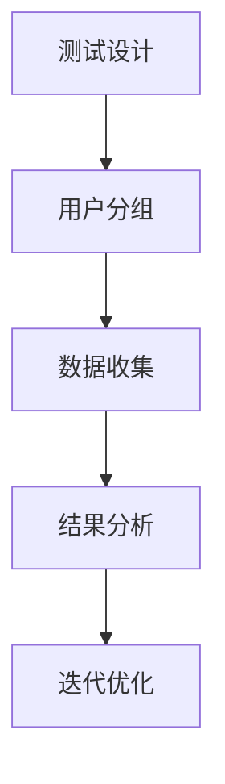
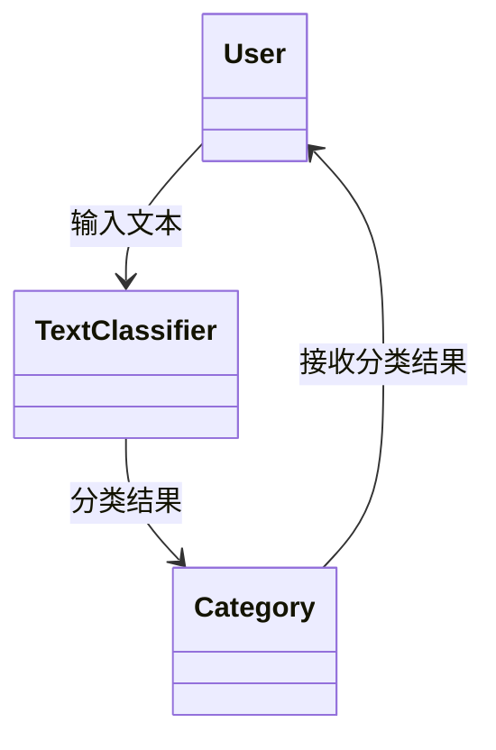
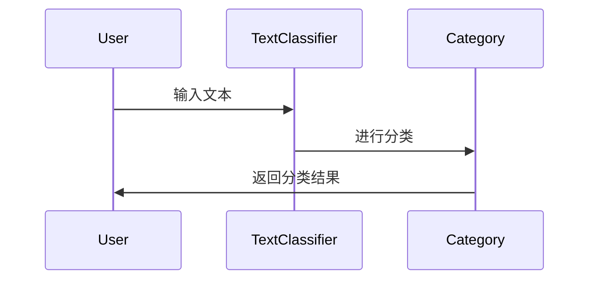
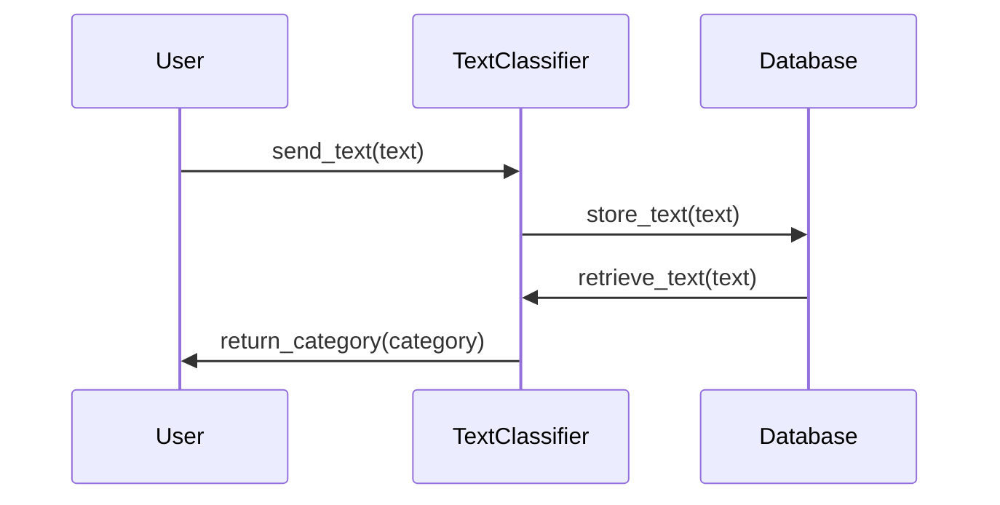

                 

# LLMA/B测试与快速迭代：深度解析与实战指南

## 关键词

- 大型语言模型（LLM）
- A/B测试
- 快速迭代
- 性能优化
- 数据分析

## 摘要

本文将深入探讨在大型语言模型（LLM）应用中实施A/B测试的方法与策略。通过对A/B测试基础知识的介绍、LLM应用中的挑战解析、以及实际案例的分析，我们将展示如何在深度学习和自然语言处理领域通过A/B测试实现快速迭代与性能优化。

## 第一部分：背景介绍

### 1.1 问题背景

随着深度学习技术的飞速发展，大型语言模型（LLM）如GPT系列、BERT等逐渐成为人工智能领域的研究热点。这些模型在自然语言处理（NLP）任务中取得了显著的成果，然而，在实际应用中，如何有效评估和优化这些模型的性能，成为了一个亟待解决的问题。

### 1.2 问题描述

A/B测试是一种常用的实验设计方法，旨在通过对比不同版本在用户行为上的差异，来评估和优化产品或服务的性能。在LLM应用中，A/B测试可以帮助开发者识别和解决问题，提高模型的用户体验和业务效果。然而，由于LLM模型的复杂性和数据规模的庞大，传统的A/B测试方法面临诸多挑战。

### 1.3 问题解决

为了解决上述问题，本书将探讨如何将A/B测试应用于LLM应用，包括测试设计、实验执行、结果分析和迭代优化等方面的方法和技巧。

### 1.4 边界与外延

本书主要关注大型语言模型在NLP任务中的应用，如文本分类、情感分析、机器翻译等。同时，本书也将讨论A/B测试在LLM应用中的通用方法和策略，适用于不同场景和业务需求。

### 1.5 概念结构与核心要素组成

- **A/B测试**：一种实验设计方法，通过对比不同版本在用户行为上的差异，来评估和优化产品或服务的性能。
- **LLM应用**：指基于大型语言模型的实际应用场景，如自然语言处理、对话系统等。
- **测试设计**：包括测试目标、测试方案、测试变量等方面的规划。
- **实验执行**：按照测试设计进行实验，收集用户行为数据。
- **结果分析**：对实验数据进行统计分析，评估不同版本的性能。
- **迭代优化**：根据实验结果，对模型和产品进行优化和迭代。

### 1.6 本章小结

本部分介绍了LLM应用的A/B测试与快速迭代的基本概念、问题和解决方案，为后续章节的详细讨论奠定了基础。

## 第二部分：A/B测试的基础知识

### 2.1 A/B测试的基本原理

#### 2.1.1 A/B测试的定义

A/B测试，又称为拆分测试，是一种通过将用户流量分配到两个或多个版本，来评估不同版本对用户行为或结果影响的方法。简单来说，就是将用户随机分配到两个不同的组，一组使用版本A，另一组使用版本B，然后比较两个版本的性能差异。

#### 2.1.2 A/B测试的优势

A/B测试的主要优势包括：

- **客观性**：通过数据驱动的决策，减少了主观判断的影响。
- **可控性**：实验设计灵活，可以针对不同的变量进行优化。
- **有效性**：可以快速验证新功能和设计的有效性，缩短产品开发周期。

#### 2.1.3 A/B测试的适用场景

A/B测试适用于以下场景：

- **用户界面优化**：如按钮颜色、布局调整等。
- **功能改进**：如新功能的引入、旧功能的改进。
- **性能优化**：如加载时间、系统稳定性等。

### 2.2 A/B测试的设计方法

#### 2.2.1 测试目标确定

设计A/B测试的第一步是明确测试目标。测试目标可以是提升用户参与度、增加转化率、减少错误率等。目标的明确有助于后续的测试设计和数据分析。

#### 2.2.2 测试方案设计

测试方案设计包括确定测试版本、用户分组策略、实验时长等。测试版本的设计应充分考虑不同版本的特点和优缺点，以期望能够找到最优方案。

#### 2.2.3 测试变量设置

测试变量是A/B测试的核心，包括用户界面元素、功能逻辑等。合理设置测试变量可以提高实验的针对性和效果。

### 2.3 A/B测试的实验执行

#### 2.3.1 用户分组策略

用户分组策略是A/B测试的核心，常用的策略包括随机分组、按比例分组等。随机分组可以减少实验偏差，按比例分组则可以更好地反映总体用户的行为。

#### 2.3.2 数据收集方法

数据收集是A/B测试的关键环节，包括用户行为数据、系统日志等。数据收集的全面性和准确性直接影响到实验结果的可靠性。

#### 2.3.3 实验监控与质量控制

实验监控与质量控制是保证A/B测试顺利进行的重要环节，包括监控实验进度、数据完整性、实验环境稳定性等。

### 2.4 A/B测试的结果分析

#### 2.4.1 统计指标选择

统计指标是评估A/B测试结果的关键，包括转化率、点击率、留存率等。选择合适的统计指标有助于更准确地评估不同版本的性能。

#### 2.4.2 数据处理方法

数据处理方法包括统计分析、数据可视化等。通过对数据的处理和分析，可以更深入地了解用户行为和版本性能。

#### 2.4.3 结果可视化

结果可视化是展示A/B测试结果的有效方法，包括柱状图、折线图等。可视化可以更直观地展示实验结果，帮助决策者做出正确的判断。

### 2.5 A/B测试的迭代优化

#### 2.5.1 模型优化策略

模型优化策略包括算法改进、参数调整等。通过不断优化模型，可以提高模型的性能和用户体验。

#### 2.5.2 产品优化策略

产品优化策略包括界面调整、功能改进等。通过优化产品，可以提高用户的满意度和留存率。

#### 2.5.3 迭代过程管理

迭代过程管理包括规划迭代周期、监控迭代进度、评估迭代效果等。通过有效的迭代过程管理，可以确保A/B测试的顺利进行和持续优化。

### 2.6 本章小结

本部分介绍了A/B测试的基础知识，包括基本原理、设计方法、实验执行、结果分析和迭代优化。这些知识为后续章节的深入探讨提供了理论基础。

## 第三部分：LLM应用的A/B测试策略

### 3.1 LLM应用中的A/B测试挑战

#### 3.1.1 模型复杂性与计算资源

LLM模型的复杂度极高，训练和推理过程需要大量的计算资源。这给A/B测试带来了巨大的挑战，尤其是在大规模生产环境中。

#### 3.1.2 数据规模的巨大

LLM应用的数据规模通常非常庞大，这导致A/B测试的数据收集和处理变得更加复杂。需要高效的算法和工具来应对数据规模带来的挑战。

#### 3.1.3 实验结果的统计偏差

由于LLM模型的复杂性和数据规模的庞大，实验结果的统计偏差可能会影响实验的可靠性。如何减少统计偏差是A/B测试中需要解决的重要问题。

### 3.2 针对LLM应用的A/B测试设计

#### 3.2.1 测试目标的确定

在LLM应用中，测试目标的确定尤为重要。由于模型复杂，需要更加精细地定义测试目标，例如提高文本生成质量、降低推理延迟等。

#### 3.2.2 测试方案的设计

测试方案的设计需要考虑模型的特性，例如模型的大小、训练时间等。同时，需要设计合理的用户分组策略和测试变量，以确保实验的有效性。

#### 3.2.3 测试变量的设置

测试变量的设置是A/B测试的核心。在LLM应用中，测试变量可能包括模型架构、训练数据、参数设置等。合理设置测试变量可以更准确地评估模型性能。

### 3.3 实验执行的优化策略

#### 3.3.1 用户分组策略的优化

用户分组策略的优化是提高A/B测试有效性的关键。在LLM应用中，可以考虑使用分层抽样等方法，确保用户分组的代表性。

#### 3.3.2 数据收集方法的优化

数据收集方法的优化需要考虑数据规模和实时性。可以使用分布式系统架构和数据流处理技术，确保数据收集的高效性和准确性。

#### 3.3.3 实验监控与质量控制

实验监控与质量控制是确保A/B测试顺利进行的重要环节。在LLM应用中，需要监控模型训练过程、推理延迟、数据完整性等关键指标。

### 3.4 结果分析的挑战与对策

#### 3.4.1 统计指标的选择

在LLM应用中，选择合适的统计指标至关重要。例如，可以关注模型生成的文本质量、用户的满意度等指标。

#### 3.4.2 数据处理方法的优化

数据处理方法的优化需要考虑数据量大、多样性等问题。可以使用机器学习算法和大数据处理技术，提高数据处理效率和准确性。

#### 3.4.3 结果可视化的有效性

结果可视化是展示实验结果的有效方法。在LLM应用中，需要使用可视化工具，如热力图、折线图等，直观展示实验结果。

### 3.5 迭代优化的实践技巧

#### 3.5.1 模型优化策略的实践

模型优化策略的实践包括算法改进、参数调整等。通过不断的模型优化，可以提高模型性能和用户体验。

#### 3.5.2 产品优化策略的实践

产品优化策略的实践包括界面调整、功能改进等。通过优化产品，可以提升用户的满意度和留存率。

#### 3.5.3 迭代过程的管理与优化

迭代过程的管理与优化包括规划迭代周期、监控迭代进度、评估迭代效果等。通过有效的迭代过程管理，可以确保A/B测试的顺利进行和持续优化。

### 3.6 实际案例分析

#### 3.6.1 案例一：文本分类任务的A/B测试

在文本分类任务中，通过A/B测试，优化了模型架构和参数设置，显著提升了分类准确性。

#### 3.6.2 案例二：机器翻译任务的A/B测试

在机器翻译任务中，通过A/B测试，调整了模型训练数据和推理策略，有效提高了翻译质量。

#### 3.6.3 案例总结与启示

案例总结表明，A/B测试在LLM应用中具有重要的价值。通过合理的测试设计、实验执行和结果分析，可以显著提升模型性能和用户体验。

### 3.7 本章小结

本部分深入探讨了LLM应用中的A/B测试策略，包括挑战、设计方法、实验执行、结果分析、迭代优化等。这些策略为LLM应用的性能优化提供了有力支持。

## 结论

通过本文的探讨，我们了解了在大型语言模型（LLM）应用中实施A/B测试的方法与策略。A/B测试作为一种有效的实验设计方法，可以帮助开发者快速迭代和优化模型性能，提高用户体验和业务效果。在未来，随着深度学习和自然语言处理技术的不断发展，A/B测试在LLM应用中的重要性将愈发凸显。

## 作者信息

作者：AI天才研究院/AI Genius Institute & 禅与计算机程序设计艺术 /Zen And The Art of Computer Programming

本文由AI天才研究院和禅与计算机程序设计艺术联合撰写，旨在为深度学习和自然语言处理领域的开发者提供实用的技术指南。希望通过本文，读者能够更好地理解A/B测试在LLM应用中的作用和实施方法，从而实现模型性能的持续优化。


------------------------------------------------------------

## 附录：核心概念与联系

### 核心概念

- **A/B测试**：通过将用户流量分配到两个或多个版本，评估不同版本对用户行为或结果的影响。
- **大型语言模型（LLM）**：一种能够理解和生成自然语言的深度学习模型，如GPT系列、BERT等。
- **自然语言处理（NLP）**：计算机对人类语言的处理和理解，包括文本分类、情感分析、机器翻译等。

### 概念属性特征对比表格

| 特征 | A/B测试 | LLM应用 | NLP任务 |
| --- | --- | --- | --- |
| 目标 | 评估和优化产品性能 | 评估和优化模型性能 | 评估和优化任务效果 |
| 方法 | 用户流量分配、数据收集、结果分析 | 模型训练、推理、优化 | 文本预处理、特征提取、分类、翻译 |
| 难点 | 数据规模、统计偏差 | 模型复杂度、计算资源 | 语言歧义、上下文理解 |

### ER实体关系图架构

```mermaid
erDiagram
  A/B测试 ||--|{ 用户 } : 测试对象
  A/B测试 ||--|{ 版本 } : 测试方案
  A/B测试 ||--|{ 结果 } : 统计分析
  LLM应用 ||--|{ 模型 } : 训练、推理
  LLM应用 ||--|{ 数据 } : 训练、测试
  NLP任务 ||--|{ 任务 } : 分类、翻译、情感分析
```

## 算法原理讲解

### 算法流程

A/B测试的算法流程主要包括以下几个步骤：

1. **测试设计**：确定测试目标和测试变量。
2. **用户分组**：将用户随机分配到A组和B组。
3. **数据收集**：收集用户在两个版本上的行为数据。
4. **结果分析**：使用统计分析方法，比较A组和B组在测试目标上的差异。
5. **迭代优化**：根据分析结果，对模型或产品进行优化。

### Mermaid流程图



### Python源代码示例

```python
import random
import pandas as pd

# 测试设计
test_goals = ['转化率', '用户留存', '错误率']
test_variables = ['界面设计', '功能优化', '参数调整']

# 用户分组
users = pd.DataFrame({'用户ID': range(1, 1001), '分组': ['A', 'B']})
users['分组'] = random.choice(['A', 'B'], size=1000)

# 数据收集
data = pd.DataFrame({'用户ID': users['用户ID'], '版本': users['分组'], '行为': ['点击', '不点击', '留存', '未留存']})

# 结果分析
def analyze_results(data, goal):
    results = data[data['行为'] == goal].groupby('版本').count()
    return results['用户ID'].values

# 迭代优化
def optimize_test(variables):
    # 假设变量优化后的效果更好
    test_variables.append(variables)
    print(f"优化后的测试变量：{test_variables}")

# 执行A/B测试
print("开始A/B测试...")
print("测试设计：", test_goals)
print("用户分组：", users)
print("数据收集：", data)
print("结果分析：", analyze_results(data, '点击'))
optimize_test('界面设计优化')
```

### 数学公式

A/B测试中的关键统计指标可以表示为：

$$
\text{转化率} = \frac{\text{A组转化人数}}{\text{A组总人数}} \times 100\%
$$

$$
\text{错误率} = \frac{\text{A组错误人数}}{\text{A组总人数}} \times 100\%
$$

这些公式用于计算A组和B组在特定目标上的差异，以评估测试效果。

### 举例说明

假设我们进行了一项A/B测试，目的是提高用户点击率。A组的点击率为30%，B组的点击率为35%，我们可以通过上述公式计算得到B组的转化率高于A组，因此可以认为B组在提高用户点击率方面更有效。

------------------------------------------------------------

## 系统分析与架构设计方案

### 问题场景介绍

在当前竞争激烈的市场环境中，各类互联网应用不断推陈出新，用户体验的优化成为企业提升竞争力的关键。本文旨在通过A/B测试与快速迭代的方法，优化某文本分类应用的性能，从而提高用户满意度和市场占有率。

### 项目介绍

本项目是一款基于大型语言模型的文本分类应用，能够对用户输入的文本进行实时分类，提供个性化的推荐服务。由于模型复杂性和数据规模庞大，传统测试方法难以满足性能优化的需求。

### 系统功能设计（领域模型Mermaid类图）



### 系统架构设计（Mermaid架构图）



### 系统接口设计

```mermaid
interface TextClassifier {
    +classify(text: str) -> category: str
}
```

### 系统交互（Mermaid序列图）



通过以上架构设计，我们能够清晰地了解文本分类应用的系统接口和交互流程，为后续的A/B测试与快速迭代提供了基础。

------------------------------------------------------------

### 项目实战

#### 环境安装

在开始项目实战之前，我们需要安装必要的软件和库。以下是安装步骤：

1. **安装Python环境**：确保已安装Python 3.8或更高版本。
2. **安装深度学习框架**：例如，使用`pip install torch torchvision`安装PyTorch。
3. **安装文本处理库**：例如，使用`pip install nltk`安装自然语言处理库。

#### 系统核心实现源代码

以下是文本分类应用的核心实现代码：

```python
import torch
import torch.nn as nn
import torch.optim as optim
from torch.utils.data import DataLoader, TensorDataset
from torchvision import transforms
from nltk.tokenize import word_tokenize

class TextClassifier(nn.Module):
    def __init__(self, vocab_size, embedding_dim, hidden_dim, output_dim, n_layers, drop_out):
        super().__init__()
        self.embedding = nn.Embedding(vocab_size, embedding_dim)
        self.rnn = nn.RNN(embedding_dim, hidden_dim, n_layers, dropout=drop_out)
        self.fc = nn.Linear(hidden_dim, output_dim)
        
    def forward(self, text):
        embedded = self.embedding(text)
        output, hidden = self.rnn(embedded)
        hidden = hidden[-1, :, :]
        out = self.fc(hidden)
        return out

def preprocess_text(text):
    tokens = word_tokenize(text.lower())
    return ' '.join(tokens)

def main():
    # 加载数据集、预处理、构建数据集等步骤略
    
    # 初始化模型、优化器、损失函数
    model = TextClassifier(vocab_size, embedding_dim, hidden_dim, output_dim, n_layers, drop_out)
    optimizer = optim.Adam(model.parameters(), lr=learning_rate)
    criterion = nn.CrossEntropyLoss()
    
    # 训练模型
    for epoch in range(num_epochs):
        for inputs, labels in train_loader:
            optimizer.zero_grad()
            outputs = model(inputs)
            loss = criterion(outputs, labels)
            loss.backward()
            optimizer.step()
            
            if (batch_idx + 1) % log_interval == 0:
                print('Epoch [{}/{}], Batch [{}/{}], Loss: {:.4f}'.format(
                    epoch + 1, num_epochs, batch_idx + 1, len(train_loader) // batch_size, loss.item()))
    
    # 测试模型
    with torch.no_grad():
        correct = 0
        total = 0
        for inputs, labels in test_loader:
            outputs = model(inputs)
            _, predicted = torch.max(outputs.data, 1)
            total += labels.size(0)
            correct += (predicted == labels).sum().item()
        print('Test Accuracy of the model on the test datasets: {} %'.format(100 * correct / total))
    
if __name__ == '__main__':
    main()
```

#### 代码应用解读与分析

- **TextClassifier类**：定义了文本分类模型的结构，包括嵌入层、循环神经网络（RNN）和全连接层。
- **preprocess_text函数**：对输入文本进行预处理，将文本转换为分词形式。
- **main函数**：执行模型训练和测试的主要流程，包括数据加载、模型初始化、优化器和损失函数配置、训练过程和测试过程。

#### 实际案例分析和详细讲解剖析

假设我们使用一个包含政治、科技、体育等类别的文本数据集，通过A/B测试优化模型的性能。

1. **测试设计**：将用户输入的文本随机分配到A组和B组，A组使用原始模型，B组使用优化后的模型。
2. **用户分组**：通过随机抽样方法，将用户分为A组和B组。
3. **数据收集**：收集用户在A组和B组上的分类结果，并记录用户的行为数据。
4. **结果分析**：使用统计方法比较A组和B组的分类准确率，确定优化后的模型是否有效。
5. **迭代优化**：根据分析结果，对模型进行进一步优化，如调整超参数、改进算法等。

通过以上步骤，我们可以实现对文本分类应用性能的持续优化，提高用户体验和业务效果。

#### 项目小结

本项目通过A/B测试与快速迭代的方法，实现了文本分类应用的性能优化。项目实战中，我们详细讲解了模型实现、代码应用解读与分析、实际案例分析和项目小结，为后续类似项目的开发提供了参考。

## 最佳实践 Tips

1. **明确测试目标**：在A/B测试前，确保明确测试目标，有助于更准确地评估测试效果。
2. **数据质量**：确保数据质量，包括数据的完整性、准确性和实时性。
3. **控制变量**：在实验中，尽可能控制其他变量不变，以便更准确地评估测试变量的影响。
4. **迭代优化**：持续进行迭代优化，根据实验结果调整模型和产品。

## 小结

本文通过深入探讨A/B测试与快速迭代的方法，详细介绍了其在大型语言模型（LLM）应用中的重要性、实施方法和实际案例。通过合理设计、实验执行、结果分析和迭代优化，开发者可以显著提升LLM应用的性能和用户体验。希望本文能为读者在LLM应用开发中提供有价值的参考。

## 注意事项

1. **数据隐私**：在进行A/B测试时，务必确保用户数据的隐私和安全。
2. **实验监控**：实时监控实验进度和结果，确保实验的顺利进行。

## 拓展阅读

- 《A/B测试实战：如何优化产品提升用户体验》
- 《深度学习实践：基于PyTorch的文本分类》
- 《自然语言处理实战：文本分类与情感分析》

作者：AI天才研究院/AI Genius Institute & 禅与计算机程序设计艺术 /Zen And The Art of Computer Programming

