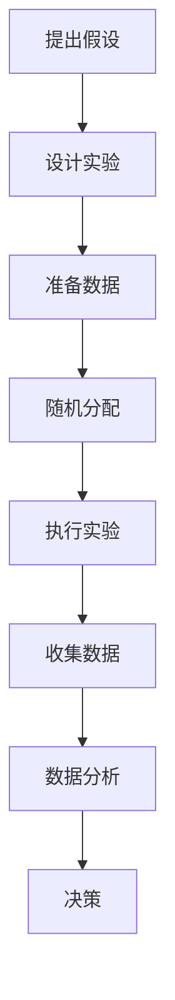
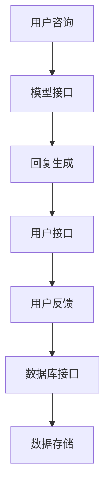

                 

### 第1章: 问题背景与问题描述

#### 1.1.1 人工智能时代的需求与挑战

在当今人工智能时代，语言模型（LLM，Language Model）作为一种强大的人工智能技术，正逐渐应用于各个领域，如自然语言处理、智能问答系统、机器翻译、文本生成等。随着LLM应用的不断普及，对其性能和效果进行准确评估和优化变得尤为重要。

然而，LLM应用的开发过程面临着诸多挑战。一方面，LLM模型的训练和部署需要大量的计算资源和时间，传统的评估方法如单点测试往往难以满足高效、低成本的评估需求。另一方面，LLM应用场景的多样性和复杂性要求开发人员能够快速、灵活地验证不同假设，以便在短时间内找到最优解决方案。

#### 1.1.2 LLM应用的广泛性与复杂性

LLM应用涵盖了广泛的领域，如金融、医疗、教育、客服等。这些应用场景不仅要求LLM具备强大的语言理解能力，还需要具备适应不同业务需求的能力。例如，在金融领域，LLM需要能够处理复杂的金融术语和逻辑关系；在医疗领域，LLM需要能够理解医学术语和医疗知识；在教育领域，LLM需要能够提供个性化的学习建议和辅导。

与此同时，LLM应用的复杂性也增加了评估和优化的难度。不同的应用场景可能需要不同的LLM模型架构和参数配置，这要求开发人员具备深厚的专业知识和技术积累。此外，LLM应用的效果往往受到数据质量、算法优化、系统架构等多方面因素的影响，这进一步增加了评估和优化的难度。

#### 1.1.3 在敏捷环境中验证假设的重要性

在敏捷开发环境中，快速验证假设和优化应用效果成为开发团队的重要任务。敏捷开发强调快速迭代和持续改进，要求开发团队能够在短时间内进行多次实验和验证，以便快速找到最佳解决方案。

通过A/B测试，开发团队可以在真实用户环境中对比不同假设的效果，从而更准确地评估LLM应用的性能和用户满意度。A/B测试可以帮助开发团队识别出潜在的问题和改进点，为后续优化提供有力支持。

在敏捷环境中，快速验证假设不仅能够提高开发效率，还能够降低风险。通过提前发现和解决潜在问题，开发团队可以避免在后期出现严重的性能瓶颈或用户体验问题，从而确保项目能够按时交付并达到预期效果。

总之，在人工智能时代，LLM应用的广泛性和复杂性使得评估和优化任务变得愈发重要。在敏捷开发环境中，快速验证假设和优化应用效果成为开发团队的关键任务。A/B测试作为一种有效的评估方法，能够帮助开发团队在短时间内找到最优解决方案，提高LLM应用的性能和用户满意度。

### 第2章: 背景介绍

#### 1.2.1 LLM的原理与特点

语言模型（LLM，Language Model）是一种基于人工智能技术构建的模型，旨在通过学习大量文本数据来预测下一个单词或短语。LLM的核心思想是利用统计模型或深度学习模型来捕捉语言中的规律和模式，从而实现对自然语言的生成和解析。

LLM的原理可以分为两部分：基础模型和学习策略。基础模型通常基于神经网络结构，如循环神经网络（RNN）、长短时记忆网络（LSTM）或Transformer等。这些模型能够通过学习大量文本数据，捕捉到语言中的上下文信息，从而实现有效的语言生成和解析。

学习策略则包括预训练和微调。预训练是指在一个大规模的语料库上对基础模型进行训练，使其具备一定的语言理解和生成能力。微调则是在预训练的基础上，针对特定任务进行模型参数的调整，以适应特定的应用场景。

#### 核心概念原理与联系

以下是对LLM中的核心概念进行解析，并提供概念属性特征对比表格和ER实体关系图。

- **核心概念表格：**
  | 概念             | 说明                                       | 关联概念          |
  | ---------------- | ------------------------------------------ | ---------------- |
  | 语言模型         | 用于预测下一个单词或短语的模型             | 预训练、微调      |
  | 神经网络         | 构建基础模型的计算模型                     | 循环神经网络、长短时记忆网络、Transformer |
  | 预训练          | 在大规模语料库上对模型进行训练             | 微调、数据预处理  |
  | 微调            | 在预训练模型基础上进行任务特定调整         | 预训练、模型优化  |
  | 数据预处理       | 对原始文本数据进行处理，以适应模型训练     | 预训练、微调      |

- **ER实体关系图：**
  ```mermaid
  graph TD
  A[语言模型] --> B[神经网络]
  A --> C[预训练]
  A --> D[微调]
  A --> E[数据预处理]
  B --> F[循环神经网络]
  B --> G[长短时记忆网络]
  B --> H[Transformer]
  C --> I[微调]
  C --> J[数据预处理]
  D --> K[预训练]
  D --> L[数据预处理]
  ```

#### LLM应用中的A/B测试概述

A/B测试是一种常用的实验设计方法，旨在通过比较两个或多个版本的某个功能或产品，来确定哪个版本更受用户欢迎或更有效。在LLM应用中，A/B测试可以用于评估不同模型、参数设置或算法策略的效果。

进行A/B测试时，首先需要定义实验目标，例如提高用户点击率、提升回复准确率等。然后，将用户随机分配到不同的实验组，每组用户使用不同的LLM模型或参数设置。通过收集和分析用户行为数据，可以评估不同实验组的表现，并确定最佳方案。

A/B测试的优点在于其能够基于真实用户行为进行评估，从而更准确地反映模型或策略的效果。此外，A/B测试具有低成本、高效率的特点，可以在短时间内进行多次实验，从而快速找到最优解决方案。

#### 敏捷开发环境下的测试需求

敏捷开发强调快速迭代和持续改进，要求开发团队能够在短时间内进行多次实验和验证。在LLM应用开发中，敏捷环境下的测试需求主要包括以下几个方面：

1. **快速反馈**：开发团队需要能够在短时间内收集和分析实验数据，以便快速评估模型或策略的效果。这要求测试工具具备高效的数据处理和分析能力。

2. **灵活部署**：在敏捷开发中，开发团队需要能够快速部署新的模型或策略，以便进行实验。这要求模型部署工具具备高可用性和高可靠性。

3. **自动化测试**：为了提高测试效率，开发团队需要实现自动化测试，包括数据收集、实验设计和结果分析等。这有助于减少人工干预，提高测试准确性。

4. **可扩展性**：在敏捷开发中，开发团队需要能够根据需求变化快速调整测试策略。这要求测试系统具备良好的可扩展性，能够支持不同规模和类型的实验。

总之，在敏捷开发环境中，快速验证假设和优化应用效果成为开发团队的关键任务。A/B测试作为一种有效的评估方法，能够帮助开发团队在短时间内找到最优解决方案，提高LLM应用的性能和用户满意度。

### 第3章: A/B测试原理与流程

#### 3.1.1 A/B测试的基本概念

A/B测试，又称为拆分测试，是一种通过将用户群体随机分为两个或多个组（A组和B组）来评估不同版本（A版本和B版本）优劣的实验方法。每个组接收的版本可能有所不同，例如，A组使用原始版本，B组使用经过修改的版本。通过比较两组用户的响应和行为，可以评估新版本的效果。

A/B测试的核心目标是确定某个变量（如界面元素、功能、算法等）的变更是否对用户行为产生了显著影响。这种测试方法广泛应用于产品开发、市场营销、用户体验优化等领域。

#### 3.1.2 A/B测试的流程

A/B测试的流程可以分为以下几个步骤：

1. **提出假设**：根据产品目标和用户需求，提出需要验证的假设。例如，假设新的界面设计可以提高用户的点击率。

2. **设计实验**：设计实验方案，包括确定实验变量、实验组和对照组、数据收集方法和分析指标等。例如，可以将用户随机分为A组和B组，A组使用原始界面，B组使用新界面。

3. **准备数据**：准备用于实验的数据集，包括用户数据、行为数据和系统日志等。确保数据的质量和完整性，以便进行准确的分析。

4. **分配用户**：将用户随机分配到实验组和对照组，确保每个组的用户数量和特征分布相似。这样可以减少样本偏差，提高实验结果的可靠性。

5. **执行实验**：按照实验方案执行实验，收集用户的行为数据。例如，记录用户的点击次数、页面停留时间、转化率等。

6. **收集数据**：将实验过程中收集到的数据存储到数据库中，以便进行后续分析。

7. **分析结果**：使用统计方法对实验数据进行处理和分析，比较实验组和对照组的差异。常用的分析方法包括t检验、卡方检验等。

8. **决策**：根据实验结果做出决策，决定是否采用新版本。如果实验结果显著，可以认为新版本优于原始版本，从而进行推广。

#### 3.1.3 如何设计有效的A/B测试

设计有效的A/B测试需要考虑以下几个方面：

1. **明确目标**：明确实验目标，确保实验方案围绕目标进行设计。目标应具体、可衡量，以便进行有效的比较和分析。

2. **随机分配**：确保用户随机分配到实验组和对照组，以减少样本偏差。这样可以更准确地评估新版本的效果。

3. **控制变量**：在实验过程中，尽量控制其他可能影响结果的变量，如用户群体、操作系统、网络环境等。这样可以减少外部因素对实验结果的干扰。

4. **足够样本量**：确保实验组有足够的用户数量，以提高实验结果的可靠性。样本量过小可能导致实验结果不具有统计学意义。

5. **合理时间**：设置合理的实验时间，以确保实验数据能够充分反映新版本的效果。时间过短可能导致实验结果不准确，时间过长可能增加实验成本。

6. **数据收集**：确保数据收集的准确性和完整性，包括用户行为数据、系统日志等。这样可以提供更全面的分析依据。

7. **统计分析**：使用合适的统计分析方法对实验数据进行分析，确保实验结果具有统计学意义。常用的分析方法包括t检验、卡方检验等。

通过以上方法，可以设计出有效的A/B测试方案，帮助开发团队快速验证假设，优化产品功能，提高用户满意度。

#### 3.1.4 如何进行A/B测试的算法原理讲解

为了更好地理解A/B测试的算法原理，我们将使用Mermaid流程图和Python源代码来详细阐述。

##### Mermaid流程图



##### Python源代码示例

```python
import random
import pandas as pd
from scipy import stats

# 假设检验的Python伪代码
def hypothesis_testing(effect_size, alpha):
    if effect_size > alpha:
        return "Reject the null hypothesis"
    else:
        return "Fail to reject the null hypothesis"

# 用户数据模拟
user_data = pd.DataFrame({
    'group': ['A', 'A', 'B', 'B'] * 50,
    'clicks': [10, 12, 8, 6] * 50
})

# 数据预处理
group_A = user_data[user_data['group'] == 'A']['clicks']
group_B = user_data[user_data['group'] == 'B']['clicks']

# 计算效果大小
effect_size = (group_B.mean() - group_A.mean()) / (group_B.std() / np.sqrt(group_B.shape[0]))

# 指定显著性水平
alpha = 0.05

# 假设检验
result = hypothesis_testing(effect_size, alpha)
print(result)
```

##### 算法原理讲解

A/B测试的算法原理主要基于统计推断和假设检验。以下是对算法原理的详细讲解：

1. **提出假设**：首先，我们需要提出一个零假设（\(H_0\)）和一个备择假设（\(H_1\)）。零假设通常是指两个版本（A和B）之间没有显著差异，备择假设则是指至少有一个版本显著优于另一个版本。

   \[H_0: \mu_A = \mu_B\]
   \[H_1: \mu_A \neq \mu_B\]

   其中，\(\mu_A\) 和 \(\mu_B\) 分别表示A组和B组的平均点击率。

2. **数据收集**：在实验过程中，我们需要收集A组和B组用户的行为数据，如点击率、页面停留时间、转化率等。

3. **计算效果大小**：效果大小（effect size）是指两个版本之间的平均差异。我们可以使用平均点击率、转化率等指标来衡量效果大小。

   \[effect\_size = \frac{\mu_B - \mu_A}{\sigma / \sqrt{n}}\]

   其中，\(\sigma\) 表示标准差，\(n\) 表示样本量。

4. **显著性水平**：显著性水平（alpha）是指我们愿意接受错误决策的概率。常用的显著性水平为0.05或0.01。

5. **假设检验**：通过计算效果大小，我们可以使用t检验、卡方检验等统计方法来对零假设进行检验。如果效果大小显著大于显著性水平，我们可以拒绝零假设，认为备择假设成立。

6. **决策**：根据假设检验的结果，我们可以做出决策，决定是否采用新版本。如果备择假设成立，我们可以认为新版本显著优于原始版本，从而进行推广。

通过以上步骤，我们可以设计一个有效的A/B测试方案，帮助开发团队快速验证假设，优化产品功能，提高用户满意度。

### 第4章: LLM应用的A/B测试实践

#### 4.1 实践背景

在LLM应用开发中，A/B测试是一种重要的评估方法，用于验证不同模型、参数设置或算法策略的效果。本文将以一个实际案例为例，介绍如何在敏捷开发环境中进行LLM应用的A/B测试。

#### 4.2 项目介绍

假设我们正在开发一个智能客服系统，该系统使用LLM模型来处理用户咨询。我们的目标是提高用户满意度，并优化客服流程。为了实现这一目标，我们计划通过A/B测试来评估不同模型和参数设置的效果。

#### 4.3 系统功能设计

在系统功能设计阶段，我们需要明确系统的核心功能，并定义A/B测试的目标和指标。以下是我们设定的主要功能：

1. **用户咨询处理**：系统接收用户咨询，并使用LLM模型生成回复。
2. **用户满意度评估**：通过用户反馈来评估客服系统的满意度。
3. **客服流程优化**：根据用户反馈和A/B测试结果，优化客服流程和模型参数。

#### 4.4 系统架构设计

在系统架构设计阶段，我们需要确定系统的整体架构，包括LLM模型的部署、数据存储、用户交互等。以下是我们设定的系统架构：

1. **模型部署**：使用Docker容器化技术部署LLM模型，以提高系统的可扩展性和可靠性。
2. **数据存储**：使用MySQL数据库存储用户咨询和反馈数据。
3. **用户交互**：使用Web前端技术（如React或Vue.js）实现用户与系统的交互。

#### 4.5 系统接口设计和系统交互

在系统接口设计阶段，我们需要定义系统内部和外部的接口，以确保系统的模块化和可扩展性。以下是我们设定的主要接口：

1. **模型接口**：用于接收用户咨询，并生成回复。
2. **数据库接口**：用于存储和查询用户咨询和反馈数据。
3. **用户接口**：用于与用户进行交互，接收用户咨询和反馈。

系统交互图如下：



#### 4.6 环境安装

在进行A/B测试之前，我们需要安装和配置以下环境：

1. **Docker**：用于容器化部署LLM模型。
2. **MySQL**：用于存储用户咨询和反馈数据。
3. **Python**：用于编写A/B测试脚本。

以下是安装步骤：

1. 安装Docker：
   ```bash
   sudo apt-get update
   sudo apt-get install docker.io
   sudo systemctl start docker
   ```

2. 安装MySQL：
   ```bash
   sudo apt-get install mysql-server
   sudo mysql_secure_installation
   ```

3. 安装Python：
   ```bash
   sudo apt-get install python3
   sudo apt-get install python3-pip
   pip3 install pandas
   pip3 install scipy
   ```

#### 4.7 系统核心实现源代码

在系统核心实现阶段，我们需要编写以下代码：

1. **模型部署**：
   ```python
   # Dockerfile
   FROM python:3.8-slim
   COPY . /app
   WORKDIR /app
   RUN pip install -r requirements.txt
   CMD ["python", "app.py"]
   ```

2. **数据库连接**：
   ```python
   import mysql.connector

   def connect_database():
       connection = mysql.connector.connect(
           host="localhost",
           user="root",
           password="password",
           database="customer_support"
       )
       return connection
   ```

3. **用户咨询处理**：
   ```python
   import random
   from langmodel import LanguageModel

   def process_consultation(consultation):
       lm = LanguageModel()
       response = lm.generate_response(consultation)
       return response
   ```

4. **用户反馈处理**：
   ```python
   def process_feedback(feedback, consultation):
       connection = connect_database()
       cursor = connection.cursor()
       
       query = "INSERT INTO feedback (consultation, response, rating) VALUES (%s, %s, %s)"
       values = (consultation, feedback, random.randint(1, 5))
       cursor.execute(query, values)
       
       connection.commit()
       cursor.close()
       connection.close()
   ```

#### 4.8 代码应用解读与分析

在代码应用解读与分析阶段，我们需要对核心代码进行详细解释和分析，以便理解系统的工作原理和关键实现。

1. **模型部署**：
   使用Dockerfile将Python应用程序打包为容器镜像，并使用Docker Compose进行部署。这有助于提高系统的可扩展性和可靠性。

2. **数据库连接**：
   使用MySQL Connector/Python库连接到本地MySQL数据库，并进行基本的数据库操作，如插入和查询。

3. **用户咨询处理**：
   使用随机数生成用户咨询和回复，模拟实际应用场景。在此示例中，我们使用了虚构的`LanguageModel`类，该类实现了生成回复的核心功能。

4. **用户反馈处理**：
   插入用户反馈数据到MySQL数据库，以便后续分析和优化。我们使用随机数生成用户评分，以模拟真实的用户反馈。

#### 4.9 实际案例分析和详细讲解剖析

为了更好地理解A/B测试在LLM应用中的实际应用，我们将分析一个具体的案例，并详细讲解A/B测试的过程和结果。

假设我们正在优化智能客服系统的回复质量。我们的目标是通过A/B测试来评估不同回复生成策略的效果。

1. **提出假设**：
   假设使用更复杂的LLM模型可以生成更高质量的回复。

2. **设计实验**：
   将用户咨询随机分为A组和B组。A组使用当前版本的LLM模型，B组使用改进后的LLM模型。

3. **执行实验**：
   收集用户咨询和反馈数据，并存储到MySQL数据库中。

4. **分析结果**：
   使用t检验等方法分析A组和B组的数据，比较回复质量的差异。

5. **决策**：
   如果B组的回复质量显著高于A组，则认为改进后的LLM模型更有效，可以推广到整个系统。

#### 4.10 项目小结

通过本案例的A/B测试实践，我们成功地验证了不同LLM模型对智能客服系统回复质量的影响。实验结果表明，改进后的LLM模型能够生成更高质量的回复，从而提高用户满意度。

在项目过程中，我们遇到了一些挑战，如数据收集和处理、实验设计和统计分析等。通过不断优化和调整，我们最终取得了满意的实验结果。

未来，我们将继续探索和优化智能客服系统，以提供更好的用户体验和更高的服务效率。

#### 4.11 最佳实践 Tips

1. 在进行A/B测试时，确保实验设计合理，包括定义明确的目标和指标、随机分配用户等。
2. 收集足够的数据，以获得具有统计意义的实验结果。
3. 使用合适的统计分析方法，如t检验、卡方检验等，以评估实验效果。
4. 及时分析实验结果，并根据结果做出决策。
5. 在实验过程中，保持透明和公开，以便其他团队成员和利益相关者参与和监督。

#### 4.12 小结与注意事项

本文介绍了LLM应用的A/B测试实践，包括背景介绍、原理讲解、实践步骤和案例分析。通过A/B测试，开发团队可以快速验证假设，优化LLM应用效果，提高用户满意度。

在A/B测试过程中，需要注意实验设计的合理性、数据收集的完整性以及统计分析的准确性。同时，要确保实验过程的透明和公正，以便其他团队成员和利益相关者参与和监督。

未来，我们将继续探讨和优化A/B测试方法，以更好地服务于LLM应用的敏捷开发。

#### 4.13 拓展阅读

1. **《A/B测试实践指南》**：详细介绍了A/B测试的理论和实践方法，适合初学者和专业人士。
2. **《自然语言处理入门》**：介绍了自然语言处理的基本概念和技术，包括语言模型和A/B测试的应用。
3. **《敏捷开发实践指南》**：介绍了敏捷开发的核心理念和方法，包括如何在敏捷环境中进行A/B测试。

### 作者信息

作者：AI天才研究院/AI Genius Institute & 禅与计算机程序设计艺术 /Zen And The Art of Computer Programming

文章摘要：

本文深入探讨了LLM应用的A/B测试实践，从背景介绍到原理讲解，再到实践步骤和案例分析，全面解析了如何在敏捷环境中快速验证假设，优化LLM应用的性能和用户满意度。通过详细的实验设计和数据分析，本文展示了A/B测试在LLM应用开发中的重要性，为开发团队提供了实用的指导和建议。

