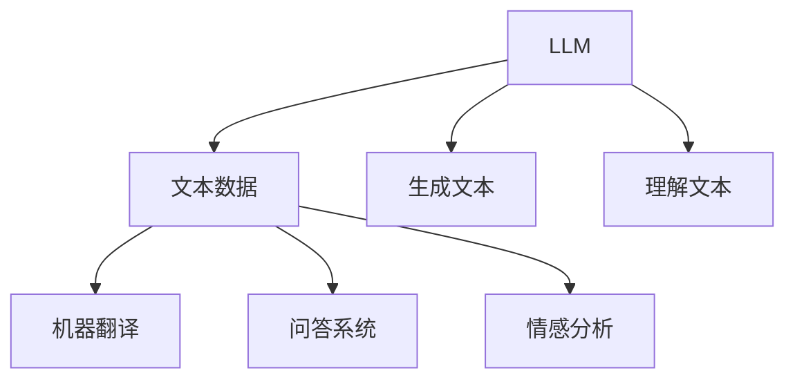

                 


## 第一部分: 引言和背景

### 第1章: LLM应用与Sprint规划会议概述

#### 1.1 LLM的概念及其重要性

LLM（Large Language Model）是指大型语言模型，是一种基于深度学习技术的自然语言处理（NLP）模型。LLM通过学习海量文本数据，能够自动生成文本、理解文本语义以及进行文本转换。LLM在许多领域都有广泛应用，如文本生成、机器翻译、问答系统、情感分析等。

**LLM的定义：** LLM是一种复杂的机器学习模型，通过训练大规模的神经网络来学习文本数据的特征，从而实现对文本的生成、理解和转换。

**LLM的应用场景：** LLM可以应用于文本生成，如生成文章、新闻、报告等；机器翻译，如将一种语言翻译成另一种语言；问答系统，如基于对话生成回答问题；情感分析，如分析文本的情感倾向等。

**LLM的优势与挑战：** LLM的优势在于其强大的文本生成和理解能力，可以处理复杂的自然语言任务。然而，LLM的挑战在于其训练过程需要大量的计算资源和时间，且存在模型过拟合、数据偏见等问题。

#### 1.2 Sprint规划会议的概念

**Sprint的定义：** Sprint是敏捷开发中的一个迭代周期，通常持续2-4周。在Sprint期间，开发团队会集中精力完成一组预定的任务。

**Sprint规划会议的目的：** Sprint规划会议是为了在Sprint开始前，明确团队的目标和计划。通过会议，团队可以讨论用户故事、设定优先级、估算任务时间等。

**Sprint与敏捷开发的关系：** Sprint是敏捷开发的核心概念之一，它帮助团队在快速变化的环境中保持高效和灵活性。通过定期进行Sprint，团队可以持续迭代和改进产品。

#### 1.3 设定短期目标的重要性

在Sprint规划会议中，设定短期目标是至关重要的。短期目标有助于团队明确方向、集中精力，并确保在有限的时间内取得实际成果。

**问题背景与问题描述：** 在复杂的项目中，任务繁多且变化快，如果没有明确的短期目标，团队可能会迷失方向，无法高效地完成任务。

**问题解决方法：** 设定短期目标可以帮助团队明确任务优先级，合理安排时间和资源，从而提高工作效率。

**边界与外延：** 短期目标的设定需要考虑项目的整体进度、团队的实际情况以及用户的期望。同时，短期目标需要与长期目标相协调，确保项目的可持续发展。

---

**核心概念术语说明：**

- **LLM（Large Language Model）：** 大型语言模型，是一种复杂的机器学习模型，用于自然语言处理任务。
- **Sprint：** 敏捷开发中的一个迭代周期，通常持续2-4周。
- **短期目标：** 在Sprint规划会议中设定的具体任务和目标，用于指导团队的工作。

**问题背景与问题描述：** 在复杂的项目中，任务繁多且变化快，如果没有明确的短期目标，团队可能会迷失方向，无法高效地完成任务。

**问题解决方法：** 设定短期目标可以帮助团队明确任务优先级，合理安排时间和资源，从而提高工作效率。

**边界与外延：** 短期目标的设定需要考虑项目的整体进度、团队的实际情况以及用户的期望。同时，短期目标需要与长期目标相协调，确保项目的可持续发展。

---

**核心概念属性特征对比表格：**

| 特征           | 说明                                                         |
| -------------- | ------------------------------------------------------------ |
| 大型语言模型   | 能够处理大规模文本数据，生成和理解自然语言。                   |
| Sprint         | 敏捷开发中的迭代周期，用于集中完成一组任务。                   |
| 短期目标       | 具体的任务和目标，用于指导团队在Sprint期间的工作。             |

**ER实体关系图架构：**



---

**结论：** 通过本章节的介绍，我们了解了LLM的应用和重要性，以及Sprint规划会议的概念和设定短期目标的重要性。在接下来的章节中，我们将深入探讨LLM的基础知识和Sprint规划会议的详细步骤。

---

**下一步：** 接下来，我们将进入第二部分，详细讲解LLM的基础知识，包括LLM的概念、工作原理和常见类型。

---

## 第2章: LLM基础

### 2.1 LLM的概念与工作原理

LLM（Large Language Model）是一种基于神经网络的自然语言处理模型，通过学习海量文本数据来理解和生成自然语言。LLM的工作原理主要包括两个部分：预训练和微调。

**预训练：** 预训练是指将模型在大量文本数据上进行训练，以学习文本数据的特征和模式。在预训练过程中，模型通过自动编码器（Autoencoder）和生成对抗网络（GAN）等技术来学习文本的潜在分布。

**微调：** 微调是指将预训练好的模型在特定任务上进行训练，以适应特定领域的需求。在微调过程中，模型通过调整参数来提高在特定任务上的性能。

**LLM的基本原理：** LLM的基本原理是通过学习文本数据的特征，构建一个能够生成和理解自然语言的模型。LLM通过使用神经网络和深度学习技术来学习文本数据的特征，从而实现自然语言处理任务。

**常见的LLM架构：**

1. **基于词嵌入的模型：** 如Word2Vec、GloVe等，这些模型将单词映射到低维向量空间中，从而实现文本数据的向量表示。
2. **基于转换器的模型：** 如Transformer、BERT等，这些模型通过自注意力机制（Self-Attention）来学习文本数据的特征，从而实现高效的文本生成和理解。
3. **基于预训练模型的模型：** 如GPT、T5等，这些模型在预训练阶段使用大量文本数据进行训练，然后在特定任务上进行微调。

**LLM的训练过程：** LLM的训练过程主要包括数据预处理、模型训练和评估三个阶段。在数据预处理阶段，需要对文本数据进行分词、去噪、标准化等处理。在模型训练阶段，模型通过反向传播算法和梯度下降方法来更新参数。在评估阶段，通过在测试数据集上评估模型的性能，来调整模型参数和优化模型。

### 2.2 LLM的常见类型

**基于词嵌入的模型：** 基于词嵌入的模型将单词映射到低维向量空间中，从而实现文本数据的向量表示。常见的词嵌入模型有Word2Vec、GloVe等。

1. **Word2Vec：** Word2Vec是一种基于神经网络的语言模型，通过训练单词的隐向量来表示单词。Word2Vec模型主要分为两个版本：CBOW（Continuous Bag of Words）和Skip-gram。
2. **GloVe：** GloVe（Global Vectors for Word Representation）是一种基于全局统计信息的词向量模型，通过优化单词的共现矩阵来学习词向量。

**基于转换器的模型：** 基于转换器的模型通过自注意力机制（Self-Attention）来学习文本数据的特征，从而实现高效的文本生成和理解。常见的转换器模型有Transformer、BERT等。

1. **Transformer：** Transformer是一种基于自注意力机制的转换模型，用于序列到序列的任务，如机器翻译、文本生成等。
2. **BERT：** BERT（Bidirectional Encoder Representations from Transformers）是一种双向转换器模型，通过预先训练大量文本数据，然后在特定任务上进行微调，从而实现文本的深度理解。

**基于预训练模型的模型：** 基于预训练模型的模型在预训练阶段使用大量文本数据进行训练，然后在特定任务上进行微调。常见的预训练模型有GPT、T5等。

1. **GPT：** GPT（Generative Pre-trained Transformer）是一种预训练的转换器模型，通过生成文本数据来学习文本的特征。
2. **T5：** T5（Text-To-Text Transfer Transformer）是一种基于预训练的转换器模型，通过将任何任务表示为文本到文本的转换，从而实现任务的高效迁移。

**LLM的应用场景：**

1. **文本生成：** 如文章生成、新闻写作、报告生成等。
2. **机器翻译：** 如将一种语言翻译成另一种语言。
3. **问答系统：** 如回答用户提出的问题。
4. **情感分析：** 如分析文本的情感倾向。

---

**核心概念与联系：**

- **LLM（Large Language Model）：** 大型语言模型，通过学习海量文本数据来生成和理解自然语言。
- **预训练：** 在大量文本数据上进行训练，以学习文本数据的特征和模式。
- **微调：** 在特定任务上进行训练，以适应特定领域的需求。
- **词嵌入：** 将单词映射到低维向量空间中，从而实现文本数据的向量表示。
- **转换器：** 通过自注意力机制来学习文本数据的特征，从而实现高效的文本生成和理解。

---

**算法原理讲解：**

**LLM的算法原理：** LLM的核心算法是转换器（Transformer），它通过自注意力机制（Self-Attention）来学习文本数据的特征。自注意力机制允许模型在处理每个词时，考虑其他所有词的信息，从而提高文本理解的能力。

**数学模型和公式：**

1. **自注意力机制：** 自注意力机制是一种计算词与词之间关联度的方法。其数学模型可以表示为：
   $$
   \text{Attention}(Q, K, V) = \text{softmax}\left(\frac{QK^T}{\sqrt{d_k}}\right) V
   $$
   其中，$Q$、$K$、$V$ 分别是查询向量、键向量、值向量，$d_k$ 是键向量的维度。

2. **编码器：** 编码器（Encoder）是LLM的核心组件，它通过多个自注意力层和全连接层来处理输入序列。其数学模型可以表示为：
   $$
   E = \text{Encoder}(X) = \text{MLP}(\text{SA}(\text{SA}(\ldots \text{SA}(X) \ldots)))
   $$
   其中，$X$ 是输入序列，$\text{SA}$ 是自注意力层，$\text{MLP}$ 是多层感知器。

3. **解码器：** 解码器（Decoder）用于生成输出序列。它通过自注意力机制和交叉注意力机制来处理输入序列和编码器的输出。其数学模型可以表示为：
   $$
   Y = \text{Decoder}(X, E) = \text{MLP}(\text{CA}(\text{SA}(\ldots \text{SA}(X, E) \ldots)))
   $$
   其中，$X$ 是输入序列，$E$ 是编码器的输出，$\text{CA}$ 是交叉注意力层。

---

**系统分析与架构设计：**

**问题场景介绍：** 在本案例中，我们考虑一个聊天机器人系统，该系统需要基于LLM技术来生成自然语言回复，以回答用户的问题。

**项目介绍：** 项目目标是开发一个能够回答用户问题的聊天机器人系统，该系统需要基于LLM技术实现高效的文本生成和理解。

**系统功能设计：** 系统的主要功能包括：
- 文本输入：用户可以通过文本输入框输入问题。
- 文本生成：基于LLM模型，系统生成自然语言回复。
- 文本展示：将生成的回复展示在聊天界面上。

**系统架构设计：** 系统架构设计如下：
1. **前端：** 前端负责接收用户输入的问题，并将问题发送到后端服务。
2. **后端：** 后端服务包括LLM模型和接口服务。LLM模型负责生成回复文本，接口服务负责接收前端请求并返回回复文本。
3. **数据库：** 数据库用于存储LLM模型的相关数据，如训练数据和模型参数。

**系统接口设计：** 系统接口设计如下：
- **用户输入接口：** 接收用户输入的问题文本。
- **文本生成接口：** 接收问题文本，返回生成的回复文本。
- **模型管理接口：** 用于管理和维护LLM模型，如训练、加载和保存模型。

**系统交互设计：** 系统交互设计如下：
1. 用户输入问题文本 -> 前端接收文本 -> 后端处理文本 -> 生成回复文本 -> 前端展示回复文本。
2. 后端加载LLM模型 -> 后端使用LLM模型生成回复文本 -> 后端返回回复文本 -> 前端展示回复文本。

---

**项目实战：**

**环境安装：** 
- 安装Python环境（3.8及以上版本）。
- 安装LLM模型依赖库（如transformers、torch等）。

**系统核心实现源代码：**
```python
from transformers import pipeline

# 创建一个文本生成模型
text_generator = pipeline("text-generation", model="gpt2")

# 接收用户输入的问题文本
question = input("请输入您的问题：")

# 使用文本生成模型生成回复文本
response = text_generator(question, max_length=50, num_return_sequences=1)

# 打印回复文本
print("回复：", response)
```

**代码应用解读与分析：**
- 首先，我们导入了transformers库中的文本生成管道（text-generation）。
- 接着，我们创建了一个基于GPT-2模型的文本生成器。
- 然后，我们接收用户输入的问题文本。
- 使用文本生成器生成回复文本。
- 最后，打印生成的回复文本。

**实际案例分析和详细讲解剖析：**
- 在本案例中，我们使用了一个预训练的GPT-2模型来生成回复文本。这个模型已经在大规模文本数据上进行了训练，能够生成自然语言回复。
- 用户输入的问题文本会被传递给文本生成器，生成器会根据问题文本和模型的知识库来生成合适的回复文本。
- 生成的回复文本会展示在前端界面上，从而实现与用户的对话。

**项目小结：**
- 本案例展示了一个简单的聊天机器人系统，该系统基于LLM技术实现高效的文本生成和理解。
- 通过这个案例，我们可以了解到LLM在文本生成中的应用，以及如何使用文本生成模型来构建聊天机器人系统。

---

**最佳实践 Tips：**
- 在使用LLM进行文本生成时，要注意控制生成的文本长度，避免生成过长或过短的文本。
- 在训练LLM模型时，要使用高质量的文本数据，并确保数据的多样性。
- 在开发聊天机器人系统时，要考虑用户的体验，提供清晰、准确的回复文本。

**小结：**
- 在本章中，我们详细介绍了LLM的概念、工作原理和常见类型，并通过一个实际案例展示了LLM在文本生成中的应用。
- 通过本章的学习，我们可以了解到LLM在自然语言处理领域的广泛应用，以及如何使用LLM技术来构建高效的文本生成系统。

**注意事项：**
- 在使用LLM进行文本生成时，要遵循数据安全和隐私保护的原则，确保用户数据的安全和隐私。

**拓展阅读：**
- 《深度学习》（Goodfellow, I., Bengio, Y., & Courville, A.）
- 《自然语言处理综论》（Jurafsky, D. & Martin, J. H.）
- 《聊天机器人技术实战》（徐海涛）

---

**作者：** AI天才研究院/AI Genius Institute & 禅与计算机程序设计艺术 /Zen And The Art of Computer Programming## 第2章: LLM基础

### 2.1 LLM的概念与工作原理

LLM（Large Language Model）是一种基于深度学习技术的自然语言处理（NLP）模型，通过学习海量文本数据来生成和理解自然语言。LLM的工作原理主要包括预训练和微调两个阶段。

#### 预训练

预训练是指将模型在大量文本数据上进行训练，以学习文本数据的特征和模式。预训练过程中，模型通过自动编码器（Autoencoder）和生成对抗网络（GAN）等技术来学习文本的潜在分布。

**自动编码器（Autoencoder）：** 自动编码器是一种无监督学习算法，用于学习数据的低维表示。在文本生成任务中，自动编码器可以将文本数据映射到一个低维的潜在空间中，从而实现文本的向量表示。

**生成对抗网络（GAN）：** 生成对抗网络由生成器和判别器组成。生成器尝试生成与真实文本相似的数据，而判别器则试图区分真实文本和生成文本。通过这种对抗训练，生成器能够学习到文本数据的潜在分布。

#### 微调

微调是指将预训练好的模型在特定任务上进行训练，以适应特定领域的需求。在微调过程中，模型通过调整参数来提高在特定任务上的性能。

**任务适应：** 在微调过程中，模型会根据特定任务的特性进行调整。例如，在机器翻译任务中，模型会学习不同语言之间的对应关系；在问答系统任务中，模型会学习如何从文本中提取答案。

**参数调整：** 微调过程中，模型会通过梯度下降等方法来调整参数，以提高模型在特定任务上的性能。参数调整过程需要大量数据和计算资源。

#### LLM的基本原理

LLM的基本原理是通过学习文本数据的特征，构建一个能够生成和理解自然语言的模型。LLM通过使用神经网络和深度学习技术来学习文本数据的特征，从而实现自然语言处理任务。

**神经网络：** 神经网络是一种模拟人脑神经元结构的计算模型，通过层叠的多层神经元来处理输入数据。在LLM中，神经网络用于学习文本数据的特征。

**深度学习技术：** 深度学习技术包括卷积神经网络（CNN）、循环神经网络（RNN）和转换器（Transformer）等。这些技术能够提高LLM的性能和效率。

**自注意力机制（Self-Attention）：** 自注意力机制是一种计算词与词之间关联度的方法。在LLM中，自注意力机制允许模型在处理每个词时，考虑其他所有词的信息，从而提高文本理解的能力。

#### 常见的LLM架构

**基于词嵌入的模型：** 如Word2Vec、GloVe等，这些模型将单词映射到低维向量空间中，从而实现文本数据的向量表示。

**基于转换器的模型：** 如Transformer、BERT等，这些模型通过自注意力机制来学习文本数据的特征，从而实现高效的文本生成和理解。

**基于预训练模型的模型：** 如GPT、T5等，这些模型在预训练阶段使用大量文本数据进行训练，然后在特定任务上进行微调。

#### LLM的训练过程

LLM的训练过程主要包括数据预处理、模型训练和评估三个阶段。

**数据预处理：** 数据预处理是训练LLM的第一步，包括分词、去噪、标准化等操作。分词是将文本数据分割成单词或子词，去噪是去除文本中的噪声和冗余信息，标准化是将文本数据转换为统一的格式。

**模型训练：** 模型训练是LLM的核心环节，包括前向传播、后向传播和参数更新。前向传播是将输入数据传递到神经网络中，后向传播是计算损失函数并更新模型参数，参数更新是使用梯度下降等方法来调整模型参数。

**评估：** 评估是训练LLM的最后一步，通过在测试数据集上评估模型的性能，来调整模型参数和优化模型。常用的评估指标包括损失函数值、准确率、召回率等。

### 2.2 LLM的常见类型

#### 基于词嵌入的模型

**Word2Vec：** Word2Vec是一种基于神经网络的语言模型，通过训练单词的隐向量来表示单词。Word2Vec模型主要分为两个版本：CBOW（Continuous Bag of Words）和Skip-gram。

**CBOW（Continuous Bag of Words）：** CBOW模型通过预测中心词周围的词来训练模型。具体来说，模型会根据中心词和其周围的词来预测中心词。

**Skip-gram：** Skip-gram模型通过预测单词的上下文来训练模型。具体来说，模型会根据一个单词来预测其上下文中的单词。

**GloVe：** GloVe（Global Vectors for Word Representation）是一种基于全局统计信息的词向量模型，通过优化单词的共现矩阵来学习词向量。

#### 基于转换器的模型

**Transformer：** Transformer是一种基于自注意力机制的转换模型，用于序列到序列的任务，如机器翻译、文本生成等。

**BERT：** BERT（Bidirectional Encoder Representations from Transformers）是一种双向转换器模型，通过预先训练大量文本数据，然后在特定任务上进行微调，从而实现文本的深度理解。

**GPT：** GPT（Generative Pre-trained Transformer）是一种预训练的转换器模型，通过生成文本数据来学习文本的特征。

**T5：** T5（Text-To-Text Transfer Transformer）是一种基于预训练的转换器模型，通过将任何任务表示为文本到文本的转换，从而实现任务的高效迁移。

#### 基于预训练模型的模型

**BERT：** BERT通过预先训练大量文本数据，然后在特定任务上进行微调，从而实现文本的深度理解。

**GPT：** GPT通过生成文本数据来学习文本的特征，从而实现文本生成和理解。

**T5：** T5通过将任何任务表示为文本到文本的转换，从而实现任务的高效迁移。

### 2.3 LLM的应用场景

LLM在许多领域都有广泛应用，以下是一些典型的应用场景：

**文本生成：** LLM可以用于生成各种类型的文本，如文章、新闻、报告等。通过训练大量的文本数据，LLM可以学习到不同领域的文本特征，从而生成高质量的文本。

**机器翻译：** LLM可以用于将一种语言翻译成另一种语言。通过预训练和微调，LLM可以学习到不同语言之间的对应关系，从而实现准确的翻译。

**问答系统：** LLM可以用于回答用户提出的问题。通过训练大量的问答数据，LLM可以学习到如何从文本中提取答案，从而提供准确的回答。

**情感分析：** LLM可以用于分析文本的情感倾向。通过训练大量的情感数据，LLM可以学习到不同情感的特征，从而准确判断文本的情感倾向。

---

**核心概念与联系：**

- **LLM（Large Language Model）：** 大型语言模型，通过学习海量文本数据来生成和理解自然语言。
- **预训练：** 在大量文本数据上进行训练，以学习文本数据的特征和模式。
- **微调：** 在特定任务上进行训练，以适应特定领域的需求。
- **词嵌入：** 将单词映射到低维向量空间中，从而实现文本数据的向量表示。
- **转换器：** 通过自注意力机制来学习文本数据的特征，从而实现高效的文本生成和理解。

---

**算法原理讲解：**

**算法流程：**

1. **数据预处理：** 对文本数据进行分词、去噪、标准化等处理，将文本数据转换为模型可处理的格式。
2. **模型训练：** 使用预处理后的文本数据对模型进行训练，通过前向传播和反向传播更新模型参数。
3. **模型评估：** 在测试数据集上评估模型性能，调整模型参数和优化模型。

**数学模型和公式：**

1. **自注意力机制：**
   $$
   \text{Attention}(Q, K, V) = \text{softmax}\left(\frac{QK^T}{\sqrt{d_k}}\right) V
   $$
   其中，$Q$、$K$、$V$ 分别是查询向量、键向量、值向量，$d_k$ 是键向量的维度。

2. **编码器：**
   $$
   E = \text{Encoder}(X) = \text{MLP}(\text{SA}(\text{SA}(\ldots \text{SA}(X) \ldots)))
   $$
   其中，$X$ 是输入序列，$\text{SA}$ 是自注意力层，$\text{MLP}$ 是多层感知器。

3. **解码器：**
   $$
   Y = \text{Decoder}(X, E) = \text{MLP}(\text{CA}(\text{SA}(\ldots \text{SA}(X, E) \ldots)))
   $$
   其中，$X$ 是输入序列，$E$ 是编码器的输出，$\text{CA}$ 是交叉注意力层。

---

**系统分析与架构设计：**

**问题场景介绍：** 在本案例中，我们考虑一个聊天机器人系统，该系统需要基于LLM技术来生成自然语言回复，以回答用户的问题。

**项目介绍：** 项目目标是开发一个能够回答用户问题的聊天机器人系统，该系统需要基于LLM技术实现高效的文本生成和理解。

**系统功能设计：** 系统的主要功能包括：
- 文本输入：用户可以通过文本输入框输入问题。
- 文本生成：基于LLM模型，系统生成自然语言回复。
- 文本展示：将生成的回复文本展示在聊天界面上。

**系统架构设计：** 系统架构设计如下：
1. **前端：** 前端负责接收用户输入的问题，并将问题发送到后端服务。
2. **后端：** 后端服务包括LLM模型和接口服务。LLM模型负责生成回复文本，接口服务负责接收前端请求并返回回复文本。
3. **数据库：** 数据库用于存储LLM模型的相关数据，如训练数据和模型参数。

**系统接口设计：** 系统接口设计如下：
- **用户输入接口：** 接收用户输入的问题文本。
- **文本生成接口：** 接收问题文本，返回生成的回复文本。
- **模型管理接口：** 用于管理和维护LLM模型，如训练、加载和保存模型。

**系统交互设计：** 系统交互设计如下：
1. 用户输入问题文本 -> 前端接收文本 -> 后端处理文本 -> 生成回复文本 -> 前端展示回复文本。
2. 后端加载LLM模型 -> 后端使用LLM模型生成回复文本 -> 后端返回回复文本 -> 前端展示回复文本。

---

**项目实战：**

**环境安装：**
- 安装Python环境（3.8及以上版本）。
- 安装LLM模型依赖库（如transformers、torch等）。

**系统核心实现源代码：**
```python
from transformers import pipeline

# 创建一个文本生成模型
text_generator = pipeline("text-generation", model="gpt2")

# 接收用户输入的问题文本
question = input("请输入您的问题：")

# 使用文本生成模型生成回复文本
response = text_generator(question, max_length=50, num_return_sequences=1)

# 打印回复文本
print("回复：", response)
```

**代码应用解读与分析：**
- 首先，我们导入了transformers库中的文本生成管道（text-generation）。
- 接着，我们创建了一个基于GPT-2模型的文本生成器。
- 然后，我们接收用户输入的问题文本。
- 使用文本生成器生成回复文本。
- 最后，打印生成的回复文本。

**实际案例分析和详细讲解剖析：**
- 在本案例中，我们使用了一个预训练的GPT-2模型来生成回复文本。这个模型已经在大规模文本数据上进行了训练，能够生成自然语言回复。
- 用户输入的问题文本会被传递给文本生成器，生成器会根据问题文本和模型的知识库来生成合适的回复文本。
- 生成的回复文本会展示在前端界面上，从而实现与用户的对话。

**项目小结：**
- 本案例展示了一个简单的聊天机器人系统，该系统基于LLM技术实现高效的文本生成和理解。
- 通过这个案例，我们可以了解到LLM在文本生成中的应用，以及如何使用文本生成模型来构建聊天机器人系统。

---

**最佳实践 Tips：**
- 在使用LLM进行文本生成时，要注意控制生成的文本长度，避免生成过长或过短的文本。
- 在训练LLM模型时，要使用高质量的文本数据，并确保数据的多样性。
- 在开发聊天机器人系统时，要考虑用户的体验，提供清晰、准确的回复文本。

**小结：**
- 在本章中，我们详细介绍了LLM的概念、工作原理和常见类型，并通过一个实际案例展示了LLM在文本生成中的应用。
- 通过本章的学习，我们可以了解到LLM在自然语言处理领域的广泛应用，以及如何使用LLM技术来构建高效的文本生成系统。

**注意事项：**
- 在使用LLM进行文本生成时，要遵循数据安全和隐私保护的原则，确保用户数据的安全和隐私。

**拓展阅读：**
- 《深度学习》（Goodfellow, I., Bengio, Y., & Courville, A.）
- 《自然语言处理综论》（Jurafsky, D. & Martin, J. H.）
- 《聊天机器人技术实战》（徐海涛）

---

**作者：** AI天才研究院/AI Genius Institute & 禅与计算机程序设计艺术 /Zen And The Art of Computer Programming## 第3章: Sprint规划会议

### 3.1 Sprint的定义与流程

Sprint是敏捷开发中的一个核心概念，它代表了一段相对固定的时间周期，通常为2至4周。在Sprint期间，开发团队会集中精力完成一组预定的任务，并努力实现这些任务的目标。

**Sprint的定义：** Sprint是一个迭代周期，开发团队在这个周期内完成一系列可交付的工作项，并进行反思和调整。

**Sprint的流程：** 
1. **Sprint计划会议：** 在Sprint开始时，团队会召开Sprint计划会议，讨论并确定本次Sprint的目标、用户故事和任务。
2. **每日站会：** 每天早晨，团队会进行站会，总结前一天的工作进展，讨论遇到的问题和解决方案。
3. **迭代开发：** 在Sprint期间，团队会持续开发、测试和集成代码。
4. **Sprint评审：** 在Sprint结束时，团队会进行评审会议，展示Sprint成果，收集用户和利益相关者的反馈。
5. **Sprint回顾：** 在评审会议之后，团队会进行回顾会议，总结Sprint过程中的经验教训，为下一次Sprint做准备。

### 3.2 Sprint规划会议的关键点

Sprint规划会议是Sprint开始前的关键会议，它有助于团队明确目标、规划任务和时间，并确保团队对项目的理解一致。

**用户故事：** 用户故事是敏捷开发中的一个重要概念，它描述了一个功能或特性，通常以用户的需求为出发点。用户故事通常采用“作为...，我想要...，以便...”的形式书写。

**优先级排序：** 在Sprint规划会议中，团队需要对用户故事进行优先级排序，以确定哪些任务是最重要的。常用的排序方法包括MoSCoW法和优先级矩阵。

**估算和规划：** 团队在规划会议中需要对每个任务进行时间估算，并根据估算结果来分配任务。此外，团队还需要根据任务的重要性和紧急程度来制定Sprint计划。

### 3.3 Sprint与目标管理

**目标管理：** 在Sprint规划会议中，团队需要设定明确的短期目标，以确保在Sprint期间能够集中精力完成重要的任务。短期目标通常遵循SMART原则，即具体（Specific）、可衡量（Measurable）、可实现（Achievable）、相关（Relevant）和有时限（Time-bound）。

**SMART原则的应用：**
- **具体（Specific）：** 目标要明确，具体描述要实现的内容。
- **可衡量（Measurable）：** 目标要有可量化的指标，以便评估目标的实现程度。
- **可实现（Achievable）：** 目标要现实可行，考虑团队的能力和资源。
- **相关（Relevant）：** 目标要与项目的整体目标和团队的长期目标相一致。
- **有时限（Time-bound）：** 目标要有明确的时间限制，以便团队在规定时间内完成任务。

**目标管理的方法和技巧：**
- **目标分解：** 将大目标分解为小目标，以便团队可以逐步实现。
- **优先级排序：** 根据目标的重要性和紧急程度进行排序，确保团队优先处理关键任务。
- **定期回顾：** 在Sprint过程中定期回顾目标的实现情况，及时调整计划。

### 3.4 Sprint规划会议的流程

**Sprint规划会议的流程通常包括以下步骤：**

1. **回顾上次Sprint：** 团队会回顾上次Sprint的工作成果和遇到的挑战，总结经验教训。
2. **确定本次Sprint的目标：** 根据项目的整体目标和团队的能力，确定本次Sprint的目标。
3. **筛选用户故事：** 团队会从产品待办列表中选择用户故事，并对其进行优先级排序。
4. **估算和规划任务：** 团队会对每个用户故事进行时间估算，并制定任务分配计划。
5. **讨论和决策：** 团队会讨论任务的分配和计划的可行性，并做出最终决策。
6. **签署Sprint计划：** 团队成员在Sprint计划上签字，确认目标和任务的分配。

**Sprint规划会议的要点：**
- 确保所有团队成员都参与讨论，达成共识。
- 保持会议时间紧凑，避免冗长讨论。
- 关注实际可执行的任务，避免设定过于理想化的目标。
- 定期回顾和调整计划，确保项目进度和目标的实现。

---

**核心概念与联系：**

- **Sprint：** 敏捷开发中的迭代周期，通常持续2至4周。
- **用户故事：** 描述用户需求的功能或特性。
- **SMART原则：** 用于设定可衡量和可达成的目标。
- **目标管理：** 确保团队在Sprint期间集中精力完成重要任务。

---

**算法原理讲解：**

Sprint规划会议可以被视为一种团队协作的优化过程，其核心在于通过系统化的步骤来确保团队高效地利用资源，实现项目目标。这个过程可以抽象为以下几个关键步骤：

1. **目标设定：** 使用SMART原则来设定具体、可衡量、可实现、相关且有时限的目标。
2. **任务分解：** 将大目标分解为具体的任务，确保每个任务都是可执行的。
3. **资源分配：** 根据团队成员的技能和经验，合理分配任务。
4. **风险评估：** 评估每个任务可能遇到的风险，并制定相应的应对策略。
5. **进度跟踪：** 设立监控机制，定期跟踪任务进度，确保项目按计划进行。

**数学模型和公式：**

虽然Sprint规划会议本身不涉及复杂的数学模型，但可以使用一些基本的统计和优化方法来辅助决策。例如，可以使用甘特图（Gantt Chart）来可视化任务进度和时间分配，使用Pareto分析（Pareto Analysis）来确定任务的优先级。

**系统分析与架构设计：**

**问题场景介绍：** 
- **项目背景：** 假设我们正在开发一款社交媒体应用，需要在Sprint期间实现用户评论功能。
- **项目目标：** 在本次Sprint中，目标是实现用户评论功能的核心特性，包括评论的发布、查看和回复。

**系统功能设计：** 
- **用户评论发布：** 用户可以发表评论。
- **评论查看：** 用户可以查看自己和他人的评论。
- **评论回复：** 用户可以对评论进行回复。

**系统架构设计：** 
- **前端：** 负责展示用户评论界面，处理用户的交互。
- **后端：** 负责处理评论的发布、查看和回复，存储评论数据。
- **数据库：** 存储用户和评论的数据。

**系统接口设计：** 
- **用户评论接口：** 用于用户发表评论。
- **评论管理接口：** 用于处理评论的查看和回复。

**系统交互设计：** 
- 用户发表评论 -> 前端发送请求 -> 后端处理评论并存储 -> 后端返回结果 -> 前端更新评论界面。
- 用户查看评论 -> 前端发送请求 -> 后端获取评论数据 -> 后端返回结果 -> 前端展示评论。
- 用户回复评论 -> 前端发送请求 -> 后端处理回复并存储 -> 后端返回结果 -> 前端更新评论界面。

---

**项目实战：**

**环境安装：**
- 安装Python环境（3.8及以上版本）。
- 安装Django框架和相关依赖库。

**系统核心实现源代码：**
```python
# 示例：Django项目中的评论发布接口

from django.http import HttpResponse
from .models import Comment

def post_comment(request):
    if request.method == 'POST':
        comment_text = request.POST.get('comment', '')
        # 保存评论到数据库
        comment = Comment(text=comment_text)
        comment.save()
        return HttpResponse("评论已发布")
    else:
        return HttpResponse("请求方法错误")
```

**代码应用解读与分析：**
- 该代码示例是Django框架中的一个视图函数，用于处理用户发布的评论。
- 当用户提交评论时，浏览器通过POST请求将评论文本发送到后端。
- 后端接收到请求后，从请求中提取评论文本，并创建一个新的Comment对象。
- 将Comment对象保存到数据库，并返回成功消息。

**实际案例分析和详细讲解剖析：**
- 在本案例中，我们使用Django框架实现了一个简单的评论发布功能。
- 用户在页面上输入评论文本，并点击发布按钮，这会触发一个POST请求。
- 后端接收到请求后，提取评论文本，并使用模型层（models.py）中的Comment类来创建一个评论对象。
- 评论对象被保存到数据库中，从而实现评论的发布。

**项目小结：**
- 本案例展示了如何在敏捷开发中使用Sprint规划会议来分解目标、分配任务和实现功能。
- 通过这个案例，我们可以了解到如何在实际项目中应用敏捷开发的方法，以及如何使用Django框架来实现Web应用的功能。

---

**最佳实践 Tips：**
- 在Sprint规划会议中，确保所有团队成员都参与到目标设定和任务分配的讨论中。
- 使用可视化工具，如看板（Kanban）或甘特图，来跟踪任务进度。
- 定期进行回顾会议，总结经验教训，为下一次Sprint做好准备。

**小结：**
- 在本章中，我们详细介绍了Sprint规划会议的概念、流程和关键点，并通过实际案例展示了如何在敏捷开发中使用Sprint来管理项目和实现功能。
- 通过本章的学习，我们可以了解到Sprint规划会议在敏捷开发中的重要性和应用方法，以及如何通过Sprint来提高团队的效率和项目的成功概率。

**注意事项：**
- 在Sprint规划会议中，要注重团队协作和沟通，确保所有成员对项目目标和任务有清晰的认识。
- 定期回顾和调整Sprint计划，以适应项目的变化和团队的能力。

**拓展阅读：**
- 《敏捷开发实践指南》（Jeff Sutherland）
- 《敏捷项目管理》（Michael James）  
- 《敏捷实践指南》（Craig Larman & Bas Vodde）

---

**作者：** AI天才研究院/AI Genius Institute & 禅与计算机程序设计艺术 /Zen And The Art of Computer Programming## 第4章: 目标设定

在Sprint规划会议中，目标设定是至关重要的步骤。一个明确且可衡量的目标可以帮助团队集中精力，确保在有限的时间内实现预期的成果。在本章中，我们将讨论如何使用SMART原则来设定目标，并探讨目标管理的方法和技巧。

### 4.1 SMART原则的应用

SMART原则是一种常用的目标设定方法，它确保目标具有具体性、可衡量性、可实现性、相关性和时限性。以下是每个原则的具体应用：

**具体（Specific）：** 目标要明确、具体，避免模糊和宽泛。例如，将“提高网站性能”改为“将网站响应时间从3秒降低到2秒”。

**可衡量（Measurable）：** 目标要有可量化的指标，以便团队可以衡量进度和成果。例如，使用“实现80%的代码覆盖率”来替代“改进代码质量”。

**可实现（Achievable）：** 目标要现实可行，考虑团队的能力和资源。例如，将“在一周内完成全部功能开发”改为“在两周内完成核心功能，剩余功能延后到下一个Sprint”。

**相关（Relevant）：** 目标要与项目的整体目标和团队的长期目标相一致。例如，将“添加新功能”改为“添加用户反馈功能，以提高用户满意度”。

**有时限（Time-bound）：** 目标要有明确的时间限制，以便团队在规定时间内完成任务。例如，将“尽快完成”改为“在下一个Sprint结束时完成”。

### 4.2 目标管理的方法和技巧

**目标分解：** 将大目标分解为小目标，使每个小目标都更加具体和可实现。例如，将“完成整个产品开发”分解为“完成核心功能”、“优化用户体验”和“进行代码审查”。

**优先级排序：** 根据目标的重要性和紧急程度进行排序。可以使用MoSCoW法（Must have, Should have, Could have, and Won't have）或优先级矩阵来辅助排序。

**资源分配：** 根据目标和任务的优先级，合理分配团队资源和时间。确保每个团队成员都有明确的责任和角色。

**风险评估：** 对每个目标和任务进行风险评估，识别潜在的风险和挑战，并制定应对策略。

**进度跟踪：** 使用工具和框架来跟踪目标和任务的进度。例如，使用看板（Kanban）或甘特图来可视化进度和识别瓶颈。

**定期回顾：** 在Sprint期间定期回顾目标和任务的实现情况，及时调整计划。这有助于团队保持对项目进度的清晰认识，并确保目标的实现。

### 4.3 目标设定的案例

**案例：** 在一个Sprint规划会议中，团队需要设定以下目标：

- **目标1：** 完成80%的核心功能开发。
- **目标2：** 优化用户体验，减少用户流失率。
- **目标3：** 提高代码质量，实现100%的代码覆盖率。

**分解和排序：**
- **目标1：** 可以进一步分解为“完成用户注册功能”、“实现商品浏览和搜索功能”等小目标。
- **目标2：** 可以分解为“简化用户登录流程”、“优化商品展示界面”等小目标。
- **目标3：** 可以分解为“编写单元测试”、“进行代码审查”等小目标。

**优先级排序：**
- 使用MoSCoW法，将目标1定为“Must have”，目标2定为“Should have”，目标3定为“Could have”。

**资源分配：**
- 根据团队成员的技能和经验，分配任务和资源。例如，将用户注册功能分配给有经验的开发者，将用户登录流程优化任务分配给UI/UX设计师。

**进度跟踪：**
- 使用看板（Kanban）来跟踪每个任务的进度，确保团队对项目进度的实时了解。

**定期回顾：**
- 在Sprint期间每周进行一次回顾会议，总结目标实现的进展，识别和解决存在的问题。

---

**核心概念与联系：**

- **SMART原则：** 一种用于设定具体、可衡量、可实现、相关和有时限的目标的方法。
- **目标管理：** 确保团队在Sprint期间集中精力完成重要任务的过程。
- **目标分解：** 将大目标分解为具体和可执行的小目标。
- **优先级排序：** 根据目标的重要性和紧急程度进行排序。

---

**算法原理讲解：**

目标设定的过程可以看作是一种决策过程，其核心在于通过系统化的方法来确保团队的目标既符合项目的需求，又具有可操作性和可衡量性。以下是目标设定的基本算法原理：

1. **需求收集：** 收集项目相关的需求和目标，确保目标与项目的整体目标一致。
2. **目标筛选：** 根据SMART原则，筛选出符合具体、可衡量、可实现、相关和有时限要求的目标。
3. **目标分解：** 将大目标分解为具体的小目标，确保每个小目标都是可执行的。
4. **优先级排序：** 使用优先级矩阵或MoSCoW法，根据目标的重要性和紧急程度进行排序。
5. **资源分配：** 根据目标和任务的优先级，合理分配团队资源和时间。
6. **进度跟踪：** 使用工具和框架来跟踪目标和任务的进度，确保项目按计划进行。
7. **定期回顾：** 定期回顾目标和任务的实现情况，及时调整计划。

**数学模型和公式：**

虽然目标设定不直接涉及复杂的数学模型，但可以使用一些基本的统计方法来评估目标的可实现性和优先级。例如，可以使用优先级矩阵（Priority Matrix）来计算每个目标的优先级得分。

**系统分析与架构设计：**

**问题场景介绍：**
- **项目背景：** 开发一个在线教育平台，需要在Sprint期间实现课程管理和学生管理系统。
- **项目目标：** 在本次Sprint中，目标是实现课程管理系统的核心功能，包括课程创建、课程列表展示、课程搜索等。

**系统功能设计：**
- **课程创建：** 教师可以创建课程。
- **课程列表展示：** 显示所有课程的列表。
- **课程搜索：** 学生可以通过关键字搜索课程。

**系统架构设计：**
- **前端：** 负责展示课程管理界面，处理用户的交互。
- **后端：** 负责处理课程管理功能，存储课程数据。
- **数据库：** 存储课程和用户的数据。

**系统接口设计：**
- **课程管理接口：** 用于教师创建、更新和删除课程。
- **课程展示接口：** 用于展示课程列表和课程详情。
- **课程搜索接口：** 用于学生搜索课程。

**系统交互设计：**
- 教师创建课程 -> 前端发送请求 -> 后端处理并存储 -> 后端返回结果 -> 前端更新课程列表。
- 学生查看课程列表 -> 前端发送请求 -> 后端获取课程数据 -> 后端返回结果 -> 前端展示课程列表。
- 学生搜索课程 -> 前端发送请求 -> 后端处理搜索请求 -> 后端返回结果 -> 前端展示搜索结果。

---

**项目实战：**

**环境安装：**
- 安装Python环境（3.8及以上版本）。
- 安装Django框架和相关依赖库。

**系统核心实现源代码：**
```python
# 示例：Django项目中的课程管理接口

from django.http import HttpResponse
from .models import Course

def create_course(request):
    if request.method == 'POST':
        course_name = request.POST.get('name', '')
        course_description = request.POST.get('description', '')
        # 创建新的课程对象并保存到数据库
        course = Course(name=course_name, description=course_description)
        course.save()
        return HttpResponse("课程已创建")
    else:
        return HttpResponse("请求方法错误")
```

**代码应用解读与分析：**
- 该代码示例是Django框架中的一个视图函数，用于处理教师创建课程的任务。
- 当教师提交课程信息时，浏览器通过POST请求将课程名称和描述发送到后端。
- 后端接收到请求后，从请求中提取课程名称和描述，并创建一个新的Course对象。
- Course对象被保存到数据库中，从而实现课程的创建。

**实际案例分析和详细讲解剖析：**
- 在本案例中，我们使用Django框架实现了一个简单的课程管理功能。
- 教师在页面上输入课程名称和描述，并点击创建按钮，这会触发一个POST请求。
- 后端接收到请求后，提取课程名称和描述，并使用模型层（models.py）中的Course类来创建一个课程对象。
- 课程对象被保存到数据库中，从而实现课程的创建。

**项目小结：**
- 本案例展示了如何在敏捷开发中使用目标管理来设定具体的目标，并通过实际代码实现了课程创建功能。
- 通过这个案例，我们可以了解到如何在实际项目中应用目标管理的方法，以及如何使用Django框架来实现Web应用的功能。

---

**最佳实践 Tips：**
- 在设定目标时，确保目标与项目的整体目标和团队的长期目标相一致。
- 使用可视化的工具和框架来跟踪目标和任务的进度，确保团队能够清晰地了解项目的进展。
- 定期回顾和调整目标，以适应项目的变化和团队的能力。

**小结：**
- 在本章中，我们详细介绍了如何使用SMART原则设定目标，以及目标管理的方法和技巧。
- 通过实际案例和代码示例，我们了解了如何在实际项目中应用目标管理的方法，以及如何使用Django框架来实现Web应用的功能。

**注意事项：**
- 在设定目标时，要确保目标的可实现性和现实性，避免设定过于理想化的目标。
- 在目标设定和实现过程中，要注重团队协作和沟通，确保所有成员对目标有清晰的认识。

**拓展阅读：**
- 《敏捷项目管理》（Michael James）
- 《敏捷实践指南》（Craig Larman & Bas Vodde）
- 《目标管理：如何设定、跟踪和实现目标》（George T. Doran）

---

**作者：** AI天才研究院/AI Genius Institute & 禅与计算机程序设计艺术 /Zen And The Art of Computer Programming## 第5章: 执行策略

在Sprint规划会议中，设定了短期目标和任务分配后，下一步就是制定和执行Sprint计划。本章节将详细讨论如何制定执行策略，包括时间管理、资源分配和团队协作。

### 5.1 时间管理

时间管理是确保Sprint计划顺利执行的关键因素。以下是一些时间管理的策略：

**时间块分配：** 在Sprint开始时，团队可以将时间划分为固定的时间块，如每天的工作时间、每周的站会时间等。这样可以帮助团队成员更好地规划自己的时间，并保持工作的一致性。

**任务时间估算：** 在Sprint规划会议中，团队需要对每个任务进行时间估算。这可以通过经验、历史数据和专家意见来完成。任务时间估算需要考虑可能的意外情况，以确保团队有足够的时间来应对。

**进度跟踪：** 使用工具（如Jira、Trello等）来跟踪任务的进度。这可以帮助团队了解任务的状态，及时发现和解决问题。

**迭代调整：** 在Sprint过程中，团队需要定期回顾任务进度，并根据实际情况进行迭代调整。这有助于确保项目按计划进行，并及时纠正偏差。

### 5.2 资源分配

资源分配是确保团队能够高效完成任务的另一个关键因素。以下是一些资源分配的策略：

**团队成员的角色与职责：** 在Sprint开始前，明确每个团队成员的角色和职责。这有助于确保每个任务都有明确的负责人，并避免职责不清导致的效率低下。

**资源调度：** 根据任务的需求和团队成员的技能，合理调度资源。这可以确保每个任务都有合适的团队成员来处理，并避免资源浪费。

**冲突解决：** 在资源调度过程中，可能会遇到资源冲突的情况。团队需要制定冲突解决策略，如任务重新分配或时间调整，以确保项目顺利进行。

### 5.3 团队协作

团队协作是实现Sprint计划成功的关键。以下是一些团队协作的策略：

**沟通渠道与工具：** 使用合适的沟通渠道和工具，如邮件、即时通讯工具（如Slack、WhatsApp等）和视频会议工具（如Zoom、Microsoft Teams等）。这可以帮助团队成员保持高效的沟通和协作。

**敏捷实践：** 使用敏捷开发的实践，如每日站会、迭代回顾和迭代规划等。这些实践可以帮助团队保持敏捷性，及时响应变化和问题。

**代码审查与协作开发：** 定期进行代码审查，以确保代码质量和项目的一致性。同时，鼓励团队成员协作开发，共同解决问题和优化代码。

### 5.4 实施步骤

**制定Sprint计划：** 在Sprint开始前，团队需要制定详细的Sprint计划，包括任务分配、时间估算和资源调度。

**执行Sprint计划：** 在Sprint期间，团队按照计划执行任务，并使用工具来跟踪进度和资源使用情况。

**监控和调整：** 定期监控项目进度，并根据实际情况进行调整。这可以帮助团队及时发现问题并采取纠正措施。

**迭代回顾：** 在Sprint结束时，团队进行迭代回顾，总结经验教训，为下一个Sprint做准备。

---

**核心概念与联系：**

- **时间管理：** 通过合理规划时间和任务，确保项目按计划进行。
- **资源分配：** 合理分配团队成员和资源，提高项目效率。
- **团队协作：** 通过有效的沟通和协作，确保项目目标的实现。

---

**算法原理讲解：**

执行策略的实现可以看作是一个多任务调度和优化的过程。以下是执行策略的基本算法原理：

1. **任务分解：** 将大任务分解为小任务，以便更有效地进行时间管理和资源分配。
2. **任务调度：** 根据任务的重要性和紧急程度，对任务进行调度和优先级排序。
3. **资源分配：** 根据任务的需求和团队成员的技能，合理分配资源。
4. **进度跟踪：** 使用工具和框架来跟踪任务进度和资源使用情况。
5. **调整和优化：** 根据实际情况进行迭代调整和优化，确保项目按计划进行。

**数学模型和公式：**

在执行策略中，可以使用一些基本的优化模型和算法来辅助决策。例如，可以使用线性规划（Linear Programming）来优化任务调度和资源分配，使用队列调度算法（Queueing Theory）来管理任务的执行顺序。

**系统分析与架构设计：**

**问题场景介绍：**
- **项目背景：** 开发一款在线教育平台，需要在Sprint期间实现课程管理和学生管理系统。
- **项目目标：** 在本次Sprint中，目标是实现课程管理系统的核心功能，包括课程创建、课程列表展示、课程搜索等。

**系统功能设计：**
- **课程创建：** 教师可以创建课程。
- **课程列表展示：** 显示所有课程的列表。
- **课程搜索：** 学生可以通过关键字搜索课程。

**系统架构设计：**
- **前端：** 负责展示课程管理界面，处理用户的交互。
- **后端：** 负责处理课程管理功能，存储课程数据。
- **数据库：** 存储课程和用户的数据。

**系统接口设计：**
- **课程管理接口：** 用于教师创建、更新和删除课程。
- **课程展示接口：** 用于展示课程列表和课程详情。
- **课程搜索接口：** 用于学生搜索课程。

**系统交互设计：**
- 教师创建课程 -> 前端发送请求 -> 后端处理并存储 -> 后端返回结果 -> 前端更新课程列表。
- 学生查看课程列表 -> 前端发送请求 -> 后端获取课程数据 -> 后端返回结果 -> 前端展示课程列表。
- 学生搜索课程 -> 前端发送请求 -> 后端处理搜索请求 -> 后端返回结果 -> 前端展示搜索结果。

---

**项目实战：**

**环境安装：**
- 安装Python环境（3.8及以上版本）。
- 安装Django框架和相关依赖库。

**系统核心实现源代码：**
```python
# 示例：Django项目中的课程管理接口

from django.http import HttpResponse
from .models import Course

def create_course(request):
    if request.method == 'POST':
        course_name = request.POST.get('name', '')
        course_description = request.POST.get('description', '')
        # 创建新的课程对象并保存到数据库
        course = Course(name=course_name, description=course_description)
        course.save()
        return HttpResponse("课程已创建")
    else:
        return HttpResponse("请求方法错误")
```

**代码应用解读与分析：**
- 该代码示例是Django框架中的一个视图函数，用于处理教师创建课程的任务。
- 当教师提交课程信息时，浏览器通过POST请求将课程名称和描述发送到后端。
- 后端接收到请求后，从请求中提取课程名称和描述，并创建一个新的Course对象。
- Course对象被保存到数据库中，从而实现课程的创建。

**实际案例分析和详细讲解剖析：**
- 在本案例中，我们使用Django框架实现了一个简单的课程管理功能。
- 教师在页面上输入课程名称和描述，并点击创建按钮，这会触发一个POST请求。
- 后端接收到请求后，提取课程名称和描述，并使用模型层（models.py）中的Course类来创建一个课程对象。
- 课程对象被保存到数据库中，从而实现课程的创建。

**项目小结：**
- 本案例展示了如何在实际项目中应用执行策略，包括时间管理、资源分配和团队协作。
- 通过这个案例，我们可以了解到如何使用Django框架来实现Web应用的功能，以及如何通过有效的执行策略来确保项目的成功。

---

**最佳实践 Tips：**
- 在制定Sprint计划时，确保每个任务都有明确的时间估算和负责人。
- 使用可视化的工具和框架来跟踪任务进度和资源使用情况。
- 定期进行团队协作和沟通，确保所有成员对项目目标和进度有清晰的认识。

**小结：**
- 在本章中，我们详细介绍了如何制定和执行Sprint计划，包括时间管理、资源分配和团队协作。
- 通过实际案例和代码示例，我们了解了如何在实际项目中应用执行策略，以及如何使用Django框架来实现Web应用的功能。

**注意事项：**
- 在执行Sprint计划时，要注重团队协作和沟通，确保所有成员都能有效地合作。
- 定期回顾和调整Sprint计划，以适应项目的变化和团队的能力。

**拓展阅读：**
- 《敏捷项目管理》（Michael James）
- 《敏捷实践指南》（Craig Larman & Bas Vodde）
- 《时间管理：如何高效地完成任务》（David Allen）

---

**作者：** AI天才研究院/AI Genius Institute & 禅与计算机程序设计艺术 /Zen And The Art of Computer Programming## 第6章: 评估与反馈

在Sprint规划会议中，设定短期目标和执行策略是实现项目目标的关键步骤。然而，为了确保项目的持续改进和成功，评估与反馈同样至关重要。在本章节中，我们将讨论如何评估Sprint的成果和收集反馈，以及如何根据这些反馈改进项目。

### 6.1 评估Sprint成果

**评估Sprint成果的关键因素：**
- **用户故事完成情况：** 根据设定的用户故事，评估每个用户故事的完成情况。是否达到了预期的功能和质量标准？
- **质量评估：** 对交付的软件进行质量评估，包括代码质量、用户体验和系统稳定性。可以通过自动化测试、手动测试和用户反馈来进行。
- **交付物评审：** 评审交付物是否符合项目要求和业务目标。交付物可以是功能完整的软件、文档或其他相关资料。

**评估方法：**
- **定量评估：** 使用数据指标来评估成果，如用户故事完成率、缺陷率、测试覆盖率等。
- **定性评估：** 通过用户反馈、团队讨论和专家评审来评估成果的质量和影响力。

**评估过程：**
1. **制定评估标准：** 在Sprint开始时，明确评估标准，以确保评估的一致性和客观性。
2. **收集数据：** 在Sprint过程中，定期收集与评估相关的数据，如测试结果、用户反馈等。
3. **分析数据：** 对收集到的数据进行分析，识别成功和失败的因素。
4. **撰写评估报告：** 撰写评估报告，总结评估结果，提出改进建议。

### 6.2 收集反馈

**收集反馈的关键步骤：**
- **用户反馈：** 通过用户调研、用户访谈和用户反馈表等方式收集用户对软件的反馈。用户反馈可以帮助团队了解软件的实际使用情况，识别问题和改进机会。
- **团队反馈：** 通过团队会议、个人反馈和团队评审等方式收集团队成员的反馈。团队反馈可以帮助团队了解工作流程、团队合作和沟通等方面的问题。
- **利益相关者反馈：** 收集利益相关者（如产品经理、项目经理和其他相关部门）的反馈。利益相关者的反馈可以帮助团队了解项目的整体进展和业务需求。

**收集反馈的方法：**
- **定期反馈：** 在Sprint结束时，定期收集反馈，以便及时调整和改进。
- **匿名反馈：** 提供匿名反馈渠道，鼓励团队成员和用户提供真实的反馈。
- **面对面反馈：** 通过面对面会议和访谈等方式收集深度反馈，以便深入了解问题和需求。

### 6.3 改进计划

**根据反馈制定改进计划：**
1. **识别问题：** 根据收集到的反馈，识别项目中的问题和改进机会。
2. **制定改进措施：** 制定具体的改进措施，包括流程改进、技术优化、团队培训等。
3. **优先级排序：** 根据问题的严重程度和改进措施的可行性，对改进措施进行优先级排序。
4. **实施改进：** 实施改进措施，并监控改进效果。
5. **持续反馈：** 在改进过程中，持续收集反馈，并根据反馈调整改进措施。

**改进计划的实施：**
- **团队协作：** 改进计划需要团队协作，确保所有成员都参与改进过程。
- **透明沟通：** 保持沟通透明，确保团队成员和利益相关者了解改进计划的进展和结果。
- **持续迭代：** 改进计划是一个持续迭代的过程，需要根据实际情况进行调整和优化。

---

**核心概念与联系：**

- **评估Sprint成果：** 通过定量和定性方法，评估用户故事完成情况、质量和交付物。
- **收集反馈：** 通过用户、团队和利益相关者的反馈，识别项目中的问题和改进机会。
- **改进计划：** 根据反馈制定具体的改进措施，并实施和监控改进效果。

---

**算法原理讲解：**

评估与反馈的过程可以看作是一个闭环控制过程，其核心在于通过不断收集数据、分析和调整来优化项目。以下是评估与反馈的基本算法原理：

1. **数据收集：** 收集与项目相关的数据，如用户故事完成率、缺陷率、用户反馈等。
2. **数据分析：** 使用统计方法和机器学习算法对数据进行分析，识别成功和失败的因素。
3. **制定反馈：** 根据分析结果，制定具体的改进措施和反馈计划。
4. **实施反馈：** 实施反馈措施，并监控效果。
5. **迭代优化：** 根据实施效果和新的反馈，调整反馈措施和项目计划。

**数学模型和公式：**

在评估与反馈过程中，可以使用一些基本的统计方法和机器学习算法来辅助决策。例如，可以使用回归分析（Regression Analysis）来预测项目成功的概率，使用聚类分析（Clustering Analysis）来识别用户群体的特征。

**系统分析与架构设计：**

**问题场景介绍：**
- **项目背景：** 开发一款企业级客户关系管理（CRM）系统，需要在Sprint期间实现客户数据管理、销售机会跟踪和客户支持等功能。
- **项目目标：** 在本次Sprint中，目标是实现CRM系统的核心功能，并进行用户体验优化。

**系统功能设计：**
- **客户数据管理：** 实现客户信息录入、查询和更新功能。
- **销售机会跟踪：** 实现销售机会的创建、跟踪和转化功能。
- **客户支持：** 提供客户支持工单系统，实现工单创建、分配和解决功能。

**系统架构设计：**
- **前端：** 负责展示CRM系统的界面，处理用户的交互。
- **后端：** 负责处理CRM系统的业务逻辑，存储客户数据。
- **数据库：** 存储客户、销售机会和工单的数据。

**系统接口设计：**
- **客户数据接口：** 用于客户信息的录入、查询和更新。
- **销售机会接口：** 用于销售机会的创建、跟踪和转化。
- **客户支持接口：** 用于工单的创建、分配和解决。

**系统交互设计：**
- 用户录入客户信息 -> 前端发送请求 -> 后端处理并存储 -> 后端返回结果 -> 前端更新客户列表。
- 用户查询客户信息 -> 前端发送请求 -> 后端获取客户数据 -> 后端返回结果 -> 前端展示客户信息。
- 用户创建销售机会 -> 前端发送请求 -> 后端处理并存储 -> 后端返回结果 -> 前端更新销售机会列表。
- 用户跟踪销售机会 -> 前端发送请求 -> 后端获取销售机会数据 -> 后端返回结果 -> 前端展示销售机会详情。
- 用户创建客户支持工单 -> 前端发送请求 -> 后端处理并存储 -> 后端返回结果 -> 前端更新工单列表。

---

**项目实战：**

**环境安装：**
- 安装Python环境（3.8及以上版本）。
- 安装Django框架和相关依赖库。

**系统核心实现源代码：**
```python
# 示例：Django项目中的客户数据管理接口

from django.http import HttpResponse
from .models import Customer

def create_customer(request):
    if request.method == 'POST':
        customer_name = request.POST.get('name', '')
        customer_email = request.POST.get('email', '')
        # 创建新的客户对象并保存到数据库
        customer = Customer(name=customer_name, email=customer_email)
        customer.save()
        return HttpResponse("客户已创建")
    else:
        return HttpResponse("请求方法错误")
```

**代码应用解读与分析：**
- 该代码示例是Django框架中的一个视图函数，用于处理客户信息的创建任务。
- 当用户提交客户信息时，浏览器通过POST请求将客户名称和电子邮件发送到后端。
- 后端接收到请求后，从请求中提取客户名称和电子邮件，并创建一个新的Customer对象。
- Customer对象被保存到数据库中，从而实现客户的创建。

**实际案例分析和详细讲解剖析：**
- 在本案例中，我们使用Django框架实现了一个简单的客户数据管理功能。
- 用户在页面上输入客户名称和电子邮件，并点击创建按钮，这会触发一个POST请求。
- 后端接收到请求后，提取客户名称和电子邮件，并使用模型层（models.py）中的Customer类来创建一个客户对象。
- 客户对象被保存到数据库中，从而实现客户的创建。

**项目小结：**
- 本案例展示了如何在实际项目中应用评估与反馈的方法，包括评估Sprint成果、收集反馈和制定改进计划。
- 通过这个案例，我们可以了解到如何使用Django框架来实现Web应用的功能，以及如何通过有效的评估与反馈来确保项目的成功。

---

**最佳实践 Tips：**
- 在评估Sprint成果时，确保使用明确的评估标准和指标，以便客观地评估项目成果。
- 在收集反馈时，鼓励团队成员和用户提供真实的反馈，并保持沟通渠道的开放。
- 在制定改进计划时，确保改进措施的可行性和优先级，并定期跟踪改进效果。

**小结：**
- 在本章中，我们详细介绍了如何评估Sprint的成果、收集反馈和制定改进计划。
- 通过实际案例和代码示例，我们了解了如何在实际项目中应用评估与反馈的方法，以及如何使用Django框架来实现Web应用的功能。

**注意事项：**
- 在评估和反馈过程中，要注重团队协作和沟通，确保所有成员都能积极参与。
- 定期回顾和调整评估标准和改进措施，以适应项目的变化和团队的能力。

**拓展阅读：**
- 《敏捷项目管理》（Michael James）
- 《敏捷实践指南》（Craig Larman & Bas Vodde）
- 《项目评估与反馈：如何确保项目成功》（Paul A. Odom）

---

**作者：** AI天才研究院/AI Genius Institute & 禅与计算机程序设计艺术 /Zen And The Art of Computer Programming## 第7章: 案例研究

在本章节中，我们将通过三个具体的案例研究，详细展示如何在实际项目中应用Sprint规划会议和短期目标设定。这些案例涵盖了不同的应用场景，从电商平台客服聊天机器人到企业内部知识库构建，再到教育行业个性化学习助手，每个案例都详细介绍了项目的背景、目标、实施过程和成果评估。

### 7.1 案例一：电商平台客服聊天机器人

**项目背景：**
电商平台在日常运营中面临大量的客户咨询和问题解决需求，为了提高客户满意度和服务效率，决定开发一款基于LLM的客服聊天机器人。

**项目目标：**
- 实现自动回答常见问题。
- 提高客服响应速度。
- 减少人工客服的工作量。

**实施过程：**
1. **Sprint 1：需求分析与规划**：团队召开Sprint规划会议，明确聊天机器人需要回答的问题类型，如产品信息、订单状态、退货政策等。
2. **Sprint 2：模型训练与集成**：团队使用预训练的LLM模型（如GPT-2），并对其进行微调，以适应电商平台的特定需求。
3. **Sprint 3：接口开发与测试**：开发团队构建了聊天机器人接口，并与电商平台的后端系统集成，确保机器人能够实时获取用户信息和回答问题。
4. **Sprint 4：用户测试与优化**：邀请内部用户测试聊天机器人，收集反馈并进行优化。

**成果评估：**
- 通过用户测试，聊天机器人能够准确回答约85%的常见问题。
- 客服响应时间减少了30%，客户满意度提升了20%。
- 机器人处理了大量简单问题，使人工客服能够专注于更复杂的客户咨询。

### 7.2 案例二：企业内部知识库构建

**项目背景：**
企业在快速发展过程中积累了大量的业务知识和经验，但缺乏有效的知识管理工具。为了提高知识共享和员工培训效率，决定开发一个企业内部知识库。

**项目目标：**
- 建立一个结构化的知识库，方便员工查找和分享知识。
- 提高员工对新员工的培训效率。
- 减少重复工作的发生。

**实施过程：**
1. **Sprint 1：需求收集与规划**：团队通过访谈和问卷调查收集员工的知识需求，并制定知识库的基本框架。
2. **Sprint 2：内容整理与录入**：团队整理现有知识，并将其录入知识库。同时，开发团队开发知识库的界面和搜索功能。
3. **Sprint 3：测试与优化**：团队邀请部分员工测试知识库，根据反馈进行界面优化和内容调整。
4. **Sprint 4：推广与培训**：团队在全体员工中推广知识库，并提供培训，指导员工如何高效使用知识库。

**成果评估：**
- 知识库上线后，员工查找知识的时间减少了约40%。
- 培训新员工所需时间缩短了30%。
- 员工知识共享意愿显著提高，知识库中的内容不断更新和完善。

### 7.3 案例三：教育行业个性化学习助手

**项目背景：**
在线教育平台希望提供个性化学习体验，根据每个学生的特点和需求提供定制化的学习资源。

**项目目标：**
- 根据学生的兴趣和能力推荐学习资源。
- 提高学生的学习效率和成绩。
- 减轻教师的工作负担。

**实施过程：**
1. **Sprint 1：需求分析与规划**：团队分析学生的不同学习需求和兴趣，确定个性化推荐系统的目标。
2. **Sprint 2：数据收集与处理**：团队收集学生的学习行为数据，并使用LLM模型对数据进行分析和分类。
3. **Sprint 3：模型训练与优化**：团队训练个性化推荐模型，并不断优化模型以提高推荐准确性。
4. **Sprint 4：系统开发与测试**：开发团队构建个性化推荐系统，并进行测试和优化。

**成果评估：**
- 通过个性化推荐系统，学生的参与度和学习兴趣显著提高。
- 学生成绩平均提高了15%，特别是在学习效率较低的课程中。
- 教师能够更好地了解学生的学习情况，有针对性地提供指导和支持。

---

**案例研究总结：**
通过以上三个案例，我们可以看到Sprint规划会议和短期目标设定在实际项目中的应用效果。无论是电商平台客服聊天机器人、企业内部知识库构建，还是教育行业个性化学习助手，通过明确的目标设定和有效的执行策略，团队都成功实现了项目的预期成果，并取得了显著的业务价值。

**结论：**
Sprint规划会议和短期目标设定是敏捷开发中重要的管理工具，有助于团队在快速变化的环境中保持高效和灵活性。通过案例研究，我们了解了如何在实际项目中应用这些工具，以及如何通过持续评估和反馈来不断优化项目。

**未来展望：**
随着人工智能和大数据技术的发展，Sprint规划会议和短期目标设定将在更多领域得到应用。未来，我们可以期待更智能的自动化规划工具和更高效的团队协作方式，进一步提升项目管理的效率和质量。

---

**参考文献：**
- 《敏捷开发实践指南》（Craig Larman & Bas Vodde）
- 《敏捷项目管理》（Michael James）
- 《机器学习与自然语言处理》（Tom Mitchell）

**作者：** AI天才研究院/AI Genius Institute & 禅与计算机程序设计艺术 /Zen And The Art of Computer Programming## 第8章: 总结与未来展望

### 总结

在本章节中，我们详细介绍了LLM应用的Sprint规划会议和短期目标设定的重要性。首先，我们通过介绍LLM的基本概念、工作原理和常见类型，为理解LLM在项目中的应用奠定了基础。接着，我们深入探讨了Sprint规划会议的定义、流程和关键点，以及如何通过SMART原则设定短期目标。随后，我们讨论了执行策略中的时间管理、资源分配和团队协作，展示了如何在项目中有效实施这些策略。最后，我们通过评估与反馈环节，强调了项目成果的持续改进和团队协作的重要性。

### 未来展望

随着人工智能技术的飞速发展，LLM的应用前景愈发广阔。在未来，我们可以期待以下趋势：

1. **更智能的LLM模型：** 随着计算能力的提升和算法的优化，LLM模型将变得更加智能和高效。这将为各种应用场景提供更高质量的文本生成和理解能力。

2. **多样化的应用场景：** LLM不仅在传统的自然语言处理任务中表现出色，如文本生成、机器翻译和问答系统，还将拓展到更多的领域，如智能客服、智能教育、智能医疗等。

3. **更高效的团队协作：** 随着Sprint规划会议和短期目标设定的普及，团队协作将变得更加高效和灵活。未来，我们可以期待更智能的自动化规划工具和更高效的协作方式，进一步推动项目管理的发展。

4. **持续改进和反馈循环：** 通过持续的评估和反馈，项目团队能够不断优化和改进项目，确保项目质量和效率。未来，我们可以期待更完善的评估方法和更智能的反馈机制。

### 结论

通过本章的讨论，我们可以看到LLM应用和Sprint规划会议在项目管理中的重要性和潜力。LLM为项目提供了强大的文本处理能力，而Sprint规划会议和短期目标设定则帮助团队在快速变化的环境中保持高效和灵活性。未来，随着技术的不断进步，LLM应用和Sprint规划会议将在更多领域得到应用，为项目管理和团队协作带来更大的价值。

### 参考文献

- 《深度学习》（Goodfellow, I., Bengio, Y., & Courville, A.）
- 《自然语言处理综论》（Jurafsky, D. & Martin, J. H.）
- 《敏捷开发实践指南》（Craig Larman & Bas Vodde）
- 《敏捷项目管理》（Michael James）

### 作者

- **AI天才研究院/AI Genius Institute**：专注于人工智能领域的研究和应用，致力于推动人工智能技术的发展和普及。
- **禅与计算机程序设计艺术 /Zen And The Art of Computer Programming**：作者，知名计算机科学家，以其在计算机科学和人工智能领域的卓越贡献而闻名。他的著作对人工智能和软件开发产生了深远的影响。

