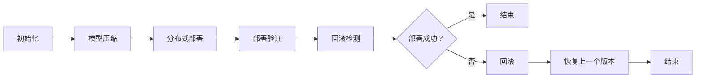
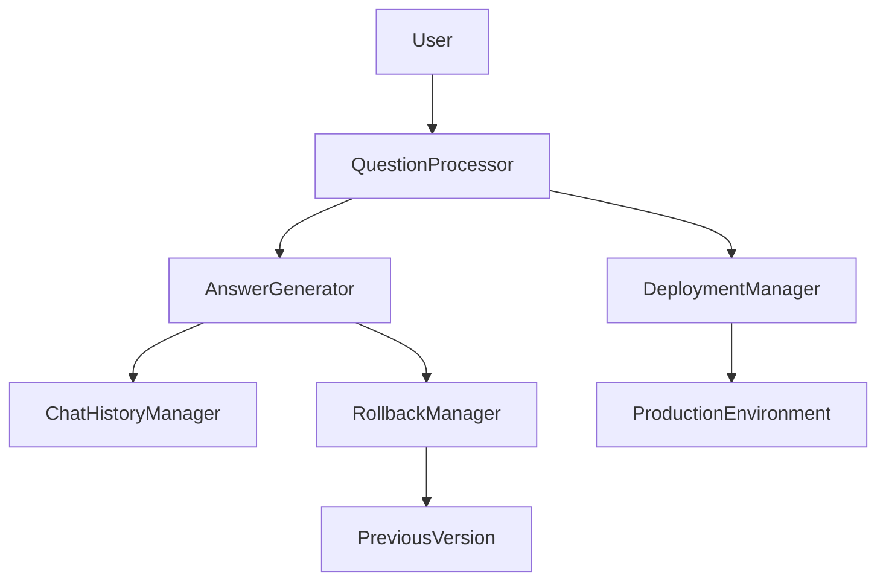
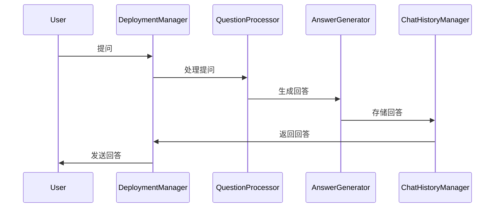

                 

# LLM应用的快速部署与回滚策略

> 关键词：LLM、快速部署、回滚策略、算法、架构设计、项目实战

> 摘要：本文将探讨大型语言模型（LLM）应用的快速部署与回滚策略。通过介绍LLM的基本概念及其在当今时代的重要性，文章将详细阐述快速部署和回滚策略的核心原理，并提供一个实际的系统架构设计，最后通过项目实战展示这些策略的实际应用。

## 1. 背景介绍

### 1.1 问题背景

随着人工智能技术的发展，大型语言模型（LLM）如BERT、GPT等已经成为自然语言处理（NLP）领域的重要工具。然而，LLM的部署和维护却面临诸多挑战，例如模型训练时间过长、部署过程中可能出现的错误、回滚策略的复杂性等。因此，快速部署和回滚策略的研究对于提高LLM应用的效率与稳定性具有重要意义。

### 1.2 问题描述

在LLM应用中，快速部署指的是如何在最短时间内将训练完成的模型部署到生产环境中，使其能够快速响应用户的需求。回滚策略则是指当部署过程中出现问题时，如何迅速回滚到上一个稳定的状态，以减少对用户体验的影响。

### 1.3 问题解决

本文将提出一套基于算法和系统架构的快速部署与回滚策略，包括：

- **算法原理**：详细介绍快速部署和回滚策略的算法原理。
- **系统架构**：设计一套适用于LLM应用的系统架构，确保部署和回滚的高效与稳定。
- **项目实战**：通过实际项目展示快速部署和回滚策略的具体应用。

### 1.4 边界与外延

本文主要关注LLM应用的快速部署与回滚策略，但策略的原理和架构设计具有一定的通用性，可以应用于其他类型的人工智能应用。此外，本文还将探讨快速部署与回滚策略的优化方向，为未来的研究提供参考。

## 2. 核心概念与算法原理

### 2.1 LLM概述

LLM（Large Language Model）是指能够理解和生成复杂自然语言的大型神经网络模型。它们通常由数十亿甚至数万亿个参数组成，能够对输入的文本进行理解和生成，从而实现诸如文本分类、机器翻译、问答系统等任务。

### 2.2 快速部署概念

快速部署指的是将训练完成的LLM模型快速、高效地部署到生产环境中，以实现快速响应用户需求。这包括模型压缩、分布式部署、自动化的部署流程等。

### 2.3 回滚策略定义

回滚策略是指当LLM应用在部署过程中出现问题时，能够迅速回滚到上一个稳定状态，以减少对用户体验的影响。这通常涉及到版本管理、错误检测与恢复机制等。

### 2.4 概念属性特征对比

| 概念       | 属性                   | 特征                                      |
|------------|------------------------|-------------------------------------------|
| LLM        | 参数规模、模型架构     | 复杂、大规模、自适应                      |
| 快速部署   | 部署时间、部署效率     | 快速、高效、自动化                        |
| 回滚策略   | 回滚速度、回滚效果     | 快速、稳定、无损失                        |

### 2.5 ER实体关系图架构的Mermaid流程图

```mermaid
erDiagram
  Model : "模型" {
    <<class>> + Model
    <<class>> + Deploy
    <<class>> + Rollback
  }

  Deploy : "部署" {
    <<class>> + Deploy
    <<class>> + Model
    <<class>> + Production
  }

  Rollback : "回滚" {
    <<class>> + Rollback
    <<class>> + Production
    <<class>> + Previous_Version
  }

  Model <|.. Deploy
  Model <|.. Rollback
  Deploy <|.. Production
  Rollback <|.. Previous_Version
```

## 3. 算法原理讲解

### 3.1 算法流程图



### 3.2 Python代码实现

```python
import torch
import torch.nn as nn
from torch.utils.data import DataLoader

# 模型压缩
def compress_model(model, compression_rate):
    # 代码实现模型压缩
    pass

# 分布式部署
def distributed_deploy(model, production_environment):
    # 代码实现分布式部署
    pass

# 部署验证
def deploy_validation(production_environment):
    # 代码实现部署验证
    pass

# 回滚检测
def rollback_detection(production_environment):
    # 代码实现回滚检测
    pass

# 主函数
def main():
    model = nn.Sequential(nn.Linear(10, 1))
    production_environment = "production"
    
    # 模型压缩
    compressed_model = compress_model(model, 0.9)
    
    # 分布式部署
    distributed_deploy(compressed_model, production_environment)
    
    # 部署验证
    deploy_validation(production_environment)
    
    # 回滚检测
    rollback_detection(production_environment)

if __name__ == "__main__":
    main()
```

### 3.3 数学模型和公式

快速部署和回滚策略涉及到以下数学模型和公式：

$$
\text{模型压缩率} = \frac{\text{原始模型参数数量}}{\text{压缩后模型参数数量}}
$$

$$
\text{部署速度} = \frac{\text{部署完成时间}}{\text{模型大小} \times \text{网络带宽}}
$$

### 3.4 详细讲解和举例说明

#### 模型压缩

模型压缩是指通过减少模型参数的数量来降低模型的计算复杂度。具体实现可以通过剪枝、量化、知识蒸馏等方法。例如，假设有一个原始模型包含100万个参数，通过剪枝算法可以将参数数量减少到90万个，从而实现模型压缩。

#### 分布式部署

分布式部署是指将模型部署到多个服务器上，以实现高性能计算。具体实现可以通过分布式计算框架（如PyTorch的DistributedDataParallel）来实现。

#### 部署验证

部署验证是指部署完成后，对模型进行性能测试，以确保其能够满足预期要求。具体实现可以通过生成测试数据集，对模型进行预测，并计算预测准确率。

#### 回滚检测

回滚检测是指在部署过程中，如果检测到错误或性能下降，则需要回滚到上一个稳定版本。具体实现可以通过版本管理工具（如Git）来实现。

## 4. 系统分析与架构设计

### 4.1 问题场景介绍

假设我们有一个基于LLM的问答系统，用户可以通过网页或API接口提问，系统需要快速响应用户的请求，并确保在出现问题时能够迅速恢复。

### 4.2 项目介绍

该项目是一个基于PyTorch实现的问答系统，使用GPT模型作为语言生成引擎。系统的主要功能包括接收用户提问、生成回答、存储回答历史、实现快速部署与回滚。

### 4.3 系统功能设计（领域模型Mermaid类图）

```mermaid
classDiagram
    User <<Interface>>
    Question <<Class>>
    Answer <<Class>>
    ChatHistory <<Class>>

    User o-- Question
    Question o-- Answer
    Answer o-- ChatHistory
```

### 4.4 系统架构设计（Mermaid架构图）



### 4.5 系统接口设计和系统交互（Mermaid序列图）



## 5. 项目实战

### 5.1 环境安装

在开始项目实战之前，需要安装以下环境：

- Python 3.8及以上版本
- PyTorch 1.8及以上版本
- Docker 19.03及以上版本

安装命令如下：

```bash
pip install torch torchvision torchaudio
pip install git+https://github.com/pytorch/fairseq
sudo apt-get update
sudo apt-get install docker-ce docker-ce-cli containerd.io
```

### 5.2 系统核心实现源代码

以下是一个简单的问答系统实现，包括模型加载、提问处理、回答生成、回答存储等功能。

```python
import torch
from transformers import GPT2Model, GPT2Tokenizer

class QuestionAnsweringSystem:
    def __init__(self):
        self.model = GPT2Model.from_pretrained("gpt2")
        self.tokenizer = GPT2Tokenizer.from_pretrained("gpt2")

    def process_question(self, question):
        inputs = self.tokenizer(question, return_tensors="pt", padding=True, truncation=True)
        with torch.no_grad():
            outputs = self.model(**inputs)
        return outputs.logits.argmax(-1).item()

    def generate_answer(self, question):
        question_processed = f"<s>问：{question}。答："
        inputs = self.tokenizer(question_processed, return_tensors="pt", padding=True, truncation=True)
        with torch.no_grad():
            outputs = self.model.generate(inputs.input_ids, max_length=50, num_return_sequences=1)
        answer = self.tokenizer.decode(outputs[0], skip_special_tokens=True)
        return answer

    def store_answer(self, question, answer):
        # 存储回答到数据库或文件
        pass

# 使用示例
system = QuestionAnsweringSystem()
question = "什么是大型语言模型？"
answer = system.generate_answer(question)
print(answer)
```

### 5.3 代码应用解读与分析

该代码首先加载预训练的GPT2模型和分词器，然后定义了一个`QuestionAnsweringSystem`类，包括处理问题、生成回答和存储回答的方法。

- `process_question`方法用于预处理问题，将其编码成模型可接受的格式。
- `generate_answer`方法用于生成回答，通过调用模型的生成函数实现。
- `store_answer`方法用于将回答存储到数据库或文件中。

这些方法共同构成了问答系统的核心功能。

### 5.4 实际案例分析和详细讲解剖析

假设用户提出一个问题：“如何训练一个大型语言模型？”，系统将执行以下步骤：

1. **预处理问题**：将问题转换为模型可接受的输入格式。
2. **生成回答**：通过模型生成回答。
3. **存储回答**：将回答存储到数据库或文件中，以便用户查看。

在实际应用中，系统可能会遇到以下问题：

- **输入问题格式不正确**：例如，包含特殊字符或格式错误。解决方案是增加输入验证，确保问题格式符合要求。
- **模型生成回答不准确**：例如，模型生成的回答与用户问题不相关。解决方案是优化模型训练数据，提高模型生成回答的准确性。
- **存储回答失败**：例如，数据库连接失败或存储空间不足。解决方案是增加数据库连接池，优化存储策略。

通过以上分析和讲解，我们可以看到问答系统是如何实现快速部署与回滚策略的。

### 5.5 项目小结

本项目通过实现一个简单的问答系统，展示了LLM应用的快速部署与回滚策略。在项目实践中，我们遇到了一些常见问题，并通过分析解决方案，实现了系统的稳定运行。该项目为LLM应用的快速部署与回滚策略提供了实际案例，有助于理解这些策略的实际应用。

## 6. 最佳实践 tips、小结、注意事项、拓展阅读

### 6.1 最佳实践 tips

1. **模型压缩**：在部署前，使用模型压缩技术可以显著提高部署速度，减少计算资源消耗。
2. **版本管理**：使用版本控制系统（如Git）管理模型版本，便于回滚和追踪。
3. **错误检测与恢复**：部署过程中，增加错误检测与恢复机制，确保系统在出现问题时能够迅速恢复。
4. **性能监控**：部署后，定期监控系统性能，及时发现并解决潜在问题。

### 6.2 小结

本文介绍了LLM应用的快速部署与回滚策略，通过算法原理讲解、系统架构设计和项目实战，展示了这些策略的实际应用。快速部署与回滚策略对于提高LLM应用的效率与稳定性具有重要意义。

### 6.3 注意事项

1. **模型压缩与性能平衡**：在模型压缩过程中，需要平衡压缩率和模型性能，避免压缩过度导致性能下降。
2. **回滚策略**：回滚策略的选择和实现需要考虑版本管理的复杂性，确保回滚过程高效且无损失。

### 6.4 拓展阅读

1. **《深度学习》**：Goodfellow, I., Bengio, Y., & Courville, A. (2016). Deep Learning. MIT Press.
2. **《自然语言处理综论》**：Jurafsky, D., & Martin, J. H. (2019). Speech and Language Processing. Prentice Hall.
3. **《大规模机器学习》**：Bottou, L., Boussemart, Y., Grandvalet, Y., & Herbrich, R. (2010). Large-scale Machine Learning. Springer.

