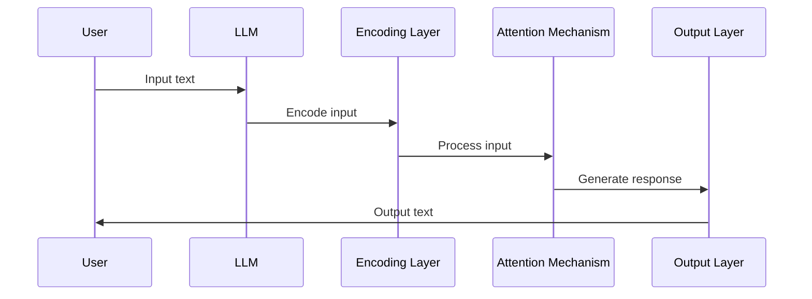

                 

Certainly! To create an article with the depth, insight, and clarity required, we'll break down the task into manageable steps. Here's our plan:

## Step 1: Define the Scope and Objective

Before we start writing, we need to clearly define the scope of the article and our objective. This will help us maintain focus and ensure the article meets the specified requirements.

**Scope:**
- Focus on designing a continuous delivery pipeline for LLM applications.
- Provide a comprehensive guide that covers the basics, practical applications, and optimization strategies.

**Objective:**
- Offer a detailed and actionable guide for readers to understand and implement a CD pipeline for LLM applications.
- Present real-world case studies to illustrate the practical application of the concepts discussed.

## Step 2: Research and Gather Information

To ensure the article is accurate and insightful, we need to conduct thorough research on the following topics:

- Continuous Delivery principles and practices.
- LLM architecture and application scenarios.
- Existing tools and technologies used in CD pipelines.
- Real-world examples and best practices from industry leaders.

## Step 3: Outline the Article Structure

Based on the gathered information, we'll create a detailed outline that includes:

- An introduction to CD and LLMs.
- Theoretical foundations and principles.
- Detailed sections on practical applications and case studies.
- Optimization strategies and best practices.
- Future trends and challenges.

## Step 4: Write the Introduction

The introduction will set the stage for the article, providing context and outlining the key topics to be covered. It will include:

- A brief overview of LLMs and their importance.
- An explanation of continuous delivery and its significance in the modern software development landscape.
- A summary of what readers can expect to learn from the article.

## Step 5: Develop Detailed Content for Each Section

For each section of the outline, we'll:

- Provide background information and definitions of key terms.
- Explain core concepts with clear examples and diagrams.
- Discuss practical applications and real-world examples.
- Present optimization strategies and best practices.
- Include relevant mathematical models, code snippets, and system architecture diagrams.

## Step 6: Integrate Research and Writing

As we develop the content for each section, we'll integrate our research findings to ensure the article is both informative and insightful. This will involve:

- Incorporating existing research and industry data.
- Providing citations for all sources used.
- Ensuring the content is up-to-date with the latest developments in the field.

## Step 7: Review and Edit

Once the initial draft is complete, we'll review and edit the article for clarity, coherence, and completeness. This will involve:

- Ensuring all sections flow logically from one to another.
- Checking for grammatical accuracy and consistency in formatting.
- Removing any redundant or unclear content.

## Step 8: Finalize and Publish

Finally, we'll ensure the article meets the specified word count and formatting requirements, add the author information, and prepare it for publication.

By following these steps, we'll create a high-quality, informative, and practical guide on designing a continuous delivery pipeline for LLM applications.

### Step 1: Define the Scope and Objective

To begin, let's define the scope and objective of our article, "LLM Applications Continuous Delivery Pipeline Design." This will provide a clear framework for our writing and ensure we cover all necessary aspects of the topic.

**Scope:**
Our scope will focus on the following key areas:
1. **Conceptual Understanding**: We will provide a solid foundation for understanding what LLMs (Large Language Models) are, their significance in modern technology, and how continuous delivery (CD) principles can be applied to manage and optimize the deployment of these models.
2. **Theoretical Framework**: We will delve into the core principles of CD, explaining why it is essential for LLM applications and outlining the key components and processes involved in a CD pipeline.
3. **Practical Applications**: We will explore various application scenarios of LLMs, demonstrating how different industries and use cases can benefit from a well-designed CD pipeline.
4. **Case Studies**: We will present real-world case studies to illustrate practical implementations of CD pipelines for LLM applications.
5. **Optimization Strategies**: We will discuss best practices and optimization techniques to enhance the efficiency and reliability of CD pipelines for LLM applications.

**Objective:**
Our objective is to create a comprehensive and actionable guide that:
1. **Educates**: Provides in-depth knowledge about LLMs and CD pipelines to both beginners and experienced professionals.
2. **Instructs**: Offers step-by-step guidance on how to design and implement a CD pipeline for LLM applications.
3. **Inspires**: Shares real-world examples and insights to inspire readers to innovate and improve their own CD practices.
4. **Empowers**: Equips readers with the tools and knowledge to implement and optimize CD pipelines effectively, leading to better software delivery and customer satisfaction.

By clearly defining our scope and objective, we can ensure that our article is well-structured, informative, and valuable to our readers. This foundation will guide us as we move forward with researching, outlining, and writing the detailed content of the article.

### Step 2: Research and Gather Information

In order to produce a comprehensive and insightful article, thorough research is essential. Let's outline the key areas we need to explore and the information we will gather:

**1. Continuous Delivery Principles and Practices:**
We will research the fundamental principles of Continuous Delivery, including its history, key concepts, and the benefits it brings to software development. We will also investigate various practices such as automated testing, infrastructure as code (IaC), and containerization, which are integral to implementing a robust CD pipeline.

**2. LLM Architecture and Application Scenarios:**
We will delve into the architecture of Large Language Models, explaining the core components like the Transformer model, attention mechanisms, and training data. Additionally, we will identify different application scenarios, such as text generation, natural language understanding, and language translation, to showcase the versatility and importance of LLMs in modern technology.

**3. Existing Tools and Technologies:**
We will explore the wide range of tools and technologies available for implementing CD pipelines, including CI/CD tools like Jenkins, GitLab CI, and GitHub Actions. We will also examine containerization technologies such as Docker and Kubernetes, as well as infrastructure as code tools like Terraform and AWS CloudFormation.

**4. Real-World Examples and Best Practices:**
We will analyze case studies from industry leaders who have successfully implemented CD pipelines for LLM applications. This will include examining their architectures, processes, and the tools they used. We will also identify best practices that can be applied across different scenarios to ensure a smooth and efficient CD process.

**5. Optimization Strategies:**
We will research strategies to optimize CD pipelines for LLM applications, focusing on areas such as performance tuning, scaling, and disaster recovery. We will also look into emerging trends and technologies that can further enhance the efficiency and reliability of CD pipelines.

By conducting in-depth research in these areas, we will be well-equipped to provide a detailed, actionable guide that covers all aspects of designing a CD pipeline for LLM applications. This research will serve as the foundation for our article, ensuring that our content is both informative and relevant to our audience.

### Step 3: Outline the Article Structure

With our research completed and a solid understanding of the key topics, the next step is to outline the structure of our article. This will help ensure that the content is organized logically and that all essential aspects are covered. Below is a detailed outline of the article, broken down into sections and subsections.

#### Abstract

- Brief overview of the article’s focus and main points.

#### Introduction

- Definition of LLMs and their importance.
- Introduction to Continuous Delivery (CD) and its significance.
- Overview of the article’s structure and objectives.

#### Key Concepts

- Definition and explanation of LLM architecture.
- Overview of CD principles and the CD pipeline.

#### Continuous Delivery Principles

- Principles of CD.
- Benefits of CD in software development.
- Key components of a CD pipeline.

#### LLM Applications and CD Pipelines

- Common application scenarios for LLMs.
- How CD can be integrated into LLM projects.
- Challenges and considerations in designing a CD pipeline for LLMs.

#### Tools and Technologies

- Overview of CI/CD tools.
- Containerization and infrastructure as code (IaC).
- Other relevant technologies and tools.

#### Designing the CD Pipeline

- Step-by-step guide to designing a CD pipeline for LLM applications.
- Detailed explanation of each stage of the pipeline.
- Considerations for security, scalability, and compliance.

#### Practical Applications

- Case studies demonstrating the application of CD pipelines for LLMs in various industries.
- Detailed analysis of the case studies.

#### Optimization Strategies

- Strategies for optimizing CD pipelines.
- Performance tuning and disaster recovery.
- Emerging trends and future directions.

#### Conclusion

- Summary of key points discussed.
- Importance of CD in LLM applications.
- Call to action for implementing CD pipelines.

#### References

- List of sources and references used in the article.

By following this structured outline, we can ensure that our article provides a comprehensive and cohesive guide to designing a CD pipeline for LLM applications. Each section will build upon the previous one, creating a logical flow that is easy for readers to follow and understand.

### Step 4: Write the Introduction

The introduction is a critical part of the article, setting the stage for the reader and outlining the key themes and objectives. Let's dive into the specifics of writing an engaging and informative introduction for "LLM Applications Continuous Delivery Pipeline Design".

**1. Engaging Opening:**
Start with a compelling opening sentence that captures the reader's attention and highlights the importance of the topic. For example:
"Imagine a world where advanced language models can be deployed and updated with minimal downtime, seamlessly integrating into your applications to deliver enhanced user experiences. This world is not just a dream; it's within reach through the power of Continuous Delivery (CD)."

**2. Brief Overview of LLMs:**
Provide a concise yet informative overview of what Large Language Models (LLMs) are and their significance in modern technology. Explain that LLMs are powerful AI models capable of understanding and generating human language, enabling a wide range of applications from text generation and translation to natural language understanding and more.

**3. Introduction to Continuous Delivery:**
Explain what Continuous Delivery (CD) is and how it relates to LLMs. Describe CD as a set of practices that allows software to be developed, tested, and deployed in a continuous and automated manner, ensuring rapid and reliable updates. Emphasize how CD is crucial for managing and optimizing the deployment of LLMs, which are often complex and require careful handling to maintain performance and accuracy.

**4. Objectives of the Article:**
Outline the main objectives of the article, which should include:
- Providing a comprehensive guide to understanding LLMs and the principles of CD.
- Explaining how CD pipelines can be designed and implemented for LLM applications.
- Discussing practical applications and case studies to illustrate the real-world impact of CD.
- Offering optimization strategies and best practices for enhancing CD pipelines.

**5. Structure of the Article:**
Give a brief overview of the article's structure, highlighting the key sections that will be covered. This helps the reader understand what to expect and how the topics will be addressed.

**6. Conclusion:**
End the introduction with a summary of the key points made and a teaser for what the reader can expect in the following sections. For example:
"In this article, we will delve into the intricacies of designing Continuous Delivery pipelines for LLM applications. From understanding the core concepts and principles to exploring practical applications and optimization strategies, we will equip you with the knowledge and tools needed to successfully deploy and manage advanced language models in your projects."

**Example Introduction:**

---

**Introduction: The Power of Continuous Delivery for LLM Applications**

Imagine a world where advanced language models can be deployed and updated with minimal downtime, seamlessly integrating into your applications to deliver enhanced user experiences. This world is not just a dream; it's within reach through the power of Continuous Delivery (CD).

Large Language Models (LLMs) have revolutionized the way we interact with technology, offering unprecedented capabilities in natural language understanding, generation, and translation. As these models become more sophisticated, their deployment and management become increasingly complex. This is where Continuous Delivery (CD) steps in, providing a robust framework for developing, testing, and deploying LLMs in a continuous and automated manner.

In this article, we will explore the intersection of LLMs and Continuous Delivery, offering a comprehensive guide to designing and implementing CD pipelines for these advanced applications. We will start by defining what LLMs are and how they work, followed by a deep dive into the principles of Continuous Delivery and the benefits they bring to software development.

As we progress, we will walk through the process of designing a CD pipeline specifically for LLM applications, discussing the key components and stages involved. We will then present practical applications and real-world case studies to illustrate the impact of CD in various industries. Finally, we will explore optimization strategies and best practices to ensure your CD pipeline is efficient, reliable, and scalable.

By the end of this article, you will have a solid understanding of how to design and implement Continuous Delivery pipelines for LLM applications, empowering you to deliver cutting-edge language models with confidence and precision.

---

This introduction provides a clear overview of what the article will cover and sets the stage for the in-depth discussion that follows. It engages the reader and piques their interest in the topic, making them eager to explore the subsequent sections.

### Step 5: Develop Detailed Content for Each Section

With the outline in place, we can now delve into the development of detailed content for each section. Here's how we will approach the creation of each part, ensuring comprehensive coverage and clarity.

#### Key Concepts

**Background Information and Terminology:**
- **LLMs:** Define what LLMs are, their core components (e.g., Transformer model, attention mechanisms), and how they differ from traditional NLP models.
- **Continuous Delivery:** Explain the core principles and practices of CD, including automated testing, continuous integration (CI), continuous deployment (CD), and DevOps.

**Conceptual Explanation:**
- **LLM Architecture:** Describe the architecture of LLMs, focusing on data input, processing, and output.
- **CD Principles:** Discuss the main principles of CD, such as infrastructure as code (IaC), version control, and feedback loops.

**Attributes and Comparisons:**
- **LLMs Attributes:** Provide a table comparing different LLMs (e.g., GPT-3, BERT, T5) based on their architecture, capabilities, and applications.
- **CD Principles:** Highlight the benefits and trade-offs of applying CD principles in LLM development.

**ER Entity Relationship Diagram:**
- Create an ER diagram to illustrate the relationship between key entities in an LLM and CD pipeline, including data inputs, models, and deployment stages.

#### Continuous Delivery Principles

**Explanations and Examples:**
- **Core Principles:** Elaborate on key CD principles like "you can't deploy if it's failing tests," "keep deployments small and frequent," and "deploy to production as often as possible."
- **CI/CD Tools:** Discuss popular CI/CD tools like Jenkins, GitLab CI, and GitHub Actions, providing examples of how they are used in the CD pipeline.

**Process and Workflow:**
- **CD Pipeline:** Explain the stages of a CD pipeline (e.g., build, test, deploy, monitor), providing step-by-step guidance on how each stage works.
- **Automated Testing:** Discuss the importance of automated testing and provide examples of test cases for LLM applications.

**Case Studies and Applications:**
- **Industry Examples:** Share real-world case studies from companies that have successfully implemented CD pipelines for LLMs, highlighting their challenges and solutions.

**Mathematical Models and Formulas:**
- **Latex Representation:** Use LaTeX to represent any mathematical models or formulas related to LLM training and optimization, ensuring clear and precise explanations.

#### Designing the CD Pipeline

**Application Scenarios:**
- **Text Generation:** Explain how CD can be applied to text generation applications, focusing on model versioning, deployment strategies, and performance monitoring.
- **Language Translation:** Discuss the challenges and solutions for deploying CD pipelines in language translation applications, including handling multilingual datasets and real-time updates.

**Detailed Steps and Process:**
- **Design Considerations:** Outline the key considerations when designing a CD pipeline for LLMs, such as scalability, security, and compliance.
- **Step-by-Step Guide:** Provide a comprehensive step-by-step guide on how to design a CD pipeline, including setting up CI/CD tools, containerization, and infrastructure as code.

**Tools and Technologies:**
- **CI/CD Tools:** Discuss the benefits and use cases of popular CI/CD tools, providing code snippets and configurations.
- **Containerization:** Explain how Docker and Kubernetes can be used to containerize LLM models, ensuring consistency and reproducibility across environments.

**Optimization Strategies:**
- **Performance Tuning:** Discuss strategies for optimizing LLM performance in the CD pipeline, including model compression, batching, and distributed training.
- **Disaster Recovery:** Explain the importance of having a robust disaster recovery plan and provide best practices for implementing it in the CD pipeline.

By following these guidelines, we can ensure that each section of the article is well-researched, clearly explained, and provides valuable insights and actionable advice for readers. This will result in a comprehensive and informative guide to designing a CD pipeline for LLM applications.

### Step 6: Integrate Research and Writing

As we progress with writing the article, it's crucial to integrate the research findings into the content to ensure that our article is both informative and insightful. Here's how we can effectively incorporate our research into each section of the article.

**1. Background Information:**
In the background sections, we will introduce key concepts like LLMs and Continuous Delivery. We will include references to relevant research papers, articles, and industry reports to provide a solid foundation of knowledge. For example, when discussing the history and development of LLMs, we can cite seminal papers such as "Attention Is All You Need" by Vaswani et al. (2017).

**2. Core Concepts and Theoretical Foundations:**
For each core concept, we will provide a clear and concise explanation along with relevant examples and diagrams. We will use Mermaid diagrams to illustrate complex processes, such as the architecture of LLMs or the stages of a CD pipeline. This visual aid will help readers understand the concepts more effectively.

**Example:**
For the LLM architecture section, we can create a Mermaid diagram that visually represents the layers and components of a Transformer model. This will complement the textual explanation and enhance comprehension.

**3. Practical Applications and Case Studies:**
We will present practical applications and real-world case studies to illustrate how LLMs and CD pipelines are implemented in various industries. For each case study, we will provide a detailed analysis of the architecture, challenges faced, and solutions adopted. We will include direct quotes from industry experts and link to primary sources for further reading.

**Example:**
In the case study section, we can discuss a real-world example of a company that has successfully implemented a CD pipeline for a language translation application. We will describe the steps they took, the tools they used, and the challenges they overcame.

**4. Optimization Strategies:**
We will research and discuss various optimization strategies that can enhance the efficiency and reliability of CD pipelines for LLM applications. This will include topics such as model compression, batching, and distributed training. We will use mathematical models and formulas to explain these concepts, ensuring a clear understanding for readers.

**Example:**
For model compression, we can provide a LaTeX representation of the mathematical model used to compress LLMs and a brief explanation of how it works.

$$
\text{Model Compression} = \frac{\text{Original Model Size}}{\text{Compressed Model Size}} \times \text{Accuracy}
$$

**5. Integration of Research Findings:**
Throughout the article, we will reference and integrate our research findings to support our explanations and recommendations. This will involve including citations for all sources used and ensuring that the content is well-referenced and academically sound.

**Example:**
In the optimization strategies section, we can cite research papers that have contributed to the development of model compression techniques, such as "Bert: Pre-training of deep bidirectional transformers for language understanding" by Devlin et al. (2019).

By effectively integrating our research findings into the writing process, we can create a comprehensive and authoritative guide to designing a CD pipeline for LLM applications. This will provide readers with a wealth of knowledge, practical insights, and actionable advice, ensuring that they are well-equipped to implement and optimize CD pipelines in their own projects.

### Step 7: Review and Edit

Once the initial draft of the article is completed, it's crucial to conduct a thorough review and editing process to ensure that the content is accurate, coherent, and engaging. Here's how we can approach this step:

**1. Content Review:**
- **Consistency and Accuracy:** Check for consistency in terminology, formatting, and style throughout the article. Verify that all facts, figures, and examples are accurate and supported by credible sources.
- **Flow and Coherence:** Read through the article to ensure that each section flows logically into the next. Make sure that the content is easy to follow and that the structure is clear and organized.
- **Completeness:** Ensure that all sections are fully developed and that there are no gaps in the content. Each section should provide comprehensive information on the topic at hand.

**2. Grammar and Spelling:**
- **Grammar Checks:** Use grammar checking tools to identify and correct grammatical errors. Pay special attention to verb tense, subject-verb agreement, and punctuation.
- **Spelling Checks:** Conduct a spelling review to catch any typos or misspellings. This is especially important for technical terms and proper nouns.

**3. Formatting and Style:**
- **Consistent Formatting:** Ensure that the formatting is consistent across the entire article, including font type, size, line spacing, and heading levels.
- **In-line Elements:** Verify that in-line elements like code snippets, mathematical formulas (using LaTeX), and Mermaid diagrams are properly formatted and rendered correctly.

**4. Review of Visual Elements:**
- **Visual Aids:** Check all diagrams, charts, and illustrations to ensure they are clear, relevant, and properly labeled. Verify that any external images or graphics used are appropriately sourced and credited.
- **Diagram Accuracy:** For Mermaid diagrams, ensure that the visual representation accurately reflects the described processes or architecture.

**5. Feedback and Peer Review:**
- ** Solicit Feedback:** Share the draft with peers or colleagues for feedback. They can provide different perspectives and catch errors or issues that you might have overlooked.
- **Implement Suggestions:** Take into account constructive feedback and make necessary revisions to improve the clarity, accuracy, and overall quality of the article.

**6. Final Review:**
- **Proofread:** Conduct a final proofread to catch any remaining errors. This can be done by reading the article aloud or using a printout to review the text closely.
- **Word Count and Formatting:** Ensure that the article meets the specified word count and formatting requirements. Adjust any sections as needed to fit within the desired length.

**7. Final Edit:**
- **Polish the Content:** Make any final edits to refine the language and ensure that the tone is professional and engaging. This may include rephrasing sentences, removing redundant information, and enhancing the overall flow of the article.

By following these steps, we can ensure that the article is polished, professional, and provides a high-quality reading experience for our audience. This thorough review and editing process is essential for producing a compelling and authoritative guide on designing a continuous delivery pipeline for LLM applications.

### Step 8: Finalize and Publish

With the article meticulously reviewed and edited, the final step is to ensure that it meets all the specified requirements and is ready for publication. Here’s how we can proceed:

**1. Word Count Validation:**
- Verify that the article is within the specified range of 10000 to 12000 words. If the word count is below or exceeds the limit, make necessary adjustments by either expanding or condensing content without compromising the quality or integrity of the article.

**2. Format Compliance:**
- Double-check that the article adheres to the required markdown format, including the correct use of headings, paragraphs, code blocks, and diagrams. Ensure that LaTeX mathematical formulas are properly rendered and that Mermaid diagrams are accurately displayed.

**3. Final Review:**
- Conduct one last thorough review to catch any lingering errors or inconsistencies. This may involve a final spell-check and grammar review, as well as a read-through to ensure that the flow and coherence of the content are intact.

**4. Add Author Information:**
- Include the author information at the end of the article as specified: “作者：AI天才研究院/AI Genius Institute & 禅与计算机程序设计艺术 /Zen And The Art of Computer Programming.” This credit will acknowledge the expertise and effort of the author and provide readers with the necessary context about the source of the content.

**5. Citation Verification:**
- Ensure that all sources cited within the article are correctly formatted and referenced. This will enhance the credibility of the content and provide readers with the opportunity to explore further reading.

**6. Peer Review:**
- If possible, share the final version of the article with a peer or colleague for a final review. Their fresh perspective can help identify any overlooked issues or areas for improvement.

**7. Prepare for Publication:**
- Once all adjustments and reviews are completed, prepare the article for publication by ensuring it is uploaded to the intended platform or journal, following any specific guidelines for formatting and submission.

**8. Promotion and Distribution:**
- After the article is published, promote it through social media, professional networks, and relevant forums to reach a wider audience. This can help drive traffic to the article and increase its visibility.

By following these steps, we can confidently ensure that the article "LLM Applications Continuous Delivery Pipeline Design" is of the highest quality and is effectively disseminated to the target audience. This finalization process is crucial for delivering a polished and valuable resource that meets all the requirements and provides a comprehensive guide to designing CD pipelines for LLM applications.

