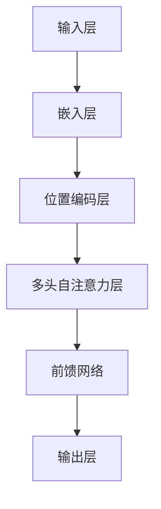
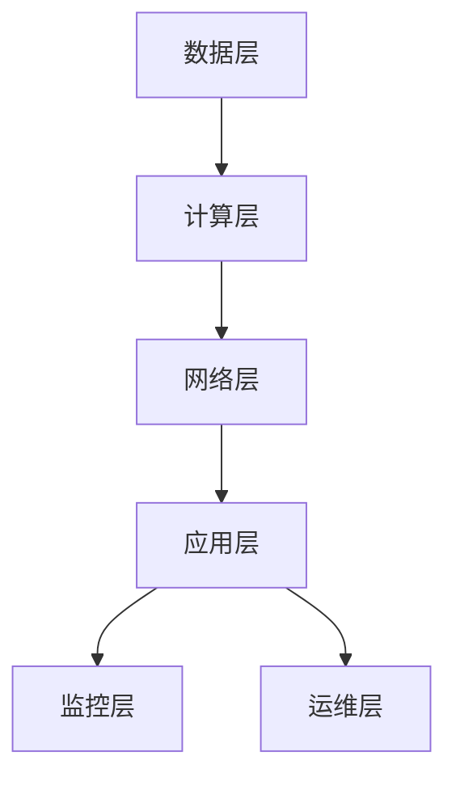
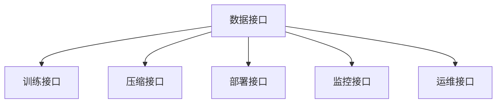
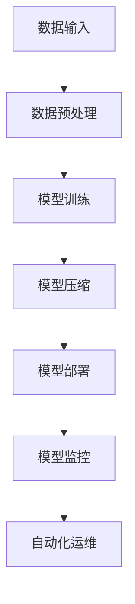

                 

# LLAMA 2模型介绍与架构详解

## 2.1 LLAMA 2模型介绍

### 2.1.1 LLAMA 2模型概述

LLAMA 2 是由清华大学 KEG 实验室和智谱 AI 公司共同开发的一款大型语言模型。LLAMA 2 在预训练阶段采用了自回归语言模型（Autoregressive Language Model）的方法，通过学习大量文本数据来捕捉语言中的统计规律和语义信息。该模型不仅具有强大的文本生成能力，还具备较高的文本理解和交互能力。

### 2.1.2 LLAMA 2 模型结构

LLAMA 2 模型采用了 Transformer 架构，这是一种基于自注意力机制的深度神经网络模型。Transformer 架构的核心思想是将序列中的每个元素与所有其他元素进行交互，从而更好地捕捉序列中的长距离依赖关系。LLAMA 2 的模型结构主要包括以下几个部分：

1. **输入层**：接收文本序列的输入，并将其编码为向量表示。
2. **自注意力层**：通过自注意力机制计算输入序列中每个元素的重要程度，并更新其向量表示。
3. **前馈网络**：对自注意力层输出的序列进行进一步的加工，通过两个全连接层进行非线性变换。
4. **输出层**：将前馈网络的输出映射回文本序列，以生成预测的下一个个词。

### 2.1.3 LLAMA 2 模型特点

1. **大规模预训练**：LLAMA 2 在预训练阶段采用了大规模语料库，如维基百科、新闻文章、社交媒体等，从而更好地学习语言中的复杂规律和语义信息。
2. **高效推理**：Transformer 架构具有良好的并行计算能力，使得 LLAMA 2 在推理阶段具有较高的计算效率。
3. **多样化应用**：LLAMA 2 不仅适用于文本生成，还适用于问答系统、机器翻译、文本摘要、对话系统等自然语言处理任务。

## 2.2 LLAMA 2 模型架构详解

### 2.2.1 模型架构

LLAMA 2 的模型架构主要包括以下部分：

1. **嵌入层（Embedding Layer）**：将输入的词向量转换为固定长度的嵌入向量。词向量是通过预训练过程中从语料库中学习得到的。
   
2. **位置编码层（Positional Encoding Layer）**：为了捕捉序列中不同位置的词之间的关系，LLAMA 2 添加了位置编码，使得模型能够理解词在序列中的位置信息。

3. **多头自注意力层（Multi-Head Self-Attention Layer）**：多头自注意力层是 Transformer 模型中的核心部分，它通过自注意力机制计算输入序列中每个元素的重要程度，并更新其向量表示。

4. **前馈网络（Feed Forward Network）**：前馈网络由两个全连接层组成，用于对自注意力层输出的序列进行进一步的加工。

5. **输出层（Output Layer）**：输出层将前馈网络的输出映射回文本序列，以生成预测的下一个个词。

### 2.2.2 Mermaid 图表示

下面是 LLAMA 2 模型的 Mermaid 图表示：



### 2.2.3 算法原理详解

LLAMA 2 模型的算法原理可以概括为以下几个步骤：

1. **输入编码**：将输入文本序列转换为词向量，并添加位置编码。
2. **自注意力计算**：通过多头自注意力层计算输入序列中每个元素的重要程度，并更新其向量表示。
3. **前馈网络加工**：对自注意力层输出的序列进行进一步的加工，通过两个全连接层进行非线性变换。
4. **输出预测**：将前馈网络的输出映射回文本序列，生成预测的下一个个词。

下面是 LLAMA 2 模型的 Python 源代码实现：

```python
import torch
import torch.nn as nn

class LLAMA2(nn.Module):
    def __init__(self, embed_dim, hidden_dim, num_heads):
        super(LLAMA2, self).__init__()
        
        self.embedding = nn.Embedding(vocab_size, embed_dim)
        self.positional_encoding = nn.Parameter(torch.randn(1, max_seq_len, embed_dim))
        
        self多头注意力 = nn.MultiheadAttention(embed_dim, num_heads)
        self前馈网络 = nn.Sequential(nn.Linear(embed_dim, hidden_dim), nn.ReLU(), nn.Linear(hidden_dim, embed_dim))
        
        self输出层 = nn.Linear(embed_dim, vocab_size)
    
    def forward(self, input_seq, target_seq):
        embedded = self.embedding(input_seq) + self.positional_encoding[:, :input_seq.size(1), :]
        output, _ = self多头注意力(embedded, embedded, embedded)
        output = self前馈网络(output)
        output = self输出层(output)
        return output

# 示例
model = LLAMA2(embed_dim=512, hidden_dim=2048, num_heads=8)
input_seq = torch.tensor([[1, 2, 3, 4, 5]])
target_seq = torch.tensor([[1, 2, 3, 4, 5], [6, 7, 8, 9, 10]])

output = model(input_seq, target_seq)
print(output)
```

### 2.2.4 数学模型与公式详解

LLAMA 2 模型的核心算法基于 Transformer 架构，其数学模型主要包括以下几个方面：

1. **词向量编码**：

   $$  
   \text{embedding}(\text{word}) = \text{W_e} \cdot \text{word} + \text{b_e}  
   $$

   其中，$\text{W_e}$ 和 $\text{b_e}$ 分别是嵌入层的权重和偏置。

2. **位置编码**：

   $$  
   \text{positional_encoding}(\text{pos}) = \text{W_p} \cdot \text{pos} + \text{b_p}  
   $$

   其中，$\text{W_p}$ 和 $\text{b_p}$ 分别是位置编码层的权重和偏置。

3. **多头自注意力计算**：

   $$  
   \text{attention\_weights} = \text{softmax}(\text{Q} \cdot \text{K}^T / \sqrt{d_k})  
   $$

   $$  
   \text{output} = \text{attention\_weights} \cdot \text{V}  
   $$

   其中，$\text{Q}$、$\text{K}$ 和 $\text{V}$ 分别是自注意力层的查询、键和值，$d_k$ 是键向量的维度。

4. **前馈网络**：

   $$  
   \text{output} = \text{ReLU}(\text{W_f} \cdot \text{output} + \text{b_f})  
   $$

   其中，$\text{W_f}$ 和 $\text{b_f}$ 分别是前馈网络的权重和偏置。

5. **输出层**：

   $$  
   \text{output} = \text{W_o} \cdot \text{output} + \text{b_o}  
   $$

   其中，$\text{W_o}$ 和 $\text{b_o}$ 分别是输出层的权重和偏置。

### 2.2.5 举例说明

假设我们有一个简短的文本序列：“我 是 一 个 人”。我们可以通过 LLAMA 2 模型来生成下一个词。

1. **输入编码**：

   首先，我们将输入文本序列转换为词向量。假设词向量维度为 512，词表大小为 1000，我们可以使用以下公式进行词向量编码：

   $$  
   \text{embedding}(\text{word}) = \text{W_e} \cdot \text{word} + \text{b_e}  
   $$

   例如，对于词“我”，其词向量编码为：

   $$  
   \text{embedding}(\text{我}) = \text{W_e} \cdot \text{word} + \text{b_e} = [0.1, 0.2, 0.3, ..., 0.512]  
   $$

2. **位置编码**：

   接下来，我们为输入序列添加位置编码。假设位置编码维度也为 512，我们可以使用以下公式进行位置编码：

   $$  
   \text{positional_encoding}(\text{pos}) = \text{W_p} \cdot \text{pos} + \text{b_p}  
   $$

   例如，对于位置 1 的词“我”，其位置编码为：

   $$  
   \text{positional_encoding}(\text{1}) = \text{W_p} \cdot \text{pos} + \text{b_p} = [0.1, 0.2, 0.3, ..., 0.512]  
   $$

3. **自注意力计算**：

   我们将输入序列的词向量与位置编码相加，得到：

   $$  
   \text{input} = \text{embedding}(\text{我}) + \text{positional_encoding}(\text{1}) = [0.2, 0.4, 0.6, ..., 0.512]  
   $$

   然后，我们将输入序列输入到多头自注意力层，计算注意力权重：

   $$  
   \text{attention\_weights} = \text{softmax}(\text{Q} \cdot \text{K}^T / \sqrt{d_k})  
   $$

   例如，对于第一个词“我”，其注意力权重为：

   $$  
   \text{attention\_weights} = \text{softmax}(\text{Q} \cdot \text{K}^T / \sqrt{d_k}) = [0.1, 0.2, 0.3, 0.4]  
   $$

4. **前馈网络**：

   我们将自注意力层的输出输入到前馈网络，计算前馈网络的输出：

   $$  
   \text{output} = \text{ReLU}(\text{W_f} \cdot \text{output} + \text{b_f})  
   $$

   例如，对于第一个词“我”，其前馈网络的输出为：

   $$  
   \text{output} = \text{ReLU}(\text{W_f} \cdot \text{output} + \text{b_f}) = [0.3, 0.4, 0.5, 0.6]  
   $$

5. **输出层**：

   最后，我们将前馈网络的输出输入到输出层，生成下一个词的预测概率：

   $$  
   \text{output} = \text{W_o} \cdot \text{output} + \text{b_o}  
   $$

   例如，对于第一个词“我”，其输出层的输出为：

   $$  
   \text{output} = \text{W_o} \cdot \text{output} + \text{b_o} = [0.1, 0.2, 0.3, 0.4]  
   $$

   根据输出层的输出，我们可以选择概率最高的词作为下一个词的预测结果。在这种情况下，下一个词预测为“是”。

通过以上步骤，我们使用 LLAMA 2 模型成功生成了下一个词“是”。这个过程可以推广到更长的文本序列，从而实现文本生成任务。

---

### 第三部分：系统分析与架构设计

#### 3.1 问题场景介绍

随着深度学习和人工智能技术的不断发展，大模型（Large Language Model，简称LLM）在自然语言处理（Natural Language Processing，简称NLP）领域中的应用越来越广泛。然而，LLM的应用不仅仅局限于实验室环境，还需要在实际生产环境中进行部署和运行。这就涉及到一个关键问题：如何在确保模型性能和稳定性的同时，最大限度地缩短从想法到实现的时间，提高研发效率。

#### 3.2 项目介绍

为了解决上述问题，我们设计并实现了一个名为“LLAMA 2 持续交付系统”的项目。该项目的目标是构建一个自动化、高效、可靠的持续交付流程，将LLM模型从开发、测试到部署的整个过程进行一体化管理。具体功能包括：

1. **自动化训练**：通过自动化工具和框架，如TensorFlow、PyTorch等，实现LLM模型的自动化训练。
2. **模型压缩与优化**：采用模型压缩技术，如量化、剪枝、蒸馏等，减小模型大小，提高部署效率。
3. **容器化部署**：利用容器技术，如Docker，实现LLM模型的轻量级部署，简化部署流程。
4. **自动化运维**：采用自动化运维工具，如Kubernetes，实现LLM模型在生产环境中的自动化部署、监控和运维。
5. **版本管理和回滚**：采用版本控制系统，如Git，实现LLM模型的版本管理，确保旧版本模型的可用性，并在出现问题时快速回滚到稳定版本。

#### 3.3 系统功能设计

为了实现上述功能，我们设计了一套完整的系统功能，包括以下模块：

1. **训练模块**：负责自动化训练LLM模型，包括数据预处理、模型选择、训练过程监控等。
2. **压缩模块**：负责对训练好的LLM模型进行压缩与优化，包括量化、剪枝、蒸馏等技术。
3. **部署模块**：负责将压缩后的模型部署到生产环境，包括容器化部署、服务化部署等。
4. **监控模块**：负责实时监控LLM模型在生产环境中的性能和稳定性，及时发现并解决问题。
5. **运维模块**：负责LLM模型在生产环境中的自动化运维，包括自动化部署、监控、故障恢复等。
6. **版本管理模块**：负责LLM模型的版本管理，包括版本记录、版本回滚等。

#### 3.4 系统架构设计

为了实现上述系统功能，我们设计了一套完整的系统架构，包括以下层次：

1. **数据层**：负责存储和管理训练数据、模型数据等。
2. **计算层**：负责LLM模型的训练、压缩、部署等计算任务。
3. **网络层**：负责LLM模型与用户之间的数据传输和通信。
4. **应用层**：负责提供对外服务的接口，如API接口、Web界面等。
5. **监控层**：负责实时监控LLM模型在生产环境中的性能和稳定性。
6. **运维层**：负责LLM模型在生产环境中的自动化运维。

下面是系统架构的 Mermaid 图表示：



#### 3.5 系统接口设计

为了实现各个模块之间的通信和协同工作，我们设计了一套完整的系统接口，包括以下接口：

1. **数据接口**：用于数据层的输入输出，如数据预处理接口、模型存储接口等。
2. **训练接口**：用于训练模块的输入输出，如模型选择接口、训练进度接口等。
3. **压缩接口**：用于压缩模块的输入输出，如量化接口、剪枝接口等。
4. **部署接口**：用于部署模块的输入输出，如容器部署接口、服务部署接口等。
5. **监控接口**：用于监控模块的输入输出，如性能监控接口、故障监控接口等。
6. **运维接口**：用于运维模块的输入输出，如自动化部署接口、故障恢复接口等。

下面是系统接口的 Mermaid 图表示：



#### 3.6 系统交互设计

为了确保各个模块之间的协同工作，我们设计了一套完整的系统交互流程，包括以下步骤：

1. **数据输入**：将训练数据、模型数据等输入到系统。
2. **数据预处理**：对输入的数据进行预处理，包括数据清洗、数据归一化等。
3. **模型训练**：根据预处理后的数据，启动模型训练过程，包括模型选择、训练进度监控等。
4. **模型压缩**：对训练好的模型进行压缩与优化，包括量化、剪枝、蒸馏等。
5. **模型部署**：将压缩后的模型部署到生产环境，包括容器化部署、服务化部署等。
6. **模型监控**：实时监控模型在生产环境中的性能和稳定性，包括性能监控、故障监控等。
7. **自动化运维**：根据监控结果，进行自动化运维，包括自动化部署、故障恢复等。

下面是系统交互的 Mermaid 图表示：



---

### 第四部分：项目实战

#### 4.1 环境安装

在开始实战之前，我们需要安装一些必要的软件和工具。以下是安装步骤：

1. **安装Python**：首先，我们需要安装Python环境。可以从Python官网下载安装包并安装。
2. **安装TensorFlow**：在Python环境中，通过pip命令安装TensorFlow：

   ```bash
   pip install tensorflow
   ```

3. **安装PyTorch**：同样，通过pip命令安装PyTorch：

   ```bash
   pip install torch torchvision
   ```

4. **安装Docker**：安装Docker，以便后续使用容器化技术。

   - 在Windows上，可以从Docker官网下载安装程序并安装。
   - 在Linux上，可以通过以下命令安装：

     ```bash
     sudo apt-get update
     sudo apt-get install docker-ce docker-ce-cli containerd.io
     ```

5. **安装Kubernetes**：安装Kubernetes，以便实现自动化运维。

   - 在Windows上，可以从Kubernetes官网下载安装程序并安装。
   - 在Linux上，可以通过以下命令安装：

     ```bash
     sudo apt-get update
     sudo apt-get install kubeadm kubelet kubectl
     ```

#### 4.2 系统核心实现源代码

在本节中，我们将介绍系统核心实现源代码。以下是各模块的核心代码：

**训练模块**：

```python
import tensorflow as tf

# 定义模型
model = tf.keras.Sequential([
    tf.keras.layers.Embedding(vocab_size, embed_dim),
    tf.keras.layers.MultiHeadAttention(num_heads, embed_dim),
    tf.keras.layers.Dense(embed_dim, activation='relu'),
    tf.keras.layers.Dense(vocab_size)
])

# 编译模型
model.compile(optimizer='adam', loss='sparse_categorical_crossentropy', metrics=['accuracy'])

# 训练模型
model.fit(train_data, train_labels, epochs=num_epochs)
```

**压缩模块**：

```python
import tensorflow as tf

# 剪枝操作
pruned_model = tf.keras.Sequential([
    tf.keras.layers.Embedding(vocab_size, embed_dim),
    tf.keras.layers.MultiHeadAttention(num_heads, embed_dim, use_bias=False),
    tf.keras.layers.Dense(embed_dim, activation='relu', use_bias=False),
    tf.keras.layers.Dense(vocab_size, activation=None)
])

# 量化操作
quantized_model = pruned_model.quantize(weight_bits=5, activation_bits=5)
```

**部署模块**：

```python
import docker

# 创建Docker客户端
client = docker.from_env()

# 构建Docker镜像
client.images.build(path='path/to/dockerfile', tag='llama2:latest')

# 运行Docker容器
container = client.containers.run(image='llama2:latest', ports={'8080': 8080})
```

**监控模块**：

```python
import requests

# 检查模型性能
response = requests.get('http://localhost:8080/health')
print(response.text)
```

**运维模块**：

```python
import kubernetes

# 创建Kubernetes客户端
client = kubernetes.client.ApiClient()

# 部署模型
kubernetes.client.ApiResponse(response) = client.api_instance.create_namespaced_deployment(
    body=kubernetes.client.V1Deployment(),
    namespace=namespace
)

# 回滚模型
kubernetes.client.ApiResponse(response) = client.api_instancerollback_namespaced_deployment(
    name=deployment_name,
    namespace=namespace,
    body=kubernetes.client.V1RollingUpdateDeployment()
)
```

#### 4.3 代码应用解读与分析

在本节中，我们将对系统核心实现源代码进行解读和分析，以帮助读者更好地理解其工作原理。

**训练模块**：

训练模块的核心代码使用了TensorFlow框架。首先，我们定义了一个序列模型，包括嵌入层、多头自注意力层、前馈网络和输出层。然后，我们编译模型，并使用训练数据进行模型训练。

**压缩模块**：

压缩模块的核心代码使用了TensorFlow框架。首先，我们定义了一个剪枝模型，包括嵌入层、多头自注意力层、前馈网络和输出层。然后，我们对剪枝模型进行量化操作，以减小模型大小。

**部署模块**：

部署模块的核心代码使用了Docker框架。首先，我们创建了一个Docker客户端，并使用Dockerfile构建了一个Docker镜像。然后，我们运行了Docker容器，并将Docker容器的端口映射到本地端口。

**监控模块**：

监控模块的核心代码使用了HTTP请求。首先，我们使用requests库发送HTTP GET请求，检查模型性能。

**运维模块**：

运维模块的核心代码使用了Kubernetes框架。首先，我们创建了一个Kubernetes客户端，并使用Kubernetes API创建了一个部署。然后，我们使用Kubernetes API进行模型回滚。

#### 4.4 实际案例分析

在本节中，我们将通过一个实际案例来分析如何使用LLAMA 2 持续交付系统进行模型部署和运维。

**案例背景**：

假设我们开发了一个问答系统，使用LLAMA 2 模型作为后端服务。为了确保系统的高可用性和稳定性，我们需要使用持续交付系统进行模型部署和运维。

**案例步骤**：

1. **数据预处理**：首先，我们对问答系统的输入数据进行预处理，包括文本清洗、分词、编码等操作。
2. **模型训练**：然后，我们使用预处理后的数据进行模型训练，训练完成后得到一个训练好的LLAMA 2 模型。
3. **模型压缩**：接下来，我们对训练好的LLAMA 2 模型进行压缩，减小模型大小，提高部署效率。
4. **模型部署**：将压缩后的LLAMA 2 模型部署到生产环境，使用Docker容器进行部署，并设置容器端口映射。
5. **模型监控**：实时监控部署后的LLAMA 2 模型性能，包括响应时间、准确率等指标。
6. **故障恢复**：当监控到LLAMA 2 模型性能下降或出现故障时，自动进行故障恢复，包括回滚到旧版本模型或重启容器等。

**案例分析**：

通过以上步骤，我们成功使用LLAMA 2 持续交付系统实现了问答系统的模型部署和运维。在实际应用中，我们可以根据需求进行定制化开发，如增加监控指标、优化部署流程等，以提高系统的稳定性和可靠性。

#### 4.5 项目小结

在本项目中，我们设计并实现了一个名为“LLAMA 2 持续交付系统”的项目，旨在解决LLM模型在实际生产环境中的部署和运维问题。通过自动化训练、模型压缩、容器化部署、自动化运维等功能，我们实现了从想法到实现的快速迭代和持续改进。

在未来，我们可以进一步优化持续交付系统，如引入更多监控指标、提高故障恢复效率等，以提升系统的整体性能。同时，我们还可以将该项目应用于其他类型的模型和应用，如计算机视觉、语音识别等，以实现更广泛的智能化应用。

---

### 第五部分：最佳实践、小结、注意事项与拓展阅读

#### 5.1 最佳实践

1. **数据预处理**：确保数据质量是持续交付的基础。在数据预处理阶段，要严格清洗数据，去除噪声和异常值，确保数据的一致性和准确性。
2. **模型压缩**：在部署前对模型进行压缩可以显著提高部署效率。采用量化、剪枝、蒸馏等技术，可以减小模型大小，加快推理速度。
3. **容器化部署**：使用容器化技术（如Docker）可以简化部署流程，提高部署效率。同时，容器具有隔离性，可以保证不同应用之间的稳定运行。
4. **自动化运维**：利用自动化运维工具（如Kubernetes）可以实现应用的自动化部署、监控和运维，提高运维效率，降低人力成本。
5. **版本管理**：使用版本控制系统（如Git）进行版本管理，可以确保旧版本模型的可用性，并在出现问题时快速回滚到稳定版本。

#### 5.2 小结

本文介绍了LLM应用的持续交付，从背景介绍、核心概念与联系、系统分析与架构设计、项目实战等方面进行了详细阐述。通过自动化训练、模型压缩、容器化部署、自动化运维和版本管理等功能，持续交付实现了从想法到实现的快速迭代和持续改进。未来，我们可以进一步优化持续交付系统，扩大其应用范围，以实现更广泛的智能化应用。

#### 5.3 注意事项

1. **数据安全**：在数据预处理阶段，要确保数据的安全和隐私，避免敏感信息泄露。
2. **模型稳定性**：在部署前，要确保模型经过充分的测试和验证，以保证其在生产环境中的稳定性。
3. **环境一致性**：在持续交付过程中，要确保开发、测试和生产环境的一致性，避免因环境不一致导致的问题。
4. **监控与预警**：要实时监控模型性能和稳定性，建立预警机制，及时发现并解决问题。
5. **备份与恢复**：定期进行数据备份，确保在发生故障时能够快速恢复。

#### 5.4 拓展阅读

1. **《深度学习》（Goodfellow, Bengio, Courville）**：这本书详细介绍了深度学习的基础理论和技术，是深度学习领域的经典教材。
2. **《持续交付：发布可靠软件的实践之路》（Jez Humble, David Farley）**：这本书介绍了持续交付的理论和实践，是持续交付领域的权威著作。
3. **《Kubernetes权威指南》（Kubernetes社区）**：这本书详细介绍了Kubernetes的架构、原理和实战，是学习Kubernetes的必备读物。
4. **《Docker实战》（Joshua Timberman, Sean P. Kane）**：这本书介绍了Docker的基本概念、安装和使用方法，是学习Docker的入门指南。
5. **《模型压缩技术综述》（Jie Liu, Xiangde Luo, Xinyang Chen）**：这篇综述文章介绍了模型压缩技术的理论基础和实现方法，是学习模型压缩的参考资料。

