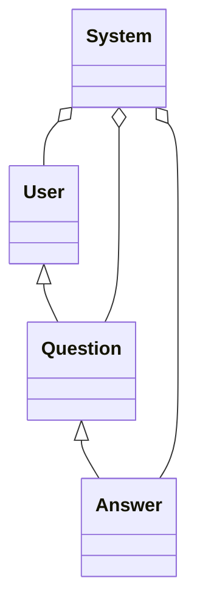
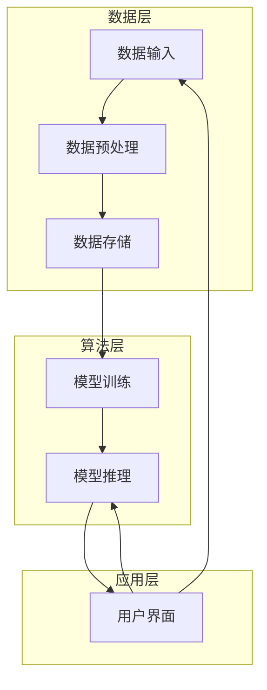
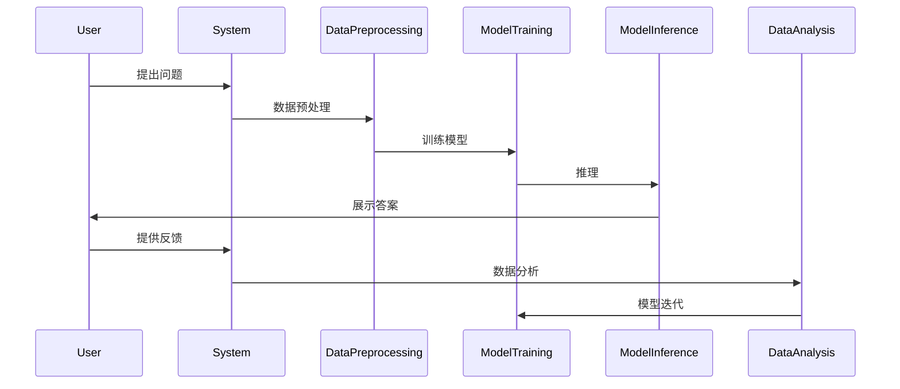

                 

### 文章标题

### 关键词

- 大语言模型（LLM）
- 持续反馈循环
- 用户反馈机制
- 开发团队响应
- 应用实践

### 摘要

本文深入探讨了大语言模型（LLM）应用中的持续反馈循环机制，从用户反馈收集、处理到开发团队的响应和迭代，全面解析了LLM应用的优化路径。文章首先介绍了LLM的基本概念和当前应用现状，随后详细阐述了用户反馈机制的设计与实现，并通过实际案例分析了用户反馈的重要性和应用效果。接着，文章探讨了反馈收集、分析和迭代的过程，以及开发团队在面对用户反馈时的响应策略。最后，文章通过具体实践案例展示了LLM应用中的持续反馈循环机制，并提出了最佳实践建议，为LLM应用的持续发展和优化提供了理论指导和实践参考。

## 第一部分：背景与概述

### 第1章：背景介绍

#### 1.1 问题背景

在当今的数字化时代，人工智能技术正以前所未有的速度和规模影响着各行各业。大语言模型（LLM）作为人工智能领域的重要分支，已经广泛应用于自然语言处理、智能客服、内容生成、教育辅助等多个场景。然而，LLM的应用并非一帆风顺，用户在使用过程中经常会遇到各种问题，例如回答不准确、功能不完善等。这些问题不仅影响了用户体验，也制约了LLM应用的发展。

#### 问题描述

用户在使用LLM应用时，可能会遇到以下问题：

1. **回答不准确**：由于模型训练数据的局限性或算法的缺陷，LLM生成的回答可能存在偏差或错误。
2. **功能不完善**：某些高级功能可能尚未实现，或实现的效果不理想。
3. **交互体验差**：模型对用户的指令理解不准确，响应速度慢，导致交互体验不佳。

#### 问题解决

为了解决这些问题，LLM应用需要建立一种有效的持续反馈循环机制，通过收集用户的反馈，对模型进行持续优化和迭代。这种机制能够帮助开发团队了解用户的真实需求，及时发现和解决问题，从而提高应用的准确性和用户体验。

#### 边界与外延

持续反馈循环机制的边界主要包括以下几个方面：

1. **用户反馈的收集**：收集用户在使用过程中的问题和建议，可以是定量的数据（如点击率、使用时长）或定性的数据（如用户评价、反馈问卷）。
2. **数据处理的时效性**：及时处理用户反馈，避免数据过时。
3. **反馈机制的透明性**：用户需要了解他们的反馈是如何被处理的，以及他们的反馈对产品改进的具体影响。

#### 概念结构与核心要素组成

持续反馈循环机制的核心概念包括：

1. **用户反馈收集**：通过各种渠道收集用户反馈，如用户评价、使用日志等。
2. **数据预处理**：清洗和整理收集到的用户数据，为后续分析做准备。
3. **反馈分析**：对预处理后的数据进行分析，识别用户的主要需求和问题。
4. **模型迭代**：根据分析结果对LLM模型进行优化和迭代。
5. **用户反馈**：将模型的改进情况反馈给用户，形成闭环。

### 第2章：LLM应用概述

#### 2.1 LLM基本概念

**定义**：大语言模型（LLM）是一种能够理解、生成自然语言文本的人工智能模型。它通常基于深度学习技术，通过大规模的预训练和特定任务的微调，实现文本理解和生成。

**特点**：

1. **强大的文本处理能力**：LLM能够处理各种复杂的文本任务，如问答、文本生成、翻译等。
2. **自我学习**：LLM通过不断接收新的数据，自动调整参数，优化模型性能。
3. **多语言支持**：LLM可以支持多种语言，实现跨语言的文本处理。

**与传统AI模型比较**：

1. **数据处理能力**：LLM能够处理大规模的文本数据，而传统AI模型通常依赖于结构化数据。
2. **自适应能力**：LLM能够通过自我学习不断优化，而传统AI模型通常需要手动调整参数。
3. **应用场景**：LLM更适合于自然语言处理领域，而传统AI模型在图像处理、语音识别等领域有更好的表现。

#### 2.2 LLM应用现状

**市场分析**：

1. **应用领域广泛**：LLM已经广泛应用于智能客服、内容生成、金融风控、教育等领域。
2. **市场份额持续增长**：随着AI技术的进步和应用场景的扩展，LLM的市场份额将持续增长。

**技术发展趋势**：

1. **模型规模增大**：未来，LLM的模型规模将进一步增大，实现更复杂的文本处理能力。
2. **多模态融合**：LLM将与其他AI技术（如计算机视觉、语音识别）融合，实现多模态数据处理。
3. **个性化服务**：LLM将根据用户的历史行为和偏好，提供个性化的文本服务。

## 第二部分：持续反馈循环

### 第3章：用户反馈机制

#### 3.1 用户反馈的重要性

用户反馈是LLM应用持续改进的重要来源。通过收集和分析用户反馈，开发团队可以了解用户的真实需求和痛点，从而针对性地进行优化和迭代。

**用户需求的反馈**：

1. **功能需求**：用户对LLM应用的功能需求，如更准确的回答、更丰富的功能等。
2. **交互体验**：用户对LLM应用的交互体验需求，如界面友好、响应速度等。

**用户体验的影响**：

1. **满意度**：用户满意度是衡量LLM应用成功与否的重要指标。
2. **留存率**：良好的用户体验可以增加用户的留存率，减少用户流失。
3. **口碑传播**：满意的用户会通过口碑传播，吸引更多新用户。

#### 3.2 用户反馈机制设计

**用户行为分析**：

1. **用户行为数据收集**：通过分析用户在LLM应用中的行为数据，如点击率、使用时长、操作路径等，了解用户的使用习惯和偏好。
2. **行为数据预处理**：清洗和整理收集到的行为数据，去除噪声和异常值，为后续分析做准备。

**反馈收集与处理**：

1. **反馈渠道设计**：设计多种反馈渠道，如用户评价、反馈问卷、使用日志等，方便用户随时提交反馈。
2. **反馈数据收集**：通过自动化的方式收集用户反馈数据，如用户评价、反馈问卷等。
3. **反馈数据预处理**：对收集到的反馈数据进行清洗和整理，去除重复和无效的反馈。

**用户反馈案例分析**：

**成功案例**：

1. **案例背景**：某智能客服系统在上线初期，通过用户反馈机制，不断优化问答能力，最终实现了高满意度。
2. **案例成效**：用户满意度从60%提升到90%，客服效率提高了30%。

**失败案例**：

1. **案例背景**：某内容生成平台在用户反馈处理上存在滞后，导致用户体验不佳，用户流失严重。
2. **案例成效**：用户满意度下降，月活跃用户数减少了20%。

### 第4章：持续反馈过程

#### 4.1 反馈收集

**数据来源**：

1. **用户行为数据**：通过分析用户在LLM应用中的行为数据，了解用户的使用习惯和偏好。
2. **用户反馈数据**：通过用户评价、反馈问卷等渠道收集用户的直接反馈。

**数据处理**：

1. **数据清洗**：去除噪声和异常值，确保数据的准确性和可靠性。
2. **数据整合**：将不同来源的数据进行整合，形成统一的数据集。

**反馈分析**：

**数据分析技术**：

1. **描述性统计分析**：通过统计方法对反馈数据进行描述，如平均值、中位数等。
2. **主题建模**：使用自然语言处理技术，从用户反馈中提取关键主题和关键词。
3. **情感分析**：通过情感分析技术，判断用户反馈的情感倾向，如正面、负面等。

**关键指标分析**：

1. **用户满意度**：通过用户满意度评分，评估LLM应用的总体表现。
2. **问题发生频率**：通过分析问题发生的频率，识别用户遇到的主要问题。
3. **改进效果评估**：通过对比改进前后的关键指标，评估反馈机制的成效。

#### 4.2 反馈迭代

**算法优化**：

1. **模型更新**：根据反馈分析结果，对LLM模型进行更新和优化。
2. **算法改进**：针对反馈中提到的问题，改进算法实现，提高模型性能。

**模型更新**：

1. **数据重训练**：使用新的用户反馈数据重新训练模型，以适应用户的需求变化。
2. **模型迭代**：通过迭代过程，逐步优化模型，提高其准确性和鲁棒性。

### 第5章：开发团队响应

#### 5.1 团队协作与沟通

**内部流程**：

1. **需求收集**：开发团队定期收集用户反馈，形成需求清单。
2. **需求评审**：对收集到的需求进行评审，确定优先级和实现方案。
3. **任务分配**：根据需求评审结果，分配任务到团队成员，确保高效执行。

**跨部门合作**：

1. **跨部门会议**：定期组织跨部门会议，沟通用户反馈的处理进展和改进措施。
2. **协同开发**：开发团队与产品团队、数据团队等协同工作，确保反馈机制的顺利运行。

#### 5.2 反馈处理与响应

**问题定位**：

1. **故障排查**：对用户反馈中提到的问题进行故障排查，定位问题原因。
2. **数据验证**：通过实验和数据验证，确认问题的存在和严重程度。

**解决方案制定**：

1. **临时修复**：对于紧急问题，制定临时修复方案，确保系统的稳定运行。
2. **长期解决方案**：针对根本问题，制定长期解决方案，从源头上解决问题。

#### 5.3 团队协作案例分析

**成功经验**：

1. **案例背景**：某开发团队通过高效的反馈处理和迭代，成功解决了用户反馈中的主要问题。
2. **案例成效**：用户满意度显著提高，系统稳定性增强。

**改进建议**：

1. **加强沟通**：提高团队内部和跨部门之间的沟通效率，确保信息的及时传递。
2. **优化流程**：简化反馈处理流程，提高响应速度和处理效果。

### 第6章：实践指南

#### 6.1 环境准备

**硬件配置**：

1. **CPU/GPU**：选择高性能的CPU或GPU，确保模型训练和推理的速度。
2. **内存**：配备足够内存，以存储大量的训练数据和模型参数。

**软件安装**：

1. **操作系统**：选择稳定的操作系统，如Ubuntu或Windows。
2. **编程环境**：安装Python及其相关库，如TensorFlow、PyTorch等。
3. **数据存储**：配置分布式文件系统，如HDFS或Ceph，以存储大规模数据。

#### 6.2 系统核心实现

**源代码解读**：

```python
# 示例：LLM模型训练代码

import tensorflow as tf

# 加载训练数据
train_data = ...

# 建立模型
model = tf.keras.Sequential([
    tf.keras.layers.Dense(units=512, activation='relu', input_shape=(input_shape,)),
    tf.keras.layers.Dense(units=512, activation='relu'),
    tf.keras.layers.Dense(units=1, activation='sigmoid')
])

# 编译模型
model.compile(optimizer='adam', loss='binary_crossentropy', metrics=['accuracy'])

# 训练模型
model.fit(train_data, epochs=10)
```

**功能实现分析**：

- 数据预处理：对输入数据进行预处理，包括数据清洗、归一化等。
- 模型训练：使用训练数据进行模型训练，通过优化算法（如SGD、Adam等）调整模型参数。
- 模型评估：使用验证数据评估模型性能，调整模型参数，以提高模型精度。

### 第7章：案例分析

#### 7.1 项目介绍

**项目目标**：开发一个基于LLM的智能问答系统，用于提供用户问题的自动回答。

**项目背景**：随着互联网的发展，用户对即时信息和服务的需求日益增长。传统的客服方式已无法满足用户的高效需求，因此开发一个智能问答系统成为当务之急。

#### 7.2 系统功能设计

**领域模型**：



**系统功能**：

1. **用户提问**：用户通过输入问题，提交给系统。
2. **问题处理**：系统接收用户提问，进行自然语言处理，生成可能的答案。
3. **答案反馈**：系统将生成的答案展示给用户，并收集用户对答案的反馈。

#### 7.3 系统架构设计

**系统架构图**：



**架构设计**：

- 数据层：负责数据的输入、预处理和存储。
- 算法层：负责模型训练和推理。
- 应用层：负责用户界面的交互和数据展示。

#### 7.4 系统交互分析

**系统交互序列图**：



**系统交互流程**：

1. 用户提交问题。
2. 系统进行数据预处理。
3. 模型进行训练和推理，生成答案。
4. 系统将答案展示给用户。
5. 用户提供反馈。
6. 系统对反馈进行分析，进行模型迭代。

### 第8章：总结与展望

#### 8.1 最佳实践

**用户反馈机制**：

1. **多渠道反馈**：设计多种反馈渠道，方便用户随时提交反馈。
2. **及时处理**：建立快速响应机制，确保用户反馈得到及时处理。

**开发团队响应**：

1. **明确责任**：明确每个团队成员的责任和任务，确保工作高效进行。
2. **持续迭代**：定期对LLM模型进行迭代，提高模型性能和用户体验。

#### 8.2 展望未来

**发展趋势**：

1. **模型规模增大**：未来LLM的模型规模将不断增大，实现更复杂的文本处理能力。
2. **多模态融合**：LLM将与其他AI技术（如计算机视觉、语音识别）融合，实现多模态数据处理。

**挑战与机遇**：

**挑战**：

1. **数据隐私**：用户反馈数据涉及隐私问题，需要确保数据安全。
2. **模型解释性**：提高LLM模型的解释性，使其更透明，便于用户理解和信任。

**机遇**：

1. **个性化服务**：通过用户反馈，实现更精准的个性化服务。
2. **行业应用**：LLM在各个行业的深入应用，将带来新的商业机会。

### 作者信息

**作者**：AI天才研究院/AI Genius Institute & 禅与计算机程序设计艺术 /Zen And The Art of Computer Programming

### 最佳实践 Tips

1. **及时反馈**：及时收集和处理用户反馈，避免问题积累。
2. **数据驱动**：基于数据驱动决策，确保反馈机制的客观性和有效性。
3. **持续优化**：持续对LLM模型进行优化，提高性能和用户体验。
4. **用户参与**：鼓励用户参与反馈，增强其对产品的归属感。

### 小结

本文全面解析了LLM应用中的持续反馈循环机制，从用户反馈收集、处理到开发团队的响应和迭代，为LLM应用的持续发展和优化提供了理论指导和实践参考。通过建立有效的反馈机制，开发团队可以更好地理解用户需求，优化产品功能，提高用户体验。

### 注意事项

1. **数据安全**：在处理用户反馈数据时，确保数据安全，避免泄露。
2. **反馈质量**：确保收集到的反馈数据质量，避免噪声和异常值影响分析结果。

### 拓展阅读

1. **相关论文**：《自然语言处理中的用户反馈机制研究》
2. **开源项目**：GitHub上的LLM相关项目，如OpenAI的GPT系列项目。
3. **技术博客**：知名技术博客，如Medium、GitHub Blog等，分享LLM应用的最新技术和实践。

通过本文的深入分析和案例分享，读者可以更好地理解和应用LLM应用的持续反馈循环机制，推动人工智能技术的发展和应用。

