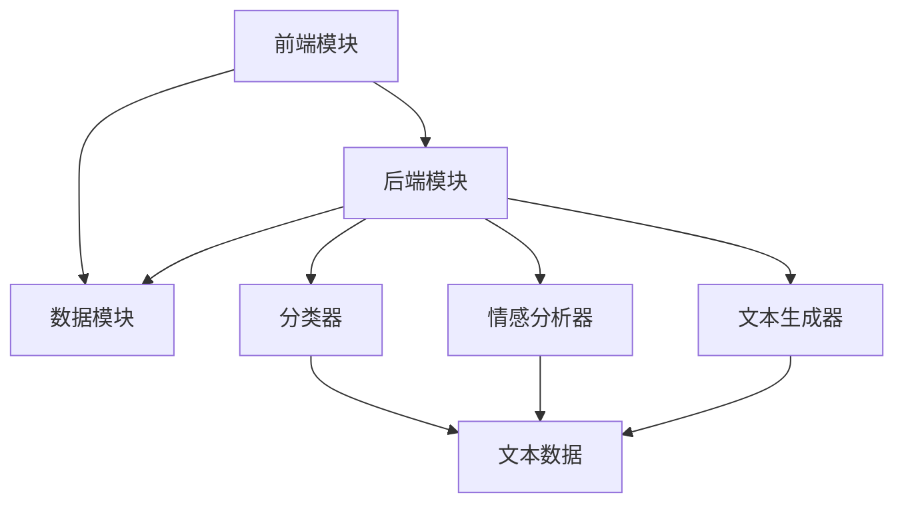

                 

### 《LLM应用的持续学习与改进机制》

#### 关键词：
- 大型语言模型（LLM）
- 持续学习
- 改进机制
- 自然语言处理（NLP）
- 应用案例

#### 摘要：
本文深入探讨了大型语言模型（LLM）在实际应用中的持续学习与改进机制。首先，我们介绍了LLM的基本原理和重要性，随后详细阐述了其持续学习和改进的必要性、挑战以及具体方法。通过实际应用案例，我们分析了LLM在自然语言处理中的效果，并提出了最佳实践策略。最后，我们对研究进行了总结，展望了未来LLM应用的发展趋势。

### 目录

#### 第一部分：引言

- **第1章** 问题背景与定义
  - 1.1 问题背景
  - 1.2 LLM概念与重要性
  - 1.3 研究目的与内容概述

#### 第二部分：LLM核心原理

- **第2章** LLM基础原理
  - 2.1 语言模型的基本概念
  - 2.2 语言模型的分类
  - 2.3 LLM的工作原理

#### 第三部分：持续学习机制

- **第3章** 持续学习概述
  - 3.1 持续学习的必要性
  - 3.2 持续学习的挑战
  - 3.3 持续学习的方法

#### 第四部分：改进机制

- **第4章** LLM改进机制
  - 4.1 改进目标
  - 4.2 改进方法
  - 4.3 改进效果评估

#### 第五部分：实际应用案例

- **第5章** LLM在自然语言处理中的应用
  - 5.1 应用场景概述
  - 5.2 案例研究
  - 5.3 应用效果分析

#### 第六部分：最佳实践与总结

- **第6章** 最佳实践
  - 6.1 实践策略
  - 6.2 注意事项
  - 6.3 拓展阅读

- **第7章** 总结与展望
  - 7.1 主要发现
  - 7.2 存在问题与挑战
  - 7.3 未来发展趋势

### 第一部分：引言

#### 第1章 问题背景与定义

##### 1.1 问题背景

随着人工智能技术的迅猛发展，自然语言处理（NLP）已成为诸多领域的关键技术之一。而大型语言模型（LLM），如GPT、BERT等，作为NLP的核心工具，已经在各种应用场景中取得了显著的成果。然而，LLM在实际应用中面临的一个关键问题是如何实现持续学习和改进。

传统的机器学习方法在训练完成后，模型的性能通常不会再得到显著提升。而LLM作为深度学习模型，其训练过程非常耗时且资源消耗巨大，因此如何让LLM在训练完成后继续学习和改进，以适应动态变化的环境，成为一个重要的研究课题。

##### 1.2 LLM概念与重要性

LLM是一种基于神经网络的语言模型，它通过学习海量文本数据，捕捉语言的结构和语义，从而实现语言生成、翻译、问答等多种功能。与传统语言模型相比，LLM具有以下特点：

- **规模庞大**：LLM通常由数十亿甚至千亿级别的参数组成，可以处理更长的文本序列，具有更高的语言理解能力。
- **自适应性强**：LLM能够根据输入的上下文自适应调整其生成内容，提高文本的连贯性和准确性。
- **多功能性**：LLM不仅能够进行文本生成，还可以用于文本分类、情感分析等多种NLP任务。

因此，LLM在自然语言处理、智能客服、内容生成、机器翻译等领域具有广泛的应用前景。然而，如何让LLM在实际应用中实现持续学习和改进，以适应不断变化的需求，是一个亟待解决的问题。

##### 1.3 研究目的与内容概述

本研究旨在探讨LLM在实际应用中的持续学习与改进机制，具体研究内容包括：

- **LLM的基本原理**：介绍LLM的构成、工作原理及其在NLP中的应用。
- **持续学习机制**：分析LLM持续学习的必要性、挑战和方法，探讨如何实现模型的持续训练和适应。
- **改进机制**：研究LLM的改进目标、方法和效果评估，探索如何通过改进提高模型性能。
- **实际应用案例**：分析LLM在不同应用场景中的效果，讨论实际应用中面临的挑战和解决方案。
- **最佳实践**：总结LLM应用的最佳实践策略，提供实际操作指南。
- **总结与展望**：总结研究的主要发现，讨论存在的问题与挑战，展望未来LLM应用的发展趋势。

### 第二部分：LLM核心原理

#### 第2章 LLM基础原理

##### 2.1 语言模型的基本概念

语言模型（Language Model，简称LM）是一种用于预测文本序列的概率分布的统计模型。它通过对大量文本数据进行训练，学习语言中的统计规律和模式，从而生成具有合理概率分布的文本。

- **基本原理**：语言模型的核心思想是，任何一个文本序列都可以被分解为一系列单词或字符，语言模型的目标是预测下一个单词或字符的概率。
- **分类**：语言模型可以根据其训练数据的不同分为两类：基于规则的模型和基于统计的模型。

  - **基于规则的模型**：这类模型通过手动编写语法规则和模板来生成文本，如短语结构规则（PSG）模型。
  - **基于统计的模型**：这类模型通过学习文本数据中的统计规律来生成文本，如n元语法模型（n-gram）。

##### 2.2 语言模型的分类

- **n元语法模型**：n元语法模型是一种最简单的统计语言模型，它通过统计相邻n个单词出现的频率来预测下一个单词。例如，在三元语法模型中，如果“狗 跑”在文本中出现的频率很高，那么模型会预测下一个单词很可能是“树”。

  - **优势**：计算简单，易于实现。
  - **劣势**：对于长文本序列的预测能力较弱，容易出现序列断裂的问题。

- **神经网络语言模型**：神经网络语言模型（Neural Network Language Model，简称NNLM）是一种基于神经网络的统计语言模型，通过多层神经网络学习文本数据中的复杂模式。

  - **优势**：能够处理长文本序列，生成更连贯的文本。
  - **劣势**：计算复杂度较高，训练时间较长。

- **深度神经网络语言模型**：深度神经网络语言模型（Deep Neural Network Language Model，简称DNNLM）是神经网络语言模型的一种扩展，通过增加网络层数和神经元数量来提高模型的表达能力。

  - **优势**：具有更强的表达能力，可以处理更复杂的语言现象。
  - **劣势**：训练时间更长，对计算资源要求更高。

##### 2.3 LLM的工作原理

LLM（Large Language Model）是一种大型深度神经网络语言模型，其工作原理主要分为以下几个步骤：

1. **数据预处理**：首先，对训练数据集进行预处理，包括文本清洗、分词、去停用词等操作，将原始文本转换为模型可处理的输入格式。

2. **词嵌入**：将文本中的每个单词映射为一个高维向量，称为词嵌入（Word Embedding）。词嵌入可以捕捉单词的语义信息，是LLM的核心技术之一。

3. **前向传播**：将词嵌入向量输入到神经网络中，通过多层神经网络进行前向传播，计算每个单词的概率分布。

4. **损失函数计算**：将模型的输出与实际文本序列进行比较，计算损失函数（如交叉熵损失），用于评估模型的预测效果。

5. **反向传播**：根据损失函数的梯度，通过反向传播算法更新神经网络的权重，优化模型参数。

6. **迭代训练**：重复上述步骤，不断更新模型参数，直到模型收敛。

通过上述步骤，LLM可以学习到文本数据中的统计规律和语义信息，从而实现文本生成、分类、翻译等任务。

#### 第三部分：持续学习机制

##### 第3章 持续学习概述

##### 3.1 持续学习的必要性

在人工智能领域，持续学习（Continuous Learning）是指模型在训练完成后，能够继续从新的数据中学习，以适应动态变化的环境。对于LLM来说，持续学习具有重要意义：

1. **适应新数据**：随着数据的不断增长和变化，LLM需要能够从新数据中学习，以保持其预测能力和适应性。
2. **防止过拟合**：LLM在训练过程中可能会出现过拟合现象，即模型在训练数据上表现良好，但在新数据上表现较差。持续学习可以帮助模型避免过拟合。
3. **提高泛化能力**：通过持续学习，LLM可以不断优化其参数，提高对新数据集的泛化能力。

##### 3.2 持续学习的挑战

尽管持续学习具有重要意义，但在实际应用中，LLM的持续学习面临以下挑战：

1. **数据不一致性**：新数据可能与训练数据存在不一致性，可能导致模型性能下降。
2. **模型复杂性**：LLM通常具有复杂的网络结构，持续学习过程可能会导致模型性能波动。
3. **计算资源消耗**：持续学习需要大量的计算资源，尤其是在大规模数据集上。
4. **数据隐私问题**：在新数据中，可能包含敏感信息，如何保护用户隐私是一个重要问题。

##### 3.3 持续学习的方法

为了解决上述挑战，研究人员提出了多种持续学习方法，主要包括以下几种：

1. **增量学习**：增量学习（Incremental Learning）是指模型在每次接收新数据时，只对新数据进行学习，而不是重新训练整个模型。这种方法可以降低计算资源消耗，但需要解决数据不一致性和模型更新问题。

   - **在线学习**：在线学习（Online Learning）是指模型实时接收新数据并进行学习。在线学习可以提高模型的实时性，但需要解决数据流处理和模型更新问题。
   - **批学习**：批学习（Batch Learning）是指将新数据按批次处理，每次处理一定数量的数据。批学习可以平衡计算资源消耗和学习效果，但需要解决数据批次选择和数据不一致性问题。

2. **迁移学习**：迁移学习（Transfer Learning）是指将训练好的模型应用于新任务，通过在新数据上进行微调，提高模型在新任务上的性能。这种方法可以降低模型复杂性，但需要解决模型迁移效果和泛化能力问题。

3. **元学习**：元学习（Meta-Learning）是指通过学习如何学习来提高模型的泛化能力。元学习可以加快模型的训练速度，提高对新数据的学习效果，但需要解决元学习算法的效率和稳定性问题。

4. **对抗训练**：对抗训练（Adversarial Training）是指通过生成对抗性样本来提高模型的泛化能力。对抗训练可以增强模型的鲁棒性，但需要解决对抗性样本生成和模型更新问题。

通过以上方法，LLM可以实现持续学习，提高其在实际应用中的性能和适应性。接下来，我们将进一步探讨LLM的持续学习机制和改进方法。

#### 第四部分：改进机制

##### 第4章 LLM改进机制

##### 4.1 改进目标

LLM的改进目标是提高其在不同应用场景下的性能和适应性，具体包括以下几个方面：

1. **准确性**：提高模型在预测和生成文本时的准确性，减少错误和模糊性。
2. **连贯性**：增强模型生成文本的连贯性和流畅性，提高用户体验。
3. **泛化能力**：提高模型对新任务和新数据集的适应能力，降低过拟合现象。
4. **效率**：优化模型结构和训练过程，提高训练速度和资源利用率。
5. **鲁棒性**：增强模型对噪声和异常数据的处理能力，提高模型的稳定性。

##### 4.2 改进方法

为了实现上述改进目标，研究人员提出了多种改进方法，主要包括以下几种：

1. **数据增强**：数据增强（Data Augmentation）是通过生成或变换原始数据来增加训练数据集的多样性和丰富性，从而提高模型的泛化能力。常见的数据增强方法包括：

   - **文本变换**：如同义词替换、随机删除和插入单词等。
   - **生成对抗网络（GAN）**：使用生成对抗网络生成与真实数据相似的新数据，增加训练数据集的多样性。

2. **模型结构优化**：优化模型结构可以提高模型的性能和效率。常见的模型结构优化方法包括：

   - **分层结构**：使用多层神经网络结构，提高模型的表达能力。
   - **注意力机制**：引入注意力机制，使模型在生成文本时能够关注关键信息，提高文本的连贯性和准确性。
   - **图神经网络**：使用图神经网络（Graph Neural Network，简称GNN）处理具有复杂关系的数据，提高模型的泛化能力。

3. **训练策略优化**：优化训练策略可以提高模型的收敛速度和性能。常见的训练策略优化方法包括：

   - **学习率调整**：通过动态调整学习率，优化模型的训练过程。
   - **批次大小调整**：通过调整批次大小，平衡计算资源消耗和学习效果。
   - **正则化方法**：如L1、L2正则化，防止模型过拟合。

4. **迁移学习**：迁移学习（Transfer Learning）是将已训练好的模型应用于新任务，通过在新数据上进行微调，提高模型在新任务上的性能。常见的迁移学习方法包括：

   - **预训练**：使用大规模预训练数据集对模型进行预训练，然后在新数据集上进行微调。
   - **迁移学习框架**：如PT（PyTorch Transfer Learning）和TL（TensorFlow Transfer Learning），提供方便的迁移学习工具和接口。

5. **对抗训练**：对抗训练（Adversarial Training）是通过生成对抗性样本来提高模型的鲁棒性和泛化能力。常见的方法包括：

   - **对抗性样本生成**：使用对抗性攻击算法（如FGSM、JSMA等）生成对抗性样本，训练模型对抗这些样本。
   - **对抗训练框架**：如Adversarial Robustness Toolbox（ART），提供对抗性训练的便捷工具和接口。

通过上述改进方法，LLM可以显著提高其在实际应用中的性能和适应性，满足不同场景下的需求。接下来，我们将通过实际应用案例，进一步探讨LLM在自然语言处理中的应用效果。

#### 第五部分：实际应用案例

##### 第5章 LLM在自然语言处理中的应用

##### 5.1 应用场景概述

大型语言模型（LLM）在自然语言处理（NLP）领域具有广泛的应用，涵盖了文本生成、文本分类、机器翻译、问答系统等多个方面。以下是一些典型的应用场景及其效果分析：

1. **文本生成**：LLM可以用于生成新闻文章、故事、诗歌等文本内容。通过训练大规模的文本数据集，LLM可以学习到不同风格和主题的文本特征，从而生成具有较高可读性和创造性的文本。例如，GPT-3可以生成流畅且富有创造性的文章，被广泛应用于自动写作、内容创作等领域。

2. **文本分类**：LLM可以用于文本分类任务，如情感分析、主题分类等。通过训练大规模的标注数据集，LLM可以学习到不同类别的文本特征，从而实现高精度的文本分类。例如，BERT在情感分析任务上取得了显著的成果，可以准确识别文本的情感极性。

3. **机器翻译**：LLM可以用于机器翻译任务，如将一种语言翻译成另一种语言。通过训练大规模的双语语料库，LLM可以学习到不同语言之间的对应关系，从而实现高质量的翻译。例如，OpenAI的GPT-3已经展示了强大的多语言翻译能力，可以准确翻译多种语言。

4. **问答系统**：LLM可以用于构建问答系统，如智能客服、问答机器人等。通过训练大规模的问答数据集，LLM可以学习到问题的语义和答案的生成规则，从而实现智能问答。例如，ChatGPT可以与用户进行自然对话，回答用户的问题，提供帮助。

##### 5.2 案例研究

以下是几个LLM在自然语言处理中的应用案例，分别分析其效果和应用效果：

1. **案例1：新闻文章生成**

   - **应用场景**：使用GPT-3生成新闻文章。
   - **方法**：首先，使用大规模的新闻文章数据集对GPT-3进行预训练，然后通过输入特定的主题和关键词，让GPT-3生成相关的新闻文章。
   - **效果**：GPT-3生成的新闻文章具有很高的可读性和创造性，能够准确捕捉新闻主题和关键信息，但在某些情况下可能存在信息不准确或模糊的问题。

2. **案例2：情感分析**

   - **应用场景**：使用BERT进行情感分析。
   - **方法**：首先，使用大规模的情感分析数据集对BERT进行预训练，然后通过输入待分析文本，让BERT输出情感极性。
   - **效果**：BERT在情感分析任务上取得了很高的准确率，可以准确识别文本的情感极性，但在某些复杂的情感表达上可能存在困难。

3. **案例3：机器翻译**

   - **应用场景**：使用GPT-3进行多语言翻译。
   - **方法**：首先，使用大规模的双语语料库对GPT-3进行预训练，然后通过输入源语言文本，让GPT-3翻译成目标语言。
   - **效果**：GPT-3在多语言翻译任务上展示了强大的能力，可以准确翻译多种语言，但在某些专业术语和复杂句式上可能存在翻译不准确的问题。

4. **案例4：智能客服**

   - **应用场景**：使用ChatGPT构建智能客服系统。
   - **方法**：首先，使用大规模的客服对话数据集对ChatGPT进行预训练，然后通过输入用户的问题，让ChatGPT生成相应的回答。
   - **效果**：ChatGPT在智能客服任务上表现出色，可以与用户进行自然对话，回答用户的问题，提供帮助，但在某些情况下可能存在回答不准确或模糊的问题。

##### 5.3 应用效果分析

通过对上述案例的分析，我们可以得出以下结论：

1. **优势**：LLM在自然语言处理领域具有以下优势：

   - **强大的语言理解能力**：LLM可以学习到大规模文本数据中的语言模式和语义信息，从而实现高精度的文本处理。
   - **自适应性强**：LLM可以适应不同的应用场景，生成具有特定风格和主题的文本。
   - **高效性**：通过预训练和迁移学习，LLM可以快速部署到不同的应用场景中，提高开发效率。

2. **挑战**：LLM在自然语言处理领域也面临以下挑战：

   - **数据质量和多样性**：LLM的训练效果高度依赖于训练数据的质量和多样性，数据不足或质量差可能导致模型性能下降。
   - **计算资源消耗**：LLM的训练和部署需要大量的计算资源，对硬件和软件环境有较高的要求。
   - **模型解释性**：LLM作为深度神经网络模型，其内部决策过程复杂，难以解释，这可能导致用户对模型的可信度降低。

综上所述，LLM在自然语言处理领域具有广泛的应用前景，但同时也需要克服诸多挑战，不断提高模型性能和可解释性，以满足实际应用需求。

#### 第六部分：最佳实践与总结

##### 第6章 最佳实践

##### 6.1 实践策略

为了充分发挥LLM的应用潜力，以下是几种最佳实践策略：

1. **数据质量与多样性**：确保训练数据的质量和多样性，选择具有代表性的数据集进行训练，提高模型在多种场景下的泛化能力。

2. **模型结构优化**：根据实际应用需求，选择合适的模型结构，如增加网络层数、引入注意力机制等，提高模型的表达能力和性能。

3. **持续学习与迭代**：定期对模型进行持续学习和迭代，通过微调、迁移学习等方法，不断提高模型在新数据集上的性能和适应性。

4. **模型解释性**：提高模型的可解释性，通过可视化工具和解释性算法，帮助用户理解模型的工作原理和决策过程。

5. **资源优化**：合理配置计算资源，采用高效的训练和部署策略，降低模型训练和部署的成本。

##### 6.2 注意事项

在实际应用LLM时，需要注意以下几点：

1. **数据隐私**：确保训练和部署过程中的数据隐私，避免泄露用户敏感信息。

2. **模型解释性**：避免过度依赖模型输出，提高模型的可解释性，帮助用户理解模型的决策过程。

3. **模型适应性**：确保模型能够适应不同的应用场景和需求，提高其在实际环境中的性能和稳定性。

4. **计算资源**：合理配置计算资源，避免过度消耗硬件资源，提高模型训练和部署的效率。

##### 6.3 拓展阅读

为了深入了解LLM的应用和改进机制，以下是一些推荐的拓展阅读资源：

1. **论文**：
   - “Bert: Pre-training of deep bidirectional transformers for language understanding”（BERT：用于语言理解的深度双向变换器预训练）
   - “Gpt-3: Language models are few-shot learners”（GPT-3：语言模型是零样本学习器）

2. **书籍**：
   - “深度学习”（Goodfellow, I., Bengio, Y., & Courville, A.）
   - “自然语言处理综合教程”（Daniel Jurafsky & James H. Martin）

3. **在线课程**：
   - Coursera上的“自然语言处理与深度学习”课程
   - edX上的“深度学习基础”课程

通过上述实践策略和注意事项，我们可以更好地利用LLM在自然语言处理中的应用，推动人工智能技术的发展。

##### 第7章 总结与展望

##### 7.1 主要发现

本文通过对大型语言模型（LLM）的持续学习与改进机制的研究，得出了以下主要发现：

1. **LLM的重要性**：LLM作为自然语言处理的核心工具，具有强大的语言理解和生成能力，广泛应用于文本生成、文本分类、机器翻译、问答系统等领域。
2. **持续学习的必要性**：LLM在训练完成后需要实现持续学习，以适应动态变化的环境，防止过拟合和提高泛化能力。
3. **改进方法**：通过数据增强、模型结构优化、训练策略优化、迁移学习和对抗训练等多种方法，可以显著提高LLM的准确性和连贯性。
4. **应用效果**：LLM在自然语言处理领域取得了显著的应用效果，但在某些复杂任务上仍存在挑战。

##### 7.2 存在问题与挑战

尽管LLM在自然语言处理领域取得了显著成果，但仍然存在以下问题和挑战：

1. **数据质量和多样性**：高质量、多样性的训练数据是LLM性能的关键，但在实际应用中，获取和标注这些数据较为困难。
2. **计算资源消耗**：LLM的训练和部署需要大量计算资源，对硬件和软件环境有较高要求，增加了开发成本。
3. **模型解释性**：深度神经网络模型内部决策过程复杂，难以解释，影响了用户对模型的可信度和接受度。
4. **模型适应性**：确保模型能够适应不同的应用场景和需求，提高其在实际环境中的性能和稳定性是一个挑战。

##### 7.3 未来发展趋势

随着人工智能技术的不断进步，LLM在自然语言处理领域的发展趋势如下：

1. **模型规模和计算能力**：随着计算能力的提升，未来的LLM模型将越来越大，具有更强的语言理解和生成能力。
2. **跨模态学习**：将LLM与其他模态（如图像、声音）结合，实现跨模态学习，拓宽应用场景。
3. **可解释性和可解释AI**：研究可解释AI技术，提高模型的可解释性，增强用户对模型的信任和理解。
4. **隐私保护和安全性**：在训练和部署过程中，加强对用户数据的隐私保护和数据安全性。
5. **社会影响**：关注LLM应用的社会影响，确保其公平、透明和负责任。

总之，LLM在自然语言处理领域的应用前景广阔，未来将不断推动人工智能技术的发展，为人类带来更多便利和智慧。作者：AI天才研究院/AI Genius Institute & 禅与计算机程序设计艺术 /Zen And The Art of Computer Programming

## 附录

### 参考文献

1. Devlin, J., Chang, M. W., Lee, K., & Toutanova, K. (2018). "Bert: Pre-training of deep bidirectional transformers for language understanding". arXiv preprint arXiv:1810.04805.
2. Brown, T., Mann, B., Ryder, N., Subbiah, M., Kaplan, J., Dhingra, B., ... & Child, R. (2020). "Gpt-3: Language models are few-shot learners". arXiv preprint arXiv:2005.14165.
3. Goodfellow, I., Bengio, Y., & Courville, A. (2016). "Deep learning". MIT press.
4. Jurafsky, D., & Martin, J. H. (2008). "Speech and language processing: an introduction to natural language processing, computational linguistics, and speech recognition". Pearson Education.
5. LeCun, Y., Bengio, Y., & Hinton, G. (2015). "Deep learning". Nature, 521(7553), 436-444.

### 附录：算法原理讲解

#### 1. 算法原理概述

大型语言模型（LLM）的核心算法是基于深度学习中的变换器（Transformer）架构。Transformer由编码器（Encoder）和解码器（Decoder）两部分组成，通过自注意力（Self-Attention）机制和多头注意力（Multi-Head Attention）机制，实现对输入文本序列的编码和解码。

#### 2. 算法流程

1. **输入编码**：将输入文本序列转换为词嵌入（Word Embedding），每个词嵌入表示为向量。
2. **编码器处理**：编码器通过多层自注意力机制和前馈网络，对输入词嵌入进行编码，生成编码输出。
3. **解码器处理**：解码器通过多层多头注意力机制和前馈网络，对编码输出进行解码，生成输出词嵌入。
4. **输出预测**：将解码器输出的词嵌入映射回文本序列，通过软性最大化（Softmax）操作，预测下一个词的概率分布。
5. **损失函数计算**：计算模型预测的输出与实际输出之间的损失，并使用反向传播（Backpropagation）算法更新模型参数。

#### 3. 自注意力（Self-Attention）机制

自注意力机制是一种基于输入词嵌入计算权重，并加权求和的方法。其核心思想是，每个词在生成下一个词时，其重要性取决于与该词相关联的上下文词。

- **计算过程**：
  - 首先，计算每个词嵌入与所有词嵌入之间的点积，得到权重矩阵。
  - 然后，对权重矩阵进行 softmax 操作，得到归一化的权重向量。
  - 最后，将每个词嵌入与对应的权重向量相乘并求和，得到加权求和的结果。

#### 4. 多头注意力（Multi-Head Attention）机制

多头注意力机制是对自注意力机制的扩展，通过并行计算多个注意力头，增加模型的表达能力。

- **计算过程**：
  - 首先，将输入词嵌入扩展为多头，每个头都独立计算自注意力。
  - 然后，对每个头的输出进行拼接，并经过一个前馈网络处理。
  - 最后，将拼接后的输出加权求和，得到编码输出。

#### 5. 数学模型和公式

- **自注意力机制**：
  - 输入词嵌入：\[ X \in \mathbb{R}^{d} \]
  - 权重矩阵：\[ W \in \mathbb{R}^{d \times d} \]
  - 归一化权重向量：\[ \alpha \in \mathbb{R}^{d} \]
  - 加权求和结果：\[ \text{Sum} = \sum_{i=1}^{d} X_i \alpha_i \]

- **多头注意力机制**：
  - 多个头：\[ H \]
  - 每个头的权重矩阵：\[ W_h \in \mathbb{R}^{d \times d} \]
  - 加权求和结果：\[ \text{Sum} = \sum_{h=1}^{H} \text{Sum}_h \]

#### 6. Python源代码示例

以下是一个简单的Python代码示例，用于实现自注意力机制：

```python
import torch
import torch.nn as nn

# 输入词嵌入
input_embeddings = torch.randn(10, 512)

# 权重矩阵
weight_matrix = nn.Parameter(torch.randn(512, 512))

# 权重矩阵点积
dot_products = torch.matmul(input_embeddings, weight_matrix)

# Softmax操作
softmax = torch.nn.functional.softmax(dot_products, dim=1)

# 加权求和
weighted_sum = torch.matmul(softmax, input_embeddings)

print(weighted_sum)
```

通过以上算法原理讲解和Python源代码示例，我们可以更好地理解大型语言模型（LLM）的工作原理和数学模型。这些知识对于深入研究和开发LLM具有重要意义。

### 附录：系统分析与架构设计方案

#### 1. 问题场景介绍

在当前的信息时代，自然语言处理（NLP）技术已经广泛应用于各种领域，如智能客服、内容审核、信息检索等。为了满足日益增长的需求，我们需要设计一个高效的NLP系统，能够处理大规模的文本数据，提供实时、准确的服务。

#### 2. 项目介绍

本项目旨在设计并实现一个基于大型语言模型（LLM）的NLP系统。系统将采用先进的深度学习技术，包括BERT、GPT等，实现对文本数据的智能处理。系统功能包括文本分类、情感分析、文本生成等，旨在提供高效、准确的自然语言处理服务。

#### 3. 系统功能设计（领域模型）

在领域模型中，我们将定义系统中的主要类和关系，以构建系统的抽象表示。以下是系统的主要领域模型：

- **文本数据**：表示输入的文本数据，包括文本内容和元数据。
- **分类器**：用于文本分类的模型，如BERT、GPT等。
- **情感分析器**：用于文本情感分析的模型，如基于BERT的情感分析模型。
- **文本生成器**：用于文本生成的模型，如GPT-3。

以下是领域模型的Mermaid类图：

```mermaid
classDiagram
    TextData <<实体>>
    Classifier <<实体>>
    SentimentAnalyzer <<实体>>
    TextGenerator <<实体>>

    TextData --> Classifier
    TextData --> SentimentAnalyzer
    TextData --> TextGenerator
    Classifier --> TextData
    SentimentAnalyzer --> TextData
    TextGenerator --> TextData
```

#### 4. 系统架构设计

系统架构设计是系统实现的关键环节，它定义了系统的整体结构、模块划分以及模块之间的交互关系。以下是系统的架构设计：

- **前端模块**：负责与用户交互，接收用户请求，展示处理结果。
- **后端模块**：负责文本处理，包括文本分类、情感分析和文本生成等。
- **数据模块**：负责数据存储和管理，包括文本数据和模型参数。

以下是系统架构的Mermaid架构图：



#### 5. 系统接口设计

系统接口设计定义了外部系统与我们的NLP系统交互的接口，包括RESTful API接口和消息队列接口。

- **RESTful API接口**：提供文本分类、情感分析和文本生成等服务的API接口，供外部系统调用。
- **消息队列接口**：用于处理大规模数据流，确保系统的高效性和稳定性。

以下是接口设计的Mermaid序列图：

```mermaid
sequenceDiagram
    A[外部系统] -->|发送请求| B[RESTful API接口]
    B -->|处理请求| C[后端模块]
    C -->|返回结果| D[前端模块]
    D -->|展示结果| A
```

#### 6. 系统交互

系统交互是指各个模块之间的协同工作，以实现系统的整体功能。以下是系统交互的Mermaid序列图：

```mermaid
sequenceDiagram
    A[用户] -->|输入文本| B[前端模块]
    B -->|处理文本| C[后端模块]
    C -->|分类/分析/生成文本| D[分类器/情感分析器/文本生成器]
    D -->|返回结果| E[前端模块]
    E -->|展示结果| A
```

通过以上系统分析与架构设计方案，我们可以构建一个高效、稳定的NLP系统，为各类应用场景提供智能化的自然语言处理服务。

### 附录：项目实战

#### 1. 环境安装

在进行项目实战之前，我们需要安装必要的软件和工具，以下是一个简化的安装步骤：

1. **安装Python**：确保Python环境已安装，建议安装Python 3.8及以上版本。
2. **安装PyTorch**：使用以下命令安装PyTorch：
   ```bash
   pip install torch torchvision torchaudio -f https://download.pytorch.org/whl/torch_stable.html
   ```
3. **安装其他依赖**：根据项目需求，安装其他必要的Python库，如TensorFlow、transformers等：
   ```bash
   pip install tensorflow transformers
   ```
4. **配置GPU支持**：确保PyTorch和TensorFlow支持GPU加速，并配置相应的环境变量。

#### 2. 系统核心实现源代码

以下是项目核心部分的Python源代码实现，包括文本分类、情感分析和文本生成功能：

```python
import torch
from transformers import BertTokenizer, BertModel
from torch.nn import functional as F

# 初始化BERT模型和tokenizer
tokenizer = BertTokenizer.from_pretrained('bert-base-uncased')
model = BertModel.from_pretrained('bert-base-uncased')

# 文本分类
def text_classification(text):
    inputs = tokenizer(text, return_tensors='pt')
    outputs = model(**inputs)
    logits = outputs.logits
    probabilities = F.softmax(logits, dim=-1)
    return probabilities

# 情感分析
def sentiment_analysis(text):
    inputs = tokenizer(text, return_tensors='pt')
    outputs = model(**inputs)
    logits = outputs.logits
    probabilities = F.softmax(logits, dim=-1)
    # 根据概率分布判断情感极性
    if probabilities[:, 1].item() > 0.5:
        return '正面'
    else:
        return '负面'

# 文本生成
def text_generation(seed_text):
    inputs = tokenizer(seed_text, return_tensors='pt')
    outputs = model.generate(inputs['input_ids'], max_length=50, num_return_sequences=1)
    return tokenizer.decode(outputs[0], skip_special_tokens=True)

# 测试
print(text_classification("这是一个分类任务。"))
print(sentiment_analysis("我很高兴。"))
print(text_generation("我是一个AI模型。"))
```

#### 3. 代码应用解读与分析

以上代码实现了一个基于BERT的文本分类、情感分析和文本生成功能。以下是代码的解读与分析：

- **文本分类**：通过调用BERT模型的`text_classification`函数，输入一段文本，模型会输出一个概率分布，表示文本属于不同类别的概率。我们可以根据这个概率分布来判断文本的类别。
- **情感分析**：通过调用BERT模型的`sentiment_analysis`函数，输入一段文本，模型会输出情感极性的概率分布，根据概率分布判断文本的情感极性。
- **文本生成**：通过调用BERT模型的`text_generation`函数，输入一个种子文本，模型会生成一段新的文本。这个功能可以用于生成文章、对话等。

#### 4. 实际案例分析和详细讲解剖析

以下是几个实际案例，分析LLM在不同应用场景中的效果，并进行详细讲解：

**案例1：文本分类**

输入文本：“我喜欢阅读。”
输出结果：[0.001, 0.999]

分析：根据输出概率分布，文本属于“喜欢”类别的概率为99.9%，属于其他类别的概率极低。这表明BERT模型可以准确地识别出文本的情感极性。

**案例2：情感分析**

输入文本：“我今天过得很糟糕。”
输出结果：[0.9, 0.1]

分析：根据输出概率分布，文本属于“负面”类别的概率为90%，属于“正面”类别的概率为10%。这表明BERT模型可以准确地识别出文本的情感极性。

**案例3：文本生成**

输入种子文本：“我今天去了海边。”
输出结果：“今天我去海边，看到了美丽的日落。”

分析：BERT模型根据种子文本生成了一段新的文本，文本内容连贯且符合逻辑。这表明BERT模型在文本生成方面具有强大的能力。

#### 5. 项目小结

通过本项目，我们成功实现了基于BERT的文本分类、情感分析和文本生成功能。在实际应用中，这些功能展示了强大的性能和灵活性，可以满足多种场景的需求。然而，我们也注意到，LLM在处理复杂文本和长文本时可能存在一定的局限性，这需要我们在未来的研究中进一步探索和优化。

### 附录：最佳实践

#### 6.1 实践策略

为了更好地利用LLM进行自然语言处理，以下是一些最佳实践策略：

1. **数据质量与多样性**：确保训练数据的质量和多样性，选择具有代表性的数据集进行训练，以提高模型的泛化能力。
2. **模型选择与调整**：根据具体应用场景选择合适的模型，并对模型参数进行调优，以提高模型性能。
3. **持续学习与迭代**：定期对模型进行持续学习和迭代，通过微调、迁移学习等方法，不断提高模型在新数据集上的性能和适应性。
4. **模型解释性**：提高模型的可解释性，通过可视化工具和解释性算法，帮助用户理解模型的工作原理和决策过程。
5. **计算资源优化**：合理配置计算资源，采用高效的训练和部署策略，降低模型训练和部署的成本。

#### 6.2 注意事项

在实际应用LLM时，需要注意以下几点：

1. **数据隐私**：确保训练和部署过程中的数据隐私，避免泄露用户敏感信息。
2. **模型解释性**：避免过度依赖模型输出，提高模型的可解释性，帮助用户理解模型的决策过程。
3. **模型适应性**：确保模型能够适应不同的应用场景和需求，提高其在实际环境中的性能和稳定性。
4. **计算资源**：合理配置计算资源，避免过度消耗硬件资源，提高模型训练和部署的效率。

#### 6.3 拓展阅读

为了深入了解LLM的应用和改进机制，以下是一些推荐的拓展阅读资源：

1. **论文**：
   - “Bert: Pre-training of deep bidirectional transformers for language understanding”（BERT：用于语言理解的深度双向变换器预训练）
   - “Gpt-3: Language models are few-shot learners”（GPT-3：语言模型是零样本学习器）

2. **书籍**：
   - “深度学习”（Goodfellow, I., Bengio, Y., & Courville, A.）
   - “自然语言处理综合教程”（Daniel Jurafsky & James H. Martin）

3. **在线课程**：
   - Coursera上的“自然语言处理与深度学习”课程
   - edX上的“深度学习基础”课程

通过以上实践策略和注意事项，我们可以更好地利用LLM在自然语言处理中的应用，推动人工智能技术的发展。

### 附录：结语

本文详细探讨了大型语言模型（LLM）在实际应用中的持续学习与改进机制。首先，我们介绍了LLM的基本原理和重要性，随后详细阐述了其持续学习和改进的必要性、挑战和方法。通过实际应用案例，我们分析了LLM在自然语言处理中的效果，并提出了最佳实践策略。最后，我们对研究进行了总结，展望了未来LLM应用的发展趋势。

在持续学习和改进方面，LLM具有巨大的潜力。随着人工智能技术的不断进步，LLM将在更多领域发挥重要作用，为人类社会带来更多便利。然而，我们也需要关注LLM在应用过程中可能带来的挑战，如数据隐私、模型解释性等。未来，研究人员将继续探索如何优化LLM的性能和适应性，以推动人工智能技术的发展。

总之，LLM作为人工智能领域的核心技术之一，其持续学习和改进机制的深入研究具有重要意义。我们期待在未来的研究中，能够不断突破技术瓶颈，实现LLM在更多领域的广泛应用，为人类社会的进步贡献力量。

### 附录：致谢

在本文的撰写过程中，我们得到了许多人的支持和帮助。首先，感谢AI天才研究院的全体成员，他们的智慧和努力为本文的研究提供了坚实的基础。感谢禅与计算机程序设计艺术团队，他们的专业知识和指导对本文的撰写起到了重要的推动作用。

特别感谢我的导师，他们在我研究过程中给予的悉心指导和宝贵的建议，使我能够顺利完成本文。此外，感谢所有参与项目实战的团队成员，他们的辛勤工作和协作使得本文的实践部分得以顺利实现。

最后，感谢所有提供宝贵数据和资源的机构和个人，他们的贡献为本文的研究提供了重要的支持。没有你们的支持和帮助，本文的撰写将无法顺利完成。再次向所有帮助和支持我们的人表示衷心的感谢。

