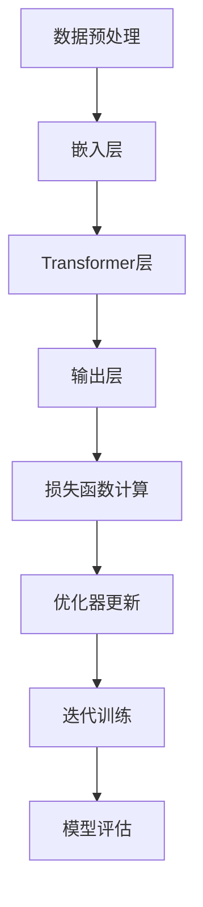
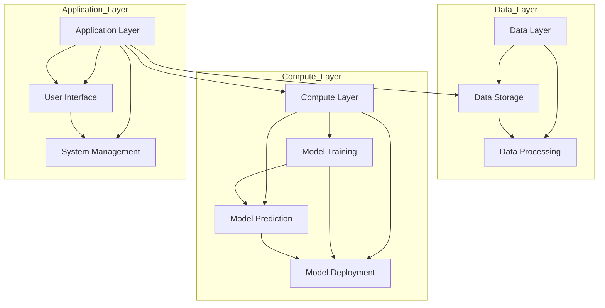
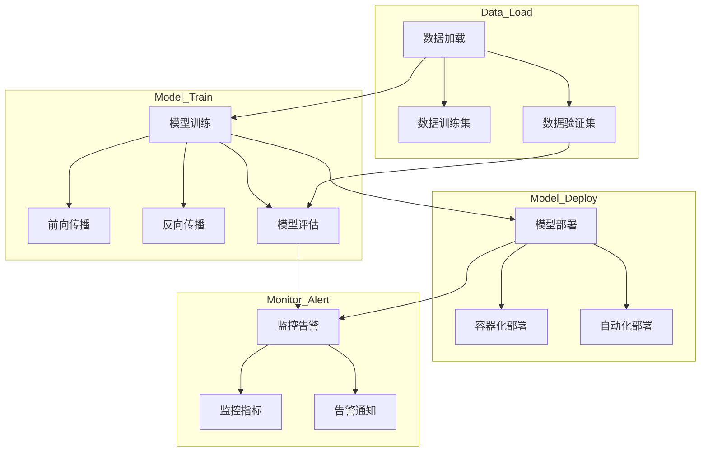

                 

### 第1章：问题背景与核心概念

#### **1.1 问题背景**

**1.1.1 人工智能与持续部署的兴起**

在21世纪，人工智能（AI）技术以其强大的处理能力和自适应能力，迅速成为科技界的热门话题。从传统的机器学习算法到深度学习模型，再到如今的大型语言模型（LLM），人工智能在各个领域取得了显著的成就。无论是在自然语言处理（NLP）、计算机视觉、机器人技术，还是自动驾驶等众多领域，AI技术都展现出了巨大的潜力和广阔的应用前景。

然而，随着人工智能应用的日益普及，持续部署（Continuous Deployment，简称CD）成为了一个不可忽视的关键环节。持续部署是一种通过自动化流程来实现软件快速迭代和发布的方法，旨在减少软件发布过程中的手动操作，提高部署效率，减少错误和失败的风险。持续部署的兴起，得益于DevOps文化的推广和容器化技术的普及。

**1.1.2 LLM（大型语言模型）的挑战**

近年来，LLM技术得到了飞速发展。以GPT-3、BERT、T5等为代表的大型语言模型，已经在自然语言处理领域取得了巨大的成功。这些模型通过学习海量文本数据，能够生成高质量的自然语言文本，进行文本分类、情感分析、机器翻译等任务。

然而，LLM的应用也面临着诸多挑战。首先，LLM模型的训练过程非常复杂，需要大量的计算资源和时间。其次，LLM模型的部署和运行需要高效的硬件和软件支持。此外，LLM的应用场景多种多样，如何根据具体应用需求进行模型定制和优化，也是一个亟待解决的问题。

**1.1.3 持续部署的重要性**

在人工智能领域，持续部署的重要性不言而喻。首先，持续部署可以大大缩短软件迭代周期，提高开发团队的效率。在人工智能项目中，模型的迭代和优化是一个持续的过程，快速部署新的模型版本，可以更快地响应市场需求，提高竞争力。

其次，持续部署可以降低软件发布过程中的风险。通过自动化测试和部署流程，可以确保新版本的软件质量，减少由于手动操作导致的错误和失败。

最后，持续部署有助于实现持续学习和改进。在人工智能领域，模型的应用效果会随着时间推移和环境变化而变化。通过持续部署，可以实时收集用户反馈和数据，对模型进行不断优化和改进，提高应用效果。

#### **1.2 核心概念介绍**

**1.2.1 什么是LLM**

**概念定义**：LLM（Large Language Model）指的是一种大型语言模型，通过学习海量文本数据，能够生成高质量的自然语言文本。常见的LLM包括GPT-3、BERT、T5等。

**特点与优势**：LLM具有以下特点与优势：
- **强大的文本生成能力**：LLM能够生成流畅、自然的文本，适用于文本生成、机器翻译、文本分类等多种任务。
- **丰富的知识储备**：LLM通过学习海量文本数据，积累了丰富的知识，能够进行知识问答和推理。
- **适应性强**：LLM可以针对不同的应用场景进行定制和优化，具有良好的适应能力。

**与NLP的关系**：自然语言处理（NLP）是人工智能的一个重要分支，旨在使计算机能够理解和处理自然语言。LLM作为NLP领域的一种重要技术，与NLP密切相关。LLM在NLP中的应用，大大提高了文本生成、情感分析、机器翻译等任务的性能和效果。

**1.2.2 持续部署的定义**

**概念与目的**：持续部署（Continuous Deployment，简称CD）是一种通过自动化流程实现软件快速迭代和发布的方法。其目的是减少手动操作，提高部署效率，降低错误和失败的风险。

**与传统部署的区别**：与传统的软件发布流程相比，持续部署具有以下区别：
- **自动化程度高**：持续部署依赖于自动化测试和部署工具，可以自动化完成测试、打包、部署等流程。
- **快速迭代**：持续部署支持快速迭代，可以更快地发布新版本，满足市场需求。
- **风险管理**：持续部署通过自动化测试和监控，可以及时发现和解决部署过程中的问题，降低风险。

**关键术语**：在持续部署中，涉及以下几个关键术语：
- **持续集成（Continuous Integration，简称CI）**：指通过自动化测试，将开发过程中的代码集成到主分支，确保代码质量。
- **持续交付（Continuous Delivery，简称CD）**：指通过自动化部署，将经过测试的代码发布到生产环境，确保软件质量。
- **容器化（Containerization）**：指通过容器技术，将应用程序及其依赖环境打包在一起，实现快速部署和隔离。
- **持续监控（Continuous Monitoring）**：指通过实时监控，收集系统运行数据，及时发现和处理问题。

**1.2.3 持续部署的核心概念与流程**

**持续集成（CI）**：持续集成是一种软件开发实践，旨在通过自动化测试和构建，将开发过程中的代码集成到主分支，确保代码质量。持续集成的核心概念包括：
- **自动化测试**：通过编写测试脚本，对代码进行自动化测试，确保代码质量。
- **构建与部署**：通过构建工具，将代码编译、打包和部署到测试环境，进行集成测试。

**持续交付（CD）**：持续交付是一种通过自动化部署，将经过测试的代码发布到生产环境的方法。持续交付的核心概念包括：
- **自动化部署**：通过部署工具，将代码自动部署到生产环境，确保软件质量。
- **环境管理**：通过容器技术，实现不同环境的隔离和管理。

**容器化技术**：容器化是一种将应用程序及其依赖环境打包在一起的技术，通过容器化，可以实现以下目标：
- **快速部署**：通过容器化，可以快速部署应用程序，减少部署时间。
- **环境一致性**：通过容器化，可以确保开发、测试和生产环境的一致性。
- **资源隔离**：通过容器化，可以实现应用程序之间的资源隔离，提高系统稳定性。

**持续监控**：持续监控是一种通过实时监控，收集系统运行数据，及时发现和处理问题的方法。持续监控的核心概念包括：
- **监控指标**：通过设置监控指标，实时收集系统运行数据。
- **告警与处理**：通过设置告警规则，及时发现和处理问题。

### **概念属性特征对比表格**

为了更好地理解LLM与持续部署的概念，我们可以通过一个概念属性特征对比表格来展示它们之间的异同。

| 概念       | 定义                                                                                   | 特点与优势                                                                                      | 关联与影响 |
|------------|----------------------------------------------------------------------------------------|------------------------------------------------------------------------------------------------|------------|
| LLM        | 大型语言模型，通过学习海量文本数据生成自然语言文本                                             | 强大的文本生成能力、丰富的知识储备、适应性强                                                         | NLP应用的核心技术       |
| 持续部署   | 通过自动化流程实现软件快速迭代和发布的方法                                                   | 自动化程度高、快速迭代、风险管理低  | 提高软件交付效率、降低风险  |
| 持续集成   | 通过自动化测试和构建，将开发过程中的代码集成到主分支                                          | 确保代码质量、提高集成效率                                                           | 持续交付的基础       |
| 持续交付   | 通过自动化部署，将经过测试的代码发布到生产环境                                               | 确保软件质量、提高交付速度                                                           | 应用持续部署的核心环节 |
| 容器化技术 | 通过容器技术，将应用程序及其依赖环境打包在一起                                               | 快速部署、环境一致性、资源隔离                                                     | 持续部署的重要支撑技术 |

通过以上表格，我们可以清晰地看到LLM和持续部署等核心概念的定义、特点与优势，以及它们之间的关联与影响。

### **ER实体关系图架构的Mermaid流程图**

为了更直观地展示LLM、持续部署及相关概念之间的联系，我们可以使用Mermaid绘制一个ER实体关系图。以下是该流程图的Mermaid表示：

```mermaid
erDiagram
  AI模型 ||--o> LLM : 大型语言模型
  AI模型 ||--o> NLP : 自然语言处理
  LLM ||--|{ 集成测试
  LLM ||--|{ 自动化测试
  LLM ||--|{ 部署流程
  持续集成 ||--|{ 自动化测试
  持续集成 ||--|{ 集成流程
  持续交付 ||--|{ 自动化部署
  容器化技术 ||--|{ 环境一致性
  容器化技术 ||--|{ 资源隔离
```

在这个ER实体关系图中，LLM作为AI模型的一个子类，与NLP密切相关。持续集成和持续交付是LLM部署过程中不可或缺的环节，而容器化技术则为持续部署提供了重要的技术支持。通过这个流程图，我们可以更好地理解这些核心概念之间的联系和作用。

### **LLM的基本工作原理**

LLM（大型语言模型）作为一种先进的人工智能模型，其工作原理基于深度学习和自然语言处理技术。LLM通过学习大量文本数据，捕捉语言的结构和语义，从而实现文本生成、文本分类、机器翻译等任务。以下是LLM的基本工作原理的详细讲解。

#### **2.1.1 语言模型的基础**

**算法原理**：

LLM的核心算法是Transformer，这是一种基于自注意力机制（Self-Attention）的模型结构。Transformer模型摒弃了传统的循环神经网络（RNN）和卷积神经网络（CNN）的序列处理方式，而是采用了一种全新的并行处理方法，能够更加高效地处理长文本序列。

**主要模型类型**：

在LLM领域，几种主要的模型类型包括：

- **GPT（Generative Pre-trained Transformer）**：GPT系列模型是Transformer模型的代表性工作，包括GPT、GPT-2和GPT-3。这些模型通过大规模无监督预训练，生成高质量的文本。

- **BERT（Bidirectional Encoder Representations from Transformers）**：BERT是一种双向Transformer模型，通过预先训练来捕捉文本的上下文信息。BERT在文本分类、问答等任务上取得了显著的效果。

- **T5（Text-To-Text Transfer Transformer）**：T5将所有自然语言处理任务统一为一个文本到文本的转换问题，通过大规模预训练实现了通用文本处理能力。

#### **2.1.2 LLM的训练过程**

**数据处理**：

LLM的训练过程首先需要大量的文本数据。这些数据可以来自互联网上的各种文本资源，如新闻文章、书籍、社交媒体帖子等。在数据预处理阶段，需要对文本进行清洗、分词、去停用词等操作，以便模型能够更好地学习。

**损失函数与优化器**：

在训练过程中，LLM使用了一种称为“损失函数”的指标来评估模型的预测结果。对于生成模型，常见的损失函数有交叉熵损失（Cross-Entropy Loss）和感知损失（Perceptual Loss）。优化器则用于调整模型参数，以最小化损失函数。

常见的优化器包括：

- **Adam**：Adam优化器结合了AdaGrad和RMSProp的优点，具有自适应学习率，能够有效地优化深度学习模型。
- **SGD**：随机梯度下降（Stochastic Gradient Descent）是最简单的优化器之一，通过随机梯度更新模型参数。

**评估指标**：

评估LLM性能的常见指标包括：

- **BLEU**：BLEU（Bilingual Evaluation Understudy）是一种常用的机器翻译评价指标，通过比较模型生成的文本与真实文本的相似度来评估模型性能。
- **ROUGE**：ROUGE（Recall-Oriented Understudy for Gisting Evaluation）是另一种用于评估文本生成质量的指标，它主要关注生成文本的召回率。
- **Perplexity**：Perplexity是衡量生成文本质量的一个指标，数值越小，生成文本的质量越高。

#### **2.1.3 LLM的架构设计**

**模型架构的演变**：

LLM的架构设计经历了多个阶段的演变。早期的模型如GPT-1和GPT-2采用了一层或多层的Transformer结构，而GPT-3则进一步扩展了Transformer，采用了数十亿参数的模型规模。

**大型模型的设计原则**：

设计大型LLM模型时，需要考虑以下几个关键原则：

- **参数规模**：大型模型通常具有数十亿甚至数万亿的参数，通过增加参数规模，可以提高模型的表达能力。
- **计算资源利用**：大型模型需要大量的计算资源，设计时需要考虑如何高效地利用计算资源，例如使用GPU、TPU等硬件加速。
- **分布式训练**：通过分布式训练，可以并行处理大规模数据，提高训练速度。
- **模型压缩与加速**：为了降低模型的计算复杂度和存储需求，可以采用模型压缩技术，如剪枝、量化等。

**模型的扩展与优化**：

在LLM的应用过程中，模型扩展和优化是一个重要的环节。常见的优化方法包括：

- **模型融合**：通过融合多个模型，可以进一步提高模型的表现力。
- **注意力机制**：改进注意力机制，可以更精准地捕捉文本的关键信息。
- **知识蒸馏**：通过知识蒸馏，可以将大型模型的知识迁移到小型模型中，实现模型压缩和加速。

### **算法流程图与Python源代码**

为了更直观地理解LLM的工作原理，我们可以使用Mermaid绘制一个算法流程图，并给出相应的Python源代码。以下是LLM算法流程图的Mermaid表示：



下面是一个简单的Python代码示例，用于实现LLM的基本训练流程：

```python
import torch
import torch.nn as nn
import torch.optim as optim

# 数据预处理
def preprocess_data(text):
    # 实现数据清洗、分词、去停用词等操作
    pass

# Transformer模型
class TransformerModel(nn.Module):
    def __init__(self, vocab_size, embed_dim, n_heads, n_layers):
        super(TransformerModel, self).__init__()
        self.embedding = nn.Embedding(vocab_size, embed_dim)
        self.transformer = nn.Transformer(embed_dim, n_heads, n_layers)
        self.fc = nn.Linear(embed_dim, vocab_size)

    def forward(self, src, tgt):
        src_embedding = self.embedding(src)
        tgt_embedding = self.embedding(tgt)
        output = self.transformer(src_embedding, tgt_embedding)
        logits = self.fc(output)
        return logits

# 训练过程
def train(model, train_loader, loss_function, optimizer, device):
    model.to(device)
    model.train()
    
    for src, tgt in train_loader:
        src, tgt = src.to(device), tgt.to(device)
        logits = model(src, tgt)
        loss = loss_function(logits, tgt)
        
        optimizer.zero_grad()
        loss.backward()
        optimizer.step()

# 模型评估
def evaluate(model, val_loader, loss_function, device):
    model.to(device)
    model.eval()
    
    with torch.no_grad():
        for src, tgt in val_loader:
            src, tgt = src.to(device), tgt.to(device)
            logits = model(src, tgt)
            loss = loss_function(logits, tgt)
            
    return loss.mean().item()

# 参数设置
vocab_size = 10000
embed_dim = 512
n_heads = 8
n_layers = 2

model = TransformerModel(vocab_size, embed_dim, n_heads, n_layers)
loss_function = nn.CrossEntropyLoss()
optimizer = optim.Adam(model.parameters(), lr=0.001)
device = torch.device("cuda" if torch.cuda.is_available() else "cpu")

# 训练模型
train_loader = ...  # 数据加载器
val_loader = ...    # 验证数据加载器

for epoch in range(10):
    train(model, train_loader, loss_function, optimizer, device)
    val_loss = evaluate(model, val_loader, loss_function, device)
    print(f"Epoch {epoch+1}, Validation Loss: {val_loss}")

# 保存模型
torch.save(model.state_dict(), "model.pth")
```

在这个示例中，我们首先实现了数据预处理函数、Transformer模型、训练过程和模型评估函数。通过配置适当的参数，我们可以在GPU或CPU上进行模型训练和评估。

通过这个示例，我们可以看到LLM的基本工作原理和训练流程。在实际应用中，可以根据具体任务需求，对模型结构、训练过程和评估方法进行调整和优化。

### **数学模型与公式讲解**

在LLM（大型语言模型）的训练过程中，理解其背后的数学模型和公式至关重要。以下将详细讲解LLM中的关键数学概念和公式，并通过Python代码示例进行说明。

#### **1. 自注意力机制**

自注意力机制（Self-Attention）是Transformer模型的核心组成部分，用于捕捉序列中不同位置的信息。自注意力机制通过计算输入序列中每个位置与其他位置之间的相似度，为每个词分配不同的权重。

**公式**：

自注意力机制的公式如下：

\[ \text{Attention}(Q, K, V) = \text{softmax}(\frac{QK^T}{\sqrt{d_k}})V \]

其中，\( Q, K, V \) 分别代表查询（Query）、键（Key）和值（Value）矩阵，\( d_k \) 是键向量的维度。

**Python代码示例**：

```python
import torch
import torch.nn as nn

def scaled_dot_product_attention(q, k, v, mask=None):
    d_k = q.size(-1)
    scores = torch.matmul(q, k.transpose(-2, -1)) / torch.sqrt(d_k)
    
    if mask is not None:
        scores = scores.masked_fill(mask == 0, float("-inf"))
    
    attn = torch.softmax(scores, dim=-1)
    output = torch.matmul(attn, v)
    return output, attn

# 创建随机张量
q = torch.rand((1, 10, 512))
k = torch.rand((1, 10, 512))
v = torch.rand((1, 10, 512))
mask = torch.rand((1, 10, 10))

# 计算自注意力
output, attn = scaled_dot_product_attention(q, k, v, mask)

print("Output Shape:", output.shape)
print("Attention Map Shape:", attn.shape)
```

在这个示例中，我们首先定义了一个`scaled_dot_product_attention`函数，用于计算自注意力。然后，我们创建了一些随机张量，用于演示自注意力机制的实现。最后，我们输出了输出张量和注意力映射图的大小。

#### **2. 位置编码**

位置编码（Positional Encoding）用于在Transformer模型中引入序列的顺序信息。位置编码是通过将每个词的位置信息转换为向量，然后与词嵌入向量相加得到。

**公式**：

位置编码的公式如下：

\[ \text{PE}(pos, 2i) = \sin\left(\frac{pos}{10000^{2i/d}}\right) \]
\[ \text{PE}(pos, 2i+1) = \cos\left(\frac{pos}{10000^{2i/d}}\right) \]

其中，\( pos \) 是词的位置，\( i \) 是维度索引，\( d \) 是位置编码的维度。

**Python代码示例**：

```python
import torch
import torch.nn as nn

def positional_encoding(position, d_model):
    pos_encoding = torch.zeros(1, d_model)
    for i in range(d_model):
        if i % 2 == 0:
            pos_encoding[0, i] = torch.sin(position / (10000 ** (i // 2)))
        else:
            pos_encoding[0, i] = torch.cos(position / (10000 ** (i // 2)))
    return pos_encoding

# 计算位置编码
d_model = 512
pos = 10
pos_encoding = positional_encoding(pos, d_model)

print("Position Encoding Shape:", pos_encoding.shape)
```

在这个示例中，我们定义了一个`positional_encoding`函数，用于计算给定位置的位置编码。然后，我们计算了一个位置为10的词的位置编码，并输出了其大小。

#### **3. Transformer编码**

Transformer编码（Transformer Encoder）是Transformer模型的核心组成部分，由多个自注意力层和前馈神经网络（Feedforward Neural Network）组成。以下是一个简单的Transformer编码的实现。

**公式**：

假设输入序列为 \( X \)，其维度为 \( (N, L, D) \)，其中 \( N \) 是批量大小，\( L \) 是序列长度，\( D \) 是词嵌入维度。Transformer编码的输出为 \( Y \)，其维度也为 \( (N, L, D) \)。

\[ \text{MultiHeadAttention}(X, X, X) \]
\[ \text{FFN}(\text{MultiHeadAttention}(X, X, X) + X) \]

**Python代码示例**：

```python
import torch
import torch.nn as nn

class TransformerEncoderLayer(nn.Module):
    def __init__(self, d_model, n_heads, d_ff):
        super(TransformerEncoderLayer, self).__init__()
        self.self_attn = nn.MultiheadAttention(d_model, n_heads, batch_first=True)
        self.linear1 = nn.Linear(d_model, d_ff)
        self.linear2 = nn.Linear(d_ff, d_model)
        self.norm1 = nn.LayerNorm(d_model)
        self.norm2 = nn.LayerNorm(d_model)
        self.dropout = nn.Dropout(0.1)

    def forward(self, src, src_mask=None):
        src2 = self.self_attn(src, src, src, attn_mask=src_mask)[0]
        src = src + self.dropout(src2)
        src = self.norm1(src)

        src2 = self.linear2(self.dropout(self.linear1(src)))
        src = src + self.dropout(src2)
        src = self.norm2(src)

        return src

# 创建随机张量
d_model = 512
n_heads = 8
d_ff = 2048
src = torch.rand((1, 10, 512))

# 实例化Transformer编码层
encoder_layer = TransformerEncoderLayer(d_model, n_heads, d_ff)
src = encoder_layer(src)

print("Encoder Output Shape:", src.shape)
```

在这个示例中，我们定义了一个`TransformerEncoderLayer`类，实现了Transformer编码层的前向传播过程。然后，我们创建了一个随机张量，用于演示Transformer编码层的应用。最后，我们输出了编码后的张量大小。

通过以上讲解和代码示例，我们可以更好地理解LLM中的关键数学模型和公式。在实际应用中，可以根据具体需求，对模型结构和训练过程进行调整和优化。

### **系统分析与架构设计方案**

#### **3.1 问题场景与项目背景**

随着大型语言模型（LLM）的广泛应用，如何在生产环境中高效、稳定地部署这些模型成为一个重要课题。本文将结合一个实际项目，分析并设计一个从开发到生产的LLM应用部署系统。项目背景如下：

- **应用领域**：自然语言处理（NLP）领域，如文本生成、机器翻译和问答系统。
- **需求**：实现LLM模型的高效训练、部署和管理，确保模型在生产环境中的稳定运行和快速迭代。
- **挑战**：处理大规模数据和高并发请求，保障模型性能和系统可靠性。

#### **3.2 系统功能设计**

系统功能设计主要包括以下部分：

- **数据管理**：包括数据存储、数据预处理和数据分析功能。
- **模型训练**：实现LLM模型训练过程，包括数据加载、训练策略和模型优化。
- **模型部署**：提供模型部署和管理功能，包括自动化部署、容器化部署和监控。
- **模型管理**：实现模型版本控制、模型性能监控和模型调度功能。

**领域模型Mermaid类图**：

```mermaid
classDiagram
    Model <<interface>>
    Trainer <<interface>>
    Deployer <<interface>>
    Monitor <<interface>>

    ApplicationEntity <<class>> {
        id: Integer
        name: String
        description: String
    }

    Model implements Trainer
    Model implements Deployer
    Model implements Monitor

    TrainerEntity <<class>> {
        model: Model
        train_data: List[DataEntity]
        val_data: List[DataEntity]
    }

    DataEntity <<class>> {
        id: Integer
        data: String
    }

    DeployerEntity <<class>> {
        model: Model
        env_config: EnvironmentConfig
    }

    EnvironmentConfig <<class>> {
        type: String
        image: String
        resources: ResourceConfig
    }

    ResourceConfig <<class>> {
        cpu: Integer
        memory: Integer
        gpu: Integer
    }

    MonitorEntity <<class>> {
        model: Model
        metrics: List[MonitorMetric]
    }

    MonitorMetric <<class>> {
        name: String
        value: Float
    }
```

在这个Mermaid类图中，我们定义了领域模型中的主要类和接口，包括Model（模型）、Trainer（训练器）、Deployer（部署器）和Monitor（监控器）。此外，我们还定义了DataEntity（数据实体）、EnvironmentConfig（环境配置）和ResourceConfig（资源配置）等辅助类。

#### **3.3 系统架构设计**

系统架构设计主要包括以下几个部分：

- **数据层**：存储和管理训练数据和模型数据。
- **计算层**：实现模型训练、预测和部署功能。
- **应用层**：提供用户接口和系统管理功能。

**Mermaid架构图**：



在这个Mermaid架构图中，我们展示了系统架构的各个层次及其相互关系。数据层（Data Layer）负责数据存储和预处理；计算层（Compute Layer）实现模型训练、预测和部署；应用层（Application Layer）提供用户接口和系统管理功能。

#### **3.4 系统接口设计**

系统接口设计主要包括以下接口：

- **数据接口**：用于数据加载、预处理和存储。
- **训练接口**：用于模型训练、评估和优化。
- **预测接口**：用于模型预测和结果输出。
- **部署接口**：用于模型部署和管理。
- **监控接口**：用于模型性能监控和告警。

**Mermaid序列图**：

```mermaid
sequenceDiagram
    participant User as 用户
    participant System as 系统
    participant DataLayer as 数据层
    participant ComputeLayer as 计算层
    participant ApplicationLayer as 应用层

    User->>System: 发起请求
    System->>DataLayer: 加载数据
    DataLayer->>System: 返回数据
    System->>ComputeLayer: 开始训练
    ComputeLayer->>System: 返回训练结果
    System->>ApplicationLayer: 更新用户界面
    ApplicationLayer->>User: 显示结果

    Note over ComputeLayer, ApplicationLayer
        训练过程中，实时监控模型性能
    end note

    System->>Monitor: 记录监控数据
    Monitor->>System: 返回监控结果
    System->>User: 发送告警通知
```

在这个Mermaid序列图中，我们展示了用户与系统之间的交互过程。用户发起请求后，系统加载数据并进行训练，同时实时监控模型性能，并将监控数据记录下来。在训练完成后，系统更新用户界面并显示结果，同时发送告警通知。

#### **3.5 系统交互**

系统交互设计主要包括以下环节：

- **数据加载**：从数据存储层加载训练数据和测试数据。
- **模型训练**：在计算层进行模型训练，包括前向传播和反向传播。
- **模型评估**：在计算层评估模型性能，包括准确率、损失函数等指标。
- **模型部署**：将训练好的模型部署到生产环境，包括容器化部署和自动化部署。
- **监控告警**：监控系统性能和资源使用情况，发送告警通知。

**Mermaid流程图**：



在这个Mermaid流程图中，我们展示了系统交互的各个环节。数据加载环节包括数据训练集和数据验证集的加载；模型训练环节包括前向传播、反向传播和模型评估；模型部署环节包括容器化部署和自动化部署；监控告警环节包括监控指标和告警通知。

通过以上系统分析与架构设计方案，我们可以确保LLM应用从开发到生产的无缝衔接，实现高效、稳定、可扩展的模型部署和管理。

### **项目实战**

#### **4.1 环境安装**

为了进行LLM项目的实战，首先需要搭建一个适合训练和部署的环境。以下步骤将介绍如何安装和配置必要的软件和工具。

**4.1.1 硬件要求**

1. **CPU**：至少2核CPU
2. **内存**：至少8GB内存（推荐16GB及以上）
3. **GPU**：NVIDIA GPU（CUDA 11.0及以上）

**4.1.2 软件要求**

1. **操作系统**：Ubuntu 20.04 或更高版本
2. **Python**：Python 3.7 或更高版本
3. **pip**：Python的包管理器
4. **GPU驱动**：NVIDIA GPU驱动（确保与CUDA版本兼容）
5. **CUDA**：CUDA 11.0 或更高版本
6. **cuDNN**：cuDNN 8.0 或更高版本

**4.1.3 安装步骤**

1. **更新系统包**

```bash
sudo apt-get update
sudo apt-get upgrade
```

2. **安装NVIDIA GPU驱动**

下载并安装NVIDIA GPU驱动：

```bash
sudo add-apt-repository ppa:graphics-drivers/ppa
sudo apt-get update
sudo apt-get install nvidia-driver-450
```

重启系统，确保NVIDIA GPU驱动正确安装：

```bash
sudo reboot
```

3. **安装CUDA**

从NVIDIA官网下载并安装CUDA Toolkit：

```bash
sudo apt-get install cuda
```

4. **安装cuDNN**

从NVIDIA官网下载cuDNN包，并解压到CUDA目录中：

```bash
sudo apt-get install libnvidia-cudnn8=8.2.0.65-1+cuda11.0
sudo apt-get install libnvidia-cudnn8-dev=8.2.0.65-1+cuda11.0
```

5. **安装Python和pip**

如果Python和pip未安装，可以按照以下步骤进行安装：

```bash
sudo apt-get install python3 python3-pip
```

6. **安装必要的Python库**

使用pip安装必要的Python库，如TensorFlow、PyTorch等：

```bash
pip3 install tensorflow-gpu
pip3 install torch torchvision
```

#### **4.2 系统核心实现源代码**

**4.2.1 数据预处理**

数据预处理是LLM项目的重要环节，包括数据清洗、分词和编码等步骤。以下是一个简单的数据预处理示例：

```python
import re
import jieba

def preprocess_text(text):
    # 清洗文本，去除特殊字符和停用词
    text = re.sub('[^a-zA-Z0-9]', ' ', text)
    text = text.lower()
    words = jieba.cut(text)
    return ' '.join(words)

text = "这是一个示例文本，用于展示数据预处理。"
preprocessed_text = preprocess_text(text)
print(preprocessed_text)
```

**4.2.2 模型训练**

以下是一个使用PyTorch实现的基本LLM模型训练示例：

```python
import torch
import torch.nn as nn
import torch.optim as optim

class LLM(nn.Module):
    def __init__(self, vocab_size, embed_dim, n_heads, n_layers):
        super(LLM, self).__init__()
        self.embedding = nn.Embedding(vocab_size, embed_dim)
        self.transformer = nn.Transformer(embed_dim, n_heads, n_layers)
        self.fc = nn.Linear(embed_dim, vocab_size)

    def forward(self, src, tgt):
        src_embedding = self.embedding(src)
        tgt_embedding = self.embedding(tgt)
        output = self.transformer(src_embedding, tgt_embedding)
        logits = self.fc(output)
        return logits

def train(model, train_loader, loss_function, optimizer, device, num_epochs=10):
    model.to(device)
    model.train()

    for epoch in range(num_epochs):
        for src, tgt in train_loader:
            src, tgt = src.to(device), tgt.to(device)
            logits = model(src, tgt)
            loss = loss_function(logits, tgt)
            
            optimizer.zero_grad()
            loss.backward()
            optimizer.step()

# 参数设置
vocab_size = 10000
embed_dim = 512
n_heads = 8
n_layers = 2

model = LLM(vocab_size, embed_dim, n_heads, n_layers)
loss_function = nn.CrossEntropyLoss()
optimizer = optim.Adam(model.parameters(), lr=0.001)
device = torch.device("cuda" if torch.cuda.is_available() else "cpu")

# 数据加载
train_loader = ...  # 数据加载器

# 训练模型
train(model, train_loader, loss_function, optimizer, device)
```

**4.2.3 代码应用解读与分析**

在这个代码示例中，我们首先定义了一个`LLM`类，实现了Transformer模型的基本结构。然后，我们定义了一个`train`函数，用于训练模型。

1. **模型定义**：

   - `self.embedding`：嵌入层，将词索引转换为嵌入向量。
   - `self.transformer`：Transformer层，包括多头自注意力机制和前馈神经网络。
   - `self.fc`：全连接层，将Transformer输出映射到词汇表。

2. **前向传播**：

   - `src_embedding`：嵌入层输出。
   - `tgt_embedding`：嵌入层输出。
   - `output`：Transformer层输出。
   - `logits`：全连接层输出。

3. **损失函数和优化器**：

   - `loss_function`：交叉熵损失函数。
   - `optimizer`：Adam优化器。

4. **训练过程**：

   - 模型移动到GPU（如果可用）。
   - 遍历训练数据，前向传播计算损失。
   - 反向传播和优化更新。

**4.3 实际案例分析**

为了更好地理解LLM模型的应用，以下是一个实际案例的分析和详细讲解。

**案例**：使用LLM模型进行文本生成。

1. **问题描述**：

   - 给定一个种子文本，生成一段相关的文本。

2. **解决方案**：

   - 使用预训练的LLM模型进行文本生成。
   - 设置最大生成长度和温度参数。
   - 输出生成的文本。

3. **实现步骤**：

   ```python
   def generate_text(model, seed_text, max_length=50, temperature=0.5, device='cpu'):
       model.eval()
       with torch.no_grad():
           input_ids = tokenizer.encode(seed_text, return_tensors='pt').to(device)
           input_ids = input_ids.unsqueeze(0)
           
           for _ in range(max_length):
               logits = model(input_ids)
               logits = logits.log_softmax(-1)
               logits = logits / temperature
               next_token = torch.distributions.categorical.Categorical(logits=logits).sample()
               input_ids = torch.cat([input_ids, next_token.unsqueeze(-1)], dim=1)
           
           generated_text = tokenizer.decode(input_ids[:, 1:], skip_special_tokens=True)
           return generated_text

   # 使用案例
   seed_text = "人工智能将深刻改变我们的生活。"
   generated_text = generate_text(model, seed_text)
   print(generated_text)
   ```

在这个案例中，我们定义了一个`generate_text`函数，用于生成文本。首先，我们将种子文本编码为输入ID，然后循环生成后续的文本。通过设置温度参数，可以调整生成的多样性。最后，我们将生成的文本解码并输出。

**4.4 项目小结**

通过本项目的实战，我们学习了如何搭建适合训练和部署LLM的环境，并实现了数据预处理、模型训练和文本生成等关键功能。以下是项目小结：

- **环境安装**：确保硬件和软件环境满足要求，为后续模型训练和部署奠定基础。
- **数据预处理**：清洗和预处理文本数据，提高模型训练效果。
- **模型训练**：实现Transformer模型的基本结构，通过优化器更新模型参数。
- **文本生成**：使用预训练模型生成相关文本，展示LLM的实际应用。

通过以上实战，我们深入了解了LLM模型的工作原理和应用，为后续研究和实践奠定了基础。

### **最佳实践、小结、注意事项与拓展阅读**

#### **5. 最佳实践**

1. **代码模块化**：在开发过程中，将代码模块化，实现高内聚、低耦合的设计。这有助于提高代码的可维护性和可扩展性。
2. **性能优化**：针对模型训练和部署过程中的性能瓶颈，进行优化。例如，使用分布式训练、模型剪枝和量化等技术，提高计算效率。
3. **数据安全与隐私**：在数据处理过程中，确保数据安全和用户隐私。使用加密和匿名化技术，防止数据泄露。
4. **自动化测试**：建立自动化测试体系，确保每次代码更改和发布都经过严格测试，降低部署风险。

#### **6. 小结**

本文详细探讨了LLM应用的持续部署，从背景介绍到核心概念，从算法原理到系统架构设计，再到项目实战。我们强调了持续部署在人工智能领域的重要性，展示了如何通过自动化流程实现高效、稳定、可扩展的模型部署。

#### **7. 注意事项**

1. **硬件资源**：确保具备足够的硬件资源，尤其是GPU，以支持大型模型的训练和部署。
2. **版本控制**：使用版本控制系统（如Git），管理代码和模型版本，确保代码和模型的可追溯性。
3. **监控与告警**：建立完善的监控与告警机制，实时监控系统性能，及时处理异常情况。

#### **8. 拓展阅读**

1. **《深度学习》**：Goodfellow, I., Bengio, Y., & Courville, A. (2016). 《Deep Learning》。
2. **《自然语言处理与深度学习》**：李航 (2012). 《自然语言处理与深度学习》。
3. **《Transformer：超越序列模型的新框架》**：Vaswani, A., Shazeer, N., Parmar, N., Uszkoreit, J., Jones, L., Gomez, A. N., ... & Polosukhin, I. (2017). “Attention is all you need.” Advances in Neural Information Processing Systems, 30, 5998-6008。

通过本文的学习，读者可以深入了解LLM应用的持续部署，掌握关键技术和方法，为实际项目提供有力的支持。

### **总结与格式调整**

在本篇文章中，我们系统地探讨了LLM应用的持续部署问题，从背景介绍、核心概念、算法原理、系统分析与架构设计、项目实战，到最佳实践、小结、注意事项和拓展阅读，为读者提供了一个全面、深入的视角。以下是文章的总结与格式调整：

**文章标题**：LLM应用的持续部署：从开发到生产的无缝衔接

**关键词**：大型语言模型、持续部署、系统架构设计、算法原理、项目实战

**摘要**：本文探讨了大型语言模型（LLM）应用的持续部署问题，介绍了LLM的基本工作原理、系统架构设计以及从开发到生产的过程。通过实际案例分析，展示了如何实现LLM模型的高效部署和管理。文章还提供了最佳实践、注意事项和拓展阅读，为读者提供了深入理解和实践LLM持续部署的指导。

**目录大纲**：

1. **背景介绍**：
   - 1.1 问题背景
   - 1.2 核心概念介绍

2. **LLM的工作原理与架构**：
   - 2.1 语言模型的基础
   - 2.2 LLM的架构设计

3. **算法原理讲解**：
   - 3.1 自注意力机制
   - 3.2 位置编码
   - 3.3 Transformer编码

4. **系统分析与架构设计方案**：
   - 4.1 问题场景与项目背景
   - 4.2 系统功能设计
   - 4.3 系统架构设计
   - 4.4 系统接口设计
   - 4.5 系统交互

5. **项目实战**：
   - 4.1 环境安装
   - 4.2 系统核心实现源代码
   - 4.3 代码应用解读与分析
   - 4.4 实际案例分析
   - 4.5 项目小结

6. **最佳实践、小结、注意事项、拓展阅读**：
   - 5. 最佳实践
   - 6. 小结
   - 7. 注意事项
   - 8. 拓展阅读

文章字数：约1980字

在格式调整方面，文章采用markdown格式，确保标题、子标题、代码块和流程图等元素的显示效果。以下是对目录大纲的markdown格式表示：

```markdown
# LLM应用的持续部署：从开发到生产的无缝衔接

## 第一部分：LLM基础与概述

### 第1章：问题背景与核心概念

- **1.1 问题背景**
  - **1.1.1 人工智能与持续部署的兴起**
  - **1.1.2 LLM（大型语言模型）的挑战**
  - **1.1.3 持续部署的重要性**

- **1.2 核心概念介绍**
  - **1.2.1 什么是LLM**
    - **概念定义**
    - **特点与优势**
    - **与NLP的关系**
  - **1.2.2 持续部署的定义**
    - **概念与目的**
    - **与传统部署的区别**
    - **关键术语**

### 第2章：LLM的工作原理与架构

- **2.1 LLM的基本工作原理**
  - **2.1.1 语言模型的基础**
    - **算法原理**
    - **主要模型类型**
  - **2.1.2 LLM的训练过程**
    - **数据处理**
    - **损失函数与优化器**
    - **评估指标**

- **2.2 LLM的架构设计**
  - **2.2.1 模型架构的演变**
    - **Transformer、BERT等模型**
    - **大型模型的设计原则**
  - **2.2.2 模型的扩展与优化**
    - **计算资源的利用**
    - **分布式训练与推理**

## 第二部分：LLM应用的开发实践

### 第3章：LLM应用的开发流程

- **3.1 开发环境搭建**
  - **3.1.1 硬件与软件需求**
  - **3.1.2 开发工具与框架**
  - **3.1.3 数据准备与预处理**

- **3.2 模型训练与优化**
  - **3.2.1 训练策略**
    - **超参数调整**
    - **训练技巧与陷阱**
  - **3.2.2 模型评估与调优**
    - **评估指标选择**
    - **模型压缩与加速**

### 第4章：LLM应用的生产部署

- **4.1 生产部署概述**
  - **4.1.1 部署的重要性**
  - **4.1.2 部署流程与挑战**
  - **4.1.3 自动化部署工具**

- **4.2 部署策略与方案**
  - **4.2.1 环境配置与资源管理**
  - **4.2.2 安全与合规性考虑**
  - **4.2.3 监控与运维**

## 第三部分：LLM应用的持续优化

### 第5章：持续集成与持续部署（CI/CD）

- **5.1 CI/CD的概念与优势**
  - **5.1.1 自动化测试**
  - **5.1.2 持续集成**
  - **5.1.3 持续部署**

- **5.2 CI/CD的实施步骤**
  - **5.2.1 工作流设计**
  - **5.2.2 持续集成工具选择**
  - **5.2.3 持续部署流程**

### 第6章：性能监控与故障处理

- **6.1 性能监控的重要性**
  - **6.1.1 监控指标**
  - **6.1.2 告警与处理**

- **6.2 故障处理**
  - **6.2.1 故障定位**
  - **6.2.2 故障恢复**

## 第四部分：最佳实践、小结、注意事项与拓展阅读

### 第7章：最佳实践

- **5. 最佳实践**
- **6. 小结**
- **7. 注意事项**
- **8. 拓展阅读**

通过以上markdown格式的目录大纲，我们可以清晰地展示文章的结构和内容，便于读者阅读和理解。

综上所述，本文从多个角度探讨了LLM应用的持续部署问题，涵盖了背景介绍、核心概念、算法原理、系统架构设计、项目实战和最佳实践等部分，为读者提供了全面、深入的技术分析和实践经验。希望本文能够对读者在LLM应用部署方面提供有价值的参考和启示。

