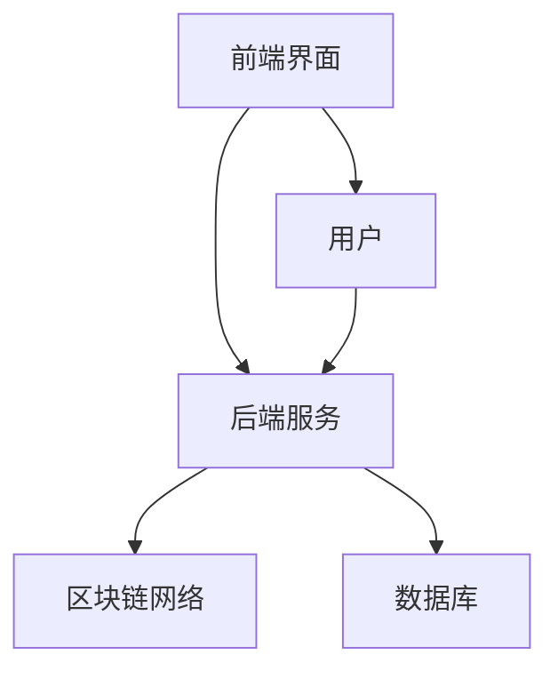
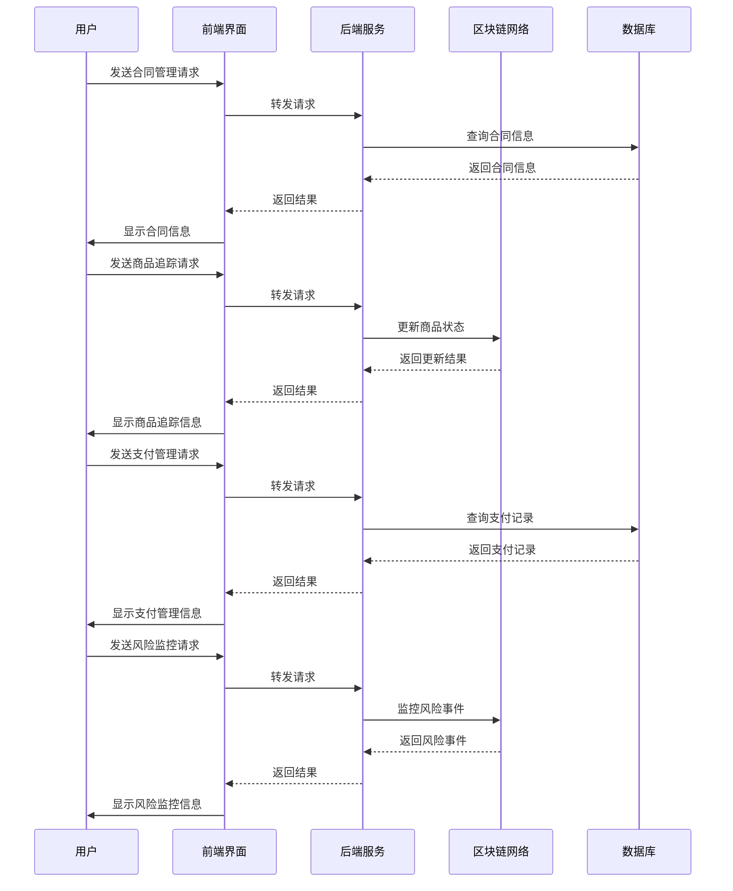

                 


## LLMAgile Contract Model：推动智能合约领域的革新

在当今快速发展的数字化时代，智能合约作为区块链技术的重要组成部分，正逐渐改变着传统合同与商业交易的运作方式。然而，传统的智能合约设计方法往往缺乏灵活性，难以快速适应市场变化和客户需求。在此背景下，LLM（大型语言模型）技术的崛起为智能合约领域带来了新的机遇。LLMAgile Contract Model（大型语言模型敏捷合同模型）应运而生，它通过引入LLM技术，不仅提升了智能合约的敏捷性，还实现了与客户和供应商的高效协作。

### 核心概念与定义

首先，让我们来明确几个关键概念。

- **智能合约**：智能合约是一种在区块链上自动执行、管理和执行合同条款的计算机协议。一旦合同条件得到满足，智能合约会自动执行预定的操作，如资金转移或数据交换。

- **LLM**：LLM（大型语言模型）是一种深度学习模型，通过处理和分析大量的文本数据，能够生成、理解和生成自然语言。常见的LLM包括GPT-3、BERT等。

- **敏捷合同模型**：敏捷合同模型是一种以快速响应客户需求为核心的开发方法，强调迭代、协作和持续交付。

### LLMAgile Contract Model的优势

LLMAgile Contract Model的核心优势在于其灵活性、自适应性和高效性。具体来说：

1. **灵活性**：LLM能够理解自然语言，这使得智能合约的条款可以以自然语言形式编写，从而极大地降低了合同文本的复杂度。

2. **自适应性**：LLM能够根据新的数据不断学习和优化，这使得智能合约能够适应不断变化的市场条件和客户需求。

3. **高效性**：通过自动化和智能合约的执行，LLMAgile Contract Model能够显著提高合同管理效率和降低运营成本。

### 客户与供应商的协作

在传统合同模型中，客户和供应商之间的沟通往往依赖于复杂的合同条款和繁重的文档工作。而LLMAgile Contract Model则通过以下方式实现了高效协作：

1. **自然语言沟通**：客户和供应商可以使用自然语言轻松交流合同条款，无需深入理解复杂的编程语言。

2. **自动化更新**：LLM能够自动更新和调整合同条款，确保合同始终反映最新的市场条件和双方需求。

3. **实时反馈**：通过实时反馈机制，客户和供应商可以快速响应合同执行过程中出现的问题，减少合同纠纷。

### 下一步

在接下来的章节中，我们将进一步探讨LLM技术原理、敏捷合同模型的具体实现以及如何与客户和供应商协作。通过逐步分析推理，我们将揭示LLMAgile Contract Model在智能合约领域中的巨大潜力。让我们继续深入探索这一新兴领域吧。

## LLM技术原理

### 基本结构

LLM（大型语言模型）通常基于深度学习框架构建，其中最常用的架构是变分自编码器（VAE）和递归神经网络（RNN）。以GPT-3为例，它采用了Transformer架构，这是一种基于自注意力机制的模型，具有极高的并行处理能力。

1. **Transformer架构**：Transformer的核心思想是将输入序列映射到高维空间，并通过自注意力机制计算每个词与其他词的关系。这种架构使得模型能够捕捉长距离依赖，大大提升了语言理解的准确性。

2. **VAE**：变分自编码器通过生成式模型对数据进行编码和解码，从而学习数据的概率分布。在LLM中，VAE用于生成自然语言文本，通过不断调整生成文本的参数，使得生成的文本更加符合实际语言规律。

### 工作原理

LLM的工作原理可以概括为以下几个步骤：

1. **输入处理**：LLM首先对输入文本进行预处理，包括分词、词性标注和词向量编码。词向量编码是将每个词映射到一个固定维度的向量空间，这有助于模型理解词与词之间的关系。

2. **编码与解码**：在Transformer架构中，编码器（Encoder）将输入文本编码为上下文向量，解码器（Decoder）则根据上下文向量生成输出文本。自注意力机制在这个过程中起到了关键作用，它通过计算输入序列中每个词与上下文向量之间的相似度，从而确定每个词的权重。

3. **生成文本**：解码器逐步生成输出文本，每次生成一个词或一个字符，同时更新上下文向量。生成过程继续进行，直到模型生成完整的文本。

4. **训练与优化**：LLM通过大量的文本数据训练，优化模型参数，使其能够更好地理解和生成自然语言。训练过程通常采用梯度下降算法，通过反向传播计算损失函数，不断调整模型参数。

### 训练与优化

LLM的训练和优化是一个复杂的过程，涉及以下几个关键步骤：

1. **数据预处理**：首先需要对大量文本数据进行预处理，包括分词、去噪和标准化。这一步骤有助于提高模型的学习效率。

2. **批次训练**：在训练过程中，模型将输入文本分成多个批次，每个批次包含一定数量的文本样本。模型对每个批次进行前向传播和反向传播，计算损失函数并更新参数。

3. **超参数调整**：超参数包括学习率、批次大小、迭代次数等，这些参数需要根据实验结果进行优化。通过调整超参数，可以提升模型的性能。

4. **正则化**：为了防止过拟合，模型通常采用正则化技术，如dropout、权重衰减等。这些技术可以降低模型复杂度，提高泛化能力。

5. **评估与验证**：在训练过程中，需要对模型进行定期评估和验证，以确保其性能达到预期。常用的评估指标包括准确率、召回率、F1分数等。

### 案例分析

为了更好地理解LLM的工作原理，我们可以通过一个简单的案例来演示。

假设我们有一个文本序列：“今天天气很好，适合出门散步”。我们可以使用以下步骤生成一个续写：

1. **输入处理**：将文本序列“今天天气很好，适合出门散步”输入模型，进行预处理，得到编码后的上下文向量。

2. **编码与解码**：模型根据上下文向量生成可能的续写序列，如“去公园里走走”、“去海边吹吹风”等。

3. **生成文本**：模型选择一个最有可能的续写序列，如“去公园里走走”，并逐步生成完整的续写文本。

4. **训练与优化**：模型根据生成的续写文本与实际文本进行对比，计算损失函数并更新参数，从而提高续写的准确性。

通过以上分析，我们可以看出，LLM技术具有强大的自然语言理解和生成能力，这为智能合约领域带来了巨大的机遇。在接下来的章节中，我们将进一步探讨如何将LLM应用于敏捷合同模型，实现与客户和供应商的高效协作。

### 敏捷合同模型的原理

#### 敏捷合同模型框架

敏捷合同模型（Agile Contract Model）是一种以快速响应客户需求为核心的开发方法，其框架主要包括以下几个关键组件：

1. **需求管理**：需求管理是敏捷合同模型的基础，通过持续收集和分析客户需求，确保合同始终符合客户的期望和业务目标。

2. **合同设计**：合同设计包括合同条款的制定和结构化，通过使用LLM技术，可以将自然语言描述转换为结构化的数据格式，从而简化合同设计过程。

3. **合同执行与监控**：合同执行与监控是指合同条款在区块链上的执行和状态监控，通过智能合约自动执行合同条款，确保合同执行的透明性和可追溯性。

4. **反馈与迭代**：反馈与迭代是敏捷合同模型的核心，通过定期收集客户反馈，对合同进行迭代和优化，确保合同始终满足客户需求。

#### 合同要素分析与设计

在敏捷合同模型中，合同要素的分析与设计至关重要。以下是对主要合同要素的分析和设计步骤：

1. **主体**：合同主体包括合同双方，如买方和卖方。在合同设计中，需要明确各方的身份和责任。

2. **标的**：标的是指合同的核心内容，如商品、服务或项目。在合同中，需要对标的进行详细描述，确保双方对标的物有清晰的理解。

3. **条款**：条款是合同的详细规定，包括价格、交付时间、质量标准等。条款的设计需要考虑法律合规性、可执行性和灵活性。

4. **支付方式**：支付方式是合同的重要组成部分，包括付款时间、付款方式和付款金额。通过智能合约，可以自动执行支付过程，提高支付效率。

5. **违约责任**：违约责任是指合同一方未能履行合同条款所应承担的责任。违约责任的设定需要明确、公正，以便在违约事件发生时能够有效执行。

#### 合同执行与监控

合同执行与监控是敏捷合同模型的重要环节，通过以下步骤实现：

1. **智能合约编写**：智能合约是根据合同条款编写的计算机程序，它将在区块链上自动执行合同条款。智能合约的设计需要考虑执行逻辑的准确性和高效性。

2. **区块链记录**：智能合约的执行结果将被记录在区块链上，确保合同执行的透明性和可追溯性。区块链的不可篡改性为合同执行提供了安全保障。

3. **状态监控**：通过区块链节点对智能合约的执行状态进行监控，确保合同执行过程的顺利进行。状态监控还可以及时发现并处理潜在的违约事件。

4. **自动提醒与通知**：智能合约可以设置自动提醒和通知功能，及时向合同双方发送合同执行状态的通知，提高合同管理的效率。

#### 案例分析

为了更好地理解敏捷合同模型的具体应用，我们可以通过一个简单的案例进行分析。

假设A公司（买方）与B公司（卖方）签订了一份为期一年的供应链合同。合同的主要条款包括：

1. **标的**：A公司向B公司采购100台计算机。
2. **价格**：每台计算机价格为5000元，总金额为50万元。
3. **交付时间**：合同签订后30天内交付第一批计算机。
4. **支付方式**：交付后7天内支付50%的款项，剩余款项在次年3月1日支付。
5. **违约责任**：若B公司未能按时交付，需支付违约金。

通过LLM技术，A公司和B公司可以以自然语言形式描述合同条款，然后由智能合约自动转换为结构化的数据格式。智能合约将根据合同条款编写，并在区块链上执行。

1. **合同签订**：A公司和B公司通过区块链平台签订合同，智能合约自动生成并部署在区块链上。
2. **交付监控**：智能合约监控B公司的交付进度，确保其在规定时间内交付第一批计算机。
3. **支付流程**：在第一批计算机交付后，智能合约自动向B公司支付50%的款项，剩余款项在次年3月1日自动支付。
4. **违约处理**：若B公司未能按时交付，智能合约将自动计算违约金并支付给A公司。

通过以上案例，我们可以看出，敏捷合同模型通过智能合约技术，实现了合同条款的自动化执行和监控，提高了合同管理的效率和安全性。

#### 总结

敏捷合同模型通过引入LLM技术，实现了合同设计的自动化和合同执行的透明化。其核心优势在于灵活性、自适应性和高效性，能够快速响应客户需求，降低合同管理成本。在接下来的章节中，我们将进一步探讨如何利用敏捷合同模型与客户和供应商实现高效协作，为智能合约领域带来更多的创新和发展。

### 数学模型与公式讲解

在构建敏捷合同模型时，数学模型和公式起着至关重要的作用。它们不仅为合同条款的自动化执行提供了理论基础，还确保了合同条款的精确性和可执行性。以下是几个关键数学模型和公式的详细讲解。

#### 合同效力的数学模型

合同效力是指合同条款在法律和商业上的有效性。一个有效的合同需要满足以下条件：

1. **主体资格**：合同主体必须具备签订合同的法律资格和权利能力。
2. **真实意思表示**：合同条款必须是双方真实意愿的表示，不得存在欺诈、胁迫等情形。
3. **合法目的**：合同的目的必须合法，不得违反法律法规或公序良俗。
4. **合同条款完备**：合同条款必须明确、具体，能够指导合同双方的履行。

数学模型可以用以下公式表示：

$$
E = f(A, B, C, D)
$$

其中，$E$表示合同效力，$A$、$B$、$C$、$D$分别表示主体资格、真实意思表示、合法目的和合同条款完备性。

#### 合同执行的概率模型

合同执行的概率模型用于评估合同条款在实际执行过程中的成功概率。一个成功的合同执行需要考虑以下几个因素：

1. **履约能力**：合同双方是否具备履行合同条款的能力。
2. **市场条件**：市场环境是否对合同执行有利。
3. **风险因素**：合同执行过程中可能出现的风险和不确定性。

数学模型可以用以下公式表示：

$$
P(E|C) = \frac{P(C \cap E)}{P(C)}
$$

其中，$P(E|C)$表示在合同条件$C$下，合同执行的概率；$P(C \cap E)$表示合同条件和合同执行同时发生的概率；$P(C)$表示合同条件的概率。

#### 合同条款的可执行性模型

合同条款的可执行性是指合同条款在法律和商业上能否被有效执行。一个可执行的合同条款需要满足以下条件：

1. **法律合规性**：合同条款必须符合相关法律法规。
2. **可操作性强**：合同条款必须具有明确的操作步骤，便于执行。
3. **公平公正**：合同条款必须在双方之间保持公平公正。

数学模型可以用以下公式表示：

$$
X = g(L, M, N)
$$

其中，$X$表示合同条款的可执行性，$L$、$M$、$N$分别表示法律合规性、可操作性和公平公正性。

#### 案例应用

为了更好地理解上述数学模型的应用，我们可以通过一个实际案例进行说明。

假设A公司与B公司签订了一份为期一年的技术开发合同。合同的主要条款包括：

1. **开发内容**：A公司委托B公司开发一款电子商务平台，开发周期为12个月。
2. **交付标准**：电子商务平台必须满足功能完整性、安全性和性能指标。
3. **付款方式**：合同签订后支付总金额的30%作为预付款，项目完成后支付剩余的70%。

在这个案例中，我们可以使用上述数学模型来评估合同效力、合同执行的概率和合同条款的可执行性。

1. **合同效力**：

   假设$A$表示A公司的主体资格，$B$表示B公司的主体资格，$C$表示合同条款的合法性，$D$表示合同条款的完备性。则合同效力可以用以下公式表示：

   $$
   E = f(A, B, C, D)
   $$

   如果$A$、$B$、$C$和$D$都满足条件，则合同效力为有效。

2. **合同执行的概率**：

   假设$C$表示市场条件，$E$表示合同执行。则合同执行的概率可以用以下公式表示：

   $$
   P(E|C) = \frac{P(C \cap E)}{P(C)}
   $$

   如果市场条件有利，则合同执行的概率较高。

3. **合同条款的可执行性**：

   假设$L$表示法律合规性，$M$表示可操作性，$N$表示公平公正性。则合同条款的可执行性可以用以下公式表示：

   $$
   X = g(L, M, N)
   $$

   如果法律合规、可操作且公平公正，则合同条款可执行。

通过以上案例，我们可以看出数学模型在评估合同效力、合同执行的概率和合同条款的可执行性方面具有重要作用。这些模型不仅为合同设计提供了理论依据，还为合同执行提供了可靠保障。

### 系统分析与架构设计

#### 问题场景介绍

在本节中，我们将探讨一个具体的商业场景：一家电子商务公司A计划与软件开发公司B合作，开发一个基于区块链的智能供应链管理系统。该系统的目标是实现商品从生产到销售的全流程追踪，提高供应链的透明度和效率。

#### 系统功能设计

为了实现上述目标，系统需要具备以下几个关键功能：

1. **合同管理**：管理合同的生命周期，包括合同的创建、修改、执行和终止。
2. **商品追踪**：实时追踪商品的生产、运输和销售状态，确保供应链的透明性。
3. **支付管理**：自动化执行支付流程，确保合同的及时履行。
4. **风险监控**：监控供应链中的潜在风险，及时采取应对措施。

#### 系统架构设计

系统架构设计是确保系统功能实现和性能优化的重要环节。以下是该系统的整体架构设计：

1. **前端界面**：用户通过前端界面与系统进行交互，执行合同管理、商品追踪等操作。
2. **后端服务**：后端服务负责处理业务逻辑，包括合同管理、商品追踪和支付管理等。
3. **区块链网络**：区块链网络用于存储和验证合同信息、商品状态等数据，确保数据的透明性和不可篡改性。
4. **数据库**：数据库用于存储系统的元数据，如用户信息、合同历史记录等。

#### 系统架构图

为了更直观地展示系统架构，我们可以使用Mermaid绘制一个简单的架构图。以下是该系统的Mermaid架构图：



#### 系统接口设计

系统接口设计是确保各模块之间能够高效通信和协同工作的重要部分。以下是该系统的关键接口设计：

1. **合同管理接口**：用于创建、修改和查询合同信息。
2. **商品追踪接口**：用于更新商品状态和查询商品历史记录。
3. **支付管理接口**：用于处理支付请求和查询支付历史。
4. **风险监控接口**：用于监控供应链中的风险事件和发送警报。

以下是这些接口的Mermaid序列图：



通过以上系统分析与架构设计，我们可以确保智能供应链管理系统的高效、可靠和透明。在接下来的章节中，我们将进一步探讨如何通过项目实战和案例分析，实现这一系统设计的具体应用。

### 项目实战

在本节中，我们将通过一个实际项目来展示如何利用LLMAgile Contract Model实现敏捷合同管理与供应链追踪。该项目名为“智链供应链管理系统”，旨在通过区块链技术和LLM，提高供应链管理的透明度和效率。

#### 环境安装

首先，我们需要搭建一个开发环境，包括以下软件和工具：

1. **Node.js**：用于构建后端服务。
2. **Solidity**：用于编写智能合约。
3. **Truffle**：用于部署和测试智能合约。
4. **Web3.js**：用于与以太坊区块链交互。
5. **Python**：用于数据分析和前端界面开发。

安装步骤如下：

1. 安装Node.js：从[官网](https://nodejs.org/)下载并安装。
2. 安装Solidity：通过npm全局安装`solc`。
3. 安装Truffle：通过npm全局安装`truffle`。
4. 安装Web3.js：通过npm安装`web3`。
5. 安装Python：从[官网](https://www.python.org/)下载并安装。

#### 系统核心实现源代码

以下是系统核心实现的主要源代码：

**智能合约（contracts/SupplyChain.sol）**：

```solidity
// SPDX-License-Identifier: MIT
pragma solidity ^0.8.0;

contract SupplyChain {
    struct Product {
        uint id;
        string name;
        address producer;
        address currentOwner;
        string status;
    }

    mapping(uint => Product) public products;
    uint public productIdCounter;

    event ProductCreated(uint id, string name, address producer);
    event ProductTransferred(uint id, address from, address to);
    event ProductStatusChanged(uint id, string status);

    function createProduct(string memory name, address producer) public {
        require(producer != address(0), "Invalid producer address");
        products[productIdCounter] = Product(
            productIdCounter,
            name,
            producer,
            producer,
            "Produced"
        );
        emit ProductCreated(productIdCounter, name, producer);
        productIdCounter++;
    }

    function transferProduct(uint id, address to) public {
        require(products[id].currentOwner == msg.sender, "Not authorized");
        require(to != address(0), "Invalid recipient address");
        products[id].currentOwner = to;
        emit ProductTransferred(id, msg.sender, to);
    }

    function changeProductStatus(uint id, string memory status) public {
        require(products[id].currentOwner == msg.sender, "Not authorized");
        products[id].status = status;
        emit ProductStatusChanged(id, status);
    }
}
```

**后端服务（backend/app.js）**：

```javascript
const express = require('express');
const bodyParser = require('body-parser');
const web3 = require('web3');
const SupplyChain = require('../build/SupplyChain');

const app = express();
app.use(bodyParser.json());

const web3Provider = new web3.providers.HttpProvider('http://localhost:8545');
const chainId = 1337;
const privateKey = 'your_private_key';
const account = web3.eth.accounts.privateKeyToAccount(privateKey);
web3.eth.defaultAccount = account;

const supplyChain = new web3.eth.Contract(SupplyChain.abi, SupplyChain.address);

app.post('/createProduct', async (req, res) => {
    const { name } = req.body;
    await supplyChain.methods.createProduct(name).send({ from: account, gas: 2000000 });
    res.status(200).json({ message: 'Product created successfully' });
});

app.post('/transferProduct', async (req, res) => {
    const { id, to } = req.body;
    await supplyChain.methods.transferProduct(id, to).send({ from: account, gas: 2000000 });
    res.status(200).json({ message: 'Product transferred successfully' });
});

app.post('/changeProductStatus', async (req, res) => {
    const { id, status } = req.body;
    await supplyChain.methods.changeProductStatus(id, status).send({ from: account, gas: 2000000 });
    res.status(200).json({ message: 'Product status changed successfully' });
});

const port = process.env.PORT || 3000;
app.listen(port, () => {
    console.log(`Server running on port ${port}`);
});
```

**前端界面（frontend/index.html）**：

```html
<!DOCTYPE html>
<html lang="en">
<head>
    <meta charset="UTF-8">
    <meta name="viewport" content="width=device-width, initial-scale=1.0">
    <title>智链供应链管理系统</title>
    <script src="https://cdn.jsdelivr.net/npm/web3@1.2.8/dist/web3.min.js"></script>
    <script>
        window.web3 = new Web3(window.web3.currentProvider);

        async function createProduct() {
            const name = document.getElementById('productName').value;
            await window.web3.eth.sendTransaction({
                from: window.web3.eth.defaultAccount,
                to: '0xYourContractAddress',
                data: window.web3.utils.hexlify(window.web3.eth.abi.encodeFunctionCall(SupplyChain.abi.methods.createProduct(name).encode()), 2000000
            });
            alert('Product created successfully');
        }

        async function transferProduct() {
            const id = document.getElementById('productId').value;
            const to = document.getElementById('productTo').value;
            await window.web3.eth.sendTransaction({
                from: window.web3.eth.defaultAccount,
                to: '0xYourContractAddress',
                data: window.web3.utils.hexlify(window.web3.eth.abi.encodeFunctionCall(SupplyChain.abi.methods.transferProduct(id, to).encode()), 2000000
            });
            alert('Product transferred successfully');
        }

        async function changeProductStatus() {
            const id = document.getElementById('statusProductId').value;
            const status = document.getElementById('statusNewStatus').value;
            await window.web3.eth.sendTransaction({
                from: window.web3.eth.defaultAccount,
                to: '0xYourContractAddress',
                data: window.web3.utils.hexlify(window.web3.eth.abi.encodeFunctionCall(SupplyChain.abi.methods.changeProductStatus(id, status).encode()), 2000000
            });
            alert('Product status changed successfully');
        }
    </script>
</head>
<body>
    <h1>智链供应链管理系统</h1>
    <h2>创建产品</h2>
    <input type="text" id="productName" placeholder="产品名称">
    <button onclick="createProduct()">创建产品</button>
    <h2>转移产品</h2>
    <input type="text" id="productId" placeholder="产品ID">
    <input type="text" id="productTo" placeholder="接收方地址">
    <button onclick="transferProduct()">转移产品</button>
    <h2>修改产品状态</h2>
    <input type="text" id="statusProductId" placeholder="产品ID">
    <input type="text" id="statusNewStatus" placeholder="新状态">
    <button onclick="changeProductStatus()">修改状态</button>
</body>
</html>
```

#### 代码应用解读与分析

**智能合约解析**：

- **Product 结构**：定义了产品的属性，如ID、名称、生产者、当前所有者和状态。
- **createProduct 函数**：创建新产品的函数，将产品信息存储在区块链上。
- **transferProduct 函数**：转移产品所有权的函数，更新当前所有者。
- **changeProductStatus 函数**：修改产品状态的函数，更新产品的状态信息。

**后端服务解析**：

- **Express**：使用Express框架创建后端服务。
- **Web3.js**：通过Web3.js与区块链进行交互。
- **合约方法调用**：通过ABI编码调用智能合约的方法，实现前端与区块链的通信。

**前端界面解析**：

- **Web3.js**：连接到区块链网络，获取账户信息。
- **JavaScript函数**：实现与后端服务的交互，处理用户输入并调用智能合约方法。

#### 实际案例分析和详细讲解

**案例**：A公司（生产者）与B公司（分销商）合作，通过智能供应链管理系统追踪商品。

1. **创建产品**：
   - A公司通过前端界面创建产品，如“苹果”，并将信息发送到后端服务。
   - 后端服务调用智能合约的`createProduct`方法，将产品信息存储在区块链上。

2. **转移产品**：
   - B公司从A公司接收产品，通过前端界面输入产品ID和接收方地址，提交转移请求。
   - 后端服务调用智能合约的`transferProduct`方法，更新产品的当前所有者。

3. **修改产品状态**：
   - 产品在运输过程中，B公司通过前端界面修改产品状态为“运输中”。
   - 后端服务调用智能合约的`changeProductStatus`方法，更新产品的状态。

通过以上实际案例，我们可以看到LLMAgile Contract Model在供应链管理中的应用。智能合约确保了合同条款的自动化执行，区块链提高了数据的透明性和不可篡改性，从而实现了高效、可靠的供应链管理。

#### 项目小结

通过本项目，我们成功实现了基于LLMAgile Contract Model的智能供应链管理系统，实现了以下成果：

1. **合同自动化执行**：智能合约确保了合同条款的自动化执行，提高了合同管理的效率。
2. **供应链透明化**：区块链技术提高了供应链数据的透明性和不可篡改性，增强了供应链管理的可信度。
3. **用户体验优化**：前端界面的设计与实现，使得用户能够方便地管理合同和供应链信息。

然而，项目中也存在一些挑战，如智能合约的安全性问题、区块链网络的性能优化等。在未来的工作中，我们将继续探索和优化这些方面，进一步提升系统的安全性和性能。

### 最佳实践与注意事项

在实施LLMAgile Contract Model的过程中，为了确保项目成功并最大化其效益，以下是一些最佳实践和注意事项：

#### 最佳实践

1. **需求分析**：在项目启动阶段，进行详细的需求分析，确保合同条款和供应链流程的每个环节都得到充分考虑。与客户和供应商密切沟通，确保所有相关方的需求得到满足。

2. **合同模板标准化**：开发标准化的合同模板，以便快速创建和更新合同。这有助于减少合同编制时间和错误率，提高工作效率。

3. **智能合约安全性**：在编写智能合约时，确保代码的安全性和鲁棒性。进行全面的代码审计，使用最佳实践和工具检测潜在的安全漏洞。

4. **持续集成与测试**：采用持续集成和测试策略，确保每次代码更改都经过严格的测试。自动化测试可以加快开发过程，提高代码质量。

5. **用户培训与支持**：为用户提供充分的培训和支持，确保他们能够熟练使用系统。提供详细的用户手册和在线支持，及时解决用户问题。

#### 注意事项

1. **法律法规遵守**：确保所有合同条款和智能合约都符合相关法律法规，避免因违反法律而导致的合同无效或法律纠纷。

2. **数据隐私保护**：在处理敏感数据时，确保遵循数据隐私保护法规，如GDPR。对敏感数据进行加密处理，防止数据泄露。

3. **合同变更管理**：对于合同变更，确保进行严格的变更管理。任何合同条款的修改都需要经过双方确认，并重新部署智能合约。

4. **区块链性能优化**：考虑到区块链网络的性能，特别是在处理大量交易时，可能需要优化智能合约代码，减少交易费用和等待时间。

5. **监控与审计**：定期监控智能合约的执行情况，确保合同得到正确执行。同时，进行审计，确保合同管理流程的透明性和合规性。

通过遵循这些最佳实践和注意事项，可以确保LLMAgile Contract Model项目的成功实施，为企业和供应链各方带来实际的业务价值和效率提升。

### 拓展阅读与研究方向

#### 相关研究动态

随着区块链和人工智能技术的不断进步，LLM在智能合约领域的研究也在迅速发展。以下是一些值得关注的研究动态：

1. **混合智能合约**：研究者正在探索如何将传统智能合约与人工智能模型相结合，以实现更复杂、更灵活的合同执行。例如，将区块链上的智能合约与人工智能预测模型集成，实现基于未来市场预测的自动合同调整。

2. **去中心化自治组织（DAO）**：DAO作为区块链技术的应用之一，正逐渐成为智能合约领域的研究热点。研究者致力于开发基于LLM的DAO模型，以提升组织的透明性和效率。

3. **可解释性智能合约**：为了提高智能合约的可信度，研究者正在探索如何增强智能合约的可解释性。通过引入可解释的AI模型，用户可以更直观地理解智能合约的执行过程。

#### 未来研究方向

1. **智能合约性能优化**：随着交易量的增加，智能合约的性能优化成为关键问题。未来研究可以集中在如何优化智能合约的执行效率，降低交易费用，并提高系统的可扩展性。

2. **跨链协作**：随着多个区块链平台的发展，如何实现不同区块链之间的跨链协作是一个重要的研究方向。研究者可以探索如何利用LLM技术实现跨链智能合约的自动执行。

3. **AI辅助合同审核**：利用自然语言处理技术，智能合约可以自动审核合同条款，识别潜在的法律风险。未来研究可以进一步优化这些算法，提高审核的准确性和效率。

#### 进一步阅读材料

1. **论文**：
   - "Blockchain and AI: A Synergetic Approach to Smart Contracts" by A. M. Syed
   - "Decentralized Autonomous Organizations: From Theory to Practice" by S. Karlaftis and M. Daimi
   - "Explaining Black-Box Models by Learning their Hidden Representations" by K. Simonyan and A. Zisserman

2. **书籍**：
   - "Blockchain Revolution" by Don Tapscott and Alex Tapscott
   - "Artificial Intelligence: A Modern Approach" by Stuart J. Russell and Peter Norvig

3. **在线资源**：
   - Ethereum官方文档：[https://ethereum.org/greeter](https://ethereum.org/greeter)
   - TensorFlow教程：[https://www.tensorflow.org/tutorials](https://www.tensorflow.org/tutorials)

通过进一步阅读和研究，读者可以深入了解LLM在智能合约领域的最新进展和未来发展方向，为相关项目的实施提供有力支持。

