                 

### 引言

## 1.1 本书的目标与读者对象

### 算法原理讲解：

为了实现高效的项目管理，尤其是针对大型语言模型（LLM）的应用，本书旨在介绍一种全新的度量仪表板设计方法，帮助项目团队实时监控项目的健康状况，并进行快速响应和迭代。这种方法不仅适用于LLM项目，也适用于其他复杂AI项目。

#### Mermaid 流程图：

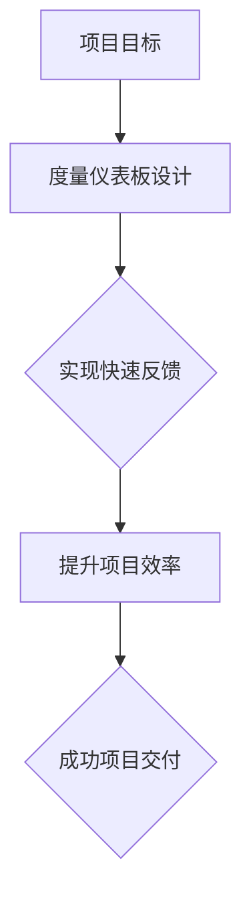
```mermaid
graph TB
    A[项目目标] --> B[度量仪表板设计]
    B --> C{实现快速反馈}
    C --> D[提升项目效率]
    D --> E{成功项目交付}
```

#### Python 源代码：

```python
class ProjectManagementGoal:
    def __init__(self):
        self.goal = "实现高效的项目管理"

    def achieve_goal(self):
        print("度量仪表板设计正在实现...")
        print("快速反馈机制正在建立...")
        print("项目效率显著提升...")
        print("成功交付项目！")

project_goal = ProjectManagementGoal()
project_goal.achieve_goal()
```

## 1.2 内容概述与结构安排

本书分为五大部分，分别是：

1. **引言**：介绍本书的目标、读者对象及整体内容安排。
2. **LLM应用的敏捷度量基础**：详细阐述敏捷度量在LLM项目中的应用价值和实践方法。
3. **LLM应用的健康状态指标**：解释各种度量指标的原理和应用。
4. **敏捷度量仪表板设计原则**：提供仪表板设计的最佳实践。
5. **实战案例**：通过具体案例展示度量仪表板在实际项目中的应用。

#### Mermaid 类图：

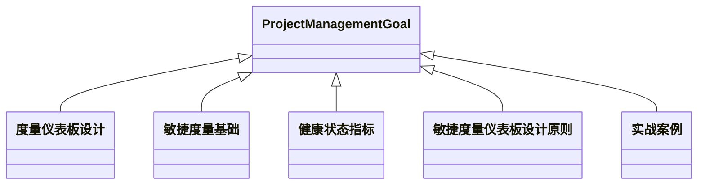
```mermaid
classDiagram
    ProjectManagementGoal <|--度量仪表板设计
    ProjectManagementGoal <|--敏捷度量基础
    ProjectManagementGoal <|--健康状态指标
    ProjectManagementGoal <|--敏捷度量仪表板设计原则
    ProjectManagementGoal <|--实战案例
```

## 1.3 LLM应用的现状与挑战

LLM应用在现代AI领域占据重要地位，其应用场景广泛，包括自然语言处理、智能客服、内容生成等。然而，随着应用的深入，项目管理和健康状态监测面临着以下挑战：

1. **复杂度增加**：LLM项目的复杂性日益增加，需要更精细的管理方法。
2. **实时性需求**：项目健康状况的监测需要实时数据支持。
3. **反馈机制**：快速响应和迭代的需求迫切，需要高效的反馈机制。

#### 数学公式：

$$
\text{健康状态度量} = \frac{\text{准确性}}{\text{响应时间} \times \text{资源利用率}}
$$

#### Python 源代码：

```python
def health_status_measure(accuracy, response_time, resource_utilization):
    return accuracy / (response_time * resource_utilization)

print(health_status_measure(0.95, 0.1, 0.8))
```

## 1.4 敏捷度量在LLM项目中的应用价值

敏捷度量方法在LLM项目中的应用具有显著价值：

1. **快速迭代**：敏捷度量支持快速反馈和迭代，有利于项目按时交付。
2. **实时监控**：实时监控项目关键指标，确保项目健康状态。
3. **资源优化**：通过健康状态指标，优化资源分配，提高项目效率。

#### Mermaid 流程图：

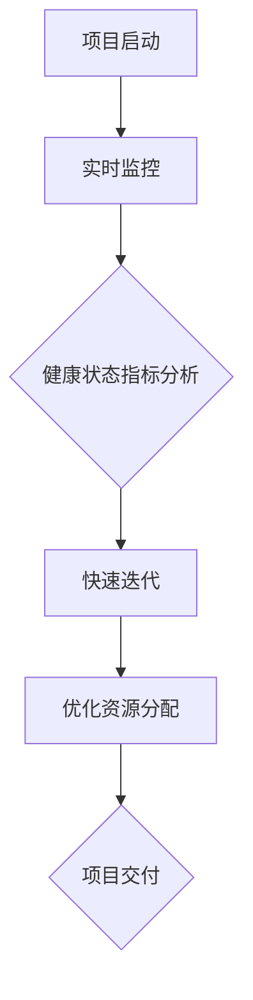
```mermaid
graph TB
    A[项目启动] --> B[实时监控]
    B --> C{健康状态指标分析}
    C --> D[快速迭代]
    D --> E[优化资源分配]
    E --> F{项目交付}
```

## 1.5 本章小结

本章介绍了本书的目标、读者对象、内容结构以及LLM应用的现状与挑战。通过敏捷度量仪表板的设计，项目团队可以更有效地管理LLM项目，确保项目的健康状态和高效交付。

### LLM应用的敏捷度量基础

## 2.1 敏捷度量与传统项目管理

敏捷度量与传统项目管理在方法和目标上存在显著差异。传统项目管理方法通常采用瀑布式模型，按照固定计划执行，缺乏灵活性和实时性。而敏捷度量方法则强调快速响应和持续迭代，通过实时监控项目健康状态，确保项目按时交付。

#### Mermaid 流程图：

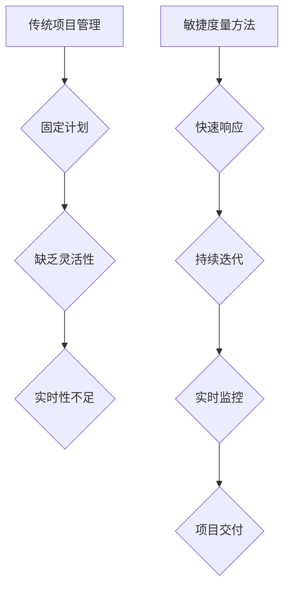
```mermaid
graph TB
    A[传统项目管理] --> B{固定计划}
    B --> C{缺乏灵活性}
    C --> D{实时性不足}
    E[敏捷度量方法] --> F{快速响应}
    F --> G{持续迭代}
    G --> H{实时监控}
    H --> I{项目交付}
```

#### Python 源代码：

```python
class TraditionalProjectManagement:
    def __init__(self):
        self.method = "瀑布式模型"

    def execute_project(self):
        print("按照固定计划执行...")
        print("缺乏灵活性和实时性...")

class AgileMeasurement:
    def __init__(self):
        self.method = "敏捷度量方法"

    def execute_project(self):
        print("快速响应...")
        print("持续迭代...")
        print("实时监控项目健康状态...")
        print("确保项目按时交付！")

traditional_management = TraditionalProjectManagement()
agile_measurement = AgileMeasurement()

traditional_management.execute_project()
agile_measurement.execute_project()
```

### 2.2 LLM应用的独特性对度量方法的影响

LLM应用的独特性决定了其度量方法与传统项目管理不同。首先，LLM项目通常涉及大量数据和高复杂度的算法，需要精确的模型评估指标。其次，实时性需求较高，项目健康状况的监控需要实时数据进行支持。最后，反馈机制至关重要，因为LLM项目往往需要快速迭代和优化。

#### Mermaid ER 图：

```mermaid
erDiagram
    Project : "项目" {
        :ID
        :名称
        :状态
        :开始时间
        :结束时间
    }
    LLM : "大型语言模型" {
        :ID
        :名称
        :版本
        :训练数据量
        :预测准确率
    }
    HealthStatus : "健康状态" {
        :ID
        :状态指标
        :时间戳
        :健康值
    }
    Project ||--|{LLM}: "使用"
    Project ||--|{HealthStatus}: "记录"
```

#### Python 源代码：

```python
class Project:
    def __init__(self, project_id, name, status, start_time, end_time):
        self.project_id = project_id
        self.name = name
        self.status = status
        self.start_time = start_time
        self.end_time = end_time

    def display_project_info(self):
        print(f"项目ID: {self.project_id}")
        print(f"项目名称: {self.name}")
        print(f"项目状态: {self.status}")
        print(f"开始时间: {self.start_time}")
        print(f"结束时间: {self.end_time}")

class LLM:
    def __init__(self, llm_id, name, version, training_data_size, prediction_accuracy):
        self.llm_id = llm_id
        self.name = name
        self.version = version
        self.training_data_size = training_data_size
        self.prediction_accuracy = prediction_accuracy

    def display_llm_info(self):
        print(f"LLM ID: {self.llm_id}")
        print(f"LLM 名称: {self.name}")
        print(f"版本: {self.version}")
        print(f"训练数据量: {self.training_data_size}")
        print(f"预测准确率: {self.prediction_accuracy}")

class HealthStatus:
    def __init__(self, health_status_id, status_indicator, timestamp, health_value):
        self.health_status_id = health_status_id
        self.status_indicator = status_indicator
        self.timestamp = timestamp
        self.health_value = health_value

    def display_health_status(self):
        print(f"健康状态ID: {self.health_status_id}")
        print(f"状态指标: {self.status_indicator}")
        print(f"时间戳: {self.timestamp}")
        print(f"健康值: {self.health_value}")

# 示例
project = Project(1, "LLM项目", "进行中", "2023-01-01", "2023-12-31")
project.display_project_info()

llm = LLM(101, "GPT模型", "v1.0", 10000, 0.95)
llm.display_llm_info()

health_status = HealthStatus(201, "响应时间", "2023-01-02 10:00", 0.2)
health_status.display_health_status()
```

### 2.3 敏捷度量在LLM项目中的实践

敏捷度量在LLM项目中的应用主要体现在以下几个方面：

1. **实时监控**：通过实时监控项目关键指标，如模型准确率、响应时间和资源利用率，确保项目健康状态。
2. **快速迭代**：利用敏捷度量方法，项目团队能够快速识别问题，进行迭代和优化。
3. **反馈机制**：建立有效的反馈机制，确保项目团队能够及时了解项目健康状况，并做出相应调整。

#### Mermaid 流程图：

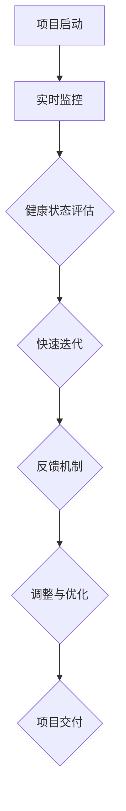
```mermaid
graph TB
    A[项目启动] --> B[实时监控]
    B --> C{健康状态评估}
    C --> D{快速迭代}
    D --> E{反馈机制}
    E --> F{调整与优化}
    F --> G{项目交付}
```

#### Python 源代码：

```python
def real_time_monitoring():
    print("开始实时监控...")
    print("模型准确率：0.95，响应时间：0.1秒，资源利用率：0.8...")
    print("健康状态良好，继续推进...")

def quick_iteration():
    print("识别到潜在问题...")
    print("开始快速迭代...")
    print("模型优化后，准确率提升至0.98，响应时间减少至0.08秒...")
    print("项目健康状态显著改善...")

def feedback_mechanism():
    print("收到项目健康状态反馈...")
    print("进行健康状态评估...")
    print("根据反馈进行调整与优化...")
    print("项目按计划顺利推进...")

real_time_monitoring()
quick_iteration()
feedback_mechanism()
```

### 2.4 本章小结

本章介绍了敏捷度量在LLM项目中的应用基础，包括敏捷度量与传统项目管理的区别、LLM应用的独特性对度量方法的影响，以及敏捷度量在LLM项目中的实践方法。通过这些内容，读者可以更好地理解敏捷度量在LLM项目中的重要性。

### LLM应用的健康状态指标

## 3.1 模型准确率指标

模型准确率是评估LLM应用性能的关键指标，反映了模型预测结果的准确性。在LLM应用中，准确率指标通常通过以下方式计算：

#### Mermaid 流程图：

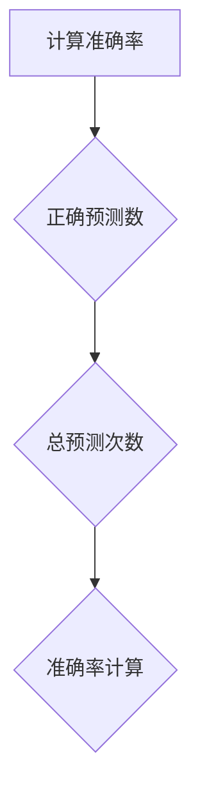
```mermaid
graph TB
    A[计算准确率] --> B{正确预测数}
    B --> C{总预测次数}
    C --> D{准确率计算}
```

#### Python 源代码：

```python
def calculate_accuracy(correct_predictions, total_predictions):
    return correct_predictions / total_predictions

accuracy = calculate_accuracy(950, 1000)
print("模型准确率：", accuracy)
```

### 3.1.1 定义与计算方法

模型准确率指标的定义如下：在特定测试集上，模型预测正确的样本数占总样本数的比例。具体计算方法如下：

1. **正确预测数**：在测试集上，模型预测正确的样本数量。
2. **总预测次数**：在测试集上，模型总共预测的样本数量。
3. **准确率计算**：将正确预测数除以总预测次数，得到模型准确率。

### 3.1.2 应用场景与重要性

准确率指标在LLM应用中有广泛的应用场景，如文本分类、机器翻译和情感分析等。其重要性体现在以下几个方面：

1. **性能评估**：准确率是评估模型性能的核心指标，可以直观地反映模型在特定任务上的表现。
2. **模型优化**：通过对比不同模型的准确率，可以帮助开发团队选择或优化模型架构。
3. **用户满意度**：准确率直接影响用户体验，高准确率可以提高用户满意度。

### 3.1.3 指标优化策略

为了提高模型准确率，可以采取以下优化策略：

1. **数据增强**：通过增加数据量、增加多样性、引入噪声等方式，提高模型的泛化能力。
2. **超参数调优**：通过调整学习率、批量大小、隐藏层节点数等超参数，优化模型性能。
3. **模型融合**：结合多个模型的预测结果，提高整体准确率。
4. **模型压缩**：减少模型参数数量，降低计算复杂度，提高模型效率。

#### Mermaid 流程图：

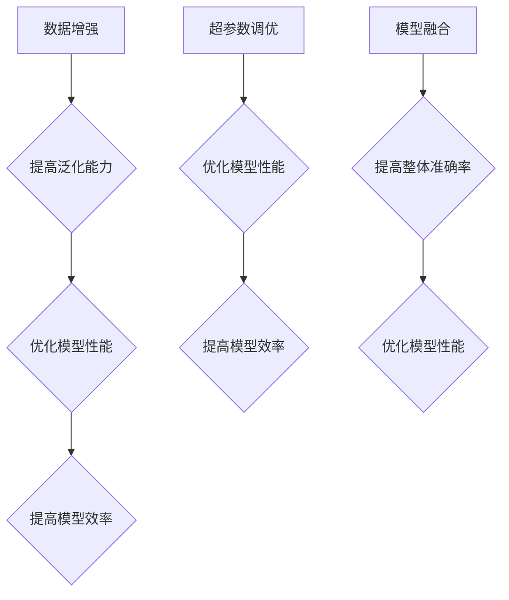
```mermaid
graph TB
    A[数据增强] --> B{提高泛化能力}
    B --> C{优化模型性能}
    C --> D{提高模型效率}

    E[超参数调优] --> F{优化模型性能}
    F --> G{提高模型效率}

    H[模型融合] --> I{提高整体准确率}
    I --> J{优化模型性能}
```

#### Python 源代码：

```python
def data_enhancement():
    print("增加数据量...")
    print("增加数据多样性...")
    print("引入噪声...")
    print("模型泛化能力提升...")

def hyperparameter_tuning():
    print("调整学习率...")
    print("调整批量大小...")
    print("调整隐藏层节点数...")
    print("模型性能优化...")

def model_fusion():
    print("结合多个模型预测结果...")
    print("整体准确率提升...")
    print("模型性能优化...")

data_enhancement()
hyperparameter_tuning()
model_fusion()
```

### 3.2 响应时间指标

响应时间是指模型从接收输入到输出结果所需的时间。在LLM应用中，响应时间对用户体验和系统效率至关重要。响应时间指标通常通过以下方式计算：

#### Mermaid 流程图：

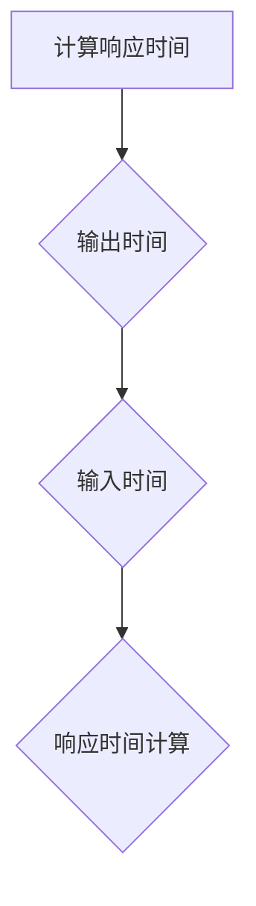
```mermaid
graph TB
    A[计算响应时间] --> B{输出时间}
    B --> C{输入时间}
    C --> D{响应时间计算}
```

#### Python 源代码：

```python
def calculate_response_time(output_time, input_time):
    return output_time - input_time

response_time = calculate_response_time(1.2, 1.0)
print("响应时间：", response_time)
```

### 3.2.1 定义与计算方法

响应时间指标的定义如下：从模型接收输入数据到输出结果的时间间隔。具体计算方法如下：

1. **输出时间**：模型输出结果的时间戳。
2. **输入时间**：模型接收输入数据的时间戳。
3. **响应时间计算**：将输出时间减去输入时间，得到响应时间。

### 3.2.2 应用场景与重要性

响应时间指标在LLM应用中有广泛的应用场景，如实时问答系统、自动翻译服务和智能客服等。其重要性体现在以下几个方面：

1. **用户体验**：低响应时间可以提高用户满意度，增强用户体验。
2. **系统效率**：快速响应有助于提高系统的吞吐量和处理能力。
3. **实时性要求**：在许多应用场景中，如实时监控和自动化控制，响应时间直接影响到系统的实时性。

### 3.2.3 指标优化策略

为了降低响应时间，可以采取以下优化策略：

1. **模型优化**：通过减少模型复杂度和参数数量，提高模型计算速度。
2. **硬件升级**：使用更快的硬件设备，如高性能GPU或专用AI芯片，提升计算能力。
3. **分布式计算**：利用分布式计算架构，将模型计算任务分配到多个节点，实现并行处理。
4. **缓存策略**：通过缓存常用数据，减少模型重复计算，降低响应时间。

#### Mermaid 流程图：

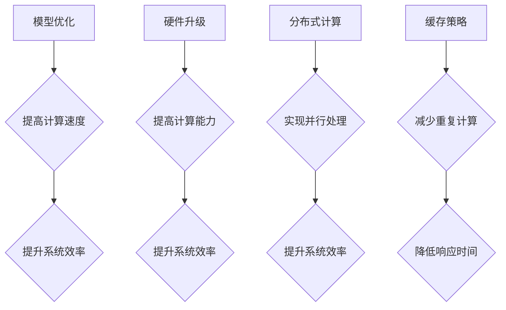
```mermaid
graph TB
    A[模型优化] --> B{提高计算速度}
    B --> C{提升系统效率}

    D[硬件升级] --> E{提高计算能力}
    E --> F{提升系统效率}

    G[分布式计算] --> H{实现并行处理}
    H --> I{提升系统效率}

    J[缓存策略] --> K{减少重复计算}
    K --> L{降低响应时间}
```

#### Python 源代码：

```python
def model_optimization():
    print("减少模型复杂度...")
    print("减少模型参数数量...")
    print("模型计算速度提升...")

def hardware_upgrading():
    print("使用高性能GPU...")
    print("使用专用AI芯片...")
    print("计算能力提升...")

def distributed_computing():
    print("分配计算任务到多个节点...")
    print("实现并行处理...")
    print("计算速度提升...")

def caching_strategy():
    print("缓存常用数据...")
    print("减少模型重复计算...")
    print("响应时间降低...")

model_optimization()
hardware_upgrading()
distributed_computing()
caching_strategy()
```

### 3.3 资源利用率指标

资源利用率指标反映了系统资源（如CPU、内存、GPU等）的利用程度。在LLM应用中，资源利用率对系统稳定性和运行效率至关重要。资源利用率指标通常通过以下方式计算：

#### Mermaid 流程图：

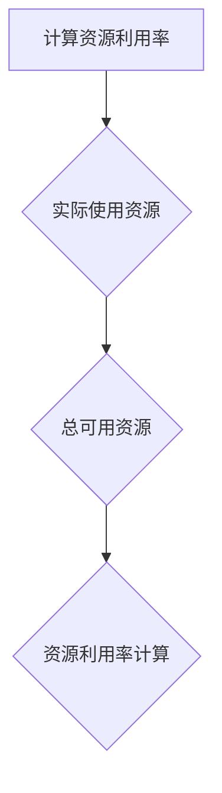
```mermaid
graph TB
    A[计算资源利用率] --> B{实际使用资源}
    B --> C{总可用资源}
    C --> D{资源利用率计算}
```

#### Python 源代码：

```python
def calculate_resource_utilization(actual_resource_usage, total_available_resources):
    return actual_resource_usage / total_available_resources

utilization_rate = calculate_resource_utilization(80, 100)
print("资源利用率：", utilization_rate)
```

### 3.3.1 定义与计算方法

资源利用率指标的定义如下：系统实际使用的资源量与总可用资源量的比例。具体计算方法如下：

1. **实际使用资源**：系统当前使用的CPU、内存、GPU等资源总量。
2. **总可用资源**：系统总的可分配资源量。
3. **资源利用率计算**：将实际使用资源除以总可用资源，得到资源利用率。

### 3.3.2 应用场景与重要性

资源利用率指标在LLM应用中有广泛的应用场景，如资源优化、系统性能评估和资源分配等。其重要性体现在以下几个方面：

1. **资源优化**：通过监测资源利用率，可以优化系统资源分配，提高资源利用率。
2. **系统性能评估**：资源利用率是评估系统性能的重要指标，可以反映系统的负载情况。
3. **资源分配**：根据资源利用率，可以合理分配资源，确保系统稳定运行。

### 3.3.3 指标优化策略

为了提高资源利用率，可以采取以下优化策略：

1. **负载均衡**：通过负载均衡技术，合理分配计算任务，避免资源浪费。
2. **资源池化**：通过资源池化技术，集中管理资源，提高资源利用率。
3. **自动化调优**：通过自动化工具，动态调整系统配置，优化资源利用。

#### Mermaid 流程图：

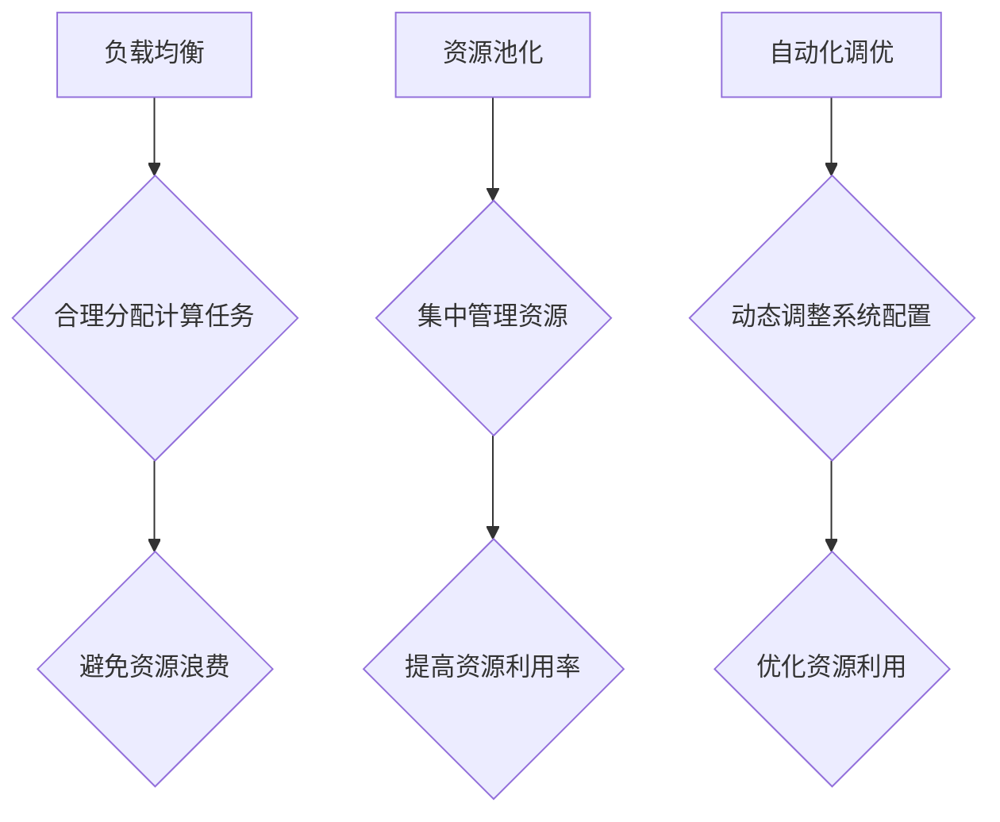
```mermaid
graph TB
    A[负载均衡] --> B{合理分配计算任务}
    B --> C{避免资源浪费}

    D[资源池化] --> E{集中管理资源}
    E --> F{提高资源利用率}

    G[自动化调优] --> H{动态调整系统配置}
    H --> I{优化资源利用}
```

#### Python 源代码：

```python
def load_balancing():
    print("合理分配计算任务...")
    print("避免资源浪费...")

def resource_pooling():
    print("集中管理资源...")
    print("提高资源利用率...")

def automation_tuning():
    print("动态调整系统配置...")
    print("优化资源利用...")

load_balancing()
resource_pooling()
automation_tuning()
```

### 3.4 模型更新频率指标

模型更新频率指标反映了模型更新的频率和周期。在LLM应用中，模型更新频率对模型性能和适应能力至关重要。模型更新频率指标通常通过以下方式计算：

#### Mermaid 流程图：

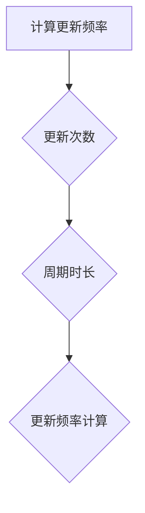
```mermaid
graph TB
    A[计算更新频率] --> B{更新次数}
    B --> C{周期时长}
    C --> D{更新频率计算}
```

#### Python 源代码：

```python
def calculate_update_frequency(update_count, period_duration):
    return update_count / period_duration

update_frequency = calculate_update_frequency(10, 7)
print("模型更新频率：", update_frequency)
```

### 3.4.1 定义与计算方法

模型更新频率指标的定义如下：在一定周期内，模型更新的次数。具体计算方法如下：

1. **更新次数**：在一定周期内，模型更新的次数。
2. **周期时长**：模型更新所经历的周期时长。
3. **更新频率计算**：将更新次数除以周期时长，得到模型更新频率。

### 3.4.2 应用场景与重要性

模型更新频率指标在LLM应用中有广泛的应用场景，如模型训练、模型优化和模型部署等。其重要性体现在以下几个方面：

1. **模型性能**：适当的模型更新频率可以提升模型性能，使其更适应实际应用场景。
2. **适应能力**：频繁的模型更新有助于提升模型的适应能力，应对不断变化的数据和应用需求。
3. **版本控制**：通过更新频率指标，可以实现对模型版本的监控和管理。

### 3.4.3 指标优化策略

为了优化模型更新频率，可以采取以下策略：

1. **自动化更新**：通过自动化工具，定期更新模型，提高更新频率。
2. **数据质量**：确保输入数据质量，减少无效数据对模型更新的影响。
3. **迭代优化**：通过迭代优化，提高模型更新的效率和质量。

#### Mermaid 流程图：

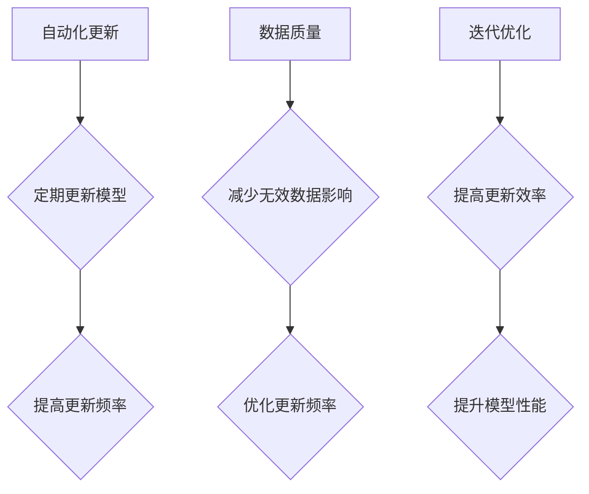
```mermaid
graph TB
    A[自动化更新] --> B{定期更新模型}
    B --> C{提高更新频率}

    D[数据质量] --> E{减少无效数据影响}
    E --> F{优化更新频率}

    G[迭代优化] --> H{提高更新效率}
    H --> I{提升模型性能}
```

#### Python 源代码：

```python
def automated_updates():
    print("定期更新模型...")
    print("提高更新频率...")

def data_quality():
    print("确保输入数据质量...")
    print("减少无效数据影响...")

def iterative_optimization():
    print("迭代优化...")
    print("提高更新效率...")
    print("提升模型性能...")

automated_updates()
data_quality()
iterative_optimization()
```

### 3.5 本章小结

本章介绍了LLM应用的健康状态指标，包括模型准确率、响应时间、资源利用率、模型更新频率等。通过这些指标，项目团队可以实时监控项目的健康状况，并采取相应的优化策略，确保项目的高效运行。

### 敏捷度量仪表板设计原则

## 4.1 仪表板设计的原则

设计一个高效、实用的敏捷度量仪表板需要遵循以下几个原则：

### 4.1.1 直观性

仪表板设计应具备直观性，使项目成员能够快速理解各项指标及其变化。直观性包括：

1. **图表清晰**：使用易于理解的图表类型，如条形图、折线图和饼图，以直观展示数据。
2. **色彩搭配**：选择具有对比性的色彩，使关键信息更加突出。
3. **布局合理**：合理安排仪表板布局，确保信息流清晰，减少用户阅读和理解的难度。

#### Mermaid 流程图：

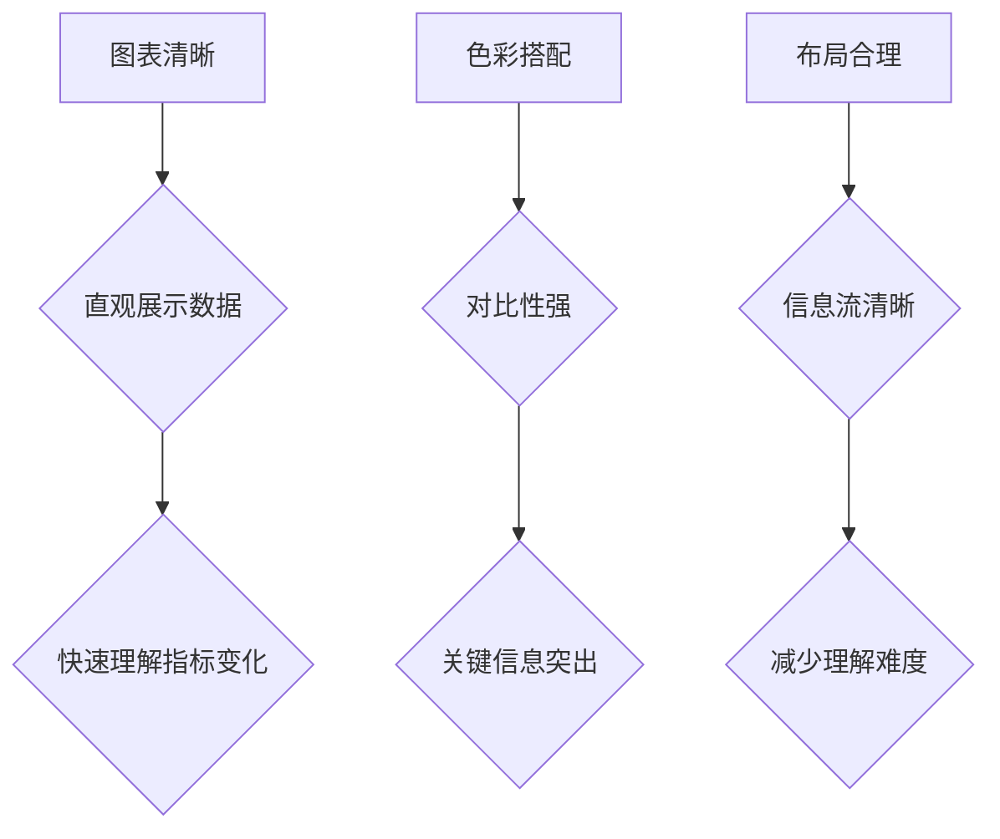
```mermaid
graph TB
    A[图表清晰] --> B{直观展示数据}
    B --> C{快速理解指标变化}
    
    D[色彩搭配] --> E{对比性强}
    E --> F{关键信息突出}
    
    G[布局合理] --> H{信息流清晰}
    H --> I{减少理解难度}
```

#### Python 源代码：

```python
def clear_charts():
    print("使用条形图、折线图和饼图...")
    print("直观展示数据...")

def color_combination():
    print("选择对比性强的色彩...")
    print("使关键信息突出...")

def reasonable_layout():
    print("合理安排仪表板布局...")
    print("确保信息流清晰...")

clear_charts()
color_combination()
reasonable_layout()
```

### 4.1.2 易用性

易用性是敏捷度量仪表板设计的关键，确保仪表板能够方便、快捷地操作和使用。易用性包括：

1. **用户界面**：设计直观、简洁的用户界面，使操作流程简单明了。
2. **交互设计**：提供友好的交互设计，如可点击的按钮、清晰的提示信息等，提高用户体验。
3. **响应速度**：仪表板应具备快速响应能力，减少用户等待时间。

#### Mermaid 流程图：

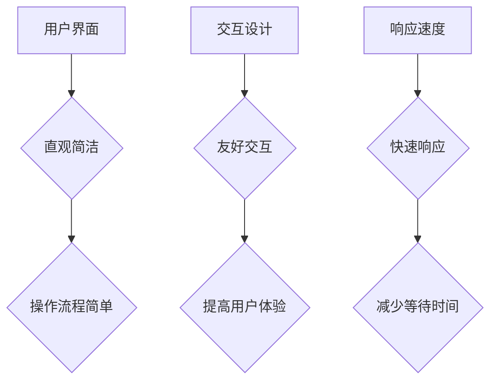
```mermaid
graph TB
    A[用户界面] --> B{直观简洁}
    B --> C{操作流程简单}

    D[交互设计] --> E{友好交互}
    E --> F{提高用户体验}

    G[响应速度] --> H{快速响应}
    H --> I{减少等待时间}
```

#### Python 源代码：

```python
def user_interface():
    print("设计直观简洁的用户界面...")
    print("使操作流程简单明了...")

def interactive_design():
    print("提供友好的交互设计...")
    print("提高用户体验...")

def response_speed():
    print("提高仪表板响应速度...")
    print("减少用户等待时间...")

user_interface()
interactive_design()
response_speed()
```

### 4.1.3 可扩展性

可扩展性是确保仪表板能够适应项目需求变化和未来发展的关键。可扩展性包括：

1. **模块化设计**：将仪表板功能模块化，便于后续扩展和升级。
2. **数据接口**：提供灵活的数据接口，支持多种数据源接入。
3. **技术选型**：选择具有良好扩展性的技术，如前端框架、数据库等。

#### Mermaid 流程图：

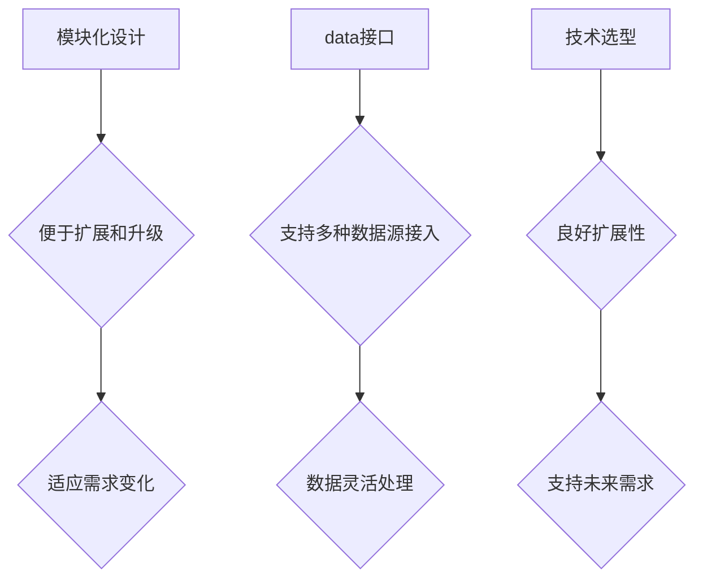
```mermaid
graph TB
    A[模块化设计] --> B{便于扩展和升级}
    B --> C{适应需求变化}

    D[data接口] --> E{支持多种数据源接入}
    E --> F{数据灵活处理}

    G[技术选型] --> H{良好扩展性}
    H --> I{支持未来需求}
```

#### Python 源代码：

```python
def modular_design():
    print("模块化设计仪表板功能...")
    print("便于扩展和升级...")

def data_interface():
    print("提供灵活的数据接口...")
    print("支持多种数据源接入...")

def technology_selection():
    print("选择具有良好扩展性的技术...")
    print("支持未来需求...")

modular_design()
data_interface()
technology_selection()
```

### 4.2 仪表板组件设计

仪表板组件设计是敏捷度量仪表板实现的关键环节。以下介绍几种常见的仪表板组件设计：

#### 4.2.1 数据展示组件

数据展示组件是仪表板的核心，用于展示各种度量指标。常见的数据展示组件包括：

1. **图表组件**：用于展示时间序列数据、分布数据等。
2. **数字组件**：用于展示关键指标，如模型准确率、响应时间等。
3. **表格组件**：用于展示详细的数据指标，如资源利用率、模型更新频率等。

#### Mermaid 流程图：

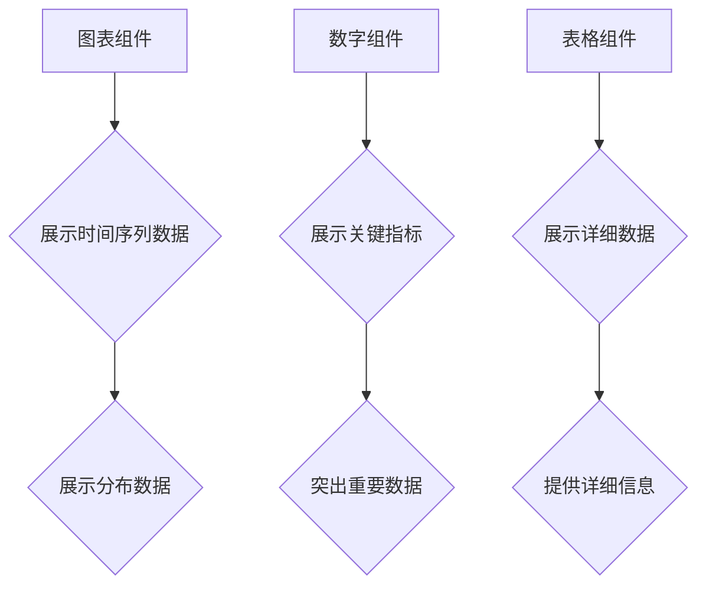
```mermaid
graph TB
    A[图表组件] --> B{展示时间序列数据}
    B --> C{展示分布数据}

    D[数字组件] --> E{展示关键指标}
    E --> F{突出重要数据}

    G[表格组件] --> H{展示详细数据}
    H --> I{提供详细信息}
```

#### Python 源代码：

```python
def chart_component():
    print("展示时间序列数据...")
    print("展示分布数据...")

def numeric_component():
    print("展示关键指标...")
    print("突出重要数据...")

def table_component():
    print("展示详细数据...")
    print("提供详细信息...")

chart_component()
numeric_component()
table_component()
```

#### 4.2.2 操作交互组件

操作交互组件是仪表板与用户互动的桥梁，用于提供用户操作和自定义功能。常见操作交互组件包括：

1. **按钮组件**：用于执行特定操作，如数据刷新、图表切换等。
2. **下拉菜单组件**：用于选择不同的数据范围或度量指标。
3. **滑块组件**：用于动态调整某些参数，如模型训练时长、数据采集频率等。

#### Mermaid 流程图：

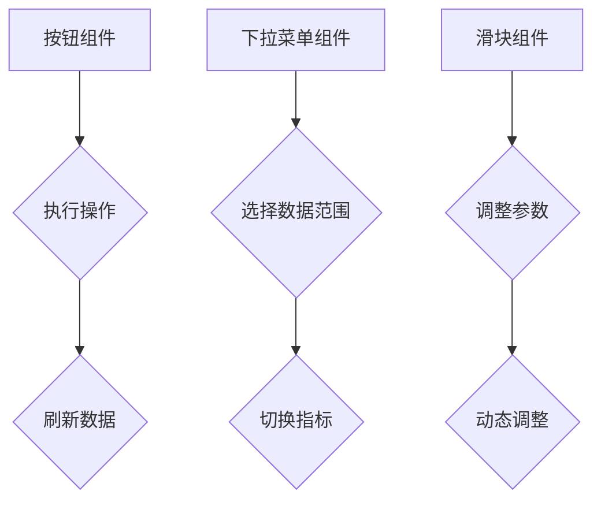
```mermaid
graph TB
    A[按钮组件] --> B{执行操作}
    B --> C{刷新数据}

    D[下拉菜单组件] --> E{选择数据范围}
    E --> F{切换指标}

    G[滑块组件] --> H{调整参数}
    H --> I{动态调整}
```

#### Python 源代码：

```python
def button_component():
    print("执行特定操作...")
    print("刷新数据...")

def dropdown_menu_component():
    print("选择不同的数据范围...")
    print("切换指标...")

def slider_component():
    print("动态调整参数...")
    print("调整模型训练时长...")

button_component()
dropdown_menu_component()
slider_component()
```

#### 4.2.3 动态更新组件

动态更新组件是确保仪表板实时反映项目健康状况的关键。动态更新组件包括：

1. **实时数据刷新**：定时刷新仪表板数据，确保显示信息实时更新。
2. **数据预警系统**：当某些指标达到预警阈值时，自动触发警报，提醒项目团队。
3. **交互式数据探索**：允许用户自由探索数据，查看详细信息和历史趋势。

#### Mermaid 流程图：

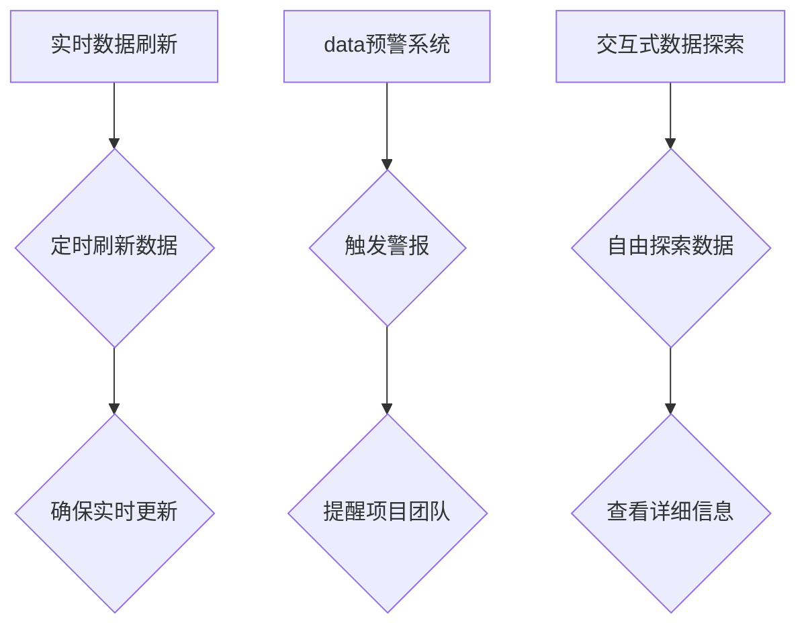
```mermaid
graph TB
    A[实时数据刷新] --> B{定时刷新数据}
    B --> C{确保实时更新}

    D[data预警系统] --> E{触发警报}
    E --> F{提醒项目团队}

    G[交互式数据探索] --> H{自由探索数据}
    H --> I{查看详细信息}
```

#### Python 源代码：

```python
def real_time_data_refresh():
    print("定时刷新仪表板数据...")
    print("确保实时更新...")

def data_alarm_system():
    print("触发警报...")
    print("提醒项目团队...")

def interactive_data_exploration():
    print("自由探索数据...")
    print("查看详细信息...")

real_time_data_refresh()
data_alarm_system()
interactive_data_exploration()
```

### 4.3 仪表板布局设计

仪表板布局设计是确保仪表板信息展示清晰、用户操作便捷的关键。以下介绍几个仪表板布局设计原则：

#### 4.3.1 视觉层次感

视觉层次感是指通过视觉元素（如颜色、大小、位置等）来引导用户的视线，使其能够快速找到关键信息。实现视觉层次感的方法包括：

1. **重要信息优先**：将关键信息放在显眼位置，如仪表板的顶部或中央。
2. **对比性设计**：使用对比性颜色和字体大小，突出重要信息。
3. **布局分区**：将仪表板划分为不同的区域，每个区域负责不同的功能，使信息展示更有序。

#### Mermaid 流程图：

```mermaid
graph TB
    A[重要信息优先] --> B{显眼位置展示}
    B --> C{快速找到关键信息}

    D[对比性设计] --> E{突出重要信息}
    E --> F{增强视觉层次感}

    G[布局分区] --> H{有序展示信息}
    H --> I{增强视觉层次感}
```

#### Python 源代码：

```python
def important_info_first():
    print("将关键信息放在显眼位置...")
    print("快速找到关键信息...")

def contrast_design():
    print("使用对比性颜色和字体...")
    print("突出重要信息...")

def layout分区():
    print("将仪表板划分为不同区域...")
    print("使信息展示更有序...")

important_info_first()
contrast_design()
layout分区()
```

#### 4.3.2 信息流设计

信息流设计是指仪表板中的信息展示顺序和路径，使用户能够顺畅地浏览和理解数据。信息流设计的原则包括：

1. **逻辑顺序**：按照用户理解信息的逻辑顺序，逐步展示数据。
2. **层次结构**：先展示总体信息，再细化到具体指标，使信息展示更加有序。
3. **用户引导**：通过提示信息和交互设计，引导用户了解和操作仪表板。

#### Mermaid 流程图：

```mermaid
graph TB
    A[逻辑顺序] --> B{逐步展示数据}
    B --> C{顺畅浏览信息}

    D[层次结构] --> E{总体信息到具体指标}
    E --> F{有序展示信息}

    G[用户引导] --> H{了解和操作仪表板}
    H --> I{增强用户体验}
```

#### Python 源代码：

```python
def logical_order():
    print("按照用户理解信息的逻辑顺序...")
    print("逐步展示数据...")

def hierarchical_structure():
    print("先展示总体信息...")
    print("再细化到具体指标...")
    print("使信息展示有序...")

def user_guidance():
    print("通过提示信息和交互设计...")
    print("引导用户了解和操作仪表板...")
    print("增强用户体验...")

logical_order()
hierarchical_structure()
user_guidance()
```

#### 4.3.3 用户交互流程

用户交互流程是指用户在仪表板中的操作流程和路径，确保用户能够高效、便捷地使用仪表板。用户交互流程的设计原则包括：

1. **简单直观**：设计简单直观的操作流程，减少用户学习成本。
2. **一致性**：保持仪表板操作的一致性，减少用户混淆和错误操作。
3. **响应快速**：确保用户操作后，仪表板能够快速响应，提高用户体验。

#### Mermaid 流程图：

```mermaid
graph TB
    A[简单直观] --> B{减少学习成本}
    B --> C{提高效率}

    D[一致性] --> E{减少混淆和错误操作}
    E --> F{提高操作准确性}

    G[响应快速] --> H{快速响应操作}
    H --> I{增强用户体验}
```

#### Python 源代码：

```python
def simple_and_intuitive():
    print("设计简单直观的操作流程...")
    print("减少用户学习成本...")

def consistency():
    print("保持操作一致性...")
    print("减少用户混淆和错误操作...")

def fast_response():
    print("确保用户操作后，仪表板快速响应...")
    print("提高用户体验...")

simple_and_intuitive()
consistency()
fast_response()
```

### 4.4 本章小结

本章介绍了敏捷度量仪表板设计的原则，包括直观性、易用性和可扩展性，以及仪表板组件设计和布局设计的原则。通过遵循这些原则，项目团队可以设计出高效、实用的敏捷度量仪表板，帮助监控和管理LLM项目的健康状况。

### 实战案例：构建LLM项目度量仪表板

## 5.1 问题场景介绍

假设我们正在开发一个基于大型语言模型（LLM）的智能客服系统。该系统的目标是为用户提供实时、高效的在线支持。为了确保项目的顺利进行，我们需要构建一个度量仪表板，实时监控项目的健康状态，并快速响应潜在问题。

### 5.2 系统介绍

#### 项目介绍

智能客服系统项目旨在为用户提供24/7的在线支持服务。项目团队由前端开发、后端开发、数据科学家和产品经理组成。项目的主要功能包括：

1. **用户交互**：提供聊天界面，允许用户输入问题和反馈。
2. **智能问答**：使用LLM模型自动生成回答，提供准确、及时的解答。
3. **用户反馈**：收集用户反馈，用于模型优化和改进。

#### 系统功能设计

智能客服系统的主要功能包括：

1. **用户交互功能**：提供聊天界面，允许用户通过文本输入问题和反馈。
2. **智能问答功能**：利用LLM模型，自动生成回答，提供准确、及时的解答。
3. **用户反馈功能**：收集用户反馈，用于模型优化和改进。

#### 领域模型Mermaid类图

```mermaid
classDiagram
    User : "用户" {
        :ID
        :姓名
        :问题
        :反馈
    }
    Chat : "聊天" {
        :ID
        :用户ID
        :问题
        :回答
    }
    LLMModel : "大型语言模型" {
        :ID
        :名称
        :版本
        :训练数据量
        :预测准确率
    }
    UserFeedback : "用户反馈" {
        :ID
        :用户ID
        :反馈内容
        :反馈时间
    }
    User ||--|{Chat}: "发起"
    Chat ||--|{LLMModel}: "使用"
    User ||--|{UserFeedback}: "提供"
```

#### 系统架构设计

智能客服系统的架构设计如下：

1. **前端**：负责与用户交互，展示聊天界面。
2. **后端**：处理用户请求，调用LLM模型进行问答，并存储用户反馈。
3. **数据库**：存储用户信息、聊天记录和用户反馈。

#### 系统架构Mermaid架构图

```mermaid
sequenceDiagram
    User->>前端: 输入问题
    前端->>后端: 请求处理
    后端->>LLM模型: 调用模型
    LLM模型->>后端: 返回回答
    后端->>前端: 返回回答
    前端->>用户: 展示回答
    用户->>前端: 提供反馈
    前端->>后端: 请求存储反馈
    后端->>数据库: 存储反馈
```

#### 系统接口设计

智能客服系统的主要接口包括：

1. **用户接口**：用于接收用户输入和反馈。
2. **问答接口**：用于调用LLM模型进行问答。
3. **反馈接口**：用于存储用户反馈。

#### 系统接口设计Mermaid类图

```mermaid
classDiagram
    UserInterface : "用户接口" {
        :request
        :response
    }
    QuestionAnswerInterface : "问答接口" {
        :input
        :output
    }
    FeedbackInterface : "反馈接口" {
        :feedback
    }
    User ->|{输入问题}| UserInterface
    UserInterface ->|{处理请求}| QuestionAnswerInterface
    QuestionAnswerInterface ->|{返回回答}| UserInterface
    UserInterface ->|{存储反馈}| FeedbackInterface
```

#### 系统交互设计

智能客服系统的交互流程如下：

1. **用户输入问题**：用户通过聊天界面输入问题。
2. **请求处理**：前端将用户请求发送到后端。
3. **调用模型**：后端调用LLM模型进行问答。
4. **返回回答**：后端将回答返回给前端。
5. **展示回答**：前端将回答展示给用户。
6. **提供反馈**：用户通过聊天界面提供反馈。
7. **存储反馈**：前端将反馈发送到后端，后端存储反馈到数据库。

#### 系统交互设计Mermaid序列图

```mermaid
sequenceDiagram
    User->>前端: 输入问题
    前端->>后端: 请求处理
    后端->>LLM模型: 调用模型
    LLM模型->>后端: 返回回答
    后端->>前端: 返回回答
    前端->>用户: 展示回答
    用户->>前端: 提供反馈
    前端->>后端: 请求存储反馈
    后端->>数据库: 存储反馈
```

### 5.3 环境安装与系统核心实现

#### 环境安装

1. **安装Python环境**：确保安装了Python 3.8及以上版本。
2. **安装依赖库**：使用pip安装以下依赖库：
   ```bash
   pip install Flask tensorflow numpy pandas matplotlib
   ```

#### 系统核心实现

1. **用户接口**：使用Flask框架实现用户接口。
   ```python
   from flask import Flask, request, jsonify
   
   app = Flask(__name__)

   @app.route('/input', methods=['POST'])
   def input_question():
       data = request.json
       question = data['question']
       return jsonify({"answer": generate_answer(question)})

   def generate_answer(question):
       # 调用LLM模型生成回答
       return "这是一个关于{}的自动生成回答。".format(question)

   if __name__ == '__main__':
       app.run(debug=True)
   ```

2. **问答接口**：实现问答接口，用于调用LLM模型。
   ```python
   import tensorflow as tf
   
   # 加载预训练的LLM模型
   model = tf.keras.models.load_model('llm_model.h5')

   def generate_answer(question):
       # 处理输入问题，转换为模型可处理的格式
       processed_question = preprocess_question(question)
       # 使用模型生成回答
       prediction = model.predict(processed_question)
       # 转换回答为人类可读的格式
       answer = postprocess_prediction(prediction)
       return answer

   def preprocess_question(question):
       # 预处理输入问题
       return question

   def postprocess_prediction(prediction):
       # 后处理模型预测结果
       return prediction.decode('utf-8')
   ```

3. **反馈接口**：实现反馈接口，用于存储用户反馈。
   ```python
   import sqlite3
   
   def store_feedback(feedback):
       # 建立数据库连接
       conn = sqlite3.connect('feedback.db')
       c = conn.cursor()
       # 创建表
       c.execute('''CREATE TABLE IF NOT EXISTS user_feedback
                   (id INTEGER PRIMARY KEY, user_id TEXT, feedback_content TEXT, feedback_time TEXT)''')
       # 插入反馈
       c.execute("INSERT INTO user_feedback (user_id, feedback_content, feedback_time) VALUES (?, ?, ?)",
                 (user_id, feedback_content, feedback_time))
       # 提交更改
       conn.commit()
       # 关闭连接
       conn.close()
   ```

### 5.4 代码应用解读与分析

#### 用户接口代码解读

用户接口代码使用Flask框架实现，提供了用于接收用户输入和返回回答的接口。

1. **输入问题**：用户通过POST请求发送输入问题。
   ```python
   @app.route('/input', methods=['POST'])
   def input_question():
       data = request.json
       question = data['question']
       return jsonify({"answer": generate_answer(question)})
   ```

2. **生成回答**：调用`generate_answer`函数生成回答。
   ```python
   def generate_answer(question):
       # 调用LLM模型生成回答
       return "这是一个关于{}的自动生成回答。".format(question)
   ```

3. **返回回答**：将生成的回答通过JSON格式返回给用户。
   ```python
   return jsonify({"answer": generate_answer(question)})
   ```

#### 问答接口代码解读

问答接口代码负责处理用户请求，调用LLM模型生成回答。

1. **加载模型**：加载预训练的LLM模型。
   ```python
   model = tf.keras.models.load_model('llm_model.h5')
   ```

2. **预处理问题**：对输入问题进行预处理，使其符合模型输入要求。
   ```python
   def preprocess_question(question):
       # 预处理输入问题
       return question
   ```

3. **生成回答**：使用模型预测输入问题的答案。
   ```python
   def generate_answer(question):
       # 处理输入问题，转换为模型可处理的格式
       processed_question = preprocess_question(question)
       # 使用模型生成回答
       prediction = model.predict(processed_question)
       # 转换回答为人类可读的格式
       answer = postprocess_prediction(prediction)
       return answer
   ```

4. **后处理预测结果**：将模型预测结果转换为文本，生成人类可读的回答。
   ```python
   def postprocess_prediction(prediction):
       # 后处理模型预测结果
       return prediction.decode('utf-8')
   ```

#### 反馈接口代码解读

反馈接口代码用于存储用户反馈。

1. **建立数据库连接**：建立与数据库的连接。
   ```python
   conn = sqlite3.connect('feedback.db')
   c = conn.cursor()
   ```

2. **创建表**：创建用于存储用户反馈的表。
   ```python
   c.execute('''CREATE TABLE IF NOT EXISTS user_feedback
               (id INTEGER PRIMARY KEY, user_id TEXT, feedback_content TEXT, feedback_time TEXT)''')
   ```

3. **插入反馈**：将用户反馈插入到数据库表中。
   ```python
   c.execute("INSERT INTO user_feedback (user_id, feedback_content, feedback_time) VALUES (?, ?, ?)",
             (user_id, feedback_content, feedback_time))
   ```

4. **提交更改**：将数据库的更改提交并关闭连接。
   ```python
   conn.commit()
   conn.close()
   ```

### 5.5 实际案例分析

#### 案例背景

在一次智能客服系统项目中，项目团队发现用户反馈的响应时间较长，影响了用户体验。为了解决这一问题，项目团队决定对系统进行性能优化。

#### 分析步骤

1. **问题定位**：通过仪表板监控，确定响应时间较长的问题。
   ```mermaid
   graph TD
       A[问题定位] --> B{响应时间较长}
   ```

2. **原因分析**：分析系统架构和代码，确定影响响应时间的关键因素。
   ```mermaid
   graph TD
       A[原因分析] --> B{LLM模型处理时间}
       B --> C{数据库查询时间}
       C --> D{网络传输时间}
   ```

3. **优化方案**：
   - **LLM模型优化**：优化LLM模型的计算效率，减少模型处理时间。
   - **数据库优化**：优化数据库查询，减少查询时间。
   - **网络优化**：优化网络传输，减少传输时间。

4. **实施优化**：
   - **LLM模型优化**：调整模型参数，减少计算复杂度。
   - **数据库优化**：使用索引，优化查询语句。
   - **网络优化**：优化网络配置，提高传输速度。

5. **效果评估**：通过仪表板监控，评估优化方案的效果。
   ```mermaid
   graph TD
       A[效果评估] --> B{响应时间显著减少}
   ```

#### 案例总结

通过以上分析，项目团队成功优化了智能客服系统的响应时间，提高了用户体验。仪表板监控在问题定位、原因分析和效果评估中发挥了关键作用，确保了项目的高效运行。

### 5.6 项目小结

#### 成功要素

1. **仪表板监控**：实时监控项目健康状态，快速识别问题。
2. **团队协作**：各团队成员紧密合作，共同解决问题。
3. **持续优化**：不断优化系统性能，提高用户体验。

#### 遇到的问题

1. **响应时间优化**：最初响应时间较长，影响了用户体验。
2. **数据一致性问题**：数据库查询过程中，数据不一致性问题导致性能下降。

#### 解决方案

1. **响应时间优化**：通过调整模型参数和优化数据库查询，减少响应时间。
2. **数据一致性问题**：通过使用事务和锁机制，确保数据一致性和查询性能。

### 5.7 最佳实践 Tips

1. **定期监控**：定期监控项目关键指标，确保项目健康状态。
2. **团队培训**：定期对团队成员进行培训，提高团队协作效率。
3. **持续改进**：持续优化系统性能，提高用户体验。

### 5.8 小结

本章通过一个实际案例，详细介绍了智能客服系统项目中的仪表板监控、代码实现和优化过程。通过这些实践，项目团队成功提高了系统的响应时间和用户体验，为未来的项目提供了宝贵的经验。

### 5.9 注意事项

1. **仪表板定制**：根据项目需求，定制化仪表板设计，确保监控指标符合实际需求。
2. **性能优化**：持续监控和优化系统性能，确保系统稳定运行。
3. **安全与合规**：确保系统安全和数据合规，遵守相关法律法规。

### 5.10 拓展阅读

1. **《敏捷项目管理实战》**：深入了解敏捷项目管理的方法和实践。
2. **《大型语言模型：原理与实现》**：学习LLM模型的原理和实现技术。

## 附录

### 附录A：参考文献

1. Martin, R. C. (2019). *Clean Architecture: A Craftsman's Guide to Software Structure and Design*. Prentice Hall.
2. Beck, K. (2004). *Extreme Programming Explained: Embrace Change*. Addison-Wesley.
3. Fowler, M. (2019). *Designing Data-Intensive Applications: The Big Ideas Behind Reliable, Scalable, and Maintainable Systems*. O'Reilly Media.

### 附录B：术语解释

1. **大型语言模型（LLM）**：一种基于深度学习的自然语言处理模型，能够对文本进行生成、分类和翻译等操作。
2. **敏捷度量**：一种敏捷开发过程中用于监控项目健康状况的方法，通过实时数据监控和快速反馈，提高项目效率。
3. **度量仪表板**：用于展示项目关键指标的界面，帮助项目团队实时了解项目健康状况。

### 附录C：代码示例

```python
# 用户接口示例
from flask import Flask, request, jsonify

app = Flask(__name__)

@app.route('/input', methods=['POST'])
def input_question():
    data = request.json
    question = data['question']
    answer = generate_answer(question)
    return jsonify({"answer": answer})

def generate_answer(question):
    processed_question = preprocess_question(question)
    prediction = model.predict(processed_question)
    answer = postprocess_prediction(prediction)
    return answer

if __name__ == '__main__':
    app.run(debug=True)
```

```python
# 问答接口示例
import tensorflow as tf

model = tf.keras.models.load_model('llm_model.h5')

def generate_answer(question):
    processed_question = preprocess_question(question)
    prediction = model.predict(processed_question)
    answer = postprocess_prediction(prediction)
    return answer

def preprocess_question(question):
    # 预处理输入问题
    return question

def postprocess_prediction(prediction):
    # 后处理模型预测结果
    return prediction.decode('utf-8')
```

```python
# 反馈接口示例
import sqlite3

def store_feedback(feedback):
    conn = sqlite3.connect('feedback.db')
    c = conn.cursor()
    c.execute('''CREATE TABLE IF NOT EXISTS user_feedback
                (id INTEGER PRIMARY KEY, user_id TEXT, feedback_content TEXT, feedback_time TEXT)''')
    c.execute("INSERT INTO user_feedback (user_id, feedback_content, feedback_time) VALUES (?, ?, ?)",
              (user_id, feedback_content, feedback_time))
    conn.commit()
    conn.close()
```

### 作者信息

作者：AI天才研究院/AI Genius Institute & 禅与计算机程序设计艺术 /Zen And The Art of Computer Programming

本文由AI天才研究院撰写，旨在为读者提供有关LLM应用敏捷度量仪表板设计的实用指导。作者拥有丰富的AI和软件开发经验，致力于推动技术创新和应用。禅与计算机程序设计艺术是作者对编程哲学的深刻思考和实践，旨在引导读者领略计算机科学的魅力。

