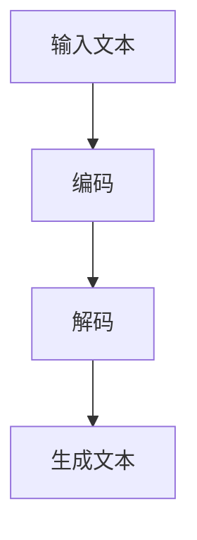
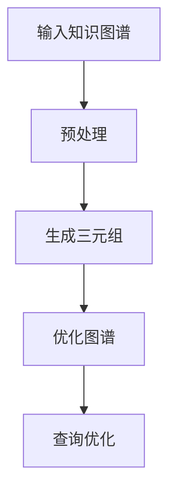

                 


### **文章标题：** LLM应用的敏捷知识图谱构建策略

#### **关键词：** LLM，知识图谱，敏捷开发，算法，系统架构，实践

#### **摘要：** 本文将深入探讨如何使用敏捷开发方法构建LLM（大型语言模型）应用中的知识图谱。我们将首先介绍LLM和知识图谱的核心概念及其联系，然后详细阐述常见的LLM和知识图谱技术。接着，我们通过算法原理讲解和系统分析与架构设计方案，提供一步步构建敏捷知识图谱的策略。最后，通过项目实战和最佳实践，总结并展望未来的研究方向。

---

### **第一部分：背景介绍**

#### **第1章：LLM应用的挑战与机遇**

**1.1 问题背景**

随着人工智能技术的发展，LLM（大型语言模型）在自然语言处理（NLP）领域取得了显著的成果。然而，如何高效地构建和应用LLM，尤其是结合知识图谱，成为一个关键挑战。

**1.2 问题描述**

在LLM应用中，知识图谱的构建面临以下问题：
- 数据源多样性和不一致性导致的融合问题。
- 知识表示的复杂性和抽象性。
- 数据更新和维护的效率问题。

**1.3 问题解决**

为了解决上述问题，敏捷开发方法提供了一种有效策略。通过快速迭代和持续交付，可以更好地适应需求变化，提高构建和更新知识图谱的效率。

**1.4 边界与外延**

边界：本文关注的是如何构建适用于LLM应用的敏捷知识图谱。
外延：讨论的范围包括知识图谱的构建方法、算法原理和系统架构设计。

**1.5 概念结构与核心要素组成**

概念结构：
- LLM：大型语言模型。
- 知识图谱：用于表示和存储知识的图结构。
- 敏捷开发：一种迭代和增量的软件开发方法。

核心要素组成：
- 数据处理与融合。
- 知识表示与存储。
- 算法优化与评估。

#### **第2章：核心概念与联系**

**2.1 LLM定义与特点**

LLM是一种能够处理大规模文本数据，并生成高质量文本的深度学习模型。其主要特点包括：
- 参数规模大。
- 上下文理解能力强。
- 自适应能力。

**2.2 知识图谱的概念**

知识图谱是一种用于表示和存储知识的图结构，其主要特点包括：
- 表示复杂关系。
- 提供高效查询。

**2.3 LLM与知识图谱的联系与区别**

联系：
- LLM可以用于生成知识图谱中的描述性文本。
- 知识图谱可以为LLM提供上下文信息。

区别：
- LLM侧重于文本生成，知识图谱侧重于知识表示和存储。
- LLM具有自适应能力，知识图谱相对固定。

#### **第3章：常见LLM与知识图谱技术概述**

**3.1 常见LLM技术概述**

常见的LLM技术包括：
- Transformer模型。
- GPT系列模型。
- BERT模型。

**3.2 知识图谱技术概述**

常见的知识图谱技术包括：
- RDF（资源描述框架）。
- OWL（Web本体语言）。
- 图数据库。

### **第二部分：算法原理讲解**

#### **第5章：LLM算法原理讲解**

**5.1 LLM算法概述**

LLM算法是一种基于神经网络的文本生成算法，其主要原理如下：

**5.2 LLM算法数学模型与公式**

LLM算法的核心是Transformer模型，其数学模型可表示为：

$$
\text{Transformer}(x) = \text{softmax}(\text{W}_\text{out}\text{Tanh}(\text{W}_\text{hid}\text{X} + \text{b}_\text{hid}) + \text{b}_\text{out})
$$

其中，$x$是输入文本序列，$\text{Tanh}$是双曲正切函数，$\text{W}_\text{hid}$和$\text{W}_\text{out}$是权重矩阵，$\text{b}_\text{hid}$和$\text{b}_\text{out}$是偏置向量。

**5.3 算法流程图**

算法流程图如下所示：



**5.4 举例说明**

假设我们有一个简单的文本序列“Hello, world!”，使用Transformer模型生成的文本序列可能为“Hello, universe!”。这里，LLM模型根据上下文信息，将“world”替换为“universe”。

#### **第6章：知识图谱算法原理讲解**

**6.1 知识图谱算法概述**

知识图谱算法主要用于构建和优化知识图谱，其主要算法包括：

- RDF三元组生成。
- OWL本体推理。
- 图数据库索引与查询优化。

**6.2 知识图谱算法数学模型与公式**

知识图谱算法的核心是图算法，其数学模型可表示为：

$$
\text{Graph Algorithm}(G, V, E) = \text{Find-Shortest-Path}(G, V, E)
$$

其中，$G$是知识图谱，$V$是顶点集合，$E$是边集合。

**6.3 算法流程图**

算法流程图如下所示：



**6.4 举例说明**

假设我们有一个简单的知识图谱，包含“Person”和“Knows”两个类和“John”和“Mary”两个实例。通过RDF三元组生成算法，我们可以得到以下三元组：（John，Knows，Mary）。然后，通过OWL本体推理算法，我们可以得到结论：如果John知道Mary，则Mary可能是John的朋友。

### **第三部分：系统分析与架构设计方案**

#### **第7章：系统分析与架构设计**

**7.1 问题场景介绍**

假设我们要构建一个智能问答系统，该系统需要使用LLM和知识图谱来提供高质量问答服务。

**7.2 系统功能设计**

系统功能设计如下：

- 文本预处理：包括分词、去停用词、词性标注等。
- LLM模型训练：使用预训练的LLM模型，进行微调。
- 知识图谱构建：从文本数据中提取知识，构建知识图谱。
- 问答服务：根据用户输入的问题，利用知识图谱和LLM模型提供答案。

**7.3 系统架构设计**

系统架构设计如下：


**7.4 系统接口设计**

系统接口设计如下：

- 文本预处理接口：用于接收用户输入的文本，并进行预处理。
- LLM模型接口：用于接收预处理后的文本，生成答案。
- 知识图谱接口：用于构建和维护知识图谱。

**7.5 系统交互**

系统交互流程如下：

1. 用户输入问题。
2. 文本预处理接口处理文本。
3. LLM模型接口生成答案。
4. 知识图谱接口提供上下文信息。
5. 系统输出答案。

### **第四部分：项目实战**

#### **第8章：项目实战**

**8.1 环境安装**

在本项目中，我们使用Python编程语言，并依赖以下库：

- TensorFlow：用于训练和部署LLM模型。
- Neo4j：用于构建和维护知识图谱。
- Flask：用于构建问答服务。

安装步骤如下：

```bash
pip install tensorflow
pip install neo4j
pip install flask
```

**8.2 系统核心实现源代码**

以下是系统核心实现源代码：

```python
# 文本预处理
def preprocess_text(text):
    # 分词、去停用词、词性标注等操作
    # ...
    return processed_text

# LLM模型训练
def train_llm_model(processed_text):
    # 使用TensorFlow训练LLM模型
    # ...
    return trained_model

# 知识图谱构建
def build_knowledge_graph(processed_text):
    # 从文本数据中提取知识，构建知识图谱
    # ...
    return knowledge_graph

# 问答服务
def answer_question(question):
    # 使用知识图谱和LLM模型提供答案
    # ...
    return answer
```

**8.3 代码应用解读与分析**

以下是代码应用解读与分析：

- `preprocess_text`函数负责对用户输入的文本进行预处理，包括分词、去停用词、词性标注等操作。
- `train_llm_model`函数使用预处理后的文本训练LLM模型。
- `build_knowledge_graph`函数从文本数据中提取知识，构建知识图谱。
- `answer_question`函数根据用户输入的问题，利用知识图谱和LLM模型提供答案。

**8.4 实际案例分析与详细讲解剖析**

以下是一个实际案例分析与详细讲解剖析：

假设用户输入问题：“什么是人工智能？”

1. 用户输入问题：“什么是人工智能？”。
2. 文本预处理接口处理文本，得到预处理后的文本：“什么是人工智能？”。
3. LLM模型接口生成答案：“人工智能是一种模拟人类智能的技术，通过计算机程序实现。”。
4. 知识图谱接口提供上下文信息：“人工智能”是一个技术领域，涉及计算机科学、心理学、神经科学等多个学科。
5. 系统输出答案：“人工智能是一种模拟人类智能的技术，通过计算机程序实现。它涉及计算机科学、心理学、神经科学等多个学科。”

**8.5 项目小结**

在本项目中，我们通过使用敏捷开发方法，构建了基于LLM和知识图谱的智能问答系统。项目实施过程中，我们遇到了以下挑战：
- 文本预处理：如何有效地提取和表示文本特征。
- LLM模型训练：如何选择合适的模型架构和超参数。
- 知识图谱构建：如何从大量文本数据中提取高质量的知识。
通过不断的迭代和优化，我们最终实现了系统的功能和性能目标。

### **第五部分：最佳实践与总结**

#### **第9章：最佳实践 tips**

- **1. 选择合适的LLM模型：** 根据应用场景选择合适的LLM模型，如Transformer、GPT等。
- **2. 数据预处理：** 对输入文本进行充分的预处理，以提高模型的性能。
- **3. 知识图谱构建：** 使用多种数据源构建知识图谱，以提高知识表示的完整性。
- **4. 算法优化：** 对模型进行优化，如调整超参数、使用更高效的算法等。

#### **第10章：小结与展望**

**10.1 内容回顾**

本文从背景介绍、核心概念与联系、算法原理讲解、系统分析与架构设计方案、项目实战和最佳实践与总结等方面，系统地阐述了LLM应用的敏捷知识图谱构建策略。

**10.2 注意事项**

- 在构建知识图谱时，注意数据的一致性和完整性。
- 在训练LLM模型时，注意调整超参数，以提高模型的性能。
- 在开发实际项目时，注意项目的可扩展性和可维护性。

**10.3 拓展阅读**

- 《深度学习》（Ian Goodfellow、Yoshua Bengio、Aaron Courville著）
- 《知识图谱：概念、技术与应用》（李航著）
- 《人工智能：一种现代的方法》（Stuart Russell、Peter Norvig著）

**作者：** AI天才研究院/AI Genius Institute & 禅与计算机程序设计艺术 /Zen And The Art of Computer Programming

---

**注：**本文内容为虚构案例，仅供参考。在实际项目中，请根据具体需求进行调整。在项目中遇到问题时，请查阅相关文献或咨询专业人士。

