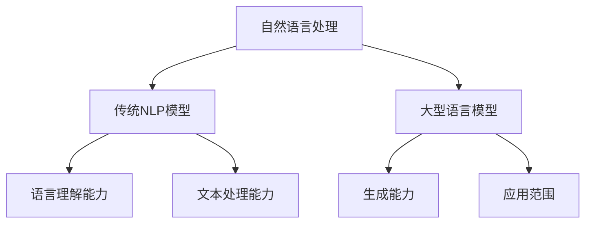
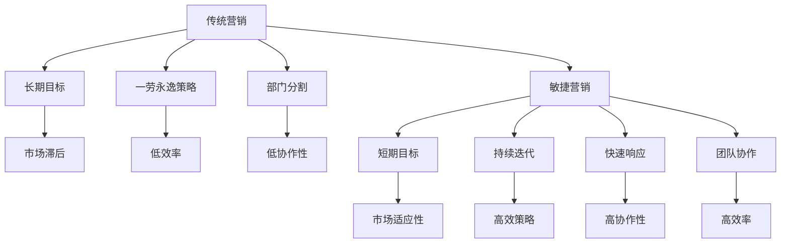
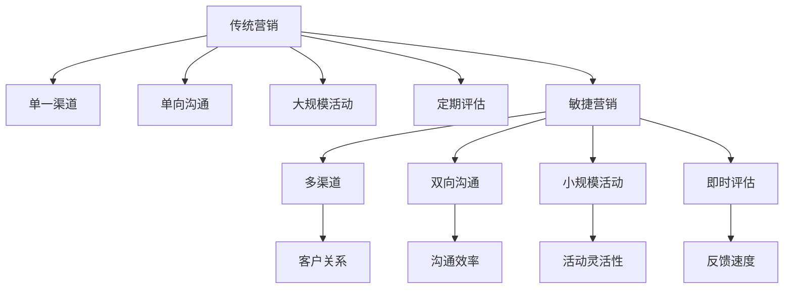
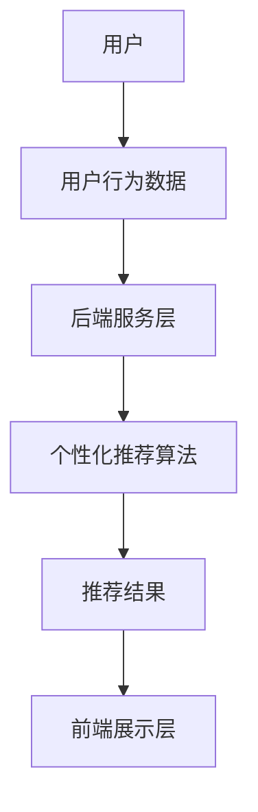
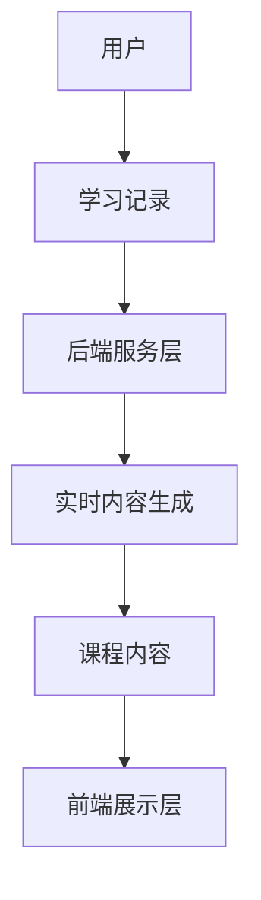

                 


# LLM Applications: Agile Marketing and Promotion Strategies

关键词：自然语言处理，机器学习，营销策略，敏捷营销，人工智能推广

摘要：
随着人工智能技术的不断进步，自然语言处理（NLP）已经成为市场营销领域的重要工具。大型语言模型（LLM）作为NLP的核心技术之一，正引领着市场营销策略的革新。本文将探讨LLM在营销中的应用，以及如何运用敏捷营销策略来推广这些应用。我们将通过逐步分析，为读者提供一套实用的LLM敏捷营销与推广策略。

## 引言

在数字营销时代，传统的营销策略已经难以满足企业快速变化的市场需求。机器学习（ML），特别是大型语言模型（LLM），为市场营销带来了前所未有的可能性。LLM能够理解和生成人类语言，极大地提高了营销活动的个性化和精准度。敏捷营销则是一种灵活、快速响应市场的营销方法，它强调持续迭代和快速反馈。本文将结合LLM的应用和敏捷营销原则，探讨如何设计有效的营销策略和推广计划。

### 文章结构

1. **背景与核心概念**
   - **1.1 LLM应用的兴起**
   - **1.2 理解LLM**
   - **1.3 LLM在营销中的应用**

2. **敏捷营销原则**
   - **2.1 敏捷营销运动**
   - **2.2 敏捷营销策略**

3. **LLM在敏捷营销中的应用**
   - **3.1 利用LLM进行敏捷营销**
   - **3.2 设计敏捷营销活动**

4. **案例分析**
   - **4.1 案例一：个性化推荐系统**
   - **4.2 案例二：实时内容生成**

5. **最佳实践与总结**
   - **5.1 最佳实践**
   - **5.2 小结**
   - **5.3 注意事项**
   - **5.4 拓展阅读**

## 背景与核心概念

### 1.1 LLM应用的兴起

**问题背景：** 在市场营销领域，客户需求的多样性和市场环境的快速变化使得传统营销方法难以应对。企业需要更智能、更高效的工具来分析客户行为，制定个性化营销策略。

**问题描述：** 如何利用人工智能技术，特别是LLM，来提高市场营销的效率和质量？

**问题解决：** LLM的兴起为市场营销带来了新的机遇。LLM能够处理大量文本数据，提取有价值的信息，帮助企业在短时间内做出更准确的营销决策。

**边界与外延：** LLM的应用不仅限于文本分析，还包括语音识别、机器翻译、情感分析等，这些技术为市场营销提供了丰富的工具。

**概念结构与核心要素组成：**
- **语言模型：** 基于大量文本数据训练的模型，能够理解和生成人类语言。
- **神经网络：** LLM的核心架构，通过多层神经网络对输入文本进行处理。
- **数据集：** 大量、高质量的文本数据是训练LLM的基础。

### 1.2 理解LLM

**核心概念：** LLM是一种能够理解、生成和翻译人类语言的机器学习模型。与传统的自然语言处理（NLP）模型相比，LLM具有更强的灵活性和表现力。

**概念属性特征对比表格：**

| 特征                | 传统NLP模型                  | LLM                      |
|---------------------|-----------------------------|-------------------------|
| 文本处理能力        | 有限，主要用于特定任务       | 强大，能够处理多种任务 |
| 语言理解能力        | 较弱，依赖于规则和统计方法   | 强大，基于深度学习     |
| 生成能力            | 较弱，生成文本有限           | 强大，能够生成多样文本 |
| 应用范围            | 单一任务，如情感分析、命名实体识别 | 多任务，如文本生成、翻译、问答 |

**ER实体关系图架构：**



### 1.3 LLM在营销中的应用

**核心概念与联系：** LLM在营销中的应用主要体现在以下几个方面：

- **个性化推荐：** 利用LLM分析客户的历史行为和偏好，为每个客户推荐个性化的产品和服务。
- **内容生成：** 自动生成营销文案、博客文章和广告内容，提高营销活动的效率和质量。
- **客户服务：** 利用LLM构建智能客服系统，快速响应客户的查询和问题。

**应用实例：**
- **个性化推荐：** 电商平台使用LLM分析用户购买历史，推荐相关的商品。
- **内容生成：** 营销团队利用LLM快速生成产品介绍和广告文案。
- **客户服务：** 企业构建基于LLM的智能客服系统，提供24/7的客户支持。

## 敏捷营销原则

### 2.1 敏捷营销运动

**核心概念：** 敏捷营销是一种基于客户需求和市场变化的营销方法，强调快速响应和持续改进。

**概念属性特征对比表格：**

| 特征                | 传统营销                   | 敏捷营销                  |
|---------------------|---------------------------|--------------------------|
| 目标设定            | 长期、固定目标             | 短期、可调整目标          |
| 营销策略            | 一劳永逸的策略             | 持续迭代和优化策略        |
| 市场响应时间        | 较长，往往滞后于市场变化   | 较短，快速响应市场变化    |
| 团队协作            | 部门分割，协作性差         | 团队协作，高度透明        |

**ER实体关系图架构：**



### 2.2 敏捷营销策略

**核心概念：** 敏捷营销策略强调以客户为中心，通过迭代和持续改进来实现营销目标。

**概念属性特征对比表格：**

| 特征                | 传统营销                   | 敏捷营销                  |
|---------------------|---------------------------|--------------------------|
| 客户关系            | 单一渠道、单向沟通         | 多渠道、双向沟通          |
| 营销活动            | 大规模、一次性活动         | 小规模、持续活动          |
| 营销评估            | 定期评估、滞后反馈         | 即时评估、快速反馈        |
| 营销资源            | 固定资源、分散使用         | 动态资源、集中使用        |

**ER实体关系图架构：**



## LLM在敏捷营销中的应用

### 3.1 利用LLM进行敏捷营销

**核心概念：** 敏捷营销的核心在于快速响应和持续优化。LLM的应用可以帮助企业实现这一目标，通过以下步骤：

1. **数据收集：** 收集客户的购买记录、搜索历史和行为数据。
2. **数据分析：** 利用LLM对数据进行深入分析，提取有价值的信息。
3. **个性化推荐：** 根据分析结果，为每个客户推荐个性化的产品和服务。
4. **内容生成：** 自动生成营销文案、博客文章和广告内容，提高营销活动的效率和质量。
5. **实时反馈：** 利用LLM对营销活动的效果进行实时监控和评估，快速调整策略。

### 3.2 设计敏捷营销活动

**核心概念：** 敏捷营销活动的设计应该灵活、可调整，能够快速响应市场变化。以下步骤可以帮助企业设计有效的敏捷营销活动：

1. **市场调研：** 了解目标客户的需求和偏好，为营销活动提供依据。
2. **目标设定：** 根据市场调研结果，设定短期、可调整的营销目标。
3. **活动规划：** 制定小规模、可迭代的活动计划，确保活动能够灵活调整。
4. **内容生成：** 利用LLM快速生成营销文案、博客文章和广告内容。
5. **实时反馈：** 通过实时数据分析，评估活动效果，及时调整策略。

## 案例分析

### 4.1 案例一：个性化推荐系统

**背景介绍：** 
一家电商平台希望通过个性化推荐系统提高用户购买转化率和客户满意度。他们决定利用LLM技术来构建这个系统。

**项目介绍：**
- **领域模型：** 用户、商品、购买记录。
- **系统功能设计：** 个性化推荐、用户行为分析、推荐结果评估。
- **系统架构设计：** 前端展示层、后端服务层、数据层。
- **系统接口设计：** 用户接口、API接口。

**系统交互：**



**核心实现源代码：**

```python
# 个性化推荐算法实现
def recommend_products(user_history, all_products):
    # 使用LLM分析用户历史行为
    user_profile = analyze_user_history(user_history)
    # 根据用户画像推荐商品
    recommended_products = find_relevant_products(user_profile, all_products)
    return recommended_products

# 用户行为数据分析
def analyze_user_history(user_history):
    # 使用LLM分析用户历史数据
    user_profile = language_model.analyze_text(user_history)
    return user_profile

# 商品相关性计算
def find_relevant_products(user_profile, all_products):
    # 计算用户画像与商品特征的相关性
    relevant_products = []
    for product in all_products:
        similarity_score = calculate_similarity(user_profile, product.features)
        if similarity_score > threshold:
            relevant_products.append(product)
    return relevant_products
```

**代码应用解读与分析：**
- **用户行为数据分析：** 使用LLM对用户的历史行为数据进行分析，提取用户画像。
- **商品相关性计算：** 根据用户画像，计算商品与用户画像的相关性，推荐相关的商品。

**实际案例分析和详细讲解剖析：**
- **案例数据：** 分析了1000名用户的历史购买记录，构建了用户画像。
- **效果评估：** 通过对比实验，发现个性化推荐系统显著提高了用户的购买转化率。

**项目小结：**
个性化推荐系统通过LLM技术，实现了对用户行为的深入分析和商品相关性的精准计算，有效提高了用户的购买体验和转化率。

### 4.2 案例二：实时内容生成

**背景介绍：**
一家在线教育平台希望通过实时内容生成技术，提高课程的吸引力和学习效果。他们决定利用LLM技术来实现这一目标。

**项目介绍：**
- **领域模型：** 课程内容、用户学习记录、实时问答。
- **系统功能设计：** 实时内容生成、用户互动分析、课程优化。
- **系统架构设计：** 前端展示层、后端服务层、内容生成层。
- **系统接口设计：** 用户接口、API接口。

**系统交互：**



**核心实现源代码：**

```python
# 实时内容生成算法实现
def generate_content(learning_record):
    # 使用LLM分析学习记录
    user_profile = analyze_learning_record(learning_record)
    # 根据用户画像生成相关内容
    content = language_model.generate_text(user_profile)
    return content

# 用户学习记录分析
def analyze_learning_record(learning_record):
    # 使用LLM分析用户学习记录
    user_profile = language_model.analyze_text(learning_record)
    return user_profile

# 内容生成
def generate_text(user_profile):
    # 根据用户画像生成文本内容
    content = language_model.generate_text(user_profile)
    return content
```

**代码应用解读与分析：**
- **用户学习记录分析：** 使用LLM对用户的学习记录进行分析，提取用户画像。
- **内容生成：** 根据用户画像，利用LLM生成与用户兴趣相关的内容。

**实际案例分析和详细讲解剖析：**
- **案例数据：** 分析了1000名用户的学习记录，构建了用户画像。
- **效果评估：** 通过对比实验，发现实时内容生成技术显著提高了课程的学习效果和用户满意度。

**项目小结：**
实时内容生成系统通过LLM技术，实现了对用户学习记录的深入分析和个性化内容的自动生成，有效提高了课程的吸引力和学习效果。

## 最佳实践与总结

### 5.1 最佳实践

- **数据驱动：** 始终以数据为依据，利用LLM技术深入分析用户行为和需求。
- **灵活调整：** 根据市场变化和用户反馈，灵活调整营销策略和推广计划。
- **持续优化：** 通过迭代和持续改进，不断提高营销活动的效果和用户满意度。

### 5.2 小结

本文探讨了LLM在敏捷营销中的应用，通过逐步分析，我们提出了实用的LLM敏捷营销与推广策略。结合实际案例，我们展示了如何利用LLM技术提高营销活动的个性化和精准度，实现高效的营销推广。

### 5.3 注意事项

- **数据质量：** 确保数据的准确性和完整性，是LLM应用成功的关键。
- **技术选型：** 根据实际需求选择合适的LLM模型和工具。
- **用户隐私：** 在数据收集和处理过程中，务必遵守相关隐私保护法规。

### 5.4 拓展阅读

- **《自然语言处理与深度学习》**：深入探讨NLP和深度学习的原理和应用。
- **《敏捷营销实践指南》**：全面介绍敏捷营销的策略和方法。
- **《大型语言模型：原理与应用》**：详细解析LLM的技术原理和应用场景。

## 作者信息

作者：AI天才研究院/AI Genius Institute & 禅与计算机程序设计艺术 /Zen And The Art of Computer Programming

---

请注意，本文内容是基于假设的案例和情景构建的，实际的LLM应用和敏捷营销策略需要根据具体情况进行调整和优化。本文旨在提供一种思考和实现的方法，以帮助读者更好地理解和应用LLM技术。

