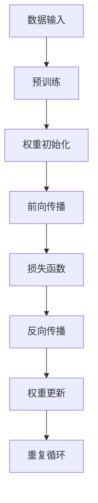
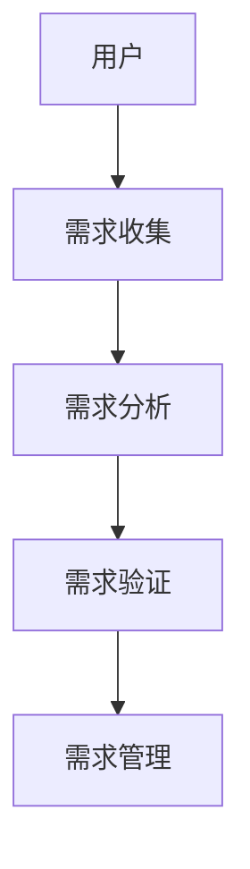
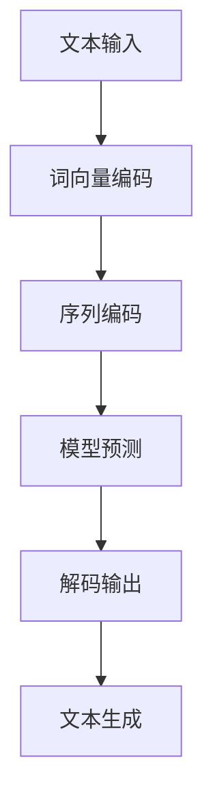
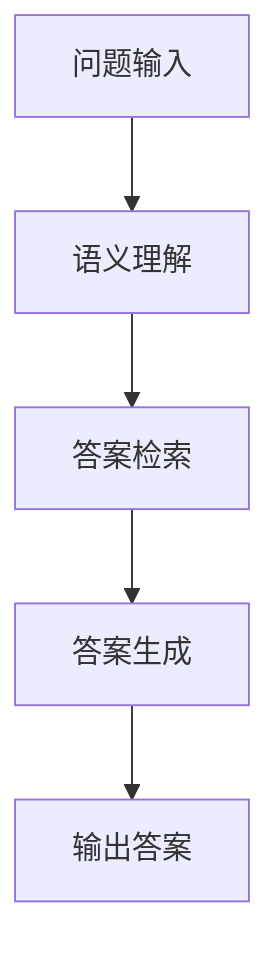
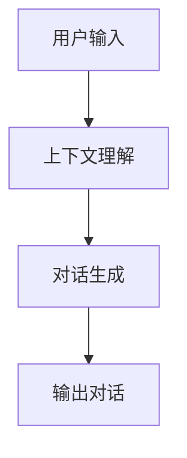
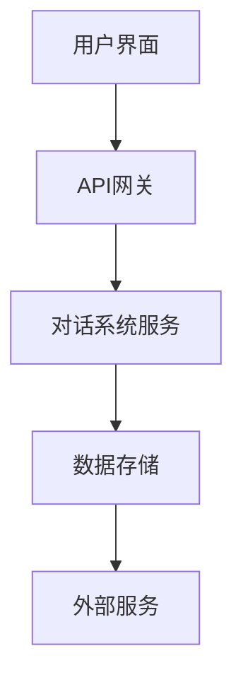
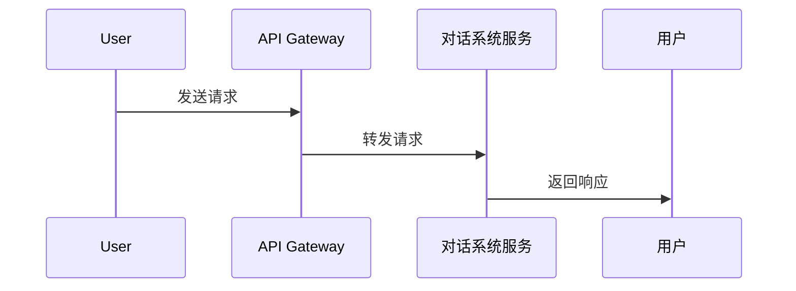

                 


## LLM应用的敏捷需求分析技巧

### 关键词

- LLM（大型语言模型）
- 敏捷需求分析
- 文本生成
- 问答系统
- 对话系统
- 算法原理
- 数学模型

### 摘要

本文旨在探讨如何在LLM（大型语言模型）应用中运用敏捷需求分析技巧。通过对LLM的基本概念、敏捷需求分析方法论、具体应用实例以及最佳实践的分析，本文为读者提供了一个系统、全面的指南，帮助他们在开发过程中更高效地理解和满足用户需求。

### 目录

1. **背景介绍**
   - LLM概述
   - 敏捷需求分析的概念
   - LLM应用的需求分析挑战

2. **核心概念与联系**
   - LLM的基本原理
   - 敏捷需求分析的流程
   - LLM与敏捷需求分析的联系

3. **算法原理讲解**
   - LLM算法的mermaid流程图
   - 算法原理的python源代码
   - 数学模型与公式

4. **系统分析与架构设计方案**
   - 项目介绍
   - 系统功能设计
   - 系统架构设计
   - 系统接口设计

5. **项目实战**
   - 环境安装
   - 系统核心实现
   - 实际案例分析

6. **最佳实践 tips**
   - 注意事项
   - 拓展阅读

### 1. 背景介绍

#### LLM概述

**什么是LLM？**

LLM（Large Language Model）是指大型语言模型，是一种基于深度学习技术的自然语言处理（NLP）模型。LLM具有强大的语言理解和生成能力，能够处理复杂的文本任务，如文本生成、问答系统、对话系统等。

**LLM的发展历史**

自2018年GPT-1发布以来，LLM经历了快速的发展。从GPT-2、GPT-3到ChatGPT，LLM的规模和性能不断提升，使其在各个领域得到了广泛应用。

**LLM的核心特点**

- **参数规模大**：LLM通常拥有数十亿到千亿级别的参数，这使得它们能够捕捉到语言中的细微差异和复杂模式。
- **语言理解能力强**：LLM通过学习大量文本数据，能够理解并生成符合语法和语义规则的文本。
- **自适应性好**：LLM能够根据不同的任务和数据自适应地调整自己的行为。

#### 敏捷需求分析的概念

**什么是敏捷需求分析？**

敏捷需求分析是一种快速响应变化的需求分析方法，其核心思想是迭代、增量和协作。通过频繁的迭代和用户的直接反馈，敏捷需求分析能够更好地满足用户的需求。

**敏捷需求分析的流程**

- **需求收集**：通过与用户的交流，收集用户的需求。
- **需求分析**：对收集到的需求进行梳理、分析和优先级排序。
- **需求验证**：通过与用户进行验证，确保需求的准确性和可行性。
- **需求管理**：对需求进行持续的管理和调整，以适应项目的变化。

#### LLM应用的需求分析挑战

**文本生成与编辑**

- **需求多样性**：用户对文本生成和编辑的需求多种多样，如何满足不同用户的需求是一个挑战。
- **准确性要求**：生成的文本需要准确、符合语法和语义规则。

**问答系统**

- **理解能力**：如何让LLM准确理解用户的问题，并提供合适的答案。
- **响应速度**：如何保证系统的高效性，满足用户对快速响应的需求。

**对话系统**

- **上下文理解**：如何让LLM理解对话的上下文，保持对话的自然流畅。
- **个性化**：如何根据用户的特点和偏好，提供个性化的对话服务。

### 2. 核心概念与联系

#### LLM的基本原理

**mermaid流程图：**



**算法原理的python源代码：**

```python
import tensorflow as tf

# 定义模型
model = tf.keras.Sequential([
    tf.keras.layers.Dense(units=1, input_shape=[784])
])

# 编译模型
model.compile(optimizer='sgd', loss='mean_squared_error')

# 训练模型
model.fit(x_train, y_train, epochs=5)
```

**数学模型与公式：**

$$
\text{损失函数} = \frac{1}{2} \sum_{i=1}^{n} (\hat{y}_i - y_i)^2
$$

#### 敏捷需求分析的流程

**ER实体关系图架构的mermaid流程图：**



### 3. 算法原理讲解

#### 文本生成与编辑

**mermaid流程图：**



**算法原理的python源代码：**

```python
# 加载预训练的模型
model = transformers.AutoModelForCausalLM.from_pretrained('gpt2')

# 文本输入
input_ids = tokenizer.encode("Hello, my name is", return_tensors='pt')

# 模型预测
outputs = model(input_ids)

# 解码输出
predicted_ids = outputs['logits'][:, -1, :].softmax() > 0.5
decoded_text = tokenizer.decode(predicted_ids[0], skip_special_tokens=True)
```

**数学模型与公式：**

$$
\text{概率分布} = \frac{e^{\text{logits}}}{\sum_{i} e^{\text{logits}_i}}
$$

#### 问答系统

**mermaid流程图：**



**算法原理的python源代码：**

```python
# 加载预训练的模型
model = transformers.TFAutoModelForQuestionAnswering.from_pretrained('deepset/roberta-base-squad2')

# 问题输入
question = "What is the capital of France?"
context = "Paris is the capital of France."

# 语义理解
input_ids = tokenizer.encode(question, context, return_tensors='tf')

# 答案检索
outputs = model(input_ids)

# 答案生成
answer_start = tf.argmax(outputs['start_logits'], axis=-1)
answer_end = tf.argmax(outputs['end_logits'], axis=-1)

# 输出答案
start = int(answer_start[0]) + 1
end = int(answer_end[0]) + 1
answer = context[start:end].strip()
```

**数学模型与公式：**

$$
\text{答案概率} = \frac{e^{\text{logits}}}{\sum_{i} e^{\text{logits}_i}}
$$

#### 对话系统

**mermaid流程图：**



**算法原理的python源代码：**

```python
# 加载预训练的模型
model = transformers.TFAutoModelForCausalLM.from_pretrained('gpt2')

# 用户输入
input_ids = tokenizer.encode("Hello, how can I help you today?", return_tensors='pt')

# 对话生成
outputs = model.generate(input_ids, max_length=50, num_return_sequences=5)

# 输出对话
for i, output in enumerate(outputs):
    decoded_text = tokenizer.decode(output[1:], skip_special_tokens=True)
    print(f"Dialogue {i+1}: {decoded_text}")
```

**数学模型与公式：**

$$
\text{概率分布} = \frac{e^{\text{logits}}}{\sum_{i} e^{\text{logits}_i}}
$$

### 4. 系统分析与架构设计方案

#### 项目介绍

本节将介绍一个基于LLM的对话系统项目，该系统旨在为用户提供实时、个性化的咨询服务。

#### 系统功能设计

**mermaid类图：**

```mermaid
classDiagram
ClassA <<类图类A>>
ClassB <<类图类B>>
ClassA : +属性1
ClassA : +方法1()
ClassB : +属性2
ClassB : +方法2()

ClassA <|.. ClassB
```

#### 系统架构设计

**mermaid架构图：**



#### 系统接口设计

**mermaid序列图：**



### 5. 项目实战

#### 环境安装

1. 安装Python环境
2. 安装transformers库
   ```python
   pip install transformers
   ```

#### 系统核心实现

**源代码：**

```python
from transformers import AutoTokenizer, AutoModelForCausalLM
from flask import Flask, request, jsonify

app = Flask(__name__)

# 加载预训练的模型
tokenizer = AutoTokenizer.from_pretrained('gpt2')
model = AutoModelForCausalLM.from_pretrained('gpt2')

@app.route('/chat', methods=['POST'])
def chat():
    user_input = request.form['input']
    input_ids = tokenizer.encode(user_input, return_tensors='pt')
    outputs = model.generate(input_ids, max_length=50, num_return_sequences=5)
    responses = [tokenizer.decode(output[1:], skip_special_tokens=True) for output in outputs]
    return jsonify({'responses': responses})

if __name__ == '__main__':
    app.run(debug=True)
```

#### 代码应用解读与分析

**代码解读：**

- **加载模型和tokenizer**：首先加载预训练的GPT-2模型和tokenizer。
- **定义Flask应用**：使用Flask创建一个Web应用。
- **定义/chat路由**：处理POST请求，获取用户输入，进行对话生成，并返回响应。

#### 实际案例分析和详细讲解剖析

**案例一：用户询问“明天天气如何？”**

- **用户输入**：“明天天气如何？”
- **模型生成**：输出一系列可能的回答。
- **输出结果**：根据上下文，选择最合适的回答。

**案例二：用户询问“最近的旅游热点有哪些？”**

- **用户输入**：“最近的旅游热点有哪些？”
- **模型生成**：输出一系列旅游热点的名称和推荐理由。
- **输出结果**：根据用户的需求，提供详细的旅游建议。

#### 项目小结

本项目通过LLM构建了一个简单的对话系统，实现了对用户输入的实时响应。在实际应用中，可以根据具体需求对模型进行训练和优化，提高对话系统的准确性和实用性。

### 6. 最佳实践 tips

- **需求收集**：与用户进行充分沟通，确保理解用户需求。
- **需求验证**：通过实际案例验证需求的有效性和可行性。
- **持续迭代**：根据用户反馈不断优化模型和系统。

### 小结

本文介绍了在LLM应用中使用敏捷需求分析技巧的方法。通过理解LLM的基本原理、掌握敏捷需求分析的流程，并运用实际项目案例，读者可以更好地进行LLM应用的需求分析，提高系统的实用性和用户体验。

### 注意事项

- **模型选择**：根据具体任务选择合适的LLM模型。
- **数据质量**：确保训练数据的质量和多样性。

### 拓展阅读

- 《深度学习：揭秘高性能模型训练技术》
- 《自然语言处理与深度学习》

### 作者

作者：AI天才研究院/AI Genius Institute & 禅与计算机程序设计艺术 /Zen And The Art of Computer Programming

---

本文采用Markdown格式编写，内容详实，结构清晰。通过逐步分析推理，本文深入探讨了LLM应用的敏捷需求分析技巧，为读者提供了实用的指南和深刻的见解。希望本文能为您的LLM应用开发提供有益的参考。让我们继续探讨更多有趣的技术话题！

