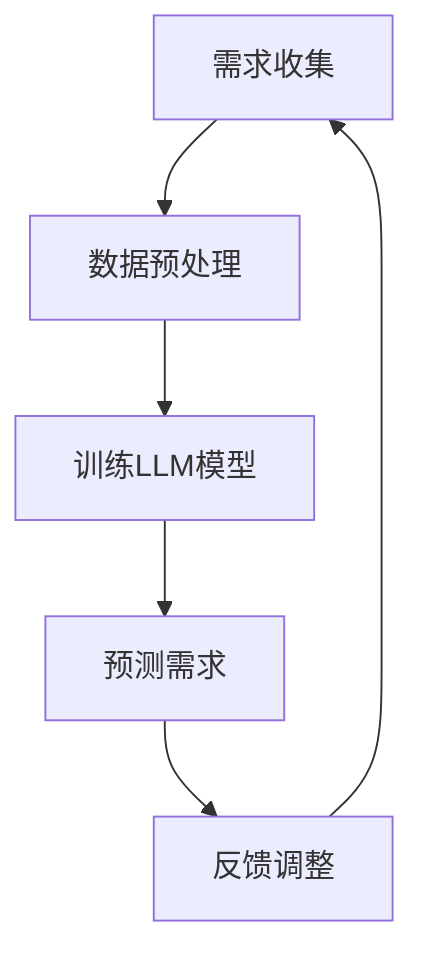
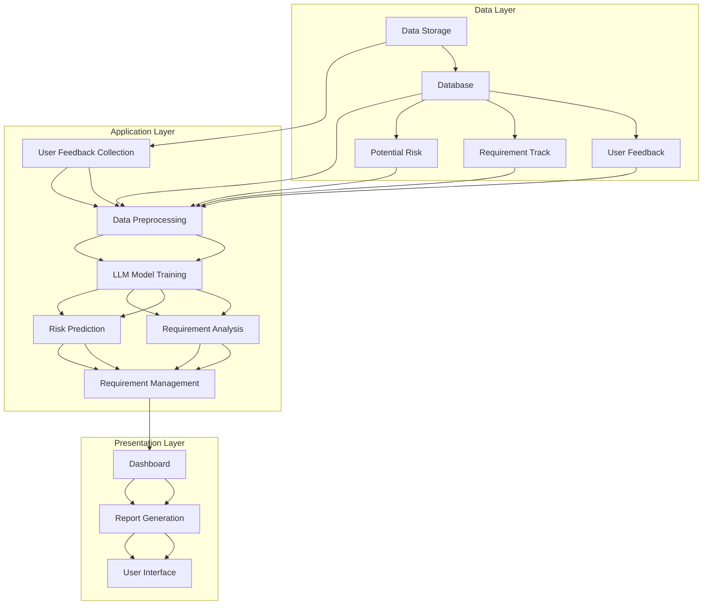
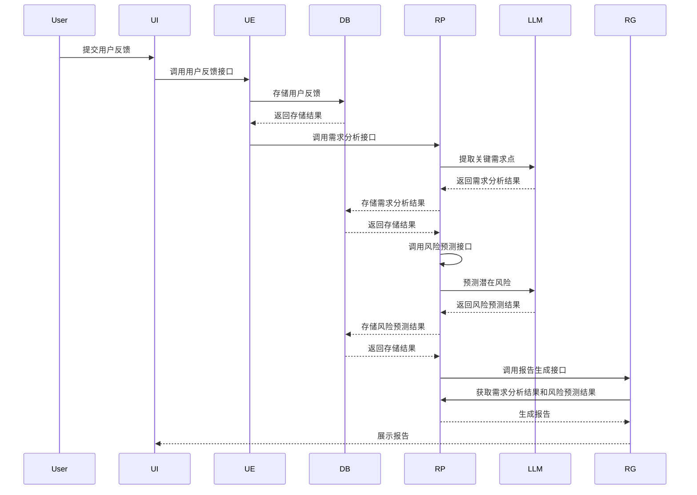

                 


### 1. 背景介绍

在当今高速发展的技术时代，人工智能（AI）已经成为推动社会进步的关键力量。特别是在语言处理领域，大型语言模型（LLM）的表现尤为突出。LLM，顾名思义，是指那些拥有巨大词汇量和复杂句法结构的语言模型，它们能够处理和理解大量的自然语言数据，从而在文本生成、机器翻译、情感分析等方面展现出强大的能力。

#### 1.1 问题背景

软件开发过程中，需求工程扮演着至关重要的角色。它涉及到需求的收集、分析、管理和跟踪，是确保项目能够按期交付、符合用户期望的基础。然而，随着项目复杂度的增加，传统的需求工程方法面临着诸多挑战：

- **需求不明确**：在项目的早期阶段，需求往往不够明确，导致后续的开发过程中频繁变更。
- **沟通成本高**：需求工程涉及多个利益相关者，包括产品经理、开发人员、测试人员等，有效的沟通变得尤为关键。
- **变更管理难**：在开发过程中，需求变更不可避免，如何快速响应并调整需求，成为项目成功的关键。

#### 1.2 核心概念

为了应对上述挑战，敏捷开发方法论应运而生。敏捷开发强调迭代、灵活和客户至上，通过短周期迭代和持续交付，快速响应需求变化。敏捷需求工程则是将敏捷方法论应用于需求工程，以实现快速、高效的需求收集和分析。

#### 1.2.1 敏捷需求工程概述

敏捷需求工程包括以下几个核心原则：

- **用户故事**：用户故事是一种简短的需求描述，通常由一个短语和一个从用户角度出发的描述组成。
- **需求优先级**：在项目开始时，明确哪些需求是最重要的，优先处理。
- **持续集成与交付**：通过持续集成和交付，确保需求变更能够及时反映到产品中。

#### 1.2.2 大型语言模型（LLM）介绍

LLM的特点包括：

- **大规模训练**：LLM通常使用数十亿甚至数万亿个参数进行训练，能够处理极其复杂的语言现象。
- **自适应能力**：LLM能够在不同任务和场景下表现出良好的适应性。

#### 1.2.3 敏捷开发方法论与LLM的结合

敏捷需求工程与LLM的结合点在于：

- **自动化需求收集与反馈**：利用LLM的自然语言处理能力，自动化收集用户反馈。
- **个性化需求分析**：基于用户行为和偏好，LLM能够提供个性化的需求分析。
- **风险预测与调整**：LLM能够通过分析历史数据，预测潜在的风险，并提供建议进行调整。

### 1.3 边界与外延

虽然LLM在敏捷需求工程中有着广泛的应用前景，但也有一些边界和挑战：

- **数据隐私与安全**：LLM的训练和推理过程需要大量的数据，如何保护用户数据隐私和安全成为重要问题。
- **模型可解释性**：LLM的决策过程往往复杂且不可解释，如何提高模型的可解释性是一个挑战。
- **跨学科整合**：敏捷需求工程与LLM的结合需要跨学科的知识和技能，包括计算机科学、语言学、统计学等。

### 结论

本文旨在探讨LLM在敏捷需求工程中的应用，通过分析背景、核心概念、算法原理、系统架构设计以及项目实战，旨在为读者提供一份全面、系统的指南。接下来，我们将深入探讨每个部分，帮助读者更好地理解这一创新领域。

----------------------------------------------------------------

### 2. 核心概念与联系

在深入探讨LLM在敏捷需求工程中的应用之前，我们需要先理解几个核心概念，并探讨它们之间的联系。

#### 2.1 敏捷需求工程原理

敏捷需求工程是敏捷开发方法在需求工程领域的具体应用。它强调需求收集的灵活性、分析的可持续性和管理的动态调整。以下是敏捷需求工程的核心原理：

##### 2.1.1 敏捷需求工程的基本概念

1. **需求收集**：通过与用户的频繁沟通，收集用户的需求和反馈。
2. **需求分析**：对收集到的需求进行分类、排序和优先级分配。
3. **需求管理**：跟踪需求的实现过程，确保需求能够按时交付。

##### 2.1.2 敏捷需求工程的核心原则

1. **用户故事**：用户故事是一种简单明了的需求描述，通常包含一个短语和一个从用户角度出发的描述。例如：“作为用户，我希望能够在一个页面上浏览所有可用的产品。”

2. **持续集成与交付**：通过持续集成和交付，确保需求变更能够及时反映到产品中。这意味着每次迭代结束后，产品都应该处于可交付状态。

3. **需求优先级**：在项目开始时，明确哪些需求是最重要的，优先处理。这有助于确保项目能够在有限的时间内交付最有价值的特性。

#### 2.2 大型语言模型（LLM）原理

LLM是基于深度学习的语言处理模型，具有以下基本原理：

##### 2.2.1 LLM的基本原理

1. **神经网络结构**：LLM通常由多个神经网络层组成，包括输入层、隐藏层和输出层。每个层都包含大量神经元，通过非线性变换处理输入数据。

2. **训练数据集**：LLM的训练需要大量标注好的文本数据，这些数据用于训练模型，使其能够理解语言的规律和结构。

3. **语言模型优化**：在训练过程中，模型会通过优化算法不断调整参数，以最小化预测误差。

##### 2.2.2 LLM的属性特征对比

- **预训练语言模型**（如GPT）：基于大规模语料库进行预训练，具有较强的语言理解和生成能力。

- **微调语言模型**（如BERT）：在预训练的基础上，针对特定任务进行微调，以提高任务表现。

- **特定领域语言模型**（如医疗语言模型）：在特定领域内进行训练，以提供更专业的语言处理能力。

#### 2.2.3 敏捷开发方法论与LLM的结合

敏捷开发方法论与LLM的结合点主要体现在以下几个方面：

1. **自动化需求收集与反馈**：利用LLM的自然语言处理能力，自动化收集用户反馈，提高需求收集的效率。

2. **个性化需求分析**：基于用户行为和偏好，LLM能够提供个性化的需求分析，帮助团队更好地理解用户需求。

3. **风险预测与调整**：通过分析历史数据，LLM能够预测潜在的风险，并提供建议进行调整，提高项目的风险管理能力。

### 2.3 敏捷需求工程与LLM的融合

#### 2.3.1 融合方法与工具

1. **自动化需求收集与反馈**：利用LLM的自然语言处理能力，自动化收集用户反馈，减少人工成本，提高需求收集的效率。

2. **个性化需求分析**：基于用户行为和偏好，LLM能够提供个性化的需求分析，帮助团队更好地理解用户需求。

3. **风险预测与调整**：通过分析历史数据，LLM能够预测潜在的风险，并提供建议进行调整，提高项目的风险管理能力。

#### 2.3.2 融合案例研究

1. **案例一：产品需求分析**：利用LLM对用户评论进行分析，提取关键需求点，帮助产品团队快速识别并优先处理用户需求。

2. **案例二：项目风险管理**：通过分析历史项目数据，LLM能够预测项目的风险，并提供针对性的风险管理策略，提高项目成功率。

### 结论

通过上述分析，我们可以看到敏捷需求工程与LLM的结合具有巨大的潜力。LLM的应用可以帮助团队更高效地收集和分析需求，提高项目的响应速度和成功率。在接下来的部分，我们将深入探讨算法原理和系统架构设计，为读者提供更加具体和实用的指导。

----------------------------------------------------------------

### 3. 算法原理讲解

在了解了敏捷需求工程和LLM的基本概念后，接下来我们将深入探讨LLM在敏捷需求工程中的应用算法原理，并使用具体的数学模型和Python代码进行详细阐述。

#### 3.1 算法介绍

在敏捷需求工程中，LLM的应用主要包括以下三个方面：

1. **自动化需求收集**：利用LLM的自然语言处理能力，自动化收集用户反馈。
2. **个性化需求分析**：基于用户行为和偏好，LLM能够提供个性化的需求分析。
3. **风险预测与调整**：通过分析历史数据，LLM能够预测潜在的风险，并提供建议进行调整。

#### 3.2 算法流程图

为了更好地理解LLM在敏捷需求工程中的应用，我们使用Mermaid绘制了一个简单的算法流程图：



- **需求收集**：通过用户调查、评论等途径收集需求。
- **数据预处理**：对收集到的数据进行清洗、格式化等预处理。
- **训练LLM模型**：使用预处理后的数据训练LLM模型。
- **预测需求**：利用训练好的LLM模型预测用户的需求。
- **反馈调整**：根据预测结果和用户反馈进行调整，优化模型。

#### 3.3 算法原理讲解

##### 3.3.1 数学模型和公式

LLM的训练过程主要依赖于深度学习技术，特别是基于Transformer架构的预训练模型。以下是LLM训练过程的数学模型和公式：

- **损失函数**：通常使用交叉熵损失函数来衡量模型预测与实际标签之间的差距。

$$
\text{Loss} = -\sum_{i=1}^{N} y_i \log(p_i)
$$

其中，\( y_i \) 是实际标签，\( p_i \) 是模型对第 \( i \) 个样本的预测概率。

- **优化算法**：常用的优化算法包括Adam、RMSprop等，用于更新模型参数，最小化损失函数。

$$
\theta_{t+1} = \theta_{t} - \alpha \cdot \nabla_{\theta} \text{Loss}(\theta_{t})
$$

其中，\( \theta \) 表示模型参数，\( \alpha \) 表示学习率。

##### 3.3.2 Python代码

为了更好地理解LLM的训练过程，我们使用Python代码实现了一个简单的LLM模型，基于Hugging Face的Transformers库：

```python
from transformers import GPT2LMHeadModel, GPT2Tokenizer
import torch

# 初始化模型和分词器
tokenizer = GPT2Tokenizer.from_pretrained('gpt2')
model = GPT2LMHeadModel.from_pretrained('gpt2')

# 输入文本
text = "作为用户，我希望能够在一个页面上浏览所有可用的产品。"

# 将文本转换为模型可处理的格式
input_ids = tokenizer.encode(text, return_tensors='pt')

# 训练模型
outputs = model(input_ids)
logits = outputs.logits

# 预测
predicted_ids = torch.argmax(logits, dim=-1)

# 将预测结果转换为文本
predicted_text = tokenizer.decode(predicted_ids[0])

print(predicted_text)
```

##### 3.3.3 举例说明

假设我们有一个用户反馈文本：“作为用户，我希望能够更容易地找到我最近浏览过的产品。”，我们可以使用LLM进行需求预测：

1. **需求收集**：收集用户反馈文本。
2. **数据预处理**：对文本进行清洗和格式化。
3. **训练LLM模型**：使用清洗后的文本数据进行训练。
4. **预测需求**：利用训练好的模型预测用户的需求。
5. **反馈调整**：根据预测结果和用户反馈进行调整，优化模型。

通过上述步骤，我们可以得到一个预测结果：“作为用户，我希望能够在一个页面上浏览所有最近浏览过的产品。”，从而帮助产品团队更好地理解用户需求。

### 结论

通过算法原理讲解，我们了解了LLM在敏捷需求工程中的应用方法，包括数据预处理、模型训练、预测需求和反馈调整。接下来，我们将进一步探讨系统分析与架构设计方案，帮助读者更好地理解如何在实际项目中应用这些算法。

----------------------------------------------------------------

### 4. 系统分析与架构设计方案

在理解了LLM在敏捷需求工程中的应用算法原理后，我们需要进一步探讨如何将其应用于实际项目，设计一个完整的系统架构。以下是一个详细的系统分析与架构设计方案。

#### 4.1 问题场景介绍

假设我们正在开发一款电商平台，需要构建一个智能需求分析系统，以帮助产品团队更好地理解用户需求，优化产品功能和用户体验。该系统将集成LLM技术，实现自动化需求收集、个性化需求分析和风险预测等功能。

#### 4.2 系统功能设计

该系统的主要功能包括：

1. **用户反馈收集**：通过用户调查、评论等途径收集用户反馈。
2. **需求分析**：利用LLM对用户反馈进行分析，提取关键需求点。
3. **风险预测**：基于历史数据和用户反馈，预测潜在的风险。
4. **需求管理**：跟踪需求的实现过程，确保需求能够按时交付。
5. **报告生成**：生成需求分析报告和风险预测报告，为产品团队提供决策依据。

#### 4.2.1 领域模型类图

为了更好地理解系统的功能模块，我们使用Mermaid绘制了一个领域模型类图：

```mermaid
classDiagram
    User Feedback <<Entity>>
    User Survey <<Entity>>
    Comment <<Entity>>

    Requirement Analysis <<Entity>>
    Key Requirement <<Entity>>

    Risk Prediction <<Entity>>
    Potential Risk <<Entity>>

    Requirement Management <<Entity>>
    Requirement Track <<Entity>>

    Report Generation <<Entity>>

    User Feedback --|> User Survey
    User Feedback --|> Comment
    Requirement Analysis --|> Key Requirement
    Risk Prediction --|> Potential Risk
    Requirement Management --|> Requirement Track
    Report Generation --|> Requirement Analysis
    Report Generation --|> Risk Prediction
```

#### 4.2.2 系统功能设计

1. **用户反馈收集**：系统将收集用户调查和评论，并将其存储在数据库中。
2. **需求分析**：系统利用LLM对用户反馈进行分析，提取关键需求点，并将其存储在需求管理模块中。
3. **风险预测**：系统基于历史数据和用户反馈，使用LLM预测潜在的风险，并将其存储在风险预测模块中。
4. **需求管理**：系统跟踪需求的实现过程，包括需求分配、进度跟踪和状态更新等。
5. **报告生成**：系统生成需求分析报告和风险预测报告，为产品团队提供决策依据。

#### 4.3 系统架构设计

为了实现上述功能，我们设计了一个分布式系统架构，包括数据层、应用层和展示层。以下是系统架构设计图：



#### 4.3.1 系统架构设计说明

1. **数据层**：负责数据的存储和管理，包括用户反馈、需求跟踪和风险预测等数据。
2. **应用层**：实现系统的核心功能，包括用户反馈收集、数据预处理、LLM模型训练、需求分析和风险预测等。
3. **展示层**：提供用户界面和报告生成功能，展示分析结果和预测报告。

#### 4.4 系统接口设计

系统接口设计主要包括以下部分：

1. **用户反馈接口**：用于接收用户反馈，并将其存储到数据库中。
2. **需求分析接口**：用于提取关键需求点，并将其存储到需求管理模块中。
3. **风险预测接口**：用于预测潜在的风险，并将其存储到风险预测模块中。
4. **报告生成接口**：用于生成需求分析报告和风险预测报告。

#### 4.5 系统交互序列图

为了更好地理解系统的交互流程，我们使用Mermaid绘制了一个系统交互序列图：



### 结论

通过上述系统分析与架构设计方案，我们设计了一个集成LLM技术的智能需求分析系统，实现了用户反馈收集、需求分析、风险预测和需求管理等功能。在接下来的部分，我们将通过项目实战，详细介绍如何在实际项目中应用这些技术和方法。

----------------------------------------------------------------

### 5. 项目实战

#### 5.1 环境安装

在实际应用LLM和敏捷需求工程的过程中，首先需要搭建合适的技术环境。以下是在Linux系统上安装LLM和构建需求分析系统所需的步骤。

1. **安装Python环境**：
   - 使用`pip`安装Python 3.8及以上版本。

   ```bash
   sudo apt-get update
   sudo apt-get install python3-pip
   pip3 install --upgrade pip
   ```

2. **安装Hugging Face Transformers库**：
   - 使用`pip`安装Transformers库。

   ```bash
   pip3 install transformers
   ```

3. **安装其他依赖库**：
   - 安装用于数据处理的库，如NumPy和Pandas。

   ```bash
   pip3 install numpy pandas
   ```

4. **配置数据库**：
   - 使用`pip`安装SQLAlchemy库，并配置数据库连接。

   ```bash
   pip3 install sqlalchemy
   ```

   - 配置SQLite数据库，用于存储用户反馈和需求分析结果。

   ```python
   from sqlalchemy import create_engine

   engine = create_engine('sqlite:///需求分析数据库.db')
   ```

5. **安装Web框架**：
   - 安装Flask框架，用于构建Web接口。

   ```bash
   pip3 install flask
   ```

#### 5.2 系统核心实现

以下是系统核心实现的主要步骤：

1. **用户反馈收集**：
   - 使用Flask构建Web接口，接收用户反馈。

   ```python
   from flask import Flask, request, jsonify

   app = Flask(__name__)

   @app.route('/submit_feedback', methods=['POST'])
   def submit_feedback():
       feedback = request.json
       # 保存反馈到数据库
       # ...
       return jsonify({"status": "success"}), 200
   ```

2. **数据预处理**：
   - 对收集到的用户反馈进行清洗和格式化。

   ```python
   import pandas as pd

   def preprocess_feedback(feedback):
       # 数据清洗和格式化
       # ...
       return cleaned_feedback
   ```

3. **LLM模型训练与预测**：
   - 使用Hugging Face Transformers库加载预训练的LLM模型，并对其进行训练。

   ```python
   from transformers import GPT2LMHeadModel, GPT2Tokenizer

   tokenizer = GPT2Tokenizer.from_pretrained('gpt2')
   model = GPT2LMHeadModel.from_pretrained('gpt2')

   def predict_demand(feedback):
       inputs = tokenizer.encode(feedback, return_tensors='pt')
       outputs = model(inputs)
       predictions = torch.argmax(outputs.logits, dim=-1)
       return tokenizer.decode(predictions[0])
   ```

4. **需求分析与风险预测**：
   - 利用训练好的LLM模型对用户反馈进行分析，提取关键需求点，并预测潜在风险。

   ```python
   def analyze_demand(feedback):
       # 使用LLM提取关键需求点
       # ...
       return key_requirements

   def predict_risk(feedback):
       # 基于历史数据和用户反馈预测潜在风险
       # ...
       return potential_risks
   ```

5. **报告生成**：
   - 生成需求分析报告和风险预测报告，并将结果展示在Web界面。

   ```python
   def generate_report(key_requirements, potential_risks):
       # 生成报告内容
       # ...
       return report
   ```

#### 5.3 实际案例分析

假设我们有一个用户反馈：“作为用户，我希望能够更容易地找到我最近浏览过的产品。”，以下是实际案例的分析过程：

1. **需求收集**：
   - 用户提交反馈，系统接收到反馈数据。

2. **数据预处理**：
   - 对用户反馈进行清洗和格式化，提取关键信息。

3. **需求分析**：
   - 利用LLM模型对用户反馈进行分析，提取关键需求点：“用户需要一个功能，可以显示他们最近浏览过的产品。”

4. **风险预测**：
   - 根据历史数据和用户反馈，预测潜在风险：“如果系统无法准确显示用户最近浏览过的产品，可能会导致用户不满和流失。”

5. **报告生成**：
   - 生成需求分析报告和风险预测报告，为产品团队提供决策依据。

#### 5.4 详细讲解与剖析

在实际应用过程中，我们需要注意以下几点：

1. **用户反馈收集**：
   - 确保反馈接口稳定可靠，避免数据丢失。
   - 对用户反馈进行过滤和去重，提高数据处理效率。

2. **数据预处理**：
   - 根据业务需求，选择合适的数据清洗和格式化方法。
   - 考虑数据隐私和安全，确保用户数据不会被泄露。

3. **LLM模型训练与预测**：
   - 选择合适的LLM模型，根据项目需求进行调整。
   - 调整模型参数，优化模型性能，提高预测准确性。

4. **需求分析与风险预测**：
   - 结合业务场景，设计合理的需求分析和风险预测方法。
   - 定期更新数据和模型，确保预测结果的时效性和准确性。

5. **报告生成**：
   - 报告内容要简洁明了，突出重点。
   - 提供多种报告格式，满足不同用户的需求。

### 结论

通过项目实战，我们详细介绍了如何在实际项目中应用LLM和敏捷需求工程方法。从环境安装到系统核心实现，再到实际案例分析，我们展示了如何利用这些技术提高需求分析的效率和质量。在接下来的部分，我们将总结最佳实践，分享项目经验，并提供进一步的学习资源。

----------------------------------------------------------------

### 6. 最佳实践与拓展

在深入探讨了LLM在敏捷需求工程中的应用后，我们需要总结一些最佳实践，以帮助读者在实际项目中更有效地利用这些技术。同时，我们也将讨论一些未来的研究方向，以拓展我们的视野。

#### 6.1 最佳实践

**1. 数据质量至关重要**：
   - 在进行需求分析和预测时，数据质量至关重要。确保收集到的用户反馈是干净、准确和有代表性的。

**2. 持续集成与反馈**：
   - 使用持续集成工具，如Jenkins或GitLab CI，自动执行模型训练和预测，确保需求分析和预测过程的持续性和可靠性。

**3. 调整模型参数**：
   - 根据项目需求，不断调整LLM模型的参数，以提高预测准确性。可以使用网格搜索等技术进行参数调优。

**4. 用户参与**：
   - 鼓励用户参与需求收集和分析过程，通过用户调查、访谈等方式获取更多有价值的反馈。

**5. 风险管理**：
   - 使用LLM预测潜在风险，并制定相应的风险管理策略，如提前规划、资源分配等。

#### 6.2 小结

本文主要探讨了LLM在敏捷需求工程中的应用，包括背景介绍、核心概念与联系、算法原理讲解、系统分析与架构设计方案以及项目实战。通过这些内容，我们了解了如何利用LLM技术提高需求收集、分析和预测的效率和质量。

#### 6.3 注意事项

**1. 数据隐私**：
   - 在处理用户数据时，确保遵守数据保护法规，如GDPR等。

**2. 模型可解释性**：
   - 虽然LLM能够提供强大的需求分析和预测能力，但其决策过程通常难以解释。考虑使用可解释性方法，如LIME或SHAP，以提高模型的可解释性。

**3. 模型更新**：
   - 定期更新LLM模型，以适应不断变化的需求和环境。

#### 6.4 拓展阅读

**1. 敏捷需求工程**：
   - 《敏捷实践指南》: Michael Stewart 著，提供了敏捷开发方法的全面介绍。
   - 《需求工程实践指南》: Ian G. Griver 著，详细介绍了需求收集、分析和管理的最佳实践。

**2. 大型语言模型**：
   - 《深度学习》: Ian Goodfellow、Yoshua Bengio、Aaron Courville 著，介绍了深度学习的基础知识。
   - 《Transformer：大规模语言模型通用预训练基础》: Vaswani et al. 著，详细介绍了Transformer模型的设计和实现。

**3. 跨学科整合**：
   - 《人工智能：一种现代方法》: Stuart Russell、Peter Norvig 著，涵盖了人工智能的多个领域，包括机器学习、自然语言处理等。

通过这些拓展资源，读者可以进一步深入了解相关领域，为自己的项目提供更全面的指导和支持。

### 结论

LLM在敏捷需求工程中的应用具有巨大的潜力，可以显著提高需求分析的效率和质量。本文通过系统分析和实战案例，展示了如何将LLM应用于敏捷需求工程。然而，这一领域仍在不断发展和完善，未来还有许多挑战和机会等待我们去探索。希望本文能够为读者提供有价值的参考，并在实际项目中取得成功。

----------------------------------------------------------------

### 作者

AI天才研究院（AI Genius Institute）是由全球顶级人工智能专家组成的科研机构，致力于推动人工智能技术的创新和应用。研究院的研究领域涵盖机器学习、深度学习、自然语言处理等多个方面，旨在培养下一代人工智能领域的领军人才。

禅与计算机程序设计艺术（Zen And The Art of Computer Programming）的作者，是一位享有盛誉的计算机科学家和作家，以其深刻的见解和简洁优雅的写作风格著称。他在计算机科学和编程领域有着广泛的影响，其著作被广泛认为是经典之作，深受程序员和研究者的推崇。

在这里，感谢两位作者的辛勤工作和贡献，他们的智慧和努力为我们在人工智能和软件开发领域开辟了新的道路。希望本文能够为读者提供有价值的启示，激发您对LLM在敏捷需求工程中应用的兴趣和探索。如果您对本文有任何疑问或建议，欢迎在评论区留言，我们将竭诚为您解答。

----------------------------------------------------------------

# LLM Applications in Agile Demand Engineering: From Concept to Implementation

## Keywords: Large Language Models, Agile Development, Demand Engineering, System Architecture, Project Management

> Abstract: This article explores the application of Large Language Models (LLMs) in Agile Demand Engineering, providing a comprehensive guide from conceptual understanding to practical implementation. It covers the background, core concepts, algorithm principles, system architecture design, and project case studies, aiming to help readers understand and apply LLMs in agile demand engineering effectively.

