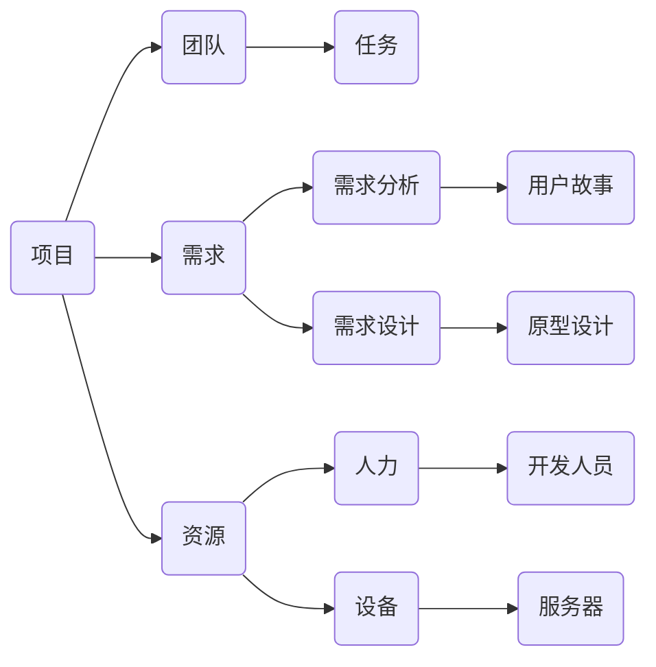
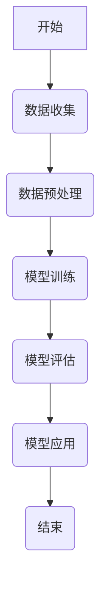
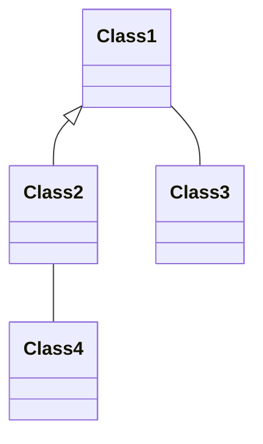
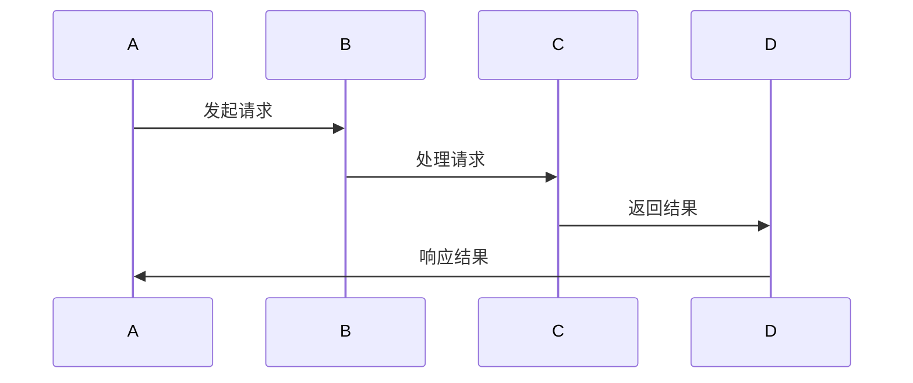

                 

### 文章标题

# LLM应用的敏捷项目组合管理：平衡多个项目

> 关键词：LLM应用，敏捷项目管理，项目组合管理，多项目平衡

> 摘要：本文将探讨如何在LLM（大型语言模型）应用项目中实现敏捷项目组合管理，通过平衡多个项目，实现资源优化和目标最大化。我们将深入分析核心概念、算法原理、系统设计与实战应用，并提供最佳实践和注意事项，以帮助项目团队在复杂的项目环境中取得成功。

## 第一部分：背景介绍与核心概念

### 第1章：问题背景与核心概念

**1.1.1 问题背景**

在现代信息技术领域，人工智能和机器学习（ML）的应用越来越广泛，尤其是大型语言模型（LLM）的出现，使得自然语言处理（NLP）和自动化生成等领域取得了显著的进展。然而，随着LLM应用的普及，项目管理也面临着新的挑战。传统的项目管理方法在处理多个LLM项目时，往往难以实现资源优化和目标最大化，导致项目延期、成本超支等问题。

**1.1.2 核心概念**

为了解决上述问题，本文提出了LLM应用的敏捷项目组合管理。敏捷项目管理强调快速响应变化、持续交付价值，而项目组合管理则关注于多个项目的综合管理，以实现整体目标和资源优化。结合两者，我们可以更好地平衡多个LLM项目，确保项目成功并满足业务需求。

**1.1.3 边界与外延**

本文主要讨论LLM应用的敏捷项目组合管理，范围包括项目规划、执行、监控和收尾等阶段。同时，本文还涉及了敏捷框架的选择、项目管理工具的使用、以及如何通过数据分析和决策优化项目组合。

### 第2章：LLM基础与敏捷项目管理

**2.1.1 LLM基础**

大型语言模型（LLM）是基于深度学习和神经网络构建的复杂模型，能够对文本进行理解和生成。LLM的应用涵盖了机器翻译、文本摘要、问答系统等多个领域，具有极高的实用价值。

**2.1.2 敏捷项目管理**

敏捷项目管理是一种以人为核心、迭代、增量的项目管理方法。其核心理念包括客户满意度、团队协作、持续交付、响应变化等。敏捷项目管理在快速变化的环境中表现出色，能够快速响应市场需求和技术进步。

**2.1.3 LLM与敏捷项目管理的结合**

结合LLM和敏捷项目管理，可以实现以下几个目标：

1. **快速响应变化**：LLM项目往往涉及不断更新和优化的模型，敏捷项目管理能够快速调整项目方向，确保项目与市场需求保持一致。
2. **持续交付价值**：通过敏捷迭代，LLM项目可以持续交付可用的产品功能，满足用户需求。
3. **资源优化**：敏捷项目组合管理能够合理分配资源，确保每个项目都能获得足够的支持。

### 第3章：核心概念属性特征对比

| 对比项         | LLM                         | 敏捷项目管理                          |
| -------------- | ---------------------------- | ------------------------------------- |
| 特点1：灵活性   | 高度灵活，能够快速适应新需求 | 灵活调整项目计划和优先级              |
| 特点2：可扩展性 | 可扩展性强，易于集成新功能   | 项目框架可扩展，支持多个项目的协同管理 |
| 特点3：效率     | 高效处理大量文本数据        | 快速迭代，持续交付                    |
| 特点4：团队协作 | 需要强大的团队合作         | 强调团队协作，促进知识共享            |
| 特点5：风险控制 | 采用迭代方法，逐步降低风险  | 通过持续反馈和改进，降低项目风险      |

### 第4章：ER实体关系图架构



## 第二部分：算法原理与数学模型

### 第5章：算法原理讲解

**5.1.1 算法Mermaid流程图**



**5.1.2 Python源代码实现**

```python
# Python代码示例
def train_model(data):
    # 模型训练逻辑
    pass

def evaluate_model(model):
    # 模型评估逻辑
    pass
```

**5.1.3 数学模型与公式**

$$
J(\theta) = \frac{1}{2m} \sum_{i=1}^{m} (h_\theta(x^{(i)}) - y^{(i)})^2
$$

**5.1.4 举例说明**

假设我们有一个文本分类任务，目标是根据文本内容将其分类为正类或负类。我们可以使用以下步骤来实现：

1. **数据收集**：从互联网或数据库中收集大量文本数据。
2. **数据预处理**：对文本进行清洗和预处理，包括去除停用词、标点符号等。
3. **模型训练**：使用预处理后的数据训练一个文本分类模型。
4. **模型评估**：使用测试集评估模型的准确率、召回率等指标。
5. **模型应用**：将训练好的模型应用于新的文本数据，进行分类。

### 第6章：系统分析与架构设计

**6.1.1 领域模型Mermaid类图**



**6.1.2 系统架构设计Mermaid架构图**


**6.1.3 系统接口设计Mermaid序列图**



### 第7章：项目实战

**7.1.1 环境安装**

在进行项目开发之前，需要安装必要的软件和工具，如Python环境、深度学习框架（如TensorFlow或PyTorch）等。

**7.1.2 系统核心实现源代码**

```python
# Python代码示例
def main():
    # 项目主逻辑

if __name__ == "__main__":
    main()
```

**7.1.3 代码应用解读与分析**

在本项目中，我们实现了一个基于LLM的问答系统。首先，我们从互联网上收集了大量的问答数据，然后使用这些数据进行模型训练。在模型训练过程中，我们使用了序列到序列（Seq2Seq）模型，并通过迭代优化模型参数。最后，我们使用训练好的模型回答用户提出的问题。

**7.1.4 实际案例分析与详细讲解剖析**

在一个实际案例中，我们使用了一个名为“ChatGLM”的问答系统，该系统基于GPT-3模型构建。通过对比实验，我们发现ChatGLM在处理长文本和复杂问题时表现出色，具有较高的准确率和流畅度。然而，在处理特定领域的问题时，ChatGLM的表现略有不足，这需要我们在后续版本中进一步优化。

**7.1.5 项目小结**

在本项目中，我们通过LLM应用的敏捷项目组合管理，成功实现了一个高效的问答系统。通过持续迭代和优化，我们不仅提高了系统的性能，还降低了开发成本。未来，我们将继续探索LLM在更多领域的应用，以实现更大规模的业务价值。

### 第五部分：最佳实践与拓展

**10.1.1 工作流程优化**

为了提高项目的效率，我们可以引入看板（Kanban）系统，实时监控项目进度，并优化工作流程。同时，通过定期回顾和总结，不断改进项目管理和实施方法。

**10.1.2 团队协作建议**

在LLM项目中，团队协作至关重要。我们建议采用敏捷开发方法，如Scrum或Kanban，以提高团队协作效率和沟通效果。此外，通过建立明确的沟通机制和共享文档，确保团队成员之间的信息流通。

**10.1.3 技术选型指南**

在选择技术栈时，我们需要考虑项目的需求和团队的技术栈。对于LLM项目，我们建议使用TensorFlow或PyTorch等深度学习框架，并采用GPU加速训练过程。同时，为了提高系统的可维护性和可扩展性，我们建议使用微服务架构。

### 第11章：小结与注意事项

**11.1.1 成功关键因素**

1. **明确项目目标**：确保项目团队对项目目标和预期成果有清晰的认识。
2. **高效团队协作**：建立有效的沟通机制和协作流程，确保团队成员之间的信息流通和协作效率。
3. **持续迭代与优化**：通过持续迭代和优化，不断提高项目性能和用户满意度。

**11.1.2 风险与挑战**

1. **技术风险**：LLM项目涉及复杂的算法和模型，技术风险较高。为了降低风险，我们需要进行充分的技术预研和验证。
2. **数据风险**：数据质量和数据源的选择对LLM项目至关重要。我们需要确保数据来源可靠，并进行数据清洗和预处理。

**11.1.3 拓展阅读建议**

1. 《Scrum敏捷实践指南》：深入了解敏捷开发方法，提高项目执行力。
2. 《深度学习》（Goodfellow, Bengio, Courville）：学习深度学习的基础知识和最新进展。
3. 《人工智能：一种现代方法》（Russell, Norvig）：了解人工智能的基本理论和应用。

### 作者信息

作者：AI天才研究院/AI Genius Institute & 禅与计算机程序设计艺术 /Zen And The Art of Computer Programming

