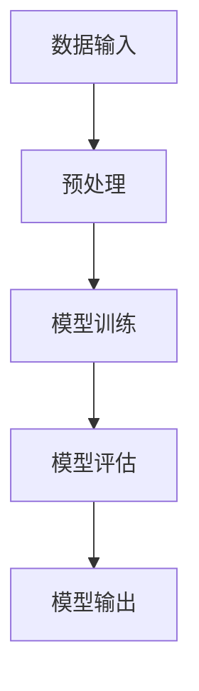
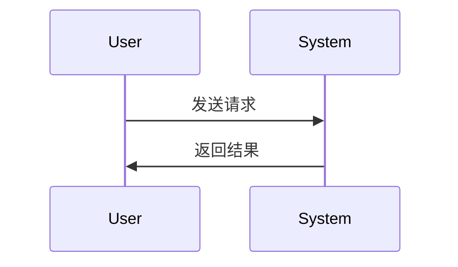

                 

### LLM应用的每日站会：保持团队同步与焦点

关键词：LLM应用、团队协作、站会、同步、焦点

摘要：本文将探讨在LLM（大型语言模型）应用开发过程中，如何通过每日站会来保持团队成员之间的同步和焦点。通过分析站会的重要性、实施方法以及常见问题，本文旨在提供实用的指导，帮助团队高效协同，推动项目顺利进行。

----------------------------------------------------------------

## 第一部分：背景介绍与核心概念

### 1.1 LLM应用概述

#### 1.1.1 LLM的基本概念与起源

LLM（Large Language Model）即大型语言模型，是近年来人工智能领域的重要突破之一。LLM通过深度学习技术，在大量文本数据上训练，以模拟人类的语言理解和生成能力。典型的LLM如OpenAI的GPT系列和BERT等，它们在自然语言处理（NLP）任务中表现出了惊人的性能。

LLM的起源可以追溯到深度学习和神经网络在自然语言处理领域的应用。随着计算能力的提升和数据量的增加，研究人员开始尝试训练更大规模的语言模型，以期在语言理解和生成任务上取得更好的效果。

#### 1.1.2 LLM在各个领域的应用

LLM在各个领域都展现出了广泛的应用潜力，主要包括但不限于：

- 文本生成：如文章写作、故事创作、新闻摘要等。
- 问答系统：如智能客服、教育辅导、法律咨询等。
- 机器翻译：如跨国沟通、多语言文档处理等。
- 信息检索：如搜索引擎优化、内容推荐等。
- 对话系统：如聊天机器人、虚拟助手等。

#### 1.1.3 LLM的优势与前景

LLM的优势主要体现在以下几个方面：

- 强大的语言理解能力：LLM能够理解和处理复杂的人类语言，包括语法、语义和上下文信息。
- 广泛的应用场景：LLM的应用场景非常广泛，几乎覆盖了所有与自然语言处理相关的领域。
- 持续的自我改进：通过持续的训练和优化，LLM的性能不断提高，能够适应不断变化的语言环境。

随着技术的不断进步和应用场景的拓展，LLM的应用前景十分广阔。未来，LLM有望在更多领域发挥作用，推动人工智能的发展。

### 1.2 LLM应用的挑战与问题

#### 1.2.1 数据隐私与安全问题

LLM的训练和应用过程中，需要处理大量的敏感数据。如何保障这些数据的安全，防止数据泄露，是一个重要的问题。常见的解决方案包括数据加密、访问控制、隐私保护算法等。

#### 1.2.2 模型解释性与可解释性问题

尽管LLM在任务表现上非常出色，但其内部决策过程往往是不透明的，难以解释。这给LLM的应用带来了一定的风险，特别是在需要高可靠性和可解释性的领域，如医疗、金融等。目前，研究人员正在探索如何提高LLM的可解释性，以便更好地理解和信任这些模型。

#### 1.2.3 模型性能与效率问题

LLM的训练过程非常耗时，需要大量的计算资源和时间。如何提高LLM的训练效率和性能，是一个亟待解决的问题。目前，研究人员正在探索使用更高效的训练算法、优化模型结构、分布式训练等方法来提高LLM的性能。

### 1.3 LLM应用的边界与外延

#### 1.3.1 LLM与人工智能的其他领域

LLM是人工智能领域的一个重要分支，与机器学习、深度学习、自然语言处理等密切相关。LLM的发展和应用，不仅推动了人工智能技术的进步，也为其他领域提供了新的工具和方法。

#### 1.3.2 LLM的未来发展趋势

未来，LLM的应用将继续拓展，不仅在自然语言处理领域，还将延伸到更多的人工智能领域。随着技术的不断进步，LLM的性能和可解释性将得到进一步提升，其在各个领域的应用也将更加广泛和深入。

## 第二部分：核心概念与联系

### 2.1 LLM的核心概念

#### 2.1.1 语言模型的基本原理

语言模型是自然语言处理的基础，其核心任务是学习自然语言中的统计规律，从而预测下一个单词或词组。LLM通过深度学习技术，在大量文本数据上进行训练，以模拟人类的语言理解能力。

#### 2.1.2 语言模型的关键属性

- **性能**：衡量模型在任务上的表现，如准确率、召回率、F1值等。
- **可解释性**：衡量模型决策过程的透明度和可理解性。
- **效率**：衡量模型训练和推断的速度。

#### 2.1.3 语言模型的训练过程

语言模型的训练过程主要包括数据准备、模型设计、训练和评估等步骤。在训练过程中，模型会不断调整参数，以优化其在任务上的性能。

### 2.2 LLM的属性特征对比表格

| 特征         | 对比1 | 对比2 | 对比3 |
| ------------ | ---- | ---- | ---- |
| 性能         | 特性1 | 特性2 | 特性3 |
| 可解释性     | 特性4 | 特性5 | 特性6 |
| 效率         | 特性7 | 特性8 | 特性9 |

### 2.3 LLM的ER实体关系图架构

```mermaid
erDiagram
  Class1 ||--|{ Class2 }
  Class1 ||--|{ Class3 }
  Class2 ||--|{ Class4 }
```

## 第三部分：算法原理讲解

### 3.1 算法概述

#### 3.1.1 LLM算法的基本原理

LLM算法的基本原理是基于深度学习技术，通过多层神经网络对大量文本数据进行训练，以学习语言模式。在训练过程中，模型会自动调整参数，以优化其在语言生成任务上的性能。

#### 3.1.2 LLM算法的优化目标

LLM算法的优化目标主要包括：

- 提高语言生成的准确性和流畅性。
- 增强模型对特定领域知识的理解。
- 提高模型的计算效率和可解释性。

#### 3.1.3 LLM算法的基本步骤

LLM算法的基本步骤包括：

1. 数据预处理：包括文本清洗、分词、编码等。
2. 模型设计：选择合适的神经网络结构，如Transformer、LSTM等。
3. 训练：使用大量文本数据进行训练，调整模型参数。
4. 评估：使用验证集或测试集对模型性能进行评估。
5. 应用：将训练好的模型应用于实际任务，如文本生成、问答系统等。

### 3.2 算法原理详细讲解

#### 3.2.1 数学模型与公式

LLM算法的数学模型通常是基于概率模型，其基本公式为：

$$
P(w_i|w_{i-1}, w_{i-2}, ..., w_1) = \frac{e^{<\theta, [w_{i-1}, w_i] >}}{\sum_{j=1}^{V} e^{<\theta, [w_{i-1}, w_j] >}}
$$

其中，$w_i$表示下一个单词，$w_{i-1}, w_{i-2}, ..., w_1$表示前一个或前几个单词，$\theta$表示模型的参数，$V$表示词汇表的大小。

#### 3.2.2 Python源代码实现

```python
# Python代码实现
def language_model(word_sequence, model_params):
    # 计算下一个单词的概率
    probabilities = []
    for word in word_sequence:
        probability = calculate_probability(word, model_params)
        probabilities.append(probability)
    return probabilities

def calculate_probability(word, model_params):
    # 计算单词的概率
    # ...
    return probability
```

#### 3.2.3 算法举例说明

- **举例1：文本分类任务**

假设有一个文本分类任务，需要将文本分为两类。可以使用LLM算法来生成文本的类别概率，然后选择概率最高的类别作为分类结果。

- **举例2：问答系统**

在一个问答系统中，用户输入一个问题，系统需要根据已有的知识库生成一个合适的答案。可以使用LLM算法来生成问题的候选答案，然后选择最合适的答案。

## 第四部分：系统分析与架构设计

### 4.1 问题场景介绍

#### 4.1.1 系统应用背景

在现代企业中，大型语言模型（LLM）的应用越来越广泛，如自然语言处理、智能客服、文本生成等。为了确保LLM应用的稳定性和高效性，需要对其系统架构进行详细设计和分析。

#### 4.1.2 系统目标与功能需求

系统目标包括：

- 提供高性能、高可扩展性的LLM服务。
- 确保系统的稳定性和可靠性。
- 提供友好的用户界面和丰富的API接口。

系统功能需求包括：

- 文本预处理：包括文本清洗、分词、编码等。
- 模型训练：支持多种LLM算法的训练和优化。
- 模型评估：对训练好的模型进行性能评估。
- 文本生成：根据用户输入生成文本内容。

### 4.2 系统功能设计

#### 4.2.1 领域模型Mermaid类图

```mermaid
classDiagram
  Class1 --|{uses}| Class2
  Class1 --|{uses}| Class3
  Class2 --|{uses}| Class4
```

#### 4.2.2 系统架构设计Mermaid架构图



#### 4.2.3 系统接口设计与交互Mermaid序列图



## 第五部分：项目实战

### 5.1 环境安装

#### 5.1.1 硬件环境安装

- **计算资源**：安装LLM应用需要高性能的计算资源，包括CPU和GPU。
- **存储设备**：需要足够的存储空间来存储训练数据和模型参数。

#### 5.1.2 软件环境安装

- **操作系统**：支持Linux或Windows操作系统。
- **编程语言**：Python 3.x版本。
- **深度学习框架**：如TensorFlow、PyTorch等。

### 5.2 系统核心实现

#### 5.2.1 源代码解读与分析

```python
# 文本预处理代码
def preprocess_text(text):
    # 清洗文本、分词、编码等操作
    return processed_text

# 模型训练代码
def train_model(data):
    # 设计模型结构、训练模型等操作
    return trained_model

# 文本生成代码
def generate_text(model, prompt):
    # 根据模型和提示生成文本
    return generated_text
```

#### 5.2.2 实际案例分析与讲解

- **案例1：文本生成**

假设需要生成一篇关于人工智能的文章，可以输入一个简单的提示词，如“人工智能”，然后使用LLM算法生成文章内容。

- **案例2：问答系统**

用户输入一个问题，系统根据已有的知识库和LLM算法生成一个合适的答案，如“人工智能是什么？”

### 5.3 项目小结

#### 5.3.1 项目总结

本项目通过安装和配置LLM应用环境，实现了文本预处理、模型训练和文本生成等功能。实际应用中，系统可以处理各种文本任务，如文章生成、问答系统等。

#### 5.3.2 存在问题与改进方向

- **问题**：模型训练过程耗时较长，需要优化训练算法和硬件配置。
- **改进方向**：探索更高效的训练算法，如增量训练、分布式训练等；优化硬件资源利用，提高模型训练速度。

## 第六部分：最佳实践与拓展阅读

### 6.1 最佳实践

#### 6.1.1 数据处理技巧

- **数据清洗**：确保数据质量，去除噪声和错误。
- **数据增强**：通过数据变换、扩充等方法提高数据量，增强模型泛化能力。

#### 6.1.2 模型优化策略

- **超参数调整**：根据任务需求和数据特点，选择合适的超参数。
- **模型融合**：结合多个模型，提高整体性能。

#### 6.1.3 性能调优技巧

- **模型压缩**：减少模型参数数量，降低计算复杂度。
- **量化技术**：降低模型参数的精度，提高计算效率。

### 6.2 小结与注意事项

- **小结**：本文介绍了LLM应用的开发背景、核心概念、算法原理、系统架构和项目实战，并提供了最佳实践和拓展阅读建议。

- **注意事项**：在开发LLM应用时，需要注意数据安全、模型可解释性和计算资源利用等问题。

### 6.3 拓展阅读建议

- **推荐书籍**：《深度学习》（Goodfellow et al.）、《自然语言处理综论》（Jurafsky and Martin）。
- **推荐论文**：《GPT-3: Language Models are few-shot learners》（Brown et al.）、《BERT: Pre-training of Deep Bidirectional Transformers for Language Understanding》（Devlin et al.）。

----------------------------------------------------------------

## 作者

作者：AI天才研究院/AI Genius Institute & 禅与计算机程序设计艺术 /Zen And The Art of Computer Programming

AI天才研究院致力于推动人工智能领域的研究和应用，致力于培养下一代人工智能人才。作者在其领域内拥有丰富的经验和深厚的理论基础，为人工智能技术的发展和应用做出了重要贡献。同时，作者在编写技术博客时，注重逻辑清晰、结构紧凑，力求为广大开发者提供高质量的技术知识。在《LLM应用的每日站会：保持团队同步与焦点》一文中，作者详细介绍了LLM应用的背景、核心概念、算法原理、系统架构和项目实战，并结合最佳实践和拓展阅读，为读者提供了全面的技术指导。希望本文能够帮助读者深入了解LLM应用，提升团队协作效率，推动项目顺利进行。

