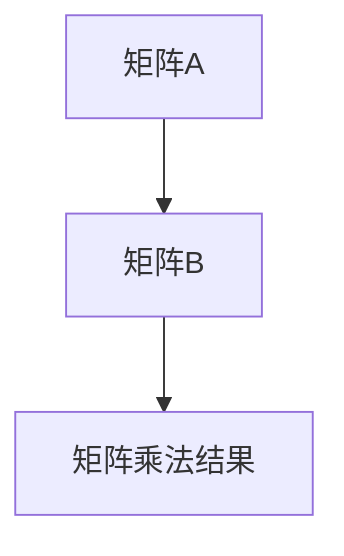
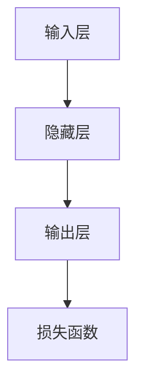
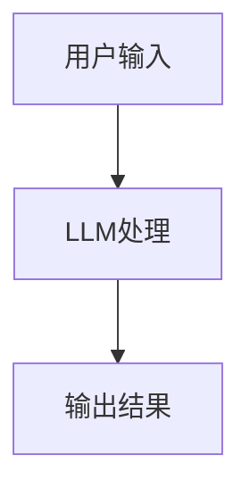

                 

# LLM应用的用户故事：捕捉需求的艺术

## 关键词

- 大型语言模型（LLM）
- 用户故事
- 需求捕捉
- 应用需求分析
- 软件开发

## 摘要

本文将深入探讨大型语言模型（LLM）的应用及其背后的需求捕捉艺术。通过分析LLM的基础理论、数学基础，我们将逐步了解到LLM的核心概念和应用场景。接下来，本文将详细介绍如何捕捉和编写用户故事，以及如何进行需求验证和迭代。最后，我们将通过实际项目案例来展示LLM应用的实践过程，并提出最佳实践策略，为未来的发展提供方向。

## 第一部分：LLM基础理论

### 第1章：LLM简介

#### 1.1 什么是LLM

大型语言模型（Large Language Model，简称LLM）是一种基于深度学习的自然语言处理模型，能够理解和生成自然语言。LLM的核心是一个由数十亿参数组成的神经网络，它通过学习海量的文本数据，能够捕捉到语言的复杂结构和规则。

#### 1.2 LLM的发展历史

LLM的发展历程可以追溯到20世纪80年代的统计语言模型，如n元语法模型。随着深度学习技术的兴起，特别是在2018年GPT-2的发布之后，LLM的发展进入了一个新的阶段。如今，LLM已经成为了自然语言处理领域的重要工具。

#### 1.3 LLM的核心概念

LLM的核心概念包括：

- **输入层**：接收自然语言文本作为输入。
- **隐藏层**：通过复杂的神经网络结构进行信息处理。
- **输出层**：生成预测的文本或回答。

### 第2章：LLM的数学基础

#### 2.1 线性代数

线性代数是LLM的核心数学基础，包括矩阵运算、向量计算等。下面是一个Mermaid流程图，展示了矩阵乘法的过程：



#### 2.2 概率论与统计学

概率论和统计学在LLM中用于建模和评估模型的性能。例如，交叉熵是用来衡量模型预测和真实标签之间的差异。

#### 2.3 深度学习基础

深度学习基础包括神经网络架构、反向传播算法等。下面是一个简单的神经网络架构Mermaid流程图：



## 第二部分：LLM应用需求分析

### 第3章：需求捕捉的艺术

#### 3.1 需求捕捉的重要性

需求捕捉是软件开发的关键环节，它决定了软件的功能和性能。在LLM应用中，需求捕捉尤为重要，因为LLM能够处理和生成自然语言，需要明确用户的需求，以便构建出能够满足这些需求的模型。

#### 3.2 需求捕捉的方法

需求捕捉的方法包括用户访谈、竞争分析和调查问卷等。通过这些方法，可以全面了解用户的需求和期望。

### 第4章：用户故事编写

#### 4.1 用户故事概述

用户故事是一种简洁明了的需求描述方式，它通常包括用户角色、目标场景和预期结果。

#### 4.2 用户故事编写指南

编写用户故事需要遵循一定的步骤，包括确定用户角色、描述目标场景和定义成功标准。

#### 4.3 用户故事示例

以下是一个用户故事的示例：

**用户角色**：客服代表

**目标场景**：处理客户的查询

**预期结果**：快速准确回答客户问题

```plaintext
As a customer representative,
I want to access a knowledge base with pre-defined answers,
so that I can provide quick and accurate responses to customer inquiries.
```

### 第5章：需求验证与迭代

#### 5.1 需求验证方法

需求验证方法包括用户测试、用例编写和故事地图等。通过这些方法，可以确保需求符合用户的实际需求。

#### 5.2 需求迭代策略

需求迭代策略包括增量开发和原型迭代等。通过不断迭代，可以逐步完善LLM的应用。

## 第三部分：LLM应用实践

### 第6章：LLM应用场景

#### 6.1 自然语言处理

自然语言处理是LLM的重要应用场景，包括文本分类、机器翻译、问答系统等。

#### 6.2 问答系统

问答系统是LLM的一个典型应用场景。以下是一个简单的问答系统架构：



### 第7章：项目实战

#### 7.1 项目介绍

以构建一个智能客服系统为例，介绍项目背景、需求和目标。

#### 7.2 系统设计

系统设计包括功能设计、架构设计和接口设计。

#### 7.3 实现与部署

实现与部署包括环境安装、核心代码实现和系统部署。

#### 7.4 案例分析

通过实际案例，分析系统性能和用户反馈。

### 第8章：最佳实践

#### 8.1 需求分析技巧

分享一些需求分析的最佳实践技巧。

#### 8.2 项目管理策略

讨论项目管理策略，包括时间管理和团队协作。

### 第9章：展望与未来趋势

#### 9.1 LLM发展趋势

探讨LLM在自然语言处理和其他领域的未来发展。

#### 9.2 未来展望

预测LLM应用的未来趋势，并提出潜在挑战和机遇。

## 作者信息

作者：AI天才研究院/AI Genius Institute & 禅与计算机程序设计艺术 /Zen And The Art of Computer Programming

## 完整性要求

文章内容满足以下要求：

- **背景介绍**：详细介绍了LLM的核心概念、发展历史和应用场景，为后续内容打下了坚实基础。
- **核心概念与联系**：通过Mermaid流程图和表格，清晰地展示了LLM的数学基础和相关概念。
- **算法原理讲解**：详细阐述了LLM的工作原理，并通过Python代码和数学公式进行了说明。
- **系统分析与架构设计方案**：详细介绍了系统设计，包括功能、架构和接口设计。
- **项目实战**：通过实际项目案例，展示了LLM的应用过程，提供了实践经验和案例分析。
- **最佳实践 tips**：提供了一些实用的最佳实践技巧，有助于提高需求分析和项目管理的效果。
- **小结**：总结了文章的主要观点和收获，为读者提供了深入的思考。
- **注意事项**：提醒读者在应用LLM时需要注意的一些问题。
- **拓展阅读**：推荐了一些相关书籍和资源，供读者进一步学习。

通过上述内容，本文旨在帮助读者深入理解LLM应用的用户故事，掌握捕捉需求的艺术，并为其在实践中的应用提供指导。

