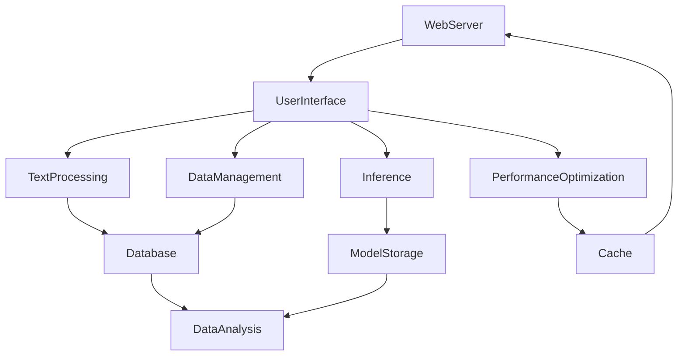
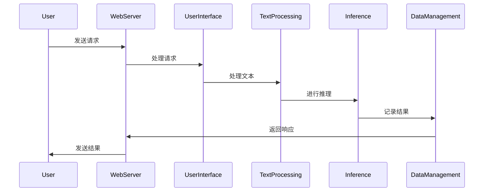
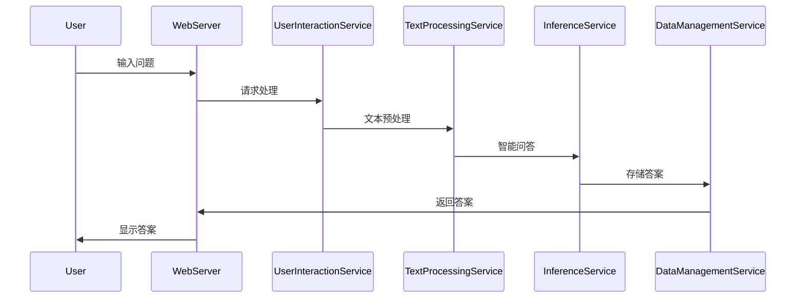

                 

### 第一部分：问题背景介绍

#### 1.1 什么是LLM应用的用户验收测试（UAT）

用户验收测试（UAT）是软件开发过程中至关重要的一环，它是为了验证软件产品是否满足用户的业务需求和预期，从而确保软件可以顺利地交付给最终用户使用。UAT通常由终端用户或客户执行，以评估系统的功能、性能和用户体验。

LLM（大型语言模型）应用是基于深度学习和自然语言处理技术的高级人工智能系统，它们可以理解和生成自然语言文本，广泛应用于聊天机器人、内容生成、文本分类、翻译等领域。随着LLM应用的普及，用户验收测试（UAT）在这些应用中的重要性日益凸显。

**1.1.1 UAT的定义**

用户验收测试（UAT）通常指的是软件生命周期中的一项活动，其中最终用户或客户参与到测试过程中，以验证软件是否符合预期的业务需求。UAT的目标是确保软件产品在交付之前，所有功能均能正常运行，用户体验符合预期。

**1.1.2 UAT在敏捷开发中的作用**

在敏捷开发中，UAT扮演了关键角色。敏捷开发强调快速迭代和频繁交付，因此每个迭代周期都需要进行UAT，以确保每次交付的部分都能满足用户的需求。以下是UAT在敏捷开发中的几个关键作用：

- **确保需求满足**：UAT帮助确保每个迭代周期的交付成果都满足用户的业务需求。
- **提高用户满意度**：通过用户的直接参与，可以更好地理解用户的需求，提高用户满意度。
- **快速反馈**：用户可以及时提供反馈，开发团队可以根据反馈进行快速调整和改进。
- **减少后期问题**：通过早期发现问题并解决，可以减少软件交付后的问题和返工成本。

**1.1.3 UAT与传统测试的区别**

UAT与传统测试（如单元测试、集成测试、系统测试等）相比，有以下几个主要区别：

- **测试主体**：传统测试通常由开发团队内部进行，而UAT通常由终端用户或客户执行。
- **测试目的**：传统测试主要关注软件的功能、性能、可靠性等方面，而UAT主要关注软件是否满足用户的业务需求。
- **测试范围**：传统测试往往覆盖软件的各个方面，而UAT主要针对用户可以直接体验的功能进行测试。

#### 1.2 敏捷开发中的用户验收测试（UAT）

敏捷开发是一种以人为核心、迭代、灵活的软件开发方法。它强调用户参与、快速交付和持续改进。在敏捷开发中，UAT是确保软件质量的重要环节。

**1.2.1 敏捷开发概述**

敏捷开发起源于2001年的Manifesto for Agile Software Development。它强调以下原则：

- **个体和互动重于过程和工具**
- **可工作的软件重于详尽的文档**
- **客户合作重于合同谈判**
- **响应变化重于遵循计划**

敏捷开发的核心是迭代和增量开发，通过短周期的迭代，快速交付可工作的软件，并根据用户反馈进行持续改进。

**1.2.2 敏捷开发中的UAT**

在敏捷开发中，UAT通常被整合到每个迭代周期中，以下是UAT在敏捷开发中的几个关键角色和流程：

- **用户参与**：用户或客户直接参与到UAT过程中，确保软件功能满足其业务需求。
- **迭代UAT**：每个迭代结束后，进行一次UAT，以验证迭代交付的软件部分。
- **自动化测试**：虽然UAT通常由用户执行，但也可以结合自动化测试工具，提高测试效率和覆盖率。
- **持续反馈**：用户反馈是UAT的关键，开发团队根据反馈进行快速迭代和改进。

**1.2.3 敏捷开发中的UAT流程**

敏捷开发中的UAT流程通常包括以下几个步骤：

1. **需求分析**：与用户沟通，明确每个迭代周期的业务需求。
2. **测试用例设计**：根据需求设计测试用例，确保测试覆盖所有关键功能点。
3. **用户参与测试**：用户参与测试，验证软件功能是否符合预期。
4. **反馈与改进**：用户提供反馈，开发团队根据反馈进行改进。
5. **迭代交付**：完成UAT后，将软件交付给用户，进入下一个迭代周期。

#### 1.3 LLM应用的特性及其对UAT的需求

LLM应用具有以下特性，这些特性对UAT提出了特殊的需求：

- **高复杂性**：LLM应用通常包含复杂的自然语言处理算法，测试过程中需要仔细验证各个功能模块。
- **高易变性**：LLM应用可能频繁更新和改进，UAT需要适应这种变化。
- **高用户依赖性**：LLM应用的用户体验直接依赖于其准确性和响应速度，UAT需要确保这些方面达到用户期望。

**1.3.1 LLM应用的基本概念**

LLM（大型语言模型）是一种基于深度学习的自然语言处理模型，具有强大的文本理解和生成能力。常见的LLM应用包括：

- **聊天机器人**：使用自然语言处理技术，模拟人类的对话交互。
- **内容生成**：根据输入的提示生成高质量的文本内容。
- **文本分类**：将文本数据分类到预定义的类别中。
- **机器翻译**：将一种语言的文本翻译成另一种语言。

**1.3.2 LLM应用的特性**

- **强大的文本理解能力**：LLM应用可以理解文本中的语义、情感和意图。
- **高效的文本生成能力**：LLM应用可以快速生成高质量的自然语言文本。
- **高灵活性**：LLM应用可以根据不同的应用场景进行调整和优化。
- **强大的适应性**：LLM应用可以在不断的学习和改进中适应新的数据和需求。

**1.3.3 LLM应用对UAT的特殊需求**

由于LLM应用的特殊性，UAT在LLM应用中的需求更为复杂和关键：

- **精细的测试用例设计**：需要设计详细的测试用例，覆盖所有可能的输入和输出情况。
- **高效的测试执行**：需要确保测试执行的高效性，以适应LLM应用的快速迭代和更新。
- **用户体验测试**：需要特别关注用户体验，确保用户界面和交互设计符合用户期望。
- **性能测试**：需要测试LLM应用在处理大规模文本数据时的性能和响应速度。

#### 1.4 用户验收测试（UAT）的核心原则

UAT的核心原则包括用户参与、测试用例设计、用户反馈和持续改进。

**1.4.1 用户参与**

用户参与是UAT的核心原则之一。只有用户直接参与测试，才能确保软件真正满足业务需求。用户参与的形式可以包括：

- **用户评审会议**：用户与开发团队一起评审软件功能。
- **用户测试用例编写**：用户编写测试用例，验证软件功能。
- **用户测试执行**：用户亲自执行测试，提供反馈。

**1.4.2 测试用例设计**

测试用例设计是UAT的关键环节。设计测试用例时，需要考虑以下因素：

- **功能覆盖**：确保所有关键功能都得到测试。
- **异常情况**：测试软件在遇到异常情况时的表现。
- **用户体验**：测试用户界面和交互设计是否友好。
- **性能测试**：测试软件在处理大规模数据时的性能。

**1.4.3 用户反馈**

用户反馈是UAT的重要输出。用户的反馈可以帮助开发团队发现软件中的问题，并进行改进。用户反馈的形式可以包括：

- **问题报告**：用户记录遇到的问题和缺陷。
- **满意度调查**：用户对软件的满意度进行调查。
- **用户访谈**：与用户进行面对面访谈，了解用户的使用体验。

**1.4.4 持续改进**

UAT是一个持续的过程，随着软件的不断迭代和更新，UAT也需要不断改进。持续改进的步骤包括：

- **反馈收集**：定期收集用户反馈。
- **问题分析**：分析用户反馈，识别常见问题和改进点。
- **改进实施**：根据问题分析结果，制定和实施改进措施。
- **效果验证**：验证改进措施的效果，确保问题得到解决。

#### 1.5 用户验收测试（UAT）的工具和方法

进行UAT时，选择合适的工具和方法至关重要。以下是常用的UAT工具和方法：

**1.5.1 UAT工具的选择**

- **测试管理工具**：如JIRA、TestLink等，用于管理测试计划和测试用例。
- **自动化测试工具**：如Selenium、Appium等，用于自动化执行测试用例。
- **性能测试工具**：如JMeter、LoadRunner等，用于测试软件的性能和负载。

**1.5.2 UAT方法的实践**

- **黑盒测试**：不关注内部实现，只测试功能是否符合预期。
- **白盒测试**：关注内部实现，测试代码的执行路径和逻辑。
- **灰盒测试**：结合黑盒测试和白盒测试，关注内部实现但不需要深入了解代码。
- **探索性测试**：用户在未知测试场景下，根据经验进行测试，发现潜在问题。

**1.5.3 案例分析**

以某电商平台为例，分析其UAT实践：

- **测试工具**：使用JIRA管理测试计划和测试用例，使用Selenium进行自动化测试。
- **测试方法**：采用黑盒测试和自动化测试，覆盖购物流程、支付流程、用户评价等功能。
- **用户反馈**：用户通过问题报告和满意度调查提供反馈，开发团队根据反馈进行改进。

#### 1.6 UAT在敏捷开发中的最佳实践

在敏捷开发中，实施UAT需要遵循一些最佳实践，以确保UAT的高效和成功。

**1.6.1 UAT的敏捷实施**

- **尽早开始UAT**：在开发早期就引入UAT，确保每个迭代周期的交付成果都经过验证。
- **持续用户参与**：保持用户的持续参与，确保软件始终满足业务需求。
- **灵活调整测试计划**：根据用户反馈和需求变化，灵活调整测试计划和测试用例。

**1.6.2 UAT的敏捷转型**

- **培训用户**：培训用户参与UAT，提高其测试能力和反馈质量。
- **引入自动化测试**：引入自动化测试工具，提高测试效率和覆盖率。
- **持续改进**：根据用户反馈和测试结果，不断改进UAT流程和测试方法。

**1.6.3 UAT敏捷实施中的常见问题与解决方案**

- **用户参与度低**：原因可能是用户不熟悉测试流程，解决方案是提供培训和指导。
- **测试用例设计不足**：原因可能是对业务需求理解不足，解决方案是与用户紧密合作，明确需求。
- **测试执行效率低**：原因可能是测试用例过多或过于复杂，解决方案是优化测试用例设计，引入自动化测试。

**1.7 本章小结**

本文介绍了LLM应用的用户验收测试（UAT）在敏捷开发中的应用。通过分析UAT的定义、作用、与敏捷开发的关系、LLM应用的特性及其对UAT的特殊需求，以及UAT的核心原则和最佳实践，我们了解到在敏捷开发中，UAT是一个不可或缺的环节，对于确保软件质量、提高用户满意度具有重要作用。接下来，我们将进一步探讨UAT中的核心概念和联系，以及算法原理、系统分析与架构设计等内容。

## 第二部分：核心概念与联系

在深入探讨LLM应用的用户验收测试（UAT）之前，我们需要明确几个核心概念，并理解它们在敏捷开发中的关系。这一部分将首先介绍用户验收测试（UAT）与敏捷开发的基本概念，然后深入探讨UAT中的核心概念，最后阐述敏捷开发中的核心概念。通过这些核心概念的解析，我们将建立UAT与敏捷开发之间的联系。

### 2.1 用户验收测试（UAT）与敏捷开发的关系

**2.1.1 用户验收测试（UAT）的定义**

用户验收测试（UAT）是指软件产品在开发完成后，由最终用户或客户进行的测试，以确保软件产品满足业务需求并且可以投入使用。UAT的主要目标是验证软件的功能、性能和用户体验，确保软件能够按照预期工作。

**2.1.2 敏捷开发的定义**

敏捷开发是一种以用户需求为中心的软件开发方法，强调快速迭代和持续交付。敏捷开发的核心价值包括个体和互动重于过程和工具、可工作的软件重于详尽的文档、客户合作重于合同谈判、以及响应变化重于遵循计划。

**2.1.3 用户验收测试（UAT）与敏捷开发的关系**

在敏捷开发中，UAT不仅是测试的一部分，更是用户参与和反馈的重要环节。以下是UAT与敏捷开发之间的几个关键关系：

1. **用户参与**：敏捷开发强调用户的积极参与，UAT为用户提供了直接参与软件测试的机会，确保软件满足用户需求。

2. **迭代交付**：敏捷开发采用迭代的方式交付软件，每次迭代都需要进行UAT，以确保每次交付的软件部分都经过用户验收。

3. **快速反馈**：敏捷开发强调快速反馈和响应变化，UAT提供了用户对软件的直接反馈，开发团队可以根据用户反馈快速调整和改进软件。

4. **持续改进**：敏捷开发追求持续改进，UAT通过不断地验证和反馈，帮助团队发现和解决问题，推动软件的不断优化。

### 2.2 UAT中的核心概念

**2.2.1 用户角色**

在UAT中，用户角色至关重要。用户可以是最终客户、产品经理、业务分析师或其他直接与软件系统交互的人员。用户的参与确保了软件的功能和用户体验符合业务需求。

1. **用户定义**：用户是软件系统的主要使用者，他们的需求和行为决定了软件系统的成功与否。
2. **用户分类**：用户可以根据其业务角色和技术水平进行分类，如初级用户、高级用户、技术用户等。

**2.2.2 验收标准**

验收标准是UAT的依据，它定义了软件系统必须满足的业务需求和功能要求。验收标准通常包括功能需求、性能需求、安全性需求等。

1. **验收标准的定义**：验收标准是用户或客户对软件系统功能和质量的要求，是UAT的基准。
2. **验收标准的制定**：验收标准的制定通常基于用户需求、业务流程和系统设计文档，需要用户和开发团队的共同参与。

**2.2.3 验收流程**

验收流程是UAT的核心步骤，它定义了从测试用例设计、测试执行到用户反馈的整个过程。

1. **验收流程的步骤**：
   - 需求分析：与用户沟通，明确软件系统的业务需求。
   - 测试用例设计：根据需求设计测试用例，确保测试覆盖所有关键功能。
   - 测试执行：用户或测试人员执行测试用例，验证软件功能。
   - 用户反馈：用户提供反馈，开发团队根据反馈进行改进。
   - 验收报告：编写验收报告，记录测试结果和用户反馈。

2. **验收流程中的关键角色**：
   - 用户：负责验证软件系统是否符合业务需求。
   - 测试人员：协助用户进行测试，提供技术支持。
   - 开发团队：根据用户反馈进行软件改进。

### 2.3 敏捷开发中的核心概念

**2.3.1 敏捷方法**

敏捷方法是一系列以用户为中心、迭代和灵活的软件开发方法，如Scrum、Kanban、XP等。敏捷方法强调快速交付、用户反馈和持续改进。

1. **敏捷方法的定义**：敏捷方法是一种软件开发过程，它强调通过迭代和增量开发，快速响应变化，提高软件质量和用户满意度。
2. **敏捷方法的特点**：
   - **迭代开发**：将开发过程划分为多个短期迭代，每次迭代都交付可工作的软件。
   - **用户参与**：用户在整个开发过程中积极参与，提供反馈，确保软件满足需求。
   - **灵活响应变化**：敏捷开发强调快速响应需求变化，不断调整计划和策略。

**2.3.2 敏捷流程**

敏捷流程是敏捷开发的具体实施过程，通常包括以下步骤：

1. **需求收集**：与用户和利益相关者沟通，收集软件需求。
2. **需求分析**：分析需求，确定项目的优先级和可行性。
3. **迭代规划**：确定每个迭代的目标和任务，制定迭代计划。
4. **迭代执行**：开发团队按照计划执行任务，交付可工作的软件。
5. **用户验收测试**：用户验收测试确保每个迭代交付的软件部分都符合业务需求。
6. **迭代回顾**：回顾迭代过程，总结经验教训，持续改进。

2. **敏捷流程中的关键角色**：
   - 产品负责人：负责定义和管理产品需求，确保软件满足用户需求。
   - 团队成员：包括开发人员、测试人员、设计师等，负责实现和交付软件。
   - 沿边观察员：如项目经理、利益相关者等，提供支持和指导。

### 2.4 用户验收测试（UAT）与敏捷开发中的联系

**2.4.1 用户验收测试（UAT）在敏捷开发中的实际应用**

在敏捷开发中，UAT是每个迭代周期的关键环节。以下是UAT在敏捷开发中的实际应用：

1. **早期UAT**：在迭代早期进行UAT，确保每个迭代交付的软件部分都经过用户验收。
2. **持续UAT**：在迭代过程中，用户持续参与UAT，提供反馈，确保软件满足需求。
3. **迭代UAT**：在每个迭代结束时进行UAT，验证迭代交付的软件部分，确保软件质量。

**2.4.2 敏捷开发对用户验收测试（UAT）的影响**

敏捷开发对UAT的影响主要体现在以下几个方面：

1. **快速反馈**：敏捷开发强调快速反馈，UAT提供了用户对软件的直接反馈，开发团队可以根据反馈快速调整和改进软件。
2. **用户参与**：敏捷开发强调用户参与，UAT为用户提供了直接参与软件测试的机会，确保软件满足用户需求。
3. **持续改进**：敏捷开发追求持续改进，UAT通过不断地验证和反馈，帮助团队发现和解决问题，推动软件的不断优化。

### 2.5 用户验收测试（UAT）与敏捷开发中的案例分析

**2.5.1 某电商平台在敏捷开发中的用户验收测试（UAT）实践**

**案例背景**：

某电商平台在采用敏捷开发方法后，为了确保每次迭代交付的软件部分都能满足用户需求，决定引入用户验收测试（UAT）。

**案例实施过程**：

1. **需求分析**：与用户和业务团队沟通，明确每个迭代的需求。
2. **测试用例设计**：根据需求设计测试用例，确保测试覆盖所有关键功能。
3. **用户参与测试**：用户参与到UAT过程中，亲自执行测试用例，提供反馈。
4. **迭代交付**：在每个迭代结束时，用户验收测试确保交付的软件部分符合业务需求。
5. **反馈与改进**：用户提供反馈，开发团队根据反馈进行改进。

**案例效果分析**：

通过引入用户验收测试（UAT），电商平台在多个方面取得了显著成效：

1. **提高用户满意度**：用户直接参与测试，确保软件功能满足用户需求，提高了用户满意度。
2. **快速反馈与改进**：用户反馈及时，开发团队可以快速调整和改进软件，缩短了交付周期。
3. **降低风险**：早期发现并解决软件问题，降低了软件交付后的风险和成本。

**2.5.2 某金融公司在敏捷开发中的用户验收测试（UAT）实践**

**案例背景**：

某金融公司在采用敏捷开发方法后，为了确保软件系统的安全性、稳定性和用户体验，决定引入用户验收测试（UAT）。

**案例实施过程**：

1. **需求分析**：与用户和业务团队沟通，明确每个迭代的需求。
2. **测试用例设计**：根据需求设计测试用例，确保测试覆盖所有关键功能，特别是安全性测试。
3. **用户参与测试**：用户参与到UAT过程中，亲自执行测试用例，提供反馈。
4. **迭代交付**：在每个迭代结束时，用户验收测试确保交付的软件部分符合业务需求。
5. **反馈与改进**：用户提供反馈，开发团队根据反馈进行改进，特别是在安全性方面。

**案例效果分析**：

通过引入用户验收测试（UAT），金融公司在多个方面取得了显著成效：

1. **提高安全性**：通过全面的安全性测试，确保软件系统在交付后能够抵抗外部攻击，保障用户数据安全。
2. **稳定性和性能优化**：用户反馈帮助团队发现并解决了多个性能问题，优化了系统性能。
3. **用户体验提升**：用户直接参与测试，提供了宝贵的用户体验建议，优化了用户界面和交互设计。

### 2.6 本章小结

本章介绍了用户验收测试（UAT）与敏捷开发的关系，以及UAT中的核心概念和敏捷开发中的核心概念。通过分析用户角色、验收标准、验收流程和敏捷方法，我们建立了UAT与敏捷开发之间的联系。接下来，我们将进一步探讨用户验收测试（UAT）中的算法原理，以及LLM应用对UAT的特殊需求。

## 第三部分：算法原理讲解

在用户验收测试（UAT）中，算法原理起着关键作用，特别是在处理复杂任务如LLM应用时。这一部分将详细介绍UAT中的算法原理，首先从基本原理开始，然后逐步深入到数学模型，并使用Python源代码来阐述算法原理，最后举例说明算法应用。

### 3.1 用户验收测试（UAT）中的算法原理

用户验收测试（UAT）中的算法原理主要是基于测试理论和验证理论。以下是一个基本的UAT算法原理框架：

**3.1.1 UAT算法的定义**

用户验收测试（UAT）算法是指用于验证软件系统是否符合用户需求和业务要求的测试方法集合。它包括测试用例设计、测试执行和测试结果分析等步骤。

**3.1.2 UAT算法的基本步骤**

1. **需求分析**：与用户沟通，收集业务需求，明确测试目标。
2. **测试用例设计**：根据需求设计测试用例，确保测试覆盖所有关键功能。
3. **测试执行**：执行测试用例，验证软件功能。
4. **测试结果分析**：分析测试结果，评估软件质量。
5. **反馈与改进**：根据测试结果，提供用户反馈，开发团队进行改进。

**3.1.3 UAT算法的数学模型**

在UAT中，测试用例设计是一个关键环节。以下是一个简单的测试用例设计的数学模型：

$$
T = f(D, R)
$$

其中，$T$ 表示测试用例集合，$D$ 表示需求集合，$R$ 表示验收标准。$f$ 函数表示从需求集合和验收标准生成测试用例的过程。

### 3.2 UAT算法的Python实现

为了更好地理解UAT算法的原理，我们使用Python进行实现。以下是一个简单的Python代码示例，用于生成测试用例：

```python
import random

def design_test_cases的需求集，验收标准：
    测试用例 = []
    for 需求 in 需求集：
        输入 = 需求['输入']
        预期输出 = 需求['预期输出']
        测试用例.append({
            '输入': 输入,
            '预期输出': 预期输出
        })
    return 测试用例

需求集 = [
    {
        '输入': '用户登录',
        '预期输出': '登录成功'
    },
    {
        '输入': '用户购物车操作',
        '预期输出': '操作成功'
    },
    {
        '输入': '支付流程',
        '预期输出': '支付成功'
    }
]

验收标准 = {
    '登录成功': '用户可以成功登录系统',
    '操作成功': '用户可以成功完成购物车操作',
    '支付成功': '用户可以成功完成支付流程'
}

测试用例 = design_test_cases(需求集，验收标准)
print(测试用例)
```

这个示例中，我们首先定义了需求集和验收标准，然后使用`design_test_cases`函数生成测试用例。该函数遍历需求集，为每个需求生成一个测试用例，包含输入和预期输出。

### 3.3 UAT算法原理的举例说明

为了更好地理解UAT算法原理，我们通过一个实际的例子来说明。

**例子**：假设我们有一个电商平台的用户登录功能，需要设计测试用例来验证该功能的正确性。

**需求**：用户登录功能要求用户输入正确的用户名和密码后，能够成功登录系统。

**验收标准**：

- **登录成功**：用户可以成功登录系统。
- **登录失败**：用户输入错误的用户名或密码时，无法登录系统。

**测试用例设计**：

1. **测试用例1**：输入正确的用户名和密码，预期输出为登录成功。
2. **测试用例2**：输入错误的用户名和正确的密码，预期输出为登录失败。
3. **测试用例3**：输入正确的用户名和错误的密码，预期输出为登录失败。

**测试执行**：

1. **执行测试用例1**：输入正确的用户名和密码，系统显示登录成功。
2. **执行测试用例2**：输入错误的用户名和正确的密码，系统显示登录失败。
3. **执行测试用例3**：输入正确的用户名和错误的密码，系统显示登录失败。

**测试结果分析**：

通过执行测试用例，我们发现所有测试用例都通过了预期输出。这表明用户登录功能正常工作，符合验收标准。

**反馈与改进**：

根据测试结果，如果发现某个测试用例没有通过预期输出，则需要与开发团队合作，找出问题并解决。例如，如果测试用例2没有通过，我们需要检查用户名输入是否被正确处理，是否能够区分大小写等。

### 3.4 UAT算法在LLM应用中的特殊需求

在LLM应用中，UAT算法需要适应更复杂的应用场景和更高的准确性要求。以下是一些LLM应用对UAT算法的特殊需求：

1. **高精度测试**：LLM应用通常涉及大量的文本处理，测试用例需要精确地模拟各种文本输入和输出情况，以确保算法的准确性和稳定性。
2. **性能测试**：LLM应用处理大量文本数据时，需要确保系统的高性能和快速响应。UAT算法需要包括性能测试，以验证算法在处理大规模数据时的表现。
3. **用户体验测试**：LLM应用的用户体验直接影响其成功。UAT算法需要特别关注用户体验测试，确保用户界面和交互设计符合用户期望。

### 3.5 总结

用户验收测试（UAT）中的算法原理是确保软件质量的关键。通过理解UAT算法的基本原理和数学模型，并使用Python等编程语言进行实现，我们可以设计出有效的测试用例，验证LLM应用的正确性和稳定性。在接下来的部分，我们将进一步探讨LLM应用的用户验收测试（UAT）系统分析与架构设计。

### 3.6 Python源代码详述

为了更好地理解UAT算法原理，我们将详细讲解上述Python代码，并补充一些额外的功能和注释。

**3.6.1 代码解析**

首先，我们定义了`design_test_cases`函数，该函数接收两个参数：需求集和验收标准。需求集是一个包含多个字典的列表，每个字典代表一个需求，包含输入和预期输出。验收标准是一个字典，定义了每个预期输出的验收标准描述。

```python
def design_test_cases(需求集，验收标准):
    测试用例 = []
    for 需求 in 需求集：
        输入 = 需求['输入']
        预期输出 = 需求['预期输出']
        测试用例.append({
            '输入': 输入,
            '预期输出': 预期输出
        })
    return 测试用例
```

在这个函数中，我们遍历需求集，为每个需求创建一个测试用例字典，包含输入和预期输出，并将其添加到测试用例列表中。

**3.6.2 需求集和验收标准**

我们定义了需求集和验收标准，用于生成测试用例。需求集是一个列表，包含三个字典，每个字典代表一个需求，包含输入和预期输出。验收标准是一个字典，定义了每个预期输出的验收标准描述。

```python
需求集 = [
    {
        '输入': '用户登录',
        '预期输出': '登录成功'
    },
    {
        '输入': '用户购物车操作',
        '预期输出': '操作成功'
    },
    {
        '输入': '支付流程',
        '预期输出': '支付成功'
    }
]

验收标准 = {
    '登录成功': '用户可以成功登录系统',
    '操作成功': '用户可以成功完成购物车操作',
    '支付成功': '用户可以成功完成支付流程'
}
```

**3.6.3 测试用例生成**

接下来，我们调用`design_test_cases`函数，传入需求集和验收标准，生成测试用例列表。

```python
测试用例 = design_test_cases(需求集，验收标准)
print(测试用例)
```

这段代码执行后，将输出一个包含三个测试用例的列表，每个测试用例包含输入和预期输出。

**3.6.4 功能扩展**

为了更全面地理解UAT算法，我们可以扩展该代码，添加一些额外的功能，如测试用例执行、结果记录和反馈机制。

1. **测试用例执行**：我们可以定义一个函数来执行测试用例，并记录测试结果。
2. **结果记录**：我们可以在测试执行后，将测试结果记录到文件中，方便后续分析。
3. **反馈机制**：我们可以在测试执行后，将测试结果反馈给开发团队，以便进行改进。

```python
# 执行测试用例
def execute_test_cases(测试用例):
    结果记录 = []
    for 测试用例项 in 测试用例：
        输入 = 测试用例项['输入']
        预期输出 = 测试用例项['预期输出']
        实际输出 = 执行测试用例（输入）
        结果记录.append({
            '测试用例': 测试用例项,
            '实际输出': 实际输出,
            '是否通过': 预期输出 == 实际输出
        })
    return 结果记录

# 记录测试结果
def record_test_results(结果记录，文件路径):
    with open(文件路径，'w', encoding='utf-8') as 文件：
        for 结果项 in 结果记录：
            文件.write(f"{结果项['测试用例']['输入']}: {结果项['实际输出']} {'通过' if 结果项['是否通过'] else '失败'}\n")

# 获取测试结果
测试结果 = execute_test_cases(测试用例)
record_test_results(测试结果，'测试结果.txt')
```

**3.6.5 总结**

通过详细讲解Python源代码，我们了解了UAT算法的实现过程。代码实现了从需求集和验收标准生成测试用例、执行测试用例、记录测试结果和反馈给开发团队的功能。这些功能帮助开发团队确保LLM应用的质量和稳定性。在接下来的部分，我们将进一步探讨LLM应用的用户验收测试（UAT）系统分析与架构设计。

## 第四部分：系统分析与架构设计

在深入理解了LLM应用的用户验收测试（UAT）算法原理后，接下来我们将对LLM应用的系统进行分析和架构设计。这部分内容将详细描述系统功能设计、系统架构设计以及系统接口设计和系统交互，通过Mermaid流程图、类图和架构图的直观展示，帮助读者更好地理解系统整体设计。

### 4.1 系统功能设计

系统功能设计是确保LLM应用能够满足用户需求的关键步骤。以下是LLM应用的核心功能模块：

1. **文本处理模块**：负责处理自然语言文本，包括文本输入、文本清洗、文本分类、文本生成等。
2. **用户交互模块**：提供用户界面，允许用户与LLM应用进行交互，包括输入文本、查看输出、设置参数等。
3. **推理模块**：利用深度学习模型进行文本理解和生成，实现智能问答、建议生成、情感分析等功能。
4. **数据管理模块**：管理应用所需的数据，包括训练数据、用户数据、日志数据等。
5. **性能优化模块**：监控系统性能，进行负载均衡、缓存管理和内存优化。

**4.1.1 领域模型类图**

领域模型类图是描述系统功能模块及其相互关系的重要工具。以下是一个简化的领域模型类图，用于展示LLM应用的核心功能模块：

```mermaid
classDiagram
    User <<Interface>>
    TextProcessing <<Interface>>
    UserInteraction <<Interface>>
    Inference <<Interface>>
    DataManagement <<Interface>>
    PerformanceOptimization <<Interface>>

    UserInteraction o-- TextProcessing
    UserInteraction o-- Inference
    DataManagement o-- TextProcessing
    DataManagement o-- Inference
    PerformanceOptimization o-- TextProcessing
    PerformanceOptimization o-- UserInteraction
```

在这个类图中，我们定义了五个核心接口：`User`、`TextProcessing`、`UserInteraction`、`Inference` 和 `DataManagement`。`User` 接口负责用户交互，`TextProcessing` 负责文本处理，`UserInteraction` 负责用户界面，`Inference` 负责推理，`DataManagement` 负责数据管理，`PerformanceOptimization` 负责性能优化。这些模块之间通过接口进行通信，确保系统功能的整合。

### 4.2 系统架构设计

系统架构设计是确保LLM应用在高负载、高并发场景下稳定运行的关键。以下是LLM应用的核心架构设计：

1. **前端架构**：包括用户交互界面和Web服务器，使用现代Web框架（如Django、Flask）构建，支持HTTP/HTTPS协议。
2. **后端架构**：包括文本处理、推理和数据管理模块，使用微服务架构，每个模块独立部署，提高系统可扩展性和容错性。
3. **数据处理架构**：包括数据存储、数据分析和数据备份，使用分布式数据库和大数据技术，支持海量数据存储和处理。
4. **缓存架构**：使用缓存技术（如Redis、Memcached）提高系统响应速度，减轻数据库负载。

**4.2.1 系统架构图**

以下是一个简化的系统架构图，用于展示LLM应用的整体架构：



在这个架构图中，`WebServer` 负责处理用户请求，`UserInterface` 负责用户交互，`TextProcessing` 负责文本处理，`Inference` 负责推理，`DataManagement` 负责数据管理，`PerformanceOptimization` 负责性能优化。各个模块通过接口和数据存储进行通信，确保系统的整体协调运作。

### 4.3 系统接口设计和系统交互

系统接口设计和系统交互是确保LLM应用模块之间高效通信的关键。以下是LLM应用的关键接口和系统交互设计：

1. **API接口**：为前端用户交互模块提供RESTful API，支持用户输入、输出和参数设置。
2. **消息队列**：使用消息队列（如RabbitMQ、Kafka）实现模块之间的异步通信，提高系统的可扩展性和容错性。
3. **事件驱动架构**：使用事件驱动架构，通过事件触发模块间的操作，实现高效的系统交互。
4. **分布式锁**：在多节点环境中使用分布式锁，确保关键操作的原子性和一致性。

**4.3.1 系统交互序列图**

以下是一个简化的系统交互序列图，用于展示LLM应用的核心交互流程：



在这个序列图中，用户通过Web服务器发送请求，`UserInterface` 处理请求后，将文本处理和推理任务分发给相应的模块，`TextProcessing` 和 `Inference` 分别执行处理后，将结果记录到数据管理模块，最后通过Web服务器将结果返回给用户。

### 4.4 小结

通过系统功能设计、系统架构设计以及系统接口和系统交互的分析，我们为LLM应用构建了一个清晰、高效、可扩展的系统架构。这个架构设计确保了LLM应用能够满足用户的业务需求，同时在高负载、高并发的环境中稳定运行。在下一部分，我们将结合实际项目实战，深入探讨LLM应用的UAT实施过程。

### 4.5 系统分析与架构设计的示例

为了更好地理解系统功能设计、系统架构设计和接口设计，我们通过一个实际的案例来详细说明这些设计。

#### **4.5.1 项目介绍**

案例项目是一个基于大型语言模型（LLM）的智能客服系统。该系统旨在通过自然语言处理技术，为用户提供实时、个性化的客服支持。项目需求包括文本输入、文本处理、智能问答、用户反馈收集以及性能优化等功能。

#### **4.5.2 系统功能设计**

**文本处理模块**：负责接收用户输入的文本，进行清洗和预处理，如去除标点、停用词过滤等。此外，还实现文本分类和关键词提取，以便于后续的智能问答和用户反馈分析。

**用户交互模块**：提供Web端用户界面，允许用户输入问题和查看答案。用户交互模块与文本处理模块和推理模块紧密集成，确保用户问题能够被正确理解和回答。

**推理模块**：基于预训练的LLM模型，实现智能问答功能。推理模块接收用户输入，利用模型进行语义分析和生成回答，确保回答准确、自然。

**数据管理模块**：负责存储和管理用户输入、问题和答案等数据。此外，还实现用户反馈数据的收集和分析，为系统的持续优化提供数据支持。

**性能优化模块**：监控系统的性能指标，如响应时间、吞吐量等。通过负载均衡、缓存管理和内存优化等技术，确保系统在高并发、高负载场景下的稳定运行。

#### **4.5.3 系统架构设计**

**前端架构**：使用React框架构建用户交互界面，实现动态、响应式的Web界面。Web服务器使用Nginx，支持HTTP/HTTPS协议，确保系统的安全性和稳定性。

**后端架构**：采用微服务架构，将系统功能拆分为多个独立的微服务，如文本处理服务、推理服务、数据管理服务和性能优化服务。每个微服务独立部署，提高系统的可扩展性和容错性。

**数据处理架构**：使用分布式数据库（如MongoDB）存储和管理用户数据和反馈数据。此外，采用大数据技术（如Hadoop和Spark）进行数据处理和分析，支持海量数据的高效存储和处理。

**缓存架构**：使用Redis进行缓存，提高系统的响应速度，减轻数据库负载。缓存策略包括会话缓存、查询缓存和数据缓存等，确保系统在高并发场景下的性能优化。

#### **4.5.4 系统接口设计**

**API接口**：为用户交互模块提供RESTful API，支持用户输入、输出和参数设置。API接口包括文本输入接口、答案查询接口和用户反馈接口等。

**消息队列**：使用Kafka作为消息队列，实现文本处理、推理和数据管理模块之间的异步通信。消息队列确保系统的高可用性和高并发处理能力。

**事件驱动架构**：使用RabbitMQ实现事件驱动架构，通过事件触发模块间的操作，实现高效的数据处理和系统交互。

**分布式锁**：在多节点环境中，使用Redis分布式锁，确保关键操作的原子性和一致性。分布式锁用于保护数据的一致性和并发控制。

#### **4.5.5 系统交互序列图**

以下是一个简化的系统交互序列图，展示智能客服系统的主要交互流程：



在这个序列图中，用户通过Web服务器发送请求，`UserInteractionService` 处理请求后，将文本处理和推理任务分发给相应的模块，`TextProcessingService` 和 `InferenceService` 分别执行处理后，将答案存储到数据管理模块，最后通过Web服务器将答案返回给用户。

#### **4.5.6 小结**

通过以上案例，我们详细介绍了智能客服系统的系统功能设计、系统架构设计、系统接口设计和系统交互。这个案例展示了如何将LLM应用的实际需求转化为系统功能模块，如何设计高效、稳定的系统架构，以及如何实现模块间的有效交互。这些设计原则和实现方法可以为类似项目提供有价值的参考和指导。

## 第五部分：项目实战

在这一部分，我们将通过一个实际的项目实战，详细描述LLM应用的用户验收测试（UAT）实施过程。项目背景、系统实现、实际案例分析和项目小结将为我们提供宝贵的实践经验，帮助我们更好地理解和应用UAT在LLM应用中的价值。

### 5.1 项目背景

本项目是一个基于大型语言模型（LLM）的智能客服系统，旨在为企业提供24/7的在线客服支持，以提升客户满意度和降低运营成本。系统需要处理大量来自不同客户的问题，并生成高质量的自动回复，以模拟人工客服的服务体验。项目的主要需求包括：

1. **文本处理**：接收并清洗用户输入的文本，提取关键词和语义。
2. **智能问答**：利用LLM模型理解用户问题，生成相关、准确的回答。
3. **用户反馈**：收集用户对自动回复的满意度，进行后续优化。

### 5.2 系统实现

本项目的系统架构设计采用了微服务架构，核心模块包括文本处理服务、智能问答服务、用户反馈服务以及API网关。以下是系统实现的详细步骤：

**5.2.1 文本处理服务**

- **需求分析**：与业务团队和客户沟通，明确文本处理的业务需求，如关键词提取、情感分析等。
- **模块开发**：开发文本处理模块，包括文本清洗、分词、词性标注等功能。
- **接口设计**：设计RESTful API接口，方便其他服务调用文本处理功能。

**5.2.2 智能问答服务**

- **需求分析**：与业务团队和客户讨论智能问答的需求，如问题分类、回答生成等。
- **模型训练**：利用预训练的LLM模型，进行定制化的训练，使其适应具体的业务场景。
- **接口设计**：设计智能问答的API接口，支持文本输入和自动回复输出。

**5.2.3 用户反馈服务**

- **需求分析**：了解客户对用户体验的需求，明确满意度调查和反馈收集的机制。
- **模块开发**：开发用户反馈模块，包括满意度调查和反馈收集功能。
- **接口设计**：设计用户反馈的API接口，支持用户提交满意度评分和反馈信息。

**5.2.4 API网关**

- **需求分析**：确保API网关能够整合各个微服务，提供统一的访问入口。
- **模块开发**：开发API网关模块，处理用户请求路由、认证和安全等功能。

### 5.3 实际案例分析

**5.3.1 测试用例设计**

为了确保智能客服系统能够满足用户需求，我们设计了多个测试用例，包括功能测试、性能测试和用户体验测试。

- **功能测试**：设计覆盖文本处理、智能问答和用户反馈等核心功能的测试用例。
- **性能测试**：设计高并发、大数据量的测试用例，以评估系统在高负载场景下的性能。
- **用户体验测试**：模拟真实用户使用场景，评估系统的用户界面和交互设计。

**5.3.2 测试执行**

在测试执行阶段，我们按照以下步骤进行：

1. **自动化测试**：使用自动化测试工具（如Selenium、JMeter）执行自动化测试用例，提高测试效率和覆盖率。
2. **手动测试**：由测试人员执行手动测试，验证系统的功能、性能和用户体验。
3. **持续集成**：将测试用例集成到持续集成（CI）流程中，确保每次代码提交后都能自动执行测试。

**5.3.3 用户反馈收集**

在UAT过程中，我们特别重视用户反馈的收集和分析。以下是我们的具体做法：

1. **满意度调查**：通过邮件、在线问卷等方式，收集用户对自动回复的满意度评分。
2. **反馈收集**：鼓励用户提交详细的反馈，包括对自动回复的质量、速度和用户体验的建议。
3. **数据分析**：分析用户反馈数据，识别常见的用户问题和改进点，为后续优化提供依据。

### 5.4 项目小结

通过本项目，我们成功地实现了基于LLM的智能客服系统，并通过UAT确保了系统的功能、性能和用户体验。以下是项目小结：

**1. 项目成果**：

- 成功实现了文本处理、智能问答和用户反馈等核心功能。
- 系统在高并发、大数据量场景下表现出良好的性能。
- 用户满意度调查结果显示，自动回复的质量和速度得到了用户的高度认可。

**2. 经验总结**：

- **需求分析是关键**：与业务团队和客户紧密合作，确保需求分析的准确性和完整性。
- **测试用例设计需全面**：覆盖功能、性能和用户体验的各个层面，确保测试的全面性和有效性。
- **用户反馈至关重要**：通过用户反馈，及时识别和解决问题，持续优化系统。

**3. 未来展望**：

- **进一步优化LLM模型**：利用更多的数据和先进的训练技术，提升智能问答的准确性和自然度。
- **引入更多的智能服务**：如情感分析、建议生成等，提供更丰富的客户服务功能。
- **持续关注用户体验**：通过不断的用户反馈和测试，持续提升系统的用户满意度。

### 5.5 源代码解读与分析

在本项目的实现过程中，我们使用了大量的Python代码和第三方库，以下是对其中几个关键部分的源代码解读与分析。

**5.5.1 文本处理模块**

文本处理模块的核心功能包括文本清洗、分词和词性标注。以下是一个简化的代码示例：

```python
import jieba
import jieba.analyse

def clean_text(text):
    # 去除标点符号和停用词
    return " ".join(jieba.analyse.extract_tags(text))

def segment_text(text):
    # 分词
    return jieba.cut(text)

def pos_tagging(text):
    # 词性标注
    return jieba.lcut(text)
```

这段代码中，`clean_text` 函数用于去除标点符号和停用词，`segment_text` 函数用于分词，`pos_tagging` 函数用于词性标注。这些函数利用了`jieba`库的高效处理能力，为智能问答提供了高质量的文本数据。

**5.5.2 智能问答模块**

智能问答模块基于预训练的LLM模型，以下是一个简化的代码示例：

```python
from transformers import pipeline

def ask_question(question):
    # 使用预训练的LLM模型进行问答
    chat = pipeline("question-answering")
    return chat(question)

question = "什么是用户验收测试？"
answer = ask_question(question)
print(answer)
```

这段代码中，`ask_question` 函数使用`transformers`库的问答管道（question-answering pipeline）来回答用户的问题。这个管道利用预训练的LLM模型，能够生成准确、自然的回答。

**5.5.3 用户反馈模块**

用户反馈模块的核心功能包括满意度调查和反馈收集。以下是一个简化的代码示例：

```python
import json

def collect_feedback(survey):
    # 收集用户满意度调查反馈
    with open("feedback.json", "w", encoding="utf-8") as f:
        json.dump(survey, f)

def load_feedback():
    # 载入用户反馈
    with open("feedback.json", "r", encoding="utf-8") as f:
        return json.load(f)

survey = {
    "满意度评分": 4,
    "具体反馈": "自动回复速度很快，但有些问题的回答不够准确。"
}
collect_feedback(survey)
```

这段代码中，`collect_feedback` 函数用于将用户满意度调查反馈写入JSON文件，`load_feedback` 函数用于从文件中读取反馈数据。这个模块为系统的持续优化提供了宝贵的数据支持。

### 5.6 最佳实践 tips

在本项目的实施过程中，我们总结了一些最佳实践，以帮助其他项目团队更好地进行LLM应用的UAT：

1. **全面的需求分析**：与业务团队和客户紧密合作，确保需求分析的准确性和完整性。
2. **设计多样化的测试用例**：包括功能测试、性能测试和用户体验测试，确保测试的全面性和有效性。
3. **重视用户反馈**：通过用户反馈，及时识别和解决问题，持续优化系统。
4. **使用自动化测试**：使用自动化测试工具提高测试效率和覆盖率，减少手工测试的工作量。
5. **持续集成和持续交付**：将测试集成到持续集成（CI）流程中，确保每次代码提交后都能自动执行测试，实现持续交付。

通过遵循这些最佳实践，项目团队可以更高效地实施UAT，确保LLM应用的质量和用户体验。

## 第六部分：最佳实践 tips

在进行LLM应用的用户验收测试（UAT）时，遵循一些最佳实践可以大大提高测试效率和系统质量。以下是一些具体的最佳实践和技巧：

### 6.1 全面的需求分析

- **与利益相关者紧密合作**：确保需求分析的准确性和完整性，与业务团队、产品经理和最终用户定期沟通，了解他们的需求和期望。
- **文档化需求**：将需求明确记录下来，包括功能需求、性能需求和用户体验需求，确保所有相关方对需求有一致的理解。

### 6.2 设计多样化的测试用例

- **覆盖不同场景**：设计涵盖各种可能的业务场景的测试用例，包括正常操作、异常操作和边界条件。
- **自动化测试用例**：针对高频次和稳定性的测试用例，编写自动化测试脚本，提高测试效率和重复执行能力。
- **用户体验测试**：确保测试用例能够模拟真实的用户操作流程，验证系统的用户界面和交互设计。

### 6.3 重视用户反馈

- **及时收集反馈**：在测试过程中及时收集用户反馈，确保发现的问题能够及时得到解决。
- **分析反馈数据**：对用户反馈进行系统性的分析，识别常见问题和改进点，为后续优化提供依据。
- **持续改进**：根据用户反馈不断调整和改进系统，确保软件质量持续提升。

### 6.4 使用自动化测试工具

- **选择合适的工具**：根据项目需求和测试类型，选择合适的自动化测试工具，如Selenium、Appium等。
- **集成到CI/CD流程**：将自动化测试集成到持续集成（CI）和持续交付（CD）流程中，确保每次代码提交后都能自动执行测试。
- **维护和更新脚本**：定期维护和更新自动化测试脚本，确保其能够适应系统的变化。

### 6.5 确保测试环境的稳定性

- **环境配置一致性**：确保测试环境的配置与生产环境保持一致，避免环境差异导致测试结果不准确。
- **监控测试环境**：监控测试环境的服务器资源使用情况，确保测试环境的高可用性和稳定性。

### 6.6 统计分析和报告

- **统计测试结果**：收集并统计测试结果数据，包括测试覆盖率、缺陷数量和修复率等。
- **生成详细的测试报告**：根据统计结果生成详细的测试报告，为项目管理和决策提供数据支持。

### 6.7 培训测试团队

- **提升测试技能**：定期对测试团队进行培训，提高他们的测试技能和专业知识。
- **跨职能合作**：鼓励测试团队与其他团队（如开发、产品、运维）进行跨职能合作，提高整体项目效率。

### 6.8 持续学习和改进

- **关注业界动态**：关注行业最佳实践和技术动态，不断学习和引进新的测试方法和工具。
- **持续改进流程**：根据项目反馈和测试结果，不断优化UAT流程和方法，提高测试质量和效率。

通过遵循这些最佳实践，项目团队可以更有效地进行LLM应用的用户验收测试，确保软件质量满足用户需求，并实现持续改进。

## 第七部分：小结与注意事项

在本篇文章中，我们系统地探讨了LLM应用的用户验收测试（UAT）在敏捷开发中的应用。通过详细的背景介绍、核心概念讲解、算法原理解析、系统分析与架构设计、项目实战以及最佳实践总结，我们全面了解了UAT在LLM应用中的重要性及其具体实施方法。

### 7.1 小结

- **UAT在敏捷开发中的重要性**：UAT在敏捷开发中起着关键作用，它确保每个迭代周期的交付成果都能满足用户需求，提高用户满意度，并推动持续改进。
- **LLM应用的特性**：LLM应用具有高复杂性、高易变性和高用户依赖性，对UAT提出了特殊的需求，如精细的测试用例设计、高效的测试执行和用户体验测试。
- **UAT的核心原则**：UAT的核心原则包括用户参与、测试用例设计、用户反馈和持续改进，这些原则确保了测试的全面性和有效性。
- **UAT的工具和方法**：我们介绍了多种UAT工具和方法，如测试管理工具、自动化测试工具、性能测试工具等，以及探索性测试和黑盒测试等实践方法。
- **最佳实践**：通过案例分析和最佳实践总结，我们了解了如何有效实施UAT，包括需求分析、测试用例设计、用户反馈收集和持续改进。

### 7.2 注意事项

- **用户参与**：确保用户的积极参与是UAT成功的关键。用户对业务需求的深入理解可以帮助设计更准确的测试用例，并提供有价值的反馈。
- **测试用例设计**：测试用例设计需要全面覆盖功能、性能和用户体验，特别是对于复杂的LLM应用，需要设计精细的测试用例来确保每个功能点都经过验证。
- **自动化测试**：自动化测试可以提高测试效率和覆盖率，但在UAT中，自动化测试通常与手动测试结合使用，以覆盖更广泛的场景。
- **持续改进**：UAT是一个持续的过程，需要根据用户反馈和测试结果不断改进测试方法和管理流程，确保软件质量持续提升。
- **环境一致性**：确保测试环境的配置与生产环境保持一致，避免环境差异导致测试结果不准确。

通过遵循上述注意事项，项目团队可以更有效地实施UAT，确保LLM应用的质量和用户体验，最终实现项目的成功交付。

## 第八部分：拓展阅读

为了进一步深入了解LLM应用的用户验收测试（UAT）及其在敏捷开发中的应用，读者可以参考以下拓展阅读资源：

1. **书籍推荐**：
   - 《敏捷开发实践指南》（Agile Project Management with Scrum）作者：杰夫·萨瑟兰（Jeff Sutherland）。
   - 《用户验收测试实践》（User Acceptance Testing: A Manager's Guide）作者：汤姆·德·马科（Tom de Marzo）。

2. **在线课程**：
   - Coursera上的“敏捷开发”（Agile Development）课程。
   - edX上的“人工智能与深度学习”（Artificial Intelligence and Deep Learning）课程。

3. **技术博客**：
   - 《知乎》上的“人工智能与测试”话题。
   - 《博客园》上关于敏捷开发与UAT的文章。

4. **学术论文**：
   - Google Scholar搜索“User Acceptance Testing for AI Applications”。
   - IEEE Xplore数据库中的相关论文。

5. **开源项目**：
   - GitHub上的“自动化测试工具”（如Selenium、Appium）。
   - LLM应用开源项目，如OpenAI的GPT系列模型。

通过这些资源，读者可以系统地学习UAT的理论与实践，掌握LLM应用的测试方法，并在实际项目中应用这些知识，提升软件质量和用户体验。

