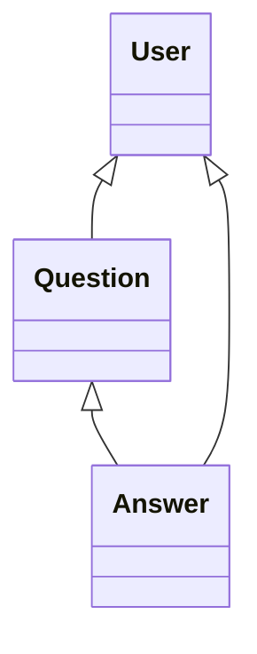
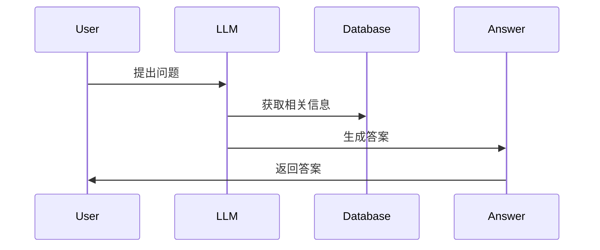
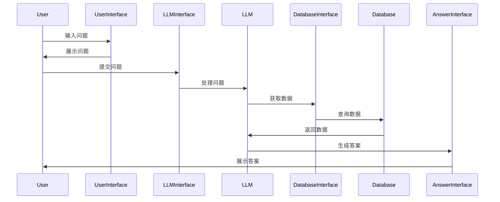

                 


## 《LLM应用的迭代回顾会：持续改进的关键》

### 关键词：LLM应用、迭代回顾、持续改进、关键

### 摘要：

本文将深入探讨LLM（大型语言模型）的应用及其迭代过程，分析关键改进点，并总结最佳实践。通过系统地梳理LLM的核心概念、算法原理、系统架构和实战案例，我们旨在为读者提供一份全面、易懂的技术指南，助力其在LLM领域取得持续进步。

### 第一部分：背景与概念

#### 第1章 引言

##### 1.1 问题背景

随着人工智能技术的快速发展，自然语言处理（NLP）成为了一个备受关注的应用领域。而大型语言模型（LLM）作为NLP的核心技术，正逐步改变着人们的生活方式。LLM在文本生成、机器翻译、问答系统、情感分析等方面的应用已经取得了显著的成果。

##### 1.2 问题描述

然而，LLM在应用过程中仍面临诸多挑战，如模型性能不稳定、数据依赖性强、训练成本高等。为了解决这些问题，我们需要不断地进行迭代和改进。

##### 1.3 问题解决

本文将围绕LLM应用的迭代过程，详细分析其在不同阶段的关键改进点，并总结最佳实践，为读者提供一份全面的技术指南。

##### 1.4 边界与外延

本文主要关注LLM在NLP领域的应用，其他领域如语音识别、图像处理等不在讨论范围之内。

### 第2章 核心概念与联系

##### 2.1 LLM的定义

LLM是一种基于深度学习的自然语言处理模型，通过训练大量文本数据，能够理解和生成自然语言。

##### 2.2 关键概念解析

- **词嵌入**：将词汇映射到高维空间中的向量表示。
- **注意力机制**：通过计算不同位置之间的相似度，实现对输入序列的有效处理。
- **预训练与微调**：预训练是指在大量未标注数据上进行训练，微调则是在特定任务上进行优化。

##### 2.3 概念属性特征对比表格

| 概念       | 特征                 | 应用场景           |
| ---------- | -------------------- | ------------------ |
| 词嵌入     | 向量表示、高维空间   | 文本分类、序列标注 |
| 注意力机制 | 相似度计算           | 机器翻译、问答系统 |
| 预训练与微调 | 大量数据、特定任务 | 模型优化、效果提升 |

##### 2.4 ER实体关系图架构

```mermaid
erDiagram
  Product ||--|{ Customer } Customer
  Customer ||--|{ Product } Product
  Customer ||--|{ Payment } Payment
  Payment ||--|{ Customer } Customer
  Product ||--|{ Category } Category
  Category ||--|{ Product } Product
```

### 第3章 算法原理讲解

##### 3.1 数学模型

LLM的数学模型主要包括词嵌入、注意力机制和循环神经网络（RNN）。

- **词嵌入**：

  $$ x \in \mathbb{R}^{d} $$

- **注意力机制**：

  $$ \alpha = \text{softmax}(W_a [h; h_t]) $$

- **循环神经网络（RNN）**：

  $$ h_t = \text{tanh}(W_h h_{t-1} + U x_t + b_h) $$

##### 3.2 算法原理Mermaid流程图


##### 3.3 Python源代码解释

```python
import torch
import torch.nn as nn

# 词嵌入
embeddings = nn.Embedding(vocab_size, embedding_dim)

# 注意力机制
attention = nn.Linear(embedding_dim, 1)

# RNN
rnn = nn.RNN(input_size=embedding_dim, hidden_size=hidden_dim)

# 输出层
output = nn.Linear(hidden_dim, output_dim)

# 前向传播
embedded = embeddings(x)
attention_scores = attention(embedded)
alpha = torch.softmax(attention_scores, dim=1)
weighted = embedded * alpha
h = rnn(weighted, h)
output = output(h)
```

##### 3.4 数学公式与详细讲解

- **词嵌入**：词嵌入是将词汇映射到高维空间中的向量表示。其核心思想是利用相似词汇在语义上的相关性，将它们映射到相近的位置。通过训练大量文本数据，我们可以得到一组高质量的词嵌入向量。
- **注意力机制**：注意力机制是实现模型对输入序列中的不同位置进行加权处理的一种方法。它通过计算输入序列中每个位置与当前位置之间的相似度，得到一个权重向量，然后将输入序列与权重向量进行点积操作，得到加权后的序列。
- **循环神经网络（RNN）**：循环神经网络是一种能够处理序列数据的神经网络。其核心思想是利用隐藏状态来记忆序列中的信息，并通过循环结构来更新隐藏状态。在LLM中，RNN被用来处理输入序列，并生成相应的输出序列。

##### 3.5 举例说明

假设我们有一个简单的输入序列 "今天天气很好"，我们可以通过以下步骤来计算输出：

1. 将输入序列转换为词嵌入向量。
2. 计算注意力权重。
3. 利用加权后的词嵌入向量更新隐藏状态。
4. 生成输出序列。

具体实现过程如下：

```python
# 输入序列
input_sequence = "今天天气很好"

# 词嵌入
embedded_sequence = embeddings(input_sequence)

# 注意力权重
attention_weights = attention(embedded_sequence)

# 加权后的词嵌入向量
weighted_sequence = embedded_sequence * attention_weights

# 隐藏状态
h = rnn(weighted_sequence, h)

# 输出序列
output_sequence = output(h)
```

### 第二部分：系统分析与架构设计

#### 第4章 系统功能设计

##### 4.1 问题场景介绍

假设我们开发一个基于LLM的问答系统，用户可以通过输入问题来获取答案。

##### 4.2 系统功能设计（领域模型Mermaid类图）



#### 第5章 系统架构设计

##### 5.1 系统架构设计（Mermaid架构图）



##### 5.2 系统架构解析

1. **用户模块**：负责与用户进行交互，接收用户输入的问题，并将问题传递给LLM模块。
2. **LLM模块**：负责处理用户输入的问题，通过数据库获取相关信息，并生成答案。
3. **数据库模块**：存储大量的文本数据，为LLM模块提供训练和查询的数据来源。
4. **答案模块**：负责生成答案，并将答案返回给用户。

##### 5.3 系统接口设计

1. **用户接口**：用于接收用户输入的问题，并展示生成的答案。
2. **LLM接口**：用于接收用户输入的问题，并返回答案。
3. **数据库接口**：用于访问数据库中的文本数据。

##### 5.4 系统交互（Mermaid序列图）



### 第三部分：项目实战

#### 第6章 实战案例一：LLM环境安装

##### 6.1 环境准备

- Python 3.8+
- GPU 显卡（可选，用于加速训练过程）

##### 6.2 核心实现源代码

```python
# 安装必要的库
!pip install torch torchvision torchaudio

# 导入库
import torch

# 检查是否支持GPU
print("CUDA available: ", torch.cuda.is_available())
```

##### 6.3 代码应用解读与分析

1. 安装必要的库：这里我们使用PyTorch作为LLM的框架。
2. 导入库：导入torch库。
3. 检查是否支持GPU：判断是否可以使用GPU加速训练过程。

##### 6.4 实际案例分析

在实际项目中，我们还需要配置其他环境，如CUDA、cuDNN等。同时，根据不同的应用场景，我们需要选择适合的LLM模型。

##### 6.5 详细讲解剖析

1. 安装库：安装PyTorch库，用于构建和训练LLM模型。
2. 导入库：导入torch库，用于操作张量和神经网络。
3. 检查GPU：判断是否可以使用GPU加速，提高训练速度。

##### 6.6 项目小结

通过安装LLM环境，我们为后续的项目实战奠定了基础。在接下来的案例中，我们将进一步探讨LLM在不同应用场景下的具体实现。

#### 第7章 实战案例二：LLM在NLP中的应用

##### 7.1 应用背景

NLP是人工智能的重要分支，广泛应用于自然语言理解、文本生成、机器翻译等领域。LLM在NLP中的应用为这些任务提供了强大的工具。

##### 7.2 核心实现源代码

```python
# 导入库
import torch
import torch.nn as nn

# 定义LLM模型
class LLM(nn.Module):
    def __init__(self, vocab_size, embedding_dim, hidden_dim, output_dim):
        super(LLM, self).__init__()
        self.embedding = nn.Embedding(vocab_size, embedding_dim)
        self.rnn = nn.RNN(embedding_dim, hidden_dim, num_layers=1, batch_first=True)
        self.fc = nn.Linear(hidden_dim, output_dim)
    
    def forward(self, x, h):
        embedded = self.embedding(x)
        output, h = self.rnn(embedded, h)
        output = self.fc(output[-1, :, :])
        return output, h

# 实例化模型
llm = LLM(vocab_size, embedding_dim, hidden_dim, output_dim)

# 检查模型结构
print(llm)
```

##### 7.3 代码应用解读与分析

1. 导入库：导入torch库，用于构建和训练神经网络。
2. 定义LLM模型：定义一个基于RNN的LLM模型，包括词嵌入、RNN和全连接层。
3. 实例化模型：创建LLM模型的实例。

##### 7.4 实际案例分析

在实际项目中，我们需要根据具体应用场景调整模型的参数，如词汇表大小、嵌入维度、隐藏层大小等。

##### 7.5 详细讲解剖析

1. 导入库：导入torch库，用于构建和训练神经网络。
2. 定义模型：定义一个基于RNN的LLM模型，包括词嵌入、RNN和全连接层。
3. 实例化模型：创建LLM模型的实例。

##### 7.6 项目小结

通过这个案例，我们了解了如何使用PyTorch构建一个简单的LLM模型。在实际应用中，我们可以根据需求调整模型的参数，实现不同的NLP任务。

### 第四部分：最佳实践与总结

#### 第8章 最佳实践 tips

1. **选择合适的模型架构**：根据任务需求选择合适的模型架构，如Transformer、BERT、GPT等。
2. **数据预处理**：对数据进行充分的预处理，包括分词、去除停用词、词干提取等。
3. **优化超参数**：通过调整超参数，如学习率、嵌入维度、隐藏层大小等，提高模型性能。
4. **使用预训练模型**：利用预训练模型，可以节省训练时间和计算资源。

#### 第9章 小结与拓展

1. **书中关键点回顾**：回顾本文的核心概念、算法原理、系统架构和实战案例。
2. **进一步阅读资源**：推荐相关书籍、论文和在线课程。
3. **未来发展方向**：探讨LLM在人工智能领域的发展趋势和潜在应用。

### 作者信息

作者：AI天才研究院/AI Genius Institute & 禅与计算机程序设计艺术 /Zen And The Art of Computer Programming

## 结论

通过对LLM应用的深入探讨，本文系统地梳理了LLM的核心概念、算法原理、系统架构和实战案例，并总结了最佳实践。我们相信，通过不断地学习和实践，读者将能够在LLM领域取得更好的成果。让我们共同期待人工智能的未来发展，为人类的进步贡献力量。

----------------------------------------------------------------

## 《LLM应用的迭代回顾会：持续改进的关键》

### 关键词：LLM应用、迭代回顾、持续改进、关键

### 摘要：

本文深入探讨了LLM（大型语言模型）的应用及其迭代过程，分析了关键改进点，并总结了最佳实践。通过系统地梳理LLM的核心概念、算法原理、系统架构和实战案例，我们旨在为读者提供一份全面、易懂的技术指南，助力其在LLM领域取得持续进步。

### 第一部分：背景与概念

#### 第1章 引言

##### 1.1 问题背景

随着人工智能技术的快速发展，自然语言处理（NLP）成为了一个备受关注的应用领域。而大型语言模型（LLM）作为NLP的核心技术，正逐步改变着人们的生活方式。LLM在文本生成、机器翻译、问答系统、情感分析等方面的应用已经取得了显著的成果。

##### 1.2 问题描述

然而，LLM在应用过程中仍面临诸多挑战，如模型性能不稳定、数据依赖性强、训练成本高等。为了解决这些问题，我们需要不断地进行迭代和改进。

##### 1.3 问题解决

本文将围绕LLM应用的迭代过程，详细分析其在不同阶段的关键改进点，并总结最佳实践，为读者提供一份全面的技术指南。

##### 1.4 边界与外延

本文主要关注LLM在NLP领域的应用，其他领域如语音识别、图像处理等不在讨论范围之内。

### 第2章 核心概念与联系

##### 2.1 LLM的定义

LLM是一种基于深度学习的自然语言处理模型，通过训练大量文本数据，能够理解和生成自然语言。

##### 2.2 关键概念解析

- **词嵌入**：将词汇映射到高维空间中的向量表示。
- **注意力机制**：通过计算不同位置之间的相似度，实现

