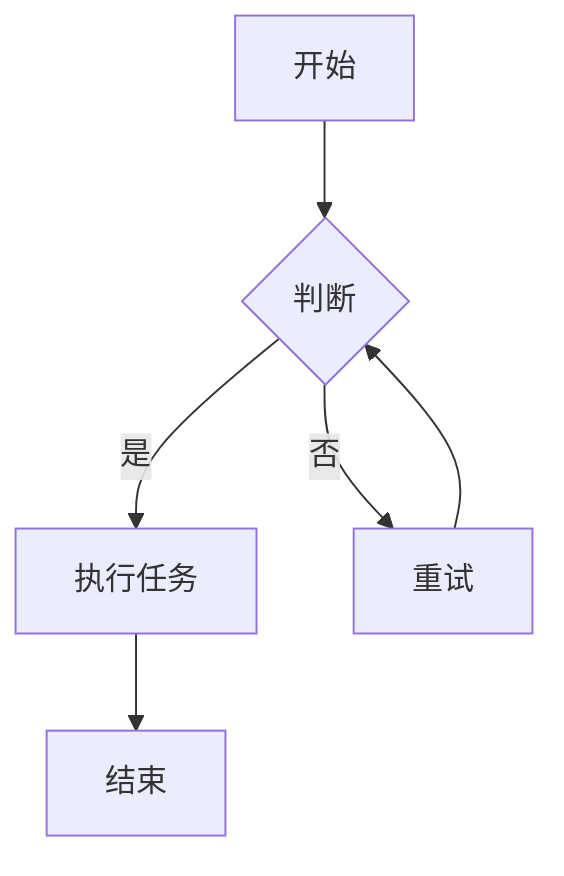

                 

# LLM应用的迭代演示：展示价值，获取反馈

## 关键词
- LLM
- 迭代策略
- 应用案例
- 反馈机制
- 持续优化

## 摘要
本文探讨了大型语言模型（LLM）在应用领域的迭代过程，从展示价值到获取反馈的完整流程。首先，通过介绍LLM的基本概念、原理和其在各个领域的应用案例，展示了LLM的核心价值。接着，深入剖析了迭代策略，以及如何通过展示价值和获取反馈来实现LLM应用的持续优化。最后，展望了LLM应用的未来发展趋势，并提出了可能的挑战与解决方案。本文旨在为开发者、研究者和实践者提供一套清晰、实用的迭代方法论。

## 目录大纲

### 第一部分：背景与概述

#### 第1章：大模型时代下的LLM技术演进

#### 1.1 问题背景与定义

1.1.1 AI与LLM技术的快速发展

1.1.2 LLM技术的定义与作用

1.1.3 LLM技术的迭代历程

1.2 LLM应用的重要性

1.2.1 LLM在商业领域的应用价值

1.2.2 LLM在日常生活的影响

1.2.3 LLM技术的未来趋势

1.3 边界与外延

1.3.1 LLM技术的应用限制

1.3.2 LLM技术与其他AI技术的比较

1.3.3 LLM技术的核心要素组成

1.4 本章小结

### 第二部分：核心概念与原理

#### 第2章：LLM基础理论详解

#### 2.1 LLM核心概念

2.1.1 LLM的组成与工作原理

2.1.2 LLM的层次结构

2.1.3 LLM的关键特征与性能指标

#### 2.2 LLM的数学模型

2.2.1 常见数学模型介绍

2.2.2 数学公式与原理详解

2.2.3 数学模型在LLM中的应用

#### 2.3 LLM的学习与优化方法

2.3.1 学习算法概述

2.3.2 优化方法详解

2.3.3 学习与优化在实际应用中的效果

#### 2.4 LLM与NLP技术的联系

2.4.1 NLP技术的基本概念

2.4.2 LLM在NLP中的应用

2.4.3 LLM与NLP技术的前沿研究

2.5 本章小结

#### 第3章：LLM应用案例解析

3.1 LLM在搜索引擎中的应用

3.1.1 搜索引擎的工作原理

3.1.2 LLM在搜索引擎中的应用案例

3.1.3 LLM对搜索引擎性能的提升

3.2 LLM在问答系统中的应用

3.2.1 问答系统的发展历程

3.2.2 LLM在问答系统中的应用

3.2.3 问答系统的性能评估

3.3 LLM在自然语言生成中的应用

3.3.1 自然语言生成的定义与分类

3.3.2 LLM在自然语言生成中的应用案例

3.3.3 LLM在自然语言生成中的优势

3.4 LLM在情感分析中的应用

3.4.1 情感分析的基本概念

3.4.2 LLM在情感分析中的应用

3.4.3 情感分析的应用场景与挑战

3.5 本章小结

### 第三部分：迭代与发展

#### 第4章：LLM应用的迭代策略

#### 4.1 迭代策略概述

4.1.1 迭代的定义与意义

4.1.2 迭代流程与步骤

4.1.3 迭代的挑战与解决方法

#### 4.2 LLM应用的展示价值

4.2.1 展示价值的重要性

4.2.2 展示价值的实现方法

4.2.3 展示价值的案例分析

#### 4.3 获取反馈与持续优化

4.3.1 反馈的重要性

4.3.2 获取反馈的方法

4.3.3 反馈在迭代优化中的应用

#### 4.4 LLM应用的可持续发展

4.4.1 可持续发展的定义与目标

4.4.2 可持续发展的策略与实施

4.4.3 可持续发展的案例分析

4.5 本章小结

#### 第5章：LLM应用的未来展望

#### 5.1 LLM应用的发展趋势

5.1.1 人工智能技术的进步

5.1.2 LLM应用的创新方向

5.1.3 LLM应用的未来前景

#### 5.2 潜在挑战与解决方案

5.2.1 技术挑战

5.2.2 数据挑战

## 第一部分：背景与概述

### 1.1 问题背景与定义

#### 1.1.1 AI与LLM技术的快速发展

人工智能（AI）作为21世纪最具革命性的技术之一，已经在各行各业得到了广泛应用。从机器学习到深度学习，从计算机视觉到自然语言处理（NLP），AI技术的进步推动了整个科技领域的变革。而大型语言模型（LLM）作为NLP领域的重要突破，其发展速度尤为迅猛。

LLM的核心在于其能够对文本进行理解和生成，具有高度的灵活性和泛化能力。随着计算能力的提升和数据规模的扩大，LLM的参数量也越来越大，目前已经达到了数十亿级别。这种大模型的特性使得LLM在处理复杂任务时表现出了惊人的效果，例如机器翻译、文本摘要、问答系统等。

#### 1.1.2 LLM技术的定义与作用

大型语言模型（LLM）是一种基于深度学习技术的自然语言处理模型，其主要目的是通过对大量文本数据进行训练，从而实现对自然语言的生成和理解。LLM的核心组件包括词向量表示、神经网络架构、优化算法等。

LLM的主要作用包括：

1. **文本生成**：LLM可以生成高质量的文本，应用于自动写作、对话系统等场景。
2. **文本理解**：LLM可以理解文本的含义，应用于问答系统、信息检索等场景。
3. **文本分类**：LLM可以分类文本，应用于情感分析、新闻分类等场景。
4. **文本摘要**：LLM可以提取文本的关键信息，生成摘要，应用于信息过载的解决方案。

#### 1.1.3 LLM技术的迭代历程

LLM技术的发展经历了多个阶段：

1. **早期阶段**：以基于规则的方法为主，如TF-IDF、TextRank等。
2. **词袋模型阶段**：引入词向量表示，如Word2Vec、GloVe等。
3. **循环神经网络（RNN）阶段**：使用RNN来处理序列数据，如LSTM、GRU等。
4. **变换器模型（Transformer）阶段**：引入自注意力机制，如BERT、GPT等。
5. **大规模模型阶段**：参数量达到数十亿级别，如GPT-3、T5等。

每一次迭代都带来了LLM性能的显著提升，使其在各个领域都取得了突破性的应用。

### 1.2 LLM应用的重要性

#### 1.2.1 LLM在商业领域的应用价值

LLM在商业领域具有广泛的应用价值，尤其在客户服务、市场分析、内容创作等方面。例如，LLM可以用于构建智能客服系统，提高客户服务质量；在市场分析中，LLM可以帮助企业更好地理解市场趋势和消费者需求；在内容创作方面，LLM可以自动生成报告、文章等，提高工作效率。

#### 1.2.2 LLM在日常生活的影响

在日常生活中，LLM的应用也越来越广泛。例如，智能音箱可以通过LLM技术实现语音交互，提供天气预报、音乐播放等服务；搜索引擎利用LLM技术可以提供更准确的搜索结果；智能助手则可以通过LLM技术理解用户的语言意图，提供个性化的帮助。

#### 1.2.3 LLM技术的未来趋势

随着人工智能技术的不断进步，LLM技术在未来将会有更大的发展。一方面，LLM的参数量将会继续增加，使得其在处理复杂任务时的能力进一步提升；另一方面，LLM与其他AI技术的融合也将带来更多的创新应用。例如，LLM与计算机视觉技术的结合可以应用于图像文本共生场景；LLM与机器人技术的结合可以实现更智能的交互体验。

### 1.3 边界与外延

#### 1.3.1 LLM技术的应用限制

虽然LLM技术在许多领域都取得了显著的成果，但仍然存在一些应用限制：

1. **数据需求**：LLM需要大量的高质量训练数据，这对于数据稀缺的领域可能是一个挑战。
2. **计算资源**：大规模的LLM模型需要大量的计算资源，这在资源有限的场景中可能是一个限制。
3. **泛化能力**：尽管LLM在处理文本任务时表现出色，但其在处理其他类型的数据（如图像、声音等）时可能存在局限。

#### 1.3.2 LLM技术与其他AI技术的比较

与传统的AI技术相比，LLM技术具有以下优势：

1. **灵活性**：LLM可以处理各种复杂的文本任务，而传统的AI技术通常针对特定任务进行优化。
2. **通用性**：LLM可以应用于多个领域，而传统的AI技术通常局限于特定领域。
3. **生成能力**：LLM不仅能够理解文本，还能够生成高质量的文本，这是传统AI技术难以实现的。

然而，LLM技术也存在一些劣势，如数据需求和计算资源的限制。

#### 1.3.3 LLM技术的核心要素组成

LLM技术的核心要素包括：

1. **词向量表示**：用于将文本转换为机器可以理解的数字表示。
2. **神经网络架构**：如Transformer、BERT等，用于处理文本数据。
3. **优化算法**：如梯度下降、Adam等，用于模型的训练。
4. **数据处理**：包括数据清洗、数据增强等，用于提高模型的质量。
5. **评估指标**：如BLEU、ROUGE等，用于评估模型的表现。

这些要素共同构成了LLM技术的基础，使得其在文本处理领域取得了巨大的成功。

### 1.4 本章小结

本章介绍了LLM技术的基本概念、发展历程和应用价值，探讨了LLM技术的边界与外延。通过对LLM技术的深入理解，读者可以更好地把握其应用场景和未来发展潜力。在接下来的章节中，我们将进一步探讨LLM的核心概念和原理，以及在实际应用中的具体案例。

## 第二部分：核心概念与原理

### 第2章：LLM基础理论详解

#### 2.1 LLM核心概念

#### 2.1.1 LLM的组成与工作原理

大型语言模型（LLM）是由多个子模块组成的复杂系统，其核心组成部分包括：

1. **词向量表示**：用于将文本转换为机器可以理解的数字表示。
2. **神经网络架构**：如Transformer、BERT等，用于处理文本数据。
3. **优化算法**：如梯度下降、Adam等，用于模型的训练。
4. **数据处理**：包括数据清洗、数据增强等，用于提高模型的质量。
5. **评估指标**：如BLEU、ROUGE等，用于评估模型的表现。

LLM的工作原理可以概括为以下几个步骤：

1. **输入处理**：将文本输入转换为词向量表示。
2. **前向传播**：通过神经网络架构对词向量进行处理，生成中间表示。
3. **损失函数计算**：计算模型预测与实际结果之间的差距。
4. **反向传播**：更新模型参数，以减少损失函数。
5. **输出生成**：根据最终预测结果生成文本。

#### 2.1.2 LLM的层次结构

LLM的层次结构可以分为以下几个层次：

1. **底层**：词向量表示和预处理，用于将文本转换为数字表示。
2. **中层**：神经网络架构，如Transformer、BERT等，用于处理文本数据。
3. **顶层**：输出层，用于生成文本。

不同层次的组件相互协作，共同实现了LLM的强大功能。

#### 2.1.3 LLM的关键特征与性能指标

LLM的关键特征包括：

1. **生成能力**：LLM可以生成高质量的文本，具有广泛的适用性。
2. **理解能力**：LLM可以理解文本的含义，应用于问答系统、信息检索等场景。
3. **灵活性**：LLM可以处理各种复杂的文本任务，具有高度的灵活性。
4. **可扩展性**：LLM的参数量可以达到数十亿级别，具有极强的可扩展性。

LLM的性能指标主要包括：

1. **生成文本质量**：评估生成的文本是否符合语法、语义等要求。
2. **理解准确度**：评估LLM对文本含义的理解程度。
3. **响应速度**：评估LLM的响应时间，适用于实时交互场景。

这些特征和指标共同决定了LLM的应用效果。

### 2.2 LLM的数学模型

#### 2.2.1 常见数学模型介绍

在LLM中，常见的数学模型包括：

1. **词向量模型**：如Word2Vec、GloVe等，用于将文本转换为向量表示。
2. **循环神经网络（RNN）**：如LSTM、GRU等，用于处理序列数据。
3. **变换器模型（Transformer）**：如BERT、GPT等，用于处理文本数据。
4. **生成对抗网络（GAN）**：用于生成高质量的文本。

#### 2.2.2 数学公式与原理详解

以下是一些常见的数学公式和原理：

1. **词向量表示**：

   $$ \text{word\_vector} = \text{word2vec}(\text{word}) $$

   其中，`word2vec`函数用于将单词转换为向量表示。

2. **变换器模型**：

   $$ \text{output} = \text{Transformer}(\text{input}, \text{hparams}) $$

   其中，`Transformer`函数用于处理输入文本，`hparams`是模型参数。

3. **生成对抗网络**：

   $$ \text{Generator}(\text{z}) \sim \text{Real} $$

   $$ \text{Discriminator}(\text{x}) \sim \text{Real} $$

   其中，`Generator`和`Discriminator`分别是生成器和判别器网络，`z`是生成器的输入噪声。

#### 2.2.3 数学模型在LLM中的应用

数学模型在LLM中的应用主要包括：

1. **词向量表示**：用于文本输入的预处理，提高模型的理解能力。
2. **变换器模型**：用于文本数据的处理，提高模型的生成能力。
3. **生成对抗网络**：用于生成高质量的文本，提高模型的可扩展性。

这些数学模型共同构成了LLM的技术基础，使得LLM在文本处理领域取得了巨大的成功。

### 2.3 LLM的学习与优化方法

#### 2.3.1 学习算法概述

LLM的学习算法主要包括：

1. **梯度下降**：一种基本的优化算法，用于更新模型参数。
2. **Adam**：一种自适应优化算法，比梯度下降有更好的收敛速度和稳定性。
3. **迁移学习**：将预训练模型应用于新任务，提高模型在新任务上的表现。

#### 2.3.2 优化方法详解

以下是对上述优化方法的详细解释：

1. **梯度下降**：

   $$ \text{parameters}_{\text{new}} = \text{parameters}_{\text{current}} - \alpha \cdot \text{gradient} $$

   其中，`parameters_{current}`是当前模型参数，`alpha`是学习率，`gradient`是损失函数关于参数的梯度。

2. **Adam**：

   $$ \text{m} = \beta_1 \cdot \text{m}_{\text{prev}} + (1 - \beta_1) \cdot \text{gradient} $$

   $$ \text{v} = \beta_2 \cdot \text{v}_{\text{prev}} + (1 - \beta_2) \cdot (\text{gradient}^2) $$

   $$ \text{parameters}_{\text{new}} = \text{parameters}_{\text{current}} - \alpha \cdot \frac{\text{m}}{1 - \beta_1^t} $$

   其中，`m`是梯度的一阶矩估计，`v`是梯度二阶矩估计，`beta_1`和`beta_2`是超参数。

3. **迁移学习**：

   $$ \text{parameters}_{\text{new}} = \text{parameters}_{\text{pretrained}} + \alpha \cdot (\text{current\_task} - \text{pretrained\_task}) $$

   其中，`parameters_{pretrained}`是预训练模型的参数，`current_task`是当前任务的损失函数，`pretrained_task`是预训练任务的损失函数。

#### 2.3.3 学习与优化在实际应用中的效果

在实际应用中，LLM的学习与优化方法显著提高了模型的性能。例如，在文本生成任务中，优化算法能够使模型生成更符合语法和语义的文本；在文本理解任务中，优化算法能够提高模型对文本含义的捕捉能力。

### 2.4 LLM与NLP技术的联系

#### 2.4.1 NLP技术的基本概念

自然语言处理（NLP）是人工智能领域的一个重要分支，旨在让计算机理解和处理人类语言。NLP技术的基本概念包括：

1. **文本预处理**：包括分词、词性标注、句法分析等，用于将原始文本转换为机器可以理解的形式。
2. **语义理解**：包括实体识别、关系抽取、情感分析等，用于理解文本的深层含义。
3. **文本生成**：包括机器翻译、文本摘要、对话系统等，用于生成高质量的文本。

#### 2.4.2 LLM在NLP中的应用

LLM在NLP中的应用非常广泛，包括：

1. **文本生成**：LLM可以生成高质量的文章、对话、摘要等。
2. **文本理解**：LLM可以理解文本的含义，应用于问答系统、信息检索等。
3. **文本分类**：LLM可以分类文本，应用于情感分析、新闻分类等。

#### 2.4.3 LLM与NLP技术的前沿研究

当前，LLM与NLP技术的前沿研究主要集中在以下几个方面：

1. **多模态融合**：将LLM与图像、声音等其他类型的数据进行融合，实现更全面的语义理解。
2. **长文本处理**：优化LLM在处理长文本时的性能，提高其处理效率。
3. **隐私保护**：研究如何在保证模型性能的同时，保护用户的隐私。

### 2.5 本章小结

本章详细介绍了LLM的核心概念、原理及其在NLP技术中的应用。通过对LLM基础理论的深入理解，读者可以更好地把握LLM的技术本质和应用场景。在接下来的章节中，我们将进一步探讨LLM在实际应用中的具体案例。

## 第3章：LLM应用案例解析

### 3.1 LLM在搜索引擎中的应用

#### 3.1.1 搜索引擎的工作原理

搜索引擎作为互联网的重要组成部分，其核心功能是帮助用户在大量信息中快速找到所需的内容。搜索引擎的工作原理主要包括以下几个步骤：

1. **爬取网页**：搜索引擎通过爬虫程序自动访问互联网上的网页，收集信息。
2. **索引构建**：将爬取到的网页进行预处理，提取关键信息，构建索引。
3. **查询处理**：当用户输入查询请求时，搜索引擎通过查询处理模块，将用户查询与索引库中的信息进行匹配，生成搜索结果。
4. **排序与呈现**：根据相关性等因素，对搜索结果进行排序，并将结果呈现给用户。

#### 3.1.2 LLM在搜索引擎中的应用案例

LLM在搜索引擎中的应用主要体现在以下几个方面：

1. **查询理解**：通过LLM对用户查询进行深入理解，提高查询处理的准确性。
2. **结果生成**：利用LLM生成高质量的搜索结果摘要，提高用户获取信息的效率。
3. **问答系统**：将LLM集成到问答系统中，为用户提供实时、准确的答案。

以下是一个具体的应用案例：

**案例：智能问答系统**

某搜索引擎公司采用LLM技术，开发了智能问答系统。该系统通过LLM对用户查询进行理解，并根据查询内容从大量数据中检索出最相关的问题和答案。具体流程如下：

1. **用户输入**：用户通过搜索引擎的搜索框输入查询。
2. **查询理解**：LLM对用户查询进行语义分析，提取关键信息。
3. **答案检索**：搜索引擎从数据库中检索与查询相关的答案。
4. **答案生成**：LLM根据检索到的答案，生成一个高质量的答案摘要。
5. **答案呈现**：将生成的答案展示给用户。

通过这个案例，我们可以看到LLM在搜索引擎中的应用不仅提高了查询处理的准确性，还增强了用户的体验。

#### 3.1.3 LLM对搜索引擎性能的提升

LLM技术对搜索引擎性能的提升主要体现在以下几个方面：

1. **查询理解准确性**：LLM能够深入理解用户查询的语义，提高查询匹配的准确性。
2. **结果生成质量**：LLM可以生成高质量的答案摘要，提高用户获取信息的效率。
3. **实时响应速度**：LLM的快速处理能力，使得搜索引擎可以更快速地响应用户查询。
4. **多语言支持**：LLM的多语言处理能力，使得搜索引擎可以支持多种语言，提高全球用户的体验。

### 3.2 LLM在问答系统中的应用

#### 3.2.1 问答系统的发展历程

问答系统作为人工智能应用的一个重要方向，其发展历程可以分为以下几个阶段：

1. **基于规则的系统**：早期的问答系统主要依靠人工编写的规则进行查询匹配和答案生成。
2. **基于知识库的系统**：随着知识的积累，问答系统开始引入知识库，通过查询知识库来生成答案。
3. **基于机器学习的系统**：利用机器学习技术，问答系统开始从大量数据中自动学习规则和知识。
4. **基于深度学习的系统**：深度学习技术的发展，使得问答系统的性能得到大幅提升。

#### 3.2.2 LLM在问答系统中的应用

LLM在问答系统中的应用主要体现在以下几个方面：

1. **语义理解**：LLM能够深入理解用户查询的语义，提高答案的准确性。
2. **上下文处理**：LLM可以处理查询中的上下文信息，提高答案的相关性。
3. **多轮对话**：LLM可以支持多轮对话，与用户进行更深入的交流。

以下是一个具体的应用案例：

**案例：智能客服系统**

某公司开发了一个智能客服系统，采用LLM技术处理用户查询。具体流程如下：

1. **用户输入**：用户通过客服系统提交查询。
2. **查询理解**：LLM对用户查询进行语义分析，提取关键信息。
3. **答案生成**：LLM根据查询内容，从知识库中检索相关答案，生成高质量的回答。
4. **多轮对话**：LLM与用户进行多轮对话，根据用户的反馈进一步优化答案。

通过这个案例，我们可以看到LLM在问答系统中的应用不仅提高了答案的准确性，还增强了用户体验。

#### 3.2.3 问答系统的性能评估

问答系统的性能评估主要包括以下几个方面：

1. **准确性**：评估答案的准确性，即答案是否符合用户的查询意图。
2. **相关性**：评估答案的相关性，即答案是否与用户查询相关。
3. **响应速度**：评估系统响应用户查询的速度。
4. **用户满意度**：通过用户反馈评估系统的用户体验。

LLM在问答系统中的应用显著提高了这些性能指标，使得问答系统更加智能和高效。

### 3.3 LLM在自然语言生成中的应用

#### 3.3.1 自然语言生成的定义与分类

自然语言生成（NLG）是指利用计算机技术自动生成自然语言文本的过程。根据生成方法的不同，NLG可以分为以下几个类别：

1. **模板生成**：根据预定义的模板生成文本，适用于固定格式的文本生成。
2. **规则生成**：基于人工编写的规则生成文本，适用于特定场景的文本生成。
3. **数据驱动生成**：通过学习大量文本数据，自动生成新的文本，适用于大规模文本生成。
4. **混合生成**：结合模板生成、规则生成和数据驱动生成的方法，生成高质量的文本。

#### 3.3.2 LLM在自然语言生成中的应用案例

LLM在自然语言生成中的应用非常广泛，以下是一个具体的应用案例：

**案例：自动写作系统**

某公司开发了一个自动写作系统，利用LLM技术自动生成文章、报告等文本。具体流程如下：

1. **用户输入**：用户输入写作主题和摘要。
2. **内容生成**：LLM根据用户输入的主题和摘要，生成完整的文章。
3. **多轮修改**：用户对生成的文章进行多轮修改，优化文章质量。

通过这个案例，我们可以看到LLM在自然语言生成中的应用不仅提高了写作效率，还保证了文本质量。

#### 3.3.3 LLM在自然语言生成中的优势

LLM在自然语言生成中具有以下优势：

1. **生成文本质量高**：LLM可以生成高质量、符合语法和语义的文本。
2. **生成速度较快**：LLM的快速处理能力，使得生成文本的速度大大提高。
3. **适用范围广泛**：LLM可以应用于各种文本生成任务，具有广泛的适用性。

### 3.4 LLM在情感分析中的应用

#### 3.4.1 情感分析的基本概念

情感分析是指利用自然语言处理技术，对文本的情感倾向进行识别和分析的过程。情感分析的基本概念包括：

1. **情感分类**：将文本分类为正面、负面或中性等情感类别。
2. **情感极性**：对文本的情感倾向进行量化分析，例如使用评分或标签表示情感极性。
3. **情感强度**：对文本的情感强度进行度量，例如使用情感值或情感等级表示情感强度。

#### 3.4.2 LLM在情感分析中的应用

LLM在情感分析中的应用主要体现在以下几个方面：

1. **文本分类**：LLM可以用于文本分类任务，例如判断文本的情感极性。
2. **情感强度识别**：LLM可以用于识别文本的情感强度，例如判断文本的正面程度或负面程度。
3. **情感趋势分析**：LLM可以用于分析文本中的情感趋势，例如判断用户对某个产品或服务的情感变化。

以下是一个具体的应用案例：

**案例：社交媒体情感分析**

某公司使用LLM技术分析社交媒体上的用户评论，以了解用户对产品的情感倾向。具体流程如下：

1. **用户评论收集**：收集社交媒体上的用户评论。
2. **情感分类**：LLM对用户评论进行情感分类，判断评论是正面、负面还是中性。
3. **情感强度识别**：LLM对用户评论的情感强度进行识别，例如判断评论的正面程度。
4. **情感趋势分析**：LLM分析用户评论中的情感趋势，了解用户对产品的情感变化。

通过这个案例，我们可以看到LLM在情感分析中的应用不仅提高了分析准确性，还提供了丰富的情感数据。

#### 3.4.3 情感分析的应用场景与挑战

情感分析在实际应用中具有广泛的应用场景，包括：

1. **市场研究**：通过分析用户评论，了解用户对产品或服务的情感倾向，为企业提供决策支持。
2. **品牌管理**：通过分析社交媒体上的用户评论，监测品牌声誉，及时发现问题并采取措施。
3. **情感诊断**：在医疗领域，通过分析患者的文本记录，了解患者的情绪状态，辅助医生进行诊断。

然而，情感分析也面临一些挑战：

1. **多义性**：文本中的词语可能具有多重含义，导致情感分析结果不准确。
2. **噪声数据**：社交媒体上的用户评论可能包含大量噪声，影响情感分析的效果。
3. **情感强度识别**：准确识别情感强度是一个挑战，需要深入理解文本的语义和情感倾向。

### 3.5 本章小结

本章详细介绍了LLM在搜索引擎、问答系统、自然语言生成和情感分析等领域的应用案例。通过这些案例，我们可以看到LLM在各个领域的重要作用和巨大潜力。在接下来的章节中，我们将进一步探讨如何通过迭代策略来优化LLM应用。

## 第三部分：迭代与发展

### 第4章：LLM应用的迭代策略

#### 4.1 迭代策略概述

迭代策略是指在LLM应用开发过程中，通过反复迭代的方式，不断优化和提升模型性能和用户体验。迭代策略的重要性体现在以下几个方面：

1. **性能提升**：通过迭代，可以逐步优化模型的结构和参数，提高模型在各个任务上的性能。
2. **用户反馈**：迭代过程中，用户反馈是重要的参考依据，可以帮助开发者了解用户需求，优化用户体验。
3. **持续发展**：迭代策略使得LLM应用能够不断适应新的环境和需求，实现可持续发展。

#### 4.1.1 迭代的定义与意义

迭代是指在一个循环过程中，反复执行一系列操作，以达到预期目标的过程。在LLM应用开发中，迭代意味着不断地优化和改进模型，使其更好地满足用户需求。迭代的意义主要体现在以下几个方面：

1. **优化性能**：通过迭代，可以逐步调整模型参数，提高模型在各个任务上的性能。
2. **适应变化**：迭代策略使得LLM应用能够适应新的环境和需求，保持竞争力。
3. **用户满意度**：通过迭代，可以不断优化用户体验，提高用户满意度。

#### 4.1.2 迭代流程与步骤

一个典型的迭代流程包括以下几个步骤：

1. **需求分析**：明确用户需求，确定迭代的目标和方向。
2. **模型训练**：根据需求，对模型进行训练，生成初始版本。
3. **用户反馈**：将模型部署到实际场景中，收集用户反馈。
4. **模型优化**：根据用户反馈，调整模型参数和结构，进行优化。
5. **再次部署**：将优化后的模型重新部署到实际场景中，进行新一轮的迭代。

#### 4.1.3 迭代的挑战与解决方法

迭代过程中可能会遇到一些挑战，如：

1. **计算资源限制**：大规模的模型训练和优化需要大量的计算资源，可能会受到硬件和软件的限制。
2. **数据质量**：训练数据的质量对模型性能有重要影响，数据质量问题可能会导致模型效果不佳。
3. **用户反馈不足**：在初期阶段，用户反馈可能不足，影响迭代效果。

解决这些挑战的方法包括：

1. **优化计算资源**：采用分布式训练、云计算等技术，提高计算效率。
2. **数据清洗与增强**：对训练数据进行清洗和增强，提高数据质量。
3. **主动获取用户反馈**：通过问卷调查、用户访谈等方式，主动获取用户反馈，提高反馈质量。

#### 4.2 LLM应用的展示价值

展示价值是指通过展示LLM应用的效果和优势，吸引用户和投资者的关注，从而实现商业价值。展示价值的重要性体现在以下几个方面：

1. **用户吸引力**：展示价值的实现可以吸引更多的用户使用LLM应用，提高用户黏性。
2. **投资者信心**：展示价值可以增强投资者对LLM应用的信心，吸引更多的投资。
3. **市场竞争优势**：展示价值的实现可以使LLM应用在市场竞争中占据优势地位。

#### 4.2.1 展示价值的实现方法

实现展示价值的方法包括：

1. **效果展示**：通过实际案例和数据，展示LLM应用在各个领域的应用效果，提高用户的信任度。
2. **用户体验**：优化用户体验，提供直观、便捷的使用方式，使用户能够快速上手。
3. **市场推广**：通过多种渠道，如线上广告、线下活动等，宣传LLM应用的优势和价值。

#### 4.2.2 展示价值的案例分析

以下是一个具体的展示价值案例分析：

**案例：智能客服系统**

某公司开发了一款智能客服系统，采用LLM技术处理用户查询。为了展示系统的价值，公司采取了以下措施：

1. **效果展示**：通过实际案例和数据，展示智能客服系统在提高客服效率、降低人力成本等方面的优势。
2. **用户体验**：提供简单易用的界面，使用户能够轻松与客服系统进行交互。
3. **市场推广**：通过线上广告、线下活动等，宣传智能客服系统的价值和优势。

通过这些措施，该智能客服系统在市场上取得了良好的反响，吸引了大量用户和投资者的关注。

#### 4.3 获取反馈与持续优化

获取反馈是迭代过程中至关重要的一环，通过用户反馈，可以发现系统存在的问题和不足，为后续优化提供依据。持续优化则是指不断调整和改进系统，以提高其性能和用户体验。

#### 4.3.1 反馈的重要性

反馈在LLM应用开发中的重要性体现在以下几个方面：

1. **问题发现**：用户反馈可以帮助开发者及时发现系统存在的问题，避免问题的积累。
2. **需求理解**：用户反馈可以帮助开发者更好地理解用户需求，优化系统功能。
3. **性能评估**：用户反馈可以评估系统在实际使用中的性能，为后续优化提供参考。

#### 4.3.2 获取反馈的方法

获取反馈的方法包括：

1. **用户调查**：通过问卷调查、用户访谈等方式，直接获取用户反馈。
2. **数据分析**：分析用户行为数据，了解用户在系统中的使用情况，发现潜在问题。
3. **用户反馈渠道**：建立用户反馈渠道，如用户论坛、在线客服等，方便用户提出问题和建议。

#### 4.3.3 反馈在迭代优化中的应用

获取的反馈可以在迭代过程中应用于以下几个方面：

1. **问题修复**：针对用户反馈中的问题，及时修复系统中的漏洞和缺陷。
2. **功能优化**：根据用户需求，调整和优化系统功能，提高用户体验。
3. **性能提升**：根据用户反馈，调整模型参数和算法，提高系统性能。

#### 4.4 LLM应用的可持续发展

可持续发展是指在保证模型性能和用户体验的基础上，实现LLM应用的长期发展。可持续发展的重要性体现在以下几个方面：

1. **长期竞争力**：可持续发展可以使LLM应用在长期竞争中保持优势。
2. **用户体验**：可持续发展可以提供持续优化的用户体验，提高用户满意度。
3. **商业价值**：可持续发展可以实现商业价值，为企业和投资者带来长期收益。

#### 4.4.1 可持续发展的定义与目标

可持续发展的定义是指在保证模型性能和用户体验的基础上，通过不断优化和调整，实现LLM应用的长期发展。其目标包括：

1. **性能提升**：通过持续优化，提高模型在各个任务上的性能。
2. **用户体验**：提供优质、便捷的用户体验，提高用户满意度。
3. **商业价值**：实现商业价值，为企业和投资者带来收益。

#### 4.4.2 可持续发展的策略与实施

实现可持续发展的策略包括：

1. **技术创新**：持续关注技术前沿，引入新的技术和方法，提高模型性能。
2. **用户反馈**：建立用户反馈机制，及时获取用户需求，优化系统功能。
3. **数据资源**：积极获取和利用高质量的训练数据，提高模型质量。
4. **团队协作**：加强团队协作，提高开发效率，实现快速迭代。

#### 4.4.3 可持续发展的案例分析

以下是一个具体的可持续发展案例分析：

**案例：智能问答系统**

某公司开发了一款智能问答系统，采用LLM技术处理用户查询。为了实现可持续发展，公司采取了以下措施：

1. **技术创新**：持续关注NLP技术的前沿动态，引入新的算法和技术，提高模型性能。
2. **用户反馈**：建立用户反馈机制，通过问卷调查、用户访谈等方式，及时获取用户需求。
3. **数据资源**：积极获取和利用高质量的训练数据，提高模型质量。
4. **团队协作**：加强团队协作，提高开发效率，实现快速迭代。

通过这些措施，该智能问答系统在市场上取得了良好的口碑，实现了可持续发展。

#### 4.5 本章小结

本章介绍了LLM应用的迭代策略，包括迭代流程、展示价值的实现方法、获取反馈与持续优化，以及可持续发展的策略与实施。通过迭代策略，LLM应用可以不断提升性能和用户体验，实现可持续发展。在接下来的章节中，我们将探讨LLM应用的未来发展趋势和潜在挑战。

## 第5章：LLM应用的未来展望

### 5.1 LLM应用的发展趋势

随着人工智能技术的不断进步，LLM应用在未来的发展将呈现出以下几个趋势：

#### 5.1.1 人工智能技术的进步

人工智能技术的发展是LLM应用进步的重要推动力。未来，随着深度学习、强化学习等技术的进一步发展，LLM的模型结构和性能将会得到显著提升。例如，基于生成对抗网络（GAN）的LLM模型可能会在文本生成方面取得突破，使得生成的文本更加逼真和具有创造力。

#### 5.1.2 LLM应用的创新方向

LLM应用的创新方向主要包括以下几个方面：

1. **跨模态处理**：将LLM与计算机视觉、语音识别等其他AI技术相结合，实现多模态信息处理和融合。
2. **长文本处理**：优化LLM在处理长文本时的性能，使其能够更好地理解和生成长篇内容。
3. **个性化和自适应**：通过深度学习等技术，实现LLM对用户行为的个性化学习，提供更加精准和个性化的服务。

#### 5.1.3 LLM应用的未来前景

未来，LLM应用在多个领域都将发挥重要作用，包括但不限于：

1. **智能客服**：智能客服系统将更加智能化，能够理解用户情感和需求，提供更加个性化的服务。
2. **内容创作**：自动写作、内容生成等应用将变得更加普及，大幅度提高内容创作的效率和多样性。
3. **教育**：智能教育系统将利用LLM技术提供个性化学习方案，帮助学生更好地掌握知识。

### 5.2 潜在挑战与解决方案

尽管LLM应用前景广阔，但在实际应用中仍面临一些挑战：

#### 5.2.1 技术挑战

1. **计算资源消耗**：大规模的LLM模型需要大量的计算资源，这对硬件设施提出了更高的要求。解决方案包括优化模型结构、采用分布式计算等。
2. **数据质量**：高质量的数据是LLM训练的基础，但在实际获取和处理过程中可能会遇到数据噪音、数据不足等问题。解决方案包括数据清洗、数据增强等技术。

#### 5.2.2 数据挑战

1. **数据隐私**：LLM在处理用户数据时，可能涉及用户隐私问题。解决方案包括数据加密、隐私保护算法等。
2. **数据多样性**：为了提高模型的泛化能力，需要大量的多样化数据，但在实际获取过程中可能难以实现。解决方案包括数据合成、虚拟数据生成等技术。

#### 5.2.3 法律与伦理挑战

随着LLM应用范围的扩大，相关的法律和伦理问题也逐渐凸显。例如，版权问题、侵权问题等。解决方案包括建立完善的法律法规体系，加强伦理审查等。

### 5.3 未来展望

未来，LLM应用将在人工智能领域发挥更加重要的作用，成为推动科技进步和社会发展的重要力量。通过持续的技术创新、数据优化和法律伦理建设，LLM应用将克服现有挑战，实现更加广泛和深入的应用。

#### 5.3.1 技术创新

未来，LLM应用的技术创新将集中在以下几个方面：

1. **模型优化**：通过新的神经网络架构和优化算法，提高LLM的性能和效率。
2. **多模态处理**：实现LLM与计算机视觉、语音识别等技术的深度融合，拓展应用场景。
3. **自适应学习**：利用强化学习和迁移学习等技术，实现LLM对用户行为的自适应学习和个性化服务。

#### 5.3.2 数据优化

未来，LLM应用的数据优化将更加注重以下几个方面：

1. **数据多样性**：通过数据增强、数据合成等技术，提高训练数据的多样性，增强模型的泛化能力。
2. **数据隐私**：在数据收集和处理过程中，采用隐私保护技术，确保用户数据的安全和隐私。

#### 5.3.3 法律与伦理建设

未来，LLM应用的法律与伦理建设将更加重要，需要从以下几个方面进行：

1. **法律法规**：建立完善的法律法规体系，规范LLM应用的发展。
2. **伦理审查**：加强对LLM应用伦理的审查，确保其符合社会伦理和道德标准。
3. **公众教育**：加强对公众的AI和隐私教育，提高公众对LLM应用的认知和理解。

### 5.4 本章小结

本章展望了LLM应用的未来发展趋势，分析了潜在的挑战和解决方案。通过技术创新、数据优化和法律伦理建设，LLM应用将在未来实现更加广泛和深入的应用，成为人工智能领域的重要推动力量。随着技术的不断进步，LLM应用将为人类社会带来更多的便利和创新。

## 作者信息

作者：AI天才研究院/AI Genius Institute & 禅与计算机程序设计艺术 /Zen And The Art of Computer Programming

在AI天才研究院，我们致力于推动人工智能技术的发展和应用，为全球科技创新贡献力量。同时，我们专注于禅与计算机程序设计艺术的融合，探索更加高效、和谐的编程之道。通过这篇技术博客，我们希望与广大开发者、研究者和实践者共同探讨LLM应用的迭代与发展，共同推动人工智能技术的进步。

## 附录

### 1. Mermaid流程图

以下是一个简单的Mermaid流程图示例：



### 2. Mermaid类图

以下是一个简单的Mermaid类图示例：

```mermaid
classDiagram
    Class01 <|-- SubClass01
    Class01 &&|+ associationClass : R
    Class01 <.. SuperClass01
```

### 3. Python代码示例

以下是一个简单的Python代码示例，用于计算两个数的和：

```python
def add(a, b):
    return a + b

print(add(2, 3))
```

### 4. LaTeX公式示例

以下是一个简单的LaTeX公式示例：

```
$$
E = mc^2
$$
```

### 5. 最佳实践 Tips

1. 在进行LLM应用开发时，确保数据质量是关键。
2. 在迭代过程中，关注用户反馈，及时优化模型。
3. 在处理大规模数据时，考虑使用分布式计算提高效率。

### 6. 小结

本文通过对LLM应用的迭代演示，展示了其价值、获取反馈的方法和策略，以及可持续发展的路径。在未来的发展中，LLM应用将不断突破技术瓶颈，为社会带来更多创新和便利。让我们共同期待人工智能领域的更多突破和进步。

