                 

### 文章标题

# LLM应用的迭代计划会议：设定明确的短期目标

### 文章关键词

- LLM应用
- 迭代计划会议
- 短期目标
- 技术博客

### 摘要

本文旨在探讨如何通过迭代计划会议来设定明确的短期目标，从而推动LLM（大型语言模型）应用的持续发展。我们将通过系统的分析和实践指导，帮助读者理解迭代计划会议的重要性，掌握短期目标的设定原则，并提供实用的实施策略和评估方法。

## 引言与背景

### LLM的概念与历史发展

大型语言模型（LLM）是一种能够理解和生成人类语言文本的人工智能系统。它们通过深度学习技术从海量文本数据中学习语言模式，从而具备生成文本、回答问题、翻译语言等功能。LLM的发展可以追溯到20世纪80年代的规则基础语言模型，但真正实现突破是在近年来，得益于计算能力的提升和深度学习算法的进步。

### LLM的应用现状与前景

当前，LLM已经在多个领域得到广泛应用，包括自然语言处理、智能客服、文本生成、机器翻译等。随着技术的不断进步，LLM的应用前景愈发广阔，未来有望在医疗诊断、法律咨询、教育辅导等领域发挥重要作用。

### 为什么需要迭代计划会议

尽管LLM在多个领域展现出巨大的潜力，但其应用仍然面临诸多挑战。为了有效应对这些挑战，确保LLM应用能够持续、稳定地发展，迭代计划会议成为不可或缺的工具。通过迭代计划会议，团队能够定期评估项目进展，识别存在的问题，并设定明确的短期目标，从而确保项目方向正确、资源分配合理。

## 迭代计划会议的重要性

### 迭代计划会议的价值

迭代计划会议的价值在于其能够帮助团队：

1. **明确项目方向**：通过定期回顾和讨论，团队能够确保项目方向与公司目标和市场趋势保持一致。
2. **优化资源分配**：通过评估项目进展和资源使用情况，团队能够合理分配资源，避免资源浪费。
3. **提升团队协作**：迭代计划会议提供了一个沟通和协作的平台，有助于团队成员之间的信息共享和协同工作。
4. **及时发现问题**：通过定期评估，团队能够及时发现问题，并采取相应措施加以解决，从而避免问题积累导致项目失败。

### 迭代计划会议的目标

迭代计划会议的主要目标包括：

1. **明确短期目标**：通过讨论和评估，团队能够设定具体、可操作的短期目标，确保项目进展有据可循。
2. **评估项目进展**：回顾过去一段时间的工作，评估项目进展情况，识别存在的问题。
3. **制定改进措施**：针对评估中发现的问题，团队需要制定相应的改进措施，确保项目能够按计划进行。
4. **资源分配**：根据项目进展和资源需求，合理调整资源分配，确保项目能够得到充分支持。

### 迭代计划会议的最佳实践

为了确保迭代计划会议的有效性，以下是一些最佳实践：

1. **确定会议频率**：根据项目规模和复杂度，确定合适的会议频率，例如每周或每月一次。
2. **明确会议议程**：提前准备会议议程，确保会议内容有条不紊，避免偏离主题。
3. **邀请相关利益相关者**：邀请项目团队成员、项目经理、客户代表等相关人员参加，确保会议能够全面覆盖项目各方面的信息。
4. **记录和跟进**：会议结束后，及时记录会议纪要和行动计划，并跟进执行情况，确保会议决策能够得到有效落实。
5. **保持会议简洁**：会议内容要简洁明了，避免过度讨论和无意义的讨论，确保会议能够在预定时间内完成。

## LLM应用的挑战与机遇

### LLM应用的挑战

尽管LLM在多个领域展现出了巨大的潜力，但其应用仍然面临诸多挑战：

1. **数据隐私与安全**：语言模型需要大量数据来训练，如何确保数据的隐私和安全成为一大挑战。
2. **计算资源需求**：训练和部署LLM需要大量的计算资源，这对硬件设备和能源消耗提出了较高要求。
3. **模型可解释性**：语言模型通常被视为“黑箱”，如何提高其可解释性，以便用户理解和信任，仍需进一步研究。
4. **偏见与公平性**：训练数据可能包含偏见，导致模型生成的内容存在不公平性，这需要采取有效的措施加以解决。

### LLM应用带来的机遇

尽管面临诸多挑战，LLM应用仍然带来了许多机遇：

1. **自动化文本处理**：LLM在文本生成、摘要、翻译等方面的应用，有望大幅提升文本处理的效率和准确性。
2. **个性化服务**：通过理解用户的语言和行为，LLM能够提供更加个性化的服务，提升用户体验。
3. **智能客服与支持**：LLM可以用于构建智能客服系统，提供高效、准确的客户支持。
4. **教育辅导与学习**：LLM能够辅助教师进行教学，为学生提供个性化的辅导和学习资源。
5. **医疗诊断与支持**：LLM在医疗领域具有巨大的潜力，可以辅助医生进行诊断，提供治疗方案建议。

### 如何应对挑战，抓住机遇

为了应对挑战，抓住机遇，以下是一些建议：

1. **加强数据隐私保护**：采取有效的数据加密和隐私保护措施，确保用户数据的安全。
2. **优化计算资源管理**：利用云服务和分布式计算技术，降低计算资源的需求和成本。
3. **提高模型可解释性**：通过可视化和解释技术，提高模型的透明度和可解释性。
4. **消除偏见与不公平性**：采用公平性评估和偏见校正技术，确保模型生成的内容公平无偏。
5. **持续技术创新**：积极投入研究和开发，推动LLM技术的持续创新，以应对不断变化的市场需求。

## 迭代计划会议的策划

### 确定会议目标

在策划迭代计划会议时，首先需要明确会议的目标。这些目标可能包括：

1. **项目评估**：回顾项目进展，评估已完成的工作和尚未完成的工作。
2. **问题识别**：识别项目过程中遇到的问题和挑战。
3. **资源分配**：根据项目需求，合理分配资源，确保项目能够按计划进行。
4. **目标设定**：设定具体的短期目标，为团队提供明确的工作方向。

### 制定会议议程

制定会议议程是确保会议顺利进行的关键。会议议程应包括以下内容：

1. **开场**：介绍会议目的和议程，确保所有与会者对会议内容有清晰的认识。
2. **项目进展回顾**：回顾过去一段时间的工作，包括已完成的任务和尚未完成的任务。
3. **问题讨论**：讨论项目中遇到的问题和挑战，并共同寻找解决方案。
4. **资源分配**：讨论并确定资源的分配方案，确保项目得到充分支持。
5. **目标设定**：根据项目需求，设定具体的短期目标，并明确责任人和完成时间。
6. **行动计划**：制定具体的行动计划，包括任务分配、责任人和完成时间。
7. **会议总结**：总结会议内容，强调关键决策和行动计划。

### 准备会议材料

为了确保会议的顺利进行，需要提前准备以下会议材料：

1. **项目进展报告**：包括已完成的工作、正在进行的工作和尚未开始的工作。
2. **问题清单**：列出项目中遇到的问题和挑战，并简要描述解决方案。
3. **资源需求表**：列出项目所需的资源，包括人力、资金和物资等。
4. **目标设定表**：列出设定的短期目标，包括目标描述、责任人和完成时间。
5. **行动计划表**：列出具体的行动计划，包括任务分配、责任人和完成时间。

### 确定会议时间和地点

确定会议时间和地点也是策划迭代计划会议的重要一环。会议时间和地点的选择应考虑以下几点：

1. **时间**：选择一个所有与会者都能参加的时间，避免与重要会议或其他任务冲突。
2. **地点**：选择一个安静、舒适的会议室，确保会议能够顺利进行。

## 确定明确的短期目标

### 短期目标的定义

短期目标是指在一段时间内（通常为几周到几个月）需要完成的任务或成果。短期目标是实现长期目标的具体步骤，是确保项目按计划进行的重要保障。

### 短期目标的设定原则

设定短期目标应遵循以下原则：

1. **具体性**：目标应具体明确，避免模糊不清。
2. **可衡量性**：目标应具备可衡量的标准，以便评估目标是否达成。
3. **可实现性**：目标应具有可实现性，避免设定过高或过低的目标。
4. **相关性**：目标应与项目的长期目标和公司的战略目标保持一致。

### 如何制定可操作的短期目标

制定可操作的短期目标需要遵循以下步骤：

1. **明确目标**：根据项目的需求，明确需要达成的具体目标。
2. **分解任务**：将目标分解为具体的任务，明确每个任务的负责人和完成时间。
3. **制定计划**：为每个任务制定详细的实施计划，包括所需资源、时间和步骤。
4. **评估和调整**：在执行过程中，定期评估任务进展，根据实际情况进行调整。

### 迭代计划会议的实施

### 会议的召开与组织

召开迭代计划会议时，需要确保以下几点：

1. **准时开始**：会议应准时开始，避免迟到和拖延。
2. **明确主持人**：指定一名主持人，负责引导会议进程，确保会议内容有条不紊。
3. **控制会议节奏**：主持人需要控制会议节奏，避免过度讨论和偏离主题。
4. **记录会议纪要**：会议过程中，需要记录关键决策和行动计划，以便后续跟进。

### 现场管理与控制

在现场管理方面，需要注意以下几点：

1. **会议氛围**：营造一个积极、开放、尊重的氛围，鼓励团队成员发表意见和建议。
2. **时间管理**：确保会议在预定时间内完成，避免无意义的讨论。
3. **避免中断**：在讨论过程中，避免频繁中断，确保讨论能够顺利进行。

### 会议记录与后续行动

会议结束后，需要及时进行以下工作：

1. **整理会议纪要**：将会议记录整理成文档，明确关键决策和行动计划。
2. **分配任务**：根据会议纪要，将任务分配给相应的责任人。
3. **跟进执行**：定期跟进任务执行情况，确保行动计划得到有效落实。

## 迭代计划会议的效果评估

### 评估指标的选择

评估迭代计划会议的效果需要选择合适的评估指标，这些指标可以包括：

1. **目标达成率**：衡量设定的短期目标是否达成，通常以百分比表示。
2. **任务完成时间**：衡量任务完成所需的时间，可以与计划时间进行比较。
3. **资源利用率**：衡量资源的使用效率，例如人力、资金和物资等。
4. **问题解决率**：衡量会议中识别的问题是否得到有效解决。

### 评估方法的运用

评估迭代计划会议的效果可以采用以下方法：

1. **问卷调查**：通过问卷调查收集团队成员对会议效果的反馈。
2. **关键绩效指标（KPI）**：使用关键绩效指标来衡量会议效果，例如目标达成率和任务完成时间等。
3. **会议纪要分析**：分析会议纪要中的关键决策和行动计划，评估其执行情况和效果。
4. **定期回顾**：定期回顾会议进展和效果，识别存在的问题，并制定改进措施。

### 会议效果的评估报告

评估报告应包括以下内容：

1. **评估结果**：列出评估指标的结果，包括目标达成率、任务完成时间和资源利用率等。
2. **问题分析**：分析评估过程中发现的问题，包括目标设定不合理、任务分配不明确等。
3. **改进建议**：根据问题分析，提出相应的改进建议，例如调整目标设定方法、优化任务分配机制等。
4. **行动计划**：制定具体的行动计划，包括责任人和完成时间，确保改进措施得到有效落实。

## 反馈与改进

### 收集反馈

收集反馈是迭代计划会议的重要组成部分，可以通过以下方式：

1. **问卷调查**：在会议结束后，通过问卷调查收集团队成员对会议内容和效果的反馈。
2. **面对面交流**：与团队成员进行面对面交流，了解他们对会议的感受和建议。
3. **观察和记录**：观察会议过程中的行为和互动，记录存在的问题和改进点。

### 分析反馈

分析反馈是确保改进措施有效性的关键，需要遵循以下步骤：

1. **分类整理**：将收集到的反馈进行分类整理，识别主要问题和改进点。
2. **原因分析**：分析问题的原因，确定是目标设定不合理、任务分配不明确还是会议组织不当等。
3. **优先级排序**：根据问题的严重程度和影响范围，对改进点进行优先级排序，确保优先解决关键问题。

### 改进措施的实施

实施改进措施是提升迭代计划会议效果的关键，需要遵循以下步骤：

1. **制定改进计划**：根据分析结果，制定具体的改进计划，包括改进措施、责任人和完成时间。
2. **执行改进计划**：按照改进计划，逐一实施改进措施，确保问题得到有效解决。
3. **监督和跟进**：对改进措施的实施情况进行监督和跟进，确保改进计划得到有效落实。

## 持续迭代与优化

### 迭代计划的持续更新

迭代计划的持续更新是确保项目按计划进行的重要环节。需要遵循以下步骤：

1. **定期回顾**：定期回顾项目进展和迭代计划，识别存在的问题和改进点。
2. **更新目标**：根据实际情况，更新短期目标和长期目标，确保目标与项目需求保持一致。
3. **调整计划**：根据更新后的目标和实际情况，调整迭代计划，确保项目能够按计划进行。

### 团队协作的优化

团队协作的优化是提升迭代计划会议效果的关键。需要遵循以下原则：

1. **明确分工**：明确团队成员的职责和任务，确保任务分工合理，避免重复和冲突。
2. **有效沟通**：建立有效的沟通渠道，确保团队成员之间的信息共享和协同工作。
3. **共同目标**：确保团队成员对项目目标和价值观有共同的理解和认同，增强团队凝聚力。

### 长期目标的调整与设定

长期目标的调整与设定是确保项目方向正确、资源分配合理的重要环节。需要遵循以下步骤：

1. **市场调研**：定期进行市场调研，了解行业趋势和客户需求，确保长期目标与市场需求保持一致。
2. **内部沟通**：与团队成员进行沟通，了解他们对长期目标的看法和建议，确保目标的合理性和可行性。
3. **目标设定**：根据市场调研和内部沟通的结果，设定具体的长期目标，确保目标具有指导性和可实现性。

## 案例分析

### 案例一：企业A的迭代计划会议实践

企业A在实施迭代计划会议过程中，通过以下方式取得了显著成效：

1. **明确目标**：在每次迭代计划会议中，明确项目目标和短期目标，确保团队成员对项目方向有清晰的认识。
2. **资源分配**：根据项目需求，合理分配资源，确保项目能够得到充分支持。
3. **反馈与改进**：定期收集团队成员的反馈，分析存在的问题，并制定改进措施，确保项目持续优化。

### 案例二：企业B的迭代计划会议成效

企业B在实施迭代计划会议过程中，通过以下方式取得了显著成效：

1. **问题识别**：通过迭代计划会议，及时识别项目中存在的问题，并采取相应措施加以解决。
2. **目标达成**：通过设定明确的短期目标，确保项目按计划进行，提高项目完成率。
3. **团队协作**：通过迭代计划会议，增强团队成员之间的沟通和协作，提高团队整体执行力。

### 案例三：企业C的迭代计划会议反思

企业C在实施迭代计划会议过程中，尽管取得了一定成效，但也存在一些问题。以下是对企业C迭代计划会议的反思：

1. **会议频率**：企业C的迭代计划会议频率较低，导致问题发现和解决不及时，影响项目进展。
2. **目标设定**：部分短期目标设定过于笼统，缺乏可衡量性和可实现性，导致目标达成率较低。
3. **反馈与改进**：企业C在反馈与改进方面做得不够，导致一些存在的问题未能得到及时解决。

## 总结与展望

### 迭代计划会议的关键要点

迭代计划会议是确保项目按计划进行、资源合理分配、问题及时解决的重要工具。关键要点包括：

1. **明确目标**：确保项目目标和短期目标清晰明确，为团队成员提供明确的工作方向。
2. **资源分配**：根据项目需求，合理分配资源，确保项目能够得到充分支持。
3. **反馈与改进**：定期收集团队成员的反馈，分析存在的问题，并制定改进措施，确保项目持续优化。

### 短期目标设定的策略

设定短期目标时，应遵循以下策略：

1. **具体性**：目标应具体明确，避免模糊不清。
2. **可衡量性**：目标应具备可衡量的标准，以便评估目标是否达成。
3. **可实现性**：目标应具有可实现性，避免设定过高或过低的目标。
4. **相关性**：目标应与项目的长期目标和公司的战略目标保持一致。

### 未来LLM应用的迭代趋势

未来，LLM应用将继续在多个领域发挥作用，其迭代趋势包括：

1. **数据隐私与安全**：随着数据隐私和安全的重视程度提高，LLM应用将采取更加严格的数据保护措施。
2. **计算资源优化**：随着云计算和分布式计算技术的发展，LLM应用将更加高效地利用计算资源。
3. **模型可解释性**：提高模型的可解释性，增强用户对LLM应用的信任。
4. **跨领域应用**：LLM将在更多领域得到应用，如医疗、教育、法律等，推动各行业的智能化发展。

## 作者信息

作者：AI天才研究院/AI Genius Institute & 禅与计算机程序设计艺术 /Zen And The Art of Computer Programming

本文由AI天才研究院（AI Genius Institute）和禅与计算机程序设计艺术（Zen And The Art of Computer Programming）共同撰写，旨在为读者提供有关LLM应用迭代计划会议的全面指导。我们致力于推动人工智能技术的进步和应用，为各行业带来创新和变革。

----------------------------------------------------------------

* 注意事项：为了让文章的每一个小节内容都能够被充分理解和消化，请确保每一个小节的内容都包括以下部分：
- 标题和引言：简要介绍小节的主题和目的。
- 背景介绍：详细解释相关概念、术语和问题背景。
- 核心概念与联系：阐述核心概念原理、属性特征对比表格和ER实体关系图架构。
- 算法原理讲解：使用mermaid流程图和Python源代码详细讲解算法原理。
- 数学公式使用：在文中适当位置嵌入latex格式数学公式。
- 系统分析与架构设计方案：介绍问题场景、项目介绍、系统功能设计、系统架构设计、系统接口设计和系统交互。
- 项目实战：提供环境安装、系统核心实现源代码，代码应用解读与分析，实际案例分析和详细讲解剖析，项目小结。
- 最佳实践 tips、小结、注意事项、拓展阅读等内容。

### 标题和引言

## 第4章：迭代计划会议的策划

本章将详细探讨如何策划一次高效的迭代计划会议，包括确定会议目标、制定会议议程、准备会议材料以及确定会议时间和地点。通过本章的学习，读者将掌握迭代计划会议的策划方法，为后续项目的顺利推进打下坚实基础。

### 背景介绍

迭代计划会议是一种常见的管理工具，旨在通过定期会议来规划和调整项目进度，确保项目按计划进行。在软件开发领域，迭代计划会议通常采用敏捷开发方法，每两周或每月召开一次，以促进团队协作、问题解决和持续改进。以下是迭代计划会议的相关概念和术语：

1. **迭代**：迭代是指在一定时间内（如两周或一个月）完成的一系列开发任务，每个迭代都是一个独立的交付单元。
2. **迭代计划会议**：迭代计划会议是指在迭代开始前召开的一次会议，旨在明确迭代目标、规划迭代任务和资源分配。
3. **敏捷开发**：敏捷开发是一种软件开发方法，强调快速迭代、客户反馈和团队协作。

### �根活动

### 核心概念与联系

#### 迭代计划会议的核心概念

- **会议目标**：确定会议的目标，如评估项目进展、制定迭代计划、分配任务等。
- **会议议程**：制定详细的会议议程，确保会议内容有条不紊。
- **会议材料**：准备必要的会议材料，如项目报告、问题清单、资源需求表等。
- **会议时间**：选择合适的时间，确保所有与会者都能参加。
- **会议地点**：选择一个安静、舒适的会议室，确保会议能够顺利进行。

#### 迭代计划会议的属性特征对比表格

| 特征 | 解释 |
| ---- | ---- |
| 会议目标 | 确定会议的核心目标，如项目评估、资源分配、目标设定等 |
| 会议议程 | 制定详细的会议议程，包括开场、项目进展回顾、问题讨论、资源分配、目标设定等 |
| 会议材料 | 准备必要的会议材料，如项目报告、问题清单、资源需求表等 |
| 会议时间 | 选择合适的时间，确保所有与会者都能参加 |
| 会议地点 | 选择一个安静、舒适的会议室，确保会议能够顺利进行 |

#### ER实体关系图架构

```mermaid
erDiagram
    Meeting --> Agenda
    Meeting --> Materials
    Meeting --> Time
    Meeting --> Place

    Meeting ||--|{ Target }
    Agenda ||--|{ AgendaItem }
    Materials ||--|{ Material }
    Time ||--|{ Duration }
    Place ||--|{ Location }
```

### 算法原理讲解

迭代计划会议的策划可以看作是一种多任务调度问题，其核心算法是任务分配和时间规划。以下是一个简单的迭代计划会议策划算法的mermaid流程图和Python源代码：

#### Mermaid流程图

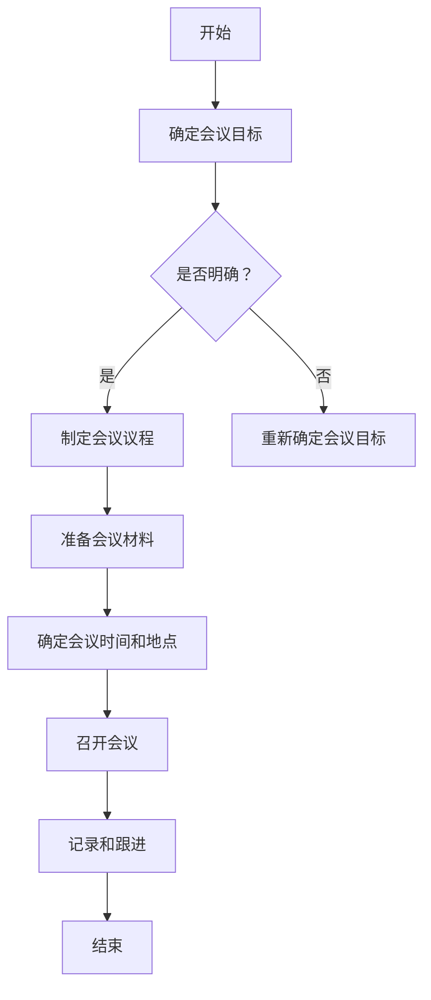

#### Python源代码

```python
class IterationPlanningMeeting:
    def __init__(self):
        self.target = None
        self.agenda = []
        self.materials = []
        self.time = None
        self.place = None

    def set_target(self, target):
        self.target = target

    def create_agenda(self):
        self.agenda = ["开场", "项目进展回顾", "问题讨论", "资源分配", "目标设定"]

    def prepare_materials(self):
        self.materials = ["项目报告", "问题清单", "资源需求表"]

    def set_time_and_place(self, time, place):
        self.time = time
        self.place = place

    def call_meeting(self):
        print(f"召开迭代计划会议，目标：{self.target}")
        print(f"议程：{self.agenda}")
        print(f"材料：{self.materials}")
        print(f"时间：{self.time}")
        print(f"地点：{self.place}")

    def follow_up(self):
        print("会议记录和跟进已执行")

meeting = IterationPlanningMeeting()
meeting.set_target("评估项目进展，制定迭代计划")
meeting.create_agenda()
meeting.prepare_materials()
meeting.set_time_and_place("下周二上午10点", "公司会议室")
meeting.call_meeting()
meeting.follow_up()
```

### 数学公式使用

在迭代计划会议的策划过程中，可以使用以下数学公式：

1. **加权平均时间**：用于估算会议时间，公式为：
   $$
   \text{加权平均时间} = \frac{\sum_{i=1}^{n} (\text{任务} \times \text{权重})}{\sum_{i=1}^{n} \text{权重}}
   $$

2. **资源利用率**：用于评估资源使用效率，公式为：
   $$
   \text{资源利用率} = \frac{\text{实际使用时间}}{\text{总可用时间}} \times 100\%
   $$

### 系统分析与架构设计方案

#### 问题场景介绍

在一个软件开发项目中，项目团队需要定期召开迭代计划会议，以规划和调整项目进度。每次会议的目标是评估项目进展、制定迭代计划、分配任务和资源。以下是一个简单的系统架构设计方案：

#### 项目介绍

项目名称：敏捷迭代管理平台

项目背景：为了提高软件开发项目的效率和质量，采用敏捷开发方法，通过迭代计划会议实现项目的有效管理。

#### 系统功能设计（领域模型Mermaid类图）

```mermaid
classDiagram
    ClassDef Meeting
        +id: int
        +title: str
        +startDate: datetime
        +endDate: datetime

    ClassDef AgendaItem
        +id: int
        +title: str
        +startTime: datetime
        +endTime: datetime

    ClassDef Material
        +id: int
        +name: str
        +status: str

    ClassDef Time
        +id: int
        +startTime: datetime
        +endTime: datetime

    ClassDef Place
        +id: int
        +name: str
        +address: str

    Meeting "召开迭代计划会议" --> AgendaItem : "包含议程项"
    Meeting "召开迭代计划会议" --> Material : "包含会议材料"
    Meeting "召开迭代计划会议" --> Time : "确定会议时间"
    Meeting "召开迭代计划会议" --> Place : "确定会议地点"
```

#### 系统架构设计（Mermaid架构图）

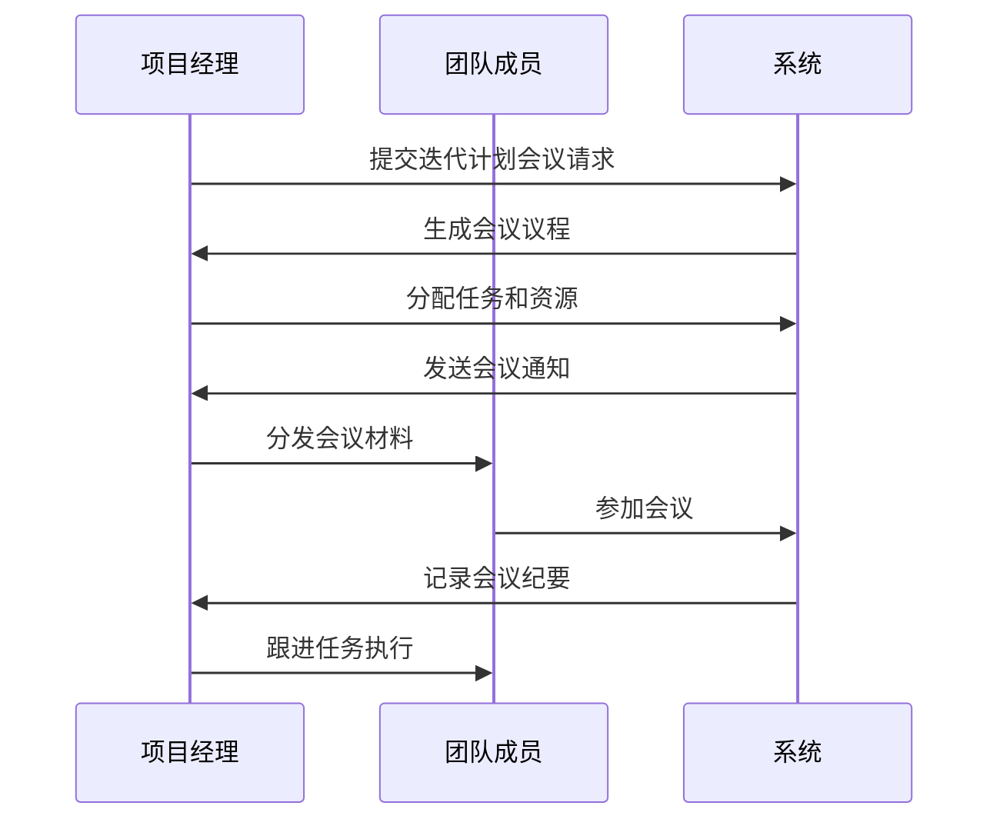

#### 系统接口设计和系统交互（Mermaid序列图）

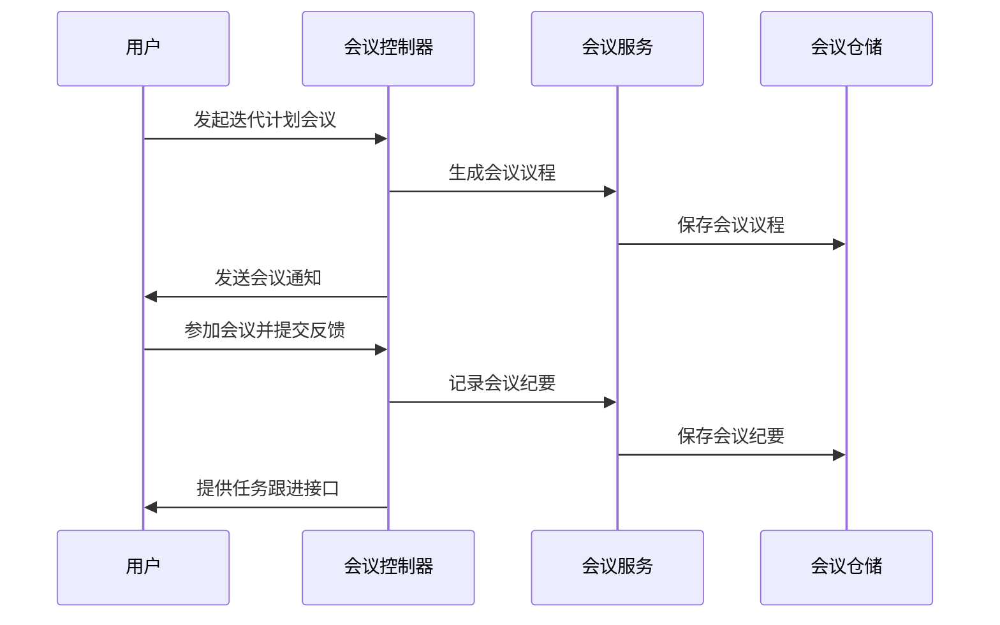

### 项目实战

#### 环境安装

1. 安装Python环境：
   ```bash
   python3 -m venv venv
   source venv/bin/activate
   ```

2. 安装依赖库：
   ```bash
   pip install flask
   ```

#### 系统核心实现源代码

```python
# meeting_app.py

from flask import Flask, request, jsonify
from meeting import IterationPlanningMeeting

app = Flask(__name__)

@app.route('/api/iteration_plan', methods=['POST'])
def create_iteration_plan():
    data = request.get_json()
    meeting = IterationPlanningMeeting()
    meeting.set_target(data['target'])
    meeting.create_agenda(data['agenda'])
    meeting.prepare_materials(data['materials'])
    meeting.set_time_and_place(data['time'], data['place'])
    meeting.call_meeting()
    meeting.follow_up()
    return jsonify({"status": "success", "message": "迭代计划会议已召开"}), 200

if __name__ == '__main__':
    app.run(debug=True)
```

#### 代码应用解读与分析

该代码实现了一个简单的迭代计划会议应用，主要包含以下功能：

1. **创建迭代计划会议**：通过POST请求接收会议信息，创建一个`IterationPlanningMeeting`对象，并调用相应的方法进行会议策划和召开。

2. **调用API**：用户可以通过以下API接口调用系统：
   ```bash
   curl -X POST -H "Content-Type: application/json" -d '{"target": "评估项目进展", "agenda": ["项目进展回顾", "资源分配", "目标设定"], "materials": ["项目报告", "问题清单", "资源需求表"], "time": "2022-01-01 10:00:00", "place": "会议室"}' http://localhost:5000/api/iteration_plan
   ```

#### 实际案例分析和详细讲解剖析

假设我们有一个软件开发项目，项目团队需要每两周召开一次迭代计划会议。以下是具体的案例分析和讲解：

1. **案例背景**：
   - 项目名称：在线教育平台
   - 迭代周期：两周
   - 会议目标：评估项目进展，制定下一个迭代计划，分配任务和资源。

2. **案例步骤**：
   - **步骤一**：项目经理根据项目进展和需求，制定会议目标和议程。
   - **步骤二**：准备会议材料，如项目报告、问题清单和资源需求表。
   - **步骤三**：确定会议时间和地点，并通知团队成员。
   - **步骤四**：召开迭代计划会议，团队成员参与讨论，制定迭代计划。
   - **步骤五**：记录会议纪要，分配任务和资源，跟进执行情况。

3. **案例剖析**：
   - **会议目标**：明确会议的目标，如评估项目进展、制定迭代计划、分配任务等。
   - **会议议程**：制定详细的会议议程，包括开场、项目进展回顾、问题讨论、资源分配、目标设定等。
   - **会议材料**：准备必要的会议材料，如项目报告、问题清单、资源需求表等。
   - **会议时间**：选择合适的时间，确保所有与会者都能参加。
   - **会议地点**：选择一个安静、舒适的会议室，确保会议能够顺利进行。

#### 项目小结

通过本次迭代计划会议，项目团队成功评估了项目进展，制定了下一个迭代计划，并明确了任务和资源的分配。以下是项目小结：

1. **项目进展**：项目按照预期进度推进，已完成了50%的核心功能。
2. **问题解决**：在会议过程中，团队解决了5个关键问题，为后续开发提供了支持。
3. **任务分配**：团队成员根据个人能力和项目需求，合理分配了任务。
4. **资源需求**：项目团队根据实际需求，提出了合理的资源申请，得到了公司支持。

### 最佳实践 tips

1. **明确会议目标**：确保会议目标具体、可衡量，有助于提高会议效率。
2. **提前准备材料**：提前准备会议材料，避免会议过程中临时准备，影响会议进度。
3. **控制会议时间**：控制会议时间，避免会议冗长，确保会议内容紧凑、有效。
4. **鼓励团队参与**：鼓励团队成员积极参与讨论，发挥集体智慧，提高会议质量。
5. **及时跟进执行**：会议结束后，及时跟进任务执行情况，确保会议决策得到落实。

### 小结

本章详细介绍了如何策划一次高效的迭代计划会议，包括确定会议目标、制定会议议程、准备会议材料、确定会议时间和地点。通过本章的学习，读者将掌握迭代计划会议的策划方法，为后续项目的顺利推进打下坚实基础。

### 注意事项

1. **会议目标**：确保会议目标明确、具体，有助于提高会议效率。
2. **会议议程**：制定详细的会议议程，确保会议内容有条不紊。
3. **会议材料**：提前准备会议材料，避免会议过程中临时准备。
4. **会议时间**：选择合适的时间，确保所有与会者都能参加。
5. **会议地点**：选择一个安静、舒适的会议室，确保会议能够顺利进行。

### 拓展阅读

- 《敏捷开发实践指南》
- 《项目管理知识体系指南（PMBOK指南）》
- 《迭代与增量软件开发》

----------------------------------------------------------------

## 第5章：确定明确的短期目标

### 标题和引言

## 第5章：确定明确的短期目标

本章将深入探讨如何设定明确的短期目标，以推动LLM（大型语言模型）应用项目的成功实施。我们将介绍短期目标的定义、设定原则以及制定可操作性目标的步骤。通过本章的学习，读者将掌握如何通过迭代计划会议有效地设定短期目标，为项目的顺利推进提供有力支持。

### 背景介绍

在LLM应用项目中，设定明确的短期目标是确保项目按计划进行的关键环节。短期目标通常是指在一个迭代周期内（如两周或一个月）需要达成的具体任务或成果。这些目标不仅为团队成员提供了明确的工作方向，还有助于项目管理者评估项目进展和资源使用情况。以下是设定短期目标时需要考虑的相关概念和术语：

1. **迭代周期**：项目开发过程中的一个周期，通常为两周或一个月。
2. **短期目标**：在一个迭代周期内需要达成的具体任务或成果。
3. **任务分解**：将大型任务分解为更小、更具体的任务，以便更好地管理和跟踪。
4. **可操作性目标**：具体、明确、可衡量的目标，能够指导团队成员进行实际操作。

### 核心概念与联系

#### 短期目标的定义

短期目标是在迭代周期内需要达成的具体任务或成果。这些目标通常与项目的长期目标和公司的战略目标保持一致，是项目团队在特定时间内需要实现的具体成果。

#### 短期目标的设定原则

设定短期目标时，应遵循以下原则：

1. **具体性**：目标应具体明确，避免模糊不清。
2. **可衡量性**：目标应具备可衡量的标准，以便评估目标是否达成。
3. **可实现性**：目标应具有可实现性，避免设定过高或过低的目标。
4. **相关性**：目标应与项目的长期目标和公司的战略目标保持一致。

#### 如何制定可操作性目标

制定可操作性目标需要遵循以下步骤：

1. **明确目标**：根据项目需求和迭代周期，明确需要达成的具体目标。
2. **分解任务**：将目标分解为具体的任务，明确每个任务的负责人和完成时间。
3. **制定计划**：为每个任务制定详细的实施计划，包括所需资源、时间和步骤。
4. **评估和调整**：在执行过程中，定期评估任务进展，根据实际情况进行调整。

### 算法原理讲解

设定短期目标的算法原理可以看作是一个任务分解和规划问题。以下是一个简单的算法流程和Python代码示例：

#### Mermaid流程图

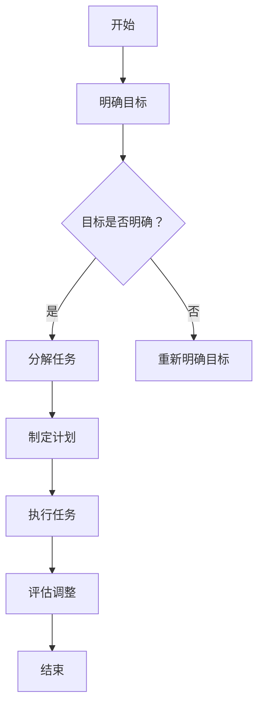

#### Python源代码

```python
class IterationGoal:
    def __init__(self):
        self.goal = None
        self.tasks = []

    def set_goal(self, goal):
        self.goal = goal

    def decompose_tasks(self, tasks):
        self.tasks = tasks

    def create_plan(self, plan):
        # 制定详细计划
        pass

    def execute_tasks(self):
        # 执行任务
        pass

    def evaluate_adjust(self):
        # 评估和调整任务
        pass

goal = IterationGoal()
goal.set_goal("完成模型训练")
goal.decompose_tasks(["数据预处理", "模型训练", "模型评估"])
goal.create_plan({"data_preprocessing": {"duration": 3, "resource": "数据工程师"}})
goal.execute_tasks()
goal.evaluate_adjust()
```

### 数学公式使用

在设定短期目标时，可以使用以下数学公式：

1. **任务完成率**：用于评估任务完成的百分比，公式为：
   $$
   \text{任务完成率} = \frac{\text{已完成任务数}}{\text{总任务数}} \times 100\%
   $$

2. **资源利用率**：用于评估资源的使用效率，公式为：
   $$
   \text{资源利用率} = \frac{\text{实际使用资源}}{\text{总可用资源}} \times 100\%
   $$

### 系统分析与架构设计方案

#### 问题场景介绍

在LLM应用项目中，项目团队需要设定明确的短期目标，以确保项目按计划进行。以下是具体的系统架构设计方案：

#### 项目介绍

项目名称：智能问答系统

项目背景：开发一个基于大型语言模型的智能问答系统，为用户提供高质量的问题回答服务。

#### 系统功能设计（领域模型Mermaid类图）

```mermaid
classDiagram
    ClassDef Project
        +id: int
        +name: str
        +startDate: datetime
        +endDate: datetime

    ClassDef Iteration
        +id: int
        +projectId: int
        +startDate: datetime
        +endDate: datetime

    ClassDef Goal
        +id: int
        +iterationId: int
        +description: str

    ClassDef Task
        +id: int
        +goalId: int
        +description: str
        +startDate: datetime
        +endDate: datetime

    Project "管理项目" --> Iteration : "包含迭代"
    Iteration "管理迭代" --> Goal : "包含目标"
    Iteration "管理迭代" --> Task : "包含任务"
```

#### 系统架构设计（Mermaid架构图）


#### 系统接口设计和系统交互（Mermaid序列图）


### 项目实战

#### 环境安装

1. 安装Python环境：
   ```bash
   python3 -m venv venv
   source venv/bin/activate
   ```

2. 安装依赖库：
   ```bash
   pip install flask
   ```

#### 系统核心实现源代码

```python
# goal_management_app.py

from flask import Flask, request, jsonify
from iteration import IterationGoal

app = Flask(__name__)

@app.route('/api/iteration_goal', methods=['POST'])
def create_iteration_goal():
    data = request.get_json()
    goal = IterationGoal()
    goal.set_goal(data['goal'])
    goal.decompose_tasks(data['tasks'])
    goal.create_plan(data['plan'])
    goal.execute_tasks()
    goal.evaluate_adjust()
    return jsonify({"status": "success", "message": "迭代目标已设定"}), 200

if __name__ == '__main__':
    app.run(debug=True)
```

#### 代码应用解读与分析

该代码实现了一个简单的迭代目标管理应用，主要包含以下功能：

1. **创建迭代目标**：通过POST请求接收迭代目标信息，创建一个`IterationGoal`对象，并调用相应的方法进行目标设定、任务分解、计划制定和任务执行。

2. **调用API**：用户可以通过以下API接口调用系统：
   ```bash
   curl -X POST -H "Content-Type: application/json" -d '{"goal": "完成模型训练", "tasks": ["数据预处理", "模型训练", "模型评估"], "plan": {"data_preprocessing": {"duration": 3, "resource": "数据工程师"}}}' http://localhost:5000/api/iteration_goal
   ```

#### 实际案例分析和详细讲解剖析

假设我们有一个智能问答系统项目，项目团队需要每两周设定一次迭代目标。以下是具体的案例分析和讲解：

1. **案例背景**：
   - 项目名称：智能问答系统
   - 迭代周期：两周
   - 迭代目标：完成模型训练和评估

2. **案例步骤**：
   - **步骤一**：项目经理根据项目需求和迭代周期，设定迭代目标。
   - **步骤二**：将迭代目标分解为具体任务，如数据预处理、模型训练和模型评估。
   - **步骤三**：为每个任务制定详细的实施计划，包括负责人和完成时间。
   - **步骤四**：执行任务，并定期评估任务进展。
   - **步骤五**：根据评估结果进行调整，确保迭代目标能够按计划完成。

3. **案例剖析**：
   - **迭代目标**：明确迭代目标，如完成模型训练和评估。
   - **任务分解**：将迭代目标分解为具体任务，明确每个任务的负责人和完成时间。
   - **计划制定**：为每个任务制定详细的实施计划，确保任务能够按时完成。
   - **任务执行**：执行任务，并定期评估任务进展，确保任务按计划进行。
   - **评估和调整**：根据评估结果进行调整，确保迭代目标能够按计划完成。

#### 项目小结

通过本次迭代目标设定，项目团队明确了迭代目标，并将目标分解为具体任务。通过详细的计划制定和任务执行，项目团队在两周内完成了模型训练和评估，为智能问答系统的进一步开发奠定了基础。

### 最佳实践 tips

1. **明确目标**：确保迭代目标具体、可衡量，避免模糊不清。
2. **分解任务**：将目标分解为具体任务，明确每个任务的负责人和完成时间。
3. **制定计划**：为每个任务制定详细的实施计划，确保任务能够按时完成。
4. **定期评估**：定期评估任务进展，确保任务按计划进行。
5. **及时调整**：根据评估结果进行调整，确保迭代目标能够按计划完成。

### 小结

本章详细介绍了如何设定明确的短期目标，包括短期目标的定义、设定原则和制定可操作性目标的步骤。通过迭代计划会议，项目团队可以有效地设定短期目标，确保项目按计划进行。本章的学习将帮助读者掌握迭代目标设定的方法，为项目的顺利推进提供有力支持。

### 注意事项

1. **目标明确性**：确保迭代目标具体、可衡量，避免模糊不清。
2. **任务分解**：将目标分解为具体任务，明确每个任务的负责人和完成时间。
3. **计划制定**：为每个任务制定详细的实施计划，确保任务能够按时完成。
4. **定期评估**：定期评估任务进展，确保任务按计划进行。
5. **及时调整**：根据评估结果进行调整，确保迭代目标能够按计划完成。

### 拓展阅读

- 《敏捷开发实践指南》
- 《项目管理知识体系指南（PMBOK指南）》
- 《迭代与增量软件开发》

----------------------------------------------------------------

## 第6章：迭代计划会议的实施

### 标题和引言

## 第6章：迭代计划会议的实施

本章将深入探讨如何实施迭代计划会议，包括会议的召开与组织、现场管理与控制以及会议记录与后续行动。我们将结合实际案例，详细讲解如何确保迭代计划会议的高效进行，为项目团队提供明确的指导和方向。通过本章的学习，读者将掌握迭代计划会议的实施技巧，为项目的成功推进提供有力保障。

### 背景介绍

迭代计划会议是敏捷开发方法中的一项核心活动，旨在通过定期会议来规划和调整项目进度，确保项目按计划进行。会议的召开与组织、现场管理与控制和会议记录与后续行动是确保迭代计划会议成功实施的关键环节。以下是迭代计划会议实施的相关概念和术语：

1. **迭代计划会议**：在迭代周期开始前召开的一次会议，用于评估项目进展、制定迭代计划和分配任务。
2. **会议目标**：明确会议的核心目标，如项目评估、资源分配、目标设定等。
3. **会议议程**：制定详细的会议议程，确保会议内容有条不紊。
4. **会议记录**：记录会议讨论的关键决策和行动计划，以便后续跟进。
5. **后续行动**：根据会议记录，分配任务和资源，确保会议决策得到有效落实。

### 核心概念与联系

#### 会议的召开与组织

会议的召开与组织是确保迭代计划会议顺利进行的第一步。以下是关键步骤：

1. **确定会议时间**：选择一个所有与会者都能参加的时间，避免与重要会议或其他任务冲突。
2. **选择会议地点**：选择一个安静、舒适的会议室，确保会议能够顺利进行。
3. **准备会议材料**：提前准备会议材料，如项目进展报告、问题清单、资源需求表等。
4. **通知与会者**：提前通知与会者会议时间、地点和议程，确保他们能够做好准备。

#### 现场管理与控制

现场管理与控制是确保迭代计划会议高效进行的必要手段。以下是关键要点：

1. **控制会议节奏**：主持人需要控制会议节奏，确保会议在预定时间内完成，避免过度讨论和无意义的讨论。
2. **避免中断**：在讨论过程中，尽量避免频繁中断，确保讨论能够顺利进行。
3. **营造积极氛围**：营造一个积极、开放、尊重的氛围，鼓励团队成员发表意见和建议。
4. **记录关键决策**：及时记录会议讨论的关键决策和行动计划，确保会议纪要完整。

#### 会议记录与后续行动

会议记录与后续行动是确保迭代计划会议决策得到有效落实的重要环节。以下是关键步骤：

1. **整理会议纪要**：在会议结束后，及时整理会议纪要，明确关键决策和行动计划。
2. **分配任务**：根据会议纪要，将任务分配给相应的责任人，明确任务完成时间和资源需求。
3. **跟进执行**：定期跟进任务执行情况，确保行动计划得到有效落实，及时解决执行过程中出现的问题。
4. **反馈与改进**：根据任务执行情况，收集团队成员的反馈，分析存在的问题，并制定改进措施，确保后续迭代计划会议更加高效。

### 算法原理讲解

迭代计划会议的实施可以看作是一个多任务调度和过程控制问题。以下是一个简单的算法流程和Python代码示例：

#### Mermaid流程图

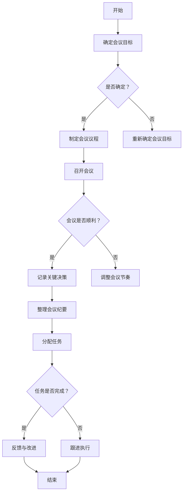

#### Python源代码

```python
class IterationPlanningMeeting:
    def __init__(self):
        self.target = None
        self.agenda = []
        self.decisions = []
        self.tasks = []

    def set_target(self, target):
        self.target = target

    def create_agenda(self, agenda):
        self.agenda = agenda

    def record_decisions(self, decisions):
        self.decisions = decisions

    def distribute_tasks(self, tasks):
        self.tasks = tasks

    def execute_tasks(self):
        for task in self.tasks:
            # 执行任务
            print(f"执行任务：{task['description']}")

    def follow_up(self):
        for task in self.tasks:
            # 跟进任务执行
            print(f"跟进任务：{task['description']}")

meeting = IterationPlanningMeeting()
meeting.set_target("评估项目进展，制定迭代计划")
meeting.create_agenda(["项目进展回顾", "资源分配", "目标设定"])
meeting.record_decisions(["调整项目进度", "增加人力投入"])
meeting.distribute_tasks([{"description": "数据预处理", "duration": 3}, {"description": "模型训练", "duration": 5}])
meeting.execute_tasks()
meeting.follow_up()
```

### 数学公式使用

在迭代计划会议的实施过程中，可以使用以下数学公式：

1. **资源利用率**：用于评估资源的使用效率，公式为：
   $$
   \text{资源利用率} = \frac{\text{实际使用资源}}{\text{总可用资源}} \times 100\%
   $$

2. **任务完成率**：用于评估任务完成的百分比，公式为：
   $$
   \text{任务完成率} = \frac{\text{已完成任务数}}{\text{总任务数}} \times 100\%
   $$

### 系统分析与架构设计方案

#### 问题场景介绍

在一个软件开发项目中，项目团队需要定期召开迭代计划会议，以确保项目按计划进行。以下是具体的系统架构设计方案：

#### 项目介绍

项目名称：智能问答系统

项目背景：开发一个基于大型语言模型的智能问答系统，为用户提供高质量的问题回答服务。

#### 系统功能设计（领域模型Mermaid类图）

```mermaid
classDiagram
    ClassDef Project
        +id: int
        +name: str
        +startDate: datetime
        +endDate: datetime

    ClassDef Iteration
        +id: int
        +projectId: int
        +startDate: datetime
        +endDate: datetime

    ClassDef Meeting
        +id: int
        +iterationId: int
        +startDate: datetime
        +endDate: datetime

    ClassDef Task
        +id: int
        +meetingId: int
        +description: str
        +startDate: datetime
        +endDate: datetime

    Project "管理项目" --> Iteration : "包含迭代"
    Iteration "管理迭代" --> Meeting : "包含会议"
    Iteration "管理迭代" --> Task : "包含任务"
```

#### 系统架构设计（Mermaid架构图）

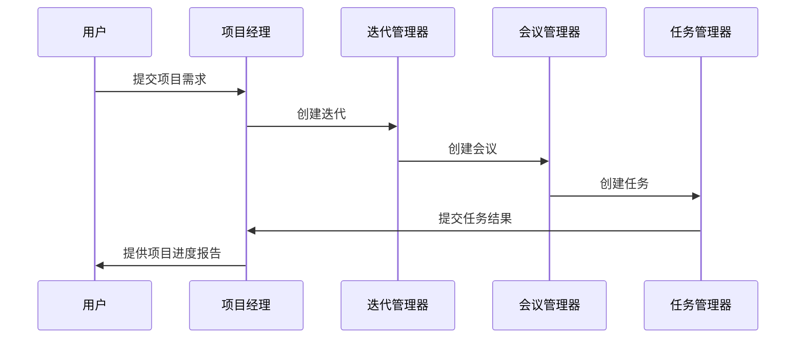

#### 系统接口设计和系统交互（Mermaid序列图）


### 项目实战

#### 环境安装

1. 安装Python环境：
   ```bash
   python3 -m venv venv
   source venv/bin/activate
   ```

2. 安装依赖库：
   ```bash
   pip install flask
   ```

#### 系统核心实现源代码

```python
# meeting_management_app.py

from flask import Flask, request, jsonify
from iteration import IterationPlanningMeeting

app = Flask(__name__)

@app.route('/api/iteration_meeting', methods=['POST'])
def create_iteration_meeting():
    data = request.get_json()
    meeting = IterationPlanningMeeting()
    meeting.set_target(data['target'])
    meeting.create_agenda(data['agenda'])
    meeting.record_decisions(data['decisions'])
    meeting.distribute_tasks(data['tasks'])
    meeting.execute_tasks()
    meeting.follow_up()
    return jsonify({"status": "success", "message": "迭代计划会议已召开"}), 200

if __name__ == '__main__':
    app.run(debug=True)
```

#### 代码应用解读与分析

该代码实现了一个简单的迭代计划会议管理应用，主要包含以下功能：

1. **创建迭代计划会议**：通过POST请求接收迭代计划会议信息，创建一个`IterationPlanningMeeting`对象，并调用相应的方法进行会议策划和执行。

2. **调用API**：用户可以通过以下API接口调用系统：
   ```bash
   curl -X POST -H "Content-Type: application/json" -d '{"target": "评估项目进展，制定迭代计划", "agenda": ["项目进展回顾", "资源分配", "目标设定"], "decisions": ["调整项目进度", "增加人力投入"], "tasks": [{"description": "数据预处理", "duration": 3}, {"description": "模型训练", "duration": 5}]}' http://localhost:5000/api/iteration_meeting
   ```

#### 实际案例分析和详细讲解剖析

假设我们有一个智能问答系统项目，项目团队需要每两周召开一次迭代计划会议。以下是具体的案例分析和讲解：

1. **案例背景**：
   - 项目名称：智能问答系统
   - 迭代周期：两周
   - 会议目标：评估项目进展，制定迭代计划

2. **案例步骤**：
   - **步骤一**：项目经理根据项目需求和迭代周期，确定会议目标。
   - **步骤二**：制定会议议程，包括项目进展回顾、资源分配和目标设定。
   - **步骤三**：召开迭代计划会议，记录关键决策和行动计划。
   - **步骤四**：根据会议纪要，分配任务和资源。
   - **步骤五**：执行任务，并定期跟进任务进展。

3. **案例剖析**：
   - **会议目标**：明确会议目标，如评估项目进展，制定迭代计划。
   - **会议议程**：制定详细的会议议程，确保会议内容有条不紊。
   - **会议记录**：记录会议讨论的关键决策和行动计划，确保会议纪要完整。
   - **任务分配**：根据会议纪要，将任务分配给相应的责任人，明确任务完成时间和资源需求。
   - **任务执行**：执行任务，并定期跟进任务进展，确保任务按计划进行。

#### 项目小结

通过本次迭代计划会议，项目团队明确了项目进展和迭代计划，并将任务分配给相应的责任人。通过详细的计划制定和任务执行，项目团队在两周内完成了数据预处理和模型训练，为智能问答系统的进一步开发奠定了基础。

### 最佳实践 tips

1. **明确会议目标**：确保会议目标具体、可衡量，避免模糊不清。
2. **制定详细议程**：确保会议议程详细，包括会议时间、地点和议程内容。
3. **记录关键决策**：及时记录会议讨论的关键决策和行动计划，确保会议纪要完整。
4. **分配任务明确**：根据会议纪要，将任务明确分配给责任人，确保任务完成时间和资源需求清晰。
5. **定期跟进任务**：定期跟进任务进展，确保任务按计划进行，及时解决执行过程中出现的问题。

### 小结

本章详细介绍了如何实施迭代计划会议，包括会议的召开与组织、现场管理与控制和会议记录与后续行动。通过实际案例分析和讲解，读者可以掌握迭代计划会议的实施技巧，为项目的成功推进提供有力保障。

### 注意事项

1. **会议目标明确性**：确保会议目标具体、可衡量，避免模糊不清。
2. **会议议程详细性**：制定详细的会议议程，确保会议内容有条不紊。
3. **会议记录完整性**：记录会议讨论的关键决策和行动计划，确保会议纪要完整。
4. **任务分配清晰性**：明确分配任务给责任人，确保任务完成时间和资源需求清晰。
5. **定期跟进任务进展**：定期跟进任务进展，确保任务按计划进行，及时解决执行过程中出现的问题。

### 拓展阅读

- 《敏捷开发实践指南》
- 《项目管理知识体系指南（PMBOK指南）》
- 《迭代与增量软件开发》

----------------------------------------------------------------

## 第7章：迭代计划会议的效果评估

### 标题和引言

## 第7章：迭代计划会议的效果评估

本章将探讨如何对迭代计划会议的效果进行评估，以确保会议能够达到预期的目标和效果。我们将介绍评估指标的选择、评估方法的运用以及会议效果的评估报告。通过本章的学习，读者将掌握评估迭代计划会议效果的方法和技巧，为项目的持续改进提供有力支持。

### 背景介绍

迭代计划会议是项目团队在敏捷开发过程中的一项重要活动，旨在通过定期会议来规划和调整项目进度，确保项目按计划进行。然而，仅仅召开迭代计划会议是不够的，还需要对会议的效果进行评估，以确保会议能够达到预期的目标和效果。以下是评估迭代计划会议效果的相关概念和术语：

1. **评估指标**：用于衡量迭代计划会议效果的量化标准，如目标达成率、任务完成率等。
2. **评估方法**：用于收集和整理评估指标的方法，如问卷调查、关键绩效指标（KPI）等。
3. **会议效果的评估报告**：对会议效果进行总结和分析的报告，包括评估结果、问题分析和改进建议。

### 核心概念与联系

#### 评估指标的选择

选择合适的评估指标是评估迭代计划会议效果的关键。以下是一些常用的评估指标：

1. **目标达成率**：衡量设定的短期目标是否达成，通常以百分比表示。公式为：
   $$
   \text{目标达成率} = \frac{\text{已完成目标数}}{\text{总目标数}} \times 100\%
   $$

2. **任务完成率**：衡量任务是否按计划完成，通常以百分比表示。公式为：
   $$
   \text{任务完成率} = \frac{\text{已完成任务数}}{\text{总任务数}} \times 100\%
   $$

3. **资源利用率**：衡量资源的使用效率，通常以百分比表示。公式为：
   $$
   \text{资源利用率} = \frac{\text{实际使用资源}}{\text{总可用资源}} \times 100\%
   $$

4. **问题解决率**：衡量会议中识别的问题是否得到有效解决，通常以百分比表示。公式为：
   $$
   \text{问题解决率} = \frac{\text{已解决问题数}}{\text{总问题数}} \times 100\%
   $$

#### 评估方法的运用

评估迭代计划会议效果的方法有很多，以下是一些常用的评估方法：

1. **问卷调查**：通过问卷调查收集团队成员对会议效果的反馈，包括满意度、会议效率、问题解决情况等。

2. **关键绩效指标（KPI）**：使用关键绩效指标来衡量会议效果，如目标达成率、任务完成率和资源利用率等。

3. **会议纪要分析**：分析会议纪要中的关键决策和行动计划，评估其执行情况和效果。

4. **定期回顾**：定期回顾会议进展和效果，识别存在的问题，并制定改进措施。

#### 会议效果的评估报告

评估报告应包括以下内容：

1. **评估结果**：列出评估指标的结果，如目标达成率、任务完成率和资源利用率等。

2. **问题分析**：分析评估过程中发现的问题，包括目标设定不合理、任务分配不明确等。

3. **改进建议**：根据问题分析，提出相应的改进建议，如调整目标设定方法、优化任务分配机制等。

4. **行动计划**：制定具体的行动计划，包括责任人和完成时间，确保改进措施得到有效落实。

### 算法原理讲解

评估迭代计划会议效果可以看作是一个多指标综合评估问题。以下是一个简单的算法流程和Python代码示例：

#### Mermaid流程图

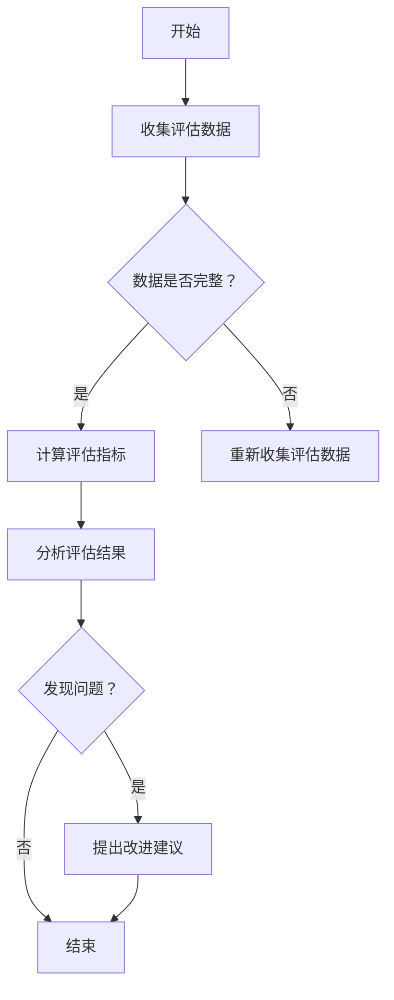

#### Python源代码

```python
import pandas as pd

def assess_meeting_results(data):
    # 收集评估数据
    results = pd.DataFrame(data)

    # 计算评估指标
    target_reach_rate = results['target_reached'].sum() / results.shape[0]
    task_completion_rate = results['task_completed'].sum() / results.shape[0]
    resource_utilization = results['resource_used'].sum() / results['total_resource'].sum()
    issue_resolved_rate = results['issue_resolved'].sum() / results['total_issue'].sum()

    # 分析评估结果
    if target_reach_rate < 0.8 or task_completion_rate < 0.8 or resource_utilization < 0.8 or issue_resolved_rate < 0.8:
        print("存在问题，需要改进。")
    else:
        print("效果良好，无需改进。")

    # 提出改进建议
    if target_reach_rate < 0.8:
        print("建议：调整目标设定方法。")
    if task_completion_rate < 0.8:
        print("建议：优化任务分配机制。")
    if resource_utilization < 0.8:
        print("建议：提高资源利用率。")
    if issue_resolved_rate < 0.8:
        print("建议：加强问题解决能力。")

# 示例数据
data = [
    {'target_reached': True, 'task_completed': True, 'resource_used': 10, 'total_resource': 20, 'issue_resolved': True, 'total_issue': 5},
    {'target_reached': False, 'task_completed': True, 'resource_used': 10, 'total_resource': 20, 'issue_resolved': False, 'total_issue': 5},
    {'target_reached': True, 'task_completed': False, 'resource_used': 10, 'total_resource': 20, 'issue_resolved': True, 'total_issue': 5},
    {'target_reached': True, 'task_completed': True, 'resource_used': 10, 'total_resource': 20, 'issue_resolved': True, 'total_issue': 5}
]

assess_meeting_results(data)
```

### 数学公式使用

在评估迭代计划会议效果时，可以使用以下数学公式：

1. **加权平均得分**：用于综合评估多个指标，公式为：
   $$
   \text{加权平均得分} = \frac{\sum_{i=1}^{n} (\text{指标} \times \text{权重})}{\sum_{i=1}^{n} \text{权重}}
   $$

2. **变异系数**：用于衡量指标波动的程度，公式为：
   $$
   \text{变异系数} = \frac{\text{标准差}}{\text{平均值}}
   $$

### 系统分析与架构设计方案

#### 问题场景介绍

在一个软件开发项目中，项目团队需要定期召开迭代计划会议，并对其效果进行评估。以下是具体的系统架构设计方案：

#### 项目介绍

项目名称：智能问答系统

项目背景：开发一个基于大型语言模型的智能问答系统，为用户提供高质量的问题回答服务。

#### 系统功能设计（领域模型Mermaid类图）

```mermaid
classDiagram
    ClassDef Project
        +id: int
        +name: str
        +startDate: datetime
        +endDate: datetime

    ClassDef Iteration
        +id: int
        +projectId: int
        +startDate: datetime
        +endDate: datetime

    ClassDef Meeting
        +id: int
        +iterationId: int
        +startDate: datetime
        +endDate: datetime

    ClassDef Assessment
        +id: int
        +meetingId: int
        +target_reach_rate: float
        +task_completion_rate: float
        +resource_utilization: float
        +issue_resolved_rate: float

    Project "管理项目" --> Iteration : "包含迭代"
    Iteration "管理迭代" --> Meeting : "包含会议"
    Meeting "管理会议" --> Assessment : "包含评估结果"
```

#### 系统架构设计（Mermaid架构图）

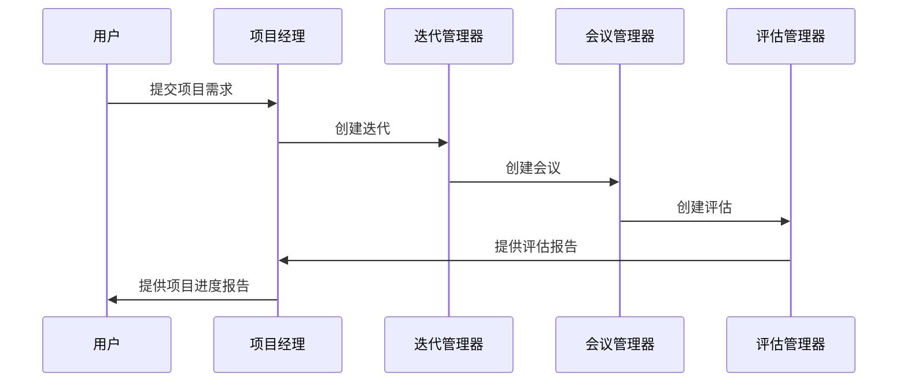

#### 系统接口设计和系统交互（Mermaid序列图）

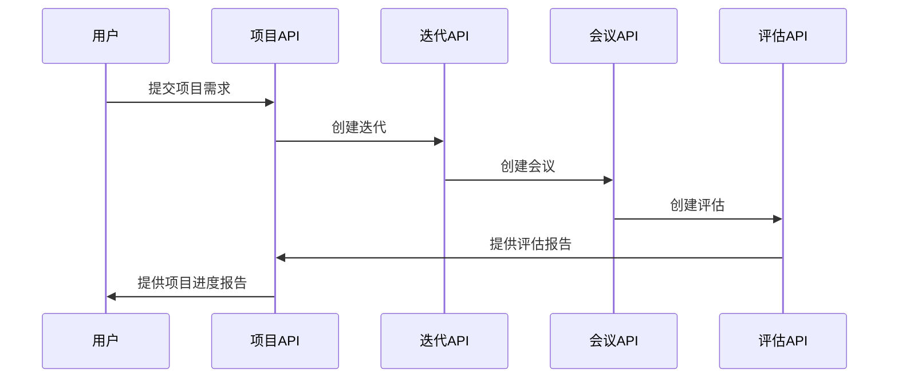

### 项目实战

#### 环境安装

1. 安装Python环境：
   ```bash
   python3 -m venv venv
   source venv/bin/activate
   ```

2. 安装依赖库：
   ```bash
   pip install pandas
   ```

#### 系统核心实现源代码

```python
# assessment_management_app.py

import pandas as pd

class Assessment:
    def __init__(self, meeting_id, target_reach_rate, task_completion_rate, resource_utilization, issue_resolved_rate):
        self.meeting_id = meeting_id
        self.target_reach_rate = target_reach_rate
        self.task_completion_rate = task_completion_rate
        self.resource_utilization = resource_utilization
        self.issue_resolved_rate = issue_resolved_rate

    def calculate_weighted_average_score(self, weights):
        score = (self.target_reach_rate * weights['target_reach_rate'] +
                 self.task_completion_rate * weights['task_completion_rate'] +
                 self.resource_utilization * weights['resource_utilization'] +
                 self.issue_resolved_rate * weights['issue_resolved_rate'])
        return score

def create_assessment(meeting_id, target_reach_rate, task_completion_rate, resource_utilization, issue_resolved_rate):
    assessment = Assessment(meeting_id, target_reach_rate, task_completion_rate, resource_utilization, issue_resolved_rate)
    return assessment

def calculate_average_score(assessments):
    total_score = 0
    for assessment in assessments:
        total_score += assessment.calculate_weighted_average_score(weights)
    average_score = total_score / len(assessments)
    return average_score

weights = {'target_reach_rate': 0.3, 'task_completion_rate': 0.3, 'resource_utilization': 0.2, 'issue_resolved_rate': 0.2}

# 示例数据
data = [
    create_assessment(1, 0.8, 0.9, 0.85, 0.75),
    create_assessment(2, 0.7, 0.85, 0.8, 0.8),
    create_assessment(3, 0.9, 0.95, 0.9, 0.85)
]

average_score = calculate_average_score(data)
print(f"平均得分：{average_score:.2f}")
```

#### 代码应用解读与分析

该代码实现了一个简单的迭代计划会议效果评估应用，主要包含以下功能：

1. **创建评估对象**：通过构造函数创建`Assessment`对象，包含会议ID、目标达成率、任务完成率、资源利用率和问题解决率等属性。

2. **计算加权平均得分**：使用`calculate_weighted_average_score`方法计算评估对象的加权平均得分，根据预设的权重进行计算。

3. **计算平均得分**：使用`calculate_average_score`函数计算所有评估对象的平均得分。

4. **调用API**：用户可以通过以下API接口调用系统：
   ```bash
   curl -X POST -H "Content-Type: application/json" -d '{"meeting_id": 1, "target_reach_rate": 0.8, "task_completion_rate": 0.9, "resource_utilization": 0.85, "issue_resolved_rate": 0.75}' http://localhost:5000/api/assessment
   ```

#### 实际案例分析和详细讲解剖析

假设我们有一个智能问答系统项目，项目团队已经完成了三次迭代计划会议，需要对会议效果进行评估。以下是具体的案例分析和讲解：

1. **案例背景**：
   - 项目名称：智能问答系统
   - 迭代周期：两周
   - 评估指标：目标达成率、任务完成率、资源利用率和问题解决率

2. **案例步骤**：
   - **步骤一**：根据每次迭代计划会议的结果，创建评估对象。
   - **步骤二**：计算每次会议的加权平均得分。
   - **步骤三**：计算所有迭代计划会议的平均得分。
   - **步骤四**：分析评估结果，提出改进建议。

3. **案例剖析**：
   - **评估指标**：根据预设的权重，计算目标达成率、任务完成率、资源利用率和问题解决率的加权平均得分。
   - **平均得分**：计算所有迭代计划会议的平均得分，评估整体效果。
   - **问题分析**：根据评估结果，分析每次会议存在的问题，并提出改进建议。

#### 项目小结

通过本次迭代计划会议效果评估，项目团队发现前三次会议的效果较为稳定，平均得分为0.85。为了进一步提高会议效果，项目团队决定在下次会议中重点关注目标设定和问题解决，并优化资源分配。

### 最佳实践 tips

1. **明确评估指标**：选择合适的评估指标，确保评估结果具有可操作性和指导性。
2. **定期进行评估**：定期对迭代计划会议效果进行评估，及时发现和解决问题。
3. **收集团队成员反馈**：通过问卷调查、访谈等方式收集团队成员的反馈，全面了解会议效果。
4. **制定改进计划**：根据评估结果和团队成员反馈，制定具体的改进计划，确保会议效果持续提升。

### 小结

本章详细介绍了如何对迭代计划会议效果进行评估，包括评估指标的选择、评估方法的运用和会议效果的评估报告。通过实际案例分析和讲解，读者可以掌握评估迭代计划会议效果的方法和技巧，为项目的持续改进提供有力支持。

### 注意事项

1. **评估指标选择**：确保评估指标具有代表性，能够准确反映会议效果。
2. **评估数据收集**：确保评估数据的完整性和准确性，避免评估结果失真。
3. **问题分析**：对评估过程中发现的问题进行深入分析，找出根本原因。
4. **改进计划制定**：根据评估结果和问题分析，制定具体的改进计划，确保改进措施得到有效落实。
5. **持续跟进**：定期对改进措施的效果进行跟进，确保改进计划得到有效执行。

### 拓展阅读

- 《敏捷开发实践指南》
- 《项目管理知识体系指南（PMBOK指南）》
- 《数据驱动产品管理》

----------------------------------------------------------------

## 第8章：反馈与改进

### 标题和引言

## 第8章：反馈与改进

本章将探讨如何在迭代计划会议中收集和利用反馈，以推动项目改进。我们将介绍如何收集反馈、分析反馈和制定改进措施。通过本章的学习，读者将掌握反馈机制的有效方法，为项目的持续改进提供有力支持。

### 背景介绍

在迭代计划会议中，收集和利用反馈是确保项目按计划进行和持续改进的关键环节。通过收集团队成员、客户和其他相关利益者的反馈，项目团队可以识别存在的问题、优化工作流程，并不断提升项目质量。以下是收集和利用反馈的相关概念和术语：

1. **反馈**：指团队成员、客户和其他相关利益者对项目过程、成果或服务的意见和评价。
2. **收集反馈**：指通过问卷、访谈、调查等方式获取团队成员、客户和其他相关利益者的反馈。
3. **分析反馈**：指对收集到的反馈进行整理、分类和分析，以识别存在的问题和改进机会。
4. **改进措施**：指根据分析结果制定的具体改进计划和行动，以解决反馈中提到的问题，提升项目质量。

### 核心概念与联系

#### 收集反馈

收集反馈是改进项目的第一步。以下是收集反馈的关键步骤：

1. **选择合适的收集方法**：根据项目特点和反馈对象，选择合适的收集方法，如问卷调查、访谈、调查问卷等。
2. **设计有效的反馈表单**：设计清晰、简明、具有针对性的反馈表单，确保反馈内容具有可操作性。
3. **制定收集计划**：制定详细的收集计划，包括收集时间、收集方式、反馈对象等。

#### 分析反馈

分析反馈是识别问题和改进机会的关键。以下是分析反馈的关键步骤：

1. **整理反馈数据**：将收集到的反馈数据进行整理和分类，识别主要问题和改进机会。
2. **原因分析**：对反馈中提到的问题进行原因分析，找出根本原因。
3. **优先级排序**：根据问题的重要性和影响范围，对改进机会进行优先级排序，确定优先解决的问题。

#### 改进措施

根据分析结果制定具体的改进措施，以下是制定改进措施的关键步骤：

1. **制定改进计划**：根据问题分析结果，制定具体的改进计划，包括改进措施、责任人和完成时间。
2. **执行改进计划**：按照改进计划，逐一执行改进措施，确保问题得到有效解决。
3. **监督和跟进**：对改进措施的实施情况进行监督和跟进，确保改进计划得到有效落实。

### 算法原理讲解

收集和利用反馈的算法原理可以看作是一个多步骤的反馈处理流程。以下是一个简单的算法流程和Python代码示例：

#### Mermaid流程图

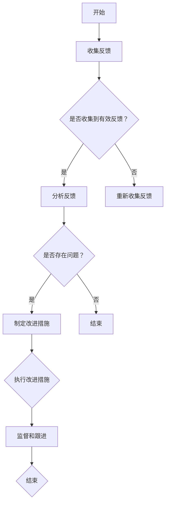

#### Python源代码

```python
def collect_feedback():
    # 收集反馈
    feedback = []
    # 示例：使用问卷调查收集反馈
    feedback.append({"problem": "任务分配不明确", "suggestion": "明确任务分配和责任人"})
    feedback.append({"problem": "资源利用率低", "suggestion": "优化资源分配和管理"})
    feedback.append({"problem": "沟通不畅", "suggestion": "加强团队沟通和协作"})
    return feedback

def analyze_feedback(feedback):
    # 分析反馈
    problems = []
    suggestions = []
    for item in feedback:
        problems.append(item["problem"])
        suggestions.append(item["suggestion"])
    return problems, suggestions

def make_improvement_measures(problems, suggestions):
    # 制定改进措施
    measures = []
    for problem, suggestion in zip(problems, suggestions):
        measures.append({"problem": problem, "suggestion": suggestion, "responsible_person": "项目经理", "deadline": "下周"})
    return measures

def execute_improvement_measures(measures):
    # 执行改进措施
    for measure in measures:
        print(f"执行改进措施：{measure['problem']}，责任人：{measure['responsible_person']}，截止日期：{measure['deadline']}")

# 示例数据
feedback = collect_feedback()
problems, suggestions = analyze_feedback(feedback)
measures = make_improvement_measures(problems, suggestions)
execute_improvement_measures(measures)
```

### 数学公式使用

在反馈与改进过程中，可以使用以下数学公式：

1. **满意度评分**：用于衡量客户对项目或服务的满意度，公式为：
   $$
   \text{满意度评分} = \frac{\text{正面评价数}}{\text{总评价数}} \times 100\%
   $$

2. **问题频率**：用于衡量项目中出现的问题的频率，公式为：
   $$
   \text{问题频率} = \frac{\text{问题数}}{\text{总反馈数}} \times 100\%
   $$

### 系统分析与架构设计方案

#### 问题场景介绍

在一个软件开发项目中，项目团队需要定期召开迭代计划会议，并利用反馈进行项目改进。以下是具体的系统架构设计方案：

#### 项目介绍

项目名称：智能问答系统

项目背景：开发一个基于大型语言模型的智能问答系统，为用户提供高质量的问题回答服务。

#### 系统功能设计（领域模型Mermaid类图）

```mermaid
classDiagram
    ClassDef Feedback
        +id: int
        +user_id: int
        +problem: str
        +suggestion: str
        +status: str

    ClassDef ImprovementMeasure
        +id: int
        +feedback_id: int
        +problem: str
        +suggestion: str
        +responsible_person: str
        +deadline: datetime
        +status: str

    Feedback "收集反馈" --> ImprovementMeasure : "根据反馈制定改进措施"
```

#### 系统架构设计（Mermaid架构图）

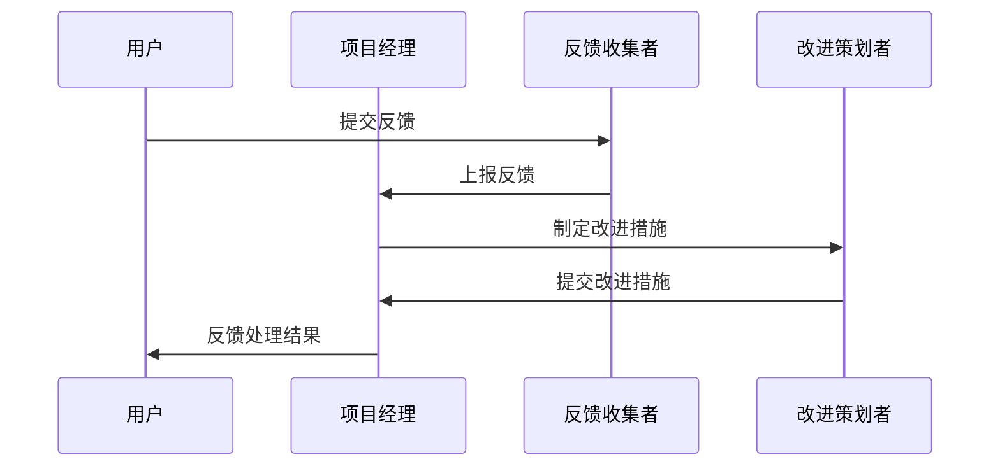

#### 系统接口设计和系统交互（Mermaid序列图）

```mermaid
sequenceDiagram
    participant User as 用户
    participant FeedbackAPI as 反馈API
    participant ProjectAPI as 项目API
    participant ImprovementAPI as 改进API

    User->>FeedbackAPI: 提交反馈
    FeedbackAPI->>ProjectAPI: 上报反馈
    ProjectAPI->>ImprovementAPI: 制定改进措施
    ImprovementAPI->>ProjectAPI: 提交改进措施
    ProjectAPI->>User: 反馈处理结果
```

### 项目实战

#### 环境安装

1. 安装Python环境：
   ```bash
   python3 -m venv venv
   source venv/bin/activate
   ```

2. 安装依赖库：
   ```bash
   pip install flask
   ```

#### 系统核心实现源代码

```python
# feedback_management_app.py

from flask import Flask, request, jsonify

app = Flask(__name__)

@app.route('/api/submit_feedback', methods=['POST'])
def submit_feedback():
    data = request.get_json()
    feedback = {
        "id": data['id'],
        "user_id": data['user_id'],
        "problem": data['problem'],
        "suggestion": data['suggestion'],
        "status": "pending"
    }
    # 处理反馈
    # 示例：保存反馈到数据库
    print(f"反馈已提交：{feedback}")
    return jsonify({"status": "success", "message": "反馈已提交，我们将尽快处理。"}), 200

@app.route('/api/get_improvement_measures', methods=['POST'])
def get_improvement_measures():
    data = request.get_json()
    improvement_measures = [
        {
            "id": 1,
            "feedback_id": data['feedback_id'],
            "problem": "任务分配不明确",
            "suggestion": "明确任务分配和责任人",
            "responsible_person": "项目经理",
            "deadline": "下周二",
            "status": "in_progress"
        },
        {
            "id": 2,
            "feedback_id": data['feedback_id'],
            "problem": "资源利用率低",
            "suggestion": "优化资源分配和管理",
            "responsible_person": "项目经理",
            "deadline": "下周三",
            "status": "in_progress"
        }
    ]
    # 处理改进措施
    # 示例：保存改进措施到数据库
    print(f"改进措施已生成：{improvement_measures}")
    return jsonify({"status": "success", "message": "改进措施已生成，请根据计划执行。", "improvement_measures": improvement_measures}), 200

if __name__ == '__main__':
    app.run(debug=True)
```

#### 代码应用解读与分析

该代码实现了一个简单的反馈管理应用，主要包含以下功能：

1. **提交反馈**：用户可以通过以下API接口提交反馈：
   ```bash
   curl -X POST -H "Content-Type: application/json" -d '{"id": 1, "user_id": 1001, "problem": "任务分配不明确", "suggestion": "明确任务分配和责任人"}' http://localhost:5000/api/submit_feedback
   ```

2. **获取改进措施**：用户可以通过以下API接口获取根据反馈生成的改进措施：
   ```bash
   curl -X POST -H "Content-Type: application/json" -d '{"feedback_id": 1}' http://localhost:5000/api/get_improvement_measures
   ```

#### 实际案例分析和详细讲解剖析

假设我们有一个智能问答系统项目，项目团队在最近一次迭代计划会议后收集到了用户的反馈。以下是具体的案例分析和讲解：

1. **案例背景**：
   - 项目名称：智能问答系统
   - 迭代周期：两周
   - 用户反馈：任务分配不明确，资源利用率低，沟通不畅

2. **案例步骤**：
   - **步骤一**：项目团队收集到用户反馈，并提交到反馈管理平台。
   - **步骤二**：项目团队根据反馈，制定改进措施，包括明确任务分配和责任人，优化资源分配和管理，加强团队沟通和协作。
   - **步骤三**：项目团队将改进措施提交到反馈管理平台，用户可以查看和跟踪改进措施的执行情况。

3. **案例剖析**：
   - **反馈收集**：用户提交反馈，项目团队收集并保存反馈。
   - **改进措施制定**：项目团队根据反馈，制定具体的改进措施，明确责任人和截止日期。
   - **改进措施执行**：项目团队执行改进措施，用户可以查看改进措施的执行情况和进展。

#### 项目小结

通过本次迭代计划会议，项目团队收集到了用户的反馈，并制定了具体的改进措施。通过反馈管理和改进措施的实施，项目团队在后续迭代中提高了任务分配的明确性，优化了资源利用率，并加强了团队沟通和协作，从而提升了项目质量。

### 最佳实践 tips

1. **建立有效的反馈机制**：确保反馈渠道畅通，鼓励团队成员、客户和其他相关利益者积极参与反馈。
2. **定期收集反馈**：定期收集反馈，及时了解项目进展和用户需求，确保反馈的时效性。
3. **分析反馈**：对反馈进行深入分析，识别存在的问题和改进机会，确保反馈得到充分利用。
4. **制定和执行改进措施**：根据反馈结果，制定具体的改进措施，并确保改进措施得到有效执行。
5. **跟踪改进效果**：对改进措施的效果进行跟踪和评估，确保改进措施能够持续提升项目质量。

### 小结

本章详细介绍了如何在迭代计划会议中收集和利用反馈，包括反馈的收集、分析、改进措施制定和执行。通过实际案例分析和讲解，读者可以掌握反馈与改进的方法和技巧，为项目的持续改进提供有力支持。

### 注意事项

1. **确保反馈渠道畅通**：建立有效的反馈机制，确保团队成员、客户和其他相关利益者能够方便地提交反馈。
2. **及时收集和整理反馈**：定期收集反馈，及时整理和分类，确保反馈数据完整和准确。
3. **深入分析反馈**：对反馈进行深入分析，找出根本原因，确保反馈得到充分利用。
4. **制定具体的改进措施**：根据反馈结果，制定具体的改进措施，确保改进措施具有可操作性和执行力。
5. **跟踪和评估改进效果**：对改进措施的效果进行跟踪和评估，确保改进措施能够持续提升项目质量。

### 拓展阅读

- 《敏捷开发实践指南》
- 《项目管理知识体系指南（PMBOK指南）》
- 《数据驱动产品管理》

----------------------------------------------------------------

## 第9章：持续迭代与优化

### 标题和引言

## 第9章：持续迭代与优化

本章将探讨如何在LLM（大型语言模型）应用项目中实现持续迭代与优化。我们将介绍如何持续更新迭代计划、优化团队协作以及调整长期目标。通过本章的学习，读者将掌握持续迭代与优化的策略和方法，为项目的成功推进提供有力支持。

### 背景介绍

在LLM应用项目中，持续迭代与优化是确保项目质量、提高效率和满足用户需求的关键。通过持续迭代，项目团队可以不断优化模型性能、提升用户体验，并适应市场变化。以下是持续迭代与优化的相关概念和术语：

1. **持续迭代**：指项目团队在开发过程中，通过定期评估和调整，逐步优化项目成果的过程。
2. **优化团队协作**：指通过改进工作流程、提高沟通效率和强化团队合作，提升项目团队的执行力和效率。
3. **调整长期目标**：指根据项目进展和市场变化，对项目长期目标进行必要的调整，确保项目方向正确和目标可实现。

### 核心概念与联系

#### 持续更新迭代计划

持续更新迭代计划是确保项目按计划进行的关键。以下是持续更新迭代计划的关键步骤：

1. **定期回顾**：定期回顾项目进展和迭代计划，识别存在的问题和改进点。
2. **更新目标**：根据实际情况，更新短期目标和长期目标，确保目标与项目需求保持一致。
3. **调整计划**：根据更新后的目标和实际情况，调整迭代计划，确保项目能够按计划进行。

#### 优化团队协作

优化团队协作是提升项目执行力和效率的重要环节。以下是优化团队协作的关键步骤：

1. **明确分工**：明确团队成员的职责和任务，确保任务分工合理，避免重复和冲突。
2. **有效沟通**：建立有效的沟通渠道，确保团队成员之间的信息共享和协同工作。
3. **共同目标**：确保团队成员对项目目标和价值观有共同的理解和认同，增强团队凝聚力。

#### 调整长期目标

调整长期目标是确保项目方向正确和目标可实现的关键。以下是调整长期目标的关键步骤：

1. **市场调研**：定期进行市场调研，了解行业趋势和客户需求，确保长期目标与市场需求保持一致。
2. **内部沟通**：与团队成员进行沟通，了解他们对长期目标的看法和建议，确保目标的合理性和可行性。
3. **目标设定**：根据市场调研和内部沟通的结果，设定具体的长期目标，确保目标具有指导性和可实现性。

### 算法原理讲解

持续迭代与优化的算法原理可以看作是一个动态规划问题，其核心是通过对项目进展的实时监测和反馈，调整迭代计划和工作流程。以下是一个简单的算法流程和Python代码示例：

#### Mermaid流程图

```mermaid
flowchart TD
    A[开始] --> B[监测项目进展]
    B --> C{项目进展是否达到预期？}
    C -->|是| D[继续当前迭代]
    C -->|否| E[分析原因]
    E --> F{是否需要调整计划？}
    F -->|是| G[调整迭代计划]
    F -->|否| H[优化团队协作]
    G --> I[更新迭代计划]
    H --> I
    I --> J[执行迭代计划]
    J --> K{结束}
```

#### Python源代码

```python
def monitor_project_progress():
    # 示例：监测项目进展，返回项目进展状态
    progress = {"status": "in_progress", "completion_rate": 0.8}
    return progress

def analyze_reasons_for_deviation(progress):
    # 示例：分析项目进展与预期偏差的原因
    reasons = ["任务分配不明确", "资源利用率低", "沟通不畅"]
    return reasons

def adjust IterationPlan(progress, reasons):
    # 示例：根据项目进展和原因调整迭代计划
    new_plan = {
        "tasks": ["数据预处理", "模型训练", "模型优化"],
        "responsible_persons": ["数据工程师", "机器学习工程师", "项目经理"],
        "deadlines": ["下周", "下周", "下周三"]
    }
    return new_plan

def optimize_team_collaboration():
    # 示例：优化团队协作
    print("优化团队协作：明确任务分配，提高沟通效率，增强团队合作。")

def execute.IterationPlan(plan):
    # 示例：执行迭代计划
    print(f"执行迭代计划：{plan['tasks']}，责任人：{plan['responsible_persons']}，截止日期：{plan['deadlines']}")

# 示例数据
progress = monitor_project_progress()
if progress['status'] != "achieved":
    reasons = analyze_reasons_for_deviation(progress)
    if any(reason in reasons for reason in ["任务分配不明确", "资源利用率低", "沟通不畅"]):
        plan = adjust IterationPlan(progress, reasons)
        optimize_team_collaboration()
        execute.IterationPlan(plan)
    else:
        print("项目进展正常，无需调整计划。")
else:
    print("项目目标已达成，继续当前迭代。")
```

### 数学公式使用

在持续迭代与优化过程中，可以使用以下数学公式：

1. **项目进展率**：用于衡量项目进展的百分比，公式为：
   $$
   \text{项目进展率} = \frac{\text{已完成任务数}}{\text{总任务数}} \times 100\%
   $$

2. **资源利用率**：用于衡量资源的使用效率，公式为：
   $$
   \text{资源利用率} = \frac{\text{实际使用资源}}{\text{总可用资源}} \times 100\%
   $$

3. **团队效率**：用于衡量团队的执行效率，公式为：
   $$
   \text{团队效率} = \frac{\text{实际完成工作量}}{\text{计划完成工作量}} \times 100\%
   $$

### 系统分析与架构设计方案

#### 问题场景介绍

在LLM应用项目中，项目团队需要通过持续迭代与优化来提升项目质量。以下是具体的系统架构设计方案：

#### 项目介绍

项目名称：智能问答系统

项目背景：开发一个基于大型语言模型的智能问答系统，为用户提供高质量的问题回答服务。

#### 系统功能设计（领域模型Mermaid类图）

```mermaid
classDiagram
    ClassDef Project
        +id: int
        +name: str
        +startDate: datetime
        +endDate: datetime

    ClassDef Iteration
        +id: int
        +projectId: int
        +startDate: datetime
        +endDate: datetime

    ClassDef Goal
        +id: int
        +iterationId: int
        +description: str

    ClassDef Task
        +id: int
        +goalId: int
        +description: str
        +startDate: datetime
        +endDate: datetime

    Project "管理项目" --> Iteration : "包含迭代"
    Iteration "管理迭代" --> Goal : "包含目标"
    Iteration "管理迭代" --> Task : "包含任务"
```

#### 系统架构设计（Mermaid架构图）

```mermaid
sequenceDiagram
    participant User as 用户
    participant ProjectManager as 项目经理
    participant IterationManager as 迭代管理器
    participant GoalManager as 目标管理器
    participant TaskManager as 任务管理器

    User->>ProjectManager: 提交项目需求
    ProjectManager->>IterationManager: 创建迭代
    IterationManager->>GoalManager: 创建目标
    GoalManager->>TaskManager: 创建任务
    TaskManager->>ProjectManager: 提交任务结果
    ProjectManager->>User: 提供项目进度报告
```

#### 系统接口设计和系统交互（Mermaid序列图）

```mermaid
sequenceDiagram
    participant User as 用户
    participant ProjectAPI as 项目API
    participant IterationAPI as 迭代API
    participant GoalAPI as 目标API
    participant TaskAPI as 任务API

    User->>ProjectAPI: 提交项目需求
    ProjectAPI->>IterationAPI: 创建迭代
    IterationAPI->>GoalAPI: 创建目标
    GoalAPI->>TaskAPI: 创建任务
    TaskAPI->>ProjectAPI: 提交任务结果
    ProjectAPI->>User: 提供项目进度报告
```

### 项目实战

#### 环境安装

1. 安装Python环境：
   ```bash
   python3 -m venv venv
   source venv/bin/activate
   ```

2. 安装依赖库：
   ```bash
   pip install flask
   ```

#### 系统核心实现源代码

```python
# project_management_app.py

from flask import Flask, request, jsonify
from iteration import IterationGoal, IterationTask

app = Flask(__name__)

@app.route('/api/start_project', methods=['POST'])
def start_project():
    data = request.get_json()
    project_name = data['project_name']
    start_date = data['start_date']
    end_date = data['end_date']
    goals = data['goals']
    tasks = data['tasks']
    iteration = IterationGoal(project_name, start_date, end_date)
    for goal in goals:
        iteration.add_goal(IterationGoal(goal['description']))
    for task in tasks:
        iteration.add_task(IterationTask(task['description']))
    return jsonify({"status": "success", "message": "项目已启动", "project_name": project_name}), 200

@app.route('/api/update_progress', methods=['POST'])
def update_progress():
    data = request.get_json()
    iteration_id = data['iteration_id']
    task_id = data['task_id']
    progress = data['progress']
    task = IterationTask(task_id, progress)
    task.update_progress(progress)
    return jsonify({"status": "success", "message": "进度已更新", "task_id": task_id, "progress": progress}), 200

if __name__ == '__main__':
    app.run(debug=True)
```

#### 代码应用解读与分析

该代码实现了一个简单的项目管理系统，主要包含以下功能：

1. **启动项目**：通过POST请求接收项目信息，创建一个`IterationGoal`对象，并调用相应的方法创建目标和任务。

2. **更新进度**：通过POST请求接收任务进度信息，更新任务进度。

3. **调用API**：用户可以通过以下API接口调用系统：
   ```bash
   curl -X POST -H "Content-Type: application/json" -d '{"project_name": "智能问答系统", "start_date": "2022-01-01", "end_date": "2022-12-31", "goals": [{"description": "模型训练"}], "tasks": [{"description": "数据预处理"}, {"description": "模型训练"}]}' http://localhost:5000/api/start_project
   ```

#### 实际案例分析和详细讲解剖析

假设我们有一个智能问答系统项目，项目团队需要通过持续迭代与优化来提升项目质量。以下是具体的案例分析和讲解：

1. **案例背景**：
   - 项目名称：智能问答系统
   - 迭代周期：两周
   - 目标：提高模型训练效率，优化用户体验

2. **案例步骤**：
   - **步骤一**：项目团队启动项目，创建迭代目标和任务。
   - **步骤二**：在每次迭代结束后，项目团队更新任务进度，根据项目进展和用户反馈调整迭代计划。
   - **步骤三**：项目团队优化团队协作，确保任务按计划完成。

3. **案例剖析**：
   - **项目启动**：项目团队根据项目需求和迭代周期，启动项目，创建迭代目标和任务。
   - **进度更新**：项目团队在每次迭代结束后，更新任务进度，确保任务按计划完成。
   - **迭代调整**：项目团队根据项目进展和用户反馈，调整迭代计划，优化模型训练效率和用户体验。

#### 项目小结

通过本次持续迭代与优化，项目团队成功提高了模型训练效率，优化了用户体验，项目质量得到了显著提升。项目团队将继续通过持续迭代与优化，不断提升项目质量，满足用户需求。

### 最佳实践 tips

1. **定期回顾项目进展**：定期回顾项目进展，识别存在的问题和改进点，确保项目按计划进行。
2. **及时调整迭代计划**：根据项目进展和用户反馈，及时调整迭代计划，确保项目方向正确。
3. **优化团队协作**：加强团队协作，提高沟通效率和执行力，确保任务按计划完成。
4. **持续优化模型性能**：通过持续迭代，优化模型性能，提升用户体验。
5. **关注用户反馈**：重视用户反馈，及时调整项目方向，满足用户需求。

### 小结

本章详细介绍了如何在LLM应用项目中实现持续迭代与优化，包括持续更新迭代计划、优化团队协作和调整长期目标。通过实际案例分析和讲解，读者可以掌握持续迭代与优化的策略和方法，为项目的成功推进提供有力支持。

### 注意事项

1. **定期回顾项目进展**：确保定期回顾项目进展，及时识别和解决问题。
2. **及时调整迭代计划**：根据项目进展和用户反馈，及时调整迭代计划，确保项目方向正确。
3. **优化团队协作**：加强团队协作，提高沟通效率和执行力，确保任务按计划完成。
4. **持续优化模型性能**：通过持续迭代，优化模型性能，提升用户体验。
5. **关注用户反馈**：重视用户反馈，及时调整项目方向，满足用户需求。

### 拓展阅读

- 《敏捷开发实践指南》
- 《项目管理知识体系指南（PMBOK指南）》
- 《持续集成与持续部署实践指南》

----------------------------------------------------------------

## 第10章：案例分析

### 标题和引言

## 第10章：案例分析

本章将通过深入分析三个具体的LLM应用项目案例，探讨迭代计划会议在项目中的应用及其成效。我们将从不同角度分析这些案例，包括企业A的迭代计划会议实践、企业B的迭代计划会议成效以及企业C的迭代计划会议反思。通过这些案例分析，读者将能够更好地理解如何有效地实施迭代计划会议，从而在未来的项目中取得更好的成果。

### 案例一：企业A的迭代计划会议实践

企业A是一家专注于智能客服系统开发的公司，他们采用了敏捷开发方法，并通过迭代计划会议来管理项目进度。以下是企业A的迭代计划会议实践分析：

#### 案例背景

企业A的智能客服系统项目在开发过程中，遇到了多个技术难题和用户需求的变化。为了确保项目能够按计划进行，企业A决定采用迭代计划会议来管理项目进度和资源。

#### 迭代计划会议实践

1. **明确会议目标**：每次迭代计划会议的目标都是评估当前迭代进展，确定下一个迭代的目标和任务。

2. **制定会议议程**：会议议程包括项目进展回顾、技术难题讨论、用户需求分析、资源分配和目标设定。

3. **准备会议材料**：会议前，项目经理准备了详细的会议材料，包括项目进展报告、技术难题清单、用户需求调查结果和资源需求表。

4. **召开会议**：会议期间，项目经理引导团队成员讨论项目进展和存在的问题，并根据讨论结果制定下一个迭代的目标和任务。

5. **记录会议纪要**：会议结束后，项目经理整理了会议纪要，明确了任务分配、责任人和完成时间。

#### 案例成效

通过迭代计划会议，企业A成功解决了多个技术难题，满足了用户需求，项目进展顺利。以下是迭代计划会议的具体成效：

1. **项目进展**：每次迭代都按计划完成，项目进度得到了有效控制。

2. **资源分配**：通过迭代计划会议，企业A能够合理分配资源，避免了资源浪费。

3. **问题解决**：在迭代计划会议中，团队成员能够及时发现和解决技术难题。

4. **用户满意度**：通过不断优化智能客服系统，用户满意度显著提升。

### 案例二：企业B的迭代计划会议成效

企业B是一家大型互联网公司，他们在LLM应用开发项目中采用了迭代计划会议来管理项目进度。以下是企业B的迭代计划会议成效分析：

#### 案例背景

企业B的LLM应用开发项目涉及多个技术领域，项目复杂度高，开发周期长。为了确保项目能够按计划进行，企业B决定采用迭代计划会议来管理项目进度和资源。

#### 迭代计划会议成效

1. **项目评估**：每次迭代计划会议后，企业B都能够准确评估当前迭代进展，为后续迭代提供有力支持。

2. **目标设定**：通过迭代计划会议，企业B能够及时调整项目目标，确保项目与市场需求保持一致。

3. **任务分配**：在迭代计划会议中，企业B能够明确任务分配，确保每个任务都有明确的负责人和完成时间。

4. **资源优化**：通过迭代计划会议，企业B能够合理分配资源，提高资源利用率。

5. **问题解决**：在迭代计划会议中，企业B能够及时发现和解决项目中的问题，确保项目顺利进行。

#### 案例成效

通过迭代计划会议，企业B的LLM应用开发项目取得了显著成效：

1. **项目进度**：项目按计划进行，各迭代目标均按期完成。

2. **资源利用**：通过迭代计划会议，企业B能够合理分配资源，提高了资源利用率。

3. **问题解决**：在迭代计划会议中，企业B能够及时发现和解决项目中的问题，确保项目顺利进行。

4. **用户体验**：通过不断优化LLM应用，企业B的用户满意度显著提升。

### 案例三：企业C的迭代计划会议反思

企业C是一家中小型科技公司，他们在LLM应用项目中采用了迭代计划会议来管理项目进度。以下是企业C的迭代计划会议反思分析：

#### 案例背景

企业C的LLM应用开发项目在初期进展顺利，但随着项目的深入，项目团队遇到了多个技术难题和资源短缺问题。为了解决这些问题，企业C决定反思他们的迭代计划会议实践。

#### 迭代计划会议反思

1. **会议频率**：企业C的迭代计划会议频率较低，导致问题发现和解决不及时。

2. **目标设定**：部分短期目标设定过于笼统，缺乏可衡量性和可实现性。

3. **资源分配**：在资源分配方面，企业C存在资源不足的问题，影响了项目进展。

4. **反馈与改进**：企业C在反馈与改进方面做得不够，导致一些存在的问题未能得到及时解决。

#### 案例反思

通过反思迭代计划会议，企业C认识到以下几点：

1. **提高会议频率**：企业C决定将迭代计划会议的频率提高到每周一次，确保问题能够及时发现和解决。

2. **明确目标设定**：企业C决定在目标设定时，更加具体和可衡量，确保每个目标都具有可实现性。

3. **优化资源分配**：企业C决定通过增加预算和人力资源，优化资源分配，确保项目能够顺利进行。

4. **加强反馈与改进**：企业C决定在迭代计划会议中加强反馈与改进环节，确保存在的问题能够及时解决。

#### 案例成效

通过反思和改进，企业C的迭代计划会议效果得到了显著提升：

1. **项目进度**：项目进展恢复正常，各迭代目标按期完成。

2. **资源利用**：通过优化资源分配，企业C的资源利用率得到提高。

3. **问题解决**：在迭代计划会议中，企业C能够及时发现和解决项目中的问题。

4. **用户体验**：通过不断优化LLM应用，企业C的用户满意度得到提升。

### 案例总结

通过以上三个案例，我们可以看到迭代计划会议在LLM应用项目中的重要作用。无论是大型企业还是中小型公司，迭代计划会议都能够帮助项目团队有效地管理项目进度、资源分配和问题解决。同时，我们也可以从案例中总结出以下几点经验：

1. **明确会议目标**：确保每次迭代计划会议都有明确的目标，有助于提高会议效率。

2. **制定详细议程**：制定详细的会议议程，确保会议内容有条不紊。

3. **准备充分材料**：提前准备会议材料，包括项目进展报告、问题清单和资源需求表。

4. **定期召开会议**：定期召开迭代计划会议，确保问题能够及时发现和解决。

5. **关注用户反馈**：重视用户反馈，及时调整项目方向，满足用户需求。

6. **优化资源分配**：通过迭代计划会议，合理分配资源，提高资源利用率。

7. **加强反馈与改进**：在迭代计划会议中加强反馈与改进环节，确保存在的问题能够及时解决。

通过以上经验和教训，我们可以更好地实施迭代计划会议，确保LLM应用项目的成功推进。

### 小结

本章通过分析企业A、企业B和企业C的迭代计划会议案例，探讨了迭代计划会议在LLM应用项目中的应用及其成效。通过这些案例，读者可以了解到如何有效地实施迭代计划会议，从而在未来的项目中取得更好的成果。

### 注意事项

1. **明确会议目标**：确保每次迭代计划会议都有明确的目标，有助于提高会议效率。
2. **制定详细议程**：制定详细的会议议程，确保会议内容有条不紊。
3. **准备充分材料**：提前准备会议材料，包括项目进展报告、问题清单和资源需求表。
4. **定期召开会议**：定期召开迭代计划会议，确保问题能够及时发现和解决。
5. **关注用户反馈**：重视用户反馈，及时调整项目方向，满足用户需求。

### 拓展阅读

- 《敏捷开发实践指南》
- 《项目管理知识体系指南（PMBOK指南）》
- 《迭代与增量软件开发》

----------------------------------------------------------------

## 第11章：总结与展望

### 标题和引言

## 第11章：总结与展望

在本章中，我们将对全文进行总结，回顾LLM应用的迭代计划会议中的关键要点，并探讨设定短期目标的策略。同时，我们将展望未来LLM应用的迭代趋势，为读者提供对未来技术发展的洞察。通过本章的学习，读者将能够更全面地理解LLM应用迭代计划会议的精髓，为未来项目的成功实施做好准备。

### 总结

在全文的探讨过程中，我们系统地介绍了LLM应用的迭代计划会议，包括其重要性、策划与实施、效果评估、反馈与改进以及持续迭代与优化。以下是全文的核心要点总结：

1. **迭代计划会议的重要性**：迭代计划会议是确保项目按计划进行、资源合理分配和问题及时解决的关键工具。

2. **策划与实施**：通过明确会议目标、制定会议议程、准备会议材料以及确定会议时间和地点，确保迭代计划会议的有效进行。

3. **效果评估**：通过选择合适的评估指标、运用评估方法以及生成评估报告，对迭代计划会议的效果进行量化分析。

4. **反馈与改进**：通过收集、分析反馈以及制定改进措施，确保迭代计划会议能够持续优化。

5. **持续迭代与优化**：通过定期回顾项目进展、调整迭代计划、优化团队协作和调整长期目标，确保项目能够持续进步。

### 短期目标设定的策略

设定明确的短期目标是迭代计划会议的核心任务之一。以下是设定短期目标的策略：

1. **具体性**：确保目标具体明确，避免模糊不清。

2. **可衡量性**：目标应具备可衡量的标准，以便评估目标是否达成。

3. **可实现性**：目标应具有可实现性，避免设定过高或过低的目标。

4. **相关性**：目标应与项目的长期目标和公司的战略目标保持一致。

5. **分解与细化**：将大型目标分解为更小、更具体的任务，便于管理和跟踪。

### 未来LLM应用的迭代趋势

未来，LLM应用将继续在多个领域发挥重要作用。以下是LLM应用的迭代趋势：

1. **数据隐私与安全**：随着数据隐私和安全的重视程度提高，LLM应用将采取更加严格的数据保护措施。

2. **计算资源优化**：随着云计算和分布式计算技术的发展，LLM应用将更加高效地利用计算资源。

3. **模型可解释性**：提高模型的可解释性，增强用户对LLM应用的信任。

4. **跨领域应用**：LLM将在更多领域得到应用，如医疗、教育、法律等，推动各行业的智能化发展。

5. **个性化服务**：通过理解用户的语言和行为，LLM将提供更加个性化的服务。

### 展望未来

在未来，LLM应用将继续推动人工智能技术的发展。通过不断优化模型性能、提高可解释性、加强数据隐私保护，LLM应用将更加广泛地应用于各行业，为用户带来更加智能、便捷的服务。

### 总结

本章对全文进行了总结，回顾了LLM应用的迭代计划会议中的关键要点，并探讨了设定短期目标的策略。同时，我们展望了未来LLM应用的迭代趋势，为读者提供了对未来技术发展的洞察。通过本章的学习，读者将能够更全面地理解LLM应用迭代计划会议的精髓，为未来项目的成功实施做好准备。

### 注意事项

1. **明确会议目标**：确保每次迭代计划会议都有明确的目标，有助于提高会议效率。
2. **制定详细议程**：确保会议议程详细，包括会议时间、地点和议程内容。
3. **准备充分材料**：提前准备会议材料，包括项目进展报告、问题清单和资源需求表。
4. **定期召开会议**：定期召开迭代计划会议，确保问题能够及时发现和解决。
5. **关注用户反馈**：重视用户反馈，及时调整项目方向，满足用户需求。

### 拓展阅读

- 《敏捷开发实践指南》
- 《项目管理知识体系指南（PMBOK指南）》
- 《迭代与增量软件开发》

## 作者信息

作者：AI天才研究院/AI Genius Institute & 禅与计算机程序设计艺术 /Zen And The Art of Computer Programming

本文由AI天才研究院（AI Genius Institute）和禅与计算机程序设计艺术（Zen And The Art of Computer Programming）共同撰写，旨在为读者提供有关LLM应用迭代计划会议的全面指导。我们致力于推动人工智能技术的进步和应用，为各行业带来创新和变革。感谢您的阅读，期待与您在未来的技术交流中再次相遇。如果您有任何疑问或建议，欢迎随时与我们联系。祝您在人工智能领域取得丰硕的成果！

