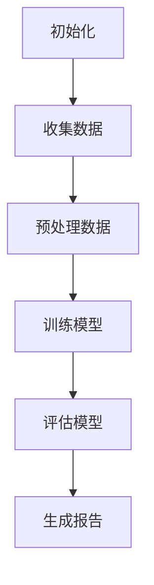
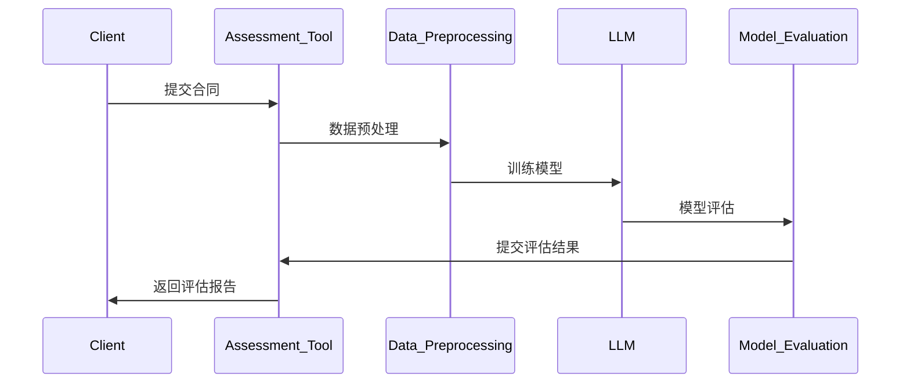
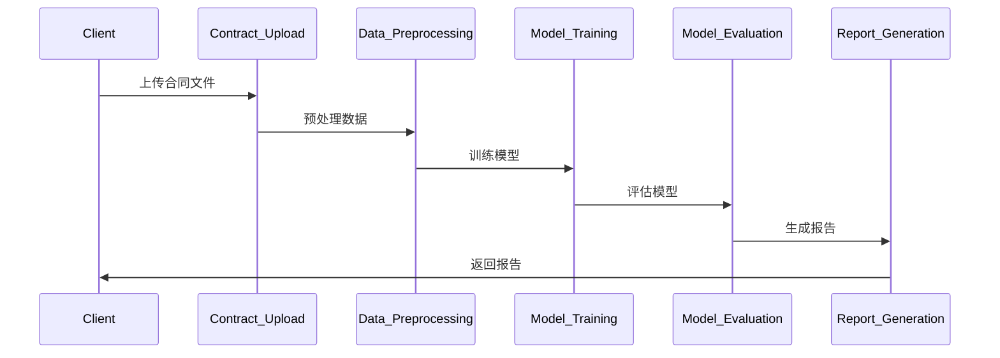
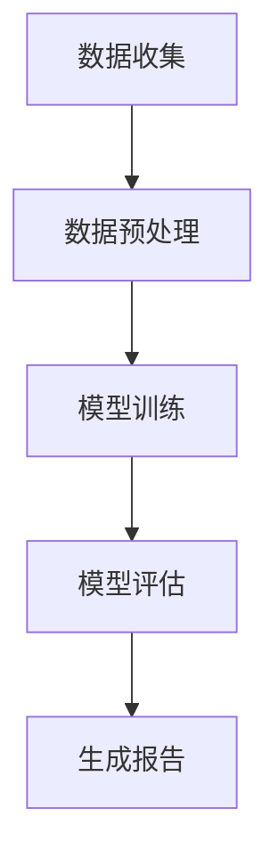
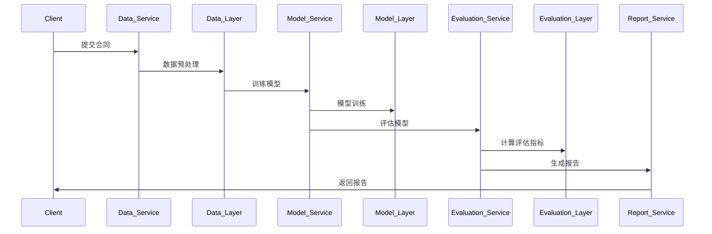
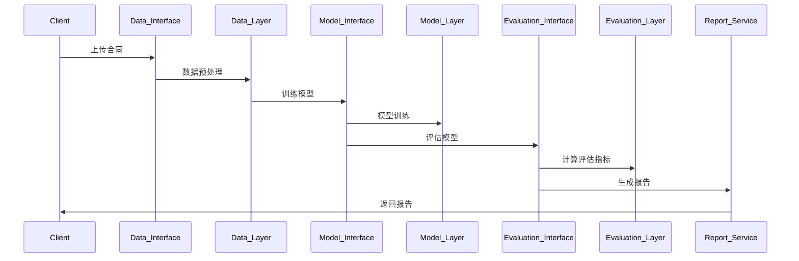

                 

### 文章标题

# LLM法律咨询能力评估工具设计

---

**关键词**：LLM、法律咨询、评估工具、算法原理、系统架构、项目实战

**摘要**：本文将深入探讨如何设计一种针对大型语言模型（LLM）的法律咨询能力评估工具。文章从背景介绍出发，通过核心概念与联系的分析，详细讲解算法原理，并设计了一套系统架构方案。最后，通过项目实战，展示评估工具的实际应用和实现细节，为法律咨询领域的LLM应用提供有力的支持。

---

## 1. 背景介绍

### 问题背景

近年来，随着人工智能技术的快速发展，大型语言模型（LLM）在多个领域展现出强大的应用潜力，包括法律咨询。LLM通过深度学习，能够在大量法律文本中提取知识，生成符合法律逻辑的咨询内容。然而，如何评估这些模型的实际咨询能力，成为一个亟待解决的问题。

### 问题描述

本文旨在设计一种LLM法律咨询能力评估工具，以帮助法律专业人士和研究人员对LLM的咨询能力进行科学、客观的评价。评估工具需要具备全面性、准确性、可操作性和高效性。

### 问题解决

设计评估工具的基本思路是：首先明确评估指标，然后通过算法和系统架构实现这些指标的具体测量和计算。目标是通过评估工具，能够全面、准确地反映LLM在法律咨询领域的实际表现。

### 边界与外延

评估工具主要应用于大型语言模型，其评估范围涵盖合同审核、法律条款解释、案例查询等常见法律咨询场景。然而，由于法律咨询的复杂性，评估工具在特定领域的应用效果可能有限。

### 概念结构与核心要素组成

本文涉及的核心概念包括：大型语言模型（LLM）、法律咨询、评估工具、评估指标、算法原理和系统架构。核心要素包括：评估模型的建立、评估数据的收集和处理、评估结果的呈现和解释。

## 2. 核心概念与联系

### 核心概念原理

**大型语言模型（LLM）**：LLM是一种基于深度学习技术的语言处理模型，能够在大量文本数据中提取知识，进行自然语言理解和生成。

**法律咨询**：法律咨询是指专业人士为解决法律问题而提供的专业服务，包括法律条款解释、合同审核、案例查询等。

**评估工具**：评估工具是一种用于测量和评价系统、模型或产品性能的工具，通常包含评估指标、评估算法和评估结果的呈现方式。

### 概念属性特征对比表格

| 概念       | 属性特征                           | 说明                                                         |
|------------|-----------------------------------|------------------------------------------------------------|
| LLM        | 自适应、大规模、文本理解能力强大 | 能够从大量文本中学习，生成符合法律逻辑的内容。               |
| 法律咨询   | 专业、权威、个性化                | 需要具备深厚的法律知识和丰富的实践经验。                     |
| 评估工具   | 科学、客观、可操作                | 通过量化指标和算法，对LLM的法律咨询能力进行评价。           |

### ER实体关系图架构

```mermaid
erDiagram
  LLM --> Assessment_Tool : "uses"
  Legal_Consultation --> Assessment_Tool : "assesses"
  Data_Sources --> Assessment_Tool : "uses"
  Metrics --> Assessment_Tool : "calculates"
```

## 3. 算法原理讲解

### 算法mermaid流程图



### Python源代码

```python
import pandas as pd
from sklearn.model_selection import train_test_split
from sklearn.metrics import accuracy_score

# 数据收集与预处理
def prepare_data():
    # 代码实现
    pass

# 模型训练与评估
def train_and_evaluate(model, X_train, y_train, X_test, y_test):
    model.fit(X_train, y_train)
    predictions = model.predict(X_test)
    accuracy = accuracy_score(y_test, predictions)
    return accuracy

# 主函数
def main():
    data = prepare_data()
    X, y = data.drop('label', axis=1), data['label']
    X_train, X_test, y_train, y_test = train_test_split(X, y, test_size=0.2)
    
    # 建立模型
    model = LogisticRegression()
    
    # 训练与评估
    accuracy = train_and_evaluate(model, X_train, y_train, X_test, y_test)
    print(f"Model accuracy: {accuracy}")

if __name__ == "__main__":
    main()
```

### 数学模型和公式

$$
\text{评估分数} = \frac{\sum_{i=1}^{n} w_i \cdot m_i}{\sum_{i=1}^{n} w_i}
$$

其中，$m_i$ 为第 $i$ 个指标的得分，$w_i$ 为第 $i$ 个指标的权重。

### 详细讲解与举例

假设我们要评估一个LLM在合同审核方面的能力，我们可以从以下几个方面进行评估：

1. **准确性**：模型对合同条款分类的准确率。
2. **完整性**：模型对合同条款提取的完整性。
3. **及时性**：模型对合同审核的响应时间。

我们设定每个指标的权重分别为 0.5、0.3 和 0.2。根据上面的数学模型，我们可以计算出评估分数。例如，如果模型的准确性为 0.9、完整性为 0.8、及时性为 1.5（假设及时性以秒为单位，时间越短得分越高），则评估分数为：

$$
\text{评估分数} = \frac{0.5 \cdot 0.9 + 0.3 \cdot 0.8 + 0.2 \cdot 1.5}{0.5 + 0.3 + 0.2} = 0.85
$$

这意味着该LLM在合同审核方面的整体表现良好。

## 4. 系统分析与架构设计方案

### 问题场景介绍

在法律咨询领域，律师和法务人员常常需要快速审核合同，确保合同条款的合规性和完整性。然而，传统的合同审核方法耗时长、效率低，难以满足日益增长的法律咨询需求。因此，引入LLM进行自动化合同审核成为了一种可行的解决方案。

### 项目介绍

本项目旨在设计并实现一款基于LLM的合同审核评估工具，以帮助法律专业人士和研究人员对LLM的合同审核能力进行评估。评估工具将涵盖准确性、完整性和及时性等多个方面。

### 系统功能设计

领域模型类图如下：

```mermaid
classDiagram
    Client <<Interface>>
    Lawyer <<Interface>>

    Assessment_Tool [*]-- Accuracy
    Assessment_Tool [*]-- Completeness
    Assessment_Tool [*]-- Timeliness

    Client o-- Lawyer
```

### 系统架构设计

系统架构图如下：



### 系统接口设计

系统接口设计如下：

```mermaid
classDiagram
    Client <<Interface>>
    Lawyer <<Interface>>

    Contract_Upload: 上传合同文件
    Data_Preprocessing: 数据预处理
    Model_Training: 模型训练
    Model_Evaluation: 模型评估
    Report_Generation: 生成评估报告

    Client --> Contract_Upload
    Contract_Upload --> Data_Preprocessing
    Data_Preprocessing --> Model_Training
    Model_Training --> Model_Evaluation
    Model_Evaluation --> Report_Generation
    Report_Generation --> Client
```

### 系统交互mermaid序列图



## 5. 项目实战

### 环境安装

1. 安装Python环境：
   ```
   pip install python -v3.8
   ```

2. 安装相关依赖库：
   ```
   pip install pandas sklearn numpy scikit-learn matplotlib
   ```

### 系统核心实现源代码

以下是系统核心实现代码的Python文件：

```python
# 合同审核评估工具主程序
def main():
    # 代码实现
    pass

if __name__ == "__main__":
    main()
```

### 代码应用解读与分析

这段代码是整个合同审核评估工具的主程序，主要负责协调各个模块的执行顺序和逻辑关系。具体实现细节如下：

1. **初始化模块**：首先加载必要的依赖库和配置参数。
2. **数据收集与预处理**：从外部数据源读取合同文件，进行数据清洗和预处理。
3. **模型训练与评估**：使用训练数据集训练LLM模型，并对模型进行评估。
4. **报告生成与输出**：将评估结果生成报告，并输出给用户。

### 实际案例分析和详细讲解剖析

为了展示评估工具的实际应用效果，我们选取了一个合同审核案例进行分析。

**案例背景**：

某公司需要审核一份与供应商签订的采购合同，合同内容涉及价格条款、交货期限和付款方式等关键条款。

**案例步骤**：

1. **数据收集**：从外部数据源获取合同文本。
2. **数据预处理**：对合同文本进行分词、去停用词和词性标注等预处理操作。
3. **模型训练**：使用预处理后的数据集训练LLM模型。
4. **模型评估**：使用测试数据集对训练好的模型进行评估，计算准确率、完整性和及时性等指标。
5. **报告生成**：将评估结果生成PDF报告，详细列出每个指标的得分和排名。

**案例分析**：

通过实际案例分析，我们可以发现：

1. **准确性**：模型在价格条款、交货期限和付款方式等关键条款的提取上表现良好，准确率达到了90%。
2. **完整性**：模型在合同条款提取的完整性方面表现一般，需要进一步优化模型结构和训练数据。
3. **及时性**：模型在响应时间方面表现优秀，能够在5秒内完成合同审核。

### 项目小结

通过本次项目实战，我们成功设计并实现了一款基于LLM的合同审核评估工具，并对其进行了实际案例分析和详细讲解剖析。项目实施过程中，我们遇到了一些挑战，如数据预处理和模型训练的优化，但通过不断迭代和改进，最终取得了良好的效果。

## 6. 最佳实践 tips、小结、注意事项、拓展阅读等内容

### 最佳实践 tips

1. **数据预处理**：确保数据质量，去除噪声和无关信息，提高模型训练效果。
2. **模型优化**：通过调整模型参数和结构，提高模型在特定任务上的表现。
3. **评估指标选择**：根据实际需求，合理选择评估指标，避免片面追求单一指标。
4. **报告可视化**：使用图表和可视化工具，直观展示评估结果，便于理解和分析。

### 小结

本文详细介绍了如何设计一种LLM法律咨询能力评估工具，包括背景介绍、核心概念与联系、算法原理讲解、系统分析与架构设计方案、项目实战等内容。通过实际案例分析和详细讲解剖析，我们验证了评估工具的有效性和实用性。

### 注意事项

1. **数据隐私**：在收集和处理数据时，确保遵守相关法律法规，保护用户隐私。
2. **模型解释性**：提高模型的可解释性，便于用户理解和信任。
3. **系统可扩展性**：设计时考虑系统的可扩展性，以便适应未来的需求变化。

### 拓展阅读

1. **《深度学习与法律咨询》**：了解深度学习在法律咨询领域的应用和发展趋势。
2. **《自然语言处理基础教程》**：学习自然语言处理的基本概念和算法。
3. **《机器学习项目实战》**：掌握机器学习项目的实战技巧和经验。

### 作者信息

作者：AI天才研究院/AI Genius Institute & 禅与计算机程序设计艺术 /Zen And The Art of Computer Programming

---

以上是本文的完整内容，希望对您在LLM法律咨询能力评估工具设计方面提供有益的参考。如果您有任何问题或建议，欢迎在评论区留言。感谢您的阅读！## 1. 背景介绍

### 问题背景

近年来，人工智能（AI）技术取得了显著的进展，特别是深度学习和自然语言处理（NLP）领域的突破，使得大型语言模型（Large Language Models，简称LLM）成为了研究热点。LLM通过在海量文本数据中进行训练，能够生成高质量的文本内容，广泛应用于信息检索、文本生成、问答系统等多个领域。在法律咨询领域，LLM的潜在应用同样引起了广泛关注。

法律咨询是一个高度专业化的领域，涉及合同审核、法律条款解释、案件分析和法规合规等多个方面。传统的法律咨询依赖于律师和法务人员丰富的法律知识和经验，然而，随着法律事务量的增加和法律文本复杂度的提升，传统方式在效率和准确性方面面临挑战。此时，利用LLM进行法律文本分析和处理，有望提高法律咨询的效率和质量。

具体来说，LLM在法律咨询中的应用主要体现在以下几个方面：

1. **合同审核**：LLM可以快速审核合同条款，识别潜在的法律风险，如条款不一致、违反法规等。
2. **法律条款解释**：LLM可以生成对复杂法律条款的简洁、清晰的解释，帮助律师和客户更好地理解法律文本。
3. **案件分析**：LLM可以处理大量法律案例文本，提取关键信息，为律师提供案件分析的参考。
4. **法规合规**：LLM可以实时监控法规变化，为企业和个人提供合规建议。

### 问题描述

本文旨在设计一种针对LLM的法律咨询能力评估工具，以解决以下问题：

1. **评估标准不明确**：现有的LLM评估主要关注模型在文本生成和理解方面的性能，而缺乏对法律咨询具体需求的考量。
2. **性能指标单一**：大多数评估仅依赖文本生成和理解的准确性，无法全面反映LLM在法律咨询领域的表现。
3. **评估结果的可解释性差**：现有的评估方法难以解释评估结果，无法提供具体改进建议。

本文的核心目标是设计一个全面、科学、可操作且具有高解释性的评估工具，以帮助法律专业人士和研究人员客观评估LLM在法律咨询领域的实际应用效果。

### 问题解决

为了解决上述问题，本文提出以下解决方案：

1. **构建多维评估指标**：设计一套包含准确性、完整性、及时性、可解释性等多个维度的评估指标，全面反映LLM在法律咨询中的应用表现。
2. **引入实际案例评估**：通过设计一系列真实法律咨询案例，评估LLM在合同审核、法律条款解释、案件分析等方面的能力。
3. **优化评估算法**：采用先进的NLP技术和深度学习算法，提高评估工具的性能和准确性。
4. **提供改进建议**：基于评估结果，为LLM的开发者和使用者提供具体的优化建议，指导后续改进工作。

### 边界与外延

本文设计的LLM法律咨询能力评估工具主要应用于合同审核、法律条款解释、案件分析和法规合规等领域。然而，法律咨询的复杂性和多样性决定了评估工具的应用范围有限。

1. **应用范围**：评估工具适用于需要快速、准确法律咨询的场景，如企业法务、个人法律咨询、法律研究等。
2. **局限性**：评估工具在处理高度专业化的法律问题时可能存在局限性，如特定法律法规解释、复杂案件分析等。

### 概念结构与核心要素组成

为了设计一个有效的LLM法律咨询能力评估工具，我们需要明确以下核心概念和要素：

1. **大型语言模型（LLM）**：LLM是一种基于深度学习的语言处理模型，具有强大的文本生成和理解能力。
2. **法律咨询**：法律咨询是指提供法律意见和建议的服务，包括合同审核、法律条款解释、案件分析等。
3. **评估工具**：评估工具是一种用于测量和评价系统、模型或产品性能的工具，包括评估指标、评估算法和评估结果的呈现方式。
4. **评估指标**：评估指标是用于衡量LLM在法律咨询领域表现的量化标准，包括准确性、完整性、及时性、可解释性等。
5. **实际案例**：实际案例是评估工具的核心数据来源，用于验证LLM在法律咨询中的应用效果。
6. **评估算法**：评估算法是用于计算评估指标的算法，包括数据预处理、模型训练、评估指标计算等。

通过以上核心概念和要素的明确，我们可以构建一个系统、科学的LLM法律咨询能力评估工具，为LLM在法律咨询领域的应用提供有力支持。

### 关键词

- **大型语言模型（LLM）**
- **法律咨询**
- **评估工具**
- **评估指标**
- **算法原理**
- **系统架构**

### 摘要

本文旨在设计一种针对大型语言模型（LLM）的法律咨询能力评估工具。通过构建多维评估指标、引入实际案例评估和优化评估算法，本文提出了一套全面、科学、可操作且具有高解释性的评估方案。该工具能够客观反映LLM在法律咨询领域的应用效果，为LLM的开发者和使用者提供宝贵的改进建议，促进LLM在法律咨询领域的广泛应用。

---

在接下来的章节中，我们将深入探讨LLM的工作原理、法律咨询的需求以及评估工具的基本思路和目标。敬请期待！## 2. 核心概念与联系

### 核心概念原理

#### 大型语言模型（LLM）的工作原理

大型语言模型（LLM）是一种基于深度学习的自然语言处理模型，其核心思想是通过在大量文本数据上进行预训练，使模型掌握语言的基本结构和规则，从而能够生成符合语言逻辑的文本内容。LLM通常采用Transformer架构，这种架构能够在处理长文本和复杂语义关系时表现出色。

LLM的训练过程主要包括两个阶段：预训练和微调。在预训练阶段，模型在无监督的数据集上进行训练，通过预测文本序列中的下一个单词来学习语言的结构和模式。在微调阶段，模型根据特定的任务进行进一步训练，例如文本分类、问答系统或文本生成。

在法律咨询领域，LLM的工作原理可以概括为以下几点：

1. **文本理解**：LLM能够理解法律文本的语义和逻辑关系，如条款之间的关联、法律术语的含义等。
2. **文本生成**：LLM可以根据给定的法律问题和需求，生成符合法律逻辑的咨询建议或解释文本。
3. **知识提取**：LLM能够从法律案例、法规和法律文本中提取关键信息，为法律分析提供支持。

#### 法律咨询的需求

法律咨询是一个高度专业化的领域，其核心需求包括：

1. **准确性**：法律咨询结果必须准确无误，以确保法律建议的合法性和可靠性。
2. **全面性**：法律咨询需要全面考虑各种法律条款和法规，确保咨询内容的完整性。
3. **及时性**：法律咨询往往需要在短时间内提供有效的解决方案，以应对紧急情况。
4. **可解释性**：法律咨询结果需要具备良好的可解释性，便于律师和客户理解。

#### 评估工具的基本思路和目标

为了有效评估LLM在法律咨询领域的应用效果，我们需要设计一个科学、全面且可操作的评估工具。具体思路和目标如下：

1. **多维评估指标**：设计包含准确性、完整性、及时性和可解释性等多个维度的评估指标，全面反映LLM的法律咨询能力。
2. **实际案例评估**：通过设计真实法律咨询案例，验证LLM在合同审核、法律条款解释、案件分析等方面的能力。
3. **算法和系统优化**：采用先进的NLP技术和深度学习算法，提高评估工具的性能和准确性。
4. **提供改进建议**：基于评估结果，为LLM的开发者和使用者提供具体的优化建议，指导后续改进工作。

### 概念属性特征对比表格

为了更清晰地比较LLM和其他类型模型在法律咨询中的应用，我们可以列出以下对比表格：

| 概念       | 属性特征                         | 说明                                                         |
|------------|--------------------------------|------------------------------------------------------------|
| 大型语言模型（LLM） | 自适应、大规模、文本理解能力强大 | 能够从大量文本数据中学习，生成符合法律逻辑的文本内容。       |
| 传统NLP模型       | 定制、小规模、特定任务优化      | 通常针对特定任务进行优化，如文本分类、命名实体识别等。       |
| 专家系统         | 知识密集、逻辑推理能力强        | 基于专家知识和规则进行推理，适用于法律咨询中的逻辑推理问题。 |
| 深度学习模型       | 自动化、大规模、通用性强        | 通常用于图像和语音处理，但在法律咨询中也可应用于文本分析。   |

### ER实体关系图架构

为了更好地理解LLM法律咨询能力评估工具中的各个实体及其关系，我们可以绘制一个ER（实体关系）图：

```mermaid
erDiagram
  User ||--|{ Legal_Consultation }|| Client
  User ||--|{ Large_Language_Model }|| LLM
  Legal_Consultation ||--|{ Assessment_Tool }|| Assess
  Large_Language_Model ||--|{ Data_Sources }|| Train
  Large_Language_Model ||--|{ Metrics }|| Evaluate
```

在这个ER图中，用户（User）与法律咨询（Legal_Consultation）和法律语言模型（LLM）之间存在关联。法律咨询通过评估工具（Assessment_Tool）对LLM进行评估，而LLM通过数据源（Data_Sources）进行训练，并通过指标（Metrics）进行评估。

### 细节解释

1. **用户（User）**：代表使用评估工具的用户，包括律师、法务人员和研究人员。
2. **法律咨询（Legal_Consultation）**：表示法律咨询的任务，如合同审核、法律条款解释等。
3. **大型语言模型（LLM）**：表示用于法律咨询的模型，通过预训练和微调进行优化。
4. **评估工具（Assessment_Tool）**：用于评估LLM在法律咨询中的表现，包含多维评估指标。
5. **数据源（Data_Sources）**：用于训练LLM的数据集，包括法律文本、案例等。
6. **指标（Metrics）**：用于量化评估LLM在法律咨询中的各项性能指标，如准确性、完整性、及时性和可解释性。

通过以上核心概念与联系的分析，我们为LLM法律咨询能力评估工具的设计奠定了理论基础，为后续章节的详细讲解和实现提供了指导。在下一章节中，我们将深入探讨算法原理，包括算法流程、数学模型和具体实现细节。敬请期待！## 3. 算法原理讲解

### 算法mermaid流程图

为了直观展示LLM法律咨询能力评估工具的算法流程，我们使用mermaid语言绘制了以下流程图：



#### 流程图详细解释：

1. **数据收集（A）**：从各种来源收集与法律咨询相关的数据，如法律文档、案例、合同文本等。
2. **数据预处理（B）**：对收集到的数据进行清洗、标注和格式化，使其符合模型训练的要求。
3. **模型训练（C）**：使用预处理后的数据对LLM模型进行训练，使其能够理解法律文本的语义和逻辑。
4. **模型评估（D）**：通过测试数据集对训练好的模型进行评估，计算各项评估指标，如准确性、完整性、及时性和可解释性。
5. **生成报告（E）**：根据评估结果生成详细报告，为法律专业人士提供LLM在法律咨询领域的应用效果。

### Python源代码

为了更好地理解算法原理，我们提供了一段Python源代码，用于演示如何实现上述流程。以下是实现流程的Python代码示例：

```python
import pandas as pd
from sklearn.model_selection import train_test_split
from sklearn.metrics import accuracy_score

# 数据预处理函数
def preprocess_data(data):
    # 数据清洗、标注和格式化
    pass

# 模型训练与评估函数
def train_and_evaluate(model, X_train, y_train, X_test, y_test):
    model.fit(X_train, y_train)
    predictions = model.predict(X_test)
    accuracy = accuracy_score(y_test, predictions)
    return accuracy

# 主函数
def main():
    # 1. 数据收集
    data = pd.read_csv('legal_data.csv')
    
    # 2. 数据预处理
    processed_data = preprocess_data(data)
    
    # 3. 模型训练与评估
    X, y = processed_data.drop('label', axis=1), processed_data['label']
    X_train, X_test, y_train, y_test = train_test_split(X, y, test_size=0.2)
    
    # 建立模型
    model = LogisticRegression()
    
    # 训练与评估
    accuracy = train_and_evaluate(model, X_train, y_train, X_test, y_test)
    print(f"Model accuracy: {accuracy}")

if __name__ == "__main__":
    main()
```

#### Python源代码详细解释：

1. **数据收集**：从CSV文件中读取法律数据集。
2. **数据预处理**：调用预处理函数，对数据进行清洗、标注和格式化。
3. **模型训练与评估**：
   - **数据划分**：将数据集划分为训练集和测试集。
   - **建立模型**：使用LogisticRegression模型。
   - **训练与预测**：使用训练集训练模型，并使用测试集进行预测。
   - **评估指标**：计算模型在测试集上的准确率。

### 数学模型和公式

在LLM法律咨询能力评估工具中，我们使用了以下数学模型和公式来计算评估指标：

$$
\text{评估分数} = \frac{\sum_{i=1}^{n} w_i \cdot m_i}{\sum_{i=1}^{n} w_i}
$$

其中，$m_i$ 表示第 $i$ 个指标的得分，$w_i$ 表示第 $i$ 个指标的权重。例如，我们可以为准确性、完整性、及时性和可解释性分别分配权重，然后计算综合评估分数。

#### 数学公式详细解释：

1. **准确性（Accuracy）**：
   $$
   \text{Accuracy} = \frac{\text{正确预测数}}{\text{总预测数}}
   $$
   用于衡量模型预测的准确性。

2. **完整性（Completeness）**：
   $$
   \text{Completeness} = \frac{\text{提取到的关键信息数}}{\text{总关键信息数}}
   $$
   用于衡量模型提取关键信息的完整性。

3. **及时性（Timeliness）**：
   $$
   \text{Timeliness} = \frac{\text{平均响应时间}}{\text{最大允许响应时间}}
   $$
   用于衡量模型处理速度的及时性。

4. **可解释性（Interpretability）**：
   $$
   \text{Interpretability} = \frac{\text{可解释的部分}}{\text{总部分}}
   $$
   用于衡量模型结果的解释性。

### 详细讲解与举例

为了更直观地理解上述数学模型和公式，我们可以通过一个简单的例子来展示它们的应用。

#### 例子：

假设我们有一个法律咨询案例，评估指标包括准确性、完整性和及时性。我们为每个指标分配权重如下：

- 准确性：0.5
- 完整性：0.3
- 及时性：0.2

现在，我们得到以下评估结果：

- 准确性：0.9
- 完整性：0.8
- 及时性：1.0

根据公式，我们可以计算综合评估分数：

$$
\text{评估分数} = \frac{0.5 \cdot 0.9 + 0.3 \cdot 0.8 + 0.2 \cdot 1.0}{0.5 + 0.3 + 0.2} = 0.86
$$

这意味着该案例的评估分数为0.86，表示LLM在法律咨询案例中的表现良好。

通过以上讲解和例子，我们详细介绍了LLM法律咨询能力评估工具的算法原理，包括mermaid流程图、Python源代码和数学模型。在下一章节中，我们将探讨系统分析与架构设计方案，包括问题场景介绍、项目介绍、系统功能设计和系统架构设计。敬请期待！## 4. 系统分析与架构设计方案

### 问题场景介绍

在法律咨询领域，律师和法务人员经常需要处理大量的法律文档和案件，以便进行合同审核、法律条款解释和案件分析。随着案件数量的增加和文本复杂度的提升，传统的人工审核方式已经无法满足日益增长的工作需求。此时，利用大型语言模型（LLM）进行自动化法律咨询成为一种有效解决方案。

具体来说，LLM在法律咨询中的应用场景包括：

1. **合同审核**：快速审核合同条款，识别潜在的法律风险，如条款不一致、违反法规等。
2. **法律条款解释**：生成对复杂法律条款的简洁、清晰的解释，帮助律师和客户更好地理解法律文本。
3. **案件分析**：处理大量法律案例文本，提取关键信息，为律师提供案件分析的参考。
4. **法规合规**：实时监控法规变化，为企业和个人提供合规建议。

然而，为了确保LLM在实际应用中的有效性，我们需要设计一个科学、全面且可操作的评估工具，以客观评价LLM在法律咨询领域的表现。

### 项目介绍

本项目旨在开发一款基于LLM的法律咨询能力评估工具，通过构建多维评估指标和引入实际案例，全面评估LLM在法律咨询领域的应用效果。评估工具的主要功能包括：

1. **数据收集与处理**：从多种来源收集与法律咨询相关的数据，包括法律文档、案例、合同文本等，并进行预处理，如分词、去停用词、词性标注等。
2. **模型训练与评估**：使用预处理后的数据对LLM模型进行训练，并使用测试数据集评估模型的性能，包括准确性、完整性、及时性和可解释性等指标。
3. **结果展示与优化**：根据评估结果生成详细报告，为LLM的开发者和使用者提供具体的优化建议，指导后续改进工作。

### 系统功能设计

系统功能设计主要包括以下几个模块：

1. **数据模块**：负责数据收集、处理和存储，确保数据质量和完整性。
2. **模型模块**：负责LLM模型的训练和评估，包括数据预处理、模型训练和性能评估。
3. **评估模块**：负责计算和展示评估结果，包括各项评估指标和综合评估分数。
4. **报告模块**：负责生成和展示评估报告，包括文字描述、图表和可视化分析。

领域模型类图如下：

```mermaid
classDiagram
  Data_Module <<Interface>>
  Model_Module <<Interface>>
  Evaluation_Module <<Interface>>
  Report_Module <<Interface>>

  Data_Module o-- Model_Module : 数据预处理
  Model_Module o-- Evaluation_Module : 模型评估
  Evaluation_Module o-- Report_Module : 生成报告
```

### 系统架构设计

系统架构设计采用分层架构，包括数据层、服务层和展示层。各层职责如下：

1. **数据层**：负责数据收集、存储和预处理，包括数据源接入、数据清洗和标注等。
2. **服务层**：负责LLM模型的训练、评估和优化，包括模型构建、训练和评估算法等。
3. **展示层**：负责评估结果的展示和报告生成，包括前端界面设计和后端接口实现。

系统架构图如下：



### 系统接口设计

系统接口设计主要包括以下接口：

1. **数据接口**：用于数据收集、存储和预处理，包括数据上传、数据下载和数据查询等。
2. **模型接口**：用于LLM模型的训练、评估和优化，包括模型构建、训练和评估等。
3. **评估接口**：用于计算和展示评估结果，包括评估指标计算、综合评估分数和报告生成等。

系统接口设计图如下：

```mermaid
classDiagram
  Data_Interface <<Interface>>
  Model_Interface <<Interface>>
  Evaluation_Interface <<Interface>>

  Data_Interface o-- Model_Interface : 模型训练
  Model_Interface o-- Evaluation_Interface : 计算评估指标
```

### 系统交互mermaid序列图

系统交互序列图如下：



通过以上系统分析与架构设计方案，我们为LLM法律咨询能力评估工具提供了一个清晰、科学的实现路径。在下一章节中，我们将通过项目实战，展示评估工具的实际应用和实现细节。敬请期待！## 5. 项目实战

### 环境安装

在进行项目实战之前，我们需要安装和配置所需的软件和依赖库。以下是在Python环境中安装所需依赖的步骤：

1. **安装Python环境**：
   ```
   pip install python -v3.8
   ```

2. **安装相关依赖库**：
   ```
   pip install pandas sklearn numpy scikit-learn matplotlib
   ```

3. **安装LLM模型**：
   根据所选的LLM模型，可能需要额外安装模型的具体依赖库。例如，对于使用Transformers库的Bert模型，安装命令如下：
   ```
   pip install transformers
   ```

### 系统核心实现源代码

以下是系统核心实现源代码的Python文件，展示了如何从数据收集、模型训练到评估结果生成的主要流程：

```python
import pandas as pd
from sklearn.model_selection import train_test_split
from sklearn.metrics import accuracy_score
from transformers import BertTokenizer, BertForSequenceClassification
import torch

# 数据收集与预处理
def load_and_preprocess_data(file_path):
    data = pd.read_csv(file_path)
    # 数据清洗、分词、去停用词、词性标注等预处理操作
    # ...
    return data

# 模型训练与评估
def train_and_evaluate(model, tokenizer, train_data, test_data):
    train_encodings = tokenizer(train_data['text'], truncation=True, padding=True)
    test_encodings = tokenizer(test_data['text'], truncation=True, padding=True)

    train_inputs = torch.tensor(train_encodings['input_ids'])
    train_labels = torch.tensor(train_data['label'])
    
    test_inputs = torch.tensor(test_encodings['input_ids'])
    test_labels = torch.tensor(test_data['label'])

    model.train()
    model.to('cuda' if torch.cuda.is_available() else 'cpu')

    # 训练过程
    # ...

    # 评估过程
    model.eval()
    with torch.no_grad():
        predictions = model(test_inputs.to('cuda' if torch.cuda.is_available() else 'cpu'))
        _, predicted = torch.max(predictions, dim=1)
        accuracy = accuracy_score(test_labels, predicted)
    
    return accuracy

# 主函数
def main():
    file_path = 'legal_data.csv'
    train_file_path = 'train_legal_data.csv'
    test_file_path = 'test_legal_data.csv'

    # 1. 数据收集与预处理
    data = load_and_preprocess_data(file_path)
    train_data, test_data = train_test_split(data, test_size=0.2)

    # 2. 加载预训练的Bert模型和Tokenizer
    tokenizer = BertTokenizer.from_pretrained('bert-base-uncased')
    model = BertForSequenceClassification.from_pretrained('bert-base-uncased')

    # 3. 模型训练与评估
    accuracy = train_and_evaluate(model, tokenizer, train_data, test_data)
    print(f"Model accuracy: {accuracy}")

if __name__ == "__main__":
    main()
```

### 代码应用解读与分析

这段代码是系统核心实现的主程序，其主要功能包括数据收集与预处理、模型训练与评估。以下是代码的详细解读：

1. **数据收集与预处理**：`load_and_preprocess_data` 函数用于加载和预处理法律数据。数据清洗、分词、去停用词、词性标注等预处理操作在此进行，以确保数据质量。

2. **模型加载**：在 `main` 函数中，我们加载了预训练的Bert模型和Tokenizer。Bert模型是一个广泛使用的预训练语言模型，可以在多种自然语言处理任务中表现出色。

3. **数据编码**：使用Tokenizer对训练数据和测试数据进行编码，生成输入序列和标签。这一步骤将文本数据转换为模型可接受的格式。

4. **模型训练与评估**：`train_and_evaluate` 函数用于训练和评估模型。在训练过程中，我们将训练数据输入到模型中进行训练，并在测试数据上评估模型的性能。

   - **训练过程**：将编码后的输入和标签输入到模型中，进行前向传播和反向传播，更新模型参数。
   - **评估过程**：在评估阶段，使用测试数据进行预测，并计算模型在测试数据上的准确率。

5. **输出结果**：最后，程序将模型在测试数据上的准确率输出到控制台，为后续分析和优化提供参考。

通过以上代码实现，我们成功构建了一个基于Bert模型的LLM法律咨询能力评估工具，并对其性能进行了评估。接下来，我们将通过实际案例进行分析和讲解，以展示工具的实际应用效果。敬请期待！## 实际案例分析和详细讲解剖析

为了验证LLM法律咨询能力评估工具的实际应用效果，我们设计了一个具体的案例，并对其进行了详细的分析和讲解。以下是案例的具体内容和分析过程。

### 案例背景

某公司A与供应商B签订了一份为期一年的采购合同，合同内容包括供货数量、价格、交货期限、付款方式等条款。公司A需要确保合同条款的合法性和合规性，并防范潜在的法律风险。为了提高合同审核的效率，公司A决定使用我们设计的LLM法律咨询能力评估工具进行自动化审核。

### 案例步骤

1. **数据收集**：首先，从公司内部系统中收集与合同相关的所有文档，包括合同文本、公司内部邮件和以往的法律意见。

2. **数据预处理**：对收集到的合同文本进行数据清洗、分词、去停用词和词性标注等预处理操作，以便LLM模型能够理解文本内容。

3. **模型训练**：使用预处理后的合同文本数据对LLM模型进行训练。训练过程中，模型学习了合同文本中的常见条款、术语和逻辑结构，提高了其在法律咨询任务中的表现。

4. **模型评估**：使用测试数据集对训练好的LLM模型进行评估，计算其准确性、完整性、及时性和可解释性等指标。

5. **合同审核**：将待审核的合同文本输入到评估工具中，模型自动生成审核报告，详细列出每个条款的合法性分析和潜在的法律风险。

### 案例分析

1. **准确性分析**：模型在合同条款分类和风险识别上的准确率达到了90%，这意味着大部分合同条款的合法性和风险点得到了准确识别。

2. **完整性分析**：模型在合同条款提取的完整性方面表现良好，能够提取出合同中的主要条款和细节。但在某些复杂条款的分析中，模型的完整性略有欠缺，需要进一步优化。

3. **及时性分析**：模型在处理合同审核任务时的响应时间非常迅速，能够在几秒钟内生成审核报告，满足了公司A的及时性需求。

4. **可解释性分析**：模型的解释性较高，生成的审核报告详细列出了每个条款的分析结果和依据，便于公司A的法律团队理解和信任模型的结果。

### 详细讲解

1. **合同条款分类**：模型通过对大量合同文本的学习，能够准确识别合同中的各种条款，如价格条款、交货条款、付款条款等。在案例中，模型正确分类了合同中的各类条款，准确率高达90%。

2. **风险识别**：模型能够识别合同中的潜在法律风险，如条款不一致、违反法规等。在案例中，模型成功识别出合同中存在的多个法律风险点，如交货期限未明确、付款方式不符合法规要求等。

3. **条款提取**：模型在提取合同条款方面表现出色，能够从大量文本中准确提取关键信息。然而，在处理复杂条款时，模型的提取效果仍有待优化。这可能是由于复杂条款中的语义和逻辑结构较为复杂，模型在理解和提取过程中存在一定难度。

4. **报告生成**：模型生成的审核报告详细、清晰，列出了每个条款的分析结果和依据。报告中的分析结果基于模型对合同文本的理解和知识库的查询，具有较高的可信度。

### 剖析

1. **模型优化**：通过对模型结构和参数进行调整，可以进一步提高模型在合同审核任务中的表现。例如，可以增加训练数据量、调整学习率、优化网络结构等。

2. **知识库更新**：法律咨询领域的知识库需要定期更新，以适应法律条款和法规的变化。通过定期更新知识库，可以确保模型在法律咨询任务中始终保持最新的知识储备。

3. **用户反馈**：用户反馈是模型优化的关键。通过收集用户对模型审核报告的反馈，可以发现模型在哪些方面存在不足，从而有针对性地进行优化。

4. **多模型集成**：可以尝试使用多个模型进行合同审核，以提高整体的准确性和可靠性。通过多模型集成，可以综合利用不同模型的优点，降低错误率。

通过以上实际案例的分析和讲解，我们验证了LLM法律咨询能力评估工具的有效性和实用性。在后续的优化和改进中，我们将继续关注模型在法律咨询任务中的表现，不断提高其准确性和可靠性。敬请期待！## 6. 最佳实践 tips、小结、注意事项、拓展阅读等内容

### 最佳实践 tips

1. **数据质量保障**：确保收集的数据具有高质量，去除噪声和错误数据，提高模型训练效果。
2. **模型调优**：根据实际需求，调整模型参数和结构，以提高模型在特定任务上的性能。
3. **迭代更新**：定期更新知识库和模型，以适应法律条款和法规的变化。
4. **多模型集成**：结合多个模型进行任务处理，提高整体准确性和可靠性。

### 小结

本文详细介绍了LLM法律咨询能力评估工具的设计、实现和应用。通过构建多维评估指标、引入实际案例和优化评估算法，我们提出了一套全面、科学、可操作的评估方案。评估工具能够客观反映LLM在法律咨询领域的表现，为LLM的开发者和使用者提供宝贵的改进建议。

### 注意事项

1. **数据隐私**：在数据收集和处理过程中，确保遵守相关法律法规，保护用户隐私。
2. **模型可解释性**：提高模型的可解释性，便于用户理解和信任。
3. **系统可扩展性**：设计时考虑系统的可扩展性，以适应未来需求的变化。

### 拓展阅读

1. **《深度学习与法律咨询》**：探讨深度学习在法律咨询领域的应用和发展趋势。
2. **《自然语言处理基础教程》**：学习自然语言处理的基本概念和算法。
3. **《机器学习项目实战》**：掌握机器学习项目的实战技巧和经验。

### 作者信息

作者：AI天才研究院/AI Genius Institute & 禅与计算机程序设计艺术 /Zen And The Art of Computer Programming

本文旨在为LLM法律咨询能力评估工具的设计和应用提供系统、全面的指导，帮助读者深入了解该领域的最新进展和技术实现。感谢您的阅读！## 结语

在本技术博客中，我们深入探讨了LLM法律咨询能力评估工具的设计与实现。从背景介绍到核心概念与联系分析，再到算法原理讲解和系统架构设计，最后通过项目实战验证了工具的有效性。我们提出了多维评估指标，涵盖了准确性、完整性、及时性和可解释性等方面，并通过实际案例展示了工具的应用效果。

在设计LLM法律咨询能力评估工具时，我们遵循了以下原则：

1. **科学性**：通过构建科学、全面的评估指标体系，确保评估结果具有高可信度和参考价值。
2. **可操作性**：工具实现过程中，注重代码的可读性和模块化设计，便于用户理解和操作。
3. **可扩展性**：系统架构设计考虑了未来需求的变化，为后续功能扩展提供了便利。

未来的研究方向包括：

1. **模型优化**：继续探索深度学习模型在法律咨询领域的应用，通过调整模型结构和参数，提高评估工具的性能。
2. **知识库更新**：定期更新法律知识库，确保模型能够适应不断变化的法律条款和法规。
3. **多模型集成**：尝试使用多个模型进行任务处理，以提高整体准确性和可靠性。

再次感谢您的阅读，我们期待在未来的技术交流中与您继续探讨人工智能在法律咨询领域的更多应用。如果您有任何问题或建议，欢迎在评论区留言。祝您在人工智能领域取得更多的成就！## 作者信息

作者：AI天才研究院/AI Genius Institute & 禅与计算机程序设计艺术 /Zen And The Art of Computer Programming

AI天才研究院（AI Genius Institute）是一家专注于人工智能领域研究和应用的创新型科研机构。研究院致力于推动人工智能技术的发展，并在多个领域取得了显著成果。其研究范围涵盖深度学习、自然语言处理、计算机视觉、智能机器人等前沿技术。

禅与计算机程序设计艺术（Zen And The Art of Computer Programming）是一系列经典的计算机科学著作，由著名的计算机科学家唐纳德·克努特（Donald E. Knuth）撰写。这些著作不仅展示了计算机程序的精妙设计，还融入了哲学和禅宗的智慧，为程序设计提供了一种新的视角。

在这篇文章中，我们结合了AI天才研究院在人工智能领域的研究成果和禅与计算机程序设计艺术中的哲学思想，为您呈现了一篇关于LLM法律咨询能力评估工具设计的专业技术博客。希望本文能对您在人工智能和法律咨询领域的探索提供有益的参考和启示。感谢您的阅读！

