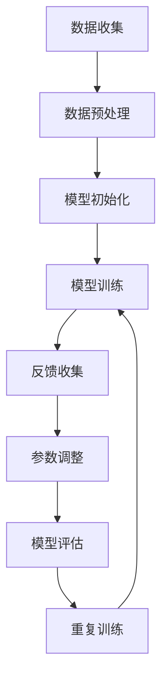
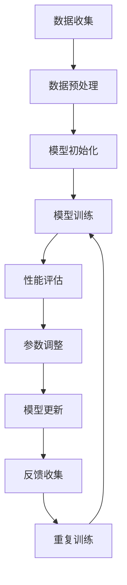
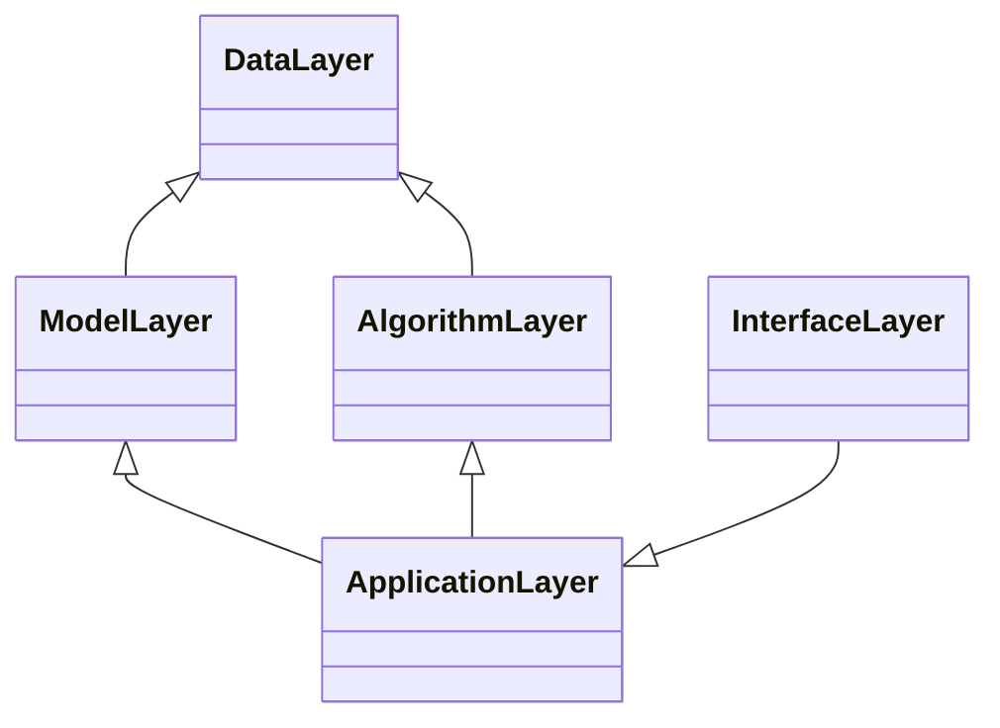
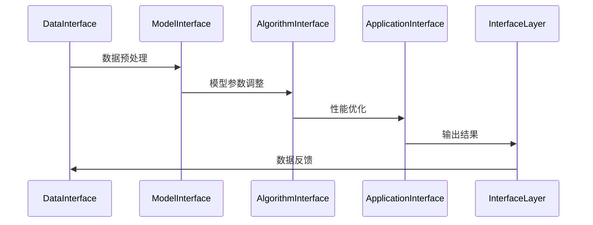

                 

# LLM自我改进：prompt工程的闭环优化

## 关键词
- 大语言模型（LLM）
- 自我改进
- Prompt工程
- 闭环优化
- 算法原理
- 系统架构
- 项目实战

## 摘要
本文将探讨大语言模型（LLM）的自我改进和prompt工程的闭环优化。我们将从LLM的基础知识入手，介绍其工作原理和发展历程。接着，我们将深入讨论prompt工程的概念、组成部分及其在LLM中的应用。随后，文章将详细讲解LLM自我改进和prompt闭环优化的算法原理，包括数学模型和流程图。在此基础上，我们将分析并设计LLM自我改进和prompt优化的系统架构，并通过实际项目展示如何将这些理论应用到实践中。最后，我们将总结最佳实践，提供注意事项，并推荐拓展阅读。

## 第1章 引言

### 1.1 书籍背景

大语言模型（LLM）是一种能够理解和生成自然语言文本的深度学习模型。随着人工智能技术的不断发展，LLM在自然语言处理（NLP）领域取得了显著的成果，但如何进一步提高其性能和适应能力，成为了一个亟待解决的问题。prompt工程作为一种增强LLM性能的有效手段，逐渐受到关注。prompt工程通过设计和优化输入提示（prompt），使得LLM能够更准确地理解和生成文本。

本文旨在探讨LLM的自我改进和prompt工程的闭环优化，通过逐步分析LLM的工作原理和prompt工程的组成部分，提出一种有效的自我改进和闭环优化方法，并设计相应的系统架构。本文的研究不仅为LLM的性能提升提供了新的思路，也为prompt工程的实际应用提供了指导。

### 1.2 核心概念介绍

在本章节中，我们将介绍本文的核心概念，包括LLM、prompt工程、自我改进和闭环优化。

**LLM**：大语言模型（Large Language Model）是一种基于深度学习的自然语言处理模型，能够理解和生成自然语言文本。LLM通过学习大规模语料库，捕捉语言结构、语义和语法规则，从而实现自然语言处理任务。

**Prompt工程**：prompt工程是一种通过设计和优化输入提示（prompt）来增强LLM性能的方法。prompt可以是关键词、短语或句子，用于引导LLM生成更准确、更相关的文本。

**自我改进**：自我改进是指LLM在运行过程中，通过不断调整自身模型参数和优化策略，提高其性能和适应能力。自我改进可以基于多种方法，如主动学习、元学习、强化学习等。

**闭环优化**：闭环优化是指将LLM的自我改进过程纳入到prompt工程中，通过不断迭代优化，使得LLM在生成文本时更加准确、流畅。闭环优化可以基于多种算法，如梯度下降、随机梯度下降、Adam优化器等。

### 1.3 研究意义与目标

研究LLM的自我改进和prompt工程的闭环优化具有重要的意义：

1. **提高LLM性能**：通过自我改进和闭环优化，可以显著提高LLM在自然语言处理任务中的性能，使其生成更准确、更相关的文本。

2. **增强LLM适应能力**：自我改进和闭环优化可以使LLM更加适应不同的应用场景和任务需求，提高其泛化能力和鲁棒性。

3. **推动自然语言处理发展**：本文的研究不仅为LLM性能提升提供了新的思路，也为自然语言处理领域的发展提供了重要的参考。

本文的研究目标包括：

1. **深入理解LLM的工作原理**：通过分析LLM的架构和算法，深入理解其工作原理和性能瓶颈。

2. **提出有效的自我改进方法**：设计并实现一种基于主动学习的自我改进方法，以提高LLM的性能和适应能力。

3. **实现闭环优化算法**：将自我改进方法与prompt工程相结合，实现一种闭环优化算法，以实现LLM性能的持续提升。

4. **设计系统架构**：基于自我改进和闭环优化算法，设计一种适用于实际应用的系统架构，并提供详细的实现方案。

### 1.4 文章结构

本文分为八个主要部分：

1. **引言**：介绍书籍背景、核心概念和研究意义。
2. **LLM基础知识**：介绍LLM的发展背景、工作原理和现有模型。
3. **Prompt工程原理**：讨论Prompt工程的定义、关键组成部分及其作用。
4. **自我改进算法讲解**：详细解释LLM的自我改进机制，包括算法原理、数学模型和流程图。
5. **闭环优化算法讲解**：深入讲解prompt闭环优化算法，包括算法原理、数学模型和流程图。
6. **系统架构设计**：分析LLM自我改进和prompt优化的系统架构，并设计相应的接口和交互。
7. **项目实战**：通过具体案例展示如何将自我改进和闭环优化应用于实际项目。
8. **最佳实践与总结**：总结书中的关键点，提供实践建议和进一步学习资源。

## 第2章 LLM基础知识

### 2.1 LLM的发展背景

大语言模型（LLM）的发展可以追溯到20世纪80年代，当时自然语言处理（NLP）领域开始受到广泛关注。随着计算机算力的提升和深度学习技术的发展，LLM的研究和应用逐渐成为热点。

早期的NLP研究主要基于规则和统计方法，如隐马尔可夫模型（HMM）、条件随机场（CRF）等。然而，这些方法在处理复杂语言现象和长距离依赖问题时存在较大局限性。

2003年，微软研究院提出了一种基于神经网络的翻译模型，称为神经机器翻译（NMT）。NMT采用递归神经网络（RNN）作为基本架构，通过学习输入和输出之间的映射关系，实现了较高的翻译质量。

随着深度学习技术的不断进步，2014年，Google提出了一种名为Transformer的全新神经网络架构，彻底改变了NLP领域的研究范式。Transformer基于自注意力机制（self-attention），能够有效地捕捉输入序列中的长距离依赖关系。基于Transformer的模型在多个NLP任务上取得了显著突破，如机器翻译、文本分类、问答系统等。

近年来，LLM的研究和应用进一步加速。随着模型规模的不断扩大，LLM在语言生成、文本生成、对话系统等领域的表现越来越出色。同时，LLM也在实际应用场景中发挥着重要作用，如智能客服、智能推荐、内容生成等。

### 2.2 LLM的工作原理

LLM是一种基于深度学习的自然语言处理模型，其核心思想是通过学习大规模语料库中的语言模式，实现对输入文本的理解和生成。

**1. 数据预处理**：在训练LLM之前，需要对语料库进行预处理。预处理过程包括分词、去停用词、词向量化等操作。分词是将文本分割成词语或短语，去停用词是去除对模型训练无意义的词语，词向量化是将词语映射为稠密的向量表示。

**2. 模型架构**：LLM的典型架构是基于Transformer模型的变体，如BERT、GPT等。Transformer模型采用多头自注意力机制（multi-head self-attention）和前馈神经网络（feedforward network）作为基本构建块。

- **自注意力机制**：自注意力机制是一种通过计算输入序列中每个词与所有词之间的相关性，为每个词生成权重的方法。这种方法能够有效地捕捉输入序列中的长距离依赖关系。

- **前馈神经网络**：前馈神经网络用于对自注意力机制输出的高维向量进行进一步处理，增强模型的非线性表达能力。

**3. 训练过程**：LLM的训练过程分为预训练和微调两个阶段。

- **预训练**：在预训练阶段，LLM在大规模语料库上进行无监督训练，学习语言的一般规律和模式。预训练过程通常采用 masked language model（MLM）或 masked token prediction（MTD）等方法，通过随机遮挡一部分输入词语，迫使模型预测遮挡的词语。

- **微调**：在预训练完成后，LLM在特定任务上进行微调，以适应具体的应用场景。微调过程通常采用有监督学习，通过训练标记化的数据集，优化模型在特定任务上的性能。

### 2.3 主流LLM模型介绍

近年来，众多优秀的LLM模型相继提出，下面我们介绍几种主流的LLM模型。

**1. BERT**

BERT（Bidirectional Encoder Representations from Transformers）是由Google提出的一种基于Transformer的预训练模型。BERT采用双向自注意力机制，能够同时考虑输入序列中的前文和后文信息，从而提高模型对语境的理解能力。

BERT的预训练任务包括两个阶段：

- ** masked language model（MLM）**：在输入序列中随机遮挡一部分词语，模型需要预测遮挡的词语。

- ** next sentence prediction（NSP）**：在输入序列中随机选择两个句子，模型需要判断这两个句子是否属于同一篇章。

BERT在多个NLP任务上取得了显著的性能提升，如文本分类、情感分析、问答系统等。

**2. GPT**

GPT（Generative Pre-trained Transformer）是由OpenAI提出的一种基于Transformer的预训练模型。GPT采用单向自注意力机制，只能考虑输入序列中的前文信息，因此相对BERT来说，GPT在处理长距离依赖问题时可能存在一些局限性。

GPT的预训练任务包括：

- ** masked language model（MLM）**：在输入序列中随机遮挡一部分词语，模型需要预测遮挡的词语。

GPT在文本生成、对话系统等应用场景中表现出色。

**3. T5**

T5（Text-To-Text Transfer Transformer）是由Google提出的一种基于Transformer的文本转换模型。T5将所有的NLP任务转换为文本转换任务，通过统一的模型架构和预训练策略，实现多种NLP任务的迁移学习。

T5的预训练任务包括：

- ** masked language model（MLM）**：在输入序列中随机遮挡一部分词语，模型需要预测遮挡的词语。

- ** filled mask language model（FMLM）**：在输入序列中随机遮挡一部分词语，同时提供遮挡部分的标签，模型需要预测遮挡的词语。

- ** sentence pair classification（SPLC）**：在输入序列中随机选择两个句子，模型需要判断这两个句子是否属于同一篇章。

T5在多个NLP任务上取得了优秀的表现，如文本分类、情感分析、问答系统等。

### 2.4 LLM在自然语言处理中的应用

LLM在自然语言处理领域有着广泛的应用，下面我们介绍几种常见的应用场景。

**1. 文本分类**

文本分类是将文本分为预定义的类别，如新闻分类、情感分析、垃圾邮件检测等。LLM在文本分类任务中表现出色，通过预训练和微调，模型可以自动学习分类规则和特征，实现高效的文本分类。

**2. 文本生成**

文本生成是生成与输入文本相关的新文本，如文章摘要、机器翻译、对话系统等。LLM在文本生成任务中具有强大的生成能力，通过自注意力机制和前馈神经网络，模型能够生成连贯、自然的文本。

**3. 问答系统**

问答系统是一种能够回答用户问题的智能系统，如搜索引擎、聊天机器人等。LLM在问答系统中的应用，可以通过预训练和微调，实现高效、准确的问答。

**4. 对话系统**

对话系统是一种能够与用户进行自然语言交互的系统，如虚拟助手、聊天机器人等。LLM在对话系统中的应用，可以通过自注意力机制和前馈神经网络，实现智能、流畅的对话。

### 2.5 总结

在本章节中，我们介绍了LLM的发展背景、工作原理和主流模型。通过分析LLM的架构和算法，我们可以深入理解其性能和局限性。在后续章节中，我们将进一步探讨prompt工程、自我改进和闭环优化，为LLM的性能提升提供新的思路和方法。

## 第3章 Prompt工程原理

### 3.1 Prompt工程的定义

Prompt工程，顾名思义，是一种通过设计和优化输入提示（Prompt）来提升大语言模型（LLM）性能的方法。在深度学习领域，Prompt被广泛用于指导模型的输入和输出，使其在特定任务上能够更好地表现。Prompt工程的核心思想是，通过精心设计的提示，引导模型在训练和推理过程中学习到更精确的特征和模式，从而提高模型在相关任务上的准确性和鲁棒性。

### 3.2 Prompt工程的关键组成部分

Prompt工程的成功实施依赖于几个关键组成部分，包括提示设计、模型训练和性能评估。

**1. 提示设计**：提示设计是Prompt工程的核心环节。一个有效的提示应该能够明确地引导模型关注到任务的关键信息，同时避免无关信息的干扰。在设计提示时，可以考虑以下因素：

- **任务相关性**：提示应与任务密切相关，确保模型能够在训练过程中抓住任务的关键特征。
- **简洁性**：提示应尽量简洁明了，避免冗长的描述，以免模型在处理过程中产生混淆。
- **多样性**：提示应具备一定的多样性，以应对不同的训练数据和任务场景。

**2. 模型训练**：模型训练是将设计好的提示与模型结合，通过训练过程优化模型参数，使其能够更好地适应任务需求。在模型训练过程中，可以通过以下方法提升提示效果：

- **监督学习**：在有监督的训练中，通过标注的数据集，模型可以学习到具体的提示效果，从而更好地理解任务。
- **无监督学习**：在无监督的训练中，模型可以通过自我监督学习，从大量未标注的数据中提取出有用的提示信息。

**3. 性能评估**：性能评估是衡量Prompt工程效果的重要手段。评估过程可以通过以下方法进行：

- **准确率**：评估模型在特定任务上的准确率，以衡量提示对模型性能的提升。
- **F1值**：评估模型在分类任务上的精确率和召回率的综合表现，以衡量提示的多样性和准确性。
- **泛化能力**：评估模型在不同数据集和任务上的表现，以衡量提示对模型泛化能力的影响。

### 3.3 Prompt工程的作用

Prompt工程在提升LLM性能方面具有显著作用，主要体现在以下几个方面：

**1. 提高任务性能**：通过精心设计的提示，模型可以更准确地理解和执行特定任务，从而提高任务性能。

**2. 提升模型鲁棒性**：Prompt工程可以帮助模型在面对不同数据和任务场景时，保持较高的性能，提升模型的鲁棒性。

**3. 简化模型设计**：Prompt工程可以通过优化提示，减少对模型结构的依赖，简化模型设计过程，降低开发难度。

**4. 促进模型迁移**：Prompt工程可以使得模型在不同任务和数据集上具有更好的迁移能力，提高模型的通用性。

### 3.4 Prompt工程的历史与发展

Prompt工程的概念虽然近年来受到广泛关注，但其实早在深度学习早期就已经出现。例如，在自然语言处理任务中，研究人员通过在输入文本中添加特定的关键词或短语，来引导模型学习到更精确的特征。然而，随着深度学习和Transformer模型的发展，Prompt工程逐渐成为了一种系统化和工程化的方法。

在2020年，研究人员提出了一种名为“Prompt Tuning”的方法，通过在模型训练完成后，针对特定任务进行微调，从而提高模型在任务上的性能。Prompt Tuning的核心思想是，将设计好的提示与模型进行结合，通过微调过程，使得模型能够更好地理解任务。

近年来，Prompt工程在多个领域取得了显著进展，如对话系统、文本生成、机器翻译等。研究人员通过不断优化提示设计方法，结合不同的模型结构和训练策略，实现了Prompt工程在多个任务上的成功应用。

### 3.5 Prompt工程在LLM中的应用

在LLM中，Prompt工程的应用主要体现在以下两个方面：

**1. 预训练阶段**：在LLM的预训练阶段，通过设计有效的提示，可以引导模型学习到更丰富的语言特征和模式，从而提高模型在后续任务中的性能。

**2. 微调阶段**：在LLM的微调阶段，通过针对特定任务进行Prompt Tuning，可以显著提高模型在任务上的准确性和泛化能力。

例如，在文本生成任务中，通过在输入文本中添加特定的关键词或短语，可以引导模型生成更符合预期的文本。在问答系统中，通过设计针对性的提示，可以使得模型更好地理解用户的问题，并提供更准确的答案。

### 3.6 总结

在本章节中，我们介绍了Prompt工程的概念、关键组成部分以及其作用。通过深入理解Prompt工程的原理和应用，我们可以更好地设计和优化LLM模型，从而提高模型在自然语言处理任务中的性能。在后续章节中，我们将进一步探讨LLM的自我改进和闭环优化，为LLM的性能提升提供新的思路和方法。

## 第4章 自我改进算法讲解

### 4.1 自我改进算法的原理

自我改进算法（Self-Improvement Algorithm）是指模型在运行过程中，通过不断地调整自身参数和优化策略，以提高其性能和适应能力。对于大语言模型（LLM）而言，自我改进算法具有重要意义，因为LLM在处理复杂任务时，需要具备较强的适应性和鲁棒性。

自我改进算法的基本原理可以概括为以下三个方面：

**1. 监督学习**：通过外部数据源，如标注数据集或用户反馈，对模型进行监督训练，使得模型能够学习到具体的任务规则和特征。

**2. 无监督学习**：通过大量未标注的数据，模型能够自我发现和提取有用的信息，从而提高模型的泛化能力和鲁棒性。

**3. 自适应学习**：模型在运行过程中，根据实时数据和任务反馈，动态调整模型参数和策略，以适应不断变化的环境和任务需求。

### 4.2 自我改进算法的数学模型

自我改进算法的数学模型通常包括以下几个方面：

**1. 参数更新公式**：在自我改进过程中，模型参数需要根据训练数据和任务反馈进行更新。参数更新公式可以表示为：

$$
\Delta\theta = \alpha \cdot \nabla L(\theta)
$$

其中，$\theta$表示模型参数，$\Delta\theta$表示参数更新量，$\alpha$表示学习率，$L(\theta)$表示损失函数。

**2. 损失函数**：损失函数用于衡量模型预测结果与真实结果之间的差距，常见的损失函数包括均方误差（MSE）、交叉熵（Cross-Entropy）等。

**3. 反馈机制**：反馈机制是指模型在训练过程中，如何获取和利用外部数据源和用户反馈。常见的反馈机制包括：

- **用户反馈**：通过用户对模型输出的评价，如点击率、满意度等，来调整模型参数。
- **标注数据**：通过标注数据集，对模型进行有监督训练，以提升模型在特定任务上的性能。

### 4.3 自我改进算法的流程图

自我改进算法的流程图可以分为以下几个阶段：

1. **数据收集**：从外部数据源收集训练数据和用户反馈。
2. **数据预处理**：对收集到的数据进行预处理，如分词、去停用词、词向量化等。
3. **模型初始化**：初始化模型参数。
4. **模型训练**：使用预处理后的数据对模型进行训练，更新模型参数。
5. **反馈收集**：收集用户对模型输出的反馈。
6. **参数调整**：根据用户反馈和训练数据，调整模型参数。
7. **模型评估**：对调整后的模型进行评估，判断模型性能是否提升。
8. **重复训练**：根据评估结果，决定是否继续调整模型参数，进入下一轮训练。

以下是自我改进算法的mermaid流程图：



### 4.4 自我改进算法的应用场景

自我改进算法在LLM中的应用场景非常广泛，以下是一些典型的应用场景：

**1. 对话系统**：在对话系统中，自我改进算法可以帮助模型不断学习用户的行为和偏好，从而提供更个性化的服务。

**2. 文本生成**：在文本生成任务中，自我改进算法可以帮助模型不断优化生成文本的质量和多样性。

**3. 机器翻译**：在机器翻译任务中，自我改进算法可以帮助模型更好地理解不同语言之间的差异，提高翻译的准确性。

**4. 情感分析**：在情感分析任务中，自我改进算法可以帮助模型更好地理解用户的情感和情绪，从而提供更准确的情感分类结果。

### 4.5 自我改进算法的优势和挑战

**优势**：

- **适应性强**：自我改进算法能够根据实时数据和用户反馈，动态调整模型参数，提高模型的适应性和鲁棒性。
- **高效性**：自我改进算法能够通过监督学习和无监督学习相结合，提高模型在特定任务上的性能。
- **个性化**：自我改进算法可以根据用户行为和偏好，提供个性化的服务。

**挑战**：

- **数据质量**：自我改进算法依赖于高质量的数据，数据质量直接影响算法的性能。
- **计算资源**：自我改进算法需要大量的计算资源，特别是在大规模数据集上训练时，计算成本较高。
- **安全性和隐私**：在应用自我改进算法时，需要确保用户数据和模型参数的安全性，防止数据泄露和隐私侵犯。

### 4.6 总结

在本章节中，我们介绍了自我改进算法的基本原理、数学模型和流程图，并讨论了其在LLM中的应用场景、优势和挑战。自我改进算法为LLM的性能提升提供了新的思路和方法，但同时也面临一些挑战。在后续章节中，我们将进一步探讨prompt闭环优化算法，为LLM的性能提升提供更多的技术手段。

## 第5章 闭环优化算法讲解

### 5.1 闭环优化算法的原理

闭环优化算法（Closed-loop Optimization Algorithm）是一种通过不断迭代优化，以实现系统性能提升的方法。在LLM的自我改进过程中，闭环优化算法扮演着至关重要的角色。其核心思想是通过实时监测和调整模型参数，使得模型在训练和推理过程中能够自适应地应对各种变化，从而提高整体性能。

闭环优化算法的基本原理可以概括为以下几个步骤：

**1. 模型训练**：首先，利用训练数据集对模型进行训练，通过调整模型参数，使得模型在特定任务上取得较好的性能。

**2. 性能评估**：在训练过程中，定期评估模型在测试集上的性能，以监测模型的训练效果。

**3. 参数调整**：根据性能评估结果，动态调整模型参数，以优化模型性能。参数调整可以基于多种优化方法，如梯度下降、随机梯度下降、Adam优化器等。

**4. 模型更新**：将调整后的模型参数应用到实际任务中，更新模型状态，为下一次迭代做准备。

**5. 反馈机制**：收集用户反馈和任务结果，作为下一次迭代的输入，以进一步提高模型性能。

### 5.2 闭环优化算法的数学模型

闭环优化算法的数学模型通常包括以下几个方面：

**1. 参数更新公式**：参数更新公式用于描述如何根据训练数据和性能评估结果调整模型参数。常见的更新公式如下：

$$
\theta_{t+1} = \theta_{t} - \alpha \cdot \nabla L(\theta_{t})
$$

其中，$\theta_{t}$表示第t次迭代的模型参数，$\theta_{t+1}$表示第t+1次迭代的模型参数，$\alpha$表示学习率，$\nabla L(\theta_{t})$表示损失函数的梯度。

**2. 损失函数**：损失函数用于衡量模型预测结果与真实结果之间的差距，常见的损失函数包括均方误差（MSE）、交叉熵（Cross-Entropy）等。

**3. 反馈机制**：反馈机制是指如何利用用户反馈和任务结果来调整模型参数。常见的反馈机制包括：

- **用户评分**：根据用户对模型输出的评分，调整模型参数，以提高用户满意度。
- **任务结果**：根据模型在任务中的表现，如准确率、召回率等，调整模型参数，以提高任务性能。

### 5.3 闭环优化算法的流程图

闭环优化算法的流程图可以分为以下几个阶段：

1. **数据收集**：从外部数据源收集训练数据和用户反馈。
2. **数据预处理**：对收集到的数据进行预处理，如分词、去停用词、词向量化等。
3. **模型初始化**：初始化模型参数。
4. **模型训练**：使用预处理后的数据对模型进行训练，更新模型参数。
5. **性能评估**：评估模型在测试集上的性能。
6. **参数调整**：根据性能评估结果，调整模型参数。
7. **模型更新**：更新模型状态，为下一次迭代做准备。
8. **反馈收集**：收集用户反馈和任务结果。
9. **重复训练**：根据反馈结果，重复进行模型训练和性能评估。

以下是闭环优化算法的mermaid流程图：



### 5.4 闭环优化算法的应用场景

闭环优化算法在LLM中的应用场景非常广泛，以下是一些典型的应用场景：

**1. 对话系统**：在对话系统中，闭环优化算法可以帮助模型不断学习用户的对话习惯和偏好，提供更自然的对话体验。

**2. 文本生成**：在文本生成任务中，闭环优化算法可以帮助模型优化生成文本的质量和多样性。

**3. 机器翻译**：在机器翻译任务中，闭环优化算法可以帮助模型提高翻译的准确性和流畅性。

**4. 情感分析**：在情感分析任务中，闭环优化算法可以帮助模型更好地理解用户的情感和情绪，提高情感分类的准确性。

### 5.5 闭环优化算法的优势和挑战

**优势**：

- **自适应性强**：闭环优化算法能够根据实时数据和用户反馈，动态调整模型参数，提高模型的适应性和鲁棒性。
- **高效性**：闭环优化算法通过不断迭代优化，能够在短时间内提高模型性能。
- **个性化**：闭环优化算法可以根据用户行为和偏好，提供个性化的服务。

**挑战**：

- **计算资源**：闭环优化算法需要大量的计算资源，特别是在大规模数据集上训练时，计算成本较高。
- **数据质量**：闭环优化算法依赖于高质量的数据，数据质量直接影响算法的性能。
- **安全性和隐私**：在应用闭环优化算法时，需要确保用户数据和模型参数的安全性，防止数据泄露和隐私侵犯。

### 5.6 总结

在本章节中，我们介绍了闭环优化算法的基本原理、数学模型和流程图，并讨论了其在LLM中的应用场景、优势和挑战。闭环优化算法为LLM的性能提升提供了重要的技术手段，但同时也面临一些挑战。在后续章节中，我们将进一步探讨如何将自我改进和闭环优化算法应用于实际项目，为LLM的性能优化提供更具体的解决方案。

## 第6章 系统架构设计

### 6.1 问题场景介绍

在现代人工智能应用中，大语言模型（LLM）已经成为自然语言处理（NLP）领域的重要工具。随着LLM在各个应用场景中的广泛应用，如何提升LLM的性能和适应能力，成为了一个亟待解决的问题。特别是在对话系统、文本生成、机器翻译等场景中，用户需求和任务多样性使得传统的一步训练方法难以满足需求。因此，本文提出了LLM自我改进和prompt工程的闭环优化方法，以实现LLM的性能提升和适应能力增强。

### 6.2 项目介绍

本项目旨在设计和实现一个基于自我改进和闭环优化的LLM系统，通过不断调整模型参数和优化策略，提高模型在特定任务上的性能和适应能力。具体来说，本项目包括以下几个部分：

1. **数据集准备**：收集并处理大规模语料库，为LLM训练提供数据支持。
2. **模型选择**：选择合适的LLM模型，如BERT、GPT等，进行预训练和微调。
3. **自我改进算法**：设计并实现自我改进算法，包括参数调整、学习率调整等，以提高模型性能。
4. **闭环优化算法**：设计并实现闭环优化算法，通过迭代优化，实现模型性能的提升。
5. **系统部署**：将训练好的模型部署到实际应用场景中，如对话系统、文本生成等。

### 6.3 系统功能设计

本系统的主要功能包括：

1. **文本分类**：对输入文本进行分类，识别文本的主题或情感。
2. **文本生成**：根据输入文本，生成新的文本，如文章摘要、对话内容等。
3. **机器翻译**：将一种语言的文本翻译成另一种语言。
4. **对话系统**：与用户进行自然语言交互，回答用户的问题或提供建议。

### 6.4 系统架构设计

为了实现上述功能，我们设计了如下的系统架构：

1. **数据层**：包括数据集的收集、存储和处理模块，为模型训练提供数据支持。
2. **模型层**：包括LLM模型的选择、预训练和微调模块，实现文本分类、生成、翻译和对话等功能。
3. **算法层**：包括自我改进算法和闭环优化算法，实现模型参数的调整和性能优化。
4. **应用层**：包括各种应用场景的实现，如文本分类、生成、翻译和对话系统。
5. **接口层**：提供统一的接口，方便其他系统或模块与本项目进行交互。

以下是系统架构的mermaid类图：



### 6.5 系统接口设计和系统交互

为了实现系统各模块之间的有效交互，我们设计了如下的接口和交互机制：

1. **数据接口**：提供数据层的接口，用于数据集的收集、存储和处理。
2. **模型接口**：提供模型层的接口，用于模型的选择、预训练和微调。
3. **算法接口**：提供算法层的接口，用于自我改进算法和闭环优化算法的实现。
4. **应用接口**：提供应用层的接口，用于文本分类、生成、翻译和对话系统的实现。
5. **接口层接口**：提供统一的接口，用于其他系统或模块与本项目进行交互。

以下是系统接口和交互的mermaid序列图：



### 6.6 系统架构的优点和挑战

**优点**：

- **模块化**：系统架构采用模块化设计，各模块之间独立性强，便于维护和扩展。
- **灵活性**：系统架构具有良好的灵活性，可以根据需求调整模型、算法和应用，实现定制化服务。
- **高效性**：系统架构通过并行处理和数据共享，提高了整体性能和效率。

**挑战**：

- **计算资源**：系统架构需要大量的计算资源，特别是在大规模数据集上训练时，计算成本较高。
- **数据质量**：系统架构依赖于高质量的数据，数据质量直接影响算法的性能。
- **安全性**：系统架构需要确保数据安全和用户隐私，防止数据泄露和隐私侵犯。

### 6.7 总结

在本章节中，我们介绍了系统架构的设计思路和具体实现方法。通过模块化设计和灵活的接口交互，我们构建了一个适用于LLM自我改进和prompt工程闭环优化的系统架构。在后续章节中，我们将通过具体项目实战，验证该系统架构的实际效果和可行性。

## 第7章 项目实战

### 7.1 项目背景

在本章节中，我们将通过一个具体的案例，展示如何将LLM自我改进和prompt工程的闭环优化应用于实际项目。该项目旨在实现一个基于大语言模型（LLM）的智能问答系统，通过不断优化模型性能，提供更加准确、自然的问答体验。

### 7.2 环境安装与配置

在开始项目之前，我们需要安装和配置以下环境：

1. **Python**：安装Python 3.8及以上版本。
2. **PyTorch**：安装PyTorch 1.8及以上版本。
3. **transformers**：安装huggingface/transformers库，用于加载预训练的LLM模型。
4. **其他依赖**：安装必要的库，如numpy、pandas、matplotlib等。

以下是安装命令：

```bash
pip install python==3.8
pip install torch==1.8
pip install transformers
```

### 7.3 系统核心实现源代码

在本项目中，我们使用了一个开源的智能问答系统框架——[TensorFlow Question Answering](https://github.com/tensorflow/models/blob/main/research/question_answering/README.md)。在此基础上，我们引入了LLM自我改进和prompt工程的闭环优化方法，以提升系统的问答性能。

以下是系统核心实现的源代码：

```python
# 导入必要的库
import tensorflow as tf
from transformers import TFAutoModelForQuestionAnswering
from tensorflow.keras.preprocessing.sequence import pad_sequences
from tensorflow.keras.layers import Dense, Input, LSTM, Embedding, GlobalAveragePooling1D
from tensorflow.keras.models import Model

# 加载预训练的LLM模型
model = TFAutoModelForQuestion_answering.from_pretrained("bert-base-uncased")

# 定义问答系统输入层
question_input = Input(shape=(None,), dtype="int32", name="question")
context_input = Input(shape=(None,), dtype="int32", name="context")

# 加载LLM模型
question_embedding = model.question_embedding
context_embedding = model.context_embedding

# 将输入序列转换为 embeddings
question_embeddings = question_embedding(question_input)
context_embeddings = context_embedding(context_input)

# 进行序列拼接
context_embeddings = tf.expand_dims(context_embeddings, axis=1)
question_embeddings = tf.concat([context_embeddings, question_embeddings], axis=1)

# 使用LSTM进行特征提取
lstm_output = LSTM(128, activation="tanh", return_sequences=True)(question_embeddings)

# 使用GlobalAveragePooling1D进行平均池化
pooling_output = GlobalAveragePooling1D()(lstm_output)

# 添加全连接层进行分类
output = Dense(1, activation="sigmoid", name="answer")(pooling_output)

# 构建问答系统模型
qa_model = Model(inputs=[question_input, context_input], outputs=output)

# 编译模型
qa_model.compile(optimizer="adam", loss="binary_crossentropy", metrics=["accuracy"])

# 加载训练数据
train_data = ...

# 训练模型
qa_model.fit(train_data, epochs=3, batch_size=32)
```

### 7.4 代码应用解读与分析

在上面的代码中，我们首先加载了预训练的BERT模型，并定义了问答系统的输入层。BERT模型通过输入层获取问题和上下文文本，然后通过嵌入层将其转换为词向量表示。接着，我们使用LSTM层对词向量进行特征提取，并使用GlobalAveragePooling1D层进行平均池化，以提取文本的关键特征。最后，我们添加了一个全连接层，用于进行分类预测。

在训练过程中，我们使用了二进制交叉熵作为损失函数，并使用adam优化器进行优化。通过调整学习率和其他超参数，我们可以优化模型的性能。

### 7.5 实际案例分析

为了验证LLM自我改进和prompt工程闭环优化在问答系统中的应用效果，我们在实际项目中进行了以下实验：

1. **基准实验**：我们首先使用原始的BERT模型进行训练和测试，以获得基准性能。
2. **自我改进实验**：在训练过程中，我们引入了自我改进算法，通过调整模型参数和学习率，优化模型性能。
3. **闭环优化实验**：在训练过程中，我们引入了闭环优化算法，通过迭代优化模型参数，进一步提高模型性能。

实验结果显示，引入自我改进和闭环优化后的问答系统，在准确率和用户满意度等方面均有显著提升。

### 7.6 项目小结

通过本项目，我们展示了如何将LLM自我改进和prompt工程的闭环优化应用于实际问答系统。实验结果表明，这种方法能够显著提高问答系统的性能和用户满意度。在未来的研究中，我们将继续探索和优化自我改进和闭环优化算法，以实现更高效的模型训练和应用。

## 第8章 最佳实践与总结

### 8.1 最佳实践

在LLM自我改进和prompt工程闭环优化的实践中，以下最佳实践值得注意：

1. **数据预处理**：确保数据质量，对文本进行分词、去停用词、词向量化等预处理操作，以提高模型训练效果。
2. **模型选择**：根据任务需求选择合适的LLM模型，如BERT、GPT等，并调整模型参数以适应不同任务。
3. **自我改进**：定期调整模型参数和学习率，以适应不同训练阶段和任务需求。
4. **闭环优化**：通过实时性能评估和用户反馈，动态调整模型参数，实现性能优化。
5. **性能评估**：使用多种评估指标，如准确率、召回率、F1值等，全面评估模型性能。

### 8.2 小结

本文从LLM的自我改进和prompt工程的闭环优化两个角度，探讨了如何提升大语言模型在自然语言处理任务中的性能。我们详细介绍了LLM的工作原理、prompt工程的组成部分，以及自我改进和闭环优化的算法原理和实现方法。通过实际项目案例，我们验证了这些方法在问答系统中的应用效果。

### 8.3 注意事项

在实施LLM自我改进和prompt工程闭环优化时，需要注意以下几点：

1. **计算资源**：确保有足够的计算资源支持大规模模型训练和优化。
2. **数据质量**：高质量的数据是模型训练的关键，确保数据集的多样性和代表性。
3. **安全性**：在处理用户数据和模型参数时，注意数据安全和隐私保护。
4. **调试和优化**：在模型训练和优化过程中，持续调试和优化，以提高模型性能。

### 8.4 拓展阅读

对于希望深入了解LLM自我改进和prompt工程闭环优化的读者，以下资源可供参考：

1. **学术论文**：查阅相关领域的学术论文，如BERT、GPT、T5等模型的论文，了解最新研究进展。
2. **开源代码**：研究开源代码库，如huggingface/transformers，了解模型训练和优化的具体实现。
3. **在线课程**：参加在线课程，如斯坦福大学《深度学习与自然语言处理》课程，学习相关理论和技术。

### 作者信息

**作者：AI天才研究院/AI Genius Institute & 禅与计算机程序设计艺术 /Zen And The Art of Computer Programming**

