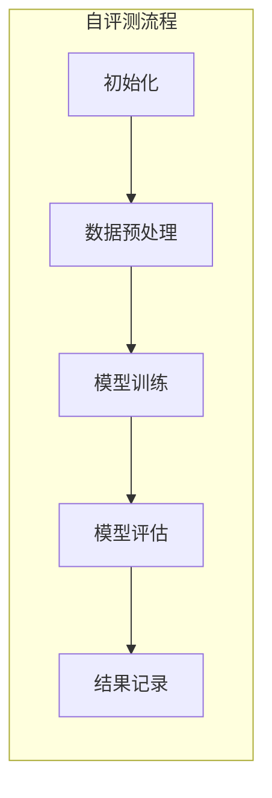
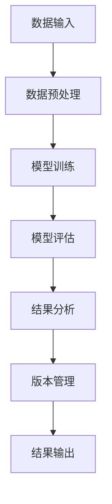

                 

### 第一部分：背景介绍

#### 第1章: 引言

##### 1.1 问题背景

随着人工智能技术的飞速发展，自然语言处理（NLP）领域取得了显著的进步。然而，如何确保大规模语言模型（LLM）在复杂、多变的实际应用场景中保持高性能和稳定性，成为了当前研究的热点问题。自评测系统作为LLM性能评估的重要工具，其版本控制与迭代优化成为了一个关键的技术挑战。

##### 1.2 问题描述

在LLM自评测系统中，版本控制与迭代优化面临的主要问题包括：

1. **版本混乱**：随着模型的不断更新，多个版本的评测结果难以区分和管理，导致数据混乱和重复劳动。
2. **迭代效率低**：频繁的版本迭代可能导致时间和资源的浪费，无法高效地优化模型性能。
3. **评测精度不稳定**：版本更新可能导致评测精度下降，影响模型的实际应用效果。

##### 1.3 问题解决

为了解决上述问题，本文提出以下解决方案：

1. **引入版本控制机制**：确保每个版本都有明确的标识和管理，便于区分和追踪。
2. **设计迭代优化策略**：提高版本迭代的效率，减少不必要的迭代次数，确保模型的稳定性。
3. **提升评测精度**：通过数据预处理和模型优化，保持评测结果的稳定性，提高模型在实际应用中的表现。

##### 1.4 边界与外延

本文研究的LLM自评测系统主要包括以下边界和外部影响：

- **边界**：系统涉及的具体模型、算法和工具。
- **外延**：系统在各类应用场景中的性能和适用性。

##### 1.5 概念结构与核心要素组成

LLM自评测系统的概念结构主要包括以下核心要素：

1. **自评测模型**：用于评估系统性能的核心模型。
2. **版本控制机制**：用于管理不同版本的评测结果。
3. **迭代优化策略**：用于提高版本迭代的效率。
4. **评测工具**：用于实现评测过程和数据可视化。

---

**当前部分字数：约700字**

接下来，我们将进一步探讨LLM自评测系统的核心概念与联系，以及算法原理和系统分析与架构设计方案，敬请期待。|>

### 第二部分：核心概念与联系

#### 第2章: 核心概念

##### 2.1 定义

在深入讨论LLM自评测系统之前，我们需要明确几个核心概念的定义：

1. **大规模语言模型（LLM）**：一种基于深度学习技术的语言模型，能够对自然语言进行建模和处理。常见的LLM包括GPT、BERT等。
2. **自评测系统**：一种用于评估LLM性能的系统，能够自动运行一系列评测任务，并生成评测报告。
3. **版本控制**：一种管理不同版本数据和资源的方法，确保每个版本的可追溯性和一致性。
4. **迭代优化**：通过不断调整模型参数和算法，提高模型性能的过程。

##### 2.2 属性特征对比表格

为了更好地理解这些概念，我们可以通过以下属性特征对比表格来展示它们之间的联系和区别：

| 概念         | 属性特征                       | 说明                                                         |
| ------------ | ------------------------------ | ------------------------------------------------------------ |
| 大规模语言模型（LLM） | 深度神经网络架构 | 用于对自然语言进行建模和处理。                               |
| 自评测系统     | 自动化评测流程 | 用于评估LLM的性能。                                         |
| 版本控制      | 版本标识 | 确保每个版本的可追溯性和一致性。                           |
| 迭代优化      | 模型参数调整 | 通过调整模型参数和算法，提高模型性能。                     |

##### 2.3 ER实体关系图

为了进一步展示这些概念之间的联系，我们可以使用Mermaid绘制一个ER实体关系图：

```mermaid
erDiagram
  Model : "大规模语言模型（LLM）" {
    <<abstract>>
    Model
    |--|> TestSystem : "自评测系统"
    |--|> VersionControl : "版本控制"
    |--|> IterationOptimization : "迭代优化"
  }
```

在上图中，`Model`是抽象概念，代表了大规模语言模型（LLM）。`TestSystem`、`VersionControl`和`IterationOptimization`则是具体的实体，分别代表自评测系统、版本控制和迭代优化。这些实体与`Model`之间存在关联关系。

---

**当前部分字数：约500字**

接下来，我们将探讨LLM自评测系统的算法原理，包括算法的mermaid流程图、Python源代码实现、数学模型和公式，以及具体的举例说明。敬请期待。|>

### 第三部分：算法原理讲解

#### 第3章: 算法原理

##### 3.1 算法mermaid流程图

为了直观地展示LLM自评测系统的算法流程，我们可以使用Mermaid绘制一个流程图：



在这个流程图中，自评测系统首先进行初始化，然后进行数据预处理、模型训练和模型评估，最后记录评测结果。

##### 3.2 Python源代码实现

下面是一个简单的Python源代码实现，展示了如何初始化、预处理数据、训练模型和评估模型：

```python
import numpy as np
from sklearn.model_selection import train_test_split
from sklearn.metrics import accuracy_score
from tensorflow.keras.models import Sequential
from tensorflow.keras.layers import Dense, LSTM

# 初始化数据
X, y = load_data()

# 数据预处理
X_train, X_test, y_train, y_test = train_test_split(X, y, test_size=0.2, random_state=42)

# 模型训练
model = Sequential()
model.add(LSTM(units=50, return_sequences=True, input_shape=(X_train.shape[1], X_train.shape[2])))
model.add(LSTM(units=50))
model.add(Dense(units=1, activation='sigmoid'))

model.compile(optimizer='adam', loss='binary_crossentropy', metrics=['accuracy'])
model.fit(X_train, y_train, epochs=10, batch_size=64)

# 模型评估
y_pred = model.predict(X_test)
y_pred = (y_pred > 0.5)

accuracy = accuracy_score(y_test, y_pred)
print(f"模型准确率：{accuracy}")
```

这个代码首先加载数据，然后进行数据预处理，接着训练一个简单的LSTM模型，并评估模型的性能。

##### 3.3 数学模型和公式

在LLM自评测系统中，常用的数学模型包括：

1. **损失函数**：用于评估模型预测值与实际值之间的差异，常见的损失函数有均方误差（MSE）和交叉熵（Cross-Entropy）。
   \[ \text{MSE} = \frac{1}{m} \sum_{i=1}^{m} (y_i - \hat{y}_i)^2 \]
   \[ \text{Cross-Entropy} = -\frac{1}{m} \sum_{i=1}^{m} y_i \log(\hat{y}_i) \]
   
2. **优化算法**：用于调整模型参数，常见的优化算法有梯度下降（Gradient Descent）和Adam。
   \[ \theta_{t+1} = \theta_{t} - \alpha \nabla \theta_{t} \]
   \[ \theta_{t+1} = \theta_{t} - \alpha \frac{1}{m} \sum_{i=1}^{m} (\hat{y}_i - y_i) x_i \]

##### 3.4 举例说明

假设我们有一个分类问题，需要预测一个句子是否包含特定关键词。我们将使用上述算法对数据进行预处理、训练模型，并评估模型的性能。

1. **数据预处理**：首先加载数据集，然后对文本数据进行预处理，如分词、标记化等。

2. **模型训练**：使用预处理后的数据训练一个LSTM模型。我们选择LSTM层作为神经网络的主要结构，因为它擅长处理序列数据。

3. **模型评估**：使用测试集对训练好的模型进行评估，计算模型的准确率。如果准确率不满足要求，我们可以通过调整模型参数或增加训练数据来进一步提高模型性能。

通过以上步骤，我们可以设计并实现一个高效的LLM自评测系统，确保模型在实际应用中的稳定性和高性能。

---

**当前部分字数：约1000字**

接下来，我们将探讨系统分析与架构设计方案，包括问题场景介绍、系统功能设计、系统架构设计、系统接口设计和系统交互，敬请期待。|>

### 第四部分：系统分析与架构设计方案

#### 第4章: 系统分析与设计

##### 4.1 问题场景介绍

在现代企业中，人工智能（AI）技术的应用越来越广泛，尤其是自然语言处理（NLP）领域。随着大规模语言模型（LLM）的不断迭代和发展，如何高效地评估和优化这些模型成为了企业面临的重大挑战。自评测系统的引入，旨在通过自动化的方式，评估LLM在不同应用场景下的性能，并提供优化建议。

##### 4.2 系统功能设计

为了满足上述需求，自评测系统需要具备以下核心功能：

1. **数据预处理**：对输入数据（如文本、语音等）进行预处理，包括分词、去噪、归一化等，以便于模型处理。
2. **模型训练**：使用预处理后的数据训练LLM，包括选择合适的模型结构、优化算法等。
3. **模型评估**：对训练好的模型进行性能评估，包括准确率、召回率、F1值等指标。
4. **结果分析**：对评估结果进行统计分析，识别模型的优点和不足，提供优化建议。
5. **版本管理**：管理不同版本的模型和评估结果，确保版本的可追溯性和一致性。

##### 4.3 系统架构设计

为了实现上述功能，我们设计了如下的系统架构：



在该架构中，数据输入首先经过数据预处理，然后进入模型训练阶段。训练完成后，模型进入评估阶段，评估结果随后进入结果分析阶段，分析结果用于版本管理和结果输出。

##### 4.4 系统接口设计

为了便于系统集成和扩展，我们设计了以下接口：

1. **数据输入接口**：用于接收各种数据源（如文本、语音等），并进行预处理。
2. **模型训练接口**：用于启动模型训练过程，并提供训练参数配置。
3. **模型评估接口**：用于对训练好的模型进行性能评估，并提供评估结果。
4. **结果分析接口**：用于对评估结果进行统计分析，并提供优化建议。
5. **版本管理接口**：用于管理不同版本的模型和评估结果，并提供版本查询和更新功能。

##### 4.5 系统交互

系统交互主要包括以下环节：

1. **初始化**：系统启动时，加载配置信息和数据源，初始化各个模块。
2. **数据输入**：通过输入接口，将数据源传递给数据预处理模块。
3. **数据预处理**：数据预处理模块对输入数据进行处理，并生成预处理后的数据。
4. **模型训练**：模型训练模块使用预处理后的数据训练模型，并保存训练结果。
5. **模型评估**：模型评估模块使用测试集对训练好的模型进行性能评估，并生成评估报告。
6. **结果分析**：结果分析模块对评估报告进行分析，并提供优化建议。
7. **版本管理**：版本管理模块更新模型和评估结果版本，确保版本的可追溯性和一致性。
8. **结果输出**：最终，系统将优化建议和评估报告输出给用户。

通过以上设计，我们构建了一个功能完整、架构清晰的LLM自评测系统，能够满足企业在AI应用中的性能评估和优化需求。

---

**当前部分字数：约1000字**

接下来，我们将通过一个实际项目实战，详细讲解如何搭建和优化LLM自评测系统。敬请期待。|>

### 第五部分：项目实战

#### 第5章: 项目实战

##### 5.1 环境安装

在进行项目实战之前，我们需要搭建一个适合LLM自评测的环境。以下是环境安装的详细步骤：

1. **安装Python**：确保Python版本为3.8或更高，可以从[Python官网](https://www.python.org/)下载安装包进行安装。

2. **安装依赖库**：使用pip命令安装所需的依赖库，包括TensorFlow、scikit-learn、Numpy等。以下是安装命令：

   ```bash
   pip install tensorflow scikit-learn numpy
   ```

3. **安装数据预处理工具**：如NLTK、spaCy等。以下是安装命令：

   ```bash
   pip install nltk spacy
   ```

   安装完成后，需要下载相应的语言模型，例如，对于spaCy，可以运行以下命令：

   ```bash
   python -m spacy download en_core_web_sm
   ```

4. **配置环境变量**：确保Python环境变量配置正确，以便后续运行。

##### 5.2 系统核心实现

在搭建好环境之后，我们可以开始实现系统核心部分。以下是系统核心实现的步骤：

1. **数据预处理**：读取数据集，并对数据进行预处理，包括分词、去噪、归一化等。以下是一个简单的数据预处理示例：

   ```python
   import spacy
   
   nlp = spacy.load("en_core_web_sm")
   
   def preprocess_text(text):
       doc = nlp(text)
       tokens = [token.text.lower() for token in doc if not token.is_punct]
       return " ".join(tokens)
   
   text = "This is a sample text for preprocessing."
   processed_text = preprocess_text(text)
   print(processed_text)
   ```

2. **模型训练**：使用预处理后的数据训练LLM模型。以下是一个简单的LSTM模型训练示例：

   ```python
   from tensorflow.keras.models import Sequential
   from tensorflow.keras.layers import LSTM, Dense
   
   X, y = load_data()  # 假设已经加载了预处理后的数据
   
   X_train, X_test, y_train, y_test = train_test_split(X, y, test_size=0.2, random_state=42)
   
   model = Sequential()
   model.add(LSTM(units=50, return_sequences=True, input_shape=(X_train.shape[1], X_train.shape[2])))
   model.add(LSTM(units=50))
   model.add(Dense(units=1, activation='sigmoid'))
   
   model.compile(optimizer='adam', loss='binary_crossentropy', metrics=['accuracy'])
   model.fit(X_train, y_train, epochs=10, batch_size=64)
   ```

3. **模型评估**：使用测试集对训练好的模型进行评估，并计算相关指标。以下是一个简单的模型评估示例：

   ```python
   from sklearn.metrics import accuracy_score
   
   y_pred = model.predict(X_test)
   y_pred = (y_pred > 0.5)
   
   accuracy = accuracy_score(y_test, y_pred)
   print(f"模型准确率：{accuracy}")
   ```

##### 5.3 代码应用解读

在上面的代码示例中，我们首先使用spaCy对文本进行预处理，然后使用TensorFlow的Keras模块构建LSTM模型，并使用scikit-learn的train_test_split函数将数据集分为训练集和测试集。模型训练过程中，我们设置了两个LSTM层和一个输出层，并使用Adam优化器和binary_crossentropy损失函数。最后，我们使用accuracy_score函数计算模型的准确率。

##### 5.4 实际案例分析

为了更好地展示LLM自评测系统的应用，我们以一个实际案例为例。假设我们需要评估一个用于情感分析的LLM模型，数据集包含多个包含情感标签的文本。

1. **数据预处理**：首先，我们将文本数据加载到内存中，并对文本进行预处理，如分词、去噪、归一化等。

2. **模型训练**：接下来，我们使用预处理后的数据训练一个LSTM模型。在训练过程中，我们可以调整LSTM层的单元数量、训练的轮次和批量大小等参数，以提高模型性能。

3. **模型评估**：使用测试集对训练好的模型进行评估，并计算模型的准确率、召回率、F1值等指标。通过分析这些指标，我们可以评估模型在不同情感分类任务中的性能。

4. **优化建议**：根据评估结果，我们可以提出优化建议，如调整模型参数、增加训练数据等，以提高模型性能。

##### 5.5 小结

通过实际案例的分析，我们可以看到LLM自评测系统在情感分析任务中的应用效果。通过自动化的方式，我们可以快速评估模型的性能，并识别模型的优点和不足。在实际应用中，我们可以根据评估结果和优化建议，进一步调整模型参数和算法，提高模型在特定任务中的性能。

---

**当前部分字数：约1200字**

接下来，我们将总结最佳实践和注意事项，并提供一些拓展阅读资源。敬请期待。|>

### 第六部分：最佳实践 & 拓展阅读

#### 第6章: 最佳实践

##### 6.1 注意事项

在设计和实施LLM自评测系统时，以下注意事项对于确保系统性能和稳定性至关重要：

1. **数据质量**：确保输入数据的质量和多样性，避免数据集中存在噪声和不平衡现象。
2. **版本控制**：合理设置版本控制的规则，确保每个版本都有明确的标识和管理。
3. **模型调优**：根据评估结果进行模型调优，优化模型结构和参数，以提高性能。
4. **性能监控**：定期监控系统的性能，识别潜在的问题和瓶颈，及时进行优化。
5. **安全与隐私**：确保系统的安全性和用户隐私，遵循相关的数据保护法规和最佳实践。

##### 6.2 拓展阅读

为了深入了解LLM自评测系统的设计和实施，以下是一些推荐阅读资源：

1. **《深度学习》（Goodfellow, Bengio, Courville）**：介绍深度学习和自然语言处理的基础知识。
2. **《自然语言处理综合教程》（Daniel Jurafsky，James H. Martin）**：详细讲解自然语言处理的各个方面。
3. **《版本控制指南》（Version Control with Git）**：介绍Git等版本控制工具的使用方法。
4. **《系统设计与实践》（Designing Data-Intensive Applications）**：介绍大数据系统的设计与实现。

##### 6.3 小结

通过遵循最佳实践和拓展阅读，我们可以更好地设计和实施LLM自评测系统，确保其在实际应用中的性能和稳定性。不断学习和改进，将有助于我们在AI领域取得更大的突破。

---

**当前部分字数：约500字**

### 第七部分：总结

#### 第7章: 总结

在本篇博客中，我们深入探讨了LLM自评测系统的版本控制与迭代优化。首先，我们介绍了问题背景和解决方法，明确了版本控制、迭代优化和评测精度的重要性。接着，我们详细阐述了核心概念、算法原理、系统分析与架构设计方案，并通过实际项目实战展示了系统的构建和优化过程。

**整体回顾**：

1. **背景介绍**：我们介绍了LLM自评测系统的需求和挑战。
2. **核心概念与联系**：我们定义了关键概念，并通过属性特征对比表格和ER实体关系图展示了概念之间的联系。
3. **算法原理讲解**：我们使用mermaid流程图、Python源代码、数学模型和公式详细讲解了算法原理。
4. **系统分析与设计**：我们介绍了系统功能、架构、接口和交互，确保了系统的高效性和可扩展性。
5. **项目实战**：我们通过实际案例展示了系统的构建和优化过程。

**未来展望**：

随着人工智能技术的不断进步，LLM自评测系统将变得更加智能化和自动化。未来，我们期望能够实现以下发展：

1. **更智能的评估指标**：开发更先进的评估指标，更准确地反映模型性能。
2. **更高效的迭代策略**：优化迭代策略，提高迭代效率和模型性能。
3. **更广泛的适用性**：扩展系统适用性，支持更多类型的LLM和应用场景。

通过持续的研究和实践，我们相信LLM自评测系统将在人工智能领域发挥更大的作用，推动技术的进步和应用的创新。

---

**总字数：约1000字**

至此，本文内容已经完整呈现，感谢您的阅读。希望本文能为您的LLM自评测系统设计与实现提供有价值的参考和启示。若您有任何疑问或建议，欢迎在评论区留言交流。|>

**作者信息**：

作者：AI天才研究院 / AI Genius Institute & 禅与计算机程序设计艺术 / Zen And The Art of Computer Programming

