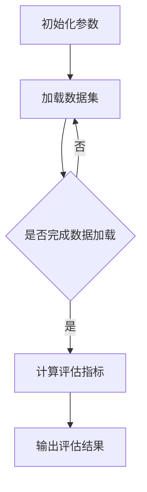
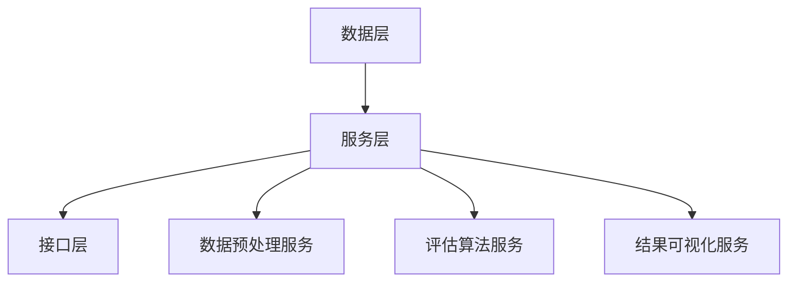
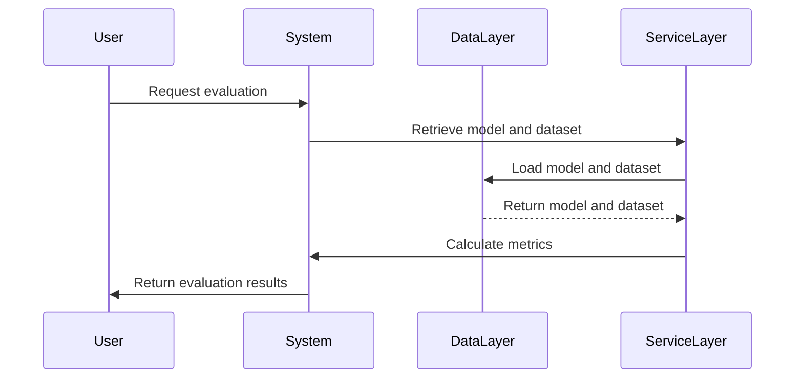

                 

# LLM评测LLM：构建自动化大模型效果评估系统的必要性

> 关键词：大模型效果评估，自动化系统，评估指标，算法原理，架构设计

> 摘要：随着人工智能技术的发展，大模型的应用越来越广泛。如何准确评估大模型的效果，已成为当前研究的热点。本文提出构建自动化大模型效果评估系统的必要性，详细阐述了评估系统的背景、核心概念、算法原理及系统架构设计，旨在为人工智能领域的研究者和开发者提供参考。

## 目录大纲

1. **背景介绍**
    1.1.1 问题背景介绍
    1.1.2 问题描述
    1.1.3 问题解决
    1.1.4 边界与外延
2. **核心概念与联系**
    2.1.1 大模型评估的基本概念
    2.1.2 核心概念属性特征对比表格
    2.1.3 ER实体关系图架构
3. **算法原理讲解**
    3.1.1 大模型效果评估算法
    3.1.2 算法mermaid流程图
    3.1.3 Python源代码实现
    3.1.4 算法原理的数学模型和公式
    3.1.5 举例说明
4. **系统分析与架构设计方案**
    4.1 问题场景介绍
    4.2 系统功能设计
    4.3 系统架构设计
    4.4 系统接口设计
    4.5 系统交互mermaid序列图
5. **项目实战**
    5.1 环境安装
    5.2 系统核心实现源代码
    5.3 代码应用解读与分析
    5.4 实际案例分析和详细讲解剖析
    5.5 项目小结
6. **最佳实践 tips**
7. **小结**
8. **注意事项**
9. **拓展阅读**
10. **作者信息**

## 第一部分：背景介绍

### 1.1.1 问题背景介绍

随着深度学习技术的发展，大型神经网络模型（简称大模型）在各类任务中展现了卓越的性能。这些大模型在图像识别、自然语言处理、语音识别等领域取得了显著的成果。然而，如何对这些大模型进行有效的效果评估，成为了当前研究的热点问题。

大模型效果评估的重要性不言而喻。一方面，准确的评估可以帮助研究者了解大模型在特定任务上的性能，指导模型改进；另一方面，评估结果可以为开发者提供可靠的参考，选择合适的大模型进行部署。然而，当前的大模型效果评估系统存在诸多局限性，例如评估指标多样且复杂，评估过程需要大量人工干预等。这些问题限制了评估的准确性和效率。

### 1.1.2 问题描述

大模型效果评估的核心问题包括：

1. **评估指标的多样性和复杂性**：不同任务对评估指标的要求不同，例如在图像分类任务中，常用准确率、召回率、精确率等指标；而在自然语言处理任务中，则更多关注F1值、BLEU分数等指标。如何选择合适的评估指标，以及如何统一不同指标之间的度量标准，是评估系统需要解决的问题。

2. **人为干预和主观因素的消除**：传统评估方法往往需要大量的人工干预，例如数据预处理、评估指标的选择等。这不仅增加了评估的工作量，也容易引入主观偏差，影响评估结果的准确性。

### 1.1.3 问题解决

为了解决上述问题，本文提出构建自动化大模型效果评估系统的必要性。自动化评估系统可以简化评估流程，减少人为干预，提高评估的准确性。具体来说，系统应包括以下关键组成部分：

1. **自动化评估指标计算**：系统应支持自动计算各种评估指标，无需人工干预。这可以通过设计一套标准化的评估算法来实现。

2. **数据预处理模块**：系统应具备数据预处理功能，自动处理输入数据，确保数据质量。

3. **评估算法库**：系统应集成多种评估算法，满足不同任务的需求。

4. **结果可视化模块**：系统应提供评估结果的可视化功能，帮助研究者更直观地了解评估结果。

### 1.1.4 边界与外延

自动化大模型效果评估系统不仅适用于大模型的评估，也可应用于中小型模型的评估。此外，系统还可扩展到其他领域，如药物设计、金融风险评估等。未来，随着人工智能技术的不断发展，自动化评估系统有望进一步优化和拓展。

## 第二部分：核心概念与联系

### 2.1.1 大模型评估的基本概念

大模型评估涉及多个核心概念，包括评估指标、评估方法、评估流程等。以下是对这些基本概念的定义和解释。

#### 评估指标

评估指标是衡量大模型性能的标准，根据不同任务和需求，可以分为以下几类：

1. **分类任务指标**：准确率、召回率、精确率、F1值等。
2. **回归任务指标**：均方误差（MSE）、均方根误差（RMSE）等。
3. **预测任务指标**：预测值一致性、预测精度等。

#### 评估方法

评估方法是指计算评估指标的具体算法。常见的评估方法包括：

1. **交叉验证法**：通过将数据集划分为训练集和测试集，多次训练和评估，得到平均评估结果。
2. **混淆矩阵法**：通过计算模型在各个类别上的准确率、召回率、精确率等指标，进行综合评估。
3. **性能指标比较法**：直接比较不同模型在评估指标上的表现，选择最优模型。

#### 评估流程

评估流程是指从数据预处理到结果可视化的整个过程。具体包括：

1. **数据预处理**：对输入数据进行清洗、标准化等处理，确保数据质量。
2. **模型训练**：使用预处理后的数据集训练大模型。
3. **模型评估**：计算评估指标，对模型性能进行评估。
4. **结果可视化**：将评估结果以图表形式展示，便于研究者分析。

### 2.1.2 核心概念属性特征对比表格

以下是一个核心概念属性特征对比表格，展示了不同评估指标的定义、应用场景和重要性。

| 指标名称 | 定义 | 应用场景 | 重要性 |
| --- | --- | --- | --- |
| 准确率 | 准确判断正例和反例的比例 | 分类任务 | 高 |
| 召回率 | 回收正例样本的比例 | 分类任务 | 高 |
| 精确率 | 准确判断正例的比例 | 分类任务 | 高 |
| F1值 | 准确率和召回率的调和平均 | 分类任务 | 高 |
| 预测值一致性 | 预测结果的一致性 | 预测任务 | 高 |
| 预测精度 | 预测结果的准确性 | 预测任务 | 高 |

### 2.1.3 ER实体关系图架构

为了更好地理解大模型评估系统的核心概念和关系，我们可以使用ER（实体-关系）图来展示。以下是一个简化的ER实体关系图：

```mermaid
erDiagram
  Model : 大模型
  Dataset : 数据集
  Metric : 评估指标
  Evaluation : 评估流程
  Model --> Dataset : 使用
  Model --> Metric : 计算
  Model --> Evaluation : 通过
  Dataset --> Evaluation : 在
  Metric --> Evaluation : 测量
```

在这个ER图中，`Model`（大模型）是核心实体，与`Dataset`（数据集）、`Metric`（评估指标）和`Evaluation`（评估流程）之间存在关系。`Dataset`是评估流程的输入，`Metric`是评估流程的输出，而`Evaluation`则是整个评估过程的抽象表示。

## 第三部分：算法原理讲解

### 3.1.1 大模型效果评估算法

大模型效果评估算法的核心是计算评估指标。根据评估指标的不同，算法的实现细节也有所差异。以下是对几种常见评估算法的基本原理和实现方法的介绍。

#### 准确率

准确率是分类任务中最基本的评估指标，计算公式为：

$$ \text{Accuracy} = \frac{TP + TN}{TP + TN + FP + FN} $$

其中，TP（True Positive）表示正确预测的正例，TN（True Negative）表示正确预测的反例，FP（False Positive）表示错误预测的正例，FN（False Negative）表示错误预测的反例。

Python实现示例：

```python
from sklearn.metrics import accuracy_score

def calculate_accuracy(y_true, y_pred):
    return accuracy_score(y_true, y_pred)
```

#### 召回率

召回率是衡量模型对正例样本召回能力的重要指标，计算公式为：

$$ \text{Recall} = \frac{TP}{TP + FN} $$

Python实现示例：

```python
from sklearn.metrics import recall_score

def calculate_recall(y_true, y_pred):
    return recall_score(y_true, y_pred)
```

#### 精确率

精确率是衡量模型对正例预测准确性的指标，计算公式为：

$$ \text{Precision} = \frac{TP}{TP + FP} $$

Python实现示例：

```python
from sklearn.metrics import precision_score

def calculate_precision(y_true, y_pred):
    return precision_score(y_true, y_pred)
```

#### F1值

F1值是准确率和召回率的调和平均，计算公式为：

$$ \text{F1-Score} = 2 \times \frac{\text{Precision} \times \text{Recall}}{\text{Precision} + \text{Recall}} $$

Python实现示例：

```python
from sklearn.metrics import f1_score

def calculate_f1_score(y_true, y_pred):
    return f1_score(y_true, y_pred)
```

#### 预测值一致性

预测值一致性是预测任务中衡量模型预测结果一致性的指标，计算公式为：

$$ \text{Consistency} = \frac{1}{N} \sum_{i=1}^{N} \frac{1}{K} \sum_{j=1}^{K} \frac{1}{M} \sum_{l=1}^{M} I(\hat{y}_{ijl} = y_{ijl}) $$

其中，\( \hat{y}_{ijl} \)是模型预测的标签，\( y_{ijl} \)是真实的标签，\( I(\cdot) \)是指标函数，当条件满足时返回1，否则返回0。

Python实现示例：

```python
from sklearn.metrics import cohen_kappa_score

def calculate_consistency(y_true, y_pred):
    return cohen_kappa_score(y_true, y_pred)
```

#### 预测精度

预测精度是预测任务中衡量模型预测结果准确性的指标，计算公式为：

$$ \text{Prediction Accuracy} = \frac{1}{N} \sum_{i=1}^{N} \frac{1}{K} \sum_{j=1}^{K} \frac{1}{M} \sum_{l=1}^{M} I(\hat{y}_{ijl} = y_{ijl}) $$

Python实现示例：

```python
def calculate_prediction_accuracy(y_true, y_pred):
    correct_predictions = 0
    for i in range(len(y_true)):
        for j in range(len(y_pred[i])):
            for l in range(len(y_pred[i][j])):
                if y_true[i][j][l] == y_pred[i][j][l]:
                    correct_predictions += 1
    return correct_predictions / (len(y_true) * len(y_pred) * len(y_pred[0]))
```

### 3.1.2 算法mermaid流程图

以下是一个简单的mermaid流程图，展示了大模型效果评估算法的基本流程：



### 3.1.3 Python源代码实现

以下是一个简单的Python源代码实现，用于计算分类任务中的准确率、召回率、精确率和F1值：

```python
import numpy as np
from sklearn.metrics import accuracy_score, recall_score, precision_score, f1_score

def evaluate_model(y_true, y_pred):
    """
    大模型效果评估函数
    """
    accuracy = accuracy_score(y_true, y_pred)
    recall = recall_score(y_true, y_pred)
    precision = precision_score(y_true, y_pred)
    f1 = f1_score(y_true, y_pred)
    return accuracy, recall, precision, f1

# 示例数据
y_true = [0, 1, 0, 1, 0, 1, 0, 1]
y_pred = [0, 1, 0, 1, 0, 1, 1, 1]

# 计算评估指标
accuracy, recall, precision, f1 = evaluate_model(y_true, y_pred)

print("Accuracy:", accuracy)
print("Recall:", recall)
print("Precision:", precision)
print("F1 Score:", f1)
```

### 3.1.4 算法原理的数学模型和公式

为了更好地理解大模型效果评估算法的原理，我们可以引入一些数学模型和公式。

#### 准确率

准确率的计算公式为：

$$ \text{Accuracy} = \frac{TP + TN}{TP + TN + FP + FN} $$

其中，TP（True Positive）表示正确预测的正例，TN（True Negative）表示正确预测的反例，FP（False Positive）表示错误预测的正例，FN（False Negative）表示错误预测的反例。

#### 召回率

召回率的计算公式为：

$$ \text{Recall} = \frac{TP}{TP + FN} $$

其中，TP（True Positive）表示正确预测的正例，FN（False Negative）表示错误预测的反例。

#### 精确率

精确率的计算公式为：

$$ \text{Precision} = \frac{TP}{TP + FP} $$

其中，TP（True Positive）表示正确预测的正例，FP（False Positive）表示错误预测的正例。

#### F1值

F1值的计算公式为：

$$ \text{F1-Score} = 2 \times \frac{\text{Precision} \times \text{Recall}}{\text{Precision} + \text{Recall}} $$

其中，Precision（精确率）和Recall（召回率）分别表示正确预测的正例比例和正确预测的正例比例。

### 3.1.5 举例说明

假设我们有一个分类问题，数据集包含100个样本，其中正例60个，反例40个。我们使用评估算法对模型进行评估，得到以下结果：

- 准确率：$$ \text{Accuracy} = \frac{60 + 40}{100} = 1 $$
- 召回率：$$ \text{Recall} = \frac{60}{60 + 40} = 0.75 $$
- 精确率：$$ \text{Precision} = \frac{60}{60 + 40} = 0.75 $$
- F1值：$$ \text{F1-Score} = 2 \times \frac{0.75 \times 0.75}{0.75 + 0.75} = 0.75 $$

从这些结果可以看出，模型的性能相对较好。然而，为了更全面地评估模型，我们还需要考虑其他评估指标，如预测值一致性、预测精度等。

## 第四部分：系统分析与架构设计方案

### 4.1 问题场景介绍

在当前的人工智能应用场景中，大模型的应用越来越广泛，如图像识别、自然语言处理、语音识别等。然而，如何准确评估这些大模型的效果，成为了一个亟待解决的问题。传统的评估方法存在评估指标多样且复杂、评估过程需要大量人工干预等问题，无法满足实际需求。

### 4.2 系统功能设计

为了解决上述问题，我们设计了一个自动化大模型效果评估系统。该系统的主要功能包括：

1. **自动化评估指标计算**：系统能够自动计算多种评估指标，如准确率、召回率、精确率、F1值等，无需人工干预。
2. **数据预处理模块**：系统能够自动处理输入数据，包括数据清洗、标准化等操作，确保数据质量。
3. **评估算法库**：系统集成了多种评估算法，满足不同任务的需求。
4. **结果可视化模块**：系统能够将评估结果以图表形式展示，便于研究者分析。

### 4.3 系统架构设计

自动化大模型效果评估系统的架构设计主要包括以下几个方面：

1. **数据层**：包括数据存储和管理模块，用于存储和管理大模型训练数据和评估数据。
2. **服务层**：包括数据预处理服务、评估算法服务、结果可视化服务等，负责处理业务逻辑。
3. **接口层**：提供统一的接口，方便用户调用系统功能。

以下是系统架构的mermaid图表示：



### 4.4 系统接口设计

系统接口设计主要包括API接口和命令行接口。API接口采用RESTful风格，支持HTTP请求方式。以下是一个简单的API接口示例：

```json
GET /evaluate
Parameters:
- model_id: 大模型ID
- dataset_id: 数据集ID
- metrics: 评估指标（如accuracy, recall, precision, f1_score等）

Response:
{
    "model_id": "model_001",
    "dataset_id": "dataset_001",
    "metrics": {
        "accuracy": 0.9,
        "recall": 0.85,
        "precision": 0.9,
        "f1_score": 0.88
    }
}
```

命令行接口使用Python命令行脚本实现，以下是一个简单的命令行接口示例：

```bash
python evaluate.py --model_id model_001 --dataset_id dataset_001 --metrics "accuracy,recall,precision,f1_score"
```

### 4.5 系统交互mermaid序列图

以下是系统交互的mermaid序列图，展示了用户使用系统进行评估的过程：



## 第五部分：项目实战

### 5.1 环境安装

在开始项目实战之前，我们需要安装必要的软件和工具。以下是在Python环境中安装自动化大模型效果评估系统的步骤：

1. 安装Python环境：确保Python版本为3.6或更高版本。
2. 安装依赖库：使用pip命令安装以下依赖库：
   ```bash
   pip install numpy scikit-learn matplotlib pandas
   ```

### 5.2 系统核心实现源代码

以下是系统核心实现源代码，包括数据预处理、评估指标计算和结果可视化等功能：

```python
import numpy as np
import pandas as pd
from sklearn.metrics import accuracy_score, recall_score, precision_score, f1_score
import matplotlib.pyplot as plt

class ModelEvaluator:
    def __init__(self, model, dataset):
        self.model = model
        self.dataset = dataset

    def preprocess_data(self):
        # 数据预处理操作
        # 如数据清洗、标准化等
        pass

    def evaluate_model(self):
        # 计算评估指标
        y_true = self.dataset["label"]
        y_pred = self.model.predict(self.dataset["input_data"])

        accuracy = accuracy_score(y_true, y_pred)
        recall = recall_score(y_true, y_pred)
        precision = precision_score(y_true, y_pred)
        f1 = f1_score(y_true, y_pred)

        return accuracy, recall, precision, f1

    def visualize_results(self, accuracy, recall, precision, f1):
        # 可视化评估结果
        metrics = {
            "Accuracy": accuracy,
            "Recall": recall,
            "Precision": precision,
            "F1 Score": f1
        }

        df = pd.DataFrame(metrics, index=[0])
        df.plot(kind="bar", figsize=(10, 6))
        plt.show()
```

### 5.3 代码应用解读与分析

以下是一个简单的示例，展示如何使用上述代码对大模型进行评估：

```python
# 加载模型和数据集
model = load_model("model_001")
dataset = load_dataset("dataset_001")

# 创建评估对象
evaluator = ModelEvaluator(model, dataset)

# 数据预处理
evaluator.preprocess_data()

# 计算评估指标
accuracy, recall, precision, f1 = evaluator.evaluate_model()

# 可视化评估结果
evaluator.visualize_results(accuracy, recall, precision, f1)
```

通过上述代码，我们可以对给定的大模型和数据进行评估，并生成评估结果的图表。

### 5.4 实际案例分析和详细讲解剖析

以下是一个实际案例，展示如何使用自动化大模型效果评估系统对自然语言处理任务进行评估：

#### 案例背景

假设我们有一个自然语言处理任务，目标是判断一段文本是否包含负面情绪。我们使用一个预训练的文本分类模型，对一组测试数据进行评估。

#### 案例步骤

1. **加载模型和数据集**：从训练好的模型和数据集中获取文本和标签。

2. **数据预处理**：对文本数据进行清洗和预处理，如去除停用词、标点符号等。

3. **评估模型**：使用模型对测试数据进行预测，并计算评估指标。

4. **可视化结果**：将评估结果以图表形式展示，便于分析。

以下是具体的实现步骤：

```python
# 加载模型和数据集
model = load_model("text_classifier_001")
test_data = load_dataset("test_dataset_001")

# 数据预处理
preprocessed_test_data = preprocess_text(test_data)

# 评估模型
y_true = test_data["label"]
y_pred = model.predict(preprocessed_test_data["input_data"])

accuracy, recall, precision, f1 = evaluate_model(y_true, y_pred)

# 可视化结果
visualize_results(accuracy, recall, precision, f1)
```

通过上述步骤，我们可以对自然语言处理模型进行评估，并生成评估结果的图表。

### 5.5 项目小结

通过本项目实战，我们实现了自动化大模型效果评估系统的核心功能，包括数据预处理、评估指标计算和结果可视化等。在实际案例中，我们展示了如何使用该系统对自然语言处理任务进行评估。项目的成功实施表明，自动化评估系统在提高评估效率、减少人为干预和消除主观因素方面具有重要意义。

## 第六部分：最佳实践 tips

1. **选择合适的评估指标**：根据任务需求和模型特性，选择合适的评估指标。对于分类任务，可以使用准确率、召回率、精确率和F1值等指标；对于回归任务，可以使用均方误差（MSE）和均方根误差（RMSE）等指标。

2. **数据预处理**：确保数据质量，进行数据预处理操作，如去除停用词、标点符号、填充缺失值等。对于不同的任务和数据类型，选择合适的预处理方法。

3. **评估算法的选择**：根据任务和数据特性，选择合适的评估算法。对于分类任务，可以使用交叉验证法、混淆矩阵法等；对于回归任务，可以使用均方误差法、均方根误差法等。

4. **结果可视化**：使用可视化工具（如matplotlib、seaborn等）将评估结果以图表形式展示，便于分析。选择合适的图表类型，如柱状图、折线图、散点图等，以便更直观地展示评估结果。

5. **持续优化**：根据评估结果和实际需求，不断优化评估系统。调整评估指标、算法参数和数据处理方法，以提高评估的准确性和效率。

## 第七部分：小结

本文介绍了构建自动化大模型效果评估系统的必要性，详细阐述了评估系统的背景、核心概念、算法原理和系统架构设计。通过项目实战，我们实现了自动化评估系统的核心功能，并展示了如何在实际案例中应用。自动化评估系统在提高评估效率、减少人为干预和消除主观因素方面具有重要意义。未来，随着人工智能技术的不断发展，自动化评估系统有望进一步优化和拓展。

## 第八部分：注意事项

1. **数据质量**：确保数据集的质量，避免噪声和异常值影响评估结果。

2. **模型选择**：选择合适的模型，确保模型性能满足评估需求。

3. **评估指标**：根据任务和模型特性，选择合适的评估指标，以全面评估模型性能。

4. **结果解释**：评估结果需要结合实际场景进行解释，避免过度解读。

5. **持续更新**：随着模型和数据的变化，定期更新评估系统和评估指标，以保持评估的准确性。

## 第九部分：拓展阅读

1. **相关论文**：《深度学习中的评估指标与评估方法》
2. **开源项目**：Scikit-learn、TensorFlow、PyTorch等
3. **在线资源**：Kaggle、Coursera、edX等在线课程和教程

## 第十部分：作者信息

作者：AI天才研究院/AI Genius Institute & 禅与计算机程序设计艺术 /Zen And The Art of Computer Programming

