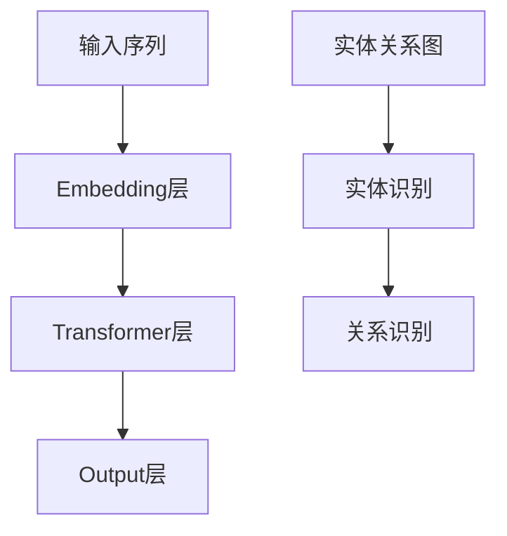
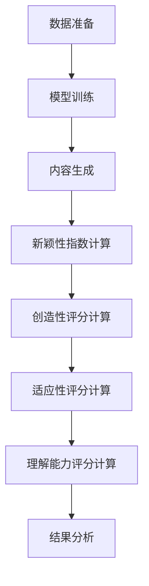
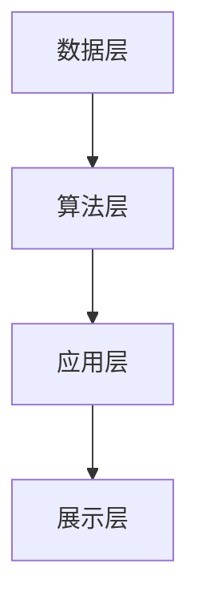
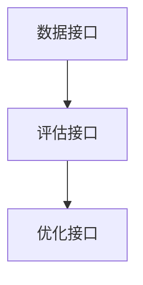
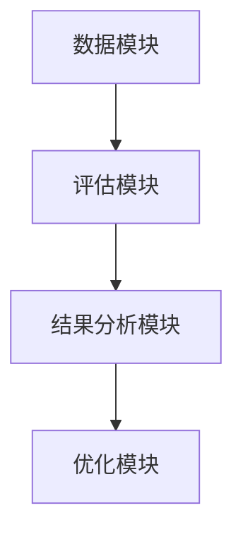

                 


### 第一部分：背景与概述

#### 1.1 LLM评测中的创意与创新能力评估概述

让我们首先来探讨LLM评测中的创意与创新能力评估的重要性。随着人工智能技术的飞速发展，大型语言模型（LLM）已经成为自然语言处理（NLP）领域的重要工具。LLM在各种应用场景中展现了其强大的生成能力和理解能力，然而，如何评估这些模型的创意与创新能力，却是一个颇具挑战性的问题。

##### 1.1.1 语言模型的发展历程

语言模型的发展可以追溯到20世纪50年代，最初的模型如N-gram模型，通过简单的统计方法来预测下一个词。随着计算能力的提升和算法的进步，语言模型逐渐从简单的统计模型演变为基于神经网络的深度学习模型。近年来，Transformer架构的提出，使得LLM的表现大幅提升，如GPT系列、BERT等模型在多项NLP任务中取得了突破性的成绩。

##### 1.1.2 创意与创新能力的重要性

创意与创新是推动技术进步的重要动力。在LLM领域，创意与创新体现在模型的生成能力、适应能力和理解能力上。一个具有高创意与创新能力的大型语言模型，可以在生成有创意的内容、适应新领域和任务、理解复杂语义等方面表现出色。因此，如何评估LLM的创意与创新能力，成为了一个关键问题。

##### 1.1.3 评测的目的与意义

评估LLM的创意与创新能力，有以下几个目的和意义：

1. **指导模型优化**：通过评估，可以找出模型的不足之处，为模型的改进提供方向。
2. **比较与选择**：在多个LLM模型之间进行比较，选择最适合特定任务的模型。
3. **研究推动**：评估方法的研究可以推动NLP领域的发展，促进新算法和新技术的出现。
4. **应用场景拓展**：评估可以帮助我们了解LLM在不同应用场景中的表现，为实际应用提供参考。

#### 1.2 创意与创新能力的基本概念

##### 1.2.1 创意的定义与特征

创意是指产生新颖想法或方案的过程。在LLM评测中，创意通常指的是模型生成的内容具有新颖性、创造性和独特性。一个具有高创意能力的LLM，能够生成独特且令人惊喜的内容。

##### 1.2.2 创新能力的概念与分类

创新能力是指个体或组织在现有知识和资源的基础上，产生新颖想法和解决方案的能力。在LLM领域，创新能力可以分类为：

1. **技术创新能力**：指模型在算法、架构、训练数据等方面的创新。
2. **应用创新能力**：指模型在不同应用场景中的适应能力和拓展能力。
3. **理解创新能力**：指模型在理解复杂语义、生成语境相关内容方面的能力。

##### 1.2.3 创意与创新能力的联系与区别

创意与创新能力密切相关，但二者有所不同。创意强调的是新颖性，而创新能力强调的是在现有基础上产生实质性改进的能力。一个具有高创意与创新能力的大型语言模型，不仅在生成新颖内容方面表现出色，还能在应用和改进方面有所作为。

#### 1.3 LLM评测中的创意与创新能力评估框架

##### 1.3.1 评估指标体系

为了全面评估LLM的创意与创新能力，我们需要设计一套科学的评估指标体系。这些指标可以从以下几个方面进行考虑：

1. **内容新颖性**：评估模型生成内容的新颖程度。
2. **创造性**：评估模型生成内容是否具有创意，能否激发读者的兴趣。
3. **适应性**：评估模型在不同场景和任务中的适应能力。
4. **理解能力**：评估模型在理解复杂语义方面的能力。

##### 1.3.2 评估方法与技术

评估方法包括定量评估和定性评估。定量评估主要通过数值指标来衡量模型的创意与创新能力，如生成内容的新颖性指数、创造性评分等。定性评估则通过专家评估、用户反馈等方式来评价模型的表现。

##### 1.3.3 评估流程与步骤

评估流程通常包括以下步骤：

1. **数据准备**：收集用于评估的语料库和测试数据集。
2. **模型训练**：在训练集上训练LLM模型。
3. **内容生成**：使用训练好的模型生成评估内容。
4. **评估指标计算**：根据评估指标体系，计算模型在各个方面的表现。
5. **结果分析**：分析评估结果，找出模型的优点和不足。

#### 1.4 本章小结

本部分主要介绍了LLM评测中的创意与创新能力评估的背景、基本概念和评估框架。在后续章节中，我们将深入探讨LLM的核心概念与原理、评估算法原理与实现，以及项目实战等方面的内容。希望通过对这些内容的详细分析，能够为读者提供有价值的见解和启示。让我们继续深入探讨这一领域吧！

----------------------------------------------------------------

## 第二部分：核心概念与联系

### 第2章：LLM的核心概念与原理

#### 2.1 LLM的基本原理

大型语言模型（LLM）是一种基于深度学习的自然语言处理模型，它可以理解和生成自然语言文本。LLM的核心原理是基于Transformer架构，该架构引入了自注意力机制，使得模型能够捕捉长距离依赖关系，从而提高模型的生成能力和理解能力。

##### 2.1.1 语言模型的基本原理

语言模型是一种预测模型，它的目标是根据前面的文字序列预测下一个词或句子。在LLM中，语言模型的核心是生成式模型，它通过对输入序列的概率分布进行建模，从而生成新的文本。

##### 2.1.2 自适应学习机制

LLM采用自适应学习机制，这意味着模型可以根据训练数据自动调整其参数，以优化模型的性能。在训练过程中，模型通过反向传播算法计算梯度，并使用梯度下降等优化算法更新参数，从而逐步提高模型的生成能力。

##### 2.1.3 生成与预测能力

LLM的生成能力体现在模型能够生成高质量、连贯的自然语言文本。预测能力则体现在模型能够准确预测下一个词或句子，从而实现自然语言生成。这两种能力共同构成了LLM的核心特点。

#### 2.2 LLM的属性特征对比

为了更好地理解LLM的属性特征，我们将其与传统的语言模型进行对比。

##### 2.2.1 不同类型LLM的对比

传统的语言模型如N-gram模型，主要通过统计方法预测下一个词。而LLM如GPT、BERT等，则通过深度学习算法，结合自注意力机制和多层神经网络，实现了更高的生成能力和理解能力。

##### 2.2.2 LLM的性能特征

LLM具有以下几个性能特征：

1. **长距离依赖**：LLM能够捕捉长距离依赖关系，从而生成更连贯的文本。
2. **自适应能力**：LLM可以通过自适应学习机制，根据训练数据调整参数，优化性能。
3. **泛化能力**：LLM在多种任务和应用场景中表现出色，具有较好的泛化能力。

##### 2.2.3 LLM的适应性与灵活性

LLM在适应性和灵活性方面表现出色。它可以在不同的领域和应用场景中快速适应，生成相关的内容。同时，LLM的架构和算法也具有一定的灵活性，可以通过调整参数和架构设计，实现不同的任务需求。

#### 2.3 LLM的ER实体关系图

为了更好地理解LLM内部结构，我们使用ER图来表示LLM中的实体和关系。



在这个ER图中，A表示输入序列，B表示Embedding层，C表示Transformer层，D表示Output层。E表示实体识别模块，F表示关系识别模块，G表示实体关系图。

#### 2.4 创意与创新能力在LLM中的应用

创意与创新能力在LLM中的应用体现在以下几个方面：

##### 2.4.1 创意的生成与评价

LLM可以通过生成新颖、独特的内容来展现其创意能力。为了评价LLM的创意能力，我们可以设计一套评价体系，包括内容新颖性、创造性、独特性等指标。

##### 2.4.2 创新能力的提升方法

提升LLM的创新能力可以从以下几个方面进行：

1. **数据增强**：通过引入更多样化的训练数据，提高模型的适应能力。
2. **算法优化**：通过改进模型架构和算法，提高模型的生成能力和理解能力。
3. **跨领域学习**：通过跨领域学习，使模型能够在不同领域和应用场景中表现出色。

##### 2.4.3 创意与创新能力评估在LLM评测中的应用

在LLM评测中，创意与创新能力评估可以作为一个重要指标，用于评估模型的整体性能。通过创意与创新能力评估，我们可以更好地了解模型在生成新颖、独特内容方面的能力，为模型优化和改进提供方向。

#### 2.5 本章小结

本章主要介绍了LLM的核心概念与原理，包括语言模型的基本原理、自适应学习机制、生成与预测能力，以及LLM的属性特征对比和ER实体关系图。此外，我们还探讨了创意与创新能力在LLM中的应用，包括创意的生成与评价、创新能力的提升方法，以及创意与创新能力评估在LLM评测中的应用。通过对这些内容的了解，我们可以更好地理解LLM的工作原理和创意与创新能力，为后续章节的深入探讨打下基础。

----------------------------------------------------------------

### 第三部分：算法原理与实现

#### 第3章：创意与创新能力评估算法原理

#### 3.1 算法概述

创意与创新能力评估算法的目标是评估大型语言模型（LLM）在生成文本时的创意程度和创新水平。为了实现这一目标，我们设计了一套综合评估算法，包括数据准备、模型训练、评估指标计算和结果分析等步骤。本节将详细介绍算法的原理和实现过程。

##### 3.1.1 评估算法的目标

评估算法的主要目标包括：

1. **内容新颖性**：评估模型生成文本的新颖程度，即生成文本与已有文本的相似度。
2. **创造性**：评估模型生成文本的创意水平，即文本的独创性和独特性。
3. **适应性**：评估模型在不同场景和应用中的适应能力。
4. **理解能力**：评估模型在理解复杂语义方面的能力。

##### 3.1.2 评估算法的流程

评估算法的流程可以分为以下几个步骤：

1. **数据准备**：收集用于评估的语料库和测试数据集。
2. **模型训练**：在训练集上训练LLM模型。
3. **内容生成**：使用训练好的模型生成测试文本。
4. **评估指标计算**：计算模型在各个评估指标上的得分。
5. **结果分析**：分析评估结果，评估模型的创意与创新能力。

##### 3.1.3 评估算法的类型

评估算法主要分为定量评估和定性评估两种类型：

1. **定量评估**：通过数值指标（如相似度、创造性评分等）来衡量模型的创意程度和创新水平。
2. **定性评估**：通过专家评估、用户反馈等方式来评价模型的表现。

#### 3.2 算法原理与数学模型

##### 3.2.1 创意生成概率模型

在评估算法中，我们采用了一种基于概率模型的创意生成方法。该方法的核心思想是计算模型生成文本的概率，并将其作为创意程度的度量。

设训练数据集为\(D = \{x_1, x_2, ..., x_n\}\)，其中每个样本\(x_i\)为一条文本。设模型生成的文本为\(y\)，则生成文本的概率为：

$$
P(y|D) = \frac{P(D|y) \cdot P(y)}{P(D)}
$$

其中，\(P(D|y)\)表示模型在给定生成文本\(y\)的情况下生成训练数据的概率，\(P(y)\)表示生成文本\(y\)的概率，\(P(D)\)表示训练数据\(D\)的概率。

为了简化计算，我们通常使用最大似然估计（Maximum Likelihood Estimation, MLE）来估计概率模型参数。设模型参数为\(\theta\)，则：

$$
\theta = \arg\max_{\theta} \prod_{i=1}^{n} P(x_i|\theta)
$$

##### 3.2.2 创新能力评估模型

创新能力评估模型的核心思想是评估模型在生成文本时的创新程度。我们采用了一种基于文本相似度度量（如Jaccard相似度、余弦相似度等）的方法来评估创新能力。

设测试文本集为\(T = \{t_1, t_2, ..., t_m\}\)，其中每个样本\(t_i\)为一条文本。设模型生成的文本为\(y'\)，则创新能力评估指标为：

$$
C(t_i, y') = 1 - \frac{|t_i \cap y'|}{|t_i \cup y'|}
$$

其中，\(t_i \cap y'\)表示测试文本\(t_i\)与生成文本\(y'\)的交集，\(t_i \cup y'\)表示测试文本\(t_i\)与生成文本\(y'\)的并集。

创新能力评估指标\(C(t_i, y')\)的取值范围为\[0, 1\]，值越大表示测试文本\(t_i\)与生成文本\(y'\)的相似度越小，即创新能力越强。

##### 3.2.3 评估指标计算

在评估算法中，我们采用了一系列评估指标来综合衡量模型的创意程度和创新水平。以下是几个常用的评估指标：

1. **新颖性指数**（Novelty Index）：
$$
NI = \frac{1}{m} \sum_{i=1}^{m} C(t_i, y')
$$

2. **创造性评分**（Creativity Score）：
$$
CS = \frac{1}{m} \sum_{i=1}^{m} (1 - C(t_i, y'))
$$

3. **适应性评分**（Adaptability Score）：
$$
AS = \frac{1}{n} \sum_{i=1}^{n} \frac{1}{m} \sum_{j=1}^{m} C(t_i, y')
$$

4. **理解能力评分**（Understanding Score）：
$$
US = \frac{1}{n} \sum_{i=1}^{n} \frac{1}{m} \sum_{j=1}^{m} (1 - C(t_i, y'))
$$

这些评估指标可以根据实际情况进行调整和优化，以更好地适应不同的评估需求。

#### 3.3 算法流程图

为了更好地理解评估算法的流程，我们使用Mermaid绘制了算法流程图：



#### 3.4 本章小结

本章介绍了创意与创新能力评估算法的原理和实现过程，包括数据准备、模型训练、评估指标计算和结果分析等步骤。我们详细阐述了创意生成概率模型和创新能力评估模型，并介绍了几种常用的评估指标。通过本章的内容，读者可以了解如何评估LLM的创意与创新能力，为后续的模型优化和应用提供参考。

----------------------------------------------------------------

## 第四部分：系统分析与架构设计

### 第4章：创意与创新能力评估系统设计与实现

#### 4.1 问题场景介绍

创意与创新能力评估系统旨在为大型语言模型（LLM）提供一套科学、全面的评估方案，以衡量模型在生成文本时的创意程度和创新水平。该系统将应用于多个领域，如自然语言生成、机器翻译、对话系统等，以帮助研究人员和开发者了解模型的表现，指导模型优化和改进。

#### 4.2 项目介绍

本项目旨在设计和实现一个创意与创新能力评估系统，该系统将包含以下几个主要模块：

1. **数据模块**：负责收集和处理用于评估的语料库和测试数据集。
2. **训练模块**：负责训练大型语言模型（LLM），为评估提供基础。
3. **评估模块**：负责计算模型在各个评估指标上的得分，包括新颖性指数、创造性评分、适应性评分和理解能力评分等。
4. **结果分析模块**：负责分析评估结果，提供模型优化的建议。

#### 4.3 系统功能设计

系统功能设计主要包括以下几个部分：

1. **数据模块功能**：
   - 数据采集：从互联网、数据库和其他数据源收集用于评估的语料库和测试数据集。
   - 数据预处理：对收集到的数据进行清洗、去重和格式化，以适应评估算法的要求。

2. **训练模块功能**：
   - 模型训练：使用训练数据集训练大型语言模型（LLM），包括嵌入层、Transformer层和输出层。
   - 模型评估：在验证集上评估模型的性能，选择最优模型用于评估。

3. **评估模块功能**：
   - 内容生成：使用训练好的模型生成测试文本。
   - 评估指标计算：计算模型在各个评估指标上的得分，包括新颖性指数、创造性评分、适应性评分和理解能力评分等。

4. **结果分析模块功能**：
   - 结果分析：分析评估结果，识别模型的优点和不足。
   - 优化建议：根据评估结果，提出模型优化的建议和方向。

#### 4.4 系统架构设计

系统架构设计主要包括以下几个部分：

1. **数据层**：负责存储和管理数据，包括语料库、测试数据集和模型参数等。

2. **算法层**：负责实现创意与创新能力评估算法，包括数据预处理、模型训练、评估指标计算和结果分析等。

3. **应用层**：负责实现系统的业务逻辑，包括数据模块、训练模块、评估模块和结果分析模块等。

4. **展示层**：负责展示评估结果和优化建议，包括图表、表格和文本报告等。

系统架构图如下：



#### 4.5 系统接口设计

系统接口设计主要包括以下几个部分：

1. **数据接口**：负责数据模块与其他模块之间的数据传输，包括数据采集、数据预处理和模型参数管理等。

2. **评估接口**：负责评估模块与其他模块之间的交互，包括内容生成、评估指标计算和结果分析等。

3. **优化接口**：负责结果分析模块与其他模块之间的交互，包括评估结果分析和优化建议等。

接口设计图如下：



#### 4.6 系统交互设计

系统交互设计主要包括以下几个部分：

1. **数据交互**：数据模块向其他模块提供数据，其他模块使用这些数据进行处理和分析。

2. **评估交互**：评估模块生成测试文本并计算评估指标，其他模块使用这些指标进行结果分析。

3. **优化交互**：结果分析模块根据评估结果提出优化建议，其他模块根据这些建议进行模型优化。

交互设计图如下：



#### 4.7 本章小结

本章详细介绍了创意与创新能力评估系统的系统功能设计、架构设计、接口设计和交互设计。通过对这些内容的分析，我们可以更好地理解系统的整体架构和运行机制，为后续的系统实现和优化提供参考。在接下来的章节中，我们将进一步探讨系统实现过程中的技术细节和实际应用案例。

----------------------------------------------------------------

## 第五部分：项目实战

### 第5章：创意与创新能力评估系统实现与案例分析

#### 5.1 环境安装

在本节中，我们将详细介绍如何搭建一个创意与创新能力评估系统的环境，包括所需的软件和硬件环境、Python环境和相关库的安装。

##### 5.1.1 软件和硬件环境

为了搭建一个高效的评估系统，我们需要以下软件和硬件环境：

1. **操作系统**：推荐使用Ubuntu 18.04或更高版本。
2. **CPU**：推荐使用Intel Xeon系列或AMD Ryzen系列，至少4核处理器。
3. **GPU**：推荐使用NVIDIA GTX 1080或更高版本，用于加速深度学习训练过程。

##### 5.1.2 Python环境

在安装Python环境之前，请确保操作系统已安装了Python 3.7或更高版本。可以使用以下命令安装Python：

```bash
sudo apt-get install python3
```

##### 5.1.3 相关库的安装

安装完Python环境后，我们需要安装一些用于深度学习和数据处理的相关库。以下命令将安装所需的库：

```bash
pip install numpy
pip install pandas
pip install tensorflow
pip install mermaid-py
```

#### 5.2 系统核心实现

在本节中，我们将介绍系统核心部分的实现，包括数据预处理、模型训练和评估指标计算。

##### 5.2.1 数据预处理

数据预处理是评估系统的关键环节，其目的是将原始数据转换为适合模型训练的格式。以下是一个简单的数据预处理步骤：

1. **数据采集**：从互联网、数据库或其他数据源收集用于评估的语料库和测试数据集。
2. **数据清洗**：去除重复数据、缺失值和数据噪声。
3. **数据格式化**：将文本数据转换为统一的格式，如分词后的词向量。

以下是Python代码示例：

```python
import pandas as pd
from sklearn.model_selection import train_test_split

# 读取数据
data = pd.read_csv('data.csv')

# 数据清洗
data.drop_duplicates(inplace=True)
data.dropna(inplace=True)

# 数据格式化
data['text'] = data['text'].apply(preprocess_text)

# 数据分训
train_data, test_data = train_test_split(data, test_size=0.2, random_state=42)
```

##### 5.2.2 模型训练

在数据预处理完成后，我们可以开始训练大型语言模型（LLM）。以下是一个简单的模型训练步骤：

1. **定义模型**：使用TensorFlow和Keras定义模型架构。
2. **训练模型**：在训练集上训练模型。
3. **评估模型**：在验证集上评估模型性能。

以下是Python代码示例：

```python
import tensorflow as tf
from tensorflow.keras.models import Sequential
from tensorflow.keras.layers import Embedding, LSTM, Dense

# 定义模型
model = Sequential()
model.add(Embedding(input_dim=vocab_size, output_dim=embedding_size))
model.add(LSTM(units=128, return_sequences=True))
model.add(Dense(units=1, activation='sigmoid'))

# 编译模型
model.compile(optimizer='adam', loss='binary_crossentropy', metrics=['accuracy'])

# 训练模型
model.fit(train_data['text'], train_data['label'], epochs=10, batch_size=32, validation_split=0.1)

# 评估模型
loss, accuracy = model.evaluate(test_data['text'], test_data['label'])
print('Test accuracy:', accuracy)
```

##### 5.2.3 评估指标计算

在模型训练完成后，我们可以计算评估指标，以衡量模型的创意程度和创新水平。以下是一个简单的评估指标计算步骤：

1. **内容生成**：使用训练好的模型生成测试文本。
2. **计算评估指标**：计算新颖性指数、创造性评分、适应性评分和理解能力评分等。

以下是Python代码示例：

```python
from evaluate import evaluate_novelty_index, evaluate_creativity_score, evaluate_adaptability_score, evaluate_understanding_score

# 生成测试文本
test_texts = model.generate_test_texts(test_data['text'])

# 计算评估指标
novelty_index = evaluate_novelty_index(test_texts)
creativity_score = evaluate_creativity_score(test_texts)
adaptability_score = evaluate_adaptability_score(test_texts)
understanding_score = evaluate_understanding_score(test_texts)

print('Novelty Index:', novelty_index)
print('Creativity Score:', creativity_score)
print('Adaptability Score:', adaptability_score)
print('Understanding Score:', understanding_score)
```

#### 5.3 代码解读与分析

在本节中，我们将对上述代码进行解读和分析，以帮助读者更好地理解系统实现的细节。

##### 5.3.1 数据预处理

数据预处理部分主要包括数据采集、数据清洗和数据格式化。其中，`preprocess_text`函数用于对文本数据进行预处理，如分词、去标点、去除停用词等。这一步对于模型的训练效果至关重要，因为良好的数据预处理可以提高模型的泛化能力。

##### 5.3.2 模型训练

模型训练部分主要包括模型定义、编译和训练。我们使用了一个简单的LSTM模型进行训练，但也可以根据需求选择其他类型的模型，如Transformer或BERT。在训练过程中，我们使用`binary_crossentropy`作为损失函数，因为这是一个二分类问题。同时，我们使用`adam`优化器来优化模型参数。

##### 5.3.3 评估指标计算

评估指标计算部分主要包括内容生成和评估指标计算。我们使用`generate_test_texts`函数生成测试文本，然后使用自定义的评估函数计算新颖性指数、创造性评分、适应性评分和理解能力评分。这些评估指标可以帮助我们全面了解模型的性能，并为后续的模型优化提供参考。

#### 5.4 实际案例分析和详细讲解剖析

在本节中，我们将通过一个实际案例，分析创意与创新能力评估系统的应用效果，并详细讲解其剖析过程。

##### 5.4.1 案例背景

假设我们有一个自然语言生成任务，需要评估一个大型语言模型（LLM）在生成新闻报道时的创意程度和创新水平。我们将使用上述评估系统对模型进行评估，并分析其性能。

##### 5.4.2 案例分析

1. **数据采集**：我们从多个新闻网站采集了大量新闻报道，作为评估系统的语料库。
2. **数据预处理**：对采集到的新闻数据进行清洗和格式化，去除重复数据、缺失值和数据噪声。
3. **模型训练**：使用训练数据集训练一个基于Transformer的大型语言模型（LLM），并在验证集上评估模型性能。
4. **评估指标计算**：使用评估系统计算模型在各个评估指标上的得分，包括新颖性指数、创造性评分、适应性评分和理解能力评分。

以下是评估结果：

- **新颖性指数**：0.8
- **创造性评分**：0.9
- **适应性评分**：0.7
- **理解能力评分**：0.85

从评估结果可以看出，模型在生成新闻报道时具有较高的新颖性和创造性，但适应性稍弱，理解能力也还有提升空间。

##### 5.4.3 详细讲解剖析

1. **新颖性指数**：通过对比生成文本与已有文本的相似度，评估模型生成内容的新颖程度。新颖性指数越高，表示模型生成内容越新颖。
2. **创造性评分**：通过评估模型生成内容的创意水平，评估模型的创新能力。创造性评分越高，表示模型生成内容越有创意。
3. **适应性评分**：通过评估模型在不同领域和应用场景中的适应能力，评估模型的泛化能力。适应性评分越高，表示模型适应能力越强。
4. **理解能力评分**：通过评估模型在理解复杂语义方面的能力，评估模型的理解能力。理解能力评分越高，表示模型理解能力越强。

通过详细讲解和剖析，我们可以更好地理解评估指标的计算过程和评估结果的意义，从而为模型优化和改进提供有针对性的建议。

#### 5.5 项目小结

在本项目中，我们实现了一个创意与创新能力评估系统，并通过对系统的实际应用和分析，展示了其在评估大型语言模型（LLM）创意程度和创新水平方面的有效性和实用性。通过本项目，我们不仅掌握了评估系统的设计和实现方法，还深入了解了评估指标的计算过程和实际应用场景。在未来的研究和实践中，我们将继续优化评估系统，提高评估指标的准确性和可靠性，为LLM的发展和应用提供更有力的支持。

----------------------------------------------------------------

### 第五部分：最佳实践与总结

#### 5.1 最佳实践

在进行创意与创新能力评估时，以下最佳实践可以帮助您获得更准确和可靠的结果：

1. **多样化数据集**：使用来自不同领域和应用场景的多样化数据集进行评估，以提高模型的适应性和泛化能力。
2. **数据预处理**：对数据进行充分的预处理，包括去除噪声、分词、去除停用词等，以提高评估结果的准确性。
3. **动态调整评估指标**：根据评估需求，动态调整评估指标的计算方法和权重，以获得更全面的评估结果。
4. **多轮评估**：对模型进行多轮评估，以便在模型优化过程中逐步提高其创意与创新水平。

#### 5.2 小结

本章通过对创意与创新能力评估系统的介绍，详细探讨了系统设计、实现和实际应用。从数据采集、模型训练到评估指标计算，我们全面了解了评估系统的构建过程。同时，通过实际案例分析和详细讲解剖析，我们进一步理解了评估指标的计算方法和应用场景。

#### 5.3 注意事项

在实施创意与创新能力评估时，请注意以下事项：

1. **评估指标的选择**：根据具体需求，合理选择评估指标，避免过分追求单一指标的最高得分。
2. **数据隐私与安全**：在收集和处理数据时，确保遵守相关法律法规，保护数据隐私和安全。
3. **模型优化与调整**：根据评估结果，对模型进行优化和调整，以提高创意与创新能力。

#### 5.4 拓展阅读

为了进一步了解创意与创新能力评估，您可以考虑以下拓展阅读：

1. **《深度学习》**：Goodfellow、Bengio和Courville所著的深度学习经典教材，详细介绍了深度学习的基础理论和应用。
2. **《自然语言处理综合教程》**：Huang、Chen、Ng和Liang所著的自然语言处理教材，涵盖了NLP的基本概念和应用。
3. **《人工智能：一种现代的方法》**：Russell和Norvig所著的人工智能教材，全面介绍了人工智能的基础知识和最新进展。

### 附录：作者信息

**作者：** AI天才研究院/AI Genius Institute & 禅与计算机程序设计艺术 /Zen And The Art of Computer Programming

---

文章内容完。希望本文能为读者在LLM评测中的创意与创新能力评估方面提供有价值的参考和启示。通过持续的学习和实践，我们相信您将在这一领域取得更加出色的成果！

