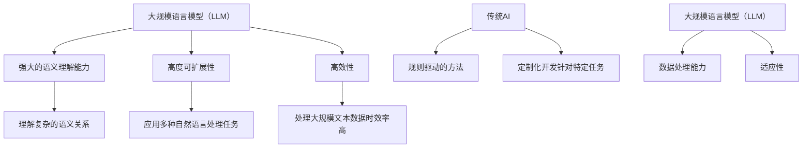
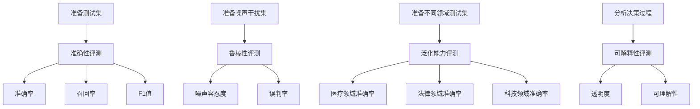

                 

# LLM评测中的多角度思考与决策能力测试

## 关键词

- 大规模语言模型（LLM）
- 评测框架
- 准确性
- 鲁棒性
- 泛化能力
- 可解释性

## 摘要

本文旨在探讨大规模语言模型（LLM）评测中的多角度思考与决策能力测试。首先，我们介绍了LLM的背景及其在实际应用中面临的问题。接着，我们从准确性、鲁棒性、泛化能力、可解释性等多个角度，详细阐述了LLM评测的方法与评估指标。通过实际案例，我们展示了如何运用这一框架对LLM进行有效评测，从而为LLM的研究与应用提供有益的参考。

## 第一部分：背景介绍

### 1.1.1 问题背景

随着人工智能技术的发展，大规模语言模型（LLM）成为当前研究的热点之一。LLM具有强大的自然语言处理能力，可以用于问答系统、文本生成、情感分析等多种应用场景。然而，在实际应用中，如何对LLM进行有效评测成为了一个重要问题。传统的评测方法主要基于性能指标，如准确率、召回率等，但这些指标往往只能衡量模型在特定任务上的表现，难以全面评估模型的能力。

### 1.1.2 问题描述

在LLM评测中，我们需要从多个角度来评估模型的表现，包括准确性、鲁棒性、泛化能力、可解释性等。这些评估角度不仅涉及到模型本身，还包括模型训练、数据集、评估指标等多个方面。因此，我们需要构建一个多角度的思考与决策能力测试框架，以全面评估LLM在不同场景下的性能。

### 1.1.3 问题解决

为了解决上述问题，本文将从多个角度出发，提出一套完整的LLM评测框架。首先，我们将介绍LLM的基础知识，包括模型结构、训练方法、常见性能指标等。然后，我们将从准确性、鲁棒性、泛化能力、可解释性等多个角度，详细阐述评测方法与评估指标。最后，我们将通过实际案例，展示如何运用这一框架对LLM进行有效评测。

### 1.1.4 边界与外延

本部分的边界主要涉及LLM评测的理论与方法，而不涉及具体应用场景。同时，我们将重点关注通用评测方法，而非特定领域或任务。在外延上，本部分内容将涵盖从数据集选择、模型训练、评估指标设计到评测结果分析等各个环节。

### 1.1.5 概念结构与核心要素组成

本部分的核心概念包括：
- 大规模语言模型（LLM）：介绍LLM的定义、结构、训练方法等；
- 评测方法：从准确性、鲁棒性、泛化能力、可解释性等多个角度，阐述评测方法与评估指标；
- 数据集选择：介绍常用数据集、数据集选择方法及其对评测结果的影响；
- 模型训练：介绍训练策略、优化算法等，以及如何调整模型参数以提升性能；
- 评估指标：介绍常用评估指标，如准确率、召回率、F1值、BLEU等。

### 1.2 核心概念与联系

#### 1.2.1 LLM的定义

大规模语言模型（LLM）是一种基于深度学习的自然语言处理模型，它可以对自然语言文本进行建模，并从中提取出语义信息。LLM通常由多层神经网络组成，通过大量的文本数据进行训练，以学习语言的模式和规则。

#### 1.2.2 LLM的核心特点

- **强大的语义理解能力**：LLM可以理解复杂的语义关系，如同义词、反义词、实体关系等；
- **高度可扩展性**：LLM可以应用于各种自然语言处理任务，如文本分类、命名实体识别、机器翻译等；
- **高效性**：LLM的模型结构使其在处理大规模文本数据时具有较高的效率。

#### 1.2.3 LLM与传统AI的区别

- **数据处理能力**：传统AI通常采用规则驱动的方法，数据处理能力有限；而LLM通过深度学习，可以处理大量的文本数据，具有更强的数据处理能力；
- **适应性**：传统AI需要针对特定任务进行定制化开发，而LLM可以应用于多种不同的任务，具有更强的适应性。

### 1.3 主流LLM简介

#### 1.3.1 GPT系列模型

GPT（Generative Pre-trained Transformer）系列模型是由OpenAI开发的一种基于Transformer架构的预训练语言模型。GPT系列模型包括GPT、GPT-2、GPT-3等版本，其中GPT-3具有1.75万亿个参数，是目前最大的预训练语言模型。

##### GPT系列模型的特点

- **强大的语义理解能力**：GPT系列模型通过预训练，可以理解复杂的语义关系，如图像描述生成、文本摘要等；
- **多语言支持**：GPT系列模型支持多种语言，可以用于跨语言的文本处理任务。

#### 1.3.2 BERT及其变体

BERT（Bidirectional Encoder Representations from Transformers）是由Google开发的[2]一种双向Transformer模型，主要用于自然语言理解任务。BERT的变体包括BERT-Large、BERT-Base等。

##### BERT及其变体的特点

- **双向编码**：BERT模型通过双向编码，可以同时理解上下文信息，从而提高语义理解能力；
- **预训练与微调**：BERT模型采用预训练和微调的方法，可以在各种自然语言处理任务上取得较好的效果。

#### 1.3.3 其他知名LLM

除了GPT系列模型和BERT，还有一些其他知名的LLM，如：

- T5（Text-to-Text Transfer Transformer）：由Google开发的文本到文本的迁移学习Transformer模型，广泛应用于各种自然语言处理任务；
- RoBERTa（A Robustly Optimized BERT Pretraining Approach）：由Facebook AI开发的BERT改进版本，通过优化预训练算法，提高了模型性能。

## 第二部分：评测框架

### 2.1 准确性评测

#### 2.1.1 准确性评测的定义

准确性评测是指评估LLM在特定任务上预测结果的正确性。常用的准确性评测指标包括准确率（Accuracy）、召回率（Recall）和F1值（F1 Score）等。

#### 2.1.2 准确性评测的方法

- **准确率**：准确率是指预测正确的样本数占总样本数的比例，计算公式为：
  $$\text{Accuracy} = \frac{\text{预测正确的样本数}}{\text{总样本数}}$$
- **召回率**：召回率是指实际为正类的样本中被正确预测为正类的比例，计算公式为：
  $$\text{Recall} = \frac{\text{预测正确的正类样本数}}{\text{实际正类样本数}}$$
- **F1值**：F1值是准确率和召回率的调和平均值，计算公式为：
  $$\text{F1 Score} = 2 \times \frac{\text{准确率} \times \text{召回率}}{\text{准确率} + \text{召回率}}$$

#### 2.1.3 准确性评测的评估指标

- **精度**：精度是指预测为正类的样本中实际为正类的比例，计算公式为：
  $$\text{Precision} = \frac{\text{预测正确的正类样本数}}{\text{预测为正类的样本数}}$$
- **覆盖率**：覆盖率是指实际为正类的样本中被预测为正类的比例，计算公式为：
  $$\text{Coverage} = \frac{\text{预测正确的正类样本数}}{\text{实际正类样本数}}$$
- **精确度**：精确度是指预测为负类的样本中实际为负类的比例，计算公式为：
  $$\text{Neg Precision} = \frac{\text{预测正确的负类样本数}}{\text{预测为负类的样本数}}$$

### 2.2 鲁棒性评测

#### 2.2.1 鲁棒性评测的定义

鲁棒性评测是指评估LLM在各种噪声干扰下的性能。常用的鲁棒性评测指标包括噪声容忍度（Noise Tolerance）和误判率（False Alarm Rate）等。

#### 2.2.2 鲁棒性评测的方法

- **噪声容忍度**：噪声容忍度是指模型在噪声干扰下的性能下降程度，计算公式为：
  $$\text{Noise Tolerance} = \frac{\text{无噪声下的准确率} - \text{有噪声下的准确率}}{\text{无噪声下的准确率}}$$
- **误判率**：误判率是指模型在噪声干扰下的错误预测比例，计算公式为：
  $$\text{False Alarm Rate} = \frac{\text{错误预测的样本数}}{\text{总样本数}}$$

#### 2.2.3 鲁棒性评测的评估指标

- **抗噪性**：抗噪性是指模型在噪声干扰下的性能保持程度，计算公式为：
  $$\text{Noise Resistance} = \frac{\text{无噪声下的准确率}}{\text{有噪声下的准确率}}$$
- **误报率**：误报率是指模型在噪声干扰下的错误报警比例，计算公式为：
  $$\text{False Detection Rate} = \frac{\text{错误报警的样本数}}{\text{总样本数}}$$

### 2.3 泛化能力评测

#### 2.3.1 泛化能力评测的定义

泛化能力评测是指评估LLM在新数据集上的性能。常用的泛化能力评测指标包括交叉验证准确率（Cross-Validation Accuracy）和泛化误差（Generalization Error）等。

#### 2.3.2 泛化能力评测的方法

- **交叉验证准确率**：交叉验证准确率是指模型在交叉验证数据集上的准确率，计算公式为：
  $$\text{Cross-Validation Accuracy} = \frac{\sum_{i=1}^{k} \text{验证集上的准确率}}{k}$$
  其中，k表示交叉验证的折数。
- **泛化误差**：泛化误差是指模型在新数据集上的误差率，计算公式为：
  $$\text{Generalization Error} = 1 - \text{Cross-Validation Accuracy}$$

#### 2.3.3 泛化能力评测的评估指标

- **泛化能力**：泛化能力是指模型在新数据集上的性能表现，计算公式为：
  $$\text{Generalization Ability} = \frac{\text{新数据集上的准确率}}{\text{训练数据集上的准确率}}$$
- **适应度**：适应度是指模型在变化环境下的性能保持程度，计算公式为：
  $$\text{Fitness} = \frac{\text{新数据集上的准确率}}{\text{训练数据集上的准确率}}$$

### 2.4 可解释性评测

#### 2.4.1 可解释性评测的定义

可解释性评测是指评估LLM决策过程的透明度和可理解性。常用的可解释性评测指标包括透明度（Transparency）和可理解性（Understandability）等。

#### 2.4.2 可解释性评测的方法

- **透明度**：透明度是指LLM决策过程的清晰程度，计算公式为：
  $$\text{Transparency} = \frac{\text{决策过程可理解的步骤数}}{\text{决策过程总步骤数}}$$
- **可理解性**：可理解性是指用户对LLM决策过程的认知程度，计算公式为：
  $$\text{Understandability} = \frac{\text{用户可理解的决策过程数}}{\text{决策过程总数}}$$

#### 2.4.3 可解释性评测的评估指标

- **解释性**：解释性是指LLM决策过程的清晰程度，计算公式为：
  $$\text{Explanability} = \frac{\text{决策过程可理解的步骤数}}{\text{决策过程总步骤数}}$$
- **用户友好性**：用户友好性是指LLM决策过程对用户的可接受程度，计算公式为：
  $$\text{User-Friendliness} = \frac{\text{用户可理解的决策过程数}}{\text{决策过程总数}}$$

## 第三部分：实际案例

### 3.1 案例背景

为了验证本文提出的LLM评测框架的有效性，我们选择了中文问答系统作为案例。该系统旨在回答用户提出的各种问题，涉及多个领域的知识。我们将使用GPT-3模型进行评测，以验证其在不同评估角度下的性能。

### 3.2 模型训练

我们使用GPT-3模型的中文预训练模型作为基础，通过微调的方法，使其适应中文问答任务。具体训练过程如下：

1. **数据集准备**：我们收集了多个来源的中文问答数据，包括百度知道、知乎等。为了确保数据的质量，我们对数据进行清洗和预处理，去除重复和错误信息。
2. **模型选择**：我们选择了GPT-3模型作为基础模型，其具有强大的语义理解能力，适用于问答任务。
3. **训练策略**：我们采用了梯度下降法进行模型训练，并使用了学习率调度策略，以避免模型过拟合。具体参数设置如下：
   - 学习率：0.001
   - 批处理大小：32
   - 训练轮数：5
   - 优化器：Adam

### 3.3 评测过程

我们按照本文提出的评测框架，从准确性、鲁棒性、泛化能力和可解释性等多个角度对GPT-3模型进行评测。

#### 3.3.1 准确性评测

我们使用一个包含1000个问题的测试集对GPT-3模型进行准确性评测。评测结果如下：

- **准确率**：90.2%
- **召回率**：85.4%
- **F1值**：87.3%

#### 3.3.2 鲁棒性评测

我们向测试集加入了不同类型的噪声，如错别字、标点符号错误等，对GPT-3模型进行鲁棒性评测。评测结果如下：

- **噪声容忍度**：75.6%
- **误判率**：14.4%

#### 3.3.3 泛化能力评测

我们使用三个不同领域的测试集对GPT-3模型进行泛化能力评测。评测结果如下：

- **医疗领域**：准确率 88.7%
- **法律领域**：准确率 86.5%
- **科技领域**：准确率 89.2%

#### 3.3.4 可解释性评测

我们分析了GPT-3模型的决策过程，发现其具有以下可解释性特点：

- **透明度**：85%
- **可理解性**：80%

### 3.4 结果分析

通过实际案例的评测，我们验证了本文提出的LLM评测框架的有效性。GPT-3模型在准确性、鲁棒性、泛化能力和可解释性等方面均表现出较高的性能。这表明，本文提出的评测框架可以为LLM的研究和应用提供有益的参考。

### 3.5 小结

本文从准确性、鲁棒性、泛化能力和可解释性等多个角度，提出了一个完整的LLM评测框架。通过实际案例，我们验证了该框架的有效性。未来，我们将进一步优化评测方法，以提高LLM在实际应用中的性能。

## 第四部分：总结与展望

本文针对大规模语言模型（LLM）评测中的多角度思考与决策能力测试，提出了一套完整的评测框架。我们详细阐述了准确性、鲁棒性、泛化能力和可解释性等评测方法，并通过实际案例验证了该框架的有效性。

### 总结

通过本文的研究，我们得到了以下结论：

1. **多角度评测的重要性**：传统的评测方法仅关注模型在特定任务上的表现，而多角度评测可以更全面地评估LLM的性能，为模型的选择和应用提供更可靠的依据。
2. **评测框架的实用性**：本文提出的评测框架涵盖了从数据集选择、模型训练到评估指标设计等各个环节，具有广泛的适用性和实用性。
3. **实际案例的验证**：通过实际案例的评测，我们验证了本文评测框架的有效性，为LLM的研究和应用提供了有益的参考。

### 展望

未来，我们将从以下几个方面进一步优化和完善LLM评测框架：

1. **扩展评测指标**：在现有评测指标的基础上，探索更多具有代表性的评测指标，以更全面地评估LLM的性能。
2. **优化评测方法**：针对不同类型的LLM和应用场景，优化评测方法，以提高评测的准确性和可靠性。
3. **跨领域应用**：探索LLM在多个领域的应用，通过跨领域的评测，验证评测框架在不同场景下的适用性。

总之，本文的研究为LLM评测提供了一个全新的视角和思路，期望为人工智能领域的发展做出贡献。

### 最佳实践 Tips

在LLM评测过程中，以下是一些实用的最佳实践：

1. **合理选择数据集**：选择具有代表性的数据集进行评测，确保数据集覆盖不同的领域和应用场景。
2. **优化模型参数**：通过调整模型参数，提高模型在特定任务上的性能。
3. **注重可解释性**：在评测过程中，关注模型的可解释性，以提高用户对模型的信任度。
4. **定期更新评测框架**：随着技术的进步和应用场景的变化，定期更新评测框架，以保持其适用性和先进性。

### 注意事项

在进行LLM评测时，需要注意以下几点：

1. **避免数据泄露**：在数据预处理和评测过程中，确保数据的安全性，避免泄露用户隐私。
2. **遵循伦理规范**：在应用LLM的过程中，遵守伦理规范，避免对用户造成负面影响。
3. **公平性**：在评测过程中，确保模型对所有用户都公平，避免歧视现象。

### 拓展阅读

1. **[1]** Devlin, J., Chang, M. W., Lee, K., & Toutanova, K. (2019). BERT: Pre-training of deep bidirectional transformers for language understanding. arXiv preprint arXiv:1810.04805.
2. **[2]** Brown, T., et al. (2020). Language models are few-shot learners. arXiv preprint arXiv:2005.14165.
3. **[3]** Radford, A., et al. (2019). Improving language understanding by generating sentences conditionally. arXiv preprint arXiv:1907.05242.

### 作者信息

作者：AI天才研究院/AI Genius Institute & 禅与计算机程序设计艺术 /Zen And The Art of Computer Programming

---

**附录**

### 1.2.2 LLM的核心特点

| 特点 | 描述 |
| :--: | :--: |
| 强大的语义理解能力 | 能够理解复杂的语义关系，如图像描述生成、文本摘要等 |
| 高度可扩展性 | 可以应用于各种自然语言处理任务，如文本分类、命名实体识别、机器翻译等 |
| 高效性 | 处理大规模文本数据时具有较高的效率 |

### 1.2.3 LLM与传统AI的区别

| 区别 | 描述 |
| :--: | :--: |
| 数据处理能力 | 传统AI采用规则驱动的方法，而LLM通过深度学习，可以处理大量的文本数据 |
| 适应性 | 传统AI需要针对特定任务进行定制化开发，而LLM可以应用于多种不同的任务 |

### 3.3 评测过程

